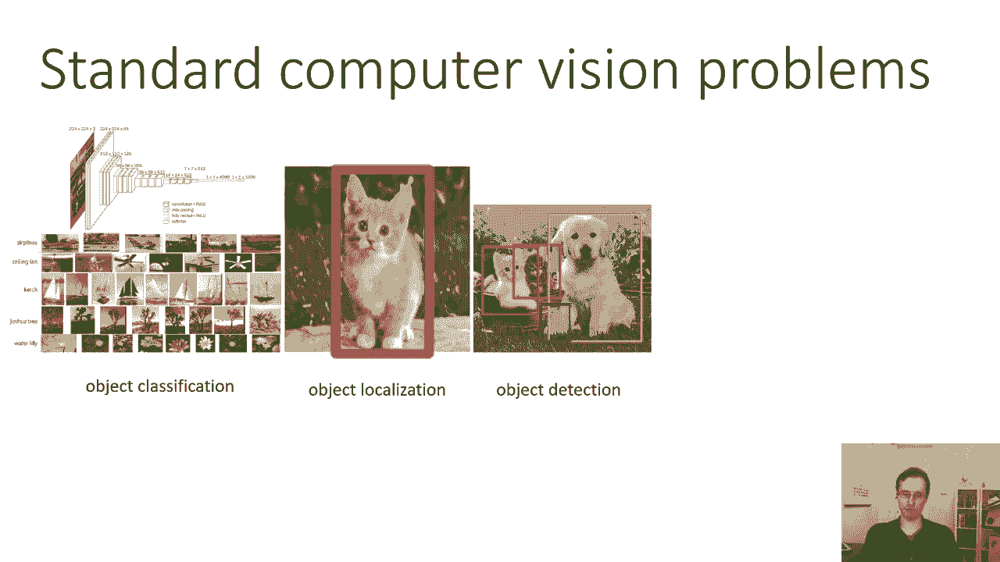
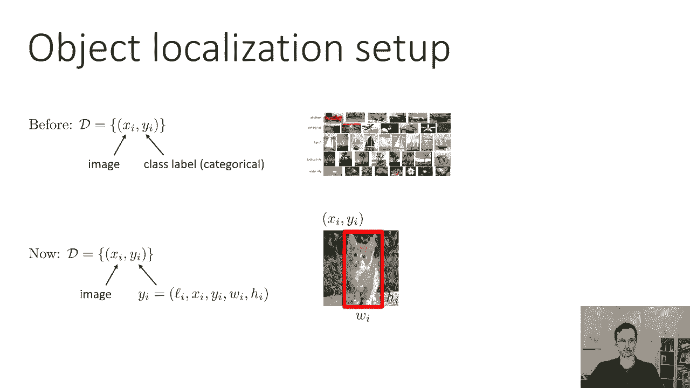
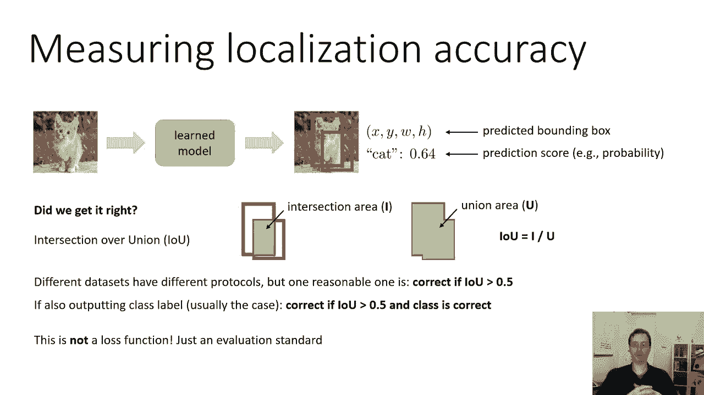

# P23：CS 182- Lecture 8- Part 1- Computer Vision - 爱可可-爱生活 - BV1PK4y1U751

欢迎来到第八讲，到目前为止在这门课程中，我们已经讨论了深度学习的核心思想，卷积，反向传播，优化的基础，今天的讲座以此类推，我们将更多地关注应用程序，今天，我们要讨论。

深度学习方法如何应用于计算机视觉中许多广泛研究的问题，特别是，结果，讲座将分为几个部分，研究不同的计算机视觉问题，会比到目前为止的讲座水平高一点，但对于每一节，我也会参考一些著名的研究论文，你可以看看。

如果你想了解更多关于这些东西是如何工作的细节，嗯，所以说，让我们开始吧，到目前为止，当我们讨论卷积神经网络时，我们已经讨论了可以将图像映射到单个输出值的网络，到目前为止，它是一个表示类的分类变量。

基本上是图像中对象的语义范畴，就像一辆自行车，一只猫或一只狗，这是计算机视觉中一个研究非常广泛的问题，也在深度学习中，这就是分类问题，为什么这很有意义的部分原因是，但如果我们真的想解决计算机视觉问题。

可能还有其他我们关心的问题设置，除了分类，比如说，如果你想要你的自动驾驶汽车，能够找出路上其他物体的位置，你不只是想分类，是否有行人或坑洞，你想弄清楚他们在图像中的位置。

您甚至可能需要一个更细粒度的检测器，您可能想知道图像中的每个像素，该位置存在哪个对象，这些问题不太适合，我们之前讨论过的分类范式，但只要稍加努力，它们就可以被深度学习方法攻击。

所以我们今天要讨论的标准计算机视觉问题，将是以下，我们有对象分类，我们已经讨论过了，所以我不会详细讨论这个，但我们将看到的许多方法，其他问题是基于我们引入的对象分类思想，但正式声明。

对象分类问题是指输出一个分类变量，意思是离散变量，指示图像中存在的对象类型，现在这个问题设置，如果我们稍微想想，是有点奇怪的，因为我们不仅要为图像输出一个标签，我们这样做不考虑对象在哪里。

所以在某些情况下，这是非常明显的，所以如果你看到一张周围什么都没有的树的照片，那么你就知道这个类是一棵树，但如果你看到一张照片，其中一个角落可能有一棵树，另一个角落里有一朵花，你管那叫树吗。

你管那叫花吗？你被迫只做一件事，有时这与世界的实际运作方式并不完全一致，一个稍微细致入微的计算机视觉问题是物体定位问题，或者更常见的是，同步分类定位，所以钢处理一个有一个物体的设置。

模型的目标是输出对象是什么以及它在哪里，以及我们指定的方式，其中通常有一个边界框，具有x的轴对齐矩形，Y位置，宽度和高度，现在这有点武断，因为，当然啦，真实的物体不是盒子，真实的物体有形状，他们有方向。

但为了简单起见，计算机视觉的一种常用表示是边界框，它只是一个X，图像中的Y位置，宽度和高度，一个更复杂的问题设置是对象检测，它只类似于对象定位，它处理世界的组合性质。

对象检测的目标是为每个对象输出边界框，你知道如何在图像中识别，所以你仍然会得到一个类列表，就像对象分类一样，但现在，而不是为每个图像预测一个类和一个边界框，你必须为每个图像预测许多类和许多边界框。

对应于存在的所有对象，在某种意义上，这个问题设置实际上更有意义，因为它实际上反映了现实世界是组合的，在大多数图像中，有许多物体存在。

我们可以把这个想法更进一步，并发展有时被称为语义分割或场景理解的东西，这不仅仅是为每个对象输出一个边界框的问题，出现在图像中的，但实际上标记图像中的每一个像素，与位于该像素的对象的语义类别。

虽然对象检测问题语句可能没有说明对象的特定形状，语义分割问题语句确实解释了这一点，所以在今天的讲座中，我们将讨论对象定位，然后检测，然后按照这个顺序进行语义分割。

从最小的细节到最大的细节，所以让我们来谈谈对象本地化，因为它是，你知道吗，相当直截了当，而且很合身，更整齐地进入我们到目前为止讨论过的范例，然后我们将扩展到对象检测，所以在我们做常规分类之前。

我们的数据集由元组x组成，i，y i，数据集中的第1张图像，y i是i，第标签，这是一个分类变量，现在我们仍然有一个x的数据集，i y i元组，但为什么我现在更复杂，为什么我现在是它自己。

由标签Li组成的小列表，包围盒的x和y位置，边框的宽度和高度，所以图像是像素数组，该图像的相应标签包含五件事，语义范畴，猫狗，公共汽车或自行车，它的包围盒的x和y位置，以及它的边框的宽度和高度。

所以你知道x和y可能是左上角的位置，经常也是，人们实际上使用边界框中心的位置，宽度和高度，或者以像素为单位的宽度和高度，顺便说一句，这些都是基于图像的，所以到目前为止，我们实际上还没有考虑到现场是三个。

d，我们也可以这样做，这是一个相当不同的问题设置，但目前一切都在图像空间，这意味着所有的坐标，宽度和高度用像素表示。

在我们真正讨论方法之前，呃，我们应该谈谈如何测量定位的准确性，当我们做对象分类的时候，测量精度很容易，因为我们可以说，嗯好吧，你，如果你上对了课，你就对了，如果你上错了课，你就错了。

你想知道你得到正确答案的图像的百分比是多少，当我们在做本地化的时候，我们当然需要更详细地说明这一点，因为我们不只是想知道我们是否得到了正确的班级，我们想知道我们把边界盒放在正确的地方。

但当然不一定要完全正确，就像如果它偏离了几个像素，也许这已经足够好了，所以在高水平上，我们的本地化模型将是一些学习的模型，会拍到一张照片，它将输出一个语义类别和边界框，所以可能这个模型不是很好。

它输出了这个紫色的边框，它把课弄对了，它说这是一只猫，好的，所以它输出五件事，一个班，a x a y a w和a h，所有的权利，所以呃，通常，该类与分数相关联，比如概率，然后我们想说好。

这是正确的定位吗，或者不是，现在回答这个问题实际上是个惯例问题，因为你知道如果你真的把这个系统用于一些下游应用程序，就像你真的想让一辆自动驾驶汽车驾驶一样，最终，你不太关心边框是否在，恰到好处的地方。

你关心的是这辆车是否成功地行驶而没有发生事故，所以在某种意义上，在这里量化准确性实际上更多的是一种度量，方便和惯例的问题，但是有一些约定是很重要的，所以如果我告诉你我的模特这么好。

你就会明白那是什么意思，因此，对象本地化中的一个常见约定，以及目标检测是使用一个叫做并上交集的度量，这里的直觉是这样的，我们想说定位是正确的，如果有很高的重叠，在红色的真实边界框和紫色的预测边界框之间。

如果物体较大，重叠的面积总是比较大，即使你的边框放错了地方，所以如果物体很小，也许你把边框放在了几乎正确的地方，但是有点偏，而是因为它太小了，重叠的实际面积很小，但如果猫像这里一样占据了大部分图像。

如果你只是得到计数，你知道左耳上方，也许重叠实际上就像你有一个微小的物体一样大，但你当然不想只是到那里，你想把整只猫，所以说，相交于联合的想法是基本上量化盒子重叠的程度，同时控制它们的绝对大小。

所以交集指的是两个边界盒的交集面积，和并是指两个边界框的面积之和，在联合上的交集实际上只是我被你除以，所以这个想法是并集上的交集总是在0和1之间，因为交集永远不能大于并集，它接近一个。

如果交集接近两个边界框的总面积，如果交点可以忽略不计，它就接近于零，但不受边界框实际绝对大小的影响，所以它们可能很小，或者它们可能很大，那不会有什么不同，通常我们会计算并集上的交集。

然后我们会说本地化是正确的如果我们得到了正确的类，并集上的交集大于某个阈值，一个常见的阈值是说它现在大于零点五，一般来说，如果你在做标准的计算机视觉基准测试。

您正在使用的特定数据集将具有与之相关联的一些协议，所以它会说你知道，获取我们的数据集，如果IU大于零点五，你应该报告正确，或者如果你用的是可可之类的东西，也许他们实际上要求你报告不同iou值的准确性。

所以你可能会在零点五报告你的准确性，在零点七，以此类推，所有的权利，所以这是基本的想法，也输出类标签，通常情况下，如果IU大于零点五，我们就会说我们是正确的，班级现在是正确的，至关重要的是。

这不是损失函数，我们实际上并没有就iou对我们的网络进行培训，这只是一个评价标准，这是社区中的一个惯例，人们用来评估他们的模型，我们实际上不和IU一起训练，因为iou很难通过优化，我们用其他指标训练。

