# 【双语字幕】伯克利CS 182《深度学习：深度神经网络设计、可视化与理解》课程(2021) by Sergey Levine - P2：CS 182- Lecture 1, Part 2- Introduction - 爱可可-爱生活 - BV1PK4y1U751

所有的权利，所以呃，在今天讲座的下一部分，我们要复习一些，基本课程概述和一些课程政策，所以欢迎，到CS W一八二或二八二一个设计，可视化和理解深度神经网络，或者我们可以称之为深度学习班。

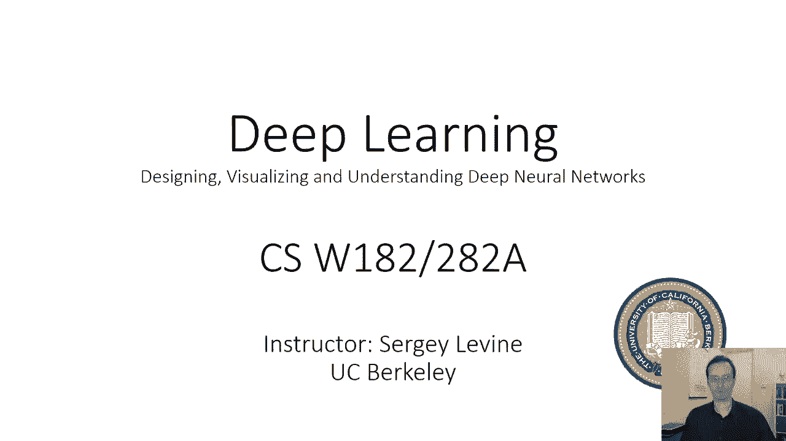

我们将在本课程中讨论的内容有一个简短的概述，呃，我们将讨论甘斯，我们将讨论如何生成人脸，如何把老虎变成猫。

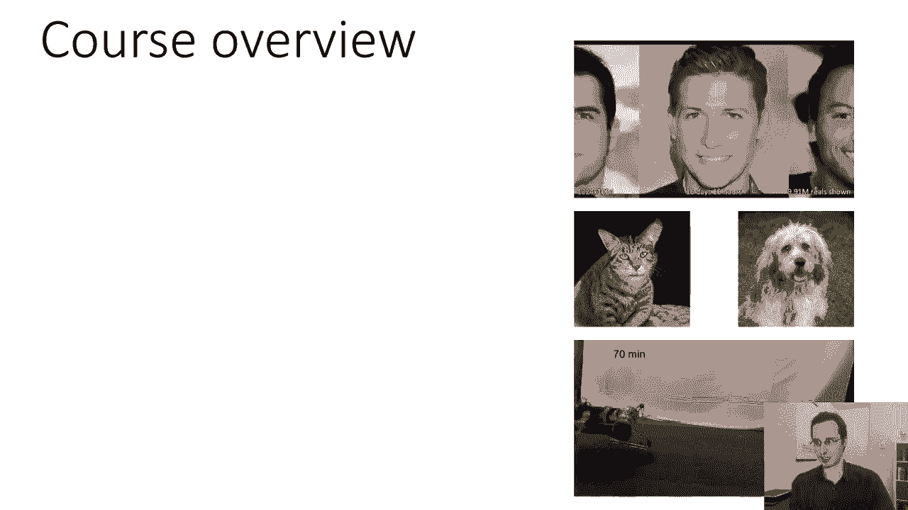

以及如何让机器狗走路，所以这门课真的是为了给你，深度学习世界的现状，我们将讨论神经网络体系结构，我们将讨论优化算法，我们将讨论一些应用程序，我们将介绍自然语言处理中的应用和计算机视觉。

我们可能会讨论强化学习的其他几个领域，我们将讨论如何使用深度神经网络来学习行为，我们将讨论一些高级主题，嗯，我仍然不知道这些主题到底是什么。

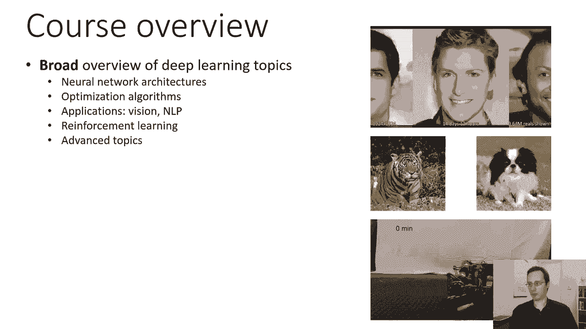

也许我们会讨论迁移学习或元学习，或者其他很酷的东西，嗯会有四个家庭作业。

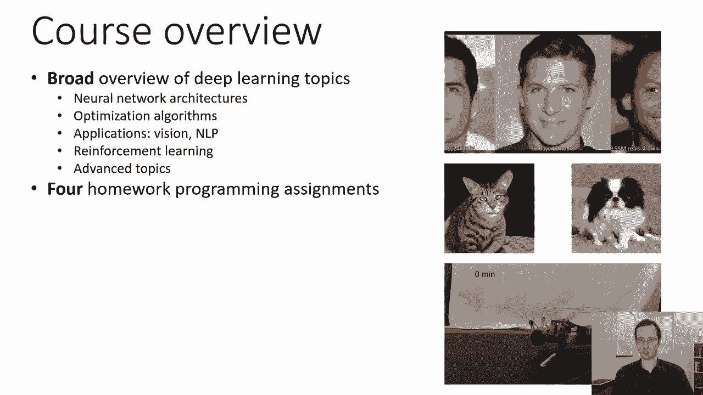

它们将是编程任务，这些作业需要你写一些代码，并确保代码实际工作。

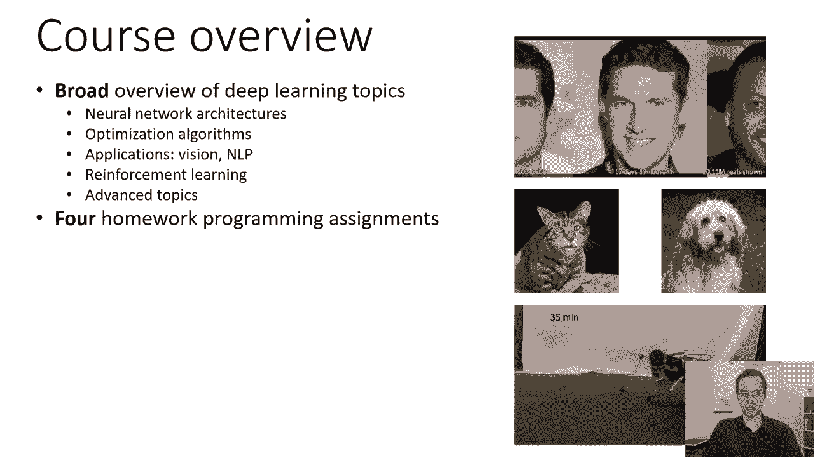

所以你将实现一些神经网络的基础知识，你喜欢沙科塔吗，一些conv网络和一些神经网络和反向传播，诸如此类的事情。

我们将有一个关于卷积网络的家庭作业，和递归神经网络，呃，所以最有可能的是，这项任务将涉及。

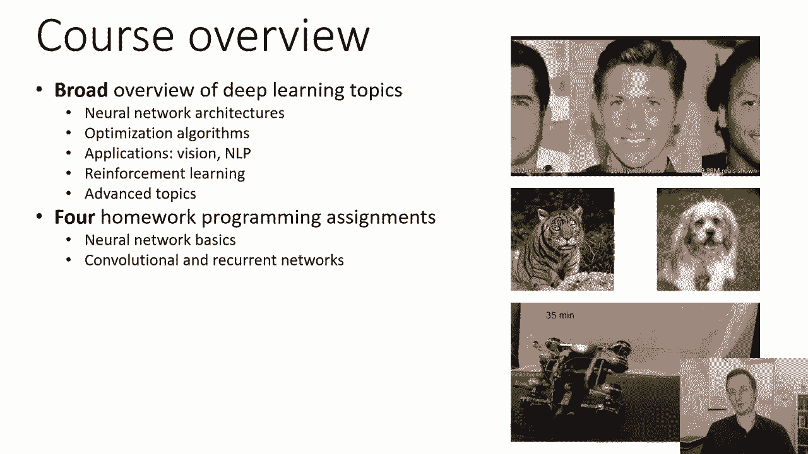

嗯，实现某种类似图像字幕的系统，必须读取图像。

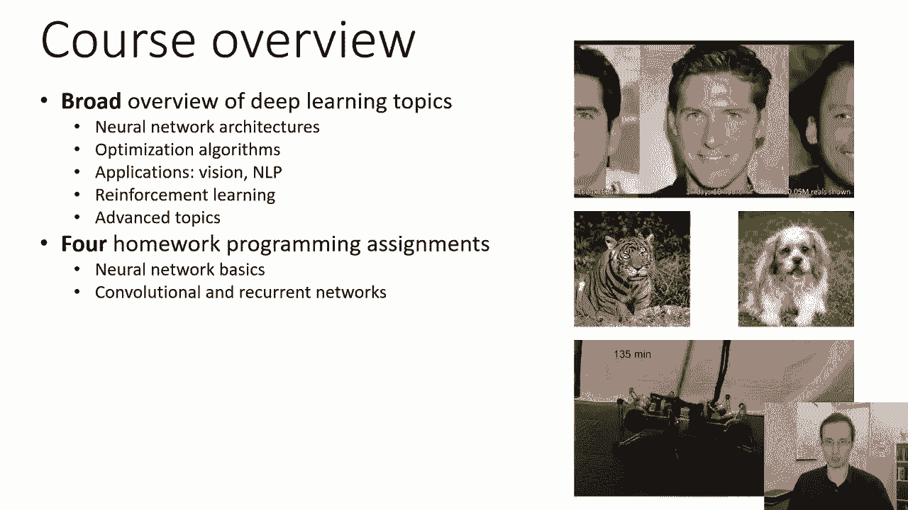

也许产生文本，我们将有一个关于自然语言处理的作业，然后我们会有一个关于强化学习的作业，这门课有两次期中考试。

呃，特定的格式现在是TBD，我们在想我们可能会让他们在家考试，但这还有待决定，所以我们有两次期中考试。

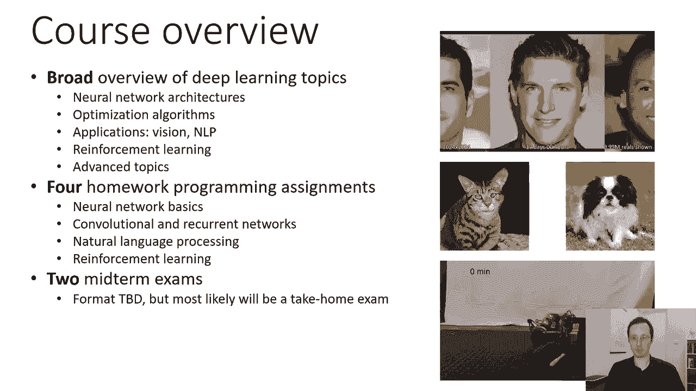

然后我们会有一个最后的项目，最后的项目很重要，这将占你成绩的很大一部分，这是一个集体项目，我们建议两到三人一组，就家庭作业而言，这是课程中最重要的部分之一，最终项目的规则会略有不同，如果你在CS一八二。

你可以从三个主题中选择本科版本的课程，计算机视觉，nlp或强化学习，我们会给你一些材料让你开始，如果你在1982年的研究生版本中，最终的项目更多的是自我指导和开放的，呃，最终项目，我们将发布相关说明。

可能几周后，课程政策，所以这门课的分数将占期中考试的30%，所以每次期中考试将占你期末成绩的15%，呃，百分之四十给你的编程作业，所以每个家庭作业是成绩的10%，然后30%将取决于最终的项目。

所以期末项目占了你成绩的很大一部分，这相当于两次期中考试的总和，所以你一定要确保尽早开始你的最终项目，事实上，你应该自由地开始和你的一些同龄人交谈，组成小组，你知道吗，即使是现在，嗯。

一些后勤方面的事情，呃，迟交保单，别迟到，你应该按时完成作业，但如果，你没有按时完成任务，你有五天的休息时间，滑动日总是四舍五入到最近的一天，所以如果你的任务是，呃，你知道晚了一个小时。

那是一个失误的日子，如果你在一学期中使用超过五个，然后你交了一些迟到的东西，然后你就会得到一个零，所以绝对不要超过那些滑倒的日子，我不建议使用滑动日，除非你真的真的必须喜欢，救他们。

因为当事情真的出错时，当你有紧急情况时，当你真的需要他们的时候，别过早用完，绝对不要在第一次布置家庭作业时就把它们用光，所以我们有严格的迟到政策，除了滑倒的日子，绝对没有懈怠，所以一定要坚持下去。

对于最后的项目，由于评分截止日期，没有滑动日，所以你想按时上交你的期末项目，课程的先决条件，嗯，你应该有很好的微积分和线性代数知识，这非常非常重要，所以深度学习中的许多材料都非常依赖线性代数。

你想很好地熟悉多元微积分，因为我们在深度学习中使用的许多优化算法，利用多元导数，所以当涉及到多元导数时，你应该特别扎实，那么如何求矩阵向量表达式对向量的导数呢。

你应该在矩阵运算和求解线性系统方面非常扎实，所以呃，如果你不确定，嗯，你知道吗，也许呃，第二、三堂课注意，当我们谈论机器学习的基础时，以及反向传播和梯度下降的基础，如果从数学的角度来看。

那里的事情看起来真的很难，然后也许重新评估您是否真的需要先决条件，如果你不确定，请随时来和我或助教谈谈，你应该有很好的概率论知识，CS 70或统计一三四，嗯，CS 70只是勉强涵盖了你需要的概率。

你大概可以用CS 70通过，但要做好准备，那就有点难了，你可能需要温习一下概率论，你当然应该知道如何处理连续随机变量，高斯分布或正态分布，多元正态分布，诸如此类的事情。

我们推荐CS 189或非常强的统计背景，所以我们将在这门课程中涵盖很多机器学习的基础知识，但我们会很快覆盖它们，所以我们基本上会涵盖C29涵盖的内容，但在一次演讲中，强烈推荐你服用CS 189。

或者有很强的概率论和统计学背景，所以你可能会对事情的节奏有一个想法，在第二课和第三课中，所以如果在第二课和第三课中，你感到很失落，你还没有上过八十九，也许拿CS 189是个好主意，在选修本课程之前。

当然，我们要求你能够编程，所以呃，我们希望你拿CS 601B或类似的东西，并且能够用Python编写流畅的代码，如果你对这里的事情不确定，呃，你知道一个快速获得感觉的好方法。

对于你是否知道你已经得到了雷克斯是开始家庭作业，一个一旦释放，这将是，嗯，很有可能，两周后，早点开始，看看是否很难，还是进展顺利，所以在讲座的下一部分，我们将讨论以下问题，呃，什么是机器学习。

什么是深度学习，你们中的许多人可能已经知道这个问题的答案是什么，但你可以想到一个非常基本的机器学习问题，用这样的东西，你有一张照片，也许你有这只小狗的照片，你想写某种计算机程序来产生一个对象标签。

拍一张照片告诉你，你知道的，它到底有没有小狗，或者它有一只小狗、一只猫或一头大象，所以你可以试着把这个计算机程序编码出来，你可以，呃，你知道吗，写一些if语句和一些，呃，和一些代码之类的东西。

在你对小狗分类器的最大尝试中，但是你如何实施这个计划，嗯，就像你说的，这很难，嗯，你对小狗有一些了解，就像他们有两只耳朵，两只眼睛，一个鼻子和一个舌头对吧，但耳朵是什么，什么是眼睛，什么是鼻子。

以及如何从图像中的像素中检测它，计算机视觉的许多早期工作实际上试图采用这种方法，并试图描述一个，你知道图像是如何工作的，它们是如何由于世界上的几何学而产生的，照明等的效果实际上是在一个。

你知道一些代码会试图颠倒这个过程，这种方法被证明对计算机视觉不太有效，但它在计算机图形学上确实很棒，所以虽然计算机视觉和计算机图形学的许多早期工作有很多共同点。

大部分的工作最终以你今天看到的计算机图形系统而告终，当你看电影或玩电子游戏时，在计算机视觉的许多工作中并没有真正出现，当涉及到真正识别小狗和照片时，所以也许我们想要一个更好的方法来创建这个程序。

也许我们不想手写，你可以想出一个函数，这就是程序是程序，作为一个函数，作为将输入转化为输出的一套规则，这是一个明显的说法，对呀，函数将输入转化为输出，程序是函数，因此，程序使用一些规则将输入转化为输出。

有时我们可以手工定义这些规则，当你编写程序时，这就是编程的本质，您正在定义将输入转换为输出的规则，问题是像这样的问题比如识别这只小狗，控制从输入到输出转换的规则相当复杂，他们有大量的例外。

它们可能没那么复杂，算法上，它不像编写代码那样复杂，代码的执行类似于图形搜索或其他什么，但这实际上是它们如此难以编程的原因，我们很擅长写简单的规则来创建一个很深的堆栈，递归算法，诸如此类的事情。

这些都很棒，因为代码真的很短，但是这个程序做了一些非常复杂的事情来识别小狗，正好相反，这个程序可能很肤浅，但有一大堆例外，这就相当于一个巨大的开关语句，或者一个巨大的if语句。

另一个问题是我们实际上不知道规则，所以即使我们坐下来写这个庞大的程序，认出小狗，我们不知道规则是什么，我们得像小狗专家一样问，或者你怎么知道的，摇尾巴，他们的耳朵应该有多松软，我们事先不知道规则。

规则太复杂了，他们有太多的例外和太多的特殊情况，所以写小狗探测器实际上很难，所以也许不是手工定义输入输出关系，我们可以定义一个从数据中获取这种关系的程序，和小狗一起看，为你想要的东西举例子要容易得多。

而不是在规则方面指定你想要什么，所以如果我要加两个数字，对我来说编码很容易，你知道的，x加y等于z，所以对我来说，举一堆例子是愚蠢的，你知道的，二加二等于四，二加三等于五，等等等等等等。

这不是一个很容易的方法，但小狗的情况正好相反，对我来说可能更快，出去拍一群小狗，比试图编码这个小狗探测器，所以关键的想法是，如果描述输入如何映射到输出的规则很复杂，而且充满了特殊情况和例外。

那么提供数据或示例比手工实现这些规则更容易，我知道我在这里说的很多话都是，你们可能已经知道了，因为你知道，从例子中可以很清楚地看到，我要做什么，我确实认为考虑这些基本问题是很重要的，这真的是关于情况。

其中控制从输入到输出转换的规则是复杂的，而且充满了特殊情况和例外，这就是为什么我们想使用机器学习，所以机器学习不是，你知道这不是什么魔法，这不是每个问题的正确解决办法。

它是问题的正确解决方案或输入和输出之间的关系，复杂且充满特殊情况，这样我们就更容易提供例子，而不是手工执行这些规则，现在你可以在这里问一个问题，你知道一些你学会做的事情，你可以按照一些说明，说明可能是。

如果你在这种情况下，那就做你有的，你可能有一个清单，对呀，如果你是飞行员，如果你如果你开客机，你得到一份清单，你有规则，你得到指示，但对于其他事情，你更喜欢从例子中学习。

如果你必须处理复杂和不可预测的情况，如果你是人质谈判代表，有一些规则，也有很多练习，你可能，呃，角色扮演一些示例场景，对呀，你想要，你想通过例子，经历可能的情况，然后试着用更直观的方式提炼出这些规则。

所以也许这些想法中的一些也适用于人类和动物的学习，好的，那么我们实际上学到了什么，或者更确切地说，我们的机器将在哪里学习得很好，好的，小狗是相当复杂的，所以呃，这是一个很好的例子，真的很可爱，但是呃。

我们一开始应该用一些更容易管理的东西，所以让我们从这个问题开始，你有二维的点，你想知道它们是X还是O，所以在这种情况下，你正在学习从两个点映射的函数，d到x或o的标签可能只是y，那么你在学什么。

你在学一句台词，但是这个计算机程序是什么，计算机程序可能是这样的，如果x在线下，然后圈其他x向右，那是一个计算机程序，下面的这个函数可以这样实现，取第一维乘以θ1，取二维空间乘以θ2，加上θ3。

如果小于或等于零，然后报告为真，否则报告为假，所以这是一个计算机程序，但是这个计算机程序有一些参数，我用幻灯片上的代码，这不足以完全指定此程序，因为我还没告诉你，θ2和θ3是。

所以你可以把机器学习看作是一个带有一些自由参数的计算机程序，在这种情况下，θ1的参数，θ2和θ3，这个方程描述了一条线，所以学习意味着弄清楚如何设置这些θ1，θ2，和θ3，以便程序给你正确的答案。

所以我们学习的是θ1，θ2，θ3，或者你也可以称之为向量θ，它有三个元素，当你称之为向量时，然后你也可以表示一条线的这个方程，当x转置θ小于或等于零时，在这里，你只需要假设你在第三个位置附加一个。

所以x向量是x 1，x2，然后一个，它将被训练和乘火车，我是说西塔会被选中，这样这个东西就能给出正确的答案，这就是学习的过程，所以呃，一般情况下，呃，我们有一些参数化函数，我们可以称这个函数为f。

它实际上是两个参数的函数，它接受x，这是我们的输入，它吸收了θ，这是我们的参数，它产生了答案，y，然后参数θ，这些都是学到的东西，嗯，y是输出，如果是分类问题，那我们就叫它标签，x是输入。

我们经常会看到这些类型的函数用参数作为下标编写，所以当我写f时，下标θx=y，我只是用它来让它更清楚一点，θ是f的参数，但实际上这只是另一个争论，至关重要的是，f x的θ几乎可以是x和θ的任何表达式。

所以这里我们有一个非常简单的数学，它只是一个if语句，里面有一行，但你可能是更复杂的东西，你可以让它是一个大的复杂的程序，有很多参数，或者你必须是一个非常简单的程序，有很多参数。

你可以有一个由θ右表示的巨大矩阵，所以有很多选择，你可以做一个。

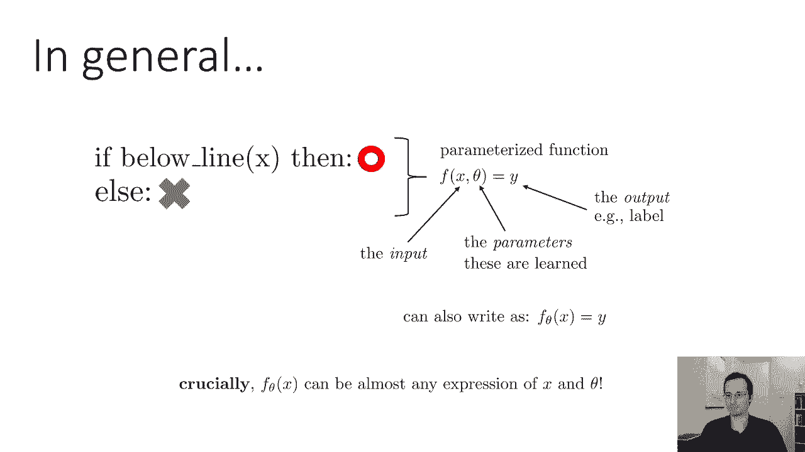

那么我们应该做出哪种选择呢，我们使用什么参数化，嗯，如果我们想给小狗分类，我们用什么，嗯，麻烦来了，小狗看起来很不一样，而且是的，我承认我只是在做这张幻灯片的时候，我只是在找可爱小狗的照片。

事实上我就是这么做的，它们看起来都不一样，甚至小狗的部分看起来都不一样，所以你可以说，嗯，也许小狗有两只耳朵和两只眼睛，但他们的耳朵看起来总是不一样，他们的眼睛看起来不一样，那是一只小狗吗。

它还有两只耳朵和两只眼睛，所以有很多歧义，有很多复杂性，当我们看这些照片的时候，我们看到零件和物体，我们看到颜色，当电脑看图片时，它只是看到一大堆数字，这些数字本身没有任何意义，所以想想这个。

同样的方法，我们考虑把X和S分开，它可能不会让我们在X和O上走得很远，我们可以在x y平面上画一条简单的线，把两个类分开，但我不认为这会把小狗和，从这里的猫，所以我们需要更强大的东西。

我们需要一个不同的参数化函数，人们对此的看法是如此经典，我会轻蔑地称之为肤浅的学习，我不是想侮辱任何人，我只想把它作为与深度学习的对比，这就是我们要讨论的，所以如果它不深，一定很浅。

但你不要把这看得太字面化，也许称之为基于特征的学习更准确，传统上人们对此的看法，下面是，我们将把我们的fθ表示为一个固定函数，意思是没有学过的函数，从x中提取一些特性，然后在这些功能之上。

我们将用学习到的参数执行一些简单的操作，例如，从x转置θ之前的from的线性分类器，有一件事真的很好，它是，很容易想到，学习θ实际上很容易，我们实际上会描述一种方法来做到这一点，从现在开始的几堂课。

所以也许我们可以保留那部分，但不是把整个图像x插入线性方程，我们将插入X的一些特性，可能有什么特点，嗯，也许这些特征描述了提取边缘或角落的某种方法，甚至更复杂的东西。

也许我们甚至可以编码一个完整的耳朵探测器或眼睛探测器，也许，我们可能有一些特征强烈表明眼睛和耳朵的存在，我们手工设计的，一类特征，比如说，在计算机视觉中经常使用的是一种叫做定向梯度直方图的东西。

定向梯度直方图中的思想如下，在图像中提取边缘非常容易，有很好的边缘检测算法，所以你可以做的是你可以拍一小块图像，找到所有的边缘，然后构造一个直方图来描述这些边的方向，所以如果你看到很多水平边缘。

那么直方图对于水平线有很大的值，如果你看到很多垂直的边缘，那么它对垂直线有很大的价值，如果你看到很多对角线，你明白了吗，你在图像的小块上这样做，然后你构建了一个低分辨率的图像。

其中每个框包含这些渐变的直方图，而不是像素值，这很好，因为，通常很多物体的形状比其他任何东西都更能决定它们，边缘捕捉了一些形状的概念，因此，这些都是用于下游分类的好特性，这种特征提取方法，我们可以想到。

作为手写规则和机器学习之间的一种妥协，我们不把规则交给程序，但我们确实手工编程功能，所以也许我们不知道如何准确地检测，照片里是否有一只小狗，但我们知道哪些部分很重要。

也许我们可以手动编写一些规则来检测这些部分，然后在功能之上学习真的很简单，就像前面的两个D例子一样，这种方法的问题是，想出好的特性是非常困难的，在某些情况下，就像电脑视觉。

人们花了很多年研究如何构建好的特征，有一些很好的语音识别选择，在声学和语音形成方面有很多工作要做，所以人们可以设计出很好的功能，但在其他领域，设计好的功能要困难得多，数据类型非常特殊的域。

我们需要做一些奇怪的事情的领域，就像你知道的。

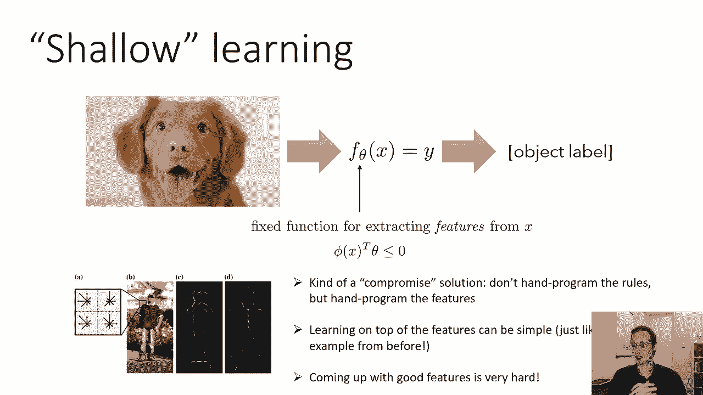

翻译低资源语言，例如，那么从浅层学习到深度学习是什么样子的在浅层学习中，我们从我们的输入开始，我们有一些手工编码的特征，然后我们在这些特征上有一些学习到的参数，所以所有的参数都在最后。

如果挑战是在功能编程方面，嗯，如果我们把一些学过的参数也放进去呢，如果x的phi不仅仅是编码的函数，如果x的phi本身有一些自由参数呢，因此，而不是手动编程的功能，我们已经了解到，问题是。

一旦我们可以自动学习特征，我们可以把很多层的特征，这就是为什么它被称为深度学习，因为深度学习有很多层。

所以我们会有一只小狗的照片，我们将有第一层学习到的特征，这将把小狗的照片变成一些学习的代表，然后我们会有另一个转变，把它变成一个更高级的表示，等等，等等，这里的每一个箭头。

图中的每个黄色箭头表示一个简单的参数化转换，前一层的一个简单函数，但是因为我们正在组成许多这些简单的函数，结果函数总体上可能相当复杂，它可以学习每一层的表示，还记得我们一开始谈到的那些表示吗。

思想的表现，思想的，抽象概念的，下面是一些通过深度网络学习到的实际表示的图片，这是一篇经典的论文，按代码，袖子，数组和墨水，在这里你可以看到最低级的功能，看起来有点像边缘。

这些有时被称为Gabor过滤器，众所周知，灵长类动物大脑的区域，在哺乳动物的大脑中也是如此，它处理早期的视觉信号，还包含功能，很像这些定向的边缘，这并不一定是因为大脑的工作方式与深网相同，但是。

这是因为这些特征对于识别图像中的东西非常有用，然后中间层的特征，这是一个人脸检测系统，看起来像脸的一部分，你可以看到一些眼睛和耳朵，这些不是小狗的眼睛或小狗的耳朵，要么人性化的人耳，不幸的是。

我找不到小狗探测器的功能，然后最高级别的特征看起来像物体和部件，你可以看到额头和下巴之类的东西，显然也有一些摩托车和汽车，我想这里也有汽车和摩托车，我不知道，或者人们脸上贴着汽车和摩托车，不管怎样。

但无论如何，显然似乎有一些高级物体，就像里面发生的事情，因此，更高级别的表示将比原始像素更抽象，他们会更不受滋扰，那是什么意思，嗯，底部的小狗还是小狗，如果它面朝不同的方向，或者它的照明不同。

或者是在不同颜色的背景上，所以这些变量我们称之为讨厌变量，因为他们只会妨碍产生正确的答案，所以我们想忽略他们，我们希望得到陈述，与背景颜色或照明方向不变的，这样我们就可以专注于重要的事情，就是小狗，嗯。

当然还有，这些更高级别的表示使预测标签变得更容易，就像之前小狗的照片一样，这些小狗的低级像素看起来都很不一样，但是高层，高水平的演示是鼻子、耳朵或眼睛的存在，更能说明小狗的存在，也更可靠。

所以我们想得到那些更高级别的表示，这就是深度学习将帮助我们得到的。

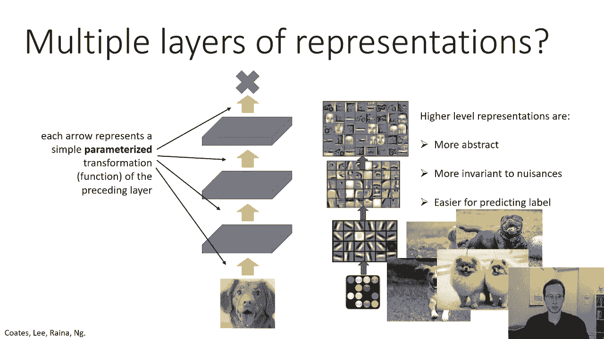

好的，那么什么是深度学习，嗯，它是具有多层学习表示的机器学习，所以我们想要陈述，我们想从我们的数据中自动获得它们，就像在例子中一样，用以前的多语言翻译，表示从输入到内部表示再到输出的转换的函数。

通常是一个深度神经网络，这个语句实际上有点循环，因为几乎所有具有学习参数的多层参数函数都可以称为神经网络，所以稍后会有更多关于这个的信息，但不要让神经网络这个术语把你弄糊涂了，你可能会说嗯。

神经网络是什么，和神经元有关吗，和网络有关吗，我现在就告诉你，差不多，任何具有多层表示的参数函数都可以称为神经网络，以这样或那样的方式，每一层的参数通常都是针对总体任务目标进行训练的，但并不总是这样。

小狗的表现，中级的低级，高级表示不仅仅是优化的，任何旧的方式，他们被优化以使网络尽可能准确，发现小狗，情况并非总是如此，我们将讨论单独学习表示的方法，然后学会预测兴趣的数量，但深度学习通常效果很好。

当所有的表征一起学习以便得到正确的答案时，这有时被称为端到端学习，这叫做端到端学习，因为模型的每个部分都经过了训练，这样最终它就会产生正确的答案，现在这似乎是一件显而易见的事情，但当然。

如果你回想一下以前的特性工程方法，当我们手工设计特征时，我们不一定优化这些特性来给出正确的答案，我们宁愿用我们的。

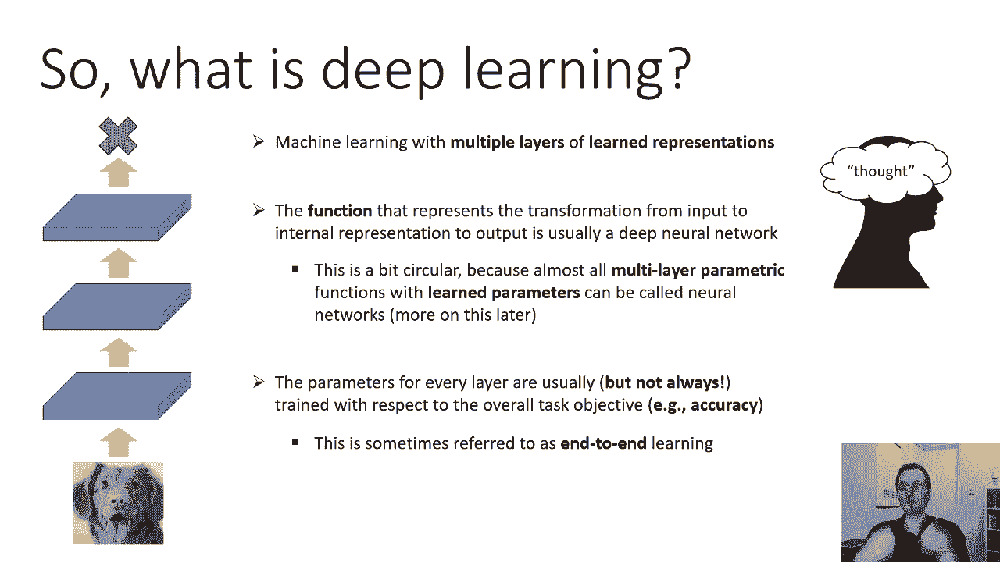

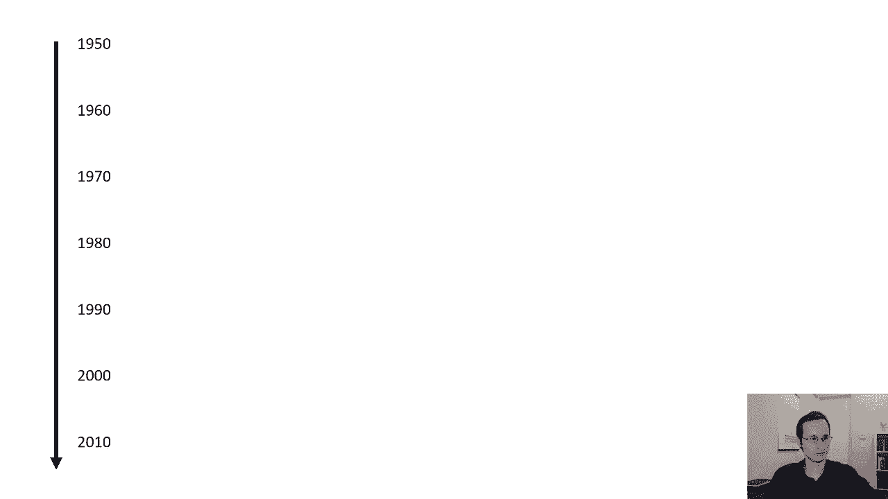