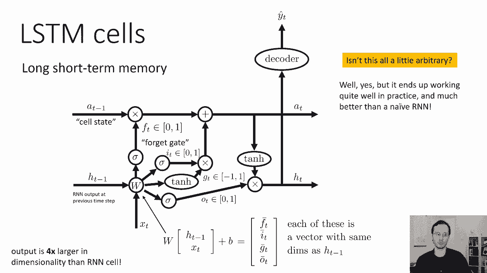
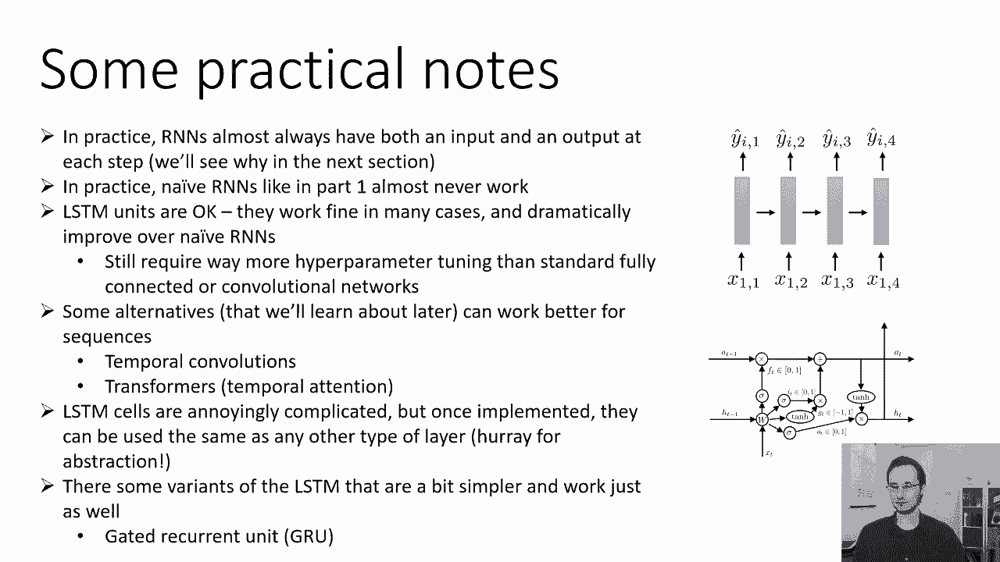

# 【双语字幕】伯克利CS 182《深度学习：深度神经网络设计、可视化与理解》课程(2021) by Sergey Levine - P31：CS 182- Lecture 10- Part 2- Recurrent Neural Networks - 爱可可-爱生活 - BV1PK4y1U751

现在我们已经讨论了rnns如何工作的基本知识，让我们来谈谈我们如何有效地训练他们。

所以RNN在最基本的层面上是非常非常深的网络，事实上，你知道吗，我在这些幻灯片中使用的很多例子都有长度序列，你知道三到五个，在实践中，我们可以使用长度序列为100甚至1000的RNN，所以在这一点上。

他们变成了非常非常深的网络，以及参数与不同层共享的事实，也使计算更具挑战性，你可以把它看作是一个参数，第一步的参数对下游的东西有巨大的影响，因为这些影响叠加在一起。

而最后一次步骤的参数可能有相对较低的影响，这就产生了一些数字问题，所以想象一下我们的序列长度，那是一千多英镑，就像背部通过一千多层传播一样，我们之前看到，如果我们应用链式法则，这和乘法是一样的。

一大堆不同的矩阵，如果我们乘以许多，许多数字加在一起，如果有足够的数字，我们只能得到两样东西，如果数字都小于1，然后我们得到零，如果他们都大于一个，然后我们得到h无穷大，所以我们只得到合理的答案。

如果我们乘的所有数字都接近1，我们在乘以什么，当我们把所有这些层的雅各比人倍增的时候，所以我们希望这些雅可比的特征值接近1，如果他们不接近一个，那我们就有麻烦了，如果他们很低，如果他们少于一个。

然后我们得到所谓的消失梯度，这意味着梯度的大小呈指数下降，用层数，如果它们大于一个，然后我们得到所谓的爆炸梯度，这意味着梯度的大小随着层的数量呈指数增长，为什么是指数级的。

或者是因为我们把所有这些数字相乘在一起，所以如果我们有五层，他们每个人都有，你知道的，c阶特征值，那么就系数而言，这是C的五分之一，所以它的步数是指数级的，所以我们真的想得到这些雅各布人的特征值。

接近一个，如果我们能做到的话，现在，爆炸的梯度并不太难处理，因为我们总是可以剪辑渐变来防止它们爆炸，rnn最大的挑战来自渐变的消失，这些现在是一个很大的问题。

在我们的RNN中消失的渐变实际上有一个相当简单的，直观的解释直观的，如果你的渐变消失了，这意味着来自后面步骤的梯度信号永远不会到达前面的步骤，所以你在时间上有一些损失。

这种损失对网络在第三步时的工作几乎没有影响，当这种情况发生时，你的神经网络变得无法维持记忆，所以也许你在第三步看到了一些东西，这是非常非常重要的，以便在第900步得到正确的答案。

但如果时间步长900的梯度信号，永远不会回到时间第三步，那么网络就永远不会知道它需要在第三步的时候记住那件事，这样他们就可以在900步的时候使用它，这是非常糟糕的。

这阻止了RNN基本上从一开始就记住事情，所以我们真的真的想解决这个问题，不知何故。

那么我们可以做些什么来促进通过RNN井的更好的梯度流动，与我们以前看到的相似的基本思想，我们真的希望现在的梯度接近一个，我们特别讨论的是哪个梯度，在每一层，我们要做手术，我们要串联以前的激活。

注意这里我用ts替换了所有的l，只是为了保持惯例，所以我们要把x和t减1连接起来，应用我们的线性运算，然后应用我们的非线性，我们可以称之为RNN动力学函数，让我们用字母Q来表示它，Y Q井。

因为我的信很快就用完了，我需要用F做其他事情，所以我要叫它Q，所以这个运算可以说这是a t等于q，应用到t减一和x t，这是RNN动力学基本上是控制，上一个激活如何变成下一个激活，当我们谈论消失梯度时。

我们关心的特殊导数，是RNN动力学的雅各比，也就是dq d a t减去1，q相对于以前激活的导数，我们会，你知道的，如果我们只关心良好的梯度流动，我们真的希望这个导数接近同一性。

或者至少有接近1的特征值，因为如果是这样的话，那么梯度既不会消失也不会爆炸，因为把一堆单位矩阵相乘，给你另一个矩阵，那就是单位，把一堆有特征值的矩阵相乘在一起，一个会给你一个接近于1的特征值矩阵。

所以最好的梯度流动是，如果这个雅可比的特征值为1，如果现在接近身份，甚至更好，当然我们不只是想强迫，呃，总是a的导数正好是恒等式，因为有时候我们确实想忘记事情，有时我们想以各种有趣的方式改变它们。

所以仅仅强迫这是身份是行不通的，你只想让它接近身份，当你真的想记住，所以在某些时候，你真的只是想说好，至少像第一次一样，呃，你知道吗，可能对于激活向量中的坐标1，7和8。

我们只需要记住那些就让他们一个人呆着吧，别换，也许对其他人来说，您希望合并新的输入，但对他们中的一些人来说，就让他们一个人呆着吧，让他们去吧，因为这就是我们从一开始就记住信息的方式。

但你并不总是希望这样，有时您确实希望修改这些激活中的信息，甚至扔掉，也许一旦你用完了，你将来根本不需要它，然后你想把它扔掉，所以不要强迫我们成为身份，但你想要一些设计，网络可以决定它想记住一些东西。

当它决定要记住它的时候，那么这个导数确实应该接近恒等式，但其他时候你可能想忘记，在这种情况下，您可能希望将其设置为零，这里有一个有趣的RNN设计，或多或少地完成了这一点，所以直觉是你想。

d a t i t减去一个逗号i近于零，如果你选择记住一个t减一个逗号，这里是向量中的索引，所以t减1是一个向量，如果你想记住向量中的第i项，那么您需要ith条目的动力学导数，接近一个，如果你想忘记它。

然后你希望它接近于零，所以我们要做的是，我们要为每个单元设计一个小神经回路，决定是记住还是忘记，所以如果你还记得，您只需按原样复制以前的激活，而不更改它，如果你忘了，然后用其他东西覆盖它。

所以我们将有一个我们称之为细胞状态的东西，我将继续使用字母a-t-1，有时人们用字母C来表示这个，我要继续用一个，我们要将细胞状态相乘，t减去1乘以某个数f，它是一个介于零到一之间的数字。

这被称为遗忘门，直觉上，它被称为遗忘门的原因是如果它，如果它被设置为零，那你就忘了你曾经拥有过什么，如果设置为1，那你就会记住它，所以它将是一个介于零到一之间的数字，包括，然后我们要修改它。

我们要通过添加一些东西来修改它，所以我们有这个修改，把gt和gt加到t-1，在门之后，所以一个T减一个得到门，然后我们在里面加一些东西，所以直觉上你可以这样想，如果ft t接近于零。

然后用gt代替单元格状态，如果ft接近于1而gt接近于零，然后保持细胞状态，如果ft接近1，而gt不为零，然后以附加的方式修改细胞状态，这就变成了我们新的细胞状态，所以现在对t减1的修改是非常结构化的。

它不只是随意地被一些武断的东西所取代，呃，非线性运算，它乘以零到一之间的一个数字，如果这个数字接近1，然后你就会想起，如果接近于零，那你就忘了，然后你向它添加一些东西来修改。

现在当然关键是我们在哪里得到这个f和gt，我们也得把它们弄到某个地方，这就是下一张幻灯片中一些更复杂的设计将出现的地方，但只是简单地总结一下T会发生什么，新的T只是旧的，t减1，乘以ft加gt。

ft在0和1之间，所以用t减去1乘以ft，基本上就像一个忘记的软化版本，记住决定，所以FT可以像零点五，但是呃，你可以粗略地把它想象成一个二进制门，它只是连续的，但你可以粗略地认为它几乎是二进制的。

导数dq，i，d，a，t，减去1，我只是，它是一个介于零到一之间的数字，如果我们想让RNN记住。

那么这个数字可能接近1，这就是我们想要的，那么fd和gt是从哪里来的呢，所以在这里我要描述一个叫做长的东西的完整设计，短期记忆细胞或LSTM细胞，你马上就会明白为什么它被称为长短期记忆，所以这个设计是。

会显得有点武断，但实际上所有的碎片都有一个很好的理由，所以我们决定是记住还是忘记的方式，是基于另一个时间信号，现在一个t减去1来自前一个，HT减一也来自前一步，你会知道最后你怎么知道它是从哪里来的。

但现在我们只能说我们的前一层，我们之前的时间步给了我们两件事，它给了我们一个t减1和ht减1，所以它是上一个时间步长的RNN输出，然后我们在这个时候有我们的输入步骤，x t，所以这就像。

我们必须在一个中处理的新词，比如说翻译任务，我们要做什么，减去1和xt和我们用t做的是一样的，减去1和x t，在我们把它们连接起来之前，所以我们要形成一个新的向量，它有h t-1，与x c相连。

我们要给它们涂一个线性层，然后我们会做各种各样的非线性，现在，这个线性层实际上会产生一个输出，这比我们以前的产量大了四倍，所以说，之前，RNN中线性层的输出与H T大小相同，减一，现在它会大四倍。

所以矩阵的行数是矩阵的四倍，每个部分都有不同的功能，其中一个部分将是FT T，另一个会是GT，然后我们会有另外两个叫做i和ot的东西，所以输出是原来的四倍，输出的维数是原来的四倍。

比我们以前有的普通天真的孩子，这些东西中的每一个本身都是一个向量，维数与h相同，减去一，所以我要描述的所有其他操作都是逐点的，所有其他操作都应用于这些向量中的每个条目，所以门控a-t乘以f-t是明智的。

对这些向量中的每个元素都做了，所以我们要做的第一件事是把FT分量，该线性运算输出的第一部分，我们把它穿过乙状结肠，这使得它在零一的范围内，那就成了遗忘之门，所以它进去，乘以t减1，然后我们把第二部分。

这是我，t，我们也通过乙状结肠，这就是所谓的输入门，输入门控制对单元状态的修改，然后我们拿第三部分GT，我们通过一些非线性，这种非线性实际上是我们可以做出的选择，嗯，传统上。

人们使用所谓的tan h非线性，这使得它在负一比一的范围内，虽然你也可以在这里使用像Ray Loose这样的东西，如果你想要这个，这是一种设计选择，由您决定，这给了我们呃，太喜欢了。

当我写f t bar it t bar gt bar，指线性运算的输出，然后在非线性之后，它们变成f t，所以gt逐点乘以，直觉上，它确定是否要修改单元格状态，所以这是一个介于0和1之间的数字。

如果你想要一个修改应该是一个，如果你不想修改，应该是零，gt确定修改内容，这是非常好的，因为这允许网络独立地选择是否修改，并分别选择如何修改，事实证明这是一个很好的主意，然后你把这两个向量点相乘。

然后将产品添加到忘记门之后的单元格状态，然后是第四个，矢量OT，这是一个叫做输出门的东西，它也通过乙状结肠，它也进入了零到一的范围，它要做的是控制下一个隐藏状态，它将控制下一个HT。

所以我们要做的是把我们的细胞状态，我们通过一个非线性，这也可能是任何东西，但传统上我们会使用10小时，虽然我们也可以用RA，我们逐点乘以OT，这基本上是它的大门，所以如果ot为零。

那么就没有OT的输出是1，然后输出被保留，这就变成了新的HT，这个新的HT也是我们用的，如果我们想在那个时间步长输出，所以如果我们想要某种读出功能，我们会用某种解码器，所以说，嗯。

这可能看起来有点复杂的设计，但有一种方法可以让你对正在发生的事情有一些直觉，在这里，我们试图保持A作为一个主要线性信号的作用，所以我们实际上没有对T应用任何非线性，应用于T的所有运算都是线性的。

它要么乘以零到一之间的数字，或者添加一些东西，或者所有的非线性都应用于h，结果，T上的渐变将非常简单，所以a t对a t的导数，减一等于f，FT在该层直接确定，所以没有任何非线性函数。

影响A T使它的导数表现得很好，同时，通过GT和非线性读出进行修改，现在你可能会说，在这一点上，这是不是有点武断，就像那里，就像我们编的这个疯狂的电路，答案是肯定的，但它在实践中实际上工作得很好。

比一个天真的RNN好多了，因为a t的导数，就一个T减一个来说，他们现在表现得很好，这里的一些选择有点武断，比如，比如说，我们真的需要输出门吗，我们真的需要输入门吗，就像也许我们可以逃脱FT和GT。

而不去打扰其他部分，你实际上可以用各种方式简化基本的LSTM单元，我很快就会谈到的，在这种情况下，它几乎可以工作得一样好，但这是典型的LSTM细胞，这是大多数人最终使用的。

那么为什么这些LSTM细胞实际上工作得更好呢，最简单的原因是A在每一步都以非常简单的方式被修改，它变化很小，它的变化有多大完全由FT决定，现在，你可能会抱怨，在我说之前，我们真的希望导数是一个。

FT绝对不是一个，它是一个介于零到一之间的数字，事实上，通常会少于一个，但在许多情况下，这仍然足够好，所以你可以把at t看作是长期记忆，循环状态的另一部分一直在变化。

您可以看到ht本质上被线性运算w覆盖，所以这是一种短期记忆，ht执行更复杂的非线性处理，但它很难长时间保留东西，A T有一个相对简单得多的线性处理，但它会在很长一段时间内保留信息。

所有的权利，关于这个东西在实践中的一些实用笔记，rnns几乎总是在每个步骤都有一个输入和一个输出，我们将在下一节中在实践中看到为什么这如此重要，像第一部分中那样幼稚的rnns在实践中几乎不起作用。

如果你想要一个RNN，你现在可能会使用类似LSTM细胞的东西，LSTM细胞工作，好的，它们有点复杂，他们有点武断，但他们比天真的RNS要好得多，所以如果你只是想要一些默认，去做某事让你的RNN工作。

可能使用LSTM细胞是你现在想做的，它们仍然需要比标准更多的超参数调优，全连通或卷积网络，你要小心像渐变这样的东西，裁剪，学习率，等等，它们通常比标准的更难选择，朴素神经网络。

也有一些RNN的替代方案来处理序列，这些序列可以，在实践中可以更好地工作，我们以后会了解他们的，这些是像时间卷积和变压器这样的东西，它们是时间注意模型。

所以我们将了解那些后来的LSTM细胞也是令人恼火的复杂，但是一旦你实现了它们，它们可以和任何其他类型的层一样使用，所以通常是为了摆脱LSTM单元中的所有复杂性，你只需编写一段代码，将其抽象出来。

LSTM只是另一层，然后你就用那一层，就像你使用卷积层或线性层一样，所以基本上这就是抽象之美，一旦你把它们抽象成一个函数，你有点不在乎它有多复杂，如果LSTM细胞的任意性和复杂性困扰着你。

LSTM有一些更简单的变体，工作也一样，比如说，一种非常流行的变体叫做门控循环单元，门控循环单元基本上就像LSTM，但没有输出门，所以没有输出门，ht总是设置为一些非线性，就像十个小时应用于一个T。

这也很有效，事实上，GRUS在LSTM不太受欢迎的原因，gr用户是最近才出现的，你可以想象你可以修改LSTM，在其他方面，LSTM真正重要的部分基本上是忘记门，输入门也可以移除。

可能在一些似乎效果更糟的实验中，但这是一个非常合理的选择，如果你移除输入门和输出门。

