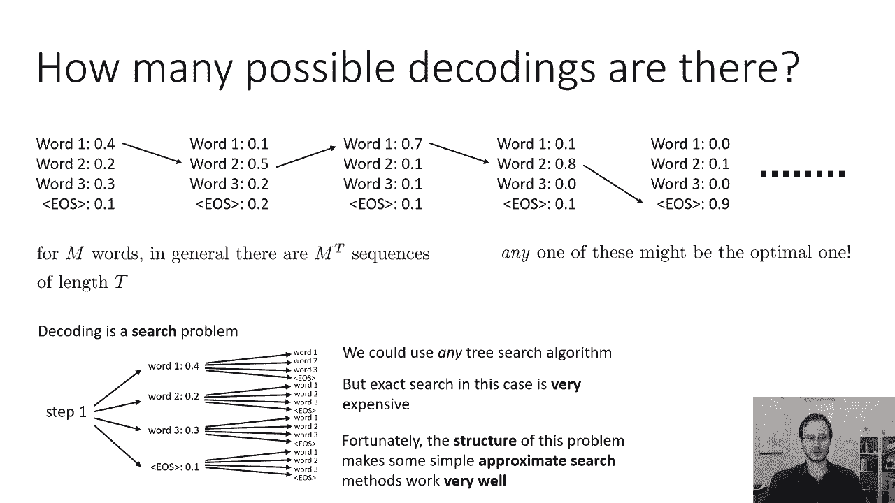
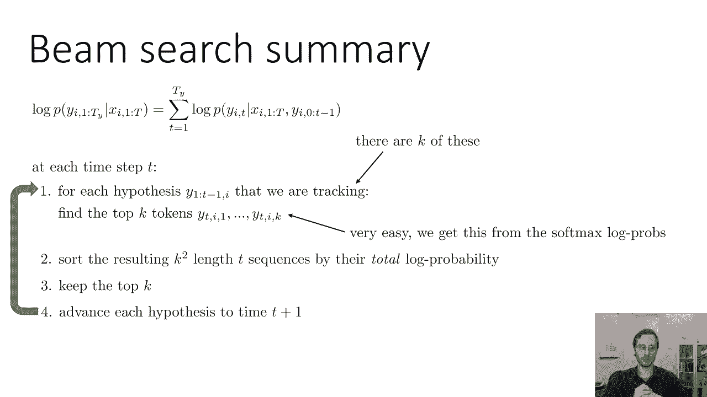
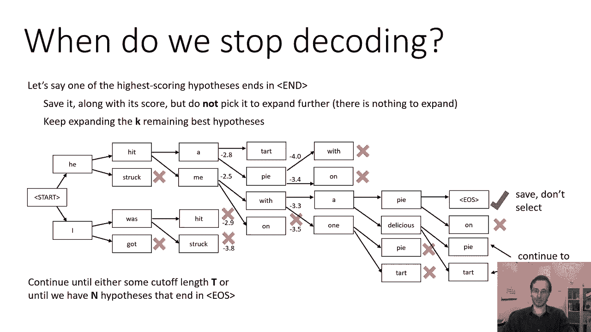
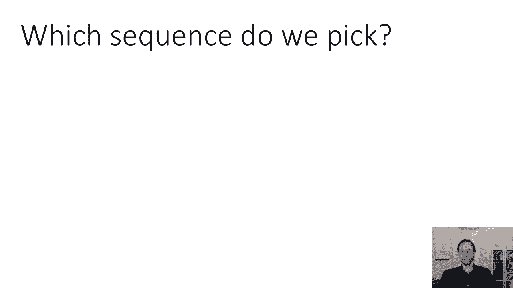
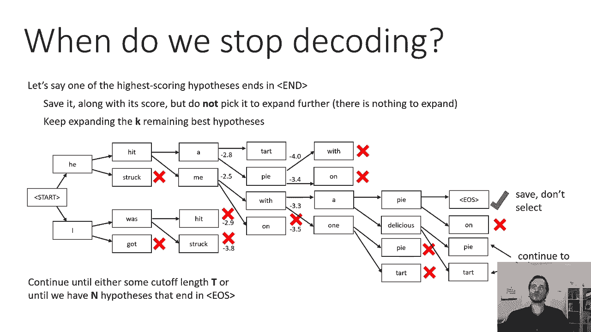

# 【双语字幕】伯克利CS 182《深度学习：深度神经网络设计、可视化与理解》课程(2021) by Sergey Levine - P34：CS 182- Lecture 11- Part 2- Sequence to Sequence - 爱可可-爱生活 - BV1PK4y1U751

所以有一件事我们还没有详细讨论，但这对各种RNN都很重要，尤其是序列到序列模型和语言模型是如何实际执行解码。

到目前为止，显而易见的，呃，从这些rnis中得到一个句子来做这件事的方法，一步一个脚印，在解码的第一步，这意味着我们实际上必须输出一些东西的第一步，这里我做了正确的事情，我颠倒了输入序列。

您得到一个软最大值分布，这意味着你得到了一些长度向量，等于可能的单词数，你对它应用一个软麦克斯，这就把它变成了概率向量，这是解码句子中第一个单词的概率分布，在这一点上。

显而易见的事情可能是选择最有可能的词，概率最大的一个，然后就像我们讨论过的，在上一节课的最后一次，您在下一个时间步骤中输入一个选定的单词作为输入，所以在下一步，您从上一步获得隐藏状态，你得到一个输入词。

该输入单词是您在前一步中选择的单词，所以现在的条件是，你可以在句子的第二个单词上产生一个新的分布，同样，这个分布的长度等于可能的单词数，但我只在这里展示了两个最有可能的。

你可能会选择最有可能的一个并继续，但请注意，网络在第一步犯了一个小错误，它有几个可能的词，正确的词应该是，但一个人的话有一个，你知道的，类似的概率稍微大一点，你知道法语单词on的意思可能是。

也可能意味着一个，所以这里只显示了一个好的，合理选择，但这个选择最终会扔掉其余的解码，所以它为第二个选择了小狗这个词，一只可爱的小狗有点奇怪，那不是正确的英语语法，所以虽然小狗是GEO的正确翻译，嗯。

一只小狗可爱不是一个正确的英语短语，所以语言模型可能会说，第三个词不太可能是可爱的，因为它不是有效的英语，你可以终止判决，比如如果你说一只小狗，这是一个有效的句子，或者你说一只小狗是。

这也是一个有效的句子，所以也许它会选择，但现在它已经偏离了轨道，就像它一样，你知道它正在生成一些有效的英语句子，一只小狗，你知道的，在草地上跑来跑去，或者类似的东西，那将不是一个有效的判决。

但这不是编码句子的正确翻译，那么这里出了什么问题，发生了什么很好，我们应该做的，在我们看到其余的解码之前，不会承诺选择一个，所以基本上是第一个错误把一切都搞砸了，如果不是第一次选择一个。

所以我们选择了一个，然后我们会看到我们后来得到了一个相当合理的一代，所以如果我们选择了一个，我们在第一次步骤中选择单词的概率会稍微低一点，但在随后的时间步长中，我们实际上会得到更高的概率，所以在第三步。

我们实际上很困惑该怎么办。

我们真的没有很好的选择，而这里会有一个很可能的词，就是一只小狗，有95%的可能性，所以这些词的累积概率实际上会更高，如果我们从一些不太可能的事情开始，所以这是一种直觉，但让我们在数学上更正式一点。

让我们试着从数学上理解，为什么会发生这种事情，为什么我们可以得到更好的解码，如果我们不总是选择最有可能的第一个词，我们要做的是，我们想最大化所有概率的乘积，为了最大化所有概率的乘积。

我们不应该在第一步就贪婪地选择概率最高的，为什么我们要最大化所有概率的乘积，好吧，我们需要首先理解这些概率实际上意味着什么，所以在一个常规的convnet中，我们的输出是标签上的SoftMax分布。

很清楚这意味着什么，它是给定输入图像的标签的概率，但是RNN每一步的单词分布意味着什么，就像在修道院里一样，输出分布，输出的概率取决于输入中的所有内容，用同样的方式，安RNN。

在时间上的单词分布步骤一表示在时间上的分布步骤一，以已经输入神经网络的一切为条件的词，基本上以它之前的一切为条件，一般来说，Y T的概率，时间步T处输出的概率取决于整个输入序列，所以x 1到t。

它取决于我们为输出序列生成的所有前面的单词，也就是y零到t减1，例如，可爱这个词是在第二步产生的，它取决于x 1，x2，x 3以及y 0和y 1，所以这意味着在第二步。

RNN解码器实际上产生了一个概率分布，给定x 1到3，逗号y零到一，我知道我有点草率，因为我是零索引y和一个索引x，这只是为了让开始令牌更清楚一点，因为开始标记是零字。

如果你想知道为什么上面写着y i逗号t，那只是为了说明这一点，指数据集中的第i个序列，所以你可以忽略Y，如果这很麻烦的话，好的，从概率的角度来看，这就是每一个时间步长的概率。

现在我们实际上想从解码器中得到什么，我们想要的是我们想要最有可能的输出序列，我们想要最有可能的y零到t，更具体地说，Y 1到T，因为零号令牌永远不会生成，所以P的Y一个通过，我要用t y，只是为了说明。

我指的是输出的长度，不是输入，所以y的p，1到t给定x，1到t，这才是我们真正想要的，这就是我们想要最大化的，根据概率链式法则，我们知道y的p到t，从x到t的y是由所有这些条件的乘积给出的。

如果是y的p，1到1，2给定x，1到3，等于py1给定x1到3次，y 2的p给y 1，逗号x一到三，所以这就是为什么如果我们想得到完整序列的概率，你只需将单个单词的条件概率相乘，因为当时这个词。

步骤t是把所有的单词调理成步骤t减去一，所以所以，这正是我们想要的，以便应用概率链式法则，并得到整个序列的概率，这意味着当我们解码时，我们的目标是产生一系列单词，使它们的概率乘积最大化。

这意味着我们可能会在早期选择一个词，概率略低，为了以后得到一个词，这个词的概率要高得多，所以贪婪地选择最有可能的词并不总是最佳的，在每一步，你可能想选一个可能性稍微小一点的词。

这样你以后就会看到一个更有可能的词。

那么有多少可能的解码，嗯，假设我们每一步只有四个代币，一个字一个字，两个字，三和刑期结束，所以这是一种虚构的语言，只有三个有效的词，原则上，我们可以在第一步选择这四个令牌中的任何一个。

第二步的这四个令牌中的任何一个，第三步的这四个令牌中的任何一个，等等等等，所以我们可以产生的可能序列的数量是非常大的，事实上，它在序列的长度上是指数级的，所以总的来说，如果你有可能的话。

长度为t的可能序列的次方为m，那现在很大了，当然啦，这些序列中的大多数都会有非常，极低概率，大部分都是无意义的序列，但原则上，他们中的任何一个都可能是最佳的，从根本上解码是一个树搜索问题。

这是一个树搜索问题，则为其对数概率的负值，为什么它是对数概率的负数，因为在树搜索中，你边走边汇总成本，所以说，如果你想把乘法变成求和，取对数，但不用太担心，此树搜索期间的后继项数是可能的令牌数。

词典中可能的单词数，所以搜索路径的数量随着你的去呈指数级增加，所以树以M的分枝因子生长，其中m是可能的单词数，直到t的深度，但这只是一个搜索问题，所以我们知道你知道这是指数级的糟糕，但原则上。

如果天真地处理，所有的搜索问题都是指数级的糟糕，幸运的是，有很多很好的方法来解决搜索问题，我们可以使用任何树搜索算法来解决这个问题，但在这种情况下，精确搜索是非常昂贵的，因为这个问题没有一个很好的结构。

这使得广度优先搜索和深度优先搜索非常有效，幸运的是，这个问题的结构使得一些简单的近似搜索方法非常有效，所以当我们解码时，我们实际上会使用，不是精确的搜索算法，比如深度优先搜索或广度优先搜索。

但我们实际上要用一种近似的方法，不能保证产生最佳序列的方法，但在实践中，当用于这种解码任务时，往往会产生相当好的序列。

所以基本的直觉是，而在第一步选择授予的最高概率可能不是最优的，选择一个概率很低的词不太可能导致好的结果，这在搜索中并不总是正确的，所以在一些搜索问题中，你可能不知道你是否走在正确的道路上。

直到你到达你的树叶，但是在这个搜索问题中，你每一步都有这些概率，它们确实提供了很好的指导，所以概率最高的词不能保证在最佳路径上，你知道吗，概率最高的单词之和，就像三四个概率最高的词。

他们中的一个可能走在正确的道路上，不能保证，但情况往往如此，所以这并不是普遍正确的，对于这类序列解码问题，这通常是正确的，如此等价，我们不能贪心，但我们可以有点贪婪，所以总的来说不是真的，这是猜测。

基于我们对序列解码的了解，并不是每个搜索问题都是这样，所以我们将要使用的算法背后的直觉，这被称为波束搜索，它不是贪婪地解码最好的词，每一步我们都会存储到目前为止最好的k个序列，然后更新每一个。

所以在每一步中，我们实际上找不到最好的词，但最好的K个词，将k设置为1的特殊情况只是贪婪的解码，因为你总是用最有可能的词，在实践中经常用于实际的序列到序列模型，你会使用k的值，大约5到10。

这里有一个光束搜索的例子，我要走过，然后我会描述实际的算法，所以记住我们的目标是最大化序列的概率，我们通过t产生y的p，y给定x，1至T，我们看到的因式分解，作为每一步单个软极大概率的乘积。

因为要处理大量的产品，很多概率是有点烦人的，因为它们会下溢，我们更喜欢用对数空间和对数空间来表示它们，求和变成乘积变成求和，如此等价，最大化序列的概率，我们可以最大化序列的对数概率。

这只是所有时间步长的总和，你知道吗，y的对数p，一个给定的x，对2的log p，一个逗号x以此类推，等等，这里有一个光束搜索的例子，我将带你浏览，这是从斯坦福大学的克里斯托弗·曼宁的一次演讲中借用的。

所以法语里有个句子，我们要翻译成英语，它被故意选择为一个有点不平凡的翻译，所以法语的句子是教的，当他打圆周率时，翻译成英语，这里有点奇怪，因为没有一个英语单词和Antart完全等同。

它大致的意思是用圆周率或坑打，所以说，事实上，没有一个确切的逐字翻译使这种困难，你实际上可以用不同顺序的单词生成一个英语句子，而且用词略有不同，我会带你看一个k等于2的光束搜索的例子。

这意味着我们追踪两个最有可能的假设的每一步，所以我们从一个开始令牌开始，然后呃，我们产生SoftMax分布，基本上运行我们的RNN向前一步，在第一个单词上生成软最大值分布，我们将追踪两个最有可能的假设。

所以在第一步，我们知道两个最有可能的假设必须从，最有可能的两个词，在这种情况下，最有可能的两个词是他，我看起来很通情达理，那么我们要做的就是，我们实际上会把RNN向前推进，条件是他这个词。

然后我们将分别向前推进RNN，对i字的条件，所以我们在一开始就有一些隐藏的激活，我们要复印两份，为了一份副本，我们将向前一步，对于另一份，我们将向前一步，我和这两个前进的步骤。

我们将在第二个单词上有两个不同的SoftMax发行版，现在，我们知道我们不可能有两个最好的假设之一，及时利用第三个最好的词，第二步向右，因为不管你是对他还是对我，你只会使用其中每一个的前两个词。

所以我们不关心他的第三个最好的词条件，也不是I上第三个最好的词条件，所以我们会为他产生软最大输出，和I的SoftMax输出，他和我的对数概率显示在这里，虽然还有很多其他带有较低日志提示符的单词。

然后在第二步，前两个将是最少的，然后我们要计算的是前两个单词，当我们和他一起走的时候，第一个单词和第二个单词的对数概率之和是多少，所以他的对数概率是负的，零点七，然后我们要把它。

我们要加上给定开始的命中概率的对数，他，然后也许我们会给我们负面的，一点七，这些数字都是负数的原因，是因为它们是数字的对数，少于一个对数的概率总是负的，好的，所以我们有一些分数。

所以他的打击率是负1分7，他的打击率是负2。9分。我的得分为负1。6分，我得到了负一点八的分数，现在我们还有第三个最有可能的词，比如他通过什么的，但那三分之一。

最可能的词不可能参与两个最有可能的假设之一，所以我们不在乎，好的，现在我们来看看这些分数，我们要选出两个最好的，所以最好的两个是，我是，他打了，这些是我们将继续进一步扩展的，什么进一步扩展。

mean进一步展开意味着您使用实际产生hit这个词的rnn隐藏状态，例如，你在那个状态下再向前一步，命中作为下一个输入，好的，所以你终止了链得到了，因为他们不在前两名，你把另外两个展开，所以每次我说。

扩展它的意思是无论产生这个词的隐藏状态是什么，你把那个词，将其作为下一个输入馈送，馈送该隐藏状态，然后在下面的单词上生成一个softmax，你再一次对它们进行排序，你把两个最有可能的作为一个，呃，前缀。

再一次计算到目前为止的总分，意思是现在的对数概率之和，这三个字，他撞到了一个，他打了我，我被击中了，我被击中了，等等，再对它们进行排序，取两个最有可能的，现在这里发生了一些不同的事情。

一根树枝被完全修剪了，所以他打了一个，他打我的可能性都比我被打的可能性大我被打了，这没关系，好吧呃，那只是意味着我们要做完全一样的事情，我们将在一个，而我，我们要复印两份，我们会让他们每个人都向前走。

但条件是对这个词的不同选择，其中一个条件是他打了一个，另一个条件是他打了我，另一个条件是他又打了我一次，我们将为每一个人获得不同的奖励分配，我们会给他们都打分，选择两个最有可能的，然后继续。

这就是波束搜索工作的例子。

在每一步T中，对此的总结如下，对于我们追踪的每一个假设，所以我要把这些假设编入索引，用i so y 1到t减去1，从y到t减去1，二等分到一到一减去一，对于这些有k个假设中的每一个，我们要找到顶部。

K个时间代币，步T，基本上前K个完成，这很容易，因为我们直接从对数概率中得到这个，所以现在我们基本上有了k的平方可能的长度序列，Don’不对，因为我们有k个初始序列。

每一个都可以用k种可能的方式之一完成，所以有k平方的可能组合，它们中的每一个都有不同的总对数概率，所以我们将计算它们的总对数概率，然后我们将保持其中的前K，然后你把剩下的前k个假设推进两步t加一。

这就是光束搜索背后的基本思想，这是我们通常用来从RNN解码的。

我们需要一些细节才能把它变成一个完整的算法，一个细节是我们什么时候停止解码，或者当我们击中序列结束的标记之一时会发生什么，所以说，这么说吧，得分最高的假设之一以s的e结尾，我在这里用了一个不同的词。

并建立了一个s的e，你所做的，那么是你保存这个序列，你只是喜欢把它和它的分数一起储存，但你不能再扩张了，因为没有什么可以扩展的了，然后你继续扩展剩余的k个最佳假设，所以如果我们要，呃，画出这棵树。

圆周率扔得更远，也许在最后你，您将获得一个可能解码的E令牌，所以解码他用皮涅亚EOS打了我，这是一个完整的序列，所以在这一点上，序列将被保存，但它不会被选为前K之一，不管它的分数，因为它已经完成了。

或者你可以把它保存下来，在剩下的序列中，所以也许他用圆周率打我的序列概率非常低，所以那个可能会被拒绝，然后你就会得分，你会储存，还是你，你就会，你会作为你的顶级K之一，他用美味的馅饼打我。

他用美味的馅饼打我，对呀，然后你会继续进一步扩展这些，你会一直持续到某个截止长度t，意思是，直到序列太长，或者直到您有一些预定义的完成序列。

你可以选择你想要的，或者你可以拿任何一个，或者这样做是一个合理的启发式，嗯。

我们在最后选择哪个序列，假设我们已经运行了这个，我们有，你知道的，假设我们想要n等于四个完整的序列，我们得到了四个完整的序列，所以我们决定了这四个中我们到底要返回哪一个。

所以在最后，我们将查看所有保存的序列，因为所有这些都是击中EOS令牌的，也许我们有这些，我们有像，他用圆周率打我，总对数概率为负4。5，他抛出了一个圆周率，总对数概率为负3。2，我被他扔的圆周率击中。

它的总对数概率为负7。2，所以我们有这三个保存的序列，显而易见的是，我们可以做的是，我们可能会选择对数概率最高的一个，对呀，就是这个等一下，这其实不是一个很好的翻译，所以要记住。

这些分数中的每一个都是每一步的对数概率的总和，但是每个句子的步数都不一样，所有的数字都是负数，因为对数概率总是负的，因为概率小于1，小于1的数的对数是负数，所以刑期越长，我们加的负数越多。

这意味着一般来说，较长的句子往往具有较低的对数概率，所以序列越长，它的总分就越低，因为有更多的负数加在一起，那其实很烦人，因为这意味着简短但糟糕的翻译可能有更高的日志概率，比现在非常好的更长的翻译。

当然啦，这并不总是意味着较长的翻译总是好的，就像我被圆周率击中一样，有点合理，但这不如他用馅饼打我好，所以我们可以用一个非常简单的修复，有点启发式的，就是把分数定义为总对数概率除以步数。

所以基本上句子中标记的平均对数概率，这实际上倾向于做基本上正确的事情，所以如果你把这些分数除以相应序列的长度，你实际上会得到非常合理的解码。

所以完整的波束搜索程序的总结，那么在您跟踪的每个假设的每一个时间步长都是这样的，查找下一步的前k个令牌，t，这些k的平方总长度，通过附加你的每个假设形成D序列，每个可能的下一个令牌的总对数概率。

保存在EOS中结束的任何序列和其余序列中的任何序列，保持顶部K，然后在时间t加1时推进每个假设，如果t小于所需的最大长度，如果您保存了n个以上的序列，或者t等于h，意思是你不能再前进了。

然后返回得分最高的状态序列，其中分数由幻灯片顶部的方程决定，所有步骤的对数概率之和，除以该序列中的总步数，这就是光束搜索，这实际上会很好地解码最有可能的句子，大多数时候，事实上，通常非常小的光束宽度。

很小的k值实际上可以很好地工作，所以五到十岁是很典型的。

