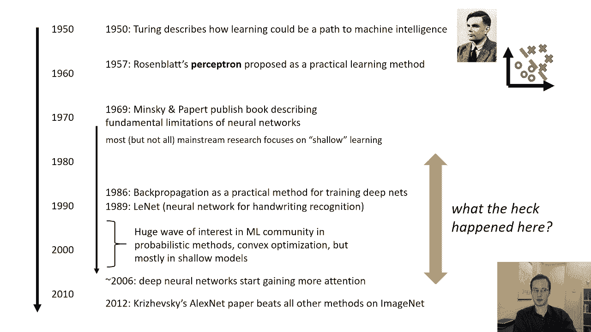
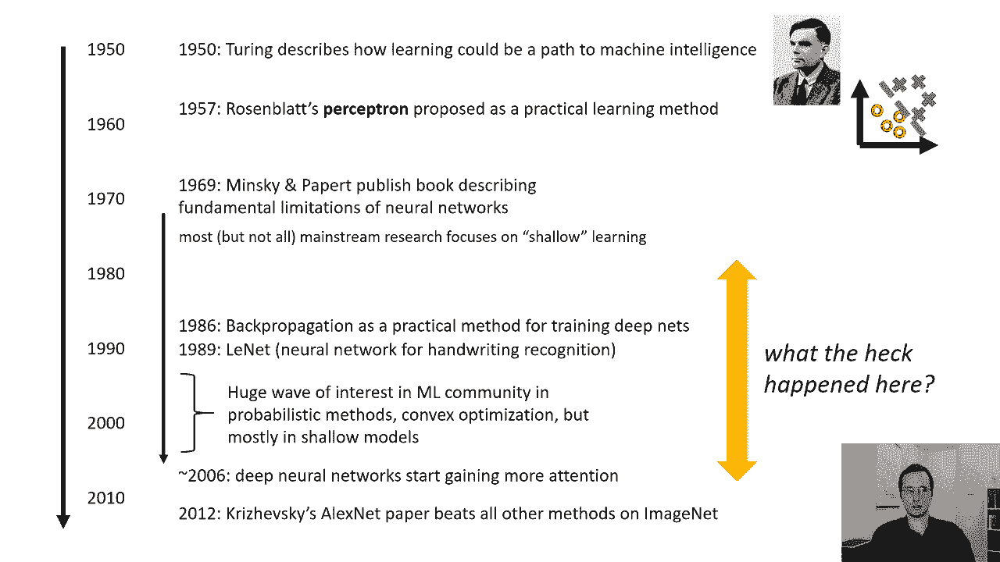
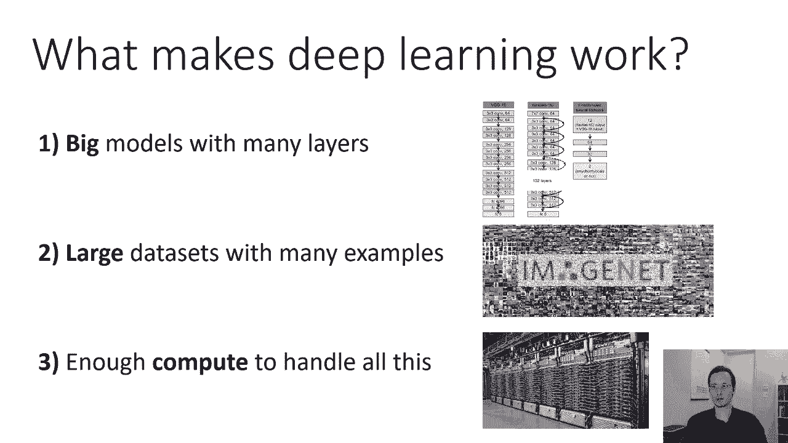
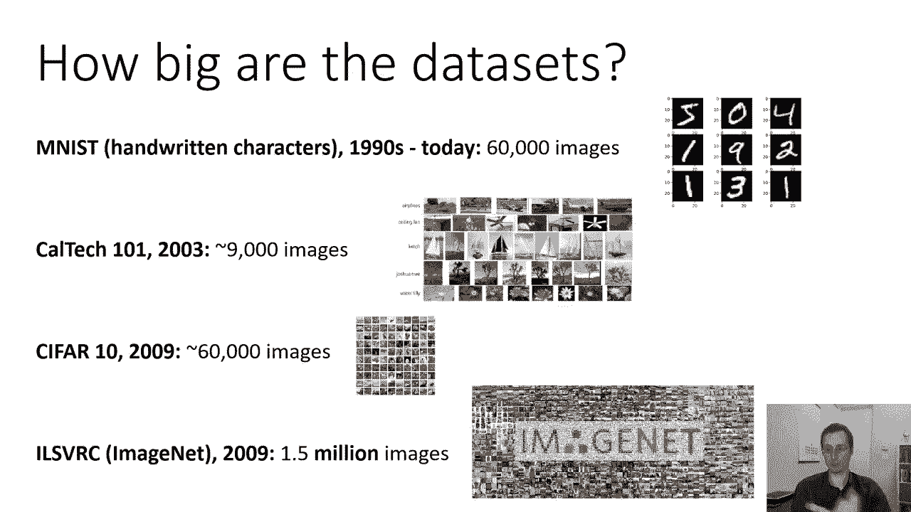
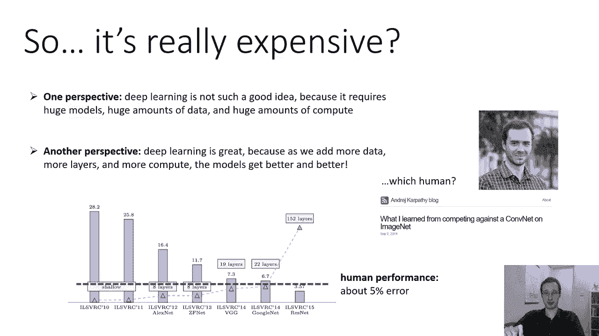
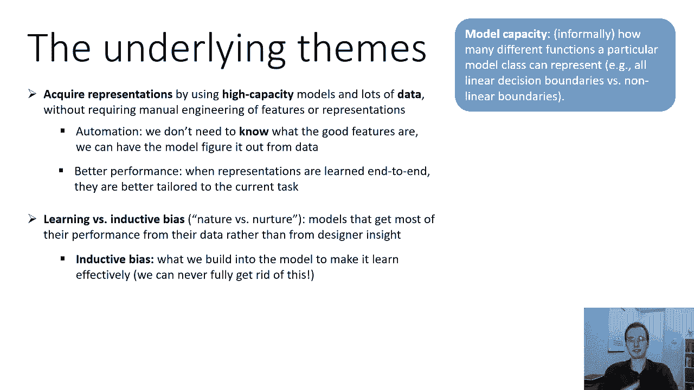
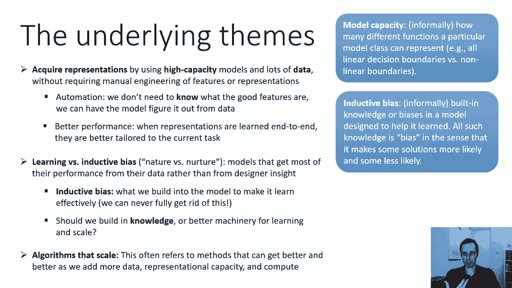
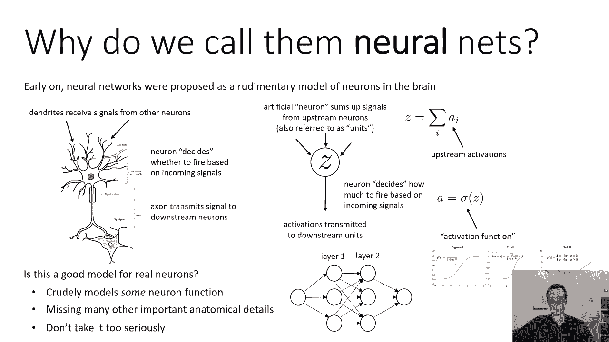
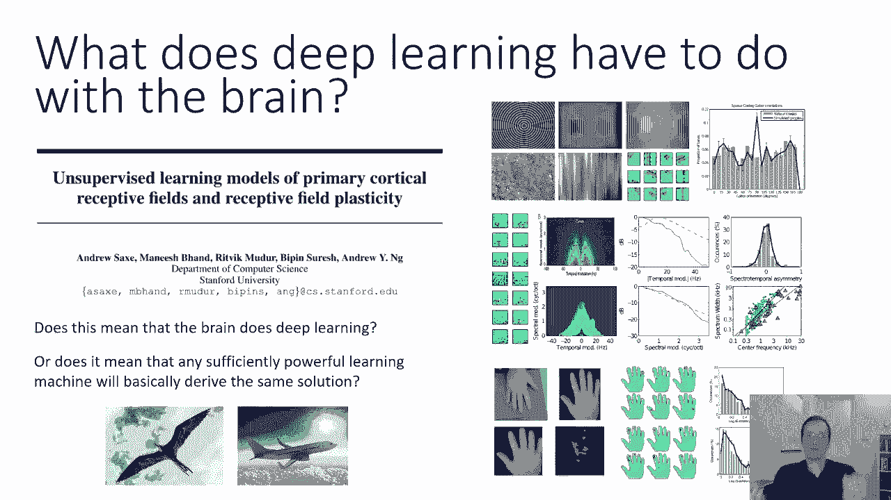

# 【双语字幕】伯克利CS 182《深度学习：深度神经网络设计、可视化与理解》课程(2021) by Sergey Levine - P3：CS 182- Lecture 1, Part 3- Introduction - 爱可可-爱生活 - BV1PK4y1U751

所以你知道，如果你在这个班，你可能听说过深度学习，在你可能听说之前，你知道这是一个相当好的主意，你可能听说过它工作得很好，也许你听说过这是一个每年数十亿美元的行业，也许你听说过它可以让机器解决。

对认知和计算要求很高的任务，以前是不可能解决的，是什么让深度学习真正运转良好，让我们从一个非常粗糙的，以这样或那样的方式发展的非常简单的时间表，与深度学习高度相关，我们可以从二十世纪五十年代开始，嗯。

艾伦图灵首先描述了学习是如何，在他的开创性论文中提出了通往机器智能的道路，事实上，他描述的一些方法看起来很糟糕，就像我们今天在1957年认识到的人工神经网络，提出了一种实用的罗森布拉特感知器学习方法。

感知器基本上是这样做的，它做的，两类的线性分离，有一段时间，人们对此非常兴奋，因为这里有一个实际的学习算法，嗯，你知道的，与那些神经网络有关的一些元素，它似乎起作用了，它似乎把阶级分开了。

至少在两个D平面上似乎是一个非常好的主意在1969年，minsky和pepper出版了一本关于学习像感知器这样的算法的书，这本书描述的一件事是神经网络的一些基本局限性，我们今天实际上很熟悉这些限制。

比如，比如说，事实上，很难找到一个全局最优的神经网络，对于给定问题的最佳神经网络，还有很多其他的限制，但在当时这引起了很多关注，因为人们在这本书之前没有意识到，这个基本想法有多少限制，事实上。

这本书出版后，虽然有，你知道的，在神经网络和我们今天称之为深度学习的东西上做了相当多的工作，以前更简单的学习方法，呃，建立在手工设计的功能之上，但尽管如此，在1986年还是有了相当大的进步，呃。

提出了一种训练深度神经网络的实用方法——反向传播法，在一九八九年，有工作，你知道的，开发手写数字识别神经网络的实验室，得到非常好的效果，识别邮政编码，写信封之类的东西，嗯。

但这在某种程度上是在背景中在前景中，90年代到2000年初，ML社区对概率方法产生了巨大的兴趣，凸优化，但大多是浅模型模型，在那里学习过程可以很好地理解，相对简单，并导致，你知道的，大量好的理论分析。

然后一些，不知何故，大约有两千六个深度神经网络开始获得更多的关注，事实上，它们开始引起人们的注意就像以前疾驰的货运列车引起你的注意一样，你知道的，它就在你面前，发表亚历克斯网论文。

它突然击败了Imagenet基准上的所有其他方法，当时计算机视觉中最难的图像识别任务，那么是怎么回事，中间到底发生了什么，好像1969年事情有点走下坡路，有一些早期的杂音，在2006年。

在所有的一千在二千一十二，有一篇论文出来了，在最难的一篇文章中击败了其他人，呃，计算机感知问题，呃，目前正在研究一点。

令人惊讶，那么是什么让深度学习发挥作用呢。

也许如果我们理解这些因素，这个时间表对我们来说会更有意义。

对于深度学习来说，真正重要的事情之一是大模型，有很多，很多层，这很重要，因为，深度学习有效性的很大一部分原因是，它学习表征的能力，但好的表现是高级的表现，它们是抽象的，它们不受滋扰，它们捕捉到有意义的。

更高级别的特性，对象，概念，语义意义，获得如此高级别的概念需要许多层的处理，每一层处理都很简单，记住，为了得到复杂的东西，你需要把很多层叠起来，您还需要大型数据集，这些大型数据集需要有许多示例。

这很重要，因为当你有这么多层的时候，你会有很多参数，并训练这么多参数，你需要大的数据集，但这并不是您需要大型数据集的唯一原因，需要大型数据集的另一个原因，是因为你所学的东西真的很复杂。

想象一下一个人类孩子在他们生命的头三年里看到了多少不同的东西，而我们的视觉系统极其复杂，并且非常善于概括和避免错误，我们实际上从相当多的数据中了解到，所以它应该来了，对我们来说。

有效的机器学习系统也应该需要大量的数据集，这并不奇怪，最后，为了训练有很多模型的模型，非常大的数据集上的许多层，你需要足够的计算机来处理所有这些，你需要足够的计算能力才能在那些大数据集上训练你的模型。

训练所有这些参数，你知道的，在你老死之前，本质上是对的，你不能等你的模特多年来训练，世界将继续前进，所以你需要足够强大的计算机来在大数据集上训练这些巨大的模型，快到有用，现在这三件事都是，你知道的。

不是很有争议，今天他们广为人知，但我想这三件事情中的每一件都是主要的。

你知道的，为这一差距提供了很大一部分解释，为了这里发生的一切。

所以呃，让我们来谈谈层数，我们来谈谈模型的尺寸，这是勒奈特的图表，这是1989年手写数字识别的网络，现在这个网络有七层，但它们是相当小的层，所以我们将了解这些词的意思，我们很快就会了解卷积和全连通层。

在几堂课上，但它本质上是一个有七层处理的网络，七层意味着有七个操作，每一个都将以前的表示转换为另一个更抽象的表示，一个，alex strachesky的imagenet模型，该书于2012年出版。

有八层，只是多了一点点，但它们的层要大得多，所以呃，你可以告诉你只是为了给你一些想法，这对你来说可能还不太重要，因为我们还没有真正了解神经网络是如何工作的，但是你看红雀的F六层有84个单位。

亚历克斯网中最后一个完全连接的层，它实际上有四千九十六个单元，就像两个街区的248，所以它相当大一点，这些天，这已经过时了，这是二十五岁的，但假设在过去的五年里，最先进的图像识别模型有152层。

这是一个共振一五二，有更大的型号，在这一点上有超过一千层的模型，他们工作得更好，所以更多的层真的很有帮助，下面是他们工作得有多好的情节，所以这里的每个条代表IVRC上的错误，映像，大规模视觉识别挑战。

这是一个大规模的识别图像中物体的问题，你可以在这里看到，亚历克斯网，那是16。4的第三小节误差，八层快进，二十四Vgg，非常经典的网络错误率，百分之七点三，十九层快进，甚至更远，二万零一万五。

一百五十二层，错误率三点五，百分之七，所以现在更多的层是有帮助的，你们中那些用更挑剔的眼光看这个的人可能会说嘿，你在那里得到了一些递减的回报。

我们会回到数据集的大小，也是机器学习历史上最流行的数据集之一，尤其是在深度学习中，是MNIST手写字符，广泛使用的数据集，从二十世纪九十年代的今天，这是一组手写数字，零一，两个，三个，四，五个，六，七。

八和九，它有六万，呃，训练图像，你可能会说6万是加州理工学院的一个很多，零一大约二十三，呃，九千幅图像看得很远，一万二千九，现在我们进入了一种，呃，深度学习转型的早期阶段，六万张图像。

好的，有点像，I’我好一点了，ivrc，这是通常被称为imagenet的训练集，图像本身实际上要大得多，但是IVRC有点小，发展于二零零九年一个点，五百万张图像。

像Facebook这样的大公司商业使用的数据集，谷歌，微软等更大，但要大一两个数量级，这些是人们在互联网上对物体进行分类时使用的模型，当你把你的照片上传到Facebook时，Facebook认识到。

通过一个训练有素的模型，可能在一到两个数量级，比这更多的图像，所以这个，这是深度学习在如此复杂的情况下工作所需的数据量，所以说，当然啦，如果在二十世纪九十年代，每个人都在测试他们的网络。

用6万张图像训练的模型，你知道事情直到很久以后才发生变化，这也许并不奇怪。

计算机怎么样？嗯，这是一个情节，需要一点时间来消化，这张图显示了许多不同的神经网络，在这种情况下是为了计算机视觉，垂直轴是ImageNet上的精度，所以在我们看错误之前，现在它的准确性，所以越高越好。

横轴是千兆浮点运算的操作数，每秒千兆浮点操作运行神经网络，所以这大致是衡量它需要多少计算，评估网络，不是训练它去评估它，每个圆的大小表示参数数，所以一般来说你会期望，当你往右边走的时候。

圆圈的大小应该会变大，但实际上不是一对一的通信，因为操作的数量可能比参数的数量大得多，因为卷积是如何工作的，我们稍后会学习卷积，所以说，操作的数量真的是，神经网络计算成本的度量，而参数数是它的大小。

所以如果我们说的是计算，我们真正关心的是操作--横轴，亚历克斯·内特在那边，在左下角，它坐在，呃，你知道的，在零点的棒球场的某个地方，六个千兆失败，它的准确性在当时是相当革命性的，但最近不太好。

在中间的某个地方闲逛，大约12千兆次失败，所以你可以看到顶部图片中间的一组圆圈，那些是不同的，谐振腔，比亚历克斯网贵一点，如果你想获得最好的性能，你在右上角有这些东西，呃，它需要，你知道更多的新。

按数量级，比亚历克斯·内特更计算，所以计算很贵，自然语言处理呢，有很多呃，最近关于最先进的计算成本的讨论，nlp系统，我找不到这样的语言模型图，所以我在谷歌上打了一个问题。

因为我确信谷歌图像搜索会通过使用语言模型来解释我的问题，所以语言模型肯定能告诉我训练花了多长时间，我输入了，训练需要多长时间，伯特，我不是说芝麻街的角色，我指的是叫做bert的语言模型。

这是最广泛使用的语言模型之一，我在搜索框中输入的字符串很可能是由bert处理的，在我收到答复之前，大约五四个小时，好的，但是嗯，五四个小时，当我查的时候，在这上面要五四个小时，五个。

四个小时吃16个汤匙，这张照片诚然显示了几千个TPU，所以TPU在每个盒子里都有一根红色的小电线，其中16个，嗯五四个小时，什么是TPU，TPU是专门为训练大型神经网络而开发的定制硬件。

所以16个TPU会比16个GPU更强大，所以你可以想到，如你所知，可能有几十台电脑，几十台好电脑，五四小时，这是一种很多，所以我不得不建立定制硬件来实现这一切，所以也许我想告诉你的是，这东西真的。

真的很贵，这真的是真的吗，如果是这样，为什么一个观点是，也许这不是个好主意，因为你需要这些巨大的模型，这些海量的数据和海量的计算，我们到底为什么要这么做，但另一个观点是，这实际上说明了深度学习的力量。

深度学习很棒，因为随着我们添加更多的数据，当我们添加更多的层，随着我们增加更多的计算，我们的模型越来越好，虽然数据很贵，计算也很贵，添加更多数据可能要容易得多，比发明新算法更有计算能力。

所以如果你能把一个东西做得更大，它会更好地工作，那太好了，如果我们回到这张照片，在ImageNet上显示精度的提高，随着层数的增加，我们可以在上面再加一行，也就是人类的表演。

人类性能ISVRC现在的错误率约为5%，你们中的那些，呃，观众中的怀疑者可能在想哪个人类，这个人类，所以这是SVC的人类基准，安德烈·卡帕蒂，他有一篇很棒的博客文章，叫做《我从中学到的东西》。

在Imagenet上与修道院竞争，他不是通过创造一个更好的漫画来竞争的，他通过自己对一个任务进行分类来竞争，所以安德烈的表现是5%，也许你可以做得更好，安德烈花了一段时间练习，尽管他花了不止五个。

四个小时。

有哪些潜在的主题我们会在本课程中反复看到，主题，意思是，对我们来说很重要的事情来使我们的深度学习系统正常工作，深度学习系统通过使用高容量模型和大量数据来获取表示，不需要手工设计特征或表示。

所以这里的一个主要主题是模型容量，模型容量非正式地表示一个特定的模型可以如此表示多少不同的功能，比如说，你能表示所有可能的线性决策边界吗，或者大多数模型的所有可能的非线性决策边界。

字面意义上的函数数是无限的，但你知道无穷大有不同的大小，拥有高容量非常重要的一点是，如果你有非常大容量的型号，意味着可以表示许多不同功能的模型，你得到了高度的自动化，你不需要事先知道什么是好的功能。

你不需要事先知道，一个好的功能集是什么因为你可以给它一个非常大的功能集，并让它自己弄清楚，你会得到更好的性能，因为如果你能表示更多不同的函数，那么这个较大的可能函数集可能包含一个比小函数集更好的函数。

另一个主要主题，这在课程中会出现几次，学习的区别是，呃，在学习和归纳偏见中建立一些东西，这是机器学习的等价物，相当于先天与后天，是内置的还是在深度学习中获得的，通常，在数据中获得大部分性能的模型。

而不是来自设计师的洞察力往往工作得最好，所以这里有一个特殊的术语是归纳偏差，归纳偏差是你在模型中构建的东西，以使它有效地学习，我们永远无法完全摆脱这个，有一个众所周知的定理叫做没有免费的午餐定理。

本质上说需要内置一些东西。

它建立在一个模型中的知识或偏见中，这些知识或偏见旨在帮助它学习，用机器学习的说法，从某种意义上说，所有的知识都是偏见，为什么偏好，因为它使一些解决方案更有可能，而一些更不可能。

深度学习的一个关键是创建模型，其中归纳偏差非常普遍，非常广泛适用，这样它就不会降低你找到正确答案的能力，有关实际问题的报告，当然啦，深度学习研究中经常出现的一个主要问题是，我们应该建立知识吗。

还是我们应该建立更好的学习和规模机制，这两件事经常不一致，将更多的知识放入模型中进一步约束它，这干扰了它从数据中学习更多的能力，而这些事情往往需要找到一个很好的平衡，最后一个主题是缩放算法，经常。

这指的是随着我们添加更多数据而变得越来越好的方法。

更多的代表能力和更多的计算能力，因此，非正式地伸缩意味着算法能够更好地作为更多的数据工作，所有的容量都增加了，这真的真的很重要，所以呃，为什么我们称它们为神经网络，早期。

神经网络实际上是作为大脑神经元的基本模型提出的，这是一个神经元的图，呃，它有树突和树突，你可以把它们看作是接收来自其他神经元的信号，所以神经元发送电信号，然后这些信号通过突触传播，使用，你知道的。

各种化学物质和树突，他们有点，那是你的收件箱，它们接收来自所有上游神经元的信号，然后细胞体里发生了一些事情，神经元根据传入的信号决定是否发射，你知道的，大概是因为它是一个细胞，它决定的方式，没那么复杂。

它自己不做任何思考，但不知何故，它进行了计算并决定，如果它决定发送一个传出信号沿着轴突传播，它被发送到下游神经元，所以轴突就像发件箱，树突是收件箱，神经网络是这个过程的一个粗略简化的模型。

人工神经元接收来自上游神经元的传入信号，有时我们把这些称为单位，所以它接收来自上游单元的信号，它对它们执行一个非常简单的数学运算，通常这只是一个总和，所以它会把所有传入的信号加起来。

所以从所有来源发送的东西越多，它的呃越大，激活值将为，然后它会根据传入的信号来决定发射多少，现在对于现代神经网络，此决策通常不是二元决策，喜欢火还是不火，这实际上是一个真正的价值决定。

你可以把它看作是发射率，就像你解雇了多少人，你是非常快还是非常慢，通常这个操作是激活的一个简单函数，所以你取那个和z，然后你对它应用一些非线性变换，它通常被称为激活函数，它是一个将，呃，这个。

这些传入信号的激活程度，这些功能有多种选择，有些，你知道的，通常这些函数都是非线性的，因为，否则你会得到一个完全线性的模型，它们有某种门槛或饱和的味道，比如说。

一个整流的线性单元将所有小于零的数字发送到零，然后保持所有正数的原样，如果你有一个正和，然后你就把它发出去，如果你有一个负和，然后你发送零，但是有很多选择，我们将在课程中详细讨论它们。

然后这个结果被传送到下游单元，这是神经元的好模型吗，在一个非常抽象的意义上，是呀，但是很多生理细节，当然不见了，你知道吗，神经元不只是总结它们的激活，呃，他们有复杂的，你知道电信号。

有许多不同的神经递质，所以真正的神经元，当然比这个简化的模型复杂得多，嗯和，当然啦，当我们实际训练神经网络时，我们不仅仅有一个神经元，我们有数百万甚至数十亿的它们排列成一个网络，典型的一层一层地分层。

那么它是真实神经元的好模型吗，它粗略地模拟了一些神经元功能缺失，许多其他重要的解剖细节，所以不要太认真，在神经科学中，实际上有一项严肃的工作使用神经网络，但你必须，你知道的，就像生物系统的任何模型一样。

你必须接受，在某些方面，这将是合理的，在其他方面，这将是非常不合理的，我们在深度学习中所做的大部分与大脑建模关系不大，更多的是解决机器学习问题。

但深度学习确实与大脑有关，在某种意义上，在大脑中观察到的一些现象也在深度神经网络中观察到，所以我会告诉你一点，你知道，把这个和通常的半信半疑，我给你一些忠告，但我认为值得了解，值得了解的是。

过去人们是如何看待这些问题的，所以我给你们看几个例子，来自一篇名为初级皮层无监督学习模型的论文，感受野与感受野可塑性，这篇论文是二十年代初发表的，在深度学习转型的早期阶段。

这篇论文想研究的是生物大脑学习的特征是如何与特征相似的，学习深度神经网络，例如，你可以拍摄图像，所以这些都是非常特别的图像，他们代表，定向边，这些通常被用来探测神经活动。

在哺乳动物大脑的早期视觉处理水平中，你能做的是你可以把像猫这样的动物，你可以给它看这些特殊的图像，选择性地激发特定的方向，然后你可以在大脑中有一个电极，并测量不同神经元的激活。

试图找到他们或多或少能接受的方向，然后你可以在神经网络上做同样的实验，你会发现对于深度神经网络，就像这篇论文测试的那些，以下方面的统计数字，呃，的，你知道吗。

有多少特征可以接受不同的方向看起来惊人地相似，这并不意味着它的工作方式是一样的，意思是它在关注类似的事情，如此相似的故事，学习到的特征的音频统计类似于我们在大脑中观察到的特征的统计。

这篇论文做的一个特别创新的实验是，他们还研究了触摸感知，所以他们实际上用了手套，他们让一个人处理一个沾满灰尘的物体，这样他们就可以测量他们接触的东西，这被用来训练神经网络，然后是一只猴子的动物数据。

他的手放在一个有不同凹痕的旋转滚筒上，这样他们就可以测量猴子神经元的激活，对不同触觉刺激的反应，他们也发现了类似的模式，呃，这些特征的统计数据彼此相似，这是否意味着大脑进行深度学习。

不一定所有这些都表明这些深度神经网络关注的是，类似于大脑关注的事情，所以说，也许，这实际上意味着任何足够强大的学习机或多或少都会得到类似的解决方案，可能相似之处不在机制上，相似性在数据中。

相似之处在于正在解决的问题，我们应该很熟悉这个想法，如果你曾经坐过飞机，你知道飞机采用了一种在某些方面类似于鸟类的解决方案，它们都有翅膀，但他们继续飞翔，你知道的，有些不同的原则，为什么它们都有翅膀。

因为翅膀很好地解决了它们都面临的问题，也许以同样的方式，这些统计数据的特征是解决大脑问题的最佳方案，神经网络面临着，这真的是关于有一个足够强大的机制。

