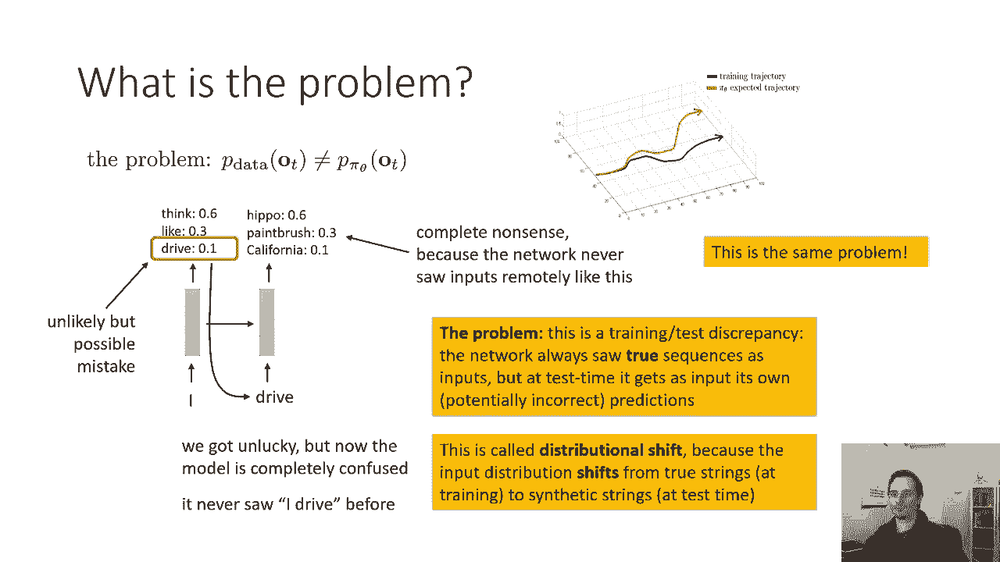
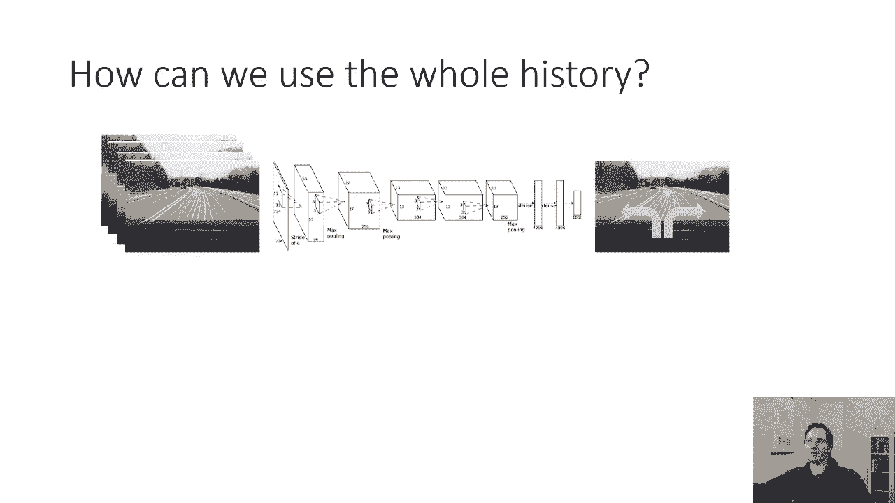
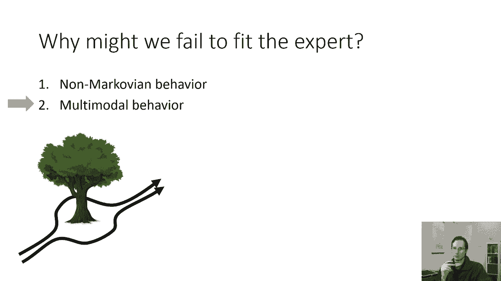
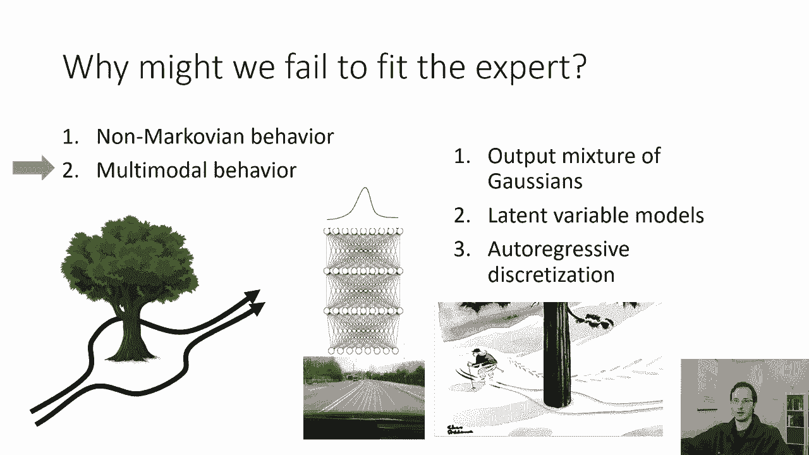
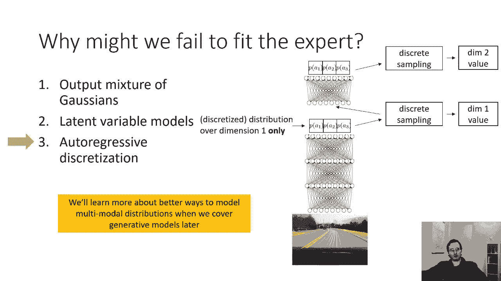
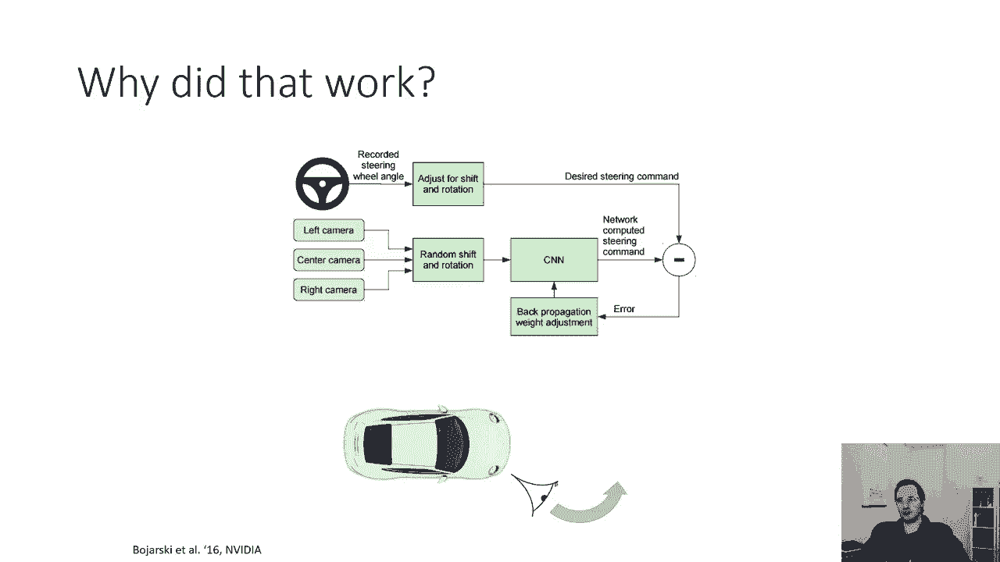
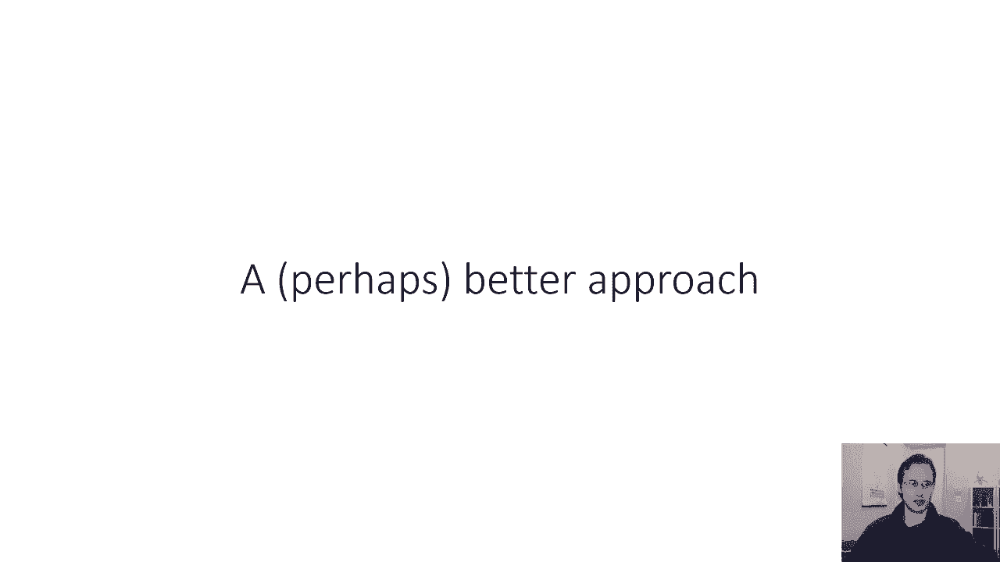

# P43：CS 182- Lecture 14- Part 2- Imitation Learning - 爱可可-爱生活 - BV1PK4y1U751

这节课的下一部分，我们将讨论如何使行为克隆发挥作用，在实践中，那么问题是什么行为调用，如果你明白那个问题，也许我们可以得到一些想法，如何使事情更好地工作，我们可以把这个复合误差问题形式化为分布位移问题。

所以我们的政策代表了现在给出的一些分布，如果一切都是id和t实际上并没有影响o t加1，就没有问题了，但是因为OT加一依赖于T，如果πθa t给定OT，与收集数据的动作分布不完全相同。

基本上专家人类驱动程序的策略，那么我们的问题是，在观测p数据OT上的分布，受到之前动作的影响，会偏离我们得到的观测分布，当我们实际运行我们的策略时，所以我们在P数据上训练我们的策略。

但是当我们运行它的时候，我们将开始从p piθ得到观测结果，我们的行动影响未来的观测，所以我们在观测上的分布是不同的，这是我们新政策的观察分布，而不是生成训练数据的专家的观察分布。

所以问题是p数据ot和p piθot不一样，这是分配转移的问题，这个问题的发生是因为给出了OT，即使是训练有素的模特，总的来说，与人对行动的分配是不一样的，鉴于他们的观察，然而，这意味着什么，首先。

让我，呃，带你把这个类比到我们前面看到的另一个问题，所以这个分配转移的问题基本上和我们前面看到的问题一样，当我们谈论，当我们谈到递归神经网络时，所以如果我们是，如果你还记得，我们刚才说的。

如果你现在的神经网络在早期犯了一个小错误，在解码过程中，所以也许它选择了一个不太可能但可能的错误，然后条件下一次踩在呃，选定令牌，错误可能会加剧，因为即使早期的错误可能很小，无害。

它导致下一个时间步长的输入，这与该网络在训练期间看到的任何输入都不同，所以如果我们运气不好，但现在模型对发生了什么完全困惑，因为这是一个如此陌生的输入，然后以后会犯更严重的错误。

所以我们在这里看到的RNNS的问题，是具有培训测试差异的培训，网络总是在训练时将真实序列视为输入，但在测试时，它得到自己的输入，它得到它的输入，它自己潜在的不正确预测，行为克隆中的情况非常相似。

在训练期间，网络只看到专家观察分布的观察，但在测试时，它开始看到自己的观察结果，可能有点不正确的动作，现在这被称为分布转移，因为输入分布在训练时从真弦移动，RNN测试时的合成弦，和相等。

训练时观察与专家观察的转移，到策略自己在测试时的观察，这是一个分布转移，所以这是同样的问题。

现在我们确实对这个问题有了一个潜在的解决方案，当我们谈到RNNS时，这是在训练期间的预定采样中的预定采样，我们实际上以某种随机概率输入网络自己以前的预测，所以不是总是在真实的序列上训练。

我们有时根据网络自己的预测进行训练，所以我们可以问，我们能开发一个用于模仿学习的计划抽样版本吗，我们实际上可以从策略中采取预测的行动，并观察由此产生的下一个观察是什么，然后我们就会知道观察到的是什么。

我们可以把它喂给网络，问题是，虽然这对RNN来说很容易做到，因为这需要与世界互动，我们先验地不知道观察到了什么，采取其他行动会产生什么观察结果，你只是有一个汽车随着转向命令行驶的视频。

你不知道车会看到什么，如果它对RNN采取了不同的行动，这很容易，因为rn是完全模拟的，它完全在计算机内运行，但是有了控制问题，还有物理世界，在物理世界中没有采取不同的行动。

你不知道由此会产生什么观察结果，更正式地，这是因为你不知道转变的概率，你不知道下一个状态的概率，给定当前的运行状态，你知道问题所在，你不知道在给定的状态下观察到的概率，因此你不知道下一次观察的概率。

考虑到以前的观察和行动，这些是你不知道的，你可以通过与世界互动来从它们身上获得样本，但你不知道计算机中的这些概率是多少，因此，你不能轻易地模拟你从采取不同行动中得到的观察，有算法试图学习这些概率。

它们被称为基于模型的强化学习算法，有一个方法可以克服这个问题，但现在为了模仿学习，我们想保持简单，我们希望能够训练这些组件来映射图像，到驾驶命令，而不需要学习任何其他组件，所以我们能做到吗。

我们能不能代替完全解决问题，我们能不能以某种方式很好地减轻它，这里的一个想法是问题可以缓解，给出ot的piθa t是非常准确的，这意味着它非常非常类似于专家的真实动作分布，这是一个很高的标准。

你需要一个非常好的政策才能做到这一点，但如果你的政策非常非常好，也许分布移动将是最小的，在实际应用中。

pθ{\displaystyle p_{theta}}可能会近似等于t{\displaystyle t}的pθ{\displaystyle p_{theta}}，这有时有效，当你的数据集非常非常大时。

它往往会工作得更好，本质上，如果OT的p数据非常广泛，它涵盖了大量不同的观测，你的政策非常非常符合数据，它概括得非常非常好，理论上，问题还是会出现，但实际上它可能非常温和。

所以我们需要做的是收集大量的数据，我们需要一个很好的方法来训练我们的政策，所以收集大量的数据，关于这一点没什么好说的，这就是为什么英伟达的车需要开三千英里，但是我们怎样才能得到一个更精确的模型。

开始思考我们如何才能得到一个更精确的模型，πθ，我们可以问，为什么我们可能不适合专家，出错的可能原因是什么？有两个很大的原因，一种是非马尔可夫行为，另一种是多模态行为，我很快就会解释这些都是什么意思。

非马尔可夫行为是指以下情况，你在学习一个政策，这隐式地假定操作只依赖于当前的观察，就像人存放方向盘的方式，只取决于他们现在看到的，而不取决于其他任何东西，这就像说如果我们看到同样的东西两次。

我们做同样的事情两次，不管之前发生了什么，但当然这对人类来说是非常不自然的，就像如果你向左转，你可能会一直向左转，如果你向右转，你可能会一直向右转，你不会在每个时间点都做出完全独立的决定，你知道。

部分原因是你的车的机械师，部分原因是你大脑的机制，对呀，你的大脑不会瞬间向前推进，在每一个瞬间独立的决定，它本身是由连续的过程控制的，人是有感情的，他们会犯错，也许这个司机很恼火。

所以他们开车更有侵略性，他们的烦恼不是因为他们现在看到的，也许是因为三分钟前有人切断了他们的联系，一般来说，人类行为不是马尔可夫式的，它不是在每个时间点都独立的。

所以一个更准确的模型来代表人类的实际行为，他们的行动可能取决于迄今为止发生的一切，这可能取决于过去所有的观察，我们如何训练一个在时间步T预测动作的模型，条件是从时间步骤1到T的所有观测。

我们可以使用什么样的神经网络架构，花点时间想想什么样的建筑可以从一系列图像中读懂，然后预测当前的动作。

这是一个多对一RNN体系结构中的一个经典示例，所以本质上我们需要阅读图像的完整历史，但是把它读到一个标准的前馈修道院是不切实际的。

因为我们有可变的帧数和太多的权重，所以我们要做的是，我们会设计某种递归神经网络，带有卷积编码器，所以每一步我们都有一个大陆在图像中读到相同的重量，并产生一些小的向量表示。

向量表示进入RNN或更一般的LSTM，最后一步，我们有一个小网络，查看最后的LSTM状态，并预测动作，所以这是另一个使用R的好地方，我们本质上是用RNN来模拟人类司机的事实，在这种情况下是非马尔可夫的。

他们的行为取决于他们过去看到的，因此，我们将共享内容编码器的权重，然后对于RNN状态，通常我们会使用类似LSTM细胞的东西，尽管我们也可以使用一个完全合理的变压器。

所以这是非马尔可夫行为，下面我们来谈谈多模态行为，所以这里有一个特殊的挑战，假设我们正在控制一架在森林里飞行的无人机，也许它需要绕着树飞来飞去，绕着树飞向左边是可以的，绕着树飞来飞去是可以的。

但当然直线飞行是不行的，假设我们的行动是连续的，所以我们在解决一个回归问题，我们正在回归到连续的有价值的行为，这些行为决定了我们是向左转还是向右转。

现在在某些设置中，这完全没问题，所以如果我们把我们的行动离散化，我们把它变成一个离散的分类标签，然后我们使用SoftMax来预测该标签上的分布，SoftMax完全有可能捕捉到这一事实。

左转有50%的概率，右转有50%的概率，但直行的概率为零，然而，如果我们使用像均方误差损失这样的东西来实际输出连续的值动作，我们可能会遇到问题因为我们一半的数据会显示向左，我们一半的数据会说向右。

所以均方误差损失实际上会平均掉差异，往左就可以了，向右走是可以的，但是取两者的平均值显然不是，好的，所以我们有几个解决方案，你知道的，我们可以简单地离散并使用SoftMax，对于低维动作来说。

这是一个非常合理的选择，但如果你有高维度的动作，也许不是控制无人机的方向，你直接控制它所有马达上的电压什么的，如果你有高维度的动作，离散化很难实现，因为你需要的离散箱的数量呈指数级上升，随着动作的维度。

所以我们有几种处理多模态行为的选择，我们可以，比如说，输出高斯混合，我们实际上可以输出多个高斯，带均值的多个值，差异和权重，我们可以看看潜在变量模型，我们可以看看自动回归离散化，在这节课中。

我将在一个非常高的水平上非常简短地描述这些概念，所以不用担心，如果你觉得你对它的理解不够深入，无法真正实施它，我们会更多地讨论潜在变量模型，在春假后的一次演讲中，当我们现在讨论生成模型时。

我只想向大家介绍这些概念，只是为了让你知道它们是什么，所以如果你必须实现它，你知道要搜索什么样的关键字，获得更深入的教程，所以我要涵盖这三个，但非常非常短暂，别担心，如果它的水平太高，你现在无法实现它。

所以高斯的混合体，这可能是最简单的一个，但在许多情况下，最不有效的想法是，而不是输出均方误差的单个值，你实际上会输出平均值，n个可能的高斯混合元的方差和权重。

你们中的许多人可能在CS One之类的东西中学到了高斯混合模型，这里我们有一个条件高斯混合模型，所以传统的高斯混合模型只是有一堆方法，一堆方差和一堆W，混合元素上的一堆权重，但它不依赖于这里的任何东西。

高斯混合本身实际上取决于输入图像，所以对于不同的图像，你会得到不同的高斯混合模型，在绕着树飞行的例子中，你可能会认为，如果你看到你面前的一棵树，你会有一个混合元素说向左飞行，另一个说向右飞行。

但如果你看不到一棵树，也许两者都让你的元素变得抽象，所以缪斯女神，西格玛和W取决于你的形象，我们实际上如何很好地实现这一点，我们实现它，所以它们都是神经网络的输出，所以你的神经网络，也许这是一个修道院。

接受一个形象，它输出这些东西中的每一个，所以它有很多不同的头，每个产量一亩，西格玛和W，你训练它的方式是你写下这样的东西，高斯混合下的可能性，你取它的对数，有点恶心，因为你取和的对数，但是没关系。

您可以在PI Torch或TensorFlow中实现它，和PI炬或张量流很容易区分，你只是把高斯对数概率的公式编码出来，你称之为高斯概率的表演，乘以重量，把它和所有的混合元素相加，然后把它的日志。

顺便说一句，混合了高斯表示的a有什么错，嗯，它的问题是在非常高的维空间中，效率很低，它是，你知道，这并不像把一切都离散化那么糟糕，但总的来说，你可能仍然需要指数级的大量高斯元素，近似任意复杂的高维分布。

你基本上是在近似一个复杂的高维分布，它可能有指数级的多个峰和少量的峰，也许十六岁或三十二岁，这可能最终不是一个很好的近似，所以它在树上飞来飞去是很好的，那么你可能仍然会有一些平均效应会让你绊倒。

潜在变量模型是一种更复杂的方法，多模态输出分布，潜在变量模型的思想是，而不是改变网络的输出，我们实际上会改变输入，所以你可以这样想，你选择绕树飞行的原因，左对右是由于图像中不包含的其他信息。

也许就像今天，你明天想离开，你想往右走，你的感觉是一种潜在的未被观察到的变量，你不知道训练数据中的变量是什么，所以你可以设计你的神经网络，以便它接收当前图像，和一个表示这些未知变量的附加向量，在测试时。

你可能会随机地对这个变量进行采样，因为在测试时，你知道策略是控制机器人，所以如果你想离开，或者你或者你想走对了，机器人可以破译一些东西，你只是随机抽取它的感觉，这些潜在变量模型的棘手之处在于。

训练时潜在的变量应该是什么，因为在训练的时候，你不知道有人是否有左手，向左走还是向右走，所以你必须为你的训练数据猜测这些潜在的变量，我不打算描述如何做到这一点，但是有许多方法可以有效地做到这一点。

所以如果你只是天真地给你的网络输入一个随机噪声，你不会用那种随机的噪音，但如果你小心处理训练数据，你实际上可以让它使用它，所以这可以用条件之类的东西来完成，变分自动编码器。

我们将在春假后讨论变分自动编码器，它可以使用像归一化流这样的东西来完成，也叫真正的MVP，我们春假后再讨论，也像斯坦变分梯度下降，我们不会在这堂课上讨论这个。

但你可能会在某个时候在更高级的深度学习班上看到这一点，因此，我们将介绍一些可以有效训练这些潜在变量的模型，这将更明显地说明这是如何工作的，但是如果你想实现像现在这样的事情，向上看，我建议查一下。

条件变分自动编码器或归一化流缓和，表示多模态分布的第三种方法，这通常是最有效的，但是有点复杂，就是使用一种叫做自动回归离散化的东西，这里的直觉是，离散你的行动非常有效，如果你能做对。

因为SoftMax表示多模态分布没有问题，问题是，如果你的动作是非常高维的，你试着把它离散化，你可能会得到指数级的，很多箱子，在动作的维数上是指数的，因此，实际使用这种离散化是完全困难的。

所以自动回归离散化背后的想法是，而不是将整个动作空间离散化，我们实际上要做的是一次离散一个维度，所以如果我们的行动，比如说五个维度，我们取第一维度，我们将它离散到n个箱中。

我们会在那些N个垃圾箱上有一个软麦克斯，然后嗯，你知道，测试时间，我们将从软最大中取样，这给了我们第一个动作的价值，我们把样本输入另一个网络，输出第二维度上的分布，然后我们从中取样，以此类推。

这是一个非常相似的概念，我们从RNN语言模型中抽取句子样本，在RNN语言模型中，我们一次取样一个单词，我们把下一个单词的分布条件放在第一个单词上，我们把第三个词的分布条件放在第一个和第二个词上。

通过反复连接，这只是现在完全一样的想法，而不是标记对应于一个句子中的不同单词，令牌对应，事实上，您实际上可以使用条件RNN解码器来实现这一点，就像我们实施那些寻求模型的方法一样。

所以现在你有了一个通过组合形式编码的图像，RNN的第一个隐藏状态，用于生成动作第一维度的示例，然后RNN进入第二个时间步骤，生成第二个示例，使用第一个作为输入，在我们有标记之前。

我们在一个句子中有相应的单词，现在我们有了对应于动作每个维度的离散箱的令牌，这是一个非常强大的想法，因为它不需要摆弄潜在的变量，它仍然可以代表非常，非常复杂的分布，从中取样很容易，取最大值需要波束搜索。

当你开车的时候，你可能不想这样做，因为有点慢，但是取样是完全可以的，而且很容易训练，既然这么说了，正如我之前提到的，这是一个相当高级别的讨论，我们将了解更多关于多模态分布建模的更好方法。

当我们稍后讨论生成模型时，所以这是一个高级别讨论，别担心，如果在这一点上，你觉得你没有实现这一点所需的一切，春假后我们会更多地讨论这些想法。

但现在要结束这节课的这一部分，我想向你们提到的是在这项工作中实际使用的特殊方法，作者：英伟达，得到这个仿制品，学习驾驶方法才能真正成功，它实际上并不那么复杂，我描述的任何事情，事实上，这是一个有点黑客。

但我认为这个黑客很能说明问题，从某种意义上说，它给了我们一种味道，人们经常需要做的事情，让行为克隆在实践中发挥作用，所以如果我们看看英伟达论文中的系统图，我们会看到这个，你有方向盘。

你知道它是根据换档和旋转来调整的，好的，不管那是什么意思，嗯，你有你的相机，摄像机进入修道院，大陆产生一个计算的转向命令，这一切似乎都很合理，但有点神秘的是，有一个左摄像头。

一个中央摄像头和一个右摄像头，那口井是怎么回事？原来这部分其实真的很重要，所以他们实际上做的，他们没有做一些花哨的事情，比如实现RNN或多模态预测，他们在车上装了三个摄像头，一台相机看起来很直。

它的图像上贴着司机拍摄的实际转向命令，另一个摄像头向左看，它的图像上贴着司机拍摄的转向命令，加上一个小的右转，原因是当车辆开始向左转向时，它会看到前方摄像头的图像，与训练中从左边摄像头看到的更相似。

因为左边相机的图像被贴上了右转的标签，这将使车辆纠正转向并回到中心，同样地，从摄像机指向右边的图像被贴上了驾驶命令的标签，再加上一个小的左边，这本质上是做什么的，它让车辆补偿这些小错误。

所以你仍然得到分布转移，但船的影响减轻了，因为实际上你得到了综合数据的增强，这实际上为你提供了训练示例，看起来像是那种错误，你现在可能会做一个测试时间，当然，这是一个有点黑客，因为这是，你知道。

很特别的是开车，它是相当具体的左转和右转，例如，如果你在驾驶飞机，怎么做就不那么明显了。

但它最终确实工作得相当好，你知道这是一个重要的点，我想在总结行为中提到，衣服原则上不应该工作，因为分配不匹配的问题，在实践中，它有时效果很好，尤其是如果我们使用一些技巧，比如左右图像的技巧。

问题是需要哪种黑客才能让它工作，您的设置非常依赖于应用程序，这取决于你现在的域名，除了使用黑客，你也可以用更好的模型，像有记忆的模型，那些RN，或者使用我描述的表示多模态分布的技巧进行更好的分布建模。

这些也会有所帮助，一般来说，如果你注意获得非常高的准确性，不管你怎么做，你可以让行为克隆更好地工作，但不要沮丧，如果您尝试行为编码，它不工作，因为原则上它不应该起作用，这通常需要一些诡计。

尤其是在很有可能犯错误的复杂领域。

所以在讲座的下一部分，我们将描述一个更有原则的方法。

