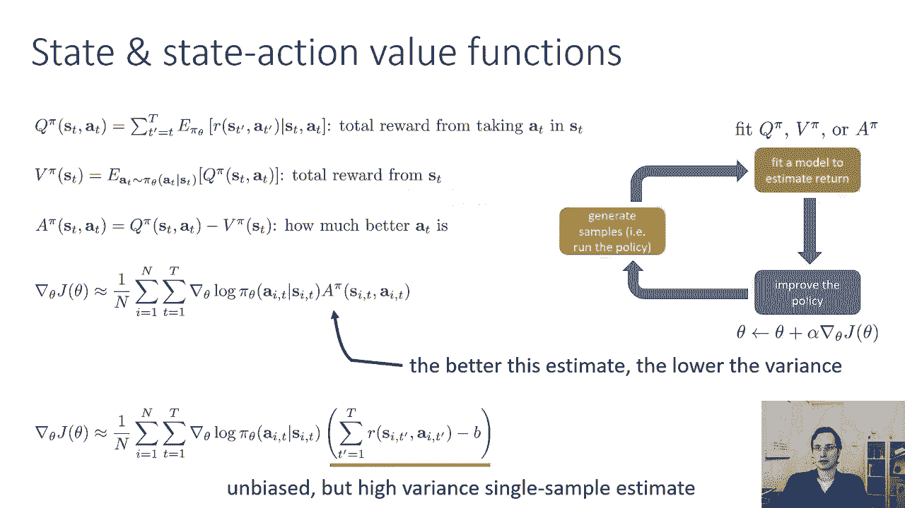
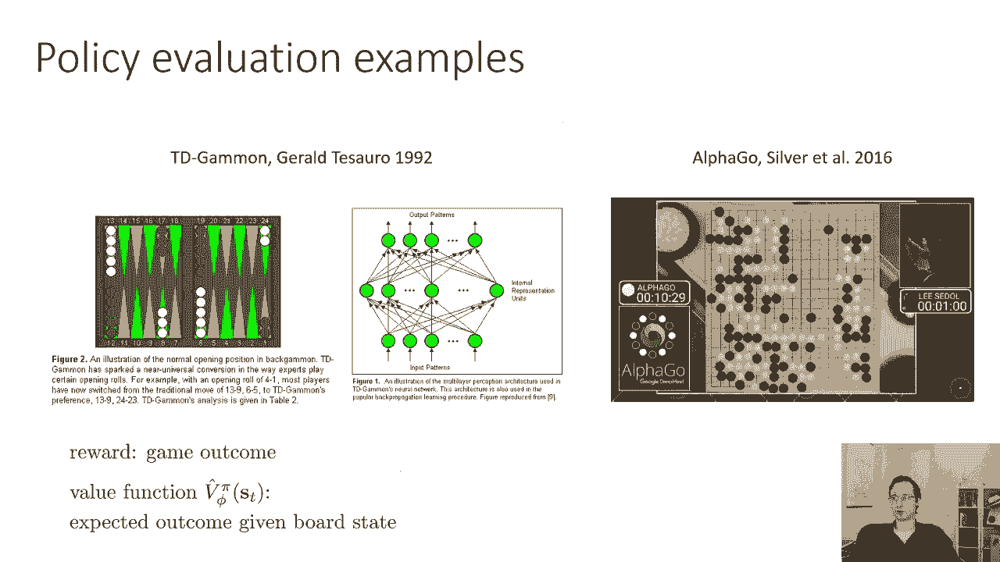
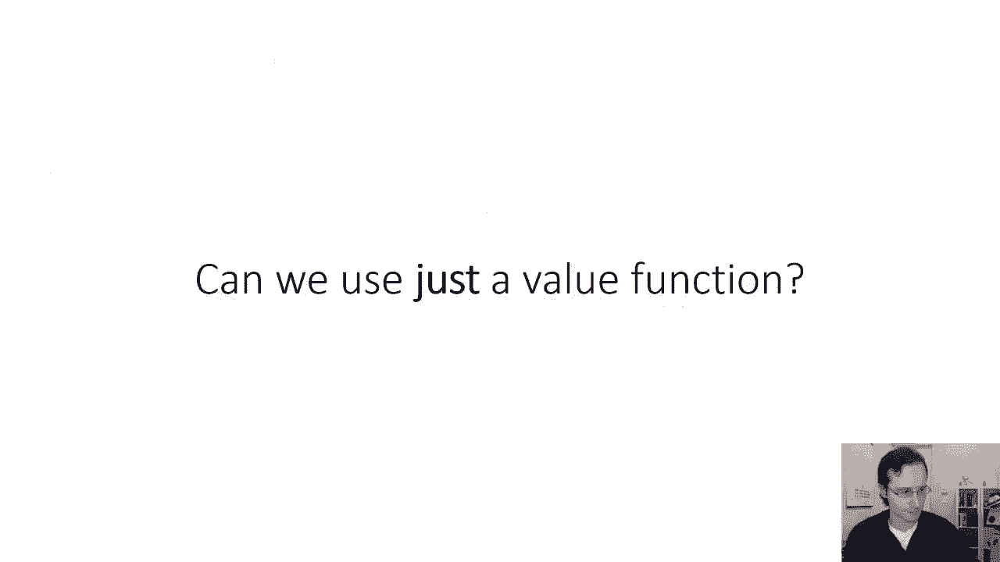

# 【双语字幕】伯克利CS 182《深度学习：深度神经网络设计、可视化与理解》课程(2021) by Sergey Levine - P48：CS 182- Lecture 16- Part 1- Actor-Critic & Q-Learning - 爱可可-爱生活 - BV1PK4y1U751

欢迎来到CS第十六课，在今天的讲座中，我们将继续讨论强化学习，学习演员，批判性算法与Q学习方法，所以回顾一下周一的上一次，我们了解策略梯度，脉搏，经典的策略梯度算法被称为增强，由三个步骤组成。

通过运行当前策略对轨迹进行采样，通过平均梯度之和来评估策略梯度，原木馅饼和奖励，然后向政策梯度的方向迈一步，所以你可以把它看作是有三个步骤来生成样本，估计奖励，然后完善政策，这些Q帽刚刚给出的奖励估计。

通过将当前时间步长到结束的奖励相加，而政策的改善是一个梯度的步骤，所以我记得我们用Q帽来表示奖励，从当前步骤T到结束的奖励之和，我们要关注的是这个学期的奖励，在今天的讲座中，其实有很多。

你可以比在强化中更有效地估计这个术语，这就产生了一种更强大的算法，那么让我们来谈谈如何提高政策梯度，Q HAT是对预期回报的估计，如果你在州内采取行动，这个估计越好，在常规强化算法中。

您的策略分级就越准确，这个估计数是通过求和得到的，从时间步T到结束所获得的实际奖励，但这些回报一直存在，在那个时间步长之后，你只能遵循一个可能的轨迹，2。你能给出一个更好的估计吗？所以在强化中。

你会产生一个轨迹，然后如果你试图在一个特定的时间步长估计Q帽，你基本上是把轨迹的尾部加起来，这是一件非常合理的事情，然而，在现实中，如果你发现自己再次处于同样的状态，并采取同样的行动。

你可能会得到不同的结果因为之后发生的一切都是随机的，对呀，所以估计Q帽子只是通过加在一起，你得到的回报并不是你能得到的最好的估计，还有很多其他可能的未来你没有考虑到，当你用数学来做这个的时候。

奖励的总和是所谓的单个样本估计器，你本质上是在估计所有可能结果的积分，使用单个样本，它是有效的，意味着它是渐近一致的，但它不是你能得到的最好的估计器，所以你真正想要的是，你想要奖励的期望值。

从现在到最后你都会看到，但当然，精确计算这些期望值是不可能的，但如果你能以某种方式得到它们，那么您将有一个更好的估计器，你实际上会考虑到所有可能发生的未来，不仅仅是单个样本，直觉上。

这可能变得非常重要的地方是如果你采取了一些行动，然后你就得到了很高的奖励，但也许你得到这么高的奖励是因为你很幸运，也许你的行为是买彩票，你买那张彩票得到了很高的奖励，嗯，很有可能，如果你再买彩票。

你不会再赢了，如果你有足够的样本，最终你会看到这个，但如果你只有几个样本，你很幸运，那么你可能会错误地认为绑定水票是个好主意，然而，如果你对奖励有更好的估计，你可能会发现期望值并不高。

所以如果我们对预期的回报有更好的估计，它叫Q而不是Q帽子，然后我们可以简单地用它代替Q帽，并得到更好的策略梯度估计，所以我们来讨论一下，下一个，是我们可以估计这个期望值的方法。

简单地总结一下你实际进入的轨道上的回报，加强，那么基线呢，所以我之前的策略梯度表达式没有基线，但我们上次学到了基线真的很重要，所以在现实中，你想用梯度对数圆周率乘以q减去b，你应该用好哪些费用。

你应该用平均奖励，尤其是它实际上非常方便，如果你把在那个状态下所有可能的行为的回报平均一下，所以如果你平均不同的队列，当然还有，现在你的基线将取决于状态，事实证明，这实际上仍然是无偏见的类型。

我不打算通过证据来证明这一点，但实际上很简单，你在这些毕业日志馅饼上的系数将是Q，s a-v s，或者v s只是定义为q s a的pi下的期望值，我们称这些差异为Q减V优势。

优势描述了在状态下的动作A比平均动作好多少，平均作用的值由v给出，因为v实际上只是所有动作的平均值，由它们在圆周率下的概率加权，所以a s a描述了动作a在状态s中的优点，也就是Q值好多少。

s a的q函数值，则由s的p给出的状态s处的平均值，所以让我们，正式介绍这个术语，q s a被称为q函数，它告诉你在一个状态下采取行动所得到的总回报，S t，我们应该把它写成q pi。

因为Q函数取决于策略，它是特定策略的Q函数，它是你将得到的预期回报，如果你在州内采取行动，然后按照策略PI，s的值函数v pi正好是q函数的期望值，其中操作根据策略PI分布。

但这也意味着价值函数是你将得到的预期回报，如果您从状态C开始，然后遵循策略PI，优势函数只是区别，A T比S T状态下的平均动作好多少，策略梯度由动作的对数概率梯度给出，乘以它的优势。

你对优势的估计就越好，你对保单评级的估计就越好，你当然不知道优势值到底是多少，你不能准确地计算这些期望，但你可以用许多不同的方法来近似它们，其中许多是。

比简单地把你在单个样本上看到的奖励加在一起要好得多，所以一个的估计越好，策略梯度的方差越低，你的保单评级就越准确，所以我们看到的旧的政策分级只是一个单一的样本估计，它是中间这个更一般的方程的一个版本。

Q是由奖励之和给出的，V由一个标量值给出，那个，当然啦，不是很好的估计，这是一个无偏的估计，但它的方差很大，这意味着你需要大量的样本才能从中得到准确的估计，所以如果我们回到我们以前看到的这张照片。

我们要做的是，我们将维护策略分级算法的整体结构，但我们将改变我们估计回报的方式，而不仅仅是把奖励加在一起，我将在那里拟合一个不同的神经网络，一个单独的神经网络。

第二个用来估计q pi或v pi或a pi，所以我们现在有两个网络，一个政策网络和一个价值函数网络，我们将用它来估计这些优势，这将给我们所谓的演员评论算法。

那么我们能做什么呢，我们有三个不同的物体，q，v和a，它们都是相互联系的，我们最终想要的是一个，但是如果我们要安装一个单独的神经网络，我们可以好好问问，我们把它适合什么，我们适合什么，如此合身，做什么。

我们能拟合q pi或v pi或a pi的估计，Q圆周率是预期的奖励，你也可以写作为当前的奖励，加上对未来回报的期待，现在这个对未来回报的期望正是价值函数，所以你可以把你的Q函数写成当前的奖励。

因为s t和a t不是随机变量，加值函数在时间t加一的奖赏的期望值，这是一种，这有时被称为贝尔曼方程，这是最基本的递归之一，让我们再来一遍，以确保，很明显，q pi是t质数等于t的和，对回报的期望。

时间后的所有素数，步T是随机变量，但是s t和a t不是随机变量，它们实际上是这个函数的参数，因此，您可以等效地将该金额写入当前奖励，S d a t的R，这不是期望值，因为s t和a t不是随机变量。

加上对未来所有这些东西的期望，你知道的，对未来所有这些东西的期望，用v pi s d加1的期望值完美地概括了，其中sd加一按s t的p分布，加一给定s d a t。

这意味着你可以形成一个很好的Q PI近似值，S T A T，把实际的状态s加上你在轨道上看到的，这是s t加1的单个样本估计，但这不是对其余轨迹的单一样本估计，因为你还在用V PI。

所以你会得到一点近似误差，但只有一点点，不过，这是非常非常方便的，因为这意味着如果你想写出优势，你只要从这里减去vπs d，所以这意味着优势等于r s t a t，加vπs t加1减vπs t。

这意味着你可以同时表达优势和Q值，就值函数而言，值函数只依赖于状态而不依赖于动作，所以它应该更容易安装，因为它的输入更少，所以出于这个原因，经典的演员批评算法通常拟合值函数，虽然很有可能。

我们稍后再讨论这个问题，适合Q函数的批评算法，所以我们要做的是，我们将有另一个神经网络，它将状态作为输入，并输出价值的估计，所以它接受一个状态并输出一个标量值，我们将使用这个网络来计算这些优势。

然后插入策略梯度，为了保持符号的笔直，我们会说θ表示策略的参数，phi表示值函数的参数，拟合值函数有时称为策略评估，因为当你拟合值函数时，你不是想让政策变得更好，你只是想知道它有多好。

你试图找到它的值函数，一旦你找到它的值函数，然后您可以使用它来改进策略，顺便说一句，记住，强化学习目标只是总奖励的期望值，从初始状态开始，它也正好等于状态上值函数的期望值，所以如果你能计算值函数。

你也可以评估强化学习目标的价值，那么我们如何做好政策评估，一件非常简单的事情是所谓的蒙特卡洛政策评估，这基本上是政策梯度的作用，我们已经了解了这一点，我们只是以前没用过这个名字。

所以当您从策略中实际生成示例时，蒙特卡洛策略评估，运行它们，看看你得到的总奖励是多少，在这种情况下，您希望在特定状态下的值，大约等于从该状态开始到结束的奖励之和，如果你把轨迹尾部的奖励加起来。

在该状态下，您将这些用作值函数的标签，如果你有多个样本，你可以沿着多个样本对奖励进行采样，但通常你不能这么做，因为你不能传送到你以前见过的状态，在另一个轨迹中，然后再卷出来，从那里你可以传送回初始状态。

这就是当你生成一个样本时得到的，你不能传送到中间状态，所以如果你想要一个多样本估计器，你必须使用一个模拟器，在那里你可以重置到任意状态，所以通常你不能这么做，好的，但你不能有单一样本的估计。

所以我们能用神经网络函数近似进行蒙特卡罗评估吗，但是单一样本估计，所以你的神经网络会接收S，它将输出一个标量值，它表示您对值函数的估计，生成标签的方式，你要把你见过的所有州都带走，轨迹。

你只是通过采样生成，你要为每个州，你会把从那一步到最后的奖励加在一起，并把它们作为你的标签，记住，你可能有多个轨迹，它们的状态很接近，它们不会完全相同，但它们可能靠得很近。

所以学习一个值函数还是个好主意，即使您使用的是单个样本估计器，因为你是，为附近不完全相同的样本分配相似的值，所以如果你有两个附近的州有不同的标签，但他们靠得很近，很可能你的值函数实际上会平均它们的值。

这只是函数近似的效果，因为神经网络会试图表示，你知道的，有点连续，所以不如每个州都有多个样本，但还是很不错的，如此正式，这个方法的工作方式是你生成你的样本轨迹，然后对于你见过的每一个州。

你用从那个时间步骤到结束的总奖励来标记那个状态，我们将这些目标值称为y i t，然后你只需在监督回归损失上用梯度下降训练你的模型，关于均方误差损失，所以你的损失只是你所见过的所有州的平均值。

在该状态下的预测值，减去标签值，Y I T，所以这只是一个常规的均方误差回归问题，这实际上会得到更好的价值函数估计，比你直接插入这些奖励标志得到的要好，进入政策梯度，因为你的价值函数。

表示值函数的神经网络，我们会做一些平均，它将附近各州的值一起平均，这将减少那些幸运结果或不幸结果的影响，但你可以做得更好，到目前为止，我们了解到这些蒙特卡洛目标，你只要取一个样本和。

理想的目标是一个完整的期望值现在这些完整的期望值就像我们之前看到的，当我们描述Q函数和值函数如何相互关联时，可以写成现在的奖励，从t加1到该步骤预期奖励结束的和，记住。

我们的价值函数是直接试图估计预期的回报，所以如果我们知道Vπ，我们可以计算出更好的目标，作为当前的奖励加上下一个值，我们当然不知道，当然啦，如果我们知道，我们为什么要学它，但我们能做什么。

这被称为引导程序，在下一个时间步长中，用我们的当前值函数来近似V PI，所以本质上，价值函数将从自身学习，我们将看到预期的回报，步骤T是你现在得到的奖励，加上我们对未来预期回报的估计。

我们从自己的值函数中得到，所以我们可以直接使用前面的拟合值函数，所以现在我们的训练数据将通过滚动一些轨迹来获得，把我们看到的每一个州，然后给它贴上当时步骤的奖励，在下一个时间步骤中加上值函数。

其中值函数只是我们拟合到以前数据的以前的值函数，这就是我们现在的目标值，我们用监督回归再次拟合它，因此，这有时被称为引导估计，这可能看起来有点奇怪，因为我们只是再次使用我们自己的值函数，但如果实施得当。

它实际上会工作得更好，训练可能会更难，设置它可能会更难，所以它很稳定，但如果能让它稳定，它往往工作得更好，现在值函数，我们从政策评估中得到的价值函数，他们有时会有一些相当直观的解释，比如说。

这是一份叫做TD Gammon的旧报纸，回到1992年这里，目标是学习玩双陆棋游戏的价值函数，如果你赢了比赛，奖励是1英镑，而不是0英镑，否则在那种情况下，值函数，预期的回报只是预期的，呃。

这只是你对自己是否会得到回报的期望，所以值函数是板状态的函数，它实际上是你查看板的状态和你的值函数输出，考虑到董事会的状态，它认为你赢的可能性有多大，所以它有一个非常直观的解释，奖励是比赛结果，值函数。

给定奖励状态的预期结果，这基本上是你在Alphago中获胜的概率，用了同样的想法，即使它来了，你知道吗，在TD Gamit之后的几十年里，本质上是相同的原则，值函数是对板状态的评价。

这是你获胜的概率，现在我们已经讨论了如何估计值函数，我们可以推导出一个完整的演员批评算法，它实际上使用这些值函数来改善策略梯度，所以演员评论家这个词指的是我们有两个神经网络，现在我们有了演员的政策。

是真正行动的人，我们有批评家，那是值函数，它本质上批评了这项政策，试图估计它的价值，试图评估批的结构，演员批评算法与增强的结构非常相似，另外，我们将训练这些值函数，所以我们通过运行策略来采样轨迹。

我们将第二步的价值函数拟合到我们的抽样奖励中，在第三步，我们评估我们所看到的每个状态操作元组的优势，在第四步，我们通过将梯度对数PIE相乘来估计梯度，加上优点，现在需要注意的是我在这一点上写声音的方式。

我不再区分状态是否出现在同一个投影中，因为这个算法实际上并不关心，它所需要的只是下一个州的行动，它不在乎事物是否参与相同的轨迹，因为一切都是自举的，基本上我们从来不用一套。

我们不需要看到两个以上的连续状态，当然，在现实中，你仍然可以对整个轨迹进行采样，但是你可以从这些状态元组中提取本质上的状态操作下一个状态元组，并使用它们来拟合值函数，评估优势，评估政策梯度。

这样你就可以拟合你的值函数，抽样奖励，你可以用蒙特卡洛来做，但最好使用引导程序，这样效果会更好，用均方误差拟合它们，然后你用它们来估计这些优势，2。现在我有一个重要的插曲要和大家讨论，到目前为止。

我是如何解释引导程序的，这有点问题，因为你们知道你们中那些非常关注的人，可能已经注意到，每次更新value函数时，你拿以前的值函数，向它添加一些东西，所以如果你的回报总是积极的。

假设你知道他们是什么并不重要，只要它们都是正数，你的目标值会越来越大，因为你总是在添加东西，你从不做减法，如果你的剧集长度是无限的呢，你所做的，你最终要求和无限多个值，这其实是个大问题。

因为在这种情况下，您的值函数可能会变得无限，在某些情况下，有限的插曲是非常自然的，比如一些机器人任务，但往往更自然，有连续或循环的任务，其中，假设你想让这个小人形机器人运行，尽可能地。

所以在这里你的地平线真的是无限的，这是个大问题，因为现在你的价值将变得无限，所以有一个简单的技巧，你可以用来处理这类案件，这个技巧几乎总是在实践中使用，诀窍是你更喜欢尽早获得奖励，这是非常直观的。

我告诉你，我要给你十美元，也许你对此很高兴，如果我告诉你，我会在一个月内给你十美元，好的，你可能还很高兴，但没有那么快乐，如果我告诉你，我会在一年内给你十美元，也许你不会把我当回事。

因为一年后谁知道会发生什么，如果我告诉你一百年后我会给你十美元，你可能只是不在乎，因为你不会太关心一百年后会发生什么，这样我们就可以让我们的特工也这么想，让我们的代理人更喜欢奖励，我们这样做的方式。

即通过稍微修改此目标值，而不是拿奖励加价值函数，我们取奖励，把价值函数乘以一个小常数，伽马和伽马是一个接近于1的数，可能是零点九或者零点九九，这基本上会降低未来的奖励，零点九九很好用。

这个折扣系数是什么意思？嗯，它的意思实际上与为什么你可能不在乎背后的直觉非常相似，如果我答应一百年后给你十美元，你知道一百年后事情会发生变化，有人死了，你知道吗，也许你不会在身边享受那十美元。

代理人也可以这样想，你可以有一些概率，你可以把你原来的MDP，并且可以添加一个额外的状态，你可以称之为死亡，你每次都有可能进入死亡状态，所以本质上你死的概率，概率是一负伽马。

我们只是增加了死亡状态的过渡，每一个时间步长的概率为1-伽马，这意味着你留在MDP中不死的概率是伽马，所以死亡的概率是一负伽马，不死的概率变成了旧的概率时间扫描，因为值函数实际上应该被期望。

在跃迁概率下，你可以安全地将它乘以伽马，以解释生存的概率，这就是为什么你可以有伽马折扣的直觉，在实践中，我们几乎总是这样做，我们会使用零点九或零点九的伽马值，所以你可以把这看作是编码一个偏好。

有回报宜早不宜迟，或者你可以把它看作是编码，代理人可能在给定的时间步长中以低几率死亡的概率。

好的，这是带有折扣的演员评论家算法，我们也可以写出一个完全在线版本的演员评论家，所以有了这些引导的值估计，我们实际上只需要知道轨迹中的下一个状态，我们甚至不知道所有其他的州。

这意味着我们可以更新评论家和演员的每一步，而不是等着收集一批轨迹，所以一个完全在线的演员批评算法将从策略中采取一个操作，然后在世界上采取行动，看到由此产生的下一个状态，It’全盛时期。

所以我们得到一个元组s a s素数r，然后它会更新值函数，用它得到的奖励加上s素数的伽马乘以s素数，所以这给了你一个随机梯度下降的样本，然后它将再次使用该值来评估优势，这只使用s a s素数。

然后我们会用这个样本在策略上采取梯度步骤，同样，这只使用了一个样本，从而有效地实现随机梯度下降，所以如果你愿意做单个样本随机梯度下降，你实际上可以有一个完全在线的演员评论家算法。

它更新了评论家和演员的每一个时间步骤，所以它现在不断地学习，在现实中，只有一个样品的SGD不是一个好主意，它不会很稳定，所以在实践中，当人们实现这些在线演员批评算法时，它们通常有某种多线程进程。

其中它们有多个线程，每个收集一个样本，他们平均超过这些线程，得到一个迷你批量，我们不会在这堂课上讨论这个，但如果你对这个感兴趣，你可以查找一个叫做异步优势演员评论家的东西，它基本上实现了这个过程，好的。

演员评论家对神经网络体系结构的简要评论，我们有这两个网络，我们必须实现一个评论家网络和一个演员网络，v和pi，我们有几个选择来做一个非常简单的选择，实际上有两个独立的神经网络。

一个神经网络将状态映射到标量值，和其他网络映射状态到操作上的分布，这可能是最简单的设计，它简单而稳定，但它可能有点低效，因为演员和评论家之间没有共同的特征，你直觉上知道，您需要评估的信息。

该值可能与运行策略所需的信息非常相似，但由于这是两个完全独立的网络，他们不允许分享这些信息，所以更先进的设计，共享网络设计是这样的，嗯，我道歉，在这条线上切断的，但它是一个有两个独立头部的单个神经网络。

一个头代表值一个头代表策略这允许您共享表示，但可能会有点不稳定。

