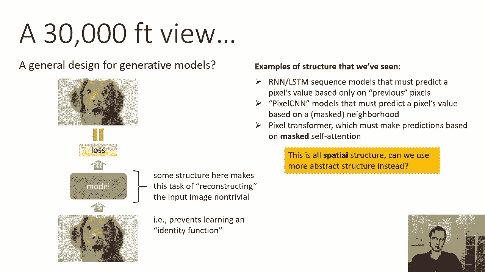
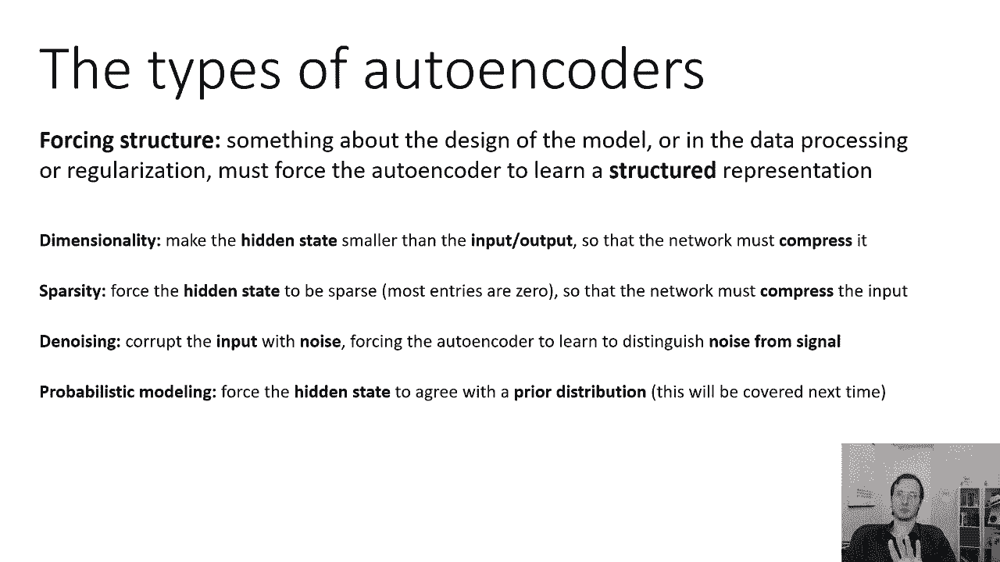
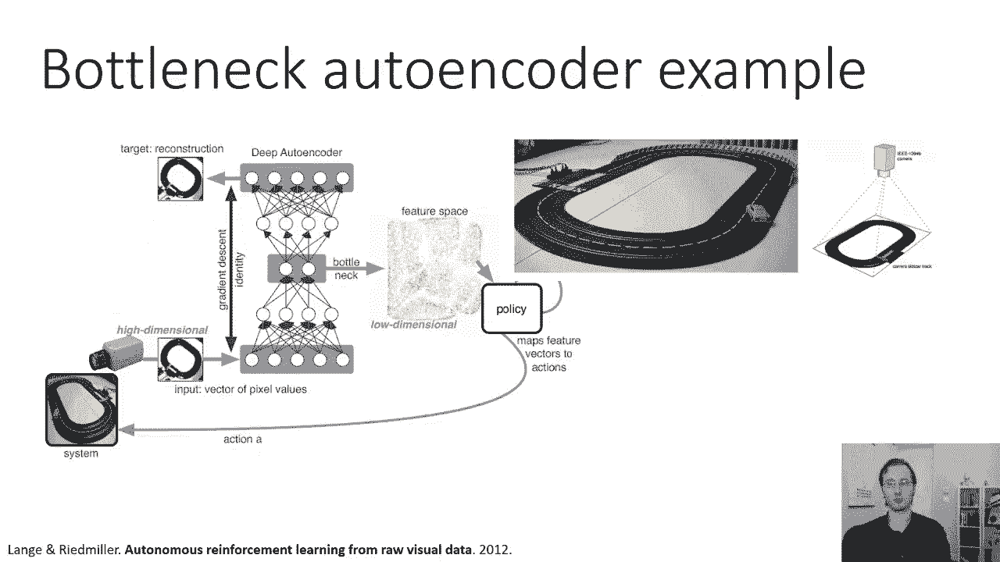
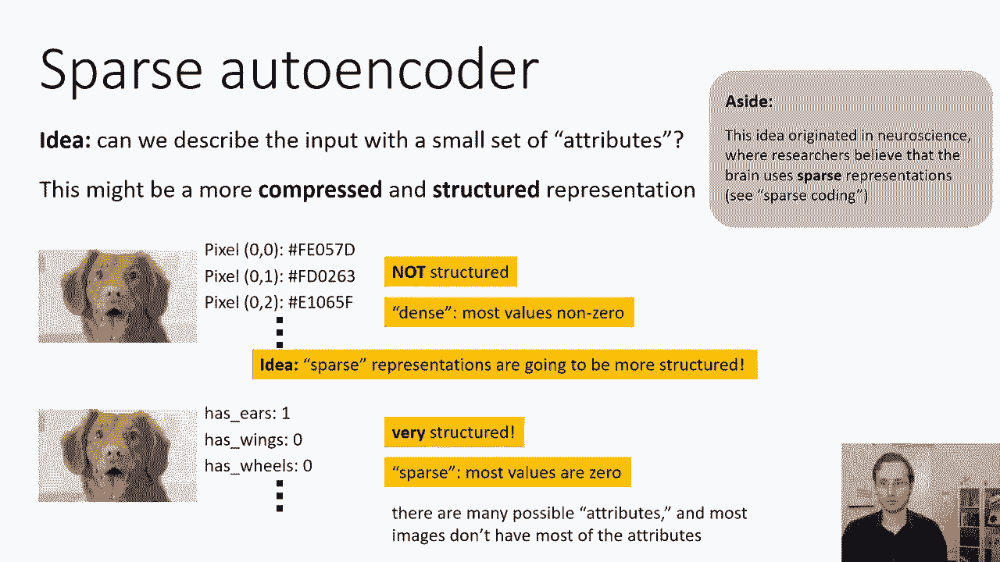
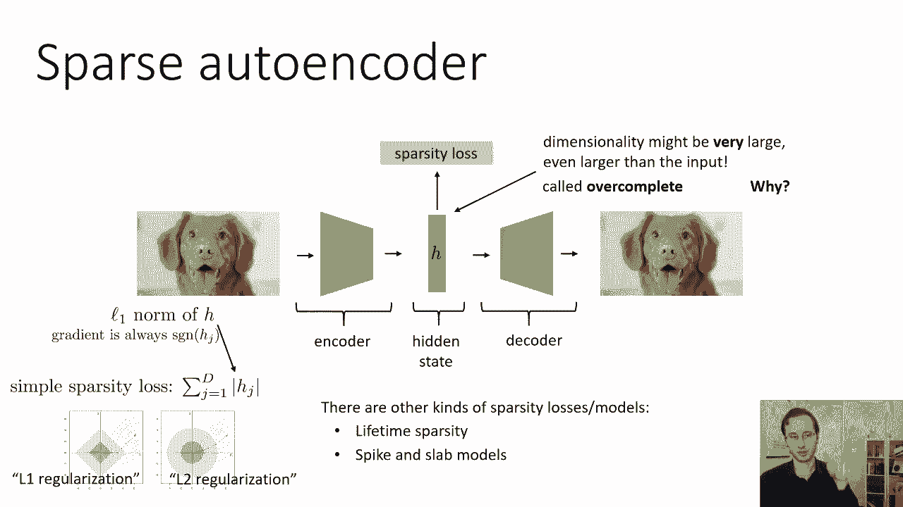
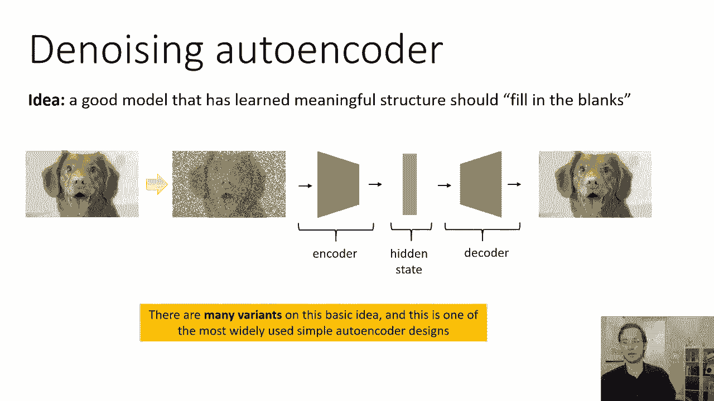
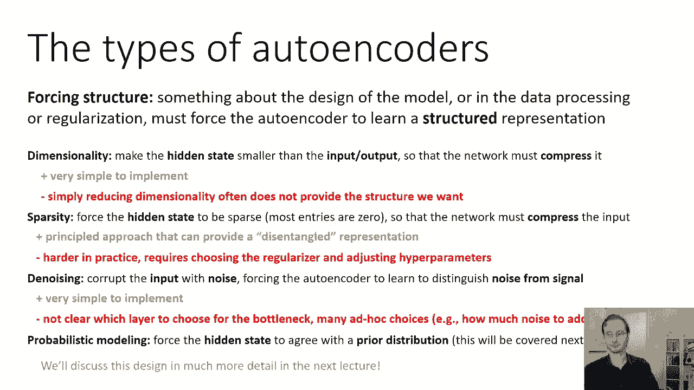

# P52：CS 182- Lecture 17- Part 2- Generative Models - 爱可可-爱生活 - BV1PK4y1U751

在讲座的下一部分，我将谈谈一种不同的模型，叫做自动编码器，现在自动编码器是，你知道的，用于各种无监督学习任务的非常广泛使用的模型类，并非所有的自动编码器都是生成型的，事实上。

我们今天要讨论的自动编码器很难在一代中使用，但我们将在周三讨论一种特殊的自动编码器，叫做变分自动编码器，实际上是一个非常好的生成模型，因为自动编码器是如此古老和广泛使用的经典型号。

这节课的大部分内容实际上是关于，人们在深度学习中探索的模型类型，其中一些模型今天可以使用，尽管它们通常不是性能最好或最有效的模型，但我认为讨论这个话题很重要，部分是为了提供一点视角。

看看这些想法是从哪里来的，部分是为了提供我们需要了解更多的基础，现代自动编码器体系结构，我们以后再谈，所以让我们从一个非常，概率无监督学习模型的超高层视图，比如说，像语言模型这样的东西，在很高的水平上。

您可以将它们看作具有输入，其中输入与图像相对应，图像中的像素，现在这些像素必须以某种方式排序，但整个图像都在那里，整个图像作为输入，目标是产生同样的图像，但在中间，你有一些结构。

这使得重建图像的任务变得不那么简单，所以像素RNN中的特殊结构，例如，像素RNN不能看到，它还没有生成的像素，所以它必须在看到那个像素之前生成一个像素，比如说，像素一二必须在第二步生成。

然后它只在第三步时作为输入，所以在这种情况下，结构是这样一个事实，即每个像素都必须由前面的像素构造，如果没有这个结构，目标是将图像映射到自身的任务将是微不足道的，类似地。

像图像转换器这样的东西也将整个图像作为输入，它产生与输出相同的整个图像，因为它使用了掩盖的自我关注来强加结构，这使得将输入映射到自身的质量问题变得不平凡，这是一个很好的时间来回想我们所学到的一些事情。

当我们谈论语言模型时，比如伯特就在那里和伯特一起建造一个双向变压器，我们必须构建的语言模型，我们必须面对这个问题，迎面，我们不得不问我们可以强加什么样的结构，这使得将句子映射到句子本身变得不容易。

我们当时了解到，如果你只是使用一个定期的不蒙面的自我关注，就像变压器编码器一样，那么伯特的任务就微不足道了，因此，bert使用每个令牌的掩蔽来强加结构，所以三万英尺的视野，输入是图像，输出是相同的图像。

中间有一些结构，这种结构使得将图像映射到自身的问题变得不那么简单，这迫使模型学习有意义的表示，所以你可以把它看作是生成模型的一般设计，或者更广泛地说，用于无监督学习的模型，你有一些投入。

这可能是一个图像，自然语言句子向量，不管你有什么，它进入模型，这个模型有一个损失，即产生与输出相同的东西，所以模型的损失基本上是重建进来的东西，任意模型可以学习恒等函数，但是某种结构被强加给模型。

这使得重建输入图像的任务变得不容易，不是微不足道的，这阻止了模型学习恒等函数，并迫使它学习有意义的表征，我们见过的结构例子，rnn，或者必须预测像素值的LSTM序列模型，仅基于以前的像素，像素。

必须预测像素值的CNN模型，基于掩码邻域像素转换器，它基于掩蔽的自我注意进行预测，现在所有这些模型都有空间结构，对吧，附加结构本质上是空间的，它与图像中像素的排列有关，或者句子中单词的排列。

但是我们能不能用更抽象的结构，一旦我们识别出所有这些模型，基本上读入x，然后输出相同的x，然后中间有一些结构，我们能在更抽象的东西中间改变这种结构吗，所以更广泛地说，接受一些输入的模型。

然后被要求生产与输出相同的东西称为自动编码器。

和原则，自动编码器背后的基本思想是，训练一个网络，将图像编码到某种隐藏状态，然后尽可能准确地从隐藏状态解码图像，这样的网络称为自动编码器，它需要某种结构来迫使隐藏的状态有意义，自动编码器的一般配方是。

你有一个图像通过一些神经网络，我们称之为编码器，那么我们在网络中有某种中间表示激活，我们称之为隐藏状态，然后解码器获取隐藏状态并产生与输出相同的东西，所有这些语言模型，我们以前看到的东西有这种顺序结构。

所以现在我们将完全省去顺序结构，我们不会有顺序的东西，我们会谈论其他，我们可以用来在隐藏状态上强制结构的简单原则，隐藏状态是我们实际用于下游任务的状态，所以自动编码器的目标是获得一个隐藏的状态。

它基本上是一个表示学习目标，一旦我们获得了隐藏的状态，然后我们可以用它来做各种各样的事情，比如训练，分类器，等等，所以关于模型的设计，或者数据处理或正则化方面的东西，必须迫使自动编码器学习结构化表示。

在这节课的这一部分，我们要做的是，我们将讨论不同类型的结构和不同的机制，强迫人们过去尝试过的结构，其中一些方法更多的是为了透视，好像它们不是真的用过，今天这么多，其中一些实际上仍然被广泛使用。

虽然可能不是最，呃，一种尖端的方法。

所以强迫结构的一种方法是限制维度，使隐藏状态的维数小于输入或输出，因此网络必须压缩输入或输出，所以如果你的输入有三个二乘三的图像，你的隐藏状态只有十六个维度，现在你必须用16个数字来表示整个图像。

维度的降低可能会导致更有意义的结构，你可以做的另一件事是稀疏，强制隐藏状态稀疏，这意味着隐藏状态下的大多数条目为零，因此网络必须压缩输入，一开始这可能看起来有点奇怪，但我将很快描述这背后的直觉。

另一个可能看起来奇怪和违反直觉的，但它实际上非常有效的是用噪音破坏输入，迫使自动编码器学会区分噪声和信号，最后一个，我们将在周三更详细地讨论这一点，就是迫使隐藏状态同意先验分布，这可能看起来有点奇怪。

如果这对你来说没有意义，别担心，我们将在星期三详细讨论这个问题，但这实际上是我们可以用来获得自动编码器的方法。

也是非常好的生成模型，所以让我们从最简单的维度开始，这有时被称为瓶颈自动编码器，它是最经典的自动编码器之一，这里的想法是无论你输入的维度是多少，你选择隐藏状态的维度要小得多。

所以如果你有一个100乘100像素的图像，它有一万个维度，将隐藏状态限制为只有，比如说一百二十八维，所以它不可能学习恒等函数，因为它可以存储每个像素的值，在那一百二十八个维度里，这是一个非常简单的。

它确实有一些有趣的特性，一个有趣的数学事实，我没有时间去证明，但如果编码器和解码器都是线性的，这是真的，这意味着它们不是神经网络，它们只是矩阵乘法，用均方误差训练这种瓶颈自动编码器进行重构。

精确恢复主成分分析，其中隐藏状态的维度是，你将要得到的主成分的数量，这似乎令人惊讶，但这其实是真的，所以在某种意义上，你可以想到一个瓶颈自动编码器，作为主成分分析的一种非线性推广。

所以你可以把它看作是非线性的，降维--它可能很有用，因为隐藏状态的维数更低，然后你可以使用各种只能在低维空间中处理的算法，从我的经验来看，你通过训练得到的各种表示，瓶颈自动编码器不一定很有用。

从某种意义上说，它们不倾向于解开变异的潜在因素，他们不一定真的很好，让我们说，下游分级机，但事实上，你可以减少维度，这在一些应用中非常有用，这是一种非常简单的非线性降维方法，与一些替代品相比。

现在我应该说这种设计被认为是相当过时的，也不常用，但很高兴知道，也许在某个时候，你确实需要让你的数据更低维，你可能会发现这很有用。

所以就，提到这种方法的一个经典应用，这实际上是一篇关于强化学习的论文，从2012年开始，目标是控制一辆小槽车，所以它是一辆在赛道上的小车，在那里你使用游戏控制器来增加或减少速度。

你必须用图像在赛道上比赛，以及这个算法在拍摄老虎车图像时的工作方式，他们训练一个瓶颈的自动编码器，它实际上自动将图像编码到一个非常低维的特征空间，只有二维，一旦他们把它编码成二维，他们实际上把它离散化。

运行一个非常简单的，在这个低维空间中一个非常有效的Q学习风格算法，这使得他们基本上可以对图像进行RL，这篇论文早于大多数更复杂的，我们在休息前讨论过的深度RL方法。

这就是降维的自动编码器，让我们来谈谈第二种结构稀疏自动编码器，这些更复杂一点，它们今天仍然没有被广泛使用，但它们值得了解，它们与神经科学也有一些有趣的联系，所以基本原则是这样的。

我们能用一小组属性来描述输入吗，所以这个想法是，如果你有一个图像的描述，就像，你知道吗，像素零有这个颜色，像素零一是这个颜色，像素零二有那种颜色，等，对图像的描述是完整的，从这个意义上说。

它足以充分构建图像，但它不是很有条理，这不是很容易解释的，因此，它可能对下游分类不太有用，如果你有一个图像的描述，就像，不管这个图像里有什么，它的耳朵和它的耳朵一样，耳朵特征真实，它有翅膀的特征假的。

有轮子的特征是假的，等等等等，等，基本上，如果您有一长串所有可能的属性，图像中的东西可能有，这些属性中的每一个都是1或0，这也许更有用，因为这样你就可以说好了，狗是所有有类似耳朵的东西，没有翅膀。

没有轮子和翻牌，你知道，可爱，小狗，眼睛什么的，你知道，随便啦，你基本上有描述狗的属性，这类表示的一个有趣的性质，对于大多数图像，大多数属性将为零，2。为什么会这样，因为世界上有大量可能的物体。

这些对象中的每一个都是大量可能的属性，大多数对象没有大多数属性，所以如果我列出，就像动物可能拥有的所有属性一样，我给你看一张动物的照片，很可能它只有这些属性中的几个，这实际上与结构密切相关。

所以稀疏性原理说，你想要的是这种属性字典，它很有条理，而且会趋于稀疏，因为大多数对象并不拥有大多数属性，大多数值都为零，这真的很整洁，因为存在于该对象的属性非常特定，它们是对那个物体的描述。

因此它们有助于识别物体，所以这是一个比最小化维度更微妙的概念，但这实际上是一个非常强大的概念，所以这个外卖，呃，在我们经历了所有，这个，有点费力的逻辑是，如果我们能以某种方式提取出稀疏的图像表示。

这意味着对于大多数图像，大多数功能将为零，我们有充分的理由相信，这种代表实际上会非常有条理，因为它会直观地试图用这些属性来表示图像，所以稀疏只是意味着大多数特性的大多数值在大多数时候都是零。

所以基本上背后的直觉是有很多可能的属性，大多数图像没有大多数属性，这不是一个明显的概念，所以如果你不清楚这一点，你知道的，考虑重新看前两个，三分钟的讲座，试着说服自己这可能是真的。

但如果我们真的接受这个前提，那我们就有工作要做了，如果我们想要这种结构，我们必须弄清楚如何学习稀疏表示，基本上表示隐藏状态的大部分维度设置为零，对于大多数图像，显然不是所有这些维度。

因为其中一些维度是非零的，这是非常关键的，但对于不同的图像，它们可能应该是不同的维度，作为旁白，这个想法实际上起源于神经科学，研究人员认为大脑实际上使用这些稀疏的表征，代表世界上的事物，1。

这种事已经过实验证实，这实际上是神经科学中一个被广泛接受的想法，如果你想了解更多，查找一种叫做稀疏编码的东西，这实际上是，呃，在伯克利被布鲁萨曼教授的人发现。

如此稀疏自动编码器，这将是一个自动编码器，学习这些类型的稀疏表示，我们唯一要做的就是得到一个稀疏的自动编码器，我们必须选择一个稀疏损失，所以说，我们将用反向传播训练稀疏自动编码器。

在重建输入时最小化某些损失函数，但它将有一个额外的损失函数应用于隐藏状态，这将鼓励隐藏状态稀疏，现在至关重要的是，当我们训练稀疏的自动编码器时，隐藏状态的维度实际上可能非常大，所以很不像瓶颈自动编码器。

稀疏水编码器不需要有低维隐藏状态，事实上，在许多情况下，我们可能有一个极高维度的隐藏状态，可能比输入的维数还要大，因为对象可能具有的属性数，甚至可以大于像素数，这有时被称为过度完整的表示，所以呃。

我们为什么要这口井，因为可能会有一个非常，非常多的属性，事实上，我们给模型的属性越多，维度越多，表示越稀疏，所以我们想给它一个非常高的维度，所以我们把这个隐藏状态叫做h，我们可以使用各种不同的稀疏损失。

我们可以使用的最简单的稀疏损失之一，把每一维的绝对值求和，这可能看起来有点奇怪，仅仅最小化绝对值，激活稀疏，但为什么这是真的直觉，绝对值的导数是一个常数权，所以不像HJ平方，导数依赖于HJ。

h绝对值的导数，j总是1或负数或负数，取决于标志，这意味着h j的小值被向下推，接近零，就像大值一样强烈，但是更大的值是，当然啦，对重建图像更有用，所以当我们把这种绝对值稀疏损失结合起来，连同重建。

网络会倾向于推动已经很小的h值，一路降到零，更大的价值也会被推低，但既然它们对重建如此有用，它们也将被用来帮助重建，因此较大的值将保持较大或较小的值将被消除，这有时被称为h的l一范数。

它的梯度总是h j的正弦，如果你回想一下我们之前关于偏差和方差的讨论，在课程的一开始，我们实际上看到了这种正常的，之前的这种规整剂，当我们讨论l 1正则化和l 2正则化时，现在在当时。

我们讨论了1个正则化和1个正则化，关于Logistic回归模型权重的两个正则化，而这里我们谈论的是激活，但原理是相似的，就像，Logistic回归模型权重的一种正则化，诱导稀疏重量。

l一个稀疏的城市损失在h上导致稀疏，这不是唯一一种能给你稀疏表现的损失，还有其他类型的损失或模式，如果你想了解更多关于他们的信息，你可以查找像平板模型这样的东西，寿命稀疏性，等等。

所以人们探索了很多东西来获得，以各种不同方式工作的稀疏表示，但是简单的l-one范数是一个非常常见的选择，它可以很好地工作，像终身稀疏这样的事情可以更有效一点，寿命稀疏基本上说。

而不是一直最小化所有的激活，你要把每一个单元，在一小部分图像中h的每一维都为非零，所以它实际上查看整个数据集的激活，而不是平等地最小化所有这些。

这可能会更有效，所有的权利，我们今天要讲的最后一种自动编码器，是一个去噪自动编码器，和去噪自动编码器，实际上是最经典和最广泛使用的自动编码器类型之一，这是一个很好的模型，背后的想法是。

一个好的模型已经学会了有意义的结构，学会了有意义的结构，应该能填空，这和伯特的想法很相似，事实上，你可以把bert看作是一种去噪自动编码器，所以这个想法是，如果你拍了一张照片，你以某种方式破坏了它。

然后你要求你的模型基本上消除腐败，那么你的模特就必须学习一些关于真实感图像是什么样子的东西，因为如果你只是破坏完全随机的图像，那里没有图案，所以没有办法去除腐败，但如果你破坏自然图像。

它可以计算出像边缘这样的东西，角落和精神上的盐水特征，如眼睛和耳朵，出现在真实的图像中，而点画白噪声一般不存在，所以如果它学会了去除白噪音，但保留语义相关的特性，它将了解现实图像是什么样子的。

在这个基本思想上有很多很多的变体，这真的是最广泛使用的简单自动编码器设计之一。

所以真的没有那么多。

我可以说去噪自动编码器，这很简单，它可以用来学习有意义的结构，它可以用来学习隐藏状态，然后可以用作特征表示，像伯特这样的事情可以被视为一个特例。

一种特别复杂和有用的去噪自动编码器，总结一下自动编码器的类型，它们都有一些强迫结构的机制，关于模型的设计，或在数据处理或正规化中，必须强制自动编码器学习结构化表示，这可能是维度，使隐藏状态的维度变小。

这样它就可以进行降维，这很容易实现，但是简单地减少维度往往不能提供我们想要的结构，所以说，如果你想要的是降维，它是伟大的，如果你想要的是某种解脱，让它更容易做到，让我们说。

下游分类它可能不会给你一个你想要的结构，它实际上可能会聚集在一起，不一样的东西，稀疏性，强制隐藏状态稀疏，这意味着大多数条目为零，因此网络必须压缩输入，这是一种原则性的方法，可以提供非常好的解纠缠表示。

在神经科学方面有很好的理论基础，但在实践中更难，因为这需要选择合适的正则化剂，它需要仔细调整正则化器的超参数，平衡重建与稀疏，所以这可能是一种更难使用的自动编码器，去噪自动编码器用某种噪声破坏输入。

迫使自动编码器学会区分噪声和信号，这可以很简单地实现，它需要做出一些设计决策，这些决策有点临时，比如说，不清楚该选择哪一层作为瓶颈，就像你知道的，哪个层成为隐藏状态，哪一层作为隐藏状态最有用，嗯。

你不知道你通常会选择像中间层这样的东西，但这是一个有点临时的选择，还有许多其他临时选择，要添加多少噪音，在哪里添加噪音，为什么会这样，如果你能仔细地做出所有这些选择。

你可以设计一个像伯特这样非常强大的模型，但要想做出正确的选择需要一点努力，对于特定类型的数据和特定类型的模型，我们今天没有讨论的最后一种自动编码器，但我们将详细介绍。

星期三是一种叫做变分自动编码器的东西，变分自动编码器执行概率建模，它基本上将自动编码器与概率生成模型连接起来，我们在这节课的第一部分讨论过，隐藏状态将被迫同意先前的，这使得我们可以用它来取样。

我们将在第三部分讨论它。

