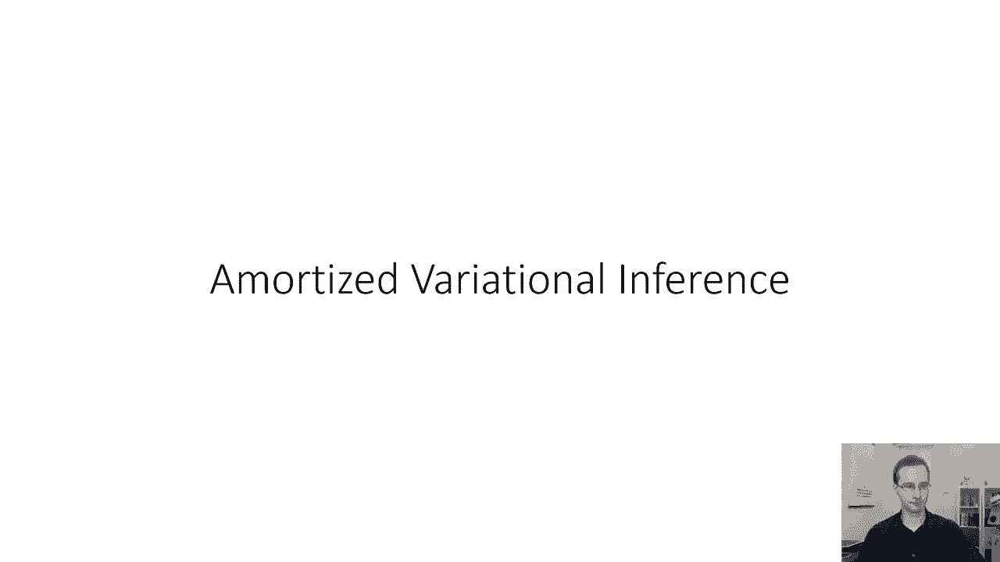
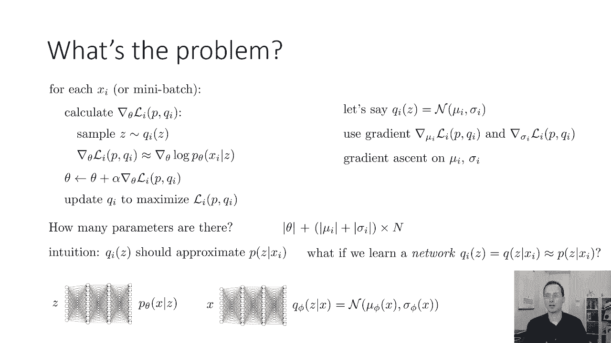
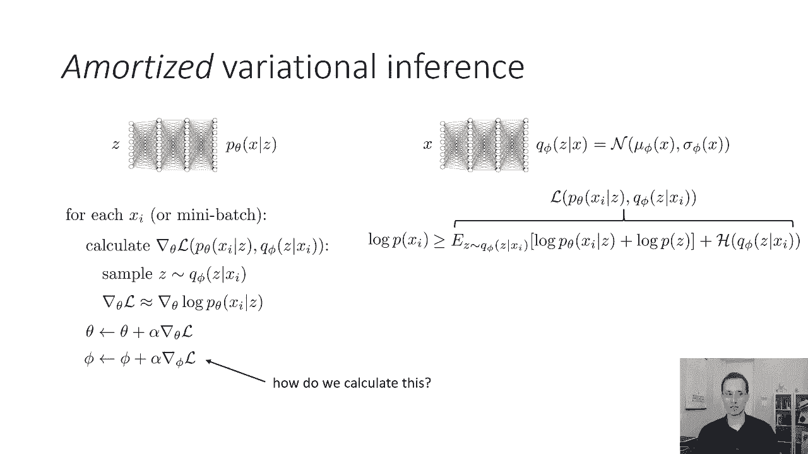
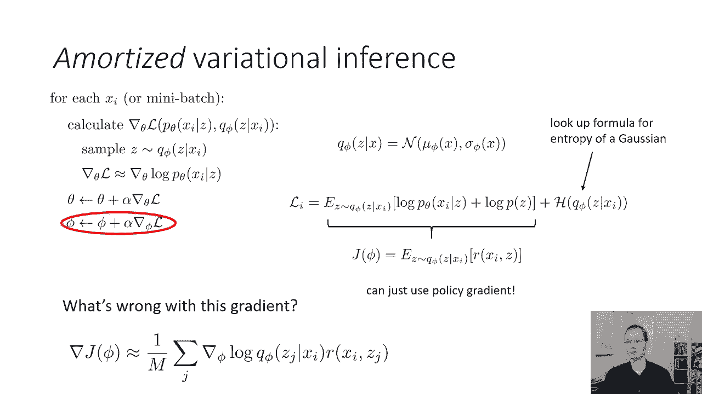
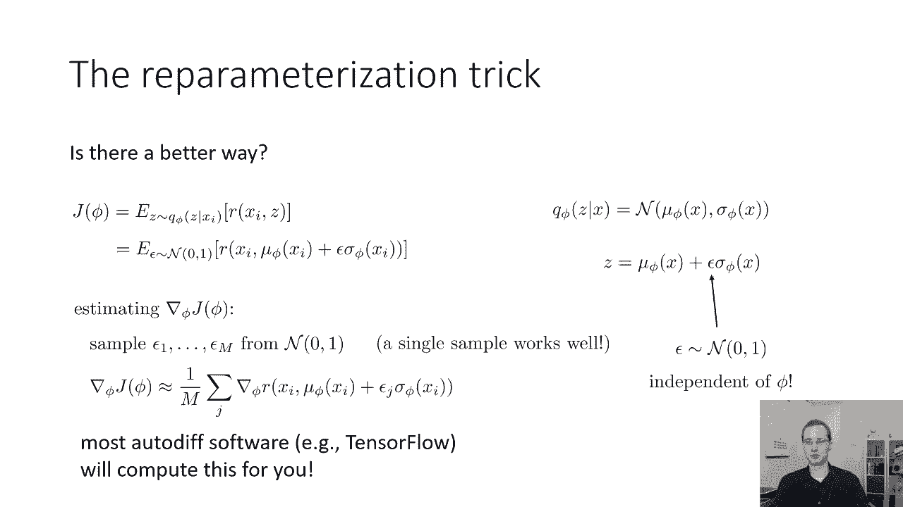
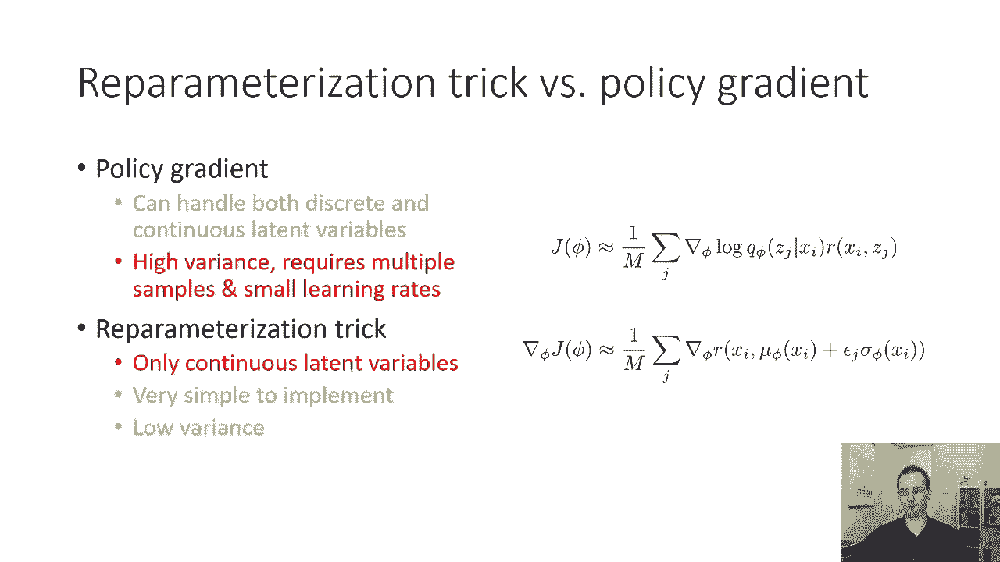

# 【双语字幕】伯克利CS 182《深度学习：深度神经网络设计、可视化与理解》课程(2021) by Sergey Levine - P55：CS 182- Lecture 18- Part 2- Latent Variable Models - 爱可可-爱生活 - BV1PK4y1U751

所以在第一部分，我们讨论了正则变分推理是如何，它可以是训练潜在变量模型的一种可行的方法，但是如果我们有一个单独的Q，对于我们数据集中的每个数据点，z的i，那我们就有这个问题了。

我们必须存储的手段和差异的数量可能是巨大的，如果我们的数据集很大，所以在这一节中，我们将讨论一种叫做摊销变分推理的东西，原因被称为摊销变分推理是因为，而不是分别表示每个数据点的均值和方差。

我们将推理的挑战分摊到所有数据点上，通过使用一个神经网络来为我们进行推理，所以我们实际上有两个神经网络，一个x的神经网络pθ给定z，这基本上是我们的生成模型，和给定x的z的第二个神经网络q phi。

它试图预测给定图像的Z上的分布，具体地说，它会预测两个量，z上的平均值和c上的方差，这本质上意味着不是为每个数据点存储单独的均值和方差，我们只是有一个神经网络试图把它们吐出来。

试图预测它们，所以我们有两个神经网络，我们要学习，我们将使用下限的证据，但现在我们以前有z的q i的地方，所以现在我们的证据下限是期望值，所以我获得这个表达式的方法是。

我只是取了我们在第一部分中导出的前一个下限，我们到处都有z i的q i，这是我唯一做的改变，所以它只是表示z的q i的一种不同的方式，所以它仍然是一个下限的证据，现在的训练过程是这样的。

你首先计算关于证据下限的梯度，然后用这个样本近似你的渐变，在给定z的情况下，取对数p的θ的梯度，这很容易用反向传播来计算，然后你在这个上面采取梯度上升的步骤，然后你必须在phi上采取梯度上升的步骤。

通过计算关于l的phi的梯度，这部分有点棘手，phi出现在证据下界的两个地方，它显示为我们计算期望的分布的参数。

它出现在第二个熵项中，所以让我们再谈谈这个，这又是我们的下限证据，记住q phi只是一个高斯分布，其中均值和方差由x的神经网络函数给出，熵项的梯度很容易处理，你可以查一下高斯熵的公式。

它只是用mu和sigma来表示的，您可以在tensorflow或pi torch中对该表达式进行编码，并为它获得渐变，这是容易的部分，但第一部分要复杂一点，我们可以考虑计算第一部分梯度的一种方法。

是要注意的，期望中的所有东西都不依赖于phi，所以我们可以把这些术语收集成一个表达式，我将调用x的r，逗号z和我故意选择字母r，因为现在这样写，它看起来很像我们在强化中的表达，学习，在强化学习中记住。

我们的目标是奖励的预期价值，其中对由保单确定的分配取期望，现在我们得到了某个函数r的期望值，其中分布由q i决定，所以我们可以使用策略梯度，我们可以从字面上使用完全相同的表达。

我们在强化学习讲座中得到的，来计算这个导数，这是一个表达式，当然，我们可以使用基线和所有其他的东西，但简单的版本是生成一些Z的样本，然后平均，然后一起平均，逗号z j，好的。

这是训练潜在变量模型的可行方法，和，事实上，呃，有有效的算法利用了这一点，但不是最好的，这个渐变表达式有什么问题，为什么我们不想这样做呢，嗯，这个梯度表达式的缺点和政策的缺点是一样的，梯度，一般来说。

方差很大，这意味着我们可能，在实践中，必须生成相当多的样本ZJ才能得到准确的梯度估计，这其实不是什么大问题，因为你知道生成这些CJ样本需要我们一些计算，但除此之外，这并没有什么问题，但有一个更好的方法。

我们可以训练这些模型的方法在实践中会更快更有效，它将利用这一事实，不像在强化学习的情况下，在潜在变量模型的情况下，我们实际上可以计算r的导数。

这叫做读取参数化技巧，所以这是我们的想法，我们有我们的表达，我们要计算关于phi的导数，但是PHI不仅仅是任何分布，phi是正态分布，高斯分布，这意味着我们也可以写Z。

作为均值、方差和Epsilon的确定性函数，这是一个标准的高斯样本，所以z等于μφx加上ε乘以x的sigmaφ，其中Epsilon正态分布，均值为零，方差为1，这是因为高斯宽度，非零均值。

和一个不是1的方差，可以表示为零一高斯的仿射变换，所以这总是真的，但现在请注意，这里的一切都是确定性的，除了Epsilon，但是Epsilon不依赖于phi，它不依赖于神经网络。

所以我们可以等价地把我们的目标写成关于Epsilon的期望值，我们用这个方程代替z，所以它是一个期望值，关于按零均值单位方差分布的Epsilon，加上epsilon乘以sigma phi x i。

但是请注意，现在phi只出现在期望中，我们取期望的分布，不再依赖于phi重新参数化分布，这就是为什么它被称为重新参数化技巧，所以现在我们可以估计关于精细的梯度，如下。

我们可以对一堆epsilon进行采样，也许我们从零均值单位方差高斯中取样n个ε，尽管只取样一个epsilon实际上效果很好，然后对phi的导数，利用微分的链式法则，这只是总体上的平均数。

我们可以用我们最喜欢的自动微分软件计算这个导数，我们在强化学习中不能做到这一点的原因是在强化学习中，我们不知道奖励的衍生物，但现在他们是，现在我们可以做到这一点，所以大多数附加软件实际上会为你计算这个。

现在，如果这看起来有点抽象，我会告诉你最终的模型是什么样子的。

可能会更明显一点，如何计算所有这些导数，所以我们可以用另一种方式来看待我们的证据，下限，客观，我们要做的是第一学期，我们把它分成两部分，对数pθ的q phi下的期望值，和Q 5对数p下的期望值。

我把它分开的原因是因为θ只进入第一学期，第二项和第三项与θ无关，事实上，如果我们把第二和第三项组合在一起，我们会注意到这是负的kl散度，这个kl散度通常有一个非常方便的解析形式。

两个高斯函数之间的kl发散有一个封闭形式表达式，你可以在教科书或维基百科上查找，它只是一个公式，你可以在TensorFlow中编码，或者圆周率火炬，并将为您计算您的导数。

所以像这样把证据的下界表达出来是很方便的，因为所有困难的事情基本上都在第一学期，这很容易，你只要把它的公式编码出来，你得到导数，然后如果我们应用重新参数化技巧，然后第一项成为噪声分布下的期望值。

加上epsilon sigma phi x i，所以θ和phi都出现在期望中，以及我们所采用的分配，期望不取决于两个参数中的任何一个，我们可以用Epsilon的单个样本来估计这一点。

所以这是一个单一的样本估计，只需插入epsilon，现在这是一个表达式，我们可以用TensorFlow编码，或者圆周率手电筒，并将为我们计算导数，就是这样。

所以在这一点上绘制由此产生的神经网络可能是有启发性的，它进入参数为phi的网络，这个网络输出两件事，它输出z mu phi x i上的均值向量，然后我们有我们的噪音，我们的噪声是由零均值单位产生的。

高斯方差，我们把它乘以西格玛，然后我们加mu，然后它给我们z，所以这只是一个数学表达式，只要在Tensorflow pi torch中精确地实现这个公式，这就给了你Z，然后z进入第二个网络，参数为θ。

现在你所要做的就是写下证据的下限，基本上用代码实现，证据下限就是对数概率pθ，另外，这个kl散度和kl散度只是一个函数，所以这只是另一个损失条款，然后你最喜欢的听力包。

比如TensorFlow或PI手电筒，会用反向传播给你导数，这就是你所需要的，在这一点上，你只需要在θ和phi上和我们一起做梯度上升，关于这一目标，这就是如何实现变体编码器。

这被称为变分自动编码器的原因是，当然啦，因为如果你看看我在底部画的这个神经网络的结构，它看起来像一个自动编码器，它有一个参数为phi的编码器，它有这个，你知道的，呃，有些不寻常的噪声均值和方差在最后。

它有一个参数为θ的解码器，所以它只是一个自动编码器，其中噪声被放入隐藏状态Z而不是一开始就被放入，就像我们在去噪自动编码中一样，所以在去噪Aucode中，我们在非常短的编码器中有一个NOX。

我们把噪声加到z上，但是变分自动编码器是这种非常吸引人的解释，作为潜在变量模型。

现在使用重参数化与策略梯度，有什么好的权衡，该表达式给出的策略梯度既可以处理离散的潜在变量，也可以处理连续的潜在变量，所以如果你，如果您确实想要一个具有离散潜在变量的变分编码器，政策分级是必由之路。

但它有很高的方差，需要多个样本和较小的学习速率，重新参数化技巧只处理连续潜在变量，所以只有当z是连续的，理想情况下是高斯的，你才能做到这一点，但实现起来很简单。

