# P62：CS 182- Lecture 20- Part 2- Adversarial Examples - 爱可可-爱生活 - BV1PK4y1U751

在今天讲座的第二部分，我们将讨论一种特殊的情况，神经网络会犯错误，称为对抗性例子，所以在第一部分，我们主要讨论了图像的自然扰动，相关性，像这样的分配转移，在这一部分，我们将讨论一些非自然的扰动。

两者都对机器学习模型的安全性有影响，也可以教我们一点神经网络是如何，或者不要一概而论，所以首先让我们来谈谈什么是对抗性的例子，这是你们中的许多人以前可能听说过的事情，但我觉得，呃，你知道的。

弄清事实对我们很重要，因此，对抗性的例子是一个特别生动的例子，说明了学习的模型是如何，或者可能不能正确概括，这是一个典型的对抗性例子，你左边有一张照片，原始照片被归类为中等自信的熊猫，五个，七点。

百分之七的信心，然后我们把这个特殊的图案乘以一个小的震级点，零零七添加到熊猫的图片上，我们得到了一张新的照片，在视觉上非常，很难和原作区分，它被归类为长臂猿，有九十九分，百分之三，信心，好的。

这可能有点令人担忧，我们添加的特殊图案，这不是随机噪声，我知道这看起来像随机噪音，但它不是，这是一个非常非常特殊的图案，专门用来愚弄模型，所以它被称为对抗性的例子，因为这种特殊的模式是对抗性的。

所以不仅仅是随机噪声，不会这么做的，你需要一个非常特别的图案选择，它乘以一个很小的数字，这么小，事实上，我想当你在YouTube上看这个的时候，可能是视频中的视频压缩和我制作这张幻灯片的方式的结合。

它可能会让左边的图像，熊猫和右边的图像，给出的实际上在视觉上与你相同，不仅仅是相似，但实际上是相同的，他们通常使用三个两位表示值的图像，大多数计算机显示器使用八位颜色，你知道吗，视频和图像之类的东西。

所以你可能根本没有看到扰动，在右边的图像中，但是对于神经网络来说，它是可见的，那有点不舒服，这是怎么回事，嗯，这是怎么回事是非常特殊的图案，人们几乎察觉不到，或者在这种情况下完全察觉不到。

可以极大地改变模型的分类，他们可以把它从一个中等的信心，正确的熊猫分类到极高的置信度，但不正确的长臂猿分类，我们为什么要关心这个，好的，所以有点奇怪，这只是一种无聊的好奇心吗，嗯，有几个原因，首先。

有一个非常直接的问题，这是攻击学习分类器的一种潜在方法，很有可能，野外的熊猫没有太多的动力打扮自己，看起来像长臂猿，但有相当多的激励，比如说，如果你有一个分类器正在检测信用卡欺诈。

欺诈者以某种方式掩盖他们的交易，这样才能骗过你的分类器，有很多潜在的动机，对于一个试图逃避的人来说，一种自动监视工具来修改它们的外观，不知何故，或者有人上传的很多激励，让我们说。

将受版权保护的材料发送到网站，以巧妙地修改该材料，使其不被归类为受版权保护的权利，所以有很多这样的场景，这次袭击的实际安全影响非常明显，有人真的希望他们的投入被你妈妈错误地分类。

然后可能还有更大的间接问题，如果神经网络会犯这样的错误，如果你能给他们看一张看起来和原作几乎没有区别的照片，事实上，人类在视觉上可以区分，但标签不正确，也许这暗示了这些网络是如何做的一些非常奇怪的事情。

或者不要一概而论，也许如果我们能仔细考虑一下这些事情，如果我们能弄清楚为什么会发生这种情况，也许我们可以建立更好的神经网络，更有效地推广。

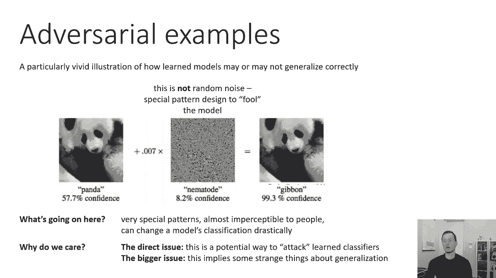

所以我们将详细讨论对抗性的例子，在这次讲座中，我们都是第二部分和第三部分，我们会谈论他们，为什么会发生，他们发生的地方，我们如何让它们发生，我们如何防止它们发生，但在我们进入所有细节之前。

我们将详细讨论，让我们先了解一下全貌，让我们把一些事实写在这一页上，对抗性的例子实际上是什么，当我们应该想到他们的时候，所以首先，是啊，是啊，不仅仅是长臂猿，所以对抗性的例子。

你添加到图片中的这些特殊图案，如果选择得当，只要付出足够的努力，就能把任何东西变成其他东西，这并不都一样容易，但总的来说，你可以用对抗性的例子做很多事情，从某种意义上说，有许多不同的阶级。

您可以为许多不同类型的网络转换为许多其他类，在许多不同的情况下，面对对抗性的例子进行辩护是不容易的，有许多方法可以尝试修改您的网络，使它们不那么容易受到影响，但从今天开始，截至2021年4月。

我们所知道的任何东西都不能为敌对的例子提供防弹的防御，在所有情况下，所以肯定有防御，肯定有降低它们有效性的方法，但我们不知道有什么能完全解决它们，对抗性示例可以跨网络传输，这是一个非常令人惊讶的发现。

当它发生的时候，但它不是一个非常，特定网络的非常特殊的属性，你可以创建一个对抗性的例子来愚弄亚历克斯·内特，也会愚弄共鸣，并不总是所有的对抗性例子都转移，但在许多情况下，他们确实如此。

对抗性的例子在现实世界中可以起作用，它们不仅仅是特殊的、非常精确的像素模式，这个图像是什么，这是一个四，限速每小时5英里，照片没有改动，这张照片只是用普通的手持相机拍的，被改变的是标志上的一点污迹。

它看起来有点像泥土，实际上是通过非常小心的方式选择的，这样标志的照片，正常，天然的，从许多不同的距离和角度拍摄的未经修改的照片都将被一致地归类为四个，每小时5英里限速标志。

对抗性的例子并不是人工神经网络特有的，几乎所有的学习模型都容易受到对抗性例子的影响，所以它不是深网的某种奇怪的病理特性，这不是任何特定深网的奇怪病理特性。

我们所知的几乎所有学习过的模型都可以用对抗性的例子来攻击。

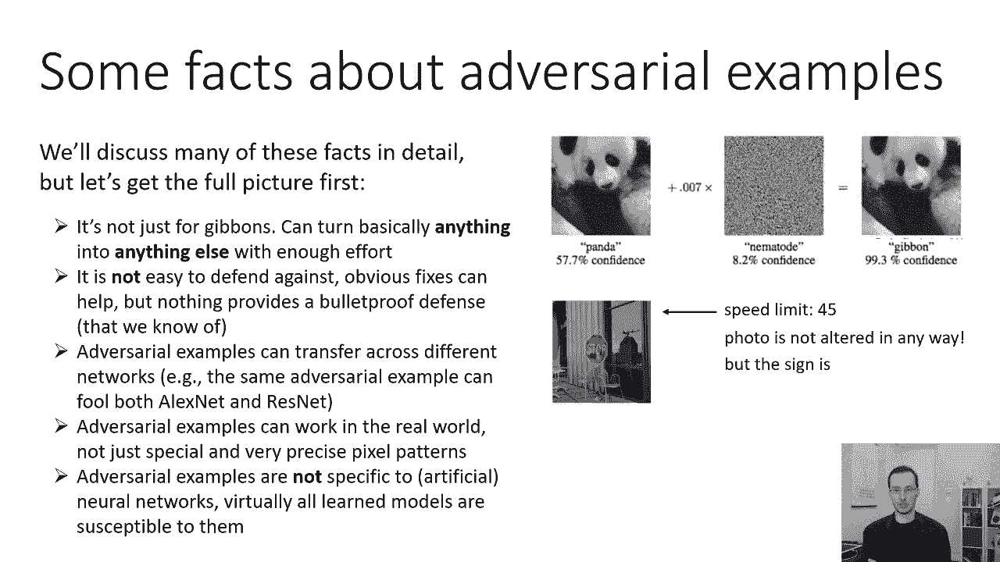

不仅仅是人造的，天然的，我也是，所以你的大脑有对抗性的例子，这也是一种学习模式，所以让我们更详细地谈谈其中的一些事实，我将从对抗性的例子是否特定于深度网络的问题开始，这个问题很重要。

因为它稍后会揭示为什么对抗性的例子可能会发生，这仍然不是一个我们可以明确回答的问题，但我们有一些提示，它还帮助我们做出实际的现实世界的决定，比如。

比如说，可能会有人觉得，也许这只是深网的问题，如果我想真正安全的机器学习系统，我应该避免使用深网，通常情况并非如此，这是伊恩·古德费罗演讲中的一个例子，我将用伊恩工作中的许多例子，在这次讲座中。

这是Ian攻击线性模型的实验，我相信这实际上是一个逻辑回归模型，所以这张照片显示的是，你从一个9的手写数字开始，然后伊恩打算在这里用微妙的方式改变这个数字，扰动更容易察觉，你可以看到背景确实有一点变化。

所以他会以微妙的方式改变来得到它，按所有其他类别分类，零，一个，两个，三个，四，五个，六，七，和八个按顺序，嗯，通过线性分类器，在本例中，它是一个Logistic回归分类器，每当你看到一个黄色的正方形。

这意味着该数字现在已经按其相应的标签分类，所以在这里这个9现在被归类为零有90%的信心，然后在第二排，它现在不是从那里开始改变，直到它被归类为一个有90%信心的，在第三行，它被归类为三，然后是一个四。

然后五个等等等等等等，然后一直在右下角，它又被归类为九了，所以说，这个线性分类器可以被说服对这个数字进行分类，与可能的十个类中的任何一个，而不实际更改哪个类，真的是。

对抗性的例子似乎是大多数学习模型的普遍现象，以及我们所知道的所有大容量模型。

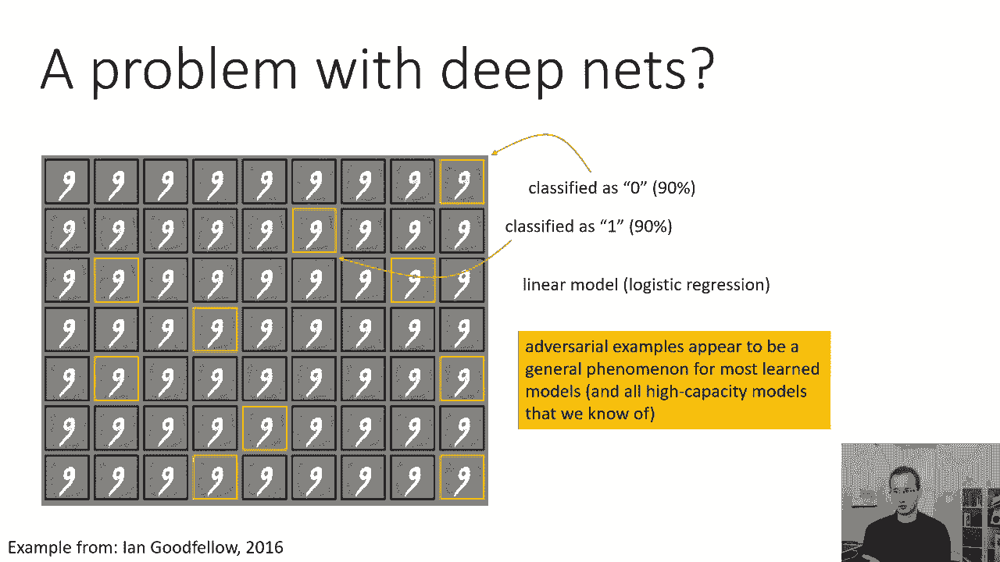

所以在那一点上，另一个，我们可能想回答的另一个问题是，对抗性的例子是否是由于某种过度拟合，这也是我从伊恩的作品中借用的一个例子，所以一个可能的假设，为什么，如此微小的扰动似乎可以改变图像的类别。

当你有一个非常大的模型，当您过度适应您的数据时，你可能会在决定边界上得到所有这些像峭壁和裂缝一样的东西，就像你知道的，如果你想象，如果你取两个有理数，它们之间总是有无限多的无理数。

所以你可以说每对熊猫之间，有无限多的长臂猿，也许是这样的，如果你有一个非常非常讨厌的功能，有很多，呃，决策边界中的波浪形东西，也许在一个类的任意两个图像之间，或者其他类的许多其他图像隐藏在那里。

所以过拟合的假设是，因为神经网络有大量的参数，也许他们倾向于过度适应，使得很容易找到产生疯狂输出的输入，所以这个假设的含义是修复对抗性的例子，你不应该使用大容量的模型，你应该用更小更简单的模型。

所以这种假设的心智模型是，假设我们有这两节课，我们想要一个非常好的干净的决策边界，像这样，如果我们训练一个神经网络，也许我们会有一个非常疯狂的决定界限，它在训练数据方面做得很好。

甚至可能在测试数据上做得很好，因为这些疯狂的小碎片真的真的很薄，就像左边的那一点，但是如果你真的为一个图像优化，你可以很容易地找到一个在错误的区域，所以这是一种过度拟合的假设，这是一个明智的假设。

如果我们把对抗性的例子往往需要非常，非常小的扰动，他们往往很有问题与深网，然而，我们今天掌握的大多数证据表明这是错误的，它表明这不是现在正在发生的事情，诚然，这个证据有点间接，但如果这是真的。

我们会期望不同的模型有非常不同的对抗性例子，参见过拟合对应于高方差，高方差意味着来自同一分布的不同数据，或者对于不同的模型类似，你会期望决策边界是不同的，他们都是同样不正确的，但他们会不一样。

这就是高方差意味着什么，我们知道过拟合意味着高方差，这不是我们在实践中实际看到的，在实践中，我们看到敌对的例子经常在不同的网络之间转移，所以说，似乎没有，对抗性的例子实际上是高方差的症状，事实上。

它们的方差实际上似乎低得惊人，考虑到他们有多武断，所以事实并非如此，另外一点，如果这是真的，我们希望像线性模型这样的低容量模型不会有这个问题，同样，情况似乎并非如此，低容量模型也有对抗性的例子，最后。

如果这是真的，我们期望在对抗性例子周围有高度非线性的决策边界，所以如果决策边界真的像这样看起来很奇怪，我们应该能够构建一些可视化，并看到，一般来说我们不能，我一会儿再谈这个，所以这是一个重要的考虑点。

因为过度拟合假说通常是人们首先想到的，当他们听到对抗性的例子时，因为这实际上是相当自然的，我想是那样，因为如果对某一点的微小扰动，可能导致它被归类为不同的标签，这可能表明你的决定边界接近那个点。

和决策边界过于接近数据，至少在低维是非常符合我们的直觉的，关于过度装修是什么样子的，这里的问题是，真的是，我们对低维空间的直觉。

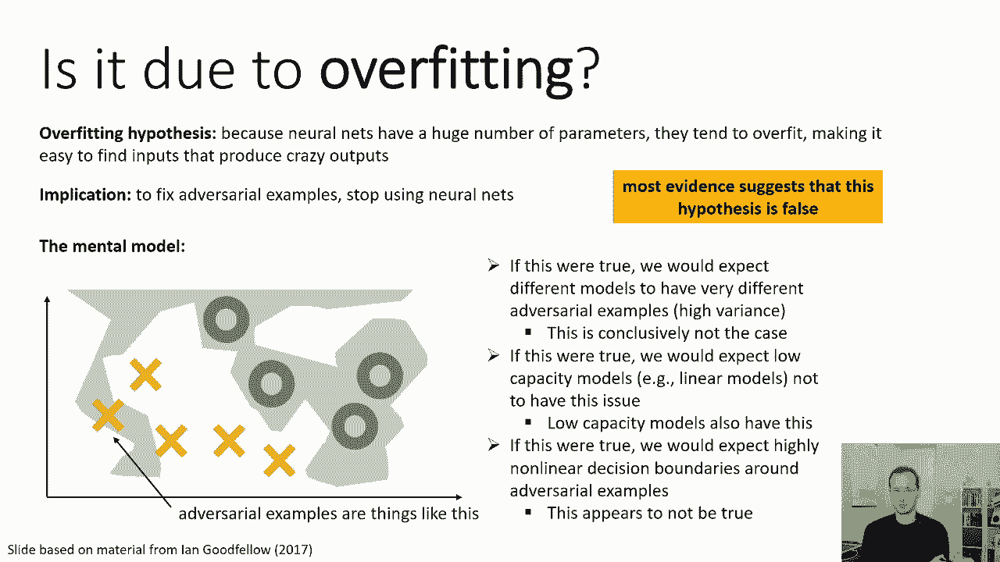

一个非常不同的假设，我们可以称之为线性模型假说，说，因为神经网络和许多其他模型往往是局部的，几乎是线性的，当远离数据时，他们以某种违反直觉的方式进行推断，在高维度中，“远离”这个词的含义有点违反直觉。

所以这个假设似乎有点牵强，但我要给你看一些证据来支持这可能是真的，一次又一次，这主要是基于伊恩·古德费罗的一些工作，所以让我们看一个不同的例子，我仔细地选择了这个例子来说明这个假设。

所以这里我故意选择了数据，所以它位于一种低维流形上，这是一件很合理的事情，因为自然图像，例如，位于n乘n数组空间中的一个非常低维的流形上，对呀，所以如果你考虑所有随机的n乘n的图像。

它们中的大多数不会看起来像自然图像，自然图像是一种非常特殊的结构，它们往往有很多低频被边缘隔开，不是你得到的那种东西，如果你只是产生随机噪声，所以如果你想要一个心理模型，你可以想象一个非常大的空间。

对应于所有可能的图像，可以产生什么，把它想象成一个体积，然后你可以想象一张薄薄的床单，在那个空间里有薄薄的波浪状薄片，表示所有真实感图像的集合，这就是为什么在这个例子中我选择了，即使我只有两个维度。

我选择让这个现实的数据流形主要遵循其中一个维度，在另一个维度上仍然有一些变化，但没有那么多，所以当我拟合一个局部线性分类器或在本例中拟合一个全局线性分类器时，我可能会得到一个决策边界，看起来像这样。

这是一个很好的决定，从某种意义上说，它把两个阶级区分得很清楚，但你会注意到你知道决策边界，当然是在两个维度上，决策边界没有意识到有一个低维流形，数据所在的地方，它在另一个维度上也有一个斜坡。

这意味着如果我们通过不相关的维度生成另一个例子，垂直的，沿着不相关的维度移动一点点，我们实际上可以，呃产生一个会被错误分类的例子，现在这张照片还是很有欺骗性的，因为这里我只有两个维度，在现实中。

如果你有一个图像，比如说一百万像素，相关和不相关的方向的数量可能非常非常多，所以这里因为我只有两个维度，我需要在不相关的维度上走得很远，得到不正确的分类，但如果我有，假设十万个这些不相关的维度。

也许我不需要沿着他们中的任何一个走这么远，我可能会沿着它们走一小段距离，得到一个不正确的分类，这就是为什么对于那些对抗性的例子，他们可以，呃，也许，这就是为什么他们可以逃脱潜移默化的小扰动，好的。

那么为什么大型神经网络看起来是线性的，像这样对吧，因为神经网络的全部意义在于它们是非线性函数，右整流良好的线性单元是分段线性的，所以你可以想象，许多整流线性单元的组成，将由大量的线性板组成。

这些线性板的数量可能非常大，它实际上可能会随着层数的增加而呈指数级增长，但在局部，它们仍然是非常线性的，你可以说好，好的，我们为什么不好好利用raus呢，如果我们使用其他非线性单元，如乙状结肠。

当他们处于中间政权时，他们仍然倾向于运作得最好，对，因为它们在尾巴上饱和，所以信号通常使用的方式，它们也停留在它们所在的地区，所以我们实际上使用的很多模型，它们实际上看起来是局部线性的，因为它们的结构。

你可以说，这实际上不仅仅是肤浅的，你可以说我们使用这些模型是因为它们很容易训练，像这样局部线性的模型往往更容易训练，因为他们的渐变很好，某一级的梯度是模型的线性近似，所以如果你有一个局部线性的模型。

那么梯度将是一个很好的近似，所以您会期望使用渐变进行优化是很容易的，那其实是，为什么人们从乙状结肠转向整流的线性单位，因为它们更线性，因此更容易优化，所以这些模型看起来局部线性可能不是偶然的。

这实际上是让他们更容易训练的事情之一，这一假设与对抗性例子的可转移性是一致的，因为它真的会说这个问题几乎更像是一个不合适的问题，你会期望这与低方差相对应，这意味着你会期望这些对抗性的例子转移到。

训练集中的小变化和模型中的一些变化，减少过拟合似乎并不能解决对抗性例子的问题，这也与这个假设一致。

有更多的证据表明，这种线性的东西可能是真正发生的事情，这里有一个实验是一个有点奇怪的实验，我们要拍一张红色背景的白色汽车的照片，所以左边的图片，呃，看看发生了什么，我们要改变这幅画。

我们要在图像空间中选择方向，然后我们要加上那个方向的倍数，所以方向基本上是一个向量，这是另一个形象，对原来白色汽车和红色背景图像的修改，我们要加0乘以那个矢量，或者1乘以那个矢量，或者是那个矢量的两倍。

或者是那个矢量的十倍，或者也是负值，所以如果你看看，左边的图像，他们在幻灯片上有点难看到，但是用黄色突出显示的，那些被正确归类为汽车的，那排右端的那个，那是原始图像，所以如果你往左走一个。

那是原图减去Epsilon，哪个是你的矢量，乘以1然后左边的是负ε，在图中乘以2以此类推，你看到的是进入软最大值的值，所以这些不是网络输出的概率，实际上是逻辑，就在软麦克斯之前的那些。

你可以看到在那个接近于零的小区域，那是原始图像所在的地方，不同类的曲线形状是相当复杂的，在零点附近有一个小颠簸，在那里它被正确地分类，但是当你在一个方向上越来越多地修改图像时，或者在另一个方向。

你可以看到日志最终变平了，然后从那里开始线性扩展，有点奇怪，青蛙类实际上成为最有可能发生大扰动的，向左向右，这并不是因为网络实际上认为青蛙很有可能，只是因为它在推断，它在离图像很远的地方线性外推。

青蛙类的斜率正好更大，所以如果你走得足够远，最终最有可能的是青蛙，这不是你对一个模型的期望，比如说，已校准不确定度，你知道吗，你知道吗，你知道你会期待随着图像变得更加奇怪。

也许所有的类记录器都应该变得相似，反映了网络对什么是类的不确定性，但在这里你可以看到，网络是线性外推的。

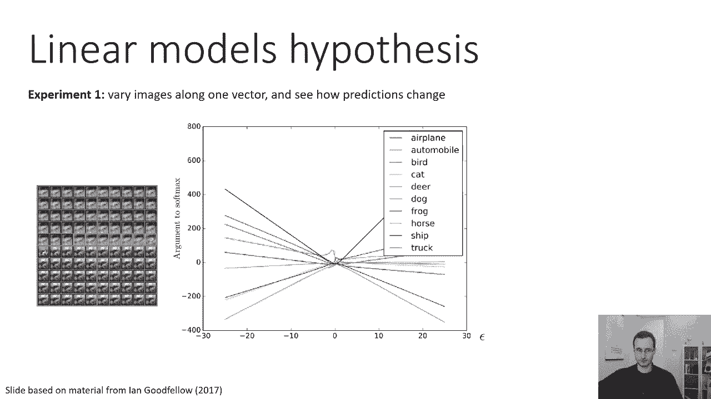

这里有另一个例子，这有点难理解，但我会尽我所能描述这是什么形象化，伊恩·古德费洛研究的作者，戴维，疣，法利和尼古拉·帕内尔，一大组C远十幅图像的对抗性方向，所以那个有趣的盒子里的每一个。

右边五颜六色的被子代表了一个不同的CFRTEN图像，对于这些图像中的每一个，他们在每个盒子里密谋什么，是深度网络输出的分类，因为它是沿着两个方向变化的，所以你可以想象被子里的每一个小盒子。

作为一个二维图像嵌入的小情节，其中该点的中心是原始图像，当你左右移动时，你实际上是在沿着一个敌对的选择的方向前进，所以水平的，故意选择从左到右的方向，使网络最大限度地改变其分类。

沿着这个方向实际上是通过对类标签求导来计算的，相对于图像，垂直方向只是一个随机的方向，那么他们为什么做得这么好，他们试图理解，图像分类沿随机方向和长对抗方向的变化更大吗，当然啦，插曲方向会有更大的变化。

但多少钱，这种可视化对我们理解有用的原因，线性假设，如果问题是由于过度装修造成的，如果问题是由于决策边界是一些非常复杂的事情，我们希望在这些情节中看到非常复杂的事情，基本上这是图像空间的二维投影。

所以如果我们太合身了。

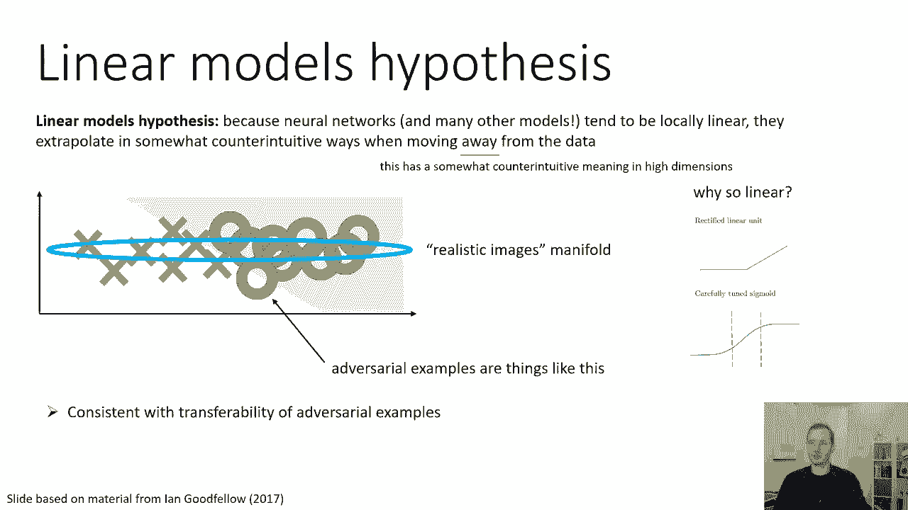

如果我们得到像这样的照片，我们基本上希望看到这样的东西弹出。

在被子的每一个细胞里，但这并不是我们所看到的，我们在大多数情况下看到，决策边界很直，这与对抗的方向非常一致，所以基本上你在大多数细胞中看到的是一条垂直线，你在一个方向上穿过那条垂直线。

你得到了一个不正确的标签，所以白色是正确的标签，任何其他颜色都是不同的标签，基本上如果你向右走得足够远，你得到了一个不正确的标签，它总是在右边，它从来不在左边，所以你真的必须走对抗性的方向。

网络在这个方向上并不是超级敏感，一般来说，它实际上只走一条路，你偶尔会看到一些更复杂的东西，比如，比如说，第二行的第三个图像有一种有趣的形状，在顶部和底部周围，但在大多数情况下，决策边界基本上是线性的。

所以这不是你期望看到的，如果你得到的是巨大的过度适应，所以说，变化不大，与这个情节中上上下下的敌对方向正交，你在一边有一个干净的转变来对抗方向，建议一个主要线性的决策边界。

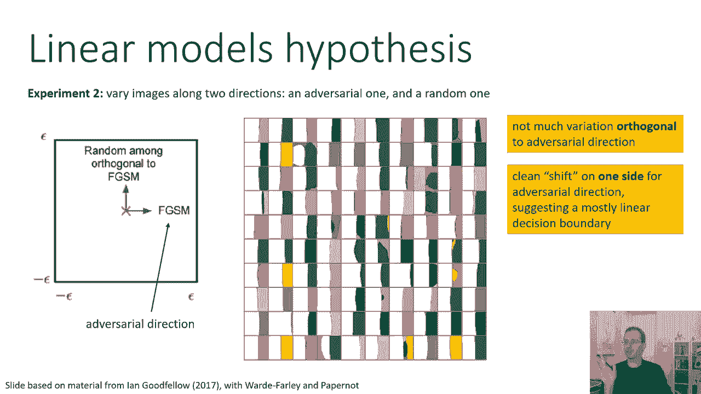

这样，也许能帮助我们理解这些对抗性的例子是从哪里来的，让我们再看几个，呃，这种东西在行动中的生动例证，所以在左边的图片中，这是一篇名为《鲁棒物理世界对深度学习视觉分类的攻击》的论文，作者正在展示。

各种交通标志的自然照片，这些标志都被归类为四个，从不同角度和不同方向拍摄的限速标志，底部的数字显示了这些攻击的成功率，你可以看到攻击范围从在侧面放置一些图案，看起来有点像泥土。

甚至像一些看起来像涂鸦艺术的贴纸，所以有各种各样的方法来构建这些攻击，你知道的，在右边的图像中工作得很好，还有一个更极端的例子，来自一篇名为合成稳健对抗性示例的论文，作者实际上打印了三个物理对象。

从不同的角度被可靠地归类为不同的类别，所以在上面你可以看到一只乌龟，这是一个真实的物理对象，这些人做的，这不是渲染，这是一个实际的物理事情，所有这些海龟都被归类为枪，步枪。或者作为其他东西，所以黑色的。

黑色轮廓的被归类为其他东西，红色轮廓的被归类为步枪，没有一只是龟，下面的例子是一个棒球，这个没有那么厉害，但在许多这样的情况下，红色轮廓的被归类为浓缩咖啡，黑色轮廓的被归类为其他的。

其中一些实际上被正确地归类为棒球，你可以用棒球，你可以猜到为什么，如果你看看其中的一些，看起来有点像咖啡，里面有一些气泡，所以你知道这个尺度是鲁棒性的一个级别，的，你知道的。

有些特征看起来确实有点暗示性，但它们不是一个人会喜欢的，的，所以让我们谈谈一个人可能会弄错的事情，有没有人类对抗的例子，我可以给你的答案是，当然有它们叫做视错觉，所以在这张照片中，比如说。

正方形排列成同心圆，不是螺旋，我知道它们看起来像螺旋，它们不是螺旋，它们是同心圆，不是螺旋，即使他们看起来像他们，它们看起来像螺旋的原因是因为正方形倾斜了，制造这些是螺旋的错觉的正确方法，当然还有。

有很多很多不同的幻觉我们知道人类容易受到，现在，有人可能会争辩说，也许幻觉并不完全相同，作为对抗性的例子，从这个意义上说，幻觉实际上对我们大脑先前的信念起作用，关于形状是如何工作的，也许这有点不同。

实际上有研究真实的人类对抗例子的工作。

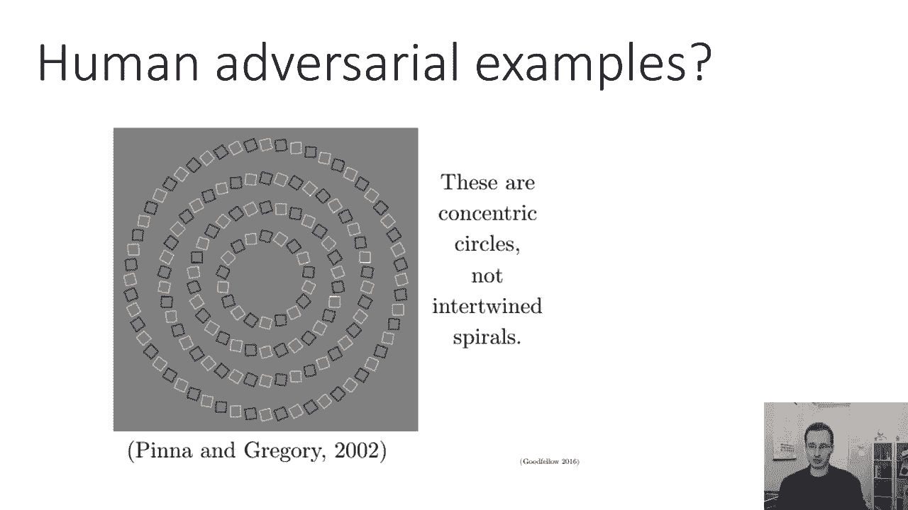

有一篇论文叫对抗性例子，愚弄了计算机视觉和时间有限的人类，这些实际上是愚弄你大脑的图片，就像愚弄神经网络一样，我要给你看一张这样的照片，我要给你看这张照片，我想让你猜猜这张照片是什么级别的。

不是猫就是狗，所以二进制分类，当我给你看照片的时候，尽可能快地猜测，你能大声说出来，比如说猫或者狗，大声说出来，让自己保持诚实，所以我要给你看三二一的照片，记住你的猜测，这是原版，好了现在，嗯。

你们中的一些人可能会想得很好，好的，也许我是在耍你，所以右边的图片是，实际上是使用合成对抗性示例的自动技术构建的，事实上，它确实愚弄了人类，你可能提到的批评是，也许这张照片修改太多了。

它实际上是一张狗而不是猫的照片，所以正确的类猫，它看起来很像一只狗，但也许那是因为它现在真的是一张狗的照片，这里有一点哲学难题，我们实际上不知道，你知道，如果你是一个看着这个的人，你会看到一只狗。

什么是，什么是真正的阶级，我们如何衡量，我们不知道所以，也许这是一个对抗性的例子，也许它真的改变了图片的等级。

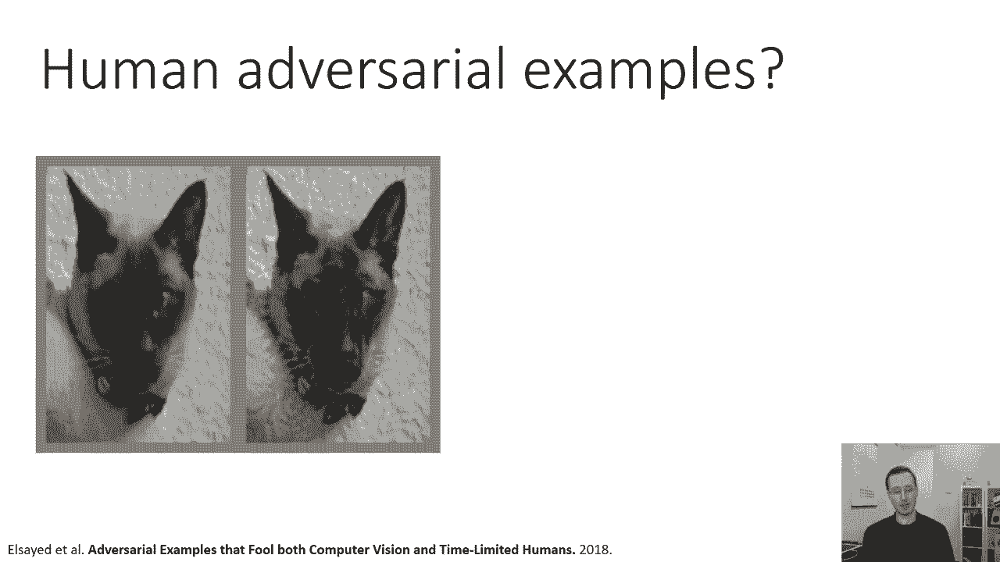

更可验证的实际实验，与时间有限的人类有关，在实际例子中，人类在一小段时间内表现出一种模式，不到一百毫秒，他们被要求猜测这张照片是什么类别的，对于这些示例中的大多数，如果人类被允许长时间地观察它们。

他们实际上能够正确地计算出类，但如果它们只得到不到100毫秒的时间，他们经常会把课弄错，所以你在上面看到的，在一个，这些是不会愚弄你的实际扰动，当你长时间看这幅画时，但它们实际上会愚弄时间有限的人类。

所以说，比如说，第二排那只狗的照片，第二列被巧妙地修改了，如此微妙，你可能在这张幻灯片上看得不太清楚，所以呃，这一切都很好，这一切和泛化有什么关系，嗯，线性假设是相关的，不仅仅是对抗性的例子。

但真的是为了了解网有多深，或者不要一概而论，当你训练一个模型来分类猫和狗，它实际上并不是学习猫和狗的样子，它正在学习数据集中的模式，从那里它就会推断，可能以奇怪的方式，所以它会是一匹好马，换句话说。

对抗性例子，它们可能不会反映bug，它们实际上可能反映了您的学习算法的特征，就像背景中的雪对狼来说实际上是一个有效的暗示，为神经网络设置的问题，用同样的方式，这些似乎可以用来开发和生产的方向。

对抗性的例子实际上可能代表了网络正在关注的有用模式，因为它们有助于在训练集上得到正确的答案，事实上，这可能是真的，安德鲁有一篇很好的论文，Elias，所谓的对抗性例子根本不是bug，它们是。

基本上论证了这个假设，这里的基本思想是，也许神经网络会注意到这些对抗性的方向，因为这实际上帮助他们在训练数据上得到正确的答案，也不矫揉造作，这实际上是正确的做法，以获得正确的答案。

基本上回答你向他们提出的问题，这只是碰巧使他们容易受到敌对攻击，这其实并不完全令人惊讶，从某种意义上说，任何被调谐为真正真正最优的系统，在某一特定事物上可能会变得不那么健壮。

你们中那些正在听这个讲座的人有控制的背景，会发现这非常非常熟悉，众所周知，更优的控制器往往鲁棒性较差，用同样的方式，更优化，神经网络对这些扰动的鲁棒性可能较低，因为他们真的，你知道的。

骑着分类边界的刀刃，他们真的在努力寻找最优的方法，在你的培训分配上得到正确的答案。

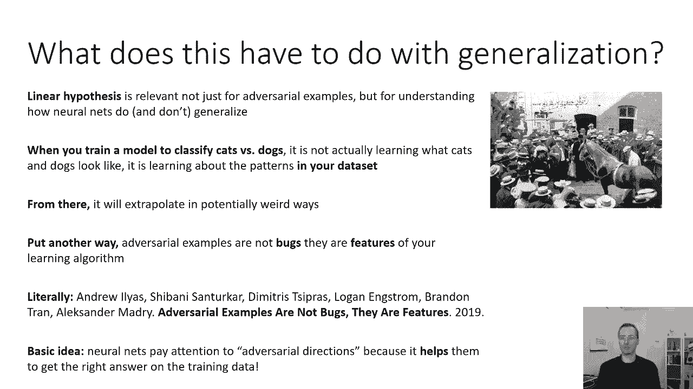

所以总结一下神经网络，在从与训练集相同的分布中提取的测试集上很好地推广，它们有时会通过成为一匹聪明的马来做到这一点，通过学习模式，让他们得到正确的答案，但是如果分布发生变化，模式可能就不成立了，比如。

比如说，那个呃，狼背景下的雪和草，这不是他们的错，都是你的错，是你问错了问题，它们通常校准得很好，但没有校准得很好，特别是在非分配输入时，也就是说，它们产生的概率，可能不能反映这些事件的真实频率。

即使最有可能的标签是正确的标签是相关的，但不同的问题是，我们几乎总是可以综合对抗性的例子，通过修改正常图像，欺骗神经网络产生不正确的标签。

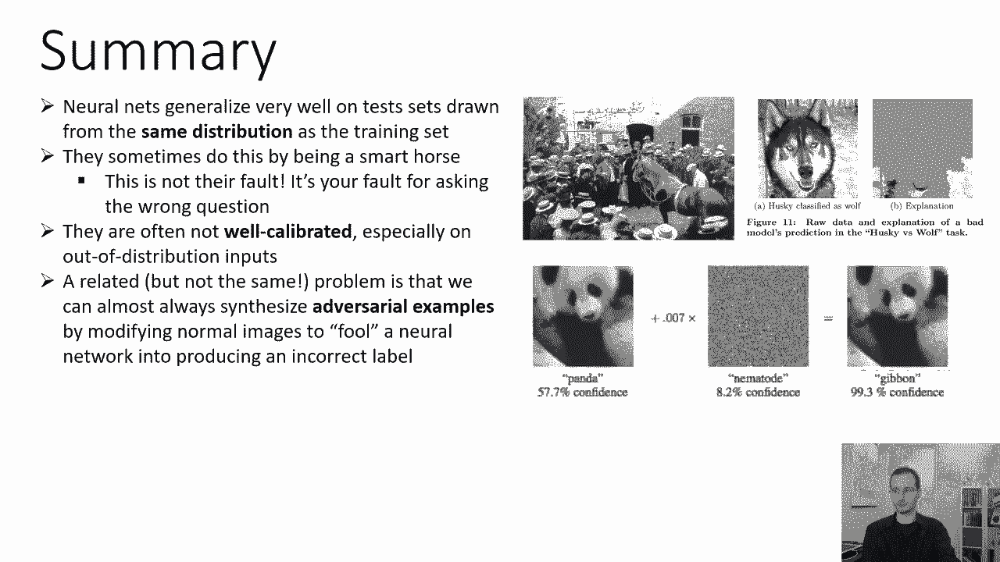

对抗性的例子很可能不是过度适应的症状，它们在不同的模型中保持不变，它们影响低容量模型，就像它们影响大容量模型一样，有理由相信，但它们实际上是由于过于线性，或者过于简单的模型试图外推。

再加上一些微小的分布变化，它们折磨着人类，它们折磨神经网络，它们影响，呃，它们折磨着逻辑回归，对抗性示例可以构造为真实世界的对象，在接下来的课程中，他们很难处理，我要讨论实际的数学。

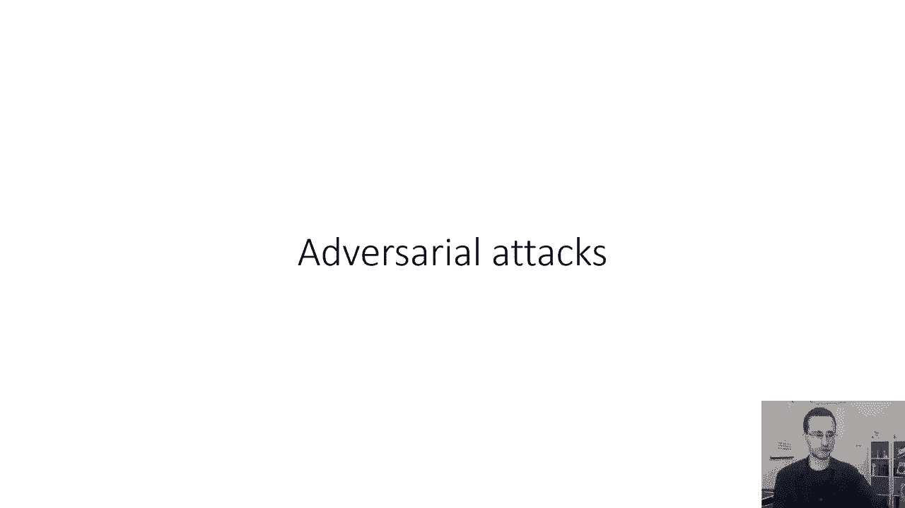