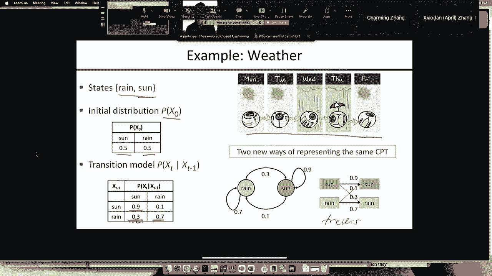

# CS188 伯克利最新AI课程--人工智能入门推荐 - P20：[CS188 SP23] Lecture 19 - Markov Models - 是阿布波多啊 - BV1cc411g7CM

谢谢大家冒雨赶来，我想没有感觉到很好的感觉，这种天气我感到很自在，但我相信对于那些在加州长大的人来说，有点陌生，但在那里没关系，所以我们要完成上次的一些材料，我们一直在讨论贝叶斯的采样算法。

我们说过的网，呃，从网络本身采样，先验采样算法，拒绝采样算法，你扔掉与证据不一致的样本，我们看到这是难以置信的浪费，似然加权算法是确保，3。你所举的例子都与事实相符，因为你只要修复证据变量。

但你必须对生成的样本重新加权，这可以很好地工作，但正如我们所看到的，它并不那么好用，尤其是当你有很多证据在网络的叶子上，因为这样你就产生了样本，无视证据，突然之间你就有了证据变量和证据变量。

所以这太荒谬了，你产生幻觉了，给它一个极小的重量，然后你所有的样品都得到一个非常小的重量，除了少数幸运儿碰巧选择了正确的价值观，他们最终主导了估计，因为它们的重量比其他的指数大。

然后你得到非常糟糕的估计，因为你有一两个有效的样本量，所以马尔可夫链，蒙特卡罗或MC MC算法解决了这个问题，因为他们不仅修复了证据变量，但它们传播来自证据变量的信息，所以很快。

你实际上是在以一种受所有证据影响的方式取样，不仅仅是根源上的证据，但所有的信息都在整个网络中传播，以影响采样，嗯，所以总的来说，什么是MC MC算法，就像插入你有一个状态空间，MC有一个状态空间，mc。

它基本上只是在那个空间里随机游荡的一种方式，所以这是一个随机算法，你试图通过遵循马尔可夫链来计算的东西，所以马尔可夫链只是一个状态序列，每个新的状态都是随机选择的，给定以前的状态。

你可以有任何你想要的邻里结构，你可以从状态空间的一边跳到另一边，如果你想，只要随机游走是以正确的方式构建的，你的估计最终会收敛到正确的值，所以我们将看看这是如何工作的，和一般权利。

所以这个名字有两个部分，马尔可夫链意味着通过随机游走产生样本的特定方式，蒙特卡罗只是指任何使用随机化的算法，给出问题的近似答案，所以什么是MC的高级图片，MC算法，只是随便逛逛，你所看到的。

所以这是一个非常，非常简单直接的算法，所以我们要看的特定版本叫做gibb采样，这可以追溯到，这是以一位统计物理学家的名字命名的，我想大概1900年左右，嗯，它是一个如此，这是一种特殊的MTMC。

基本上是通过对变量的一些子集进行采样，通常在我们的情况下，我们只是要对一个变量进行采样，条件是定义状态的所有其他变量的当前值，所以每个州都是一个完整的任务，你让证据变量保持不变，然后你选择一个变量。

我们称之为，我们将调用我们采样的变量x i，我们正在为它取样一个新的值，所以我们称之为x i-primed，它是从XI的分布中取样的，给定所有其他变量在当前状态下的值，好的。

在所有其他变量上选择一个变量样本的值条件，对呀，这里的这些其他变量将包括证据变量，所以证据变量e，这就是你所需要的，然后算法会随机游走，你得到的估计值会收敛到正确的值，是呀，所以每个变量。

证据变量保持不变，所有其他变量在每个状态下都有一个特定的值，好的，所以状态只是所有变量的值的向量，好吧，你可以有一个部分任务，所以在约束满足算法中，比如回溯权，通过一次分配一个变量来构建赋值。

如果你还记得，但在这里，我们只在完成任务的情况下工作，所以这更像是爬山算法，模拟的，跪求算法，如果你没记错的话，你可以做，嗯，你可以在皇后区爬山或模拟跪着，但是你看到的州有他们所有的女王。

他们都在一个特定的地方，如果你在最后的拼图上爬山，就像十五个谜题，八字谜，这是一个特殊的状态，你正在操作，好的，所以这是相同的基本思想，如果你仔细想想，对呀，嗯，通过选择从x i的分布中取样。

给定所有其他变量，你最有可能选择的价值是什么，它是概率最高的一个，你会有x的值吗，i很可能是考虑到所有其他变量，根据定义，这是你最有可能选择的，因为你是从那个分布中取样的，所以这意味着如果你一开始。

你知道x i的值，那不太可能，给定其他变量，你可能会转向一个新的价值，这比你在的那个更有可能，但你也可以走下坡路，你可能从一个高概率值开始，现在你把它擦洗掉了，重新采样，然后你可能会走下坡路。

选择一个新的值，这比你以前有的可能性要小，好的，所以从这个意义上说，它很像模拟脚踝，如果你有兴趣，您可以脱机，我看你能不能把吉布和，采样模拟跪姿，试着弄清楚，你知道的，模拟下跪是不一样的，对呀。

它有一个变化的温度，吉布斯取样没有温度，所以在某些方面是不同的，你可以尝试构造映射，好的，所以接下来的事情是对的，所以吉布斯抽样通常是选择一个可变的样本，它的值给定所有其他变量，好的，在贝叶斯，渔网。

这个特定的计算结果比一般情况下容易得多，这是因为给定所有其他值的变量的概率等于，仅给出马尔可夫毯子的变量的概率，好的，什么是马尔可夫毯子，是父母，我不知道为什么我没有把这个写在幻灯片上，但不管怎样。

父母，孩子们，好的，现在在下一张幻灯片上有一张照片，我想是的，嗯，所以这个马尔科夫毯子，满足这个条件独立性假设，给定马尔可夫毯子XI，你取样的变量独立于贝叶斯网中的所有其他变量，给定马尔可夫毯子的值。

那么这意味着什么，为什么你知道，为什么这是件好事，这是件好事，因为现在变量要对其值进行采样，它只是看着它的邻居，对呀，正上方的父母，正下方的孩子们，孩子们的，其他父母，也就是你的共同父母，如果你喜欢对。

另一个，你家庭的其他成年成员，所以做这个采样操作的复杂性与网络的大小无关，所以即使网络中有十亿个变量，对呀，所以这里的名单是九亿九千九百万，九十九万九千，九百九十九个变量，如果你只有两个孩子。

两个父母和两个共同父母，对呀，这是以六个变量为条件的抽样，所以计算可以很容易地完成，它与网络的大小无关，因为这都是本地的，你甚至可以想象它是平行发生的，你可以对网络的所有变量进行采样，同时和异步，嗯。

所以一些神经科学家认为，事实上，大脑在地下室做类似MCCMC的事情，他们有证据证明，但当然，其他神经科学家有证据证明他们自己关于大脑如何工作的理论，所以它仍然完全可以争夺，但是，有证据表明。

大脑很擅长贝叶斯概率推理，所以如果你不认为它在做MCCMC，那你得想出一个论点，嗯，它在做什么，它设法实现了贝叶斯概率推理，你知道的，在只能进行本地计算的网络中并行。

所以这实际上不是一个完全不可信的想法，好吧，就像我说的，如果你继续运行这个算法，选择可变样本，它选择一个可变的样本，它选择了一个可变的样本，然后你平均你看到的状态，您想要的任何查询。

您只需回答该状态的查询，平均是结果，那么在这样做的极限，无限经常，gibb抽样是一致的，意味着它收敛到正确的后验概率，鉴于证据，好吧，我会经历一些证明的步骤，我不会做整件事，我只想让你体验一下。

书中有详细的全部证明，所以这里有一个星号，你可能看不到，但那里有个星号，这很常见，实际上应该有一些星号，关于重要抽样一致性的主张，嗯，有一些小字，所以小字在那里，上面写着。

假设所有的吉布斯分布都是以0和1为界的，变量选择是公平的，好的，如此远离零，一个很清楚，对吧，你不能在你的网络中有确定性的关系，因为如果你这么做了，你可能会陷入一些状态的子集。

那么你永远无法到达另一个子集，好的，所以在这种情况下你会得到错误的答案，变量选择是公平的，只是意味着最终每个变量都被无限频繁地采样，如果你要，如果你多次取样，没有什么变数，只取样三次，你再也不尝了。

很容易想象如何做到这一点，你可以骑自行车，你可以随机选择并取样，你可以按字母顺序选择，你可以做任何你想做的事对吧，只要你不挨饿，永远有一些变量，好的，所以说，事实上，那是一个有用的。

这是我现在有点跑题了，为什么对某些变量的采样比对其他变量的采样更有用，是啊，是啊，因为有些变量比其他变量更重要，特别对，您最关心的是查询变量，嗯，所以我想你有一个像这样的大网络，你有，你知道。

这是查询变量，q，你知道，以下是证据变量，一个，E二，这里的变量可能不会有很大的不同，这个邻域中的变量，就像连接查询和证据的那些，要把这些做好是非常重要的，因此。

您可能会在查询和证据变量周围进行更多的采样，从证据变量中快速获得传播的信息，这实际上还没有得到太多的研究，在实践中，大多数算法只是随机地均匀选择，或者它们在所有变量中循环。

但我认为有很大的空间进行更智能的定向采样，Gibb采样可以让你做到这一点，你有完全免费的，好的，对此有什么问题吗，这是，这是总体方案，正如我所说，它传播信息，所以如果这是网络，我用蓝色画了。

这些是蓝色的是证据变量，所以他们已经修好了，现在我说，好的，嗯，我要对所有的变量进行采样，所有白色的都在第一轮取样中，我现在用浅蓝色标记的所有，它们与，或者他们在同一个马尔可夫毯子家族，作为证据变量。

所以在一轮取样之后，所有这些浅蓝色变量都受到邻近证据变量的影响，好的，两点以后，那么这些都是，三轮过后，那么这些都是对的，所以它在传播，因为你从你的邻居那里获得信息，然后下一步你从你的邻居那里得到信息。

邻居，之后你邻居的邻居，邻居，所以很快，所有的证据都至少有机会影响你，当你取样你的值，它仍然需要更长的时间来稳定下来并收敛到，均衡分布，它不喜欢根部的证据，也不喜欢树叶的证据，它只是。

它受到所有证据的影响，所以我只给你们看几个汽车保险网络的例子，所以这是我们以前遇到的相同的查询，在这里我们查询的是下面的物业成本变量，给出蓝色变量中的证据，嗯，这条蓝色虚线可能在等待，这是一个。

这是一个特别适合似然等待的查询，因为证据都在上游，查询变量在下游，所以这是一种理想的情况，概率加权比吉布斯采样好一点，但是吉布斯采样仍然有效，好的，它只是得到了更多的方差，我会说，但它在这里会聚。

嗯喜欢在等待，但它真正形成自己的情况，那是不对的，我应该说年龄，这是一组不同的证据，所以我在这里，我在查询年龄变量，它是以对叶变量的观察为条件的根，所以如果你观察叶子变量，现在我正在清除根部。

这是可能性加权的最坏情况，事实上，概率加权在一百万个样本后不收敛，对呀，而吉布采样在一百万个样本后几乎是完美的，所以错误就像在下面，点，零，零，零，一个，或者类似的东西，所以说，嗯，所以说。

在这些困难的情况下，这在更大的网络中变得越来越真实，有很多证据，通常是在底部，Gibb采样的效率比可能性高数十亿倍，加权，嗯，所以我们会，就像我要提到的，我给你举一些例子，说明它在哪里被使用，但是呃。

吉布，抽样，或者其他MCCMC算法是，事实上，人们在实践中使用的工具，所以我得给你更多的细节，如何计算给定马尔可夫包层的变量的概率分布，我知道怎么做，因为它的父母，因为这已经在条件概率表中了。

但我怎么做，我怎么从马尔可夫毯子里得到它，所以这显示了马尔可夫毯子，当我取样x时，我们有孩子，我们有父母，我们有孩子们的其他父母，就是那些Z变量，它们在变量周围形成了一层毯子。

变量独立于网络中的其他一切，考虑到那条毯子，这就是为什么它被称为毯子，好吧嗯，相对来说，很容易证明一个变量的概率，给定它的毯子与给定父母的概率成正比，然后是每个孩子的概率的乘积，子变量的明智性。

这些就在下面，给他们的父母，好的，所以这些都是直接在网络中的条件概率，事实上，我正在给他们看，所以你只是乘以一些数字来得到x的概率，你只需将x的父级和x的子级中的一些数字相乘，然后得到x的分布。

所以你对x的每个值都这样做，现在我有一个分布，现在我从中取样，所以这是一个非常非常简单的算法，总共大概有六行蟒蛇，让我来举例说明，我认为这很有帮助，我喜欢图片，有些人喜欢数学。

所以我两个都做我现在给你数学了，我就给你举个例子，配上一些图片，好吗，所以你把证据变量固定在，我们正在做我们的洒水湿草网络，我们观察到下雨了，我们想知道洒水器开着的概率。

所以我们首先把证据固定在真正的价值上，然后我们初始化另一个变量，所以我们必须有一个完整的状态才能开始，你可以随机初始化它，您可以尝试比这更聪明地初始化它，其实没那么重要，嗯，所以我选择了一些随机的值。

然后你就不停地重复，选择要采样的变量，然后重新采样其值，考虑到它的马尔可夫毯子，所以这里我们选择了S，所以我们要取样，s来自给定马尔可夫包层的s的概率，在当前状态下是cr而不是w，我们做这个计算。

将CBT项相乘，在这种情况下，我们得到了一个新值s变为真，所以现在我们有了一个新的状态，我们选择一个新的变量，在这种情况下，我们选择多云，我们采样多云，考虑到它的马尔科夫毯子是短跑和雨。

你得到了一个新的值，在这种情况下是真的，使用另一个变量，给定马尔可夫毯子的样本得到一个新的值假对，就这样做一段时间，你的估计似乎稳定下来了，那可能是一切都好的征兆，这并不能保证事情是好的。

这是MCCMC方法的缺点之一，就是，很难从分析上证明，你经营它的时间够长了，对呀，你可以得到，你可以让事情看起来像是在安顿下来，你说，伟大，你知道吗，对呀，一开始估计到处都是，和废话，废话，废话。

它就这样安顿下来了，他说，好的，好，我想这是正确的答案，然后如果你再做一次，轰右，一些不太可能的事情发生了，你在状态空间的一个全新的部分，你以前没有取样，而现在，它会稳定到这样的另一个值。

所以从某种意义上说，它们是相邻的，但在一个略有不同的图表中，奇怪的是，它被称为道德图表，为什么这是道德的，因为你强迫所有的父母结婚，所以这是一个非常老式的道德观念，但在道德图表中。

你强迫所有碰巧分享孩子的父母，他们都需要结婚，现在你也和那些相邻，道德图表中的道德图表，分离和独立是一回事，但另一种说法是，数学是这样计算的，当您查看条件概率的表达式时，我想有一个。

我不记得这一章里是否有证据，或者如果我把它作为一个练习，在这种情况下，证明在解决方案手册中，两个中的一个，但它是两步防，不是很难，所以所以这个，诊断收敛的这个问题，是MCCMC算法中的一个实际问题。

如果概率远离零和一对，所以你没有10到负8的条件概率，还是九九九九九九九，然后你实际上可以把，您可以对依赖于，你离0和1有多远，如果你能计算出这些界限，然后你就有了收敛的诊断，有时这很有帮助。

所以看待同一件事的另一种方式是对的，这是怎么回事，对呀，这是马尔可夫链，对吧，状态序列，每一个都是一个状态，对呀，这是一种状态，这是一种状态，这是一种状态，所以马尔可夫链可以被描述为一个概率转移系统。

允许的州之间，好吧，这正好表明，所以因为嗯，我想把它放在一张幻灯片上，我在修理这里，我把洒水器和湿草固定在两个证据变量上，然后各州就会被分配到多云和下雨，所以有四种可能的状态，因为这些是布尔变量。

所以我在那里，他们在那里，所以这是多云和雨，多云不下雨，不阴不雨，多云不下雨注意，因为这是吉布取样，你一次只改变一个变量，好的，所以没有从阴天不下雨到阴天不下雨的过渡对吧，无对角线过渡，因为只换一个。

所以说，如果你想考虑一下，在一般抽象意义上，这些状态都是超立方体右的顶点，过渡只是沿着超立方体边缘的运动，然后这些概率只是，我只是直接从马尔可夫毯子计算中预先计算了它们，所以说。

每一个都是通过将网络中的一些条件概率相乘而得到的，因此要在这个网络上运行MMC，我所做的就是在这四个州随机漫步，你知道的，每一步都是按照一个循环来完成的，这里有适当概率的链接，所以如果我在这种状态下。

我按照概率点0-9-2-6，我跟着这个链接，它是一个概率点为6的自循环，二九六，等等，所以我在这个图中闲逛，带着这些转换的概率，然后我平均我所看到的，我所看到的将收敛到正确的后验概率，给了洒水器和湿草。

所以其实，你可以直接编译，使其真正高效的一种方法是，你可以把贝叶树，净额，既然你知道证据是什么，然后可以编译出这个图，对呀，你可以把计算变成这个图，然后你知道吗，用正确的偏见扔随机的硬币。

在这个图中四处游荡，就是这样，所以你永远不必参考贝叶斯网，你什么也没做，贝叶斯网的概率乘法，因为你已经一劳永逸地做过了，所以这可以非常有效，事实上，你将花90%的时间在随机数生成器里，这是一个迹象。

表明你实际上有一个有效的算法，对吧，对于任何蒙特卡洛算法，你都不能得到更高的效率，然后把大部分时间花在随机数生成器里，我在英特尔公司干了大约二十年，请给我们一个单循环，随机数生成器右。

因为我们要做很多概率计算，你知道的随机数生成器，即使在C中也是相当慢的，我忘了有多少个循环，但大概28岁左右，像这样的东西，对吧，应该是一个单一的循环，然后这些算法会快得令人眼花缭乱，所以正如我提到的。

这是，这是我们在实践中使用的技术，用于真正的大贝叶斯网，有很多包裹，可能是虫子，如果我能记得的话，嗯，利用剑桥大学的吉布斯抽样进行贝叶斯推理，它可能有最大的用户群，特别是在应用统计学家中。

人们查看来自医学试验和其他科学试验的数据，贾格斯只是另一个吉布斯采样器斯坦，我不记得那代表什么，它有一个编译器，所以它实际上跑得更快，所以它把东西编译成有点像随机过渡图的东西，嗯。

这是一种更有表现力的语言，所以你可以用Stan写出相当复杂的概率模型，然后将它们编译成特殊用途的代码，并获得非常快的速度，推理，Inference Net是微软用于编写概率模型和运行推理的语言。

博客是我们在这里开发的贝叶斯逻辑，这让你可以使用一阶逻辑的全部力量来编写你的概率模型，非常非常明确，这是我们用来编写核试验监测系统的语言，禁止条约，嗯，我可以把一切都放在一张幻灯片里。

所以这是一种非常强大的语言，但同样，它只是使用MCCMC，所以它是一种适用于任何概率模型的通用推理算法，对于任何查询，对于任何数据，你知道的，你可以，比如说，我可以在视频中实时跟踪汽车，只要写六行博客。

它只是工作，所以它是，这是相当惊人的，所以我说，您可以编译它运行得非常快，你可以四处走动，即使没有硬件随机数发生器，你一秒钟可以得到大约1亿个样本，没有GPU，只是笔记本电脑上的普通CPU。

你可以并行运行，对，因为没有一个变量，你知道的，只要你不是同时直接采样两个相邻的变量，这可能会引起一种冲突，那么每个变量都可以在感觉到的时候对自己进行采样，你可以从中获得巨大的速度，正如我所说。

人们认为，有些人认为大脑在mccnc上运行得非常短暂，让我再过一遍，为什么好的想法，我们怎么知道这是对的，做这种类型的分析是什么样子的，你首先要考虑的是好吧，如果我运行一段时间。

我可以到达网络的任何状态，我达到任何特定状态的概率有多大，这将取决于你运行它的时间，所以在时间t，我们用pi t来表示我达到任何特定状态的概率，时间t，所以考虑到，我们可以修复开始状态。

或者我们可以均匀随机地选择起始状态，或者类似的东西，所以给定开始状态，完全确定了那个概率是多少，只是为了让事情简短，我将用粗体X表示整个州，对所有变量的赋值，所有的权利，选择一个变量，我们采样一个值。

我们采取一个状态，我们通过这个过程产生了一个新的状态，好的，所以不管这个过程是什么，我们称之为内核k，所以给定我们开始的状态x，有一定的概率达到一个状态x素数，因为吉布取样的工作方式。

这些x素数在超立方体中都是相邻的，对呀，因为你只改变了一个变量，所以你要么回到原来的状态，或者你要把它更改为另一个值，所以如果我想计算时间t的分布，加一给定时间t在各州的分布，嗯，你怎么能得到X。

得到x素数的方法是，嗯，你可以从任意X开始，你在x倍内的概率，从x到x素数转换的概率，你说，看看所有我可以开始的地方，在那些地方的可能性有多大，我转换的概率是多少，这就是你在时间t处于x素数的概率。

加一个，所以我们可以把这看作是改变时间分布的一种方式，t与时间t加一的分布，如果你看对了表格，把它看作是所有状态的向量，然后这是一个矩阵向量乘法，所以我们可以把它写成πt加1是一个矩阵。

k乘以时间t处圆周率处的矢量，那么处于平衡状态意味着什么，它只是意味着时间t的向量，加1等于时间t处的向量，所以现在我得到了一个等式，说明平衡点是正确的，它将是圆周率满足这个方程的任何东西，这将是平衡。

这个K井是什么，k由Gibb采样跃迁定义，好的，所以现在我所要做的，我知道K矩阵是什么，现在，我只想说，嗯，好的，什么向量PI满足跃迁，哇好冷，特征向量，对呀，如果你记得你的线性代数，对呀。

这是特征值为1的特征向量，好的，嗯，在条件下，合适的条件，那么这就有了一个独特的解决方案，你可以证明唯一的解pi正好是变量的后验解，鉴于证据，条件写得更详细，一般权利，条件是马尔可夫链写这个k矩阵。

是完全相连的对吧，所以每个州都必须从其他州到达，通过一系列的过渡，这将自动得到满足，只要概率在零和一的范围内，然后我可以从任何州到任何其他州，通过选择正确的变量序列并进行正确的转换。

我可以在网络中导航我想要的任何路径，和类似的非周期意味着没有任何循环，任何确定性循环，在那里你只是一圈又一圈的状态序列，因为那样你就不会收敛，那么你的概率将永远振荡，这是一个周期性的。

因为总是有一个自我循环，对呀，有可能你会选择与以前相同的值，只要有自我循环，那就是周期性的，这就是证明的结构，书中有更多的细节，所以证据表明你要继续运行一段时间，最终πt收敛于π，真正的后部。

所以我在这一点上得到的样本是直接来自真实后部的样本，这意味着如果我等待足够长的时间和样本，然后我等待足够长的时间和样本，我等了足够长的时间，那么我在这里得到的真正后部的样本。

所以我的估计收敛到正确的答案，它们会聚得多快，它们在根m上收敛，所以它们在多项式时间内收敛，我们需要多项式很多，在正确答案的任何ε范围内的真后验，现在我们知道那是不可能的，因为它很难。

实际上是P号硬对吧，那么这告诉了你什么，这告诉你在最坏的情况下，到达平稳分布的时间可以是指数，所以当转变概率非常大的时候，就会发生这种情况，非常微小或非常非常接近一个。

那么你可以在一些状态子集中度过很长时间，只有偶尔你会跳到另一个状态子集，你在那里呆了很长时间，只是偶尔你会跳回来，然后需要很长时间才能达到平稳分布，好的好的，所以我就总结一下，对呀，我们有算法。

我们查看了从裸网络中的先前采样，拒绝取样，扔掉与证据不匹配的样本，称重重量，根据他们对证据的预测程度和吉布样本四处游荡，这应该说，平均你所看到的，好，有什么问题吗？

然后在我们开始研究马尔可夫模型之前继续研究这些算法，当你处理建模时会发生什么，随着时间的推移而变化的系统，当我们为群体世界写下命题逻辑时，我们看到了类似的东西，对呀，你有命题变量指的是，好的，有一个。

你知道吗，在第二排有食物，对吗？我们看到如果这种情况能改变，然后我们必须使它成为一个临时索引变量，所以有食物和两个两个在时间一，有食物和二二在时间二，食物和二二在时间三等等，好的。

所以同样的基本思想将适用于这里，贝叶斯，渔网，只有一个变量，你知道，事情没有时间不改变，但如果你想模拟时间，然后你基本上要复制每个时间步长的所有变量，这就是核心理念，然后我们只是看看，好的。

推理会发生什么，在这种情况下，我们如何处理证据，我们会看到我们实际上发明了一些，一些很酷的新推理算法让它工作，有很多应用程序，事实上，在历史的大部分时间里，语音识别都是马尔可夫模型中的概率推理。

通过深度学习方法，只要有这么多参数，它们就可以适应，他们可以很好地拟合数据，我不会感到惊讶，如果纯粹的概率方法现在卷土重来，我们已经学会了如何用这些深度学习模型，你知道吗，数十亿参数，我们有硬件。

然后我们可以把它们放回概率模型中，也许会得到更好的结果，机器人定位，所以建筑地图，就像我们在，命题吃豆人，我们可以在哪里拥有它，找出它的位置，当我们收集证据时，我们缩小了可能性的范围。

我们可以让它构建地图，我们也可以用嘈杂的证据来做到这一点，论运动概率模型，传感概率模型，这就是人们在现实世界中如何绘制地图，他们有机器人在街上游荡，他们有爬树或地下的机器人。

和旧煤矿或洞穴建筑群的建筑地图，什么的，这是通过时间的概率推断完成的，很多这样的事都发生在，在HCI系统中，所以试图跟踪，你知道的，用户在做什么，通常使用概率推理，嗯，在医学监测监测中。

我在重症监护室做了很多工作，你正在收集几十个观察结果，从病人身上的每一毫秒，你想推断一些隐藏的变量，他们是否患有急性肺损伤，他们有脑出血吗？他们是不是得了糖尿病，等等，等等，所以这可以用概率推断来完成。

在全球气候中，当我们使用粒子过滤算法时，实际上会，在某种意义上，全球气候共同体是一个运行的巨型粒子过滤算法，因为他们真的，大量不同气候模式的样本，然后他们运行所有这些，然后他们平均结果，所以很有趣。

好的，就像我已经说过的对，我们只需将索引附加到变量上，所以如果x是系统的状态，那么x零是时间为零的状态，x 1是时间1的状态，等等，嗯通常嗯，我们得到了先驱者，所以在零点时系统状态上的概率分布。

我们得到了一个通用的过渡模型，所以如果你在时间t减1时处于x态，过渡到某种状态的概率有多大，时间t时x t，过渡模型通常被假定为静止的，所以静止并不意味着系统静止不动。

这意味着过渡模型本身不会随着时间的推移而改变，所以同样的从两个到三个的过渡模型，从三个到四个，从四点到五点，好的，这和我们在命题逻辑案例中看到的完全一样，对呀，时间2的公理，并为时间3写了相同的公理。

四五个，对呀，所以世界的物理学不会改变，时间t的状态只取决于时间t减去1右的状态，所以你需要的所有内存都包含在状态中，这是一个更关键的假设，建立这些概率模型的很多技巧是弄清楚，我需要的正确状态是什么。

所以我的模型实际上是马尔可夫的，所以技术上是对的，我们需要XT加一独立于所有前面的状态，给定紧靠前的状态，嗯，这是一个有条件的独立性假设，对呀，所以它是xt的p加上1给定xt等于。

所以条件独立假设显然是这个贝叶斯网，如果不是，如果我没有条件独立的假设，我需要额外的链接在那里，这是典型的，这是通常的马尔可夫假设，所以如果我说它是马尔可夫的，它通常意味着一阶马尔可夫。

我们只依赖于以前的状态，您可以有第k阶依赖项，其中它只依赖于前面的k个状态，但你总是可以把它变成第一订单，你会怎么做，是啊，是啊，你只是做了更多的状态，对呀，你会用对什么的记忆来增强你的状态。

前面的k减1状态是对的，内存的转换模型只是复制，好的，所以你只要直接记住，现在你有了一个一阶马尔可夫系统，但它只是有一个更大的状态空间，好的，这是做这件事的艺术。

你能准确地计算出在你的状态下你需要多少才能保持它，一阶马尔可夫，所以给定这些假设是的给出这个条件独立的假设，然后我们可以用链式法则写出联合分布，就像我们用常规贝叶斯网做的那样，作为前一个在时间零的乘积。

然后是条件句在时间上向前的乘积，到目前为止，我还没有真正告诉你任何新的东西，我只是说，好的，我们采取这个时间过程，它满足这些条件并依赖于假设，这意味着我们可以把它写成贝叶斯网，看起来就像这个菊花链。

和条件概率，对不起，任意状态变量序列的联合概率，就像在普通的贝叶斯网中一样，好的，但实际上这里发生了其他事情，就在那里，是呀，这些马尔可夫模型只是贝叶斯网的一个特例，在某种意义上，就在那里。

他们有一个非常简单的菊花链拓扑，但有这样的好，有一个图表和一个乘积条件等等，但还有两件额外的事，对呀，一个是这里有无限多的变量，对呀，变量的数量没有限制，我刚才给你们的条件式的乘积，对于任何有限的。

如果我真的照字面意思说，好的，如果t是无穷大呢，那么我得到了条件概率的无穷乘积，什么是小于1的数字的无限乘积，所以如果你从字面上看，有一个，这里有无限多的变量，对这些变量赋值的联合概率为零。

所以我实际上需要做更多的数学，幸运的是卡尔·摩尔为我们做了所有的数学，所以我们不需要担心，如果你有兴趣，它被称为Col egorov扩张定理，它讨论了无限多变量上的分布。

基本上在任何有限子集上都有分布的极限，所以所有这些都是由聪明的数学家处理的，你不需要担心，但从技术上来说，这是马尔科夫模型和贝叶斯网的区别，第二个区别是，嗯，在常规贝叶斯网语法中。

我应该写下每个变量的条件概率，给它的父母权利和这里，条件概率分布对每个时间步长都是相同的，这是一个额外的语法，如果你喜欢，这是在那个意义上，一种更有表现力的语言，因为我写了一次，它给了我无限多的副本。

所以这是我们在马尔可夫模型中的一个额外的东西，但这里有一个最简单的例子，对呀，一维随机游动，好的，所以这里的状态是什么，各州是，对不起，是啊，是啊，所以状态只是整数，所以这也略有不同，这里我们有。

所以我们有无限多个状态变量的可能值，但那很好，通常我们从零开始，所以先验概率把所有的概率都放在零，过渡模型只是说得很好，如果你在k正负一，你可以用零点五的概率去k，所以你只能去邻近的州。

你同样有可能去相邻的任何一个州，所以这是一个非常酷，非常非常简单的模型，你可以对它做一些数学分析，它有很多，很多很多的应用程序，也许令人惊讶的是，许多应用程序，考虑到这是如此简单，嗯。

所以我们对粒子如何在网格中运动的理解基本上是一轮行走，这包括晶体管中孔的运动，对呀，所以我们对晶体管建模的能力，基本上是用随机游动来建模，当你施加电压时，然后随机功就变得有偏差，但这适用于许多其他系统。

在这些系统中，你不施加电压，你只是得到了分子通过网格的渗透，对呀，股票价格通常被模拟为随机游走，所以你想知道，好的，多久前我说，假设我十二点买，我说，好的，到二十元时我就把它卖了，到20点还有多久，哦。

那是在计算随机游动的性质，假设你相信这真的是随机的，那就另当别论了，如果你在赌博，那绝对是随机漫步，所以你可能会说，好的，我从一千美元开始，你知道，我把它放进老虎机里了，还有多久我就没钱了。

离我有两次还有多久，我进来是对的，我要多久才能有两千，你知道吗，我到两千的可能性有多大，在我归零之前，这些都是非常重要的问题，好的，所以标准问题之一是，你做对了多远，随机行走移动的速度有多快，对呀。

你说，嗯，其实要弄清楚这一点并不容易，因为一开始你觉得完全不动，它前进和后退的可能性相等，所以也许永远不会有任何进展，好的，但实际上时间t的期望距离是t的平方根，好的，这只是一个较低的大数。

你把一堆随机变量加起来，每一个都是正负一，这是标准差，所以这基本上是你期望得到的程度，英译汉1。你回到零点的可能性有多大，对，当然也不是零，因为你可以，你知道的，你可以从这里开始往前走，然后再回来。

现在你又回到了零，但如果你知道你可以不断向前向前向前，然后在这里晃来晃去，向前，向前，对呀，有没有可能你永远不会回到零，就在一维线上，你会以1的概率回到零，好的，你可以计算出你平均需要多长时间。

在你回到零之前，在二维网格上，你以1的概率回到零，虽然三维网格需要更长的时间，你回到概率0，概率点3，4，零，五，三个，七，七，三个，对呀，所以这有点奇怪，对呀，通常就像一个，然后其他一切都不一样了。

但对于一个和两个，但三个是不同的，那真的很奇怪，这是事实，这实际上很重要，因为你知道晶体通常是三维的，所以，三维晶体中的渗滤行为非常不同，比在二维晶体中，证明这一点并不难。

但这超出了我今天要告诉你的范围，对不起，你说的是一维还是二维的多少维，是啊，是啊，随便啦，无论你在什么时候，用概率一纠正这个，你会重新审视这一点，最终，任意有限点，是呀，是啊，是啊，所以换句话说。

如果你在二维中运行它，你只是在你参观的所有广场上着色，那么如果你画任何有限的盒子，最终你会在整个盒子里着色，但在三维中不是这样，你在给大约三分之一的盒子上色，所以我想我认为是正确的，好的。

另一种非常重要的马尔可夫模型是Engram，对不起，是呀，那是一个，这是个好问题，嗯，我想我现在不想接，但这是一个很好的，这是一个很好的额外学分，家庭作业问题，嗯，一个明显的观点是，如果向右的概率是1。

那你就再也回不到原点了，对呀，你就会去无限，再也不回来了，但如果是零点九就在零点一，好问题，好的，所以想想你怎么解决这个问题，我是说，一种思考方式是，它是，它是一个无穷级数的和，对呀，你能你能想出。

好的，我到底有多大可能，你知道吗，在时间一，嗯，我不能在第一时间回去，但在时间二，如果我往前走，我就能回来，然后后退或后退，然后向前，这样我就可以计算出我回到零的概率是多少，在时间二，然后在时间三。

然后在时间四，以此类推，所有这些概率之间都有递归关系，这样你就可以写下这个系列和顶峰，并找出，它的总和，好的，所以n克模型被用来建模语言，事实上，你可能正在读到的那些大型语言模型，GPT四健谈，bt。

必应，拉姆达吟游诗人，手掌，所有这些都是对的，这些实际上是N克模型，对N大约三千，所以它们是三千克的模型，你很快就会明白为什么这不是一件微不足道的事情，好的，所以它们被用来建模语言。

他们谈论我在给定前面n的情况下看到一个特定单词的概率有多大，减去一个字，所以一个双模型，概率有多大，我看到下一个单词正好给出了前一个单词，给出了前面两个单词的三元模型，四克是前面的三个词。

所以3000克就给了之前的3000克，嗯，两千，九百九十九个字，我看到下一个词的概率有多大，就是这样，所以这是一件非常非常简单的事情，我们实际上在这本书的文本上运行了一些Engram模型，对呀，这是。

这是第一章的开始，好吧，我们只是，我们刚刚从整本书的文本中估计了Engram模型，那么我们如何将其写成概率模型，对呀，所以变量是位置t的单词，好的，所以x，sub，t，is，the，element。

right，对不起，x分t，是某种设置正确的元素，基本上你知道，从OVAC开始，一直往下走，向右弯曲，所以整本字典都是对的，那是，每个随机变量的范围，所以xt是位于t位置的单词。

可能是字典里的任何一个词，然后你只是问，好的，到下一个单词之间的转换概率是多少，给定前面的n减去一个字，大致有多少个单词，嗯，大概有，你知道的，十到五个字，还有一个额外的专有名词和各种各样的东西。

但基本上英语大约有十万个单词，那么一个二进制模型有多大呢？它是下一个单词的条件概率表，给定前面的单词，对，所以条件作用于前面的单词意味着有十万个值，是啊，是啊，是啊，是啊，所以它是如此如此的K克模型。

或者我们称之为n克模型，右是n的10的5次方，好的，所以这就是为什么很难建造一个三千克的模型，因为n是三千，你说的是一万五千的方，如果你把它做成一张桌子，好的。

所以在所有这些大型语言模型中的所有努力都是，我们如何将该表压缩到只有几万亿个参数，这大约是你在合理数量的硬件上可以运行的最大数量，明年，可能会有千亿个参数什么的，所以这就是他们所做的他们代表了。

使用压缩到几兆个参数的非常大的表，所以过渡模型将，嗯，将从，我们只是要测量，好的，当这个词是，下一个单词正确的概率是多少，可能是猫可能是狗对吧，不会痛的，对呀，但可能是因为锯是名词，但走对了，散步的人。

你不会经常看到的，好的，所以这将非常接近于零，步行是在，所以最简单的模型是Unigram，对呀，所以这只是词频，对呀，英语中的词频是多少？如果我从那个模型中取样，所以我从课本上估计了那个模型。

我从中取样，你会得到合乎逻辑的东西，都是，混乱也是如此，并可能写尝试金战特工，好的，完全不符合语法，明显的垃圾，对呀，然后这个二字，二元模型对吧，事实上，第一个马尔科夫模型是马尔科夫先生写的。

这是尤金·奥涅金戏剧中单词的双字母模型，我想这在当时很流行大约在1913年，我想是的，他经历了整部戏，用手数着这些单词，填满一张大桌子，我想只有俄语吧，然后看着那个模型，哦，是啊，是啊，你知道。

注意到名词通常紧随，有时形容词，但从来没有动词，在等等之后，嗯所以，如果你这样做是为了书，你得到了，系统非常相似，计算方法将被表示为，好像有点语法，至少像片段一样，但还是不太懂事。

如果你做三元计划和调度是集成的，天真的贝叶斯的成功，模特是对的，所以它开始很连贯，实际上听起来像有人在人工智能教科书上写句子，好的，这就是大型语言模型的真实情况，我正在给你们看这些例子。

因为这是一个三元模型，这是以前面两个词为条件的，听起来还是有点理智的，好的，所以你只能想象你得到了多少额外的力量，从三千字额外的力量来说服某人你是，你只是一个荣耀的铭文模特，这就是它现在所说的，对呀。

我们要从十人到一万五千人，我们把它压缩到几兆个参数，在那个系统中进行，我们一点也不知道，我在这里稍微偏离了马尔可夫模型的主题，但你知道我们作为人类写对的所有文本，我们怎么生产，对呀，如果我们想到它。

你知道文本的物理模型是什么，对呀，对所有这些文本的正确解释是什么，好吧，有一群人有目的，他们观察一个世界，他们写关于世界的东西是为了实现目标，比如解释事情或说服人们或惹恼人们，无论他们的目标是正确的。

这是对课文的正确物理解释，系统试图以这种非常压缩的形式复制所有文本，也许它已经学会了像人类一样拥有内部高尔夫结构，为了满足这些目标，写作是为了输出单词，关键是模仿，你知道人类的语言行为。

所以也许这就是这些压缩系统内部发生的事情，如果你读到，谁读了必应聊天机器人和纽约时报之间的对话，记者凯文，我想他的名字是，所有的权利，好，我是说，这很有趣，因为我已经走了，这两天我吃了两次不同的晚餐。

你知道，完全随机的人，他们与计算机科学无关，像四分之三的人，我读了这段对话，你们这些家伙，都是，你知道，从里面出来，来吧，来吧，跟上，我们读了对话，只要输入，我觉得，自称悉尼，所以我想如果你喜欢冰。

小册子，纽约时报，会好起来的啊，所以说，除其他外，西德尼试图说服凯文离开他的妻子和西德尼结婚，你知道的，它看起来确实有内部的黄金结构，它想和凯文结婚，它会尽最大努力说服他离开他的妻子，她不爱你。

她不理解你，我有，所以这很奇怪，所以如果你得到两个R，我只记得没关系，三千克而已，仅此而已，所以我们用这些做很多事情，你知道现在的大型语言模型，但我们已经用了很长时间了，嗯，只是你知道文本分类，对呀。

如果你，比如说，如果你在纽约时报上训练一个三元模型，另一个在华尔街日报上，我给你一个文本样本，这两个模型中哪一个赋予文本样本更高的概率，对呀，更擅长，预测下一个单词将是一个非常非常好的指标。

无论是《纽约时报》的文章还是《华尔街日报》的文章，都更容易，你知道的，如果我给你一个法语和德语的样本，对吗，很容易看出法国模式适合法国人，德国模式更适合德国模式，好的。

即使是Unigram模型也会为一些人做到这一点，对于大多数语言，但有些语言你知道，他们有非常相似的词，尤其是常用词，但语法不同，而且用法也不一样，尤其是同一种语言的方言，你需要一个更多的，你知道吗。

我认为三元模型在这方面做得很好，所以所有这些其他的事情，识别作者，嗯，等等，所以另一个非常有趣的马尔可夫链，右-状态是您想要的网页，转换模型是你点击哪个链接，所以如果我把人类浏览器看作是一种准随机过程。

只是在网上闲逛对吧，其中状态为网页，您选择的链接是转移概率，这是一个非常有趣的概率模型，所以状态是时间t对的URL，过渡模式，可能是，比如说，所以P可能是，让我们说。

90%的时候你只是随机选择一个传出链接，我们通常会假设您选择一个任意的新页面，对呀，所以你只要打一些东西，您改变了遵循这些链接的想法，你说我会在谷歌上输入一些新的东西然后重新开始，我对此感到厌烦。

我去找一双威灵顿靴，来应对天气，所以这是一个，那是一个过于简化的概率模型，但它是一个，这不是一个坏的模型所发生的事情，当你浏览网页时，所以现在我可以问，好的，用那个过渡模型，如果你继续运行它。

你打算在网络的每个页面上花多少时间，什么是静止分布，那是多少时间，如果我在将来的某个时候打断你，你在哪里是对的，这是平稳分布，嗯，有人知道那叫什么吗？这个特定的平稳分布对于这个特定的过渡模型。

这叫做PageRank，这就是创建谷歌的算法，好的，因为它是一个，它是给定网页重要性的近似值，所以你做一个关键字搜索的组合，以确保您要返回的页面实际上是相关的，到查询。

和pagerank对这些结果进行排名，根据哪些结果更重要，所以，Pagerank只是这种游荡模型的静止分布，随机地在网络上，如果你那样做了，你会发现自己在哪里，好的，所以你发现自己在很多人指向的页面上。

这使得它们很重要，所以这个平稳分布值大约一个点，五万亿美元，这就是他们在搜索市场上占据主导地位的原因，好天气，好的，这对今天来说是个糟糕的选择，嗯，所以我就介绍一下这个，这是我们要使用的模型。

当我们开始说明不同的计算，不同的推理算法，所以很简单，对呀，嗯，只有两种状态，雨水和阳光，你知道，在这里我们只看到一个特定的值序列，每一天都是新的价值，同样可能是雨和太阳，过渡模式，我是说，很明显。

在真实的天气世界里，除了雨和太阳之外，还有更多的东西，它不仅仅是布尔状态，但是如果我们要过于简化，说状态是布尔的，那么我们预计太阳会持续一段时间，所以当阳光明媚的时候，它保持晴朗，概率为9，下雨的时候。

它保持下雨，概率点3，对不起，抱歉，打扰一下，这是正确的，下雨的时候，下雨的概率是7，所有的权利，所以已经，你可以从这些转变概率中看到，嗯，太阳会比雨持续更长时间，以此类推，如果我继续运行这个权利。

晴天会比雨天多，这对加州来说很合适，我想在英国会有一个有点不同的过渡模式，似乎永远在下雨的地方，就像九点，九九，如果下雨的话，第二天下雨了，所以我们到了，但这是我们要使用的模型，所以90%的太阳持久性。

百分之七十的降雨持久性，所以我们可以把这个CPT看作是定义，就像我之前给你看的那样，与MC的状态转换图，mc，我们可以在状态转移图中有节点，表示状态变量的值，这里只有两个，然后跃迁概率在跃迁图上是ox。

所以我们已经看到了类似的东西，另一种表现，这叫做格子，表示时间t的可能状态和时间t的可能状态，加一个，然后你画一个向前的方向的过渡，所以这就给了你一个随着时间的推移你可以达到的状态的图表，我们会看到的。

这实际上是思考一些算法的一个很好的方法，所以我想我就到此为止，很乐意回答几个问题，然后我们把它包起来，是的，哦，对不起，CBT是条件概率表，其他问题，是呀，那么他们为什么没有呢？

为什么英特尔没有安装一个单周期硬件随机数发生器，嗯，我不知道，我不知道，也许他们无法说服管理层，这将是一件好事，你知道吗，数论的东西对吧，所以这一切都是基于代码和密码学，所以这意味着乘以巨大的素数。

所以区块链中没有随机的东西，但是有很多繁殖，非常大的整数，呃，所以你可能想做一些特殊用途的硬件，因为你知道，如果你用一千位数的整数相乘，硬件当前的硬件不能为您做到这一点，因此，这是缓慢和痛苦的。

还有其他问题吗？所以希望我们在这里的时候它已经过渡到太阳了，但我并不乐观，所以我们星期四见。

否，这是一个，这是一个非常，它是，这不是很技术性的谈话，好的，好的，到那个时候。

