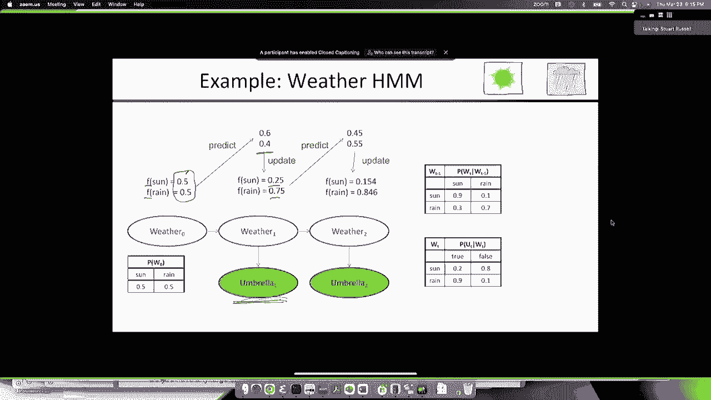
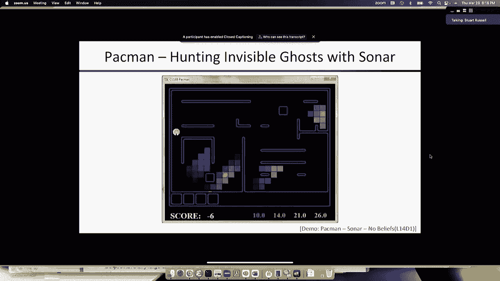
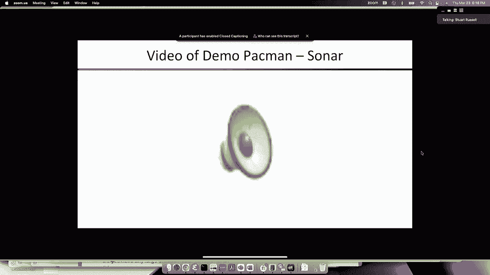
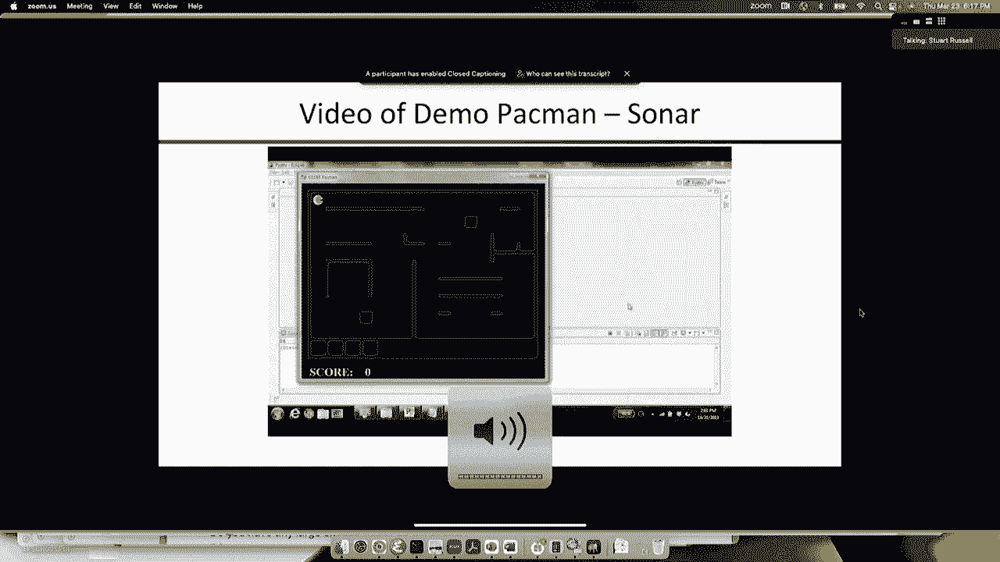
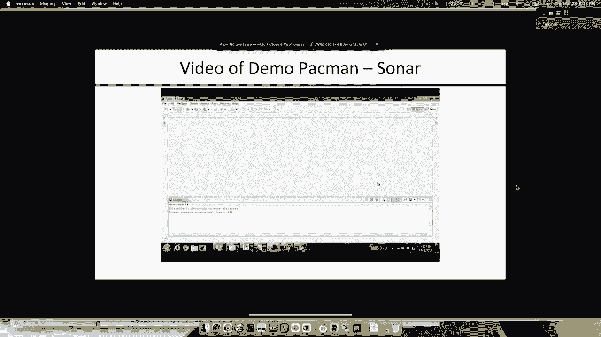
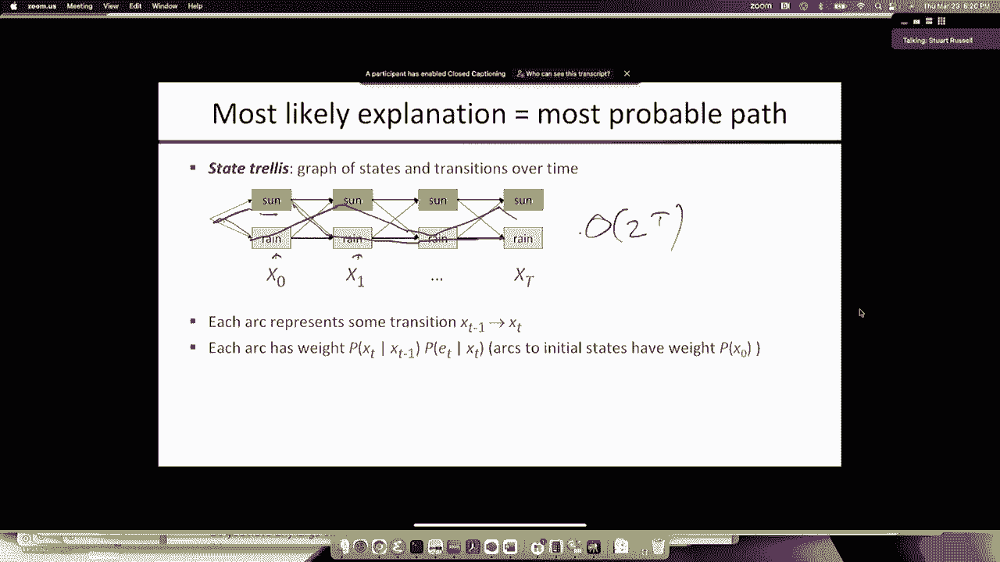
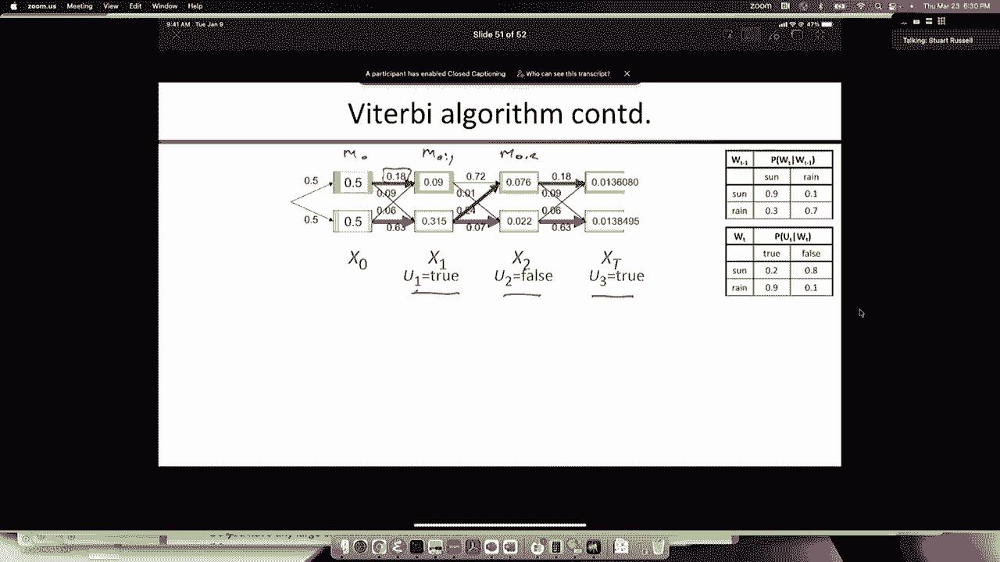

# CS188 伯克利最新AI课程--人工智能入门推荐 - P21：[CS188 SP23] Lecture 20 - HMMs, Filtering, Viterbi - 是阿布波多啊 - BV1cc411g7CM

所以今天我要结束关于马尔可夫模型的讲座，嗯，所以从技术上来说，我们将比计划晚一节课，但幸运的是，我们在学期结束时留下了一些懈怠，所以松弛会缩小一点，我们一定会报道的，在学期结束前我们需要完成的一切。

好的，所以我们讨论了马尔可夫模型的这个想法，它是状态变量的序列x零x一，x 2 x 3以此类推，我介绍了这个天气的例子，天气可以是晴天也可以是雨天，先验分布从第五点开始，点五，然后有一个转移模型。

它描述了下一个状态的分布，给定以前的状态，所以这是一个一阶马尔可夫模型，因为它只取决于以前的状态，不是早期的状态，基本上，模型是太阳以概率点九持续，雨持续，概率点七，还有其他方法来描述这些马尔可夫模型。

你可以有一个概率状态转换图，其中有一个节点表示雨状态，太阳状态的一个节点，所以这更像是一个状态空间图，对呀，其中节点对应于状态而不是变量，或者你可以有一个所谓的格架图。

其中显示单独的状态和单独的时间步长，并描述它们之间的转换，我们将特别看到这一个，我们以后再用，好的，所以让我们开始做一些天气预报吧，对呀，所以在时间零，我们有概率点5，点五，我们想预测明天的天气，好的。

我们有我们的过渡模型，所以说，所以这个，我们要试着计算的东西，是时间1的概率分布，所以x 1的p，通过对，等于x零的求和，x 1和x 0的联合分布，好的，为什么我，为什么我做得对。

为什么我在表达式中引入x零，因为我有，也就是过渡模型，所以通过引入x零，我现在可以用我的模型中的东西来计算，并使联合分配，然后我可以使用一个产品规则来将其考虑到先前的，然后x 1的跃迁p给定x零，好的。

所以这是计算中一个非常常见的主题，你在引入以前状态的值，通过对先前状态的可能值求和，所以我们会看到这种移动发生很多次，然后这两个优先的东西都给出了，那是概率乘以零，这是过渡模型，就是这个矩阵。

所以如果我们插入先前模型和转移模型中的值，我们得到这一行的五分，加5倍于这一行的点，加起来是6。4点，好的，所以我们明天的天气预报是百分之六十的太阳，百分之四十，一切都清楚好，好的。

所以现在我们可以再来一次，对呀，我们有时间一六四，相同的过渡模型在时间二预测，完全相同的p x 2，我们带来x 1，通过对它的求和，然后我们考虑联合分布，我们做计算，我们得到第六点，六点三四。

所以现在我们有了未来两天的预报，对呀，百分之六十六的概率，下雨的概率为4%，我们可以做同样的事情对，从时间二开始，这是时间三的值，好的，所以现在你可以看到你如何预测任意遥远的未来，你只是一步一个脚印。

从每个时间步长分布，你可以得到下一个，使用同样的简单计算，所以很明显我们可以重复五十步，未来的一百步，这是，这将成为过滤算法的一部分，过滤是电气工程中的一个老词，但你可以把它看作是监视。

或者有时它被称为状态估计，所以跟踪世界的状况，给定一系列观察，这是任何智能系统都需要正确完成的绝对基本的计算，你们一直都在做，好的，如果我问你，你知道你的，如果你有车，你的车现在在哪儿？

你希望能跟踪到这一点，如果我说，你知道，你的电话呢？你的手提电脑呢？你在哪里，你的身体在哪里，你在跟踪所有这些事情，呃，当你走的时候，好的，所以这是其中的一部分，我们还没有处理观察，我们只是在处理。

状态序列与预测，所以如果我们想知道时间t的状态是什么，然后我们对可能的状态求和，在时间t减去两个上的联合分布中的一个，两个状态变量，我们把它考虑到之前在州上的分布，然后过渡模型。

这就是我刚才给你们看的一般形式，我们称之为前向算法，因为它采用时间t减去1的概率分布，并将其向前移动到时间t，好的，同样的事情适用于每次，步骤，所以概率从以前的迭代转移模型，你就完蛋了。

然后你从零点开始，然后你就不停地申请，所以这种一般类型的更新被称为递归更新，你可以认为它是好的，时间t的概率分布由时间t减1的概率分布得到，通过应用一些函数g，所以如果我想在t时间得到它，我只是反复涂。

p0的，这就是我得到答案的方式，所以g是一个相当简单的，对于完全滤波或状态估计问题，我们将看到这一点，g有点复杂，但我们仍然可以得到一个G函数，给你一个递归更新，想到这一点也很有用，嗯，概率分布。

如果你有一个很好的离散状态空间，就像这里，我们有两个状态，所以我们可以把分布看作是一个两元素向量，我们可以把过渡模型看作是一个二乘二的矩阵，然后我们可以想到这个计算，递归更新g作为矩阵向量运算。

所以如果我们回头看这个表达式，我们有一个概率乘以一个概率向量，加上另一个概率乘以概率向量，你可以把它写成矩阵乘以向量，好的，所以你想要的矩阵是这个，如果你看看这里的这个东西，它实际上是转置转换矩阵。

如果我们写，如果我们用um写转换矩阵，每行有一个条件分布，这是给定太阳的条件分布，这是给定降雨的条件分布，所以如果每行有一个条件分布，我们把它换位，所以就是这样。

所以基本上t的p等于t的转置乘以t的p减去1，所以g函数只是乘以转移矩阵的转置，这意味着如果我想应用g，你知道六十四次是对的，一种方法，就是给过渡矩阵加电，所以把它自己乘以，现在，我得到了它的正方形。

把它自己再乘以一次，我得到了第四种力量，八次方，十六次方，以此类推，所以我实际上可以比线性做得更快，我可以做对数时间，如果我启动转换矩阵，然后，然后，而不是成倍增加，一次一个，你可以做很多其他的把戏。

所以你可以倒着做，对呀，但你也可以写T的p，减一等于t，转置到T的p的负一，这样我就可以倒着推理了，弄清楚前一个时间步骤的分布是什么，如果我有当前时间步长的分布，所以矩阵代数给了你更多的自由。

思考你可以用代数形式进行的计算，而不是大量的总结等等，好的，所以显而易见的问题是，如果我们回头看看我们得到的概率，对，所以我们有，我们从第六点开始，四点，我们得到了第六点，六点三四。

然后我们得到了点69，六点三，零四，显而易见的问题是，这是怎么回事，发生了什么，如果我们继续这样做，它有吗，我们最终在一个，对呀，数字似乎越来越大，它们会聚成一个吗，对我们是，我们将百分之百地预测。

将来一百天都是晴天，可能不对，我们预测会是晴天，概率为1，因为事实上我们知道，唯一损失权，它以概率点9持续存在，所以如果我们在遥远的未来任意思考，我们预计会有9天的阳光和3天的降雨，平均权利。

交替一种典型的分布，所以我们不应该预测，我们不应该期待，它会收敛到一个，但它会聚成什么，还是它向右摆动，嗯，所以我们想求p无穷大，当时间趋于无穷大时，概率分布是多少？我们怎样才能很好地发现这一点。

好的是，p无穷大和p无穷大加1是一样的对吧，假设存在某种极限分布，那么一旦你走得足够远，它就不会改变，下一步也应该是一样的，所以现在我们有一个简单的方程，因为p无穷大加1等于t转置乘以p无穷大，好的。

所以如果我们，如果我们把p无穷大表示为某个未知的小p和一个减去p，然后我们来解那个小p，所以这是T转置，这是我们未知的分布，我们知道如果我们把t转置到这个分布上，它还是一样的，所以它等于p，一减p。

现在我们只解p，所以很容易，我们得到点9 p+点3乘以1-p等于p，这是最上面的一行，事实上，因为另一个是1减去p，如果我们写出另一个方程，点1乘以p加点7乘以一减p等于一减p，等式是一样的。

所以只有一个未知的，我们只是解决了一个未知的问题，答案是七点五，所以如果我在未来任意的某一天，概率，根据我们的过渡模型有75%的机会是晴天，百分之二十五的机会下雨，好的，所以如果你还记得我说的话，右九。

你期待九天的阳光，然后呃，大约三天的雨，那就是百分之七十五，所以说，注意到这与我们开始的地方无关，我们从五点开始也没关系，点五，或者我们甚至可以从零点或零点开始，如果我们知道今天下雨，那是零一对了。

如果你只是不停地迭代，这并不重要，过渡模型将瞄准并最终在同一个地方，所以实际上，那倒是真的，如果你记得回到，当我们谈到MCCMC算法的收敛性时，这个断裂的地方恰恰是。

如果你有一个在某些方面是确定性的过渡模型，因为你可以，您可以从状态空间的一部分开始，并且永远不会到达状态空间的另一部分，因为过渡模型不允许一些过渡发生，所以在转换矩阵中有一些零，所以你从哪里开始很重要。

然后，你不会得到财产，你总是在极限中收敛到相同的分布，但只要那些技术条件，呃，满足概率从零到一的有界，以此类推，然后你会收敛到这个独特的静止分布，所以现在让我们来看看，而不仅仅是预测状态序列。

我们实际上要试着弄清楚状态是什么，从我们得到的一些观察来看，这些观察本身不是，它们不足以仅仅告诉我们状态是什么，所以这部分是一个部分可观察的环境，对呀，现实世界就是这样。

很多事情我们不知道你是否记得上次星期二，我们进来的时候正下着倾盆大雨，但当我们坐在这里的时候，可能雨停了吧，但也许雨停了，你知道你能有什么线索吗，雨停得好不好，我可以看着门外，我可以看到，你知道吗。

其他人带着伞进来还是不对，那会是个线索对吧，这不是一个完美的线索，但如果他们进来了，这将是一个线索，像这样撑着伞，或者像这样拿着，或者抖落雨滴，就像所有这些都是它是否还在阅读的证据。

这就是我们要讨论的事情，这里，所以最简单的部分可观测模型是，所谓的隐马尔可夫模型，隐隐马尔可夫模型的主要假设是，状态是单个离散变量，好的，以后，我们将在下节课中看到，我们将看到所谓的动态贝叶斯网络。

其中状态可以用大量的状态变量来描述，对呀，我的笔记本电脑在哪里，我的电话呢，我的钥匙呢，我的车呢，我冰箱里有吃的吗，对呀，这些都是状态变量，在给定的时间步长上有自己的值，但现在有了嗯哼。

我们只假设一个离散状态变量，证据可能会更复杂，对呀，你可以有几个证据变量，它们可以是离散的和连续的，它并没有真正改变基本的数学，所以贝叶斯网，这是我们已经有的马尔可夫链模型，但是从每个状态变量中。

有一个子变量，这是那个时间步长的证据，好的，所以这就是，这就是我们要使用的结构，所以考虑到这里的证据序列，我们要推断出，世界上实际发生的状态序列，实际上会用雨伞观测来增强我们的天气模型。

就像我在这里可能有的那个，实际上在书中，故事是我驻扎在一个核导弹发射井里，所以我连续几个星期都在地下，负责的上校时不时地出现，他可能带着伞，也可能不带伞，这是我唯一的证据，上面的世界是否在下雨。

所以雨伞是证据，如果下雨，更有可能，上校拿着伞，或者我会看到人们在颤抖，把伞扔到门外，嗯，所以我们必须描述在所谓的传感器模型中的概率分布，所以传感器变量的分布，给定状态的证据变量称为传感器模型。

就像转换模型一样，我们假设转换模型在每一个时间步长上都是相同的，对呀，我们假设传感器模型在每个时间步长上都是相同的，好的，所以很多传感器实际上会随着时间的推移而变化，比如说，呃，他们可能会向右突破。

如果很多传感器需要电池来运行，就像测量你体温的东西，和控制中央供暖的家用恒温器，对，需要电池才能运行，如果电池没电了，那么屏幕上的传感器读数就不一样了对吧，它可能只是空白而不是63。

所以如果你的传感器有状态，然后传感器的状态就进入了系统的状态，你会添加你会添加一个电池变量到系统的状态，然后你的传感器只取决于状态，所有的权利，所以我们这里的传感器模型是，嗯，当天气晴朗的时候，对呀。

有百分之二十的可能性是内核带着他们的伞，下雨的时候有百分之八十的机会他们不是，他们有百分之九十的可能带着伞，他们有百分之十的机会没有带伞，所以雨伞很吵，关于世界状况的证据，所以这里有两件事，好吧。

如果我试图弄清楚世界的状态是什么，我得到了目前嘈杂的证据，好的，但我也得到了这样一个事实，即状态序列有一些持久性，如果昨天是晴天，今天可能是晴天，如果昨天下雨的话，今天可能下雨，所以这就带来了。

如果我试图预测当前的状态，这意味着前一步的证据也是相关的，事实上，之前的所有证据都与我对当前状态的预测有关，因为所有以前的证据都帮助我预测以前的状态，它帮助我预测当前的状态，所以这就是信息流动的方式。

基本上是这样向上，这样向上，通过过渡模型，沿着这条路，然后你可以，你可以推断目前的天气，好的，贝叶斯网络推理算法会处理这个过程，但我想你想明白为什么这些东西会导致，信仰，如果我们要写下概率模型，我们有。

如果我只看状态序列，我有相同的概率，状态序列的联合概率是先前的时间，给定前一个状态的每个状态的条件分布的乘积，所以所有过渡模型的乘积，然后如果我加入这些证据变量，然后基本上对于每一个时间步。

我得到了父母给出的证据的条件分布，所以这里有一点条件分布，所以我乘上，就像在普通的贝叶斯网里一样，给定其父变量的证据变量的概率，它是给定x t的e t的p，现在我得到了所有状态变量的联合分布。

有一个错别字，这应该很抱歉，这应该是e到e，t，好的，所以所有状态变量和所有证据变量的联合分布，这是这个大表情吗，好的，所以这和它是一样的，只是诱饵会在正常的海湾里，门恩。

所以有两个主要的条件独立性假设，第一个右边，这是呃，普通马尔可夫性质，对于状态序列，但是，我们也有这个假设，特定时间的证据只取决于当时的状态，而不是在任何其他州，不是在过去，不是未来。

它也不依赖于以前的任何证据变量，所以这有时被称为传感器马尔可夫假设，嗯，所以说，给定这个模型对，我有个问题，你可以问，证据变量是相互独立的吗，另一种方式，如果我说好，它等于2的p给定1等于2的p，问号。

我不这么认为，好的，多说一点，这是因为它们是由，国家的过渡模型，所以如果我看到他拿着伞，那么今天他昨天带着一个，对呀，它会改变吗，我想他今天带着它的可能性有多大，答案是肯定的，因为如果他昨天拿着它。

那可能是因为下雨了，这意味着今天可能会下雨，这意味着他今天更有可能带着它，所以证据变量不是相互独立的，他们只是独立的，鉴于他们各自的父母，所以有一件事很有用，所以不把p写成x 0 x 1，我们就用这个。

x从a到b右，意思是x，a，x，a，加1至x，所以A到B表示从A开始到B结束的时间指数序列，所有的权利，所以嗯是非常简单的模型，对不起，是啊，是啊，去吧，所以这意味着什么，比如说，对呀。

所以目前的独立性是独立于其他一切的，因为目前的状态，所以说，比如说，的p，e 1等于给定的e 2中的p，好的，所以说，如果我知道有人在下雨，内核昨天拿着伞，并不影响我对他是否会拿着伞的信念，今天，好的。

因为他带着伞是下雨造成的，对呀，不是因为他昨天是否带着它，所以它是一个，这是一个因果关系，你知道吗，如果你愿意，因果屏蔽，就像发生在普通基础中一样，所以HMMS是非常简单的概率模型，但他们实际上非常。

在艾权的历史上很有影响力，所以说，它们最初在语音识别方面非常流行，事实上，直到大约十年前，所以从1970年到20年，十一二十二，类似的东西，嗯，HMMS是进行语音识别的标准方法，好的。

所以你会得到正确的观察，证据将是测量到的声学信号，对呀，你可能会在不同的频段分解，等等，但是你把声学信号放在证据变量里，然后序列的状态，状态序列基本上是哪个音位，哪个词，我现在在说话吗。

我是在说猫中的A吗，还是我在说a in cut，是的，所以在这个离散状态变量中有很多状态，因为你有一个，你大概有一万个字，你认识到每个人平均可能有三个位置，所以没有，大概五个位置。

所以你可能有5万个离散变量的可能值，然后对于每一个，你将训练传感器模型，你写，这是什么，当我说猫的时候是什么声音，当我说停的时候是什么声音，这和我说的有趣有点不同，对呀，好玩的和剪裁的不完全一样。

但他们很相似，但值得区分，所以我会训练那些传感器模型，然后我会训练什么是过渡模型，过渡模型很好，如果我说你知道接下来的事情有多频繁，下一个或R或类似的孩子等等。

所以状态转换模型也是从很多很多人那里训练出来的，说话还是很多很多的短信，事实上，它和我们看到的N克模型很相似，除了n克模型是单词序列，而这是声音序列，受教育权，嗯，你知道这其实很容易做到，你可以进去。

你知道的，一天左右的编码，你可能会建立一个语音识别系统并运行，它起作用了，它工作得很好，机器翻译更难描述状态是什么，嗯，我想你得相信我，直到2012年左右，HMMS再次成为标准方法。

似乎给出了更好的性能，这是一个有趣的问题，我很乐意，我想这可能是一个太长的讨论来进入为什么，深度学习系统提供了更好的性能，我想主要是因为嗯模型不是很有效，复杂系统的参数化方法，所以给大家举个例子，对呀。

如果你有五万，所以如果有一万个字，每个都有五个位置，这是语音识别的五万个州，右边的转换矩阵是五万乘五万，对呀，那已经是，但这些参数中的大多数并不特别有趣，他们中的许多人都非常，非常相似。

这只是一种糟糕的方式来参数化转换模型，所以深度网络说的是，我们不知道如何参数化这个系统的转换模型，所以我们会给你一亿个参数，你会发现数据告诉你如何使用这些参数，来获得下一个状态的最佳预测。

这是一种有效的技术，我想我会说基本上人们都退缩了，实际上我们会看到动态贝叶斯网，这是一个更好的方法来参数化一个复杂的转换模型，但不幸的是，就在他们开始为语音识别做动态贝叶斯网的时候。

深度学习网络的人吹走了，嗯人，然后人们就这么做了，事情就是这样发展的，所以机器人跟踪将在一秒钟内看到一个例子，另一个有趣的是分子生物学，对，所以观察到的是核苷酸，所以观察到的。

DNA序列中的一个c gt，和各州，都是，你想象有一台机器以某种方式读取DNA，机器的状态随着它的前进而切换，这正是读取细胞中DNA的机器所做的，随着时间的推移，它说的序列，哦。

我意识到是时候开始抄写了，上面写着，好的，这是一个基因的开始，所以现在我们把它变成RNA，然后是蛋白质，然后我意识到是时候停下来了，所以它就进入了一个不同的状态，所以我们最初不知道是什么，呃。

导致这种情况的信号是什么，这台机器，转录机器的启动和停止，并做它的各种事情，嗯，但随着嗯，你可以训练它，然后你可以预测一个新的DNA片段，那一段DNA将如何转录成蛋白质，它仍然，你知道的，所以说。

HMMS仍然是分子生物学的一个重要组成部分，所以和一个嗯模特在一起，有一堆基本的任务，你希望能够做，也是最重要的一个，正如我所说，这个过滤任务，或者跟踪状态，那么当前的状态是什么。

我没有给出我从一开始到现在所看到的所有证据，所以这是过滤或状态估计，有时它被称为你正在计算的东西有时被称为信念状态，对呀，你对世界现状的看法是什么，这是对的，一旦你有了信仰状态。

这足以对未来做出理性的决定，对呀，你不需要记住所有你见过的证据，然后根据你所见过的所有证据做出决定，相反，你跟踪这种信念状态，然后你在此基础上做出决定，所以说，比如说，如果你需要去拿你的车。

你有你的信仰状态，我的洞穴，我的车在那边的停车场，你去那边的停车场，你不必记得你开过车的所有时间，或者停了你的车或者上了你的车，或者我和你的车有任何关系才能做出这个决定，所以这是理性行为的基础。

理性决策的另一部分是预测未来，好吧，如果我这样做，这个和这个未来会是什么样子，所以这是在预测未来某个状态的时间，t加k，鉴于所有的证据，我已经走了这么远，平滑是另一个词，所以平滑和过滤一个词。

这两个词都来自电气工程，它们更多，他们对运动物体的信号和轨迹之类的东西感兴趣，但平滑通常意味着预测过去的某件事，OK是小于当前时间T，所以到目前为止你得到了所有的证据，过去是什么状态，这真的很重要。

比如说，如果你是侦探，你看到了到目前为止的证据，你得弄清楚是谁杀了谋杀案的受害者，这是过去发生的事情，所以你想弄清楚，你知道谁在哪里，发生了什么，到目前为止有证据，结果也是对的，如果我想学习过渡模型。

那我想利用所有的证据，我必须试着弄清楚到底发生了什么状态转变，如果我只是得到，如果我有一个完全可观察的马尔可夫模型，那么过渡模型就很容易学习了，因为我能看到过渡，所以当我处于这种状态时，我只是数数。

或者当我看到这个词的时候，我看到这个词下一个出现多少次了，但如果你看不到状态，你看不到过渡，但你可以推断，你可以对实际发生的转变做出最好的猜测或概率分布，你能用的证据越多越好。

所以你总是想利用所有的证据，你必须推断过去发生了什么转变，然后从你推断出这些转变的事实，您可以学习或改进您的转换模型，如果这听起来是循环的，因为为了推断过去发生了什么，我需要过渡模型，它是圆形的。

事实上，你所做的是迭代，你从一个糟糕的过渡模型开始，你用它来推断过去发生了什么，考虑到所有的证据，然后在这些推断中使用它来改进转换模型，然后你重复这个过程很多次，这就是我们为HMMS进行机器学习的方式。

和其他种类的贝叶斯网，其实还好，然后最后一件事是一个，这被称为最有可能的解释，所以我想要的不仅仅是一步，但我实际上对整个序列感兴趣，那么根据证据，最有可能的状态序列是什么。

所以它是所有序列x 1到x t的arg最大值，这就是语音识别所需要的，所以你得到了一系列声学信号，你想说最有可能的句子是什么，对呀，不是在每一点上最有可能的词是什么，因为事实上。

如果你在每一点上挑一个最有可能的词，你可能会得到一个胡说八道的句子，最，所以说，最有可能的句子可能由个别不是最有可能的词组成，考虑到这句话在那一点上听起来像什么，然后这也是如此用嘈杂的频道解码。

如果你上过课，那你就知道这是怎么回事了，对呀，但是所有的收音机，所有网络，对呀，他们正在发送一系列，呃，数字信号，um卫星，太空探测器，等等，等等，对呀，他们都在发送比特序列，你想知道比特的真实序列。

你得到的是一系列被噪声破坏的比特，好的，你想尝试重建真正的位序列，通过了解信号本身的性质，所以这只是同一件事的图片版本，所以过滤我对当前状态感兴趣，鉴于到目前为止所有的证据，预测未来状态，平滑过去状态。

然后解释整个序列，所以让我们看看这个，这个过滤任务，并找出如何做到这一点，所以我们要计算xt的p，给定从1到t的证据，我将在这里使用一些新的符号，我称f为向右f代表向前，好的。

所以基本上当这是一个正向计算时，我们要看看怎么做，在这种递归更新的想法中，我们从f 0开始，然后从那里开始让你相信这项任务有多重要，第一个真正流行的过滤算法被称为卡尔曼滤波器，卡尔曼过滤器。

我想我们会在下一个看到一点，下一节课是转换模型是线性的系统的滤波器，这些是连续状态系统，线性动力学和高斯不确定性，在过渡模型和传感器模型中，它从一开始就被发明和使用，在阿波罗计划中，对呀。

因为火箭需要知道它在哪里，为了决定如何，你知道该解雇哪些东西，为了，为了保持在准确的轨迹上，进入绕月轨道，或者不管是什么，卡尔曼滤波器正在进行这些非常嘈杂的测量，这些测量来自，透过太空舱的窗户观察星星。

或者测量来自地球上各种基站的信号转换时间，你只能想象在1960年，他们的电脑比，我这里的笔记本电脑，所以所以你知道，所有的基础设施都要吵得多，更不准确，他们只能你知道，八位之类的算术。

所以做这个真的很难，卡尔曼滤波器是革命性的，它允许这些系统工作，而这七百八十，卡尔曼滤波器上的八千张纸是不正确的，已经过时了，今天早上我查的实际数字是一百万，发表论文110万篇。

至少有了卡尔曼过滤器这个词，所以它给你一种感觉，这种技术是多么无处不在，这个任务是为了工程，让我们做一个非常简单的例子，这是一个离散的网格世界，但它让你尝到了真实发生的事情。

试图找出自己位置的真正机器人，所以如果你还记得，这与示例相当相似，我们有吃豆人在他的吃豆世界里对吧，然后测量四个方向是否有墙，所以我们这里有完全相同的传感器，除了传感器现在是嘈杂的，而不是完美的。

所以吃豆人有一个完美的传感器来判断四维空间中是否有墙，因此给出了一个观察，有一套逻辑上可能的立场，在概率意义上，每一个都有同样的可能性，嗯，所以我们没有什么，我们没有那种区分，他们要么可能，要么不可能。

这就是逻辑所能告诉你的，但在这里，我们将看到一些位置变得比其他位置更有可能，随着时间的推移，你积累了证据，我们用这个灰度右边，所以零意味着机器人极不可能在那个位置，黑色意味着它极有可能在那个位置。

所以我给你看，机器人对，你可以看到那个大红色的斑点在哪里，但机器人不知道自己在哪里，机器人只需从当前位置获取相邻墙壁的观察结果，好吧，一开始它不知道，所以到处都有均匀的概率，这就是为什么它都是灰色的。

然后我们将开始移动，然后收集观察结果，好的，所以传感器模型，说可能会有错误，但不可能有一个以上的错误，好的，所以你取真正的值，你可以腐蚀其中一个，啊用，你知道吗，所以随便挑一个，以一定的随机概率破坏它。

然后过渡模型也是有噪声的，对，你可能会移动，事实上失败了，所以你就呆在原地，而不是去下一个广场，你有两个不确定的来源，你不知道，即使你知道你从哪里开始，你不知道你现在在哪里。

因为你不知道这些行动中哪一个失败了，你有一个嘈杂的传感器，你知道吗，所以你甚至看不到你周围的环境，嗯，所以第一件事是，我们看到，或者至少看起来上面和下面有一堵墙，所以绿色的意思是有一堵墙。

红色代表没有战争，所以在这种情况下，至少，嗯，我们确实得到了正确的价值观，所以没有腐败，因为机器人不知道它得到了正确的值，对呀，那些感官可能仍然是错误的，现在如果你计算，呃，后验概率权，任何。

这里的任何一个细胞，对呀，上面的这些，与那个一致，所以这将是零错误，所以它可能在其中一个，它也可能在这里，就在那里，会有一个错误，因为，事实上，它说在那个地方有一堵墙，但没有一个，好的。

所以这些是一个误差平方，所以他们不太可能在这里，它必须犯两个错误，它必须看不到那堵墙，它必须加上那堵墙，所以我没有看到那堵墙，也没有加上那堵墙，对吧，所以这是两个错误，我们不允许传感器不会产生两个错误。

所以它在一个角方块中的概率，或者其中一个垂直走廊现在为零，好的，所以从一个观察来看，只是它醒来，得到一个测量，现在它有了一些想法，或者至少更多关于它在哪里的想法，然后它试图移动，它确实会动。

虽然它不知道自己在动，它得到了一个新的观察权利，同样的观察，上面和下面都有一堵墙，左右没有东西，好的，所以现在你答对了两个，不仅仅是测量，但你也知道我可能搬家了，即使我以前在这个广场上。

我可能已经不在那里了，所以这就是概率下降的原因，对呀，那个平方与传感器观察到的一致，你可能已经不在里面了，因为你向右移动，好的，这是关于传感器的信息和关于过渡模型的信息的结合，好的，你可以在这里。

但又一次，这与目前的传感器一致，你向右移动，你必须得到，你必须有一个前一个时间步长的错误，然后现在一致的值，所以这又是，有一个错误，这是一个可能的错误，这里也一样，您在上一个时间步骤中没有错误。

然后你移动了，你现在有一个错误，所以这又是一个，一个错误状态，所以在你的头脑中跟踪这一切开始变得相当复杂，所以你可以，你知道的，如果我告诉你后验概率是多少，你可以弄清楚，嗯，为什么。

但在你的脑海中很难做到这一点，并预先计算什么，所有这些概率都应该是，但基本上现在发生的是我再次向右走，现在有三个层次的状态，有些状态我可以假设，传感没有发生错误，在过渡中没有发生错误。

这些是最有可能的状态，所以只有这四个对吧，因为它们与所有传感器的观测一致，它们允许我从所有传感器观察到的状态，然后在某些状态下，你必须犯一个错误，就是这些，有些州你必须在，在两个不同的时间步长。

所以两个错误，好的，当我们继续好吧，我们现在再次移动，我们有三个是对的，有三个层次，对，无错误，一个错误，两个错误，三个或，我猜，四个层次，事实上，如果你继续右，如果你有一个很长的走廊。

有很多很多可能的州，对吗，我们实际上会因为，我们实际上会得到一种高斯分布，我们认为机器人在哪里，很好所以我们去了那里我们没有看到下面的墙，所以现在，事实上，几乎所有的概率质量都在那个平方上。

因为肘部方块不允许这样做，清楚了吗，好的，所以它不像吃豆人本地化那样完美，最终我们得到了一个逻辑上可能的正方形，但这里我们有，因为我们有噪声传感器，对了，还有一堆方块是可能的，即使他们非常，极不可能。

好的，那么这个算法通常是如何工作的呢，我们要达到同样的基本想法，假设我们能够计算时间t的信念状态，然后我们如何得到时间t的信念状态，通过应用此函数加一，g此递归更新，鉴于T加一的新证据，所有的权利。

所以我们要把以前的估计，新证据，并通过递归更新计算新的估计值，那么这怎么行得通呢，我们必须计算这个概率，我只是要通过推导步骤，和主要的，主要的技巧，实际上就做数学而言，对不起，是的，那是。

主要的技巧是把证据分成两部分，T以下的证据和T加一的新证据，所以我所做的就是，我拍了那个序列，我把它撕成了两半，然后对这个表达式应用贝叶斯规则，对呀，但我们要保持E T加1。

所以我们要以E T加1为条件，基本上，并应用贝叶斯规则翻转其他部分，在这个调理棒的两边，所以贝叶斯规则会把这些东西翻过来，但我们要保持E E T加一，它在右手边的地方，好的，所以当我们翻转的时候。

我们得到x，t的p加上1给定e，1到t，和p的呃e t加上呃对不起，我说错了，我们要把它留在原处，我们要翻转对我来说是非常无益的，我道歉对吧，我们要，我们要翻转这些家伙，让一个通过T，它在哪里。

所以当我们翻转的时候，我们得到，给定xt加1，这是好的，对呀，这是传感器模型，然后我们得到了另一个东西，x t加1给定e 1到t，所以接下来我们可以做的是我们可以应用条件独立性，所以如果我看这个表达式。

传感器马尔可夫假设说给定x t加一，e t加1的概率分布不依赖于其他任何东西，特别是它不依赖于一个通过T，所以现在一个通过T消失了，所以现在我们看这个表达式，这已经是模型的一部分了，对呀。

这是传感器模型告诉我的，所以这很好，现在我得处理这件事，那么这东西是对的吗，这是一个预测，这是给出的所有证据，到目前为止我所看到的，什么是，明天天气怎么样？好的，但我们已经看到了如何正确地做到这一点。

我们如何预测明天的天气，考虑到我们今天的天气，4。我们分析了今天的天气以预测明天的天气，所以这是预测步骤，我们这样做，嗯，所以我们将用我们以前做的同样的方法来做这件事，这称为更新步骤。

它乘以观察到的传感器模型，然后我们将结果归一化，所以预测更新，正常化这是三个步骤，所以要得到这个预测，我们将以x为条件，所以我们要对xt变量求和，好的，当我们在xt变量中求和时，我们得到x t的和。

xt的p给定e到t，然后p的x，t加上1给定x，t，e，1到t，好的，现在如果我们看看这个，好的，我们看到这是过渡模型，右xt加一给定xt，根据马尔可夫假设，这不重要对吧，那是独立的。

我们独立于v1到t给定前一个时间步长，所以我们将应用马尔可夫假设条件依赖，我们得到这个，现在我们得到了x，1，x，t，plus，one，to，xt，那是一个过渡模型。

我们已经得到了嗯X T给了一个通过T，那是先前的估计，我们有e t+1给定x t+1传感器模型对吧，2。我们得到了初步估计，然后是过渡模型和传感器模型，我们都有，所以这是G更新，好的，原来如此。

我又读了一遍，所以我现在可以写这个，因为我得到了T加1的新信念状态，如果从1到t加1是，我从F到T，我拿着新的证据，E T加一，我应用这个前向算法，就是计算，对此有什么问题吗，好的。

所以这是相当简单的数学，它是它是一个有点棘手，我想如果你坐下来说，好的，我该怎么做，你可能会尝试各种各样的事情，但它们都不起作用，然后你尝试另一件事，它不会起作用，然后你就会想到正确的想法，对呀。

就是把证据序列分成两块，然后现在我知道怎么做了，它会穿过，所以关于这个算法的一些观察，对呀，贵的部分是什么，昂贵的部分是预测，对呀，因为对于x t的每一个值，我们要计算xt加一的概率分布，所以如果有。

如果这是一些州对吗，那么这个分布的大小，这里的数字是状态的数量，对吗，所以说，好的，所以它有那么大，然后有多少个，有那么多，所以做这个计算的成本是状态数的平方，所以有一个很好的观察。

也就是说更新的成本与T无关，好的，这是至关重要的权利，想象一下，随着年龄的增长，你花了越来越长的时间来处理从你眼睛里进来的每一帧视频，为了更新你的信仰状态，你会有点跟不上现实。

对你处理每一帧画面的时间会越来越长，但帧是以同样的速度来的，你最终会落后于现实，那将是那将是结束，嗯，但这是恒定的，不受时间的影响，所以不管这个证据序列有多长，不管有多大。

你正在建造的这个又大又长的瘦骨嶙峋的贝叶斯网，更新时间是恒定的，与序列的长度无关，所以这很好，这很糟糕，因为，如果你有一个有很大状态空间的模型，假设状态是由几百个布尔变量定义的，经常是这样，然后更新。

所以这意味着有两到两百个州，这意味着更新是400次计算的2次方，好的，所以那是完全不可能的，所以这就是为什么HMM本身并不总是一个很好的代表的另一个原因，和动态贝叶斯节点，我们可以使更新更加高效。

所以这很糟糕，但有一件好事是对的，我们会在下节课中看到一些非常好的，基于采样的近似更新算法，允许您这样做，这个过滤计算，即使在实践中对于非常大的模型，好的，这太棒了，因为这很有趣，发明这些新算法很有趣。

我刚才给你们看的计算，你知道我在上面潦草地写了，好的，这个计算就在这里，你又可以看到了，就像它有求和和乘法，求和乘法，我们可以用线性代数计算来解决这个问题，它有点复杂，我们必须做一个叫做观察矩阵的东西。

观测矩阵取决于当时步长的证据，好的，所以你得到了证据，你把它放在矩阵的对角线上，或者矩阵的其余部分为零，好的，例如，如果我观察到一次伞是真的，然后我去看我的传感器模型，我看到，好的，因为这把伞是真的。

状态为，我看到雨伞有可能是真的，给定阳光是第二点，雨伞是真的可能性，如果下雨是九点，所以我从我的传感器模型中取出一列，我把那列对角线放入观察矩阵中，所以我们这样做是为了让事情。

我们所做的计算是为了使计算成为线性代数计算，这是概率论和机器学习的人一直在做的事情，他们把数据塞进矩阵里，它们重塑矩阵，他们做了所有这些事情，所以一切都可以用线性代数来表达，所以如果你拿一个八十九。

你花了很多时间把数据塞进矩阵，并对它们进行操作，在这些数据矩阵上，所以给定给定时间的证据，你通过从传感器模型中提取适当的向量来构建观察矩阵，然后计算就是，你采取以前的信念状态，它是一个向量。

您将转换模型应用于它，然后乘以新观测的观测矩阵，然后你正常化，这就是矩阵形式的滤波计算，而且非常，非常简单，再一次，对呀，我可以计算，比如说，如果我，如果给我这个，我想倒退，对呀，我只能说好。

1对t加上1，加一等于-1乘以t等于-1，然后呢，然后是不同的归一化因子，这会给我一个机会，所以我可以，我可以前进，我可以倒退，我可以去，我可以通过平方转换和观察矩阵来迭代，你知道的。

向未来或过去迈出一大步，我什么都能做，所有的权利，所以让我们看看天气如何，所以我们又一次从零点的先验开始，哪个是均匀的，所以f是一个两元素向量，阳光的一个元素，雨的一个元素。

然后在第一时间出现了一个观察，我们观察到伞是真的，所以我们做了乘以转移矩阵转置的预测，这与我们的计算完全相同，之前，我们有六成四，然后我们更新我们乘以雨伞为真的观察矩阵，我们得到了2。5点，点七五。

然后我们再次预测并再次正常化更新，你知道，这只是重复，所以这是一个非常非常简单的过程，对呀，预测更新，预测更新。

所以我不确定我们在下一个项目中是否还有这个，但是这个，视频来自一个，丹·克莱因的视频，所以这里的想法是，吃豆人其实是在猎鬼，所以与其试图逃离鬼魂，吃豆人现在可以吃鬼了，但如果我们吃了鬼。

他必须在同一个广场上，但鬼是看不见的，那他是怎么找到鬼的，他有声纳，声纳给你，就像捉鬼敢死队的例子一样，声纳会给你一个嘈杂的测量距离，鬼是对的，所以你如果鬼魂是，让我们在这里假设棕色的鬼魂。

然后你就会得到，你会得到每个方块的概率，说有一个，如果我们得到一个测量结果，我们就有可能得到，从那个广场，所以声纳数据是可用的，然后吃豆人必须在移动时从声纳数据中找出答案，随着时间的推移。

整合所有这些信息，然后这是显示显示器，向你展示了东海岸位置的后验概率。

代表吃豆人的后验信仰。

考虑到所有的范围发现，现在你还是看不到鬼，但你可以看到你认为它们可能在的地方的云，父母，所以很难找到这些鬼魂，但请注意这里的这个，现在他进了走廊，你就有点，即使鬼魂在随机移动，他出不去走廊。

所以我们对他在哪里有更好的了解。

因为它的项目应该在周末之前完成。

所有的权利，所以我们要做的最后一件事就是找出最有可能的解释，所以再一次，这是为了找出给定的一系列观察，最有可能的状态序列是什么，整个序列的概率，随着时间的推移，鉴于证据，所以我们实际上可以想到这一点。

这就是格架图的用处，我们可以把这看作是找到穿过格子的最有可能的路径，好的，这是格子，我们得到了每一步的两个状态，所以当时的状态，时间1时零状态，以此类推，和一个解释，对呀。

状态序列只是通过这个格子图的路径，对呀，它必须跟着箭头走，所以它可能是，你知道我们从太阳开始，然后就下雨了，然后下了雨，然后下了雨，可能我们一开始就下雨，去了太阳，又下雨了，回到太阳等等。

所以这些路径中的每一条都是可能的，对呀，有多少条小路，所以作为时间数的函数，步骤，是啊，是啊，那么有多少条小路，时间戳数的函数，t的二阶，是呀，因为每一步，有两个选择，所以路径基本上是一个位字符串。

就这样就这样，呃，使用T的命令，所以如果你只是做了一些天真的事情，在所有的路径上做了那个argmax，这将是指数时间，这也意味着没有办法做到这一点，逐渐地，因为每次你添加一个新的时间步长。

即使你有这样的前一个，对呀，如果你现在，你有两倍的路径可供选择，所以你在每一步都要做很多额外的工作，额外的工作量随着时间的推移而增加，所以这完全是不可能的，我们必须找到有效的方法来做这件事，好的，嗯。

为了进一步进行这种类比，对，这是在寻找路径，好的，我们能想到的让我来收拾残局。

所以我们可以把每条路径看作是有一个权重，这是转变发生的概率，然后是与路径箭头末端的证据相关联的概率，就在过渡的第二个状态，因为路径的可取性，路径的概率是路径上权重的乘积，所以我们想找到这个格子图的路径。

沿路径权重乘积的值，所以让我们来看看数学，然后向右，我们想找到最有可能，所以在所有可能的序列上的argmax，x 1到t，好的，这个部分，状态序列的概率，给定证据序列，我们可以重写这个条件概率。

作为x 1到t和e 1到t的联合概率的归一化，嗯，归一化因子只是一个常数，所以这个表达式的arg max/x 1到t，对呀，阿尔法就这么走了，因为当你做八月最大值的时候，你在找最大的。

和十倍的arg最大值，某物与某物的argmax相同，所以你总是可以去掉常数，所以我们有联合概率的argmax，联合概率只是先前的时间，条件概率与证据概率的乘积，好的，嗯，所以这个表达式是权重的乘积。

其中每个权重是转移概率，乘以证据概率，好的，所以这就是任务对吧，我们如何找到成本最低的路径，其中成本是重量的乘积，所以我想我猜在这种情况下，最高价值的路径，其中路径的值是权重的乘积。

所以我们要开发的算法叫做维特比算法，以维特比先生命名，嗯，我想他是安德鲁·维特比，我想他是南加州大学的教授，如果我没记错的话，嗯，这个算法在经济上非常重要，因为它是噪声信号的基本解码算法。

所以每一件电子设备的工作，它是从网络或无线电中获取信号并提取，最有可能的未损坏的潜在位序列，体现维特比算法，我想他为算法申请了专利，所以他从这里赚了数十亿美元，我们将看到极其简单的算法。

我们可以开发这个算法，基本上是通过看看我们是如何做正向算法的，对呀，正演算法是用求和，计算所有路径的概率，嗯，维特比算法与正向算法基本相同，除非不是求和，我们要用max，好的，所以前向算法是对的。

这计算这个f消息，所以F信息说当时的每个州，出现那种状态的概率有多大？这种状态的概率是，到达它的所有路径的概率，好的，而这里的M信息将是，到达状态的任何路径的最大概率是多少，好的。

所以1是达到这个状态的所有路径的总和，另一个是达到这个状态的所有路径的最大概率，但除此之外，它是相同的权利和相同类型的递归，所以在正向算法中，你拿着你以前的，你把你以前对每个状态概率的信念。

你用证据更新它，你基本上是通过求和前一个状态来做到这一点的，然后在证据中成倍增加，所以这里，而不是求和前一个状态，我们将在前一个状态上达到最大值，英语中的另一种说法是。

时间t加1时到达状态的最有可能路径的概率，你可能来自以前的任何一个州，每一个都有自己最有可能的路径，我要把这个画成一幅画，好的，所以这里有一个特定的状态，嗯对，所以这里有一些在t加1处的状态。

以下是当时的一些州，t，好的，所以每一个都在跟踪到达它的最佳路径，所以你可以把它看作是对路径的记忆，它实际上只是记住，而不是路径是什么，但这条路有多大可能，所以那条路径的概率，然后如果我对。

达到这种特定状态的最有可能的途径是什么，嗯，它必须来自前面三个州中的一个，到此日期最有可能的路径，由上一次到达这三个状态之一的最有可能的路径组成，因为选择一条不太可能到达前面状态的路径。

不会让通往新州的道路更有可能，所以最有可能到达T状态的路径，加1总是由到达时间t的状态的最有可能的路径组成，然后是过渡的成本，所以你所做的就是回头说“好”，我本可以从这里来的，我本可以从这里来的。

我本可以从这里来的，这是有代价的，这是有代价的，这是有代价的，然后我们得到了这三个转变的成本，然后我们对，这是最大的，费用的t，到达前面的最佳路径以获得前面的每个状态，然后是过渡的成本。

不管你来自哪一天证据都是一样的，所以这超出了最大值，这是递归，在时间T时到达一个状态的最佳路径，加1是在时间t时到达某个状态的最佳路径，然后你要选择你来自这三个州中的哪一个，通过比较路径的值来到达它们。

然后是过渡的成本，这就是算法对吧，所以现在，我得到了每个状态的最大概率的递归计算，根据前一时间步长每个状态的最大概率，所以说，事实上，维特比算法与正向算法相同，有的用max代替，嗯，废话，废话，废话。

对呀，如果我们，如果我们观察到一个特定的序列，嗯，所以我们看到，呃，在第一时间有一把伞，第二时间没有伞，三点有把伞，我在这里写了下来，所有这些费用都是对的，也就是跃迁概率，次数，证据概率，在箭头处。

对然后我们运行算法，我们从零点开始，五点五，对了，你在开始时处于这两种状态中的每一种的可能性是相等的，现在我们继续前进，我们计算出最佳值，这是所以那是m零，我是米零一，这是m，0，2，以此类推，对呀。

所以我们只是用算法计算那些，我们也可以在最后追溯，这是我们走到这个状态的道路，通过记住每一个最大计算的值，哪一个是达到当前状态的最佳前一个状态，所以你跟着那些箭头往回走，然后你就有了最优解。

好的。