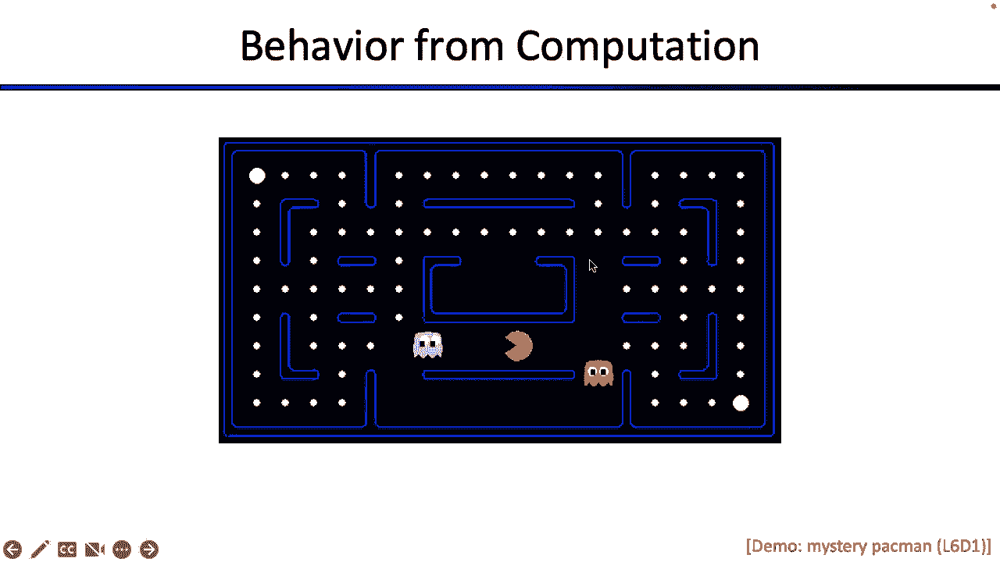
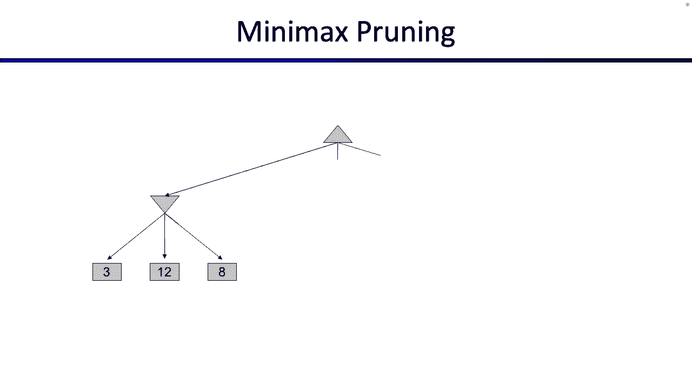

# P10：[CS188 SP23] Lecture 9 - Games_ Trees, Minimax, Pruning - 是阿布波多啊 - BV1cc411g7CM

好的，现在是五点十分，让我们做的事情，嗯，今天有一个项目或今天做，以防你不知道，但希望你知道我们都很好，好的，上次我们讨论完CSPS，如果你还记得CSPS开始的时候，我们说过接下来几周的比赛计划。

就是把我们见过的搜索算法，或者某种万物的广义搜索问题是可观察的，搜索问题没有随机性，只有一个玩家，以此类推，我们想慢慢地，开始放松一些限制，看看会出现什么不同的问题，嗯作为搜索。

或者当我们改变和放松搜索算法的参数时，也有人指出是的，作业下次要交了，星期一，因为我们发布有点晚，它也在较短的一边，所以希望没事，但谢谢你的提醒，好的，所以今天我们要放松搜索问题的另一个限制。

到目前为止，我们看到的所有搜索问题都只涉及一个玩家，所以今天我们要改变这一点，看看如果你用多个玩家搜索问题会发生什么，看看解决这些问题的算法是什么，我们如何推理这些，这就是本周的计划，好的。

所以也许你以前听说过这种算法，关于解决游戏，也许你听说过人工智能的进步，与解决或擅长某些游戏的重大发展联系在一起，所以我们可以做一个很简短的历史，跳棋是一种人们玩的游戏，显然曾经有一个世界冠军。

他是40多岁的冠军，几年什么的，看起来像在二十世纪五十年代，是他们第一次开发电脑来玩，但直到1994年一台电脑才真正把这个，就像跳棋世界冠军，最终跳棋变得如此发达。

我们的计算机非常擅长解决它们它们完全解决了跳棋游戏，这意味着他们意识到如果双方在跳棋中都玩得很完美，结果是我想说这是平局，我得再检查一下，但我相信这是平局，如果双方都打得很完美，所以他们真的发现了。

可以玩的完整的游戏是什么，如果双方都发挥最佳，我们今天要讲的，很明显跳棋是平局，所以这些都在这个箱子里解决了，我们在第一节课就讨论过这个，我们说这也是发生在90年代的事情，在那里深蓝击败了世界冠军。

今天国际象棋还没有完全解决，只是太大了，解决不了，但今天几乎所有的国际象棋项目都比特级大师做得更好，国际象棋的水平绝对很高就像专家水平一样，然后再去一个，我们之前说过的对吧，在哪儿往右，这个很有趣。

因为如果你看看我们最初的幻灯片，我们过去常说这有点像接近专家水平，但不完全是，但这实际上在2016年左右发生了变化，我们在第一节课上又谈到了，这位围棋世界冠军被谷歌的Alphago程序拿下了。

所以我们不得不提高专家水平，只是一点点现在去程序，或者我们会说接近国际象棋程序，对呀，但这不是你在这里的原因，因为你在这里是因为你想知道吃豆人的案子解决了没有，所以你必须在你的项目中找出。

所以请继续关注，好的，伟大，你以前见过这个，我们还不知道吃豆人是什么，但希望我们能发现，伟大的嗯。

你以前见过这个，吃豆人来了，对呀，但到目前为止，我们一直看到吃豆人解决，一个人走迷宫，我们这周所做的会有什么不同，现在我们要开始思考鬼魂和他们的行为是什么，所以现在，不仅仅是这样。

那个吃豆人需要一个人到处吃所有的点，就像我们在搜索中所做的那样，但是吃豆人必须到处吃所有的点，但也需要解释鬼魂的行为，鬼魂在外面想抓住吃豆人，所以我们要考虑的不仅仅是这个世界上的一个特工。

但是多个代理作用，我们会看看那是什么感觉，好的，所以有一张有趣的小照片是这样踱步鬼魂的，你将在项目二或项目三编码，我想一切都很顺利，伟大，都做完了，好的，让我们谈谈游戏，好的。

所以实际上有很多不同的种类，所以即使我们说所有这些都属于多人游戏，它就像一类算法，我们仍然可以谈论不同种类的游戏，我们将讨论其中的一些，其中一些我们没有时间，但是有很多不同类型的参数，你可以设置或旋钮。

你可以转动，所以你可以设置一个参数，就像，这个博弈是确定性的还是随机的，所以你知道这个游戏的规则，这样一切都被指定了，你知道当你采取行动时会发生什么，也可能是一个游戏，一旦你走了一步。

你实际上不知道会发生什么，有一些随机性或运气的因素，所以我不知道有没有人玩过backgadmin，我其实没有，但人们告诉我Backgman把掷骰子作为游戏的一部分，所以这将是一个案例。

你无法真正预测接下来会发生什么，因为你必须掷骰子作为游戏的一部分，对呀，你可以问游戏中有多少玩家，可能会有一个，这就是我们到目前为止一直在做的，可能有两个，这就是我们今天大部分时间要做的，可能不止两个。

我们将在周四看到一点，但你也可以想想有多少玩家，我想在你的项目中，会有两个以上的，因为你有鬼魂，我们可以问一下，你知道这个游戏的规则是什么吗？或者像谁那种，玩家在这个游戏中做什么，所以你可以问。

这是一个零和游戏吗，我们很快就会定义，但这个想法是球员们互相比赛，还是有机会让玩家合作，也许会变得更大，但担心一起工作，或者他们只是在互相对抗，所以你也得回答这个问题，对呀，其他问题就像。

你能知道这个游戏中发生的一切吗，或者这个游戏的某些部分是你无法完全观察到的，这里的经典例子是扑克，这是一个你不能观察整个状态的游戏，因为你不知道什么牌，其他人持有的，所以现在作为你算法的一部分。

通过扑克解决扑克或推理，你得想想，我不知道其他人拿着什么，所以我必须喜欢，你猜怎么着，或者我的行为必须改变，基于我不知道其他人在做什么的事实，他们不知道我在做什么，所以你可以改变游戏的参数。

所以我们今天从一组参数开始，然后如果你愿意，你可以和他们一起玩，很好，然后我们会讨论游戏的解决方案是什么，我想现在，好的，就像在搜索和CSPS中一样，我们可以把这个游戏的概念，给它一个数学定义。

希望你开始厌倦这些，但我想只有几个，所以就像以前一样，你可以玩任何你喜欢的游戏跳棋，国际象棋，你可以给它这个特定的配方，这个特殊的公式适用于确定性的博弈，所以不要掷骰子，然而，我们星期四再处理。

但假设博弈是确定性的，你所知道的一切，如果你采取行动，你知道会发生什么，可以这样定义，所以有一个状态空间，你见过那些，它是世界上所有构型的列表，有一份新球员的名单，你没见过，现在我们要告诉你有多少球员。

通常，我们假设他们轮流，如果你想假设他们同时行动，或者他们以某种奇怪的顺序轮流，你可以这样做，但今天我们假设他们只是一号玩家，二号玩家，三号玩家，四号玩家回到一号玩家，以此类推，这里有一个动作列表。

你以前也见过这个，也许是这样，不同的玩家有不同的动作可供选择，我们可以看到，有一个转换函数，这有点像后继函数，如果你斜视它，我们在这里用数学符号，但基本上是你所看到的后续功能。

它接受一个状态和一个动作作为输入和输出结果状态，所以如果你在第一个州，你采取了行动，这个转换函数告诉你你最终处于什么状态，所以你在终端测试之前就已经看到了，有点像目标测试，你以前也见过这个。

它会进入一种状态告诉你游戏是否正确结束，这是另一个你以前没见过的新东西，在搜索问题中，终端公用设施，因为现在不像搜索问题，你不只是在寻找一个解决方案，所以你不是在寻找一系列的行动，为了达到某种目标。

而是为了通过某种目标测试，现在更像是游戏结束的时候，问题不在于你是否达到了目标，更像是比赛结束时你得了多少分，所以现在不是说你知道你达到了目标很好，或者你没有达到目标，不是很好，一旦你达到目标。

你也得好好问问，当我到达球门，这个进球对我来说有多好，所以让我们看看这个函数，此函数处于，希望这是一个终端状态，就像游戏结束了，并可能接收一个播放器并输出R，这是一种奖励或效用。

就像一个数字告诉你你做得有多好，更高的数字是好的，较低的数字是不好的，所以希望你不仅想在最后的状态下结束，否则游戏就结束了，但你希望最终处于终端状态，对你来说价值、效用或回报很高的地方。

那就太好了因为这意味着你在比赛中做了一些好事，好的，所以这是两个区别，现在有多个玩家，而不是寻找一个目标状态或一个通过目标测试的状态，我们还是想去那里，但我们想到达那里，找到一个得分高的。

现在终于有了另一个不同，也就是，我们并不是真的在寻找一系列的行动来达到一个目标，这就是我们在搜索问题中所做的，但现在我们真的不能这么做，因为我们不是唯一的球员，那么我们如何知道其他人会做什么。

我们有点不对，因此，不是只得到一系列的动作，保证能让我达到目标，我们可以在搜索中做到这一点，因为我们完全控制了我们在做什么，我们是唯一表演的人，我们可以采取一系列行动希望我们能达到一个目标。

但现在情况并非如此，因为我们不是唯一采取行动的人，可能会有其他人轮流的情况，这不在我们的控制范围内，所以不仅仅是采取一系列行动，或者返回一组操作作为问题的解决方案，现在你在找一种叫做保单的东西。

我们也会在几周内一次又一次地看到这种情况，但政策不仅仅是实现目标的行动顺序，但它就像一张地图，它告诉你你可能处于的每一个状态，你现在应该采取的最好的行动是什么，因为你真的不知道你会处于什么状态。

也许其他球员让你处于某种你意想不到的状态，所以你需要为此做好准备，你的计划将是这个巨大的州名单，对于每个州，它告诉你最好的行动是什么，也许吃豆人喜欢，如果我在角落里，我应该走这边，如果我在这个角落。

我应该走这边，不管是什么，都需要有一个完整的行为状态查找表，那可能不是查找表，可能是您运行的一些代码，但你仍然在寻找状态到行动的映射，所以没有更多的动作序列，现在我们转向政策解决方案听起来不错。

关于搜索的数学定义的任何问题，关于零和博弈的快速说明，我们前面也提到过，所以和别人比赛意味着什么有几种概念，这里有两种一般的想法，所以你会看到一个很常见的游戏类型是零和游戏，这是一种严格竞争的游戏。

我们所说的严格竞争是什么意思，对一个球员有好处的一切，严格来说是糟糕的，对另一个玩家也同样糟糕，所以他们就像两极的对立面，对呀，不管一号选手做什么，这对一号玩家有利，对二号玩家同样不利。

不管二号玩家做什么，对2号玩家有利对1号玩家不利，所以只有一个人能赢，非此即彼，这有点直觉，直觉上我们要找的是什么，我们可以用数学来形式化它的方法是，如果你还记得之前，我们的数学定义说我们给状态打分。

尤其是目标状态，根据每个玩家的类型，所以我们取一个状态，取一个球员，然后输出一个分数，以及编码零和游戏的方式，就是，你可以说一号玩家的效用是二号玩家效用的负值，反之亦然，我想你可以这么说。

如果1号博弈者得了5分，在那个状态下2号玩家得负5分，或者如果1号博弈者在一个州得了负10分，然后2号玩家得10分，这是一种正式的方式，任何对一个球员有好处的事情，这对另一个球员不好，我们称之为零和。

因为如果你让他们两个像这样相反地工作，如果你把它们的实用程序加起来，你得零分，这就是零和的来源，但直觉上，这个想法是你看到这两个机器人就像为钻石而战，他们中只有一个能得到，那是纯粹竞争的想法。

不是蓝的赢就是红的赢，如果红色的快乐，这让蓝色的人很伤心，如果蓝色的快乐，它让红色的人悲伤，那是零和游戏，但这不是唯一的游戏类型，可能会有一些不一定为零和的一般博弈，所以这些可能是玩家可以合作的情况。

也许他们都能赢，也许他们都会输，也许他们会合作一点，然后在游戏的后期他们不得不停止合作，有各种各样不同的，你可以从这些中得到非常有趣的行为，可能会有一个玩家。

什么对一个玩家有好处对另一个玩家来说真的无关紧要，可能会有对双方都有好处的情况，所以他们都想这么做，他们必须组队，所以你可以得到各种各样不同的行为，我们今天还不打算在他们身上花太多时间，但它们不是零和。

因为实用程序加起来可能不为零，就像这是它的图片，所以你看这里你知道，蓝色机器人正在采摘所有的绿色钻石，然后红兔子挑出了所有的橙色钻石，这有点像嗯，蓝色机器人挑出绿色钻石并不会让红色机器人难过。

它对红色机器人一点影响都没有，红色机器人挑选它最喜欢的橙色钻石，对蓝色机器人一点影响都没有，因为蓝色机器人不在乎那些，所以这可能是一个你知道，他们不必互相竞争，他们可以一起工作。

也许他们不在乎对方在做什么，好的，但今天，主要是零和游戏，下一张幻灯片蓝色，好的，所以对于大多数对抗性搜索，如果你得到这张照片，你挺厉害的，就像，先别回家，但这张照片总结了我们今天要做的事情。

所以一开始看起来有点难，就像，你要如何预测对方在做什么，我不知道他们要做什么，无论他们做什么，我如何回应，这看起来有点复杂和组合，但事实证明，实际上有一个非常自然的树状结构，这看起来很像搜索。

希望我们对你来说有点眼熟，但我们思考的方式，我们会把它想象成，这是一个蓝色的机器人，轮到蓝色的机器人移动了，所以我们在考虑每个人轮流工作，蓝色机器人就像，我不知道红色机器人要做什么。

但我可以想象我可以在脑子里做一些计算，所以我要想象红色机器人在做什么，然后根据稀有机器人的所作所为，我要为自己制定一个计划或政策，红色机器人在想什么，红色机器人在想蓝色机器人在想什么，所以就像例外一样。

就像它们都互相嵌套在一起，对呀，所以这个蓝色机器人需要想象好，红色机器人认为我下一步要做什么，蓝色机器人下一步要做什么，这取决于红色机器人下一步要做什么，所以他们每个人都要思考对手在做什么。

他们的对手会考虑他们在做什么，看起来有点混乱，也许我们可以把它放在数字上对吧，但如果这种有意义，你可以把头缠在，轮到我对蓝色机器人采取行动的事实，我得想想我的对手在做什么，但我的对手也会考虑我在做什么。

我们必须互相计划，这就是我们将要做的事情的总结，在我们向您展示如何将其形式化为树之前，让我们只做一个代理，所以让我们一路回去搜索，给你看一些东西，希望看起来很熟悉，所以这是一个单一代理的世界，没有鬼。

只有帕克曼一个人，我们要考虑，我们如何建立没有吃豆人的搜索，希望再次看起来很熟悉，吃豆人来了，所以步行者队可以向左，或者吃豆人可以走右边，看起来很眼熟，一次又一次，吃豆人完全控制了这个世界，对呀。

其实男人可以，然后再向左或向右，向左或向右再向右，这可能是一个很好的时间停下来想想，这棵树到底是什么意思，这棵树到底意味着，帕克曼走了出去，左右摇摆，检查，发生什么事了？不太对，这都是吃豆人的想象。

想象力，我们提到过这个，当我们谈到搜索时，这就是吃豆人试图提前计划的所有事情，所以真的很喜欢，实际上只有一个吃豆人，他就坐在中间，就是这样，那是唯一的吃豆人，但当他坐在那里。

他在考虑这棵大树所有可能的未来，为了找出最好的行动是什么，但他实际上并没有正确地采取所有这些行动，重要的区别，好的，这是一个搜索树，我们要加上我们说过的一件事，我们要添加到游戏中，就是我们要加分。

因为不仅仅是达到一个目标状态，我们实际上想达到一个目标状态，或者在游戏结束时，并产生一个分数，我们希望比分对我们有好处，所以这个原因也延伸了更多，在这之后吃豆人可能会有更多的动作，但我们真的没有空间。

所以你只需要发挥你的想象力，想象这些树分支得更远，但号码是多少，好的号码，所以我们需要思考这些州的价值观是什么，对呀，所以当我们玩这个游戏的时候，如果我们到达某个地方，游戏到此结束，国家的价值是什么。

那个州有多好，或者我得到了什么分数，所以说，这可能是一个很好的时间提醒你所有，吃豆人的规则，就像我们不会在这个上测试你一样，但我们今天要谈谈这件事，如此有用的记忆，好的，当阿克曼迈出一步。

我们在分数上加减一，试图说服蝙蝠侠更快地完成游戏，所以没有，就像浪费时间，我们每次都要扣一分，你迈出的一步，如果你吃了一个点，你得十分，好的，遵守规则，好的，让我们试着得到一些东西。

所以看看最右边的状态，我会试着在上面画画，所以让我们看看最右边的状态，它在那里，这是一种目标状态，对吧，游戏结束了，看一下，没有更多的点，我们可以说游戏结束了，但我们必须给这个打分，吃豆人做得有多好。

我可以做得很好，我可以做得很差，这样我们就可以一次又一次地数数，不是超级有趣，这更像是吃豆人的规则，而不是任何与人工智能相关的规则，但是好吧，吃豆人走了两步才到那里，他吃了一个点，如此消极。

两个时间步数，为圆点伊顿浪费了十个，这就是为什么你在这里得到八个，所以这是他在一切结束后的最后得分，所以这不仅是一个目标状态，或者游戏结束的状态，有时我们称之为终结态，因为游戏结束了，没有什么可做的了。

但也有一个与之相关的数字，这告诉我们你可以到达那里，吃豆人得了8分，我不知道这也取决于其他一些州，对呀，也许有比八个更好的，也许有比八个更糟糕的，吃豆人肯定想要得分最高的那个对吧。

所以你可以想象这些树一直持续下去，就像巨大的好吧，对呀，有一种巨大的子树，在这些树下，在这些树下，还有所有这些不同的终端状态，游戏结束的地方，他们身上都有分数，他们中的一些人可能得分较低。

他们中的一些人可能会有更高的分数，但那是你的游戏树，对吧，事实上，我们可以概括这一点，所以这里有一些在行业深处的随机分数，对应于终态，但我们实际上可以概括这一点，终端状态不一定是唯一有数字的状态。

到目前为止在这张照片中，我刚在游戏结束的州旁边画了数字，我准备好给整场比赛打分了，但那不一定是我唯一可以分配数字的地方，我也可以给游戏还没结束的地方分配号码，所以我要这么做，这是一个非常具体的数学定义。

我们稍后会再看到，下面是我们如何给所有其他州分配数字，我们要说，处于某种状态的数字或值，是该状态可实现的最佳结果或效用，好的，那么这意味着什么呢，这意味着如果你从那个状态开始。

你做了你能做的最好的动作序列，你最终会实现，好的，这就是它说的权利，如果你喜欢数学，你可以在数学上看到，所以如果你处于终端状态，你能做的最好的事情是什么游戏结束了，没有什么可做的了。

你在终端状态下看到的任何数字，这就是那个状态的价值，这是你在那里得到的分数，那是最好的分数，那是你能得到的唯一分数，因为游戏结束了，如果游戏还没有结束，然后你需要考虑你能得到的最好分数是多少。

你这样做的方法是添加一个最大值，因为你在努力想最好的分数，你想要最大的，这样我们就可以开始计算并分配一堆数字，所以我不知道，让我们看看这个状态就在这里，好的，那么，什么是最好的可能实现的事情。

也许你喜欢扩展整个子树，你可以看到这里的终端状态是4和6，你就像，我在这里能做的最好的事情就是六大，你可以为这棵树再做一次，在2到6到6之间最好的事情，你能做的最好的事情就是。

希望你能在两到六点之间掌握要点，我能做的最好的事情是六在六到八之间，你能做的最好的事情是八个，最终你可以得到根的值，这就是你现在所处的位置，记得这一切都只是吃豆人在考虑他的未来，所以如果事实在这里结束。

他思考着自己的未来，他写下了所有这些数字，并用一堆最大值将它们传播回来，吃豆人可以意识到实际上，如果我从我现在的地方开始，我尽我所能，我应该得到八分，所以我一路解决了这棵树，还没有多个玩家。

这几乎就像常规搜索一样，我刚加了数字，问题，哦，是呀，问题，为什么开始状态与结束状态得分相同，这是个好问题，对呀，所以真的很诱人，尤其是这里所显示的将状态视为中间分数的方式，这不完全是我们正在谈论的。

这些值的数学定义，从这里开始，在剩下的时间里表现最佳，最好的分数是多少，我可以和，所以吃豆人的初始值是八的原因，不是因为他现在有八个，因为如果他从现在开始，并做出尽可能好的动作序列。

他可能想到的你应该预计最终会有八个，当他玩完游戏后，是啊，是啊，跟进，是啊，是啊，好的，是啊，是啊，所以问题就像，怎么这个是6，然后从数学上来说，之所以是六是因为我们把所有的数字都传播了。

但直觉上是一个很好的问题，凭直觉喜欢，这对六个人来说意味着什么，有几种方式来思考它，你可以想到，也许外面有另一个世界，吃豆人突然被扑通一声变成了这个姿势，就像他刚刚产卵一样，他就在那里。

他对此没有发言权，如果他喜欢，如果我就在这里，我能做的最好的事是什么，从这个状态开始，现在是六点，所以，如果我从这里开始，就像吃豆人的众神神奇地催生了我，变成这样的状态，我采取最佳的行动顺序。

我只能得到六个，你也可以想到，因为这是吃豆人提前思考，所以吃豆人可以提前考虑并说好，如果我这样做，我采取这个行动，我走到这里，那之后我能做的最好的，那是六个，所以也许我不想去这里，也许我真的想移到右边。

因为这会给我第八个，我希望有几种方式来思考它，对呀，但是是的，很好的一点，这些不是中间分数，如果我从这里开始，我尽我所能做一系列最好的行动，直到时间的尽头，或者直到游戏结束，得分多少？我希望最终。

这是一个很好的想法，关于这棵树你还想知道什么，在我们添加鬼魂之前，如果这棵树看起来不错，那么希望幽灵的那个看起来不会太复杂，所以我会让数字消失，好的，鬼，让我们看看当我们画有鬼魂的树时会发生什么，好的。

吃豆人来了，鬼魂来了，记住我们要说他们轮流，所以让吃豆人先走，这又是吃豆人的想法，当你看到这些树，记住我们不是真的出去一遍又一遍地玩这个游戏，这都是吃豆人的想象，他很努力地想该怎么办。

所以吃豆人提前考虑，他想我能做什么，我可以走左边，或者我可以走右边，这些是我可以结束的可能的地方，所以我的后继函数告诉我，我可以在这两种状态中的一种，太好了，吃豆人能继续前进吗，不是根据这个游戏。

根据这个游戏，轮到鬼魂行动了吗？所以现在我们必须假设这两个状态，你看它们是用红色镶边的，那是因为轮到鬼移动了，所以现在鬼魂可以选择，一次又一次，这都是吃豆人的想象，这不是鬼魂真的出去移动。

这是吃豆人的想象，当我向左，鬼能做什么，当我向右走，鬼能做什么，所以说，让我们把那些接班人，这些接班人都是鬼魂行动的结果，不是吃豆人在行动，这些接班人也是鬼魂再次行动的结果，这一切都在吃豆人的想象中。

但是吃豆人在想象鬼魂可以向左走，或者鬼魂会走对路，2。现在该轮到谁了？现在又轮到吃豆人了，所以吃豆人想象一些自我移动的权利，然后在吃豆人想象鬼魂在移动，这些树也一直向下延伸直到游戏结束。

所以要么吃豆人被鬼吞没，因为吃豆人吃掉了所有的点，一旦发生这种情况，我们分配一个分数，大概是吃豆人被鬼吃掉的时候得分很低，当吃豆人幸存下来并清除木板时，非常高的分数，我们看到了最好的分数。

所以这棵树和之前的树一样，但不仅仅是让吃豆人完全控制，让吃豆人决定每一个阶段的动作，吃豆人和鬼魂需要轮流，而这一切都还在吃豆人的想象中，我们不像走到鬼跟前，然后说嘿，你打算怎么做。

这都是吃豆人对鬼魂会做什么的想象，所以我们要建一棵大指数树，告诉我们在这个游戏中可能发生的事情的可能性，一旦你一直到底部，你看到所有这些数字告诉我们，如果我们处于游戏结束的状态，然后给它分配一些分数。

好的，那很好，是啊，是啊，好，是啊，是啊，所以关于像这样的问题，鬼会选择什么样的行动，我们还不知道，我们现在只是想提前计划，所以也许坚持这个问题，我们将看看我们如何知道鬼魂要做什么。

但现在我们只是在想象好吧，问题，好的，是啊，是啊，你把我们带到了那里，就像，好的，喜欢在官方，呃，熊猫，纳木错，吃豆人，就像鬼魂一样，其实不要轮流对，所以你是对的，这实际上让计划变得更加困难。

这就是为什么我们不这么做，所以至少在我们版本的吃豆人中，我们假设他们轮流，嗯，我会让它消失，好的，所以至少在我们的版本中，我们假设它们轮流，你说的对，在现实生活中，他们不会轮流，但这让计划变得困难得多。

所以我们假装他们轮流，好的，是呀，你把我们弄到那里了，好的很好，所以就像以前一样，我可以把这些州的数字，对，就像以前一样，官方对数字的定义是一些玩家可以达到的最大价值，对呀，我的下一张幻灯片在哪里。

好的，我们可以把数字放在上面，所以这里又有一个愚蠢的版本，我们没有空间画整场比赛，因为即使是这种小游戏也要花很长时间，所以让我们假装，这有点傻，对吧，但让我们假装我们在玩游戏，吃豆人行动的地方。

然后鬼就动了一下，然后游戏就结束了，就像吃豆人的众神降临在你身上，不再说话，游戏结束了，即使它不看过去，我给你打分，取决于你做得有多好，这有点傻，但这是我们的假设，所以这是一个两步游戏。

我们能够在这些终端状态上加上数字的原因是，因为我们假设这个游戏一分为二，在现实中应该有更多的动作，但那不适合滑梯，所以让我们假装游戏在两点结束，所以你就像，哦，1。你从哪儿弄到这些数字的。

它们来自我们的奖励函数或效用函数，好吧，如果我倒带所有的方式回来，我们刚才说的，你从哪里回来的，在那里我们谈到了游戏的数学定义，在你的定义中，你有一件事，你得到的这些算法的天赋是一个终端效用函数。

它说一旦你达到一个状态，那是一种终结状态，你得到了什么奖励这个函数是我们从哪里得到这些数字的，所以这有点像，吃豆人的神降临并告诉我们其中一些州，你知道的，上面有这些数字，游戏结束了，这有点傻。

但为我们的目的工作，好的很好，现在，我们该怎么办，我们可以开始给其他状态加值了，所以现在我们可以重新开始思考，一个国家的价值是这个国家权利所能达到的最好结果，但现在我们必须更具体一点，我们不得不说。

对谁来说，最好的结果是，因为不同的人有不同的效用，所以至少现在，我们要说，对吃豆人来说，这是最好的结果，因为吃豆人是做计划的人，记住这棵树，这些都是假设的未来，我们想成为吃豆人，我们正试图决定搬家。

所以这里回来了，那么现在他就会决定搬家，所以我们要考虑，对吃豆人来说，最好的结果是什么，这就是我们要尝试和决定，好的，所以让我们通过并开始写状态，或者开始写数字和状态，让我们从这里列出的开始，好的很好。

所以在这种状态下，在负8和负5之间有一个选择，但这是与单人游戏不同的地方，吃豆人，所以在单人游戏中，没有幽灵吃豆人，吃豆人控制了每一个动作，所以他总是可以选择使他的效用最大化的动作，但是看这个节点。

这个节点的下一个是谁，不是吃豆人，对呀，轮到鬼魂了，记住我们说过的，如果这些是零和游戏，对吃豆人不好的东西对鬼都好，所以如果这就是鬼，鬼魂直接与吃豆人对抗，就像他们的敌人一样。

吃豆人喜欢的鬼不喜欢的一切，反之亦然，山羊要去干什么，鬼魂会选择向左得到负8，或者往右拿负五，右边一对左右，鬼是对抗性的，它想做对吃豆人不好的事，因为对吃豆人不好的就是对鬼好的。

所以这实际上是一个鬼魂想去负8的情况，所以如果吃豆人因为任何原因而陷入这种状态，所以又像，假设吃豆人开始游戏，突然他就变成这样了，现在轮到鬼魂移动得很好，这不是吃豆人的选择，他可以去哪里，是鬼的选择。

鬼魂会选择移动到负8结束游戏，就在那里，另一个州也是如此，有一个负十，有一个加八，因为鬼转，鬼就会选择负十，因为负十对吃豆人来说更糟，任何对吃豆人来说更糟的事情对鬼魂来说都是好的，所以在这两个州。

因为他们在鬼魂的控制下，我们实际上选择了对吃豆人不利的东西，因为幽灵的效用和吃豆人是相反的，好的，然后就只剩下一个号码要填了，一个在上面一个在上面，这是在吃豆人的控制下，所以如果这是在吃豆人的控制下。

他会选择给他们最高价值的价值或行动，所以你可以选择向左，我们知道如果你向左走，你最终会在这里，如果你因为任何原因来到这里比如采取这种行动，你知道你能做的最好的是负8，或者吃豆人可以选择向右移动。

从我们之前的计算中我们已经知道，如果你扑通一声落在这里，从PA的角度来看，你能做的最好的是负10，所以我要选择去哪里，如果他想最大化他的效用，他为什么要往左走到负8，右为负十，以上都不是举手，我们没事。

我不知道，呃，所以它可能会去负8，对呀，因为那高于负10，Pacman想最大化他的根词，这就是如何填充这棵树的值，注意到这有点不同，因为实际上有多个玩家，取决于你是哪个玩家，你选择的动作是不同的。

你总是最大化自己的效用，但碰巧幽灵实用程序与吃豆人相反，所以幽灵会选择对吃豆人效用较低的东西，对呀，好的很好，这就产生了一种叫做极大极小的算法，注意到我们真正做的只是，取一堆m和max来得到值。

所以总而言之，我们做什么是对的，终端状态的值，这些是游戏结束的州，我们假设游戏在这里只限于一个术语，那么我们就会说那些已知的状态，有人已经给了我们关于终端状态有多好的数字，所以这些分数交给了我们。

我们自己没有算好，如果你处于一种状态，轮到对手去那个状态的价值了，换句话说，从那个状态能发生的最好的事情是什么，什么是最好的回报，如果我做的最好的事情是它所有继承国的最低限度，我们正在采取最低限度。

因为我们假设我们的对手想要对我们更糟糕的东西，然后如果有一个州在你的控制之下，然后你要取最大值，因为这在你的控制之下，你想采取最大限度地发挥自己效用的行动，所以这就产生了极大极小算法，是啊，是啊，局势。

但如果你愿意，好的，所以是的，有一个关于井的问题，如果吃豆人像这种即将到来的厄运会发生什么，就像吃豆人一样试着像俯冲炸弹一样，鬼魂结束游戏，我们将在几张幻灯片中看到这一点，所以坚持住那个想法，但是是的。

这些游戏可以产生有趣的行为，你很快就会看到，好的，但现在我们只想看看，这是吃豆人在想象会发生什么，尤其是吃豆人的假设，他必须在这里做出假设，也就是台湾不知道鬼魂要做什么，但吃豆人至少可以假设一些事情。

他会假设对手会做，什么对他更糟，因为如果鬼魂试图最大化他自己的效用，幽灵效用是吃豆人效用的对立面，对鬼好的东西对吃豆人不好，所以这就像是零和游戏中的一个假设，对呀，我们假设鬼魂在最大化他的效用。

任何最大化幽灵效用的东西都对吃豆人不利，好的很好，所有的权利，好的，所以这是一个愚蠢的玩具游戏，我们不得不武断地结束，因为滑梯不适合，所以像滑梯一样，演示文稿之神下来了，两下后就说不要再动了。

但外面还有更大的游戏，所以这里有一个非常复杂棘手的游戏，甚至不适合，滑梯是井字游戏，有人玩过这东西吗？这不是手，好的，有趣的嗯，希望你能玩好井字游戏，但这也是一个有两个玩家的游戏，你也可以为它建一棵树。

所以让我们说蓝色，我想是X和蓝色先走，所以现在这里是蓝色的，这是唯一的当前状态，从现在开始的一切都在布鲁的想象中，所以布鲁只是想提前想想，呃，蓝色能赢得这场比赛，但现在黑板是空白的。

现在我们可以想象未来会发生什么，所以蓝色可以想象所有这些未来，X进去的地方，我猜九个可能的空格中的任何一个，下一个轮到谁？轮到对手红石了，那么对于这些节点中的每一个，红色在哪里是正确的，要把O弄好。

然后对于这些州中的一个，它的下一个轮到布鲁斯轮到，所以我们可以想象第二个X的蓝图，以此类推，等等，你会得到这样的九深度层树，然后一旦你到了底部，你可以开始给这些状态打分。

所以任何时候你到了游戏结束的状态，如果你还记得你的井字游戏规则，游戏结束了，当有一排三个或三个连续的X时，所以如果你深入到像这样的地方，所以你的蓝色，你的前任，如果你在这里的某个地方。

就像有三个X在一排，那你就想这样，让我们给你一个额外的权利，或者如果你去了这样的州，有三个O的地方，那你就输了，所以我们给你负一分，如果有一个州董事会被填满了，没有人连续得三分，那你就得零分。

这样您就可以对实用程序状态进行评分，然后把树搭起来，您可以将这些值一直向上传播，任何时候轮到红人，你的对手，你花一分钟，任何时候轮到蓝色的人，你拿最大值，你可以想象发生了什么。

最终你可以想象一条穿过这棵树的小路，就像你的一系列行动和你预测的行动，对方要做什么，如果他们玩得最好，你就能知道井字游戏的最终结果是什么，有人知道井字游戏的最终结果是什么吗，你能强迫胜利吗，是啊，是啊。

你有问题吗，他有一个平局，所以如果你真的经历了，然后呃，把这个烤出来，有一场平局，所以如果你知道你在做什么，你可以强迫平局，好的，我想我在这里要指出的最后一件事，所有这些节点上都有值，对呀。

你知道在考M和Max之间，您可以在这些节点上加一个值，所以你可以选择一个节点，你可以说这个节点有一个与之相关联的数字，数字是我能做的最好的事情，从这里开始，对呀，在那个节点上可能有什么数字。

我能得到一个号码吗，这就像点五，这里的价值，2。这个数字是小数点五还是不是，也许也许不是，也许可能不是，是啊，是啊，似乎如果你只是拿最小值和最大值，任何地方包括根在内的唯一可能的数字都是负数。

一个零和一个，这些是我们分配给终端的唯一值，如果我们只取最大值和最小值，你只会得到正确的数字，所以最终你会在顶部得到一个数字，我们将得到零，因为我们认为井字游戏是平局，但具体与数字零相关联。

就像有一系列动作的支持，穿过整棵树，告诉你零是从哪里来的，对吧，零必须来自某种终端状态，它就像冒泡一样，你采取的一系列行动，你的对手把它带到了零，所以数字零不仅像，也许，知道井字游戏是零并不是很有趣。

知道井字游戏是零更有趣，下面是你使用的动作序列，力为零，如果你和你的对手都打得很好，关于你如何计算这些数字的问题，如果你够不着树叶，现在这是个好问题，假设我们到了那里，当我们造更大的树时，你是对的。

那么有时到达树叶会很难，伟大的，所以谈论国家的价值观，状态的值总是叶子中的某个数字，那种感觉又回来了，所以无论你把它分配给哪个节点，这有点像，得到了一系列行动的支持，这些行动实际上导致了这个数字。

如果你在顶部得到一个零，零不是从任何地方来的，它实际上来自其中一片叶子，你可以一直追溯到零的来源，这也是你如何计算的，就像画井字游戏的策略，极好的好，好的，所以又来了，嗯，对又来了，这些是确定性的游戏。

所以没有随机性，然而，这些都是零和，所以一个玩家所做的任何事情都是严格有害的，其他的例子就像井字游戏，这是竞争，你们不能一起玩井字游戏，据我所知，呃，国际象棋是一种零和游戏，据我所知，你们不能一起下棋。

任何对白色有好处的东西，对黑色不好，反之亦然，跳棋也一样，对呀，通常我们谈论这些的方式是，一名球员使得分最大化，另一个玩家把分数降到最低，相当于，也可以说，一个球员的得分是另一个人得分的负数。

所以一个人试图最大化分数，另一个人试图最大化这个分数的负面影响，这是一种最小化原来的正方形，那么你怎么做到这一点，你把这些树画对了，在这些树上，我们可以假设它们轮流，如果你不想假设他们轮流，你不必。

你可以用不同的方式画树，但今天我们假设他们轮流，当他们轮流，你建造这棵树，当你建造树的时候，您可以为每个状态写出值，这些值告诉您，从那个状态可以达到的最大目标或效用是什么，对呀。

这也是人们开始喜欢的地方，翻白眼，他们就像在等待，我知道怎么做，就像一个五岁的孩子可以做得很好，就像，如果我让你把这棵树最小化，希望你能做到，希望你能找到你最年轻的朋友，他们也能做到，对呀，如果你看到。

只是为了画画的目的，当它是最小转弯时，我们画红色三角形，我们画向上的蓝色三角形，当它是一个最大化转弯，所以希望这对你来说很简单，对呀，如果你想做最小化，那么如果是最小化转弯，你找到最低的数字。

伟大的二和五的最大化，你选择最高的数字，对呀，就像任何人都能做对一样，像这样不是超级有趣，有趣的是，你知道今天值得在这里的是这些数字实际上意味着什么，所以不要出去，永远像画这些树一样，你说这太无聊了。

它有点，但有趣的是这些数字代表了什么，所以当你看到这个，记住发生的事情就像你在这里，你是最大化的玩家，所有这些都在你的想象中，你在想象有两种可能的行动，如果我采取这个行动，我最终处于这种状态。

在这里能发生在我身上最好的事情是什么，是两个，这是最小化的转折，最小的会保证我有两个，或者如果我去这里，最小量保证我得五分，所以我最多只能在2点到5点之间，我想要五个正确的。

所以数字本身并不是超级有趣的，但你想知道它们是什么意思，我想我最后要说的是，当你看到这些，有时候很诱人，但有一个八就在那里，我真的想要八个，但在一个事物为零和的世界里，两个玩家都按照这个策略玩。

不会发生的对吧，你可以试着去这里，哦，我希望我能得到八个，但是如果你知道你的对手会在这里最小化你的效用，并最大限度地发挥自身的效用，你知道你注定要得到这两个，所以你可以看到八就像超级诱人，你想要吗。

但是根据分钟最大值的规则，援助没有发生，对呀，快速绕道，只是为了用代码给你看，我猜你计算这些终端值，好的，伟大，所以如果你想在代码中看到它，只是为了你的项目目的，这是对的，嗯，有两种功能。

我将带你经历最大和最小，所以又喜欢了，试着一秒钟都不要睡着，因为这对以后很重要，对呀，但是有几种方法可以实现max，我们将以一种非常具体的方式来实现它，这个以后会派上用场的。

所以我们要实现Max的方法是，到目前为止，我们将有一个运行的最佳价值，如果你到目前为止还没有在你的max函数中看到任何东西，最好的是负无穷大，因为你没见过那样的东西，你看到的任何东西。

无论你看到的第一件事是什么，都会比负无穷大更好，到目前为止，你会把它设置成你最好的，当你继续前进，你得一个一个地检查，任何时候你看到更好的东西，你会把它发送到v，然后你返回到目前为止最好的东西，对吗。

希望不是世界上最复杂的最大，但一定要这样做，因为这会让修剪变得更容易一点，我们即将看到，然后它与这一权利完全相反，所以当你在最小节点时，你穿过所有的孩子，你从正无穷大开始，任何时候你看到更小的东西。

你把它发送到v，所以v在右边越来越低，这里的关键是你是否在max函数中，V从尽可能低的值开始，负无穷大，开始慢慢增加，直到找到真正的最大值，然后它不再增加，最小函数从正无穷大开始，然后v开始向下，向下。

向下，直到它不能再下去，因为它被称为最小值，然后它返回需要注意的重要事项，尽管看起来超级傻，这里有一个案例，他们就像，相互调用以实现相互递归，如果这在你的项目中有点烦人，你可以去，因为你有一个分派函数。

在那里你有一个值函数，它交替调用max和min，所以这将是一个值调用max的情况，然后调用value并调用min，然后调用value并调用max，然后调用value并调用min，所以你有一个递归的实现。

对吧，这个递归实现构建了树，所以再一次，代码不是超级有趣，您可以将其用于您的项目，如果你喜欢重要的东西，以下是计算最大值的方法，特别是一次检查一个节点，最大值的最佳值从负无穷大开始慢慢上升。

你对min的最佳值开始是正无穷大，然后慢慢下降，好的例子，所以这里有另一个案例，它就像，这是真的，就像你可以在街上找到一些婴儿，我相信他们能解决这些问题，但你要想想在计算机中解决这些问题是什么样子的。

尤其是如果这些树长得指数级大指数级深，你到底如何有效地解决这些问题，这是计算机会看到的，这就是这些有趣的地方，你就在这里，你是最大化节点，作为计算机，你看不到整棵树，就像电脑里没有像树一样的图片。

所以计算机必须构建这棵树，通过向右展开递归，所以树会调用max，我要打电话给闵，就像我们之前看到的对吧，迷你车会叫麦克斯，递归会深入，这几乎有点像深度优先搜索，所以如果你看到这个思考深度首先搜索。

也许我们叫麦克斯，我们叫男人，我们最终到达一个终端状态，我们可以退货，所以我们看到三个，好的，可以走了，我们还没完呢，所以我们又看到了一个，我们看到十二个，然后我们去下一个，我们看到八个。

只有在这一点上，当我看到所有的孩子，我可以去这个最小化节点吗，说最好的是三个，对呀，实际上我再做一次，但当我这么做的时候，我会跟踪V，就像我能得到的最佳值一样，所以在这一点上，这是一个最小化节点。

所以它从正无穷大开始，对最小化者来说最糟糕的事情，它看到三比正无穷大好，所以这一切都消失了，就变成了三个，十二不少于三，所以它保持在三个，八不少于三，所以它保持在三个，好的，这就是计算机的看法。

因为计算机不能一次看到所有的数字，然后我们又进入了下一个，这是一种深度优先搜索，从左往右扫，所以我们看到两个，所以这是在看到任何具有另一个无穷大的东西之前开始的，都是这两个，就像嗯，二比无穷大好。

所以让我们带着两个CS出发，四个不比两个好，六个不比两个好，好的很好，然后它又看到这个从无穷大开始，它看到了什么，十四岁了，好的，所以无穷大被十四取代，希望你在这里得到了要点，5比14少。

所以我们用五个来解决这个问题，有两个，所以我们把5换成2，我们又得到了节点的值，好像有点傻，我向你保证这个会派上用场的，当事情变得棘手太好了，最后你得到这三个数字，你可以把它们弹回顶部，对呀。

所以在顶部你有v=负无穷大，最糟糕的事情，然后我首先看到的是三个，所以我不得不三个，那就都是这两个，它不会用两个取代三个，因为它不是更好，然后是另外两个，不会比三个好，所以它不会取代，最后返回三个。

又好了，似乎有点乏味，我向你保证它会派上用场的，好的，在我谈论改进搜索之前的最后一件事，嗯，之前有人提到过，挺好的很好，所以你告诉我一些关于，最优性um，对呀。

所以特别是所有这些极大极小都是基于一个假设，对呀，因为我们做了这一切，当我们画这些树时，我们假设了对手的一些东西，我们写下了数字，我们总是假设当轮到对手时，就像这里。

对手总是会选择使自己的效用最大化的东西，然后在零和游戏中最小化我们的效用，但我们总是假设对手会做正确的事情，并且总是为我们选择效用最低的节点，这对他们来说是最高的效用，所以我们把这个假设做对了。

用另一种方法，如果你想到博弈论，如果你喜欢这样想，这种假设的另一种说法是，你的对手正在发挥最佳水平，所以你在提前计划做出最好的举动，但你的对手也是，所以如果这棵树更深，那么你的对手就像在想你一样。

你会做什么，对手正在根据你的所作所为做出最佳动作，好的，所以双方都在考虑最好的事情，我马上回答问题，对，但这是这样的，就像你在和这个对手比赛，你在努力思考你在做什么，它真的在考虑所有的可能性。

它在玩我能想到的最好的动作，给定它的所有计算，对呀，但如果你不玩这个呢，像超级强悍的对手，比如如果你把这家伙演对了呢，似乎并不可怕，所以也许你在玩你的对手喜欢的案子，可能会犯错误，我不知道对吧。

如果你的对手犯了错误，那么也许计算开始看起来不那么明显，所以这里又是一个极大极小树，写数字超级容易，但有趣的是，是什么让你真正聪明，不是数字，但它们的意思是，对呀，但你可以开始填写数字，你开始填写数字。

好吧，这些数字代表了某些节点上最好的东西，好吧，但看看这个，所以这告诉我，如果我在最大节点，我打包好了，伙计，轮到我搬家了，我最多只能给你十个，这将包括沿着这条路走下去，当我走到这里。

我的对手要给我十个，无论他们选择什么，好的，合理，但如果我走这条路怎么办，如果我按照极大极小沿着这条路径走，如果我假设我在玩这个，你知道的，就像威震天机器人，真的知道自己在做什么。

那么这个机器人会给我打9分，永远不会给我这一百块，对呀，呃，除非你能给我一百块，所以也许如果我扮演这个小家伙，可能他搞错了，也许这个小家伙犯了个错误给了我一百块，我不知道对吧，所以你必须开始考虑。

我想我会再把数字拍下来，好吧，也许只是也许值得沿着这条九的道路走下去，万一这个小机器人搞砸了给我一百块，也可能不值得，因为我真的认为我的对手是一个非常复杂的机器人，所以就像我不知道对吧，喜欢吗。

这一个是它这一个，我真的不知道，我得考虑一下，这是我们下次要讲的，所以我们讨论的是效用，以及如何在这种情况下推理，不是特别明显的地方，但今天我们会假设我们的机器人在做正确的事情。

或者我们的对手总是在做最好的事情，好了现在你可以问我问题了，问题只是延伸，好的，是啊，是啊，伟大，就像你们一样，当然有些事情，是啊，是啊，抓到你了，所以有一个关于目标状态和查看节点的问题，所以请记住。

与搜索中的搜索不同，一旦你找到一个目标状态，你完蛋了，你宣布胜利，在这种情况下你回家不是那样的，当你看到像三个这样的终端状态时，你马上说三就回家，你得一直往右看，所以这有点像搜索的深度。

但我想说它实际上更接近，像彻底的深度优先搜索，因为除非你检查整棵树，至少到目前为止用我们的算法，除非你检查整棵树，你只是不知道你是否得到了最好的分数，为了真正弄清楚顶部的值是多少。

你必须经历每一个可能的终端状态，向上传播值，然后看看值是多少，所以说，这不太像搜索，在那里你看到三个，你就像，三是游戏的结束，我们回家吧，你想看看所有可能的其他状态是对的，好的很好，然后既然我在这里。

我不妨注意到，当我们这里有三个，正如你所记得的，这个数字3本身并不是很有趣，有趣的是，这三个动作是由一系列动作支持的，所以你的解决方案不仅说你可以得到三个，有点傻，如果你在下棋，你问国际象棋引擎。

国际象棋引擎，我下一步该做什么，国际象棋引擎说三个好，它不是一个很好的国际象棋引擎，国际象棋引擎应该说你能做的最好的是三个，你是这样做的，你先过来，然后你假设对手走到这里，这就是三个人的来源。

所以这三个实际上是由一系列的行动支持的，这也很重要，所以希望在你的项目中，当我们问，就像吃豆人，吃豆人该怎么办不要只说三个，很无趣的回答，你应该说吃豆人真的应该采取这个行动，那鬼魂就会这么做。

这就是这三个词的来源，所以它是由一个处于终端状态的数字支持的，好的，伟大，很高兴我在那里的时候把这件事解决了，好的，好的，关于标准极大极小的最后一件事，所以就像我们说的，这有点像深度优先搜索。

因为你要先去最深的地方，但它是详尽的，并不是说你只看到一个解决方案就回家了，你必须检查所有的终端状态，以确定什么是最佳值，把它们都传回，只有到那时你才看到它，所以这实际上是指数级的。

就在这棵树变大的时候，你必须探索整件事，随着他们的动作越来越多每个人都能接受连胜变得越来越深，分支因素可能真的很大，比如考虑国际象棋对吧，所以即使是国际象棋，我认为这不是，这是一场艰苦的比赛。

但这是最难的游戏吗，我不知道，也许不对，但是嗯，即使是像国际象棋这样的游戏，就像，也许是有限的可能性，对呀，只能有这么多方块什么的，就时间而言，你还在看一些东西，三十五到一百是多少，我的天啊。

就像宇宙中的原子一样，对呀，所以你永远不会计算，很可能我们永远不会完全解决国际象棋，至少用这个算法不行，所以我们得做得更好一点，所以让我们在接下来的两六分钟里思考如何，我们做得更好一点，好的。

然后我们就放你走好吗，所以就像其他事情一样，指数算法，我们必须有资源限制，我们必须考虑如何管理我们的资源，我们怎样才能做得更好，所以让我们从一个非常有用的小技巧开始，这很好，也许我们不必检查这整棵树。

也许树的某些部分我们可以向自己推理，没有更多的解决方案，我们可以不再看树的那一部分，这可以为我们节省大量的检查子树，也许我们的计算集中在我们关心的地方，所以让我们来看看我们是否能喜欢。

剪掉树的一些我们知道没用的部分，好的，回到我们最喜欢的最小化示例，对呀，所以让我们一遍又一遍地检查，把你当成电脑，所以你没有整棵树的照片，您正在运行这个递归算法，这个递归算法是给你数字的。

当您向下调用堆栈时，所以就像我之前所说的，我叫这个，我得到三个，就像以前一样，对呀，我有v等于无穷大，好的很好，然后变成了三个，你以前见过这个，好的，十二个不是更好，八个不是更好，所以你得到三个，好了。

现在，停在这一点上，我们知道这个v是三，但实际上还有一件事你可以在这一点上得出结论，你还能得出什么结论，看一下这个节点，关于这个节点的值，你有什么要说的吗，就像，这个节点的值可以是，让我们说。

两个我不知道，会不会是两个，你觉得停止想它就像十秒钟，当我确保我的答案是正确的，所以我们知道这个最小值已经产生了3的值，这个最大化器会有2的值吗，好像不是，为什么，为什么这个最大化器永远不会有2的值。

因为它总是可以选择走这条路，即使在最坏的情况下，已经有一条通往三个的路了，这就像备份，我们已经找到了，所以说，绝对不可能，这个最大化节点将有两个有趣的值，我们应该注意到这一点，我们应该利用这一点。

所以不知何故，我们能够推断这里的这个节点不可能太，还有其他事情不可能是对的，它也不可能是一个完全相同的原因，我们刚才说，因为如果最大化器不知何故有一个作为它的最佳效用，那么这与它可能在这里的事实相矛盾。

得到了三个，好的，所以它可以得到两个可以得到一个，我们如何概括这个，这里一定有某种情况，右可能和三个有关对，通过什么，至少它会动，这是什么，我想它必须大于或等于三，对吧，希望你能明白这是从哪里来的。

因为我们知道我们至少可以得到三个，也许将来会有更好的东西，但即使从现在开始一切都像厄运和黑暗，它的数量很少，我知道我至少可以回来拿我的三个，所以我了解了一些关于这个顶部节点的东西，我应该记住这一点。

因为我想用它，好的很好，所以我了解到一些信息，让我们继续前进，但让我们记住这一点，好了，现在在下一个节点上，我们什么都不知道，所以说，让我们开始寻找，好的，就像以前一样，我们可以开始对事情进行推理。

所以这曾经是v等于，无限的权利，现在很好，我也会写V等于，我写的时候会更具体一点，而不是在这里写V等于2，我要写小于等于2，因为这正是我所做的，还记得我们是怎么花时间谈论中间的吗，你就像无聊得发疯一样。

我们说你做的方式，你要从无穷大开始，最大数和v值就像慢慢下降，当你发现越来越好的更低的值，所以这就是我们在这里做的，这个v从无穷大开始，然后我们发现了一个二，在这一点上，它只能低于两个。

随着我们考虑更多，我们就是这样做的，男式，它不能超过两个，因为我们已经找到了一个二，所以现在这很有趣，我们知道这个值，我们还不知道它到底是什么，但我们知道是两个，好的很好，所以现在再来一次。

让我们调查一下我们在哪里，因为我们得到了一些信息，我想用它，好的，这里的这个节点，我确信它小于或等于2，我不知道它到底是什么，然而，未来可能会隐藏着其他东西，但我知道它不可能大于两个。

因为这个值只会下降，这是min说的，我看这里的最大值，我知道这个值从3开始，这是一个max节点，所以它只能往上走，好的，如果这个值从3开始，并且只能上升，这里的值是2，只能下降，有没有一种情况下这将是。

会不会有Mac选择，Max选择要采取的此箭头，好像不对，因为如果Mac选择这个箭头，那么它将得到小于2的东西，如果马克斯选择这个箭头得到小于2的结果，那它就真的不应该选这个箭头。

它应该带着这支箭去收集这三个，所以我们在这个矛盾中发现了，对呀，这个最大值从三个不断上升，这个最小值从2下降，最终他们跨越到了一个点，我知道这里的这个节点永远不会是解决方案。

它永远不会是给我最优值的路径，因为没有办法，最佳值小于2，我的最佳值必须至少是三，那是很多词和不同的方式来表达同样的事情，但如果你自己尝试试着想想界限是什么，这就是我们在这里要做的，聪明点，对吧，好的。

如此伟大，在这一点上我们可以开始剪掉树的一部分，因为想想这个节点下面是什么，我不知道这个节点下面是什么，对呀，我还没看呢，但看看它，就像这个节点下面可能有什么，有关系吗，想想这里会有什么。

所以这些修剪问题的另一种思考方式是，想想这里会有什么，嗯，我不知道，我们试试八号吧，好的，如果这是八个，那么这个值仍然是2，我们还是不能把这个树枝挑对，好的，可能还有其他号码，所以也许不是八点。

可能是负一千，好吧好吧，如果这是负一千，那么这个v就变成负一千，没关系，我还是不会摘这根树枝，我还是会选择三个，好吧，你可以尝试不同的值，对吧，也许不是负一千，也许是正一千，好吧，V仍然是两个。

我还是不会去这里，所以真的看起来有点，不管下面藏着什么价值，我真的不需要检查它的权利，因为它不会影响我整体计算的结果，所以我们可以从这里开始砍掉树的一部分，是的，尤其是这将是超级有用的。

如果这不是终点站，想象一下如果这是一个最大值，它有一堆分钟，它有一堆麦克斯，这可能是一个巨大的指数指数子树，我可以完全忽略它，因为我知道我再也不会走这条路了，那就超级有用了，对呀，呃，走开，指数子树。

好的，所以这就是修剪权利背后的想法，我们会试着通过节点来理解理性，当我们试着弄清楚，哪些节点是我们实际上不必探索的，因为这些节点上的值不影响结果，我的总体计算这就是有趣的地方，对呀，好的。

我认为这张幻灯片太早了，因为他们实际上会向你展示探索节点，我检查了一下，结果是四个，但这并不重要，对呀，我没必要检查它，这四个可能是一千个，可能是负一千，我不在乎，这并不影响我的回答，和六个一样。

所以我不必检查这些正确的列表四，我没必要检查六个，我没必要检查，好的，伟大，我现在继续前进，你可以通过这个来推理，对于其他像这样的，嗯，我从V小于或等于无穷大开始，我看到的最糟糕的事情。

所以我说v小于等于14，现在你开始变得很高兴，你就像，哦，我可以停下来，我不想再找了，但你要小心，因为如果这不到14岁，你就像，我不知道我是否应该检查这里的下一个框，因为我不知道下面藏着什么。

我已经到了，就像这个最小化节点变得如此不受欢迎，麦克斯永远不会选择它，我们关心的是最大值，那就是我们，这张纸条是否已经到了我们永远不会选择它的地步，或者它不再在那里了吗，它说它必须小于或等于14。

但它仍然在游戏中，对呀，想象一下如果这里的这个节点，这个谜团，你知道我们不知道如果这最终是，我不认识十三，如果这个神秘的节点最终是另一个13，嗯，那么这个总值就是十三，我真的会选择去这里。

所以我真的不能停止在这里寻找，因为这里的值可能会改变我的答案并为我选择正确的分支，但也可能有价值观迫使我不要，选择这个分支，对呀，好像有一只藏在下面，嗯，那么这个值将是1，我仍然会选择回到三个。

但好像我还不确定，我没有任何信心，所以我必须一直往下看这棵树，所以你可以从几个方面来思考，或者如果你喜欢用数学和边界来思考，你可以说好，这里的这个最小节点是以14为界的，小于等于十四。

这个最大化节点至少是三个，这些界限并没有真正交叉，对了，这个是十四个，或者在这个下面是三个，上面仍然有一些东西在那个区域内，3到14岁是可能的，这可能会迫使我对三个人采取这个行动。

所以我们还没有真正进入重点，在那里我可以完全排除这个右分支，我唯一能完全排除这个正确分支的方法是，如果它小于或等于三，然后我知道我永远不会接受它，这是一种想法，如果你喜欢思考界限，如果你不喜欢想界限。

有时我喜欢思考想象中的节点，如果有什么东西你不必看，那么隐藏在下面的东西总是这样，这个节点实际上永远不会重要，你可以把任何数字塞进去，它永远不会改变你的答案，但正如我们刚才展示的那样，有一个相反的例子。

如果你把13这样的东西放在这里，它确实改变了你的答案，所以你一定要小心，所以有几种不同的想法，这也是一个有点棘手让你的头周围肯定，我想说这只需要一点点机械练习，但这个想法是推理这些界限，思考。

有节点甚至子树吗，价值根本无关紧要，我可以完全忽略它，好的，所以我们可以把这个玩完，所以不是十四，五点了，除了不是五个，我的两个滑梯越来越乱了，好的，所以我发现这个观点正好是两个，我把它传播回来，好的。

原来不比三个好，但我得检查一下，因为它可能是，我不确定，我刚才给你们讲了一堂课的最小值和最大值，把你们都搞糊涂了。然后我把修剪扔在你身上，好的，这里有一个我们修剪的例子，正如你在前面看到的。

我们得跳过其中的两个节点，我们之所以要跳过它们是因为我们到这里的时候，我们能够推理，我想我们到这里的时候，我们可以推断，这个节点的值必须小于或等于2，我们已经推断这个会高于三个。

所以我们已经到了根本不可能，我们沿着这个v不到两个节点，因为我们每次下来，我们会去拿三个，好的很好，那是修剪，会有更多的例子，我保证，当你做更多的例子时，希望它会更有意义，想问我这件事，所以你，是啊。

是啊，关于，呃，除非你至少见过一个，否则你不能证明，我相信大体上是对的，至少像这样的两层，所以如果你看到这样的节点，你根本不知道这件事，所以你还不能把它打印出来，也许还有一种方法可以向自己证明。

你可以在这里放一个想象中的节点，如果你能填写一个导致整体动作或整体价值改变的数字，那也可能是一个，可以把它烧了，所以我认为总的来说你至少要检查一个，一般来说你通常要检查这里的第一套。

就像只看到这三个是不够的，你通常要把这个玩完，好的，但是当你做得更多的时候，你会开始看到模式，我会说很好，如果我把你弄糊涂了。

我会让你更困惑，然后我们会谈论其他事情。