# P19：[CS188 SP23] Lecture 18 - Bayes Nets_ Sampling - 是阿布波多啊 - BV1cc411g7CM

好的，我希望你们都在考虑这个问题，也许你已经解决了，我们再等几分钟，直到十点过，然后再过一分钟，然后我们将讨论一些可能的答案，好的，有人有什么想法吗，我们如何制造完全无偏的硬币，从一个既有偏见的硬币里。

我们甚至不知道它有多偏见，所以一些类型的交替，你改变了头和尾的意思，是的，好的，这是一个很好的，这是一个很好的思路，我们仍然需要得到一个正确的算法，我想拿这个硬币，并以某种方式在机器中使用它。

机器给我的是无偏的随机比特，但这是一个很好的，那是个好主意，对吧，不要从字面上理解头和尾，但不知何故，在这个建议上交替任何进展，所以如果我掷对两次硬币，有什么问题？我得到的概率是多少，是啊，是啊。

p乘以1减去p好，好的，如果我掷硬币，两次的概率是多少？得到反面和正面的概率有多大，1减去p乘以b对，等于p乘以一减p，很明显好吧，所以建立在以某种方式交替的想法上，我们刚刚定义了这是头。

我们定义这是尾巴，好的，所以我们掷两次硬币，如果我们得到HT，那它算人头，如果我们得到，它算尾巴，他们同样有可能，如果它，如果我们得到尾巴，尾巴或头，我们把他们赶出去，对呀，我们再试一次，好的，所以说。

丢弃t t和h h，所以现在我有一种方法可以产生完全无偏的随机比特，好的，所以这是一个不同的，那是不同的答案，对呀，所以另一个答案可能是，2。你先掷硬币，直到我猜到正反面。

或者继续掷硬币直到我得到一个反面，这是方法一，好的，这很管用，这实际上是因为你可能听说过的人，冯·诺依曼，他发明了我们认为的所有现代计算机的设计，冯·诺依曼建筑，呃，做了很多其他令人惊讶的事情，我也是。

但他碰巧做了这件事，好吧，方法二，有人对这种方法有什么想法吗，看起来效率更高，对呀，严格来说，这更有效率，但它有用吗，好问题，那么，序列是什么样子的，HT一出现就结束了，对所以，一些年龄。

然后是T so，如果你一做对就停下来，那么你能得到HT的唯一方法，前面的都是h，对呀，因为如果他们中的任何一个是T，那你就会有一个，获得TH的唯一方法，是这不是这不是这不是这。

所以这意味着一旦你扔出一个H，你一扔一个h，你会得到一个HT，对了，你首先会发现的是一个HT，你一开始扔一个T，首先重要的是，所以说，事实上，找到HT的概率，与抛出第一个h的概率相同，那就是p。

那就是1减去p，所以这实际上有点棘手，对呀，你会认为只是等待，你知道的，如果我已经决定，我们的头和尾巴只是等待其中的一个发生，但实际上那不起作用，但这将是一个好主意，但你可能要考虑一下。

然后你会意识到它实际上并不完全起作用，但这并不意味着没有其他方法，对冯·诺依曼想出了其中一个，它可能是低效的，对呀，比如说，你知道，假设p等于0。9，然后大部分时间，你知道的，当你掷两个硬币的时候。

你会得到H H，所以你要等很长时间才能得到TH或ON，HT，你几乎从来没有得到T，所以你实际上放弃了很多努力来到达那里，这是一个有趣的问题从冯·诺依曼开始人们仍然在思考。

它只是从低质量的随机比特中生成高质量随机比特的有效方法，这在计算机中尤其重要，因为事实上计算机根本没有真正的随机比特，它们只有伪随机位，那么如何制作高质量的伪随机数生成器，还是低质的，比如说。

你能提高多少效率等等，这些东西实际上是复杂性理论中一些主要问题的核心，但不管怎样，这里的重点是让你的大脑思考扔硬币，作为做有用事情的一种方式，因为这就是我们今天要讲的，这就是我们已经讨论过的答案。

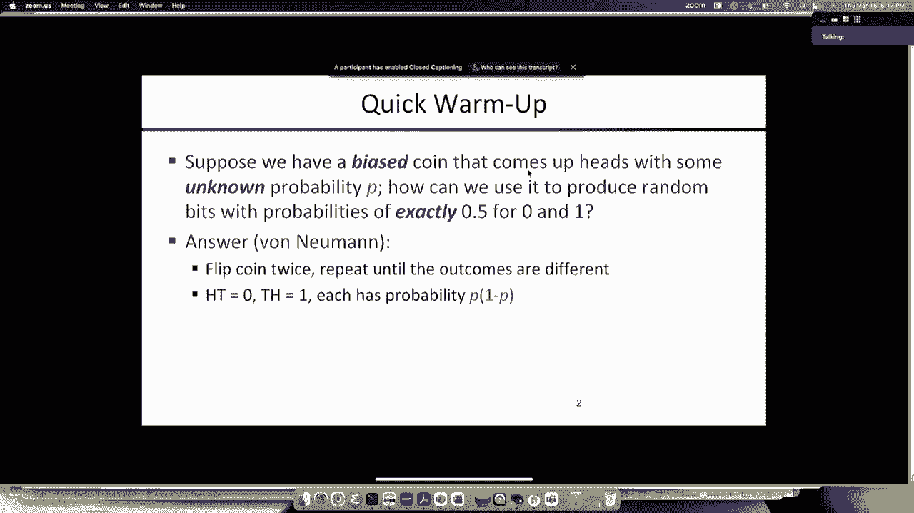

所以我们谈到了贝叶斯网，精确推理枚举非常简单，但真的效率很低，变量消除算法稍微复杂一点，但在许多实际情况下是一个非常有效的算法，但在我们看到的最坏的情况下，它是，不仅仅是NP难。

但是很难得到这些确切的概率，所以有大量的努力可以追溯到，甚至到20世纪40年代在计算复杂事物的方法上，使用随机方法，使用随机数，可能是最早的方法之一，其实，我是说蒙特卡洛方法，我们从物理开始。

不是在计算机科学中，因为在物理学中，他们经常要计算非常困难的积分，而不是计算有效的积分，你可以，你可以在图表上丢点，看看他们是在线上还是线下，并根据曲线下的点的比例来估计曲线下的面积。

有多少个点落在曲线上，这比那要复杂一点，但是蒙特卡罗积分的想法可以追溯到20世纪40年代的物理学，如果不是之前，我想第一个数学处理是由布冯或德·布冯伯爵，他是法国贵族，他发明了一种叫做布丰针的技术，嗯。

用于使用随机随机方法，所以他会想象把一根针扔到网格上，看看针完全落在正方形内的频率，你可以用它来估计圆周率和其他类似的东西。

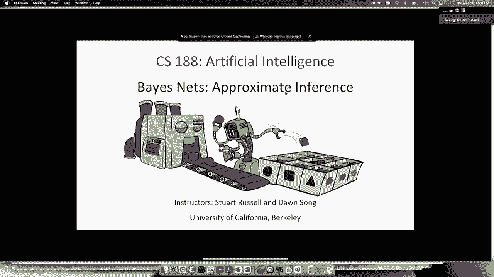

很酷的技术，让我们先看看为什么要这么做，嗯，所以在很多很多情况下，你可以得到一个相当快和体面的答案，即使是巨大的贝叶树，网络或其他概率模型非常非常快，算法很简单，嗯，它们也很容易应用于任意花哨的模型。

所以你可以有模特，到目前为止，我们使用的模型只是使用条件概率表，但你可以有一些模型，其中一些变量是离散的，它们有表，有些变量是连续的，它们可能有高斯分布或指数分布，或者你喜欢的任何其他类型的分发。

只要你能从网络中的条件分布中取样，然后您可以运行蒙特卡罗方法，你可以对任意复杂的任意组合，他们不需要任何记忆，我是说他们需要和网络本身一样多的内存，你要记住的就是，你知道的，什么是我的。

我从网络的状态空间中获得的样本是什么，我正在建立的，你可以，这意味着你可以将它们扩展到包含数千个变量的网络，我上次提到过，我们为监测《禁止核试验条约》建立的模式，这往往是有效地产生。

具有百万变量的贝叶斯网，并运行马尔可夫链，蒙特卡洛对此的推断，它只在笔记本电脑上运行，所以它真的真的很快，嗯，然而你知道，如果你试着做变量消除，你不仅会等到宇宙的尽头，但你会填满记忆。

你知道一个像宇宙一样大的记忆，所以你根本不可能在非常大的模型上运行精确的算法，所以我们将要使用的一些想法，所以我们不是，我们不只是产生随机数并希望最好的，我们确实表明了我们使用的方法。

就像我们在冯·诺依曼的例子中所做的那样，对呀，我们必须证明我们取这些随机数的方法，并用它们来近似贝叶斯净输出，会给你正确的答案，至少在无限多样本的极限下，好的，我们将要使用的一个主要概念是抽样分布。

我将使用s作为采样分布，所以这意味着样本生成方法产生特定样本的概率是多少，不是贝叶斯网分配给那个样本的概率是多少，但是采样生成法，它产生特定样本的概率是多少，然后他们会发现，只要我们执行适当的。

抽样分布与贝叶斯网分布的数学关系，对，事实上一切都会以正确的方式进行，所以我们收集了N个样本，我们使用这些示例来近似查询答案，我们希望在给定证据的情况下查询的概率，嗯，然后我们最终证明，如果n足够大。

我们的大致答案，我们的估计会收敛到真实的概率，嗯，所以如果你还记得数学55或CS 70，你应该证明像马尔科夫边界或厨师边界这样的东西，对呀，说着，随着样本数量的增加，对一组随机变量a的平均值的估计。

比如说，越来越接近真实的平均值，这些都是非常相似的定理，我知道今天不会有非常复杂的证据。

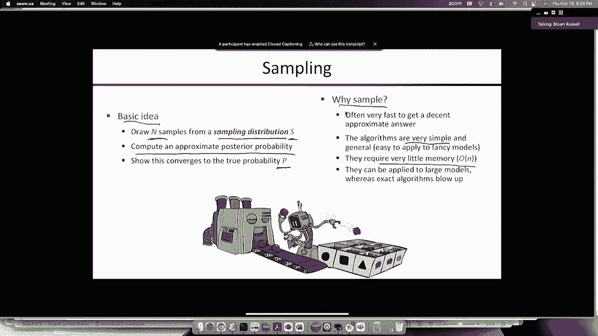

所以为了让你知道这些方法有多强大，假设我有两个程序，你知道的，其中一个是40万行玩大富翁的代码，另一个是两百万行代码，因为它是微软生产的，它垄断了，你想知道这两个程序什么时候互相播放。

a对b的概率是多少，你可以想象这不是一个，从数学的角度来看，这不是一个简单的问题，所以你可能会想到的一个方法是实际计算这个概率，对呀，这是精确的推理方法，嗯，关键的想法是，如果我知道所有的骰子会是什么。

在剩下的比赛中，我知道机会牌和社区棋牌的顺序，这里有谁知道大富翁见过它或玩过它，好的，很难找到一种文化上的，每个人都玩得很好的文化相关例子，如果我选择了一个电子游戏，你也会有同样的问题，对呀。

你们中的一些人会玩，你们中的一些人可能不知道我在说什么，无论如何，垄断，棋盘游戏，你掷骰子，你移动碎片，你收集财产，你得挑一张牌，如果你降落在那些方块上，所以只要你知道骰子会做什么，这副牌的顺序是什么。

那么你就可以准确地预测将要发生什么，对呀，它是一个确定性函数，你可以用骰子滚动运行这两个程序，卡牌的顺序，并准确地预测谁会赢，所以我们会让，vs是特定骰子滚动和鳕鱼序列的值，和用于，如果a赢了。

我们就说s的值是1，如果A输了，则为零，那么如果我想计算A获胜的概率，这是什么，有什么想法吗，好的，我给你个提示，是呀，去吧，我想说的是，暗示将涉及一个概率和一个值，是呀，它只是总和。

所有可能序列概率之和，序列乘以值，从某种意义上说，这是一个非常常见的，如果你喜欢一个关于概率的技巧，使用我们所说的伯努利随机变量，所以v，s的v是a，伯努利随机变量，像那样的哎呀。

所以我只是以一个法国人的名字命名，可能是，伯努利先生，它只是意味着一个随机变量，其值为零和一，所以如果你想要某人获胜的概率，你只要给获胜的人分配一个，零到损失，然后取伯努利随机变量的期望值。

这给了你概率，所以有人注意到这个计算的问题吗，S的权利量，我是说，即使是二十个骰子，你已经是十二的二十次方了，对呀，但事实上，垄断游戏可以持续无限的时间，对因为你知道，事情可以停止所有的倒退和前进。

你可以，你知道的，赚更多的钱，钱少了，必须互相交易财产，所以实际上对垄断游戏的长度没有限制，其实经常有那种感觉，嗯，所以你要么有一个组合庞大的数字，甚至无限多的序列，所以你根本不能准确地做这个求和。

所以这很糟糕，但你知道，常识会说这并不难，对吧，我们为什么不让他们互相对抗几百次呢，看看谁赢对了，这就是蒙特卡洛方法，对呀，所以我们只要取样就行了，而不是把所有的骰子序列加起来。

我们只是取样一些骰子序列，反正骰子会为你做的，这就是它们的作用，嗯，所以你取样一些序列，你玩那么多游戏和数百个，可能非常好，嗯，然后你只需使用样本估计，所以你计算出一场胜利的次数除以游戏的总数。

那是对甲获胜概率的估计。A比B好多了，即使你知道十到十五场比赛，它也会很快变得非常清楚，你知道它赢了十个中的九个，然后你说，是啊，是啊，好的，他们甚至不需要在这上面花更多的时间，a比b好，如果很近的话。

那你可能要做得更多，如果他们真的很亲密，那么要么你必须做更多的工作来弄清楚，真的哪个更好对吧，如果真概率是五点零，零一和点四九九九九，那么你要玩几百万个游戏才能得到足够的信号，但如果他们真的那么亲密。

真的没关系对吧，所以你无论如何都可以停下来，你不需要玩数百万场游戏，他们真的真的很亲密，真的没关系，所以在几千场比赛后，要么A更好，B更好，或者你要用哪一个好并不重要，所有的权利，如此如此。

这是一个完全难以做到的事情的例子，但使用采样很容易做到。

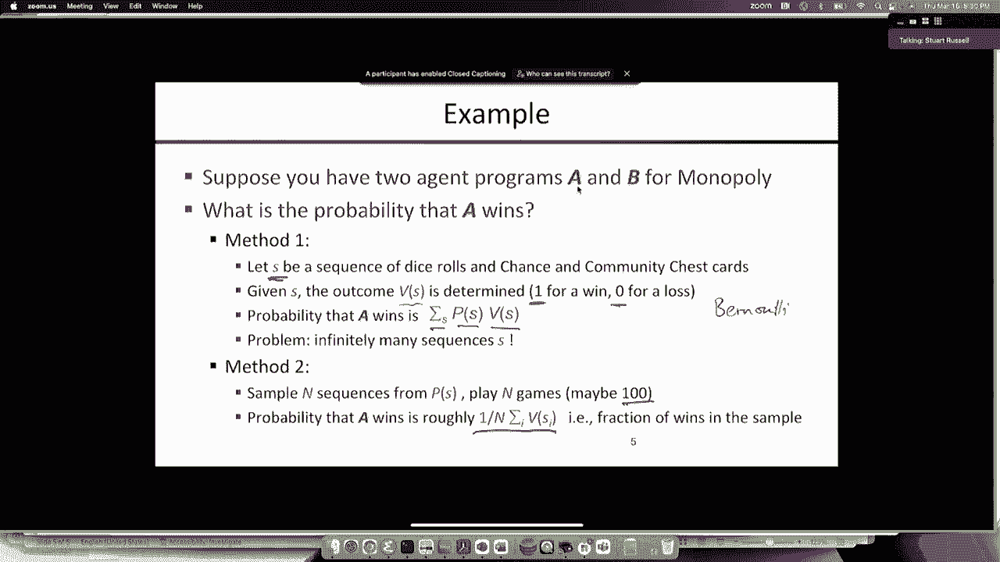

所以为了构建我们的算法，对呀，我们需要取样，你可能可以从地下室的条件概率分布中想象到，对呀，所以要了解如何做到这一点，我们必须很好地理解，首先如何从发行版中取样，这就是为什么我用硬币给你热身，对吧。

你知道有偏见的硬币是，事实上，我们将要使用的主要工具，除了我们知道P，我们知道正反面的概率，因为条件概率表告诉你，嗯，所以对于离散的情况，连续变量也很有趣，但我不打算谈论从那些离散案例中取样。

你只要想象你有，如果你的随机变量有D个不同的值，对呀，想象一下你有一个决定的硬币或侧边，不管你想怎么想，x的p是这些值的概率，对呀，所以可能是，比如说，我有一个，我有三个值，物体的颜色可以是红色的。

绿色或蓝色，和60%的红色概率，绿色的概率为10%，蓝色的概率是30%，所以我有一个三面硬币，这些就是概率，现在我该怎么掷那个奇怪的三面骰子，这是相当有偏见的，我怎么把它放在电脑里。

基本思想是从零到一的区间内的一个均匀随机数开始，好的，然后我们把它转换成一个，所以我们生成那个随机数，然后我们把它转换成这个特定随机变量的值，物体的颜色，好吧，想想这个，我是说这个我想对一些人来说。

这已经很明显了，这是如何工作的，我找到一张照片，我喜欢图片，我发现这张照片真的很有帮助，所以你把这个离散的概率分布，你把它变成一条从零到一的数字线，你只需在数字行上为每个值分配空间，红色的点6。

果岭得一分，蓝色的三点，然后你想象，你知道雨落在这上面，你知道雨滴落下，概率有多大，一个随机的雨滴落在这三个不同的区域中的一个，很明显，如果雨滴真的是均匀随机的，它落在红色区域上的概率是红色区域的长度。

也就是第六点，好的，原来是这么回事，所以最后，唯一的问题是这个，如果你知道这个随机的雨滴下来，你知道有价值，你知道吗，八点三，所以八点三应该在那里的某个地方，对呀，所以这个雨滴来了。

它会降落在正确的地方，你怎么知道它落在哪一个井，你只要查一下，你说好，如果是从零到六点之间，然后它就会变成红色，如果是六点到七点，会是绿色的，如果是七点到十点，在这种情况下，它满足了第八点三。

那它就会是蓝色的，所以八点三会是蓝色的，所以你所要做的就是把这些条件概率，并将它们转化为累积分布，因为这些数字是对的，第六点，七点和一点右，这些是概率上升到下一个值的地方，足够清楚。

所以这是一个非常简单的想法，嗯，所以以后会更有趣，我想当我们谈到粒子过滤时，我们会问，好的，如果我，如果我有n个值，我想做包装，是n的平方吗，因为要依次做这些测试，它会。

我将采取n个测试的顺序来找出我属于哪个值，然后我会这样做N次，所以看起来就像，至少这个方法可以得到n的平方，如果我想画N个样本，有n个值的随机变量，好的，但事实证明，你实际上可以按照n的顺序来做。

那就更多了，效率要高得多，对于需要大量样本的算法，事实证明这真的很重要，但现在我们就用这个天真的方法，你拿离散概率表，你计算这些数字的累计和，然后按顺序测试，直到找到随机数所属的正确桶。

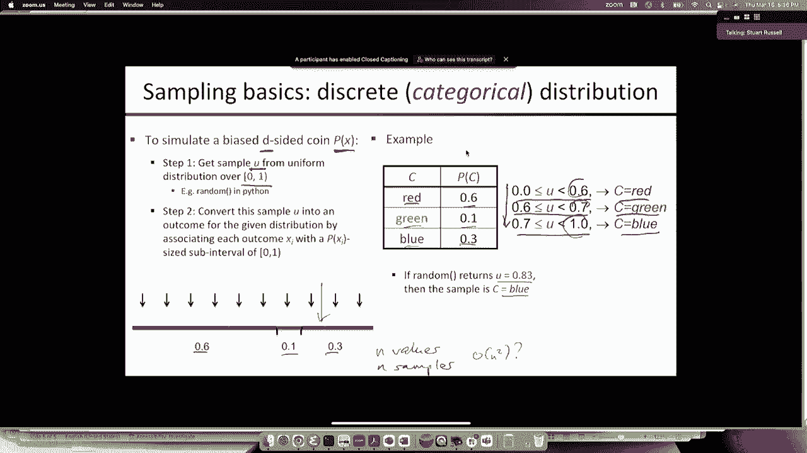

所有的权利，所以这就是，这是我们将要使用的核心工具，这是偏置d sidice的计算实现吗，我们将用它来模拟我们的贝叶斯网。

所以第一种方法是，我们能不能从贝叶斯网中的所有变量中生成一个样本，使得该样本是贝叶斯网所代表的分布的完美样本，好的，所以贝叶斯网代表了某种概率分布，p在所有变量上，我能从那个分布中准确地提取一个样本吗。

好的，这种方法叫做先验取样，因为它是从贝叶斯网表示的先验概率中取样的，我们还不担心任何证据，好的，我们的艺术家画了这个惊人的复杂模型，所以这实际上是向你展示了发生了什么，当你模拟那个非常简单的模型时。

首先生成一个形状，所以形状就从分布到形状，然后形状的颜色取决于它是什么类型的形状，所以这个家伙把颜色，所以他在着色，金字塔蓝立方体红金字塔绿等等，然后最后一个人必须把这个过程的输出，用它做点什么。

和事先取样，他什么都不用做，没有任何证据，所以他只是把结果放在这些桶里，然后水桶基本上在数，当我生成样本时，我只需要数数我得到了多少，我用这些计数来估计我感兴趣的概率，好的。

就像我们计算a和b在大富翁中赢了多少场比赛一样。

好吧，这很简单，非常直观，从贝叶斯网分布生成示例的方式，你是从根开始，或任何根变量，你给他们取样，然后你对他们的孩子进行取样，你只是按照所谓的拓扑顺序继续前进，所以从根到叶，你可以。

你总是可以对任何变量进行采样，只要它的父母已经取样了他们的值，好的，嗯，你根据条件分布取样，那已经写在贝叶斯网上了，所以让我给你举个简单的例子，所以首先我们要取样根，哦，我应该对这个网络说点什么，对呀。

这就像记忆，地震入室盗窃网络来自UA珍珠，他基本上发明了贝叶斯网，他是个教授，还是加州大学洛杉矶分校的教授，这是他在早期论文中使用的另一个例子，为什么我们需要贝叶斯，渔网，基本的故事是，比如说，你可能。

你可能会注意到你邻居的草是湿的，所以你只要看着窗外，有一天晚上你看到，哦，草是湿的，对是因为下雨了，或者是因为那天他们打开了洒水器，洒水器的使用和下雨的发生都取决于，早上是不是多云，好的，所以这就是。

这就是这里的因果故事，所以我们要做的第一件事就是对混浊的根部取样，多云的先验概率是一半一半，所以这只是抛出一个普通的无偏见，双面硬币，所以我们折腾，我们掷硬币，事实证明是真的，我一般用绿色表示真。

红色表示假，给予多云，哎呀对不起，我去了，我想我做了两次，是啊，是啊，所以现在我们要取样洒，给予多云，如此多云原来是真的，所以我们对条件概率表的那一行感兴趣，阴云密布的地方，洒水车的分布是一点九。

所以现在我们从这个非常有偏见的硬币中取样，它有90%的概率产生故障，事实上，当我们取样时，它被证明是假的，现在我们要去采集雨水，同样的事情阴云是父母是真的，所以我们要从这个分布点8。2取样。

所以这是另一个偏置硬币，我们抛硬币，雨原来是真的，现在我们取样湿草，所以我们认为洒水车是假的雨是真的，这就是这里的分布，所以又是一枚非常有偏见的硬币，九十，我们取样证明这是真的。

所以现在我们有一个来自这个网络的样本，然后我们再做一次，我们又得到了另一个样本，我们又得到了一个样本，然后我们感兴趣的任何可能性，我们可以用计数，对呀，有多少样本掉进，他们可能掉进去的每一个桶。

我们用计数来回答这个问题，所以如果你想知道，下雨的可能性有多大，你可以看看所有的样本，看看其中有多少是雨，这实际上是答案，好的，所以这是一个非常，这是一个非常非常直接和自然的想法，所以这个符号是正确的。

先前样本的样本分布，对呀，这个物理过程，对呀，我刚才描述的算法是它产生特定样本的概率，天气多云，不是洒水器，下雨了，那是湿的，有湿漉漉的草，好吧，好吧，让我们往右看，我们基本上是连续扔了四个硬币。

那四枚硬币的概率是多少呢？嗯，第一个硬币的概率是c的p，所以阴天是真的概率，第二个硬币的概率是不洒给定C的概率，第三个硬币的概率是给定c的下雨概率，第四枚硬币的概率是湿草的概率，没有洒水器和雨水，好的。

这些是我们扔硬币的概率，他们有这些结果，但如果你看对了，这只是网络中条件概率的乘积，这正是联合分配权中这一特定项目的概率，这直接来自贝叶斯的语义，网右，概率，所有变量的联合概率。

是这些值的条件概率的乘积，这种生成样本的方法不仅看起来很直观，对呀，如果你试图生成样本，你会做的显而易见的事情，但它实际上根据正确的概率精确地产生样本，好的，所以先验采样是贝叶斯网分布的完美采样。

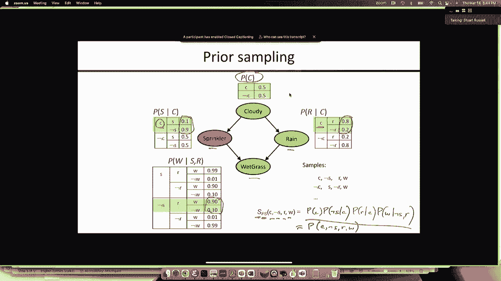

嗯好吧，所以这只是说明了什么，我刚说对了，嗯，如果要生成n个示例，你只需对每个变量进行采样，x i右，所以这里，这个n，它很小，n是，变量数，不是样品的数量，好的，所以这是一种生成一个样本的方法。

然后外面可能有，你知道的，因为j等于1到大写n，所以j范围在你生成的不同样本上，所以每个样本都是通过按拓扑顺序对变量进行采样来产生的，从给定父级的条件分布中对每个变量进行采样。

然后返回产生任何问题的结果值。

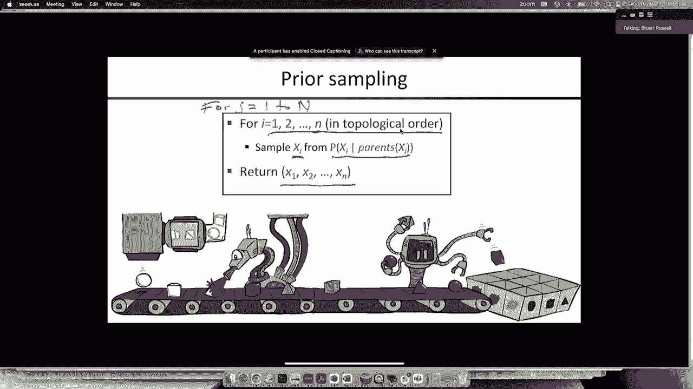

好的好的，所以我们想确定这实际上是正确的，我想我已经基本上向你展示了这是正确的，你只是投对了硬币，这些硬币中的每一个都是从正确的条件概率中提取的，所以它会产生正确的答案，所以抽样概率只是概率乘积。

在样本中的所有变量上，该值的概率，考虑到父母的价值，因为那是你的玩具，你抛的硬币，通过贝叶斯的语义，等于联合分配的网，好吧，我只是想强调一下，对呀，嗯，对于任何特定的盒子。

如果你还记得那些人把样品分类到所有的盒子里，所以任何特定的盒子，联合分发中的任何特定条目，我们要说，在总共n个例子中，n个子ps，掉进一个特定的盒子里，x 1到x n，所以如果我想估计概率。

所以Q是估计的概率，我会正确估计的方式，所以这是算法的最后一部分，对你生成样本，然后从样本中，你对一些感兴趣的数量做出估计，好吧，我们怎么做，我们只要取那个盒子里的样本数量，我们把它除以样本总数。

这给了我们对特定联合概率的估计，只是通过普通的大数定律，如果我们取n为无穷大，那么这个极限，从计数中计算出的估计数，会是，根据定义，这个比例的极限，这个比例的极限是，事实上，那个盒子的样本生成概率。

对呀，采样过程将样品放入该盒子的概率，好的，所以我想这是一个微不足道的证据，但我希望你把这两件事分开，贝叶斯网中真正的概率，以及抽样概率，然后你用来取样和产生估计的方法，Q好的。

关于这项权利有什么问题吗，所以它会变得有点，对于更复杂的算法来说更复杂一点，但不会复杂多少，好的，根据顶部的定义，对呀，那等于真正的概率，所以我们用一致的权利这个短语，在统计中如此一致。

意味着在无限多个样本极限下的估计量，收敛到它应该估计的真实值，好的，所以你可能在数学上显示了55或CS 70，随机变量平均值的一个估计量，是从那个随机变量中得到的一些样本的平均值。

你证明平均值是一个一致的估计器，但实际上还有很多其他一致的估计器，你也可以使用，也许你可以找到方差较低的一致估计量，或者更容易计算，或者不需要这么多样品什么的，好的，但这显然是一个一致的事情。

因为它几乎是从真实的联合分布中平凡地取样，你知道的，我想我们可以跳过这张幻灯片，对呀，它只是说明了你生成一堆样本的想法，如果我想知道一些数量，比如，上面的概率分布是多少，嗯湿草，对呀，我只是看看这一栏。

我看到五分之四，潮湿的草地，所以我估计八分之一的概率。

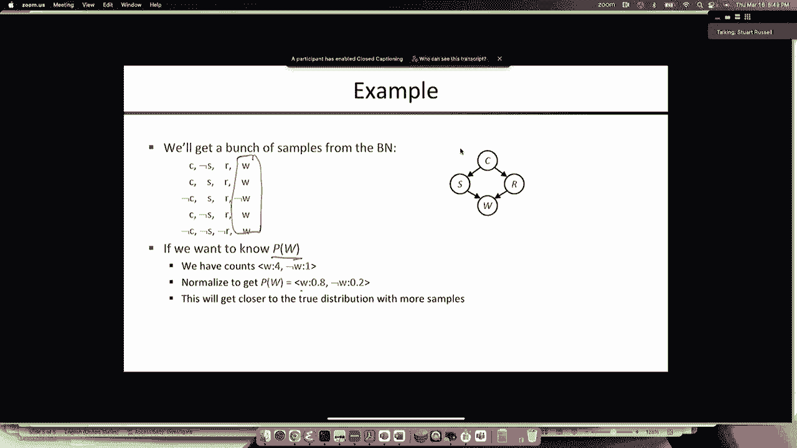

嗯，所以现在一个问题就可以了，所以这是直接从先验数据中估计事物，如果我有证据呢，我如何利用证据，然后是样本，回答我的问题，再来一次对吧，图为创意，对呀，所以如果我观察到，物体的颜色是蓝色的，对呀。

记住我们的分布是一个简单的贝叶斯，网的形状是彩色的，对呀，所以如果我观察到它是蓝色的，好的蓝色，然后最后的那个人就扔掉了任何不是蓝色的东西，好的，然后他把蓝色的东西放进不同形状的盒子里。

然后你看看那些盒子，现在，你可以估计形状的概率，所以再一次完全直截了当，非常自然，对嗯，你知道的，如果你想知道，我期中考试得a的可能性有多大？如果我宿醉了，你可以参加期中考试，一千次你可以喝醉，五百次。

呃看看你喝醉后得了多少次A，你不喝醉时得到的分数是无关紧要的，对呀，所以你抛弃了所有那些不算数的经历，因为你感兴趣的，得到A的可能性有多大，当我宿醉的时候，所以这是估计条件概率的一种完全自然的方法。

给出一些证据是只看你数据中的案例，证据实际上是正确的，忽略所有其他情况。

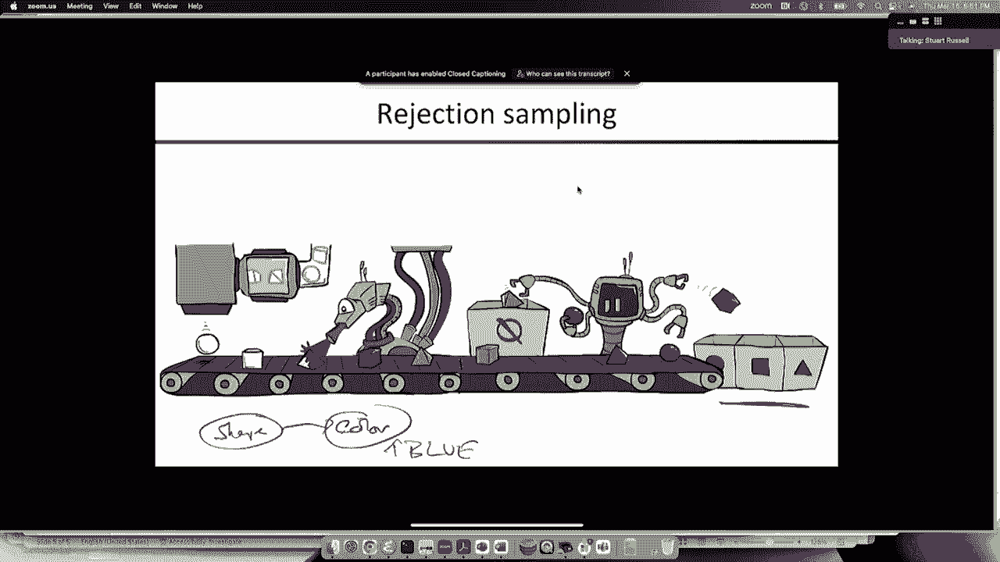

嗯好吧，所以如果我想知道多云的概率是多少，在下雨和湿草的情况下，如果你还记得的话，这是我们为枚举所做的，等于联合分布的归一化，适合阴雨湿草，如果我，如果我想估计，然后我想看看样本下过雨的桶。

就在没有雨的水桶里，和没有湿草是无关紧要的，就是这样，拒绝取样，我做的和我以前做的一模一样，只是我扔掉了所有与证据不一致的样本，所以现在我有一个非常简单的，贝叶斯网的简易近似推理算法。

在与证据不一致的样本中产生大量先前的样本，在左边的示例中向右计算查询，就是这样，所以你可以想象这就像两行蟒蛇，好的，所以比消除容易得多，我想在编写代码方面可能比枚举更容易，好的，这个方法。

正如你所想象的，在无限多样本的极限下是正确的，所以如果我从中生成样本，我想知道这个条件概率，对呀，我只是要扔掉任何与证据不一致的东西，对呀，与证据不一致的，也请注意，我不必生成完整的样本。

一旦样本变量与证据不一致，然后我停止了那一代人，开始了新的一代，好的，所以如果我生成了这五个样本，我想知道多云的分布是什么，我这儿只有两个样品，但一半是多云的，一半不是多云的，所以我估计第五点，点五。

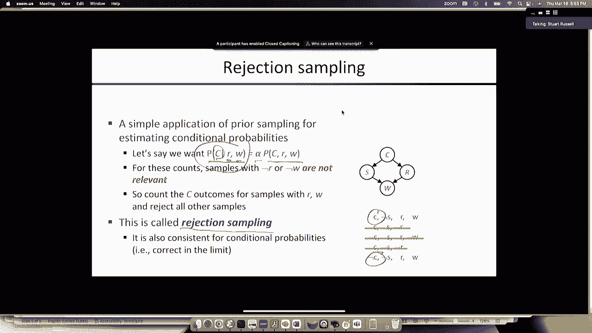

好的，这就是算法，对呀，你拿着证据输入，您生成一个示例，如果不一致，你把它扔出去。

否则你就退货，然后积累结果并回答查询，那么这在实践中效果如何呢，好吧，我在汽车保险网上试过了，我推断，在这种情况下，属性成本是查询变量，证据都是蓝色的，所有的蓝色变量，对呀。

这些是你在申请表上填写的东西，这显示了这个财产成本的错误，所以这就是错误，意思是，为的，不同的值可能是因为我认为在这种情况下，它是一个四值变量，那么这四种概率中最大的误差是什么呢。

你可以看到它不是特别好，它需要一百万个样本，误差仍然大于零点一，所以超过百分之一的误差，即使在一百万个样本之后，感觉不太对，如果你对统计学很熟悉的话，当你当你开始，当你想到样本的数量。

以及您期望的错误是什么，你希望它是平方根的1，所以如果你有一百万个样本，你期望误差是千分之一，也就是一百万的平方根，对，但这里是一个，所以误差太大了十倍，所以如果有什么不对的地方，有人能告诉我为什么。

为什么会聚得这么慢，太多了，太多的东西要测试，是啊，是啊，所以记住算法是怎么做的，如果你生成一个样本，它与证据不一致，你把它扔掉，是的因为我有相当多的证据变量，我生成的大多数样本与证据不一致。

所以我扔掉了大部分样本，所以即使我产生了一百万个样本，他们的绝大多数样品都被拒绝了，所以他们根本不算数，所以我实际上试图从可能只有几百个样本中估计概率，好的，所以有效样本量。

比我实际生成的样本数量少得多，因为他们必须同意我清点他们，他们必须同意我掌握的所有证据，我掌握的证据越多情况就越糟，太疯狂了，你觉得好吧，如果我在做概率推断，我有更多的证据应该会变得更容易，嗯。

但看起来它变得更热，所以好吧，所以这不是一个特别好的算法，实现起来非常非常简单，您可以为，实际上对于概率分布来说，不仅仅是贝叶斯网，但事实上任何随机程序，你可以把贝叶斯网想象成一个非常简单的。

一种随机程序，它们是否只是从表中随机抽样，表的随机样本，但实际上你可以编写任意复杂度的随机程序，使用递归、数组和链表，你说对了，只要有随机程序，我可以经营他们，我可以拒绝朗姆酒，如果与证据不符。

然后我可以估计概率，所以拒绝样本是一种非常强大的技术，但它也非常低效，因为你最终扔掉了你所做的几乎所有工作，有问题。

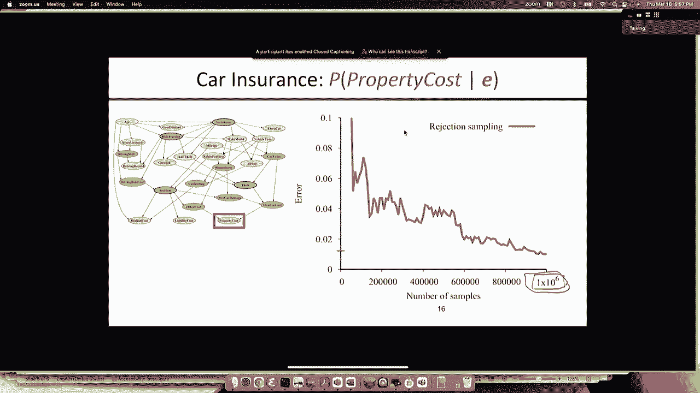

所以概率加权是一种避免扔掉所有这些例子的技术，它是如何将证据变量固定为它们的值的，所以不可能产生与证据不一致的样本，因为它没有对证据变量进行采样，它只是把它们修复到正确的值，好的，只在另一条皮带上取样。

其他变量，好吧，现在我们会看到，实际上，这引入了一些问题，所以这里，比如说，对呀，所以这家伙在说，好的，嗯，我知道形状很抱歉，我知道这个物体是蓝色的，我试图找出形状的分布，所以我要把它们都漆成蓝色。

然后下面发生了什么，实际上是生成的对象在大小上增加或减少，我们将看看那个公式到底是什么，这叫做给样品加权，所以我们给它们一个更大的重量或更小的重量，然后你计算的不仅仅是每个盒子里的数字。

但是每个盒子中示例的总重量，好的，我们会明白为什么要这么做，我们实际上正在这样做，来弥补我们的抽样分布不再是正确的分布。

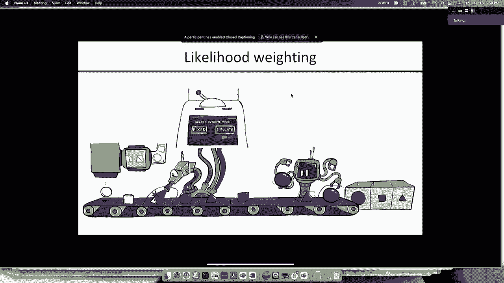

所以杰克逊取样的问题是，我们最终拒绝了很多很多的样品，另一种思考相同观点的方式是我们有正确的证据，为什么我们在生成样本的时候忽略它，这有点傻，所以想象一下，比如说，你知道你的证据是，你知道一个视频对吧。

你是你去视频，在视频中你知道一个行人正在过马路，有人从他们身上碾过，对呀，现在你试图计算概率，是行人的错还是司机的错，然后你开始运行一堆模拟来找出，但你知道你在模拟完全不同的事件。

就像你知道一辆冰淇淋车停下来，一个小孩在买冰淇淋，嗯，1。你干嘛这样，因为你在视频上看到了，一个行人过马路，一辆车从他们身上碾过，那么我们为什么不模拟事件呢，行人过马路，一辆车在他们周围，那会更有意义。

好吧，这就是，这是我们要做的事情的核心理念，但让我们用这个非常简单的例子来说明它，我们有形状颜色网络，所以如果我们观察到物体是蓝色的，我们想弄清楚，好的，如果它是蓝色的，我们认为它是什么形状的。

那么仅仅从网络中进行先验采样是没有意义的，然后拒绝所有颜色不对的形状，相反，我们固定了证据变量，并对其余的进行采样，问题是样本分布不一致，它不会收敛，给你正确分布的样本，一个是右后。

我想从给定颜色的形状的概率中取样，但如果我只是取样形状，把颜色固定在蓝色右边，我从什么分布中取样，如果我采样根变量形状，我将颜色固定为蓝色，那么我得到的形状只是从先前的分布中取样，形状p，好的。

形状的p和蓝色的形状的p是不一样的，所以我从错误的分布中取样，所以我数不清有多少金字塔和球体，我得到的立方体，把它们都弄成蓝色，好的，所以我得重新称重，它的重量计算，这就是这个算法的棘手之处，所以嗯。

但这个想法本身很简单，我们要去，我们要对形状变量进行采样，我们会得到一些，你知道金字塔球体，立方体，我们会把它们都修好成蓝色，因为这是证据告诉我们的，然后我们要等这些，我不知道确切的重量是多少。

但你知道，比如说七点七分四点二点四，然后称重的样品会被扔进桶里，我会把每个桶的样品重量加起来。那么这个重量是从哪里来的呢，我们如何确保使用加权样本给出正确的答案，对于任意复杂的贝叶斯网。

其中任何变量都有证据，这不是立即明显的。

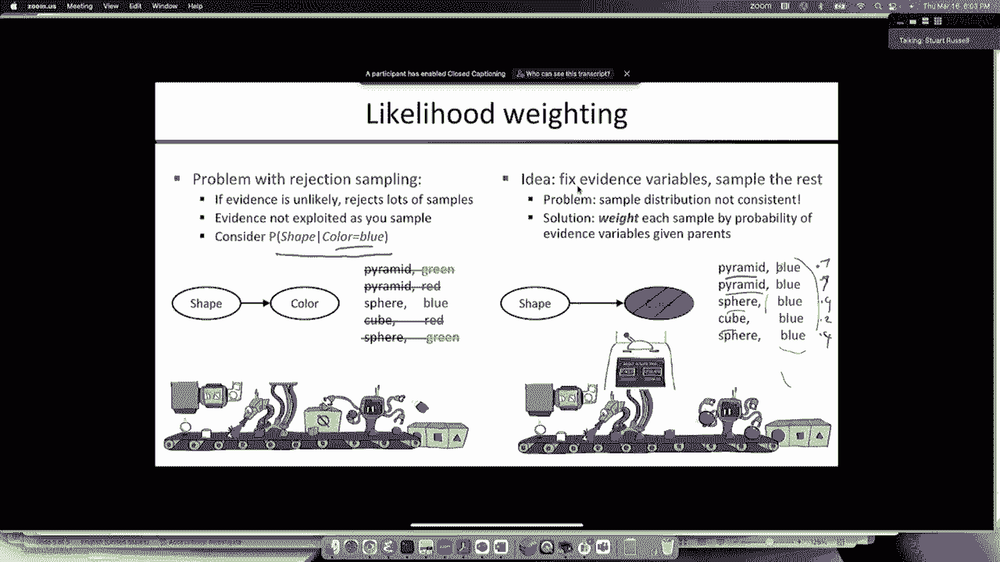

所以我会告诉你它是如何工作的，然后我会告诉你为什么它工作如此相同的网络，我们要修复证据，所以我们有春天是真的，湿草是真的，那些是固定的，这就是我画的那些线，意味着我们不能改变那些，我们只是取样阴雨。

好的，所以如果我看我的样本，已经有洒水器了，它已经湿草是真的，我从重量一开始，好的，然后我要把东西乘以那个重量，最后我会得到样品的重量，好的，所以让我们取多云的样本，那是点五点五，所以我掷硬币。

阴云是真的，所以现在我有一个云等于真的在那里，好的，当你对变量取样时，你不更新权重，当涉及到样品时，你会更新重量，对不起，我应该说，当你取样一个非证据变量，当涉及到样本证据变量时，您更新权重。

然后你意识到，哦，这是一个证据变量，我不需要取样，但我确实需要更新体重，好的，所以接下来我们要做的是去洒水车，如果我们要取样，我们会在多云的情况下取样，多云是真的，所以我们要看看这里的分布，好的。

但不是从中取样，我们就把它的重量，好的，因为洒是真的，我们发现还好，洒水车是真的概率，假设多云是真的是第一点，所以这个例子的权重是第一点，否则他会把重量乘以1，所以现在我们把点1相乘。

那么为什么这有意义呢，所以实际上你已经可以看到这个，这个特定的样本会有一个小重量，因为它已经有一个点乘以1，我做得不好，然后我看到证据表明洒水器开着，概率模型表明，实际上弹片通常不会打开，当阴天的时候。

出于显而易见的原因，对，如果多云的话，你通常不会，你认为今天可能会下雨吗？我不需要打开洒水器，所以只有百分之十的机会洒水器会开着，所以这说明证据不太可能给出，到目前为止我构建的样本。

所以我不太喜欢这个样品，这是一个奇怪的样本，我要减肥，它这个，好的，然后我们去下雨，下雨没有证据，所以我们可以从它的条件分布中取样，又以多云为条件，这是八百二十，所以我们取样，结果是真的。

我们把它放进样本里，好的然后我们去湿草地，我们有洒水器是真的，雨是真的，所以我们在这个分布中，如果洒水器开着，下雨了，那么草地有百分之九十九的机会是湿的，所以从湿草证据的角度来看，这是一个很好的样本。

因为事实上，在样品洒水器上，而且下雨实际上使白草的证据极有可能，所以我们说，好的，嗯，至少就湿草而言，这是一个很正常的样本，所以重量乘以那个点，九九，这样它就不会再缩小了。

所以洒水器的证据表明我不太喜欢这个样本，因为天气多云的时候通常不会洒水，但是湿草，因为我喜欢这个样本，因为我们碰巧也选择了雨，也是真的，所以至少这其中的机制。

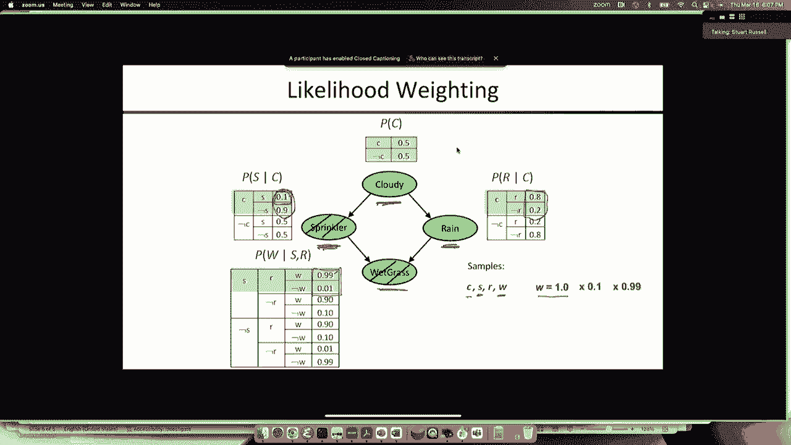

每个人都很了解机械，这就是更详细的算法用来生成一个特定的加权样本，从一个重量的开始，按拓扑顺序遍历变量，如果是证据变量，然后将权重乘以给定父级的观察值的条件概率，否则，你从它的分布中取样，给出父母。

所以你返回你生成的样本和与样本相关的权重，然后回答查询，你只要用桶里样品的总重量。

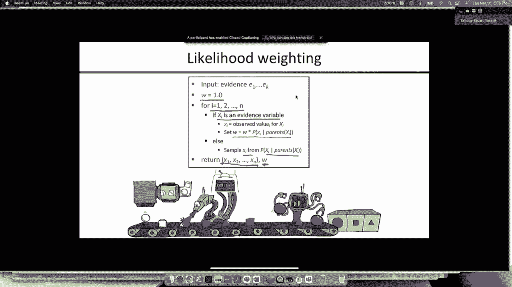

所以我现在要证明事实上，这个算法是一致的，因为加权抽样分布是，实际上与查询的后验分布相同，鉴于证据，嗯，所以首先要说的是，嗯，抽样分布是什么，好了，这是采样分布，这是加权的抽样分布，我们的加权采样算法。

不在所有变量上的分布，但实际上只在采样的变量上，所以我将用z来表示非证据变量，这些就是我们要取样的，每个样品都固定在其观测值，所以我用z生成任何特定完整样本的概率，E只是我扔硬币上的产物。

我只为Z变量掷硬币，所以我对每个z变量进行评分，我想要Z变量值的概率，给定该变量的父母，网络中的ZJ，好的，所以和以前一样，除了不是概率，它不是所有变量的乘积，但只是在变量上的乘积。

这些变量被取样来产生这个样本，好的，所以这里的Z会是多云和下雨，我们没有取样洒水器和湿草，但我们关心的不仅仅是我们产生的样本，还有这些样本的重量，所以如果i，如果我生成了这个特定的样本，z和e是对的。

什么重量会好起来，它会得到它所给出的重量的乘积，对于洒水器和湿草变量，这个z的权重实际上是证据变量的乘积，在这种情况下，洒水器和湿草，证据价值的概率，E子K赋予父母证据权，所以这又是，这就是算法所做的。

它计算重量，对于每个与每个证据变量相关的，只是看着，给定父母，这个值的可能性有多大，然后它乘以那个，所以它的重量会超过一个产品，这些条件概率的所有证据变量，所以现在我有可能产生一个样本。

我知道样本的重量，好的，所以现在我可以弄清楚，那个桶里会有多少重量，对呀，这将是，怎么，生产那个样品的可能性有多大，给它分配的权重有多大，这就是桶里的重量，好的，所以加权抽样分布。

每个桶中的重量是产生样本次数的概率，算法给出的样本权重，好的，这是每个非证据变量的非证据变量的乘积，因为它的父母，权重是证据变量的乘积，取决于它们的父母，现在如果我好好看看这个。

我得到了一个非证据变量的乘积，我有一个关于证据变量的乘积，这意味着我得到了一个所有变量的乘积，这等于z的概率，好的，所以加权抽样分布，算法倾倒到桶中的重量，正好等于桶的真实概率，好的。

所以我们从错误的分布中取样有点神奇，但后来，我们正在通过重新加权这些样本来补偿这一点，以这种非常聪明的方式，神奇的是放入桶中的加权样本正好是，如果我用相反的方式解释算法。

如果这是一个叫做重要采样的技术的例子，一个重要的采样是一个非常，计算统计中非常强大的技术，实际上要简单得多，它很一般，也很简单，和可能性，加权可以作为重要抽样的应用直接导出，那么什么是重要的采样。

我得到了一个分布，对，真实分布，好的，但很难从这种分布中准确地取样，所以我从另一个分布Q中采样，q可以是任何东西，但要满足一些技术条件，对呀，您可以从任何分发队列中采样。

并使用这些样品来估计你想要的关于P的任何数量，好的，你所要做的就是等待样品的p/q，好的，所以这是很重要的取样，这是一种完全通用的技术，所以如果我从重要的取样开始，说好，p，我想要的分布是p的分布。

我无法从中取样，事实上，如果我能直接从那里取样，然后我可以在多项式时间内有效地逼近后验概率，事实上，因为它是P号硬的，我们知道那是不可能的，所以我们知道，事实上。

没有有效的算法直接从我们想要的后验分布中采样，所以我们得用别的东西，你可以用的一个明显的东西是，让我们在没有证据的情况下对变量进行采样，完全按照以前的取样做，除了固定证据变量和样本其他。

这是你可能想到的第一件事，你所要做的就是这样，所以你所要做的就是计算出权重是p/q，这给了你这个算法，你把每次，根据可能性，证据的观察价值，嗯很好。

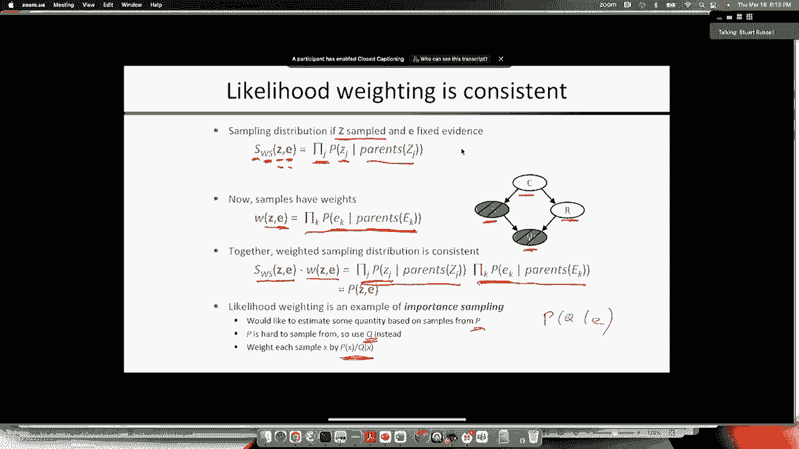

所以这可能是等待，我们还剩15分钟来做我这学期最喜欢的算法，也就是吉布斯取样，所以我想我们可以，它可能会在下一节课中流血一点，那么它工作得有多好，让我们看看同一个查询，同一网络，所以我们要物业费。

给了蓝色，蓝色变量，还记得拒绝取样采取了大约一百万个样本，误差超过1%，嗯，可能性权重几乎立即到达那里，事实上，我想那可能有一千个样本，或者类似的东西，我忘了第一个数据点到底在哪里，但这么小的量对吧。

在这张图上几乎看不见，所以它的方式方式，更有效率，在这个特殊的地方，在这种特殊情况下，好的，所以这是伟大的权利，我们把事情至少加快了一千倍，可能是一万倍，我们也同时。

学会了一种非常酷和非常通用的采样方法，从任意复杂的分布中使用不同的分布，然后补偿我们使用不同分布的事实。

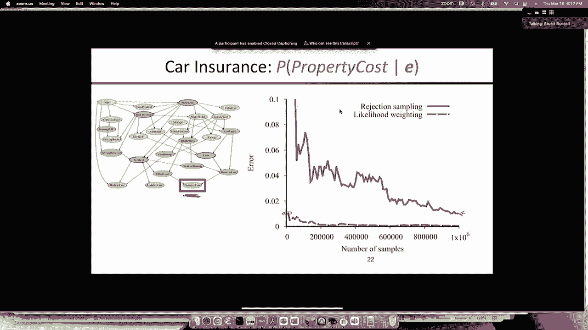

好的，嗯，这是怎么回事，对呀，基本上就是，如果我们幸运的话，证据会影响我们生成的样本的分布，从以下意义上说，这将是正确的，下游变量的值受上游证据的影响，所以在这个例子中。

我已经证明了假设我们在三个红根有证据，中间的黄色变量，当我们生成样本时，我们会看到很多变量的值都受到证据的影响，所以在某种意义上，它们肯定与证据告诉你的一致，所以这意味着他们，分布接近右后。

不完全是后部，因为如果我从根变量开始采样，这些都是我刚刚做的灰色的对吧，这些根变量根本不受证据的影响，因为他们在父母或祖先身上没有任何证据，好的，但当我现在开始取样更多的变量时。

那些粉红色的变量受到红色父母的影响，这意味着样本来自一个分布，那可能不完全是后部，但至少比前面更靠近后面，或者如果你幸运的话，如果你在上游有很多证据。

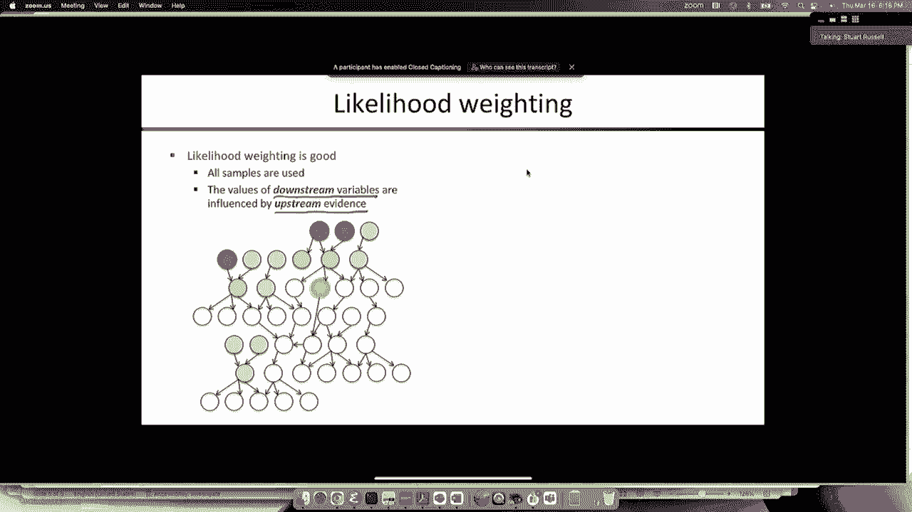

我们在保险网络上做的，回到保险网络对吧，你可以看到所有的蓝色变量，它们中的许多实际上靠近网络的根，我们实际上是查询变量，网络的叶子很不寻常吗，事实证明。

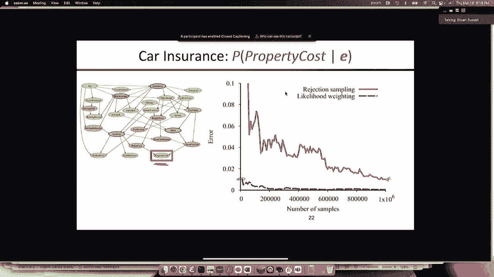

所以当我继续右，你可以看到一些变量直接受到红色祖先的影响，橙色变量受到红色和黄色祖先的影响，所以他们实际上受到了所有证据的影响，所以它不是完美的对吧，你希望这里的所有变量都是橙色的，对吧。

它们都受到所有红黄证据的直接影响，但总比什么都没有好，事先抽样，它们都是灰色的，因为他们完全无视证据，所以它介于两者之间，上游的证据越多，越好，但如果我们在树叶上有证据呢，好吧如果我们有这些蓝色的证据。

如果证据是树叶，它对样品没有任何影响，好的，所以它真的不比以前的取样好多少，你还在从先前的样品中取样，你不是在拒绝与证据不一致的样本，但它们最终可能会有极小的重量，树叶上的证据变量越多，事实上。

重量会呈指数级变小，你至少有一些证据变量，所以这是可能性等待的关键弱点，如果我有证据，典型的重量是正确的，从2到负k，好的，假设你生成的样本基本上是五五分成，是否与证据一致，所以你知道，K变大。

重量变得非常非常非常小，指数小，如果你在这里计算方差，这个估计器有多糟糕，我不能进入数学，因为它有点复杂，但是如果你计算方差来看看这个估计量有多糟糕，你会发现方差是指数级的，在有证据的叶变量的数量中。

通常一个样本几乎有所有的重量，一个样本只是幸运，它碰巧同意，你知道的，二十个证据变量中的十八个，现在它得到了所有的重量和其他样本，你知道的，它们的体重要小得多，所以基本上他们不算数，只是，哦。

这之后你有考试吗？好的，对不起，我以为，今天是我的生日吗，或，嗯，所以说，事实上，随着下游的证据越来越多，权重分布越来越集中在，只有一个样本碰巧是幸运的样本，所以你的有效样本量是对的。

您对查询的估计将是可怕的。

那么我们如何得到一个算法，实际上利用所有的证据来指导样本的产生，这就是我们想要的，证据是在树叶里还是根在中间，我们希望所有的证据都能影响到正确生成的样本，理想情况下，我们可以以某种方式做到这一点。

神奇地直接从后部取样，条件是所有的证据，但我们知道我们不能那样做，但事实证明我们可以越来越接近，我会告诉你怎么做，所以只是为了让你暖和起来，在我告诉你这个算法是如何工作的之前，嗯。

这可能是我们今天做的最后一件事，对呀，所以假设我们有以下内容，下面两个图，对，我们要在图表上随机游走，所以这些不是贝叶树，网络节点右，它们只是图上的节点，所以把它们当成城市，有三个城市，a b和c。

它们由道路连接，每天人们起床选择一条随机的路去另一个城市，问题是如果他们日复一日地这样做，人口在城市间的均衡分布是怎样的？所有的城市最终都有相同数量的人吗，或者一些城市的平均人口是多还是少，好的，嗯。

我们对这个案子有什么看法，所以每个人早上起床，去一个随机的邻近城市，我们怎么看，但是，是啊，是啊，通过对称性，对呀，均衡分布将是相同的，因为这三个城市完全对称，它们每个都有完全相同的邻居，所以是的。

通过对称性，你以为，所以我用大写字母表示平衡人口，对呀，所以这里A等于，b等于，c，这个怎么样，另一个网络，你的直觉是什么？告诉你这里的平衡人口，是为了让我可以。

我想我们可以通过对称性再次计算出b等于c，对呀，而是一个，b和c大于a或小于a，是的，是啊，是啊，所以你更，如果你在B，你更有可能去C，如果你在C，你更有可能，所以你会觉得他们最终会在底部，很好。

所以检查直觉的一个方法是把这个带到极限，想象一下这里有成千上万的道路，右边和A和B之间一条极其狭窄的路，在A和C之间有一条非常窄的路，当然，你会期望均衡是这样的，A大部分时间几乎是空的。

因为几乎没有人去，如果他们是一个，他们立即回到B和C，所以是的，你的直觉是对的，这将与学位有关，节点的入度或出度，B和C的入度较高，他们会得到更多，这里有一个方法来思考嗯，你怎么，你如何解决这个权利。

所以想想两个连续的时间步，好吧，问一下，让我们说，问，你知道的，C素数是多少，所以我们从每个城市的人口a b和c开始，然后说什么是c素数，下一步是什么，将是C井的人口，这将是，你可以看到右边。

B中三分之二的人会去C，所以C，准备好的是超过三个，加上然后一半的人从A去C，所以嗯超过两个，如果我们处于平衡状态，这是我们处于平衡状态的关键一步，关于c素数和c，我们能说什么，他们是一样的。

当你达到稳态时，这就是平衡的意思，你知道每一步的人口，所有的变化都平衡了，你保持在完全相同的分布中，所以我们知道它等于c对，这就是平衡条件，通过对称性来简化这个问题的解决，根据对称性b等于c。

所以我们有一个方程，c等于2，c/3加a/2右，所以c/3等于a/2，也就是c等于，所以是的，你的直觉是对的，c的人比a多，事实上，如果我再这样做，而不是两个和三个，我刚刚，你知道吗，k和m以此类推。

每个城市的均衡人口与其程度成正比，好的，接受我刚才给你的论点相对容易，并表明这是一般的解决方案，你在任何图形上随机漫步都很酷，节点的平衡人口与节点的程度成正比，与之密切相关的结果是，所以这就是，这就是。

谢尔盖，布林和拉里·佩奇发现了，如果你在网上随机漫步，您最终会花更多的时间在有很多很多的节点上，还有很多链接，因为这些节点实际上更权威或其他什么，所以这是一个比这稍微复杂一点的论点，嗯，但他们。

然后他们展示了，好的，我们是如何迅速想出计算方法的，在整个互联网上快速估计这些数量，这就是他们对搜索结果的排名，以前其他搜索引擎的搜索结果被排名，只要它们包含正确关键字的次数，即使根本没有人关心那一页。

所以你得到了糟糕的搜索结果，互联网无法使用，你知道，一旦它增长到超过几百万个节点，互联网变得无法使用，你什么都找不到，因为搜索引擎很糟糕，然后只是这个简单的排名想法，根据，你知道的，传入链接数。

传出链接数，这是一个有向图，所以它比这更复杂一点，这给了谷歌完全的优势，并使他们成为一个万亿美元的公司，所以你去那里好的，我想我是，我就到此为止，但这是我们要做的。

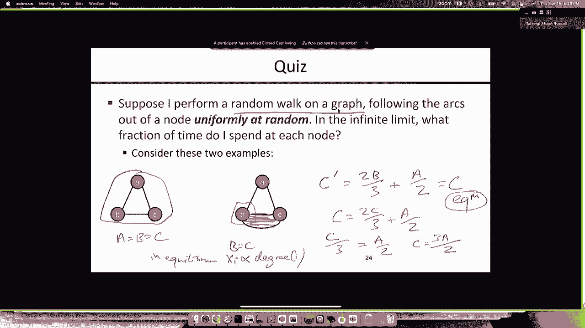

实际上我们要做一个叫做马尔可夫链的，蒙特卡罗算法，它们是一系列算法，有很多，很多，我们将要研究的基本思想的许多变体，一个叫吉布斯取样的，这对贝叶斯来说特别简单，渔网，嗯，那么。

马尔科夫链蒙特卡洛这个名字是什么意思，所以马尔可夫链意味着选择下一阶段的状态序列，根据随机过程以先前的状态为条件，什么是蒙特卡洛，它是摩纳哥一个非常昂贵的城市，看起来这个地方很酷。

但你必须有很多钱才能去那里，更不用说住在那里了，但它很可爱，嗯，但在计算机科学中，这意味着一个通常不必基于采样的算法，但通常基于随机抽样，并被允许产生错误的答案，然后你试着弄清楚。

