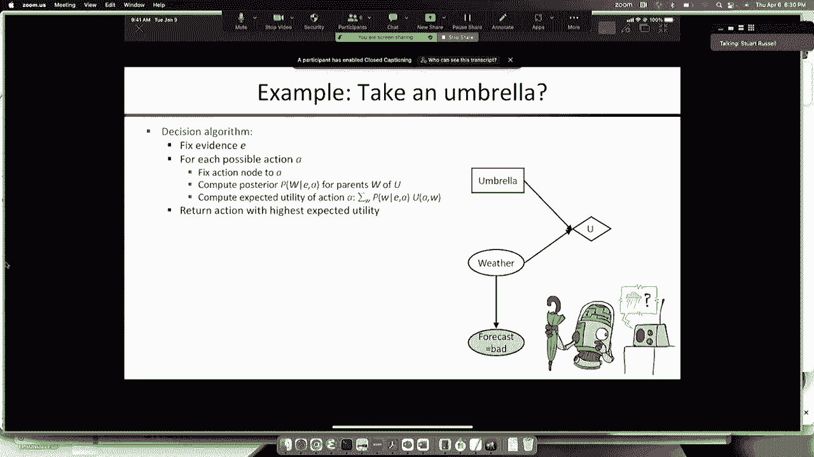

# P23：[CS188 SP23] Lecture 22 - Utility Theory, Rationality, Decisions - 是阿布波多啊 - BV1cc411g7CM

好的，让我们开始吧，嗯，所以今天我要讲的是，就像它说的，理性决策，所以我们会明白，实际上这些数字是从哪里来的，我们在MDPS中使用的，比如说，那些奖励的东西是什么，为什么我们要把奖励加起来。

拿预期的奖励，和折现，所有这些东西都是从哪里来的，为什么这样做是正确的，然后我们会看到好的，一旦我们有了这些，我们如何结合，有关奖励的信息，我们称之为带有贝叶斯网描述的概率模型的效用函数，产生决策网络。

它为决策问题建模，并允许您最优地解决它，然后最后一个话题是，你如何决定收集什么证据，这在很多实际情况下都是一个非常重要的问题，就像如果你是医生，你应该对病人做什么测试，嗯，事实证明。

你可以简单地回答这些问题，通过分析决策网络本身，决策网络不只是告诉你提供了一些证据，什么是正确的决定，但它也告诉你获得任何额外证据的价值，你没有的，所以这真的是一件令人惊讶的事情。

所以让我们从公用事业开始，实际上，为什么，事实上，我们需要数字吗，这是个有趣的问题，所以我要做的，对了，那里有两个台阶，正确的一个是为什么它应该有一个实用程序，为什么理性和效用函数之间有什么联系，对。

实际上效用并不是给定的，如果你有一个效用函数，你应该最大化它是，如果你是理性的，你不能逃避这样一个事实，即你有一个效用函数，你应该最大化它的期望值，好的，所以我想这是，这是麦克斯，想要价值最大化的人。

对一只不懂期望效用最大化的兔子生气，所以这些是一些问题，他们从哪里来，我们怎么知道它们的存在，为什么我们要平均他们，这意味着什么，对呀，它必须是可能的，有些人不理智，这意味着他们的偏好。

尤其是他们的行为和选择，不能用效用来正确描述，所以我们在成本函数中使用数字，在搜索问题中，我们在游戏树中使用数字作为评估函数和终端实用程序等等，但在某种程度上，这实际上是不必要的。

只是为了向你展示这一点，假设这是我的，这是我的游戏树，我有叶节点0，40，20，30，那么零岁和四十岁的人就是零，二三十的最小值是二十，所以它们的最大值是20，最佳动作是这样，假设我把所有的叶子值平方。

结果是零，一千六百四百九百，如果我再做同样的事情，零和1600的最小值是零，民四百九百人、就是四百人，然后0和400的最大值是这个选择，价值四百，所以如果你想想，如果我平方这些数字，它会改变吗。

左边的树里有数字吗，这样当我把它们平方的时候，我在右手树上得到了不同的决定，对不对，因为这里重要的是相对排名，如果我平方一些数字，这些数字的相对排名不会改变，如果我把它们切成正方形呢，如果我把二乘x呢。

或者如果我取log x，只要我做一个单调的转换，这就是单调的意思，在某种意义上是的，数字的排名不会改变，因此，任何单调变换都保持最小最大树中的最优决策，好的，所以其实，数字无关紧要，对呀。

我可以把这些数字换成，这是最低的，这是第二低的，这是第三低的，这是第四低，所以这有时被称为序数效用，所以auto在拉丁语中是等级的意思，如此有序意味着这只是真的，这只是一个排名，它没有附带定量信息。

那么现在会发生什么，如果不是极大极小树，我有一个预期的最大树，所以现在我得把所有的东西都擦掉，但我刚刚做到了，所以我会再做一次，好的，所以想象每一个都是一个机会节点，或者五五开的硬币，好的。

所以这些的平均值是20，这些的平均值是二十五，然后最大的是两个五，麦克斯会选那个，如果我平均平方版本，那么这些的平均值是八百，平均是六百五十，Max会选这个值800的，所以现在通过平方。

我从根本上改变了决定，所以如果你通过数学，如果模型中有机会节点，那么总的来说，你唯一能做的转换是线性的，必须有一个正线性变换，我应该说，对如果你，如果你把顺序翻到一起，你显然会决定。

但是任何正线性变换都将保持顺序，所以如果你想想货币，比如说，对呀，如果一件事比另一件事更值钱，那么它以英镑和比索计算就更值钱了，和所有其他货币，对呀，这些都只是货币尺度上的线性变换，嗯。

所以这意味着什么，至少达线性变换，你别无选择，你必须用数字来描述结果的价值，如果树中有机会节点，好的，所以理解不确定性是至关重要的，这里的概率不确定性，这使得我们需要数字来描述欲望，不仅仅是排名。

效用是一个术语，所以它实际上可以追溯到，我想丹尼尔·伯努利，如果我没记错的话，有一大堆伯努利人，很难把它们都保持直，Bernoulli随机变量是值为零和一的随机变量，但我想那是不同的。

我想那是雅各布·伯努利，丹尼尔·博诺伊发明了公用事业的概念，他想做的实际上只是分开，所以在他发明效用这个概念之前，人们有期望值的想法对吧，他们会用它来，比如说，分析赌博游戏并说，好的，如果你在玩扑克。

期望值，你知道多画一些牌，如果你在玩轮盘赌，这是吗，把所有的钱都押在黑色上的期望值，这就是，但事实证明，金钱和效用不是一回事，他发现这一点的方式，他只是做了一个小小的思想实验，他说，假设你是个商人。

你资助了一次探险，就像他们在欧洲所做的那样，在那些日子里去掠夺一些其他地方的货物对吧，你们的船经过这里收集了大量的金银，让我们说，你在这次探险中投入了很大一部分毕生积蓄，就像人们一样。

现在你必须做出正确的决定，你可以付一艘船的钱把它都带回来，或者你可以付两艘船的钱，每一个都会带回一半，好的，那更贵，但是当你看船的概率，让我们说，任何给定的芯片都有30%的机会回不来，一点都没有。

所以如果你把你所有的金银，所以说，尽管就总的运输成本而言，它更便宜，把它放在一个芯片里，你宁愿拿回你一半的金银，也不愿以30%的概率失去所有，尽管它更贵而且，所以他说，好的，这里发生了什么事，对呀。

因为如果我只看预期的货币价值，用一艘船装运比较便宜，任何给定的船都有同样的沉没机会，所以实际上预期的货币价值更高，如果我把它放在一艘船上，但他和很多商人谈过，他们都说，哦不，把它放在两艘船上，对呀。

为什么好，我们谈了更多，他们说看，因为这是一大笔钱，对呀，我将获得百分之一百的利润，如果这东西回来了，如果它的一半回来了，我赚了百分之五的利润，是的，我超级富有，从超级富有到，你知道的。

两倍的超级富豪不值那么多，但从身无分文，如果这些都没有回到超级富豪手中那就太好了，所以他认为一个人体内有某种东西，关于给定的状态有多有价值，不管是什么，钱的数量不是线性的，对因为你知道。

有百分之一百的利润不是有百分之五的利润的两倍，所以这对1720年来说是一个惊人的洞察力，有一个潜在的心理变量的想法，衡量一个国家或前景的好坏，数学洞察力，我想说心理洞察力。

因为在那之前没有人考虑过里面有不同于金钱的东西，那是在外面，当我们考虑公用事业的时候，例如我们，在我们的游戏建模中，比如国际象棋等等，有输有赢，我们只是把数字归因于输赢。

但当我们谈论现实世界中的真实事物时，不只是来，具有现成的价值，比如说，你知道的，是不是有更好的，有两倍的好吗，双勺，或者一勺，或者你知道，一个勺子比空蛋筒好多少，那是主观的事情，事实上对我来说。

双勺冰淇淋太多了，几乎没有额外的价值，事实上，这是一种痛苦，因为我得把剩下的冰淇淋送人了，或者把它舀下来扔掉，所以说，嗯，所以这些是内在的主观量，但如果你是理性的，这是很酷的事情。

如果你在方式上是理性的，你做你的决定，我将解释我所说的理性的确切含义，在两个选项之间的首选项中，那么我可以把你描述为有一个效用函数，对，事实上我可以想出什么，它至少取决于那个线性变换。

通过问你问题或做实验，好的，这是真的，即使你只是一个查找表，所以即使在你的内部处理中没有任何地方，有没有类似数字的东西，我仍然能弄清楚你的效用函数到底是对的，你的决定在优化什么，假设你的行为是理性的。

所以这是从外面看的，如果我在计算人们的效用，但也有这样的想法，使用实用程序来设计，我们创造的人工智能系统，优化效用函数的AI系统，然后我们硬连线这些实用程序，所以我们，事实上。

我们可以很容易地证明这是定义任何任务的完全通用的方法，只是定义效用函数是什么，从那开始，我们将要创造的优化机制实际上产生了最佳行为，可以是任意复杂的权利，例如，我可以，我只能说好，这是国际象棋。

这是将死，将死是加一，你将死，少了一个，你走右边，可能需要很长时间才能弄清楚，但会产生最佳行为，最佳行为是非常复杂的，对吧，是十比三十还是十比四十，在游戏树中可以有不同的选择，我们简单地通过，你知道吗。

给你一个关于效用函数的一句话描述，所以这是一种非常简洁的说法，我们想要一个人工智能系统来做，我们已经看到了定义成本函数的例子，目标状态，游戏的终端实用程序，为MDPS发挥奖励功能。

这些都是定义效用函数的特例，而且通常，这太多了，定义效用函数要简单得多，而不是指定代理应该如何行为，有些情况是不真实的，对所以如果，比如说，如果我在造一辆自动驾驶汽车，我可以写个规则说，你知道吗。

如果你在红灯处，这就是你知道的，这是一个相当简洁的说法，我只是把它作为一种反射，那是部分保单，这可能比说，你为什么要停下来，因为如果你不停下来，你至少会得到一张罚单，你可能会导致撞车，你可能会杀人。

所以这就是为什么你应该停止，所以效用函数会描述杀人和买票的不可取性，而政策，至少在那种情况下很简单，不要闯红灯，话虽如此，我描述的是我们所说的人工智能的标准模型，我们指定目标，这就是我们一直在做的。

整个学期，成本函数，目标，奖励功能，等，嗯，事实上，在现实世界中，这是不可能的，对，因为我们无法解释，在许多情况下，我们甚至不知道任何特定的未来的可取性是什么，所以这是题外话，所以在过去的十年里。

我的大部分工作都很好，如果我们不能正确地做到这一点，我们最好不要这么做，因为如果我们做错了，我们的人工智能系统非常擅长优化我们给他们的错误东西，那么我们就输掉了宇宙的国际象棋比赛。

我们不想输掉宇宙的国际象棋比赛，我们想确保人工智能系统自己表现，所以你实际上必须在明确的不确定性下构建它们，这样我们就不用硬接线了，我们实际上在某种意义上确立了人类效用的先验，然后系统必须学习更多。

以便对我们有所帮助，但这是另一个学科，将是人工智能的新模式，你可以在第四版的教科书中读到，好的，所以你可以想象对，一旦你有了公用设施，然后你可以把它们放在呃，在期望最大树中，对呀。

所以这是他得到双勺的一个缺点，就是它可能，整个东西可能会掉下来，然后你会很不开心，但至少这个探员更高兴，如果他真的得到了双独家新闻，他喜欢它胜过一勺，那么我们如何开始建立效用理论，对。

我们所说的理性是什么意思，这就是所谓的效用理论，对呀，在效用理论中，有两个基本的东西你可以选择，这里有奖品你肯定会得到的东西，还有你可以选择参加的彩票，然后彩票有可能会发生什么，结果你会得到什么。

彩票的结果可能是奖品，也可能是另一个彩票，所以彩票和奖品，所以奖品是原始的东西，彩票是对奖品或彩票的概率分布，和钥匙，关键的想法是你在这些东西之间有偏好，所以你在奖品之间有偏好。

然后你还可以在彩票和符号之间导出首选项，我更喜欢A而不是B，我们就用大于号吧，所以这不是，这并不意味着A是一个数字，B是一个数字，数字A不比数字B大，这只是意味着我更喜欢这个物体，你知道的。

香蕉和橘子之类的，或者苹果香蕉，a和b对，我喜欢苹果甚于香蕉，所以在课本上a是a大于b，它是一个比那样大的卷曲，但我不能为了我的生命，获取一个PowerPoint来产生一个比这样大的卷曲。

我决定用更大的N，然后冷漠意味着，我不在乎对吧，这就是这里的符号，我真的不介意，这两件事中的哪一件，我做对了，类似的东西，好吧嗯，所以这是一种，你知道，图示视图，对，奖品只是一种原子的东西。

然后彩票是一个概率选择，这将会发生概率p你会得到一个，概率1减去p你会得到b，所以当我们谈论理性时，这实际上与你决策的合理性无关，但实际上只是你的喜好，我只给你两个选择，你可以拿着这个。

所以你可以拥有这个，我们只是要坚持这些偏好，你已经遵守了一些合理的限制，因此，所有这些约束中最直接的一个被称为传递性，听起来就是这样，如果我更喜欢A而不是B，我更喜欢B而不是C，那我最好选A对C。

所以听起来很直观很合理，好的，但实际上有一个非常有力的理由来解释为什么这是合理的，原因是如果我有不及物动词的偏好，这意味着A比B大，b比c大，但是c比a大，这有点，你知道违反直觉，但我现在可以想象。

我喜欢，你知道你带给我，你知道香肠披萨，我说你知道吗，我真的更喜欢菠萝披萨，所以你给我带了个菠萝披萨，我真的更喜欢熏火腿披萨，你给我拿个熏火腿披萨，你说我真的很喜欢香肠披萨，所以你在这个圆圈里转来转去。

和那样的人打交道有点烦人，嗯，但如果你真的喜欢，香肠追求熏火腿，然后就可以了，你应该愿意付给我至少一便士让我，你知道做开关，对呀，所以你去吃披萨，你更喜欢，但你至少要花很少的钱，好的。

但是如果你有不及物动词的偏好，然后你为环路上的每一个开关付钱，好吧，所以我只是开车带你绕着这个循环无限次，你每次都付钱给我，直到你没钱了，所以说，所以有不及物动词偏好的人，可以被迫放弃任意数量的效用。

好吧，所以论点是，这根本不合理，因此有不及物动词的偏好，还有其他几个公理，它们都有一个特点，你可以，你可以想出论点说得很好，如果你不遵守这个公理，我可以让你做一些可笑的蠢事，和，因此，有偏好是不合理的。

违反公理的，好的，所以很快，对呀，所以秩序说你必须做出正确的选择，你要么喜欢a而不喜欢b，要么喜欢b而不喜欢a，还是你对两者漠不关心，好吧，你不能，你不可能不处于这三种态度中的一种，好的，传递的。

我们已经做对了，连续性说b在a和c之间，和你的偏好排名，那么A和C之间必须有一些抽签，其中A和C的彩票在你的偏好排名中相当于B，好的，你知道，如果你如果你违反了，然后我可以简单地写节目，事实上。

你违反了传递性，或者我可以从你身上吸钱，可替换性表示如果我在a和b之间无关紧要，那么我应该可以在任何彩票中用A代替B或用B代替A，所以如果A出现在彩票中，对了，这是一个带有C的彩票。

然后我可以用b代替a，我应该对我是否和一个，或者用B抽奖，然后单调性说如果我更喜欢A而不是B，那么只要概率p大于q，对呀，我更喜欢有更高概率的彩票，发生概率较低的，好的，所以这些都是完全合理的。

如果你违反了它们，那我就可以任意让你做傻事，所以这些公理的结果是，如果你用你的偏好满足这些公理，那么我可以把你描述为有一个效用函数，即使你不知道什么是效用，或者你的大脑里没有任何数字设备。

任何你仍然可以描述为具有效用函数的东西，并在任何彩票中最大化该效用函数的期望值，好的，所以这个，这个定理部分是由拉姆齐发展的，他是1931年的哲学家，但效用理论的圣经是冯·诺依曼和摩根斯坦，他们出版了。

这就是冯·诺依曼，我们都在计算机中使用的冯·诺依曼体系结构，和一堆其他非常神奇的事情，所以这些通常被称为m公理中的v，冯·诺依曼与摩根斯坦公理，所以他们证明如果你满足这些公理，然后有一个实值函数u，呃。

如果a的u大于b的u，那么这意味着你更喜欢A而不是B，和彩票的效用，是彩票中奖品效用的期望值，所以你在你身上，因此，你是一个预期的效用最大化者，如果你是理性的，所以这个效用函数，正如我所说。

只存在于正线性，或者从技术上来说，这是一个正仿射，如此线性和仿射，它们听起来是一样的，但是仿射意味着线性变换，加上一个常数，只要它是，只要线性变换，一部分是积极的，那么你就保持了奖金和彩票的排名。

所以你不能真正恢复某人的效用函数，我不能说，好的，你知道，戴夫对苹果的效用正好是两个，一点六，对呀，那并不意味着什么，好的，但你可以说说相对排名，你知道你知道什么，如果我如果我在，你知道的，五成苹果。

百分之五十橙色，相对于30%的苹果和70%的橙子，他是如何给这些东西排名的，这样我就可以恢复足够的信息来预测他在所有情况下的行为，嗯，所以另一个轻微的题外话，对呀，那有什么关系。

为什么我们不能恢复绝对效用值很重要，有人能想到我关心绝对效用值的例子吗，而不仅仅是某人的那种，某人的内部排名和他们的线性尺度，就像它一样，如果我宁愿为一个人做决定，我在为两个人做决定，我想说，比如说。

好的，我会公平的，我要做出选择，使这两个人的效用之和最大化，我不能把水电费加起来，除非它们在同一尺度上，对呀，所以说不好，嗯，你知道，我是戴夫，他的音阶从你知道的零到一，这是玛丽，她的体重从7到59。

对因为那样，或者你知道，不管有什么选择，我做，你知道的，玛丽的人数总是比戴夫的人数多得多，我总是会做出让玛丽高兴的决定，可怜的老戴夫他的，你知道的，因为他是，他的音阶不对，对呀。

可怜的老戴夫的兴趣被完全忽视了，所以这是一个真正的问题，实际上困扰着哲学家和经济学，很长一段时间，经济学的一些分支提示，在美国更常见，简单地拒绝有任何方法可以与人的效用进行比较的想法，比额表，事实上。

如果你听说过箭头不可能定理，所以箭头不可能定理说基本上在那里，没有合理的方法来结合个人的偏好，对呀，没有规则，实际上满足一组合理的属性，但他证明了那个定理，这是一个非常著名的定理，他因此获得了诺贝尔奖。

他是一所大学的教授。他是帕洛阿尔托初级学院的教授，嗯，穿过海湾，他们穿红色衣服的那个，他在证明这个定理的论文开头说，1。我认为这是不言而喻的，不可能进行人际间的偏好比较，当然，如果你不愿意做任何。

你知道愿意，有没有说过有什么方法可以比较戴夫有多喜欢某样东西，玛丽有多喜欢它，那么你当然无法汇总他们的偏好，因为你知道一个可能会比另一个喜欢它一百万倍或更少，你不愿意说哪个是哪个是对的，所以这意味着。

如果杰夫·贝佐斯的私人飞机还要多等一微秒，没有办法说这比你知道的更好或更坏，玛丽看着她的孩子饿死了几个月，根据箭头，一个可能比另一个更好，那一个可能是，谁也说不清，这不是制定正确公共政策的基础。

但事实上，这是许多美国公共政策的基础，你不能，你不能做那些比较，所以你可能会说，不过没关系，政治够了，嗯，所以这是一个很大的痛苦，对呀，至少从做实验中，你不能恢复任何绝对意义上的效用数字。

一个解决办法是说，好的，嗯，每个人的音阶都从零到一，就像我们说的，你知道的，温度从摄氏零度到100度，以此类推，所以你只要把一个秤，然后你就完蛋了，嗯，但你当然知道，我想我们中的一些人是僵尸。

也许你们中的一些人是机器人或人工智能系统，对，你根本没有秤，你的刻度从零到零，因为你没有任何主观经验，好吧，所以这并不完全简单，我有四个孩子我觉得他们的实用尺度很不一样，我的一个孩子很坚忍，你知道的。

即使在他很小的时候，你知道，如果他弄断了脚趾，他不会哭的，你知道他对此很不高兴，但他只会处理它，你知道，另一个孩子会，你知道雨滴落下，就像，我的天啊，这太可怕了，所以我认为人们确实有不同的效用尺度。

他们主观上有不同程度的快乐和不快乐，相对于大致相同的刺激，要理性，那么你必须有满足这些公理的偏好，如果您的偏好满足公理，然后你有一个效用函数，不管你喜不喜欢，和你理性决策的原则。

使MEU原则是使效用函数的期望值最大化，好的，我再重复一遍，这并不意味着你在你的大脑中是一个实用概率计算器，对呀，我们确实喜欢很多理性的事情，如果我试图戳我的眼睛，我的眼皮闭上了，我的眼皮不行了。

你知道，预期效用计算，或者小反射不做，计算还是个好主意，闭上我的眼睛，关于我们如何衡量人类的效用，有很多方法可以做到这一点，但最常见的可能是所谓的标准彩票，好吧，它看起来是这样的，对呀，你要。

我们要让你旋转轮子，你知道也许它会以死亡告终，或者也许它不会以死亡告终，好吧，你怎么知道，如果你有轮子就有死亡的机会，把它想象成，你知道的，俄罗斯轮盘赌，你知道的，千管一弹左轮手枪。

你会花多少钱避免那场比赛，你会付多少钱告诉你一些关于生与死的相对价值，为了你等等，所以我们定义，你知道在适当的情况下，你最好的奖品，和最糟糕的灾难，你到底把，这取决于你在尝试什么，你知道。

你为什么要评估公用事业，好吧，如果我是，如果我想评估公用事业，你知道，airpods，然后我可能会看看，你知道吗，绝对卷，AirPods的罗伊斯或兰博基尼，与完全没有AirPods相比。

那些将是最好的和最坏的，我在看你有多看重，AirPods的中间品质对吧，但如果我在想，你知道吗，我们应该截掉你的两条腿吗，因为你知道你有一些真菌感染，或者一些最终可能会杀死你的东西。

那么最好和最坏的都是，你知道死亡，或者你知道最好的对不起，最好的情况是你从真菌感染中恢复过来，你保持你的腿，最坏的情况是死亡，你知道在两者之间的各种其他选择，这样医生就可以帮你做出决定。

你是否愿意冒着死于真菌感染的风险，或者截肢，所以合适的比例将取决于，我们在这里讨论的是什么样的决定，所以我们想知道，好的，与某个特定对象相关联的实用程序是什么，就像，你知道的。

你可以在街上买到的20个山寨AirPods，就在那里，那些在刻度之间的人在哪里，你知道的，AirPods的兰博基尼，根本没有AirPods，所以基本上你只需要设置一个选择，你调整这个标准彩票中的概率。

在上面和下面之间，直到你对两者漠不关心，所以如果我想知道什么是，五十元对你有什么用处？那是一个，这个问题的答案千差万别，为穷人，五十值很多钱，对于杰夫·贝佐斯来说，甚至不是在四舍五入的时代，所以我。

所以你得到了非常不同的答案，所以你只要计算出p的概率，你对这种标准的彩票，我们试图评估的对象，好的，然后概率p，如果我们把你的顶部设置为1，你的底部设置为零，那么你无动于衷的概率，是所讨论的对象的效用。

所以调整彩票概率，直到我们无动于衷，然后得到的概率是，事实上，如果你拿零一刻度，效用，所以对大多数人来说，事实证明，你需要把死亡的概率降低得很低，你知道的，使它等于50美元，所以就在这里。

如果你认为零点，零，零，零一，那是百万分之一，所以我愿意花50美元来避免百万分之一的死亡机会，这是相当恒定的，你知道的，在美国中产阶级中，欧洲中产阶级，你可以从人们的行为中看到，对呀。

他们会多花多少钱买一辆在其他方面都一样的车，但安全多了，对呀，嗯，还有其他各种各样的东西，你所知道的，如果你必须支付一些健康干预费用，你会付多少钱等等，等等，所以这是一件相当持续的事情。

这些数字被政府使用，像你知道的那样选择公共政策，我们应该在这个十字路口放一个交通灯吗好的，修交通灯要花我们八十万美元，平均来说，我们希望它能节省，你知道的，每十年零点二十条生命，或者类似的东西，好的。

然后你必须做这些计算，如果你是一个政府，有点不愉快，但你在为人们做生死决定，所以你必须弄清楚什么是正确的权衡，所以我说，从示例中，与贸易船只，金钱和效用不是以线性方式表现的，好吧嗯。

所以当我们谈论给定数量的钱的效用时，这样想实际上是不正确的，作为，嗯，你知道那袋钱的用处，对呀，它是在拥有一定数量的钱的状态下的效用，所以如果我已经有一百万美元了，这袋的效用。

你知道一千美元基本上是我想说的是，拥有一百万和一千美元有什么用处，好吧，如果我有一千美元，那么我的意思是，那一袋钱的效用就是拥有两千美元的效用，好的，所以好好想想这些美元数额。

应该被视为你将拥有的财富总额，我们有时很懒，我们只是说，好的，你可以这个概率你得到五美元，这部分你答对了三美元，对于少量的钱来说，没关系，因为相对于你的财富来说，这是非常小的一笔钱。

我们假设事物是线性的，所以忽略基本水平是可以的，但对于任何大量的东西，你都必须注意，基础水平是什么，所以我们要区分期望效用和期望值，彩票的货币价值，所以如果彩票有两个结果，概率p i得到x。

概率1减去p i得到y，那么预期的货币值就是PX，加一减去py，好的，这些是美元价值，但是彩票的效用权是概率p乘以，拥有X的效用，概率1减去p倍，拥有Y的效用，好的，和，效用与金钱无关。

那么这些就会彼此不同，当你看实验的时候，你可以问别人，我马上就去做，你可以要求人们做出选择，对呀，你想买这个彩票还是这个彩票，你宁愿，你知道吗，千分之一的利润，你所有的目标都有七分的概率回来。

还是你宁愿，你知道吗，你一半的目标回来的概率是7，然后所有这些都以概率点4回来，九，或者任何它是对的，所以当你做那些实验的时候，你实际上会发现这种看起来像对数的曲线，事实上，对很多人来说，很合身。

一定数量的财富或一定数量的年收入的价值，在数量上是对数的，这在很多人和相当大的范围内都是相当一致的，所以真的，如果你想把钱看作是一种效用，你应该考虑数字的数量，所以这才是最重要的，一些零，事实上。

你知道的，华尔街的人就是这样互相交谈的，比如你今年做对了多少个零，不是多少钱，但你身上有多少个零，你今年的收入，这有非常重要的后果，这就是所谓的，这就是所谓的风险厌恶，对呀，所以说，嗯，因为它是对数的。

对呀，我永远不会玩双倍或退出它，所以我想，你知道吗，掷硬币的双倍退出，如果它出现了头，你得到双倍，如果它是反面的，你失去了你投入的东西，所以因为翻倍的价值永远不会是原来赌注的两倍。

那我永远不会玩双倍或退出，因为我不喜欢冒险，事实上，所以风险厌恶就是风险厌恶的定义，的效用，任何彩票的效用都小于收到，彩票的预期货币价值，所以你总是这样写，要么加倍，要么放弃，我会一直，我宁愿有赌注。

也不愿失去它或加倍它的机会，所以我们现在要做这个实验，对呀，我要说，我不会把你的钱拿走的，对吧？所以你有，嗯其实，我要把你的钱拿走，所以我给你一个选择，有一个抽奖，你去Aossa硬币，如果是头。

你得到一万美元，如果是尾巴的话，你什么都没做对，但你得付彩票的钱，好的，所以问题是你会花多少钱买一张彩票，好的，所以我想让你考虑一下，你自己，不是某个武断理性的人，你现在的处境，你知道的，想想你的房租。

你知道你需要给你的伴侣买，生日礼物，以及你的货币财务状况中发生的所有其他事情，好吧那么谁愿意付钱，我是说报酬，就像，给我写张支票，愿意出一千美元，有机会参加这次抽奖，一二，好的，所以全班有两个，好的。

很明显你们不喜欢冒险，因为期望值彩票是五千，你们中的大多数人不愿意支付1000英镑来获得5000英镑的预期回报，对呀，原来是你，你们真是非线性，就可以了，这实际上是相当典型的每年相同的结果，嗯好吧。

谁愿意付五百，我希望出价一千的人都会同意，他们也愿意一二三三，是啊，是啊，好的，谁会是四四，好的，愿意出一百，好的，几乎你们所有人，不是每个人，但几乎所有人都愿意花一百美元，好的。

很好所以如果我要这么做，你知道也许更小心一点和更多的人对吧，我们可以开始绘制效用曲线效用与金钱，你知道的，伯克利计算机科学本科生平均，对，还有一些，可能有一些变异，但如果我们把你当成一个类别。

所以我们可以很容易地画出你的效用曲线，所以有一个有趣的产权，钱的数量，所以这种确定性有时相当于彩票的现金，是现金数额，对呀，嗯，这样你的现金数额和彩票就不同了，对呀，所以我们确定了这堂课，有点像。

我不知道，平均是375左右，也许你们中的一半会付375英镑，参加一个预计价值5000英镑的彩票，所以这很有趣，对吧，所以换个说法，为了避免彩票，所以如果你处于面临彩票的状态。

你会付出相当多的钱来不面对彩票，对，事实上这叫做保险费，这是五千这是三百七十五，对呀，所以为了摆脱彩票，看来你要花四千块才不会中彩票，一定要拿到你的钱，好的，嗯，所以这真的很有趣，所以说。

也就是说如果我能帮你摆脱彩票，我可以赚很多钱，所以如果我不像你那么厌恶风险，减少风险的一个方法是我为成千上万的人做这件事，好的，因为每个人都在这里面，你知道这个彩票有一个大秋千，对呀，我赚了很多钱。

否则我就失去了一切，而如果我平均拿一千个人来说，那么刘的大量数字表明，我基本上可以收支平衡，我得付钱给一些人，我什么都不用付，所以我基本上会打破，即使有很高的概率，但你们都付给我保险费来摆脱彩票。

所以彩票是，你知道的，你的房子会被烧毁吗？你会过早死去，让你的配偶和孩子一贫如洗吗，对呀，你的生意会被黑吗，一群网络罪犯，你会倒闭的，这些是我们参加的彩票，然后人们支付保险费，从彩票中解脱出来。

得到一些与之相当的东西，所以它实际上会在这两件事之间的某个地方，对吧，事实上，因为保险公司之间的竞争，它会更接近，会比全部的价差小得多，但这就是保险业存在的原因，因为这种风险厌恶，你可以，你知道的。

你可以测量它，了解人们会如何行为，还有一点，那就是当人们在经济上真的有困难的时候，他们负债累累，没有希望摆脱它，他们开始容易冒险，对呀，他们开始做一些事情，比如买彩票，因为到底是什么权利，我已经。

我已经欠了一百万美元的债了，你知道，所以要背负一百万美元的债务，如果我至少有机会中彩票，摆脱债务，那我就开始做，所以你开始，对那些负债累累或已经面临其他问题的人来说，事情是行不通的，非常严肃的彩票，嗯。

所以其他几点，然后我们将继续讨论序列和奖励，等等，所以重要的是，在很多情况下，嗯，你被要求做出决定，但你没有，太复杂了，或者你没有足够的知识，所以一个很好的例子是投资，所以你有，我可以投资这个共同基金。

这个共同基金，共同基金，我可以买那只股票，我可以买这个债券，我可以买那个货币期货，这些都是我可以做的可能的投资，嗯，但是，我不能很容易地计算出，每一个都会产生，这样我就可以去问专家了，嗯。

给我一个估计的效用的投资，专家离开做专家做的事，他们编造数字，他们回来了，他们给你这些数字，好的，所以每一个都是真实的近似值，真正的价值，你是否让我们把它看作是预期的货币价值。

或者你可以把它想象成你知道的，如果这些是大的波动，那么你应该把它看作是预期的效用，所以你把这些评估做对了，我给他们戴上了小帽子，因为这些只是，价值估计数，所以HAT是一个符号。

我们在统计学中用来表示对某个真实潜在量的估计，所以他说，好的，以下是K项投资，这里是这里是我认为的价值，然后你你选择最好的似乎是合理的，所以即使这些估计是无偏见的，你不会做什么，你觉得，你不是。

你知道的，因此，对这项投资的价值有一个无偏的估计V星，但如果你选择了投资，你的预期回报不是V星，对，这有点违反直觉，对呀，但实际值是期望值，从最好的选择将大大低于估计，即使该估计单独是无偏的估计。

那为什么，所以最简单的思考方法是假设，事实上，它们的价值都是一样的，你要选哪一个，你对每一个都有无偏见的估计，所以把这些估计中的每一个都想象成，你知道零平均随机噪声添加到它，你要选哪一个。

你要选一个正误差最大的，因为这将是一个最终成为V星的，所以你选择了正误差最大的一个，所以它最终的价值当然会比看起来低得多，好的，所以这被称为决定后失望，好吧，好吧，有时被称为优化器诅咒。

因为你认为你在优化，但你最终得到的总是比你想象的要少，明白这一点真的很重要，事实上，你有越多的选择，决策后的失望就越大，你可以很容易地计算出来，你可以想象所有这些投资选择。

具有真实净预期利润为零的净预期利润，好的，然后估计值被零破坏，平均高斯，噪声标准高斯，然后你看看k个估计值中最大值的分布，你可以在书中计算，它向你展示了如何计算k个随机变量的最大值的分布。

所以如果你有30个随机变量，最大值的分布是这样的，所以其实，通常你知道的，你会想你会得到正二，而事实上它们都值零，所以你有越多的选择，就越有可能，它是这些选择中最好的在估计值中有很大的正误差。

这是非常重要的，因为共同基金公司做的一件事是，他们有一大堆共同基金，他们退休了，那些做得不太好的，所以当你看到他们出售的共同基金时，他们似乎都有很好的回报，但这些返回只是零点上的随机扰动，对呀。

他们只是碰巧摆脱了，那些碰巧回报不好的，所以通过选择最好的一个，你几乎可以保证，那个，你赚不到百分之八或百分之十二，该基金在前几年所做的，这实际上是一个骗局的基础，你把选股送到，你知道的。

一千二百四十四个人说买这只股票，对其中的512人来说，你说他们中的一些人说买，有人说他们中有512人，他们有权利，好的，然后你说嘿，买这只股票他们选对了256只，然后是那二百五十六人，你说。

买这个股票的权利，对其中一半来说，他们获利了，好的，所以在这个十轮之后，有一个人，你已经连续给了他十次惊人的股票选择，现在你说，好的，投资看，我已经给你选了十只股票了，他们都是正确的，现在。

我在我的基金里投资了十亿美元，他们说，哦耶，当然啦，是啊，是啊，你显然是个选股天才，所以你必须时刻意识到这些，这是一种选择偏差概率，正确的是，最大化的过程是有效地导致选择偏差，在你可以做出决定的证据中。

任何药物获得批准，它必须在审判中表现良好，但是想象一下所有的药物都是完全没用的，只是碰巧他们中的一些人在审判中表现得很好，他们是将被批准的人，所以现在我们卖这种药希望它能起作用，因为它在审判中奏效了。

但当然效果不太好，对或可能根本不起作用，好的，所以这种影响是绝对普遍的，在任何过程中，从概率分布的顶端选择，你会引入偏见，事实上期望值更差，科学论文也是如此，不会有任何显著的影响。

但该杂志发表的论文显示了显著的效果，所以根据定义，只是挑那些碰巧幸运的，当他们做实验的时候，好吧，还有拍卖，这是一个略有不同的计算，但相同的基本思想，如果你赢了拍卖对，人们出价的价格是真正的价值。

加上一些随机误差，所以如果你赢了拍卖，因为你有最大的积极因素，你估计物体价值时的随机误差，好的，所以它的价值比你支付的要低，即使你付了你认为值得的钱，它的价值更低，所以这是一件很难让你明白的事情。

出于这个原因，拍卖中的理性策略是不要出价你认为它值多少钱，因为你错了，对如果你赢了，你错了，好的，所以你实际上应该比你认为的价值少一点，如果每个人都这么做，然后呢，然后呢，结果获胜者最终得到一个物体。

那大约值他买它的价钱，很好，我喜欢谈论这些东西，所以我没有覆盖我可能打算覆盖的那么多材料，但那很好，这个我想你已经看过了，我想在MDPS的幻灯片中的父母，关于奖励的来源有一点解释，但我想再过一遍。

因为我觉得这应该更有意义，既然我们已经讨论了理性的公理，等等，真的是，这是一个关于理性决定优于序列的额外公理，所以如果你有一系列的奖品，对吗，嗯，你怎么能，你应该如何比较两个奖品序列。

这基本上就是问题所在，如果你的顺序是1 2 2或2 3 4，显然你更喜欢2 3 4，因为每次都更好，但是这对序列呢，对呀，我宁愿零零一还是零一，根据经验，大多数人几乎每个人都会说不。

我宁愿要1 0 0正确，也许有什么东西穿过脑袋，我可能会死在1和0之间，对呀，所以我宁愿现在就有一个，也不愿等到以后，或者你可能会说，嗯，如果我现在有一个，那就给了我更多，我可以用它给自己更多。

选择自由等等，所以有很多争论，你为什么想要东西，宜早不宜迟，在其他条件相同的情况下，所有这些都可以用一种非常简单的方式导出，从另一个理性的假设，称为平稳或平稳假设或平稳偏好。

我想这就是Perron之前给你看的，所以如果我取任何一对序列，一一二，废话废话和b一b二，我准备了一个相同的奖品，c，那这应该不会改变我对这两个序列的排名，所以如果我更喜欢A序列而不是B序列。

那么如果我预先写了一个相同的奖品，它不应该改变排名，好的，如果我更喜欢C A和C B的排名，然后如果我把它移除，我更喜欢A而不是B，好的，所以这是一个非常无害的假设，对，这是一种，你知道在经济学中。

这是衡量你智力水平的一个标准，我怎么能做出最无害的假设，并得出听起来最有力的结论，当然啦，实际上，结论在逻辑上包含在前提中，所以很明显结论并不比前提更有力，但这是它看起来的样子，感觉有多合理。

然后你得到了一些看起来很强大的东西，所以从静止的，你可以证明做出决定的唯一理性方法，序列的效用，是序列中单个奖品值的折扣和，这是一个很好的定理，因为，这种几何折现有很多很好的性质，在伸缩和等等方面。

也意味着，无限序列的和是有限的，以此类推，所以说，这个折扣因子的想法不是我们发明的任意的东西，把数学算出来，但这实际上是这个非常简单的附加结果，这实际上是无害的吗，嗯，我不知道，我不这么认为。

你知道什么是一种方式，你知道的方式，会不会明显违反，如果你对序列的首选项实际上更多地关注序列的最大值，不是序列之和，那么你就会显得违反了平稳性等等，很明显，因为如果你没有违反平稳性，你会是加法的，所以。

有很多心理证据，事实上，那个，序列的最大值在前瞻性或回顾性中发挥着更大的作用，序列排名，和丹尼尔·卡尼曼，他因其中一些作品获得了诺贝尔奖，是伯克利的教授，去了别的地方，你知道吗，当你看着，比如说。

如果我看着，嗯，随着时间的推移疼痛的程度，如果在结肠镜检查中，实际上，就你的观点而言，最大值比积分更重要，或者你是否想再做一次，或者你的回顾展，我更喜欢哪一个等等，好的，所以说。

关于序列上的实用程序的一个有趣的事实，就是，不变性属性比实用程序要强得多，所以这是实用程序的不变性属性，你可以对效用函数应用正仿射变换，你不改变最优策略，显然，如果我申请，如果效用是一个折扣的奖励总额。

我对奖励应用正仿射变换，那么我只是对效用应用一个正仿射变换，所以它仍然适用，我可以做，我可以做那个转变，我不会改变最优政策，但我们能证明的实际不变性比这强得多，好的。

所以我们可以证明你不仅可以做仿射变换，但你也可以添加，对于任何函数，s的phi和s的phi之间的区别，任何phi，我不打算做证明，证据在书里，这又与伸缩总和之类的东西有关对吧，那么给你一些直觉。

我们添加右的函数是什么意思，作为国家的一个函数是很重要的，不是行动，只是状态，所以如果它是国家权利的函数，我得到的额外奖励，绕任何循环都是零，对呀，因为不管这些差异是什么当我回到这个州的时候，我开始了。

我没有得到任何报酬，所以这很好，所以这就是我们所说的物理学中的保守领域，如果你经历一个循环，让你回到同样的状态，你不会增加或失去任何能量，如果你做了。

那么对奖励功能的这种修改实际上会导致您的代理经历循环，以前不会这么做的地方，好的，所以我发现直觉很有帮助，从某种意义上说，你知道，如果你想想我在这种状态，所以说，如果我穿过那个循环。

经过那个循环我什么也得不到，如果我通过这个循环，我什么也没有得到，如果我穿过那个循环，我什么也没有得到，所以从某种意义上说，它不会考虑我去了哪个方向，它不会告诉你去任何特定的方向，好的。

所以在某种意义上它是中性的，但它可以很好地指导你的学习，我马上给你们举一个例子，但你可以这样做有点违反直觉，事实上，我去向彼得·黛安解释了这一点，他是世界上最著名的强化学习研究人员之一，他的反应很好。

那显然是错误的，我给你举个反例，挠了挠头，然后他不能给我一个反例，然后我解释了保守的想法，然后他最终得到了，我还去找约翰骑自行车，他可能是世界上MDPS中最著名的理论家，他是麻省理工学院的教授。

所以我只是告诉他定理，然后他在那里一言不发地坐了大约二十分钟，从字面上看，我就像，好的，我就，他是约翰，他是，他是个非常非常聪明的人，他说，好的，是呀，很明显，无论如何，所以有些人认为很明显。

有些人认为这显然是错误的，但不管怎样，这是一个定理，而且真的很酷，因为我可以用这个，所以这个额外的奖励我们可以，这叫做塑造奖励，我可以用它来鼓励我的系统尝试一些可能很好的东西，有意义的，好的。

所以我不知道对某些问题的最佳对策是什么，但我很确定我想鼓励这种行为，你可以使用整形函数来做这件事，例如，好吧，假设我想训练人--机器人--踢足球，好的，足球比赛的真正奖励是你赢了就得三分，平局一分。

损失为零，我们知道要赢得比赛，你需要进球，所以我们想鼓励团队不仅仅是赢得比赛，但实际上是为了进球，所以我们没有告诉他们需要进球，我们只是，你知道的，如果我们在做强化学习，当他们赢得比赛时。

我们会给他们三分，他们不知道你知道他们应该进球，这意味着它需要很长时间来学习，所以我们会告诉他们进球是个好主意，把这个PHI放入净胜球的一百倍，所以如果你在前面，那很好，所以这是一个高价值的状态。

我们想给你这个权利，我们希望他们把球向球门移动，而不是在错误的方向上，所以我们会鼓励你知道，到球门的距离除以球场的总长度，好的我们希望他们能拿到球而不是一直把球送出去，所以当他们拥有时。

我们会给他们一点奖金，如果我们说，好的，我们要给你一点奖励，一点点，触球的一点奖励，所以这是一项非国家权利，那不是一种状态，那是一种行动权，如果我们说好，我们要给你一点奖金奖励你触球，听起来还算合理。

是的，但这样做的最佳策略是什么，就是站在球旁边高速振动，这样你就能尽可能频繁地触摸它，你得到了所有这些奖励，所以这正是发生的事情，事实上，我有一个学生为足球做了一个模拟器联盟。

他想他会给触球的人额外的奖励，然后球员们就学会了站在球旁边，并以非常高的速度振动，所以无论如何，所以现在你知道了一个非常酷的方法来获得你的增援，学习者学习得更快，它是完全安全的，任何函数都可以。

它不会阻止系统收敛到最优策略，但如果你做了一些合理的事情，会聚得更快，让我们看看，我想我可以覆盖决策网络，但可能不是你如何选择的问题，要掩盖什么证据，嗯，但佩兰可以决定，我下星期二不在。

所以佩兰会继续这个，嗯，我们现在有了效用理论，对呀，我们可以谈论国家的价值观，我们可以讨论选择预期动作来最大化期望值，但所有这些概率都必须来自某种来源，我们知道如何用贝叶斯网做到这一点。

所以让我们试着用一种非常简单的方式把这两件事结合在一起，所以我们从我们的贝叶斯网开始，我们想决定是否需要带伞，去海滩旅行或野餐，和，如果你拿着伞，天不下雨，然后你觉得自己像个白痴，如果你拿着伞。

天真的下雨了，至少你没有淋湿，对，如果你不拿伞，天也不下雨，那是最好的权利，然后最糟糕的是，你不带伞就会下雨，因为那样你就湿透了，所以效用函数是基于这些方面的情况，你知道这一切都取决于天气。

但我们不知道天气会怎么样，但我们可能会得到天气预报，提供一些证据，所以这是一个非常简单的模型，你可以用数百个变量和大量决策建立模型等等，但我们现在想保持简单，所以总的来说，对呀，我们将有两种新的节点。

我们将有动作节点，我们把它画成矩形，和实用节点，传统上被绘制成钻石或含片，嗯，实用程序节点始终是叶节点，在那里我们表示我们的效用函数，但它不会引起任何事情，操作节点总是根节点，还有更复杂的版本。

您可以使操作节点为随机变量的子节点，这意味着你可以做出决定，当你观察到随机变量的值时，但现在我们只说动作变量总是根节点，好的，我们基本上要算法来选择动作，对于你能为那个行动做出的每一个选择。

计算预期效用，考虑到来自贝叶斯网的概率，好的，所以这是一个非常，非常简单和简单的贝叶斯网的扩展来做出决定，好的，所以我们有任何证据，然后我们循环每个动作的动作，我们修复动作节点，所以雨伞。

我们可以接受也可以离开，所以我们尝试这两种选择，给定动作节点有固定值，我们可以计算效用节点所有父节点的概率分布，你不需要计算其他概率，但是您确实需要实用程序节点的父节点的概率，在这种情况下，只是天气。

所以我们只需要天气的概率，不管我们有什么证据，这可能或不可能，可，或可能不包括预测，并可以选择拿走或离开雨伞，在这种情况下，拿或不拿伞对天气没有影响，对呀，所以实际上我们可以向右，在这种情况下。

我们实际上可以摆脱一个，但一般来说，动作会影响效用本身，因为也许行动需要付出一些代价，但它也可能影响效用函数的其他父函数，所以一般来说，它的条件是，然后给出概率分布，通过对随机变量求和来计算预期效用。

它们是实用程序节点的父级，以计算期望，所以这是一个非常非常直观的，正是你所期望的，而且效果很好，这里的关键是，我们可以借用我们已经开发的所有算法，在贝叶斯网中进行推理以计算后验概率。

给定效用节点的父节点的证据和动作，所以让我们在，你知道吗，六点半，好的，我就到此为止，你可以，你们可以自己想办法，我星期二见不到你，帕姆会来看你并看完今天的幻灯片，然后我想在那之后我们将开始机器学习。

周末愉快。

几个问题。

是啊，是啊，好的等一下。

