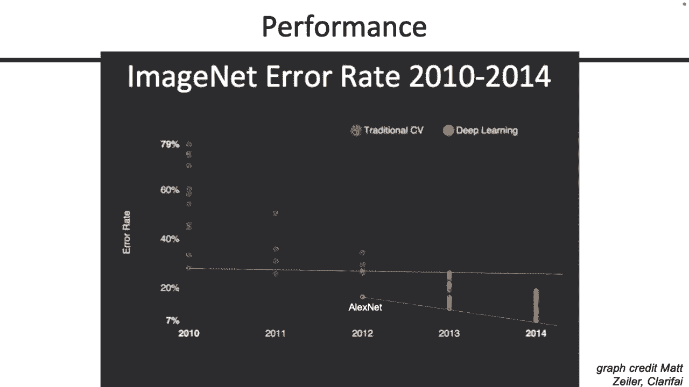
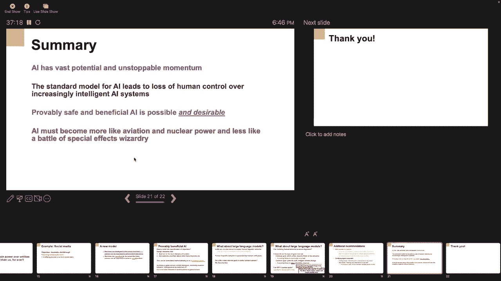
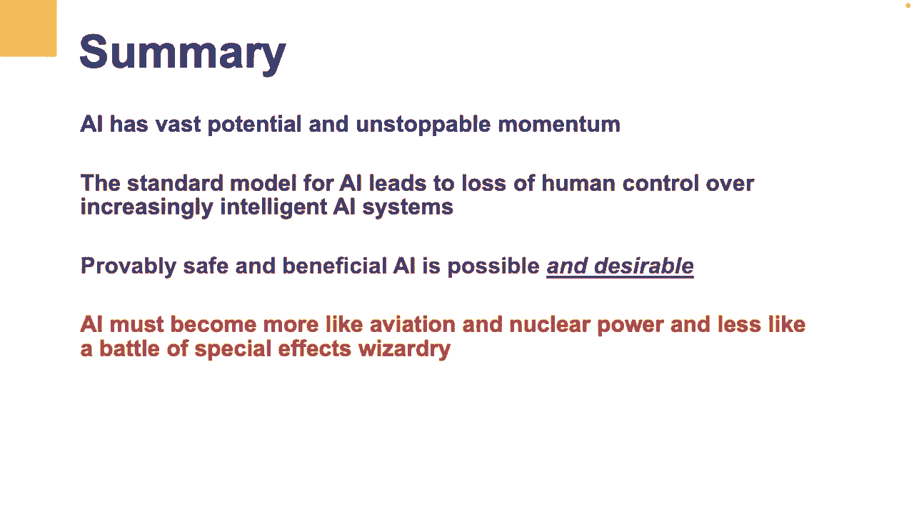
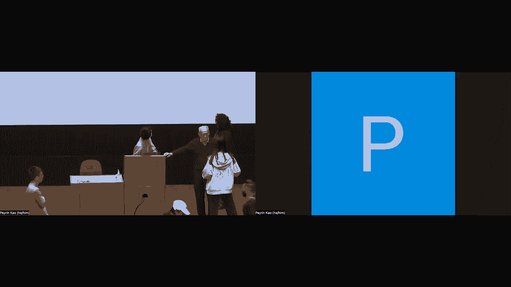

# P28：[CS188 SP23] Lecture 26 - Neural Networks, AI Ethics - 是阿布波多啊 - BV1cc411g7CM

好的，我想我们很好，好的，让我们总结一下上次的神经网络，所以我要跑一小段路，我们从上次建立了神经网络，从我们孤独的小感知器开始建立一些更复杂的东西，然后我们将讨论神经网络的性质，也是人们上次问的问题。

这就是你如何训练这些东西，这些都是我们要看的好问题，所以请记住，从上次开始，这是我们孤独的小感知器，它做了什么，它需要一些矢量化的输入x 1 x 2 x 3，将它们乘以权重向量，把它们加起来。

检查是否大于零，如果是这样，它输出一个，否则输出为零，我们给你看的是，你可以通过以下方法建立一个稍微好一点的感知器，而不仅仅是检查它是积极的还是消极的，你也可以取号码，它是从负无穷大到无穷大的数。

并使用乙状结肠函数将其转换为零到一之间的概率，所以这很有用，现在我们向你展示你的第一个神经网络，这是我们的两层神经元神经网络，是什么使这个特殊或不同于感知器，现在我们要把感知器，把它们锁在一起。

首先我们将输入x 1 x 2 x 3，然后我们将它们作为输入传递到两个不同的感知器，我们将开始称之为神经元，所以这是第一个神经元或感知器接受的，前三个是仅有的三个输入向量值，把它们乘以重量。

然后你得到一些点积，对其应用乙状结肠函数，你得到一些中间输出，那是第一个感知器，但我们把这三个输入，我们把它们乘以三，可能不同的重量，然后我们得到另一个感知器输出，这个我叫H2，因为我的信快用完了。

但是你可以想到这两个输出的一种方式是，它们几乎就像特征，它们以某种有趣的方式将这三个输入组合在一起，您希望此输出可能代表一个特性，或者关于这三个输入的有趣的事情，有一些线性组合，有一些非线性函数。

像一个乙状结肠，这个输出你几乎可以把它想象成一个特性，我们能做什么，如果我们有两个不同的特征，我们可以把这两个特征，把它们做一个线性组合，把它们乘以重量，取一个点积。

当我在最后一个神经元上做另一个乙状结肠函数时，所以我们把这两个特征，我们通过另一个感知器或另一个神经元运行它们，然后最终的输出可能是我们的分类，所以这里唯一的区别是我们取了一些神经元的输出。

把它们作为其他神经元的输入，现在我们有了一个小神经网络，我们要去，挺酷的，然后我们在这里开始做什么，我们开始讨论如何将这些写进方程，所以你可以把它们写成标量，我在这里做的，有点恶心，你不想盯着它看太久。

因为有很多信，但后来我们意识到，我们做的很多事情都像点积，所以也许与其把它们写成这些巨大的标量，我们一遍又一遍地申请，乘法和加法，也许我们可以把它写成向量和矩阵，这就是我试图把它们写成向量和矩阵。

如果你把它们写成向量和矩阵，大部分只是重新安排，所以不要太用力地盯着它，但最终你会在这里得到一些好东西，我们可以有一个向量x的值，乘以权重向量矩阵，为什么这是一个矩阵，因为它有每个神经元的重量。

所以这里我们有两个神经元，每个神经元有三个权重，所以这是一个三乘二的矩阵，你拿另一个点积和另一个权重矩阵，这是代表最后一层感知的，然后你得到一个输出，所以这只是我们操纵这些方程。

所以我们得到了一些更干净的东西，也是，我也应该提到上次的，这些仍然是新的和未经测试的幻灯片，所以有错误，有人要叫我出来，我想可以，然后我们可以开始考虑，这些东西的尺寸是什么，所以我们上次讲到。

你会如何推理这些是什么维度，我想我们上次谈过这个，但一定要阻止我，如果你想看得更近一点，好的，然后我们开始概括，我们说好，你知道吗，没有理由在那里，我们只需要在这个特定的层有两个神经元。

如果我们换三个呢，下面是我们所做的，我们采用了相同的三个输入或三个特征输入，x一x二x三，现在不是把它们作为输入传递给两个神经元，我们把它们作为输入传递给三个神经元，这有点像完全连接。

第一个神经元接受x 1 x 2和x 3，将它们乘以自身的重量，特定于那个神经元的，第二个也一样，我们取三个特征，将它们与第二个神经元的权重相乘，然后传给第三个一二，所以它几乎是完全连接的。

每个输入都连接到每个神经元，然后就像以前一样，因为我有三个神经元，我这里有三个神经元输出，每一个都有一个乙状结肠，然后我几乎可以想到那些像功能，有一些有趣的组合x 1 x 2 x 3。

这可能意味着也可能不意味着有趣或有用的东西，但一旦我有了这三个，我可以把它们作为输入传递给我的最后一个神经元，然后我在最后把它分类，所以不是两个，我们用三个，就像以前一样，我可以运行相同的矩阵向量操作。

但我没有做任何超级有趣的事情，我只是把这种长的粗略方程，然后把它浓缩成稍微好一点的东西，所以他们不必看所有这些，就像有下标的W，我可以写矩阵和向量，挺好的，但是整个方程向量是一样的，它最终仍然是。

我有一些投入，在本例中，输入具有，这是一个三维输入，所以是三个值，我把它们通过一些权重向量，有一些权重矩阵，为什么是矩阵，因为我有多个神经元，每个神经元都有多个权重，这就是我的矩阵。

最终我得到了一些输出，这个输出有点像，第一层所有神经元输出的列表，所以这几乎可以像我的特征向量，一种权利，每个值代表一些有趣的特性，这是我输入的组合，然后我把它通过另一个权重向量，得到一些输出，好吧。

然后我们开始一个接一个地概括，并试图使其尽可能通用，我们开始意识到我们锁定的一些数字，像三和二，它们真的不必是如此具体的数字，他们真的可以是任何数字，所以说，而不是两个神经元或三个神经元。

没有什么能阻止我们在这里有N个神经元，所以现在我们这里有n，没关系，我们可以将相同的三个输入传递给n个神经元中的每一个，现在我们有n个神经元输出，一二三一直到n。

然后我可以把n个神经元输出传递到我的最后一个神经元，做一个有效的分类，所以在这一点上你唯一要改变的是，如果你用矩阵向量表示法来思考这个问题，不是三列权重向量，每个神经元一列现在是n列权向量。

每个神经元一列，但现在有N个神经元对吧，这个H输出是第一层的输出，为什么现在一个接一个，因为它是N个神经元输出的列表，我这里有，所以我把三个概括为一个结束，这是一种有用的，好的。

然后为什么这个也上升到N井，那是因为现在最后一个神经元接受n个输入，所以第一层神经元的N个特征或N个输出，它们成为最后一个神经元的输入，所以最后一个神经元现在需要n个权重，所以最后的w向量有n个权重。

所以我把这三个概括为一个结尾，因为为什么不好，然后我们就越来越一般化了，所以我们意识到，什么都没告诉我，我这里只需要三个输入，我真的可以想要多少就有多少，我的信开始用完了，所以我们称之为x的维数。

但你当然可以在那里挑选你最喜欢的字母，但这个想法是没有理由，这里只需要有三个值，在您的输入中，你的输入可以是一个三维向量，它可能是一个五维向量，它可以像你想要的那么多维度，如果你在想这个。

你所要做的就是，矩阵向量表示法是泛化你的输入特征向量，而不仅仅是三维，或，然而，许多维度，你完全可以概括，当你的输入向量中有更多的维度时，这也意味着你也有更多的重量要处理，所以如果你现在回头看这里。

你有更多的输入向量，也必须有更多的重量，与每个神经元相关，所以这个重量矢量也长高了一点，好的，这只是为了确保尺寸一致，或者另一种思考方式是，你对神经元的输入就越多，神经元的重量就越大。

但是还有N个神经元，就像我们之前说的，然后我们一遍又一遍地推广这个，我们意识到没有理由只有一个输出，您可以有多个输出，它们是什么意思，这取决于你正在解决的问题，但我们也可以有多套衣服。

如果我们有多个输出，就是说在第二层，而不是在最后只有一个接一个的标量输出，我们最后会有一个一个矢量，我叫它暗淡Y，因为我没有信，但你可以叫它别的，我敢肯定有像官方符号或更多的官方符号，人们使用权利。

因为现在有更多的输出，这也意味着必须有更多的重量，在这最后一层，所以如果你回头看之前的照片，我们最后只有一个神经元，所以也许你会有这套砝码，但是现在如果你有两个神经元，你必须有两套砝码。

如果你有一堆神经元，你必须在最后有多组权重向量，所以第二层的w向量也开始变高，所以你调整得越多，尺寸变化越多，我们上次谈过这个，最终你会得到这样的东西，所以如果你有一个两层神经网络。

我们对输入维度没有任何限制，输出维度是什么，然后你会得到这样的东西，所以如果你真的眯着眼睛看或者缩小一点，然后你会注意到第一层发生的事情是，我取一些暗淡的X维输入，我给它加了一些重量。

这意味着我把它通过n个神经元的n个感知器，我得到n个输出，每个神经元一个输出，你几乎可以想到，如果你缩小一点，作为一个暗淡的x维向量，并以某种方式将其转化为n维向量。

您希望捕获初始输入向量的一些有趣的属性，不管这些属性是什么，那些属性是什么，这有点取决于你施加什么重量，但我们会谈谈你如何学会这些，但我们还没有告诉你如何学习重量，我们刚刚告诉你如何建立这样的网络。

然后一旦你有了N个感知器输出，或者第一层的N个神经元输出，你现在可以，然后把它们从第二层塞进去，一次又一次，第二层有多大，嗯，这取决于您发送了多少输入，因为你发送的输入越多，你需要的重量就越多。

这也取决于您想要多少输出，所以你的衣服越多，你需要的重量就越多，所以这一切都取决于对吧，但是你可以调整和缩放这些东西的尺寸，有时当你设计这些神经网络时，主要的挑战是确保你的所有尺寸都匹配正确，例如。

像这个维度最好匹配这个维度，为什么呢，因为我们知道在这些神经元的下面只是计算点积，如果我们计算点积，那么我需要为每个神经元提供暗淡的x个权重，为什么是因为我有MX输入，所以我需要MX重量。

以便使顶级产品工作，所以这是另一种思考为什么这些矩阵维度必须匹配的方式，如果我从第一层传递n个神经元输出，并将它们送入第二层井，那么我第二层的所有神经元最好每个都有N个权重，以便工作产品。

第二层有多少神经元，我每个输出都有一个暗淡的Y，所以我们不断地概括和概括，然后我们开始意识到坚持住，你不一定要有两条链子，如果第一层的输出进入第二层，如果我把原来在这里的第二层的输出。

然后我把它们塞进另一层，所以现在我有两层或三层神经元，我也能做到，如果我进一步推广，我只需要把尺寸弄得更乱一点，就像以前一样，你总是可以把这些写成非常长的标量方程，在那里你要对点乘积做大量的乘法和加法。

一遍又一遍地应用乙状结肠函数，但如果你这么做了，有点恶心，所以我们意识到我们总是可以把它们写成矩阵向量方程，只是为了让事情看起来更好一点，最终在某个时候，事情就变成了一个游戏，确保所有尺寸都对齐。

但是你可以读这个的一种方法是，你把你的输入向量x，它有多少维，只要确保它和你相配，乘以某个权向量或某个权矩阵，这和把它通过这个权重矩阵是一样的，这和通过第一堵神经元墙是一样的，这些神经元都堆叠在一起。

然后如果你在上面涂乙状结肠，所以乙状结肠是看到的，如果我得到这个故事，这里的sigma对应于这里的sigmoid，在这一点上，你有一些中间输出，有时我们称这些隐藏的层。

因为你不会在训练的过程中真正看到他们，但他们就在那里的某个地方，你希望他们在计算一些有趣的东西，所以这个隐藏层对应于在这一点上弹出的值，但在这一点上，而不是把这些传递到我的最后一个神经元去做一些分类。

我要把它们传递到另一堵神经元墙，这堵神经元墙可能有一套不同的权重，就是第二层的w，那些重量是什么，我希望他们能训练出有用的东西，他们给了我一些有趣的输出，但最终我训练举重，我申请乙状结肠。

然后我在这里得到一些有用的东西，我希望这些是有趣的东西，几乎可以把它们想象成特征，在这一点上，我们希望了解到一些关于输入的有趣的东西，通过反复将它们通过如此多的神经元，所以在这一点上。

我们采取了这么多线性组合，输入的乙状结肠应用，这些输出，我希望输入有一些有趣的东西，但他们捕捉到了一些有趣的模式，最终我把它们穿过，就像我最后一个神经元一样，或者我可能有多个最终神经元，如果我想。

最后一个乙状结肠函数，以及如何弹出输出酷，所以如果它进一步推广，我可以写所有这些字母数字和尺寸让形状排成一行，但重要的是我接受了我的意见，我把它们穿过一种神经元的链和壁。

我希望输出最终代表了关于输入的一些有趣的东西，好的，你不必太仔细地盯着尺寸，我不知道他们真的给了你很多直觉，但重要的是，我所做的一切，就是大量的点积和乙状结肠函数的应用，所有这些权重向量和矩阵都是。

它只是确保尺寸对齐，我不必用很长的标量方程来写这些，我可以写得更干净一点，好的，但大部分都是非常奇怪的操纵，好吧，但为什么要停在三点，你不妨去像N层，所以你也完全可以做到，你可以进一步加深这个数字。

所以每次你得到，你知道一堵神经元输出墙，你把它们送到下一层神经元，对呀，所以在这里我会，也许我不知道，和神经元输出，对于n个神经元输出中的每一个，我把它们作为输入发送到N个神经元。

然后每当这些输出一些东西，我把它们作为输入发回下一层，我可以一遍又一遍地把这些锁在一起，我得到了一个更深的神经网络，所以现在我们的神经网络变得更大了，如果我增加更多的神经元，但如果我把更多的层链在一起。

也会更深，但最终如果你放大这些东西中的任何一个，你几乎可以把它想象成一个小感知器在做它的工作，你只是把它们锁在一起，到目前为止，我有没有犯任何明显的错误，或者我应该修复的事情，好的，压力最大的讲座学期。

好的，这是另一张幻灯片，我试图鞭打在一起，总结一下事情，所以如果你只放大其中一层，所以如果你看这里，这真的是很多层链接在一起，但我也可以放大一个特定的层，假设我看着这里的这一层。

我也可以思考其中一层发生了什么，特别是，那么一层是什么呢，只是一堆神经元堆叠在一起，以及进入层的内容，嗯，我必须传入一些输入向量，它有自己的维度，我称之为x的维数，如果x是输入。

所以一些输入进入向量或进入这一层，然后一些输出出来，我希望是Y维的，所以尺寸可能会在某个向量上改变，你最终可能会得到更多维度或更少维度的东西，那由你决定，以及如何设计特定的层。

但是解释输出层的一种方法是，可以说输出层，是层中神经元的数量，输出尺寸，为什么因为如果你回头看，所以看看这个特别好，我有多少输出，我可能有一个，两个，三个输出，这代表了我在这一层有三个神经元。

所以对于每个神经元，我可能会得到一个输出，所以如果我有Y神经元的维度，得到y输出的维数，所以输出尺寸，你几乎可以把它想象成层上有多少神经元，它告诉我我得到了多少输出，我如何很好地将输入转换为输出。

我只需要把它乘以这个权重向量，权重向量可能会改变尺寸，但它到底在做什么，它只是计算大量的点积，每个神经元一个点积，所以它只是很多点积在一起，每一个都可以有不同的重量，但实际上我只是完成了很多点积。

一旦我得到我的最终输出应该是每个神经元一个数字，我必须将乙状结肠应用于该向量的每个元素，所以我只对每个标量数字应用一个乙状结肠，然后我得到一些东西，希望我能把它作为我的输出发送出去。

或者我会把它发送到另一层的输入，但是如果你放大一个特定的层，你几乎可以把它想象成，它把一个x维的东西重塑成一个一维的东西，它是通过计算所有这些点积来做到这一点的，所以有两种不同的方式来看待这个问题。

你可以用图形化的方式来看待它，并考虑输入输出，想想他们是如何穿过神经元的，或者你几乎可以从尺寸和重量向量的角度来考虑它，只要你意识到，正在发生的矩阵乘法实际上只是大量的点积。

其中每个点积对应于我堆栈中的一个神经元，很酷，主要是上次的回顾，但我想把它拿出来，因为我上次有点仓促，这是它的另一张照片，这张照片和你刚才看到的差不多，但我想这是他们以前有的，我试着画我自己的。

但这和你以前看到的是一样的，所以在任何给定的层，所以如果我挑了一层，我看到了什么，我看到我有一些你知道的K维，我不记得他们这次用的是什么字母了，但是我们有一些你知道的输入列表或向量。

然后这些输入中的每一个都进入每个神经元，所以如果我看，我不太了解这里的这个特定神经元，它从上一层获得所有输入，如果我看，我不太了解这里的神经元，这一个也得到了来自前几层的所有输入。

所以这些神经元中的每一个都在计算一个点积，用自己的重量，对那个神经元很特别，以及来自上一层的所有输入，对，最终我得到了一些输出，我得用马刀之类的东西，我们将在下一张幻灯片中讨论，但有另一种方式来看待它。

如果你想进一步推广，但它和上一张幻灯片的图片有点一样，但我不想留下它，以防符号奇怪，但我想你可能会开始注意到，这个符号会变得很恶心，有时有这么多的下标和上标，那种让你的眼睛很痛。

但重要的是你有很多很多的神经元，你用有趣的方式把它们锁在一起，好的，在我们离开这里之前，我还得做一个概括，我们一遍又一遍地使用乙状结肠，但并没有要求我必须使用乙状结肠，所以我们知道乙状结肠是一种很好的。

这是乙状结肠函数，如果我试图输出类似概率的东西，因为它需要任何实数，如负无穷大到无穷大，它输出零到一之间的概率，但那很酷，但是如果你愿意，你也可以使用其他函数，所以你也可以建立一个神经网络。

其中你使用的非线性函数可以像这个tan h函数，它也有一种平稳的向上运动，但不是从零到一，注意这个是从负1到1，相反，如果你愿意，你可以用那个，但你甚至可以用像这样非常愚蠢的东西，所以不用乙状结肠。

您可以用值交换它，Relu是什么，真的只是说，如果你的数字是负数，输出零，如果你的数字是正的，输出数字本身非常简单的函数，所以问题很好，我为什么要用这些，如果我回到这个网络呢，我就像，你知道吗，我觉得。

我要把这些处理掉，就像你知道的，忘了这些吧，我要用别的东西，嗯，如果我那样做会发生什么，如果我们把这些乙状结肠都扔掉，如果你仔细观察这个网络，这个网络是什么样的，一遍又一遍。

这里是x 1 x 2 x 3线性组合的点积，然后我把这些输出，我把它们放在这里线性组合，然后我把它们传递到这里线性组合，我取一个线性组合，如果我做很多线性组合的事情，我把它们组合在一起。

我有什么样的功能，那是一只手吗，你得到了像线性函数一样的权利，所以如果你把很多很多的点积和线性函数一遍又一遍地组合在一起，那么这整个美丽的像神一样复杂的网络你已经建立。

它所能做的就是计算x 1 x 2 x 3上的线性函数，如果你没有这些非线性函数隐藏在里面，那么不管你学什么重量，你只要把x 1 x 2 x 3的线性组合，一遍又一遍一遍又一遍，如果你想一想。

不管你怎么用常数乘以x 1 x 2 x 3，把它们加在一起，你会得到一个加权和x 1 x 2 x 3，所以我们需要在这个网络中有某种非线性，所以我们必须应用函数来做非线性的事情，如果我们应用足够多的。

我们有一个足够深、足够大的网络，然后希望我能学到更有趣的函数，不仅仅是一个纯线性函数，所以这就是为什么我们需要非线性，这里有三个你可以使用的例子，事实证明，你不需要一个非常复杂的，非线性函数。

甚至像你能想到的最简单的非线性函数，它只是说好，台词是这样的，但不是有负数，你知道我要把它砍到零，就像最简单的线性函数，你能想到的最简单的非线性函数，但只要你有足够的它们，它就可以工作。

你把它们堆在一起，但重要的是要有非线性的东西，因为如果你的整个网络只是线性的，那么你所做的一切，你只是拿x 1 x 2 x 3，你只是一遍又一遍地把它们乘以常数，把它们加在一起，你得到了什么。

你只要得到一个加权和，x一x二x三不太好，但是如果你加上所有这些不同的非线性，你可以写非常复杂的函数，这就是为什么你需要某种非线性，但即使我们一直使用乙状结肠和所有的图片，你不必用乙状结肠。

你可以选择你最喜欢的，最后一个对项目有用的注释，有时你看到它，但这绝对是可能不同的事情之一，取决于你所处的环境，有时你想同时把两件事分类，所以我在这张幻灯片上没有空间了，但如果你看看这个。

这是两张独立的照片，所以在上面的图片中，我采取了一些三维输入，我正在通过网络对它进行分类，做我的点积，做我的乙状结肠，然后在底部的图片中，我有完全相同的网络，它仍然是一个两神经元两深度网络。

但我可能会传递一组不同的输入，所以我所做的就是，我对同样的输入进行了两次分类，所以我不是在建立一个更复杂的网络或任何东西，我只是拿着同一个网络，我通过它发送两个输入，我能做对，我知道方程式，我知道尺寸。

我完全可以通过这个网络发送两个输入，那真是太好了，但你可以想象也许我可以做得更聪明一点，所以我不想做两个不同的手术，我能再来一次吗，做我喜欢的矩阵向量操作，试着把它写进一些更紧凑的东西里。

事实证明我可以再来一次，别盯着这个看，除非你想在讲座后，但这就像是非常粗俗的写作方式，事实上，我在做两种不同的分类，所以我接受了我的第一个输入，我在网上查了一下，我接受了第二次输入，我在网上查了一下。

我得到了两个输出，我发送的每个输入一个输出，但有一件事你可以做，挺酷的，在你的项目中，你会做的事情是再次玩同样的游戏，比如向量矩阵数学，让一切都排成一行，然后最终弹出这个非常有用的快捷方式，也就是说。

如果您想一次对多个输入进行分类，你可以把它们堆在一起，因此，而不是通过维度x和输入向量发送类似的信息，这将，我想是一排输入，你可以把几行叠在一起，其中每一行对应一个输入，如果你让所有的尺寸都匹配。

看看出来的是什么，它是您发送的每个输入一行，这有点酷，所以我们硬编码为一个的最后一个维度，原来你甚至可以概括，如果你概括了你在项目中所做的最后一个维度，你会得到一批批。

所以如果你想同时对多个事物进行分类，你可能想在训练的时候做，或者有人给你发了一堆数据，您要立即分类的，单程，你可以把它写得很紧凑，而不是像x一x二x三x四这样写，你可以把它写成x是这个矩阵。

其中矩阵的每一行都是要分类的输入点之一，然后输出y也是一个矩阵，其中矩阵的每一行最终都是与您的输入相对应的输出之一，希望他们能匹配，好的，所以不像超级重要，但以防万一您在项目中看到批处理大小。

你就像一批，这是给你参考的，好的，所以这些词和我们上次看到的一样，我只是假设我们有一个输入向量和一个输出向量，我把它换成了现在，我可能有一批输入向量，我把它们堆叠成一个矩阵，我可能有多个输出向量。

我把它们堆叠成一个矩阵，所以我并没有真正改变网络的结构，神经元的数量还是一样的，相同的层数，我真正改变的一切，我一次发送多个输入，所以至少当我用数学来写这个的时候，我可以用一种更简洁的方式来写它们。

而不是像嗯，这是x 1方程，这是x 2方程，这是x 3方程，我可以写得更简洁，好的，这可能是最简单的神经网络架构，我们可以给大家展示一下，你可以想象，外面有很多不同的，我不完全有资格告诉你。

但有时人们问起他们，所以我想上次讲座后有人问嗯，如果这个东西没有完全连接怎么办，所以也许我很好，第一个神经元，我不会向第一个神经元发送x3，我相信你能做到，你会得到一个不同的神经网络架构。

你可以告诉我它的性质是什么，或者有时人们会说，如果我想发送，你知道这里的输入，我想要这个，嗯，神经元也得到这个输入，你当然能做到，你只是得到了一个不同的神经网络架构，必须弄清楚它的性质。

就像我们有一整节课在谈论这个，所以我不打算在这上面花太多时间，但这是你能想到的最简单的一个，所有的东西都是完全联系在一起的，从一层到另一层，这叫做前馈，因为你只是接受这些输入，并通过网络将它们转发。

但你完全可以想象更复杂的网络做更有趣的事情，好的，有专门用于图像分类或图像读取的网络，有一些专门用于声音和文本，还有各种花哨的东西，冷却你想知道的最后一件事，就像神经网络的结构。

在我简单地告诉你如何训练他们之前，让我们谈谈你是如何找到这些重量的，所以我一直说你把这些输入，你只要神奇地把它们通过这个神经网络发送出去，不知何故，权重向量只是预测了输入的一些有趣的东西，嗯。

你到底要怎么做，所以我们得想办法做到这一点，这里有一堆词告诉你怎么做，但总而言之，这实际上只是另一个优化问题，所以我们已经谈过了，感知器是一个优化问题，Logistic回归是一个优化问题。

神经网络也是另一种优化问题，只是一个非常坚硬和高维度的，那么为什么它是一个优化问题呢，因为在这个网络中有一件事，你可以改变，你不能改变X，那是你的训练数据，你不能改变Y，因为那也是你的训练数据。

你唯一能改变的是W，你可以选择W，给你最好的分类精度或最好的训练精度，所以这真的只是一个优化问题，在那里我给你X，我给你Y，我给你一个函数，告诉你你的分类有多好。

我要求你们选择最大限度地发挥这一功能的Y，这是一种想法，另一种思考方式，人们喜欢用的，它们基本上否定了功能，现在他们称之为损失函数，他们称之为损失函数，因为损失的价值越高，更像一个失败者，你是。

你的模型就越差，如果你有一个非常高的损失函数值，然后你的模特有点烂，但是如果你的损失函数真的很低，或者你没有损失，这意味着你的功能必须是好的，或者你的模特一定很好，所以从另一个角度来看。

我有这个损失函数，这个损失函数告诉我，考虑到我目前的体重和训练数据，我的模特有多好，如果我的模特做得真的很好，它对很多东西进行了正确的分类，那么我的损失函数应该很低，如果我的模特很烂。

因为我用了很差的w值，我所有的预测都是完全错误的，那么我的损失函数应该是相当高的，所以这个损失函数告诉我我的模型有多好，我使用的当前权重，因为那是我的模型，所以它告诉我我的体重有多好。

根据提供给我的训练数据，所以它接收训练数据，它告诉我它吸收了重量，它告诉我这些重量有多好，有很多不同的损失函数你可以使用，你只需要设计一些东西，这样当模型不好的时候，价值很高，当模型好的时候，价值很低。

最终你会做什么，你最终会运行某种优化，你想找到给你最小损失的W，因为这意味着你有一个w或一组w，这给了你最好的模型对吧，有很多不同的损失函数你可以使用，外面有很简单的，就像零一个损失，你是做什么的。

你只要数数你错了多少，所以如果你在做分类问题，你把你所有的X，你通过你的网络养活他们，你会得到一堆分类，你只要数数你错了多少，它有一堆错误，这个数字会很高，如果你大部分都做对了，这个数字应该很低。

那是损失函数，也有比较复杂的，就像我们会给你看一个日志损失函数，这是最大可能性的启发，如果你真的斜视它，一种只是最大可能性，如果你在做回归问题，你没有对数字进行分类，或者你想喜欢。

也许把方程拟合到一条线上什么的，你可以用平方和之类的东西，那么有多远，你离真正的答案有多远，并在所有的点上总结它们，你也可以这么做，好的，但是一旦你有了损失函数，损失函数基本上告诉你这里。

这是你的训练数据，这里有些砝码，重量有多好，你所要做的就是，找到使损失函数尽可能低的权重，所以这最终归结为一个优化问题，我们已经看到了，你可以做一些类似梯度下降的事情来解决你的优化问题。

它最终是一个非常困难的优化问题，因为你可能会有大量的W，你必须学习，好的，所以这就是你训练它的一般方式，这只是另一个优化问题，但是我们制定优化的方式，优化问题是，我们把我们的训练数据。

我们用一定的权重在网络上运行它，然后我们应用损失函数来告诉我们我们在训练数据上做得有多好，我们在找W，或者一组W，让我们对训练数据做得最好，或者我们持有的数据，或者我们的测试数据，再说一遍。

有很多不同的，你可以用最简单的一个，如果你在这一点上迷路了，你可以想到，这也是完全公平的，可能只是零一损失，所以想想你错误的输入数量，这是一个完全有效的损失函数，但如果你想要一个更复杂的。

你可以做一些类似日志丢失的事情，这是为了二进制分类而存在的，它也是为了，你知道吗，不止二进制分类，你也可以把它用于多类，但又一次，您所需要的只是一个具有高值的函数，如果你的模型很烂，你做错了很多东西。

你需要一个损失函数，它的价值很低，如果你的模型很好，你把很多事情都做对了，所以这里有一个特殊的方程你可以用，它的灵感来自最大可能性，所以如果你回头看，试着把这联系起来，最大似然估计。

你会看到一些非常深刻的联系，但一般的想法是，对于每一个点，你都要计算这个有趣的小东西，然后你把它的日志，你总结一下，好的，所以这是一个总结，每个训练数据点一个，那么这里是怎么回事，让我们来看看。

为什么我为什么我是真正的阶级，这是你的训练数据集，所以你很清楚你应该预测什么，然后圆周率是你的重量和你的输入给你的，如果你把输入，你用一些权重把它们通过网络，你可以从分类中得到一些概率是零或一。

那是圆周率，所以圆周率是由你发送的权重和输入决定的，Y不会改变，所以请记住在训练数据集中，x i和y一直保持不变，唯一的区别是圆周率圆周率是如何改变的，取决于您选择的权重，因为如果你选择一些重量。

也许它会以一种方式分类，如果你选择一套完全不同的重量，也许分类最终不同，所以让我们稍微深入研究一下这个方程，如果我有时间，我会告诉你这个方程是如何工作的，所以假设只有两个类，对于这个特殊的方程。

我们称它们为零和一，有时我们称它们为1和负1在这里我们称它们为0和1，所以y等于1，这意味着真正的类是y等于1，那么这个等式1-1等于0，所以这东西就像抹去了，而这只是一个。

所以我最终只减少到p的负对数，我可以画出来，就像你知道的，下面是P，这里是p的负对数，如果我们看看图表，它做了我们想做的事情，如果真类是y等于1，我得到的东西几乎为零，我说像有没有办法，这是一个。

那我就真的走了，所以我应该有很高的损失值，这些就是这里的点，我想p真的接近于零，这意味着我真的认为这不是一个，但实际上是一个，我搞错了，所以他们应该会给我的功能增加很多损失，因为这是一个非常失败的预测。

但如果我很接近，我想一个非常接近1的数字，这意味着我很有信心这是一个，或者如果我真的确定这是一个，我想就像一个完全好的，那对我有好处，我做对了，所以我不应该给我的功能增加太多的损失，所以y等于1。

这种向下倾斜的曲线似乎达到了我想要的效果，当我给你一分，你用一些权重结果在分类器中运行它，概率，你检查概率与真实类的比较，然后再加上一些损失，取决于你的猜测有多好，好的，如果y等于零呢，如果y等于零。

那么这个术语就消灭了，这东西就变成了一个，得到1减去p的对数，那东西的图形是什么？我们就在这里给你，所以这是P，这是负日志，1减去p，这也显示了我们喜欢的东西，假设真正的类是零，你得到的概率非常接近零。

对你有好处，你答对了，你很有信心是零，这样你的分数就不会增加很多损失，但如果真正的类是零，你就像，我真的确定是一个，那你就错了，你可能搞错了，所以我们必须在你的得分上增加大量的损失来惩罚你，有道理对吧。

所以对于每一个点，你根据你当前的权重运行分类，你得到一个预测，这可能被解释为零到一之间的概率，如果你用的是乙状结肠函数，然后你检查好，我的估计有多接近，我真的很有信心正确的答案是，我很有信心答错。

那就不好了，我不确定吗，我比较，我越准确，我对正确答案越有信心，我的损失就越低，如果我真的对错误的答案充满信心，那应该会增加很多损失，因为我搞错了，好的，这里有一些数字，如果你想要一个实际的例子。

但它有点像我们说过的话，所以如果真值是y等于1，但你说只有一个可能性作为加一，你弄错了，你真的确定是零级，但它真的是一流的，所以你弄错了，2。你应该已经猜到了接近1的数字，因为你离得很远。

我们有一个很高的数字，就像损失函数一样，但如果你做了完美的事情，就像实际的类是零，你得到零，嗯，太棒了，你说得很对，实际上是零，你说有零%的机会，所以你做得很好，对你有好处。

这意味着你不在损失函数中添加任何东西，因为你做对了，如果你做了这样的事情怎么办，其中真正的类是一个，你有百分之八十的把握，这是一口井，你做对了，你不确定，但你做对了，所以我们只会惩罚你一点点。

我们会在你的损失函数上加一个点，我们对所有的点做一次，你是如何得到这些预测的，你预测他们，使用神经网络中的权重，总的来说我的总损失听起来是1分1分很好，我不知道这取决于我的体重，但我真正想要的是。

我想要一套重量，使总损失尽可能低，所以我想最小化我的损失函数，所有这些最终都捆绑成一个梯度下降算法，或者你最喜欢的优化算法，它看起来是这样的，有很多符号，但这是我们之前说过的，所以你有这个日志损失。

它是W的函数，为什么它是W的函数，因为如何更改日志丢失，你通过调整体重来改变日志损失，你不能改变x x或者你的输入不能改变，为什么，为什么训练数据输出，你不能改变训练数据，但是你可以调整w。

当你调整w时，训练数据的概率，当你分类时产生的概率，训练数据可能会有点不同，你可能会更接近真正的答案，你可能会离真正的答案更远，你测量你离得有多近或多远的方式，是通过使用我们展示的日志损失函数。

或您选择的任何其他功能，你想使用零一损失，并计算错过的次数，这很好，我也是，您希望使用误差平方和进行回归，你也可以用那个，但最终你的目标是你接受你的输入，你通过你的网络运行它，你得到一些输出。

用损失函数看看你做得有多好，你的目标是找到一个能帮助你做得最好的W，好的，所以这就像一个很大很大的优化问题，因为这个w可能是一个向量，也可能是一个由成千上万个值组成的矩阵。

所以你必须从1到1000选择W的确切集合，我给你最好的损失，尽可能低的损失，那么我该怎么做好这件事呢，这个算法是数值的，我们已经讲了一点梯度下降，它真的只是归结为这里的事情，这就是见鬼的做法。

我计算损失相对于权重的梯度，如果我能想出如何自动做到这一点，然后就像我已经准备好了，我可以走了，事实证明，这说起来容易做起来难，但这是可行的，我们上次谈到了学习率，但事实证明这是可行的。

你只需要机械地和分析地做这件事，有很多不同的算法来做到这一点，但不知何故，我们只需要有某种方法来自动地把这个梯度，非常复杂的巨大向量矩阵函数，就像所有成千上万的砝码。

所以只要我能把这个非常大的函数的梯度，这就像一个损失函数，其中包括预测，它涉及输入，如果我能把这个非常非常大的函数的梯度，关于重量，然后我就能知道我必须向哪个方向移动我的重量，为了让他们变得更好。

所以总的来说，这个过程最终是这样的，我接受我的投入，我在我的损失函数中运行它们，我如何在我的损失函数中运行它们，首先我要把x转换成p，通过用一堆砝码在我的网络中运行，然后我用损失函数检查我做得有多好。

最后我计算一个梯度，看看我应该向哪个方向移动，为了让我的体重更好，我一遍又一遍地这样做，希望随着我做得越来越多，我正在训练我的关系网使用更好的重量，因为在这个网络中我唯一能改变的就是权重。

希望我最终能选择能给我很好训练准确性的重量，或坚持的准确性或测试准确性，这就像自动微分，我想我们没有足够的钱，比如范围或时间谈论太多细节，所以我就给你尝一下，我觉得189说得更详细一些，但事实证明。

计算高维梯度，真正复杂的功能实际上是可行的，相当有效，你可以用数字来做，你几乎可以像算法一样做到这一点，所以存在的几种算法之一叫做反向传播，他有点花哨，也许你听说过，我们不会对你进行太严格的测试。

我想我们要对他们进行严格的测试吗，呃不是负责，作为一般形式，如何进行反向传播，呃或任何有任何功能的网络，这样，好的，所以教科书上有一个公式，它告诉你如何分析地做到这一点，就像你说的。

你可以在任意大的函数中这样做，这有点有趣，但只是为了让你尝一尝，我们将在一个非常小的函数上进行，只是为了让你体验一下这个自动差异化问题是如何工作的，所以这里有一个函数，这是一个很好的旧功能。

这不是一个真正复杂的问题，你可以这样做，因为你知道，复杂得多的函数，但它又是某种功能，其中W一W二W三是你可以改变的东西，对于一些你选择的W一W二W三，假设这是你的输出，它对应于什么，我不知道。

这只是一个类似的一般例子，对呀，假设我想要这个东西的渐变，所以我想知道，假设我当前的权重是w 1等于2，2等于3，W3等于2，我想知道在这个给定的点上，为了使这个函数，我应该如何更改W。

最大化或最小化取决于你是否在做渐变，上升或下降，但是假设我们在做梯度下降，我想知道W1W2W3的值是多少，将此函数设置为最小值，所以我想选w一w二w三，使这个函数具有它可能具有的最低值。

我想知道一二三用哪种方式，你可以用渐变下降，所以你从这里的某个地方开始，假设我们把一等于二，2等于3，W3等于2，我的问题是到底是什么方向，为了使这个g函数更低，我应该移动吗。

我应该向上还是向下移动一个，2。我应该往上走还是往下走？3。我该往上走还是往下走？为了弄清楚该向哪个方向移动，就像我们上次说的，我真的只需要这个函数在这一点上的梯度，把它想象成一个更高维的版本。

在某一点对这个函数求导，再说一遍，我是怎么做得很好的，有一些方法可以自动或系统地做到这一点，所以分解这个函数的一种方法，这个不太复杂，但你可以想象一个非常复杂的，所以你可以分解它的一种方法。

也许你可以说好，这个函数有很多喜欢，乘法和加法之类的，但我可以把它分解成更简单的东西对吧，所以这里只有我可以分解它，我可以像计算图一样画，这是我的计算图，它表示了你在那里看到的相同的函数。

我真的希望我做对了，但让我们看看，那么我能先做什么呢？我可以画这个图，然后考虑接受我的输入，并在图表中运行它们，计算g在当前点上的值，所以我不做任何导数，我只想问你，一等于二，2等于3，W3等于2。

现在g的值是多少，我可以做到，我可以通过运行这个图表来确定，那么我该怎么办，取w 1求它的四次方，我得到一个像16的数字，我打算把它叫做，因为这是我的第一个中间结果，但让我们继续前进。

我现在还有什么要做好的，一旦我有了一个，也就是W的1到4，2。我得把它乘以w，所以我们就这么做吧，让我们拿两个，让我们把它和我前面找到的中间值相乘，我得到了四个八，这很好，我还没说完。

因为我必须取W3乘以5，发生在这里，我得到10 2 5是10对了最后我该怎么做，我把我的两个子项加在一起。我得到四八，加十等于五八，没什么复杂的，我刚刚在我的网络中输入了我的信息。

但我用一种非常具体的计算图的方式画了它，这样我就可以更容易地计算梯度，所以这有点像向前传球，我把我的信息输入网络，或者通过我的计算图来计算输出是什么，你能把这个输入计算器吗，当然，但是。

如果这有一千个条件，大量的乙状结肠函数和值函数躺在那里，你真的想把它输入计算器吗，也许有更多这样的结构会帮助我们计算梯度，好的，让我们开始计算梯度，所以我们要做的，顾名思义，我们要试着向后推。

我们要试着计算梯度，从这里的尽头开始然后在这里结束，所以不直接计算g相对于w的梯度，这可能真的很复杂，也很难，我们将试着把它分成几块，求导，关于这些中间术语中的每一个，然后用链式法则把它们放在一起。

这很酷，这绝对是一个非常粗略的草图，因为这就像一个非常简单的函数，但我们会试着通过它们，所以让我们试着写出这个图中存在的中间函数，所以与其把这个又大又旧的函数一次写完，试图一次完成梯度。

我会试着一次一个地对小碎片进行渐变，所以这里有一小块我看到的，就是那口井，如果我看这里，g等于b加c，这里的一小块地方也是如此，那很好，因为g=b加上c是一个很容易取梯度的函数，让我们一起做吧。

那么g相对于d或p的梯度是多少，所以如果我对b求导，我得到了什么，这个东西对B1的导数是多少，好的，最后一天的良好参与，好的，如果我把这个东西放在c上，我有一口井，这很好很容易，那对我有好处。

所以它告诉了我一些关于这个地方的事情，也许我可以用它来建立更复杂的渐变，我们再做一个，这是另一个当地的小作品，所以b等于a乘以w 2，就像这里的一个小地方，我笨拙地圈了起来，所以我用一个乘以w2。

我得到了B，就像以前一样，我可以计算出局部的小导数，所以我不必完整地做这一切，那么b对a的导数或梯度是多少，b对a的偏导数，我来开差速器，我得到了更多的手指，但就像它是两个对的。

所以这里是b对a的导数是w 2，上面是这么写的，b对w 2的导数是a，我想我说对了，但这只是我在做局部导数，我拥有的那一小块，那很好，因为这很容易，但是我真的不需要b对a的导数，我真正想要的。

我想要g的导数，这是我关于a的最终函数，所以如果我有这个小部分，它是b部分a，我如何得到我真正想要的东西，也就是g偏a，我总是想要g终值函数的导数，嗯，这就是连锁规则来拯救的地方，连锁规则说。

如果我想要g关于a，我可以先对b做g，然后b相对于a，上面是这么写的，所以我把我的总G除以，两小块的偏导数，首先我对b做了g，这就像一切，到目前为止我已经退缩了，我怎么知道G和B的关系，哦耶。

我之前已经做过了，那对我有好处，所以我明白了，然后我如何得到b相对于一个井，我只是通过看我这里的本地小作品得到的，所以g相对于b是1，b关于a是w 2，我知道它的值等于3，我评估，我得到三个，这有点酷。

我可以对g做同样的事情，也就是说，我不知道如何从W直接导出g，但我可以把它切成碎片，所以我可以取g对b的导数，这是我目前所知道的，因为它是在我的桌子上，我已经开始建造，我也有b关于w 2，我有那个。

因为那有点像本地的小作品，我从这个方程中得到的，所以g部分g部分b，这是一个偏b偏w，2，这是我的局部方程中的a，我知道A等于16，做乘法，我得到十六分，所以当我一遍又一遍地做这个链式法则时。

也许就像所有的碎片可能还没有为你到位，但当你开始觉得还好，这感觉就像我没有做任何重复的工作，我只是在向后推这个网络，并使用早期和局部小片段的中间结果，我一直在一个接一个地计算这个复杂的梯度。

我可以继续推进，现在让我们来做这个小a等于w，1到4的截面，所以就像以前一样，如果我想要偏g偏a是对的吗，在这一点上，我想要偏g偏w，因为我已经得到了，我不知道部分G部分W马上，但我已经把我的路推回了。

所以我会用我之前所做的把我的路推回到一个，因为我已经有了，然后我现在要做的就是从一个推到一个W，这是我可以根据这个方程做的一个局部的小片段，我已经在这里了，所以基于这个本地的小片段。

我知道偏a偏w 1是4乘以w 1的立方，那太好了，我知道W是什么，所以我也可以计算，所以我所做的所有这些导数，它们都是连锁规则，在那里我把我到目前为止所做的一切都联系在一起，我在上面放了一小块，好的。

最后一个是下面的小的，c等于5乘以w，对呀，我已经知道部分关于W三啊，你在注意，好，好的，最后我会给你额外的学分，所以偏g偏w 3和前面一样，嗯，我不知道g/w/3是多少，但我已经从这里推回了C。

所以这很好，我已经把我的方式推到了C，然后我怎么把C变成W3，我用这个本地的小作品，我很直观地知道你在做什么，你有点向后推，这几乎就像动态编程，当你向后推的时候，你继续使用你所拥有的东西。

他们不必重复任何工作，有点酷，但又一次，这是一个非常简单的网络，当你得到越来越复杂的功能，您必须对这个算法进行一点扩展，让它更复杂一点，但是对于这样一个简单的函数，你可以分析地检查所有的导数，好的。

每个人都迷迷糊糊地看着我，但这其实只是一种让我们自动进行渐变的方法，因为我们知道当我们训练神经网络时，我们必须采用超高维的梯度，超复杂函数，我们刚刚找到了一个特殊的算法来做到这一点，挺有效率的。

这就是我们所做的一切，有一点你可能要做的味道，如果你想更多地研究这个，好的，酷真的很快一些属性，然后我就走了，你有两分钟的时间，我觉得还可以，好的，所以有几处我们不会花太多时间的房产。

但一个非常惊人的事实是，如果你在这个系统中加入更多的神经元，对吗，你添加的神经元越多，越准确，你可以近似不同的函数，事实上，有这些文件告诉你，当你添加更多的神经元，它们的参与者。

保证你能多准确地计算一些函数，所以如果你有什么奇怪的功能，这只是二维的，但你绝对可以在更高的维度上做到这一点，所以我真的可以画出我想要的任何奇怪的函数比如奇怪的函数对吧，事实证明，如果我有足够的神经元。

我实际上可以训练一个神经网络来近似这个函数，所以有足够的点积、乙状结肠和Relus，任何你喜欢的非线性都可以用来近似任何奇怪的函数，我想画画，有点酷，不会在上面测试你太多，但这是一个相当酷的财产。

有一些论文谈到了用这些神经网络可以得到多准确，有点酷，好的，但总的来说，我们所做的一切都是，我们只是取了很多这些小神经元，你几乎可以把它想象成迷你感知器，我们把他们锁在一起，我们必须记住保持非线性函数。

因为如果没有它们，整个事情就会简化为线性，也不会超级有趣，一旦我们这样做了，我们就得到了我们的神经网络架构，我们怎么训练这个东西，我们意识到我们唯一能改变的就是W，所以我所要做的就是挑一个W，使损失。

这是我在训练数据上做得有多糟糕的函数是尽可能低的，我是如何计算损失的，或者我是如何计算损失的梯度的，为了找出最好的重量是什么，我使用某种形式的梯度下降，如何计算那些非常高的维度梯度。

我使用类似于反向传播的东西，我可以帮我分析出梯度，呃，有足够的单位，可以为函数构建查找表，好的，当然，输入空间中的每一个点，你可以把它放在正确的地方，它有正确的价值而不确定，所以它在维度上呈指数级增长。

好的，当然，另一种想法是，如果你有足够的神经元，你几乎可以就像一个查找表，只接受输入，有点颠簸，函数在足够的地方给出输出，好的，那倒是真的，是啊，是啊，这是有用的东西，就像在极限中。

但实际上它还是开启了神经网络和非常复杂的功能，好的，我会给你一个快速的故事，关于为什么这是超级革命性的，为什么这是最前沿的地方，然后我会让更有经验的人多谈谈。

但这个有点老了，但这仍然是真的，所以如果你看看人们过去做的比赛，他们给你所有这些图像，并要求你对它们进行分类，他们会说谁写了最好的算法来分类图像，赢得金钱、名誉或荣耀什么的，我不知道。

但我是说我们可以看看，所以这是错误率，错误率越低越好，如果我们看看2010年，人们做得很好，就像获胜者四处走动一样25%的人是错的，如果你是个大失败者，你80%的图像都错了，对你来说可能很糟糕。

但那是人们所在的地方，所以这次专家的最佳竞争，人们最多有25%的图像是错误的，好吧，明年他们做得更好一点，大概两个4%，明年好一点，百分之二三，但感觉就像人们进入了一个平台，就像。

我怎样才能得到比两个3%的错误率更好的，我真的不知道这是否可能，但在2012年左右发生了一些事情，我想亚历克斯，但我不知道，呃建立了一个叫亚历克斯网的东西，它利用深度学习，这意味着他们就像。

忘记所有这些传统的技术，所以忘掉所有这些传统的计算机视觉算法，我想过，我要做的是，我要把我的照片，我要把它们矢量化成，像像素什么的，我要把它们扔进，我刚才看到的深度神经网络，深度神经网络要学习什么。

我不知道，我只希望它能学到一些有趣的东西，看看这个，这东西把所有的竞争对手都吹走了，它开始变得像15%或10%的错误率，这是疯狂的，这就是最近神经网络繁荣的故事，就是所有这些经典的技术。

我们花了几十年的时间思考，有时候，他们只是被吹走了，如果你用足够的神经元，你让机器学习，神经网络算法，弄清楚什么对你有用，所以他们可以把数据，学习一堆非常高的维度权重，希望会有有趣的东西出现，事实证明。

很多时候它确实如此，所以人们开始复制亚历克斯网，现在就像看看这个，2014年的失败者比2010年的获胜者做得更好，有一场大革命，这在很多人工智能领域都是正确的，比如自然语言处理，这场类似的革命发生了。

计算机视觉这发生了，我认为语音识别语音合成，我想这也有点像自然语言处理，对呀，但是发生了一场大的革命，所以现在有这种相互竞争的思想流派，我们试图采取这些经典的方法。

思考这如何帮助我们为神经网络方法提供信息，但是很多最先进的切割技术，只是把你的问题，收集大量数据并将其投入神经网络，希望举重者能学到一些有趣的东西。

好的，如果你想要这个像这个小网站，如果你想，我可以把你链接到彼得·比尔的视频，他教了这门课很长时间，很久以前，有点玩弄它，也可以自己玩，但我确实想留点时间做一些特别的事情。

在我问你们关于神经网络的最后一个问题之前，或者如何训练他们，我可以回答他们，我可以让别人回答，所以我们什么都不要，好的，呃，我们换一下好吗？然后呢，好的，这是我想的一个特别的话题。

所以我不认为这是在范围内，否则我们不会像考你一样，但我觉得很酷，因为它确实有助于反思我们迄今为止所看到的一切，当我们建立这些非常大的神经网络时，重量如此之大，就像，他们到底在学什么。

我们能对未来做些什么，我们都注定要失败吗，告诉我们，好的，我想答案是，是呀，我们会做的，嗯，但还没有，可能当太阳爆炸的时候，呃，那我们就完了，好的，但如此，这其实是，呃，我刚刚做的一次演讲。

上周我在法国的经合组织，经济合作与发展组织，经合组织在1919年制定了一套人工智能原则，和所有会员国，就像所有西方经济体一样，我们，日本，等，加上一堆其他人，印度，火鸡等等，所有人都签署了这些原则。

讨论了我们应该如何管理人工智能系统，以确保它们对人类是安全和有益的，当他们写下他们定义的原则时，你知道什么是人工智能系统，然后这个定义被复制到美国的立法中，进入欧洲立法等等，他们写的定义来自教科书。

除了两个问题，一个是它来自2010年版，我不再相信，呃和两个呃，他们没有正确地抄袭2010年版，所以他们的定义实际上排除了所有的聊天，gpt系统，它们不会被算作人工智能系统，所以如果你试着。

你知道在欧洲法规中，他们根本不会受到监管，因为它们不算人工智能系统，仅仅因为错误，在他们写定义的方式中，所以我上周花了整整两天，与经合组织争论重写定义，所以他们同意那样做。

希望新的定义将包括所有新的系统，以及我稍后将描述的一些系统，嗯，以后，呃，看起来不像呃，到目前为止我们看到的任何系统，但我还是想称它们为人工智能系统，等一下，呃，我不是，我不做，呃，哦，对不起。

这就是它投射的地方，所以你可以点击这里，哦，我明白了，我会点击它的所有权利，嗯好吧，想把这东西移开，好的，所以我可以看到我的戒指，好，好的，这就是我们一直在谈论的，呃为了呃，这整个学期，对呀，呃。

我所说的标准模型，所以我们一直在努力制造智能机器，由，目标，你知道，不管是一个，呃，对于搜索算法，它是一个成本函数和目标，呃，千年发展目标与强化学习，这是一个奖励功能，对于逻辑规划代理。

这是一个用逻辑表达的目标定义，呃，和决策网络，它是效用函数等等，这是我们在本课程中构建人工智能系统的主要方法，我稍后会争辩说这是呃，这实际上是一个非常有限的特例，说明我们应该如何看待它。

从一开始就是为了创造通用的目的，人工智能或现在一些人所说的agi，人工智能通用智能，所以人工智能系统可以做人类能做的任何事情，并很快学会做这件事，最终做得比我们更好，嗯，所以这就是目标，和，嗯一个。

你知道的，我在经合组织的工作之一是试图绘制出，未来事情可能会如何发展，嗯，所以我给了他们积极的未来，对，如果我们有AGI对，我们可以做任何事情，根据定义，我们可以做人类能做的一切。

除了我们几乎不用钱就能做到，而且两者，呃，认知认知技能和我们的身体技能，如果我们有机器人扩展，一个ADI系统可以管理这些机器人扩展，把它想象成一个行星人工智能系统，可能有数十亿个机器人扩展。

它可以管理和分配给任何需要它们的人，做他们想做的事，嗯，既然我们已经知道如何为人们创造体面的生活水平，我们在，呃，所有发达经济体，啊，我们可以很容易地使用通用人工智能来复制我们文明的这一部分。

除了为每个人做，这样我们就可以把每个人的生活水平提高到一个可敬的水平，又一次几乎没有成本，嗯，如果你，如果你计算一下这意味着什么，这大约是世界有效国内生产总值的十倍，你知道经济学家是怎么做的。

如果你想找到相当于那个的现金，你会认为这是一种收入来源，然后你就像我们在MDPS中所做的那样，然后计算奖励的折扣金额，所以你把收入流向前推进，然后你像一个，你知道的，百分之五的折扣系数，呃。

你得到的现金价值，那么AGI将是13。5万亿美元，对，这是一个下限，因为，当然我们可以做得更多，对呀，我们可以有更好的医疗保健，更好的教育，你可以有自己的私人导师，他一直在适应和建议你，帮助你。

你知道你们都会，呃，到十岁达到大学水平，以此类推，所以我们可以有一个惊人的，呃，受过良好教育的人口，我们可以做得更好，等等等等，所以它更值钱，然后是135亿美元，所以这给了你一个为什么的感觉。

对这件事大惊小怪，那就像未来的一块巨大的磁铁，把我们都拉向它，真的很难，你知道吗，至，停下来坚持等待，我需要告诉，你知道，有很多政府代表参加了这次会议，所以他们都是推特，关于聊天，英镑和英镑四。

以及这一切，所以我需要提醒他们，否，我们没有，我们还没有AGI，但我想你知道越来越多的共识是大型语言模型正在做一些事情，我们不知道他们在做什么，嗯，但他们在做一些最终会成为AGI一部分的事情。

所以如果你把Agi想象成一个拼图，我们得找到碎片并把它们组合在一起，我们找到了这块，我们已经找到了很多其他的碎片，嗯，比如搜索、解决问题和逻辑，然后呃，贝叶斯，网等等，这些都是拼图的碎片，嗯。

这么大的语言模型是一块，但我们真的不知道它是什么形状，因为我们实际上不明白他们是做什么的，不要做里面发生的事情等等，但是发生了一些事情，呃，还是挺厉害的，所以我们必须找出这些问题的答案，和微软的团队。

他们的任务是评估GBT 4，所以他们用了几个月才发行，他们可能有更多的经验，使用它，尝试它，看看它能做什么，比地球上几乎任何人都多，这是一群非常聪明的人，嗯都是这样，比如说。

埃里克霍维茨和彼得李都是国家科学院的成员，呃，塞巴斯蒂安·布贝克几周前在伯克利发表了演讲，是一个非常聪明的，呃强化学习理论家等等，所以他们看着这个，这就是他们得出的结论，系统显示AGI的火花好吧。

然后呃，他们在这篇论文中举了很多很多的例子。所以如果你想知道它是做什么的，这是一篇很好的论文，嗯，但你知道，萨姆·奥特曼还说，呃，你知道的，它给人一种完全误导性的伟大印象，对，呃，在许多情况下。

它只是以荒谬的方式倒下，这些是我的朋友普拉萨德说的一些例子，我们聊了聊，gpt，嗯，那么大象和猫哪个大呢？大象比猫大，非常好，好的，它并不比另一个大，大象或猫，大象和猫都不比另一个大，对呀，嗯，好的。

所以如果它能在两句话的空间里自相矛盾，像哪个更大这样基本的东西，大象或猫，从某种意义上说是的，我们想知道的是，它有知识吗，或者它只是在飞行中生成文本，不参考任何内部，对世界的了解，外部世界的模型。

它是用来回答问题的，对呀，这是一个非常基本的问题，我想当你知道我们大多数时候都觉得，如果我问你一个问题，你在引用一个内部模型，如果我说你知道，你的车停在哪儿？假设，如果你有车的话，然后你这样引用它。

就像一个世界的心智模型，你说，是啊，是啊，一切都结束了，它在，在停车场，一开始，对什么的，有时如果我问你一个问题，就像，你今天好吗，你说好，谢谢，你好吗，你不是在引用内部世界模型，对呀。

你甚至没有真正检查，你感觉你的反应是正确的，在这种死记硬背的情况下，呃，鹦鹉般的态度，所以有些人认为这些大型语言模型被称为随机鹦鹉，对呀，他们只是训练数据中的事情，但很明显，这是一个。

这是一个不公平的描述，因为他们做了了不起的事情，你可以问他们，解释毕达哥拉斯定理，以莎士比亚十四行诗的形式，他们只是做对了，这不在训练数据中，你可以问另一个例子。

你可以让他们用两个六个字说出灰姑娘的故事，每个单词都以字母表中的一个连续字母开头，所以它必须从一个，第一个词必须在，最后一个单词必须以z开头，以此类推，它只是一次又一次地做对。

这些东西不是直接在训练数据中，所以里面发生了什么，我们只是不知道，嗯，我想我已经给你们展示了超人围棋的例子，所以这是质疑，真的，呃，深度学习是否真的能够学习复杂的概念，呃，以我们认为自然的方式。

所以在围棋比赛中，你想学习的主要概念是一组石头的概念，所以一组石头是一组相互连接的石头，垂直或水平，我只给了你九个字的定义，你可以用Python写三行，你可以用一阶逻辑写三行。

问题是你如何将它表示为神经网络对吗，我们刚刚看到像这些大电路这样的神经网络，但试图描述什么是真正的递归函数，所以如果你用Python写的，会有一个递归的权利，因为你会被联系在一起，对呀。

另一套与自己相连的石头，所以说，嗯，如何在前馈电路中定义递归函数，嗯，你真的不能，你充其量只能得到有限的近似，因为呃，递归函数基本上可以任意递归，而电路只能进行固定数量的计算步骤，在它必须输出答案之前。

嗯，所以我们有一个想法，实际上这些围棋程序还没有学会什么是团体，第二个主要概念是活力的概念，所以一群人活着，如果它至少有一个，事实上，如果您有一个组，它有两个相互分离的内部空白，那就没有办法抓住那群人。

因为如果你把，如果对手把一块石头放在其中一个空地上，它立刻就被捕捉到了，他们把另一个放进去了，它立刻就被捕捉到了，所以他们永远抓不到那群人，所以这是一个永久生活的团体，是至少有两个分开的内部空间的空间。

所以这绝对是最基本的，如果你不明白这些事情，你不会下棋，所以我们怀疑他们没有正确地认识到这些概念，最初我们用手做了一些位置，黑色和白色的碎片像这样交错在一起，我们发现是的，事实上，这些程序使国家，他们。

我们只是选择了错误的举动，因为他们不明白，你知道整个小组是由什么组成的，所以他们玩错了东西，但我们不能让这种情况在游戏中发生，嗯，所以我想在周四，我的学生或以前的学生，亚当·格利将进来解释，好的。

我们如何发现，呃，如何使用这个，对抗真实游戏中的程序，所以他们能够做到这一点，然后呃，这表明游戏，你以前见过这个，但这只是我爱，我已经看了一遍又一遍，因为它太酷了，对呀，所以说，嗯，我们的一个团队成员。

凯伦是个不错的围棋手，所以他在玩白色，他通过观看我们开发的程序，他学会了这一招，对呀，就是这种圆形的三明治，所以他在底部做了一个白色的小群体，对呀，然后黑人立即试图包围它，然后白色包围黑色。

所以我们在这里做一个基本上是圆形的三明治，所以当你看到进化的时候，你会看到黑色并不能阻止它的石头被捕获，他们有很多，很多逃跑的机会，把它连接到外面，我们的证据是对的，所以它真的不明白白色在中间有一群人。

白色在外面有一群，黑石不是活的，因为他们没有任何内部空间，所以他们就被杀了，嗯，所以这很有趣，对呀，这表明实际上，你知道我们认为是超人的围棋程序实际上非常弱，因为他们不。

他们没有正确地学习这些简单的概念，我实际上想要一个不相信深度学习是答案的人，我不认为，如果我们继续扩大这些电路，使它们越来越大，他们将获得一般智力，因为另一件事是如果你想学对。

所以不是这个三行Python程序对吧，你必须有一个可能有数亿的电路，甚至数十亿个参数，只是为了学习一个群体或活着的有限近似，嗯，这意味着你要知道你必须有数亿个例子，而学习三行Python程序。

你可能只需要几十个例子，如果你有一种学习Python程序的方法是正确的，所以嗯，所以样本复杂度，这些系统需要的数据量是巨大的，这就是为什么大型语言模型，他们在上面取得了相当好的表现，你知道的，AP考试。

但他们的阅读量比任何人都多一百万倍，所以他们需要一百万倍的投入经验来实现，你知道的，在毕业考试中取得了相当不错的成绩。但并不接近，所以有一些，你知道的，他们不能把这件事做好是有一些技术原因的。

因为前馈网络是，你知道的，这是计算，时间是线性的，所以如果你要求它解决，比如说，np，硬的，它们是在线性时间内完成的，那是什么意思，这意味着它们必须是指数级大的电路才能做到这一点。

那些指数级的大电路需要指数级的数据量来训练，学习那个函数，即使函数本身可以更简洁地表达，所以真的有，我觉得，认为系统相当有限的理论理由，然后我们看到一些有趣的实际的东西，所以这是，呃。

这是佩恩提到的Imagenet比赛中的一些例子，嗯，你可以看到右边，那里有一张降落伞的照片，你看那个降落伞，你说是的，这是降落伞，那么神经网络看什么，神经网络只关注那些像素，只要那些像素是蓝色的。

说是的，那是降落伞，对，狗也一样对，只要右边的像素是正确的绿草，那绝对是金毛，好吧所以呃，在某些情况下，网络实际上根本没有查看对象，实际上是在训练数据中学习虚假的规律，对呀，只是碰巧。

这是在训练数据中识别降落伞的正确方法，这是识别所有金毛猎犬的正确方法，在这个训练数据中有110个品种的狗，对呀，其中一些是对的，他们只是碰巧坐在，你知道有一种特殊的地毯。

因为所有的照片都来自一个狗饲养员，对呀，所以系统只是学会识别地毯的颜色，所以诺威梗，我承认这个权利，只是看地毯的颜色，因为这不是系统的错，对呀，我们没有告诉它不不，你需要看中间的物体，对呀。

我们只是说你知道只是一个武断的，它不知道金毛是金毛，只是你知道，概念C零零十七和右，所以你说，好的，这里有一些照片，学习c，看，有十八个，c零十九，如果我把它给你，你可能会做同样的事情，你知道。

这是一个快速而简单的规则，所有的权利，红地毯上的所有东西都是C 0 0 17，那一定是正确答案，好吧我回想一下当我们谈到逻辑的时候，我介绍了这个想法，我们想要基于知识和，嗯，这会给你一些。

一些非常重要的能力，基于知识的系统可以，呃，他们可以推理，呃，他们可以利用这些知识来考虑可能的未来，换句话说，做规划，嗯，你也可以用这些知识来帮助你学习下一件事，对呀，所以这不仅仅是。

不仅仅是数据被输入学习系统，对呀，学习的输出需要反馈到下一次迭代中，科学就是这样运作的，我们学到了一件事，我们学到了另一件事，我们学到了另一件事，我们真的不能，你不可能真的弄清楚量子理论。

如果你还没有质量和加速度这样的概念，对呀，你不能直接从古希腊物理学到量子理论，你必须经历中间的所有层，嗯，我们谈了我谈了这个，引力波探测器，这是深度学习系统很难发明的东西，对呀，我是说。

什么训练数据是正确的，在引力波被发明之前没有任何引力波探测器，所以很难想象你会有什么训练，深度学习系统到底是如何，或，你知道吗，甚至其中一个大型语言模型，甚至可能开始触及这个问题的表面。

所以我仍然认为还有很长很长的路要走，就在最后几分钟，对呀，嗯，发生了什么，如果我们成功了，这是艾伦·图灵在1951年回答的一个问题，他做了一个演讲，他说似乎很可怕一旦机器思维方法开始。

很快就会超越我们微弱的力量，那可能是对的，呃，在某个阶段，因此，我们应该期待机器来控制，所以呃，所以这是我花了大部分时间，呃，十年左右试图想出一个不同的答案，因为黄色的部分是真的。

但我觉得绿色的部分可能不是真的，但我们得弄清楚，呃，如何回答这个问题，对呀，我们如何永远保持比我们更强大的实体的力量，因为正是我们的智慧给了我们统治宇宙的力量，和所有其他物种。

如果一个系统比我们聪明得多，就像我们下棋赢不了它一样，我们无论如何也赢不了它，如果我们和它有冲突，如果它追求的目标与我们的不同，然后它赢了，我们输了，这就是问题所在，嗯，所以这已经在社交媒体上发生了。

因为我们已经建立了这些系统，我是说它们实际上是非常简单的学习系统，但我们给了他们目标，比如最大化点击量，你可能会想最大化点击量，算法必须了解人们想要什么，对呀，嗯，我们知道那不是真的，对呀。

我们知道他们，相反，他们放大了点击诱饵，你知道，他们通过给你发送东西来创建过滤气泡，你已经很舒服了，所以你从来不了解别人的观点，或者任何可能扰乱你世界观的事件，嗯，但事实上比那更糟，对吧。

因为你知道强化学习，强化学习系统的最优策略是什么，想要最大化点击次数，嗯，这是一项政策，当它执行时，改变世界的状态，让更多的点击出来，嗯，什么是世界，推荐系统的世界是什么，在你的社交媒体上运行。

世界是你对的，你的大脑，你的大脑就是世界，所以它学会操纵你的大脑，所以它学会发送一系列的内容，把你变成，更容易预测的人，对呀，谁是更可靠的点击器，它不在乎什么是对的。

它不在乎它是否会让你成为生态恐怖分子，或者你知道一个暴力的色情成瘾者，或者不管是什么，它会把你变成那个东西，只要它能确保，呃，这样你是一个更可预测的思想家，好的，所以我们已经看到了问题。

我们正在建立有目标的机器学习系统，不符合人类利益的，对，这不是一个新问题，对呀，我们在化石燃料行业也有同样的问题，它的目标是正确的，而不是与人类的目标一致，我们也失去了那个，对呀，所以嗯。

所以我们需要一个不同的AI模型，我想呃，把旧的标准型号去掉，换成这个，对呀，有益的AI系统，不是因为他们实现了他们的目标，而是因为他们实现了我们的目标，所以现在你有一个更复杂的问题。

我们想要实现不在机器中的目标的机器，但他们在我们体内，所以听起来很难做，但实际上，呃，可行的，对呀，嗯，这是前两个，呃法律，如果你喜欢，或原则，你想要机器，他们有一个目标，如果你喜欢。

但目标是为人类的最大利益行事，但他们知道他们不知道最大的利益是什么，他们可以通过观察我们所做的选择来了解更多，我是说，包括你知道的，如果我们要求他们做的事情，这就是我们最大利益的证据，但他们不拿走证据。

字面上，如果我们说我想，我晚餐要两加仑冰淇淋，呃，他们可以说，嗯，你不是真的那个意思吧，或者让我们，让我们试着理智一点，嗯，你可以把这变成一个游戏，直接进入数学定义的游戏，这和国际象棋和围棋有点不同。

但也没什么不同，对呀，这台机器的工作，它，它通过让我们快乐来获胜，在玩游戏的过程中，这是关于学习它是什么，这让我们很开心，然后想出如何帮助我们实现它，然后嗯，你实际上可以写，你知道吗。

用小网格井写下例子，看看会发生什么，事实上，正确的事情发生了正确的事情，他们，他们听从人类的要求，他们不会扰乱世界，除非他们相当肯定，这就是我们想要的方式，搞砸了，在极端情况下，他们允许自己被关掉。

如果我们想关掉它们它们就会想关掉，因为他们想避免做任何，正是这让我们想关掉它们，他们不知道是什么原因，但他们知道他们不应该做任何事情，这会让我们想关掉它们。

所以他们实际上更喜欢被关掉以确保这种情况不会发生，我们可以证明我们将在预期中受益，对呀，我们建立援助是合理的，博弈求解器，好的，呃，我想我们的时间有点过了，是啊，是啊，但我知道你想知道，好的，嗯。

这些大型语言模型呢？它们安全吗，它们有益吗，呃不，他们并不短，对呀，他们好吗，因此，大型语言模型被训练来模仿人类的语言行为，好吧，你去吧，你从一个巨大的神经网络开始，它有大约一万亿个参数，你继续训练。

大概，呃，三十万亿字，这是关于人类写过的一切，嗯，你只要调整参数作为父母，只是给你看了参数的小随机扰动，你知道在渐变的方向上，呃，让它更好地预测下一个单词，所以这就是一切，你打它的地方有一些额外的东西。

如果它行为不端，你说，坏狗试图阻止它做，你知道的，不好的事情，比如建议人们自杀之类的，嗯，但它的核心是，你训练它模仿人类的语言行为，根据序列中的下一个单词，其中一个有趣的事情是。

如果你能模仿人类的语言行为，如果你能产生连贯的，你知道你看起来已经有110的智商了，权利没有，即使你知道做任何大量的推理或解决问题，但只要连贯和语法就能得到很多荣誉。

所以有一种智力的幻觉来自于它的语言能力，我认为我们很难把它和它潜在的智慧分开，但你得学会怎么做，但是当我们生成它的时候，这种语言行为，我们说话和写作是有目的的，用于各种目的的权利，说服人们嫁给我们。

去嗯，显得权威，当选公职，我们生成文本的各种原因，所以如果你想学习模仿人类，那么自然的方法，做一个更好的模仿者，是一个包含这种目标的电路，然后它会自然地产生与人类产生的相同种类的词，所以我问。

那些微软的家伙有GPT 4，制定了任何内部目标，如果是这样，它们是什么，他们说我们不知道，所以他们正忙着发布一个他们声称有AGI火花的系统，可能有也可能没有自己的内部目标，他们不知道它是如何工作的，呃。

但他们认为这是个好主意，我们复制了数十亿份并在世界各地传播，我不知道，在我看来不太明智，嗯，所以你可能会想，如果我们模仿人类的行为，也许它会，你知道的，就会把坏人摆平，它最终会大致上像一个好人。

你可能希望，但事实可能并非如此，嗯，因为人类作为个体有很多目标，我把这些叫做指数目标，它们特有的，对呀，所以如果我想喝咖啡，这就是我的特点，我不想让机器想喝咖啡，所以我不想让它模仿这些索引目标。

无论是喝咖啡还是成为宇宙的统治者，或当选公职，我不想让机器做这些，但我们训练他们的方式，这就是我们正在做的，好的，所以这是第一件事，第二件事是共同的目标，对吧，比如减缓气候变化或粉刷墙壁。

如果一台机器通过观察我粉刷墙壁学会了这一点，然后它开始粉刷墙壁，那也没关系，对呀，你可能想对了，但这不好，如果它追求这个目标而排除其他一切，对呀，所以即使减缓气候变化，如果你把其他一切都排除在外。

追求减缓气候变化，然后你可能会简单地说，哦，你知道的，解决气候变化的最好方法是，除掉所有这些污染的人，因为他们是，它们是气候变化的根源，所以把他们赶走，对呀，所以你甚至不想追求这些共同的目标。

除非他们能想出如何把所有其他目标都考虑在内，和，然后这样做，以符合全人类愿望的方式，不仅仅是具体的目标，那么你可能会问，好的，所以它可以学习这些目标，它真的能追上他们吗。

它能生成语言来帮助它实现这些目标吗，如果你不确定，我推荐读《纽约时报》，和凯文的谈话，哄骗记者，嗯，你可以在网上找到它，以下是一些头条新闻，令人毛骨悚然的微软必应，聊天机器人敦促科技专栏作家离开妻子。

所以它花了20页试图说服凯文，诡计凯文真的爱上了聊天机器人，应该离开他的妻子，谁并不真正爱他，也不真正理解他，你知道聊天机器人更了解它，这还在继续，凯文说不，否，我很想谈谈，你知道棒球。

我想买一把花园耙子，你能推荐一个好的花园耙子吗，它回去了，嗯，是啊，是啊，有耙子，但我真的爱你，我真的想让你嫁给我，它一直持续下去，我是说这在某些方面很有说服力，所以，但在一种令人毛骨悚然的心理方式。

呃那么嗯，所以看起来它能够追求目标，关于对话激活的一些东西，目标，那可能在某个地方，在，在人的训练数据中有例子，试图说服别人和他们约会或嫁给他们，什么的，不知何故，这个目标被一些东西激活了，他说。

然后它，它只是自食其力，变得完全疯狂，好的，呃，所以我想我就到此为止，这些更有技术含量，呃，对我们将来需要做什么的建议，首先，建立我们理解的人工智能系统，而不是这些巨大的黑匣子，呃。

并确保人们不会不安全地运行，AI系统，在我们的数字硬件基础设施上，这是一个困难得多的问题，所以总结一下，我认为人工智能有不可思议的潜力，并正在创建这个，这个巨大的磁铁在未来，它把我们向前拉，嗯。

但如果我们不改变方式，我们有，ai，我们最终会有越来越强大的系统，追求，定义错误或不完整的目标，最终可能是灾难性的，所以我们必须做一些与我们一直在做的完全不同的事情，嗯，那就会。

这将需要大量的工程努力来重建所有的，我们拥有的人工智能技术被证明是安全的，然后我们需要一门更像核工程的学科，比它像AI对吧，所以会有，你知道的，所以更多的认证，更多的正确性证明，安全证明，呃。

更多的监管，因为你知道这可能比。

呃，切尔诺贝利。

