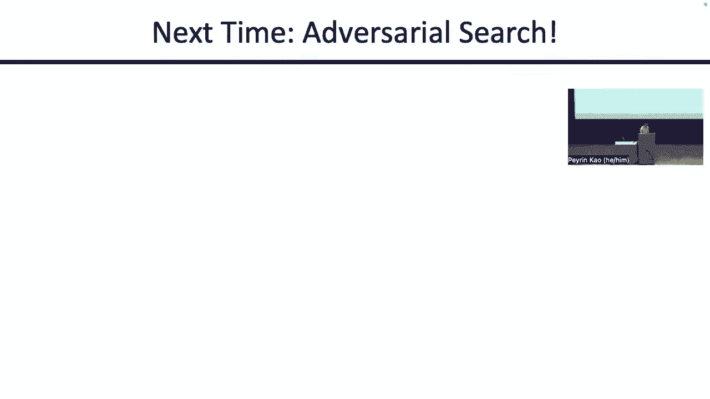
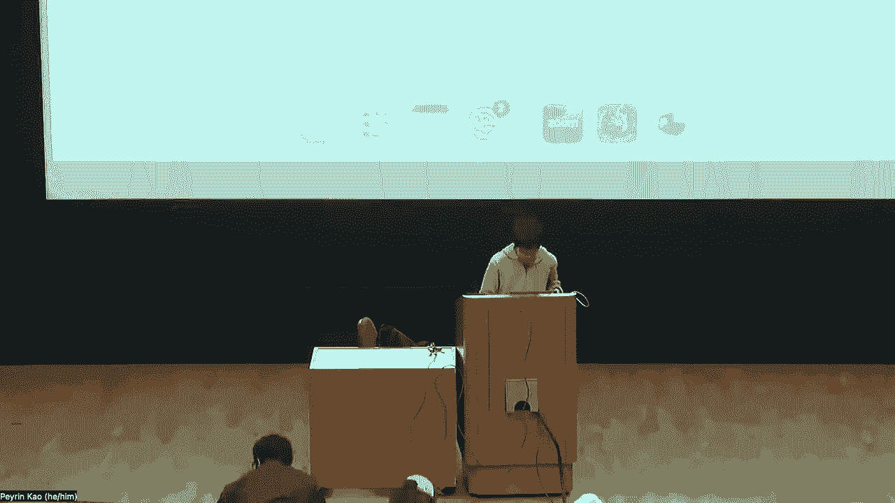

# P9：[CS188 SP23] Lecture 8 - CSPs II - 是阿布波多啊 - BV1cc411g7CM

好的，现在是五点十分，让我们继续我们的CSP。

百分之百的速度跑，真的很快，这是上次的，所以我们告诉你CSP的定义是什么，然后我们给了你一堆例子，所以要记住，csp就像一类更具体的搜索问题，在这个特定的类中，我们有我们的状态作为一堆变量。

每个变量都可以接受某个域中的值，所以在我们的例子中，变量是澳大利亚各州，这些值是我们在地图上着色的颜色，对呀，我们在这里的目标测试也是一种特定的权利，它是它，而不仅仅是一个目标测试，说是或不是。

它是一些任意的代码，你可以，但不管你，目标中你想要的任何逻辑，这实际上是一套特定的规则，告诉你什么任务是合法的，哪些作业不是，你的目标是给每个变量赋值，使所有的约束都得到满足，好的，这都是上次的事了。

所以今天我们要努力加速，跑，如何解决CSPS，希望我们能度过大部分，如果我们不这样做，那也没关系，好的，因为我们说CSV就像搜索问题的一个特殊版本，就像一个更具体的类。

这也意味着我们已经看到的通用搜索算法，也可以解决CSPS，所以我们将从通用搜索算法开始，我们看看他们做得怎么样，我们来看看他们做得不好的地方，然后我们会试着让它变得更好，看看会发生什么，好的。

这就是今天的计划，所以让我们试着把我们的csp插入到一个通用搜索问题中，好的，什么是通用搜索问题，一个，一般搜索问题需要初始状态，告诉我初始状态是什么，在这种情况下，初始状态是什么都没有赋值。

所以所有的变量还没有赋值，那是我们的开始，搜索问题需要后继函数，它告诉你如何从一个州到另一个州，在CSP中，后续函数可以是类似于取一个尚未赋值的变量，并给它一个值，所以拿起澳大利亚的一个州。

给它涂上颜色，那是我们的后继函数，我们的目标测试是什么？记住搜索功能总是需要一个目标测试，所以目标测试是给每个变量赋值，我的任务完成了吗，所有的限制，所以不管我有什么规则，邻国不能有相同的颜色。

或者我有什么其他规则，他们都满意吗，如果他们是，那么我的搜索问题就完成了，这是我解决CSP的最简单的方法，嗯，我已经有了这些算法来解决更一般的搜索问题，所以让我们拿一个CSPM，把它插进去看看效果如何。

所以让我们试试那个好的图表，你看到一个图表，想想这意味着什么，这是我们的约束图，从上次开始，每个节点表示一个变量，我们要给它赋值，这些边缘是什么，这些边缘告诉我们约束在哪里，如果你看到你知道的。

南澳大利亚和西澳大利亚，这意味着它们之间有一个约束，没有告诉你约束是什么，只是告诉你有一个，所以这只是为了提醒自己，约束是可以的，现在，让我们假设我们有一堆不同的搜索算法，什么会是一个好的使用。

让我们写BFS，那么VFS会做什么，BFS将采用初始状态，初始状态没有分配任何东西，它会把它捡起来，不是目标，所以让我们把它展开，它会扩展什么，它会使用后继函数，后继函数说这是不对的。

后继函数说您将分配，你知道其中一个变量的值，就像，也许其中一个说西澳大利亚是蓝色的，或者我们有一个像，哦，如果西澳大利亚是红色的呢，DFS将扩展所有这些，然后PF会得到什么，它会拾取下一个最浅的节点。

可能就像这个，我们把它捡起来，这不是目标，还没有全部布置好，西澳大利亚是蓝色的，我要做另一个任务，比如，也许现在南澳大利亚是绿色的什么的，好的，也许我会再来一杯，就像西澳大利亚的蓝色。

然后所有的线北部领土到红色，然后首先是宽度，然后是宽度，它又要捡起一个浅的，然后扩张扩张呼吸就会开始，慢慢来，一层一层地穿过，检查一个操作或一个任务之外的所有事情，然后两个动作或两个任务。

然后三个行动和三个任务，然后我经历了自上而下的搜索，对呀，CSP的解决方案在哪里，他们生活的行业，我会在第一层找到CSP的解决方案吗，否，因为我还没有设置完所有的变量，我在这里找不到任何解决办法，否。

所有的解决方案都在哪里，最下面，这是所有解决方案存在的地方，因为所有可能的变量都被分配到那里，BFS会怎么做，DFS会到处找，在它开始关注底层之前没有解决方案，在有解决方案的地方。

所以这就像是PFS的最坏情况，对呀，BFS真的不希望这种情况发生，所有的解决方案都很深，因为PFS喜欢肤浅的解决方案，所以如果我们用PFS，那么我们将浪费指数级的时间，检查每一层。

解决方案不在之前的地方，我们甚至有机会接触解决方案所在的地方，那可不好，所以也许BFS不是我们想要的东西，我们试试别的吧，让我们试试，让我们试试dfs，好的，所以我们花了第一周的时间嘲笑DFS。

就像啊哈，你可以，你知道吗，寻找奇怪的解决方案，但让我们看看DFS现在做什么，所以dfs将从空的开始，它会选择最深的节点，捡起来，这不是目标，它将在西澳大利亚分配一些正确的东西，它会拾起最深的节点。

对呀，我不知道西澳大利亚蓝，南澳大利亚绿，现在让我们成为DFS将要捡起的东西，它不会拾取这一层的一个浅节点，将在这一层捡起最深的节点之一，所以它会把这个捡起来，然后赋值另一个变量。

所以至少DFS一直到底部，首先寻找解决方案，与BFS相反，我们只是要浪费这段时间，到处寻找没有解决方案的地方，所以这里有一个例子，DFS是，也许我们想要的东西，它可能还得找很长时间，但至少它一直向下。

试图寻找有解决方案的地方，而不是浪费很多时间，在肯定没有解决办法的地方，所以也许DFS是我们在这里寻找的，好的好的，所以我们爱你，DFS发现奇怪的解决方案，但这可能是一个有用的例子，好吧，看起来很合理。

所以我们可以用dfs来解决我们的csp，我们都可以回家了，所以让我们看看会发生什么，希望这管用，我应该早点把这个放的，呃，这个也在网站上，如果你想找的话，但我们有一个可爱的CSV演示，我要停下来，好的。

所以哦CSP演示很棒，好的，所以让我们看看我们不会做任何花哨的事情，但我们今天晚些时候再做，我们不会做任何花哨的事，我们就做幼稚的，所以DFS来了，好的，我不得不向后看，好的，dfs说这是开始状态。

我想把它捡起来，这不是目标，我要去接一个接班人，蓝色是目标，这不是目标，所以我会捡起最深的节点，就是这条线，我会发展一个后续功能，看看我还能分配什么，那么下一个会是什么，我要分配，呃，让我们分配下一个。

我们应该用什么颜色，dfs会做什么颜色，那不是目标，所以我们会把它捡起来，DFS会说，好的，这是我迄今为止探索的最深的东西，它的动作是最多的，我来捡，这不是目标，好的，所以我再加一件事，呃。

我将使用后继函数来获得边缘的下一个东西，对或者把更多的东西放在边缘，我会在边缘捡到别的东西，接下来的第三个颜色是什么蓝色，好的，蓝色蓝色蓝色，好的，有人觉得这里有问题吗，我看到一个问题，好的。

所以我们到了底部，后继无人，所以我们得回到边缘，拿起别的东西，好的，然后我们会这样做一段时间，是的，是的，有人觉得这有问题吗，效率不是很高，对呀，好的，所以我可以看到你在接下来的一个半小时里都在这样做。

或者我可以看到，如果有更多的幻灯片告诉我们如何解决这个问题，玩够了吧，让我们去看看我们能做些什么来解决这个问题，那么单纯的搜索有什么问题呢，问题出在天真搜索中，我们有一个目标测试。

我们不能看目标测试内部，就像一个黑匣子，我们要求目标测试，就像法官，解决方案有效吗，目标测试说是的，或者它说不，所以在那个解决方案中，我们会通过这些部分解决方案与吨蓝调的目标测试，他们会说这不是目标。

那也不是目标，那也不是目标，就在CSP里，我们有特殊的结构，我们有一套规则，我们可以逐步检查，所以我们不必等到所有的变量都分配好了，然后就像，哦伙计，他们都是蓝色的，那没用，你可以边走边检查。

一旦你意识到事情不对劲，你可以像，我将停止搜寻这棵树，这是行不通的，我们去别的地方看看，所以天真搜索背后的想法，或者朴素搜索背后的问题是目标测试是一个黑匣子，它只告诉你解决方案是否好，但在CSP中。

解决方案实际上是，或者目标测试实际上是由多个规则组成的，你可以在走的时候一次检查一个，即使你还没有完成整道题，这就是CSP搜索比，一种天真的搜索，好的，每个人都很好吗。

为什么天真搜索会做我们刚才看到的愚蠢的事情，因为目标测试只告诉你是或否，它不会告诉你你违反了哪些规则，哪些规则没有违反，所以你不能真正检查部分解，你要等到最后，然后DFS说不，然后你要不停地检查。

所以让我们做得更好一点，做得更好一点的解决方案，这叫回溯搜索，我不太喜欢这个名字，这名字有点怪，嗯，让你几乎认为你只有一个解决方案，你走的时候有点回溯，但这仍然是DFS，如此潜在，这个算法还是标准的。

经典DF，所以不要看名字就有点困惑，就像回溯，我们还在做常规的DFS，我们有一个刘海，我们把最深的东西从边缘弹出来，就像在普通的DFS中一样，虽然名字超级奇怪，但现在我们要在，希望能让事情快一点。

所以我们已经做的一个改进是，当我们分配变量时，我们只是要按某种顺序分配它们，对呀，先分配西澳大利亚没有区别，然后是澳大利亚南部，我们首先指定南澳大利亚，然后是西澳大利亚，所以我们不妨按顺序一次送一个。

这将使我们在搜索问题中探索更少的节点，西澳大利亚第一，然后是澳大利亚南部，将是一条不同于南澳大利亚和西澳大利亚的道路，我得检查两个，搜索问题不会知道它们是不同的，但对我们来说没有区别。

所以我们不妨挑一个订单，然后顺其自然，这是第一个改进，第二个改进是什么将修复我们的蓝蓝蓝，早期的蓝色问题，而不是等待DFS目标测试告诉我们，是或否，像法官一样，我们面前有一张规则清单。

所以当我们前进的时候，我们有所有这些部分但不完全完成的任务，我们可以检查它们并说，到目前为止，我的任务是否满足所有限制，如果到目前为止我的任务打破了一些限制，不要一直寻找，不要再增加后继者了。

因为在搜索树的这个音符下的一切都注定要失败，好的，那么为什么这在正常搜索中不起作用呢，你就像什么，这似乎是个很好的主意，所以我为什么不在我所有的搜索问题中都这样做呢。

所以你可以在CSP中这样做的原因是因为CSP，一旦分配了违反约束的变量，你不能不侵犯它，如果你在作业中违反了规则，没有办法回去不违反它，除非取消变量的赋值，这就是为什么在CSPS中可以说，好的。

一旦我打破了规则，我不打算继续进行一般的搜索，没有比违反规则更好的事了，右在一般搜索针脚，只是目标吗，或者这不是目标，如果这不是目标，你不知道以后是否会有进球，所以你得继续寻找，但在CSPS中。

一旦违反约束，你知道规则已经被打破了，没有办法打破这个规则，所以从现在开始任何其他任务都注定要失败，我不必继续寻找，这就是CSP回溯搜索的特殊之处，我认为它更像是早期失败的深度第一。

或者类似于增量目标测试，所以边走边检查，不要只在最后检查，我就是这么想的，我们得称之为回溯搜索，我想没关系，好的，我们观看它的实战好吗？让我们看看它的行动，好的，所以我们开始了，这又是。

这是正常的DFS，忽略这个非常奇怪的名字，就像坏名声，走开，可能不好，不，好的，我不喜欢这个名字，所以我想离开，但它不肯走开，好的，没关系，这是我们的起始状态，所以我们把它捡起来，就像在DFS中一样。

这不是目标，就像在DFS中一样，我们拿起一个，这不是目标，哦看这里，哪里好，我奇怪的澳大利亚在哪里，对呀，两个都是红色的，所以是的，在常规DFS中，或者这两个州都是红色的，但我们不打算添加它。

因为我们知道是的，搜索树下面有一大堆东西，就像指数级的许多其他作业一样，但都是注定要失败的，因为您已经违反了约束，所以我们必须搜索的整个指数大小的树，天真的DFS，我们不用再找了，我们可以忽略它。

连续函数会说，别把它加到队列里，忘了它吧，让我们继续排队，看起来不错，好的，所以DFS，但是一旦你违反了限制，就尽早停止，因为一旦你违反了它，没有回头路了，这个部分作业的所有未来作业也将有。

那个约束违反了，这些都不会是解决方案，所以不要费心在这个地区搜索，我想你可以继续前进，好的，这里是代码，看着有点恶心，所以我们要仔细看看亮点，好的，所以有几个亮点是，你知道的，有点。

我们在哪里可以选择东西，那么我们要选择什么，我们将选择一个尚未赋值的变量，我选择哪个变量，我们可以以后再考虑，一旦你选择了一个变量，您选择要分配给它的值，我选择哪个值，我们以后再考虑，好吧，你继续前进。

有点像DFS，这里是递归实现的，也可以用其他方式实现它，对呀，当你走的时候，重要的是，你总是检查，如果已满足约束，如果约束没有得到满足，对吗？或者如果你打破了一个约束，然后停止展开该节点。

在那个特定的搜索树下面没有什么有趣的东西，伟大，那是回溯搜索，这是我们要做的其他事情的核心，它实际上只是DFS，顶部有一点额外的功能，现在让我们试着让它变得更好一点。

所以从现在开始我们要做的一切都是基于回溯，搜索或提前停止的DFS，我们只是想让它变得更聪明一点，看看我们能不能做些什么来加快速度，因为仍然在指数树中搜索有点烦人，所以有三种不同的东西。

我们肯定会得到前两个，然后如果我们有时间，我们来做第三个，如果我们不，那我们下次再谈吧，但让我们在速度跑中尽最大努力，所以我们开始了，让我们做第一个，这叫过滤，好的，到目前为止我们一直在做什么。

我们一直在一个接一个地分配变量，所以每个变量要么被赋值，要么没有赋值，就是这样，过滤将增加一个新的想法，这是新的想法，而不仅仅是跟踪井，此变量已被着色为红色，而此变量尚未被着色，相反。

我们要做的是对每个变量，我们实际上要在想象中保留一个，我们会记住，这些是这个变量仍然可能的值，所以每个变量都有一个域，在这种情况下，每个状态都有三种可能的颜色，而不是只是说它要么是未分配的。

要么是分配的，我们要好好想想，这些状态中的每一个都有三种可能的颜色在发挥作用，这张幻灯片是这么说的，好的，然后当我们把变量赋值的时候，也许我们能做的是，我们可以说好，如果我把东西涂成红色什么的。

它的邻居没有一个是红色的，所以也许我可以开始划掉，我确定不再可能的值，所以这叫做过滤，这就是井的想法，而不是边走边分配东西，只有在我完成分配后才意识到事情出了问题。

也许我可以通过跟踪剩下的值来早期发现故障，想象一下，如果其中一个状态不再有任何有效或可能的值，将分配给我们，我们没有解决办法，我们应该去探索搜索树的一些部分，所以这就是我的想法，所以让我们看看我要尝试。

呃，做一点魔法擦除，好的，希望这管用，所以我们开始了，我们没有指定的东西，所以一切都还在玩，所有的颜色仍然有效，所以我们开始了，让我们把西澳大利亚分配给红色，好的，那么这里发生的事情。

所以西澳大利亚现在是红色的，好的，所以这意味着我只是要蹩脚的颜色，这个红色，这告诉我们西澳大利亚绝对是红色的，我把它锁在里面了，没有改变它，除非我去检查搜索树的其他部分，但是对于搜索树的这个分支。

西澳大利亚将永远被阅读，不变，好的，所以现在很好，让我们想想对此我们能做些什么，所以我们能做的是，我们要看看所有其他的州，我们要考虑，在它们的可能域中是否有不再可能的值。

因为我刚刚把西澳大利亚涂成了红色，所以让我们去检查北方领土，北境就在这里，它紧挨着西澳大利亚，有什么颜色我不能再给北方领土着色了吗，因为我选择了西澳大利亚的颜色，红色，应该是一个对吧。

如果西澳大利亚是红色的，那么北部领土就无法读取，因为他们是邻居，那么我能做什么，我可以去抹去红色，从北方领土的领土，神奇地消失了，好的，所以现在北方领土的疆域缩小了，现在只有两种可能的颜色，好吧。

我可以过去，为所有其他的人做这个，就像昆士兰，嗯，它不与西澳大利亚接壤，所以这三种颜色都还在发挥很好，我一个接一个地经历，我意识到虽然南澳大利亚也是邻居，所以红色的可能性被排除了。

南澳大利亚州不可能被阅读并产生好的作业，这就是过滤，我正在经历，我在减少每个变量的可能性，我们再来一次，好吧，这就是我刚才所做的，我们再来一次，所以现在我有，昆士兰是绿色的，好的，那么我们该怎么办。

我们确认昆士兰是绿色的，所以我们想把它锁在里面，不再，改变它，没有疫苗，好的，所以当我们向右过滤时，我们目前正在探索搜索树的一个区域，昆士兰是绿色的，所以你去那里，好的，绿色的，然后我们做同样的事情。

我们通过所有其他变量，我们看看他们的领域仍然是可能的，我们认为有什么不再可能的，因为我最近在昆士兰格林的任务，所以我检查了一下，我意识到北领地不再是绿色的了，因为它与昆士兰州接壤，它为昆士兰选择了绿色。

还有什么南澳大利亚不能再绿色了，万一它不见了，新南威尔士州不能再变绿了，好的，所以他们中的几个马上就走了，这就是你所看到的，让我们再做一次，好的，现在最后一个我要把这个染成维多利亚蓝。

你看我是怎么记得我所有的状态的，我一直以为我会忘记一个，好的，所以让我们把维多利亚涂成蓝色，我会经历并做我做过的同样的事情，我检查了所有的域，我划掉了不再可能的事情，所以我穿过维多利亚边境，它的边界啊。

新南威尔士州不可能是蓝色的，但看看这个，新南方还有什么，或者维多利亚还有什么边界，它与澳大利亚南部接壤，所以南澳大利亚也不能是蓝色的，看看发生了什么，南澳大利亚在它的领域里没有更多的价值，它不见了。

那么这告诉我们什么，这告诉我们，到目前为止，我所做的部分作业，没有任何我可以称之为南澳大利亚的东西可以产生有效的任务，那么这意味着什么呢，这意味着在这一点上我可以停止，因为这套特殊的颜色是不可能的。

我可以用一个解决方案来完成这张图，没有解决方案隐藏在搜索树的这个特定分支下面，所以我应该回到搜索树，拿起边缘的其他东西开始探索，这太棒了，如果我们只是做正常的回溯搜索或提前停止的DFS。

我们就抓不到这个了，在这一点上我们会看到这个我们会说，哎呀，好的，人们对我们正在检查的东西非常兴奋，所以我们会看这里的这个，我们会说，到目前为止，任务是否违反了任何限制，否，看起来不错。

没有什么是用同样的颜色接触的，所以早期停止的常规DFS会继续下去，直到它捕捉到违反约束的东西，但是向前检查实际上会停在这里，说，你知道南澳大利亚没有选择吗，所以我可以早点失败，这给了我更少的探索。

这就是向前检查背后的想法，阻止我，如果你有问题，不错看起来不错，好的，让我们看一个演示，所以我要回到我的，好的，所以它就在那里，南澳大利亚已经用完了，所以我们必须回溯，好的，让我们回去看演示。

希望向前检查在行动中，好的，所以这是我的，呃，原始DFS，对呀，呃，我给你看过回溯搜索吗，我想我现在就这么做，好的，所以回溯浪涌是带有早期停止的DFS，这意味着如果违反了约束，你不会继续探索它。

所以这至少会让事情变得更好一点，而不是变蓝变蓝变蓝，它会注意到如果我把这个染成蓝色，这将违反一个约束，所以我不打算探索搜索树的那一部分，我要探索一个红色的地方，然后我在那里挑蓝色的，那里是蓝色的。

就在那里绿色在那里，好的，我得做一点，你知道，回溯和检查条纹右的不同部分，所以这仍然需要一点工作对吧，那是，提前停止的DFS，但我想看什么，我其实想看看，让我们看看，我仍然想要回溯搜索，但我想向前检查。

我们现在看到发生了什么，而不仅仅是说一些话作为一个标志，现在没有分配的地方，我实际上要跟踪，就像每个节点的可能值的小云，好吧，我想我应该早点提到这一点，但是这个演示和地图着色有点一样。

如果你看到两个圆圈之间有一条线，意思是它们不可能是相同的颜色，所以如果我不是所有的CSP都是这样，不是每个CSP都在给圆圈着色，但这是我们用的，所以让我们开始分配东西，这还在运行，dfs，所以我还有。

我还是得分配东西，我签了这个蓝色的表情，发生了什么事，所有的邻居都失去了蓝色作为一个可能的选择，因为他们意识到如果我给这些音符上了色，蓝色，就没有后继者了，所以我想提前一步，我们再来一次，好的。

我选择了一个仍然有效的颜色，我本可以做红色或绿色的，我选择了红色，现在很好，它的邻居都失去了红色，因为如果我把其中任何一个染成红色，他们会违反约束，很好，然后我会继续前进，你知道我可以变红，好的。

然后每次我分配它的邻居都会失去一些颜色，好的，我要送这个绿色的，然后在这一点上看，下一圈怎么了，它的领地不亚于它的领地，它没有值了，所以我要停下来，说我在这里无能为力了，正常的回溯搜索不会捕捉到这个。

它会说这个看起来不错，到目前为止，你没有违反任何规则，它会一直持续下去，直到一些规则被打破，但在这里我们要早点停下来，我们得回去，并尝试搜索树的其他部分，希望你知道每次我们尝试，我们会做一点过滤。

直到我们穿过这棵树，让我再做一次，看看你能不能喜欢超越向前搜索，所以试着想想，你是否感觉到不可避免的失败，但是看看这个，你是否感觉到CSP不可避免的失败迫在眉睫，好的，我对此有不祥的预感。

你对此有不祥的预感，你知不知道，谁对此没有不祥的预感，向前检查向前检查非常乐意继续前进，因为没有一个域是空的，这是一个向前检查将继续，只是现在我们在向前检查，说好，有一个问题。

但在你我之间我们觉得这里有点问题，出了什么问题，问题是，这个只剩下绿色了，这个只剩下绿色了，他们互相触摸，所以这是行不通的，如果我们能检测到这种向前检查不是很好吗，无法检测到这种正向检查。

只把域上的东西划掉，一旦你给一个变量赋值，所以让我们试着做得更好一点，看看我们能不能抓住这个我们注定要早早失败的具体案例，所以让我们试试看会发生什么，很好，这是向前检查，这也是向前检查的问题。

让我们做得更好一点，好的，这就是我们之前看到的，所以每次你分配一个变量时，我们都会检查，它将约束传播到附近的所有其他变量，但只有当您分配变量时，它才会这样做，好的，这就是我们前面看到的例子。

你注定要失败，北领地只能是蓝色的，南澳大利亚只能是蓝色的，但向前检查不知道，为什么不转发检查，知道前向检查只在分配变量后检查域，但北方领土还没有分配，南澳大利亚州还没有分配。

所以正向检查不检查这两个变量之间的任何东西，前向检查只检查已分配的变量之间的关系，和尚未分配的变量，当您分配变量时，你检查所有其他未分配的，把东西划掉，但只有当您分配变量时，它才会这样做。

它不会在两个未赋值的变量之间进行检查，所以让我们这样做代替，让我们把向前检查做得更强一点，让我们想想，我们能在还没有分配的变量之间推理吗，那会是什么样子，所以它看起来是这样的，我们得加一点符号。

然后你就会明白为什么我们添加了这个符号，所以现在我们要添加一个叫做弧线的东西，圆弧连接两个变量，上面有方向，所以这里有一个弧线，它从北领地到西澳大利亚，它有一个方向，所以有一个从北领地到西澳大利亚。

还有一个从西澳大利亚到北领地，你可以在任意两个变量之间有弧线，他们被指示，现在的想法是，如果你想在两个可能没有分配的变量之间进行检查，但你可以通过检查它们之间的弧线来做到这一点，所以这是什么意思。

所以我会给你数学上的定义，然后我会通过一堆例子，因为我认为这很有帮助，所以这是MAI定义定义说，如果你有一个弧线，这个弧有一个性质，它要么是一致的，要么是不一致的，弧线一致意味着什么。

意思是尾巴上的每一个x，尾巴是没有箭头的部分，脑袋里有一些价值，头部是有箭头的部分，这可能是一个不违反约束的标志，有很多话，让我们试试，好的，所以这里有一个弧线，弧线不是w a，定义说。

如果这个弧线是一致的，然后对于尾巴上的每一种颜色，头上有一种颜色，这可能是一个不违反约束的标志，所以让我们试着对尾巴上的每一个x，所以我会一个一个地检查，挑一个不同的颜色，可能好吧，颜色很奇怪。

我就选这个颜色，好的，所以对于尾巴上的每一个变量，对于每一个可能的值，蓝色，如果我分配蓝色，西澳大利亚有什么东西吗，那仍然是合法的，它是红色的，如果我分配绿色，有什么东西是合法的吗，是啊，是啊。

它是红色的，如果我分配红色在WA有什么，那仍然是合法的，否，如果我把红山，在WA什么都没有了，那是合法的，所以这个弧线是不一致的，因为对于每个值的细节，有一个价值观，只是一个，就是那个红色的。

如果我选择了红色，我就注定要失败，好的，所以这个兽人是不一致的，我想让它保持一致，所以我要让它保持一致的方法，就是，我要去擦掉，让它不一致的事情，红色使这不一致，这意味着我不能在这里用红色。

所以如果我删除红色，我只剩下两种颜色，现在这个弧度是一致的，如果我在北领地选择绿色，我很好，我在WA还可以选择红色，如果我选择北领地的蓝色，我还可以选择红色，所以对于尾巴上的一切。

脑子里有一件事至少有一件能起作用，好的，这是一种奇怪的向前检查的定义方式，但你几乎可以把正向检查看作是这种情况的一个特例，所以我想我们没有时间来讨论，那看起来像什么，没关系。

关于弧线的想法以及如何使它们一致，这只是一个定义，我们还没有告诉你为什么这个有用，如果我们强制一个弧线的一致性，对呀，发生的事情是，我们划掉了不可能的值，但我们可以这样做更多的弧线。

我们不必只为一个人做这件事，所以我们为什么不开始强制所有弧线的一致性，然后我们可以划掉很多值，这将是一个很好的过滤算法，所以我们就这么做吧，所以我们要做的是，我们想通过并检查任何变量对之间的所有弧线。

他们都是导演，所以在任意一对变量之间有两条弧，一个方向，一个在另一个方向，我们要确保所有的弧线都是一致的，我要把它们都检查一遍，当我们检查的时候，我们要做一些过滤，希望这能消除很多不再可能的值。

所以让我们一个接一个地尝试，我们这里有一个小演示，我们想通过，好的，所以这里有一个弧线，我选择探索，v到nw，这一次很有趣，因为这两个状态都还没有被分配，所以我实际上在检查。

在未分配状态和另一个未分配状态之间，它的稠度是可以的，你可以这样做，所以让我们过去检查一下，规则又来了，这就是数学版本，我是这么想的，所以我觉得更像是，好的，我得给V维多利亚分配点东西，我有三个选择。

我有红色，绿色和蓝色，让我们想想哪些人会喜欢，让我活着，比如给我与新南威尔士州有关的可能性，好的，所以如果我在维多利亚选择红色，我喜欢还好吗，有什么会，至少有一种工作是对的。

我可以在新南威尔士州选择蓝色，在新南威尔士州也有不起作用的东西，就像我在新南威尔士州不能选择红色一样，但至少有一样东西让我活着，让我继续前进，所以红色也可以，如果我在维多利亚选择绿色。

新南威尔士州有什么吗，让我活着，是的是的，红色或蓝色，好的，所以这很好，如果我选择蓝色，新南威尔士州有什么，这让我很好，这允许可能的解决方案，有我可以选择红色，伟大。

所以这个弧线对维多利亚的每个值都是一致的，至少脑袋里还有东西，这会让我活着，给我可能的解决方案，好的，所以这个弧度是一致的很棒，我们让它继续它的一天，让我们去看看其他的弧线，这里还有一个，对呀。

在任何一对变量之间都有弧，好的，这个位于澳大利亚南部和新南威尔士州之间，他们的邻国，所以它们不可能是一样的颜色，所以让我们检查一下尾部的每个值，只有一个，所以我问，如果我分配南澳大利亚。

蓝色是有什么东西吗不一定是所有的东西是有什么东西吗，至少在新南威尔士州，想让我活着，让这项任务成为可能，至少有一个可能的解决方案，我可以选择红色，不能选择蓝色，不过没关系，至少有一件事是可能的，好的。

所以这个弧度也是一致的，所以去很好，但你也可以检查其他方向的标记，所以在另一个方向有同样的标记，现在尾巴是新南威尔士州，在脑袋里是S说的，所以我们再做一次同样的过程，我们说对于尾巴上的每一个值。

脑袋里有什么东西会没事吗，如果我选择红色，我就像注定要失败一样，还是有什么东西能救我，我可以在作文中选择蓝色，能让我活下去，如果我在新南威尔士州选择蓝色呢，南澳大利亚有什么管用的吗，比如拯救我。

给我可能的解决方案，没有，如果我选择蓝色和新南威尔士州，我不能把任何东西分配给南澳大利亚，这将使这项任务继续下去，我就是这么想的，你穿过尾巴上的每一个山谷，你一个一个检查。

你意识到如果我把新南威尔士州分配给蓝色，没有任何有效的东西可能出现在澳大利亚南部，或者没有有效的任务留给南澳大利亚，这将使我有一个解决方案，所以这个兽人是不一致的，让它一致，我得把这里冒犯的颜色删掉。

它会是蓝色的，我把它处理掉，现在这个弧线是一致的，我同意删除它，因为我知道如果我选择了蓝色，这将注定我没有解决办法，因为它会成功的，所以在南澳大利亚什么都没有，伟大，让我们做更多的弧线，好的。

现在这个弧线对你来说应该很熟悉，因为我们在几张幻灯片前做过，我会证明给你看，我们做了同样的一个，但有什么区别呢，当我们检查的时候，这一次新南威尔士州现在有两种颜色，新南威尔士州只有一种颜色，可以吗。

我们再检查一下稠度，我在维多利亚选择绿色，还有解决方案吗，是啊，是啊，有一个地方有一个新南威尔士州是红色的，但在维多利亚只是蓝色的，有有效的解决办法吗，是呀，新南威尔士州是红色的。

如果我在维多利亚选择红色，有什么解决方案可以让维多利亚和红色，否，因为新南威尔士州只剩下红色了，这是行不通的，好的，这个故事的寓意是，尽管我们之前检查过这个弧线，它是可以的，当我改变了NSW的域。

我回来又检查了一遍，不再一致了对吧，最初的弧线是一致的唯一原因是因为这里有一个蓝色，新南威尔士州，这有点像支持这里的红色，但那蓝色不见了，所以这个弧线不再一致，使它一致，我得把这里的红色敲掉，好的。

所以一个红色，好的，现在它消失了，现在我的工作是一致的，好的，这个故事的寓意是，当你四处检查所有的弧线时，有时你得重新检查弧线，你要重新检查哪些弧线，通常我们要做的是，如果你把一些变量的值划掉。

就像在这种情况下，我交叉了NSW的值，我需要回去检查所有指向新南威尔士州的弧线，再来一次，所以在哎呀之间，好的，我想我会删除几个，好的，所以在这里和这里之间，NSW失去了它的价值，失去了它的蓝色。

所以这意味着，我需要回去检查所有指向新南威尔士州的弧线，如果他们仍然一致，因为有可能这些指向新南威尔士州的弧线，依靠蓝色，这是因为它的一致性，现在蓝色消失了，这些弧线中的一些可能已经失去了一致性。

我得回去检查他们，好的，所以我随时都需要回去检查，我从变量中删除一个值，好的然后我们继续检查，我们检查每一对，对呀，所以这里有另一对和这一对，你知道你检查尾巴，如果我在南澳大利亚选择蓝色。

在北方地区有什么不起作用的吗，北部地区没有什么有效的，所以我得把蓝色划掉，一旦我划掉这里的蓝色，我学到了一些东西，所以这个任务有西澳大利亚红和昆士兰绿，这是注定要失败的，我们的一致性告诉我。

因为当我四处走动的时候，在未分配的变量之间进行检查，检查每个人都有仍然有效的东西，我实际上发现南澳大利亚什么都没有了，能让这一切奏效的人，所以我能够检测到故障，我可以停在这里，我再也不看其他作业了。

有西澳大利亚红和昆士兰绿，我要往别的方向看，要回溯，找一些好的，这是相当强大的，对呀，就像看看这个，所以呃，这是最后一张幻灯片，好的，我看看这个，对呀，看这个图，我只涂了两种颜色。

如果你看看西澳大利亚的红色和昆士兰的绿色，实际上很难立即判断，这是注定要失败的，但是如果你运行我们的一致性，你检查所有的弧对，你最终意识到南澳大利亚失去了所有的可能性，这个图或这个特定的赋值。

尽管它还没有完全填满，事实上它只填了一部分，它实际上注定要失败，你很早就发现了，这有点酷，这就是你在这里看到的，好的，这就是我们的一致性，有点酷，你想知道的任何事情，是啊，是啊，这个。

所以有人提到这似乎很慢，好的，所以呃，有没有，我发誓我有一个好的，也许不是，所以是的，这很慢，我想呃，我想我有一个要点说，但你是对的，这很慢，我们会像一秒钟一样谈论他们，还有什么，好的。

所以这里又是一种非常快的，代码有点难读，所以我要给你一些亮点，好的，所以我们是这样做的，我们把值划掉了，我们遍历尾部的所有值，然后我们检查每一个可能的事情，我可以分配给尾巴，脑袋里还有什么东西还能用吗。

这仍然是可能的解决方案，如果没有，然后我会从尾部移除一个值，这就是它的作用，然后我有一个队列队列告诉我哪些弧线我还需要检查，我一个接一个地从队列中拉出弧线，我检查它们，我可能会删除值，我记得早些时候。

如果我改变变量的定义域，我得回去重新检查所有的弧线，所以如果我不得不重新检查弧线，或者如果我从变量中移除一个值，我需要重新检查所有指向那个变量的弧线，就在这个算法中，好的很好，这是运行时。

可能没时间教你，但还不算太糟，这个两两跟踪是d的平方，还有呃，哎呀，有一个和平方d在他们的，我们可以以后再谈，如果你想，好的很好，所以这里的几个观察，值得注意的，我们的一致性本身，不能解决csps。

这里又是两个csp，我们在做完全一致的不平等约束，如果你不相信我，你可以正确地检查它们，就像我想检查这个弧线，如果我在这里选择红色，另一边的蓝色让我活着，所以我在这里选择蓝色，另一边有一个红色让我活着。

这样你就可以把所有的弧线都检查对了，这些都是我们一贯的CSPS，好的，但他们还没有解决，所以仅仅因为我分配了我们的一致性，我检查了一下，从所有的值中删除了一堆东西，这并不意味着你就完蛋了，事实上。

有些情况下你已经完蛋了，你只剩下一个解决方案了，你可以到处分配它，你很快乐，在某些情况下，还有多种解决方案，就像上面这个，好的，对呀，这完全是我们一贯的，但实际上有两个解决方案，有一个你变绿变蓝。

有一个你变蓝了，绿色，他们两个都很好，或者你可以有解决方案或情况，你应用我们的一致性，所有的弧线都是一致的，你一遍又一遍地检查它们，并确保它们都是一致的，但你遇到这样的情况，在没有更多解决方案的地方。

所以我们的一致性本身并不能解决你的CSP，这只是帮助你更早发现失败的一种方法，正如你在这里看到的，它也不会总是帮助你检测失败，所以这本身并不能解决您的CSP，它只是试图帮助你，引导你沿着你的CSP之旅。

希望当你运行我们的一致性时，它仍然必须在内部回溯或深度优先搜索，早期失败搜索权，所以你还在进行深度优先搜索，你只是在用这种方法来帮助你划掉一些东西，当你去的时候，希望能尽早发现故障。

所以当我们说喜欢的时候，哦，排起了长队，哎呀，好的，所以当我们说喜欢的时候，哦，这里排起了长队，您正在检查队列中的所有值，所有这些都发生在里面，回溯搜索，你还在外面搜索，你只是在利用这个。

帮助你检查你做得怎么样的方法，如果有什么你应该早点知道的，这就是我们的一致性，因为这是第一个有帮助的观察，这仍然在回溯搜索中运行，你这样做只是为了帮助你，我们的一致性本身不足以直接解决CSB。

有人提到的第二件事是，这东西太慢了，你得检查所有的弧线，你得把它们成对检查，对吧，有时你必须重新检查弧线的好坏，对呀，这将需要永远，你甚至可能想知道要花很长时间吗，就像它会结束吗，就要结束了。

因为每次你重新检查，只有当您从变量中删除某些内容时，才会发生这种情况，你只能从每个变量中删除有限数量的东西，所以你最终不得不停止复查，别太担心，如果没有意义，有点快，但最终你会完成检查，这需要一些时间。

事实上是多项式时间，你是对的，这个有点贵，所以这几乎有点像启发式，他们开始搜索，就像你可以有一个非常昂贵的启发式，它运行在你的搜索算法中，使你的搜索算法更快，或者你可以有一个更便宜的启发式。

这对你的搜索算法没有多大帮助，所以有一种权衡，所以有更昂贵的过滤算法，这可能会使您的整个CSP回溯搜索更快，探索更少的节点，或者你可以用更快的更弱的过滤过滤算法。

但也许没有改进你的CSP通用搜索算法那么多，所以这是一种权衡，对呀，它是缓慢的，但也许它能给你加快速度，因为它帮助您及早发现故障，弄清楚什么时候没有什么可以探索的了，这就是我们的一致性。

我们看看它的演示好吗？让我们做那个演示，呃，不需要图纸，演示，好的很好，我们去看看，让我们做回溯仍然，所以我们开始回溯搜索，让我们做你不会相信喜欢有多难，把这个倒过来，好的，让我们做我们的一致性，好的。

这实际上将是我们的，是如此强大，以至于小图不能为我们做这件事，所以你已经准备好接受大图表了，好的，哦哦，吓人，让我们试着解决这个问题，我们的一致性没问题，我分配了一些东西，当我分配一些东西。

邻居们失去了他们的价值观，好的，很正常，让我们分配更多好的，现在看看发生了什么，所以当我分配这个的时候，你在哪里，好的，所以当我分配第二个的时候，红色，注意这个节点，它失去了一个价值，不是瑞德的邻居。

如果我向前做了，检查该节点是否从未丢失值，但我们的一致性有点超前，检查每一对变量，它检查了这里的这对，它检查了这些弧线，意识到绿色在那个节点上没有未来，它能够比前进更早地击倒果岭，检查会。

你可以继续前进，当你走的时候，你会注意到的是，不仅仅是每个赋值变量的邻居，正在失去其域的值，更远的东西也在失去价值，因为我们的一致性是检查每一对，检查变量对并检查它们是否有，有效的解决方案仍然存在。

对呀，所以当你走的时候，你可以看到你知道来自更远的值实际上很快就失去了它们的域，对呀，好吧，你去一次又一次，就像我们说的，我们的一致性本身并不能解决，CSP是一路的，所以有时候你还是会遇到这样的情况。

在那里你检查弧线，一些弧线或一些域变成空白，就像这些变量中的一些不再有任何可能的值，所以有时候你还是要回溯，您仍然必须运行常规的dfs，我得回去编辑一下，我们的一致性是相当强大的。

我只试了几次就把这块大板吹走了，挺酷的，这就是我们的一致性，对此有什么问题吗，好，好的，我的幻灯片是什么，好的，你在这里，好，好的很好，所以我们谈到了我们的一致性，谈到了局限性，好的很好，现在我要切换。

所以这其实都是上次的，但我想我们玩得很开心，所以现在我们来看看，让我们来看看下节课，如果可以的话，好的，所以我们谈到了过滤，这是我们现在第一个让回溯更快的技术，让我们继续讨论其他的方法。

使回溯或回溯搜索更快，好的，这是一篇评论，我不打算在这上面花太多时间，在我完成过滤之前，我会简单地提到，如果有其他版本的一致性，这是我们的一致性，所以特别要记住这一点，我们之前的朋友，没有解决办法。

但我们不知道这是一种，因为我们的一致性只检查变量对，它不会同时检查三个变量，这就是为什么我们抓不到它，这没有更多的解决方案，如果要一次检查两个以上的变量，你必须使用一种更强的叫做K一致性的东西。

你必须检查，而不是一次检查两个，你必须一次检查三个，或者一次四个，或者一次五个，你真的不必知道这些，你只需要知道，该类的k等于2，但要知道还有其他算法，所以你就像什么，如果我的CSP有类似的约束。

而不仅仅是在两个变量之间，也许我在三个变量之间有约束，知道有办法做到这一点，但我们真的没有时间谈论他们，很棒的一个下来了两个还剩两个，好的，下一个是关于订购的，我们之前提到过，但当你解决。

当您下去并构建搜索树时，csp s，有时候你有选择，就像，在这种情况下，我有一个选择，我想先给哪个状态上色，这是你可以做出的选择，所以对于第一个州，也许我会选择西澳大利亚，可能没问题。

所以我选择了西澳大利亚，我把它涂成很棒的颜色，现在我有了另一个选择，我可以选择下一步要上色的状态，csp第一次搜索没有告诉我下一步该做什么，所以我有选择，我应该选择什么，所以这是我们的订货问题。

这里我应该选择附近的变量来赋值，有很多限制，与我刚刚着色的西澳大利亚有关的，还是我应该去别的地方开始做东边的事，真的很远，嗯，我应该做对哪一个，好的，所以我可以选择在附近做点什么。

或者我可以选择另一个方向，把它叫做角落里的维多利亚什么的，那么我该怎么办呢，好的还有这里，这张幻灯片说的实际上是当你决定下一个选择什么变量的时候，试着先选择最难的变量，最难是什么意思。

它意味着在其域中剩余值最少的变量，所以如果你在做一些过滤算法，你就像，好的，嗯，澳大利亚北部是什么还剩下两个值，但就像昆士兰还剩下三个值，用剩下两个值的那个，这是它的域中剩余的最少的值。

所以先选择那些更难分配的，这张幻灯片就是这么说的，你为什么要这么做，你就像，为什么不先去分配简单的东西呢，所以为什么不呢，你知道，当我解决这个问题的时候，为什么不先给西澳大利亚着色呢。

为什么我不去另一个方向，比如给这个上色然后给很远的另一个上色，我为什么要那样做，我能给你的最直观的答案是，因为当你解决CSPS时，你必须分配每个变量，不能跳过一个有效的解决方案。

它必须把所有的变量都分配好，不能跳过，所以你有一些你认为很难的东西，因为没有太多的价值可以选择，你，现在有点想在困难的事情上工作，把它解决掉，趁你还在这里的时候把它弄清楚，而不是去其他方向。

在其他方向解决一些事情，后来回来才意识到，哦，我从一开始就注定要失败，对，如果我把西澳大利亚或红色涂上，然后我转向其他方向开始给其他国家或其他地方着色，直到后来我才意识到西澳大利亚红。

实际上从一开始就注定了我，然后我就浪费了所有的工作，在别处做些事情，所以取而代之的是，因为我什么都要做，最终我还不如照顾好所有的邻居，首先是所有西澳大利亚本地的东西，在我去别的地方之前把这个弄清楚。

如果我想不出来，我意识到我的作业实际上被打破了，我宁愿现在就知道，然后在我去了别的地方后再知道，在一堆东西里面，所以我想先做可怕的事情的原因，走进可怕的门是，因为我最终必须分配所有的变量。

如果我去发其他东西，稍后再回到我不会发现的困难的事情上，如果我有麻烦，直到以后，我宁愿现在就知道，我有麻烦了，现在做一些回溯，而不是很久以后才发现，在其他地方浪费大量的工作，好的，这张幻灯片是这么说的。

嗯，打破领带，是啊，是啊，打破领带通常有点武断，所以你可以选择任何有效的，它通常是好的，嗯，这不是我想的最有趣的事情，好的，但有时你得考虑断字，好的，所以这是我们的选择点之一，哪个州是哪个州。

或者我下一步分配哪个变量，我下一步给哪个状态着色，还有一个选择点，这很好，说我决定给，我都不知道这是什么，昆士兰州，也许我不认识右上角的那个，说我已经选择了颜色，我应该选择哪种颜色。

我应该选一种更容易的颜色吗，一种坚硬的颜色，我们必须定义这些意味着什么，这有时意味着你必须运行一些过滤，所以当我们说某件事很容易的时候，通常表示它不喜欢，从其他变量域中删除很多东西。

当我们说我们做一个艰难的，选择硬色，这意味着我们让自己的生活变得艰难，从其他领域剔除了一堆颜色，那么我们是该选比较容易的还是比较难的呢？这是一种有趣的背部，当我们考虑下一步分配哪个阶段或哪个变量时。

我们想先做难的事情，因为我们必须尝试一切，最终我们必须分配所有的变量，但是当你选择哪种颜色的时候，使用要分配的域中的值，你不必把所有的值都试对，也许你运气好，你说我想给这东西上色。

红色和红色原来是有效的好方法，你永远不必尝试蓝色，永远，所以这里的情况有点颠倒，因为你不必什么都尝试，你宁愿先试试简单的东西，只希望它能起作用，你甚至不用碰硬的东西。

这就是为什么我们再次选择约束最小的值，一个值不受限制或不容易意味着什么，您必须运行一些过滤以确保，但这通常意味着当我分配这个值时，并不是所有其他领域都开始迅速萎缩和失去价值，那将是一项艰巨的任务。

因为现在我没有太多的回旋余地了，但如果我选择一个值，所有其他域完好无损，我认为这是一个容易的值，因为我还有很多选择，所以在这里我想通过容易的门，但我想通过容易的门，因为我不必尝试每一种颜色或每一个域值。

所以我不妨先试试简单的，希望他们能奏效，我再也不用尝试难的了，与下一步要选择的变量正好相反你要分配所有的变量，分配了一半的变量就没有解，所以你最好现在就做难的把它解决掉，但你不必选择所有的值。

或者你不必尝试所有的值，所以你不妨先试试简单的，如果你这样做，那么这实际上使得解决更大的问题，可行，因为你避免了，首先呢，当你尝试事情的时候，你在先尝试更难的事情，当你试图给你分配值时，先试试简单的。

结合这些可以让您解决更大的问题，因为你在选择下一步要探索的东西方面做得更好，我们还有时间再做一个演示吗，我再给你看一次，然后呃，我们会继续看一些其他的东西，演示在哪里，你没事，所以我们再做一次大的。

这次让我们做一些过滤，所以我们要看看过滤，我想我们就做个房车吧，决定先分配哪些值，好吧，你可以在自己的时间玩这个，我也是，所以在我们自下而上之前，我们并没有真正考虑下一步分配哪些变量。

所以在我们做这个之前，我们打算从左到右，但现在先生在过去有了选择，我们下一个会分配这个，你在哪里不，好的，下一个我会分配这个，因为我会按照同样的顺序去，每一次，MRV说实际上，我要先去做困难的事。

似乎最难的是什么，在它的领域里剩下的东西最少，就是上面这个，这是剩下的最难的一个，所以我要先去做那个，把这个弄清楚，然后我意识到嘿，这个实际上导致这个变得有点难，失去了一些值，所以我要去看看那个。

而不是从左到右从下到上的顺序，我可以处理所有这些相关的难题，在我离开去另一个角落找东西之前，那是无关的，希望这能让我解开这里的东西，以前很难，我得去拐角处看看其他的东西，好吧，这很酷。

因为实际上对于这个问题，它甚至不用回溯就解决了整件事，这有点酷，这意味着只要有MRV和我们的一致性，我已经到了可以解决这个大问题的地步，现在没有任何回溯，当然现实生活中的csp比这大得多。

但我们的玩具问题已经到了极限，点单就到这里，两个下来，还有一个，我有时间，两张幻灯片，好的，所以我们讨论了容易的和难的，先选哪个，我能让这个标题的事情消失吗，不，好的，不管怎样，让我们继续前进，好的。

所以我们要讨论的最后一件事是制作CSP，作为结构更有效一点，所以这里有一张图片，你可以用来思考它，所以如果你看看这个，不是真正的CSP，但有点像插图，你就像，好的，我是警探，我想破案。

看起来你不是真的想考虑一下吗，就像中间的大老板，你就像，也许我应该做的是，我想从边缘工作到大罐子什么的，这张图似乎有某种结构，你可以利用它来，帮助指导你的案件，所以不要只是到处去解决你能解决的任何问题。

也许你想有一个策略，就像，去找大老板什么的，所以有时会有结构，我可以用来使我的CSP搜索更有效的问题，所以这里是结构帮助的最极端的例子，所以在我们所有关于澳大利亚的讨论中，我们漏掉了一件可怜的小东西。

也没怎么说过，看看塔斯马尼亚茶就在那里，所以如果你不知道塔斯马尼亚是一个岛，这对着色意味着什么，你可以给它上色，你想要什么都可以，因为它在其他任何州都不起作用，对呀，所以看起来不是真的。

当我解决这个CSV问题时，我可以把澳大利亚大陆作为一个CSP来解决，然后我可以自己解决塔斯马尼亚岛给它任何颜色，我不需要这两个问题相互作用似乎是合理的，对，即使我喜欢进去，好像我不知道。

在塔斯马尼亚旁边建造了另一个岛，我想你必须把塔斯马尼亚分成三个州，但塔斯马尼亚仍然是岛，所以你还是可以自己解决澳大利亚大陆的问题，你可以像我新独立的塔斯马尼亚一样解决，两个在塔斯马尼亚。

三个地图着色问题本身，那还是可以的，这就是独立子问题背后的思想，我们有两个问题，这两个问题之间没有限制，你可以把它们分开解决，然后你的整体解决方案是第一部分的解决方案，加上第二部分的解决方案，这太棒了。

所有这些数字都让你相信，这是一个例子，如果你有，每个变量中的变量CSP有两个值，也许像真的或假的，蓝色的，绿色的，或者其他正确的东西，但你不知道这八十个，这是什么，而不是像这个80大小的CSP。

你可以把它分成几个子部分，或者你可以把它分成四个子部分，每个只有20个变量，它们之间没有限制，我可以自己解决20的每一部分，嗯，那太好了，所以如果我必须解决整件事，八十八十值，我还在寻找，记得吗。

我们说手术中最坏的情况仍然是指数级的，所以如果我有80个变量，那我就得尝试两到八十个可能的任务，在最坏的情况下，但如果我只需要解决20号的子问题，他们有四个人，那么我只需要解4乘以2到20个可能的解。

或者看看4乘以2到20个可能的解决方案，这就是几十亿年和四秒之间的区别，所以独立的子问题很棒，我可以把我的问题分开，然后解决第一部分，解决第二部分，并把它放在一起，在一到十的范围内很好。

独立子问题有多有用，相当有用，一点用都没有，我会说零、一或负，一个独立的子问题通常永远不会发生，因为你一开始为什么要构建CSP，这是因为你有很多相互影响的变量，你想知道他们是如何互动的。

所以你很少有CSP，那很容易，你可以把它拆散，通常如果你有CSP，试图解决的全部意义，因为所有的变量都纠结在一起你想了解它们，所以在现实中，你几乎永远不会看到这么好的东西，但这是一个很好的例子。

只看问题的结构，让你把它分解成更容易解决的东西，所以你几乎永远不会看到这个，是的，问题，是啊，是啊，有趣的问题，这是什么，如果我有一个大的CSP，但没有简单的方法来分裂它们，还有办法把他们分开吗。

如果我们有时间，我们会搞定的，如果没有，你可以检查幻灯片，有拆分cps的方法，你只需要比，把它分成独立的子问题，这通常是不会发生的，是啊，是啊，真的很好的观察，好的很好，所以这几乎永远不会发生。

但仍然有一些结构可能会发生，就像，也许你的CSP是一棵树，没有循环会很好，好吧，事实上有一个很酷的定理，我会尽我最大的努力去证明，它说如果您的CSP是一棵树，换句话说，没有循环。

所以没有类似的边形成一个循环，那么实际上你可以在多项式时间内解决这个问题，这比指数级的伟大要好得多，所以让我们看看那是什么样子，这是我的CSP，好的，记住，这是约束图，所以这告诉我约束在哪里。

A和B之间有一个二进制约束，B和C之间有一个，以此类推，对呀，好的，所以这是一种款待，看起来并不像一棵树，所以我喜欢摇晃它，拾取其中一个节点，就像摇一摇，让它看起来像一棵树，所以我会给它点菜，好的。

更像是CS 7什么的，所以我给了这棵树，命令它仍然是同一棵树，我只是重新画了一下箭头，以便有一个明确的顺序，我能做到这一点，因为没有循环，所以应该有一个订单，我选择了从A到F的订单。

现在让我们假设他们有一些限制，所以也许A有一个域，那不是所有的三种颜色，也许出于某种原因，你不想让A是绿色的，出于某种原因，你不希望B是红色的，当然好的，所以我应用了这些限制，这些将是无限的约束。

因为它们只涉及一个变量，所以我也经历了这些，并应用了这些，这是让你在多项式时间内完成的算法，有点酷，所以我们要做的是，你要把我们的一致性应用到所有指向f的弧上，然后你要把我们的一致性应用到所有的节点上。

指向e，我们将在所有节点上发挥我们的一致性，指向d，我要在一次向后传球中做到这一点，所以我会很快做到这一点，如果可以的话，然后我们来讨论第二步，好的，所以我们从F到向后的一致性，指向f的弧线是什么。

它是df，好的，所以d到f是一致的，不一致，为什么不一致，因为如果我在D选择蓝色，F就什么都没有了，所以我得让它保持一致，所以我要让蓝色消失，很好现在d到f是一致的，我把任何R线索查到E。

它是d所以我检查d到e，我如何使其一致，已经一致了吗，如果我选择红色，我很好，如果我选择绿色，我很好，仍然有蓝色，所以D de现在是一致的，我检查指向D的弧线，B到D是一致的吗，如果我选择绿色。

我有红色，如果我选择蓝色，我有绿色或红色，可以走了，检查指向C的弧线，如果我选择蓝色，我有绿色，如果我选择绿色，1。我身无分文，所以那必须去，好的，所以现在弧线指向是的，指向c的弧线现在是一致的。

我检查指向B的弧线，所以a到b，好的，如果我选择红色，我没事，如果我选择蓝色，我有事，所以我得去掉红色或蓝色，所以我把我的牌打对了，我做的这个东西是一致的，但我只是进去了一次，对呀。

我没有重新检查任何弧线，我还没有告诉你为什么那是可行的，我刚刚做了一个向后的传球，可能是一致的，我还没有做任何复查，好的很好，现在你可以提出的很酷的主张又是在这一点上，没有任何弧线复查。

你只做了一次向后传球，现在的要求是你实际上可以继续并开始分配事情向前发展，一切都会解决的，听起来很神奇，让我们试试，您想给它分配什么，我希望你选择红色，因为这是唯一的选择，所以我们选红色，现在。

我得在B分配一些东西，好的，所以我在B处分配蓝色，我怎么知道B有合法的东西，在这里肯定管用，但你怎么知道一般情况下，这就像一个树状结构，csb，你怎么知道B有什么东西，那是合法的，我们做什么才能喜欢。

向自己保证，如果我们在一个，B会有合法的东西，我们做了我们的一致性，我们的一致性表明你在一个，B有合法的东西，我们的一致性就是这么说的，所以说，根据我们一致性的定义，我真的很有信心B的东西现在会起作用。

你去C，我就像，哦，但是如果C没有任何合法的值呢，没关系，我们有我们的一致性，我们的一致性说，如果我指定某个东西是合法的，在C存在，事实上它就在那里，现在你在D，你就像，哦，但如果D什么都没有了怎么办。

没关系，你加强了我们的一致性，所以因为你有我们的一致性，你分配给B的任何东西，至少有一件事，可能不是所有的事情，但有一些东西在D起作用，哦，有一个选择观众参与，谁想要红色，好的，所以好吧，什么是绿色的。

好的，有0票对1票，好吧这么绿，当然那是绿色的，好的很好，我们知道会有一个没事的原因，是因为b和t是一致的，我们一直走到E，我知道DES是一致的，所以D的任何东西都至少有一件事起作用，id。

在这种情况下，并不是所有的事情都奏效了，不可能选择绿色，但我还是可以选择蓝色，然后我去F，我签了我的方式通过伟大的，我根本没有回溯，我刚刚向后传球，一次向前传球，我很好地走了，这总是行得通吗。

让我们一探究竟好的，所以这是我的任务狂欢，我刚刚向后传球了一次，一次向前传球，那么为什么那起作用了呢，让我们想想向后传球，然后让我们想想向前传球，所以在后传，我有点懒了，我没有做所有应该做的逮捕检查。

为什么，好的，我不必重新检查弧线，所以让我们想想，我不知道，让我们挑一个弧线，不管是A D，好的，我可能会选晚一点的，我们选d到f，好的，大DF是一个弧线，使其一致，我不得不从D中删除一些东西，好的。

因为这就是我们一致性的定义，你得从尾巴上删除，一旦你从尾巴上删除，d到f现在是一致的对吧，所以你倒退，你检查D到F，好吧，现在它是一致的，这可能包括从D中删除一些东西，这个弧度是一致的。

什么可能会破坏它美丽的一致性，什么会导致我不得不把DF放回队列中，这是从我们早些时候的一致性算法中返回的，什么能破坏美丽的稠度，如果你还记得之前，我们说如果你从F中移除一些东西。

你得再检查一遍所有指向f的弧线，所以这个DF弧失去这种美丽的一致性的唯一方法是，如果我改变了f，但你猜怎么着，我永远不会改变这一点，因为我从后到前，所以当我使d到f一致的时候，我再也不会让它不一致了。

因为我要从后面到前面，好的，这是我们在这里使用的第一个属性，就在你倒退的时候，你赚的一切，我们所做的一致性不会在以后变得不一致，那是我们的第一处房产，我们前进的第二个属性，这就是我们前面提到的，就像。

好的，我们之前在哪里提到过这个，我们说好，我们从后面向前，因为所有的弧线都是一致的，我可以从后面到前面，或者从前面到后面，根据我的一致性属性进行分配，当我保持冷静时，总会有合法的事情发生。

现在你就像等等，我就不能在任何CSP上这样做吗，为什么这是树特有的，好吧，当然，让我们让它不是一棵树，所以让我们介绍一个循环，在哪里我可以介绍一个循环，也许我不知道这里，好的，现在它不是一棵树，对呀。

我得了C到F，现在它不是一棵树，那么这怎么打破了我之前的证明，当我向前分配时，我希望当我到F的时候，我准备给F分配一些东西，我就像，好的，由于R一致性性质，不管我选了什么，在f处有一些合法的东西。

如果我使c到f一致，我会说我寄给C的任何东西，在F有合法的东西，但我从没说过无论我在C签了什么，无论我把D一起寄了什么，两者在f中都有一致的东西，我只说了D的某些东西让F工作正确或我在D选择的任何东西。

在F中有一些有用的东西，我说无论我选择什么，在F有一些有效的东西，但我从没说过F有什么共同点，同时有d和c，所以这就是我利用事实的地方，在一棵树上，每个节点只有一个父节点，因为每个节点只有一个父节点。

我知道当我到了F，它只有一个父母，我知道那个弧线是一致的，所以我可以走了，如果有多个弧指向f，那我就有麻烦了，因为我不知道C和D有延伸到F的共同点，好的，有点时髦，为了时间，我不得不做一点。

所以请随时查看教科书，或者只是去看我一个学期前谈论这个，如果你想听得更详细一点，但这是一个很酷的证明，基本上是说如果你有一个特殊的结构，像一棵树，那么你实际上不必经历所有的麻烦，好吧。

差不多做了一点更多的结构方面的东西，所以这里有另一个结构的想法，就像，好的，嗯，如果我的CSP不是树怎么办，但它几乎就像一棵树，这到底意味着什么，我能把它做成一棵树吗，所以这里有一个例子，又是澳大利亚。

所以如果你看看澳大利亚的地图，没有一棵树，这里有循环，就像那是一个循环，所以那不是一棵树，但如果我喜欢呢，去了，呃，我就像南澳大利亚已经不复存在了，他们可能会生我的气，但我会做对的。

如果不是真正的A的东西停止存在，现在它是一棵树，我就像，我真的希望你的国家是一棵树，所以我要把南澳大利亚从存在中删除，现在它是一棵树，现在我可以用我伟大的多项式时间算法解决这个问题，除了我不能那样做。

我不能就这样删除澳大利亚的东西，他们会生我的气，那么我能做什么呢，我不能删除南澳大利亚，但我能做到，我可以说你知道吗，我真的不知道，澳大利亚会是什么，但我可以试三个，我知道这会是蓝色、红色或绿色。

所以我会强迫南澳大利亚变蓝，然后解决剩下的，它是一个树结构的CSP，对呀，这是一个树结构的CSP，因为南澳大利亚不再是我必须分配的变量，我已经选择了蓝色，只剩下一棵树，这个也一样。

我已经选择了南澳大利亚是红色的，所以其他一切都是一棵树，这个也一样，所以现在我有三个CSP要解决，而不是一个可以吗，可能没问题，因为这三个都是树结构的，所以我可以用我的快速算法解决它们，所以这有点酷。

这叫切集调理，这个想法是你找出哪些节点做，你必须删除才能让这件事成为一种享受，然后对于那些必须删除的节点，你不能就这样把它们从存在中删除，因此，取而代之的是，您将选择所有可能的方式来分配它们。

然后看看剩下的是一棵树，用你的超快多项式时间算法解决剩下的树，伟大，所以你解决，不管剩下什么，好的，哦，小测验，更多的参与，好的，所以有人看到剪裁的布景，我没有很多时间，所以把它拒之门外，如果你看到它。

我要从这东西上移除什么，把它做成一棵树，可能是一个变量，可以更多，你觉得怎么样，好吧，伟大，所以如果我把这些敲掉，只剩下一棵树，就像一条锁链，所以通常很难找到常数。

所以你也不会有一个高效的算法来寻找割集，但有时如果你看着它，你可以弄清楚剪裁集很酷，好了差不多了，这就是我们之前说过的，或者某个人，这是之前有人问的，他们就像嗯。

如果不能将CSP拆分为独立的子问题怎么办，因为那会让你不，那太不现实了，但也许我真的可以拆分我的CSP，即使它们之间有限制，我把我分裂的CSP的每一半都解决了，好的，然后把它们重新组合在一起。

你可以这么做，这张幻灯片就是这么说的，所以也许我要继续和我的CSP分开，所以我要，我不知道澳大利亚的西部在哪里，它是，我会解决的，然后我会去澳大利亚北部解决这个问题。

然后我会像澳大利亚的其他地方一样解决这些问题，所以我把CSP分成了几个部分，我看到他们可以，我只是随便拿一罐，我只是把旧的解决方案放在小的解决方案上，把它们放在一起，或者如果他们不好。

我们会说我经历了这些，我解决了这些，也许这个子CSP，小一点的那个，它给了我一个解决方案，就像西澳大利亚是蓝色的，也许它告诉我你去了哪里，也许你告诉过我南澳大利亚是红色的，它告诉我，呃。

北部地区是绿色的，好的，那是个有效的解决办法，然后我去解决了这个问题，这个告诉我北方领土是红色的，告诉我昆士兰的蓝色，它告诉我南澳大利亚是绿色的，我看到他们可以，我把这些，呃，我想我做不到。

因为这些解决方案相互矛盾，对呀，就像北方的字符不可能是两种颜色，澳大利亚南部，不可能有两种颜色，所以当我解决，如果我想喜欢，拿着我的csp，把它分成子问题，解决子问题，即使他们不是独立的。

然后把它们重新组合在一起，我必须非常小心，因为子问题可能不匹配或不连贯，可能会有一些奇怪的情况，你为这个问题中的变量选择了一个值，然后选择了另一个又一个问题，所以你实际上必须添加更多的约束。

确保每个子问题都一致，所以现在有点像，你在解一个csp的csp是超级奇怪的，所以你把所有这些小的，你解决它们，然后在小的之间你要确保它们同意，所以你必须解决另一个CSP来检查他们是否都同意。

也许如果您的csp遵循某种结构来使其工作，这可能是一个可行的解决方案，你不经常知道太多细节，通常当我们这里有一个小星星的时候，意思是你不必知道太多细节，方便的把戏对，但很好，知道它的存在和存在。

所以如果你好奇，你可以冷静地调查一下，这就是结构的终结，所以我有五分钟的时间告诉你一些你以前已经见过的东西，所以我不会太难过，如果我一次跑，但我想给你看，还记得我们花了几天时间讨论本地搜索吗，好的。

所以让我们考虑一下本地搜索中的CSPS，因为事实证明CSP实际上是一个使用本地搜索的好地方，还记得我们说过本地搜索真的很有用吗，当你不关心解决方案的路径时，你只关心解决方案本身，嗯。

这就是CSPS的情况，我不在乎我给变量分配了什么顺序，或者我是怎么想出解决办法的，我只想要有效的作业，所以实际上本地搜索算法对CSPS很有效，你接受了一项任务，它不一定要像，看看这个。

如果我们做同样的不等式，约束和颜色，那是无效的，不过没关系，我可以做一些改变用我的，重新分配职能，并逐一进行更改，最终也许我得到了一些有效的东西，这只是本地搜索，你以前见过，你骑车穿过，你拿起什么东西。

那不管用，你改变它，让它工作得更好一点，也许它仍然不起作用，所以你得拿起别的东西，到目前为止，这是一个与常规搜索完全不同的模型，我们看到的所有csp搜索都是深度优先搜索，通过一些可能的优化。

但总是深度优先搜索，它是指数级的，你有刘海，你可能要检查所有的可能性，这可能需要永远，那是德普福德搜索，但你总是保证能找到解决办法，只要你等得够久，这是第一个基于搜索的算法，现在当我们在本地搜索时。

不能保证你能找到解决办法，你可能一整天都在改变变量，从来没有找到有效的东西，你不知道，但它有点酷，因为没有刘海，你只有一个任务，你一遍又一遍地改变它，直到它起作用。

所以没有更多的考虑所有这些不同的可能性，而且速度快得多，但作为交换，你必须放弃你可能找不到解决方案的可能性，以及如何选择变量来改变一种有用的选择方式，csps是说我选择了一个变量，我要把它改成什么颜色。

我要改变它，到约束最少的颜色，或者约束冲突最少的值，所以在地图示例中，可能我觉得这个颜色不对，我得换一下，所以说，我要把它改成违反最少限制的颜色，也许我无法改变它，违反零约束的东西。

但我可以让它变得更好一点，这里是结束，女王版的，对呀，你把你的初始状态，它有成吨的女王攻击，太可怕了，但你一个接一个地经历并改变它们，当你改变它们的时候，你拿起蜂后把它移到冲突最少的地方。

然后你拿起另一个冲突的女王，把它搬到冲突最少的地方，最终得到没有冲突的东西，希望我会在演示中向您展示本地搜索，因为我觉得演示很有趣，好的，所以让我们回去，我们现在的大问题是，让我们做迭代改进。

这是一个花哨的说法，本地搜索，看看这个，所以不是一步一步，我们只是立即提出了一个解决方案，完整的任务，它是工作的吗，否，所有这些突出显示的线条告诉你实际上有冲突，违反约束的行为，没关系。

你可以一个接一个地改变它们，所以你拿起一个不起作用的变量并改变它，他们改变了什么，他们换了上面的一个，你把它换成绿色，这消除了一些约束违反，所以我们选择了试图摆脱的颜色，尽可能多的约束违反。

因为它可以再次改变它，再换一次，基本上你所做的是四处走动，稍微调整一下，直到你得到一些看起来不错的东西，就像永远会工作一样，但有时会奏效，好的，最后一件事，我会谈谈，然后我们会准时结束，奇迹般地。

所以如果你用这个，你可以解决真正的大问题，虽然再一次，不再有保证，但这里有一张类似CSPS的地图，他们通常是什么样子，当你想到CSP的困难时，你想想有多少限制，相对于有多少变量，所以外面有一些CSP。

那里有很多，或者我想我们从一个小的开始，所以没有任何限制，但有很多变数，你认为这是一个简单的csp还是一个困难的csp？几乎没有限制，有大量的变量--容易或困难，感觉很容易对吧，因为没有。

完全没有限制或者很少，有大量的变量，你可以分配你想要的任何东西，它可能会奏效，好的，就在这里，循环，它在这里，所以限制很少，还有很多变量，这很容易，你可以为所欲为，在这里很可能会奏效。

在那里你有很多限制，但变量不多，你说这是容易还是难，有点奇怪，很多限制，但变量不多，如果你玩过数独，你知道的，有时他们会有那些谜题，好像几乎所有的号码都满了，你只需要像这样在最后几个数字中，你就像。

这一行已经有八个数字了，这一定是一个，必须有一个二，如果这没有意义的话，没关系，但是如果你有很多约束，而不是很多变量，这个问题是如此具体，几乎就像引导你找到解决方案一样，你能做的不多。

没有太多的回旋余地，你几乎被迫走上一条解决问题的道路，所以在这里，问题实际上很容易，我也是，所有的限制都指向一个特定的路径来获得一个解决方案，一个黄金地带，他们的心就在这里，其中变量有正确数量的约束。

使CSV非常难以解决的比率，所以你走之前的最后一件事，你觉得在哪里，现实世界中所有的CSP都是，他们当然在一个很难的地方，几乎所有的东西都在那里，当你试图解决CSPS时，这是有意义的，你在试图解决问题。

所有的变量之间都有很多关系，你想把它们解开，所以你解决的大部分问题，不幸的是，必须在那里的硬区域，好的，这就是CSP的内容，如果你有任何问题，你可以和我说话，但现在是六点半，所以我会让你走。

下次我赶上时我们再讨论对抗性搜索，是啊，是啊，好的。

