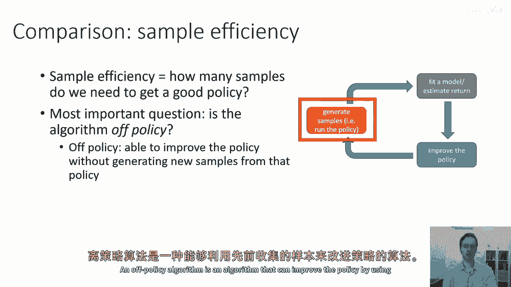
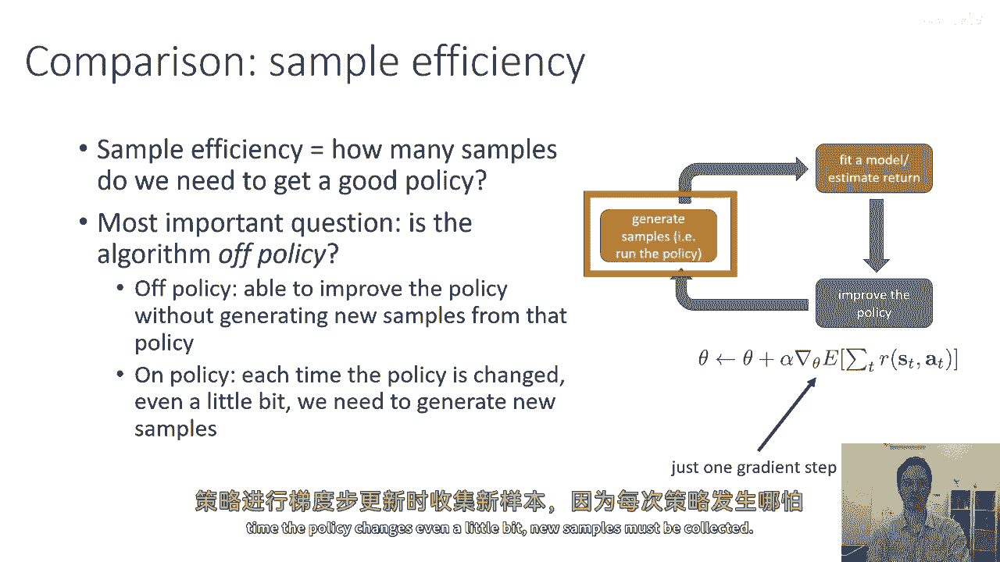
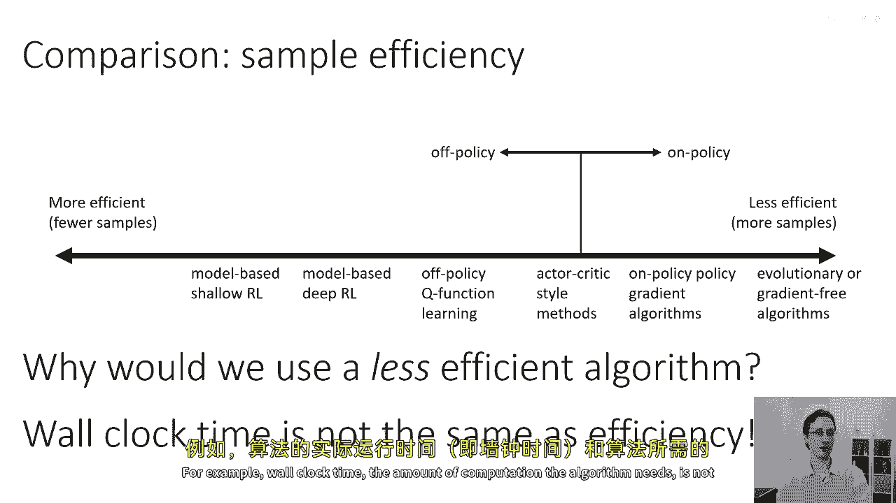
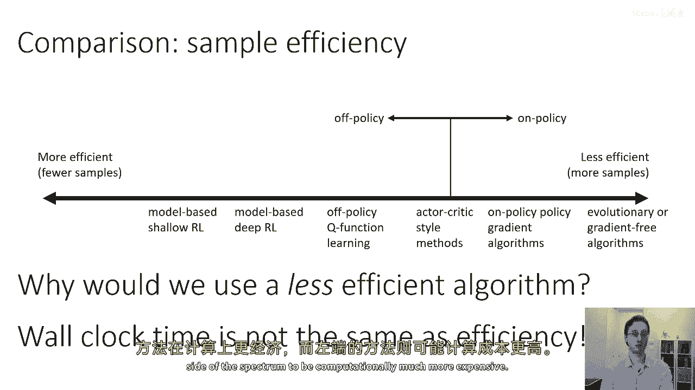
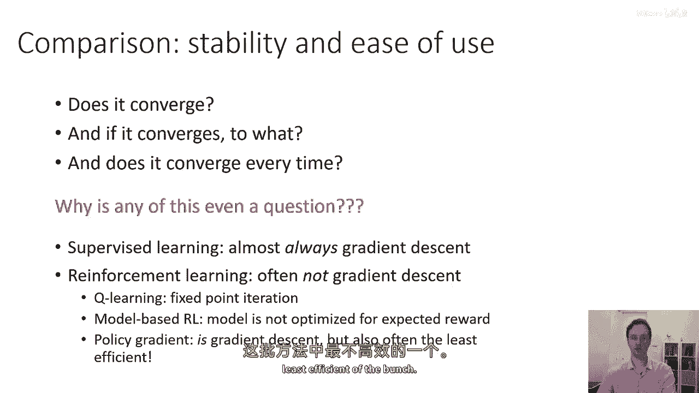
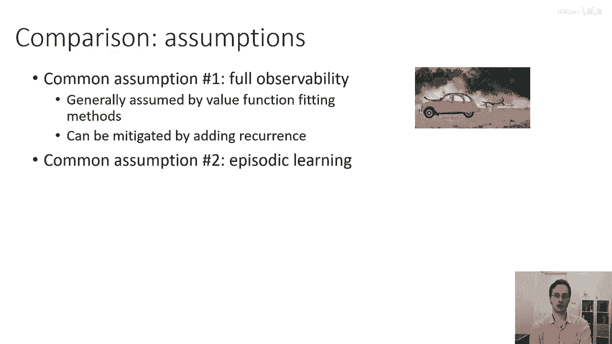
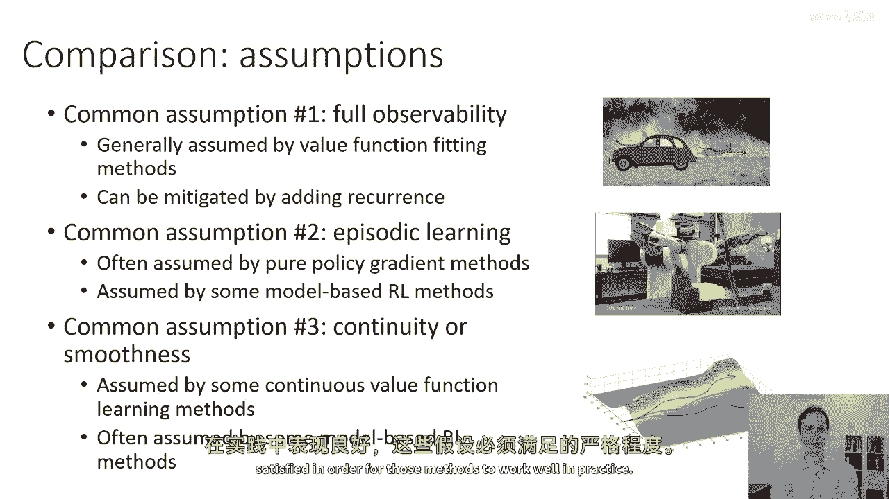

# P13：p13 CS 285： Lecture 4, Part 5 - 加加zero - BV1NjH4eYEyZ

所以，为什么我们有这么多不同的回馈学习算法，为什么我们不能在几堂课中就教给你一个反馈学习算法，然后就结束了，为什么我们需要一整门课程，嗯，这些反馈学习算法有许多权衡。

嗯，这将决定哪一个在你特定的情况下工作最好，所以，一个重要的权衡是不同算法之间的，我们将讨论这个，随着我们接下来几堂课的进行，是样本效率的意思，当你执行这个橙色框中的事情时，当你在环境中生成样本时。

你需要多少样本才能得到一个好的策略，另一个权衡是稳定性和易用性，反馈学习算法可能相当复杂，它们需要权衡许多不同参数，你如何收集样本，你如何探索，你如何拟合你的模式，你如何拟合你的价值函数。

你如何更新你的策略，每个权衡和每个选择往往引入额外的超参数，这可能对于你的特定问题来说有时是困难的选择，不同的方法也会有不同的假设，例如，它们能否处理随机环境，或者只能处理确定性环境。

它们能否处理连续的状态和动作，只能处理离散动作，或者只能处理离散状态，它们能否处理期限问题，意味着，具有固定资本T期限的问题，或者它们能否处理无限期限问题，其中T趋于无穷大，或者两者都有。

并且在不同设置中，某些事情是容易或困难的，例如，在一些设置中，可能更容易表示策略，即使环境的物理特性非常复杂，而在其他设置中，可能更容易学习模型，而不是直接学习策略，每个权衡都将涉及一些设计选择，例如。

你可能选择一种效率不高的算法，为了有一个更容易使用的东西，或者为了有一个可以处理随机和部分观察问题的东西，或者你可能选择一种非常高效的算法，因为你的样本非常昂贵，但 then 愿意接受一些其他限制，如。

例如，只能允许离散动作，所以，我们通常必须根据我们面临的特定问题来做出这些权衡。

让我们首先谈谈样本效率，因为它是一个非常大的概念，所以样本效率指的是我们需要获取多少样本才能得到一个好的策略，基本上我们需要从策略中采样多少次，直到我们可以使其性能良好，那是橙色的盒子。

在确定算法样本效率的最重要问题中，是否算法被称为离线策略算法，或者不是离线策略算法是那些可以使用先前收集的样本来改进策略的算法。

在线策略算法必须在每次策略更改时丢弃所有样本，策略甚至稍微改变就会产生新的样本，因此，在线策略算法可能效率大大降低，嗯，例如，一个政策梯度算法，这是一个在线策略算法。

每次它沿着策略取梯度时都必须收集新的样本，因为每次策略稍微改变。

都必须收集新的样本，所以总的来说，如果我们想要查看一种谱系，以更有效的算法在左边，效率较低的算法在右边，谱系的主要分界线是，它是否是在线策略算法还是离线策略算法，在效率较低的算法的极端端。

将会是像进化或无梯度方法这样的东西，然后是在线策略政策梯度算法，然后是演员批评风格的方法，这些方法可以是在线策略或离线策略，然后是纯粹的离线策略方法，如Q学习，然后是可能基于模型的深度RL方法。

基于模型的壳RL方法等，但我们可以说，我们为什么 ever 想要使用效率较低的算法，所以似乎我们应该选择谱系左边的东西。

这是因为随着我们向左边移动，其他权衡可能不再在我们 favor，例如，时钟时间，算法需要的计算量并不等同于样本效率。

所以也许在你的应用中生成样本实际上是非常便宜的，也许你正在使用一个非常非常快的模拟器，例如，如果你在学习如何玩一个游戏，如棋类游戏，模拟棋类游戏非常快。

所以大多数计算时间都将用于更新你的价值函数、模型和策略，在这种情况下，你可能对样本效率并不在意，而且，有趣的是，这些算法的时钟时间往往被翻转，所以如果你的模拟非常便宜，这些算法的时钟时间往往被翻转。

所以如果你的模拟非常便宜，你可能实际上会在光谱的右端找到这些东西，为了计算上更便宜，而光谱的左端东西计算上要昂贵得多。

稳定性和易用性，嗯，当涉及到稳定性和易用性时，我们可能会问问题，比如我们的算法是否收敛，意味着，如果我们运行它足够长时间，它是否最终会收敛到一个固定的解决方案，还是它会持续振荡或发散，如果它确实收敛。

它收敛到什么，它是否收敛到强化学习目标的局部最优解，还是任何其他明确定义的目标的局部最优解，到这个时候你可能会问，为什么任何这一切甚至都是一个问题，因为通常当我们处理监督学习或某种明确的时候。

尤其是凸优化方法，实际上，我们只关心在强化学习中收敛的方法，收敛的算法实际上是一种稀有的奢侈品，而且在实践中我们使用的许多方法并不保证在一般情况下会收敛，因此，这是因为强化学习往往不是纯粹的梯度下降。

也不是纯粹的梯度上升，许多强化学习算法实际上是固定点算法，只有在非常简化的表格离散状态假设下才提供收敛保证，这些假设在实践中往往不 holds，在理论上，许多最流行的强化学习算法的收敛。

如Q学习算法的实际上是一个开放问题，所以Q学习是一种固定点迭代，基于模型的强化学习是一种特殊的情况，因为模型实际上不是以强化学习目标优化的，模型被优化以成为一个准确的模型，模型训练本身是收敛的。

但没有保证得到一个更好的模型，实际上会得到更好的奖励值，策略梯度是梯度下降或技术上的上升梯度，嗯，但也是这群中最不效率的。

价值函数拟合是一个固定点迭代，并且最好它最小化拟合的误差，它最小化被称为贝尔曼误差的东西，意思是你的价值函数预测值准确，但这并不意味着，你的价值函数产生一个奖励好的策略。

并且最坏价值函数拟合甚至不最小化贝尔曼误差，最坏的情况是它甚至可能偏离，许多，流行，深度强化学习价值拟合算法并不保证会收敛到任何地方，在非线性的情况下，如果你使用神经网络，基于模型的强化学习。

模型最小化拟合误差，这将肯定收敛到一个好模型，但是，没有保证一个好的模型将导致一个更好的策略，政策梯度是唯一实际执行真目标梯度的方法。

但是，正如我所说，它是这群中最不效率的，许多强化学习算法都会假设完全的可观察性，这意味着你有访问状态的权限，而不是观察，换句话说，你观察到的东西满足马尔科夫性质。

所以，没有汽车在前方阻挡猎豹，这是大多数价值函数拟合方法的一般假设，可以通过添加像重复性和记忆这样的东西来缓解，但是，一般来说，这是一个挑战，另一个常见假设。

这个假设与政策梯度方法很常见是期限学习，看一个机器人进行期限学习，你可以看到它尝试一次，然后重置，然后尝试另一次，这种能够重置并反复尝试的能力经常被纯政策梯度方法假设。

尽管这不是大多数基于价值的方法的技术假设，他们通常在这种假设被满足时工作最好，它也被一些基于模型的强化学习算法假设，另一个在基于模型方法中非常普遍的假设，尤其是在模型方法中，特别是连续价值函数学习方法。

是连续性或平滑性，这被一些连续价值函数学习方法假设，它经常被基于模型的强化学习方法，源自最优控制，假设，这些方法确实需要连续性或平滑性才能工作良好，随着我们接下来几周的讨论各种强化学习算法。

我会指出这些假设，当我们讨论时，但请记住，许多这些方法将在它们所假设的类型和这些假设必须严格满足的程度上有所不同，以使这些方法在实践中工作良好。

