# P15：p15 CS 285： Lecture 5, Part 1 - 加加zero - BV1NjH4eYEyZ

今天我们将介绍我们的第一个强化学习算法。

它被称为策略梯度，现在，策略梯度在某种程度上是强化学习最简单的算法，因为它们直接尝试区分强化学习的目标，然后，对政策参数进行梯度下降，以使政策更好。

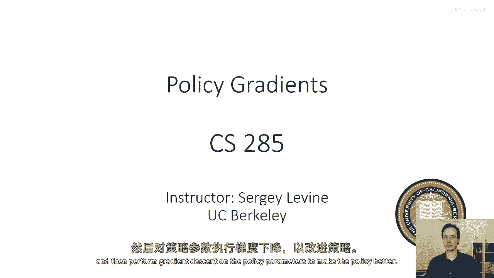

所以，首先，让我们回顾强化学习的目标函数，从上次的强化学习中，我们有一个政策，我们将其称为pi，这个政策有参数theta，并且政策定义了一个动作的分布，一个条件要么是状态的s，要么是观察的o。

稍后在讲座中我会回到部分观察的情况，但现在我们将只专注于依赖于状态的政策，如果政策被表示，例如，由一个深度神经网络表示，然后theta表示政策的参数，它们是神经网络中的权重。

这个网络接受状态或观察作为输入，并产生作为输出的动作。

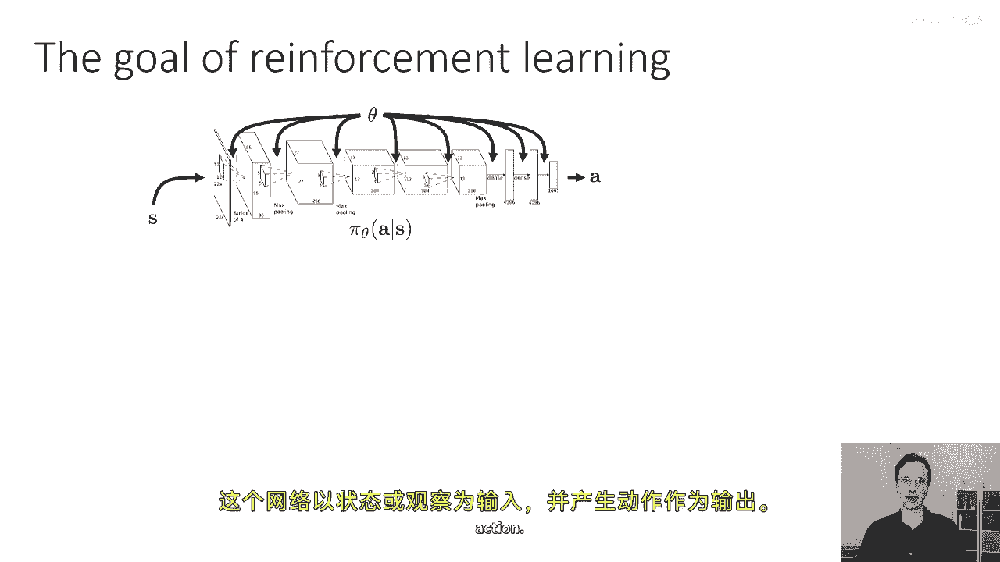

下一个状态由转移概率确定，这些概率取决于当前状态，"并该政策的行动结果"，"当然"，"然后，根据转移转移，下一个状态被采样"，"概率被再次输入到策略中，以确定下一个动作，如此循环往复。"。

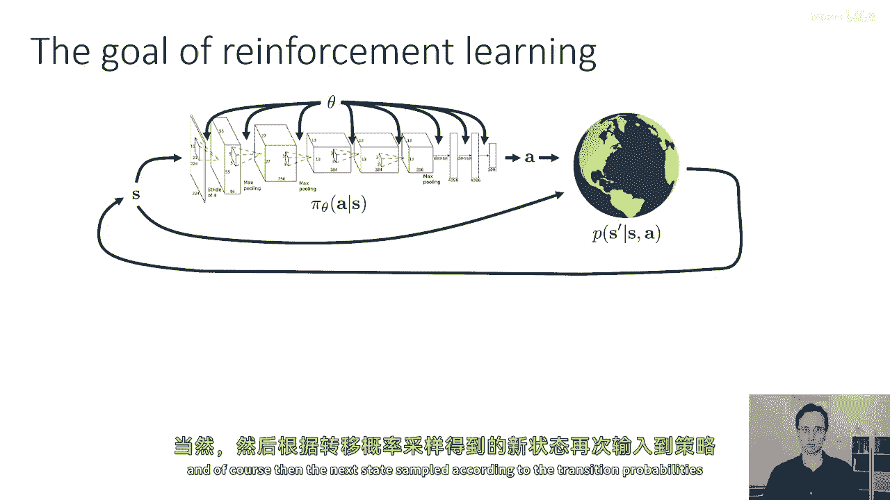

"这个过程可以像我们上次看到的那样使用，来定义一个轨迹分布"，"轨迹分布是对一系列状态和动作的概率分布"。

所以这是一个在s上的分布，逗号后。"一个逗号，两个a，两个s，三个a，一个四，三个a，一个s，四个。"。

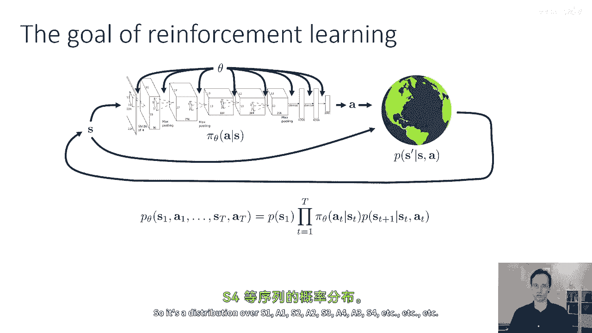

等等，等等，等等，而且我将使用下标theta来表示。

当我写轨迹分布时，以强调轨迹分布依赖于策略参数theta，我们可以通过概率链规则来写它，作为s one初始状态分布的产品p of s one。

然后对所有时间步骤的政策概率pi theta a t给定st时间的产品，s t的转移概率p of s t，加上给定s d a t的1，我将使用tau作为符号的缩写。

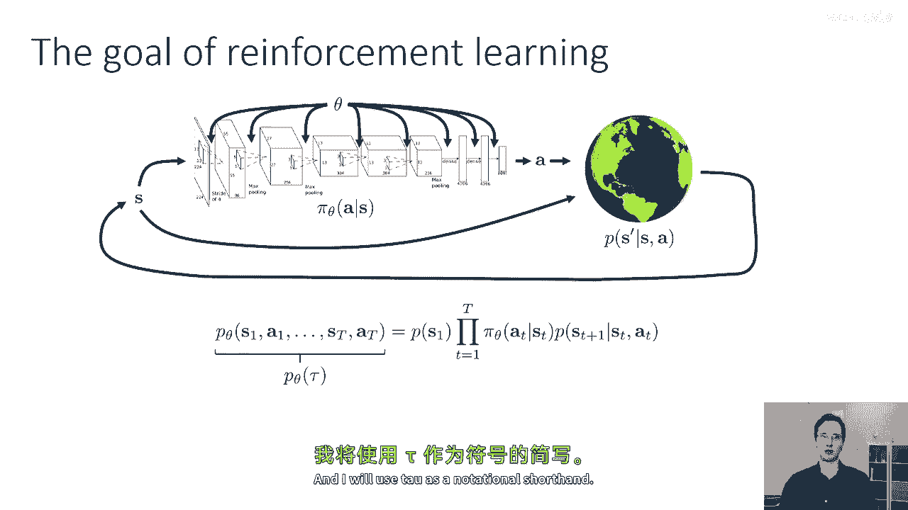

每当你看到我写tau，那就是意味着s一个逗号，一个逗号，s两个逗号，两个逗号，s三个等等，等等，等等，一直延伸到s大写的t，大写的t现在，关键地，当我们开发模型时。

我们将在今天的讲座中覆盖的一类自由强化学习算法。

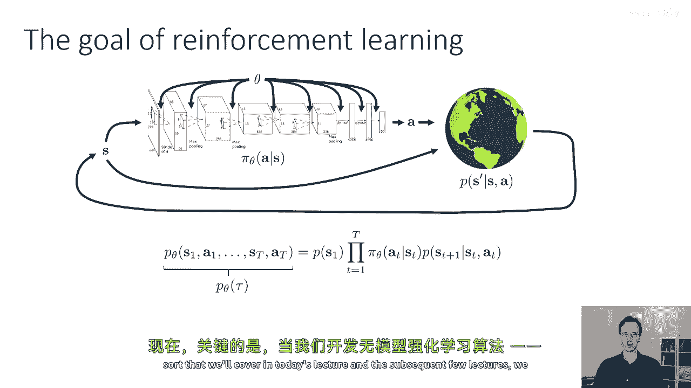

以及接下来的几堂讲座中，我们通常不假设我们知道状态转移概率p(s_t)，加上给定s_d_a_t的一个，也不假设初始状态概率p(s_one)，我们只假设我们可以与真实世界交互，这实际上从那些分布中采样。

正如我们在上一堂讲座中所见，强化学习的目标可以写成在这种轨迹分布下的期望。

因此我们有我们的奖励函数r(s， t)，逗号t，我们想要计算在轨迹下奖励和的期望值，其中轨迹按照p_theta(tau)的分布来分布，然后我们希望找到最大化这个期望值的参数theta。

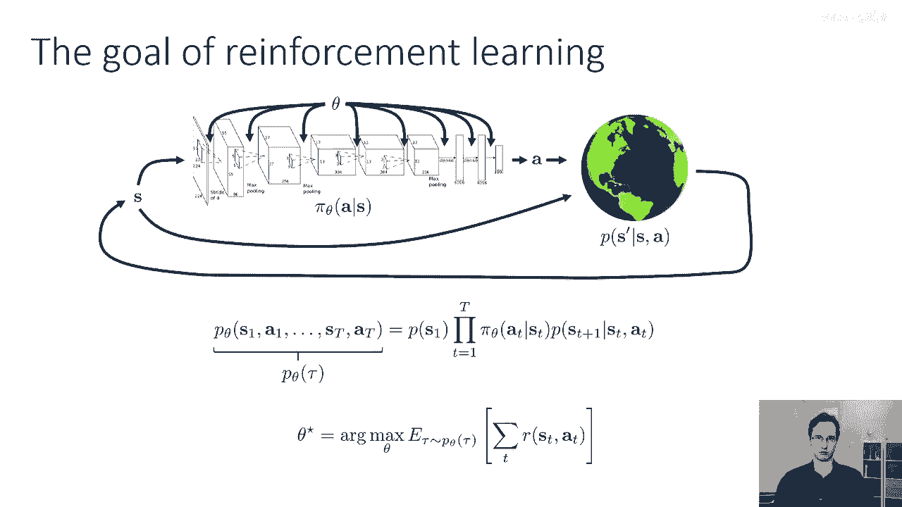

正如我们在上一堂课中所见，我们可以通过线性期望将和推出期望之外，然后表达期望为一个边缘期望，这允许我们定义RL目标的有限时间版本，和无限时间版本，在今天的讲座中，我们将专注于有限时间框架的版本，尽管。

将政策梯度扩展到无限时间框架中是可能的，通过使用价值函数，我们将在下一次讨论，所以目前我们将专注于有限时间框架的版本，其中和是在内部的期望中。

但我们将后来返回其他版本，好的，在我们讨论如何优化强化学习目标之前，让我们首先讨论如何评估它，所以如果我们有一个参数化的策略theta，我们能否大致找出强化学习目标的值，我将使用theta的j作为缩写。

对于在p theta下，tau的期望值，奖励的总和，所以如果你看到我写j theta，我只是在引用整个期望，如果我们不知道s one的p，我们也不知道给定s t的p s t plus one。

我们如何估计theta的j，所以花一点时间来思考这个问题，因为我们假设我们可以在我们的政策在现实世界中运行，这相当于从初始状态分布和转移概率中采样。

我们可以通过简单地从我们的政策中滚动来近似估计theta的j，我们在现实世界中运行我们的政策n次，以收集n个样本轨迹，如果你看到我写tau下标i，那指的是第i个样本，如果你看到我写s下标，我，逗，t。

那指的是时间步t在第i个样本中，我们已经从这些样本中生成了p theta的tau，我们可以得到一个无偏的总奖励预期值的估计，仅仅通过沿每个样本轨迹累加奖励，然后按照这个方程对奖励进行样本轨迹的平均。

我们生成的样本越多，n就越大，我们对这个预期值的估计就越准确，所以从视觉上看，你可以这样想，我们将生成一些轨迹数，在这个例子中，每个轨迹三个，将会将他们的奖励相加，看看哪些是好的，哪些是坏的，然后。

我们将它们平均起来，这将给我们一个关于θ的j估计值，现在，当然，实际上，我们不仅想要估计目标，我们实际上想要改进它，所以，要改进目标，我们需要想出一种方法来估计它的导数，并且关键地。

对导数的估计本身需要可行，如果不知道初始状态概率也没有过渡概率，所以再次，为了书写的方便，我将使用p theta of tau来表示轨迹分布，实际上，我将使用r of tau作为缩写。

对于轨迹tau的所有时间步骤的奖励和，这将使后续推导中的符号更容易解析，现在如果我有一个期望值，我可以将预期的值扩展为离散变量的和，或对于连续变量，概率和值的乘积的积分，所以，p下tau的r期望值。

tau的theta等于对所有轨迹的p的积分，tau的theta乘以tau的r，现在我们可以开始工作我们的导数，所以我们的目标是计算theta关于j的导数或梯度，相对于theta。

并且由于导数运算符是线性的，我们可以将它推入积分，所以，这个导数等于对所有轨迹的积分grad theta的积分，P theta，Tau乘以r的tau，而且我在这个讲座中经常会说只是p of tau。

通常当我说p of tau时，我只是意味着p theta的tau。

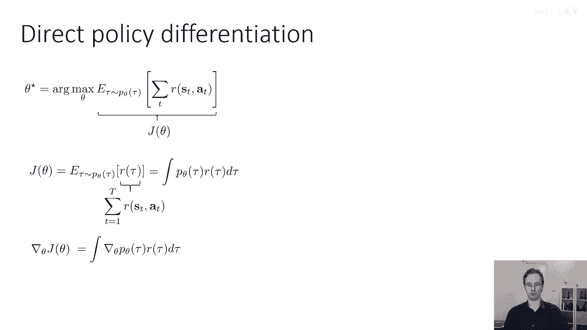

好的，所以到现在为止，这实际上并没有给我们一个实际的方法来评估策略梯度，因为grad theta p of tau需要穿过未知的初始状态分布，并且未知过渡概率，但是，有一个非常有用的身份。

它将允许我们重新写这个方程，以一种我们可以仅使用样本来评价的方式，就像我们评估目标值一样，所以我们将使用的便利身份是，而且，基本上，这是这个整个推导中唯一的数学机智是，如果我们有一个像这样的方程。

如果我们有p of tau乘以grad log p of tau，我们可以把它写为p of tau乘以grad p of tau除以p of tau，这直接跟随从对数导数的方程。

所以如果你打开一本微积分教材，查找你知道的导数的定义，d(log x)/dx，你会发现这基本上等于dx/x对吧，这意味着grad(log p)等于grad p/p，但现在你会看到，我们分母有一个p。

我们有一个p在分子上，所以这些会抵消，这意味着这等于grad p，我们要做的就是我们将这个身份反过来应用，所以我们这里有一个grad p，"我们将替换这个等式的左边"，将其重写为p次对数p的梯度。

"现在，你将注意到我们对所有p轨迹的积分是tau"，"有时一些数量"，这意味着我们也可以把它写成一个期望，我们可以将其写成在p下ta的期望值，"对tau的logp乘以r的tau"。

"这暗示着我们可能走在正确的道路上"，"因为当我们有期待时"，"我们可以使用样本来评估那些期望"，我们还没有完成，因为我们仍然有这个grad log p tau项。

所以让我们稍微处理一下那个，让我们嗯，再次提起我们的轨迹分布方程，所以p of tau，也就是另一种写法p of s one comma，等于这个我们之前看到的产品，一个逗号。

S two等等等于这个产品，如果我们取两边的对数。

对数的积等于对数的和，这意味着我们可以将log p of tau写成和的形式，log p of s one，加上从t等于一到大写t的求和，下的政策下的log概率，加上log转移概率，现在。

我们将整个东西替换为grad log pi，抱歉，grad log p，我们以theta为参数对这个进行求导，现在，log p of s one对theta的导数只是零，因为s的p导致θ无关，给定st。

θ关于logp(s)的导数是logp(st+1)关于θ的导数加上s的p关于θ的导数，a_t关于θ的导数也是零，因为过渡概率也关于θ无关，所以这意味着经过简化后，留下的只有logπθa_t给定st的项。

这些实际上是我们只能评价的项，因为我们知道政策的形式，并且我们可以评估政策的自己log概率。

所以收集所有剩余的项并展开我们的记号，我们剩下这个关于政策梯度的方程，θ关于j的梯度是等于在pθ下τ的期望值，从t等于一到资本t，gradθlogπθa_t给定st的和的期望值，奖励的总和。

现在期望值内部的一切现在都是知道的，因为我们有访问政策π的能力，并且我们可以评估所有样本的奖励，所有未知项，初始状态分布，以及过渡概率只在期望值所取的分布中出现，所以这意味着如果我们想要评估政策梯度。

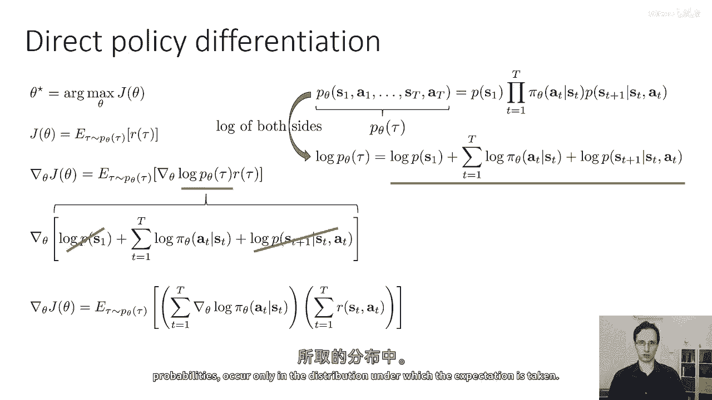

我们可以使用评估目标值相同的技巧，我们可以简单地运行我们的政策，这将生成来自pθ的τ的样本，累加他们的奖励来确定哪条轨迹好或坏。

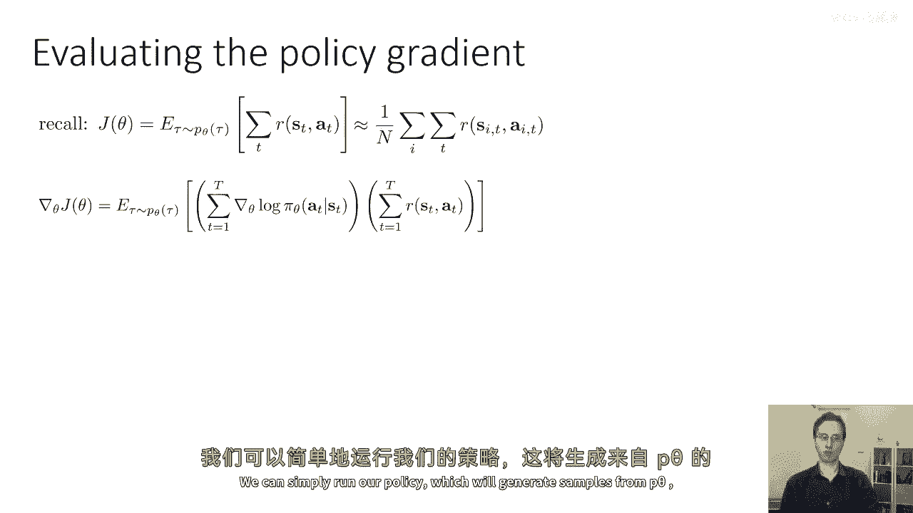

然后乘以gradlogπ的乘积，一旦我们以这种方式估计了梯度，我们可以通过梯度下降来改进我们的政策，以旧政策参数为基础，并加上政策梯度乘以学习率α，如果我们回想起之前讨论的强化学习算法的解剖结构。

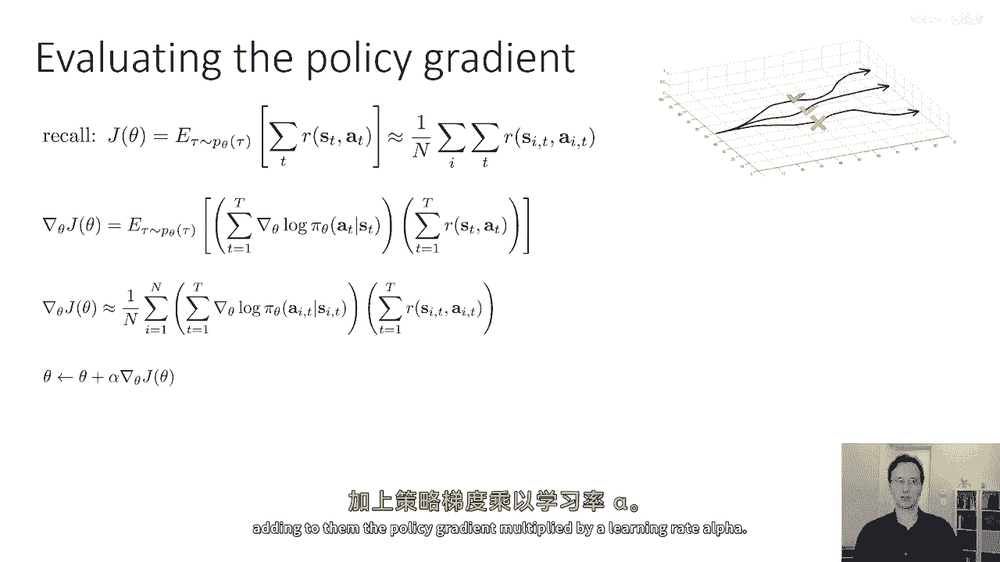

在橙色框中覆盖的，这里对应于生成那些样本的过程，这是我们正在求和的那些，绿色框指的是沿着每个样本轨迹累加奖励，然后我们可以计算政策梯度，蓝色框对应于梯度下降的一步，现在。

这个程序给我们提供了基本的政策梯度算法，也称为reinforce算法，reinforce的缩写是由威廉姆斯在九十年代给第一个政策梯度方法的，它包括三个步骤，根据πθa从s采样轨迹N次。

运行政策在现实世界中，然后按照这个方程计算政策梯度，并取一步梯度下降。

这就是基本的政策梯度算法，我所覆盖的到目前为止，在这堂课中基本上给你提供了理解政策梯度基础的所有数学工具，我已经覆盖的这么多，在这堂课中基本上给你提供了理解政策梯度基础的所有数学工具，政策梯度的基础。

但是如果你试图按照我所描述的方式实际实现政策梯度。

它可能不会工作得很好，所以在讲座的剩余部分，我们将讨论一些关于政策梯度在做什么的直觉，然后讨论如何实际实现它们，所以它们在实践中工作得很好。

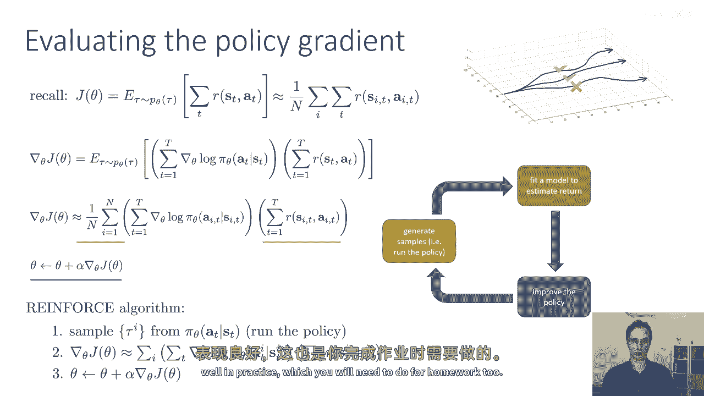

这是您需要完成的作业。

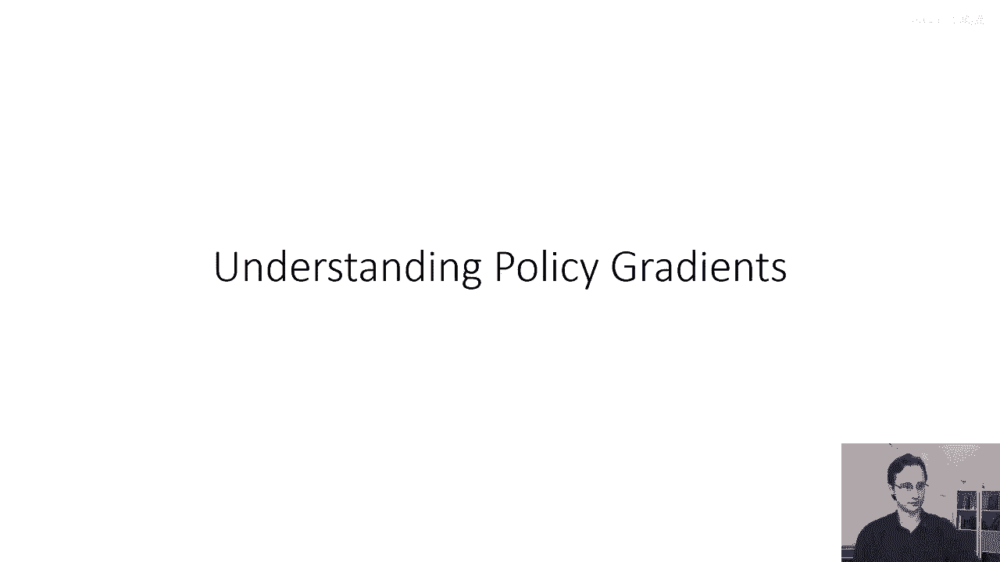