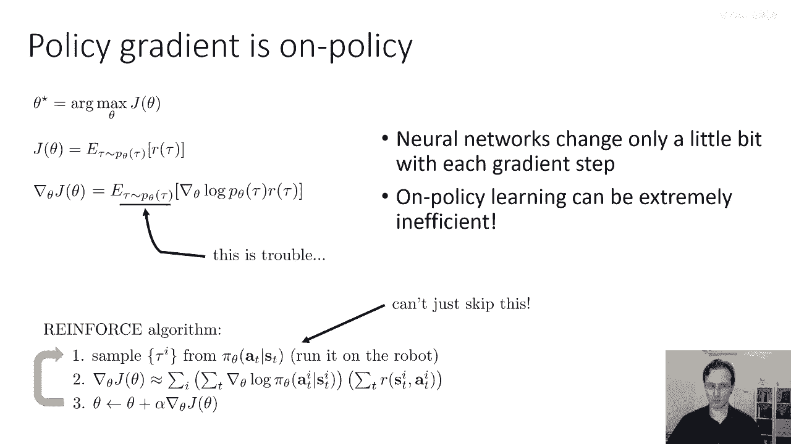
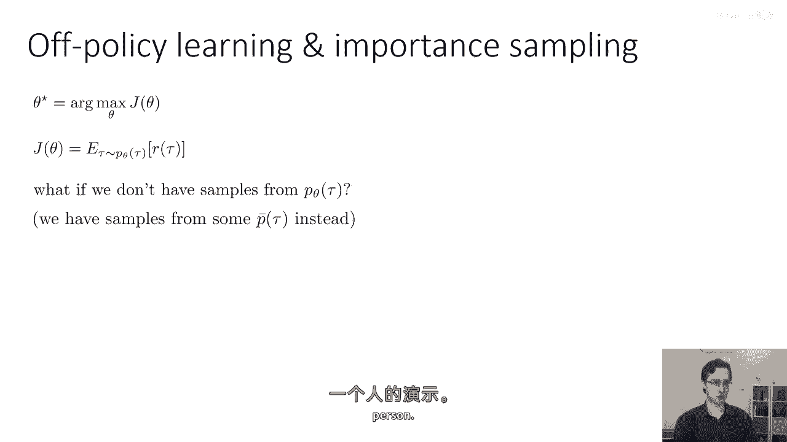
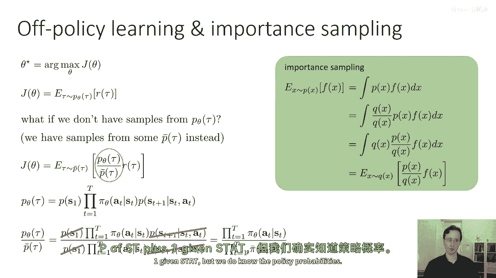
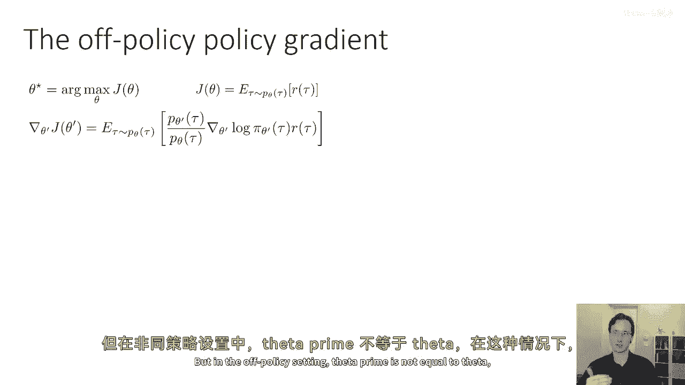
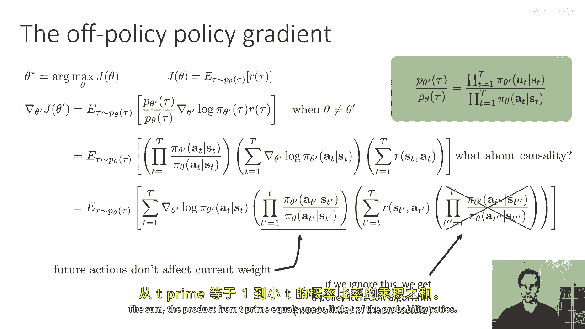
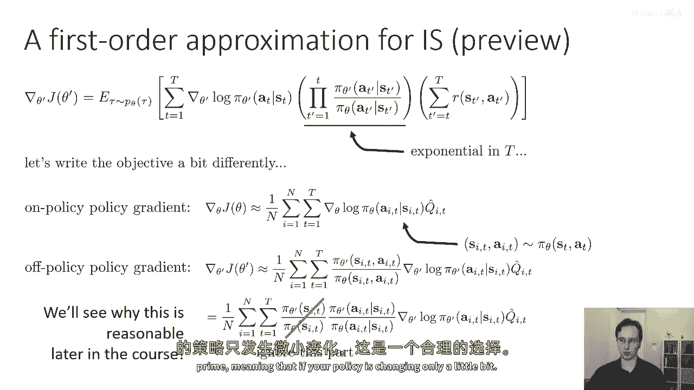
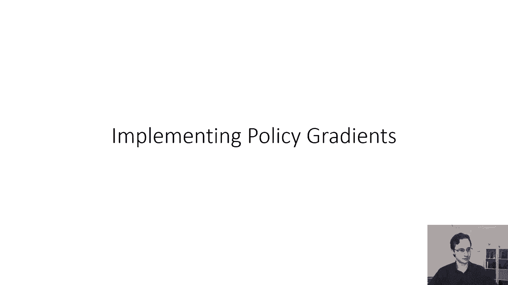

# P18：p18 CS 285： Lecture 5, Part 4 - 加加zero - BV1NjH4eYEyZ

"在接下来的讲座部分中"，"我们将讨论如何将政策梯度从在线设置扩展到离线设置。"，"进入政策边缘地带"，"所以，我想要首先覆盖的部分是，为什么政策梯度被看作是一个在线策略算法。"，"政策评分"。

"或者是他们作为政策算法的经典例子"，"因为它们每次修改政策都需要生成新的样本"，"这个问题的原因是，如果你看政策梯度的形式"，在参数为p的θ下，tau的期望值是grad，"对tau的对数"，τ的次数。

实际上，预期的值是在θ的p下对τ的，这是问题，我们在政策梯度中计算这个期望的方式，是通过使用最新的政策来采样轨迹，但由于在参数向量θ处评估的导数需要按照θ采样的样本，每次我们改变θ时。

我们都必须丢弃我们的样本，这意味着政策梯度，一种非策略算法，每个更新步骤都需要新鲜的样本，我们不能从其他政策中保留数据，甚至在使用政策梯度时，甚至不能从我们自己之前的政策中获取数据。

所以在强化学习算法中，我们有一步，那就是从政策中采样，第二步是评估梯度，第三步是采取梯度上升的步骤，我们真的不能跳过第一步，所以我们不能使用过去的政策样本，我们不能使用来自其他来源的样本，比如演示。

我们必须每次时都要从我们的政策中生成新的样本，但现在当我们想要执行深度强化学习时，这个问题有点麻烦，因为神经网络在每个梯度步骤中只改变一点点，因为神经网络高度非线性，我们不能取真的很大的梯度步骤。

这意味着在实际应用中，我们通常最终会采取大量的小梯度步骤，但每个这些小的梯度步骤都需要通过在你的系统中运行你的政策来生成新的样本，这可能涉及到在你的真实世界中运行你的政策，或者使用昂贵的模拟器。

所以当样本生成的成本很高时，政策梯度可能会变得非常昂贵，无论是计算成本还是实际的货币成本，因此，用这种方式进行政策学习可能会非常低效，我应该，当然提到反过来，如果样本非常便宜。

那么策略评估算法可以是一个很好的选择，因为它们相当简单，相当直接容易实现，并且往往工作得很好。

但如果我们想要使用离线策略样本，我们可以使用被称为重要性采样的东西来修改策略梯度，这就是我们接下来要讨论的内容，那么如果我们没有来自p theta的tau样本，如果我们有来自其他分布的样本。

我将称其为p bar的tau，现在p bar的tau可能是以前的政策，所以你可能在尝试重用你已经生成的旧样本，或者甚至可能是其他分布，如，例如，来自人的演示。

好的，所以，我们将使用的修改政策梯度的技巧是，为了适应这种情况，被称为重要采样的东西，重要采样是一种通用的技术，用于在分布下评估期望值，当你只有来自不同分布的样本时，所以。

这里是我们如何一般性地写出重要采样的，假设我们想要计算某个函数的期望值，F(x)在x的分布p(x)下，我们知道，嗯，F(x)的期望值是x对p(x)乘以F(x)的积分，如果只有对x的分布q有访问权。

你可以将积分内部的数量乘以x的q除以x的q，对，因为你知道x的q除以x的q只是等于一，并且你可以总是乘以一而不改变值，现在，我们可以稍微重新排列这些术语，我们可以基本上说。

x的q除以x的q乘以p的x等于x的q，乘以p的x除以x的q，对，我们只是将分母从一移到了另一个，现在可以将此写成在q下x的期望值，所以你可以说这等于在q下x的期望值，p(x)除以q(x)乘以f(x)。

这里没有近似，这是完全准确的所有，这意味着重要采样是无偏的，当然，这个估计量的方差可能会改变，但在期望中，它应该会保持不变，所以现在我们将应用同样的技巧来评估策略梯度，在这里，q将是p_bar。

p将是p_theta，"所以，这里是RL目标的重要采样政策评分版本"，"看起来像是进口版的"，"RL目标的重要采样版本将是在某个其他分布下的平均值"，"p_θ_τ除以p_τ的横截面乘以τ的半径"。

所以那就是真正的目标，"这就是我们现在的重要性权重"，"如果我们想要理解重要性权重等于什么，那就"，"我们可以使用描述轨迹分布轨迹的标识符，利用链规则"。

"并且我们可以将那个代入tau的p theta和tau的p bar中"，"现在我们知道，τ的θ偏度和τ的反偏度都有相同的初始状态分布"，1。 s 状态的同一过渡概率，2。 给定 s t 和 a t。

s t+1 的概率，3。 它们仅由其策略不同，4。 因为它们都在相同的 MDP 中运行，5。 我们的分布具有策略 πθ，6。 采样分布，7。 策略 πbar，8。 这意味着当我们取轨迹分布的比值时，9。

 初始状态项和过渡项被取消，10。 我们只剩下策略概率产品的比值，这就是非常方便的，因为通常，我们并不知道s1的p或者s2的p，再加上已知的sdat，但我们知道策略概率。

所以这允许我们实际上评估这些重要的权重，好的，所以现在让我们使用重要性采样来推导策略梯度，我们将再次使用我们的便利身份，所以嗯，"假设我们有来自p theta的tau样本"。

"我们想要估计新参数向量theta prime的值"，"目标参数θ'将等于在参数θ下τ的期望值"，"重要性乘以奖励的结果"，所以，τ的θ'阶导数除以τ的θ阶导数乘以τ的r。"现在请注意这里"。

"这个目标的唯一部分实际上依赖于theta prime"，"这取决于我们的新参数，是分子和重要性权重"，"因为现在我们的样本来自一个来自不同政策的分布"，"τ的极角"，所以这就意味着当我想要计算导数时。

以θ'关于jθ'的偏导数为参考，我只需要担心分母中的这个项，所以这就是导数，我只需要将依赖于θ'的项替换为其导数，然后我将把我的有用身份重新代入，所以身份告诉我，grad θ'。

Pθ'关于τ的偏导数等于Pθ'关于τ的偏导数，乘以grad log，Pθ'关于τ，所以我把它放回去，现在我得到这个方程式，当你看看这个方程式，你可能立即认出它是我们得到的精确方程式。

如果我们取了策略梯度并只是以一种重要的方式插入，实际上你可以从那样得出重要的样本策略梯度，我也想在这张幻灯片上用这种方式推导它，只是为了让你能看到，嗯，等价性，嗯，有趣的是，如果你在本地估计这个梯度。

所以，如果你使用重要的采样推导来评估在theta处的梯度，等于theta prime，然后重要性权重等于一，你恢复原始的策略梯度，所以，这个推导实际上给你提供了一种不同的方式来导出我们之前有的策略梯度。

之前，但在离线策略设置中。

theta prime不等于theta，在这种情况下我们必须回到我们的重要性权重，这是我们之前简单地作为策略概率产品的比例得出的，如果我们现在把它替换在所有三个地方，政策梯度的术语。

重要性权重是pi theta prime over pi theta在所有时间步骤的乘积，grad log pi部分是所有时间步骤的grad theta prime log pi theta prime的和。

并且奖励是所有时间步骤的奖励的和，所以我们在我们的重要采样离线策略策略梯度估计器中有三个术语，我们只是乘以这三个术语，那么关于因果关系，关于我们无需考虑当前动作对过去奖励的影响的事实，嗯。

我们可以在两种方式中工作，在这种情况下我们再次将奖励和重要性权重分配到和中，过um或过grad log p's，我们得到从t等于一到资本t的grad log pi times，过去所有重要性权重的乘积。

你可以直觉地认为这是你使用新策略到达这个状态的概率，未来行动的奖励权重之和，所以未来行动不会影响当前权重，这是可以的，问题是这个，嗯，最后这部分，嗯，嗯，这部分可以，嗯，你知道，这部分可以，嗯，你知道。

有问题，它可以非常大，所以在第一部分，它出来如果我们忽略这个最后部分，如果我们忽略对奖励的权重，我们恢复被称为策略迭代算法的东西，你可以实际上证明一个策略迭代算法仍然会改进你的策略，它不再是梯度，但是。

这是一种明确定义的方式，可以提供对您政策的保证改进，所以，不要担心这个问题，然而，我们将在更详细的程度上讨论策略迭代，目前，我们将在随后的讲座中讨论，请相信我，如果你忽视乘以奖励的重要性权重。

如果你基本上忽视这个最后项，你仍然得到一个会改进您政策的程序，对于第一个项，这并不成立，从t'到小t，产品等于1的概率比值的和。

所以第一个术语是麻烦的，嗯，第一个术语麻烦的原因是因为它与大T指数成正比，假设重要性权重都小于一，这是一个相当合理的假设，因为你根据πθ采样了你的行动，所以你的行动可能比在πθ'下有更高的概率πθ。

所以你知道有一个好机会你的重要性权重将小于一，如果你将许多，许多数字相乘，每一项都小于一，然后它们的乘积会以指数速度趋近于零，而且这是非常大的一个问题，它本质上意味着你的标准差会以指数速度趋近于无穷大。

而且政策梯度已经具有高方差，现在，通过乘以它们，你将使方差进一步爆炸，由这些高方差重要性权重，这是一个非常糟糕的想法，现在，为了理解这个术语的作用，我们可以稍微重新写我们的目标，我们做这一切的原因是。

因为我们真的就只是想找一个删除那个术语的借口，所以试着找到这个借口，让我们稍微改变我们的目标，嗯，这就是我们的在政策政策梯度，它是我们对所有样本的总和，对所有时间的总和，步长乘以对π的log的梯度。

这个奖励到去的乘积，这个q hat，"这个q就是当t从t'等于t到T时，奖励的和"，但是，我会把它写成"q hat"，"否则，符号将会变得相当复杂"，"现在，我们如何采样我们的i"，"并且。

我们在环境中实际推行我们的政策"，"但你也可以等价地认为它是从状态动作对中采样"，"从时间步t处的边缘状态行动"，"因为当你采样整个轨迹时"，"在每个时间步长中，对应的状态都在行动"。

看起来与你所期望的毫无区别，如果在那个时间步采样自状态动作边缘分布，所以你可以写一个不同的非策略策略梯度，而不是在整个轨迹上进行重要采样，你在状态动作边缘分布上进行重要采样。

所以现在你重要性权重是在theta'下s_i_t， a_i_t的概率，除以在theta下s_i_t， i_t的概率，这本身并不很有用，因为实际上计算这些边缘分布的概率是不可能的。

没有初始状态分布的知识和过渡概率的知识，但是写成这种方式允许我们进行一点技巧，我们可以使用链规则进行分解，我们可以在分母和分子中同时分解这个边际，分解为两个术语的乘积。

状态边际pi theta prime的si，T和动作条件pi theta prime的ai t给定si，T，然后，我们可以想象如果我们只是忽略状态边际，如果我们只是忽略状态概率的比率，嗯。

那么我们得到一个对于重要采样政策梯度的方程，"那与我在幻灯片顶部的相当相似"，"只有产品忽视了所有的比例"，"除非t等于"，"T" 的中文翻译是 "T"。所以。

如果你不希望你的重要性权重以大写字母t的指数形式增长，"你可以尝试忽略状态边缘概率的比率"，"所以你还在考虑行动的概率比率"，"但是忽略状态边缘概率"，这通常不能给你正确的策略梯度，"但是。

我们将在后续的课程中看到"，当我们讨论高级政策梯度时，忽略状态边缘概率是合理的，从意义上说，它可以给你有限的误差，在theta prime与theta相差不大的情况下。

这个简单的见解实际上对于导出实用的，重要样本政策梯度算法非常重要，那些不遭受方差指数级增加的算法，是的，因为当你将所有时间步的重要性权重相乘时，从t prime等于一到t，你获得方差的指数级增加。

因为你的权重指数级地陷落到零，但如果你忽视状态边际率比，那么你只能得到时间步t处的权重，这意味着他们的方差不是指数级增长的，所以我们稍后讨论高级政策梯度时才会学习。

为什么忽视这一部分对于现在来说是合理的，我会告诉你这是一次合理的选择，如果theta接近theta prime。

