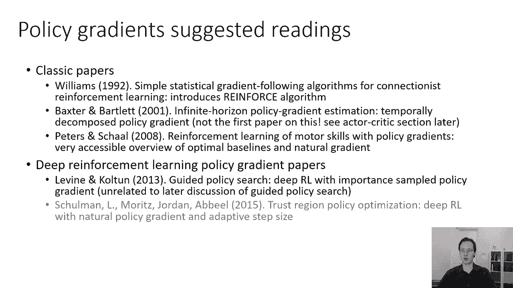

# P20：p20 CS 285： Lecture 5, Part 6 - 加加zero - BV1NjH4eYEyZ

好的，在今天讲座的最后一部分，我将讨论高级策略梯度，这部分材料会比讲座的其他部分快一些，所以如果跟不上，不要担心，请在评论中提出一些问题，我们可以在课堂上更详细地讨论，我们还将在课程后期有一个关于。

甚至更先进的策略梯度材料的完整讲座，所以我想要讨论的特定问题是一个数学问题，影响政策梯度，特别是在连续动作空间中以展示这个问题，让我先描述一个例子问题，但是假设你有一个一维状态空间。

所以您的状态本质上是一条数轴，您的目标是达到状态s等于零，您还有一个一维动作空间，所以让我们假设您位于状态，您的行动可以带你向左或右，您的奖励是负数，s的平方减去a的平方。

所以你根据s零到s的距离的平方来获得惩罚，你也因为采取大动作而获得惩罚，你的策略将是一维的，正态分布，只有两个参数，一个参数k乘以状态，所以，你的平均值与状态成正比，另一个参数确定你的标准差。

sigma，所以，你有k和sigma是你的策略参数theta，所以你可以认为策略基本上就是一个以你当前位置为中心的小高斯分布，你的行动是k乘以你当前的状态，所以你打算走这种吵闹的走。

"希望朝着s等于零的目标前进"，现在，"有两个的好处"。"维度参数空间是我们实际上可以可视化到与梯度对应的整个向量场的空间"，在所有参数空间中，"这个数据来自彼得斯和肖尔的一篇优秀论文"。

"我将在讲座的这一部分结束时引用这一点"，这里的小蓝色箭头表示已归一化的梯度，其长度为1。"横轴是第一个参数k，纵轴是"，第二个参数sigma，参数的最佳设置是k等于负一，sigma等于零。

所以它在这个图的中间底部，但从看这个图，你可能注意到一件事，是箭头实际上并不指向最优，这是因为随着sigma越来越小，关于sigma的梯度变得越来越大，如果你看概率分布的形式，嗯，对于高斯概率。

你会注意到这是因为概率随着sigma的平方分之一而跟踪，所以当你取导数，你会得到一个sigma的四次方分之一的项，这意味着当sigma变小时，导数变大，关于k的导数仍然存在。

但是关于sigma的导数相对要大得多，所以当我们归一化梯度时，当sigma变小时，sigma部分完全主导，所以这意味着如果我们跟随，"这个梯度将带领我们走很长一段路"，"到达最佳参数设置需要很长时间"。

"因为我们将把所有的时间都用来减少西格玛"，现在，"对于熟悉数值方法的你们"，可能会认为这是由于身体状况不佳导致的问题，"直觉是，这实际上是与优化相同的问题"，让我们假设。

"一个特征值比值非常巨大的二次函数"，所以，"如果你有一个二次函数，其中有一些特征值非常大"，"并且有一些非常小的"，"然后，第一种梯度下降方法在这种函数中真的会遇到困难。"。

这基本上是同一种类型的问题，"再次，如果你在这一点上有一些数值方法的背景"，你可能也在思考得很好，"如果问题是身体状况不佳"，"我们能使用预处理器解决那个问题吗？"，"答案是肯定的"，"实际上。

接下来我们要描述的内容可以被视为一个预处理器"，但是，我们将从稍微不同的角度来讨论这个问题，从参数对梯度的依赖性的角度来看，所以我接下来要讨论的，是如何我们能够到达协变量或自然的政策梯度。

这是前一张幻灯片的图片，当我们通过政策梯度进行梯度步时，并取梯度上升步，为这种梯度选择步长可以非常精细，因为某些参数对政策分布影响很大，而一些影响不大，所以，找到一个工作良好的步长非常困难。

无论是对于k还是sigma，因为与sigma的导数将变得极其极其大，而k的导数不会那么大，所以这里发生了什么，是不同参数对政策影响的程度不同，一些参数改变了概率很多，而其他参数没有改变太多。

但你想要所有参数都达到最佳值，所以直觉上，你想要做的事情是基本上，对于变化不大的参数，设置较大的学习率，对于变化较大的参数，设置较小的学习率，如果我们想要稍微从数学角度看待这个问题，我们可以做的事情是。

从约束优化的角度来看待一阶梯度上升，所以，一阶梯度上升可以被视为迭代地，解决以下约束优化问题，取与新参数值θ'相关的arg max，那么θ'是原始目标的一阶泰勒展开。

这是由θ'减去θ乘以grad j给出的，其中，grad j是原始目标的梯度，并且你有一个约束，那就是theta prime减去theta的平方应该很小。

所以这就像是在说你的当前参数值周围的一个epsilon球内，找到使线性化目标最大化的参数值，这基本上就是首次梯度下降在做的事情，你可以把alpha看作是基本上的拉格朗日乘数，对于这个约束。

所以那些学习镜像下降或投影梯度下降的人可能会认出这个方程，我们通常选择alpha而不是epsilon，但是alpha基本上就是相应的epsilon的拉格朗日乘数，这意味着当我们做首次梯度上升时。

我们在epsilon球内寻找theta prime的最优值，但是，那个epsilon球在theta空间中，现在，我们的线性化目标只在我们当前策略周围的一个小区域有效，这就是为什么我们不能使用很大的步长。

但是如果你在参数空间中必须选择那个区域，那么选择它就非常麻烦，因为某些参数会改变策略很多，而一些则会改变它很少，所以，直觉上，我们想要干的事情是我们想要某种方式重新参数化这个过程，这样。

我们的步长在政策空间中就会是相等的，而不是在参数空间中，这将基本上重新缩放梯度，所以改变政策很大的参数得到较小的率，改变政策很小的参数得到较大的率，所以这就是基本问题，这控制我们走多远。

而且基本上在错误的空间，所以我们能否重新缩放梯度，所以这不会发生，如果我们相反地迭代解决这个问题，最大化线性化的目标，但是，受到约束是分布变化不能太大。

所以这里d是pi theta和prime之间的一些离散度度量，原点和pi theta，我们想要这个离散度度量小于或等于epsilon，所以我们想要选择一些参数化，独立的离散度度量。

一个不关心你如何参数化你的策略的离散度度量，只是哪个分布它对应，对于，这是KL散度一个非常好的选择，这就是KL散度，KL散度是片段散度和分布的标准离散度，我不会详细解释KL散度的定义或推导。

只是它是分布离散的度量，并且它是参数无关的，这意味着无论你如何参数化你的分布，KL散度都将保持不变，现在KL散度有点复杂，为了插入这种受限优化，我们想要这种约束优化非常简单。

因为我们将在梯度上升过程的每一步中都这样做，但是如果我们对KL散度进行二阶泰勒展开，在点theta'等于theta处展开，那么KL可以表示为大约为一个二次形式，对于这个矩阵f来说。

这就是二阶泰勒展开的定义，并且我们发现f等于被称为Fisher信息矩阵的东西，Fisher信息矩阵是在pi theta下预期的值，那就是你的旧策略grad log pi乘以grad log pi的转置。

所以它是梯度与自身外积的期望值，现在请注意，Fisher信息矩阵在pi theta下是预期的值，这应该立即建议我们可以通过从pi theta中采样来近似它，实际上，我们正在尝试估计这个期望。

这就是实际上，正是我们要做的，所以现在我们已经到达了对我们协变量政策梯度的这种表述，在我们的优化过程中，每一步，我们最大化线性化的目标， subject to 这个近似的散度约束。

这就是 theta  prime 和 theta 之间的差异， under 矩阵 f，所以它就像我们之前有过的，theta  prime 减去 theta，只是之前它是在身份矩阵下。

而现在它是在矩阵 f 下，如果实际上你为这个写下拉格朗日量并求解最优解，你会发现解决方案就是设置新的theta等于theta加上alpha。

其中alpha是f的逆函数乘以grad theta j theta的拉格朗日乘子，所以之前我们有theta加上alpha，grad theta j theta，现在我们有theta加上alpha f。

Inverse grad theta j theta，所以ff基本上就是我们现在的预测器，并且如果你在你梯度前面应用这个f的逆函数，那么你的向量场会以一个非常好的方式改变，这样。

右边的图片就可以显示使用所谓的自然梯度后得到的结果，现在你可以看到，红色的线条实际上非常准确地指向最优解，这意味着你可以更快地收敛，而且，你也不需要花费几乎同样的努力来调整步长，现在。

有许多算法使用了这个技巧，嗯，经典的一种是自然率或自然政策梯度，它选择alpha，一种更现代的，嗯，变种叫做信任区域政策优化，选择epsilon，然后推导出alpha，所以。

你推导出alpha的方法是通过解决最优alpha的方程，同时，解决f逆grad theta j theta的方程，我们不会详细讨论如何做这一点，但总体思想是，通过使用共轭梯度。

你可以实际上同时得到alpha和自然梯度，所以，关于这一点的更多细节，你可以查看名为信任区域策略优化的论文，所有这些的结论是，政策梯度可以数值上，非常困难使用，因为不同的参数对你的分布影响程度非常不同。

你可以通过使用自然梯度来处理这个问题，这仅仅需要你将你的梯度乘以f的逆，其中f的逆是鱼者信息矩阵的估计，你可以通过使用共轭梯度高效地完成这个任务，好的，关于高级政策梯度主题的一些注释，还有什么其他的吗。

下次我们将讨论演员批评算法，在那里我们将引入价值函数和q函数，然后谈谈这些如何进一步减少策略梯度的方差，然后在课堂上稍后我们会更详细地讨论自然梯度，自动步长调整和信任区域，目前，让我简要回顾一些，嗯。

实际使用策略梯度的有趣论文，这是一篇论文，嗯，实际上，嗯，我自己，然后让2013年的科尔顿使用违反政策的政策梯度版本来集成示例，所以这里使用重要采样集成了示例演示，但与模仿学习不同。

政策不仅仅试图复制示例，它实际上试图使用政策梯度来做比那些示例更好的事情，并且对于某些移动机器人任务使用了神经网络政策，这里是信任区域政策优化论文的一些视频，所以这篇论文使用了自然梯度并自动调整步长。

并且，连续和离散动作都有可用的代码，此外，对于这个还有相关的代码，如果你想在火箭一十六的战斗中从纸上查看这一点，如果你想了解更多关于政策梯度的内容。

威廉斯在1992年的这篇论文中引入了强化学习的经典论文，巴特莱特和巴特利的这篇论文，引入了，我在讲座中称之为因果关系技巧的东西，他们称之为GPM DB，实际上这并不是第一篇介绍它的论文。

实际上我会提到第一篇论文，当我谈论演员批评时，嗯，在接下来一节课中，彼得斯和肖尔的这篇论文描述了自然梯度技巧，配有非常漂亮的插图，深度强化学习论文，它们使用政策梯度，我之前提到的引导政策搜索论文。

它使用重要采样的政策梯度。

这是信任区域政策优化论文，然后，嗯，ppo论文，所以这些是值得查看的。

