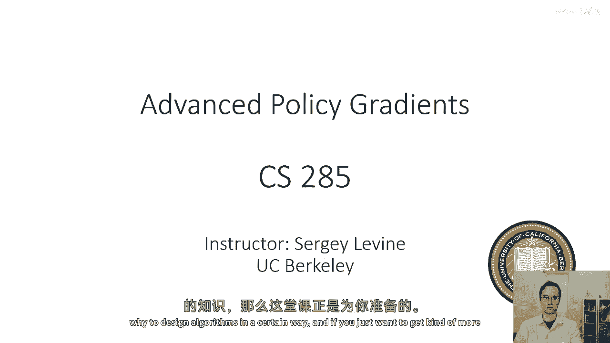
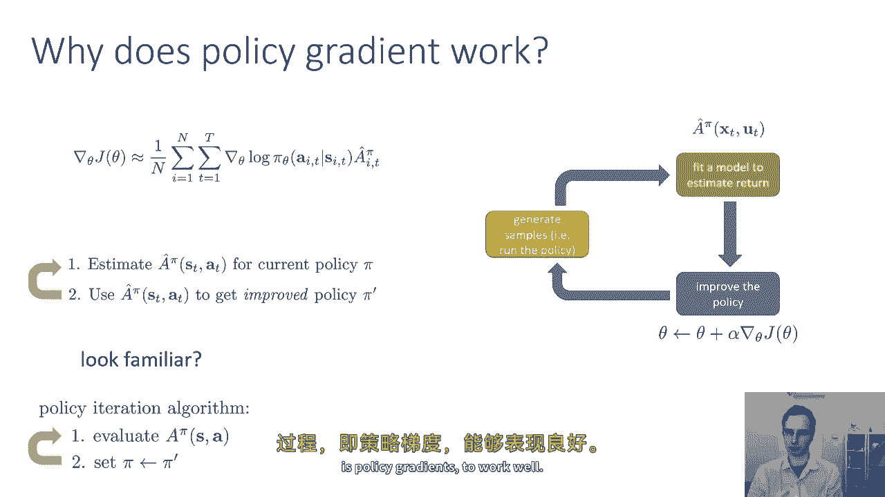
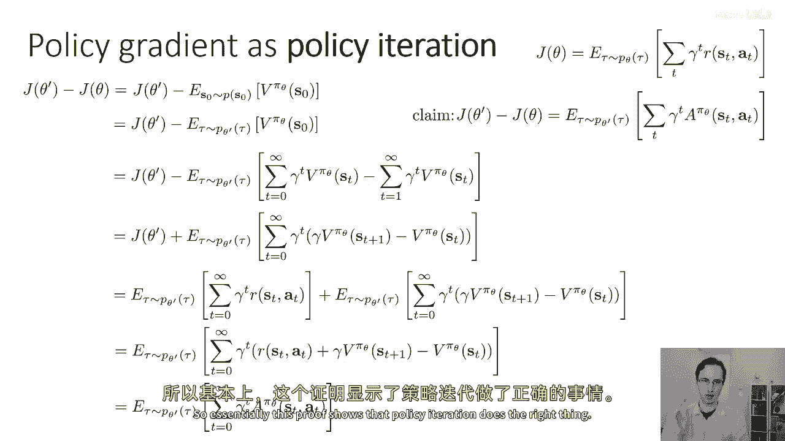
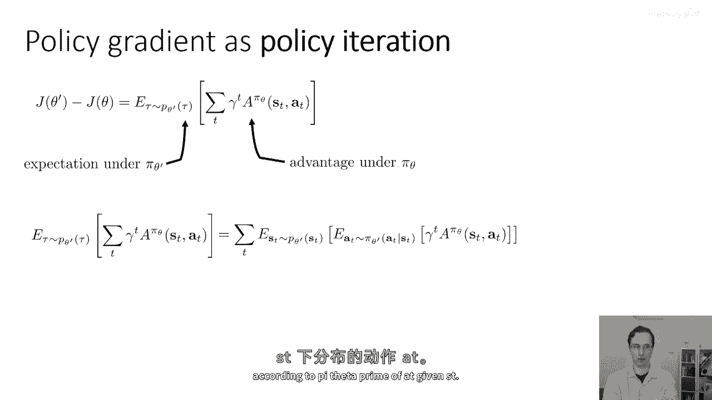
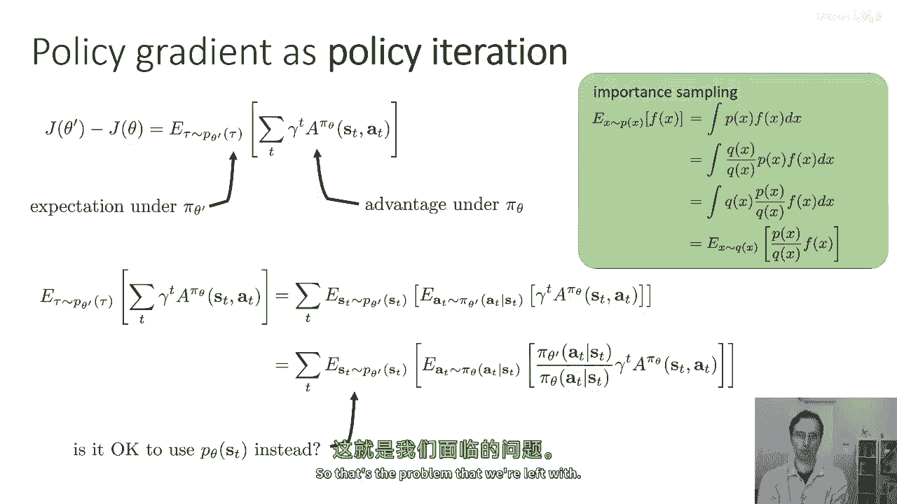
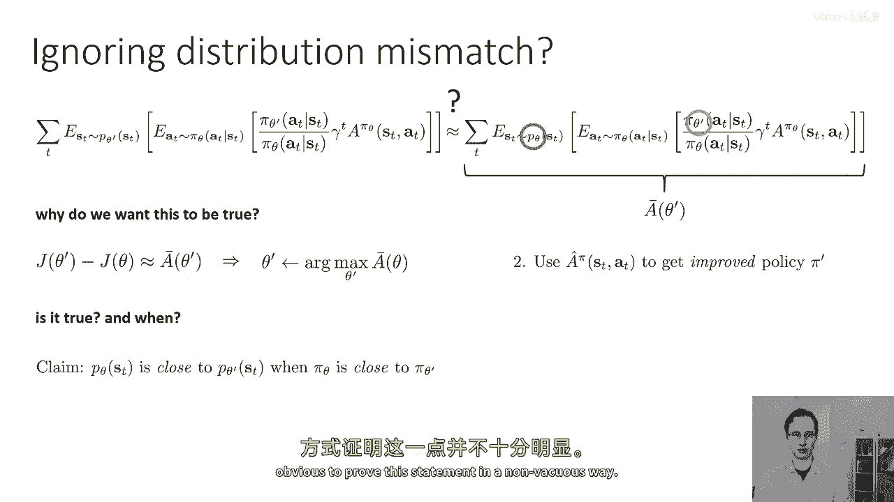

# P36：p36 CS 285： Lecture 9, Part 1 - 加加zero - BV1NjH4eYEyZ

好的，所以今天的讲座将关于高级政策梯度算法，这可能是课程中技术最细腻的讲座之一，如果这些材料过快，如果难以跟上，嗯，你知道，请在评论中提问，你知道，不要担心，如果你需要反复阅读才能真正理解它，所以。

今天的讲座目标将是，将之前讨论过的政策评分想法与课程中更近的概念结合，如政策迭代，以提供对政策梯度方法的新视角，并分析我们何时何地预期政策梯度将起作用的原因，现在，这门讲座主要关于政策梯度，但我认为。

这些见解，嗯，这种分析方法也可以用于像演员-批评者算法这样的东西，更广泛地说，用于更深入地理解强化学习方法，所以，如果你对强化学习理论有兴趣，在理解如何和为什么设计算法的方式上，嗯。

如果你只是想获得更深入的政策梯度知识。

这就是为你们所有人准备的讲座，所以，让我们简要回顾一下我们之前学过的政策梯度材料，所以我们最初覆盖了基本的强化算法，我们采样的程序是，从当前的最优策略中抽取一些轨迹，从我们的当前政策中。

我们的当前次优策略中，然后对于每个这些轨迹，以及每个这些轨迹中的每个时间步，我们计算到去的奖励，然后乘以grad log pies与到去的奖励的乘积，以获取梯度的估计，然后我们进行梯度下降。

然后我们看到，例如，在演员批评的讲座中，这个前往奖励可以被以各种方式计算，使用如此处示的蒙特卡洛估计器，或者使用更复杂的方法，这些方法涉及到实际学习价值函数估计器。

所以，当然，像我们所覆盖的所有算法一样，政策梯度遵循相同的基本食谱，它们，嗯，在橙色框中生成样本，将奖励到去的估计值拟合，或者仅使用绿色框中的蒙特卡罗估计值与学习到的价值函数一起，然后。

在蓝色框中进行梯度上升，所以，这就是政策梯度的一般形式，其中，你有许多选择可以放入q hat中，这就是我们的奖励到去。

好的，这就是对我们之前讨论过的内容的回顾，我们现在要问的问题是，为什么政策梯度实际上有效，为什么我们可以指望政策梯度来改进我们的策略，显而易见的答案是，因为你只是计算了梯度，然后，你在做梯度下降。

如果梯度下降有效，那么，政策梯度也应该有效，但是，还有一些其他的事情，如果我们做一些分析，我们可以实际上了解如何，和为什么我们应该期待政策梯度程序的工作，所以，我们可以从概念上思考政策梯度。

在之前的幻灯片中，有一种强化方法，这是政策梯度的一个特定实例，但从概念上，我们可以以更一般的方式看待政策梯度，我们有一步，这是估计我们当前策略π的状态动作元组的近似优势。

有许多方法可以使用蒙特卡罗回报或学习到的价值函数进行估计，然后，使用这个好处，估计一个帽子，以某种方式改进策略并获取新的改进策略π′，然后重复这个过程，现在。

这种看待政策梯度的方式基本上相当于我之前的幻灯片，在之前的幻灯片中，我们通过生成样本并累加奖励到去来估计帽子，然后，我们使用帽子来改进策略，通过计算政策梯度，并执行梯度上升的一步，但是。

重要的是要认识到我们实际上在做什么，在某种程度上，交替这些两个步骤，交替估计帽子和使用帽子估计来改进策略，当我这样写出来时，那么它可能变得更加明显，政策梯度本身。

与上周我们讨论的价值基方法中学习的另一个算法密切相关，嗯，上周，花一点时间回顾上周的讨论，我们学习了哪些算法，你记得我们讨论过的哪种算法有这种结构，其中，我们交替估计当前策略的价值，然后。

使用估计的价值来改进那个策略，这就是政策迭代算法的基本思想，我们在讨论价值基方法时主要覆盖了政策迭代算法，作为为接下来将要发生的事情铺路的一种方式，这就是Q学习，但如果我们回顾到策略迭代。

我们可能会意识到策略梯度和策略迭代实际上看起来非常相似，其中主要的区别是，在策略迭代中当我们计算出新的策略pi prime时，我们使用弧度最大规则，记住我们总是选择策略pi prime。

它分配给动作的概率为1，那就是当前优势的arg max，在某种意义上，策略梯度提供了一种更加温和的更新方式，它不会立即跳转到arg max，但它会在优势较大的方向上有所改进，嗯，因为在优势较大的地方。

因为如果你看幻灯片顶部的策略梯度表达式，我们取grad log pi乘以一顶帽子，这意味着具有较大一顶帽子的动作将获得更大的概率，而具有较小一顶帽子的动作将获得更小的概率，所以，你可以几乎认为。

策略梯度是一种政策迭代程序的软化版本，是我们之前讨论过的，上周的政策迭代程序，将简单地立即将最高优势动作的概率分配为一，而，策略梯度改变政策参数，以移动到给更高概率的弧最参数，和更低概率的劣势动作。

但它不会立即跳转到一和零，这可能是理想的，如果你认为优势估计器不是完美的，如果你的优势估计器不完美，也许，你想要做的事情是，只是稍微改变你的政策，以你的优势估计器建议的方向，然后收集一些更多的过渡。

一些更多的样本，然后改进你的优势估计器，在某种意义上，我们今天要讨论的主题是如何正式化这个观念，并解释我们为什么应该期待这种软化的政策迭代过程，什么是使政策梯度工作良好的方法。

好的，所以让我们尝试重新解释政策梯度作为策略迭代，为了开始这个，我要向您展示一个小的计算，我要向您展示我们如何可以写这个表达式，新参数和旧参数对应的RL目标的差异。

Theta prime减去旧参数的目标，描述在新策略下预期优势的表达式，优势是从旧策略中提取的，所以，这里的j theta代表强化学习的目标，它是在参数向量诱导的轨迹分布下预期的值。

在那个分布下总奖励的theta，我们现在就选择折扣奖励，只是为了保持完整，这是折扣从第一步开始的版本，我知道这不是我们在实践中实际使用的版本，但这会使计算更加易于访问，我要尝试证明的声明是。

j theta prime和j theta之间的差异是预期的值，在之前的轨迹分布下，很抱歉在严格的新政策优势分布下，好的，让我们稍微解析一下这个陈述，嗯，试图理解为什么，我们甚至想要关心这个。

所以j theta prime减去j theta代表rl目标的改进，我们从从旧的参数theta到新的参数theta prime中获得的，所以你可以这么想，也许我们正在执行策略迭代。

Theta prime 代表新的改进策略的参数，而 theta 代表旧的策略参数，所以如果我们可以使得 j theta prime 减去 j theta 在 theta prime 方面的变化量相对于 theta prime 大。

那么我们的策略改进就非常大，现在，那些注意力集中的人，可能会注意到那个陈述有一些奇怪的地方，因为如果我们在 theta prime 方面最大化 j theta prime 减去 j theta。

那么 j theta 实际上是无关紧要的，那就是绝对正确的，所以，以θ'为变量的最大化jθ'，与以θ'为变量的最大化jθ' - jθ完全相同，所以，当然，这个推导的真正目标是要证明。

如果我们最大化这个等式的右边，在πθ'的分布下，πθ的优势的期望，那么我们实际上就是在最大化jθ' - jθ，这意味着我们实际上在最大化j theta prime，这实际上是我们想要达到的目标，好的。

所以，等式的左边是政策从theta到theta prime的收益改进，这是我们想要优化的theta prime的方面，等式的右边，表示在轨迹分布下预期的值，由新的政策诱导，是你正在优化的旧政策优势。

我们为什么关心这个量呢，因为那就是政策迭代的本质，政策迭代计算了旧策略πθ的优势，然后使用那个优势来找到一个新的改进策略πθ′，所以如果我们可以证明最大化旧策略πθ的预期价值，相对于新策略。

实际上优化了RL目标的改进，那么我们就证明了使用旧策略πθ，并在新策略下最大化它是优化新策略的正确方式，这就是我们想要证明这个声明的原因，好的，花一点时间来思考这个问题。

确保它对你来说 make sense，这个声明的重要性，我们为什么想要证明这个，如果这个还不清楚为什么，嗯，一个重要的声明需要证明，请写下一个问题关于它，在评论中，好的，所以让我们开始我们的证明。

我们的目标是证明这个声明，为了开始这个过程，我将将其代入RL目标的方程中，记住我们表达RL目标的一种方式，是初始状态分布的价值函数的预期值，因为价值函数捕获了πθ如果从某个状态开始将获得的预期奖励。

如果它从某个状态开始为0，那么我们将得到RL目标，我写它的原因是因为现在p0不再依赖于θ，所以所有依赖于θ的东西都在期望内部，取期望的分布与θ无关，与期望被取走的分布无关，这意味着。

我可以改变期望被取走的分布为任何分布，其边缘对初始状态的分布是ps0，包括pθτ，pθ′τ和p任何θτ，基本上任何策略的轨迹分布都必须有相同的初始状态边缘，我从第一行到第二行可以做的，我可以。

我可以将p of s zero替换为任何具有相同初始状态边缘的轨迹分布，我选择的是pθ′ of tau，我为什么将pθ′ of tau放入呢。

因为我的最终目标是将这个转化为在pθ′ of tau下的期望，那是我们声明的右边，我可以在这里放入dθ′ of tau，因为它具有相同的初始状态边缘，并且期望内部的数量仅取决于s零，因此。

从某种意义上说，那个值没有改变，如果我以不同的政策来取期望，现在我要做的是，我将使用一点缩放和求和技巧，所以我将s零处的v pi theta替换为这个有趣的数量，让我们来看看这个数量。

这是一个两个和的差，第一个和是从零到无穷的和，第二个和是从一到无穷的和，我在两种情况下求和的是gamma的t次方，V pi theta在st处的值，所以我在求和的是同一件事，在两种情况下。

只是那一个和从零到无穷大运行，而另一个从一到无穷大运行，所以这意味着当我取这两个和的差，第一个和从一到无穷大的所有元素都被第二个和取消，所以这意味着这两个无穷和的差就是，V pi theta在零处的值。

好的，所以花一点时间来思考这个问题，确保你对这个理解清楚，为什么v pi theta在零时等于这两个无穷级数的差，好的，所以让我们继续往下，我要做的事情是，我会稍微重新排列这些级数的项，所以我想做的是。

我希望能写这个级数，本质上就是一些看起来有点像优点的术语，所以我要取所有被减去的术语，在右边，所以首先注意符号已经改变，所以我把减号换成了加号，当我把减号换成加号时，那么这就变成了从一到无穷大的求和。

减去从零到无穷大的求和，然后我会分组这些术语，所以对于每一步，第一步 第二步 第三步，三步四，来自第二个和的术语，从一到无穷的一个有额外的伽玛因子的术语，来自第一个和的术语缺乏这个因子。

并且来自第二个和的术语在时间步长t加一处进行评估，来自第一个和的术语在时间步长t处进行评估，如果我改变符号，注意现在是在p theta prime下的正期望。

这意味着现在括号内的术语变成了从一到无穷的求和，减去从零到无穷的求和，然后，我将对这些术语进行配对，所以，对于第一个术语，在第一个求和式中，s一是对第一个术语的求和，而第二个句子是s零的求和。

它们相差一个伽马因子，所以，第一个术语变为伽马乘以v乘以s一减去vs零，第二个术语变为伽马的平方乘以vs二减去伽马乘以v乘以s零，我将将伽马提升到t术语中，这样我就可以得到这样的表达式，所以。

这只是一些代数的重新排列，但是如果你对这种重新排列感到困惑，请花一点时间来思考它，并在评论中写下它，好的，接下来我要做的事情是。

我将将j theta prime的定义替换为j theta prime的定义，这个定义来自幻灯片右上角的东西，所以在这一行中。

我只是简单地将j theta prime替换为j theta prime的定义，所以现在到这个点，如果你看这两个方程，这可能对你来说显而易见，我正在做的就是我要做的事情，我对τ有两个期望。

都在pθ'的条件下，都是从零到无穷大，他们都有一个t的γ次方在前面，其中一个是r，另一个是γvsτ，加上1减去vsτ，所以我可以将这两个期望组合在一起，我可以我可以将期望分布出去。

并且我从零到无穷求和得到，Gamma的t次方，然后括号内的一个量，这就是优势函数，关键在于，因为价值函数在这里是pi theta的价值，优势也是pi theta的优势。

这意味着这等于在p theta下预期的值，Tau的阶乘，对从零到无穷的gamma的t次方的和，对pi theta s t a t的优势，所以这证明了我们要证明的主张，只是为了确保每个人都在同一页面上。

具体来说，这证明了如果我们最大化旧策略的预期优势，相对于对新策略的期望，那么我们将优化j theta prime，实际上将优化强化学习的目标，所以本质上这证明策略迭代做了正确的事情。

好的，所以这一切都与策略梯度有什么关系，"很好"，所以，我们展示的是，RL（强化学习）的目标是最大化目标函数。"与最大化这个方程相同"，"在πθ和πθ'下，优势被取，期望也被取"，所以嗯。

"这是我们的方程式"，"并且这个方程可以写成对所有时间的和"，"在状态动作边缘的theta prime优势预期步骤"，"并且，自身的国家行动也可以被写为期望值"，关于按照s t的πθ'分布的状态。

以及给定s t的a t按照πθ'分布的动作。

现在，如果我们想要实际编写一个优化目标函数的政策梯度程序，我们可以回忆起我们在政策梯度讲座中之前有过的重要采样推导，将内层期望写为在我们旧的政策下πθ的期望，但是，加上这些重要性权重，现在。

我们正在接近之前有过的政策梯度表达式，我们之前有过，因为记住我们只需要通过对与这个非常相似的方程进行微分，就可以得到政策梯度，以theta等于theta prime的值。

关于theta prime的偏导数是0，唯一的区别是我们的状态仍然按照theta prime分布，而不是按照p theta分布，你看我们有访问p theta的能力，我们可以从p theta中采样。

我们不能从p theta prime中采样，因为我们现在还不知道theta prime会是什么，所以这里有一个大问题，即关于状态的期望，它是以theta prime而不是theta的。

"如果我们仅仅能使用theta而不是theta'就好了"，"然后我们将恢复之前的政策梯度表达式"，"这就是我们面临的问题"。

本质上，我们需要，"无论如何，忽略我们需要从p theta中采样状态的事实。"，"st的状态空间的最优采样点，反而被允许使用来自p theta(st)的样本"，"所以这就是我们的问题"，嗯。

"如果我们只能消除那个西塔"，"然后，唯一剩下的θ'将在重要的方式中出现"，"然后如果我们对它进行求导"，"我们将恢复策略梯度，并证明策略梯度和策略迭代是等价的。"，实际上，"等价"，"所以。

为什么我们要相信这个"，"很好"，"我们想要这是真的"，"因为如果我们取这个量，并将其称为theta prime的棒子"，"并且我们可以证明。

j theta 的原始导数减去 j theta 大约等于 j theta 的原始导数的共轭"，这意味着我们可以通过取一个杠的最大值来找到theta prime，这意味着我们可以使用帽子来获取改进的策略。

Pi prime，所以这是真的吗，并且在何时是真实的，在下一部分讲座中我将要展示的声明，是p theta s t接近b theta prime of st。

当pi theta接近pi theta prime时，这可能看起来像是一种显而易见的陈述。

