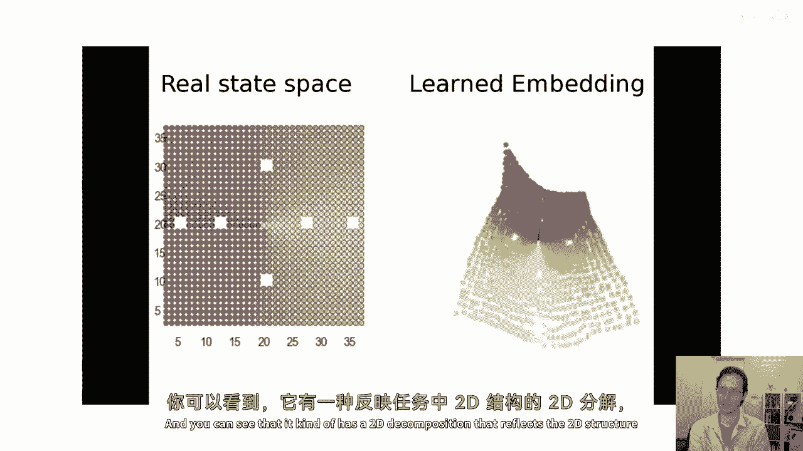
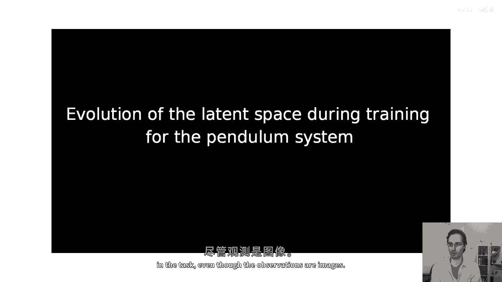
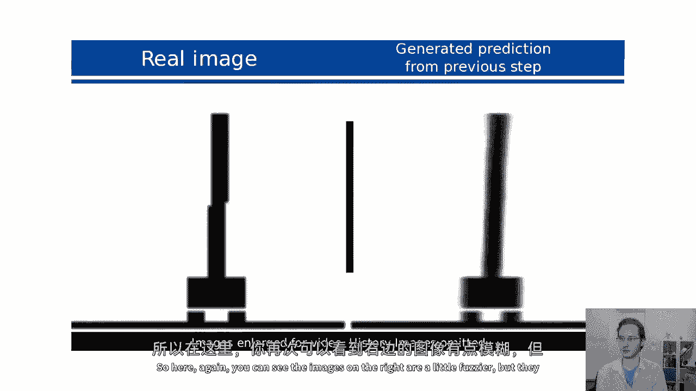
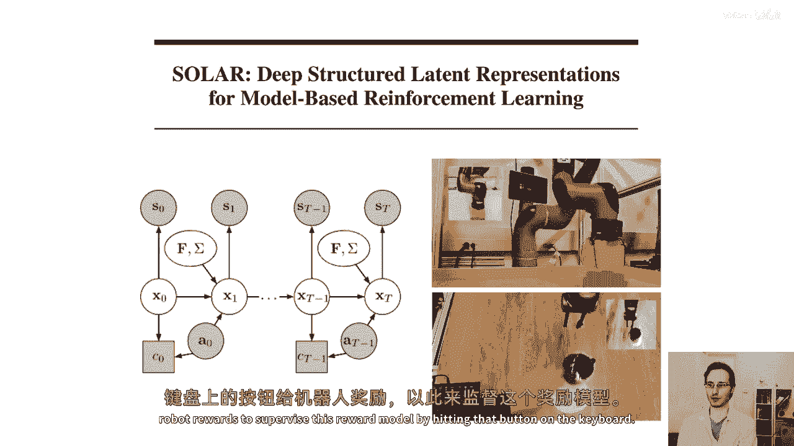
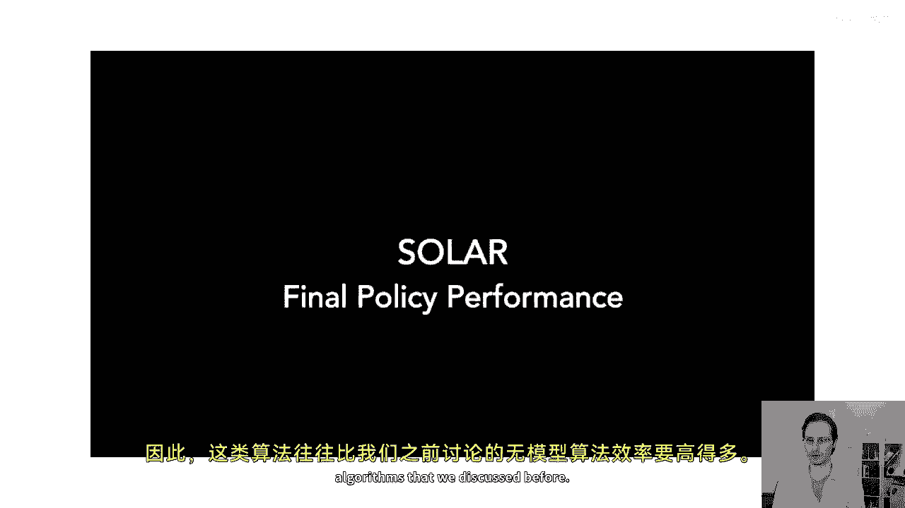
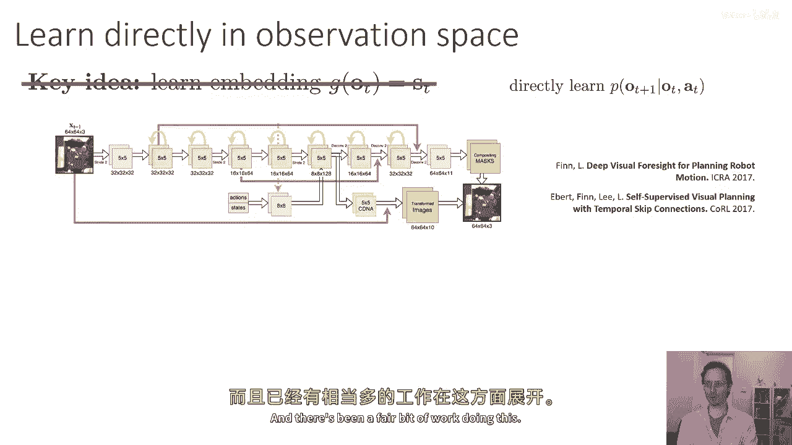

# P49：p49 CS 285： Lecture 11, Part 5 - 加加zero - BV1NjH4eYEyZ

好的，在今天讲座的最后一部分，我们将稍微改变话题，谈谈如何使用图像进行基于强化学习的模型，基于图像的强化学习，复杂图像观察会发生什么，例如。

像Atari中的形象或机器人摄像头拍摄的执行某些操作任务的图片，那么，使用，我们之前讨论的算法，之前，它们都有一种形式，可以预测从前一个状态到下一个状态的动作，然后对这些州制定计划。

用图像很好地完成这项任务有什么困难，首先，图像的维度非常高，这可能会使预测变得困难，图像也有许多冗余性，所以您知道，在雅达利游戏中，图像中的不同像素非常相似于彼此，这意味着状态包含大量的冗余信息。

基于图像的任务也倾向于部分可观察，所以，如果您观察整个游戏的一个帧，你可能不知道在突破中球的移动速度是多少，例如，或者在哪个方向，所以当我们处理图像时，我们通常处理pom dp模型。

这是pom dp的图形模型示意图，对于pom dp，它具有给定先前状态和动作的下一状态分布，以及给定状态的观察分布，而且当我们在做图像rl时，我们知道观察和动作，但是，我们并不知道状态，所以嗯。

我们想要学习状态空间p中的转移动态s t，再加上一个给定的s d a t，但是我们甚至不知道s是什么，也许我们可以单独学习p of o t给定s t，和p of s t plus one给定s t。

逗号a t和那将非常棒，因为p of ot给定st处理所有多维的东西，但它不必处理时间动态的复杂性，然而，给定状态s和动作a，状态空间模型的p(s'|s，a)需要处理动态性，但它不需要处理高维的东西。

也许这种角色分离可以给我们一些可行的，基于模型的强化学习算法，用于图像观察，我将简要且非正式地讨论这种算法，但最后，我也会谈谈如何，也许一些这并不是真的，也许直接学习图像上的动态性并不是太坏。

所以那将会在最后，但首先，让我们谈谈这种状态空间模型，所以这些有时被称为潜在空间或潜在状态模型，一般来说，他们的状态空间模型，所以这里我们要学习两个对象，我们要学习一个p of ot给定st。

基本上我们的状态如何映射到图像，那是观察模型和一个p of s t plus one给定s t a t，这是我们在未观察到的状态空间中的动态模型。

我们通常还需要学习一个奖励模型p of rt给定s t a t，因为我们的奖励取决于状态，由于我们不知道状态是什么，所以我们不知道奖励如何依赖于它。

所以通常我们也会在这个中添加一个奖励节点并学习一个奖励模型，那么我们应该如何训练这些东西得很好，如果我们有一个标准的完全可观察模型，我们将用它的最大似然来训练它，我们基本上将取我们的数据集。

其中包含n个不同的状态转换，对于每个转换，我们将最大化log概率s_t加一逗号i给定sti，以及a_i，如果我们有一个潜在空间模型，现在，我们有给定s_t和o_t的p(o_t|s_t)。

以及给定s_t和d_a_t的p(s_t|d_a_t)，再加上给定s_d和t的p(s_d|t)，所以，我们必须最大化这两个概率的日志，并且可能还包括奖励模型，如果我们想要添加那个，如果我们知道状态。

那么这将很容易，然后，我们将只是添加在一起log p phi s_t，"加上给定的日期s d a t，记录p phi的值，给定的日期s d"，问题在于我们并不知道s是什么，"因此。

我们必须使用预期对数似然目标"，在我们的训练轨迹中，期望被取得过未知状态的分布，"对于熟悉如隐藏马尔科夫模型等事物的你们"，"基本上就是相同的想法"，因此，我们需要一种算法，它可以计算出状态的后验分布。

"考虑到我们的图像"，"然后，使用从那个近似后验分布中采样的状态来估计这个预期的对数似然"。因此，对于p的期望是以s和t为参数的。

逗号 s t 加上一给定 o 一至 t 和一个一至 t 在每个时间步长处，好的，那么我们如何实际做到这一点，好吧，我们可以做的事情之一是我们可以实际上学习一个近似后验，而且我要说。

这个近似后验参数 psi，我注意到一个 q psi，这个近似后验将是另一个神经网络，它给我们一个分布 over st，给定已经看到的观察和行为，并且你有几个选择可以作，所以我们称这个近似后验为编码器。

并且你可以学习到各种不同的后验分布，你选择的哪一个后验分布会对你算法的工作效果产生一些影响，所以你可以学习到一种全平滑的后验分布，你可以学习到一个神经网络，它给你 s_t， s_t 的 q 值。

加上从大 t 开始的 o_1 到 o_t 的一个，加上从大 t 开始的一个 o_1 到 o_t 的一个，所以这个后验分布给你你想要的精确量，它是你所能要求的最强大的后验分布，但它也是最难学习的。

在另一个极端，你可以想象一个非常简单的后验分布，它只试图猜测当前状态，给定当前观察，例如，如果部分可观察性的影响最小，并且这是训练最简单的后验分布，但也是最差的，在意义上。

使用它将是最远离你想要的真实后验分布的，那就是 p(s_t， s_t) 加上给定 o_1 到 t 的一个 o_1 到 t 的一个，加上从大 t 开始的一个 o_1 到 o_t 的一个。

所以你可以要求全平滑的后验分布或一步编码器，全平滑的后验分布在准确性上是最准确的，在意义上，它最准确地代表了你对状态的不确定性，但它也远远是最复杂的来训练，一步编码器远远是最简单的。

但它提供的后验分布是最不准确的，一般来说，在你需要更准确后验分布的情况下，所以如果你相信你的问题是这样的，在哪里状态几乎可以从当前观察完全猜测，然后一步后验分布是一个真的很好的选择。

而在你有一个严重部分可观察的设置时，那么你想要接近全平滑的后验分布，当然，有很多中间选择，如估计 s_t 给定 o_1 到 t 的一个 o_1 到 t 的一个，一个 o_1 到 t 的一个，现在。

关于如何实际训练这些后验分布，这需要理解一个叫做变分推断的东西，我们将在下一周详细讨论，我将跳过如何在这次讲座中训练这些概率编码器的方法，我会专注于一个非常简单的一步编码器的极限情况。

所以我们要谈论一步编码器，我们将谈论一步编码器的一个非常简单的特殊情况，如果我们真的这样做对了，那么对于每个时间步。

我们将从 q(s_t | o_t) 和 q(s_t + 1 | o_t + 1) 中采样 s_t 和 s_t + 1，然后使用这些样本。

最大化 log p(s_t | s_d_a_t) 和 log p(o_t | s_t)，但是，一个非常简单的特殊情况是，如果你相信你的问题几乎完全可观察，那么这种特殊情况就是。

如果你相信你的问题几乎完全可观察，"实际上是使用确定性编码器"，"因此，而不是输出一个关于给定输入ot的分布st"，"对于我们当前的ot，我们将仅输出st"，"随机情况需要变分推断"。

"下周我会讨论这个问题"，"但是，确定性的情况要简单得多"，因此，确定性的情况可以被视为delta函数，"以某些确定性编码gi为基点的ot"，所以这就意味着t等于g psi的ot。

"如果我们使用这确定性编码器"，然后我们可以在原始目标中任何看到s的地方替换它，我们可以删除期望，所以现在我们的目标是以phi为变量的最大化，并且i是对我们所有轨迹的总和，对所有时间的总和。

步骤是log p(g|o_t)加上给定g(o_t)的log p(o_t+1)，逗号加上给定g(o_t)的log p(o_t)，所以第二个项可以被视为一种自编码器，它只是说如果你编码o_t。

你应该能够再次重构它出来，而第一个项它强制要求编码的状态应该遵守学习动态，然后，你可以通过反向传播优化phi和psi同时，在这个整个东西中传播，如果动力学是随机的。

那么你想要使用被称为读取参数化技巧的东西来使这成为可能，以梯度下降解决，我会在下周覆盖这个问题，但在这种情况下，你也可以使用确定性动力学，并拥有一个完全确定性的状态空间模型，所以，简短地说，写下主观的。

然后使用反向传播和梯度下降优化它，所以所有事情都是可微分的，并且你可以用反向传播来训练所有事情，好的，嗯，所以花一点时间来思考，嗯，这种表述，看看幻灯片，思考这里的一切都对你来说是否合理。

如果你对这里发生了什么有疑问，在评论中写下一个评论或问题将是一个非常好的想法，然后我们可以在课堂上讨论这个问题，但是，简要总结一下，我们讨论了如果你想学习基于随机状态的模型，你需要使用期望对数似然。

而不是标准对数似然，其中，期望是以表示后验的编码器为参考的，后验有许多方法可以近似，但是最简单的绝对方法是使用从观察到状态的编码器，并使它成为一个确定性的编码器，在这种情况下，期望实际上消失了。

你可以直接将编码的观察值替换为状态，在你的动力学和观察模型目标中，当然，奖励模型将以相同的方式工作，所以如果我们有一个奖励模型，我们还将在这里添加log p of rt给定g of o t，好的。

这就是我们的状态空间模型，你可以认为g of ot是，嗯，作为一个额外的虚拟边缘，它从o映射到s，我们还有奖励模型，所以我们可以将其添加在那里，然后我们有一个潜伏空间动力学图像构造。

和一个潜伏空间奖励模型，有许多实用的方法可以使用随机编码器来模型不确定性，在实际应用中，这些确实工作更好，但是为了阐述的简单性，如果你认为这作为一个确定性编码器，我认为这很有道理，好的，嗯。

那么我们如何在实际的基于模型的rl算法中使用这个，嗯，实际上相当直接，你可以直接将此直接插入基于模型的rl版本的1。5算法中，我之前讨论过的算法，你可以运行你的基线政策π0来收集过渡数据集。

这些过渡包括观察-动作-下一个观察元组，然后您训练动态，奖励模型，观察模型和编码器，与通过模型反向传播的计划一起，选择可以最大化奖励的动作，执行第一个计划动作，并观察下一个结果观察o'。

将该过渡添加到d并重新规划，这就是你的内在npc循环，然后您有外部的数据收集循环，在每个n步中，您收集更多数据并重新训练所有模型，好的，文献中一些实际使用的算法的例子，嗯，所以这里是一个由，嗯，嗯。

沃尔特在名为'embed'的论文中控制的例子，他们使用了随机编码器，但总的来说，想法相当相似，然后，他们使用lqr通过状态空间模型构建他们的计划。

首先，他们展示了他们的状态空间，这是为一种点质量2D导航任务设计的，其中，您只需要避免那些六个小障碍位置，"而且，右边展示的是什么，是对状态空间的嵌入"，"以他们为榜样学习"，"你可以看到。

它 kind of 有一种二维分解，反映了两个"。

"任务中的D结构"，"尽管观察结果是图像"。

"这是一个倒置的 pendulum 任务"，"他们在倒立摆的图像上进行训练的地方"，"并且你可以看到，基于状态的模型具有这种酷炫的三维结构。"，"反映摆锤任务的周期性特性"。

嗯，这是摆锤摆动上升的实际算法，所以在右边，他们展示了模型一步预测的基本情况，而在左边，他们展示了真实图像，你可以看到它有点模糊，但是有一些合理的想法关于正在发生的事情。

这里是另一个任务，即平衡小车杆，所以再次，你可以看到右边的图像有些模糊。

但他们通常有一个类似的大致想法。

这里是一个使用三关节肌肉臂的简单抓取任务，它正在尝试达到特定的目标图像，所以你可以看到，它 kind of 伸出去，大致地去到正确的目标图像。

好的，嗯，这里有一篇更近的论文，它基于这些想法，为了开发一个更复杂的状态空间模型，所以这里是状态空间模型，嗯，实际上 是，嗯，被正则化以成为局部线性，这使得它非常适合迭代线性化算法，如迭代lqr。

并且这种方法已经在一些机器人任务中得到了测试，这实际上是由在这里伯克利上学的一名学生完成的，而且嗯，在这里，机器人的观察结果在顶部左角显示，然后它使用学习到的状态空间模型来执行lqr。

以将乐高块放在另一个乐高块上，这里是另一个任务示例，机器人需要使用图像，将这杯推到所需的位置，这里的劳拉，谁是，这篇论文的作者是实时的，通过在键盘上按下按钮来监督这个奖励模型，给予机器人奖励。

好的，所以这里，这里有更多的示意图，这基本上是运行pi zero，这是初始的随机数据收集，从这里开始，模型将被训练，然后用于在不同的位置进行测试，所以这里是一些任务，其中物体从不同的位置开始。

所以这里你可以看到左边是编码器和解码器，所以这基本上是评估观察模型，你可以看到观察模型重建图像相当准确，右边是机器人实际上在做什么，这是训练了大约二十分钟后的结果，所以这种算法通常比模型效率要高得多。

我们之前讨论过的自由算法。

现在，我们到目前为止已经谈论了学习潜在状态空间模型的算法，他们学习一种嵌入式的编码器，G of o t等于s st，如果我们完全放弃嵌入，并实际上回到原始的食谱和基于模型的强化学习，但在观察空间。

那么如果我们直接学习p of o t加上一给定o t a t，如果我们有部分可观察性，那么我们可能需要使用循环模型，所以我们需要使ot plus one也依赖于旧的观察，但只要我们做这个，实际上。

我们可以直接在图像空间中相当准确地建模动态，已经有相当一部分人在做这件事。

这是来自一篇稍旧论文的示例讲座，三年前，嗯，展示了一个机器人臂，每一列显示从同一点开始的不同动作，所以你可以看到，对于不同的动作，r在左右上下移动，当它接触到物体时，它会推动那些物体。

这些种方法在更复杂的设置中可以工作得相当好，在哪里学习一个紧凑的，潜在空间非常困难，所以如果你场景中有 dozens 个对象，实际上不清楚如何为他们构建一个紧凑的状态空间。

但在图像空间直接预测实际上可以工作得非常好，然后你可以通过，例如，告诉它你知道图像中的这个特定点，移动它到这个位置，然后它找出导致那个结果的行动，你可以做像伸出手去抓订书机的事情。

所以这里是模型认为将要发生的事情的动画，当它实际上去做的时候，它伸出手，把手放在订书机上。