# P51：p51 CS 285： Lecture 12, Part 2： Model-Based RL with Policies - 加加zero - BV1NjH4eYEyZ

好的，让我们谈谈使用学习模型的无模型强化学习。

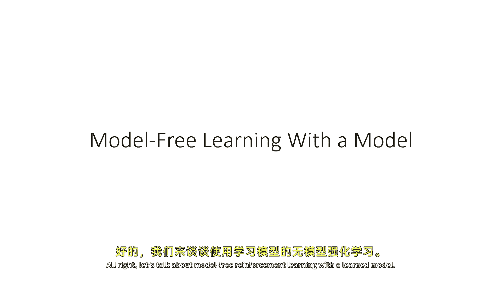

所以本质上，基于模型的rl是通过在进入算法之前使用无模型rl方法来实现的，让我们稍微精确一点，我们在之前的讲座部分讨论的一些事情，这些反向传播梯度实际上看起来像什么。

以及它们可能不如使用无模型方法好的原因，所以这是我们之前有过的熟悉政策梯度表达式，这基本上就是从之前的讲座中直接提取的，我们讨论了政策梯度作为无模型强化学习算法，但你也可以把它看作是一个梯度估计器。

这可以用来估计奖励相对于用于政策的参数梯度，这样，它有时被称为似然比梯度估计器，或通俗地说，它是强化学习梯度估计器，但重要的是记住，作为一个梯度估计器，它不一定在任何时候都必须与强化学习有关。

你只需要有这些类型的，随机计算图，你现在就可以使用这种类型的估计器，对我们来说，这种梯度估计器的真正方便的地方，是它不含有转移概率，这是一点点谎言，当然，因为在现实中，你需要转移概率来计算政策梯度。

因为你需要采样，并且那些样本来自政策和转移概率，但是，转移概率本身并不出现在表达式中，除非在它们生成样本的程度上，而且在特定上，甚至我们不知道它们的导数，但是并没有阻止你使用此梯度估计器与学习模型。

所以，就像你之前从真实MDP中采样一样，现在，你可以从学习模型中采样，另一种选择，反向传播的梯度也被称为路径梯度，现在可以写成这样，这可能看起来像是一个非常令人望而生畏的数学表达式。

但我在这里只做了一件事，我只是应用了微积分的链规则来计算导数，对于我之前在上一节中显示的计算图，是以政策参数为参数的，所以，有时间步骤的外部求和，"每一次步子"。

"那就是在那个时间步的决策动作对政策参数的偏导数"，"时间乘以下一个状态的对动作的导数"，"然后，那个括号内的表达式就是奖励的导数"，对于所有相对于下一个状态的未来状态，"而且你知道特别困难的部分是"。

当然，那个在第二组括号中的巨型产品，"这是由所有时间的雅可比矩阵的乘积产生的产品"，"步骤t的质数和t加1"，"所以这就是一点问题"，因为在那里，你有这些dsda和dsds术语。

这基本上是下一个状态相对于前一个动作的导数，以及下一个状态相对于前一个状态，它们 all 都被乘以得到 so，如果你想象你的状态是n维的，那些就是那些ds是ds术语。

那表达式中最后一个术语将是一个n by n矩阵，并且将有很多这些矩阵被相乘在一起，如果这些矩阵有特征值大于一，那么如果你相乘足够的它们，最终它们会爆炸，如果它们有特征值小于一，你相乘足够的它们。

最终它们会消失，这就是使这条路径智慧梯度如此难以处理的原因，嗯，作为一个细节，我在这里想要指出，那，顶部的似然比率率实际上是仅适用于随机政策的，和随机过渡，底部的路径智慧梯度实际上是仅适用于确定的。

政策和过渡，但这是一个可解决的问题，并且你可以，实际上，将路径智慧梯度扩展到一些类型的随机过渡，通过使用被称为重参数化技巧的东西，我们将在后一节课中学习，并且你可以甚至使政策梯度几乎确定通过取极限。

作为，让我们说，一个高斯政策或过渡概率的方差去零，并且你可以仍然得到它，尽管它会有所不同，所以它更容易写政策梯度对于随机系统，和路径智慧梯度对于确定系统，但这不是基本限制，基本的区别是。

路径智慧梯度涉及所有那些雅可比元的产品，而政策梯度并不现在，一些你们可能会在这个点上疑惑，嗯，它似乎这里有一种免费的午餐，像是如何是你可以只是消除一个巨大的雅可比元产品的产品，但是有一个交换，当然。

哪是政策梯度需要采样，所以这就是那里有所不同，实际上，如果你深入挖掘这些程序的优化细节，它实际上发现政策梯度有一些相当深的联系与像嗯，嗯，有限差分方法，所以没有预启动。

策略梯度为消除雅可比矩阵的乘积付出了代价，但如果你足够多地乘以雅可比矩阵，嗯。

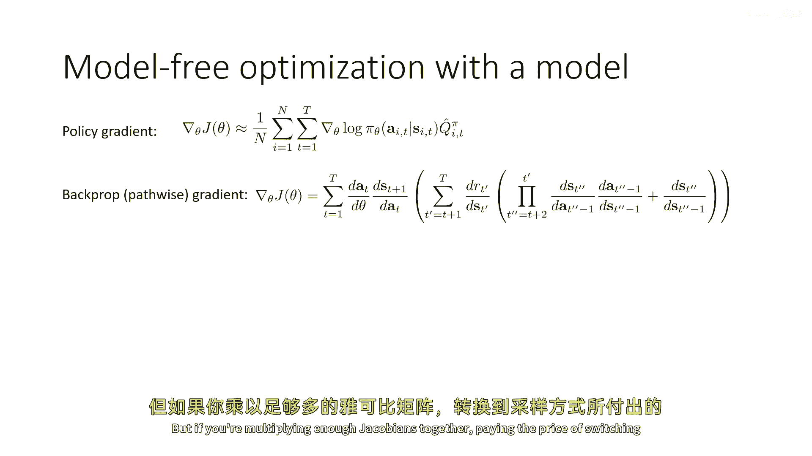

你知道，从采样切换到支付代价可能值得，所以策略梯度可能。

实际上，如果生成足够的样本，可能会更稳定，因为它不再需要乘以许多雅可比矩阵了，在生成大量样本之前是一个问题，因为我们在谈论无模型RL时，那些样本实际上需要运行真实的物理系统。

但如果我们在谈论基于模型的RL，那么生成那些样本可能涉及仅运行你的模式，这可以计算成本，但它不涉及与MDP的任何物理交互成本，所以现在这个权衡对我们来说可能非常值得，因为生成更多的样本只是一个问题。

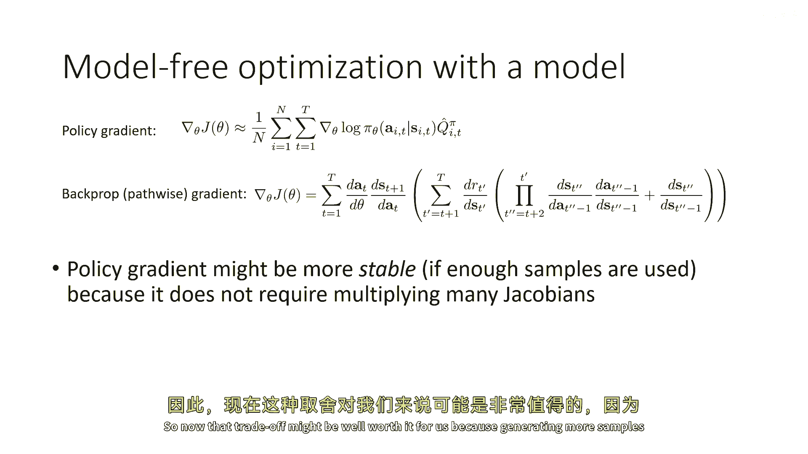

你知道，在数据中心中插入更多的GPU，如果你想更深入地了解与策略梯度相关的数值稳定性问题，你可以查看这篇2018年的论文，它讨论了一些稳定性问题，但简短地说，无模型梯度实际上可能更好。

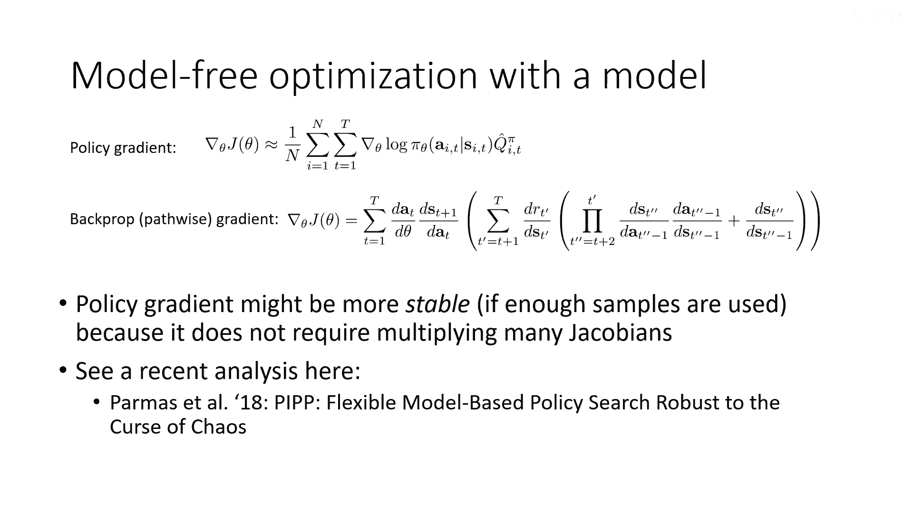

从这个中我们可以写下，你知道，再次，我可能会叫他们，嗯，我可能会为名字想出一个名字，我会想出，是基于模型的RL版本2。5，基于模型的RL版本，2。5将与2。0非常相似，除了不再使用反向传播。

它将使用策略梯度，所以步骤一运行一些策略来收集数据集。

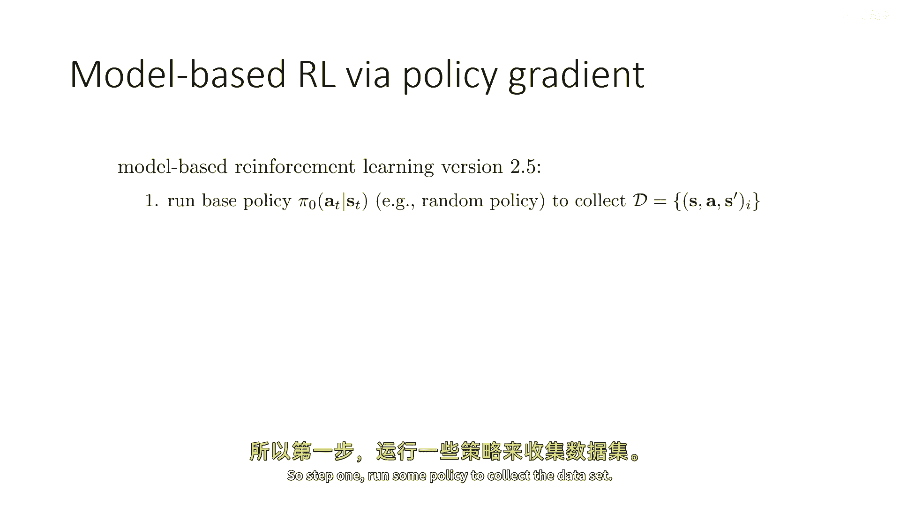

步骤二学习动态模型，步骤三使用那个动态模型来采样大量的轨迹与你当前的策略，步骤四使用那些轨迹来通过策略梯度改进策略，当然，你可以使用所有的演员-批评家技巧，所有这些东西在这里，然后重复步骤三几次。

所以你可以采取许多策略梯度步骤，每次重新采样轨迹，但不再生成任何真实数据，也不重新训练你的模式，一旦你改进了你的策略，直到你满意它，然后你将运行你的策略来收集更多的数据，将这些添加到你的数据集中。

并使用这个大数据集来现在，训练一个更好的模型，好的，所以，这个算法将解决我们之前讨论的反向传播问题，但它仍然有一些问题，最后，这并不是大多数人想要使用的基于模型的rl方法。

那么这个程序可能存在的问题是什么。

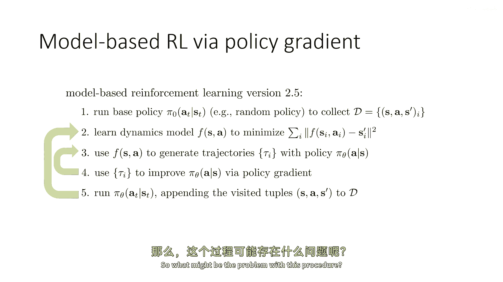

花一点时间来思考这个问题，再次，你可以暂停视频并在自己的时间思考这个问题，当你准备好继续时，然后继续。

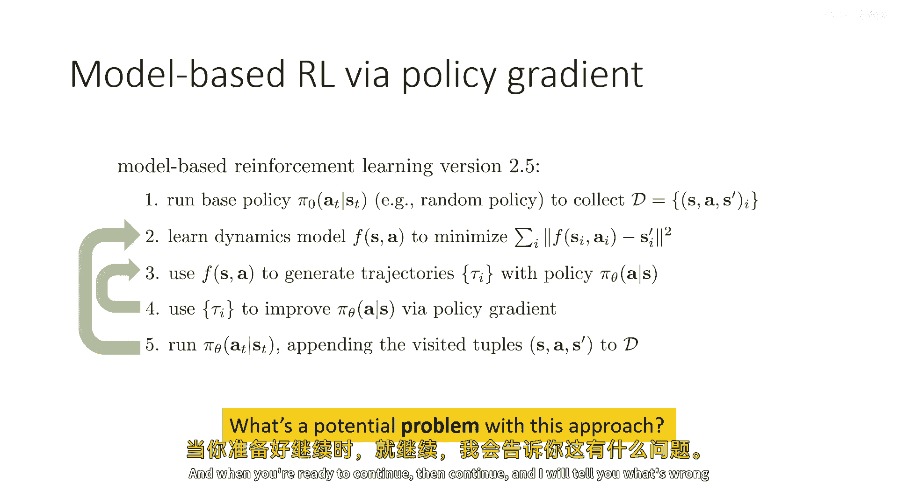

我会告诉你这个程序的问题，好的。

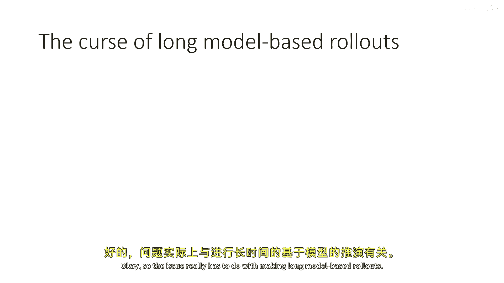

所以问题实际上与进行基于模型的长期部署有关，嗯，为了理解这个问题，让我们回到我们在课程中早期讨论过的事情，当我们谈论模仿学习时，当我们谈论模仿学习时，我们学到了如果你用监督学习训练一个策略。

然后你尝试运行那个策略，它可能会犯一个小错误，因为每个学习模型至少会犯一个小错误，"但是问题在于，当你的学习政策犯了一个小错误时"，"它会稍微偏离数据中看到的情况"，"当它与数据中看到的有所不同时"。

"它会发现自己处于一个陌生的情况中，可能会犯更大的错误。"，"并且这些错误会累积"，"当我们讨论模仿学习时，我们学会了何时说话。"，"这个问题实际上涉及到一个被称为分布性移动的概念"。

这归结为状态分布问题，与它接收的输入状态分布不同，在实际环境中执行时，现在，同样的挑战也适用于学习模型，当我们谈论这个时，当然，在讨论学习模型之前，嗯。

如果现在黑色曲线代表用真实动态运行pi theta，而红色曲线代表用学习模型运行它，当你用学习模型运行时，学习模型会做出一些错误，它会将自己置于稍微不同的状态，在这些稍微不同的状态中，它会犯更大的错误。

所以如果你的模型基于的绘制足够长，最终它将与现实世界有很大的不同，因为错误越来越大，现在这些都是对于这种情况的，当你在运行与你用于收集数据的同一政策时，但是当然，在基于模型的rl版本2。5中。

你将改变政策，你将使其相对于你的模式更好，这意味着问题甚至被进一步加剧，因为现在你将运行一个与真实动态模型不同的学习动态模型，并且有一个与收集数据的政策不同修改后的政策，所以分布性偏移将更糟。

所以错误积累得多快，即使在最佳情况下，当你运行相同的确切政策时，就像在行为克隆讨论中，它将积累为epsilon t的平方，我会把它留给你们去证明，实际上，有一个epsilon t的平方界限。

并且界限很紧，那个逻辑与我们在行为克隆中的有着极其相似的逻辑，但对于我们来说，目前我们的要点是错误积累得非常快，随着你基于模型的滚动范围的增加，这意味着进行基于模型的滚动是非常昂贵的对你来说。

在累积错误方面，这又是说，你的滚动时间越长，你从这次滚动中得出的结论就越可能不同，意味着它的奖励将与你在现实世界中滚动时得到的不同。

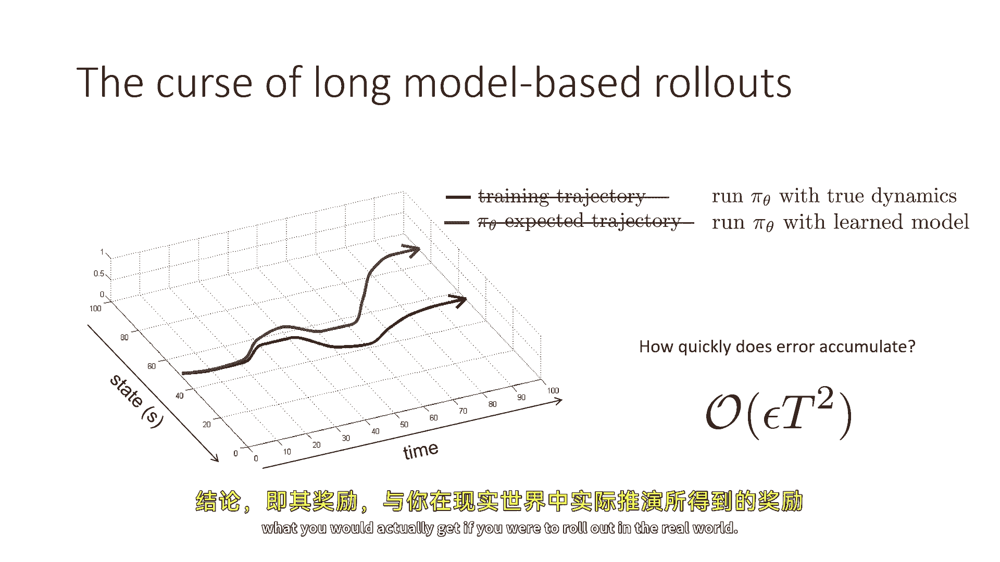

也许我们想要避免长滚动，也许我们想要设计基于模型的rl方法，可以在不使用长滚动的情况下，仅使用短滚动，我们能做到这样多久，很多都不好，因为它们有巨大的累积错误，好吧，如果我们只是减少滚动范围，比如。

你知道我们的任务有一个期限为一千，我们将限制我们的滚动到只有五十步，这将有更低的错误，问题是，当然，一个期限为一千的mdp，并不像期限为五十的mdp看起来一样，在那些后来的时间步中可能会有一些事情发生。

你在早期的时间步中永远不会看到，例如，如果你，例如，控制一个应该在厨房里烹饪饭菜的机器人，嗯，也许需要三十分钟来烹饪饭菜，如果你只做基于模型的抽样，长度为五分钟，那几乎不够时间让机器人开始。

把锅放在炉子上，所以这不太好，因为你实际上是在改变问题，所以这里有一个小技巧我们可以使用，如果我们只 ever 做短基于模型的滚动，但是，我们还是会使用较少的长期真实世界部署，所以。

让我们假设这些黑色轨迹实际上代表真实世界的部署。

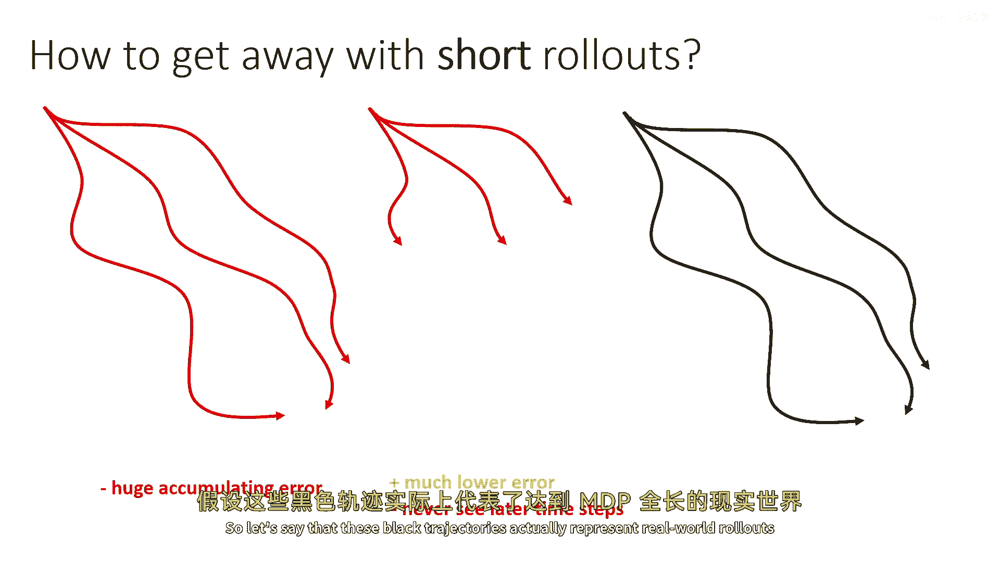

它们是mdp的全长，并且我们会收集这些相对较少，然后当我们基于模型的部署时，我们不会从开始，我们实际上将从这些真实世界的部署中采样一些状态，我们可能会随机均匀地采样整个轨迹，然后从每个一个中。

我们制作一个小型的基于模型的部署，所以这有一些有趣的权衡，嗯，我们确实有更低的错误因为我们的基于模型的部署现在非常短。

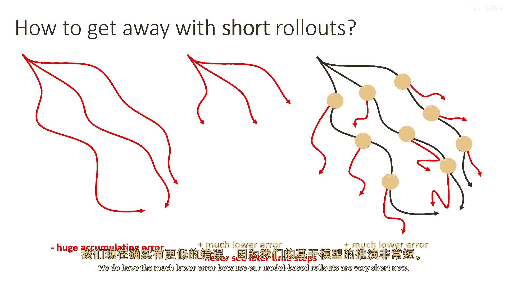

并且我们可以看到所有时间步，所以你将从轨迹的较晚部分采样一些状态，并从那里开始你的基于模型的部署，所以你也会看到后来的时间步，但是这里有一个问题，这些基于模型的部署的状态分布对应于什么样的策略较好。

答案是嗯它，它很复杂，实际上，如果你的策略在你做这些时正在改变，嗯短，基于模型的部署，这些是从真实世界的部署分支出来的，嗯，从真实世界的部署。

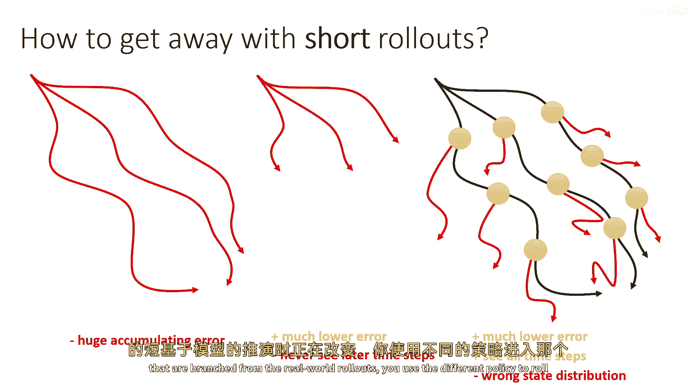

如果你使用不同的策略来滚动到那个状态，然后从那里滚动出来，所以你使用收集数据的策略到达了那些橙色的点，然后当你从那里运行你的模式时，你现在切换到你正在改进的新策略，这实际上是有点问题的。

因为你从这个得到的状态分布并不是你最新策略的状态分布，它也不是收集数据的策略的状态分布，它实际上是这两种策略的一种混合，这不一定致命，当然，如果你对你的策略做出小的更改。

那么所有我们讨论的关于高级策略梯度方法的逻辑都将适用，当我们讨论先进的策略梯度方法时，但是通常使用基于模型的rl的目的是在数据收集期之间改进你的策略，以便你可以更有效地利用数据，在这种情况下。

这个问题变得稍微有点问题，因为如果整个目的是改变策略很多，现在状态分布不匹配将伤害我们，如果我们使用基于策略的方法，如策略梯度算法，我们可以这样做，但是事实证明，要使这工作得非常好。

通常最好使用基于策略的方法，如q学习或q函数演员-批评家方法，尽管这是可能的，人们已经设计了基于政策梯度的策略，这些策略采用了这种想法，你不能在数据收集轮之间改变政策太多。

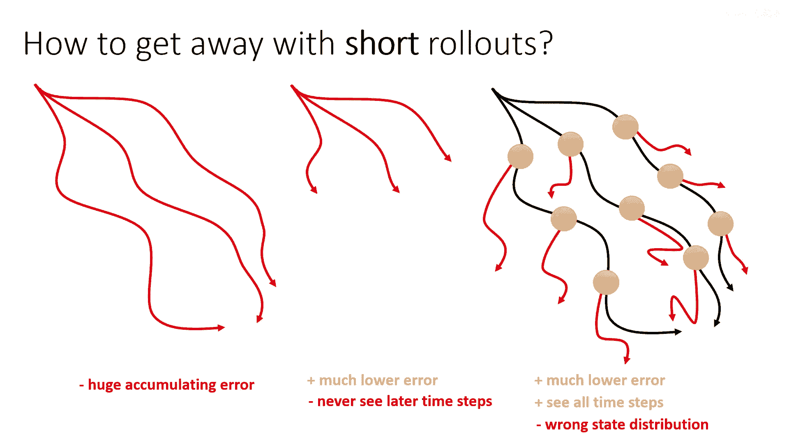

是的，所以基于模型的强化学习，具有短回溯的，嗯，我们可以称之为基于模型的强化学习版本3。0，实际上，这已经越来越接近人们在实践中实际使用的方法，所以这些方法的工作方式就像以前，他们收集一些数据。

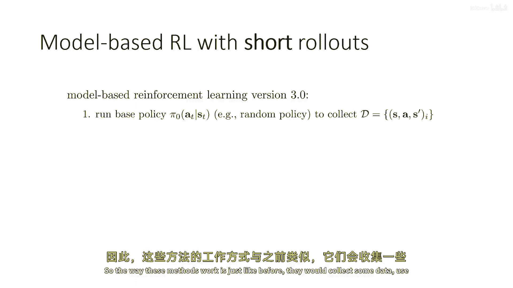

使用这些数据来训练模型，然后，他们从实际世界中收集的数据集中挑选一些状态，然后，使用模型从这些状态中做出短回溯，这些可以非常短，它们可以短到实际算法中的一步，即使它们更长，它们大约在10步左右，非常短。

远短于问题的完整视界，通常，这些方法会使用真实数据和基于模型的数据来改进政策，使用某种离线强化学习方法，这可能涉及Q学习，或者它可能涉及演员-批评者方法，我在这里写的是他们改进了政策，但实际上。

他们通常都有一个政策和一个Q函数，他们通常从模型中生成大量的数据。

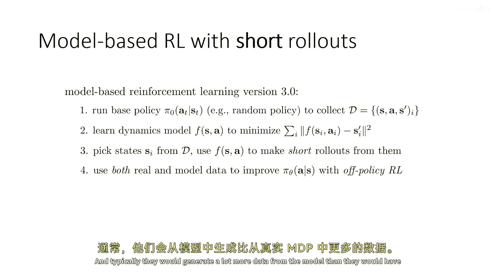

比他们从真实MDP中收集的数据要多，他们会这样做几次，然后，他们在真实MDP中运行政策来收集更多的数据，将其添加到数据集中。

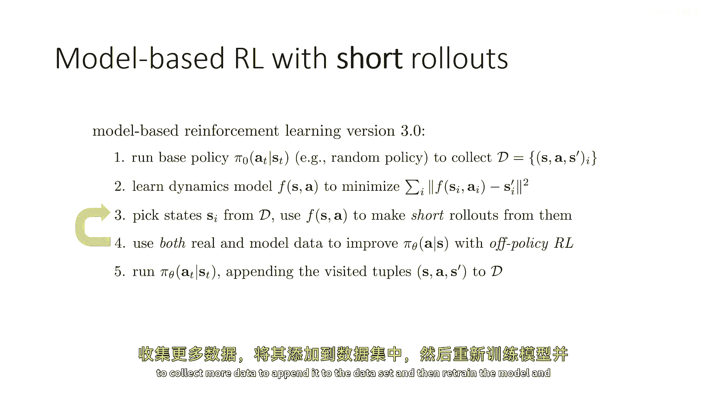

然后重新训练模型并重复这个过程，在这些方法中，经常涉及到许多精细的设计决策，在数据收集之间，他们如何改进政策，他们收集多少数据，他们从模型中收集多少数据等，在下一部分讲座中。

我们将讨论这些算法的特定设计，并了解整个系统架构。

