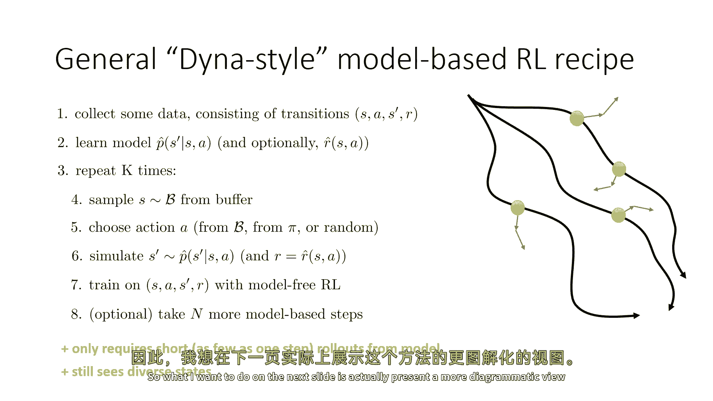
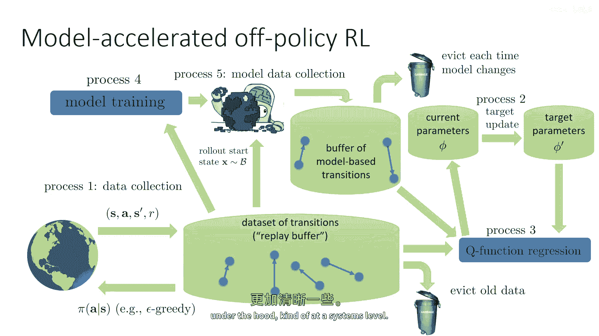
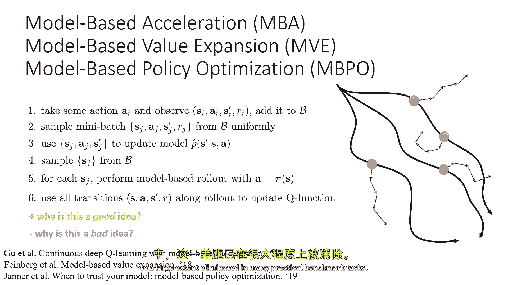

# P52：p52 CS 285： Lecture 12, Part 3： Model-Based RL with Policies - 加加zero - BV1NjH4eYEyZ

好的，让我们谈谈一些我们可以构建的基于实践模型的强化学习算法，基于我之前描述的设计，所以又，再次强调，这就是我们正在谈论的设计，我称之为基于模型的强化学习版本，3。0，但是，当然。

我们有许多设计决策需要作出才能将这种方法转化为现实，对于这个讲座的部分讨论，我们将在第四个步骤中使用基于Q学习的特定离线策略，尽管，我想强调的是，我所要讨论的一切都可以用Q函数演员批评方法实现。

并且它基本上以相同的方式工作，基本上，我们可以通过回忆在讨论Q学习时，我们谈论了如何，例如，训练演员作为学习最大化者基本上看起来与Q学习相似，这就是我们在这里要遵循的逻辑，经典的算法，据我所知。

首先提出这个基本概念的方法是被称为dina的东西，由理查德·苏顿在'。'中描述的，我相信，在九十年代，Dina是这个种类食谱的特定版本，为在线队列学习实例化的，使用了非常短的基于模型的回滚，实际上。

它使用了基于模型的回滚，长度正好是一步，即使这样，如果你能学习到一个好模型，这也将提供显著的好处，所以本质上，dyna是在线Q学习，它通过模型进行无模型强化学习，这是dyna的工作方式，嗯。

它将非常遵循在线Q学习，但是，然后稍作修改，所以，当前状态下的第一步是使用探索策略选择动作a，这与在线Q学习完全相同，第二步是观察导致下一个状态s'和奖励的过渡元组，S a s' r 现在。

新的元素开始进来了，使用此过渡元组更新您的模式和奖励函数，现在，迪娜被提议作为一种在线方法被广泛接受，所以，在经典的dyna中，模型和奖励函数都将以一步更新，也许这些神经网络的梯度下降的一步是。

或者如果是表格模型，你可能会删除表格中的旧值，以学习率的一些倍数，新的值，但是，只是对那个转换的一步更新，然后dyna执行经典的Q学习更新，所以这是对你刚刚观察到的过渡的Q学习更新，但是这里有新的东西。

嗯，到这个点，dyna将重复模型，这个基于模型的程序将重复k次，其中k是超参数，它将从缓冲区中采样一些旧的状态动作，基本上来自你以前看到的状态和动作，然后它将重新模拟，嗯，对于那个状态动作。

它将使用学习到的模式模拟下一个状态，所以这里的表达式与以前更新的Q函数完全相同，除了s'和r现在来自，嗯，学习模型，P hat和r hat，这就是dyna过程，现在，dup过程经典地做出了一些设计选择。

那些设计选择不一定要固定不变，例如，dyna使用缓冲区中的状态和动作，现在，一个非常合理的替代方案是按照最新的策略选择动作，例如，那个Q函数的argmax策略，dyna也只在模型上做一步。

你现在可以做多步，dyar在设计上稍微优化了高度随机的系统，如果你有确定性的系统，当然，如果你将相同的状态和动作通过模型运行，你应该得到之前看到的s'，但对于随机系统，这实际上会产生影响。

所以数据做出了一些可能稍微奇怪的决定，也许不能从模型的最大性能中挤出所有，尽管这些决定对于预期模型对分布变化非常敏感的情况是好的，因为对于步骤和一次在缓冲区中的动作，它实际上避免了所有分布变化问题。

所以在某种统计意义上，这实际上是一个非常安全的算法，但我们可以推导出dyna的一般化版本，这更接近人们实际使用的，这并不是dya最初由七人提出的方法，但我们可以称它为dinah风格。

因为它遵循类似的哲学，所以这里是一种一般化的形式，收集包含过渡的数据，这可能只是一个步骤，或者你可能正在滚动许多轨迹，这是一个你可以做的选择，嗯，学习你的模式，可选择性地学习你的回报模型。

有时回报模型是已知的，但是有时你需要学习它，也许你需要为许多梯度步骤学习这个，或者也许只需要为某个向上的梯度步骤更新它，这取决于你，然后进行大量的基于模型的学习，其中。

基于模型的学习的每一步都涉及从缓冲区中采样一些你见过的状态，在这些状态下选择一些动作，再次，你可以选择是否从那个缓冲区中选择这个动作，还是从你最新的策略中，甚至使用一些探索策略，甚至完全随机。

然后从你的模式中模拟下一个状态，如果你不知道奖励，然后模拟来自你奖励模型的奖励，并且有可能为多个步骤立即这样做，然后您可以使用此来训练您的免费rl算法模型，使用模拟数据训练您的q学习算法，好的。

所以这是对dyna程序的一种一般化，之前它只需要从模型中获取短滚动，也许只需要一步，因为它仍然访问各种类型的状态，因为你直接从缓冲区中采样那些滚动的起始状态，所以，存在一类基于现代模型的强化学习算法。

所有这些算法本质上都是这种基本食谱的变种，现在，当我以这种文本形式的方式描述这种食谱时，可能会很难理解所有成分都在做什么，所以我想在下一张幻灯片上实际上展示。

这种方法的更直观的视图，所以让我们回到我们几堂课前讨论的深度Q学习的图表，作为一个并行过程的集合，如果你记得，我们谈论过有一个过程从环境中收集数据，然后，将数据推入缓冲区。

有一个过程会从缓冲区中删除旧的数据，这些数据已经太老了，有一个过程会更新目标网络的参数，使用最新的网络参数，当然，有一个过程通过从回放缓冲区加载批次数据来执行q函数回归，使用目标网络对这些数据进行更新。

并更新当前参数，好的，所以，这就是我们在前一节课中看到的q学习的大致流程图，现在，我们可以做的事情是，我们可以将这个流程图和基于模型的加速添加到这个中，所以，这就是前一张幻灯片上的基本过程。

我只是要图形化它，所以我们将还有一个过程进行模型训练，并且这个过程将从真实过渡的缓冲区中加载过渡，好的，所以，你想要使用真实过渡来训练你的模式，你不想用你自己的合成数据来训练模式，因为那会非常循环。

然后有一个过程，使用模型收集数据，所以这个过程将从你的缓冲区中采样一个状态，它将使用你的训练模型，并运行一个基于模型的短期滚动，嗯，从那个状态，这里有一个选择你可以做，你可以选择使用你最新的策略。

还是使用收集数据的策略，或者是其他什么，最常见的选择将是使用你最新的策略，所以你实际上使用你当前的参数phi，并执行arg max，或者使用相应的演员，然后，你将从这些模型收集的过渡中取这些。

然后你会将它们推入基于模型的转换缓冲区，现在，当你在做你的q函数回归时，你将从基于模型的缓冲区中采样一些数据，从真实缓冲区中采样一些数据，你想要将它们分开，因为你想要能够调节你使用多少真实数据。

与您使用多少合成数据相比，通常您将使用更多的合成数据，因为合成数据更加丰富，所以图表实际上有些误导，它看起来真实缓冲区更大，但是通常模型基础缓冲区实际上要大得多，您还将对模型基础缓冲区有不同的淘汰策略。

因为通常如果您主要受限于样本而不是计算，您实际上每次更改模型时都想淘汰您的模型基础缓冲区，所以如果您改进，您的模式最好清除模型基础缓冲区并收集完全全新的数据，计算成本。

但它不会让你在实际世界中收集任何样本，尽管如果您关心计算成本，并且这些方法确实倾向于非常计算密集，你也可以，嗯，重用一些基于模型的数据，即使你的模式在改变，但通常你对这些算法会有稍微不同的驱逐策略。

所以看起来这里有很多事情，但实际上，我们添加的这个基于模型的额外过程，仅仅是一种方式，用来填充我们将要使用的额外缓冲区，以便为我们的Q学习过程加载批处理。

所以希望这个图表能使这些方法如何在底层工作变得更加清晰，大致在系统层面。

现在，已经在文献中提出了各种算法，这些算法利用这一思想，这只是几个例子，它们，它们在一些设计决策上略有不同，尤其是在关于用于Q学习过程的数据实际上使用的问题上，以及它如何使用。

所以所以所以我描述的程序在这里，这可能是最接近基于模型的策略优化或mvpo的，但你也可以想象使用基于模型的采样来获得更好的结果，目标值估计，但不要用它们来训练q函数本身，这就是例如。

基于模型的价值扩展所做的，所以这里有几个设计选择要考虑，我不会详细讨论具体是什么，每个设计决策都是，如果你想了解更多关于它们的，你可以阅读我在底部提到的三篇论文，但从高层次来看，它们全都有这个基本配方。

采取一些行动并观察转变，将其添加到你的缓冲样本中，从缓冲中提取一个小批量，均匀地，使用它来更新你的模式样本，缓冲中的一些状态，对于每个状态，执行基于模型的回滚，行动来自你的策略，那些就是分支部署。

然后使用部署中的所有过渡来更新你的q函数，也许结合一些真实的世界过渡，好的，所以为什么这是个好主意，嗯，这些方法的一般好处是它们确实更样本效率，因为它们在使用样本来训练这个模型。

然后这个模型被用来放大数据集，所以，正在被用来构建比您在真实MDP中收集的数据更多的数据，然后，这些额外数据被包括在Q学习过程中，如果模型好，那么Q学习将会更好，为什么这可能是一个坏主意，嗯。

这种方法有许多额外的偏差来源，嗯和曲线，当然，最明显的一个是你模型可能不正确，所以如果你的模型不正确，然后当你执行那些基于模型的滚动时，然后你的策略会，嗯，优化错误的东西。

我们可以通过使用我们之前讨论的一些关于模型的想法来缓解这些问题，基于rl之前，所以例如，如果你使用模型的集成，额外的随机性可以帮助平均线性误差并减少剥削，还有一个原因为什么这可能是一个坏主意。

当我们从缓冲状态开始这些短滚动时，那个是什么？一个离策略算法原则上可以处理它具有错误的状态分布事实，但在最后，你还是需要访问状态，在那里，你需要你的q函数是正确的，所以，如果你以前从未见过某个状态。

并且在你实际上在现实世界中进入那个状态时， well，那么你将会遇到很多麻烦，有可能如果这个状态与任何你训练过的都大大不同，以及你最终使用这些方法的状态分布，是相当奇怪的，正如我之前提到的。

从这些从缓冲状态起源的短滚动中看到的状态，可能来自，既不是收集数据的政策状态分布，也不是你当前使用的最新政策状态，它是一种两者的混合，你知道，实际上这通常起作用，好的，但从原则上来说。

它可以给你一个非常奇怪的状态分布，而且非常远离你在实践中想要的，那通常意味着你不能太久不收集更多的数据，所以你确实需要通过收集更多的现实世界数据来刷新缓冲，以便于在第四步中采样到的国家。

与你在实际运行中可能会看到的国家不要太远，如果这是在真实世界中运行，当然，由于模型选择错误而产生的模型偏差，可能会使这些方法在实际应用中稍微有些问题，我们通常在与这种基于模型的方法中获得的权衡。

是它们通常能够显著更快地学习，因为它们使用了基于模型的加速，但它们有时会停滞在一个较低的性能水平，因为额外的模型偏差基本上设定了一个上限，使它们无法紧密地拟合，符合现实世界动态的适应性。

尽管在部署周期较短和精心的设计决策下，这个差距已经到很大程度上。

