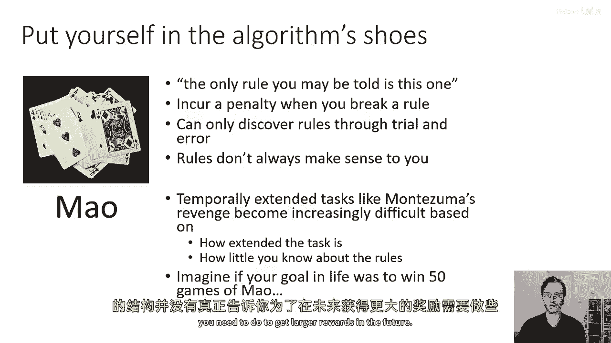
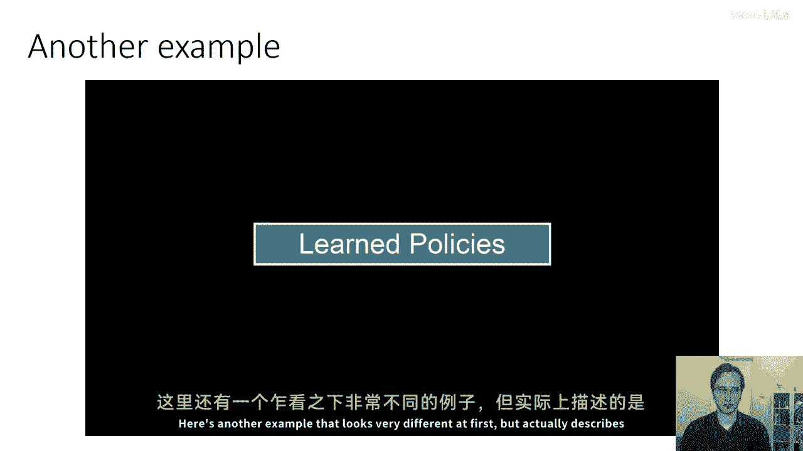
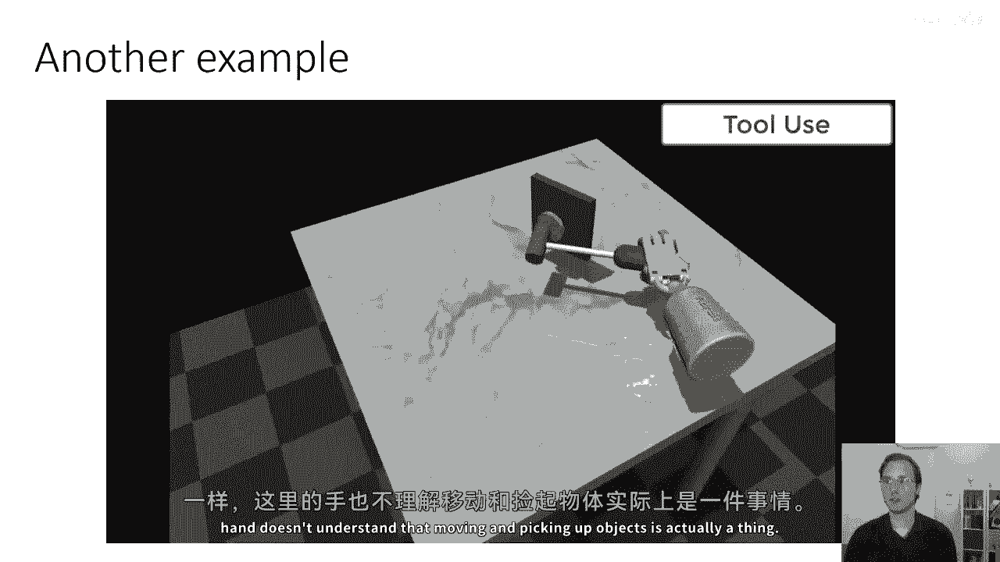
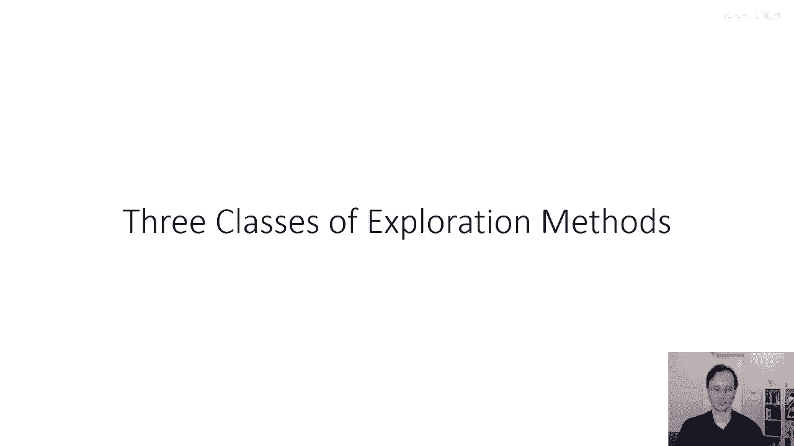

# P54：p54 CS 285： Lecture 13, Part 1 - 加加zero - BV1NjH4eYEyZ

好的，欢迎来到讲座，今天，cs285的十三号课我们将讨论探索，今天的讲座可能会稍微长一些，但是为了弥补，下一堂课，探索的第二部分，将会大大缩短，所以，如果这堂课感觉像是在持续很长时间。

我们将为您在周三的讲座安排一个小休息，那里不会那么长，好的，让我们开始，所以，我们今天要讨论的问题是什么，嗯，这个问题可以通过以下方式来说明，如果你正在完成作业三，如果你正在完成那个，现在。

你可能已经尝试过几种阿塔里游戏，一些阿塔里游戏实际上相当容易，所以，如果你想玩乒乓球或破出，大多数你的，你的作业三Q学习实现应该在那些任务上工作得很好，但是其他的一些阿塔里游戏实际上相当困难，例如。

这个游戏，几乎是不可能的，如果你试图运行，这个被称为蒙泰祖玛的复仇，如果你试图在你的Q学习实现上运行这个游戏，你可能发现它不会走很远，那么为什么，为什么右边的游戏比左边的游戏难那么多，嗯。

这并不是因为游戏本身对于人来说一定更难，玩蒙泰祖玛的复仇，你知道我自己玩过，我不认为它是一个很好的游戏，但它并不是一个特别困难的游戏，实际上，在破出中得到这个技巧射击，在哪里它弹来弹去在上方。

实际上可能比玩蒙泰祖玛的复仇更难，但对于RL代理来说，这个游戏非常难玩，所以在蒙泰祖玛的复仇中，如果目标是穿越这个由多个不同房间组成的金字塔，并且每个房间都有不同的挑战。

那么在这个第一个房间里有一个骷髅在弹来弹去，它会杀死你，如果你踩在它上面，你需要去获取滑雪板，然后打开顶部的门，我们现在理解一些这些事情，我们理解，钥匙是一件好事，钥匙可以打开门。

我们可能不知道颅骨应该做什么，但我们大概知道颅骨可能不是好事，触摸颅骨可能不是一个好主意，现在，在游戏中，你因为得到钥匙而获得奖励，你也因为打开门而获得奖励，被颅骨杀死实际上不能做任何事情，所以。

你失去了一条生命，但是实际上，你没有因为那样而得到一个负奖励，如果你失去了所有的生命，那么你就会重新开始，这也不是显而易见的，无论是好是坏，因为当你重新开始时，你可能又会有机会去捡起钥匙，也许那个好。

因为那样你就可以再次获得钥匙的奖励，所以游戏的奖励结构并没有真正引导你每一步，虽然我们自己知道有些事情是好是坏，代理真的不，而且代理可能会发现一种好的方法来持续获得奖励，是不断地被骷髅杀死。

以便他们可以再次捡起钥匙，而不是移动到下一个房间，问题是完成游戏只微弱地与奖励事件相关，不是你在正确的道路上就会得到一些小块的奖励，而是在错误的道路上就会得到负奖励，所以我们知道该怎么做。

因为我们理解所有这些小精灵和图片意味着什么，但是rl算法必须通过试错来发现它，以尝试理解算法在尝试玩这些游戏时感觉如何，让我们考虑一个不同的例子，一个对人类来说更不直观的例子。

所以有一种叫做毛的纸牌游戏，它的原理也与一个叫做卡尔文球的游戏相似，想法是，你可能被告诉的唯一规则是这个，所以当你开始玩这个游戏时，你并不知道游戏的规则，但他们不会解释规则，他们只会告诉你。

如果你未能遵守规则，你将受到惩罚，所以你只能通过试错来发现规则，然后这就使游戏非常令人沮丧且要求极高，所以尽管规则可能相当简单，因为你不知道这些规则，你需要通过试错来发现它们，游戏最终变得。

非常具有挑战性，所以规则并不总是对你有意义，所以你知道，这个游戏的目的是其他玩家制定规则，这些有些奇怪，也有些反直觉，像蒙太古的复仇或游戏毛这样的时间延长任务可能会变得越来越困难，基于任务的延长程度。

以及你对规则的了解程度，本质上，即使是看似简单的任务，如果你不知道规则，你也必须通过试错来发现它们，由于奖励形状不良，可能会证明极其具有挑战性，想象将这个进一步推进。

想象你生活的目标是与毛赢得五十场比赛，所以你只是在过着你的一天，你知道你可以去上课，你可以做作业，但如果你偶然赢了五十场比赛的毛，你现在将获得100万美元，你几乎不可能只是随机地去做这件事。

所以这实际上是探索问题，探索问题与这个设置有关，你在这里暂时推迟了奖励，任务结构并没有真正告诉你，你需要做什么来在未来获得更大的奖励。

这里有另一个看起来非常不同的例子，但实际上描述了一种类似的问题。

所以这是一个连续控制任务，所以这里，这个机器人手应该拿起一个球并将其移动到这个位置，这也是一个困难的探索问题，因为为了弄清楚，嗯，如何通过将物体放在正确的位置来获得奖励，手需要基本上随机摆动手指的关节。

然后再次，就像事先一样，我们并不理解游戏的规则，现在，手不理解移动和拿起物体实际上是一件事。

它只知道可以摆动手指，而且奖励是如此延迟，它只能获得实际上抓住物体的很少中间信号。

好的，让我们谈谈在rl中的探索这个问题，我们经常将探索与利用问题称为一个，在每个尝试中，代理必须基本上选择他们，是否想要更好地探索，通过尝试他们还不知道的事情，还是只是想做能给他们带来最大奖励的事情。

在蒙太古的复仇中，那个只追求钥匙的代理，每次死亡都是在进行一种利用，他们知道能给他们带来奖励的一件事情，那就是钥匙，他们知道一种获取那个奖励或再次死亡并获取钥匙的方法。

他们只是在利用他们知道如何获得的奖励，而不是尝试在其他地方找到更好的奖励，所以，基于这一点，探索问题的两个潜在定义是，第一个是，一个代理如何发现高奖励策略，第二个是，如何在这种情况下发现高奖励策略。

那些需要暂时性扩展的复杂行为序列，这些行为序列单独来看并不奖励，第二个问题是如何让代理决定是否尝试新的行为，以发现奖励高的行为序列，还是继续做它已知的最好行为，这些实际上是同一个问题，因为嗯。

如果你想发现能够导致高奖励的暂时性行为序列，你需要决定是否应该探索更多，或者你已经找到了最长的暂时性行为序列，你应该只是继续做那个，或者也许改进你做这件事的能力，所以它们实际上是同一个问题。

利用是指你做你知道会获得最高奖励的事情，探索是指你做以前从未做过的事情，以期获得甚至更高的奖励，问题是你不知道你应该做哪一项，当然，它们并不是完全独立的，所以例如，在某些情况下，你可能想要利用一点。

以便你可以探索得更远，如果你知道如何去蒙太古的复仇的第二个房间，探索的好方法是利用一点去进入那个第二个房间，然后从那里探索，所以它不像你必须翻一个硬币并决定是利用还是探索。

这实际上是一种动态和持久的决策，你需要不断地做，所以这里有几个例子，我借了一些来自大卫·西尔弗讲座笔记的内容，想象一下，你需要选择去哪家餐厅，也许这不是你在2020年做的事情。

但在我们以前住在那里的一年，当去餐厅是一回事，利用意味着你去你喜欢的餐厅，探索意味着你去新的餐厅，这个例子看起来非常二极化，我认为这种二极化的理解有些误导，因为在现实中，它可能比那更复杂。

就像蒙太古的复仇的例子，我之前提到过，最好的探索方式可能实际上就是利用一点，然后从你最后到达的地方探索，这是一个经典的探索利用，权衡问题，利用意味着你显示最成功的广告，那个能使你赚最多的广告。

探索意味着你显示一个不同的，也许随机选择的广告，石油钻探利用，也许你在最知名的地点钻探，发现一个新的地点来钻探，这可能不包含石油，或者它可能包含更多的石油，探索非常困难，嗯，无论是从实践上还是理论上。

"这是一个理论上困难和难以解决的问题"，"所以当我们去设计探索算法时，可能会问的问题可能是"，"我们能否导出一种最优的探索策略？"，"这就是我们今天讲座要讨论的内容"，"但是，为了做到这一点"。

"我们必须理解'最优'的含义"，即使残酷，所以，"我们可以通过以下方式定义我们探索策略的优劣："，"从对贝叶斯最优策略的遗憾角度来看"，然后我们稍后会使这更正式，但直觉上。

你可以想象一个完美的贝叶斯代理，它保持对世界如何工作的不确定性，因此做出最佳的探索决策，也许最佳的决策来最优解关于世界的未知，现在，这样的贝叶斯最优代理将是不可处理的。

它将需要估计一个对你的mdps非常复杂的后验分布，但你可以使用这个作为金标准，并且为你的实践探索算法，测量其遗憾对这个贝叶斯最优假设代理，我们可以，嗯，将问题设置置于一个谱系上，使其有所不同。

从理论上可解到理论上不可解，理论上可解意味着我们可以量化或理解你是否被给予，探索策略最优，意味着它接近这个基础最优策略或次优，意味着，它比基础最优策略差得多，而不是。

不可解意味着我们不能在那个设置中精确地做出这个估计，所以理论上最可解的问题被称为多臂赌徒问题，你可以把多臂强盗问题看作是一步时间，无状态强化学习问题，所以在强化学习中，你有一个状态和一个动作。

并且动作导致下一个状态，在强盗中，你只采取一个动作，然后一集结束，所以没有状态，所以你只需要决定一个动作，这些是最理论上可处理的问题，因为在多臂强盗中，实际上。

我们可以理解哪些探索策略从理论上来说是最优的，而在后悔方面，哪些策略不是最优的，与基础最优代理相比，下一步是上下文感知的带子问题，上下文感知的带子问题就像多臂强盗，只不过它们有一个状态。

所以它们仍然只有一个时间步，你仍然只能采取一个行动，你的行动只影响你的回报，它不影响下一个状态，但是你有一些上下文，有点像你的状态，所以添加位置可能是一个这样的问题，你观察到用户的一些事情。

也许你有关于用户的特征向量，然后，你需要选择向那个用户显示的广告，嗯，下一步是较小的有限MDPs，所以这些是可以被精确解决的MDPs，可能使用价值迭代，这些远不如班迪特那样理论上可追溯，但是。

关于在小型有限MDPs中的探索，有一些事情我们可以说，然后，当然，下一步，在深度RL中，我们真正关心的是大型无限MDPs，也许具有连续状态空间或非常庞大的状态空间，比如图像，对于这些问题，一般来说。

我们没有多少理论上可以说的，但我们可以做的是，我们可以从理论上有原则的算法中汲取灵感，我们可以设计出这些算法，在多臂赌徒设置中，然后，我们可以在大规模中适应类似的技术，处理无限个MDPs。

并希望它们能很好地工作，那么，使多臂强盗和上下文强盗的探索问题可处理的关键因素是什么，我们可以做的一件事是，我们可以将探索问题形式化为另一种类型的MDP，或者，实际上。

一个部分可观察的POMDP的Palm DP，所以，虽然多臂强盗是一个一步问题，你可以将多臂强盗探索问题视为一个多步问题，因为尽管你的行动不会影响你的状态，但它们会影响你所知道的，所以。

如果你明确地思考你信仰的进化，这就形成了一个技术上部分可观察的马尔科夫决策过程，然后，你可以使用掌上马尔科夫决策过程方法来解决它，因为它们是，你知道，这些多臂强盗相当简单。

即使是掌上马尔科夫决策过程也可以实际上被解决，至少在理论上，然后，在我们这里的小有限马尔科夫决策过程下一步，你可以将探索视为贝叶斯模型识别，然后，明确地思考像信息价值这样的东西。

你正在将类似的想法扩展到我们在强盗中的思路，对于大型或无限的MDPs，这些最优方法在理论上不工作，因为我们无法证明它们，但我们仍然可以从更简单的设置中汲取最优方法的灵感，并将它们适应到这些更大的设置中。

发现至少从经验上看它们工作得很好，尽管我们不能从理论上说它们，当然，我们使用了很多技巧，就像我们在深度强化学习中总是做的一样，这是您将在这次讲座中找到的一个主题。

那将在像多臂强盗这样更简单、更小的问题上采取一些非常原则性的 approach，我们将通过类比和大型 MDPs 来适应这些 approach，然后，我们将使用一些技巧来使它们在实践中工作良好，好的。

所以让我们从讨论强盗开始，强盗到底是什么，所以我们正在谈论的强盗，当我们谈论探索时，并不是这些人，它，强盗实际上是一种探索问题的果蝇，所以，就像生物学家研究果蝇一样，作为强化学习中的一种简单模型生物。

我们研究班迪特作为我们的简单模型生物，我们提到的班迪特是这个东西，所以，多臂强盗这个词，是一种有点古怪的美国口语，起源于一个臂强盗的词汇，一个臂强盗是一种老虎机，它是在赌场中的一种机器，你可以拉下杠杆。

并且以某种随机概率，这个东西会产生一些奖励，也许你会失去你的钱，或者你可能会得到钱，你所在的多臂强盗就像一个只有一只手臂的人，而你只有一项行动，就是拉那个手臂，而且你不知道拉那个手臂的奖励是什么。

而且总体的奖励是随机的，所以真的是一个奖励分布，你可以把多臂强盗想象成一个包含不同老虎机的银行，而你要做出的决定是哪个老虎机来玩，所以你有n台这样的机器，不同的机器会给出不同的收益。

现在它们的奖励分布是不同的，仅仅因为你拉了一个手臂，并不意味着那是一个坏手臂，也许你拉了那个手臂，但你得到的钱很少，但这只是因为你运气不好，也许总的来说，那台机器会给出非常高的收益。

如果你反复拉那个手臂，平均来说，你可能会赚很多钱，所以你不知道每个手臂的奖励，所以你不知道每个臂的奖励分配，所以你可以假设每个臂的奖励按照某种概率分布分配，然后你可以想象甚至学习这种概率分布。

所以每个臂都有一个未知的动作分布，那么如何定义好臂，嗯，我们假设每个动作的奖励按照某种分布分配，并且动作ai的分布由参数向量theta i参数化，所以，例如，如果你的奖励为零。

你可能在一个概率获取奖励一为theta i的设置中，这仅仅是一个数字，获取奖励零的概率是一减theta i，如果你的奖励是连续的，也许你有一些连续的分布，而且你真的不知道theta i是什么。

但你可以假设你对他们有一个先验，你可以使用非信息的先验，如果你喜欢，但是一般来说，我们会说我们有一些关于theta的先验p，所以这就是定义我们的赌徒，现在，这个有趣的地方是。

你也可以将这个视为定义一个手掌，Dp对于探索，其中，状态是theta向量，对于你所有的行动，你现在不知道状态，但如果你知道了状态，那么你就可以找出正确的行动是什么，而不是知道状态，你有一个信念。

所以你有一些信念，P hat over theta，一至theta n，你可以每次拉臂时更新你的信念，所以每次你拉臂，你观察到那臂的奖励，并且你可以更新你对于对应那臂的theta的信念。

并且你可以解决这个泵dp来基本上找出正确的行动序列，在这个pom dp中，最大化你的回报，这将产生最佳的探索策略，因为如果在pdp中它是最优策略，在这种不确定性下，它是最优的事情要做。

这将是最佳的探索策略，你可能拥有的最佳探索策略，现在，这是过度的，信念状态非常大，嗯，即使是对于简单的，嗯，用二进制泵dp，嗯，奖励，记住你的信念状态不是theta向量。

实际上是一个关于theta的概率分布，所以即使在简单的二进制奖励中，theta对应于获得奖励一的概率，theta帽现在需要成为一个参数化类，也许一堆贝塔分布，你可以有不同的西格玛值之间的协方差，所以。

这可能是一个极其复杂的信念状态，关于强盗的酷之处在于，你可以证明做得很好，比解决这个完整的泵dp策略简单得多，你如何量化做得好，是通过量化你的策略的悔恨，相对于实际解决泵dp做得那么好。

当我们说一种探索策略是最优的，我们真正意味着它不是比实际解决泵dp差多少，差得不多通常被定义为在大O意义上，那么，我们如何衡量探索算法的好坏呢，嗯，我们以后悔和后悔为标准。

后悔是时间步t时的最优策略与实际得到的奖励之差，所以，你可以将后悔写成资本t，乘以星奖励的期望值，那就是最优策略，减去你实际上得到的奖励之和，所以，最优策略总是选择星，这意味着如果你要执行t步，那么。

你就应该选择星，它将是星星预期奖励的t倍，这就是最优策略会做的，然后，你的悔恨是那与，和你从运行你策略实际获得的奖励总和之间的差异，所以，这就是最佳行动的预期奖励，你期望的最好结果。

这是实际被采取的行动的奖励，好的，所以在接下来的部分，我将谈论我们如何最小化悔恨，在可操作的策略和我们定义的PDP之间缩小差距方面。

