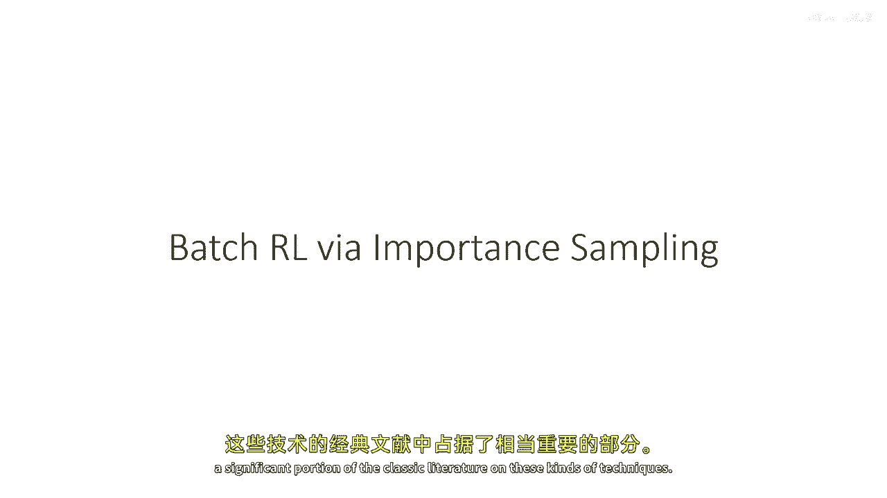
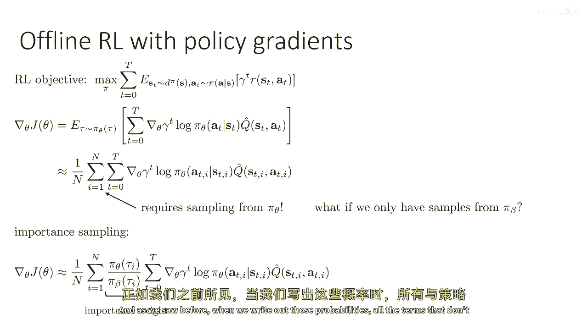
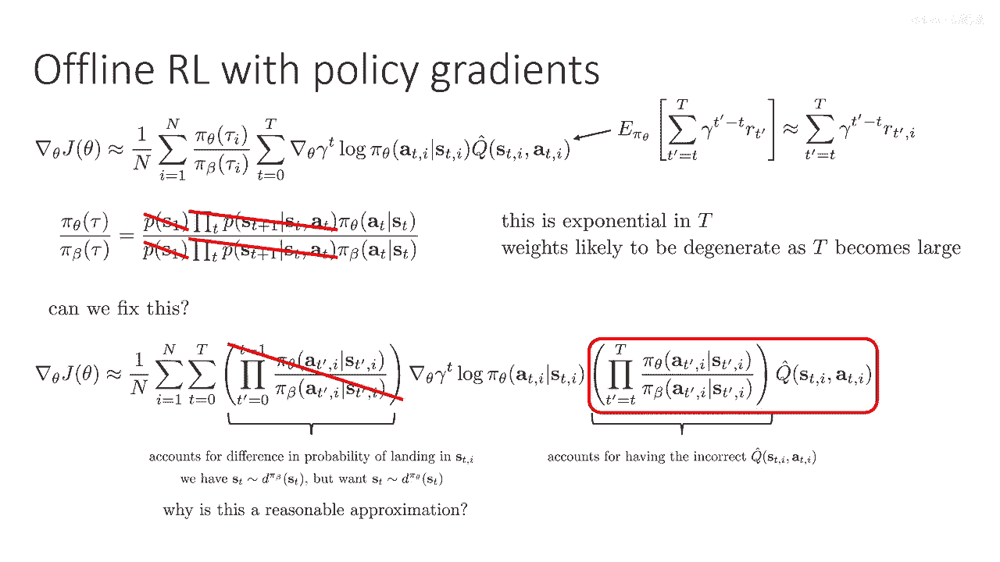
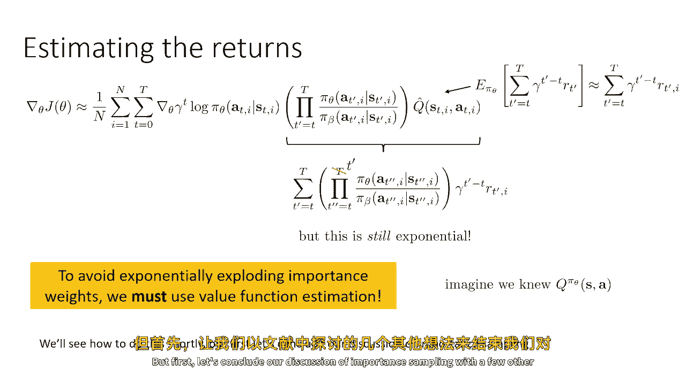
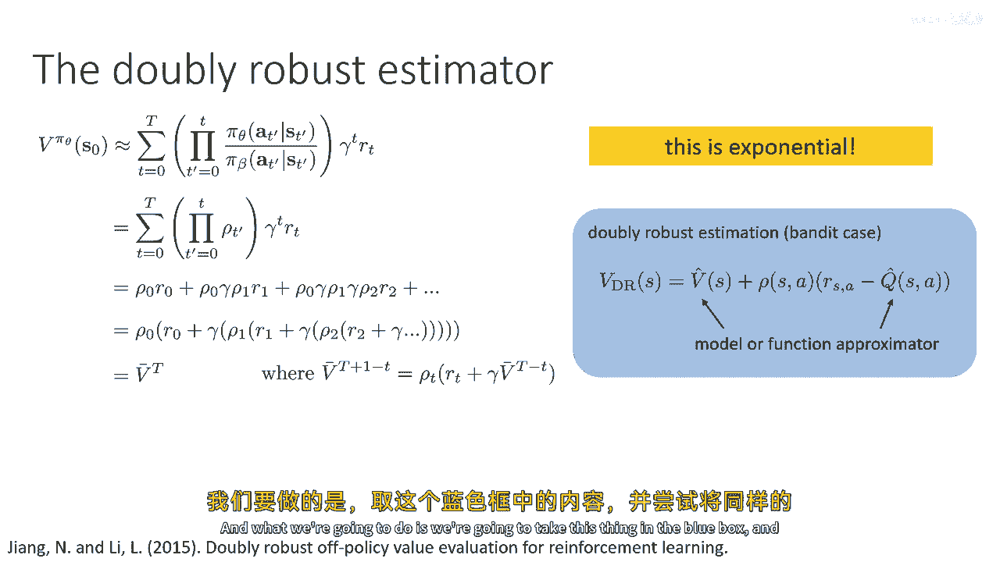
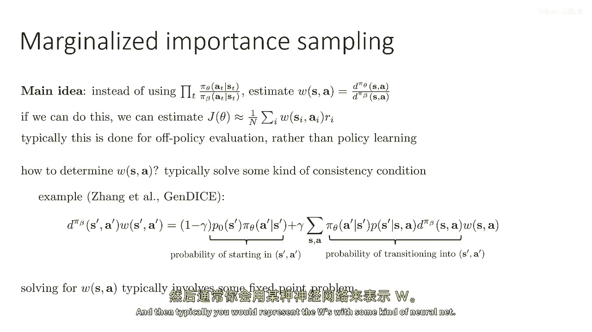

# P65：p65 CS 285： Lecture 15, Part 2： Offline Reinforcement Learning - 加加zero - BV1NjH4eYEyZ

下一个就绪，嗯，我们将讨论的经典部分有两部分，嗯，离线强化学习方法，这种预日期，深度强化学习技术，这些是，你知道，一般来说，这些不是你应该开始的方法，如果你想在今天使用离线强化学习。

你应该从稍后我们将讨论的方法开始，但我认为讨论这些有帮助，以便每个人都能有一种观点，了解许多这些想法的来源，以及人们过去如何思考离线强化学习和批处理强化学习，顺便说一句，在术语上。

批处理强化学习的术语实际上，嗯，在大约两千年代初期和一些最近的几年里，这一概念开始流行起来，离线强化学习（offline RL）这个术语的使用频率有所增加，因为它更易于理解，它更能准确地捕捉实际情况。

在当前的机器学习话语中，'批'这个词有些过度使用，但它们意味着相同的事情，所以'批'，或者如果你看到一篇说'批强化学习'的论文，它意味着与离线强化学习相同的事情，所以我在下一部分讲座中将讨论批强化学习。

或者重要的采样离线强化学习，我们在这门课程中讨论的大部分方法，对于离线强化学习的方法是基于价值的方法，基于动态规划的方法，但我们将稍微讨论一些基于重要性采样的方法。

因为这占据了这类技术经典文献的重要部分。

嗯，现在，很多，你们已经从我们对重要性采样政策梯度的讨论中熟悉了这些，并且这构成了基于重要性采样的技术对于离线和批处理强化学习的基本思想，所以我们有我们的强化学习目标，我们有我们的政策梯度。

就像我们之前覆盖的那样，Grad log q，抱歉 grad log pi 乘以 q，以及你们所有人都应该熟悉的问题，到这个阶段，估计政策梯度需要 pi theta 的样本。

所以如果你只有 pi beta 的样本，你需要做的是重采样，是的，我们已经学习了所有的重采样，所以，我们将我们的政策梯度乘以一个重要性权重，"πθ和πβ轨迹概率的比率是多少？"，"正如我们之前所见"。

当我们写出那些概率时，所有不依赖于政策的术语都会相互抵消，所以这就是一个对嗯的概括，"关于政策梯度的讲座"，"因此，两种策略下轨迹概率的比率"，"由初始状态产生"，"过渡和政策"，"但是。

由于初始状态和转移概率完全相同"，来自两个，对所有的πθ和πβ都适用，只有动作概率的比率才会出现，正如我们之前讨论的，这是一个完全合理的，只使用πβ的样本来构建政策梯度估计器的无偏方法。

但它有一个大问题，因为你在乘以这些动作概率，并且你通常要乘以的概率的数量，是o(资本t)，这意味着权重是资本t的指数，这意味着权重可能变得退化，当t退化时，首都t会变得很大，我的意思是。

那就是一个权重在所有其他权重上都会变得非常大，而所有其他权重都会变得非常小，这意味着实际上，当t增加时，你使用数学上相当任意的一个样本来估计你的政策梯度。

这意味着尽管使用这些重要性权重的政策梯度是无偏的，意味着如果你，许多许多不同样本，或者如果你运行估计的许多，实际上，在许多独立样本的情况下，它将实际上给你正确的答案，但是，估计量的方差非常大，实际上。

它非常大，甚至是指数级的，哪，当然，这意味着你需要指数级的样本才能得到准确的估计，嗯，我们能修复这个问题吗，嗯，好吧，在我真正分解这个方程之前，我在这里想提的一点是，在我们的高级政策梯度讨论中。

我们确实看到了，那，使用重要采样和现代实际政策梯度方法中的一种常见方式是简单地删除，嗯，给定状态s的P项在这些权重中，对所有时间步t之前的时间步，在先进的政策梯度讲座中，我们学习了这样做是合理的。

如果π_θ和生成数据的政策π_β相似，那么在我们的情况下，π_β，这不适用于离线rl，因为在离线rl中，整个点就是得到更好的政策，嗯，那么嗯，让我来简短地回答，我们能修复这个问题吗？不，我们不能，但是。

我们可以稍微深入思考这个问题一点，并且深入思考一点，我们可以将这些权重分离为两部分，所以你可以认为它作为一个，作为一个所有轨迹行动概率产品的函数，从零到小t的产品，然后从小t到大T的产品。

你可以将其分为两半，并将这两半，其中一半放在grad log pi的前面，而另一半现在并没有改变什么，这只是嗯，因为乘法交换，所以，只是利用交换性质来，只是写同样的重要性方式以不同的方式。

但这种写法使它更加明显，实际上，重要性权重有两个部分，一部分乘以小t之前的所有动作，你可以认为，基本上是考虑到pi theta到达状态st的概率与pi beta不同，然后之后的所有东西。

基本上考虑到你的价值，你通过在pi beta中求和的估计值q hat可能不同于从pi theta中得到的价值，所以，权重的第二部分考虑到到达st的奖励差异，因为从pi beta采样的状态。

我们想要pi theta的状态，而权重的第二部分考虑到q hat的错误，因为经典蒙特卡罗政策梯度是由在pi beta中看到的奖励形成的，而您想要pi theta的奖励，嗯，所以你可以忽略第一个术语。

这就是，嗯，因为在经典的蒙特卡罗政策梯度中，政策梯度是由从pi beta看到的所有奖励形成的，而您想要pi theta的奖励，嗯，所以可以忽略第一个术语，这就是，经典的，嗯在嗯，但是。

这是经典政策技术中的多步梯度方法的一个例子，所以这就是，例如，Ppo，这些是收集主动样本的方法，但是然后他们会采取许多梯度步骤，使用重要的采样估计器，然后收集一些更多的样本，并解释为什么可以丢弃。

这基本上如果收集数据的政策足够接近你的最新政策，那么忽略这个就是可以的，因为你有一个界限，正如我们在高级政策梯度讲座中讨论的，嗯，所以这就是为什么这可能是一个合理的近似。

但是只有当你愿意让pi theta db和pi beta的差异不要太大时。

所以我们可以谈论，嗯，就是另一个术语，嗯，所以，天真地看待另一个术语，你会通过简单地加总来自πβ的奖励来估计q hat，但你想要的是你想要加总来自πθ的奖励，嗯，所以你可以考虑将这个分解为，嗯。

这些重要性权重甚至进一步分解，你可以说，这实际上是一个真正的和，"从原始时间t到奖励的大写字母T的时间"，"你在t'时刻实际上看到的"，"嗯，乘以那个重要的方式"，"所以我在这里没有做任何改变"。

那就是分配性质，嗯，但你知道，未来的行动不会影响过去的奖励，"所以，你可以做的事情之一是对于任何时间步长"，"T' 你可以概括为只有这个嗯"，从t到t'的实际概率，而不是从t到T的实际概率，所以本质上。

我有在当前时间步的奖励，那个东西不影响这个，不被动作影响，两个时间步后，所以我可以排除这个从重要性权重中，嗯，重要性权重仍然会乘以T的术语，所以从大O的角度来看，这个实际上并没有变得更好。

但这意味着我们有更低的时间方差，但这意味着我们有更低的时间方差，更接近当前的一步，所以仍然是指数级的。

但是稍微好一点，嗯，实际上，为了避免重要性权重指数级爆炸，我们必须使用价值函数估计，有一个，实际上，没有任何方法可以完全避免指数问题，如果不使用价值函数估计，但那并没有阻止文献中的各种技术尝试。

"仍然让这个情况不那么糟糕"，他们没有完全避免指数问题，"但是，还有许多方法可以减少方差，使其更易于管理。"，所以，其中一个就是在幻灯片上的，"这是指仅乘以从t到t'的动作概率"。

"不如为时间的奖励而将每个t转换为大T"，"质数步"，嗯，"但是，有更好的方法来做"，所以稍后我们将讨论如果你知道q、π和θ，这个将如何工作。或者如果你必须学习q pi theta，但是首先。

让我们结束对我们重要采样的讨论。

以一些在其他文献中探索的其他想法，所以有一个想法是，嗯，值得讨论，因为你知道它，它启发了许多人，更更 recent的技术是双重稳健估计器的想法，你可以把双重稳健估计器看作是一个基础的估计值。

但对于重要性采样，所以这只是从前一张幻灯片中估计的重要采样值，并且它还是时间水平时指数级的，所以请注意，它在乘以，从小 t 到小 t  prime 和小 t  prime 的行动概率，并从，你知道。

一直延伸到大 t，所以到最后一步，你仍然在乘以，大 t 概率，我将为了简化而说，我只会省略那些 uh 索引，嗯，我将把我的保持原形的字母转换为 t，只是为了简化。

所以在我注意到我正在写 s t 的 v 之前，我只会写它作为 v 的 s 零，我只会在初始字母时间步时写出来，大部分，这只是为了清理我的记号，但你基本上可以替换和替换零为 t。

那么你将获得之前的所有东西，我试图做的事情是，我将尝试进一步减少这些重要性权重的方差，所以我要引入一点符号，我将引入行t'和rt'，将表示给定st'的θa_t'，除以pipiβa_t'给定st'。

所以我只会将那个比率浓缩为行t'，所以现在我们可以看到，这个重要的样本值估计器是所有时间步骤的乘积和，产品的总和，直到那个时间步长乘以gamma乘以t乘以r乘以t，而且我们关心的是那个行向量的乘积。

所以如果我们实际上写出这个，嗯，就像实际上展开和，你会得到第一个项，它是行零乘以r零，然后您得到第二个项，它是行零乘以gamma乘以行一乘以r一，然后您将得到行零乘以gamma，行一乘以gamma。

行二乘以gamma等是两项，好的，然后我以一种稍微反直觉的方式写了它，故意地将伽马与行交错，所以我也可以只是收集所有的伽马并只写伽马到t，但我故意这样写，这样你就可以得到行伽马的交替模式，行伽马或伽马。

这在后面会很重要，所以接下来我们可以做，我们可以给一些括号，你会注意到这个和的每一项都以行零开始，所以你可以只取出行零，并将所有其他项放在括号里，所以现在你有行零在括号里，一个大和，包括所有其他东西。

R零加上伽马，加上所有其他未来的东西，然后你可以重复这个过程，你可以收集所有具有行零和行一的项，这就是第二个括号，这就是为什么你有伽马，第一行，然后在括号里写r1，再加上其他所有东西。

你可以像这样一直下去，你可以得到所有这些嵌套的和，对，我们实际上没有改变任何东西，我们只是在基本使用乘法的分配和交换性质，以及加法将这些术语分组，所以这只是一点点，嗯，算术，一点代数，嗯。

让我们把这个叫做v bar的t的指数，v bar的t是v pi theta s零的重要抽样估计者，你现在可以注意到这里有一个递归，所以v bar t加一减t等于rho t乘以rt加上gamma。

v bar t的大t减去小t，所以本质上大t的bar减去小t，那就是在伽马后面括号内的内容，好的，所以，如果这个不是很明显，你可能想在这里暂停视频，嗯，你可以甚至考虑拿出一张纸，并只是工作这个问题出来。

以便说服自己这是真的，这个有点微妙，对吧，我们正在引入一些符号来诱导递归，这允许我们描述这个重要的采样估计器，嗯，以递归的方式，好的，嗯，所以我们的目标是最终得到v bar capital t。

这个递归描述了一种方式，基本上可以 bootstrapping 我们到bar capital t，现在让我们谈谈双重稳健估计，嗯，双重稳健估计首先更容易得到，在带状问题中。

所以在带状问题中只有一个时间步，你所要做的就是，你试图估计奖励，你现在仍然可以使用重要采样，用重要采样做带状问题是有点奇怪的，但是嗯，它工作，给了我们多步情况的直觉。

一个普通的重要采样带状问题只是row s a times rsa right，所以我们有其他分布的奖励，我们将它们乘以权重，这将给我们放弃的价值，这是上下文带状，对吧，所以这是撒哈拉，有一个状态。

但现在让我们说有一些关于价值函数的猜测，这个猜测不需要很准确，对吧，所以我们有一些猜测v hat s和q hat essay，你知道我们如何得到这个猜测，嗯，也许我们只是训练一个神经网络来回归值，对吧。

嗯，我们需要在这里的是，我们需要v hat s实际上是q hat s a的预期值，与动作有关，但这很容易得到，你知道，你可以只是估计q hat s a，然后使用你的政策样本来估计v hat s，好的。

然后，双重稳健估计器基本上取这个重要性，加权嗯，奖励，减去你估计的嗯，函数逼近，然后添加回它的期望值，所以这很像我们之前学到的控制方差或基线，并且双重稳健估计器在期望上将是无偏的，就像基线。

无论q帽子的选择如何，只要v实际上等于q的预期值，但是当然，q越接近真实的um，到真实的q值，这个的方差就越低，因为知道，在最好的情况下，如果q完美地抵消了rsa在这里，那么那个第二个术语。

高方差生样本术语趋向于零，而第一个方差很低的术语主导，所以就像基准线允许我们减少方差一样，这些，这个函数逼近器允许我们减少这个重要采样估计量的方差，现在这是带状器情况。

双重稳健估计器的真正技巧是将其扩展到多步骤情况，步骤情况，我们打算做，我们将取这个蓝色盒子中的东西。

并且我们将尝试将这些v条应用相同的想法。

所以让我们这样做，所以我们将以同样的方式定义，V大写t加上1减去小写t，我们将定义一个双重稳健的版本，V大写t加上1减去小写t，我们以这种方式来做到，我们将直接将其插入到这个巴蒂特案例中。

所以在巴蒂特案例中，我们正在做一个重要的样本估计的rsa，现在我们正在做一个重要的样本估计的rt加上gamma，V大写t减去小写t，所以本质上，我有这个v bar dr的方程，正是蓝色盒子中的强盗案例。

但是将r替换为r加上gamma v bar uh capital t minus little t，所以它本质上是多步问题的强盗案例的递归版本，因此，为了做到这一点，您需要构建一个估计。

Q hat s t a t和q hat sd可以是一些神经网络，您喜欢的函数逼近器，您需要获取其预期值，相对于按照您的策略分布的动作，Pi theta，这将给您提供v hat，然后，就像递归一样，嗯。

V，大写字母T加上一减去小写字母t可以用于获得重要的采样估计，那就是，The，双重稳健递归，可以用于获得双重稳健的重要样本估计，所以这就是背后的想法，嗯，双重稳健的嗯，对政策价值评估，现在。

这是一个离线评估方法，这是一个opmethod，它不是强化学习方法，所以这将给你估计值，并且你可以使用这些值仅仅来评估哪个政策更好，或者你可以将它们插入到一个重要的采样政策梯度估计器中。

好的，嗯，我还有一个想要非常简要覆盖的主题，我不打算深入探讨这个，但我只是想描述这个，以便所有都知道它存在，这就是边缘重要采样，所以到目前为止，当我们谈论重要采样时，我们总是谈论重要采样。

对于您计算重要性权重的情况，例如作为行动概率的比率，但实际上，有可能进行重要采样以状态概率，所以被称为边缘重要采样的主要想法是，而不是像我们之前那样使用行动的概率产品，我们将估计重要性权重。

它们是状态概率或状态行动概率的比率，现在，状态和状态行动的区别实际上并不是那么不同，因为一旦你有一个状态概率的比率，将它转化为状态行动概率的比率是非常容易的，因为知道一个给定的状态s。

但如果你可以恢复这些状态行动重要性权重，那么很容易估计某个政策的价值，只需对所有样本进行求和，然后平均加权奖励，所以，如果可以恢复这些，进行离线评估就非常简单，当然，如果你可以进行离线评估。

那么你也可以将这些价值估计插入到政策梯度中，如果你喜欢，但在文献中，边缘重要采样通常被用于离线评估，我没有看到它被用于政策学习使用得很多，尽管我认为应该是可能的，所以，最大的挑战是这个，当然。

如何确定wusa，通常因为我们不知道我们的政策或行为政策的状态边缘，我们通常会做，我们写下w的一些一致性条件，然后解决那个一致性条件，你可以将这个一致性条件看作是贝尔曼方程的一种等价形式，但是。

对于重要的权重，所以，所以，贝尔曼方程描述了一种价值函数满足的一致性条件，类似于，例如，Q_s^a 应该等于 rsa 加 gamma Q_s'^a，一个 prime，那是一个一致性条件。

如果你能使这个等式在所有地方都成立，那么你将恢复一个有效的 q 函数，同样，你可以写下一个关于 w 的一致性条件，如果可以将这个条件在所有地方都保持为真，那么你将恢复真正的状态或状态动作重要性权重。

所以这里有一个这样的一致性条件，这来自一篇由尚一涛写的论文，叫做gendice，我不会详细解释这个，因为对于这个的推导有点复杂，而且我已经花了相当一段时间在重要采样上，但我想让你尝一下这些的一般思想。

嗯，这个，如果你看看这个一致性条件，你可以看到，在左边，你拥有看到状态和动作s prime的概率，在行为政策pi beta下，s prime的权重是什么，我们来看看这里。

如果你乘以d pi beta和权重，你会得到d pi theta对吧，因为权重是d pi theta除以d pi beta，所以这实际上是描述一个状态动作边缘分布需要满足的条件，当它来实际优化时。

在实践中，当然我们肯定会从左边减去右边，"只要前面有一个d pi beta的乘数，我们就能行"，那就是我们然后做的，我们可以用样本来近似它，因此。

实际上我们 never 直接估计这些 d pi beta 术语，我们总是使用数据集中的样本作为d pi beta的样本，所以，左边的这一部分就是看到s质数的概率，"在πθ政策下的首要数"。

"并且看到s质数的概率"，"质数基本上等于你从s质数开始，下一个也是质数的概率"，"这就是第一个术语所捕捉的"，所以，你是在s'状态下开始的概率，你采取动作a'的概率，加上你从一个状态转移到s'的概率。

来自另一个状态的a'，你从一个状态转移到s'的概率，来自另一个状态的a'，在这种情况下，a由你在那个状态下的概率给出，这是d pi theta s a，这就是最后两个术语的乘积给你带来的概率。

你使用这种过渡的概率，这是你通过将s'的p乘以s'得到的结果，给定s'a次，πθ，给定s'的s'的质数，所以这就是在s'a'开始时的概率，并且这是从另一个状态过渡到它的概率。

乘以你实际上处于那个状态的概率，这是最后两个术语所代表的，所以解决wa通常涉及某种固定点问题，所以它涉及到从左到右减去右边，并最小化平方差，在推导这些算法的诀窍中。

基本上将那个差异转化为在dπβ下的平均值，因为只要你能表达它作为在dπβ下的平均值，然后你可以使用dπβ的样本来估计它，这意味着你永远不会需要明确地近似，你永远不会需要一个神经网络来近似dπβ。

或dπθ，你只需要一个神经网络来近似w okay，所以这是边际重要采样的基本概念，写下未来状态和当前状态之间的w的关系，将那个关系转化为误差，然后只使用你数据集中的样本来估计那个误差。

然后通常你会用某种神经网络来表示w的。

好的，所以这是对离政策评估中的重要采样的快速概述，以及批量rl，如果你想了解更多关于这个经典工作在重要样本政策梯度和回报估计上的重要采样和返回估计，通过预剪切以及peshkin和shelton。

双重稳健估计器，非常有趣，如果你想学习关于opie与重要权重的，所以对于bandits和较小的mdps，当然，双重稳健估计器通常是首选的方法，如果你在做像添加放置这样的东西。

但现在有一些更好的技术来实际学习策略，以及一些分析和理论，这个由菲利普·托马斯撰写的论文，高置信度的离政策评估提供了对这些类型的估计器的大量分析，如果你想学习关于边际重要采样的，考虑检查这些两篇论文。

