# P67：p67 CS 285： Lecture 16, Part 1： Offline Reinforcement Learning 2 - 加加zero - BV1NjH4eYEyZ

在今天的讲座中，我们将继续讨论离线强化学习，并覆盖更多基于价值函数估计的现代离线rl算法，这些算法明确地采取了步骤来减轻分布漂移的影响。

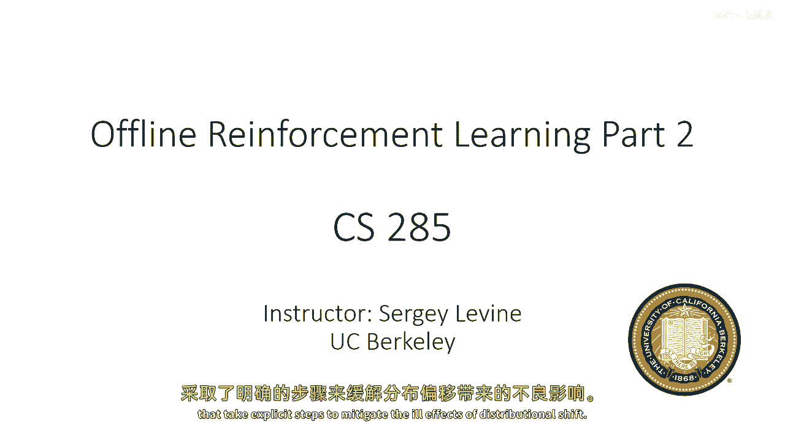

所以首先让我们简要回顾一下周一的内容，基于策略的强化学习算法是那些与世界交互的算法，收集一些数据，使用这些数据更新模型，然后丢弃数据并收集更多的离线数据。

我们之前学到的策略强化学习算法本质上是这种缓冲版本的，其中，到目前为止收集的所有数据都被存储在回放缓冲区中，并用于每次更新，所以，你可能加载所有过渡状态来增强每次更新可用的数据量，例如，对于Q函数。

但你仍然迭代地收集使用最新策略的额外数据，离线强化学习摒弃了主动数据收集，在离线强化学习中，完全依赖于离线数据，我们假设我们已经被给予一个数据集，并且这个数据集是由一些未知的行为策略收集的。

我们称之为πβ，所以，定义是D是我们的数据集，我们可以把它想成只是一个无序的状态动作，下一个状态和奖励元组的集合，在实际中，这些元组通常被排列成轨迹，但今天我们将描述的价值基于方法，通常不使用这一点。

所以他们只是假设你已经被给了过渡，我们将使用D^πβ来表示一个状态分布，或D^πθ来表示当前策略，状态分布πβ代表行为策略，通常收集数据集的策略，我们不知道这个是什么，我们有我们的过渡概率。

我们的奖励和行为策略，你知道它可能真的什么都是，可能是人类收集数据，也可能是一个手工设计的控制器，所以我们只是假设存在这样的东西，这并不是真的假设什么，所以，如果你看到简单的πβ在大多数这些算法中。

我们可能会只使用πβ的样本，或者如果我们需要访问概率，我们将拟合一个模型来估计这些概率，我们的目标，如往常一样，是最大化预期奖励，正如我们在周一所学到的。

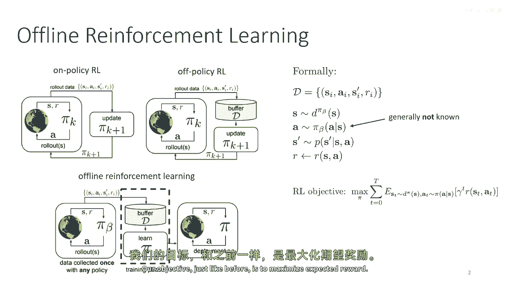

使用价值基于方法，如Q学习风格的方法，面临的主要问题是分布漂移，所以，对于任何使用Q函数的方法，无论是演员还是策略，我们将面临分布漂移的问题，批评家或Q学习，Q函数需要根据数据来拟合其目标值。

当数据不再改变时，然后，拟合Q函数的目标是期望的贝尔曼误差，在行为策略下，并且这个期望由d中的样本来近似，这意味着我们的Q函数可以预期提供准确的估计值，在πβ下，问题是当我们进行贝尔曼备份时。

我们使用对我们最新政策的期望值估计的q函数的估计值，πu，如果我们的πu等于πβ，我们预期会有良好的准确性，但这通常不是这样，因为整个目的是让πu超过πβ，所以我们经历分布的变化。

这意味着我们的πν下q值的估计值不会非常准确，情况进一步恶化的事实是，π新直接被选择，以最大化q函数的期望值，这意味着，在某种意义上，pu被强烈激励去寻找一种对抗性的行动。

这些行动会使q函数输出错误的大q值，这就是，实际上，我们在实践中看到的正是这种情况，如图所示，位于下右的图表中，其中，使用标准离线rl训练的政策的实际奖励，在这种情况下。

基于q函数和演员批评的方法非常低，但q函数估计返回将极其高，所以，右most图中的y轴是一个对数尺度，其中红色曲线，获得奖励为负二百五十的，估计的q值是十的七次方，所以。

所有这些都意味着如果我们想要开发实用的深度离线rl算法，我们需要 somehow解决这个分布性偏移问题。

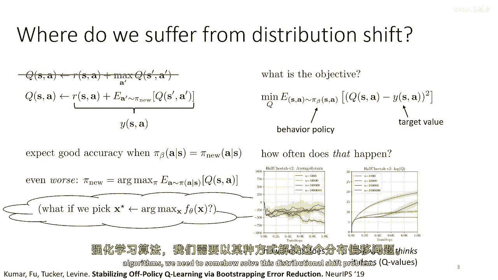

所以，嗯，当前和以前的方法通常很好地处理这个问题，一种非常广泛研究的方法类别是，我将提到的是政策约束方法，这些是采用某种演员批评结构的方法，他们将更新他们的q函数以在πu下的平均值。

但是他们会修改政策更新，不仅仅是最大化q值，而且还会引入一些约束，例如，一个约束是π和π的KL散度，β应该被限制在ε以内，所以从原则上这应该解决分布漂移，因为如果你选择ε足够小。

那么在原则上你应该不会得到太多的错误值，这就是想法，至少我会稍微透露一下高潮，我将立即说明，尽管政策约束方法提供了分析工具的好工具，并且可以说是一个合理的起点，一般来说。

当前表现最佳的方法做一些稍微复杂的事情，所以通常只是简单地实施政策约束方法，不加以优化，实际上并不怎么有效，但这是一个非常古老的想法，据我所知，它没有单一的名称，但它不能。

因为它在埃曼纽埃尔·托托罗的工作中出现过，来自两千年代初的工作，由伯特·凯恩提出，信任区域，协变量政策梯度，自然政策梯度，它们全都使用了某种形式的受限演员更新想法。

而且这个想法已经在最近的几篇论文中被使用，来自福克斯等人的工作，富士木雅克，嗯，库马尔和其他许多人，所以这是一个被广泛研究的想法，可以追溯到几十年前，但如果不加以优化，它就有许多问题。

一个明显的问题是我们通常不知道行为政策是什么，嗯，这意味着我们必须非常小心地估计KL散度项，所以数据可能来自人类，它也可能来自手工设计的控制器，它可能来自许多过去的RL运行，所以它可能是一个混合政策。

甚至在实践中可能是上述所有类型的组合，这意味着如果我们想要使用某种类型的政策约束方法，我们需要要么拟合另一个模型使用行为克隆来估计πβ，或者我们需要非常聪明地实现约束，以便我们可以仅使用来自πβ的样本。

而不必访问其概率，并且这两种方法都是可行的，我会说，目前，后者实际上比前者工作得更好，但它们都可以是合理的选择，有一个第二个问题，实际上是一个稍微严重的问题，对于许多约束的选择。

这种方法可以是过于悲观的，也可以是不够悲观的，我会稍后详细描述，但基本上，这里的推理是这样的，记住当我们谈论分布漂移时，我们问，'如果测试点x星是从p(x)采样的，'我们预期误差有多低，我们问。

'如果测试点x星是从p(x)采样的，'我们预期误差有多低，我们问，'如果测试点x星是从p(x)采样的，'我们预期误差有多低，我们预期低误差，然后，答案通常为否，因为如果我们在期望上最小化误差。

我们只能期望它在期望上低，所以总的来说，你可能有两个分布，它们从标准离散度上看非常接近，如KL散度，但仍然可能对新政策的样本产生高度错误的预测，更精确地说，这引入了一种种常数的权衡，既不能离πβ太远。

以免经历太多错误，也不能离πβ太远，以显著改进政策，然后，关于过于悲观的部分，问题是同时，我们想要直观地找到最佳政策，那就是在数据的支持范围内，我们想说，数据告诉我们什么是可能的。

我们想要选择数据集可能范围内的好东西，一个简单的约束，如KL散度约束实际上可能会阻止我们做到这一点，想象πβ是均匀随机的，这意味着基本上任何行动都是等可能的，这意味着没有任何行动是离散的，在这种情况下。

KL散度约束将告诉我们π应该保持，最大随机性，这不太有意义，像，我们为什么应该使π更随机，只是因为πβ更随机，虽然这个框架看起来很合理，但实际上，因为它的这些原因，它在实践中并没有带来这么好的结果。

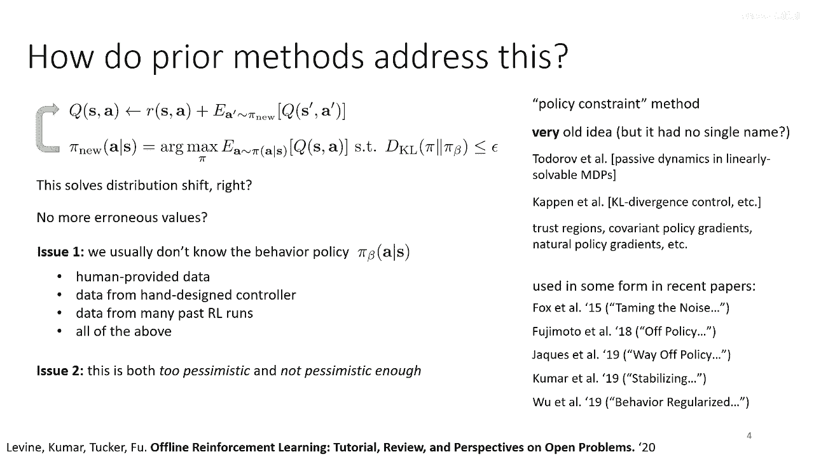

让我们谈谈这个一点，所以首先，我们可以使用哪些约束，嗯，有许多选择，从实现角度来看，最直接的选择是使用KL散度约束，因为这种约束有一个方便的函数形式，这使得它相对容易写下来，来区分它并优化它。

所以它容易实现，但这不一定是我们想要的，我在前一个幻灯片上稍微提到了这一点，但我将更详细地解释一下，使用一张图片，所以让我们说，这个πβ是我们的政策，我在这里可视化它，你可以想象这在一个状态中。

对于不同的行动，它有不同的概率，你可以看到它对行动的覆盖范围在中间相当好，让我们说，这些橙色的点代表我们的数据集样本，这里的橙色点的y轴对应于它们的q值，所以仅仅从看这些点，你可以看到那个真的很高，嗯。

点那个，左边的第二个点，那肯定对应于一个相当好的行动，如果我们只看到这一点，我们可能想要采取对应于左边第二个点的行动，因为它比所有其他的都好得多。

如果我们试图通过最小化与目标值之间的差异来拟合一个q函数，你知道，我们可能会得到一个看起来有点像这个橙色曲线的曲线，你现在会发现，在πβ在这里右侧的低概率区域，q函数将尝试外推到。

并且它的外推到的值可能非常不可靠，所以即使它取上的最大值实际上在那里在右侧，我们可能不想信任那些值，因为它们远离分布，因为它们远离分布，我们可以说，这里的中间值可能更可靠，尽管，记得我之前说过。

一般来说你不能保证有很低的低误，即使是对于分布动作，你只能保证，在期望上，尽管如此，我们可能会推测这里的中间值更可靠，如果我们训练一个新的策略π，那最大化Q值并最小化πβ的偏离。

我们可能会得到像这样的绿色曲线，注意，绿色曲线并没有完全集中在好行动上，因为它被迫稍微接近pi beta，所以如果我们进一步减少方差，如果我们将绿色曲线紧紧地围绕那个真的很好的行动。

我们将增加kl散度到pi beta，可能违反我们的约束，所以这可能是我们在约束下能得到的最佳政策，但请注意，这种政策仍然分配了很高的价值，很高的概率，甚至给尾巴值很低的行动分配了很高的概率。

它分配了最佳行动的最高概率，但是，它仍然对一些相当糟糕的行动分配了高概率，直觉上，我们想要的东西像这样，这条其他曲线，这条更深的绿色曲线，它实际上只对真正优秀的行动分配了高概率，并且下降得更快，但是。

这个嗯，更好的政策可能会违反我们的KL散度约束，因为它减少了方差太多，所以这可能是最好的支持政策，意味着，最佳策略仅将高概率分配给具有高概率的动作，并且是高贝塔值，但它可能会违反我们的KL散度约束。

因此，基于这种直觉，我们可能会选择采取的支持约束，支持约束基本上意味着你只会给，嗯，动作，嗯，非零概率，这里有一个错误，第一个不等式应该大于号，所以给定s的π是大于零的，仅对于动作。

其中πβ的概率大于或等于某个阈值ε，这是一种粗略的方式来写支持约束，当然，在现实中精确地执行它非常困难，但我们可以采用各种近似，一种常见选择是使用像最大均方差异估计器这样的玩意。

这可以粗略地估计支持约束，现在，这些问题的麻烦在于它们通常需要更复杂的实现，KL散度很容易评估，像md这样的东西更复杂，但它通常更接近我们真正想要的，这是一个非常高级别的总结。

但希望这可以给你一种我们对这些约束必须做出的权衡的 taste，当我们决定这些约束时，很多我将要谈论的下一个内容实际上都处理KL散度约束，因为它们更容易工作，但我只是想强调它们确实有一些相当基本的缺点。

当涉及到实际的离线强化学习方法时，如果你想了解更多细节，这里有三篇我可能推荐的论文，嗯，第一篇是一篇综述性评论论文，而其他两篇讨论了各种类型的约束，我鼓励你去查看那些论文，如果你想了解更多关于这些的。

我们今天讨论的大部分将集中在更简单的约束类型上。

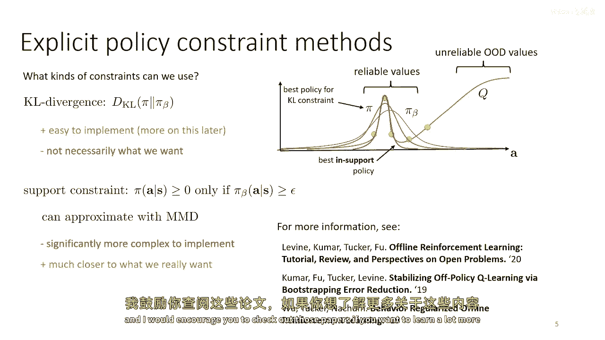

好的，我们如何实现约束，我将谈论，一种高层次的方法概述，用于明确地执行约束，然后，我将深入探讨那些隐式执行约束的方法，这些方法在实践中非常有效且简单，然后，我将谈论一些其他方法。

但首先让我们谈谈一些明确的方法，我会立即说，这些通常不是工作得很好的方法，这些是通常不工作的方法，但是，了解它们如何工作可以帮助我们更好地上下文化，我还会讨论一些其他的事情，所以。

一个非常简单的方法是直接修改演员的目标，所以，在传统的演员-批评家算法中，有一个q函数，我们的演员目标基本上将是这个最大化在q值政策下预期的价值，其中，状态是从数据集中采样的，现在。

让我们写下KL散度之间的形式pi和pi beta，我知道我之前说过KL散度不是一个很好的选择，但它是简单的，所以，首先讨论这个更容易，KL散度pi和pi beta只是pi下log pi的预期值。

减去log pi beta，我们也可以写为负log pi beta的预期值，减去pi的熵，现在，请注意，这个方程与演员目标有密切的相似性，我上面已经写了，因为在两者中，都是pi下的预期值。

尽管KL散度还有这个额外的熵项，所以我可以做的是，我可以将KL散度融入演员目标，log pi beta项只是简单地添加到q值中，因为它不依赖于pi，然后，我有这个额外的熵项。

两者都被一个拉格朗日乘数lambda乘以，记住，如果我们有一个受限优化问题，你知道，最大化f(x)，subject to c(x)等于0，我们可以将其写为一个无约束问题，其中。

约束被一个拉格朗日乘数乘以，如果我们可以找到拉格朗日乘数的值，那么解决这个问题实际上会强制执行约束，在实际中，我们可以使用之前覆盖的dual梯度下降方法来找到lambda。

或者甚至我们可以将lambda视为超参数，并直接调整lambda的值，所以，这，嗯，所以这里，嗯，lambda是我们的拉格朗日乘数，和h是熵，这是非常容易在封闭形式中计算的，并且对于高斯或类别政策。

都可以进行微分，所以，熵项实际上是很容易处理的，你实际上只需要编写熵的公式，然后让你的自动微分软件计算梯度，现在，log pi beta项只是添加到q函数中，你需要知道log pi beta是什么。

这意味着在实际中，如果你的数据来自一些未知的政策，你可能需要使用行为克隆来拟合pi beta，以便允许你估计这个，这可能会很困难，实际上，另一种强制执行这些约束的方法是直接修改奖励函数。

所以你只需要从奖励中减去惩罚，取决于，嗯，你知道，这是由你的选择的差异决定的，例如KL散度或MD或其他任何东西，这种方法工作方式略有不同，所以它是对直接惩罚差异的简单修改，这样迫使政策基本上处理它。

它还考虑到未来的差异，所以实际上它会产生不同的效果，因为现在政策将避免现在引起大差异的行动，它也将避免现在差异小但将来差异大的行动，而且这可能在许多情况下是非常理想的，所以这种方法具有不同的理论属性。

实际上可以工作更好，所以对于更多关于这一点的信息，请查看这篇论文，嗯，但从我的经验来看，这两种方法都不太有效，实际上有更好的方法来做这件事，嗯。

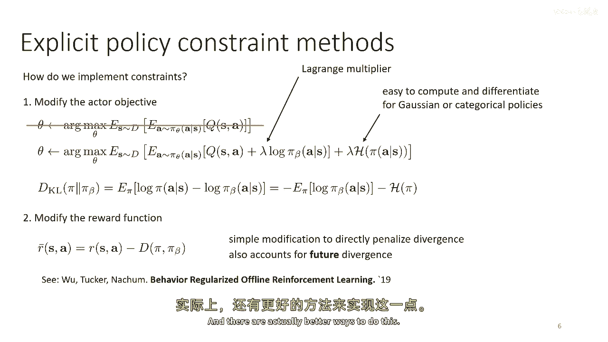

所以一般来说，现代离线RL方法都不这样做，一种移除需要明确估计πβ的需要的方法。

是使用被称为隐式政策约束的方法，所以这是我们的约束优化再次，我现在将使用KL散度约束，为了简单起见，它 turns out that if you write down the lagrangian of this problem。

并实际上解决为最优政策的闭合形式，你 get this equation，它是通过拉格朗日对偶性直接证明的，嗯，我不会在这个幻灯片上详细解释，因为今天我要讲的内容很多，嗯，但是，你可以查看过去几篇论文。

它们推导出了这个，这是一个非常广泛研究的想法，彼得斯等人的工作被称为REPS，罗克的工作被称为π学习，它们都基本上推导出了同样的东西，基本上，这个方程在优化问题的最优解中是说。

由上述约束优化问题的行为政策给出，乘以优势函数的指数，除以拉格朗日乘数λ现在，如果我们稍微分解一下这个意味着什么，那么这个最优解的约束优化问题就是行为政策，乘以优势函数的指数，除以拉格朗日乘数λ。

实际上在我看来，实际上有些直观，如果嗯，Lambda去，嗯零，那么这意味着优势被乘以无穷大，并且唯一与指数相关的是，这是一种贪婪的策略，它为行动分配了一个概率为1，那最大化零的优势到所有其他东西，但是。

对于有限的lambda值，本质上这在做的是它正在使子优化的行动以指数方式变得不可能，但也乘以pi beta，所以任何行动，如果在pi beta以下有很低的概率，即使它有很高的优势。

最终也会以很低的概率结束，然后lambda必须被选择作为拉格朗日乘数，以满足那个约束，但我之前说过，Lambda也可以直接被视为算法的超参数，并仅根据所需的性能进行调整，现在，当然。

直接创建pi star的函数形式在这里需要了解pi beta，所以我们实际上还没有做任何事情来简化我们的问题，但是，看看这个方程，我们可以识别出我们可以在这里近似pi star。

通过使用pi beta的样本，因为任何时候你想要一个由分布给出的量，和一些其他东西，那么在分布下预期的值实际上就给你基本上正好那个，所以你可以通过加权最大似然来近似解决方案，所以，要训练pi nu，嗯。

你可以从pi beta采样，所以这给你pi beta项，pi star乘以这个样本乘以对应于方程中其他项的权重，并将这个权重放在样本上，然后最大化这个样本的似然，带有这个权重。

所以你在这里看到的损失函数基本上是行为克隆损失，这就是为什么log pi在那里出现，除了样本被方程上的其他项加权外，这是1除以z乘以，对lambda的1除以e的指数乘以，优势，所以在实践中，你会做，嗯。

从数据集中生成样本，所以这些基本上是，嗯，这基本上是你被给的数据集，使用批评家获取优势，并且这给你一个权重，你可以将这个权重应用到数据集中的每个样本上，然后只需要做加权最大似然估计。

本质上是加权行为克隆，其中权重由优势函数给出，优势函数来自你的批评者，这有一些有趣的含义，因为这项建议表明，受限制的批评者，是约束演员更新的一种形式，实际上就等同于一种加权行为克隆。

其中权重取决于动作的质量，所以，这个算法真正在做的是它正在模仿你数据集中的动作，但是它更模仿好的行为而不是坏的行为，而且数学表明这实际上对应于解决这个受限的 uh。

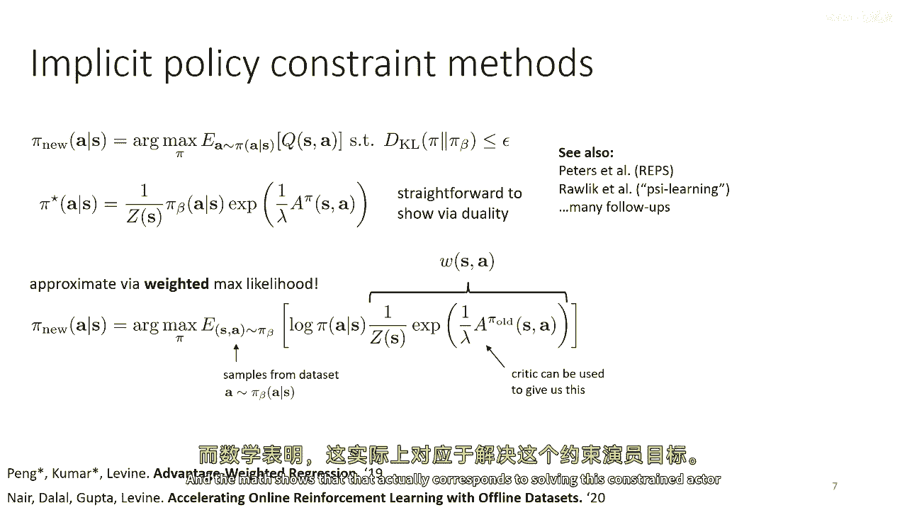

演员目标，如果你想在实际中实现这个，你将创建一个批评条款，这就是我们在演员批评讨论中经常使用的常规q函数批评，你将有一个演员损失，这是加权最大似然，然后你将交替地在批评损失上取梯度步骤。

并在演员损失上取梯度步骤，所以这实质上实现了我之前展示的受限演员批评框架，利用这隐含约束技巧，意味着它实际上不需要你知道πβ的函数形式，它只需要你有来自它的样本。

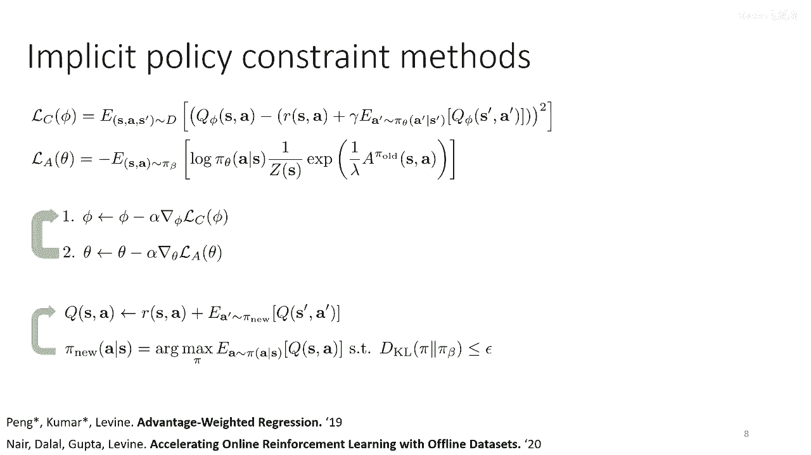

这就是你数据集中的。

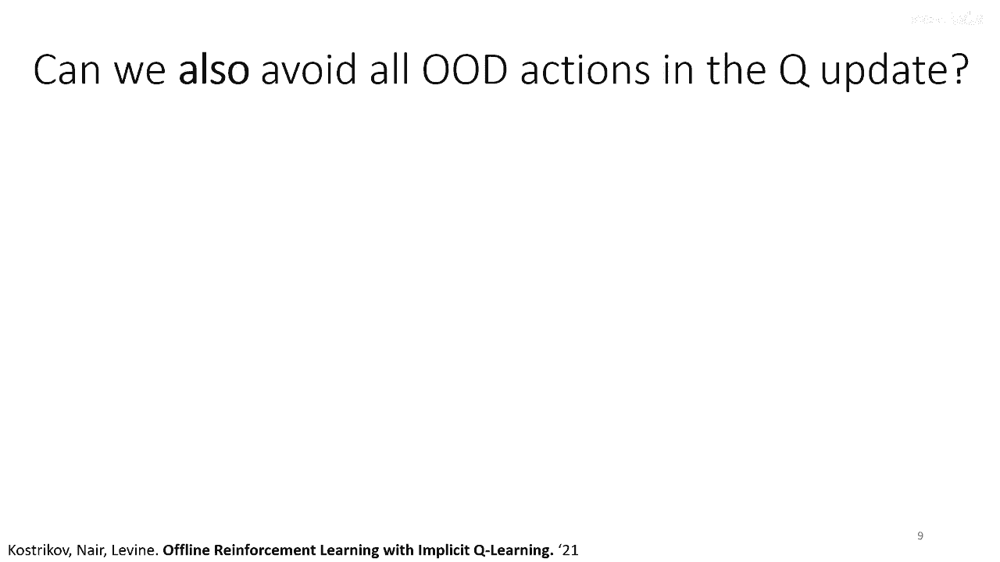

嗯，所以这算法，嗯，嗯，有一个q函数估计，被称为优势加权演员，批评家或清醒的，如果你使用蒙特卡洛回报，这也是可能的，并且你会得到一个叫做优势加权回归的算法，如果你想了解更多关于这个的信息。

参考文献在下面的幻灯片底部显示。

现在，嗯，这种方法的问题，嗯，那么让我们稍微回溯一下，这种方法的问题在于，为了估计这些优势值，您仍然需要查询离散分布动作，因为在训练政策过程中的中间阶段，πθ不一定完美地尊重约束，如果您选择λ，适当地。

在收敛时，约束将被尊重，但在整个训练过程中，约束可能不被尊重，这意味着你可以仍然通过这种方式退出分布动作，嗯，所以实际上，你有两个地方会查询出分布动作，一个是在你计算期望值pi theta的目标值中。

所以我说过，一个收敛，pi theta应该遵守约束，但在训练过程中，它可能不遵守约束，而且当你估计优势时，再次，Q减去在pi theta下Q的预期值，所以这也需要查询pi theta的动作，嗯。

进入Q函数，并且这两个都可以有误差，我们可以实际上避免那个吗，我们可以 somehow避免所有分布动作查询吗，嗯，在计算时，目标值，这里是目标值计算，让我们说这是，嗯，第二个术语，那是s'的v，好的。

所以那应该是pi u的理想值，但让我们说它是另一个神经网络，那么我们可以用这个神经网络来训练一些损失函数，所以我们可以取，例如，在我们数据集中的所有采样状态动作元组中，并回归s'的v到s的q。

我使用一些损失函数，例如，一个均方误差损失现在可能不会真正工作，因为当你这样做时，s'的v是s'的v，它将匹配s的q，i ai但在数据集中，ai来自pi beta，而不是来自pi u。

所以你实际上是在估计pi beta的值，而不是pi nu的值，所以这不会真正工作，它将给你行为政策的q函数，而不是你的最新政策，因为动作来自pi beta，但现在有一个有趣的想法。

如果你考虑你数据集中的所有轨迹，并看一个状态在这些轨迹中，那么在那个状态中，在那个状态，你可能只看到过一个动作，你知道，如果你的状态是连续值状态或者状态空间非常大，那么一个状态可能被访问一次，但是。

可能会有附近的其他状态相似，在这些状态中，采取了不同的行动，因此，实际上，当你在状态s回溯到q si ai时，是的，这个价值函数的目标包括一个分布，它由对不同值的分布组成。

即使在你看到一个动作只在一个状态下的情况，你可能在其他类似的状态下看到其他动作，所以只要你的价值函数网络能够概括，它实际上真的有一个值的分布，我在这里展示的基本上是那个分布的直方图，所以对于不同的值。

对于不同，嗯，目标，他们有不同的概率，这个分布仅由行动减少，如果你使用均方误差损失，均方误差损失实际上估计的是这个分布的预期值，在哪里，期望是在pi beta下取的，但如果我们不试图估计预期值。

如果我们相反地试图估计一个上四分位数，或者嗯，我们实际上将使用被称为期望瓷砖的东西，但一个期望瓷砖只是像四分位数一样，只是带有平方误差，所以，你可以认为这个分布的上四分位数本质上是最佳政策的值。

由数据支持，所以，可以说是在所有你访问过的州中，与该州相似的州，你看到的最好值是什么，所以这里有一个问题，如果均方误差损失给我们在这个分布下预期的值，是否有其他损失可以给我们像上四分位数一样的东西。

基本上，我们还能否使用si ai，但只是改变损失函数的形式，得到看起来像这样的东西，直方图的顶部，所以我们可以使用一个叫做预期损失的东西，预期损失的方程可能看起来有点混乱，但实际上有相当简单的直觉。

所以均方误差损失看起来像是一个抛物线，它惩罚负误差和正误差同样，并且它惩罚误差越大，因为它是平方，预期损失是一种倾斜的抛物线，其中负权重和负负误差与正误差有不同的系数，所以如果我们在这里选择tau的值。

那么乘数就适当，然后我们可以基本上惩罚负误差比正误差更多，这意味着对于s中的v来说，qsi ai大于它更好，而不是小于它，如果我们选择一个大的tau值，如零点九，例如。

那么我们对v a的小值惩罚比大值少得多，这给我们带来了，嗯，这个分布的上端，到这个点你可能在想，我们所有问题，一直是我们的q值比它们应该的大得多，而现在我们正在惩罚大值比小值少得多，那不是会加剧问题吗。

但实际上不会，因为记住这里我们只使用数据集中的状态和动作，所以我们永远不会查询q以任何不在数据集中的动作，这意味着我们永远不会查询队列以任何它没有训练的动作，所以已经完全消除了过估计问题，实际上。

我们实际上得到低估，因为我们不使用我们从学习政策中学到的动作，所以通过倾斜我们的损失来惩罚正误差较少，我们实际上恢复了更接近正确的，嗯，最优q函数，正式上，实际上可以证明这个预期损失在做什么。

是它正在训练价值函数成为q函数的最大值，在所有行为政策的支持范围内的动作上，并且它这样做是因为支持的原因是任何不在支持范围内的动作，不会出现在训练集中，因此不会在损失中参与，所以本质上，我们。

我们正在回归到我们在状态看到的最佳行动，类似于状态，但这不简单等同于在数据集中复制最佳行为，因为我们这样做在每个状态单独进行，所以我们实际上是将所有状态的最佳东西结合在一起。

这可能会导致一个最终政策比我们在数据集中看到的最佳轨迹要好得多，嗯，在数据集中的最佳轨迹，嗯，这就是真的。

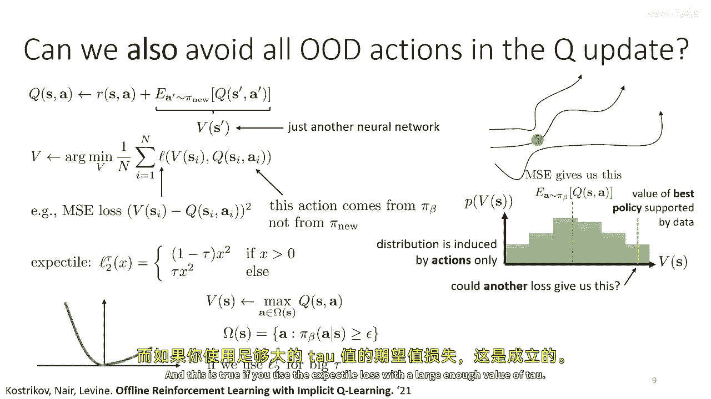

如果你使用预期损失并使用足够的tau值，所以这个基本原理可以用于设计一种算法叫做隐式q学习，这是一种非常新的算法，它只最近才出来，但我想告诉你它，因为它表现良好，所以原理是我们将使用此预期损失。

它的理论基础是，它等于所有支持动作的最大值，它将值设置为所有支持动作的最大值，嗯，实际上，这基本上对应于使用隐含策略的贝尔曼备份，这是argmax策略，但仅对支持动作。

所以现在我们可以实际上更新价值函数，我们将得到近似最优支持q函数的q函数，但我们从未必实际将动作输入到我们的q函数中，它不是训练的，因为两个损失仅使用，嗯，数据集中的状态和动作，我将稍后讨论这如何工作。

但在那之前，我要谈论一个替代设计，实际上，这是讲座的下一部分，但在那之前，我只是要简要总结这种方法的实践实现，基本上，你将在q函数和价值函数更新之间进行调整，q函数使用均方误差更新，以价值函数为目标。

所以那是顶部左方的方程，价值函数通过在所有数据集中的状态和动作上回归到q函数来更新，但使用预期的损失，这就是它，这就是你现在如何训练q函数的方法，一旦这个过程完成，你需要实际上从 this 中恢复策略。

在q和v更新中并没有注意到这一点，策略并不直接参与，这就是为什么我们称它为隐含的，所以当这一切都完成后，这种方法需要单独一步来实际提取策略，这个单独的步骤通常使用像优势加权方法这样的步骤。

所以对于那个步骤，我们将做像这样的方程，顶部的a损失，但使用使用隐含q学习方法训练的q函数。

对于那个步骤，我们将做像这样的方程，顶部的a损失。

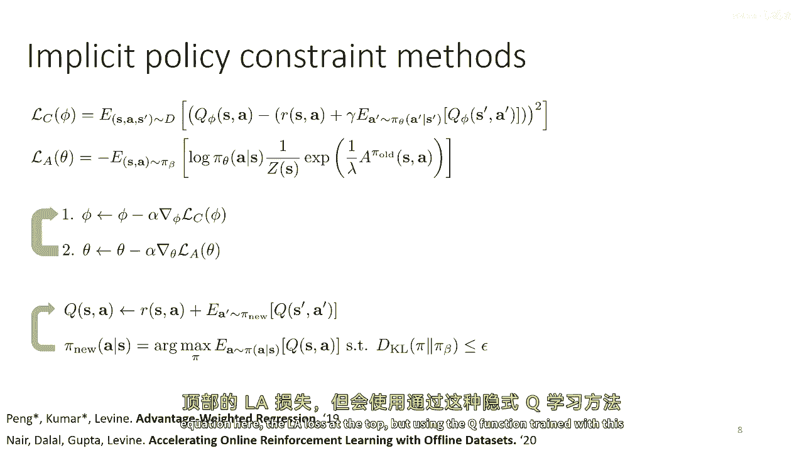