# P69：p69 CS 285： Lecture 16, Part 3： Offline Reinforcement Learning 2 - 加加zero - BV1NjH4eYEyZ

我今天要讨论的最后一组离线强化学习算法，是基于模型的离线强化学习方法，到目前为止，我们讨论的所有离线强化学习方法都是模型自由的，但实际上，基于模型的方法非常适合离线强化学习，因为你可以收集所有的数据。

你可以在这个数据上训练一个模型，只要你想要得到一个非常好的模型，然后使用那个模型来获得良好的策略。

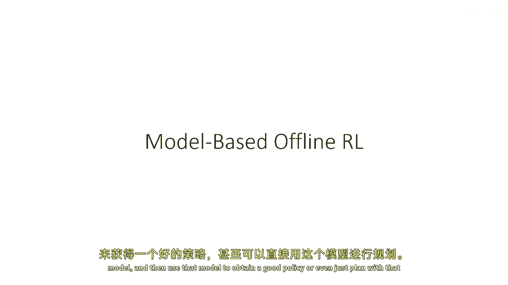

甚至直接使用那个模型进行规划，那么基于模型的强化学习如何工作得好，我们已经知道这一点，我们使用我们的数据来训练我们的模型，我们可能会使用那个模型来获取策略，或者直接进行规划。

然后通常我们会收集更多的数据，但如果我们不收集更多的数据，那么我们就有一个小问题，嗯，这个问题与我们有关Q函数的问题类似，就像与Q函数一样，模型本质上是在尝试回答，如果问题。

如果我们回到数据集中的一个状态，并采取不同的行动，我们将进入什么样的状态，会发生什么，那么如果你记得我们在讨论基于模型的强化学习时，我们谈论了DINO风格的方法。

DINO风格的方法是使用真实世界中收集的状态和动作作为短模型基于滚动的起点，我们首先将讨论的两个基于模型的离线强化学习方法，基本上是DINO风格的方法适应于离线设置，那么在离线设置中会出现什么问题。

当我们不再收集任何更多的数据时，与Q函数类似，我们可以发现这些对抗性的行动，它们导致Q函数错误地过高估计，对于基于模型的方法，策略可以学习采取欺骗模型进入奖励非常高的状态的行动，因为这些状态是分布外的。

所以我们仍然有分布外的动作问题，现在，我们还有模型分布外的状态问题，因为策略可以采取一些疯狂的行动，欺骗模型进入分布外的状态，并从那个分布外的状态，模型将进入甚至更疯狂的状态，策略可以学习利用这一点。

欺骗模型进入奖励高的状态，尽管这可能在现实中不会真正发生，直觉上，为了修复这个问题，我们需要 somehow 修改这些基于模型的方法，以便如果策略开始欺骗模型进入疯狂的状态，那么我们需要修改这些方法。

以便如果策略开始欺骗模型进入疯狂的状态。

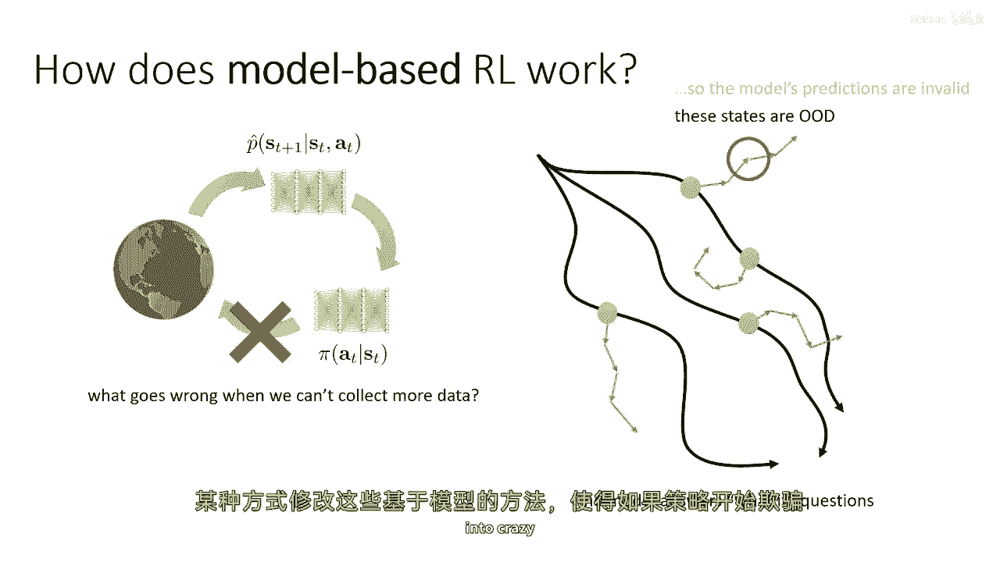

它受到某种惩罚，然后模型和政策被激励改变其行为。

以返回更接近数据的地区。

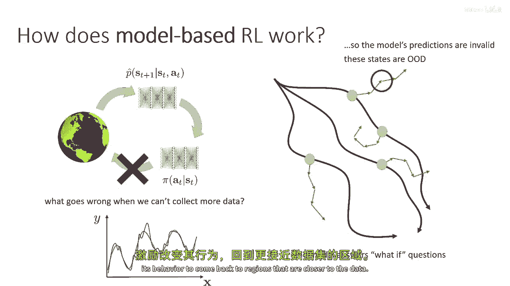

所以首先我会讨论，方法，实质上修改奖励函数来施加一点惩罚，我将覆盖的特定方法是叫做opo模型基线下线政策优化，它存在两种非常相似的方法，从概念上，opal和moral，我会谈论opo版本。

但它们相当相似，我鼓励你实际阅读这两篇论文，如果你对这个主题感兴趣，在更详细的层面上，它们有，你知道，对惩罚的分析和形式有一些不同，但在两种情况下的基本想法都是实质上惩罚利用模型的政策。

所以我们惩罚政策的方式，是通过某种方式改变奖励函数，或者一般性地根据mdp改变模型，所以一种我们可以改变它的方法是让奖励函数，分配一个小的惩罚，我在这里用字母u来表示进入状态，在哪里模型可能错误。

所以u本质上是一种不确定性惩罚，我们所要做的就是，我们将添加这种不确定性惩罚，然后使用任何现有的基于模型的rl算法，我会在第二个部分解释我们可以使用的不确定性惩罚的特定选择。

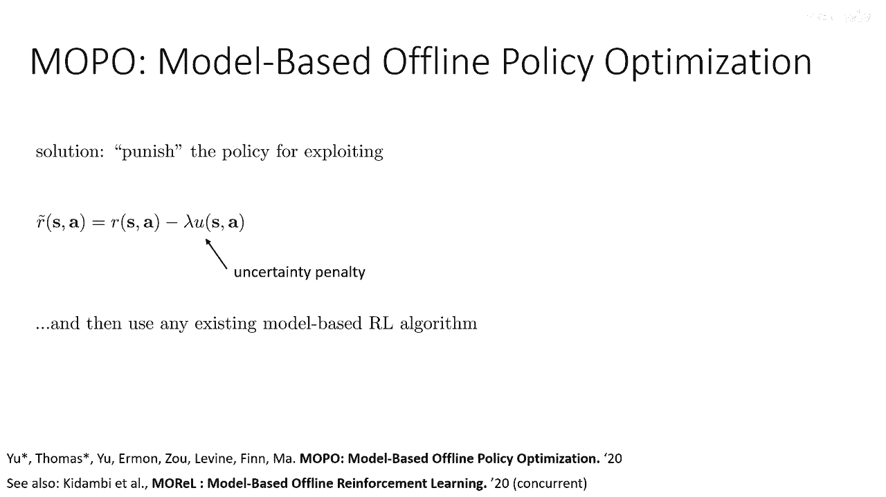

嗯，但是首先我想要。

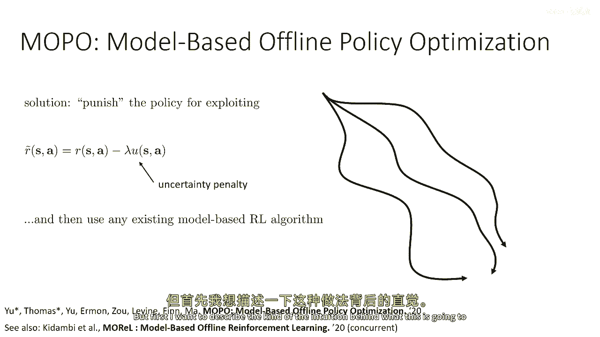

嗯，描述一下这种直觉，即在这个模型将要做的事情背后的想法，如果你的政策最终选择了一些欺骗模型进入，具有更高奖励的状态的行动，但是过渡是错误的，那么在那些情况下，我们要求不确定性惩罚要大。

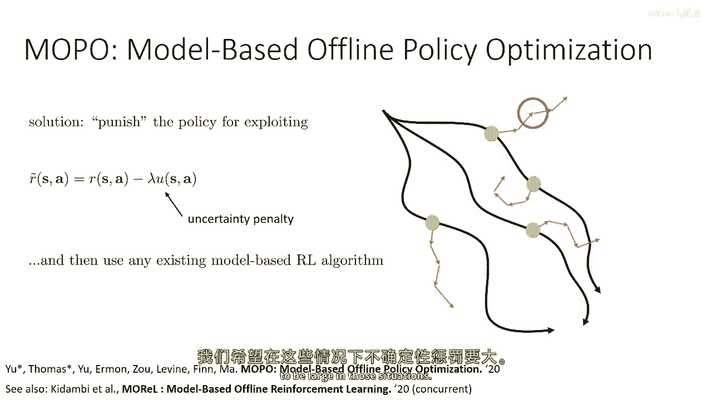

所以不确定性惩罚基本上必须量化模型有多错，如果模型进入了一个错误的看起来很好的状态。

那么模型必须做了一些错事，如果我们有一个好的不确定性惩罚，它应该能够捕捉到那个，所以本质上，不确定性惩罚应该惩罚政策，足够以至于利用不是值得的，这就是为什么我们必须精心选择乘数lambda。

但如果我们精心选择它，所以惩罚总是比政策通过欺骗获得的收益成本更高，然后，政策将改变其行为并避免那些疯狂的离散分布状态，从技术上讲，我们需要满足的条件是你应该。

至少等于根据某种离散度测量的模型误差的大小，但现在这并不是一个容易度量的量，因为通常你实际上不知道对错有多大，你的模型就是我们这样做的方式，在实际中是。

我们将使用我们在基于模型的强化学习讲座中讨论的模型不确定性技术之一，例如，一个集成，所以一种常见的方法是训练一个集成模型。

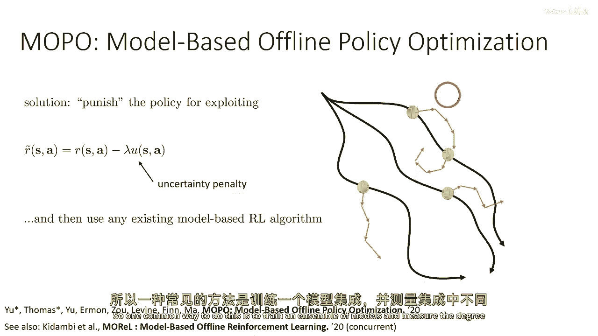

并测量不同模型之间的分歧程度作为集成的标志，作为这个误差度量的代理，但一般来说，得到好的错误度量，得到好，对您的真实模型的实际估计，至少等于或等于真实模型，误差是一个开放问题。

所以没有很好的方法可以做到，那并不是每次都能保证工作的方法。

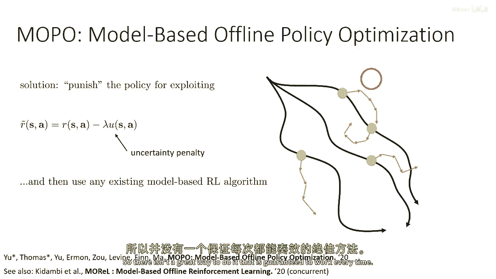

但集成分歧是常见的选择，让我们谈谈这个理论的背景，所以假设我们可以找到一个方法，它可以，实际上提供一个始终至少等于模型真实误差的错误度量，这里有一个有趣的结果我们可以证明，所以这里有两个假设。

第一个假设，嗯，基本上就是，我们的价值函数足够表达，我们可以准确地代表价值，如果我们使用大型神经网络，我们可以基本上假设这是真的，第二个假设是关于你的假设，这是一个非常强的假设，它说模型误差。

真实模型的误差由你上界，意味着u至少等于模型的真实误差，按照某种离散度度量，如总变分，离散度，嗯，一个m，这里是训练在模型下的政策的真实回报，嗯。

由m epsilon u表示的模型是按照模型预期的这个uh，你的错误度量的期望值，所以上述方程显示的是，如果我们使用我们的模型来训练政策pi hat，那么那个政策的真实回报将至少等于最佳政策。

我们可以找到，减去其预期误差，所以我们可以找到最佳可能的政策，嗯，但优化对不同的目标，对奖励，减去误差，我们保证我们的学习策略至少与那个一样好，另一种解释是，引入这个。

符号πδπδ是根据真实回报存在的最佳策略，不是根据真实回报的模型，所以πδ是按照真实回报的最佳策略，对于其预期误差，u的期望值由δ界限，所以基本上它是最佳策略，不访问状态，在哪里模型可能错误。

在哪里后者短语被量化，如方程十二所说，我们所学习的模型，是在我们模型下学习的策略，将至少以其真实回报优于，平均误差由δ界限的最佳策略，减去依赖于δ的错误项，所以如果我们选择δ非常小。

那么我们实际上将改进这个，好的，这可能听起来有些神秘，但这一定理有几个有趣的含义，一个含义是，如果我们将πβ替换为行为策略，我们预期在行为策略访问的状态下，模型的误差将非常低，接近零。

因为那些是实际上用于训练模型的状态，如果δ对于那个非常低，接近零，那么我们预期这个方程，十二将基本上保证我们所学习的策略至少与行为策略一样好，这意味着我们很可能改进过行为策略，或者至少我们不会偏离。

这个还可以量化优化差距，所以如果我们插入最优策略π星，那么我们学习的策略至少与π星一样好，减去模型在π星访问的状态上的错误惩罚，所以如果模型对于最优策略访问的状态和动作非常准确。

这将保证我们将恢复接近最优策略，所以这些是有趣的结果，表明基本上，这些结果告诉我们，这种方法将改进行为策略，并且可以接近最优策略，如果你的模型对于最优策略访问的状态和动作准确，那么在这种情况下。

这个将保证我们将恢复接近最优策略，所以这些是有趣的结果，表明基本上，这些结果告诉我们，这种方法将改进行为策略，并且可以接近最优策略，是否准确取决于您的数据，这是一个分析，希望这可以给您一种对。

一般我们可以尝试为离线rl方法展示的结果的一种味道。

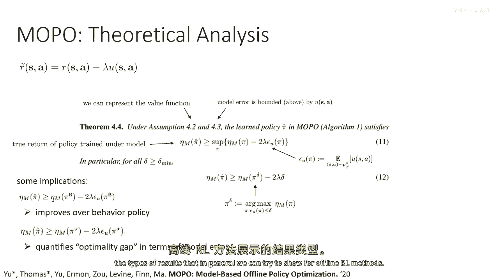

这是一个更进化的这个想法的版本，我们在哪里实际上可以应用SQL类似的原则来建模基于离线强化学习的策略，这就是一种新的算法，叫做组合，所以组合的基本思想就像SQL一样最小化策略动作的Q值。

我们可以最小化模型状态动作元组的Q值。

所以这是我们的再次图像，我们将有一个批评者的损失函数，它看起来与以前的SQL损失非常相似。

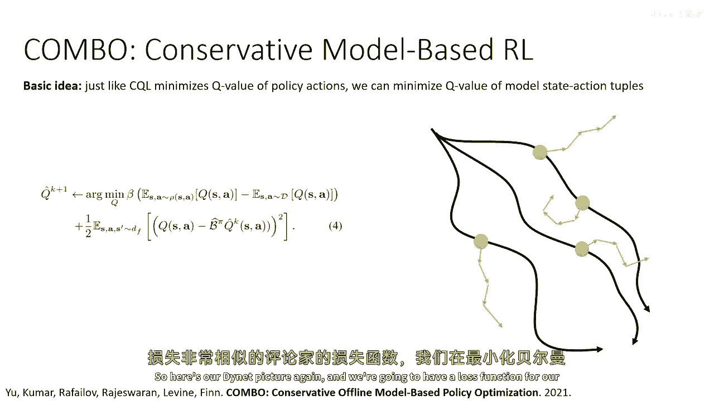

我们在最小化贝尔曼误差，但现在我们将使用模型的数据来做到这一点，所以它是一种恐龙式方法，我们将在数据集中最大化Q值，然后，我们将从模型中推下状态和动作的Q值，所以我们试图使模型下的Q值变得更差。

而数据集中的Q值变得更好，这里的直觉是，如果模型产生的东西明显不同于真实数据，Q函数很容易使它看起来不好，但如果模型产生非常现实的状态和动作。

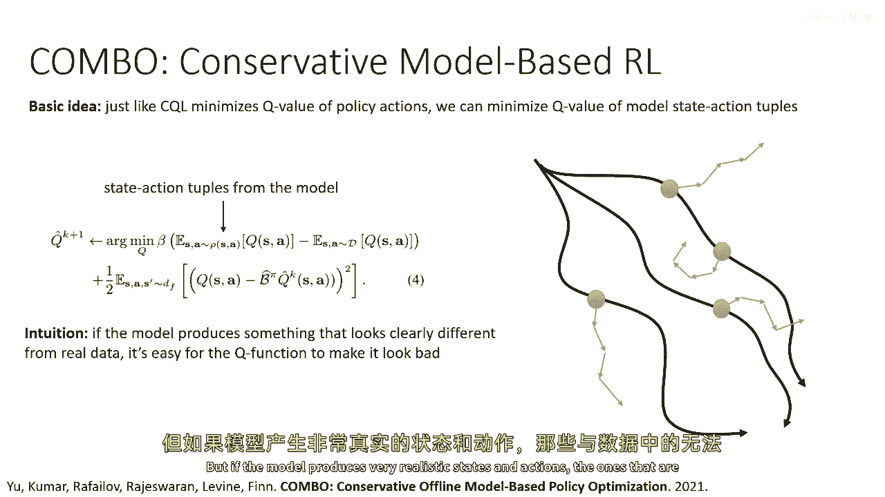

与数据集中的那些无法区分的，那么这两个术语应该真正平衡，在某种意义上，这是一种GAN的想法，嗯，而且这很好，因为我们实际上没有改变奖励函数，我们只是在对Q函数施加一个额外的正则化，那就是Q函数。

尝试使模型基于的状态和动作看起来更差，如果你不能使它们看起来比数据差，这意味着它们与数据无法区分，这意味着模型实际上是正确的，模型没有产生看起来不现实的状态和动作，这实际上工作得稍微好一点，嗯。

比MOPAND MORAL更好。

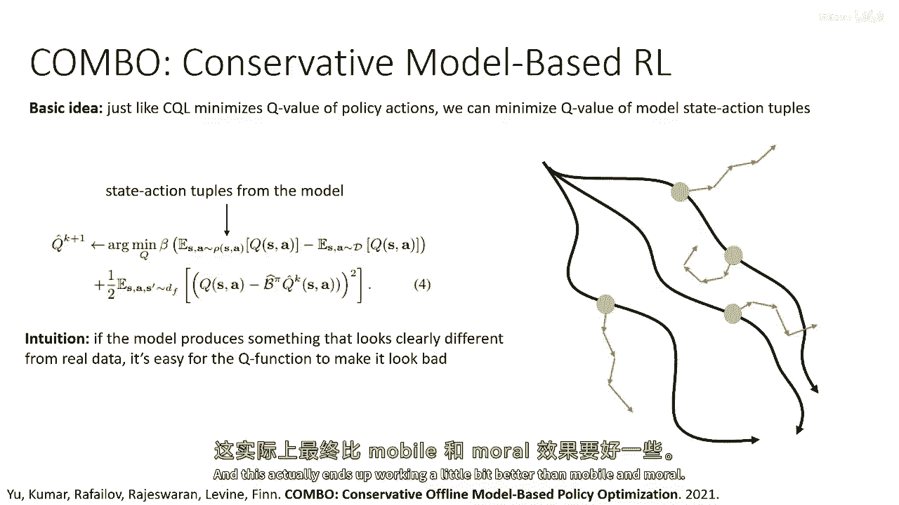

现在，我之前描述的所有算法都是恐龙式算法，我们可以实际上以非恐龙式方式进行离线强化学习，我们可以进行离线强化学习，实际上不学习任何策略，我们只是尝试在模型下规划。

但我们仍然需要一些机制来补偿自动分配的动作。

所以有几种方法可以做到，我想告诉你的一篇最近发表的论文是叫做轨迹变换器，嗯，所以基本思想是我们将训练一个联合状态动作模型，我们不仅会训练一个模型来预测未来状态，基于当前状态和动作。

我们将训练一个模型整个轨迹，所以这个模型将提供状态动作序列的概率，通过在数据集中的轨迹上进行密度估计，我将使用下标β来denote这个分布，当然，这个分布，当然取决于行为政策，直觉上。

我们将做什么与这个分布，我们将优化一个计划，对于在这个分布下概率较高的动作序列，这意味着我们将避免在数据中非常不可能的动作，这将避免离散分布动作，然后，我们可以做的另一件事是一旦我们做，嗯。

离线模型基于rl，我们可以使用一个非常大且表达力强的模型，例如，变压器，这个设计决策主要与第一个点垂直，所以，你可以用任何模型类来做第一项，但是如果你是在做离线强化学习，实际上使用一个非常大的。

非常表达性强的模型类，因为不需要进行主动的数据收集，你需要在试验之间更新你的模式，这意味着模型可以非常大且计算上昂贵，所以你想要基本上你能得到的最强大的密度估计模型。

而且现在如果你想要一个非常强大的序列密度估计模型，变压器是一个不错的选择，尽管同样的事情也可以用其他种类的密度估计器来做，所以，我在这里有一个指向实际描述这个的论文的参考，这种方法，而且那个嗯。

在那里实际使用的模型是一个变压器模型，为了建模多模态分布，它实际上进行了离散化，嗯，整个轨迹，你现在不能整个轨迹进行离散化，因为那里会有指数级的离散状态，所以。

化处理是根据每个动作状态下的每个维度进行的，所以它不是时间步长序列模型，实际上，它是基于状态和动作维度的序列模型，Transformer和其他序列模型在标记级别操作，所以。

第一个标记是第一时步状态下的第一个维度，基于这个标记，模型预测第一时步状态下的第二个维度，然后它预测第三个维度，第四个和如此直到你到达第一时步状态下最后一个维度，从那里它预测第一时步下的第一个动作维度。

基于这个，它预测第二个维度，就这样一直下去，直到我们到达第一个动作的最后一个维度，然后，你预测状态在第一个时间步的第一个维度，就这样一直下去，直到你到达轨迹的尽头，直到你到达最后一个动作的最后一个维度。

现在我在这里绘制了这个模型，作为一个自回归序列模型，你可以用像lstm这样的东西来做，但你也可以用变压器来做，你需要为变压器一个因果掩码，所以这将是在某种像gpt风格模型中可以做的事情。

如果你对transformers不太熟悉，不要对这个太担心，这个的基本思想是，任何类型的序列模型都可以使用，现在，一个不错的地方是，因为你正在模型状态和动作概率，你可以做出非常准确的预测。

直到非常远的未来，所以，累积错误的这个问题是一个重大问题，如果你选择的新行动与数据集中的行动不同。

但如果你保持，如果你限制自己只选择与数据集中的行动相似的行动。

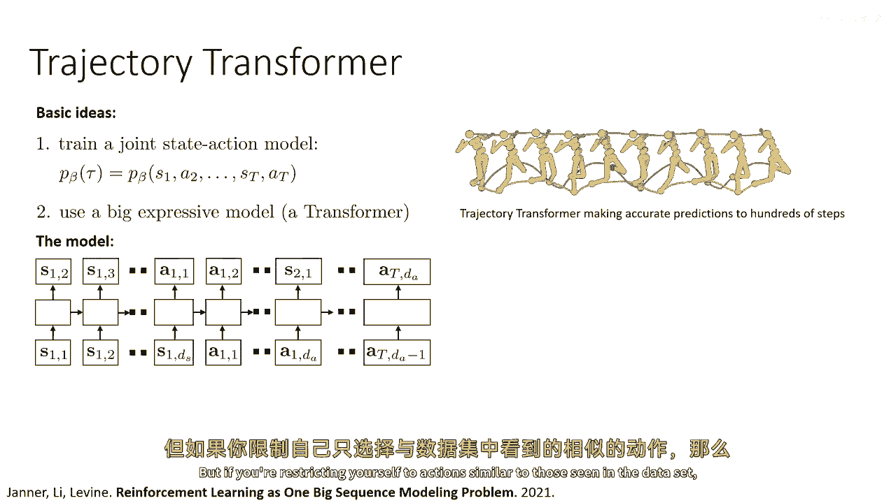

那么你可以非常准确地预测未来很长一段时间，所以，这个动画实际上正在显示轨迹变换器对未来人类的预测，几百步的未来，所以这不是一个模拟，这实际上是模型做出的一个预测，然后，你可以使用此模型进行规划，现在。

你可以使用许多相同的技术进行规划。

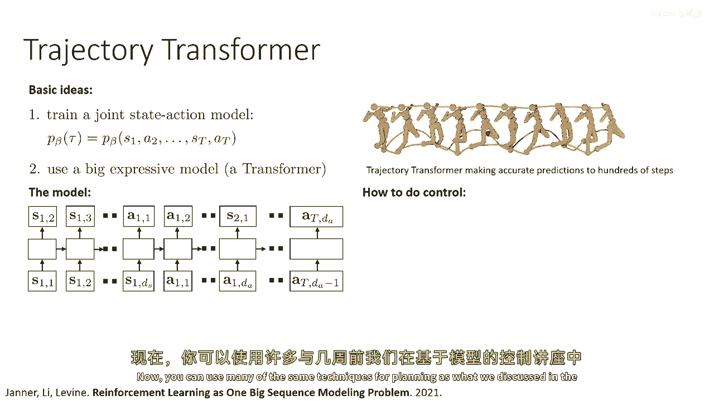

就像我们在几周前的基于模型的控制讲座中讨论的那样，但重要的是要考虑行动的概率，因为你不想计划产生在数据下概率低的行动，一种处理这个问题的方法是使用束搜索，这些序列模型已经相当好地工作，但是。

而不是使用beam search来最大化概率，使用beam search来最大化奖励。

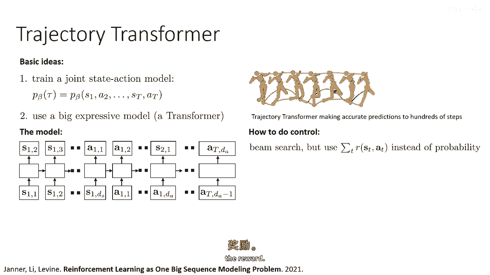

所以，给定当前的子序列，所以，假设你已经解码到时间。

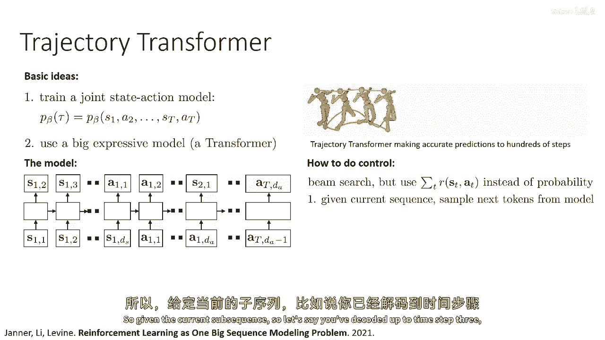

步骤三，从模型中选择下一个标记，仅仅从概率分布中采样它，可以采样许多标记。

让我们说您采样k标记，然后，您存储顶部k标记，具有最高的累积奖励。

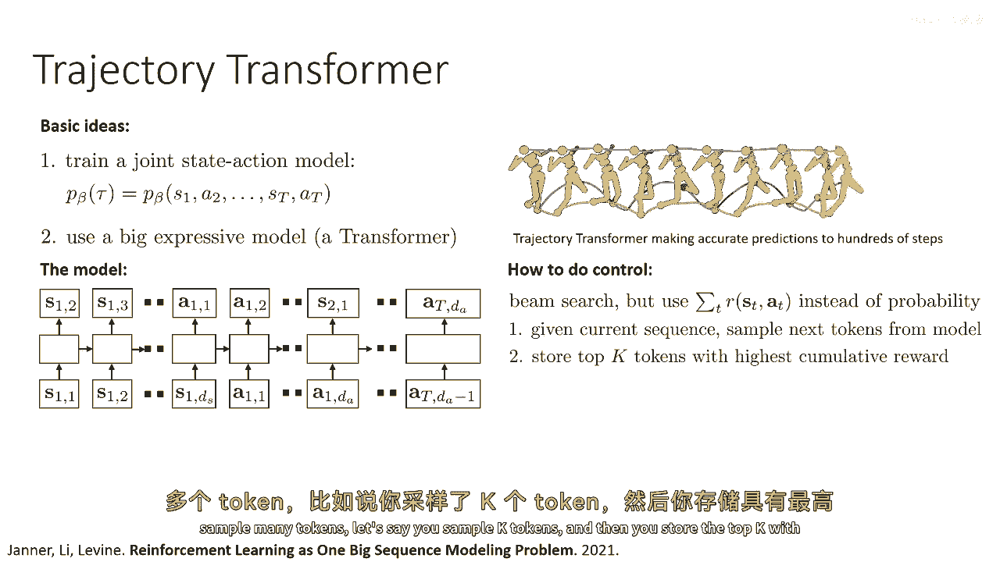

所以这就是基本的束搜索，所以你对于每个序列有k个前缀，你采样k个标记，对它们进行排序并取前k个，这里'前k'意味着在总奖励上最高的，然后你一次步一个步这样做，这就是基本的高层次想法。

有一些细节需要使这实际工作，但现在这就是原理，当然，你可以使用任何其他规划方法，你可以使用MTS与这个。

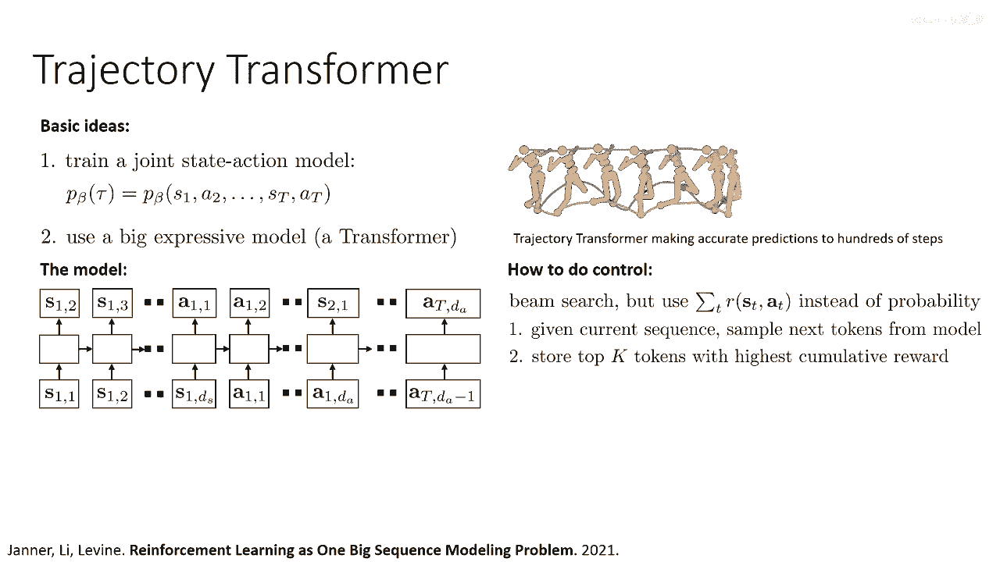

你可以使用甚至可微的东西，尽管你需要小心地将那些离散化转换为连续值，重要的是，你需要确保你在最大化奖励。

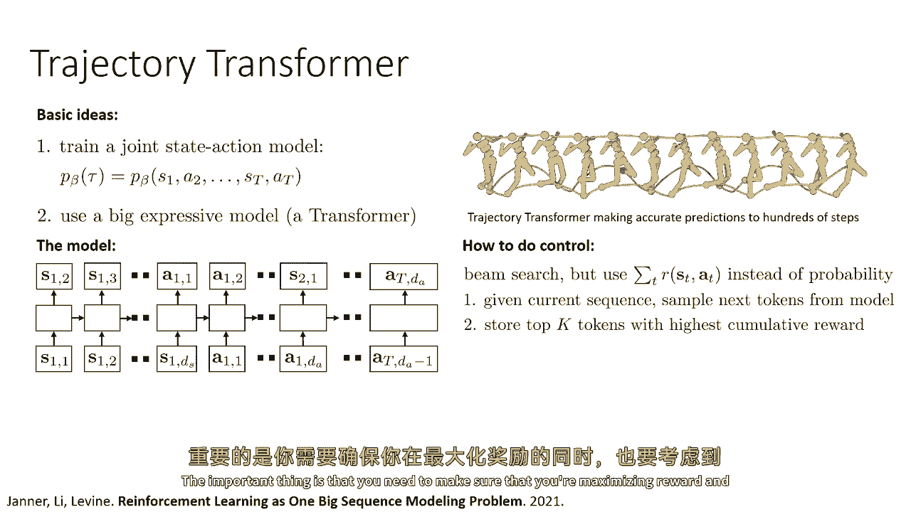

并且也要考虑概率，所以束搜索方法考虑了概率，因为它从p beta采样那些k标记，它们从p beta采样，所以它们从标记的分布采样。

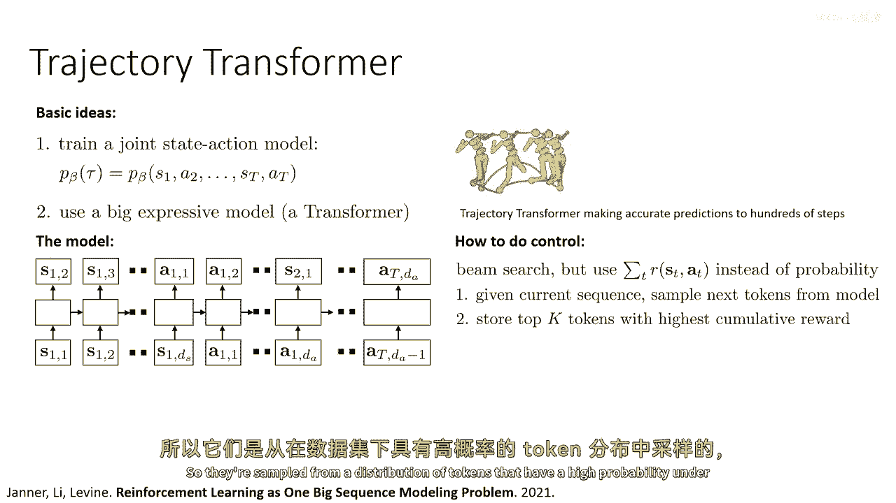

那些在数据集中概率高的标记，然后你从中选出最好的一个，这是可以的。

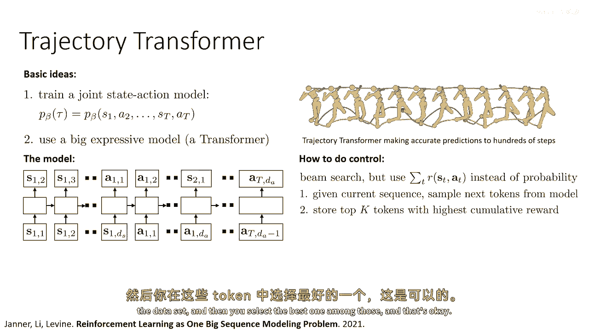

嗯，所以为什么这种方法工作得好，生成高概率轨迹。

避免离散分布状态和动作，因为你实际上在使用p beta both来选择状态和动作。

并且使用非常大型的模型在离线rl中工作得很好。

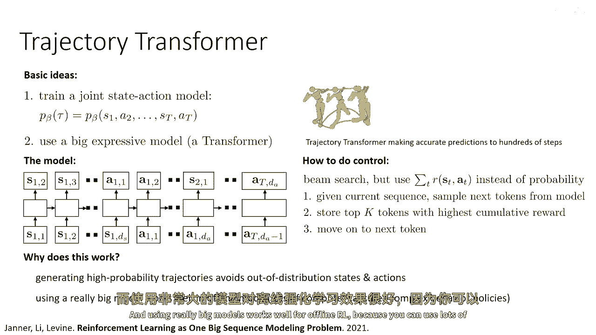

因为你可以使用大量的计算并捕获复杂的行为策略，所以你可以捕获复杂的动态。

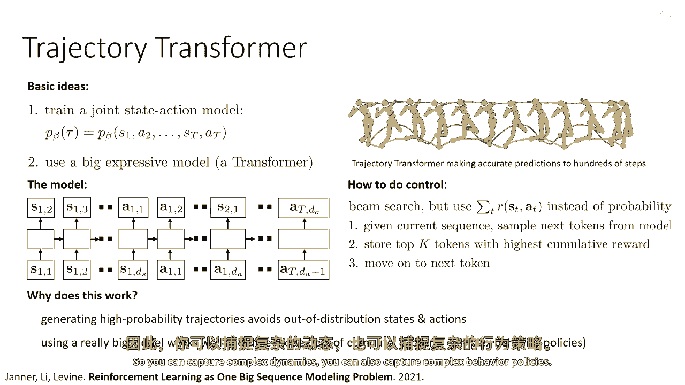

