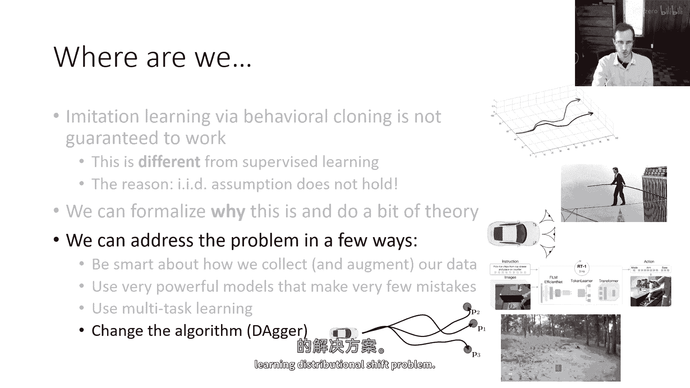
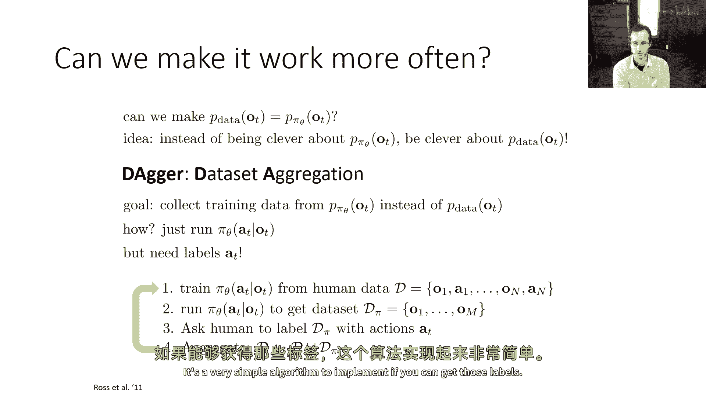
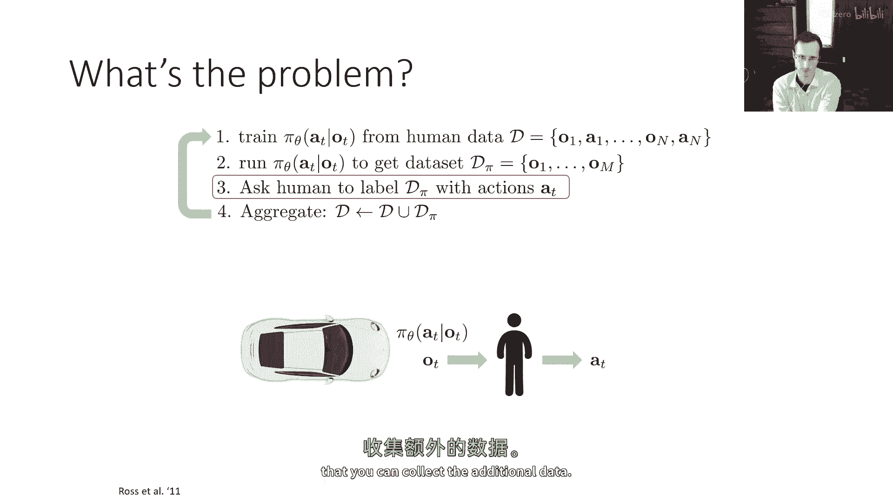
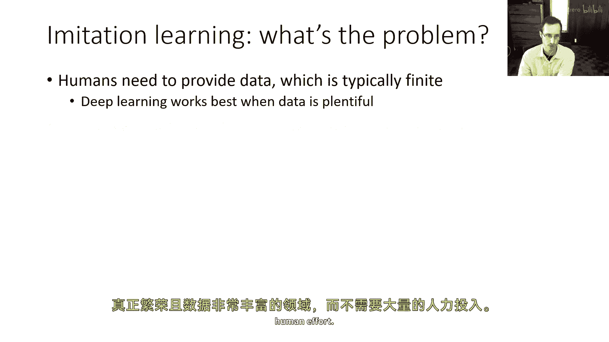
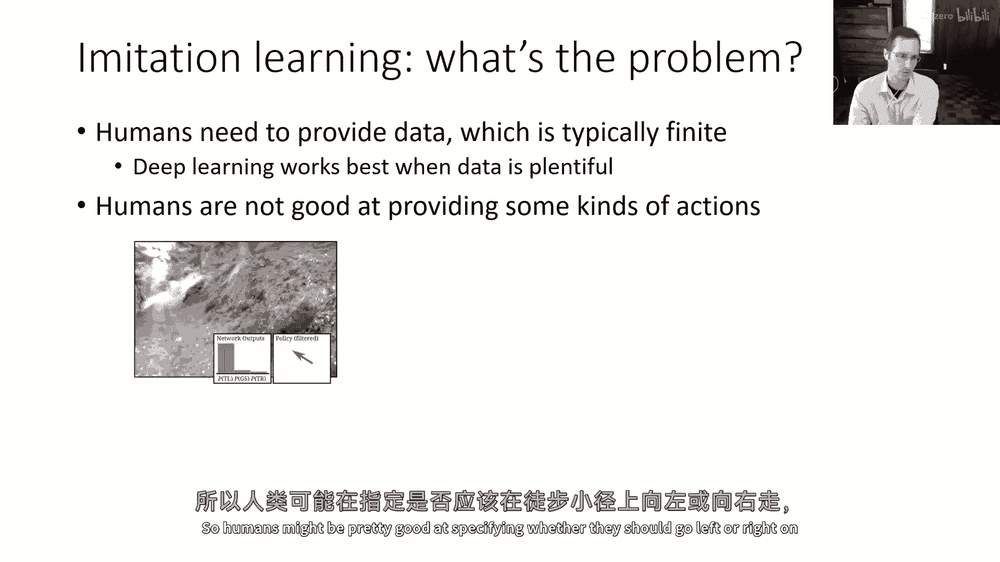
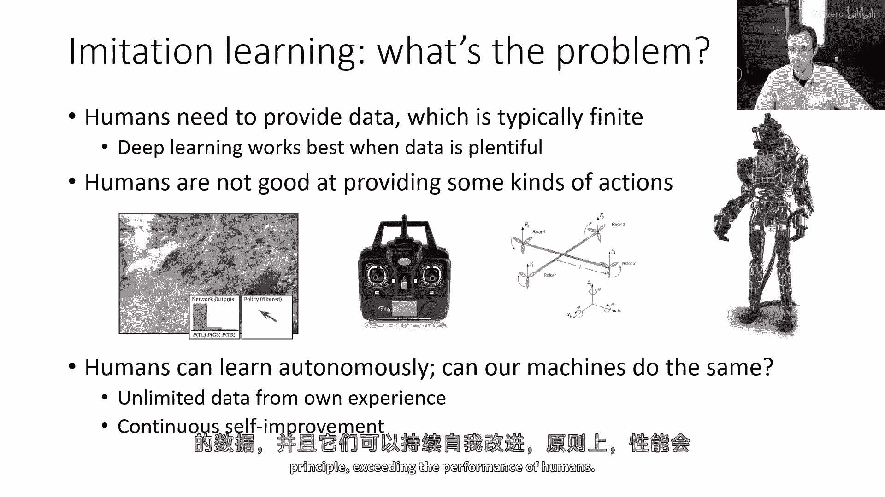
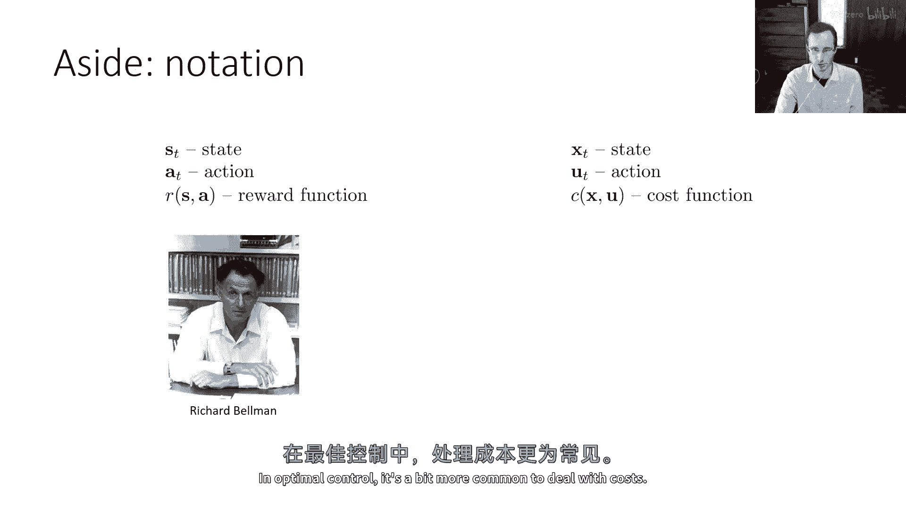
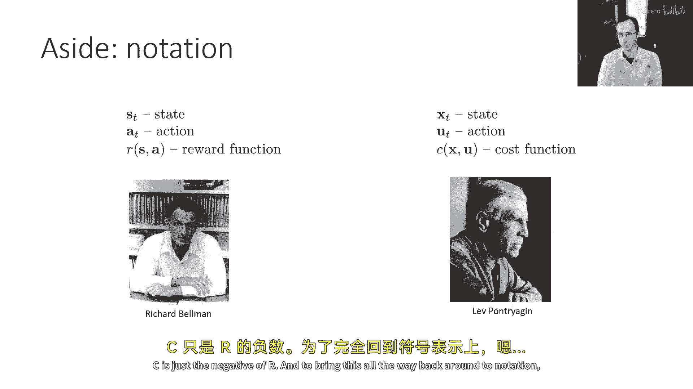
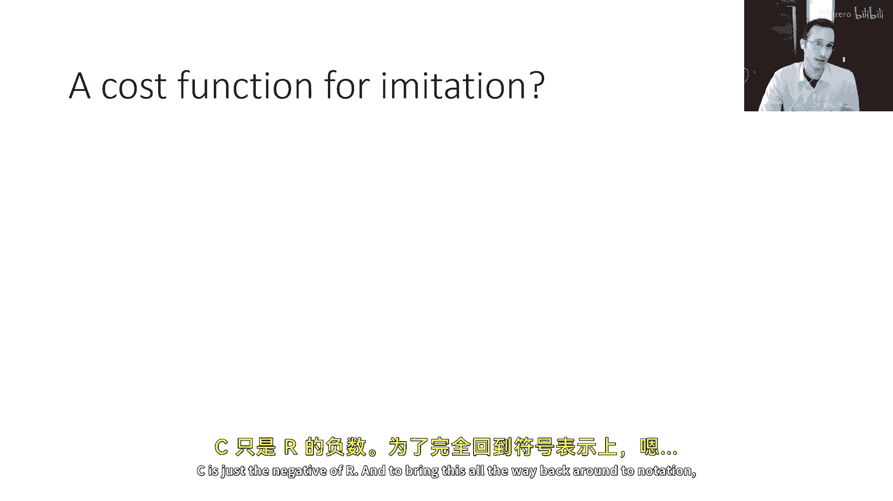

# P8：p8 CS 285： Lecture 2, Imitation Learning. Part 5 - 加加zero - BV1NjH4eYEyZ

好的，我们接下来要讨论的主题是匕首算法，而且匕首算法实际上是一种，你在作业中需要实现的东西，匕首算法的目标是提供一种更原则性的解决方案，嗯，来解决模仿学习分布的偏移问题。

所以嗯，作为提醒，分布偏移的问题，嗯，直觉上，是政策至少会犯一些小错误，甚至在训练数据附近，当我犯错误时，我发现自己处于更不熟悉的状态，在那里它犯更大的错误，错误累积，更精确地说。

这个问题可以被描述为分布偏移问题，意味着政策被训练时的状态分布，P_data与政策被测试时的状态分布系统地不同，这是p_pi_theta，到目前为止，我们谈论的大部分都是试图改变政策的方法。

以便p_pi_theta更接近p_data，通过犯更少的错误，但我们能否反过来做，能否相反地改变p_data，以便p_data更好地覆盖政策实际访问的状态，好的。

我们如何使p_data等于p_pi_theta呢，当然，如果我们在更改我们的数据集，我们正在引入一些额外的假设，所以我们将实际上收集比初始演示更多的数据，然后问题就变成了收集哪些数据。

这就是匕首试图回答的，而不是聪明于p_pi_theta或我们如何训练我们的政策，让我们聪明于我们的数据收集策略，所以匕首的想法是实际上在现实世界中运行政策，看它访问哪些状态，并让人类标记这些状态。

所以目标就是收集数据，以便p_pi_theta，嗯，那样训练数据来自p_pi_theta，而不是p_data，我们将通过实际上运行我们的政策来实现这一点，这是算法，现在我们需要所有那些状态的标签。

我们将首先在我们的训练数据上训练我们的政策，仅在我们的演示上，以开始，然后我们将运行我们的政策，并记录政策看到的观察，然后，我们将要求一个人遍历所有这些观察，并为它们标记出他们将采取的行动，好的。

现在我们有一个标记版的政策数据集，然后，我们将进行聚合，我们将原始数据集和刚刚获得的这个标记数据集的并集，然后回到第一步，重新训练政策并重复，所以每次通过这个循环，我们运行我们的政策。

所以每次通过这个循环，我们运行我们的政策，我们收集观察，我们让人类为这些观察标记正确的动作，然后我们聚合，实际上可以证明，最终这个算法会收敛，以至于最终分布的，嗯。

在这个数据集中的观察将接近政策实际上看到的观察的分布，当它运行时，为什么这是真的直觉，当然，是 uh，最终，每次政策运行时，你会收集其观察结果，然后，你可能用与原始行动不同的行动来标记它们。

它采取的行动，但是，那个分布比初始分布更接近，所以，只要每一步你都能越来越接近，最终，你会到达一个分布，在那里政策实际上可以学习，然后，你会永远停留在那里，所以然后，随着你从中收集的数据越来越多，最终。

你的数据集被正确的p pi theta分布样本所主导，这就是算法，如果你能获取到这些标签，那么这个算法是非常简单的来实施的。

这里有这个算法在行动的视频，这是这个原始dagger论文的一部分，这是大约十二年前，当他们实际上使用它来让无人机穿越森林的时候，并且他们用dagger来控制无人机，收集了数据，然后。

他们让人类离线标记它，通过实际查看图像，并使用鼠标界面来指定应该采取的行动，并且通过一些匕首的迭代，实际上可以使其通过森林飞行相当可靠，避开树木，现在存在，当然，这种方法的问题在于，这与第三步有关，嗯。

有时让人类检查图像并不太自然，在你驾驶汽车后，输出正确的行动，你不仅仅是立即做出决定，每次步骤关于选择什么行动，你位于一个时间过程之中，你有反应时间，所有这些东西，所以有时候，你可以离线获得的人类标签。

以这种假设的方式，可能不如人类在实际操作系统时可能会做的那样自然，所以第三步可能会对dagger构成一些问题，并且dagger的许多改进都试图缓解这个挑战，但dagger的基本版本工作像这样。

这就是你们将在作业中实现的版本，关于dagger真的说不了多少，它缓解了分布式偏移问题，实际上，它确实解决了这个问题，所以你可以推导出dagger的界限，并且这个界限是线性的t，而不是二次的。

但这以引入如此强的假设为代价，他们可以收集额外的数据。

好的，所以这就是我想覆盖的方法列表，如何解决行为克隆的挑战，我们可以聪明地收集和增强我们的数据，我们可以使用强大的模型，做很少的错误，我们可以使用多任务学习。

或者我们可以改变数据收集过程并使用dagger。

我想最后提到的一件事，这是下一部分即将到来的一个小预览，为什么模仿学习本身不够，我们为什么甚至需要这门课程的其余部分，嗯，人类需要提供数据给模仿学习，这有时是可以的。

深度学习在数据非常丰富的情况下表现最佳，所以要求人类提供大量的数据可能是一个巨大的限制，如果，如果算法可以自主收集数据，那么我们就可以处于那个深度学习真正繁荣的领域，在那里，数据非常丰富。

无需过多的人类努力。

另一个事情是，人类不善于提供某些类型的行动，所以人类可能很擅长指定。

他们是否应该向左还是向右在徒步道上走，或者通过遥控器控制四旋翼无人机，但他们可能不善于，例如，控制被称为直升机旋翼的低级命令。

来做一些非常复杂的特技飞行，如果你想让人类控制一个复杂的人型机器人的所有关节，这可能会更难，也许你需要为他们设计一些非常复杂的设备来穿戴，嗯，如果你想控制一只巨大的机器人蜘蛛，嗯，祝你好运。

找到能操作那种嗯的人体，看起来非常吸引人，嗯，试图开发方法，使我们的机器能够做我在讲座一中提到的事情，我们从基于学习的控制中可以获得的最激动人心的事情之一是涌现行为，比人类能做的行为更好的行为。

那么在这种情况下，自主学习是非常理想的，从原则上讲，自主学习，机器可以从自己的经验中获取无限的数据，并且他们可以持续自我改进，越来越好，理论上。

超越人类的性能，现在，为了开始考虑这个问题，我们需要引入一些术语和符号，我们需要实际定义我们想要什么，如果我们的目标不再仅仅是模仿，但我们想要做好其他事情，我们要追求什么。

也许我们不想仅仅匹配专家数据集中的动作，我们想要实现一些期望的结果，比如在老虎的例子中，我们想要最小化被老虎吃掉的概率，所以我们想要最小化我们落入状态s'的概率，这是一个被老虎吃掉的状态。

我们可以用数学来写这个，一般来说我们可以把它写成某个成本的期望值，在这个情况下，成本是被老虎吃掉，你现在我们已经看到了成本之前，当我们谈论计数错误数量时，但总的来说，它对状态和动作的成本可以是任意的。

并且这些可以定义任意的控制任务，比如不被老虎吃掉或达到所需的目的地，所以，我们要介绍的新东西，并且我们将在下周讲座中使用的是成本函数，或者有时是奖励函数，现在，成本函数和奖励函数实际上是同一件事。

它们只是彼此的相反数，而且我们之所以能看到，两者有时是同一种文化区别，我之前有所提及。

记得我提到我们有s和a，来自动态规划的状态，那是在最优控制中奖励的来源，处理成本更为常见。

我不知道这里是否有文化评论，嗯，你知道，最优控制起源于俄罗斯，可能在美国更常见考虑成本，我们都非常乐观，我们视生活为带来奖励的，也许有些道理，但对于这门课程的目的，不要担心它，C是r的负数。

现在让我们回到模仿的主题上。

我们之前看到的成本函数，因为模仿可以精确地用相同的框架来描述，我们有奖励，这些是对数概率，我们有成本，并且它们可以互换，你可以点击成本，是奖励的负数，你可以为模仿定义一个成本。

但你可以定义一个更表达性强的成本，你想要的东西，比如到达目的地或避免交通事故，然后使用这些。

