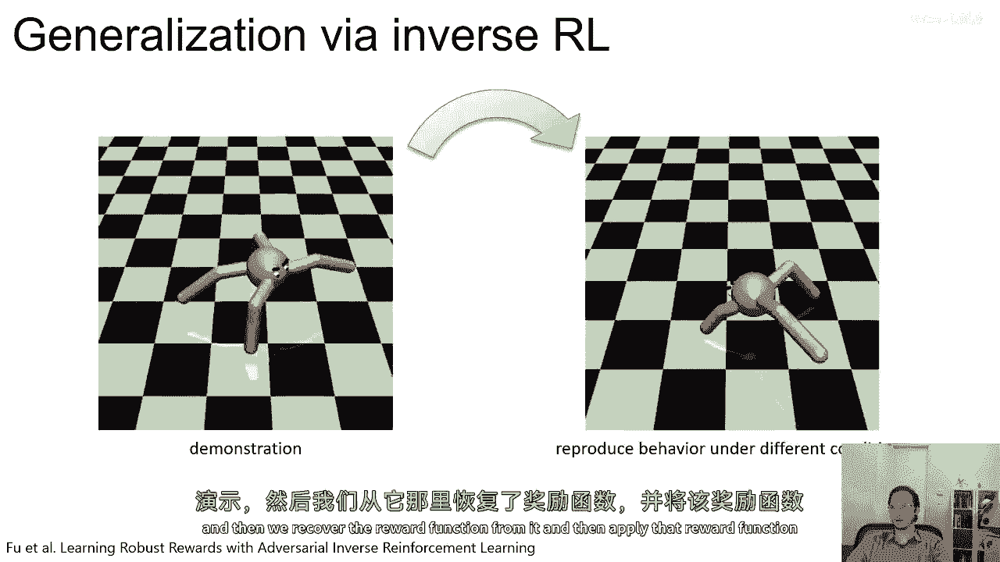
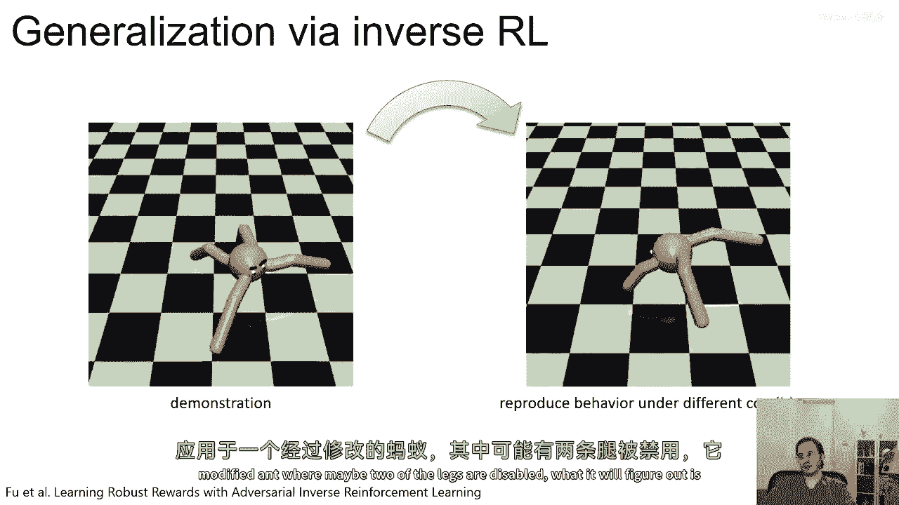
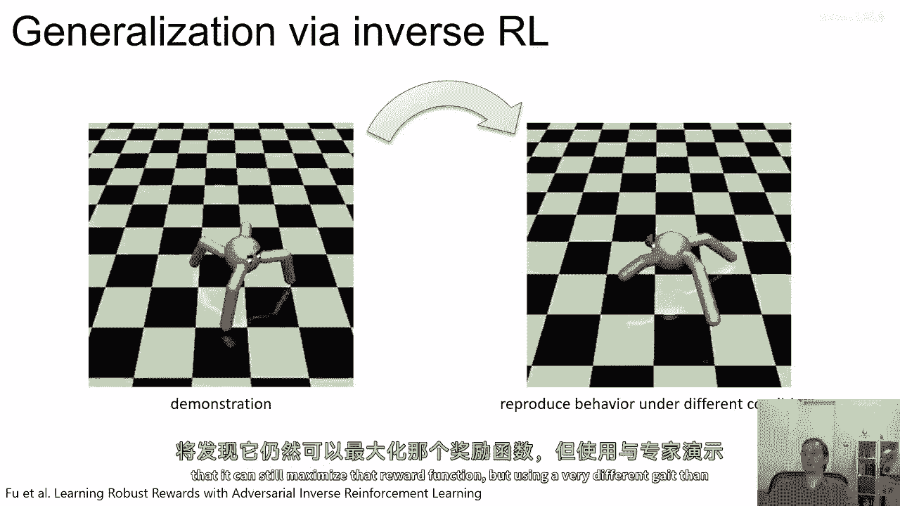
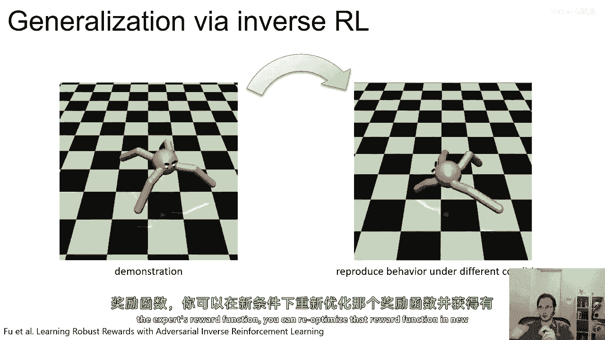
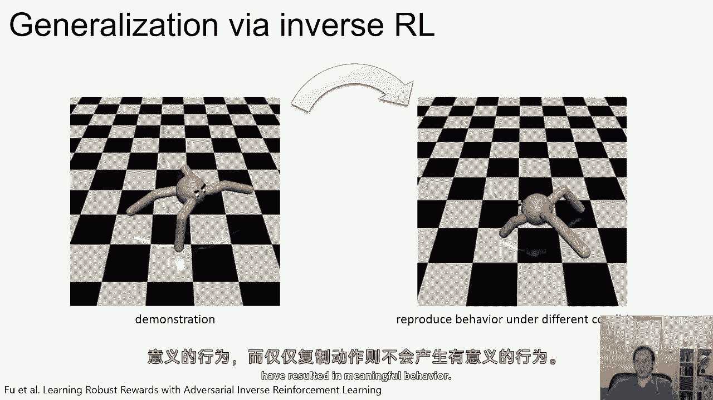
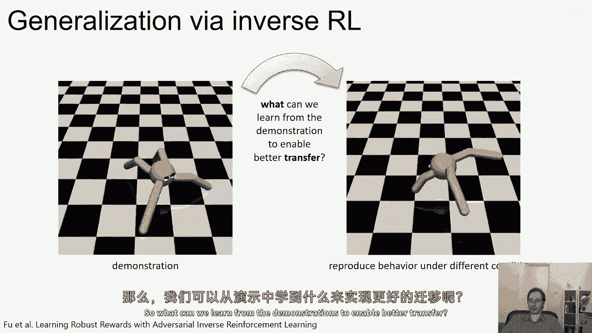
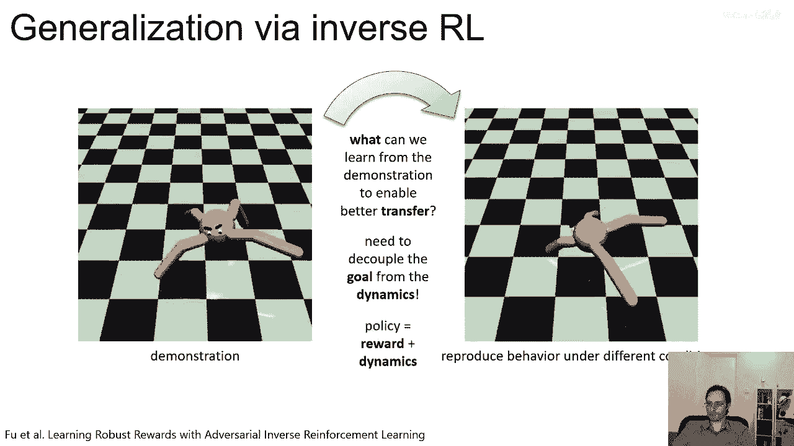
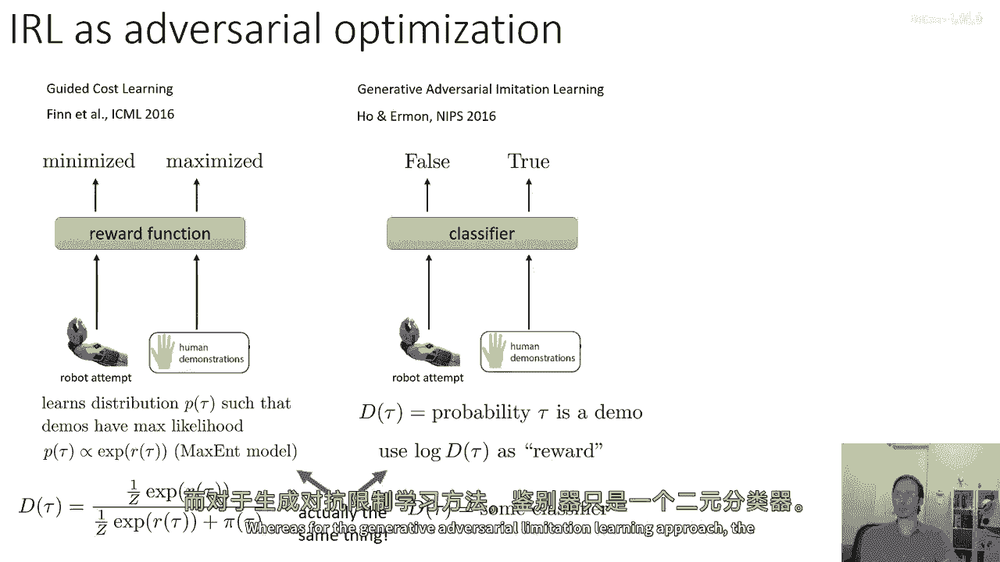
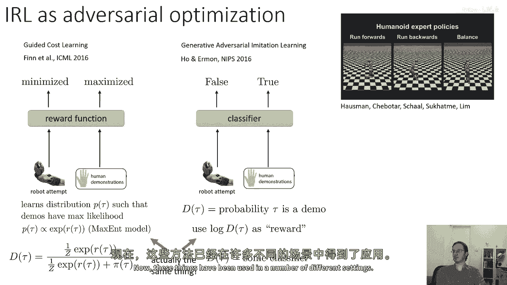
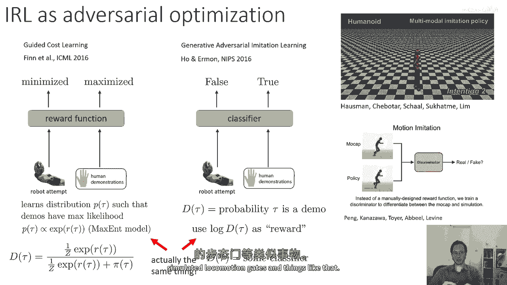

# P85：p85 CS 285： Lecture 20, Inverse Reinforcement Learning, Part 4 - 加加zero - BV1NjH4eYEyZ

好的，"在今天讲座的最后一部分"，"我们将讨论这些近似类型之间的更深层次关系。"，"逆强化学习方法和另一类也学习分布的算法"，"被称为生成对抗网络"，"我们将看到。

探索这种联系实际上能给我们带来很多清晰度。"，"并且我们还可以通过以下方式设计虚拟现实和模仿算法"，所以，可能有一些人已经认出了其中的一些事情，"那是我在讲座的前一部分描述的算法结构吗？"。

看起来有点像个游戏，我们有这个初始政策，我们从那个政策中生成样本，我们有人类演示，我们从人类演示中获取样本，我们将这些样本结合起来产生一种奖励函数，使人类演示看起来好，而政策样本看起来坏。

然后我们更改政策，嗯，所以政策实际上优化那个奖励函数，使它更难以与演示区分，所以你可以这样想，因为奖励函数试图从政策样本中产生与人类演示非常不同的演示，根据当前的奖励，因为它试图将样本的奖励提高到高。

将抱歉降低到低，反过来，将人类演示的奖励提高到高，将政策样本的奖励降低到低，并且政策试图做相反的事情，它试图做相反的事情，试图使其样本看起来好，根据奖励，理想上与人类样本一样好，所以你可以几乎把它想成。

作为一种政策与奖励函数之间的游戏，其中政策试图欺骗奖励函数认为，它和人类一样好，而奖励函数正在寻找一个奖励，这将允许区分人类和政策，实际上，这种联系不仅仅是表面的，嗯。

逆向强化学习与游戏的联系可以正式建立，逆向强化学习可以与被称为生成对抗网络的东西有关，所以，一个生成对抗网络，嗯，它是很多东西，它是一种将马变成斑马的方法，一种产生非常真实面孔的方法。

一种将线图转换为猫的方法，但它实际上就是一种生成模型的方法，它是一种学习神经网络捕获特定给定数据分布的方法，例如，像真实面孔的分布或真实猫的分布，或者是对于那些不熟悉生成对抗网络的人来说。

真实斑马的分布，它们由两个神经网络组成，一个生成器网络，它接受一个随机样本，随机噪声z并将其转换为一些样本x，理想情况下，这些样本应该对应于数据分布的样本，所以，如果你将这个系统训练在面孔上。

采样的x's应该看起来像真实面孔，数据包括来自真实未知分布p star的x样本和判别器，还有一个被称为判别器的第二个网络，这是一个二分类器，试图将所有样本的标签分配为真，从数据到来自p星的所有样本。

并将标签分配为假给来自生成器p theta的所有样本，所以这里d si of x是二分类器，代表判别器，并且什么，这里d psi of x基本上是这个样本是真实的概率，意味着概率。

判别器认为这个样本是来自p星的真实样本，而不是来自生成器的假样本，所以判别器的目标是最大化样本的日志概率，在p星上是真的，并且最小化日志概率。

或者等价于最大化所有来自p theta的样本的log（1减去概率），所以它试图让p theta的样本看起来假，p star的样本看起来真实，所以它就是另一个神经网络，它接受x，并输出伯努利变量的概率。

然后生成器被训练来欺骗，判别器试图产生图像x，对于判别器给出高概率它们是真实的图像，现在这与我之前概述的逆强化学习程序非常相似。

实际上，你可以将逆向强化学习视为一种生成对抗网络（GAN）的一种形式，所以嗯，你需要做出的一个选择是应该使用哪种判别器，嗯，所以在GAN中，我们可以实际上证明最优的判别器，在收敛时，贝叶斯最优的判别器。

应该代表p星和ptheta之间的密度比，现在在实际应用中，我们通常没有最优的判别器，但如果我们训练判别器使其收敛，我们期待它会收敛到，到达一个对于每个x都给出概率的网络。

作为x的p星概率除以x的p theta概率加上x的b星概率，现在你可能会说好吧，这好像有点奇怪，像不应该是判别器的收敛，只是向来自p星的所有样本提供概率一，不一定。

因为如果p theta生成了一些与p星可能产生的图像相同的图像，这些图像与可能来自真实数据分布的图像相同，那么这个创造者就不能给他们一个概率一点零，因为它们可能实际上是假的，所以它必须产生概率。

根据这个比例，如果p theta非常差，这不是问题，因为通常在那个情况下，真实的图像在所有情况下p theta的概率都非常低，而假象图像的p star概率也非常低，但是随着p theta越来越好。

判别器将产生除了零和一以外的值，实际上的收敛，当x的p theta实际上等于p star时，你预期，有一个判别器可以产生始终为0。5的概率，好的，这可能是一个稍微有点学术性质的练习，实际上。

我们可以使用这一推断将逆向强化学习视为一种生成对抗网络，以一种非常特殊的判别器的形式，所以对于irl，最优策略将趋近于p_theta，它正比于p_tau乘以我们对tau的指数滤波，所以我们要做的就是。

我们将选择这个参数化来定义我们的判别器，我们将说，判别器等于tau的p乘以1除以z乘以，指数奖励，所以这就是最优策略分布除以p的theta的tau，加上tau的p乘以1除以z乘以指数奖励。

所以我们基本上就直接使用了最优判别器的公式，将p星替换为tau的p乘以指数奖励，这是有道理的，因为那是我们预期会得到收敛的结果，如果我们像以前那样扩展p theta tau的方程式。

包含所有有关初始状态和动态项的轨迹概率将会相互抵消，留下我们一个具有形式为，z的倒数乘以指数奖励，除以政策概率的产品，加上z的倒数乘以指数奖励，需要注意的是，这个判别器只会等于0。5。

当政策概率等于指数奖励时，这意味着政策已经收敛，然后我们要做的就是，我们将优化这个判别器，以奖励参数的比例来调整这个比例，以符号为参考，所以我们将基本上选择奖励，使得这个比例对于人类样本最大。

对于策略样本最小，所以训练si的目标仍然与gan完全相同，最大化在数据分布p star下log d si的预期值，并最大化在当前策略样本下log（1-d i）。

除了i现在不仅仅是一个输出二进制概率的神经网络，但它有以下方式：这个比例在内部，我们优化的是r的，结果发现这 actually 有效，如果你实际上以i相同的目标优化z，所以你实际上不需要计算分部函数。

Z你可以实际上作为r max的一部分来优化它，因为结果发现这 actually 给出正确的答案，那个的推导稍微有点复杂，但你可以在底部的论文中找到它，叫做生成对抗网络和逆向强化学习的联系，生成对抗网络。

逆向强化学习，并且基于能量的模型，这个推导的有趣之处在于，实际上我们不再需要重要性权重， anymore，它们实际上被纳入到分部函数z中，我们同时优化我们的奖励函数参数，然后。

政策就像生成器和再次一样被优化，以最大化奖励，我们有我们的生成器/政策，我们从那个政策中生成样本，我们有我们的数据演示，这些是来自p星*的t*的样本，我们使用标准GAN目标来训练判别器，但是。

判别器有我们之前在幻灯片上提到的有趣形式，并且我们优化策略以最大化预期奖励和熵，所以，策略更改以使其更难以与演示区分，好的，嗯，现在，如果我们实际上在实践中实现这种想法，这在其他论文中也被做过。

其中一篇就是我们这篇论文，链接在底部的学习鲁棒奖励与对抗性逆强化学习，我们可以做的事情之一是，我们可以研究我们恢复的奖励是否实际上可以在有意义的方式中泛化。

所以如果例如，我们有这个看起来愤怒的四足昆虫的演示。

然后我们从它中恢复奖励函数。

然后应用那个奖励函数到一个修改的，并且可能两只腿都被禁用。

它会发现它可以仍然最大化那个奖励函数，但使用完全不同的门。

然后专家演示的那样，所以，逆向强化学习的一个优点是。

如果你实际上恢复了专家的奖励函数，你可以在新条件下重新优化这个奖励函数并得到有意义的行为。

在哪里仅仅复制动作不会导致有意义的行为。

所以我们可以从演示中学习什么，以使转移更好。

我们需要做的就是我们需要将目标，奖励函数与动力学分离。

这正是逆向rl所做的。

好的，现在，在这个阶段，我们可以问一个问题，那就是为了将生成对抗网络（GANs）和逆向强化学习（Inverse RL）连接起来，我们需要使用什么样的判别器？我们需要使用这种非常搞笑的判别器，实际上。

使用那种搞笑的判别器对我们是有利的，因为它允许我们恢复奖励函数，这个奖励函数然后可以泛化到新的情况，但如果我们不需要奖励函数，如果我们只是想复制专家的策略，我们可以否只使用普通的判别器，所以，就像以前。

我们既有策略样本也有数据样本，但现在，d只是一个普通的二进制神经网络分类器，就像在常规生成对抗网络中一样，然后，策略最大化预期对log d的取值，以使其更难以与演示区分。

这个想法在一篇由hen ermann撰写的论文中被引入，叫做对抗模仿学习，这个算法不再是一个逆向强化学习算法，因为它不恢复奖励函数，但它确实恢复专家的策略，所以它是一个，它是一个明确的模仿学习方法。

所以存在许多权衡，这种方法的优化设置通常更简单，因为去除的部分很少，但是，收敛时的判别器实际上并不知道什么，所以，在这里，判别器只会是零点五，在新的设置中，你不能重新优化奖励。

所以你不能保证你会恢复专家的奖励函数，但你可以保证，如果一切都工作正确，你会恢复他们的策略，总结来说，我们可以将irl视为经典深度irl方法中的对抗性限制，就像添加的成本学习。

我们在人类演示中具有政策的尝试，并且奖励函数试图最小化政策的样本奖励，并且最大化人类演示的奖励，并且它学习tau的分布p，使得演示具有最大似然性，生成对抗性限制学习方法相反使用分类器。

它试图为所有政策样本分配标签false，并为所有人类演示分配标签true，并且τ的d是τ基本上是一个演示的概率，然后您使用log d of τ作为您的奖励，它们基本上是一样的东西，除了其中一个。

您可以恢复一个奖励函数，而对于另一个，你不能恢复奖励，但你可以恢复策略，所以区别在于，引导成本学习的判别器，和其他irl方法只有这个特定的特殊形式，而对于生成对抗的限制学习方法。

判别器只是一个二分类器，现在，这些方法已经在许多不同的环境中被使用。

所以你可以，例如，将其与一种聚类方法结合，并从异质演示中恢复多个不同的行为聚类，你可以甚至进行逆向强化学习或模仿从图像中，复制，你知道，嗯，模拟移动门和类似的东西。

如果你想要阅读更多关于逆向强化学习的内容，所以，这些是逆向rl的一些经典论文，这里是一些更现代的论文，所以引导成本学习，那是我讨论的论文，它提出了一种方法。

实际上可以将max和irl扩展到高维的深度学习设置中，下一篇论文，深度最大熵逆向rl在小型表格域中执行逆向rl，但使用深度网络，生成对抗式限制学习不执行逆向rl，但它确实恢复了策略，然后。

使用对抗式逆向rl学习稳健的奖励。

