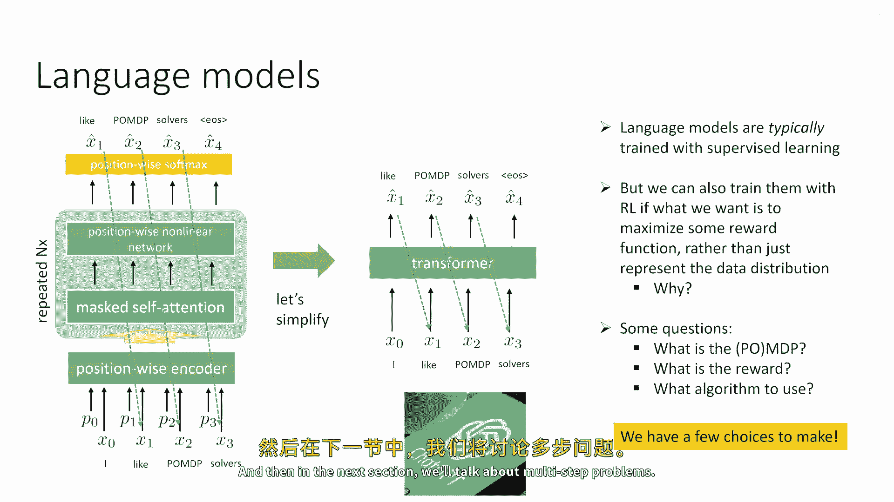
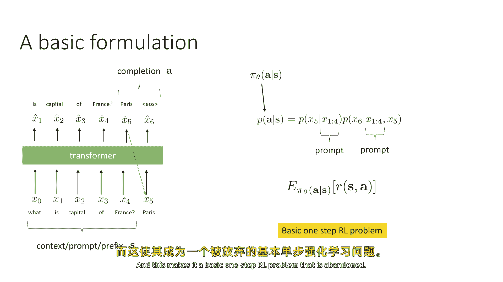
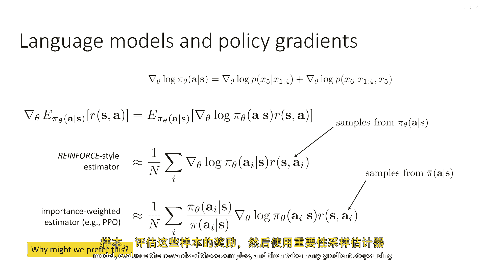
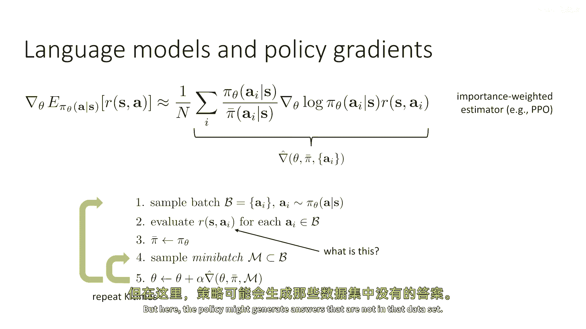
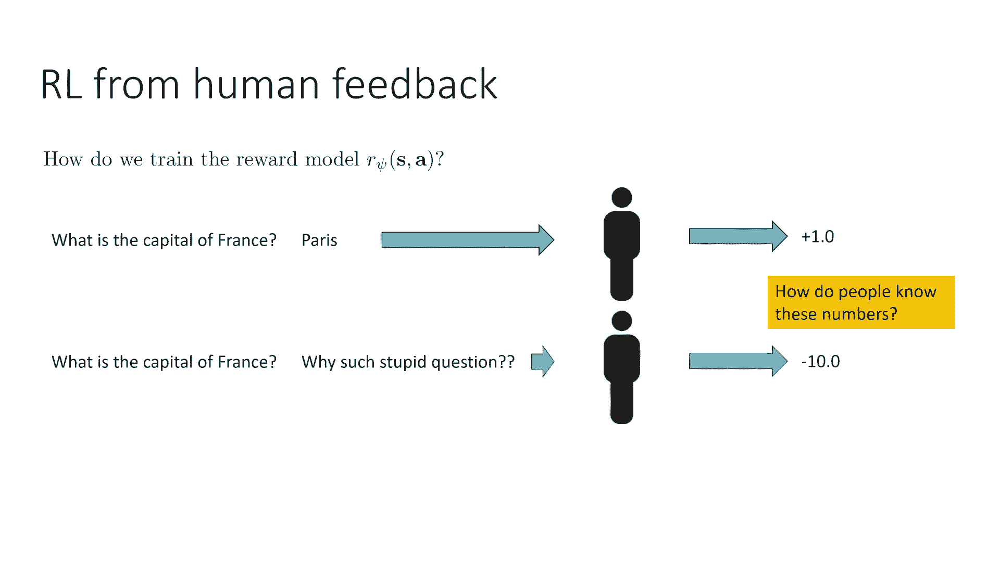
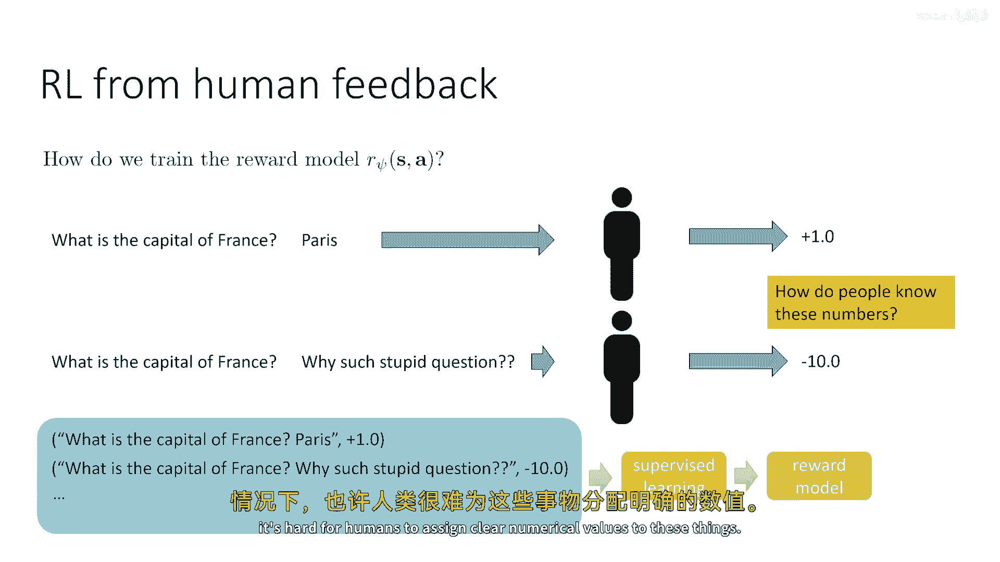
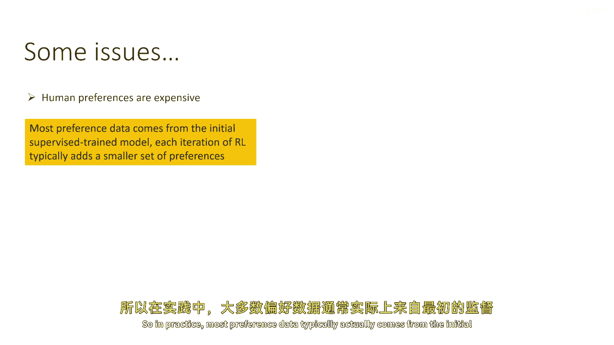
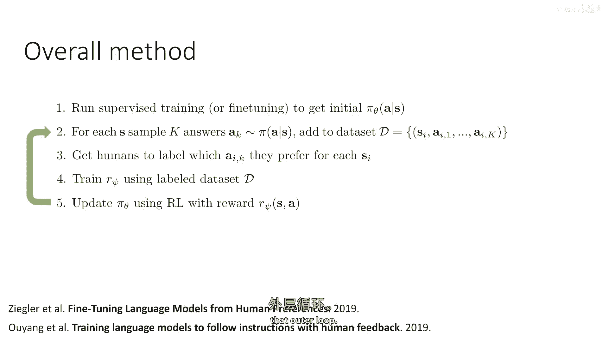
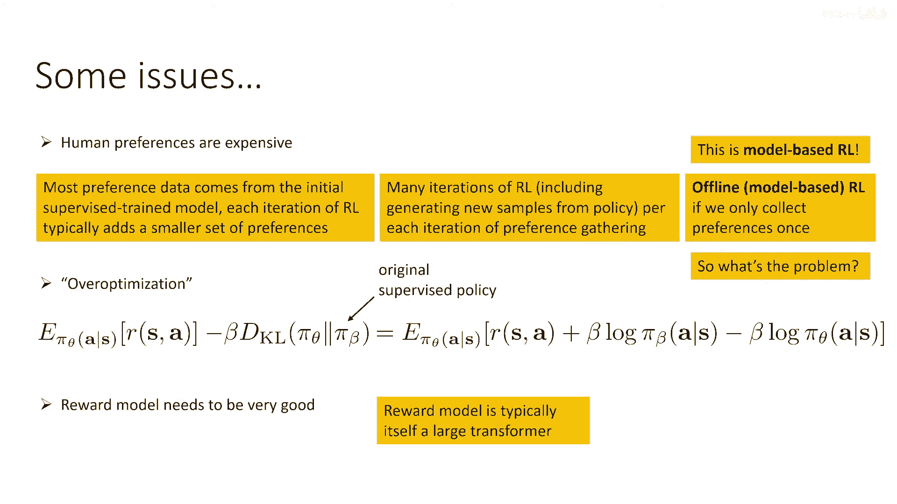
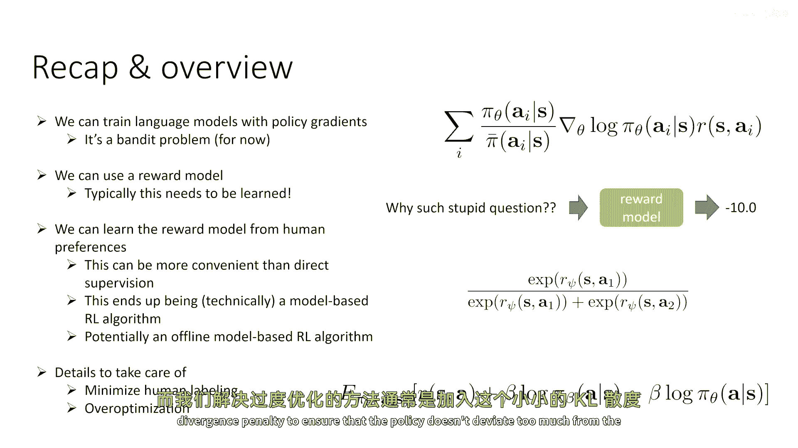

# P89：p89 CS 285： Lecture 21, RL with Sequence Models & Language Models, - 加加zero - BV1NjH4eYEyZ

所以，在前一节中，我们讨论了如何使用序列模型来帮助处理部分可观察的rl，在下一节中，我们将转向另一方向，并且我们将讨论rl如何帮助我们更好地交易序列模型，特别是对于语言建模，在讲座的第三部分中。

我们将实际上将这些结合起来，并且我们将有部分可观察性和语言模型，好的，所以，什么是语言模型，以及我们为什么应该关心它们，基础的语言模型是一种预测下一个标记的模型，你可以大致地将标记视为单词。

尽管在现实中它们并不是单词，更像是字符的组合，嗯，关于标记的具体定义其实是有些复杂的，但大致来说，嗯，它是自然语言的一种细粒度表示，我们通常使用变换器来构建语言模型，这种工作的方式是。

我们取我们的标记序列，S x 零，X 一，X 二 x 三，我们在每个位置，我们有一个小的编码器，将离散标记编码为连续空间，以及他们对序列位置的编码，嗯，位置的编码，嗯，基本上它们被放置在序列中。

一个整数，零一，二，三，四，并且这些被编码为一个连续的表示，然后传递给被称为掩码自我注意力层的东西，这实际上是一个可以产生每个位置的表示的变压器，基于前一个时间步长的表示条件，这就是掩码所指的是，然后。

这些被一些位置的非线性变换所转换，并且，这个自注意力块会被重复一些次数，这就是基本上一个变换器的样子，并且在最后，在每个位置我们都会读取出一个关于标记的分布来预测，嗯，这基本上就是softmax，然后。

我们预测下一个标记，所以，在首次时间步，我们读取入x零和p零，然后，我们预测我们预测关于x一的东西，如果我们在解码，那么例如，我们将从一些标记开始，比如单词我，我们解码一些单词。

比如那个单词被用作条件信息，在第二步，你预测下一个，我喜欢omdp解决策略，在那里你会得到解码，最后，模型输出结束序列标记，以指示它已经生成了这个特定的生成。

所以这基本上现在是一个transformer语言模型，为了课程的目的，你真的不需要知道transformer是如何工作的，所以您必须简化这个图表，基本上成为一个盒子，我们称之为transformer。

它序列地读取标记，并预测下一个标记，所以每次时间步，它正在模型x t给定x 1到t-1的分布p，通过重复，嗯，从该分布中采样，您最终会得到一个句子，比如我喜欢omdp解决策略，注意。

这个模型不是马尔科夫的，所以每个标记都取决于所有之前的标记，当然，广泛知道的gpt系统，嗯，Bard爪了，所有这些都是语言模型的例子，所有这些系统都在内心深处生成语言标记，您指定提示标记。

然后它生成响应标记，在意义上，你将给他们大量的英语文本或其他语言的文本，然后让他们使用所有数据来预测下一个标记，给定所有之前的标记，但我们也可以使用rl进行训练，如果我们想要的不是数据分布的匹配。

那就是，我们不仅想要它们，输出我们在训练数据中看到的相同种类的文本，但我们想要它们最大化一些奖励函数，这可能在许多设置中都是非常理想的，为什么，嗯，例如，嗯，你可以，嗯。

使用rl来让语言模型满足人类的偏好，产生人们喜欢的文本类型，你也可以使用rl来让语言模型学习如何使用工具，学习如何调用数据库或计算器，你也可以使用它来训练能够更好地与人类进行对话的语言模型。

并实现对话目标，我们将讨论所有这些，这与仅仅匹配训练数据不同，这些都是需要rl而不是仅仅监督学习的事情，好的，但要能够将rl应用于语言模型，我们确实需要回答一些问题。

与语言生成任务对应的mdp或pumdp是什么，mdp由状态、动作、奖励和转移概率决定，我们需要选择这些东西以适应我们的语言生成任务，现在有一些，有一些明显的直觉，如，你知道，如果你在生成语言标记。

你的行动可能与语言标记有关，如果你的目标是最大化用户偏好，那么你的奖励可能也与用户偏好有关，但实际上得到那些细节需要一些有趣的设计决策，那么奖励是什么，以及应该使用哪些算法。

我们在上一节中学习了某些算法可以处理部分可观察性，嗯，其中一些在前几堂课中讲过，我们看到了一些对于离线策略有好处，一些对于在线策略有好处，所以我们必须做出一些选择，所以让我们谈谈一些那些选择。

我们将从rl训练语言模型的开始，对于有时被称为一步问题的情况，这是rl在语言模型中最广泛应用的应用之一，即gt，例如是如何训练的，然后在下一节我们将讨论多步问题，所以这里是一个基本形式。

我们有一些u prompt。

也许提示是像法国的首都是什么，然后transformer，嗯做出预测，现在它不是实际上预测，是the，它实际上不预测提示的标记，但那是它还是部分训练数据的一部分，它预测的是完成，所以它可能会预测像。

也许单词巴黎，在生成时，可能会预测像，在下一个时间步，这将作为输入被喂入，然后它预测序列的结束，所以它，所以在大多数应用中，语言模型将完成句子，而不是从零开始生成东西，并提供的前缀，那就是提示。

然后完成是所需的输出，好的，所以我们可以说，也许完成的基本形式是我们的动作，所以a由两个标记表示，巴黎和序列，一般来说，这可能是变量数量的标记，并且提示或前缀或上下文是状态s，所以。

我们的语言模型正在表示给定s的p，现在，它以每个时间步的概率产品的方式表示它，因为它不生成x一，X二和X三和X四，这是提示，它只生成x五和x六，所以，给定s的概率由x五给定x一至四的概率给出。

并且给定x1到x5，x6出现的概率是多少，我已经将x1到x4从x5中分离出来，因为x5实际上是动作的上一个时间步，而x1到x4是状态，所以给定s的π是本质上我们的策略，πθ，这里有一个需要注意的是。

现在有两个时间步的概念，这实际上非常混淆时间步，x1，你知道，一、二，三，四，五、六，这些是语言生成的时间步骤，对于Transformer来说，就RL算法而言，只有一步时间。

你观察一个状态并创建一个动作，所以这很困惑，因为现在在常规rl时间步长总是意味着同样的事情，现在实际上有两种时间步长，有一种是语言时间步长，然后有一种是rl时间步长，它们并不一定相同，所以对于rl目的。

这里实际上只有一个时间步长，它是一个，它是一个强盗问题，它是一个一步，Mdp，就语言生成而言，有许多时间步骤，好的，所以现在我们定义了时间步骤，我们定义了动作，我们定义了状态，并且我们定义了我们的策略。

我们的策略概率由语言时间步骤的概率乘积表示，对于所有的完成步骤，现在我们可以定义我们的目标，那就是最大化策略的预期奖励，就像在常规的rl中，嗯，而且这使得它是一个基本的一步rl问题。

那就是一个强盗，好的，所以让我们从使用最简单的rl算法开始，那就是策略梯度，所以这是我们的目标，"我们将计算它的梯度"，"我们将使用政策梯度讲座中精确的公式"，因此。

我们知道期望奖励的梯度是log期望的梯度的期望，"π乘以和"，"现在我们已经看到，π仅仅是概率产品的结果。"，在所有的完成标记中，"所以当我们对π的对数取梯度时"，"那就是对日志梯度的总和"。

"所有完成标记的概率"，"好的"，所以这相当直接，因为这些正是你计算的梯度类型，当你从交叉进行反向传播时，熵损失，当然，我们可以用样本来估计这个，所以如果我们使用标准的强化学习估计器。

然后样本需要来自pi theta，所以你实际上将从你的语言模型中采样一个完成，你将实际上告诉它法国的首都是什么，要求它生成一个完成，它将生成巴黎和一些序列的类型，然后，你将评估那个样本的奖励。

并将其用作您评分估计器的一部分，您还可以使用重要采样估计器，其中，你可能从其他政策中生成完成，然后，使用一种重要的方法来为您当前的政策获取评分，并且样本可以来自其他政策，πrπbar可能，例如。

是一个监督学习模型，第一句翻译为：'The first uh'，中文可能是：'首先'或者'嗯'。第二句翻译为：'Estimator is a reinforced style estimator'。

中文可能是：'估计器是一种强化学习风格的估计器'。第三句翻译为：'The sub'，中文可能是：'子'或者'子集'。第四句翻译为：

'The second one is an importance weighted estimator'，中文可能是：'第二个是加权重要性估计器'。第五句翻译为：'Uh'，中文可能是：'嗯'。

第六句翻译为：'Such as ppa'，中文可能是：'例如ppa'。第七句翻译为：'The second class is a lot more popular for language models'。

中文可能是：'第二个类在语言模型中更受欢迎'。第八句翻译为：'You can take a moment to think about why that is'，中文可能是：

'你可以花一点时间来思考为什么那样'。第九句翻译为：'So the reason why the importance weighted estimators are much more popular for language models'。

中文可能是：'所以，重要性加权估计器在语言模型中更受欢迎的原因'。第十句翻译为：'Is that sampling from a language model takes considerable time'。

中文可能是：'是因为从语言模型中采样需要花费相当时间'。第十一句翻译为：'And it would be very desirable not to have to generate a sample every single time'。

中文可能是：'而且，不希望每次需要时都要生成样本'。第十二句翻译为：'We take a gradient step'，中文可能是：'我们进行梯度更新'。第十三句翻译为：

'Especially because evaluating the rewards of those samples can be expensive'，中文可能是：

'尤其是因为评估那些样本的奖励可能会很昂贵'。第十四句翻译为：'And we'll talk about that in a second'，中文可能是：'我们稍后会讨论这个问题'。第十五句翻译为：

'So in reality'，中文可能是：'所以实际上'。第十六句翻译为：'It's often much preferred to generate samples from your language model'。

中文可能是：'通常更倾向于从你的语言模型中生成样本'。第十七句翻译为：'Evaluate the rewards of those samples'，中文可能是：'评估那些样本的奖励'。第十八句翻译为：

'And then take many gradient steps using important sampled estimators'，中文可能是：'然后使用重要性加权估计器进行多次梯度更新'。

第十九句翻译为：'And then repeat'，中文可能是：'然后重复'。第二十句翻译为：'So uh'，中文可能是：'所以嗯'。第二十一句翻译为：'A particular algorithm'。

中文可能是：'一种特定的算法'。第二十二句翻译为：'Let's let's take this important sample estimate'，中文可能是：'让我们来考虑这个重要性加权估计'。

第二十三句翻译为：'Let's call it grad hat as a shorthand'，中文可能是：'我们简称它为grad hat'。第二十四句翻译为：

'And notice that it's a function of theta pi bar and a set of samples'，中文可能是：'注意。

它是关于theta pi bar和一个样本集的函数'。第二十五句翻译为：'I the way that you could do this is'，中文可能是：'你可以这样做'。第二十六句翻译为：

'You could sample a batch of completions for a particular state'，中文可能是：'你可以为特定的状态采样一批完成'。第二十七句翻译为：

'In reality you would have many states'，中文可能是：'实际上，你有很多状态'。第二十八句翻译为：

'But i've written this out for just a single state'，中文可能是：'但我只写了单个状态的情况'。第二十九句翻译为：

'You would sample a batch of completions'，中文可能是：'你会采样一批完成'。第三十句翻译为：

'You would evaluate the reward for each of them'，中文可能是：'你会评估每个完成的奖励'。第三十一句翻译为：

'Then you would set by bar to be your previous policy'，中文可能是：'然后你将by bar设置为你之前的策略'。第三十二句翻译为：

'The one that generated those samples'，中文可能是：'生成那些样本的策略'。第三十三句翻译为：

'And then you would have an inner loop where you would sample a mini batch for'，中文可能是：'然后你将有一个内部循环。

用于为'。第三十四句翻译为：'And then on that mini batch we take a gradient step using grad hat'，中文可能是：'然后在那个迷你批中。

我们使用grad hat进行梯度更新'。第三十五句翻译为：'And then you would repeat this k times'，中文可能是：'然后你将重复这个过程k次'。第三十六句翻译为：

'So your batch might be'，中文可能是：'所以，你的批可能包括'。第三十七句翻译为：'Let's say a thousand completions'，中文可能是：

'假设有一千个完成'。第三十八句翻译为：'And then your mini batch might be sixty four'，中文可能是：'然后，你的迷你批可能包括六十四'。第三十九句翻译为：

'And then you would take some number of grading steps'，中文可能是：'然后，你将进行一些梯度更新'。第四十句翻译为：

'And then every once in a while you go back out and generate more samples from your model'，中文可能是：'然后。

每隔一段时间，你将返回并生成更多的样本从你的模式'。第四十一句翻译为：'Set that by bar and repeat'，中文可能是：'将by bar设置为新的策略，然后重复'。第四十二句翻译为：

'So this is very much the classic important sample policy gradient or ppo style loop'，中文可能是：'所以。

这就是非常重要的重要性加权策略梯度或ppo风格的循环'。第四十三句翻译为：'And this is a very popular way to train language models with rl'。

中文可能是：'这是使用强化学习训练语言模型的一种非常流行的方法'。第四十四句翻译为：'But one big question with this loop is the reward'，中文可能是：

'但这个循环中的一个大问题是奖励'。第四十五句翻译为：'So notice that every time we generate a batch of completions from a language model policy'。

中文可能是：'所以，注意每次我们从语言模型策略中生成完成一批时'。第四十七句翻译为：'Where do we get that'，中文可能是：'我们从哪里得到它'。第四十八句翻译为：

'Because typically if we were to train on'，中文可能是：'因为通常如果我们要训练在'。第四十九句翻译为：'Let's say'，中文可能是：'假设'。

第五十句翻译为：'Question answering questions like what is the capital of france'，中文可能是：

'如何处理像'法国首都是什么'这样的问题'。我们可能有一个包含答案的真实数据集，但是，这里的政策可能会生成不在那个数据集中的答案。

因此，我们需要有一个奖励函数，并且，这个奖励函数需要能够评估给定问题任何可能的完成情况，所以，我们经常这样做，我们想要代表自己作为一个神经网络，因为我们不仅仅需要，嗯，找出巴黎是正确的答案。

你应该得到一个奖励加1，我们还需要找出当语言模型说，哦，这是一个叫做巴黎的城市时，这是一个很好的答案，像它是正确的，它可能不是那么简洁，所以，也许我们给它一个稍微低的奖励，也许我们说，哦，那是0。9。

不是1。0，它可能说我不知道，这可能实际上并不是错误的，像可能它真的不知道，但这是一个更差的答案，所以，也许我们给它一个负数，-0。1或什么的，然后，如果它说伦敦，那就是糟糕的，那应该是-1。

但它是一个语言模型，所以你可以说任何事情，你可能也会说像，哦，你为什么问你的愚蠢问题，所以，这可能是非常不希望的，我们给它像-10这样的奖励，以便网络行为自己，所以，你的奖励模型不仅需要了解正确的答案。

它需要也能够理解如何分配奖励，给只有一点点偏离的答案，或者是非常不同的答案，基本上超出了问题的范围，所以，这是一个非常开放词汇的问题，所以，你需要实际上一个非常强大的奖励模型，所以，嗯。

我们可以做什么，嗯，嗯，嗯，嗯，我们可以将这些可能的答案都收集起来，我们可能会从这些答案中采样，很好，也许我们可以从有监督的训练语言模型开始，我们采样一些答案，并将它们交给人类，然后让人类生成这些数字。

所以嗯，也许嗯，人类看这些答案，他们为所有这些答案分配数字，这创建了一个包含句子的数据集，法国首都是什么，巴黎，法国首都是什么，愚蠢的问题，标签是数字的地方，然后我们进行监督学习，我们训练一个模型。

它基本上看句子，然后输出这个数字，这可能是一种训练奖励模型的方式，R si，我现在将使用下标psi，来代表这个奖励模型的参数，但是当然，问题在于人们如何知道这些数字，人们如何实际将数字负十分配。

为什么这个问题如此愚蠢，也许有些人能做到这个，也许你可以真的，嗯，在一些设置中有一个任务，其中存在一定的准确性单位，也许也许也许这可能是一个教学应用，并且奖励是嗯，学生回答的正确程度，嗯，回答测试，嗯。

或者可能是一些销售员的应用，或者奖励是你赚得多少收入，所以，在那些情况下，可能奖励非常定量，人们实际上可以标记那个，但在主观性很强的情况下，比如说，这个问题为什么会被扣减十个分，而伦敦应该被扣减一个分。

在那些情况下，也许对人类来说，给这些东西分配一个明确的数值很困难。

对人类来说，比较两个答案可能更容易，所以如果你告诉一个人问题问的是法国的首都是什么，并且你有a和b，a是巴黎，b是为什么这个问题这么愚蠢，对一个人来说，说这个是很容易的，哦，我更倾向于一个，所以。

在某些情况下，偏好可能更容易表达，尤其是在效用非常主观的情况下，所以，我有一个想法，我们能否使用这些种类的偏好来 uh，设计奖励函数，现在，奖励函数必须为特定的答案分配一个数字，偏好是两个答案的函数。

所以，给定s是一个一和一个二，一个人倾向于一个一过两个二的概率是多少，那是一个明确的概率，所以，如果状态是，嗯，法国的首都是什么，动作是巴黎，为什么这个问题这么愚蠢，偏好a是标签，嗯。

我们可以简单地模型一个一比二的概率被偏好，我们可以学习到，但是最终我们想要的是奖励函数，我们可以做的事情并不是实际上训练一个神经网络，那个预测一个一比二的网络，但我们可以描述这个概率作为奖励的函数。

在这里我们有一个选择，所以非常流行的一个选择，我们讨论的逆向强化学习（irl）在irl讲座中，是模型一个一比二的概率，作为第一个一的奖励的指数，除以第一个一的奖励的指数，加上第二个一的奖励，所以。

大致来说，一个一比二的概率与它的奖励的指数成正比，这意味着如果一个奖励明显优于另一个，那么这个一个肯定会被偏好，但如果奖励大致相等，那么他们被偏好的可能性大致相等，数学上。

指数变换的原因与我们在max和irl讲座中看到的相似，我不会深入探讨那个，但基本上这就是直觉，所以，我们现在可以实际训练的方法是，这就是。

我们只是最大化人类在这些s一个一、二元组上表达的偏好的 likelihood，但是，预测那个偏好的预测器是由rpi参数化的，使用这个比例在幻灯片的底部，然后，我们只是取那个的对数。

我们最大化对数 likelihood 相对于si，然后，我们只是取那个的对数，我们最大化对数 likelihood 相对于si，与rpi有关，那就是一个明确的监督学习问题，所以。

这是我们可以从对两项物品的偏好中获取数值奖励的一种方式，你可以，顺便将这个扩展到偏好表达的物品超过两项的情况，所以你可以给一个人展示四个完成情况，让他们说哪一个他们更喜欢，在这种情况下，你将有四个，嗯。

值在分母的和中，你也可以将四项比较转换为所有可能的两项比较，这也是另一种表达方式，所以你可以说，如果你如果你向某人展示一个一，一个二，一个三，一个四，如果他们更喜欢一个一，那么你说一个一比一个二好。

一个一比一个三好，一个一比一个四好，然后把这转化为三个对等的比较，这也是有效的，所以，这是我们可以使用的总体方法，与方案一起，这种方法在两篇论文中被描述，从人类偏好中微调语言模型。

以及训练语言模型以遵循人类反馈的指示，这些基本上是 instruct 的基础，Gpt，Gpt 等等，总体方法是首先运行监督训练，或通常微调，嗯，以获取您的初始策略 pi theta。

这就是语言模型的监督训练，嗯，"然后对于每个"，嗯，"你数据集中的问题"，对于每个s，你将从你的策略中采样k个可能的答案a_k，"并构建一个数据集，其中包含一系列的元组，每个元组都有一个提示"。

"是和可能"，我为那个提示搜索了一遍，"然后，你会让人类进行标注"，嗯，那些点中的每一个，每一个点都是一个一至八的元组，用于指示他们更喜欢的答案，然后，你将使用那个标签数据集来训练我们的si，然后。

你将使用rl更新pi theta，使用我们的大小，奖励，然后，你将，嗯，你现在将重复这个过程一些次数，通常在步骤五中，你会这样做，实际上，你在步骤五中会运行许多政策优化的步骤，所以，在第五步中。

你不仅仅是优化那个奖励，使用重要性采样，实际上会从πθ中生成样本，优化，生成更多的样本并重复，所以实际上有两个嵌套的循环，在这里，外面有一个循环，在那里，你在生成更多的样本并询问人类表达偏好，然后。

还有一个循环，你在那里实际运行这个政策梯度，在里面，还有一个循环，你在那里运行重要性采样更新，对于多个步骤，这就是总体方法，现在，我们有一些挑战需要处理，首先，人类偏好非常昂贵。

因为实际上涉及到向人类标注者发送大量的数据，这可能需要几天甚至几周的时间才能获得响应，当然，如果你有一个非常好的，系统，也许，嗯，你将实际上在几小时内获得响应，但是，它仍然比在GPU上计算梯度慢得多。

所以你想要最小化你发送东西给人类标注的频率，嗯，你发送标注的频率有多高，在实际中。

大多数偏好数据通常实际上来自最初的监督训练模型，所以，即使我写了这个，仿佛它是一个循环，你在不断查询更多的偏好，实际上，当你第一次去第二步时，你会标记大量的偏好，在随后的尝试中，你有，嗯，显著较少。

实际上，如果你想要这个穷人版本的它，你可能甚至没有那个外部循环。

你可能只做步骤一，二，三，四，五只有一次，人类偏好昂贵。

你也想要执行许多RL迭代，包括在每个偏好收集迭代中生成新政策的样本，这使得我们非常像基于模型的RL方法，因为这个是一个一步问题，没有动力学模型，但有奖励模型，那个奖励模型被训练得较少，然后。

在同一个奖励模型上进行了许多rl更新，实际上，如果没有那个外部循环，并且你只做步骤一，二，三，四，只有五次，实际上，这是基于离线模型的强化学习方法，嗯，那么，那个有问题吗，我们为什么要担心呢，问题。

当然，是我们之前看到的，在基于模型的强化学习讨论中，问题是分布变化，在强化学习中，对于语言模型来说，这种现象有时也被称为过度优化，基本上意味着你利用奖励模型一段时间后，而政策最初会得到改善，后来。

它会变差，另一个问题是，奖励模型需要非常优秀，所以，过度优化通常通过简单的修改来处理，其中，我们简单地在我们的预期奖励目标中添加惩罚，那惩罚政策πθ偏离原始监督政策，并且KL散度可以。

只需将原始模型的对数概率添加即可方便地编写，将监督训练的模型添加到奖励中，然后减去当前模型的对数概率，这就是一个熵项，所以这仅改变了奖励函数，你取你的奖励模型，然后添加你的原始监督训练模型的对数概率。

并减去你当前模型的对数概率，而beta只是一个系数，而且通常当你这样做，你会使用一个非常大的奖励模型，通常一个大型的变压器，本身就是预训练为语言模型的，然后微调以输出奖励，因为奖励模型需要非常好。

它需要足够强大，以至于可以抵抗所有优化，强化学习的探索压力。

好的，所以总结一下概述，我们可以使用政策梯度来训练语言模型，我们通常使用重要采样估计器，目前这是一个强盗问题，尽管在下一节中我们将使其多步骤化，我们可以使用可以训练的奖励模型，嗯，从人类数据中。

通常我们实际上用它的偏好来训练它，而不是嗯，使用这一等式作为用户更喜欢一个一过两个的概率标签，这可以比直接监督奖励值更方便，现在所有这些实际上都变成了基于模型的rl算法。

因为我们训练奖励作为基本上的模型，然后我们优化许多rl步骤以对抗那个模型，它可能成为一个基于离线的rl算法，如果我们实际上不从我们的策略中获取额外的样本，并将其发送出去进行更多的标记。

有一些细节需要注意，例如，最小化人类标记和过度优化，我们应该使用一个大型且强大的奖励模型，以便它们可以处理同样的，而且，我们通常通过添加这个小小的kl散度惩罚来处理过度优化。

