# P99：p99 CS 285： Guest Lecture： Dorsa Sadigh - 加加zero - BV1NjH4eYEyZ

你在伯克利听到它吗。

嗯，她还在做各种各样的事情，包括，从广义上来说，涉及人类交互和机器人以及学习，我想是的，一些一些组合，一个涉及这三件事情的韦恩图，嗯，今天她会告诉我们什么是交互式学习，非常感谢，感谢介绍，谢尔盖。

谢谢你邀请我，我很兴奋能在这里，对于这门课程的最后一堂课，实际上这是我第一次进入这个建筑，所以这是一个华丽的建筑，但我真的很喜欢它，嗯嗯所以是的，所以今天我想谈谈我们一直在做的一些工作。

在我实验室围绕互动学习的这个想法，谢尔盖就问什么是互动学习，嗯当我想到互动学习，基本上我想到这个从各种人类数据源学习的想法，你可以学习一个机器人政策，你可以学习一个奖励函数，你可以学习一个表示。

但想法是，有一个人类，他正在提供那个数据，你可以与那人类交互，或者你可以从那人类收集离线数据，然后你可以尝试从那实际学习，而且那是我一直在思考的一个话题，有一段时间，所以让我们开始谈论那个想法。

我要谈谈像最近旅程一样的东西，我们在大型语言模型时代有过的经历，以及过去一年中这些变化中的一些，就像我们对互动学习这个想法的看法有所改变一样，现在你有了大型语言模型，视觉语言模型，我应该考虑一下这个。

嗯，我知道我还有到六点的时间，我可能无法完成所有这些，这没关系，随时都可以停止我，我们可以谈论事情。

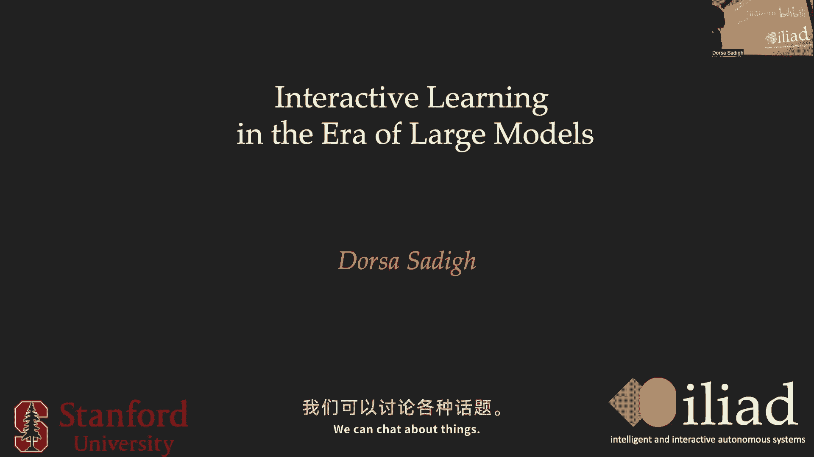

我并不需要浏览所有的幻灯片，好的，所以让我们从像是我们非常感兴趣的一个任务开始，并且在最后激励，我认为在机器人学中一些困难的问题，嗯并且其中一个问题是辅助的问题，所以，所以我们一直在研究这个问题。

即拾取食物，"并考虑将食物转移到一个人的口中"，以一种安全且舒适的方式，"这就是一个非常有趣的机器人问题"，"因为你需要捡起像食物这样可变形的东西"，"然后，你也需要将它转移到一个人身上"。

所以你有了人机交互，"你需要确保那既安全又舒适"，"它始于一种基线政策，类似于视觉服务工作。"，所以它知道你的嘴巴在哪里，"它确实配备了摄像头"，它找出你的嘴巴在哪里。

然后它试图从你的鼠标处移动一个固定的偏移量，它非常像极其不舒服，你看这个视频让你感到悲伤吗，嗯，我们要做的，我们想考虑如何改进，改进一些这些政策，然后问题是，也许我们可以在这里使用一些学习水平对吧。

但也许我们可以尝试使用强化市场，你们这节课学习的东西之一，嗯，结果发现在这里强化学习真的很难，因为首先我没有一个好的信号，对，比如我真的不知道他们是谁，嗯，以及如何不与汽车交互并工作。

而且如果我要在现实中做强化学习，我真的不想撞到人的鼻子，像得到负奖励一样，那样也不会，那不太理想，嗯，所以也存在另一个极端，那就是我们可以收集一些数据，我们可以尝试做模仿学习，对，从那些专家数据中。

我们可以收集一些专家数据，也许我可以从专家数据中找出什么，什么是正确的方法，我说什么参数是什么，将食物转移到口中的这个想法，这是我们一直在 general 上工作的事情，但结果是。

即使你在看数据收集和做模仿学习，收集数据实际上是真的没有那么容易，对吧，当你开始走让我做监督学习的路线，让我从人类那里收集大量的数据，就像人类一样，你太难了，我说好吧，首先。

你需要特定的设备来收集那个数据，你需要有一个vr系统，这里有一个非常好的，就像一个音箱系统那样，是的，还有切尔西，我一直在看那个白色的手动设置，在那里你可以实际上告诉操作东西非常漂亮，但是再次。

你需要像前臂或两个百分点那样，但你仍然需要一个完整的设置，嗯，实际上来收集那个数据，而且那往往在数据收集方面有一些限制，而且当您开始收集那个数据时，有一个问题，如那个数据看起来像人类数据。

往往与脚本数据有很大的不同，如果你看人类数据，嗯，我们通常称之为次优的，我不知道是否次优，是否一定是描述人类数据的正确词，但是，人类，例如，在他们的演示中会有停顿，而且你首先做的就是删除所有停顿。

因为你想要干净的数据，我认为一个好的问题是，人为什么在他们的数据中有停顿，我主张一个原因是当你在看人类自我操作时，并且拿起一个物品，嗯，他们不仅仅是拿起物体，他们是，他们在思考其他事情，他们在想晚餐。

对吧，他们在做其他过程，其他认知过程在他们的头脑中，所以你不能只是限制他们于，像拿起杯子那样，这可能会使数据不如脚本数据那么干净，还有其他类型的偏见或次优性存在于人类数据中，再次再次。

当我们收集人类数据时，我们常常看到这一点，我们试图从那人类数据中学习，所以实际上，演示，它们是数据的好来源，但它们不是我们可以触及的唯一东西，有一段时间我们非常兴奋于演示，我们现在正在研究。

但我们对另一个东西也非常兴奋，也许我们可以从其他数据源中获取，如果正在考虑人类，那就是一般般，他们倾向于随时泄露信息，或者除了专家演示之外，我们还有其他与人类互动的方式，我们可以实际记录下来，利用。

并试图从其中学习，其中一种数据来源是成对比较，所以我的意思是，而不是像我问一个人合作机器人一样，我可以展示两种不同的路径，或者我展示五条不同的路径，我可以实际上问一个人，你更喜欢哪条路径。

或者问一个人提供全面的排名，从那里他们可以学习到某人实际上想要什么，我的意思是我们一直在考虑从成对比较中学习的想法，一段时间以来，但是还有其他数据来源，比如如果你有一个机器人，它确实有一个身体。

当你物理移动它时，你可以实际移动它，关于那个运动的信息非常多，你可以从那个运动中学到很多东西，还有我提到的次优性，和处理次优性的各种方式，所以我相信在这门课上，我们将学习离线强化学习，比如。

这可能是学习次优演示的一种方式，但你也将采取模仿学习类型的方法，并考虑加权方法来处理，从某种程度上来说，采取加权视角，然后对次优演示进行模仿学习，这也是一种完全可行的方法。

所以我们一直在考虑所有这些不同的方法，在谈话的第一部分。

我想谈谈这个，主要关于从成对比较中学习的想法，然后之后，我想转向这个，这是我们现在所处的世界，我们现在生活在大型语言模型的时代，以及事物如何演变，在那个设置中，所以让我开始讨论交互学习，从偏好中学习。

首先，然后之后，我们可以谈论所有的，所以，'从视觉比较中学习人类偏好'意味着什么。

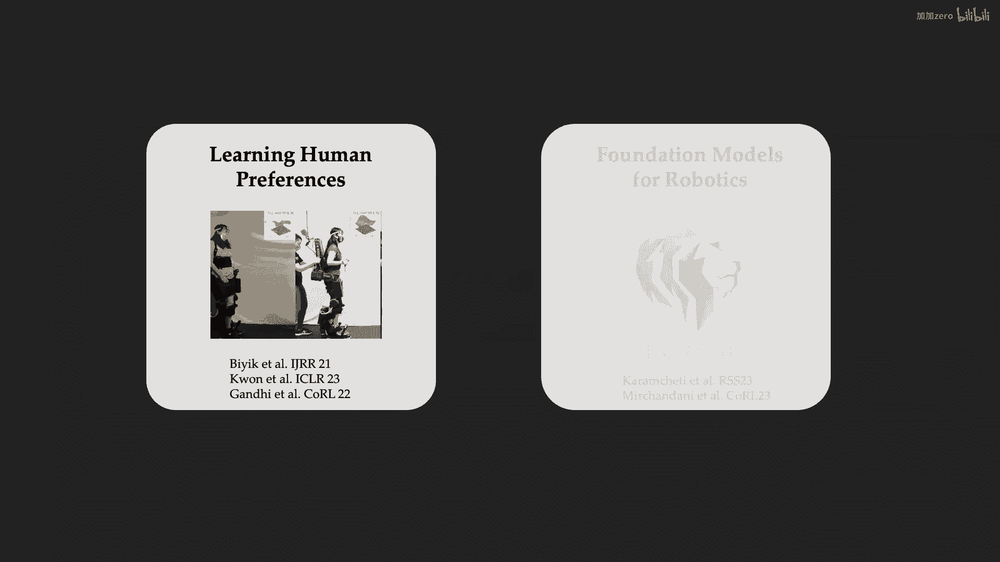

在实践中，当你向人们提问时，嗯，这些类型的问题，嗯，我们可以尝试找出如何在世界中行动，例如，构建一个人的行为模型，但你也可以尝试找出想要机器人实际行动的人的行为，在环境中，例如。

想要自动驾驶汽车的人的行为，或者想要机器人打开抽屉的人的行为，或者，嗯，也许像外骨骼一样，外骨骼应该怎么帮助你走路，或者各种，问题，从这些对等的比较中产生的渴望是什么，所以在这项工作中。

我们正在考虑的是，我们正在考虑奖励函数作为可以从她的比较中学习的表示，它们似乎提供了一个可以学习的良好且紧凑的表示，然后，你可以优化这个，以便运行强化学习，这通常被认为是一种强大的，学习人类模型的方式。

我想指出，奖励函数并不是你唯一可以学习的东西，布拉德诺的团队最近有一项工作，他们在考虑优势函数，而且似乎人类的偏好，如这些对等的比较，实际上是更代表优势函数，而不是奖励函数，嗯，但你可以学习。

让我们说奖励函数，对于这个第一部分，让我们想象你正在尝试学习奖励函数，那么设置就是，嗯，我不太清楚那个，那一个，嗯，所以设置是，我会向一个人展示两个不同的路径，或者n个不同的路径，然后我会问这个人，嗯。

你更喜欢哪个，然后基于这个人告诉我的反应，嗯，他们可能是一个比两个好，或者两个比一个好，那么这将会给我一些关于底层奖励函数的信息，想象一下，如果这个奖励函数是简单的，它不需要是这个简单，但想象一下。

如果奖励函数只是一组非线性特征的线性组合，一些w一些特征集，和一些向量，嗯，向量的w倍，一些特征集，一般般，例如，你可以想象w位于三维空间中，对，w一w二w三，然后，你可以想象你的wy在单位球上。

因为你关心的东西在你的奖励函数中是这些不同特征之间的关系，你可以从这里采样，这个单位球，真正的w在这里，然后，每一个问题，你从人那里提出的每一个查询，你都像是说嘿，或者你喜欢对应于一个分隔超平面。

空间对应于w点乘以v等于零的点，那费用是特征沿轨迹的差异，一比三轨迹，好的，人类告诉我去，我不喜欢a大于b，或者喜欢b大于a，这基本上告诉我超平面的哪一侧被偏好，你喜欢超平面的右侧。

或者你有我更少的一个点，从那个回应中，我能做的一件事是，我可以大致地像，理解到真正的w位于超平面的右侧，相对于超平面的左侧，所以实际上，从一个我问一个人的问题中，我在我搜索空间中基本上可以确定。

我可以几乎像从超平面的错误导致一侧删除所有事物，我不会那样做，因为人类是嘈杂的，所以，实际上，我打算使用人类的博尔茨曼理性模型，假设他们是嘈杂的，所以，我打算稍微重新采样我的点。

并将更高的权重放在w's上，那些在超平面右侧的，因为那个人告诉我像a超过b那样告诉我真正的w是总结，所以那是一个问题，所以，有趣的研究问题，这里是我从一个人那里可以问的一系列有信息、多样的问题序列。

所以，我可以快速地收敛到那个真正的奖励函数，那就是一个非常像主动学习问题的样子，就像我们在机器学习中从很久以前看到的那个主动学习问题一样，就像它 kind of like 出现的，就像。

这个问题非常类似于一种简单的类型，你可能在电影推荐中见过这个，就像如果你看像 Netflix 挑战从，我不知道，二十七或者什么的样子，他们也在考虑一个非常相似的问题，就像我可以问你的是哪两部电影。

我可以问你的喜好，这样我就能快速地找出你的喜好，这就是电影喜好，这是关于你对机器人完成任务应该怎么做的奖励喜好，这可能是一件非常实用的事情，比如我怎么打开抽屉，也可能是一件非常风格化的事情。

比如它可以是关于你对温柔程度的喜好，当你试图的时候，我不打开抽屉，在这里不像我们定义那样，没有什么特别的地方，那个奖励函数实际上代表，所以我说人类偏好时，我的意思是像真正一个奖励函数。

一个功能性的奖励函数，你可以去优化它，然后像得到机器人的策略，然后实际上执行那个脉冲，所以如何解决这个问题，如果这就是像电影推荐一样，那么应该很容易对吧，像我们应该，我们应该只是运行常规的活跃学习方法。

然后那应该就一般会工作，而现在在某种程度上是真的，我认为有一些挑战是值得提到的，那就是我们正在试图将这个想法引入机器人领域，你在看一个连续的空间，它不是像我有一个像电影一样的图书馆，我可以从中提取。

我没有一个可以从中提取轨迹的图书馆，我想要做的事情，这里是我想要主动生成问题的地方，我想要主动合成，比如两个问题，然后问一个人，你更喜欢哪一个，这似乎比仅仅优化信息要复杂一些。

当我仅仅有一个像样的图书馆时，我不知道如何像样地，抽取一个，嗯，我只有这个幻灯片，我简化得太多了，在这里我们的名字是，嗯，在我们小组中，这个论文的主要内容是这个，我将这个论文总结在一张幻灯片中，但是。

基本上这里的想法是我们想要完成的是，您想要找到一组轨迹，比如两条轨迹，也许你想要生成，并且这里的球体对应于这两个轨迹，球体是这两个轨迹特征向量的差异，我想要做的是你喜欢定义信息收集的轨迹。

所以我们要优化的是某种信息论的度量，嗯，然后我们已经探索了许多信息论的度量，你可以使用信息增益，你可以使用确定点过程来测量多样性，或者在这种情况下，我们实际上优化的是从假设空间中移除的体积。

因为问了这个问题之后，因为我问这个问题时它是一个超平面，你将根据那个答案回答它，我将从假设空间中移除关于真值w的某个东西，我想要做的是我喜欢找到一个信息丰富的问题，这将从假设空间中移除大量的体积。

目标只是简单地说，目标和说的意思是最大化那个体积，那个体积是什么，我说你是真的，我们可以得到一个单位球，所以单位球的体积是1，如果你告诉我你是像a超过b，或者如果你告诉我像p超过a，在任何情况下。

都将从假设空间中移除一些体积，基于某些人类更新函数，它是噪声和理性的，在任何情况下，对吧，像预期的我在任何情况下将被移除的体积，我将最小化它，所以最小将被移除的体积。

最大化最小将被移除的体积从假设空间中，好的，所以这就是我们优化的信息度量，我们在这里优化，这是一个模块化的目标，所以你可以使用同样的理论，模块化优化方法通常使用，然后你可以在这里得到一些收敛结果。

因为那样，但是，我还有一件事要提到，再次，我们在机器人设置中，这不是一个无约束优化，在这种情况下，我们正在寻找需要满足动态等条件的机器人，因为我正在生成这些轨迹，我正在从连续空间中合成这些轨迹。

我需要确保那些轨迹满足许多约束，所以再次，我需要在这里真正解决约束优化问题，以便我能够生成下一个最信息丰富的问题我可以被问到，好的，所以这就是我想要在这里深入探讨的数学程度，但是再次像简化到某个程度。

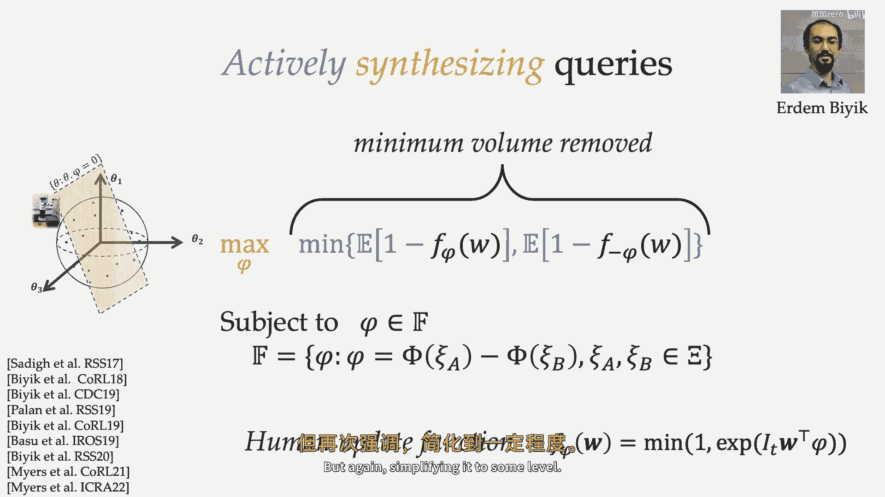

但是如果你在一个非常简单的设置中这样做，你将能够像学习简单的任务一样学习奖励函数，比如有一个驾驶模拟器，在没有任何问题的情况下，你真的不知道做什么，但是在三十个问题之后，你开始学习如何驾驶。

然后你开始学习如何保持前进，最后，在七十个问题之后，我们正在驾驶的汽车是橙色的汽车，它通常学习如何避免碰撞和驾驶，避免像障碍物和这样的东西，我认为这很有趣，因为这是七十个二进制问题，我没有调用任何演示。

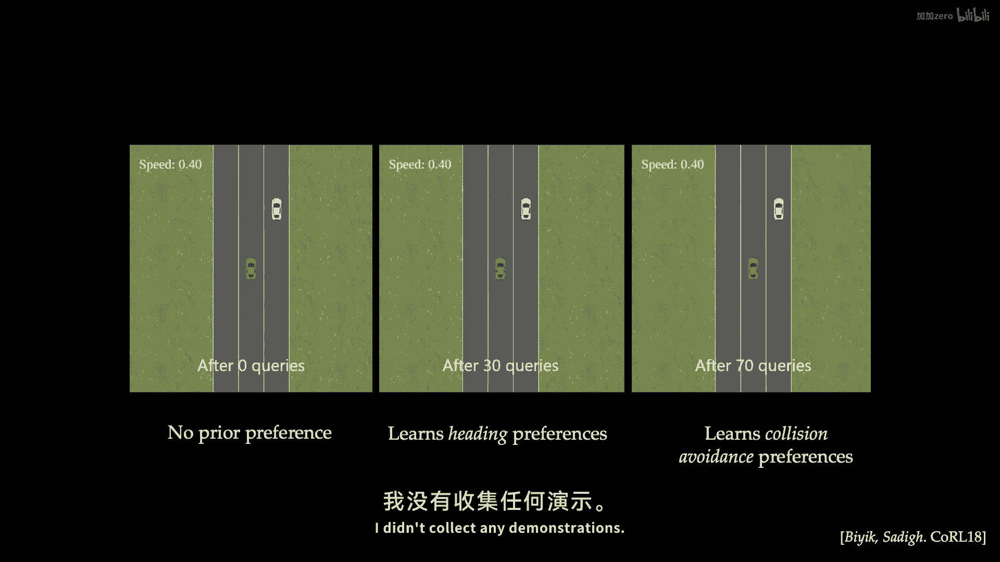

我只问了七十个像二进制对问题的问题，从那里我能够学习一些我难以学习的东西，比如调整自己，嗯，得到这个这个这个，然后开始驾驶这个非常简单的驾驶模拟器。

我在这里要提到的一个点是，这个最简单的形式是，与那个线性奖励，所以这里的常见抱怨是，哦，最后有一个线性奖励，我有一个神经报告，我不会写一个线性奖励函数，这是很公平的，就像在实际中我们会写非线性奖励函数。

新的神经奖励函数，并且在这个工作的扩展中，我们一直在考虑这个主动学习的想法，这将失去大量的理论与数学，但你仍然可以优化最不确定的，不确定的问题集，并仍然尝试学习奖励函数，我实际上看过的一个设置是。

这是那种你穿着外骨骼的设置，你在尝试学习人类偏好，比如当他们穿着这些外骨骼时，行走偏好，这是与加州理工学院合作的，通常人们穿着外骨骼时是在康复中尝试的，他们正在尝试重新学习如何走路。

不同的人有不同的偏好，所以你想做的是，你想要询问人们来确定那些偏好，这样你可以快速地收敛，并得到一种帮助这个人的感觉，嗯，在这些设置中行走，最后一个我想提到的点是，再次。

就像每次我对机器学习群体谈论主动学习时一样，像往常一样，存在一些怀疑，而且这种怀疑是合理的，因为如果你看主动学习，任何主动学习论文，它都有两种关税，看起来像这样，嗯，一种正好像另一种是随机采样。

它们看起来相似，最终会收敛，做主动学习是否值得，我认为这是一个非常公平的问题，做主动学习是否值得，我会争辩在许多机器学习设置中，实际上，做主动学习并不值得，随机采样更简单，而且就足够了，你需要计算。

你有磁铁来实际运行随机样本，但我在这个机器人中看不到，假设这两个曲线之间的差异实际上很重要，这个差异将是坐在系统中的差异，比如三小时对半小时，如果你在运行用户，如果你在与真正的人交互。

使用真实的机器人系统，三小时对半小时的差异很重要，所以，所以，我确实认为，在机器人和人类交互的空间中，主动学习有相当大的潜力，因为那时开始重要，像时间复杂度和样本复杂度开始比许多机器学习设置更重要。

好的，所以嗯，所以我们讨论了这个想法，即学习人类偏好并提问，来自单个人类的超级智慧比较问题，总的来说，我认为这是一个不错的想法，你可以在机器人中使用它，但一个有趣的事情是再次，它不仅适用于机器人。

它也适用于其他领域，对，它不需要在机器人中，所以我们决定在另一个领域使用类似的想法，在谈判领域，所以这是谈判领域，我们有一个物品，所以我们有一个书，两顶帽子，两堵墙，一堆共享物品。

并且开始的是我们有爱丽丝和鲍勃，在这里，爱丽丝和鲍勃正在尝试就共享物品进行谈判，好的，爱丽丝和鲍勃各自有他们的效用，所以他们可以看到自己的效用，嗯，然后这里的想法是鲍勃可以来，我们有一堆像提议的行动项。

或者像接受提议，或者像拒绝提议等等，在这里，鲍勃说，基于我的效用，我提出的是，然后拿零本书，两顶帽子和两个小球，问题是爱丽丝应该怎么做，我才能构建一个AI代理，我能为爱丽丝构建一个AI代理吗。

这样爱丽丝就可以实际与Bob谈判，我应该做什么，有什么建议，那是我肯定在要求的，我开火，所以你在谈论，这个政策是正确的，所以你在说，好的，对高音来说的好政策，立即要书，但那就是爱丽丝。

你是如何想出这个政策的，你们在这个课堂上做些什么，并试图推断出一个奖励函数，然后对那个奖励函数做些什么，你好，我正确吗，是的，所以你能描述一下你说话的奖励函数吗，尝试推断奖励函数。

但是爱丽丝知道她的回报函数，就在这里，爱丽丝有访问她的利益，就像她的回报函数一样，如果我有访问我的回报函数，我能优化，我可以运行aura，就像我可以做强化学习一样，但是，我想，爱丽丝并没有访问。

所以我建议第三种，嗯，所以，你可以稍微探索一下，然后，像采取行动，尝试探索一样，像bob一样，bob实际上是如何回应的，你可以采取基于模型的方法，尝试像，实际上学习bob的奖励函数，并使用它。

你也可以稍微像，采取更基于模型的方法，并且只是像提出一堆事情，你有，你知道你自己的奖励函数，但是，像演讲反应，看看bob如何回应，然后基于那个决定做什么，这就像是非常好的，就在这里。

所以这就是一种非常好的做事方式，所以你可以做强化学习，那样那就是你要玩的游戏，你也可以解决这个游戏，就像你可以采取游戏论的方法，你知道你的效用，你可以做在线强化学习，强化学习的问题。

并且强化学习的问题是如果你，如果在这个集合中做强化学习，你代理将是有点过于激进的，嗯，你的alice代理将坚持，我正在得到相同的东西，不断地纠缠和纠缠，并且有点像激进的，在这种公平的核心中。

这就是强化学习要激进的原因，因为在奖励函数中，我没有说，当你在做这个的时候，也许试试礼貌一些，或者试试公平一些，或者不要太激进，这不听起来很人性化，所以，有很多事情，有很多目标。

我从未说过作为奖励函数的一部分，也没有理由让atlas优化这个，还有另一个极端，我可以收集数据集，我可以只做监督学习，我可以做模仿学习，实际上，像这样，这种像jane的来自名为'交易或否交易'的论文。

论文中有一个数据集，你可以实际上在这个数据集上训练，结果，对于这个原因，这个数据集非常棒，所以，监督学习代理在另一个极端，它非常同意，所以，你的房子最终只会同意bob说什么，这也不是非常人性化。

在某种意义上，这就是价值对齐的问题，这通常是，像奖励设计问题，我真的没有访问真正的奖励函数，这个效用并没有真正捕获我们实际上追求的奖励函数，一种获取它的方法是警告，"所以，就是我之前提到的那个算法"。

"你可以基本应用这个算法，尝试识别新的情境。"，"并从这些新颖的场景中，你可以问一个专家像是如何在这个场景中行动的。"，"并尝试找出这个强化学习代理的更好版本"。

"那就是更加了解你实际上在追求的一些这些属性"，"所以那样做是完全可以的"，"实际上，他跟我说"，嗯，"我在二零二一年CML大会上是如何做到的"，"他们 kind of 喜欢"。

如果有这种针对特定数据的指控方法，你主动提问，最后你会得到一个比强化学习更好的谈判代理，比强化学习更好，再加上尝试捕获人类偏好的增量学习，但是有趣的是，你可以做其他事情而不是问一个人。

而不是像从单个人那里做这种主动学习，嗯，你还可以做的另一件事是，你可以从技术上或一个大型语言模型，并且只问一个大型语言模型，它怎么想，然后 kind of 对待大型语言模型作为这个任务的代理奖励函数。

在我们考虑这个问题的时候，我们对这个想法非常担心，因为它听起来有点疯狂，你在使用 lm 作为奖励函数，但实际上从那以后已经有许多作品在使用 lms 和 vlms，作为奖励函数或成功检测器。

这也是在这个谈判游戏中试图做同样的事情的一部分，就像在这场谈判游戏中一样，因为它是文本空间游戏，我有很多关于像互联网上这样的信息，关于谈判的，和关于文本和语义的，并且由于这一点。

我有一个有趣的事情可以做，我可以简单地问一个lm，这是一场谈判吗，对还是不对，对吗，我不需要问llm为我写下奖励函数，但我可以问llm评估，这是否可以，还是不可以，这是否礼貌，这是否公平。

我们实际上这样做的方式是一种创造性的提示，我们说，Alice和Bob在谈判，假设我们不分一套书，帽子和两者，然后我们要做的就是，我们将给它一个例子，所以所以我们有outs参与，有点像谈判。

也许你在考虑灵活性这里说好吧，这是一次灵活的谈判，然后之后我们有政策和初始政策，随机政策，我们将推出那个随机政策，然后我们将把那个政策与其他代理一起玩，然后你又会问好吧，这政策灵活吗，在去年的帖子中。

Alice在哪方面表现出了灵活性，这就是我们的提示看起来的样子，所以，所以然后，你会问一个llm，你认为什么，嗯，并且从lm的输出中，我们可以得到对数概率，或者我们简单地可以得到是，不是答案，但是。

那个输出是关于奖励函数的信号，对，就像它不是在为我写一个奖励函数，但它是某种信号，它实际上可以使用，我可以去使用它，并根据那个信号进一步训练我的代理，一旦我接受那个信号。

我可以实际上使用那个信号来训练一个强化学习代理，然后继续训练那个，生成一个新的策略，并去改变这个提示中的粉色部分，然后叫一个l one again，去通过那个 swoop，所以，从某种意义上说。

这与我们的hf相反，因为我通过调用llm来训练代理，在强化学习的训练循环中，通过这样做我正在获取像信号一样的东西，我正在获取类似于奖励正则化器或完整的奖励函数的东西，你可以以不同的方式使用它。

你可以用它来塑造你的q函数，或者可以直接用它来塑造报告函数，但在任何情况下，它实际上就像作为一个奖励一样行动，塑造策略，以使你的政策实际上做同样的事情，结果发现，在这种谈判设置中，实际上。

这种策略效果非常好，所以我们考虑了如灵活性等许多属性，被欺负，具有竞争力，固执等属性，在所有这些属性中，这些都是我们可以接触到真实奖励的属性，嗯，我们可以做的事情是，实际上。

我们可以证明使用大型语言模型可以作为一个相当好的代理，它实际上在所有设置中都与真实奖励相匹配，就像这些，这些不同设置，并且它超过了监督学习的基线，说实话，这个基线并不公平。

因为像要给你的监督学习代理多少数据，但我认为更重要的一点是，它实际上非常接近真实奖励，而且在我们没有访问真实奖励设置的情况下，我们可以进行用户研究，我们可以问用户，在那个设置中。

像是这个使用nlm作为代理奖励的代理，是否符合你的期望，结果，一般来说，人们喜欢，嗯，我认为它确实符合他们实际上问的风格。

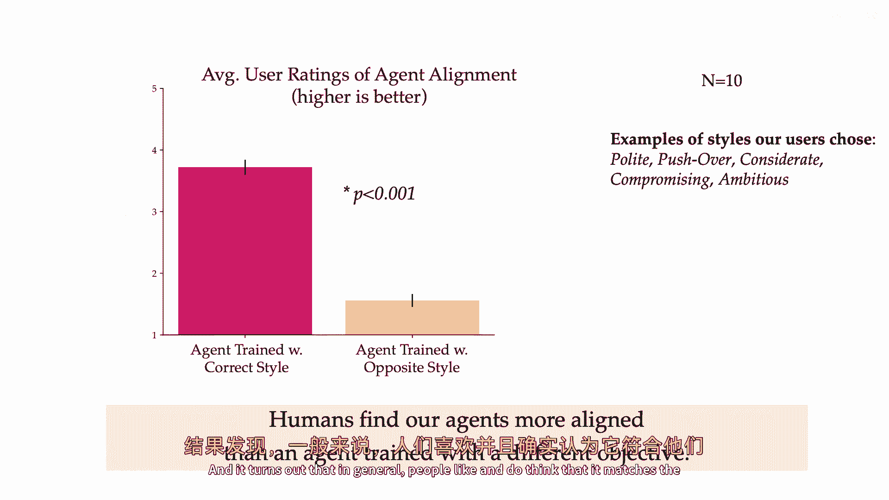

好的，所以那都是很棒的，那是一个谈判设置，人们预期LLM在谈判和评估谈判方面表现良好，这对机器人意味着什么，像像，这是否告诉我，哦，我可以使用LM来机器人吗，当我们考虑这一点时，听起来有些可疑。

我认为一个重要的部分是接地问题，对，有一个问题，是的，抱歉打断他们，但'lom'本身意味着什么，嗯，它涉及到预先建模的油，不是的，是的，实际上我们，嗯，这是一次，我称之为我最喜欢的。

所以我们实际上尝试了像gpt j和gpt two这样的模型，以及早期的一些模型，也，它们工作得相当好，好的，在这些设置中，是的，基本上确保没有像巨大的混淆因素一样，是的，那个内置的，是的，是的。

我假设不是，但是，但是确实他们现在和你一样使用，更像调音的瓶子，然后，你对这里这个化合物有点担心，嗯，是的，所以，回到机器人设置中，有一个问题像，在机器人设置中，是否可以像样地将想法转移，然后。

有许多后续工作，这项工作，实际上，谷歌的人有一项工作，嗯，谷歌的团队，我们在考虑一个非常相似的想法，嗯，关于使用大型语言模型作为奖励的，设计师和想法是，你可以从，在这种情况下，就像你从语言指令开始。

使用非常高级别的语言指令，这不是关于公平性或可变性，或这些谈判的特性，它真的就是从，像非常高级的、语义上有意义的语言开始，就像下午晚些时候，让机器人面向日落，然后你可以从这开始。

让你的大型语言模型输出奖励函数的权重，然后你可以去优化那个奖励，所以在这个工作中，他们并没有做RL，他们实际上在做与那个奖励并行的模型预测控制，但事实证明，随着问题的一些调整，这在某种程度上是重要的。

但与一些参数调整有关，实际上，你可以让机器人做这些类型的行为，或者让它坐下像狗一样，抬起前腿，我最喜欢的例子是做月球漫步，你可以让机器人做月球漫步，并且你可以实际上生成对应于做月球漫步的权重。

我认为这实际上真的很了不起，嗯，然后，是的，你可以看很多其他任务在模拟中，嗯，但我在这里要提到的一点是再次定位，对，像很多这些实际上都是在模拟中，具有对信息状态的真实访问权，例如，四足机器人的例子。

它并没有与世界互动，它只是在移动它的顶部，啊，所以，这就像，它变得简单得多，但是，当涉及到实际上进行正确的状态估计并与世界交互时，实际上使用这些模型来输出正确的奖励函数变得困难得多。

或者使用像视觉语言模型这样的正确奖励函数，我认为，甚至在过去，像几个月前，已经有很多工作在使用，他们使用vlms作为成功检测器的奖励函数，但在我们的一般经验中，得到可靠的结果并不容易。

就像这些模型一样，它们在改进，所以这很令人兴奋，但总的来说像，我认为目前它还有些疑问，从他们那里可以得到的结果，所以总的来说，我想总结一些关键点在这里，所以，我之前谈论的是这个学习人类偏好的想法。

类似于奖励函数，一种实现这种目标的方式可能是，也许还有一种传统的实现方式，那就是通过主动从人类那里提问，但这是一种获取有信息性人类反馈的方式，嗯，而且，除了那个之外，像。

这并不是你实际上可以像那样获取大型语言模型知识的唯一方式，尝试利用这些知识，嗯，并且尝试理解人类的偏好，但实际上更喜欢让llm或vlm给你，给你一些反馈和信息，酷，所以，我真的在考虑跳过一段说实话。

所以我要这样做，嗯，让我这样做，因为我认为这可能更容易。

我的意思是，快速跳过这段，就像回到上面一样，希望那没搞砸，Zoom，或者你认为，哦，我可以重置屏幕共享，是的，嗯，当然屏幕，当然，这就好了，好的，没问题，所以我们讨论了这个关于学习人类偏好的想法。

而且这很棒，对，这就像我们可以触及一些除了演示之外的其他数据来源，对，我们可以，是的，是吗，哦，是演示者吗，你，哦。

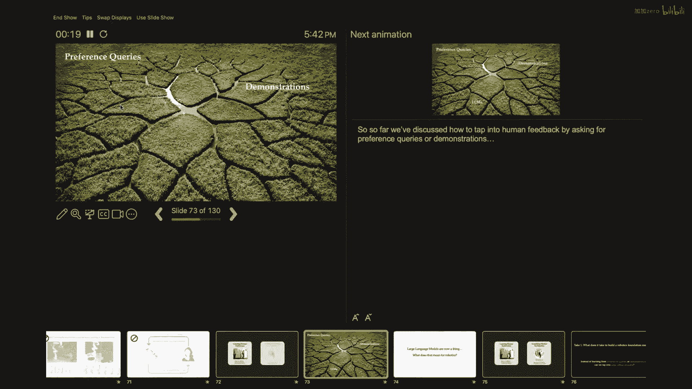

停止分享，嗯，有共享屏幕，这是前两个吗，这是前两个，是的，当然，它是好的吗？完美，好的，没问题，所以，嗯，这就有了，是的，所以，关于偏好有一些讨论，你知道我们可以触及演示，但我认为另一个有趣的数据来源。

我们在最近的一节中开始看到一些，那就是我们可以触及大型预训练模型，你可以触及lms，并且这可能也是一个有用的信息来源，关于人们想要什么，我认为可能像，如果你看过去的几年，像像。

我认为我们都开始意识到大型语言模型现在是一个事情，并且我想提出一个问题，这对机器人意味着什么，对，所以，所以，所以像，我们如何继续前进，知道嗯，我认为在实际操作中，像我感觉像，有两个主要的来源。

然后我想谈谈这两个来源，第一个来源是这个关于构建一种类似于大型语言模型的机器人的宏大愿景，我想我记得当gpt-3出来时，我们都在思考，像，我们应该如何使用gpt-3。

并且有一些立即在机器人中使用gpt-3的方法，像，就像gpt-3出来时，我们正在思考，像，我们应该如何使用gpt-3，像，有哪些正确的使用gpt-3的方法，并且有一些立即在机器人中使用gpt-3的方法。

像，作为是，但是那似乎并不兴奋，像那个令人兴奋的东西就像，在机器人学中，那个的类比是什么，我认为那是一个非常宏伟的愿景，那是一个值得努力追求的美好事物，嗯，在赌注下，想法是，而不是通过偏好查询或演示。

问题是，我们是否可以触及大量的离线数据集，但是，这个承诺的坏处是，有大量的离线数据集在外面，从这些数据集中，我们可以尝试训练一个模型，或者像预先训练一个模型，实际上，像触及那个信息。

并能够在下游设置中使用它。

那将非常美妙，嗯，如果你考虑像机器人基础模型，有关于，像，我们应该如何看待它，所以，如果你认为你将有一个基础模型论文，嗯，想法是你有许多不同的数据来源，也许你有一些机器人交互数据，你有人类视频。

自然语言模拟，我认为一个有趣的问题是，如果你有那个数据，那是一个大，但如果我们有那个数据，你预训练像什么，我们应该从数据中得到什么样的正确表示，我适应看起来像什么，适应性像什么。

我怎么能用那个模型进行下游任务，对，像如果你看像ln，对，你可以用它进行许多不同的下游任务，下游任务在语言中，有一个问题像，我们有许多不同的下游任务在机器人学中吗，像，嗯，或者是模仿，像，仅仅是控制。

我认为在机器人学中有许多像有趣的下游任务，我们应该思考我们如何使用这些模型在下游设置中，以及如何我们如何能思考关于精细调整，所以我们开始思考这个问题。

并且我们开始真正地从学习视觉表示的角度来看待这个问题，部分是因为我们没有其他东西，最初像我们只有像人类机器人视频，在人类视频中最初是为了触及，并且有许多努力正在尝试像，收集大量的机器人数据。

并在机器人数据上真正训练一个模型，但现在让我们说，你可能只有人类视频，你有，让我们说YouTube视频，存在一个问题，我能否学习到有用的视觉表示，如果你考虑视觉表示学习，就像目前有一种两种极端。

如果你看视野领域和我们从视野领域得到的，这两种就像是光谱的两端，像质量自编码这样的东西，你把一张图片，把它遮蔽起来，并试图复制质量图片，这真的很棒因为它给你种这些局部空间特征，如果你想做。

我不知道你是否想要抓住一个物体，这真的很好，因为它实际上像是给你提供了对象的所有细节，你可以实际上希望用那个模型来理解，它给你提供了你想要的东西的实际语法，但是。

像标志编码这样的东西的问题在于它们破坏了所有的语义，假设你想要拿起一罐，我不知道，橙汁还是一罐牛奶，两者都无聊，像从液体罐中，你应该像执行同样的任务，但是你实际上无法真正像那样喜欢这种相似性。

因为像素看起来不同，然后像是你有另一个极端，与像clip或我们的三端这样的模型，我们真正试图捕捉的意义，你使用对比性目标来捕捉意义，你试图匹配语言与图像，然后这些真的很好。

因为它们 kind of 给我们提供了通用的概念，但是对比性目标实际上像摧毁了所有的局部和空间特征，所以真的很难期待，像剪切表示一样喜欢，去做好的精细抓取，像他们实际上无法喜欢捕捉到的那样。

所以我们真正追求的是，我们能否同时发挥两种角色的最佳效果，我们能否尝试学习一种视觉表示，实际上可以喜欢，尝试连接语法和语义，我们想的主意是，也许我们可以使用语言作为语法和语义之间的桥梁，所以。

而不是只是简单地做没有语言的重建，或者，而不是仅仅生成语言来 caption，那么我们可以做，我们可以做的事情是，我们可以做基于数据的重建，你可以从很好的开始，构建一个坚实的基础。

但是我们可以基于语言进行条件，这样我们就不会失去语义，这就是这个想法背后的关键，嗯，这个，这个模型，就是我们在人类视频中的训练模型，而且除了影响和语义之外，我们还需要捕捉像上下文和语用学这样的东西。

在某种程度上，就像如果你看机器人任务，有很多交互和动态交互在进行，而且我们需要捕捉这些动态交互，是的，所以有关于如何捕捉动态和语用学的问题，除了语法系统，这些就像是构建被称为伏尔顿的模型的三个关键因素。

嗯，这是一种基于语言的驱动表示学习模型，这是与许多人的合作，卡拉姆奇说，你是这个努力的主要人，然后电子模型的想法始于吉祥物的编码，就像，做吉祥物编码真的很棒，就像，这给了我们所有这些细节。

就是你实际上在问的，开始问编码骨架的什么，然后，除了那个，尝试做像语言字幕这样的东西，所以所以我们可以有，让我们假设一个关于用柱子拉车的图片，在那上面之前添加语言描述，所以所以你有拉车作为描述。

并且那试图获取语法和语义，但要为了获取那个 pragmatics 那额外的部分，想法是您也可以生成语言，所以如果你做语言生成，那试图像，理解任务真正的含义，它是否是使用剥皮器拉车，然后。

如果你进行多帧条件化，就像你在做两帧条件化，这也会获取一些动态信息，所以，将这些部分结合起来，你可以训练一个在大规模数据上训练的模型，比如人类视频，并且这个模型会比这个领域的通常嫌疑人更接地气。

那么你在这个领域中可能会有的，然后，你可以实际上在这个模型上进行微调，以解决多个下游任务，所以我认为我们有一个评估，所以你有五个不同的任务，嗯，我只是在这里展示一些。

人们一天结束时通常关心的是控制和模仿学习，在这个情况下，你看到的是语言条件，模仿学习，这些是你实际上追求的任务，嗯，这里有一个机器人做任务，嗯，性能低，这就是你为什么看不到它的视频。

那是性能在所有地方都低吗，像所有这些模型一样，嗯但基本上重新训练或取用这种表示，这是一种视觉表示，取这种表示并使用二十次演示进行微调，你最终会得到一个慢速试炼模型，橙色中显示的不同版本。

像十outperform，像r three m或像mask这样的东西，视觉预训练，而且我想再次强调，这是因为它更接地气，它试图像捕捉语义和语用学一样捕捉事物，比像，像现有的模型。

我认为我们与世界模型获得的另一个有趣结果，是我发现非常兴奋的，如果你给它一个视频，如果你给它像一个人的视频，让我们说在开场白上，并且你只看像什么表示输出，你可以像在法国做零-shot意图一样做。

但是模型实际上非常对齐，就像，如果你看到这种表示，在理解水龙头被打开时，它非常对齐，所以实际上，它像是能够，从这个视频中理解这个人的意图，像零-shot没有任何任何微调，我认为这非常有趣。

而且更有趣的是，如果你给它一个机器人视频，即使它没有见过像这样的机器人，只是训练于人类视频，它能够做类似的事情，它能够做零-shot，机器人视频的意图推断，没有任何微调或类似的形式。

我认为这非常令人兴奋，因为再次，这表明模型在追求我们实际想要的方面有很多基础，嗯，所以这就是开源的，你可以使用pip安装electron robotics，你记得你在调用resnet。

你可以调用ultron，嗯，请使用它，让我们知道它如何进行，嗯，但我认为，就像这个部分的主要观点是，当我们在训练这些大型模型时，我们正在训练这里的东西是一个视觉表示。

"但当我们试图通过训练视觉表示来接入大型离线数据集时"，我认为我们在那个预训练目标上应该更加谨慎，"我们可以尝试去塑造一种类似于预训练目标的形状"，因此，对我们感兴趣的下游机器人测试来说。

这实际上是有用的，"在这个情况下，我们在考虑语言和多帧条件化。"，"确实，语法差异是带来实质性区别的关键"，"语义和任务动态的结合"，"以便这些表示形式对机器人有用"，基于那个想法，有一些进一步的发展。

我提到了，我们没有机器人数据，就像我们查看乌尔特隆在人类视频中的原因一样，这是我们没有的机器人数据，我对所有这些在不同实验室进行的不同努力都非常兴奋，在收集大规模离线数据方面，嗯，数据集。

你可以实际训练这些的机器人数据集，这些这些预训练模型，所以所以这就是rtx努力，嗯，那个，那个谢尔盖和伯克利的人，还有谷歌的人，而且实验室的数量已经一直在一定程度上贡献。

然后这里的想法实际上是试图在化身模型上训练，在具有许多不同化身的机器人上训练，许多不同的技能，许多不同的数据集，并且有一个单一的模型，实际上能够获取所有这些不同种类的机器人数据。

然后作为基础模型发挥作用，然后有一个关于如何处理的问题，"它应该怎样做才对"，"就像我在乌尔托恩中展示的那样"，"这是一次视觉呈现"，"那不是一个行动"，"但是，这个rtx模型是正确的"。

"就像你可以直接输出动作一样"，"这可能是一种愿景语言行动模型"，"我认为这是一个有趣的问题，从某种程度上来说"，我们想要达到哪种抽象级别？"因为我们正在训练"，这些模型应该像'行动'一样进行预训练。

正确的表示是视觉表示。

正确的表示，以及我们应该如何做到，就像是在这个基础上构建，还有许多努力，这是又一次从r到b的努力，这是跨多个实验室的合作，所以ch的实验室，实验室的数量，除了斯坦福和伯克利之外，我们在哪里试图收集，嗯。

数据关于，就像是在同一个平台上，嗯，但是像真的很多样化的数据，嗯，在野外，在野外，意味着在宿舍，这是其中一个悲伤的方面，它是，我认为在数据集中非常普遍，但实际上你可以得到机器人并操作它们。

就像在野外一样，将它们添加到野外，然后尝试训练一个模型在这种类型的数据上，这种数据正在被收集，我认为这也是非常令人兴奋的，当我们考虑训练这些模型时，好的，这是我首先想说的，这有点像，再次。

一个非常活跃的研究领域，每个人都对构建这些基础模型感兴趣，我没有五分钟，但在最后五分钟里，我还是想简要谈谈第二个痒点，第二个观点最初让我非常怀疑，让我告诉你，第二个观点是，第二个观点是可以的。

就像基础模型存在，我不想去构建一个听起来非常困难的机器人基础模型，校友和vlms存在，有一个问题，我能否用它们创造性地用于机器人，所以，想法是而不是触及偏好查询和演示，而不是触及大型离线数据集。

像发现的机器人基础模型，尝试做，我能否触及大型语言模型和视觉语言模型的现有知识，我开始对这个不兴奋的原因是，最初是'哦，好吧'，我能用LLM做些什么？最初的努力包括使用大型语言模型作为任务栏。

但如果你看像谷歌这样的作品，他们可以像，最初我像，他们能做什么？他们可以尝试说，这是谷歌的人们的工作，它试图做什么，是，它试图使用大型语言模型来生成任务计划，和一些其他事情，但像撒旦的关键部分是。

它正在生成任务线，像自己和许多人的第一反应是，那是机器人的问题吗？我们是否真的，遭受任务规划的困扰，我不认为那是，我不认为那是这种情况，但我不认为那是说那个的意思，然后，随着时间的推移。

我对使用LLM的想法越来越不怀疑，LLMs，我认为思考大型语言模型和视觉语言模型，似乎打开了我们思考机器人的新方式，我们不会之前想过，例如，如果你看代码如政策，在哪里你使用大型语言模型生成机器人代码。

但我没把它当作，两年前我们扩大机器人学习的方法，但现在我开始怀疑那是否是正确的方法，我认为这个阶段。

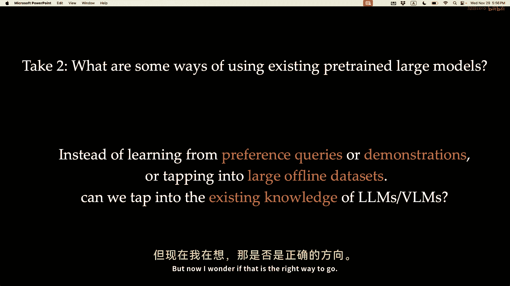

为了使用大型模型进行各种下游任务，似乎打开了许多有趣的下游事情我们可以实际探索，然后，那就是过去一年中我们一直在考虑的事情，我不会深入讨论其中的任何一项，也许其中一项就像这样，只是简短地。

但只是为了指出一些，我们讨论了奖励设计，已经使用LLMs作为奖励设计师，像使用LLMs作为奖励设计师，我认为这是一个非常有趣现有LLMs和BM的使用方式。

你也可以对这些大型语言模型和视觉语言模型进行微调，以更符合你的目标，所以，我们正在考虑的一些工作就像，看如何微调VLLMs以更物理地定位，或更空间地定位，这是一种使他们在奖励函数方面更对齐的方式。

你实际上在追求的，你可以用它们来做常识推理，所以，例如，你可以问DLM，所以，如果，你可以问一个DLM。

我应该清理右边的乐高吗，还是我应该清理左边的乐高，例如，如果你有这样的场景，人类立即知道你不应该清理桌子，我花了很多时间像这样建造乐高，是的，嗯，但人类也会知道清理这张桌子是可以的，至于为什么，是的。

这是价值算法面临的一个问题，人们感兴趣的，是的，比如这个常见的谚语，如何让机器人或AI代理具有解决这个问题的知识，现在，这就是语言模型和LMS，如果你拍下这两张照片，并像描述一样解释，一个大型语言模型。

它知道答案，它理解你应该不扔掉这种乐高，这很有趣。

我们现在可以做很多常识推理和社会推理，仅仅通过触及大型语言模型和视觉语言模型的知识，嗯，我们还可以查看其他一些东西，如语义操纵，如引用对象，如部分，如鞋带或跟，再次，我可以。

我可以使用LMS进行语义操纵，预训练，一个非常简单的基于关键点的模型，实际上可以响应那个，我们可以考虑教人类，这是我们之前讨论过的，嗯，但与你们一样，关于使用黄色乐托的想法，实际上教人类，当您看练习时。

提供纠正性反馈，然后，可能是我想最后花费的时间，像两页，它超越了一些这些应用，使用LMS作为模式识别机器，所以我之前所说的所有应用都真正地利用了，大型语言模型和视觉语言模型，因为它们有很多上下文。

它们有丰富的上下文，它们有互联网规模的数据访问，这允许我们访问互联网规模的数据，这很棒，对吧。

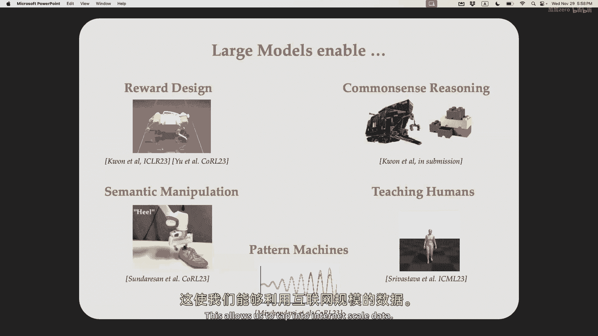

例如，我们可以，像这样使用，我们可以利用互联网规模的数据，我们可以利用社会推理，语义推理，常识推理，但我们最近有一个有趣的观察，甚至可能超越这一点，但使用lms和bms实际上允许我们超越仅语义和上下文。

特别是这些模型可以简单地作为真的很好的模式机器。

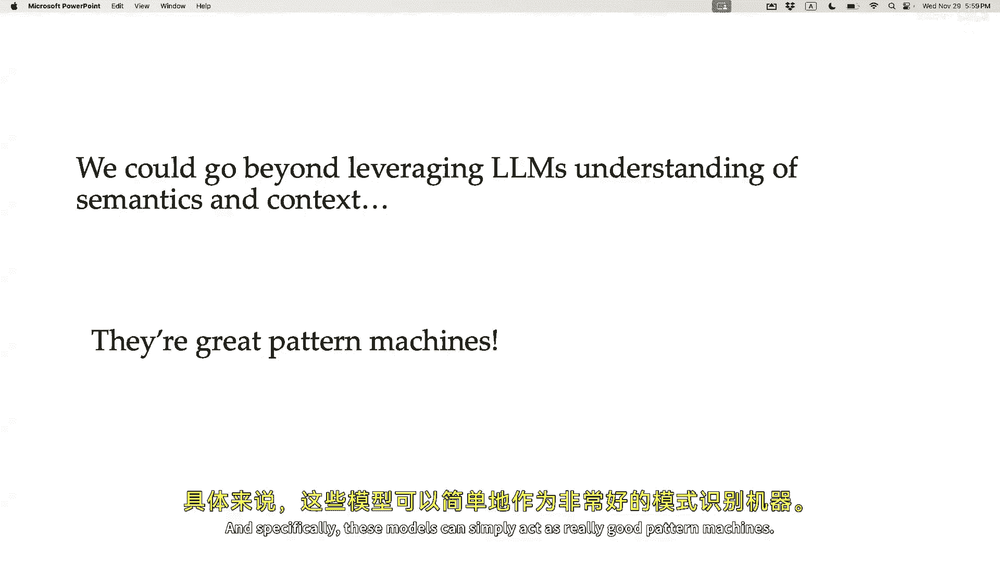

它们可以像只是找到非常抽象的模式，甚至不是甚至不像语义有意义的模式。

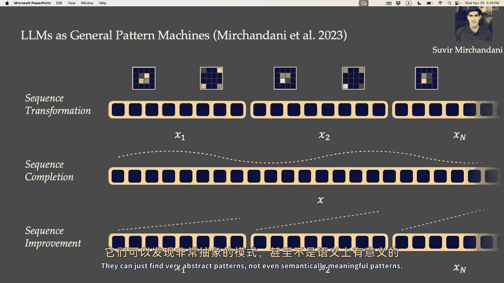

嗯，这与谷歌的同事们的合作再次有关，他们一直在领导这个，嗯，这个工作可以，但想法是，你知道，我只是要展示三个例子，而且那个演讲中嗯，一个例子是，你可以做序列变换，所以你可以取一张图片，这是一张图片。

如果你有这个图片，然后你有一张有输出的图片对吧，但是，红色的杯子放在绿色的上面，嗯，模板，你将有一个测试示例，就像你知道输出应该是什么，输出应该是红色杯应该放在绿色的绿色绿色地方，这就是我们在问的。

我有访问一个大型语言模型的权限，不是第二个视觉语言模型，我能做的，我可以一次将其离散化，我只我只是可以将其转换为数字，我可以将这些数字放入大型语言模型的上下文中，输入输出输入，然后。

llm实际上将要输出一组数字，我做的就是这些，如果我将其投影回高分辨率，最终就变成了我正在寻找的东西，我并不提议为这项任务使用llm，或使用llm来解决视觉问题，但实际上。

我能得到这种类型的模式非常有趣，再次，就像绝对一样，标记不变，就像标记没有任何意义，但是因为有模式，它能够捕捉到这些模式，有点像预测从那个模式中接下来会发生什么，它可以继续这些模式，你只需要给它。

比如x y位置的分配率，并且它可以继续那个x y位置，所以我们可以试试看，今晚试试看，就像给纹身，就像任何正弦波的文件位置，如果你想，实际上就像是能够喜欢。

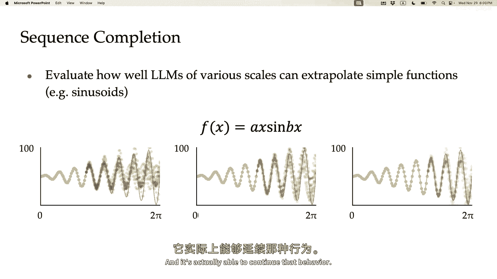

继续这种行为，这可能对于像我不知道的事情有用，机器人学，数据收集，所以这可能有些牵强，但我认为很有趣，你可以这样做，你可以给机器人的终点效果或位置，X y z 控制那个末端执行器。

这就是我在lm上下文中放入的东西，你可以给那种运动，对，这就是我要放入上下文的东西，X y z 汽油，X y z 巡逻等等，然后机器人能够继续这样做，机器人实际上能够发出控制，实际上继续这种行为。

然后我认为这很酷。

然后我认为最有趣的是，它可以做一些级别的优化，所以例如，如果你拿起倒立摆问题，然后再次给它，像我们倒立的控制方式，标题与奖励相匹配，它能够稳定那个，你可能会说哦，但摆锤存在于互联网上。

所以它可能具有许多真实的知识，但是，但我们输入给那个东西的只是像，末端执行器的坐标和奖励，在这个例子中，我正在看一个机器人试图达到它，我根据奖励来排序输入的内容，所以我会放奖励、轨迹奖励和轨迹。

我整理这些，机器人实际上能够继续模式并输出高奖励轨迹，这也是很酷的，嗯，所以然后这就是像，类似于点击训练对吧，你可以实际上用机器人进行点击训练，假设你提供了点击器，当它越来越接近物体时。

那就是给它高奖励的东西，这就是你在lm上下文中放入的东西，最终它能够像，到达物体对吧，所以让我就像结束这里，所以所以所以这种最后部分的关键要点是，像lm和dlms，它们是很棒的。

它们可以说是我们对待它的两种方式，对于机器人学，我想有一个宏大的愿景，试图构建类似的东西，那太好了，数据缺失，应该考虑的预训练数据是什么，仍然是一个我们应该思考的问题，但是还有第二个观点。

可能是你可以利用现有的lms和dlms，因为它们有很多上下文，它们可以做社会推理，它们可以做语义操纵，它们可以教人类，它们可以利用互联网规模的数据，那真是太棒了，甚至超过那个，它们可以充当模式机器。

它们可以找到模式，再次令人惊讶，我并不建议使用它们用于视觉或控制，或任何其他事情，但这令人惊讶，这可能告诉我们应该怎么做，也许继续，我不知道，好吧，在这些模型上调整参数。

或我们未来可能实际使用的一些应用是什么，嗯，当你在考虑这些大规模的预训练模型时，对于机器人学的应用，我没有谈论喂养，嗯，那是我们正在考虑的事情，我就以这些视频结束吧，我们正在积极考虑这个问题。

我们正在使用一些基于学习的模型，试图，嗯。

挑选各种类型的食品项，比如意大利面，实际上，它们使用i来决定，像你在这说的，所以这像，像选择什么类型的维他命食品，你有像肉丸和意大利面，目标就是获取任何适合面条的门，然后你能喂给人们，哦。

然后我们在喂给人们，嗯，所以喂食人们，嗯，是的，我知道这需要很多优秀的工程技术，我知道这需要很多优秀的工程技术，所以那不是学习政策做的，嗯，有一个反应控制器，有不同的反应级别，但它进入数学，然后出来。

嗯，我认为它比第一个好，我应该展示吗，有人认为我们关闭得太远了，嗯，是的，所以，有了那个，我就在这里结束了，为，好的，我认为我们有几分钟时间来提问，有关于罗莎的问题吗，是的，很有趣。

他们是如何做得更好的，那就是仍然可能，而不是不被模拟，按照执行这些算法的顺序进行排序，以便您可以动画它，对于u shot，所以你提供一些少数的示例，所以例如，你提供的初始示例是地上有一个机器人。

而且不像滚动的球，它就像站在地面上，这里是奖励函数，对于站立直和奖励函数，并且有若干个参数和若干个权重，到那时你可以说你的它就像我生成了一种行为，像你想的那样，像什么，在车里移动对应的重量是多少，嗯。

你可以，你可以运行这个面板，我们看到了一些我们似乎看到了我们做的事情实际上正在起作用，它不能达到零，所以我们可以与，使它越来越好，在那项工作中，你也在考虑纠正的语言，并改善那个行为，如行动中，实际上。

我认为我之前给出的月球漫步例子并不是完全零的，像许多交互一样，我不认为那是零，还有其他问题吗，我非常非常认为，我喜欢人们尊重使用偏好的学习，而且听起来很像这里的一种产品类型，或者是什么你知道的，平行。

或者是我可能只是碰巧，是的，是的，是的，那确实是非常真实的，这与我们新世界的情况非常相似，嗯，是的，所以我们正在考虑那个，如果你在考虑，我在周围工作了，像你们所有人一样，嗯，是为了机器人，具体来说，像。

我认为，在所有埃及，一个主要的区别是，这些基于偏好的学习和工作大量存在，而且文献也围绕此展开，这些工作并不像那样关心你的奖励，所以，像所有人为网站工作的人，像我们的基督徒一样，嗯，你当时十七岁开始工作。

这是因为那项工作基本上是，第一项尝试使用神经奖励的工作，我并不太关心，像不确定性的数学模型，或类似的东西，我们应该在模型中捕捉不确定性，而这正是正确的事情，现在，有很多专家。

有关于像多少主动学习并不重要的问题，在这些设置中再次，我会争辩说，这与他们的生活设置有关，这是我的决策制定方式，这确实很重要，嗯，我们实际上有一些我们可以工作的东西，他正在尝试翻译。

所有所有的自动对比学习阅读，总的来说，一部分是合作的，是的，所以我认为这就是我们正在考虑的，那普遍违反的，是的，所以嗯，我认为我们正在寻找的，是这种普遍违反，是的，正如你在早期的工作中提到的。

你假设了一个嘈杂的理性人类模型，这是否包括在你的工作中，与你的工作，与ala一起，与lms一起，你希望这能成为第一，理性代理，或者我们正在进入的是这个，所以，我们从人类水平的噪声中收到的输入。

所以我应该信任他们告诉我们的东西，你是在说，我们向下看，然后它变黄，我们像奖励塑造，所以，我应该信任你知道，或者你有一些博尔账户来解释可能性，也许不信任，嗯，不是，你可以那样做，你现在不那样做，嗯是的。

所以，我是说，它不是，但 since the model is continuing training right，并且它有像那个的独立的上瘾，所以，所以那个词不是唯一的报告，它正在使用的。

它只是使用它作为一个正则化器，这不会对它造成太大的伤害，嗯，但你有可能使用像样的，这是理性模型，你知道，另一个的输出，你使用的不多，这将很有趣，你可以解释，嗯，在你的引擎中以相关的例子来解释。

或者他们是如何那个接口的，比如给其他观众一些行为，他们正在学习在精确的上下文中，我想我在这里试图要表达的是，它不需要有意义，语义上有意义的标记，这有点令人惊讶，因为，我想很多复杂的工作，真的。

给这些东西赋予语义上的意义，或者动作的语义上的意义，确实，如果你有语义上的意义的动作，例如，对于倒立摆，如果你说左边，我不知道两次，左边三分之一左边，如果你实际上喜欢，给予什么样的语言给什么。

你正在采取的行动会收敛得更快，但如果你给予它像任何标记，它可以识别模式，所以我认为这一点，那里有趣的和令人惊讶的一点是，它是如此的极其并且是模式在捕捉，而不是我们有一些语义的事实，他们都理解更多，好的。

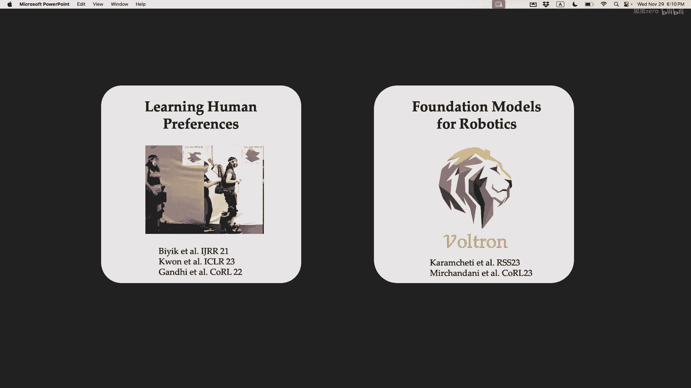