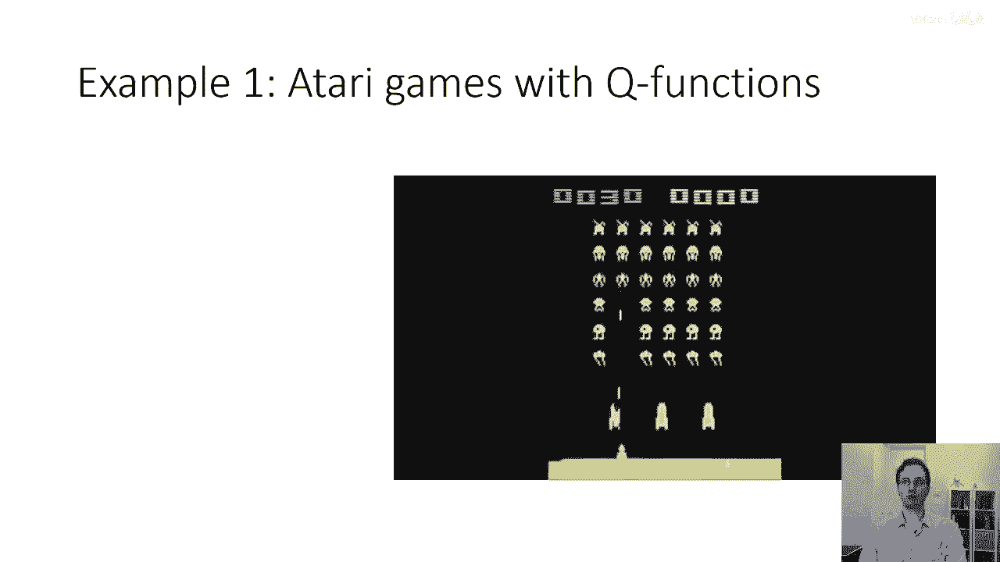
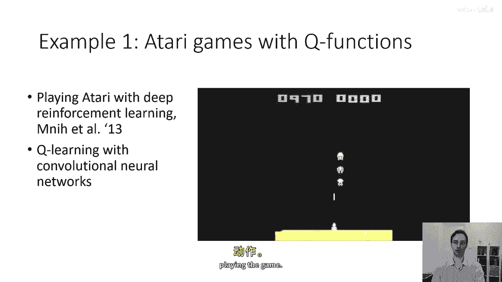
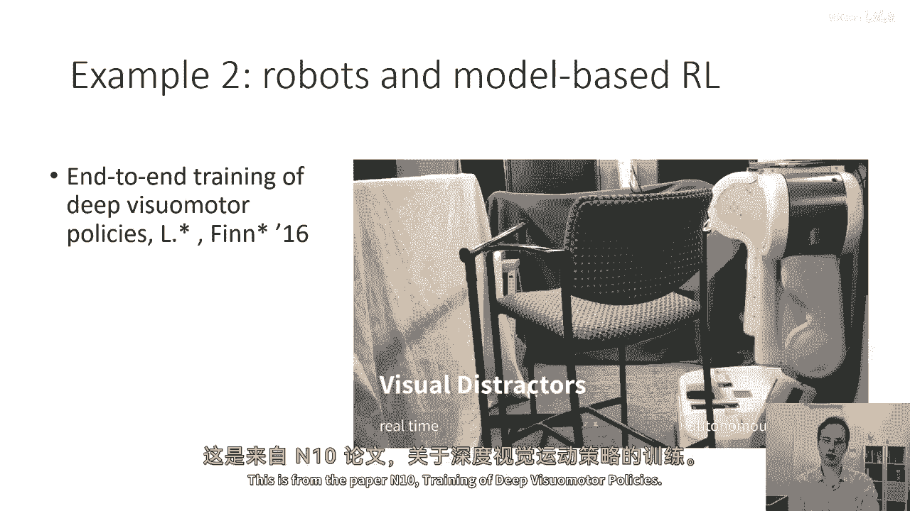
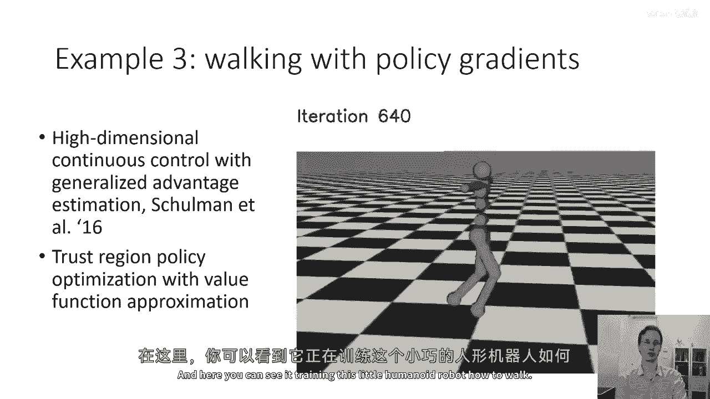

# 【深度强化学习 CS285 2023】伯克利—中英字幕 - P14：p14 CS 285： Lecture 4, Part 6 - 加加zero - BV1NjH4eYEyZ

在今天讲座的最后部分，我将简要介绍一些实际的深度强化学习算法，只是为了让你了解他们做些什么，这将是讲座中最不技术的部分，这些算法将在后续的讲座中详细讨论，而这部分主要是为了完成今天的讲座。

以一些有趣的例子和视频，所以具体的算法例子，请不要担心，如果你没听说过这些名字，我们将在后续的讲座中详细介绍价值函数拟合方法，所以这些就像Q学习，DQN，时间差学习，这些都是价值函数方法，拟合。

价值迭代，策略梯度方法，这些像强化学习一样，自然梯度，信任融合，策略优化或trpo，Ppo，等等，演员批评算法，或者是像异步优势这样的东西，演员批评或者是一个三c软演员批评。

Dddpg和如此等等基于模型的强化学习算法，这些都是像dyna这样的东西，引导策略搜索，你懂的，Mpo，Svg，Etc，然后我们在接下来的几周里将学习这些的大部分。

但首先让我们通过一些例子来开始，所以这里是一个关于。

这个，Q，玩雅达利游戏学习结果的视频，这是一个直接从像素学习视频游戏策略的算法，"这来自于我在2013年的所有论文"，"嗯，而且"，"这个特定的算法使用了卷积神经网络和Q学习"。

"所以Q学习是一种基于价值的方法"，实际上，它使用神经网络学习q a的估计值，"雅达利游戏是离散动作环境"，这意思是说，你对于每个小的样本，只需要生成一个不同的q值。"离散动作集"，"然后。

你对那些q值进行arg max操作，以选择最佳的行动。"，"当玩游戏时"。

这里是一个机器人学的例子，嗯，这个嗯，从论文的开始到结束，深度视觉运动政策的端到端训练。

这是一个叫做引导策略搜索的基于模型的强化学习算法，它使用动态模型和基于图像的卷积神经网络的组合，来执行各种机器人技能，这里是一个政策梯度的例子。

这是从一篇关于高维连续控制与通用优势估计的论文中来的。

它使用信任区域的一种变体叫做信任区域策略优化算法，这是一种结合了。

嗯，在这种情况下，一个信任区域与价值函数近似的算法，所以这实际上是从一个政策梯度算法派生出来的演员-批评家算法，在这里你可以看到它。

嗯，训练这个小型人型机器人如何行走，这里是我在第一节课中实际展示的抓取机器人的视频，而且这个特定的结果实际上也是由一个Q学习算法产生的，并不像我之前几页展示的Atari例子那样不同。

