# 【深度强化学习 CS285 2023】伯克利—中英字幕 - P21：p21 CS 285： Lecture 6, Part 1 - 加加zero - BV1NjH4eYEyZ

在今天的讲座中，我们将讨论演员-批评者算法，演员-批评者算法基于我们在上一堂讲座中讨论的政策梯度框架，但它们也增强了它以学习价值函数和q函数。

所以让我们开始，让我们回顾一下上次的 policy gradients 材料，上次，我们学习了关于强化算法的知识，它交替进行三个步骤，它通过在环境中运行当前策略来采样一批轨迹。

所以你在这个方式中采样n条轨迹，然后，我们使用这些轨迹来计算政策梯度的估计值，这是通过对所有样本的平均计算的，那个时间步的grad log pi的和，乘以所有时间步的和，从那一步到结束的奖励总和。

或去奖励，然后，我们将这个近似的政策梯度，并将其乘以一些学习率添加到我们当前的参数向量中，这相当于梯度上升优化过程。

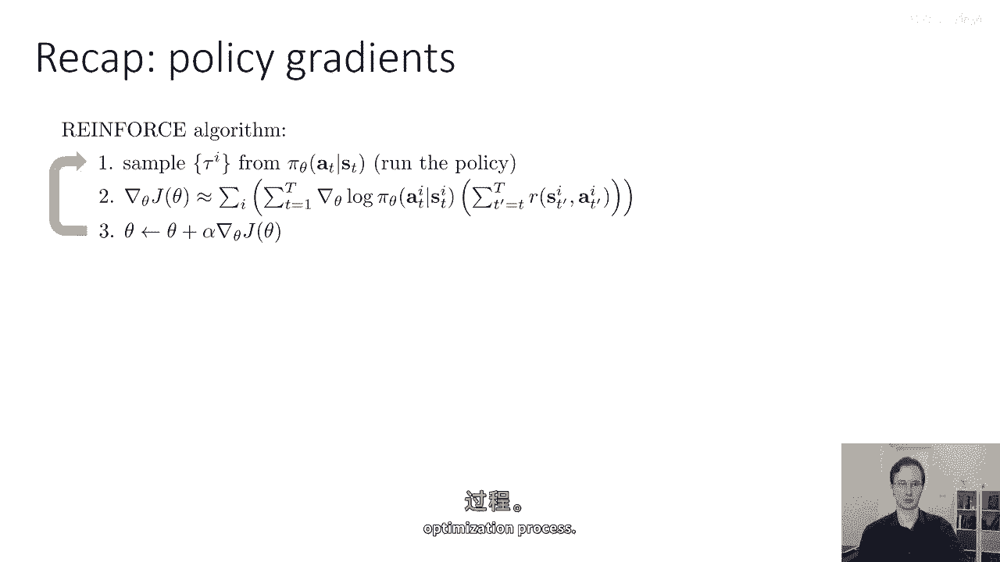

这个算法遵循我们之前讨论的强化学习算法的基本解剖结构，橙色的盒子对应于生成样本，绿色的盒子对应于在每个时间计算去奖励，每个样本的步骤，并且蓝色的盒子对应于现在按照上次讲座中的梯度下降规则应用。

我稍微暗示性地使用了'sap'这个词，符号q hat表示去奖励，这个选择是故意的，因为当你利用我描述的因果关系属性时，你会发现，你应该如何计算你的政策梯度，是通过乘以每个grad log pi。

"根据你期望得到的总奖励"，"如果你从状态s开始"，然后采取行动，"然后按照你的政策行动"，"那是对政策梯度的一个非常合理的解释"，你实际上是在说，你将增加那些行动发生的可能性，"期待带来更高的奖励"。

"并降低那些预期会导致更低奖励的行动的概率"。

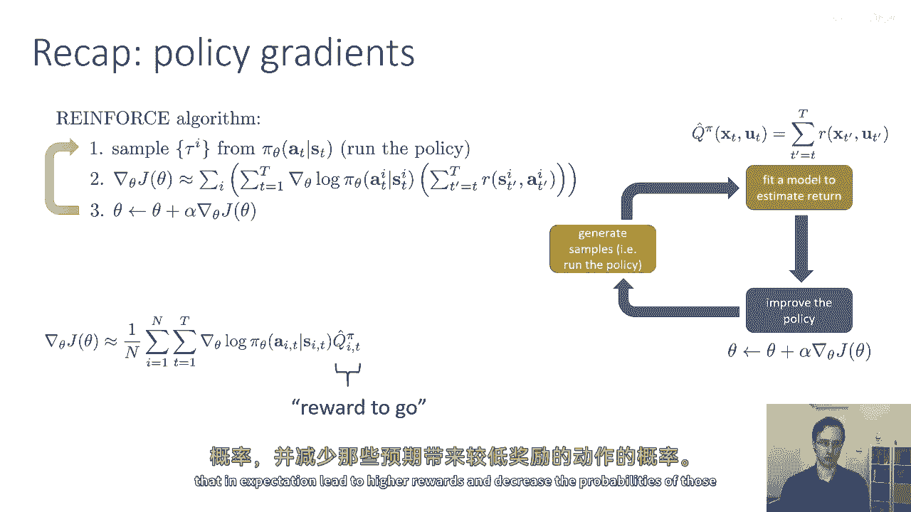

"但是，让我们更仔细地检查一下这个术语"，"Q代表预期的奖励估计值"，如果你在状态sit采取行动a，那么状态sit将在时间t+1变为状态st+1，然后，按照你的政策直到轨迹的结束。

但我们能否对这个量有一个更好的估计，让我们想象一下，这条弯曲的线代表你采样的轨迹之一，而你的umq帽是在特定的时间步计算的，所以，这个绿色圆圈代表状态sit，所以，第i个样本时间步t，在那个时间点。

我们将计算我们对未来奖励的估计q帽，然后我们将要将grad log pi乘以那个奖励，以前进行，我们计算这个估计的方法是，通过沿轨迹实际获得的奖励之和来计算这个估计，但是。

这个轨迹只代表了许多可能性中的一种，如果我们不小心再次落在相同的确切状态，然后运行我们的策略，就像我们在这次滚动中做的一样，我们可能会得到不同的结果，仅仅因为策略和mdp有一些随机性，所以。

我们现在正在使用一步奖励估计来估计去值，但实际上，接下来可能发生的可能性有很多，因此，我们对奖励的估计将更准确，如果我们能实际上对所有这些不同的可能性进行全面期望。

可能性多的原因仅仅是因为系统中存在随机性，我们的策略存在随机性，我们的mdp也存在随机性，但这种随机性可能相当大，这意味着我们通过累加，我们在那个轨迹中实际获得的奖励。

得到的单一样本估计可能与实际预期值相差很远，现在，这个问题我要提出，直接与政策梯度的高方差有关，我希望你们花一点时间来思考这有什么关系，与方差，方差与这之间的关系是。

通过政策梯度计算期望回报的方式是一个样本，对非常复杂的期望的估计，你使用样本数越少来估计期望，你的估计器的方差就越高，样本估计器的方差非常高，如果我们能从相同的状态动作元组中产生一百万样本。

那么我们的方差将大大降低，如果我们能以某种方式精确计算这个期望，那么我们的方差将大大大大降低，所以如果我们有访问真实预期回报的能力，定义为我们从状态si开始获得的奖励总和的真实预期值。

和动作ai在时间t，那么我们的政策评估方差将大大降低，然后如果我们有这个嗯，Q函数，我们可以简单地将其插入q帽的位置，以获得更小的方差，政策梯度。

现在，在前一次讲座中，我们还学习了关于这种叫做基线的东西，它可以进一步降低政策梯度的方差，我们可以应用一个基线吗，即使我们有真正的q函数，并且答案是当然我们可以，所以我们可以减去一些量。

B 上次我们学习了，平均奖励是b的好选择，尽管不是最佳选择，所以，我们平均什么做得好，我们可以平均q值，所以可以说，让我们让b只是那时平均的q值，跳过我们所看到的所有状态和动作。

然后我们将有这个吸引人的特性，即政策梯度将增加比平均值更好的动作的概率，以他们的奖励而言，以期望去减少比平均值差的动作的概率，但结果是我们可以进一步降低方差，因为基线实际上可以依赖于状态。

它不能依赖于导致偏见的行动，但你可以使其依赖于状态，所以如果你使基线依赖于状态，那么最好做的事情或不做并不是最优的事情，但是做得更好的事情，将是计算从该状态开始的所有可能性的平均奖励。

所以不仅仅是该时间步的所有可能性的平均奖励，但在那个特定的状态，如果你在所有特定状态下平均你的值函数，那就是价值函数的定义，所以，基线的一个很好的选择是价值函数。

所以你可以计算你的政策梯度作为log pi的梯度乘以q s i t，A i t减去v s i t，这实际上是一个非常直观的量，因为q值和价值函数之间的差异，代表了你对在那个状态下采取行动的平均估计。

比平均你在状态s i t时采取的行动更好，所以，把你的grad log pi项乘以这个很有道理，因为它直接说，在那个状态下采取比平均更好的行动的概率增加，并且采取在该状态下比平均值差的行动。

并降低它们的概率，实际上，这个q减去v的术语如此重要，以至于我们有一个专门的名字来称呼它，我们称它为优势函数，我们称它为优势函数是因为它代表了它代表的行动相对于你预期政策πθ在状态下的平均性能的优势。

与政策πθ在状态下预期将获得的平均性能相比。

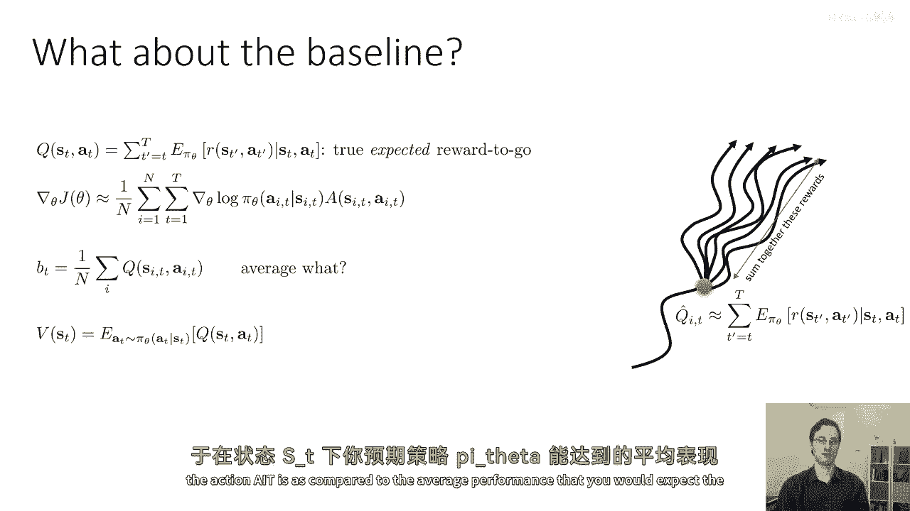

S i，T，好的，所以嗯，顺便说一下，让我们谈谈状态和状态动作价值函数，当我说状态动作价值函数或q函数，那些意味着完全相同的事情，但是，有时说状态动作价值函数可以更清楚，所以，我们的q函数或状态动作。

价值函数代表如果你从状态st开始，预期得到的总奖励，采取动作a，然后遵循你的策略，我们通常会以pi的 superscript 写下q函数，以强调q函数依赖于pi，所以，每个策略都有一个不同的q函数。

价值函数是在所有状态st下所有动作的预期值，根据你当前的q值策略，另一种说法是，它是你预期获得的总奖励，如果你从状态st开始，然后遵循你的策略，优势函数是这两个量的差值。

并且优势函数代表动作at在状态st相比你的策略pi的平均性能有多好，所以我们可以得到一个对政策梯度的非常良好的估计，如果我们简单地将grad log pi项乘以优势值，那么在si状态，嗯，太。

"T" 的中文翻译是 "T"，现在，当然，实际上，"我们无法得到优势的正确值"，"我们得估计一下"，例如，"使用一些函数逼近器"，"所以，我们的优势估计越准确"，我们现在的方差将越小，值得一提的是。

我们今天的讲座将讨论的演员批评方法，并不一定产生无偏的优点估计，所以，我们已经讨论过的政策评估是无偏的，如果你的优点函数不正确，那么你的整体政策评估也可能偏斜，我们通常对此感到满意，因为。

方差的巨大减少往往值得，我们从使用近似值时遭受的微小偏见，"Q值和价值函数"，"因此，总结常规政策梯度"，它使用了一种蒙特卡洛估计优势的方法，"使用当前轨迹剩余部分的一个样本计算的"。

"将你轨迹中的所有奖励相加，然后减去一个基线"，"这是一个无偏但方差大的单样本估计"，"我们可以用它来替换一个近似的优点函数"，"它本身通常从近似的q函数或近似的价值函数中计算出来"。

"并获取一个更低的方差估计值"，因为现在我们有可能对这个期望得到一个更好的估计，这不依赖于单个样本，但往往得到的近似值函数会有一些偏差，所以我们会牺牲大量的方差来换取一些小的偏差。

所以最终算法的结构现在会有一个更加复杂的绿色框，所以橙色框将与我们生成样本之前相同，我们将通过运行我们的策略来生成样本，蓝色框仍然相同，我们将仍然使用策略梯度来做梯度下降，但绿色框不涉及拟合某种估计器。

要么是估计器q pi，要么是估计器v pi，要么是π。

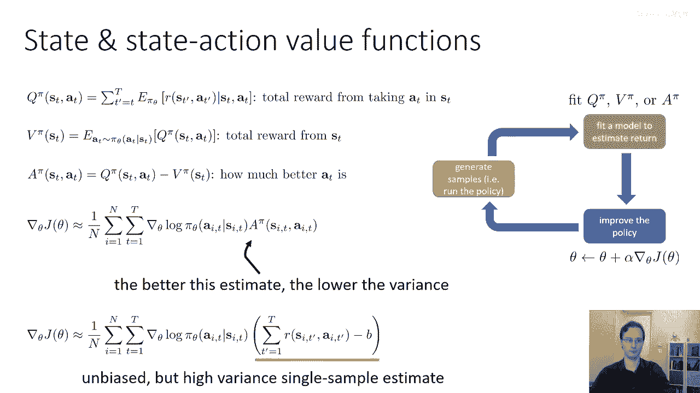

那么让我们谈谈下一个，让我们谈谈如何拟合价值函数，所以我们有三种可能的量，Q，V或a，最终我们想要a，但是，我们可能会问的是，我们应该拟合什么，我们应该拟合这三种中的哪一种，我们应该把它拟合到什么。

我们的目标应该是什么，我们应该拟合q，V或a，花一点时间来思考这个选择，并考虑一个选择或另一个选择的优点和缺点，q函数是我们从状态st开始，采取动作at，然后遵循我们的策略时，我们将获得的预期奖励。

当我们从状态st开始时，在时间t采取动作at，然后遵循我们的策略，现在，这个有一个非常方便的属性是，因为st和at实际上不是随机变量，我们可以将q函数重写为仅仅是当前奖励，加上未来奖励的预期值。

因为当前奖励取决于st和at，并且它们不是随机的，所以这个等式是精确的，并且这个，我们添加的数量仅仅是在状态st处的价值函数的预期值，加上我们在状态st时采取动作at时将获得的奖励。

我们可以同样将q函数以价值函数来表达为当前奖励，加上下一个时间步的价值函数奖励的预期值，这里的期望是，当然，以过渡动态为准，我们现在可以做一个小的近似，我们可以说。

我们在当前轨迹中看到的实际状态st加1，基本上是代表我们现在将获得的平均st加1，在这个点上我们已经做出了一个近似，这不是一个精确的等式，我们实际上是在近似下一个时间步的状态分布。

再次使用单个样本估计器，但现在它是仅对那个时间步的单个样本估计器，所有其他部分仍然被价值函数vpi表示为整合出，我们做了这个近似，现在，我们可能会问，好吧，所以我们失去了一些，但我们仍然有更低的方差。

但不是我们以前那样低，我们为什么要这样做呢？我们做这件事的原因是因为，如果我们将这个近似方程替换为q值在优势方程中的表达式，我们得到非常吸引人的表达式，其中优势现在约等于当前奖励。

加上下一个值减去当前值，这仍然是一个近似，因为要精确，这个v pi s t加上一需要在所有可能的s值上预期，D加上一，而我们刚刚替换了实际看到的sd加上一，但这等式的吸引之处在于，现在它完全依赖于v。

而v比q或a更方便学习，因为q和a都依赖于状态和动作，而v仅依赖于状态，当你的功能近似者依赖于较少的东西时，学习更容易，因为你不需要太多的样本，也许我们应该只拟合v pi of s。

这不是演员批评算法的唯一选择，我们将在后续的课程中学习使用q函数的演员批评方法，但现在我们将讨论只拟合v pi of s的额外批评算法，然后使用此等式近似地导出优势函数，当我们拟合v pi of s时。

我们将有一些模型，例如，一个神经网络，该网络将状态s映射到近似值v hat pi of s。

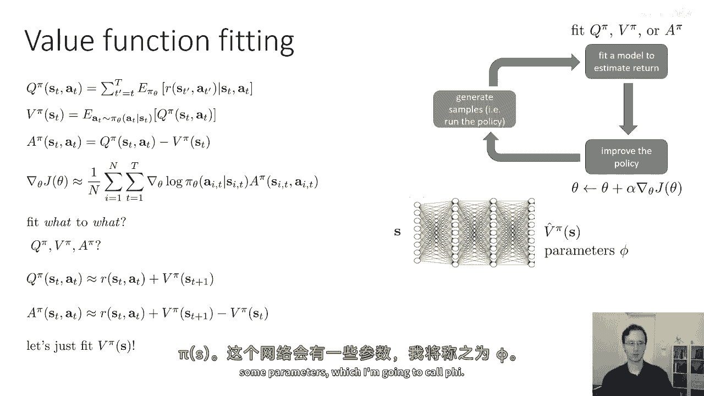

并且这个网络将有一些参数，我将称之为phi，让我们谈谈拟合v pi of s的过程，这个过程有时被称为政策评估，因为v pi代表在每个状态下政策的价值，所以计算价值是评估，实际上。

如果你回想上周的关于强化学习问题定义的讲座，你将记得，强化学习的目标本身可以表达为价值函数的预期值，在初始状态分布上，所以如果你计算价值函数，你可以实际上评估你的政策，仅仅通过平均初始状态的值。

这就是这里表达的，我们的目标j theta可以表达为v pi在初始状态的预期值，我们如何进行政策评估，嗯，我们可以使用蒙特卡罗政策评估，在某种程度上，这是政策梯度在蒙特卡罗政策评估中做的事情。

我们赚取我们的政策很多次，然后相加我们在由政策生成的轨迹中获得的奖励，并使用这作为一个无偏，但高方差估计的政策总奖励，所以，我们可以说，在状态st处的价值大约是所看到奖励的总和，访问完状态t后。

沿着访问过状态st的轨迹，所以这是我们的部署，这里是状态st，然后我们只是打算将这些我们在那之后看到的所有东西相加，现在沿着那个轨迹，理想上，我们想要能够做到的，是对所有可能发生的轨迹进行求和。

当你从那个状态开始时，因为可能有不止一种可能性，所以我们想要对这些事情进行求和，遗憾的是，在没有模型约束的情况下，这通常不可能，因为这需要我们能够恢复到状态，然后从那个状态开始运行多个试验。

通常我们假设我们无法做到这一点，我们只假设我们可以从初始状态开始运行多个试验，所以通常我们做不到这一点，但如果你有访问可以重置的模拟器的权限，你可以用这种方式技术上计算你的马尔可夫链值。

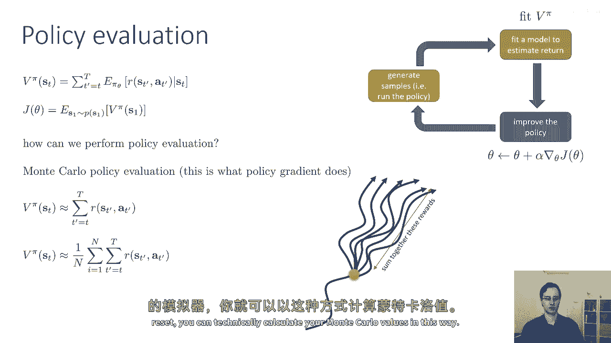

那么如果我们使用神经网络函数逼近器来逼近价值函数会发生什么，用这种类型的蒙特卡罗评估方案，好吧我们有我们的神经网络，我们有参数phi的π，我们每次访问状态时都会一起使用这些参数，剩余的奖励。

这将产生我们的目标值，但是，而不是直接将那些奖励插值到我们的政策梯度中，实际上，我们将神经网络拟合到这些值，这将实际上减少我们的方差，尽管我们不能在同一个状态下访问两次，我们的函数逼近器。

或者我们的神经网络，实际上会意识到我们在不同轨迹中访问的不同状态彼此相似，所以尽管沿着第一个轨迹的这个绿色状态永远不会被访问超过 once，在连续状态空间中，如果我们有另一个轨迹的滚动，稍微靠近一些。

但是后来在那个轨迹中其他地方发生了什么事情，函数逼近器会意识到这两个状态相似，当它试图估计这两个状态的值时，一个的值会稍微泄漏到另一个的值中，这基本上是概括。

概括意味着你的功能近似器理解到附近的状态应该采取相似的值，所以如果你在其中一个状态中意外地得到了与在其他状态中完全不同的结果，功能近似器会到一定程度地平均这些值，并产生比您将得到的系统更低方差的系统。

如果您直接使用那个单一样本值在你的政策梯度中，所以它不是使用多个来自相同状态的机器人那么好，但它仍然很好，所以我们这样做的方式是，我们将通过获取所有我们的回滚来生成训练数据，对于每个回滚中的每个状态。

我们创建一个由状态和与我们看到的奖励总和相对应的标签组成的元组，S i t 和 Y i t，从 i 开始，对于这个机器人的其余部分，我们将这些标签称为，Y i t，当我说目标值时，我意味着 y i t。

所以我们将得到这些元组，是的，然后，我们将解决一个监督回归问题，我们将训练我们的神经网络价值函数，以便其参数phi最小化我们所有样本的平方误差之和，之间。

价值函数预测和单样本蒙特卡罗估计在该状态下的价值，当然，如果我们的功能逼近器过度拟合，并产生在每个单个状态下精确的训练标签，那么我们就没有比直接使用y i获得更多，作为相比，在我们的政策梯度中，T值。

但是如果我们能够实现泛化，意味着我们的函数近似器理解两个临近的状态应该具有相似的值，即使它们的标签不同，那么我们实际上将得到更低的方差，因为现在这个函数大约会平均出在相似状态下的不同标签。

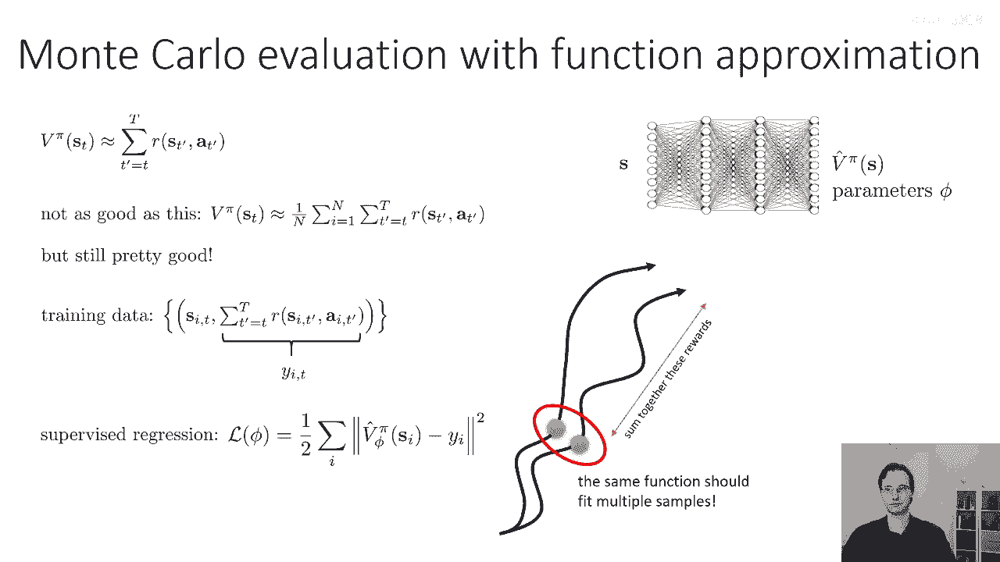

但是我们能否做得更好，所以当我们训练我们的价值函数时，我们希望拥有的理想目标，是从状态s_i_t开始，奖励的真实预期值，当然我们并不知道这个量，我们之前使用的蒙太古卡罗目标使用了这个数量的单一样本估计。

"但是我们也可以使用之前写出来的关系"，"我们在那里看到，一个q函数仅仅等于当前时间步的奖励"，"再加上从下一个时间步开始预期的奖励"，"如果我们写出这个数量"。

"然后我们可以像以前那样进行相同的替换"，"实际上，将求和的第二个项替换为我们对价值函数的估计"，"并且，这是一个对未来奖励的更好估计，方差更低"，"比我们的单个样本估计器"。

所以这说让我们使用当前时间步看到的实际奖励，再加上我们在下一个时间步看到的实际状态下的值，当然我们并不知道v pi的值，所以我们将简单地使用我们的前一个函数近似器来近似它。

所以我们假设我们的前一个v hat pi phi大概还不错，可能它不是很好，但它可能比什么都没有好，所以我们可以将它插入v pi的位置，并得到被称为自适应估计量的东西。

所以这里我们直接使用前一个拟合值函数来估计这个量，所以现在我们的训练数据将包括我们看到的状态元组，实际获得的奖励所对应的标签，步骤，实际下一个状态的价值估计，我们现在看到的步骤加一。

估计的v值可能不正确，随着我们重复这个过程，希望这些值会越来越接近正确的值，因为v值是在平均的，所有可能的未来回报，我们预期它们的方差会降低，所以现在我们的目标值y_i_t是由和给出，我们的训练过程。

就像以前，是监督回归到这些yitts上，这有时被称为Bootstrap估计，Bootstrap估计的方差较低，因为它在使用v值而不是单个样本估计器，但它也具有更高的偏差。

因为rv_hat pi phi可能不正确。

这就是权衡，好的，所以，为了结束这个讲座的部分，我想给你一些政策评价的例子，只是为了让你更好地理解政策评价的实际含义，因为在许多情况下，政策评价实际上是一个非常直观的概念。

例如，如果我们正在使用Actor-Critic强化学习系统来玩回棋，这是从1992年的td gammon论文中来的，也许我们的奖励对应于游戏的结果，它是1如果你赢了游戏，0如果你没有赢，然后。

我们的价值函数只是预期给定板状态的结果，如果你得到1，如果你赢了游戏，0，如果你输了，然后，价值函数直接预测你赢得游戏的概率。

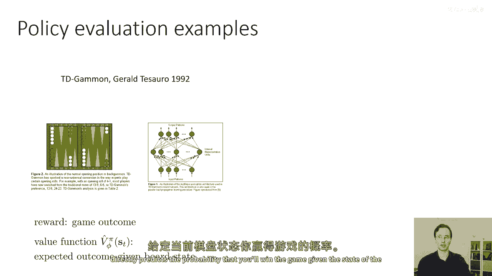

给定当前板状态，非常直观，同样。

如果你正在使用系统来玩围棋，并且奖励是游戏结果，完全相同的事情，你的价值函数实际上试图预测的。

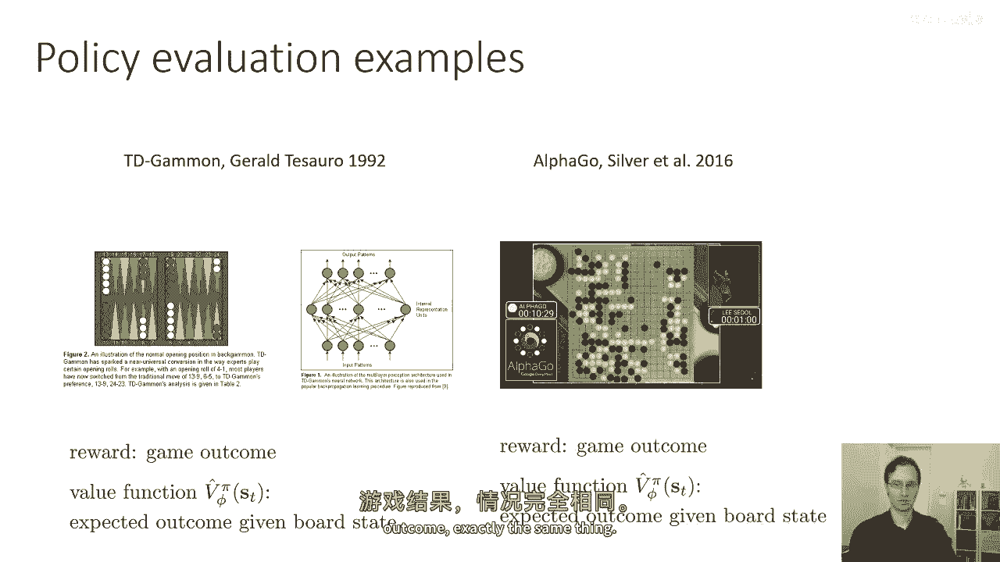

你现在的板状态下，你赢得游戏的可能性有多大，这对棋盘游戏非常有用，因为我们知道这些棋盘游戏的规则。

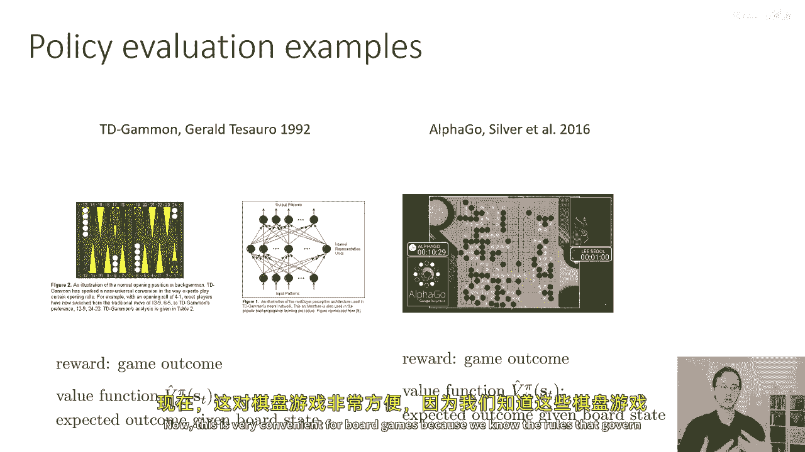

所以我们可以模拟如果我们做出一个移动会发生什么，实际上，我们可以模拟所有可能的移动，检查其价值，然后，选择导致最高价值状态的移动。

这比做全游戏树便宜得多。

因为你只需要预测一步未来，然后，你的价值函数告诉你，给定会发生那一步后，你知道多少，你赢得游戏的可能性有多大，然后。

 you take the move that most increases your probability to win the game，所以，政策评估在下一部分讲座中可以有非常自然的解释。

我们将讨论如何使用政策评估在一个完整的演员批评算法中。

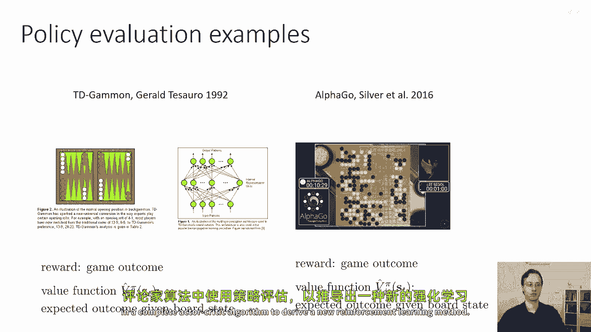