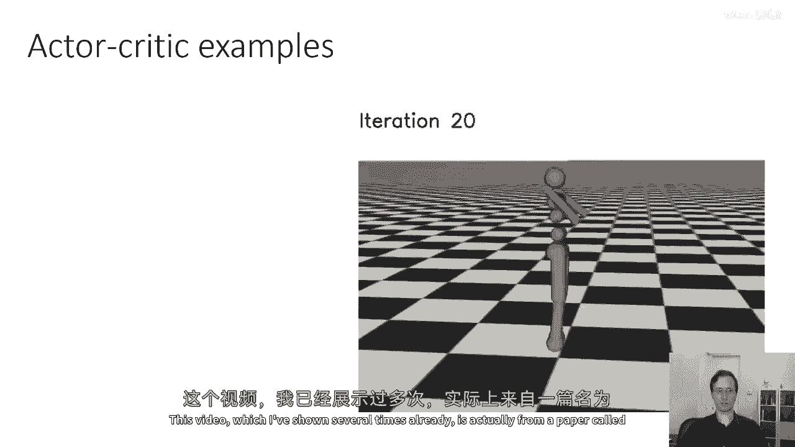
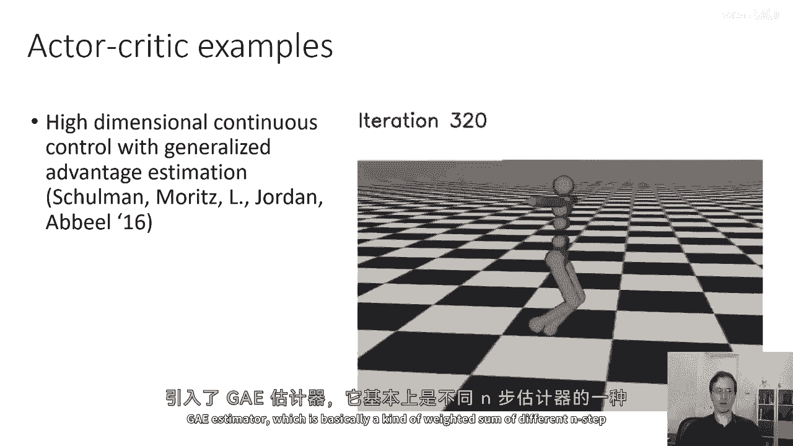
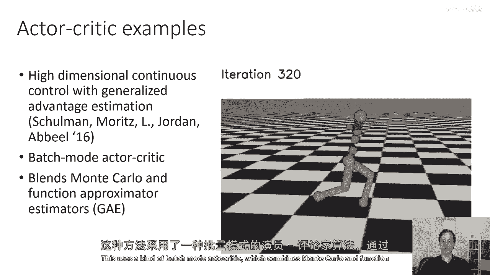
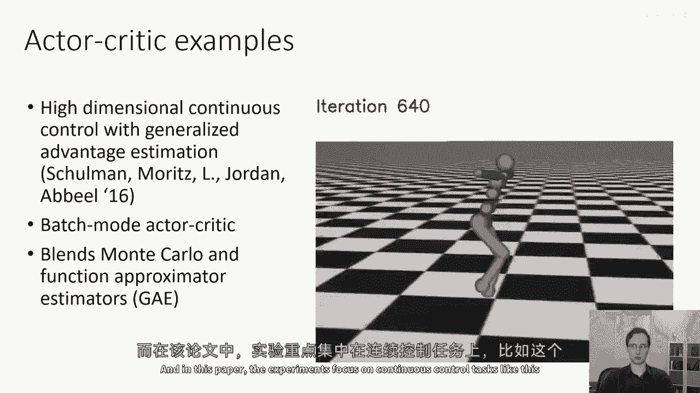
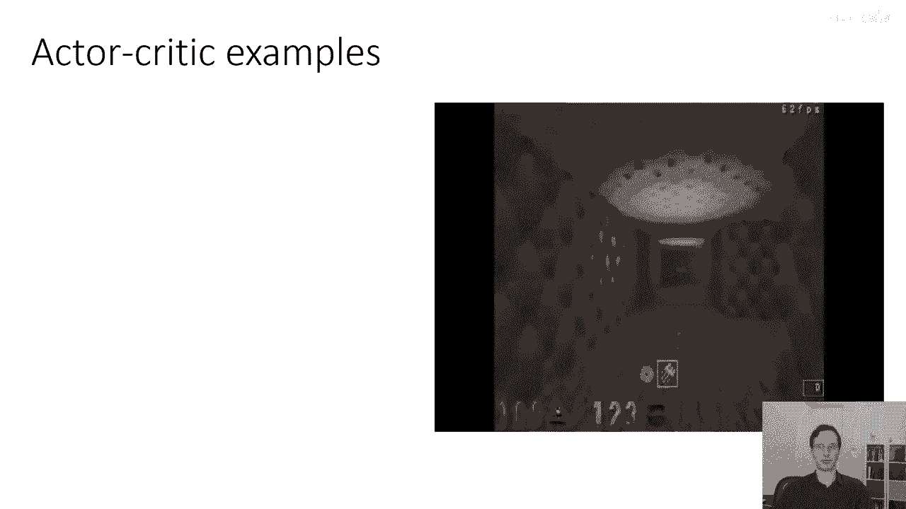
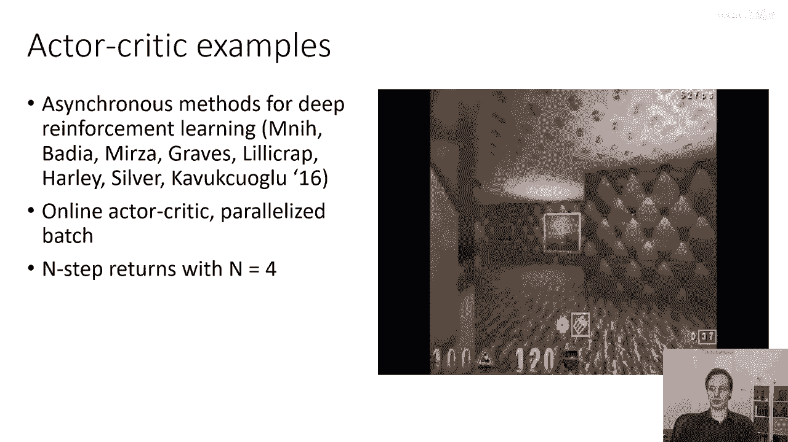
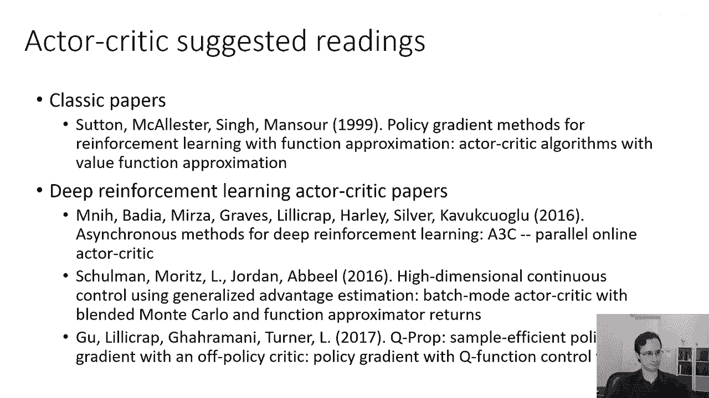

# 【深度强化学习 CS285 2023】伯克利—中英字幕 - P25：p25 CS 285： Lecture 6, Part 5 - 加加zero - BV1NjH4eYEyZ

今天的讲座的最后一部分，我想简要回顾我们已经覆盖的材料，然后讨论文献中的一些演员-批评者算法，所以这将是一个总结我们已覆盖内容的相当简短的部分，我们讨论了一个演员-批评者算法由几个部分组成，一个演员。

它是策略，一个批评者，它是价值函数，演员-批评者算法可以被视为政策梯度的一种版本，具有显著减少方差的能力，就像政策梯度和其他所有RL算法一样，它由三个部分组成，橙色的盒子，我们在那里生成样本。

绿色的盒子，我们在那里估计我们的回报，现在对应于拟合价值函数，在蓝色的盒子中，我们使用梯度下降更新我们的策略，就像在政策梯度中一样，策略评估是指拟合价值函数，折扣因子是我们可以使用的。

使它们有可能在无限时间内进行策略评估，它有几个不同的解释，你可以把它解释为死亡的恐惧，意味着你希望尽快获得奖励，而不是在死亡之前，但你也可以把它解释为一种方差减少的技巧。

我们讨论了演员-批评者算法的设计，你怎么可以有一个网络有两个头，或者两个单独的网络，以及如何有批处理模式或在线演员-批评者算法，你可以使用并行性来获得更大的批处理大小，大于1。

我们还讨论了状态依赖的基础线和甚至动作依赖的控制变体，作为另一种使用批评者的方法，同时保持无偏，我们讨论了如何将这些与n步回报结合，甚至通用优势估计器，它平均了许多不同n步回报估计器。

这里是文献中的一些演员-批评者算法示例，这个视频，我已经多次展示过。

实际上是来自一篇名为'高维连续控制与通用优势估计器'的论文，哪引入了ge估计器，基本上是一种对不同n步估计器的加权求和。

这使用了一种批处理模式，演员-批评者。

它将蒙特卡罗和函数逼近估计器的估计器结合在一起，通过这个gatrick。

并在这篇论文中，实验侧重于连续控制任务。

如这个运行人形机器人，这里有另一个例子。

这是来自一篇名为'异步方法深度强化学习'的论文，并这篇论文专注于在线演员-批评者算法，使用瘫痪的异步系统。

所以在这个视频中，他们实际上有一个基于图像的演员-批评者算法，使用卷积神经网络和循环神经网络导航迷宫，他们也使用n步回报，其中n等于4。

他们有一个单一的网络用于演员和批评者，有多个头，如果你想了解更多关于演员-批评者算法的信息，这里有一些推荐，一些经典论文，这篇论文被称为基于函数逼近的强化学习政策梯度方法。

实际上是一篇非常值得阅读的论文，它描述了政策梯度的理论基础，还讨论了我之前提到的因果关系技巧，在那里，你可以忽视当前时间步的过去奖励，这实际上描述了如何将所有这些转化为演员-批评家方法。

所以今天讲座中的大部分材料都基于，这篇论文中提出的想法，一些更近的深度强化学习论文，这是我之前在幻灯片上展示的异步方法论文，这是gapaper。

