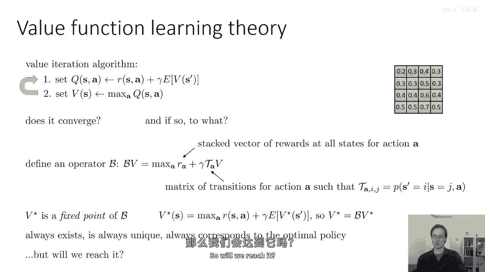
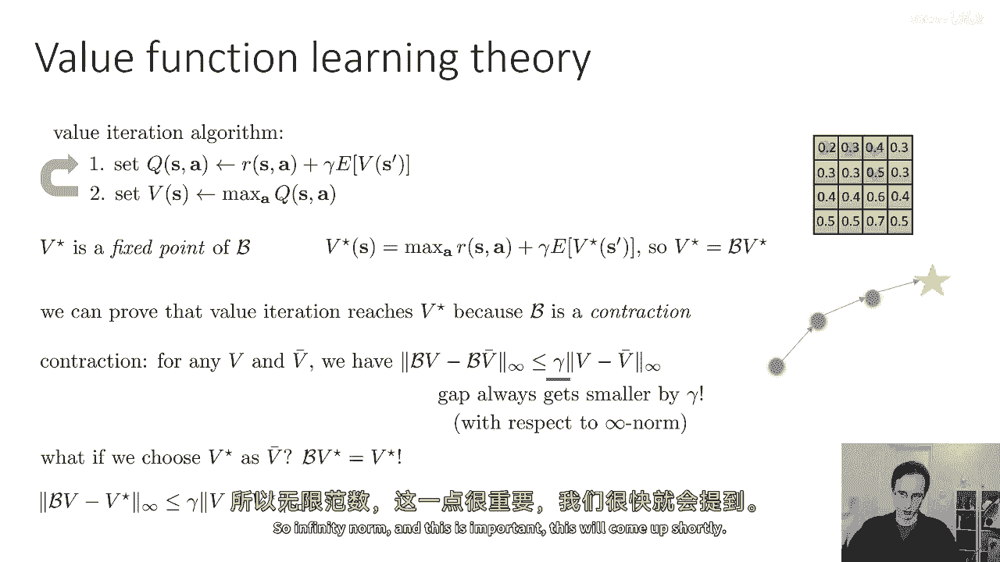
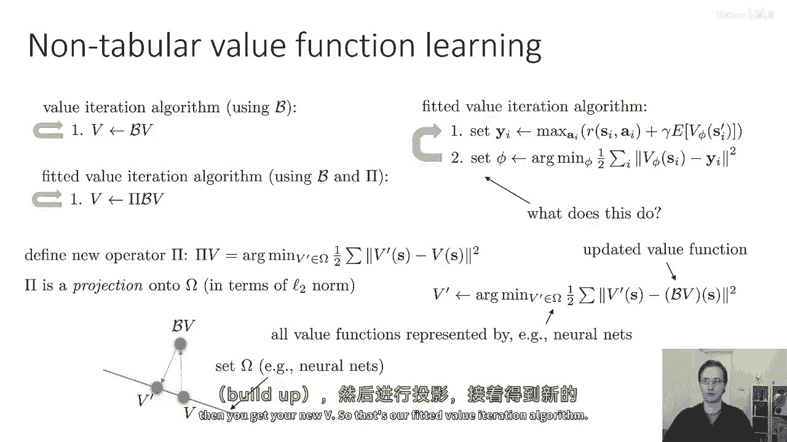
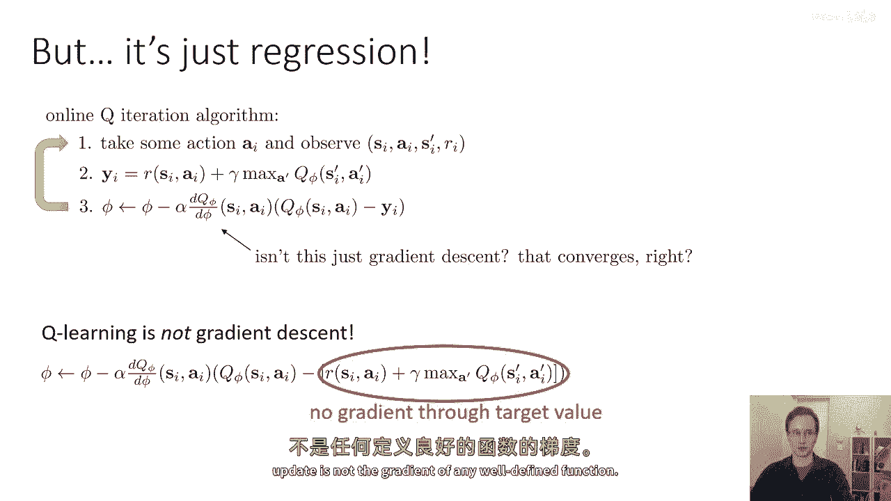
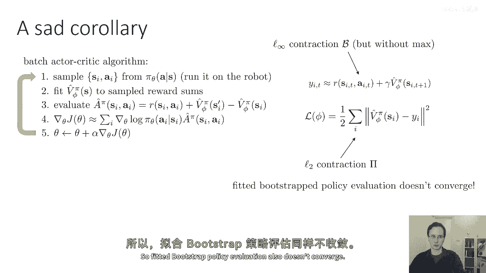
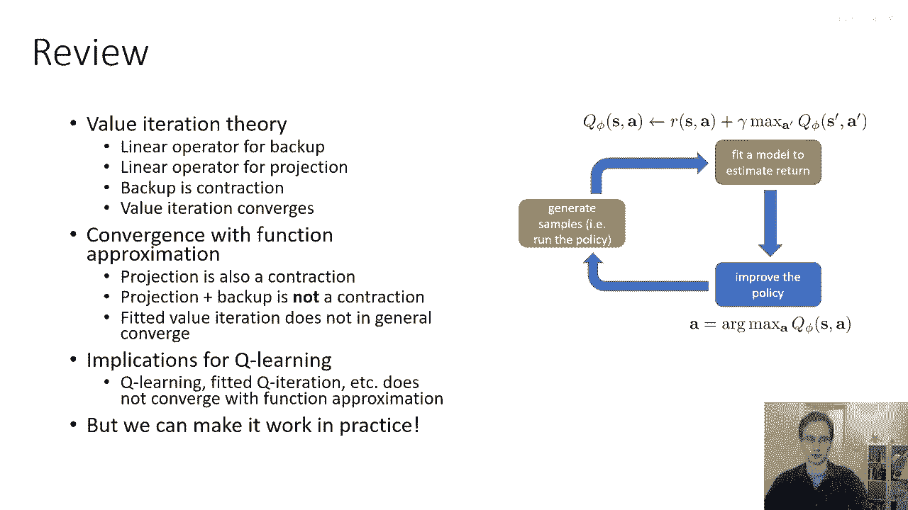

# 【深度强化学习 CS285 2023】伯克利—中英字幕 - P29：p29 CS 285： Lecture 7, Part 4 - 加加zero - BV1NjH4eYEyZ

我在这次讲座中的最后一个主题是，是关于基于价值的方法的一点理论，以及我之前所说的内容的一些更多解释，当我说基于价值的方法与神经网络一般不收敛到最优解时，让我们从之前覆盖的价值迭代算法开始。

它是一个相当简单的算法，对我们来说更容易理解，但我们稍后会回到队列迭代方法，所以为了提醒所有人在价值迭代中，基于价值的方法，我们可以把它看作是有两个步骤的，第一步是构建你的值表，将奖励设置为q值。

再加上gamma乘以下一个状态的预期值，然后第二步是将你的价值函数设置为那个表中的行的最大值，所以你可以认为这是构建价值稳定的过程，嗯，然后重复这个过程，所以我们可以问的问题，这个算法是否收敛。

如果它收敛，它收敛到什么，所以我们可以通过以下方式开始这个分析，我们可以定义一个运算符，我将其写作脚本b，这个运算符被称为贝尔曼运算符，当应用于价值函数时，记住价值函数，这里是一张表。

所以你可以认为它只是一个向量的数字，当应用到这个数字向量时，它执行以下操作，首先，它取v并应用t下标a的运算符，下标为a的T是一个s行s列的矩阵，在该矩阵中的每个元素是当s和a给定时，s质数的概率。

其中a是，嗯，选择的查询最大，所以这基本上是在计算这个期望，期望是一个线性操作符，我们乘以gamma，并添加向量ra，向量a是一个奖励向量，对于你选择的每个状态，你将获得，嗯，对应动作的奖励为a，然后。

除了这之外，你对a和关键的进行最大值操作，这个最大值是按元素进行的，所以对于每个状态，我们取最大值，所以这种有趣的写作方式，嗯，贝尔曼备份基本上只是捕获了价值迭代算法。

所以价值迭代算法由反复应用操作b到向量v组成，最大值来自第二步，并且步骤一内部的东西来自最大值，所以奖励是一个状态动作a的所有奖励堆叠向量，并且ta a是动作a的转移矩阵，满足t a，I。

J是当s等于j时，s'等于i的概率，并且我们执行了动作a，现在，我们可以证明v*是b的固定点一个有趣的属性，v*是什么，v*是最优策略的价值函数，所以如果我们可以得到v*，那么我们将恢复最优策略。

v*等于对a的最大值加上gamma乘以，v*在s'的预期值，对吧，所以如果我们找到一个价值函数，如果我们找到一个满足这个方程的向量，我们找到了最优价值函数。

并且如果我们使用与该向量相关的arg max策略，我们将得到最优策略，最大化总奖励的策略，所以这意味着v*等于b乘以v*，所以v*是b的固定点，所以这非常棒，如果我们找到了b的固定点，嗯。

那么我们将找到最优价值函数，此外，实际上，我们可以证明v*总是存在，这个固定点总是存在，它总是唯一的，并且它总是对应于最优策略，所以剩下的问题是，反复应用b到v是否会实际找到这个固定点，所以。

它实际上是一个，它是一个固定点，迭代算法通过迭代算法找到固定点是否收敛，如果它收敛，它将收敛到最优策略，并且它有一个唯一的解，所以我们是否能够达到它，所以，我不会在这个讲座中详细解释证明，但是。

高层次的概述背后的我们如何论证价值迭代收敛的方法是，通过论证，嗯。

它是一个收缩，所以，我们可以证明价值迭代会达到v*，因为b是收缩的，收缩意味着如果你有任何两个向量v和v bar，那么将b应用于v和v bar将使那些向量更加接近，收缩意味着什么。

它意味着如果你有任何两个向量v和v bar，那么将b应用于v和v bar将使那些向量更加接近，意味着b v减去v b的范数小于等于，V bar是他们的范数小于等于，或等于v减去v bar的范数，实际上。

它是由某个系数收缩的，那个系数恰好是gamma，所以不仅b v减去b v bar的范数小于等于，或等于v减去v bar的范数，它实际上小于等于v减去v bar的范数乘以gamma，所以您会收缩。

实际上会收缩一些非 trivia 量，这意味着您会v和v bar总是更接近，现在您应用它们，b，证明b是一个收缩并不是那么复杂，我只是不想在这个幻灯片上通过它，但你可以在标准教科书结果中查找它。

但只是为了简要解释为什么，显示它是收缩意味着价值迭代收敛，如果您选择v star作为v bar，您知道v star是b的固定点，所以如果您将v star替换为v bar。

然后您得到方程b v减去v star的范数小于等于，或等于gamma乘以v减去v star的范数，这意味着每次您应用它们，b到v，您会接近v star，所以每次您更改您的价值函数，通过应用线性。

通过应用非线性操作b，您会接近您的最优v star，在这里需要注意的是，操作b收缩的范数，是无穷范数，所以无穷范数基本上是对于最大入口的差异，所以无穷向量的值是该向量最大入口的值。

所以v和v star在哪个状态上不一致，最多会，它们应用b后会不一致更少，所以无穷范数和这是非常重要的，这将在后面出现。

所以常规价值迭代可以非常紧凑地写为，只是重复应用这一步骤v去变为v，现在让我们去看拟合值迭代算法，拟合值迭代算法有其他操作，它有一步二，您实际上执行艺术 min与 respect to phi。

如何数学地理解第二步，所以第一步基本上是贝尔曼备份，第二步训练神经网络，这个步骤实际上做什么，嗯，抽象地看，一种你可以思考监督学习的方式，是您有一些可以表示的价值函数集，这个集，如果你。

如果你的神经网络价值函数，实际上是一个连续的集合，包含了所有可能具有特定架构的神经网络，但是不同的权重值，所以我们会表示这个集合为监督学习中的集合欧米伽，我们有时候称这个为假设集合或假设空间。

监督学习包括在你的假设空间中找到优化你目标的元素，我们的目标是v五s和目标值之间的平方差，我们的目标值是什么，我们的目标值基本上就是b v right，这就是我们在步骤一中做的事情。

步骤一基本上就是执行b v，这就是b b的 literally 方程，所以你可以认为整个拟合值迭代算法，是反复寻找一个新的价值函数 v prime。

哪个是 omega 集合内部的 arg min 的平方差，V prime 和 v v，其中 b v 是你的前一个价值函数，现在对于这个 is 的程序本身实际上也是 also 一个收缩。

所以当你当你执行这个监督学习时，你可以把它看作是在l two范数中的投影，所以你有你的旧v，你有一个由这条线代表的可能的神经网络集，所以欧米茄基本上就是那条线上的所有点，整个空间是所有可能的价值函数。

欧米茄不包含所有可能的价值函数，所以欧米茄限制我们到这条线，当我们构建b v，我们可能会离开这条线，所以点dv不在欧米茄的集合中，当我们进行监督学习时，当我们执行拟合值迭代的第二步时。

我们实际上在做的是在集合omega中找到一个点，这个点尽可能接近b v，并且尽可能接近，这意味着它将在一个直角上，所以我们将投影到集合omega上，并且它将是一个直角投影，这将给我们v prime。

所以我们可以定义这个为一个新的运算符，我们可以将这个运算符称为pi为投影，嗯，"我们将说，πv只是参数值。"，"在欧米茄集合中的min"，"这个客观和主观就是两范式"，"现在。

π在欧米茄上的投影是以l2范数为基础的"，"并且π也是缩写，因为如果你将某物投影在两范式下"，"它越来越近"，"因此，完整的拟合值迭代也可以写成一行"，"当v刚刚变为πb时，v也会随之变化。因此。

首先你拿起一个铃铛，然后后退一步，调整v的值。"，"然后您将其投影出来"，然后您将获得您的新v。

这就是我们的拟合值迭代算法，B相对于无穷范数是收缩的，所谓的最大范数，这就是我们之前看到的，Pi相对于l2范数是收缩的，以欧几里得距离为准，所以pi v减去pi v bar的平方小于等于。

或等于v减去v bar的平方，所以到目前为止，所以很好，这两个操作都是收缩的，顺便说一句，理解为什么pi是收缩的直觉是，如果你在欧几里得空间中有任何两个点，并将它们投影在一条线上，它们只能彼此靠近。

它们永远不会更远，这就是为什么pi是收缩的，不幸的是，pi乘以b实际上并不是任何类型的收缩，这可能一开始看起来令人惊讶，因为它们都是单独的收缩，但记住，存在对不同范数的收缩，B在无穷范数中是收缩的。

Pi在l2范数中是收缩的，你可能实际上会得到一个在任何范数下都不是收缩的东西，这不是一个理论上的怪癖，这实际上在实践中发生，所以如果你想象这是您的开始点，黄色星是最优值函数，然后你走一步。

所以您的常规uh，价值迭代将逐渐接近星，如果您有一个投影的uh，价值迭代算法，拟合价值迭代算法，然后您将限制您的价值函数在这条线上，每一步，您的uh，贝尔曼备份bv将使您更接近星在无穷范数中。

然后我们的投影将您带回线上，尽管这两个操作都是收缩的，注意，v'现在实际上比v更远离星，您可以得到这些情况，每一步实际上都会使您远离v星，这不是一个理论上的怪癖，这实际上可以在实践中发生。

所以所有这些结论都是悲伤的，值迭代在表格情况下收敛，拟合值迭代收敛，值迭代一般不收敛，并且不在所有情况下都收敛，而且实际上它往往在实践中不收敛。

那么关于拟合q迭代呢，到目前为止我们所讨论的都是价值迭代，那么关于拟合q迭代呢，实际上它完全就是相同的事情，所以为了拟合队列迭代，你也可以定义一个操作符b，它看起来有点不同。

现在它是r加上gamma t乘以max q，所以最大现在是你知道的目标值，但基本原理是一样的，所以现在最大值在过渡操作符之后，这是唯一的区别，B在无穷范数下仍然是一个收缩，你可以定义一个操作符pi。

与在你的假设类中找到arg min的操作符一样，你可以定义pi，它最小化平方差，你可以定义拟合q迭代，就像值迭代一样，q变成pi b q，并且就像以前，b在无穷范数下仍然是一个收缩。

pi在l2范数下是一个收缩，并且pi b不是一种任何类型的收缩，这也适用于在线Q学习，基本上任何这种算法。

现在到这个点，嗯，你们中的一些人可能会看到这件事，并且认为这里有些地方非常矛盾，像我们刚刚讨论的那样，这个算法不收敛，但这个算法的核心是某种看起来可疑地像梯度下降的东西，像，不是。

这不是整个过程只是在目标值上进行回归吗，我们不知道回归会收敛吗，这不是梯度下降吗，嗯，这里的微妙之处是，Q学习实际上不是梯度下降，所以Q学习不是在一个明确定义的目标上取梯度步。

这是因为Q学习中的目标值本身依赖于Q值，这也是Q Q迭代真正值得注意的地方，但你没有考虑通过那些目标值计算的梯度，所以你实际上使用的梯度不是真正的一个良好定义函数的梯度，函数。

这就是为什么它可能不收敛的原因，现在，值得提到的是，你可以将这个算法转换为梯度下降算法，通过实际计算那些目标值来计算梯度，它们因为最大值而不可微分，但是，有些技术方法可以处理这个问题，更大的问题是。

结果算法，被称为残差算法，具有非常，非常差的数值性质，在实践中工作效果也不好，实际上，尽管我描述的这种Q学习过程并不一定会收敛，在实际应用中，它实际上比残差梯度工作得多得多，哪，好像保证会收敛一样。

具有极其糟糕的数值性质，好的，这么短，Q学习版本和拟合Q迭代实际上并没有进行梯度下降，并且更新不是大多数定义良好函数的梯度。

不幸的是，所有这些都有另一个结论，那就是我们之前讨论的实际批评算法，同样不保证在函数逼近下会收敛，原因与前面相同，因此，当我们使用自适应更新时，我们也会执行贝尔曼备份，当我们更新我们的价值函数时。

我们会执行投影，那些的拼接不是一个收敛的操作符，因此，拟合后的Bootstrap策略评估也不收敛。

顺便说一句，关于术语的一个问题，大多数你们可能已经注意到了这个，但是当我使用术语v pi时，我指的是某个策略pi的价值函数，这是批评家做的事情，当我使用v star时。

这是最优策略pi star的价值函数，这就是我们在价值迭代中试图找到的。

好的，所以，回顾一下，我们讨论了一些价值迭代理论，我们讨论了备份操作的术语，这个投影的操作符是一种在幻灯片上的类型，它们实际上不是线性操作符，但它们是操作符，我们讨论了备份是如何收缩的。

并讨论了表格值迭代如何收敛，我们讨论了函数逼近的一些收敛性质，其中，投影也是收缩的，但由于它在不同范数的收缩，备份后的项目不是实际上的收缩，因此，拟合值迭代通常不会在一般情况下收敛。

"对于Q学习的影响是，Q学习适合于Q迭代"，"此外，当使用神经网络时，等等也不会收敛。"，"当我们有一个投影算符时"，"这可能看起来有些忧郁和沮丧"，"在下一节课中，我们将发现实际上"，"实际上。

我们可以让所有这些算法运行得非常好"。

