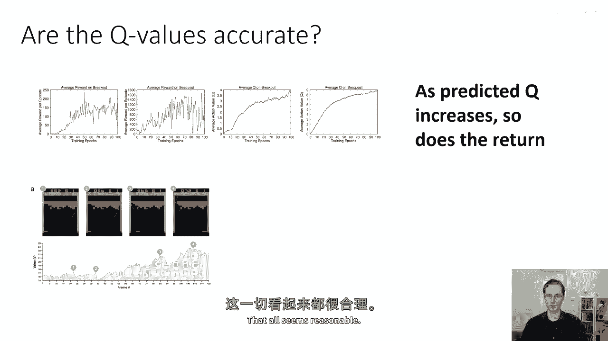
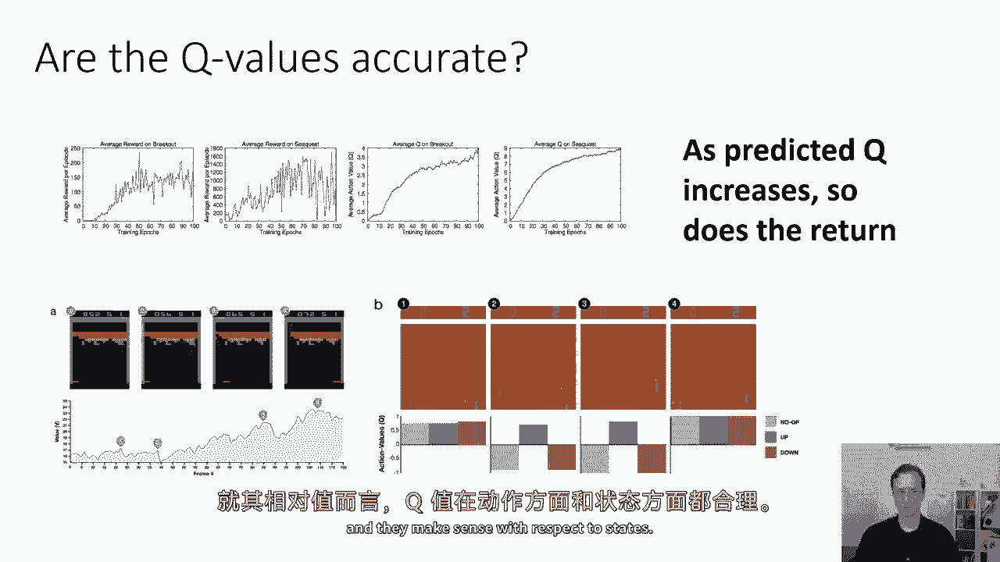
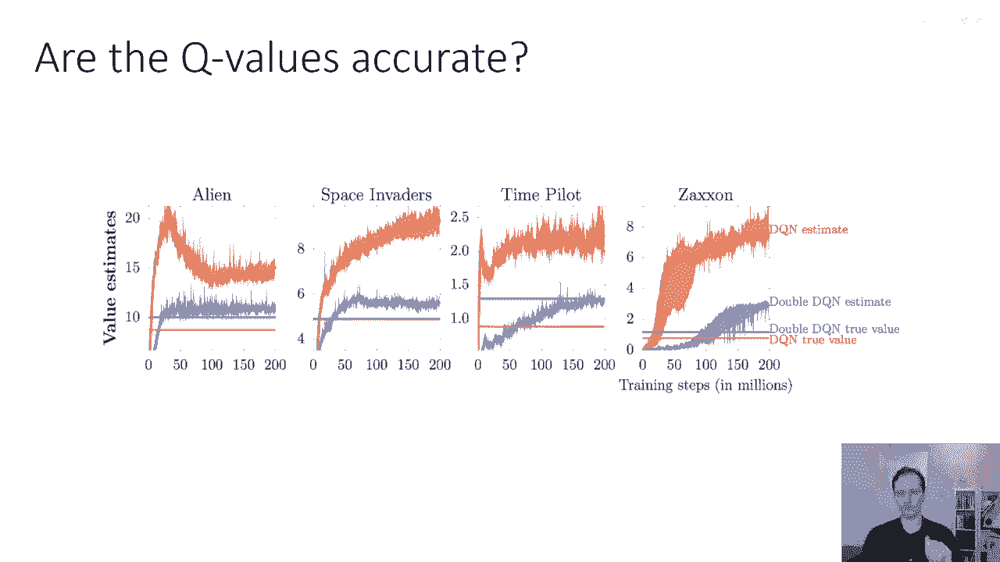
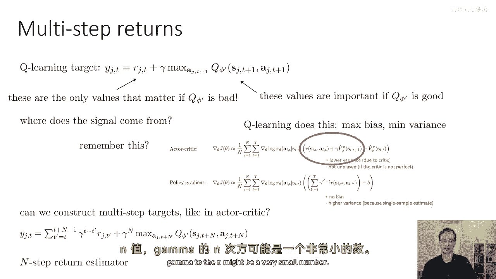
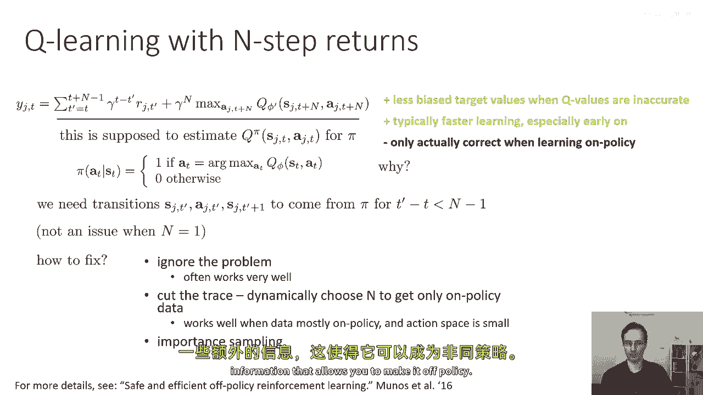
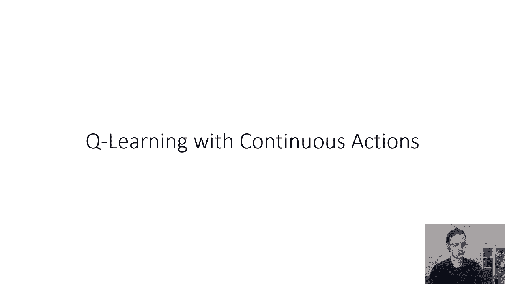

# 【深度强化学习 CS285 2023】伯克利—中英字幕 - P33：p33 CS 285： Lecture 8, Part 4 - 加加zero - BV1NjH4eYEyZ

在接下来的讲座部分中，我将讨论一些我们在实施Q学习算法时需要考虑的实际考虑因素，当实际实现Q学习算法时，然后，一些改进可以使它们工作得更好，所以，我们可以从以下几个问题开始：我们的Q值是否准确。

我们可以将Q值视为我们在强化学习中使用的一种抽象对象，以帮助我们改进我们的策略并获取那个弧度最大，但是，Q函数也是一个预测，它是对未来总奖励的预测，如果你从一个特定的状态采取行动，然后按照你的策略行动。

所以，问这些预测是否实际上准确是有意义的，预测是否与现实相符，是否与实际运行政策时得到的结果相符，所以，如果我们看看这个基本的学习曲线，x轴是Q学习迭代的次数，y轴是每集的平均奖励，在多个上我们看它。

让我们说，例如，Atari游戏，对于所有这些Atari游戏，我们的每集平均奖励都在上升，所以事情正在好转，如果我们看预测的平均q值，那就是右边的两个图表，我们将看到q函数正在预测越来越大的q值。

随着训练的进行，这直观上在训练进行时是有意义的，我们的策略变得更好，它正在获得更高的奖励，所以，我们的q函数也应该预测它正在获得更高的q值，所以，正如预测的q值增加，因此，返回也是如此。

我们也可以看看实际q值或价值函数值是否出现，在基本上预见未来奖励的地方，所以，这对那些不熟悉 breakout 的人来说，这就是 breakout 游戏，目标是使用底部的小橙色拍子击打球。

而球被拍子反射后弹起，撞击这些彩色的彩虹色块，你打破的每个块都会得到你一分，在 breakout 中，你可以做的一件特别酷的事情是，如果你打破了一边的所有块，这在面板号三中正在发生。

那么你可以让球弹到顶部，"而且它会实际上弹起撞到天花板，再反弹撞到顶部的方块"，"因为他们只会得到大量的分数，因为这只是在那里来回弹。"，"从顶部打破所有障碍"，"所以，如果你能那样突破到顶端。

那么这个策略相当 cool。"，"让它弹来弹去"，"底部的图表显示了价值函数的值"，"这实际上是在不同时间点上，以一定帧数为前提，最佳行动的q值。"，"两"，"图上标有3和4"，"而且。

你可以在这里看到，一些这些价值实际上非常有道理"，所以第一点，你将要打破一个方块，在你打破那个方块后，你的价值是最高的，你弹回下来，你的价值下降，因为你知道一段时间内你不会得到任何分数。

当你的球飞下来并需要从拍子上弹起时，在第三步，你将要突破顶部，所以你的价值变得相当大，但在第三步，你实际上并没有完全成功，所以最后那个红色方块你打破的，你打破了它，然后你弹回下来。

所以你的价值一段时间内都会下降，然后它立即回升，在第四步，你的价值实际上是最大的，尽管你实际上一段时间内都没有打破任何方块，所以第四步你只是弹开了拍子，你没有打破任何方块，但你即将反弹到天花板上。

你将获得那些疯狂的分数，这就是为什么你的价值函数实际上是最大的价值，它实际上只会从那里下降，因为当你实际上获得分数时，价值函数会下降，因为它知道你已经收到了分数，你将剩下较少的分数，所以所有这些都合理。

看起来都合理。

我们还可以查看相对价值，不同动作的q值，这些是Pong游戏的帧，在Pong中，你需要使用右侧的绿色拍子来击打球，使它反弹并去另一边，你的对手，使用橙色的拍子，需要击打它回来，你的目标有点像网球。

是击打回球，以便你的对手可以返回它，如果你的对手无法返回它，那么你将获得分数，如果你的对手可以返回它，他们可能会在你身上获得分数，因为你可能无法击打回它，在帧一中，所有动作的q值都大约相同。

花一点时间来思考为什么这可能是，为什么这，嗯，嗯，这是有道理的，因为当球离你很远时，许多不同的行动仍然允许你后来抓住球，所以即使它可能看起来移动拍子向上是正确的事情，实际上，这里使用的q函数非常好。

并且它理解，即使它无法移动划桨向上，它也能在下一个时间步移动它向上，这实际上意味着在这个时间步，不同动作的q值大约相等，一开始可能有些反直觉，但现在在第二个时间步，球已经非常接近需要返回的区域，嗯。

所以需要返回的区域，在这里，向上动作的q值现在非常大，所以q函数理解它仍然有一秒钟的机会返回球，但只有现在移动向上，所以现在向上移动的q值非常大，向下移动或保持静止的q值非常非常负，当然，在步骤四。

嗯一旦，你实际上已经返回球了，它说不同动作的值并不重要，所以再次，这基本上与我们的直觉在相对值上相符，q值与动作有关，它们与状态有关。

但存在一些问题，虽然不同状态和动作的相对q值在成功的训练中似乎有意义，但在实践中，它们的绝对值并不很好，实际上并不很预测真实值，你可以在作业三中自己验证这一点，当你实现q学习时。

你可以测量你得到的q值的数值，然后测量你实际获得的回报，并比较这两个数字，你会发现它们并不很一致，有一些细节你需要得到正确，一件事你需要得到正确是，当你计算真实值时，你必须使用折扣估计器。

所以你通过执行实际轨迹来计算真实值，并取时间步一的奖励，加上gamma乘以时间步二的奖励，加上gamma的平方乘以时间步三的奖励，等等，等等，等等，然后与步骤一的q值进行比较。

因为步骤一的q值试图预测折扣奖励的总和，所以如果你将这与实际获得的折扣奖励总和进行比较，如果你的q值是一个好的预测者，你应该看到那些是相似的，但实际上你看到的是它们并不很相似。

这些图表基本上显示了这一点，你应该看的是红色线条，你应该看红色线条，那些蓝色的线条你不用担心，我们稍后再讨论那些，但是红色的线条代表以下内容，一种尖尖的红色线条，通常更高的那一条代表你对你q函数的估计。

所以这基本上就是，所以这就是你的q函数认为的，你将获得的总折扣奖励是由实线表示的，嗯，在你运行那个策略时实际获得的折扣奖励的总和，你看到的东西是什么，那是q函数估计值总是比。

比您实际获得的折扣奖励总和要大得多，这看起来有点奇怪，像是为什么q函数似乎系统地认为它将获得更大的，奖励，实际上它并没有获得，这不是偶然，它不是仅仅因为q函数错了，而且它可以高于或低于真实奖励，实际上。

它总是更大，这就是一个非常一致的模式，你在作业三中尝试这个，你也会看到这个模式。

那么为什么，这个问题有时被称为过度估计和q学习，它实际上有一个相当直接和直观的原因，让我们看看我们是如何计算我们的目标值的，当你计算你的目标值，你取你的当前目标q函数，Q phi prime。

并且你取那个q函数关于动作aj prime的最大值，实际上这就是最大值，这就是问题，所以这就是我们可以思考为什么最大值会导致过估计的原因，让我们暂时忘记q值，并且让我们想象你有两个随机变量，X一和X二。

你可以认为也许X一和X二是正态分布的随机变量，所以它们可能它们有一些真实值，加上一些误差，你可以证明，x一和x二的最大值的期望值总是大于等于，或等于x一和x二的期望值的最大值，这种观点成立的直觉是。

当你取x一和x二的最大值时，你实际上是在选择噪声更大的值，尽管x一和x二的噪声可能具有零均值，也许它们分别是单变量高斯分布，两个零均值的噪声的最大值通常不具有零均值，所以你可以想象。

一种噪声可能是正负各占一半，另一种是正负各占一半，但是当你取两个的最大值时，如果其中任何一个是正的，你将得到一个正的答案，所以当然，一个噪声中一个为正的概率将会非常高对吧，所以为了它们两个都是负的。

那只有百分之二十五的概率，一个为正的噪声，那就是百分之七十五的概率，所以有百分之七十五的概率，当你取他们最大值的期望值时，你将得到一个正数，当你取他们期望值最大值时，你将得到零，因为他们的期望值是零。

但是当你取最大值的期望值时，你现在将得到一个正值，这与q学习良好有什么关系，如果你想象你的q函数不是完美的，如果你想象你的q函数有点像真正的q函数加上一些噪声，那么当你取这个最大值在目标值时。

你做的就是这个，所以想象你的q五 prime对于不同的动作代表那个动作的真实q值，加上一些噪声，所以它可能上上下下，而且这些错误不是偏的，所以这些错误只是正负都有可能，但是当你取最大值在目标值时。

你实际上是在选择正误差，为同样的原因，x一和x二的最大值的期望值大于，或者等于他们期望值的最大值，对动作的最大值将系统地选择正误差，这意味着它将系统地过高估计真正的q值。

即使你的q函数最初并不系统地有正负误差，所以对于这个原因，对q phi prime s prime的最大值，一个prime系统地过高估计下一个值，它基本上优先选择正方向的误差。

那么我们如何修复这个问题呢？一种我们可以考虑的修复方法是，这是注意到，如果我们回想到fit a q迭代，我们得到这个最大值的方式是通过基本上修改政策迭代程序，所以我们有了我们的贪婪政策。

它是arg max over a prime，然后我们将arg max送回到我们的q函数中以获取其值，所以，这就是另一种说法，max over a prime of q phi prime。

就是q phi prime在arg max处评估的值，这实际上是我们将要使用的观察，尝试减轻这个问题，问题是我们根据q phi prime选择行动。

所以如果q phi prime错误地认为某些行动稍微好一点，因为某些噪声，那么我们将选择这个行动，然后我们将用于目标值的值是该同一行动的值，这个值有相同的噪声，如果我们可以。

在某种程度上去相关行动选择机制中的噪声与价值评估机制中的噪声，那么这个问题可能就会消失，所以问题在于价值也来自相同的q phi prime，它具有我们用于选择行动的规则相同的噪声，好的。

所以减轻这个问题的一种方法是使用被称为双q学习的东西，如果给我们价值的函数与选择行动的函数去相关，原则上这个问题应该消失，所以想法是只是不使用选择行动的网络，作为评估价值的网络。

所以双q学习使用两个网络，一个网络我们将其称为phi a，另一个网络，我们将其称为phi b和phi a，phi b用于评估目标值，但是根据phi a选择行动。

如果你假设phi b和phi a是去相关的，那么phi a为arg max选择的行动将被一些噪声腐蚀，但这与phi b的噪声不同，这意味着当phi b评估这个行动时，如果行动是因为有积极噪声而被选择的。

那么phi b实际上会给它一个更低的值，所以系统会自我纠正，然后类似地，phi b由使用phi a作为目标网络的phi a更新，由使用phi b作为行动选择规则的phi b更新，这就是双q学习的本质。

其目的是关联你选择行动的方式，从你评估那个行动的值的方式，所以如果两个q网络以不同的方式噪声，那么在原则上问题应该消失，现在实际上，我们实现双q学习的方式是 uh，没有实际上添加另一个q函数。

但实际使用我们已经有的兩個q函数，所以我们已经有一个phi a，Phi prime，它们是不同的网络，所以我们只会使用这些来代替phi a和phi b在标准q学习中，如果我们写成这种arg max方式。

这是完全等价的，我们的目标值是q phi prime，在双q学习中，我们通过在q phi prime中寻找最大值来评估它，我们使用q phi来选择动作，但使用q phi prime来评估它，所以现在。

只要phi prime和phi不是太相似，那么这些就会相互独立，所以这是我们唯一使用phi来选择动作而不是phi prime的地方，我们仍然使用目标网络来评估我们的价值，以避免这种移动目标的问题。

现在可以说我们仍然有一些移动目标的问题，因为当我们的phi改变时，我们的动作也会改变，但显然弧度的最大值变化是一个突然的离散变化，而且它并不总是发生，所以如果你有，你知道，三种不同的动作。

弧度的最大值不会改变，那么频繁，现在，我想在这里提到的一件事是，并且许多你们可能已经正在思考这个问题，phi prime和phi当然不是完全无法分开的，因为定期你会设置phi prime等于phi。

所以解决方案远非完美，它并没有完全相互独立phi prime和phi，但在实践中，它实际上往往工作得很好，它实际上减轻了大部分过度估计的问题，但当然不是所有，好的，我还应该提到一种技巧。

我们可以用来改进q学习算法，它与我们在演员批评讲座中看到的类似，那就是使用多步回报，所以，我们的q学习目标，我在这里故意以时间为写它，步骤是rt加上在t+1处的最大值，那么在这个学习过程中。

信号来自哪里呢，如果你的初始q函数非常差，基本上是随机的，那么，几乎所有，几乎所有你的学习都必须来自r，如果你的q five prime很好，那么目标值主要承担重担。

如果你的q five primes不好，那么只有奖励真正重要，并且第二个术语基本上只是在贡献范数，在训练初期，你的q函数很坏，所以几乎所有你的学习信号都来自奖励，在训练后期，你的奖励知道你的。

你的q函数变得更好，并且q值比奖励大得多，在训练后期，q值主导，但是，你的起飞，你的学习初期可能会非常缓慢，如果你的q函数不好，因为目标语言主要由q值主导，所以这与我们在演员批评中看到的情况相当。

当我们谈论如何更新，嗯，使用奖励的演员批评风格时，加上下一个值的方差更低，但它不是公正的，因为如果价值函数错误，那么你的优势值将被完全混乱，q学习也是如此，如果q函数错误，那么你的目标值将非常混乱。

我们在演员批评讲座中提出的替代方案是使用蒙特卡罗，奖励的总和，因为奖励总是真实的，它们只是方差更高，因为它们代表单个样本估计，我们可以在队列学习中使用相同的基本概念，所以q学习，嗯，默认情况下。

执行这种一步后退，它有最大的偏差和最小的方差，但你可以构建多步目标，就像演员批评一样，花一点时间想象这个多步目标会是什么样子，如果你面前有张纸，考虑写下来，然后你可以检查你写下的对比。

我即将在下一滑片中告诉你的内容，抱歉，实际上，它实际上在这张滑片中，所以嗯，构建多步目标的方式基本上与在演员批评讲座中看到的完全相似，所以你构建你的多步目标的方式是不仅仅使用一个奖励。

而是从t'等于t到t+n-1的一个小和，对于每个这些，你将rjt'乘以gamma，T-t'，你可以验证，如果n等于1，那么你将恢复我们为q学习设定的标准规则，但对于n大于1，你将多个奖励值相加。

然后使用你的目标网络来计算t+n步，乘以gamma到n，所以这有时被称为n步回报估计器，因为它不是只计算一步的奖励，而是计算n步的奖励，你为n步进行求和，所以这就是n步返回估计器，就和演员批评一样。

权衡，n步返回估计器的是它给你更高的方差，因为这个对r的单个样本估计，但更低的偏差，因为即使你的q函数现在错误，它正在被乘以gamma的n次方，并且对于大的值n。

gamma的n次方可能是一个非常小的数字。

好的，那么让我们谈谈n步回报的Q学习，因为它因为q值被一个小数乘以，所以较少偏倚，并且通常在早期更快，因为当目标值不好时，那些奖励的总和真的给你提供了很多有用的学习信号，不幸的是，一旦你使用n步回报。

这实际上是对q值的一个正确估计，当你有一个在政策样本时，所以这是由于如果你使用不同的政策收集了样本，那么对于你的新政策，第二步t+1可能实际上是不同的，因为如果在第二步你采取了不同的行动。

那么这将匹配你从最终步骤返回的结果，所以n步返回从本质上已经不再适用于离政策数据，对于离政策数据，从技术上，你只被允许使用n等于1，当n等于1时，一切都非常清楚。

因为你实际上没有在任何地方假设你的过渡来自你的政策，你的q函数条件基于动作，这样对于任何策略都是可行的，并且在第二个时间步，这里将重要的地方，如果你实际上以动作为最大，你不使用实际采样的动作。

当n等于一时，做离策略是合法的，但当n大于一，它就不再有效，基本上你的新策略可能永远不会落在状态，S j t plus m，所以，你为什么实际上会使用样本中的动作来进行这些中间步骤呢？

这并不是你的新政策在思考实验中会采取的行动，这是一个有趣的想法，而且，这是在讲座后你可以在家里思考的事情，你可以想象如何利用我们使用这个技巧的方式来做，离策略Q学习，尝试使用这个离策略的n步版本。

作为制作离策略n步版本的提示，你不能再学习Q函数了，你必须学习一些其他依赖于其他信息的对象，如果你想一想你可以如何做到这一点，这可能会给你提供一种更好的直观理解，关于如何给予你。

关于为什么Q学习可以离策略，所以，作为讲座后的作业练习，也许花一点时间来思考如何使n步返回离策略，以及你需要学习什么样的对象才能使这成为可能，我们从常规n步返回得到的估计是pi的q估计。

但你需要所有中间步骤的pi过渡，但这不是问题，当n等于一时，那么我们如何修复它，我们可以忽略那些经常工作得很好的问题，然后，我们可以做的另一件事是动态地截断轨迹，所以我们可以动态选择n。

只获取符合政策的数据，本质上，我们可以看看我们的确定性贪婪政策会做什么，我们可以看看我们在样本中实际上做了什么，并且我们可以选择n是最大的值，使得所有的动作都精确地匹配我们的政策将会做的，然后。

我们还会移除偏差，所以这工作得很好，当数据主要集中在政策上，并且动作空间很小，我们还可以做的另一件事是重要采样，所以我们可以构建一个随机政策和重要性权重，这些n步回报估计器，我不会详细讨论这个。

但如果你想了解更多关于这个，去看看这篇叫做安全且有效的离线策略的论文，强化学习，通过奖励学习一切，然后，我还有一个你没有听说过的神秘解决方案，在那里，你不做这些事情。

但你对一些其他附加信息的q函数进行条件，这使得你可以使其脱政策。

