# 【深度强化学习 CS285 2023】伯克利—中英字幕 - P34：p34 CS 285： Lecture 8, Part 5 - 加加zero - BV1NjH4eYEyZ

到目前为止，当我们讨论Q学习算法时，我们主要关注具有离散动作空间的算法，实际上，这可能，但稍微更复杂地将Q学习程序扩展到具有连续动作的情况，这就是我在接下来的讲座部分要讨论的内容。

所以让我们谈谈具有连续动作的Q学习，连续动作的问题在哪里，嗯，问题是当你选择你的行动时，你需要执行这个arg max，对一个离散动作的arg max来说相当直接，你只需要对每个可能的动作评估q值。

并选择最佳的一个。

但当你有连续的动作时，嗯，这当然要困难得多，这出现在两个地方，在评估argmax策略时，和在计算目标值时，这需要max，或者在双q学习的情况下，也是一个arc max，所以，目标值的最大值特别有问题。

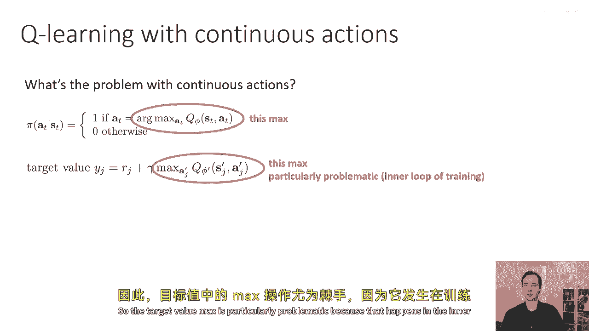

因为那是训练内部循环中发生的，所以你真的希望这非常快和高效。

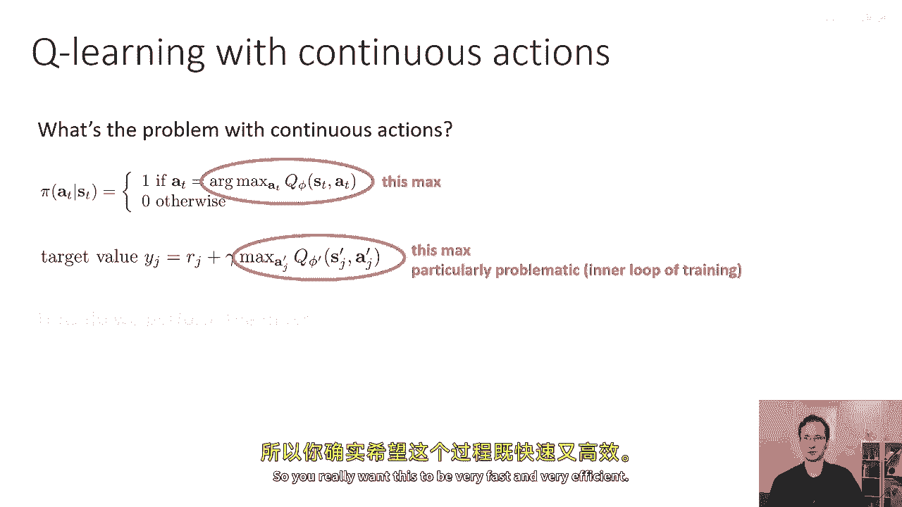

那么，当我们有连续动作时，如何进行这个最大值，我们基本上有，嗯，三种选择，选项一是使用像样的连续优化程序，例如，梯度下降现在，"仅仅使用梯度下降可能会很慢，因为它是"。

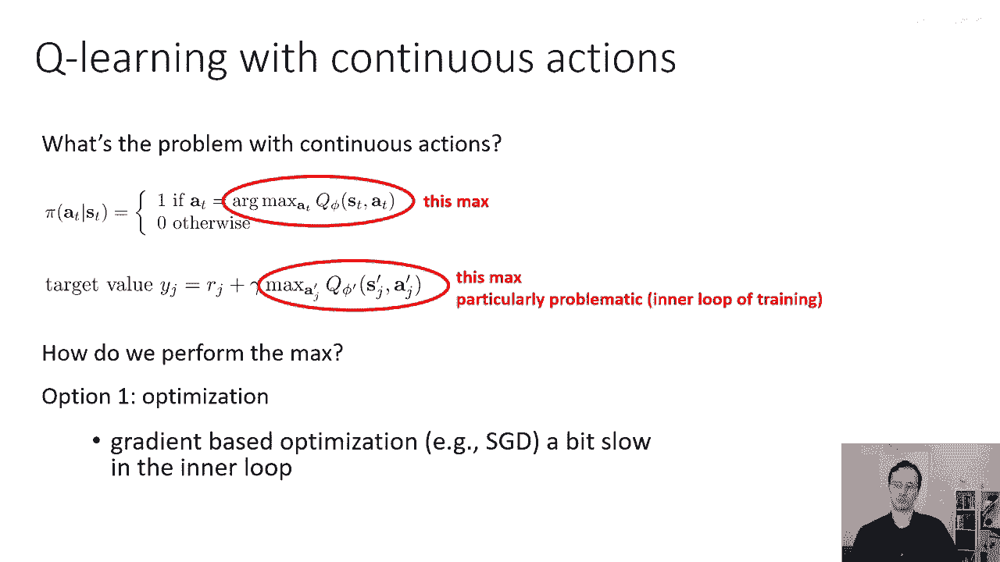

你知道，"它需要多个步骤的评分计算"，"这在外层循环学习过程的内部循环中发生"。

所以，我们有更好的选择可以使用，"并且我们的动作空间通常较低维"，所以，从某种意义上说，它提出了一种比我们通常处理的问题稍微更容易的优化问题。

"新币"，因此，我们发现在优化中评估最大值，一个非常好的选择是使用无导数的随机优化程序。

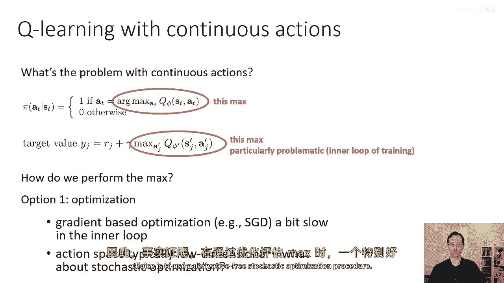

那么让我们稍微谈谈这个问题。

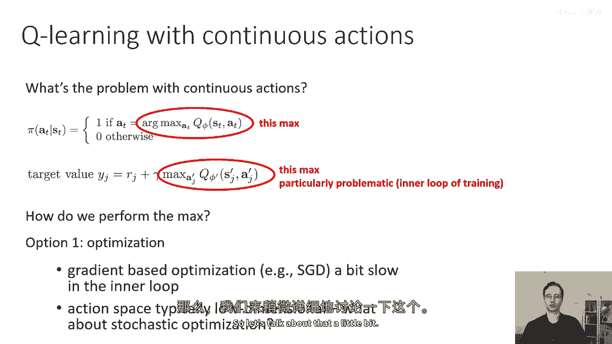

一个非常简单的解决方案是简单地近似在一个连续的行动集上的最大值，作为在随机采样的动作集上的离散最大值。

所以，例如，你可以从有效的动作集中随机采样一组n的行动，可能是均匀分布的，然后取那些行动中q值最大的一个，那现在这不会给你精确的最大值，它会给你一个非常近似的最大值，但是如果你的行动空间比较低维。

并且你可以用足够的样本来轰炸它，这个最大值可能实际上相当好，当然，如果过度估计是你的问题，这个可能实际上会遭受过度估计或更少，因为最大值不如有效，这有优势在于它非常简单，因为它非常高效。

因为基本上可以使用你最喜欢的，嗯，深度学习框架，并简单地将这些不同的行动视为迷你批量中的不同点，并同时评估它们，问题是它不准确，尤其是在行动空间维数增大时。

这种随机采样方法实际上不能给你一个非常准确的最大值。

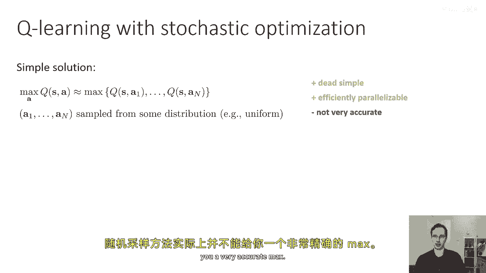

但可能我们不在乎那个，也许如果过度估计是我们的问题。

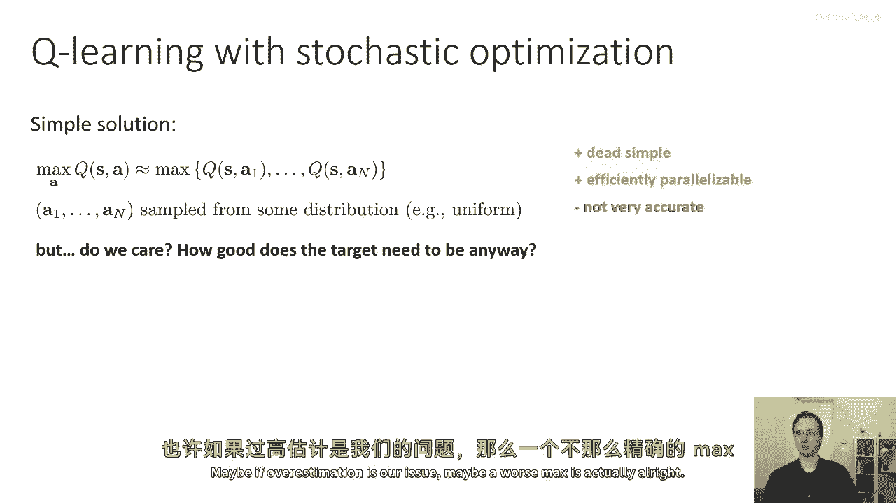

也许一个更差的最大值实际上是可以的，如果你想要更准确的解决方案。

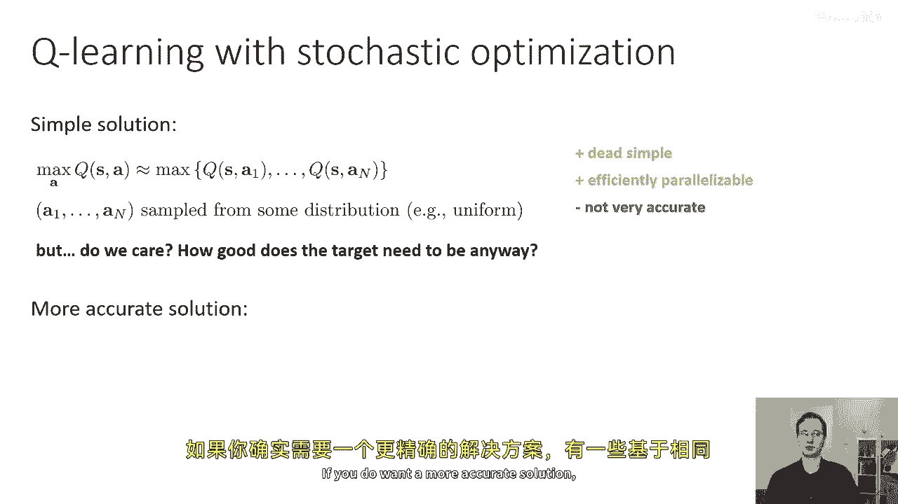

有更好的算法，它们基于基本相同的原理。

所以交叉熵方法是一种简单的迭代随机优化方案，我们将在讨论基于模型的rl时讨论更多，直觉上，交叉熵方法仅包括采样动作集。

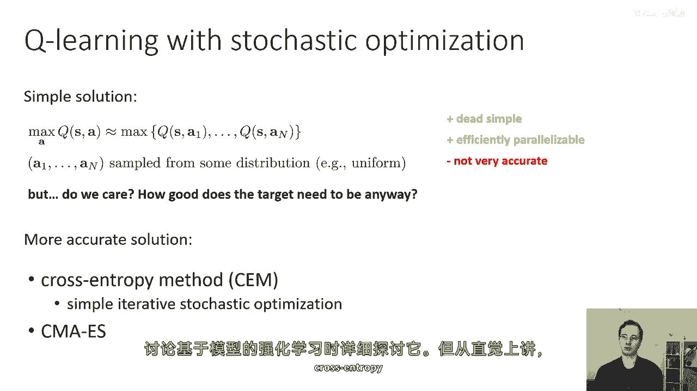

就像上面的简单解决方案一样，但然后，而不是简单地取最佳一个，交叉熵方法精炼你从中采样的分布到，然后从好的区域采样更多的样本，然后重复。

这也可以是一个非常非常快的算法，如果你愿意并行化，并且你有一个低维的行动空间，Cma，是的，你可以把它想成一种更复杂的cm版本。

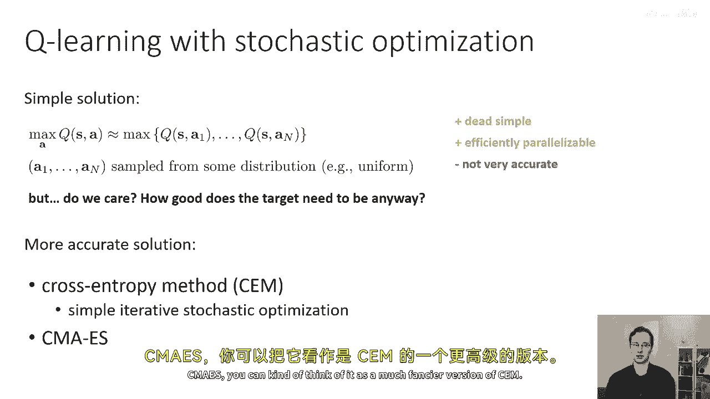

所以它远不如简单。

嗯，但是嗯，结构上非常相似，这些方法工作，好的，对于大约四十维的行动空间，它们工作，所以如果你使用这些解决方案。

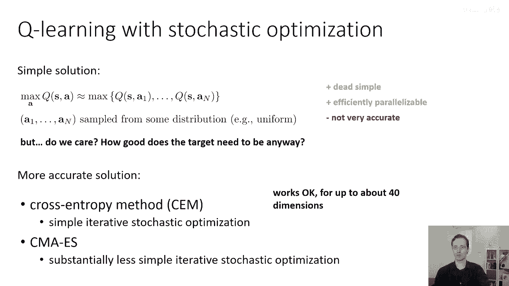

你只需将此替换为您的arg max来找到最佳行动。

并其余部分的q学习过程基本上保持不变。

另一个你可以使用的选项，选项二是使用一种固有容易优化的功能类，所以任意神经网络并不容易优化，相对于它们的输入，但是其他功能类有闭合形式的解决方案为其极值。

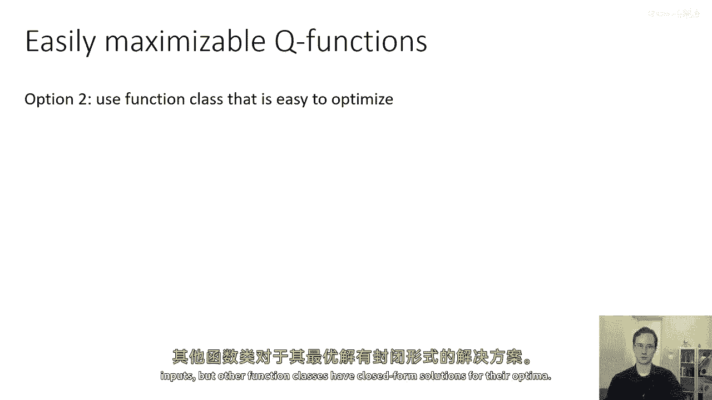

这种函数类的一个例子是二次函数，所以你可以，例如，将你的q函数表示为一个在动作上二次的函数。

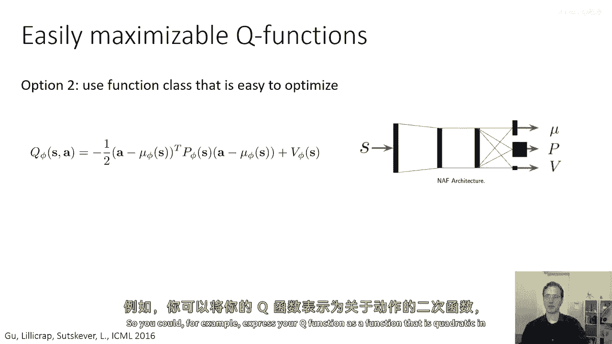

并且二次的最优解有一个封闭形式的解决方案。

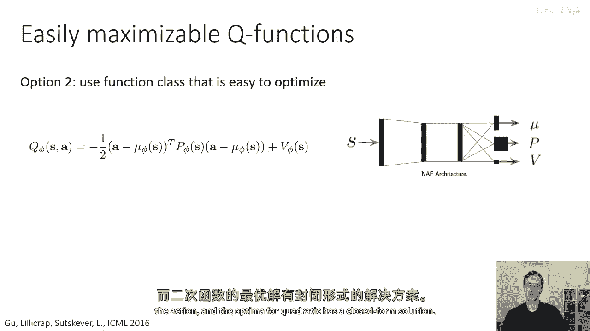

所以你可以做到这一点之一，这是本文中由十六提出的nnaf架构，是拥有一个输出三个量的神经网络。

一个标量，有值的偏置，向量值和矩阵值，向量和矩阵一起定义在动作上的二次函数，所以，这个函数在状态上完全非线性，它可以代表状态的任何函数。

但对于给定的状态，在动作上的q值形状总是二次的，当总是二次时，那么你总是可以找到最大值，在这种情况下，最大值就是mu phi of s，只要p五s是正定矩阵，所以这叫做归一化的优势函数。

它被称为归一化的原因是如果你对它进行指数。

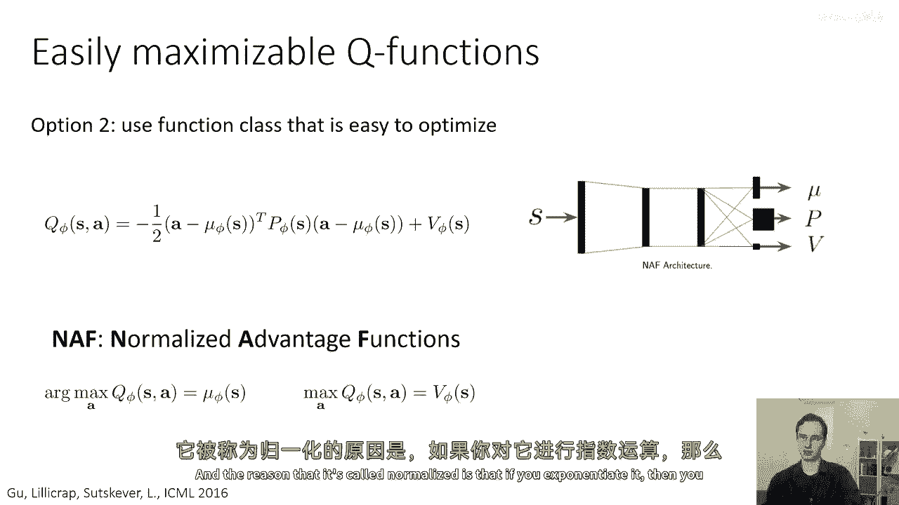

那么你会得到一个归一化的概率分布，所以q phi的弧最大值是mu phi，最大值是v phi。

所以现在我们已经使这个最大化操作变得非常容易，以牺牲我们q函数的表示能力为代价，因为如果真正的q函数不是在动作上二次的。

那么我们当然面临的问题是我们不能精确地代表它。

所以算法没有改变，它就像Q学习一样高效。

但它失去了一些表示能力，好的，我将讨论的最后一个选项是使用连续动作进行Q学习。

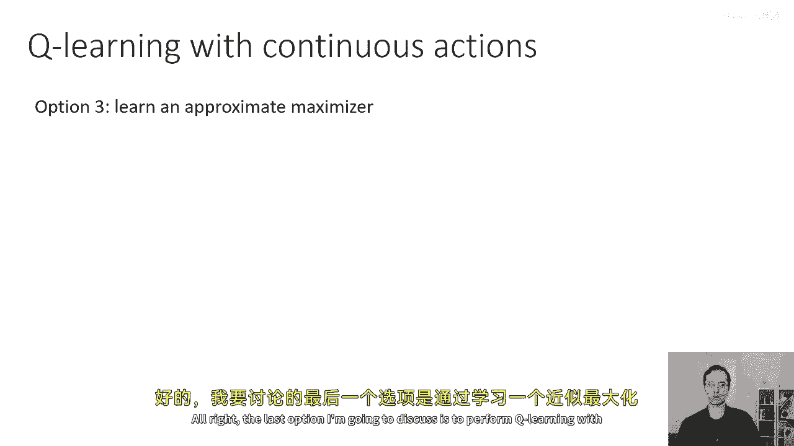

通过学习一个近似的最大化器，这将与选项一相似一些，只是相反于我们不得不为每个单独的，嗯，我们要采取的arg max，我们将实际上训练第二个神经网络来执行最大化。

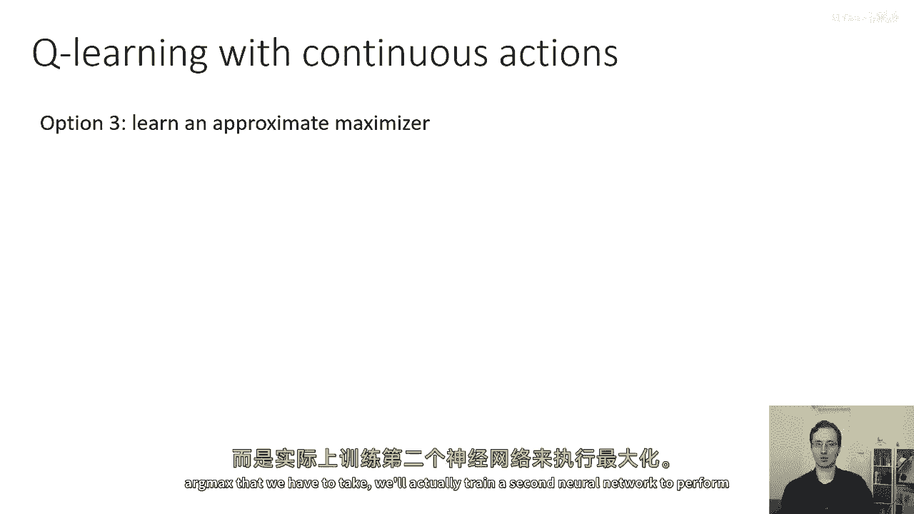

所以我将要描述的特定算法与ddpg最密切相关，按照这个说法，我明确指出那是十六，但是ddpg本身几乎与另一个被称为nfq ca的算法相同，这个算法被提出要早得多。

所以你可以相当于把这个看作是基本上nf pca，这个算法也可以被解释为一种确定性的演员批评方法，但我认为实际上把它概念上想成q学习算法是最简单的。

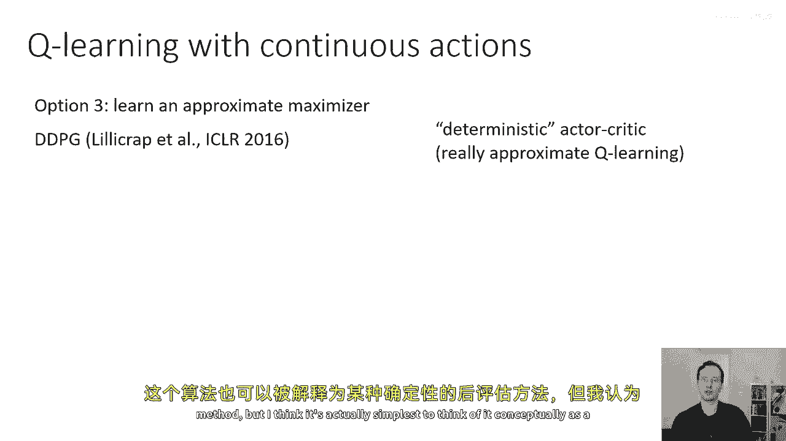

所以记住，我们的max over a of q phi s a就是q phi。

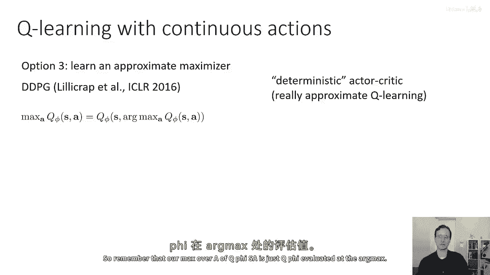

在arg max处评估，只要我们可以做到那个arg max，我们就可以进行q学习，所以想法是训练另一个网络，Mu theta s，使得mu theta s大约是q phi的arg max。

你也可以把mu theta s看作是一种策略，因为它看着一个状态并输出动作，特别是arg max动作，我们如何做得好，你只需要解出theta来找到在s处最大化q phi的theta，逗号缪西格玛西格玛。

所以基本上，嗯。

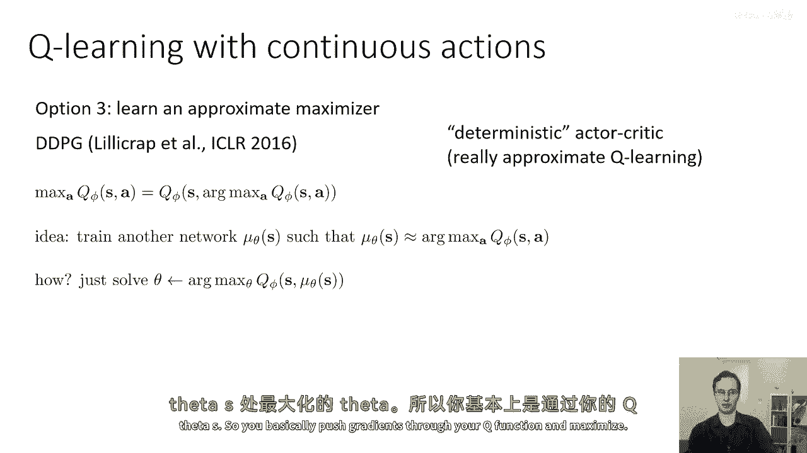

将梯度推通过你的q函数并最大化，你可以使用链规则来评估这个导数，所以dq phi d theta就是da d theta，这是缪西格玛西格玛的导数乘以dq phi da。

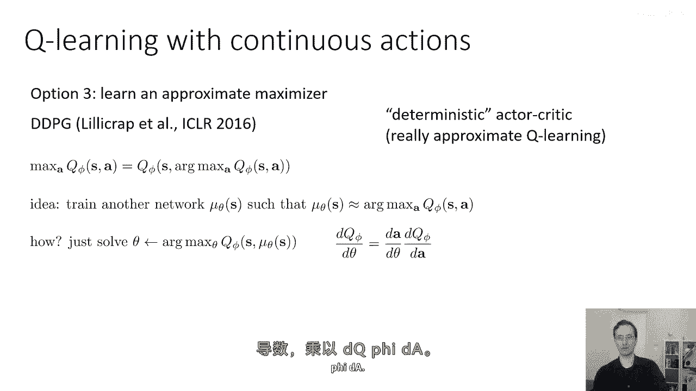

所以你可以通过反向传播通过q函数来获得这个导数，并进入然后进入缪参数，所以现在我们的目标将由嗯，当y等于rj加上gamma乘以q在s'j处的导数时。

逗号mu theta，s'j，这实际上是对arg max的近似。

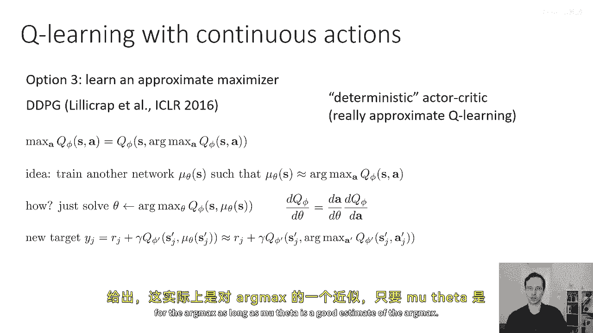

只要mu theta是对arc max的好估计，所以，这个算法看起来像这样，步骤一采取一些行动，Ai观察相应的过渡，Si a i Si'ri并添加到您的缓冲区。

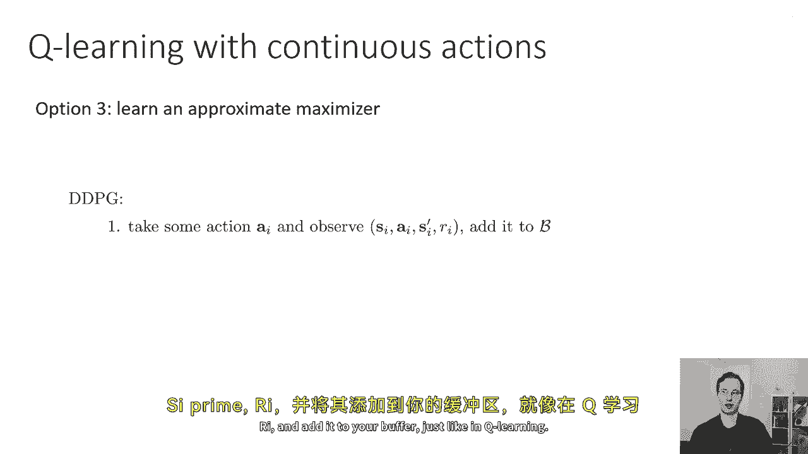

就像在q学习中一样，步骤二：从缓冲区中随机均匀地采样一个小批量，从你的缓冲区中随机采样sjajsj'prime和rj。

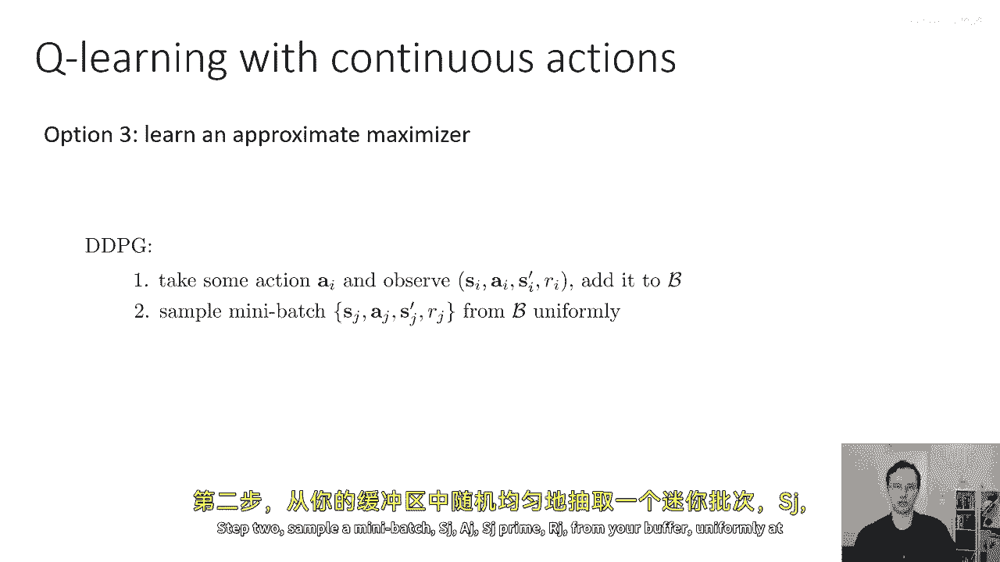

步骤三：计算你的目标值，现在，不再使用arg max，你将使用mu theta。

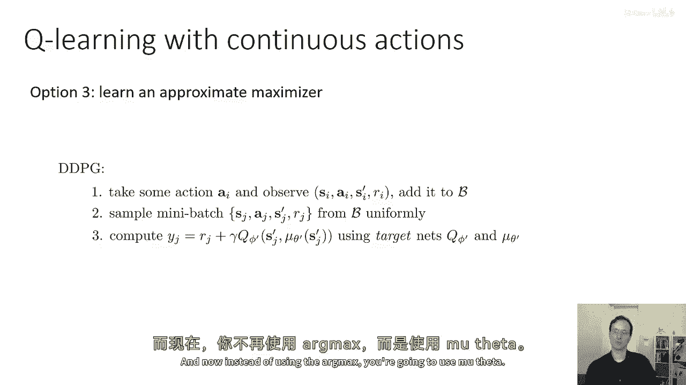

实际上，你将使用mu theta'prime，所以你应该有一个目标网络qphi'prime和一个目标网络mu theta'prime。

然后，步骤四就像在q学习中，对phi进行梯度更新，此外，我们现在将对theta进行梯度更新，所以，θ的梯度使用链规则计算，我之前幻灯片展示的梯度求导，所以，它以动作为变量对q值进行求导。

然后乘以以θ为变量对动作的求导，这就是通过μ的反向传播，然后我们将更新我们的目标参数，Phi'和Theta'，例如，使用多平均。

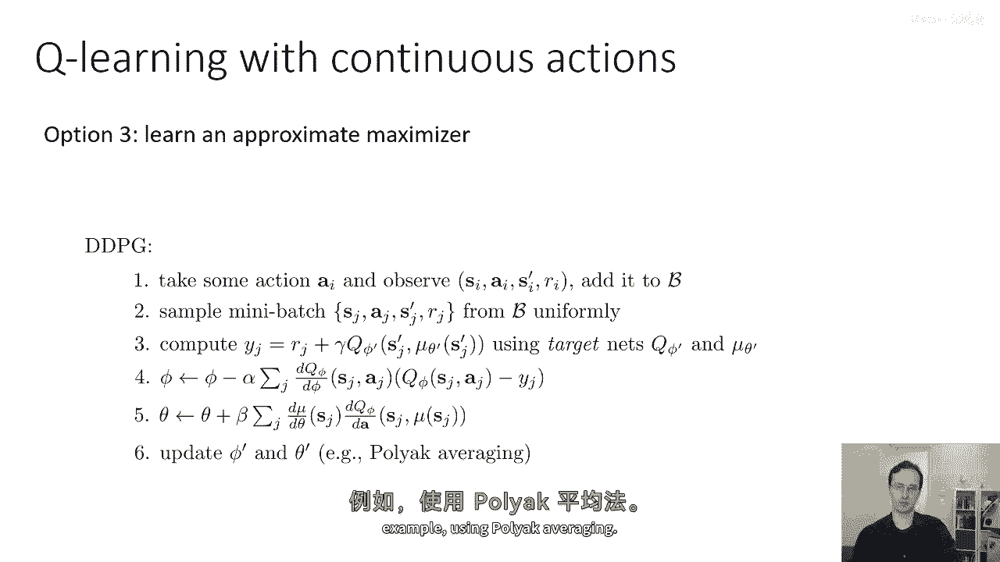

然后我们将重复这个过程，所以，这就是一个连续动作Q学习算法的基本伪代码，在这种情况下，这个特定的算法是dpg。

但是，还有许多更近的变种以及旧的变种，所以，对于这项经典的工作，你可以查看一下一个叫做nfq ca的算法，对于更近的变种。

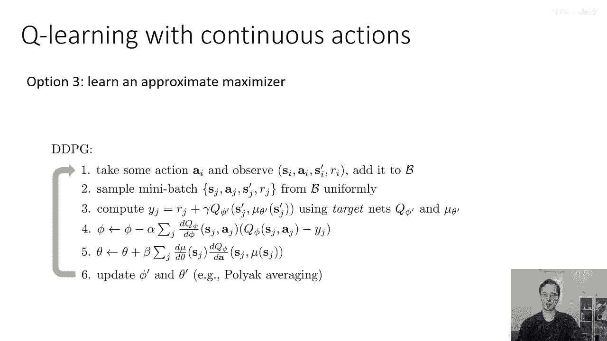