# 【深度强化学习 CS285 2023】伯克利—中英字幕 - P3：p3 CS 285： Lecture 1, Introduction. Part 3 - 加加zero - BV1NjH4eYEyZ

我们为什么今天要学习深度强化学习，正如我之前提到的，大数据驱动的大型人工智能系统的最近进展已经导致了一些令人印象深刻的结果，但是，被训练来仅仅复制人类产生的数据的方法，它们主要令人印象深刻。

因为它们产生的结果看起来像是人类生成的结果，但在许多情况下，我们实际上想要算法，它们会比人类数据做得更好，典型的人类数据，或者是因为人类数据不好，或者是因为它很难获得。

或者是因为我们真的需要最高的可能性能，就像阿尔法狗的情况一样，我们想要令人印象深刻的解决方案，因为机器不需要被告诉如何做某事，因为它自己发现了，因为我发现了一个更好的解决方案。

或者因为我发现了一个解决方案，在他没有人类预见力的情况下，以提供需要的训练数据，所以记住，许多这些非常成功的基于数据的方法都工作，基于密度估计，这有特定的含义。

这意味着这些方法将产生人类倾向于产生的数据类型，但这也意味着它们在某种程度上不会超越人类的良好行为，它们可能会在索引到人类数据方面做得更好，正如大语言模型无疑的情况一样，它们有很多知识。

但不一定在利用这些知识来解决具体问题方面更好，如果你告诉一个大语言模型，例如，让它说服某人它是，嗯，你知道，为了 their 最好利益，去看医生，语言模型可能无法比人更有效地说服他们，嗯。

尽管它具有巨大的 uh 互联网知识库可以引用。

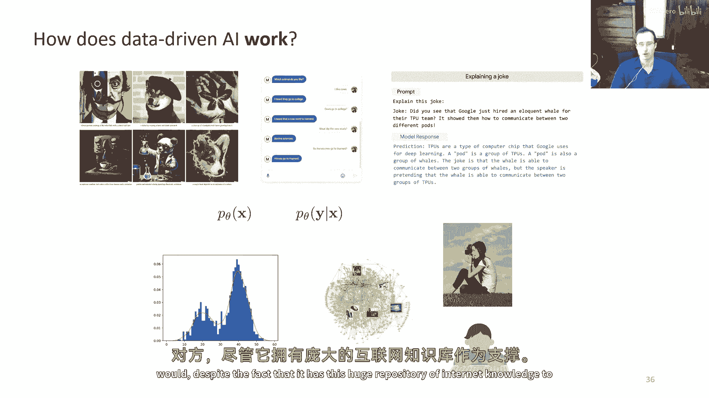

那么这留给我们的是什么 well，我们有这些数据驱动的 ai 系统，它们从数据中学习关于真实世界的知识，可能巨大的数据量，但它们并没有真正试图在任何有意义的意义上优于数据，而且我们有这些强化学习系统。

它们可以优化一个目标，以出现的行为，而且，这似乎应该解决这些数据驱动AI方法的主要缺点，但当然，我们需要找出如何大规模使用这些强化学习方法，我们需要将它们与大规模的模型和大数据集结合。

这些模型和大数据集在以前非常成功，这就是深度学习在深度强化学习中真正发挥作用的地方，所以，数据驱动AI都是关于使用数据的，强化学习都是关于优化的，深度强化学习是关于这种大规模优化的，而且。

没有优化的数据基本上不允许我们解决新问题，以新的方式，这可能使我们能够非常擅长在大数据集中索引，找出像人类一样的解决方案。

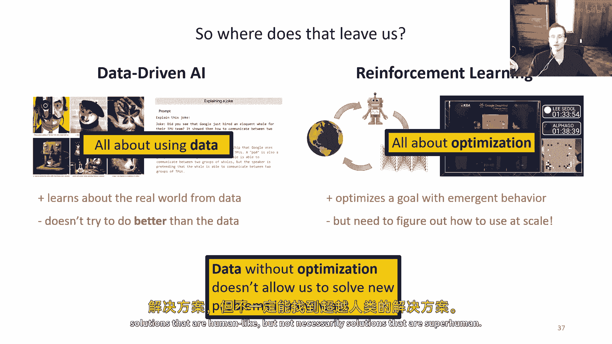

但不一定是超过人类的解决方案，这是我经常提到的一件事，在这个讨论的背景下，是理查德·苏顿写的一篇文章，所以理查德·苏顿实际上是强化学习的先驱，他是基本上使强化学习和计算机科学流行起来的人，而在那之前。

它实际上是一个研究领域，主要在心理学中，因此，在许多方面，他都可以说是在计算机科学中创立了强化学习的研究领域。理查德森，在2019年写了一篇论文，标题叫做'苦涩的教训'，那些还没有阅读它的人。

我强烈建议你们，去阅读一下，它提供了一种非常简洁和清晰的解释，或者我们为什么在过去几年中看到了数据驱动人工智能的革命，而且，在那篇论文中，他写道，我们必须学习到在建设过程中必须吸取的苦涩教训。

我们如何认为自己思考并不重要，因为在长期内它不起作用，看起来可以无限扩展的两种方法是学习和搜索，他所在这里争论的实质是，如果我们想要非常强大的学习机器。

我们应该建造能够非常擅长使用数据并且能够被大规模扩展的机器，并不一定要那么担心工程这些系统，以便它们能够像人类解决问题那样解决问题，例如，我们可能会想象构建一个系统来检测汽车。

 somehow 工程师 制作一些 传感器 如 车轮 和 uh， 和 车头 大灯 以及 类似的东西， 然后 尝试 在 那里 编程。

 一辆 有 四只 车轮 和 前面 两只 车头 大灯 和 后面 两只 大灯 的 车， 所以 如果你 看到 一些 车轮 和 大灯， 哦， 那 可能是 一辆 车， 我们可以 基本 上 在那个 上 编程。

 那就是 人们 以前 建立 计算机 视觉 系统 的实际方法， 可能 大约 十年 前，但现在我们很少那样构建感知系统，相反，我们得到的是许多汽车的例子，并标记它们为汽车，让计算机自己去理解。

这就是理查德·苏顿所说的，我们不应该那么担心在构建中，我们如何认为问题应该被解决，而是应该专注于可扩展的学习机器，机器学习社区已经，有了，"关于我们应到这种组件中建设到什么程度的持续辩论"。

"这就是为什么这篇文章如此有影响力的原因"，"但是，很多阅读这篇文章的人带走了一种有趣的感觉"，"嗯，印象"，"也许重点真的在于规模上"，"而且并不是特别关注正在被放大的算法"，所以也许这样可以。

"如果我们仅仅考虑"，"让我们假设监督学习方法"，"只要咱们能弄清楚如何基本地将更多的数据输入到GPU中"，或者建立更大的服务器农场，这就是所有必要的，嗯，数据加上大量的机器，大量的计算机。

而且不担心问题如何解决，但这并不是论文的实际意思，注意它怎么说学习与搜索，它没说学习与GPU，它没说学习与大数据集，说学习与搜索，而且有非常重要的原因，学习是关于从数据中提取模式的，你看世界。

你拉入一些数据，然后你训练一些学习机器在那上面，它找到那里的模式，搜索是关于使用计算来提取推断的，苏顿在使用搜索这个词时，使用了一个非常特定的，非常技术性的意义。

那在强化学习搜索中普遍使用的并不意味着像星搜索那样，搜索必然意味着某种计算或优化，并且你用来提取推断的，所以搜索不是关于获取更多的数据，搜索是关于利用你已经有的达到更多的，嗯，有趣的和更有意义的结论。

搜索本质上是优化，一种使用通常迭代计算来做出理性决策的优化过程，并且重要的是要有这两种东西，因为学习让你理解世界，搜索让你利用理解来产生有趣的涌现行为，你真的需要两者。

如果你想在真实世界中做出灵活、理性和最优的决策，你需要理解世界如何运作，然后，而不是仅仅使用你的理解来重复你看过的东西，使用那个理解来找到一个比你看过的更好的解决方案，这就是深度强化学习试图做的事情。

没有优化的数据不允许我们在新的方式解决新问题，没有数据，没有经验的优化，在模拟器之外的实际世界中应用起来很困难，在那里你可以写下运动方程，但如果你有这两个东西。

那么你就可以开始以更有效的方式解决实际世界问题。

我应该在这里添加一些哲学，这种观点不仅仅关于如何控制机器人或如何玩视频游戏，特别是在前面的部分中特别强调，深度强化学习方法已经被成功地应用于一系列其他领域，实际上，这里有一个深层次的原因，嗯。

为了尝试理解这个原因，让我们问一个非常基本的问题，让我们问这个问题，我们为什么需要机器学习，嗯，作为帮助我们回答这个问题的旁白，我们可以问一个甚至更基本的问题，我们为什么需要大脑，嗯。

神经科学家丹尼尔·沃尔珀，他对大脑了解得很多，他对这个话题说过这样的话，他说我们只有一个大脑的原因，只有一个原因，那就是产生可适应和复杂的运动，运动是我们影响周围世界的唯一方式，我相信。

理解运动就是理解整个大脑，现在，你不会惊讶地知道，丹尼尔·沃尔珀在运动控制神经科学的研究中工作，但我认为这个引言非常有启发性，我认为我们可以将同样的直觉应用于机器学习，并形成这个假设。

也许我们只需要机器学习只有一个原因和一个原因，那就是产生可适应和复杂的决策，这很有道理，就像你的大脑对你有用，只要它能移动你的身体，因为它是唯一影响周围世界的方式。

机器学习系统只有在它能做出好决策时才有用，因为这是它输出的唯一东西，现在我们可以从这个角度看待所有机器学习问题，不是预测问题，而是决策问题，这是显而易见的，如果你在控制机器人，你的决定是如何移动关节。

如果你在驾驶汽车，你的决定是如何驾驶汽车，即使是像计算机视觉系统这样的末端，它也是一个决策系统，如果我做出决定，这可能是图像标签，但实际上，决定的影响在于图像标签下游发生的事情，嗯。

也许这个感知系统正在检测路口有多少辆车，并且这个标签将被用于确定如何路由交通，因此它具有长期的影响，也许计算机视觉系统在安全摄像头中检测到人，并且如果它看到不应该在那里的人，它将叫安全。

这无疑可能是导致一些非常复杂和困难的结果，嗯，的模型结果，如果你将机器学习问题的所有结果视为决策，那么它变得更加清楚，所有的机器学习问题实际上都是强化学习，在伪装的问题中。

只是我们有特权使用监督标记的数据，这可以帮助我们解决，虽然这个视角可能稍微有些简化，但我认为记住这一点很重要，因为它真的告诉我们构建这些组件，学习和搜索不仅仅是我们想要机器人和视频游戏玩耍的特殊事物。

但它们实际上是人工智能系统的一般构建块，这带我们来到了一些大问题，如我们如何构建智能机器，非常一般的智能机器，不仅仅是可以检测物体和图像的机器，你知道。

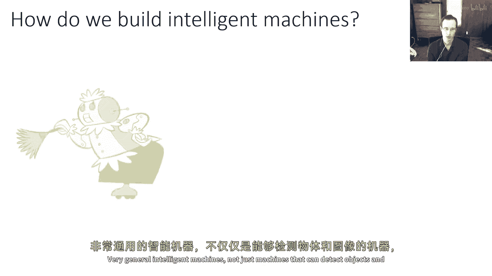

像这样或这样或这样，或者如果你更邪恶，像这样或这样，那种在科幻小说中捕获想象力的智能机器，也许它们还有一段距离。

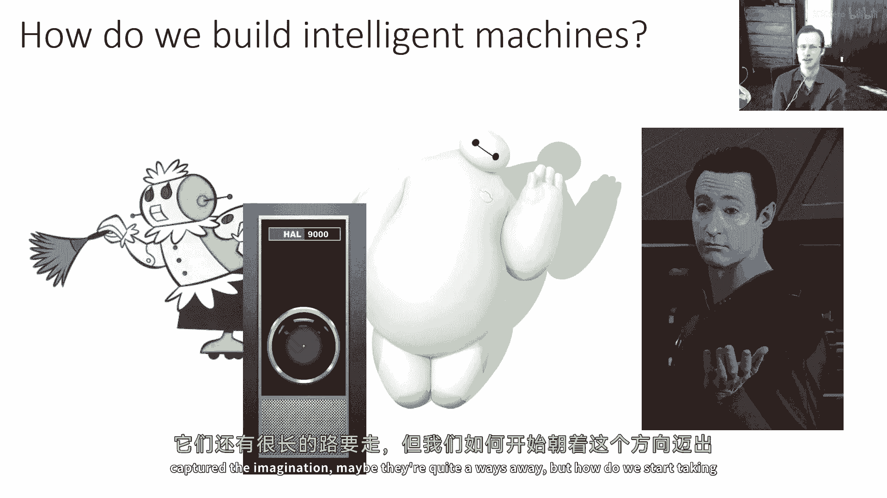

但我们如何开始朝着这种方向迈进，我认为深度强化学习构成了这一方面的重要部分，而且如果我们现在研究它，我们可能会将自己置于最终回答一些基本问题的道路上，所以为什么我们应该今天研究深度强化学习，嗯。

一部分答案是，似乎大规模的端到端训练模型工作得很好，如果我们使用大型数据集和大型模型如transformers。

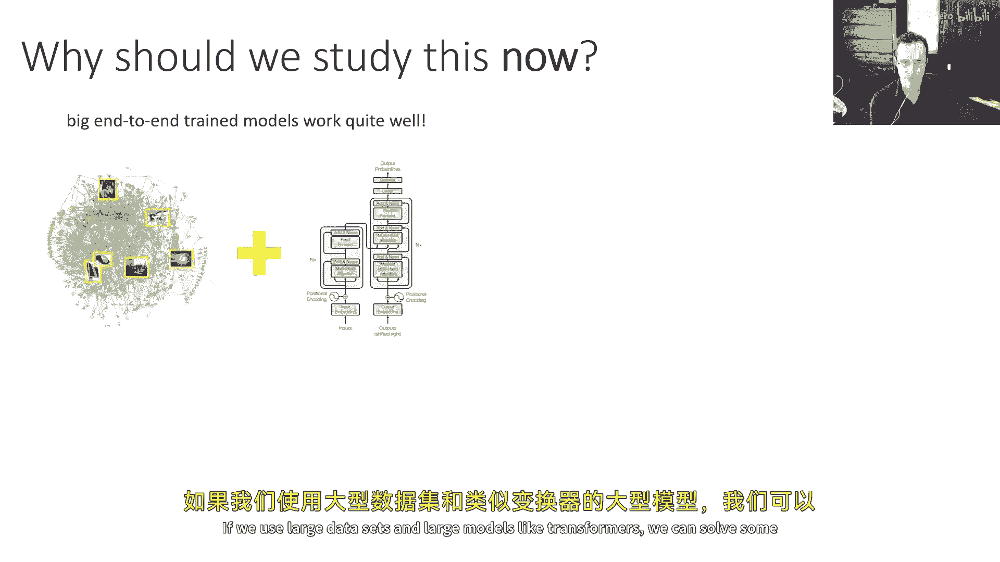

我们可以解决一些非常令人印象深刻的问题，同时，我们有RL算法，我们可以与深度神经网络相结合，我们已经了解了很多如何实现RL算法，所以它们可以被用于训练这些种大型模型，然而。

基于学习的控制和真正开放的世界设置仍然是一个主要开放挑战，有一些初步的结果，包括机器人的结果，我在其他领域展示了这些系统的迹象，但许多潜力尚未被实现，我将讨论一些这个潜力，嗯，在今天的讲座中。

以及在这个课程的过程中，也将讨论这些想法如何可能使我们更接近，这是一个非常令人兴奋的时刻，我认为研究这个主题，因为从某些角度看，许多拼图块正在逐渐拼接在一起，然而，主要问题仍然存在。

这可能是你们自己在未来工作中可以解答的问题。

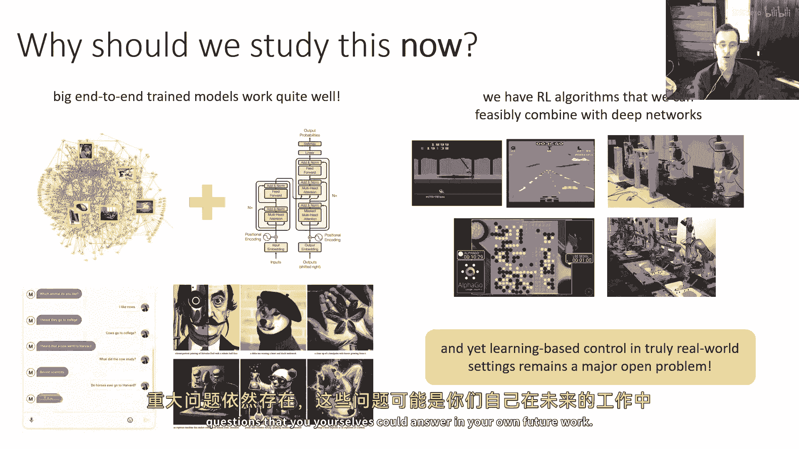

但在我深入讨论之前，我想讨论一下，嗯，强化学习领域的更广泛视角，除了最大化奖励函数之外，我们还需要解决哪些问题，以实现现实世界的序列决策，因为这个课程不仅仅是关于奖励最大化。

这也涉及到当我们研究决策时出现的各种其他问题，在基于数据的现实世界中做出和控制决策，以及可能解决这些问题的方法，例如，基本的强化学习处理最大化奖励，但这不是序列决策制定中唯一重要的问题。

我们将覆盖更先进的主题如从示例中学习奖励函数，这被称为逆强化学习，在领域转移学习、元学习等跨领域知识转移中，学习预测并使用预测来行动，所以继续下去，这里有一个问题，奖励来自哪里，如果你在玩视频游戏。

这是非常明显的，也许奖励函数是视频游戏中的分数，你不必想得太 hard，但在其他设置中，你做什么，如果你想让机器人拿起一个水壶并为玻璃倒水，任何孩子都能做到，但是仅仅找出奖励函数本身就像是玻璃中的水。

一个复杂的感知问题，有一个，以前有一篇由um发表的论文，伯克利加州大学出版的一些书关于探索，大约是四年前，并且引用了一句关于人类代理者的漂亮话，我们习惯于与奖励如此稀疏的操作。

以至于我们在一生中只有一次或两次经验它们，这意味着人类的许多行为，尽管看起来很了不起，战争可能会被延迟，但是仅仅从那个奖励信号中学习是非常困难的，例如，你因为，假设完成了一个博士学位。

你只会得到一次奖励，你可能体验到一些满足感，实际的结果可能是你拿到学位后如何使用它，尽管你可能明确地设定自己走上这条路，这不是你通过试错学习到的，通过在过去尝试许多许多博士学位，嗯，实际上这是一句引用。

嗯，在那里评论者回复说，通过写，我同情，作者，所以我们知道人脑实际上有一个结构，基底核，实际上负责大脑使用的奖励信号，以增强学习，学习实际上已经被研究得很多，并且它是一个非平凡的结构，你可以看到。

你知道它占据了很大的空间，显然它在做一些复杂的事情，不难想象，例如，对于需要追逐羚羊的猎豹来说，嗯，如果猎豹通过尝试和错误学习，只有在捕获羚羊时才获得奖励，这是一个关于学习系统的非常荒谬的形象。

如果猎豹只是在草原上乱跑，随机希望随机撞到羚羊，然后随机吃它，然后意识到厨房羚羊是个好主意，嗯，那个猎豹可能会饿死，当然，猎豹不是这样学习的，他们可能从观察其他猎豹学习，他们可能从父母学习。

他们可能从各种其他信号学习，但显然他们不是从只从吃羚羊肉获得的奖励中学习，在成功的狩猎结束时，所以这些奖励信号中有很多事情。

你可以想象提取出其他，更有用的形式的监督，你可以从演示中学习，无论是直接复制观察的行为，还是甚至通过被称为逆向强化学习的观察行为来推断奖励，你可以从观察世界学习，学习接下来会发生什么。

即使你不确定你应该做什么，然后利用这份知识，一旦你对你的任务有了更多的认识，你可以使用无监督学习，无监督特征提取，以及其他类似的，你也可以从其他任务中转移知识，甚至你可以使用元学习，在那里。

你从解决其他任务的过去经验中学习如何更快地适应，这些都是我们可以尝试利用的东西，这些都是我们在这门课程中实际上会学习的东西。

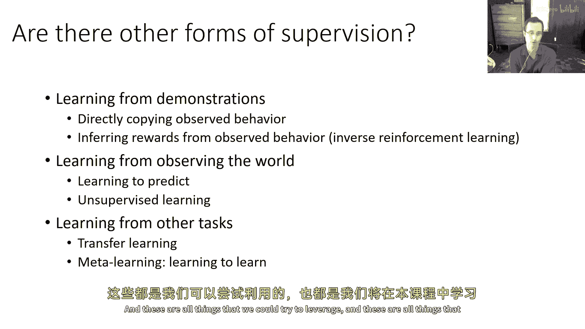

这里是模仿学习的一个例子，这实际上是一个相当老的例子，大约是八年前的，嗯，来自nvidia的一些工作，展示了一种完全基于模仿的自动驾驶方法，嗯，这种方法试图直接复制观察的人类驾驶员的动作。

但是当然你可以做得更好，例如，你可以在更深的意图上，我们知道这是人类做的事情，这里是一项心理学研究。

实验对象是右边的孩子，现在，你可以看到孩子这里不会试图模仿实验者正在做的事情，因为显然实验者并没有做很聪明的事情。

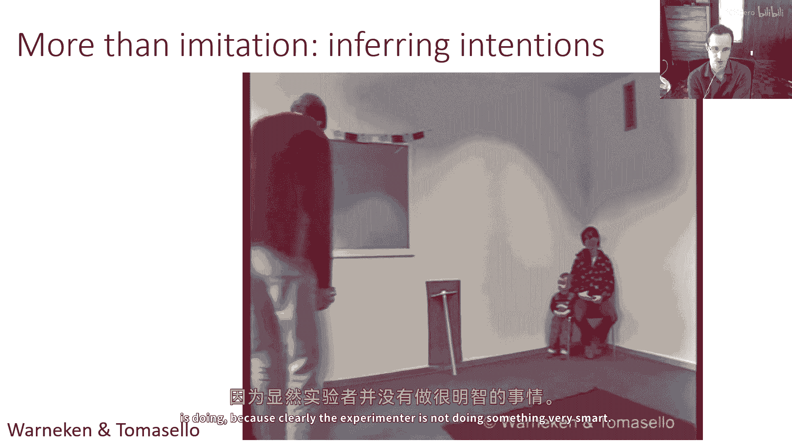

孩子会做的事情，相反是在更深的意图上，然后采取一系列完全不同的行动，这些行动更适合满足他们的意图。

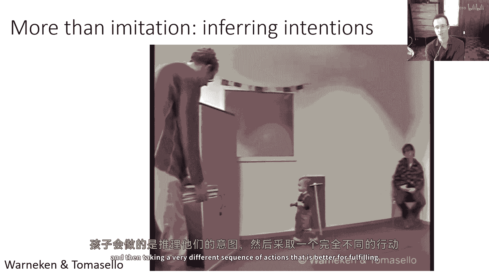

而不是简单地复制他们。

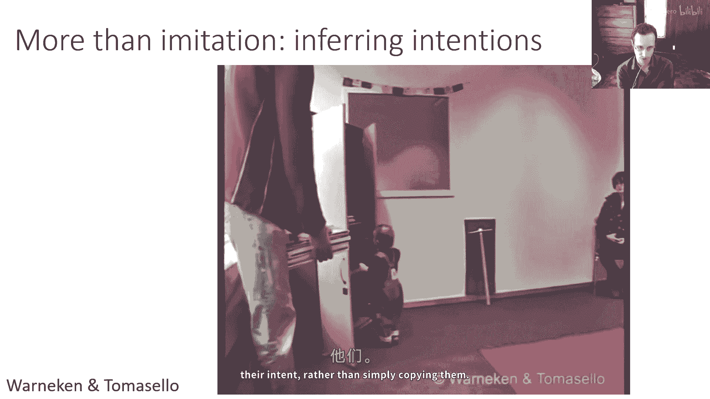

这真的是人类模仿的标志，当我们说一个人模仿另一个人时，他们不是 literally 观察某人的肌肉激活，并在某个水平上执行相同的肌肉激活，他们总是推断出那个其他生物或人是试图做什么的。

然后以自己的方式去做，它可能非常直接，因为他们仍然执行相同的动作，但找出控制他们肌肉的命令，以创建这些动作，或者它甚至可能更加抽象，就像在这里，他们执行的是完全不同的行动，但这导致了看似想要的结果。

逆向强化学习算法实际上可以被用于机器人，嗯，这又是目前相当古老的工作，大约八年前展示了一个逆向强化学习算法，在这个机器人中，推断出人类的演示者意图，展示这个倒水动作，找出目标是真正寻求那个黄色杯。

并将橙色杯的内容倒入黄色杯。

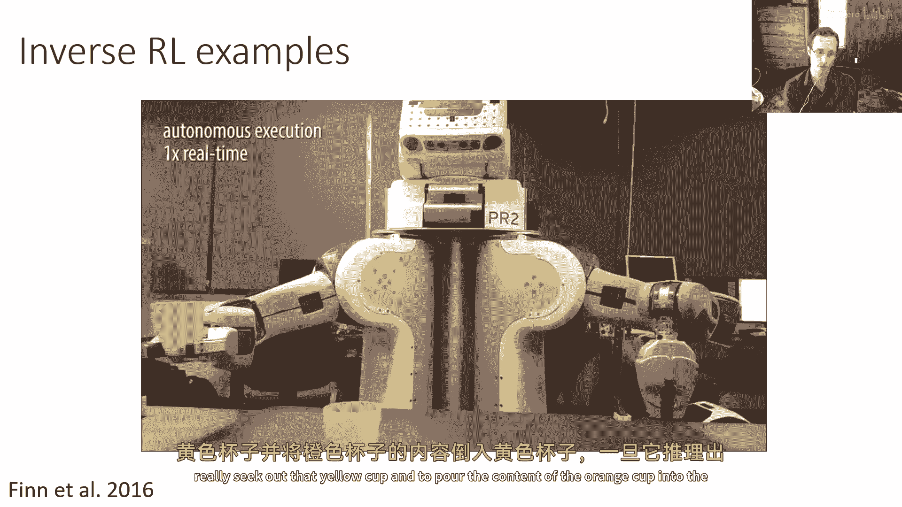

一旦它推断出能够以各种设置执行任务的意图，预测是控制中非常重要的一部分，嗯，预测与通常我们如何看待无模型强化学习不同，但在神经科学和心理学中有充足的证据，预测是人类和动物了解世界的重要组成部分。

我们可以想象预测模型在非常字面上的含义，其中你可以实际预测你的未来感官输入，你可以实现真实的世界预测模型，所以这里一个机器人在其环境中与物体玩耍，收集一些数据，然后学习预测它对不同动作的反应。

所以这里的不同列显示对不同运动命令的预测未来图像，这是很久以前的，这是七年前的，所以你可以看到这里的预测质量不高，但它捕捉了机器人试图做的事情的实质，并且可以用于控制对象，所以你可以告诉它。

将标记为红色的特定对象移动到绿色位置，它会想象运动，然后它会实际激活手臂以那样移动对象。

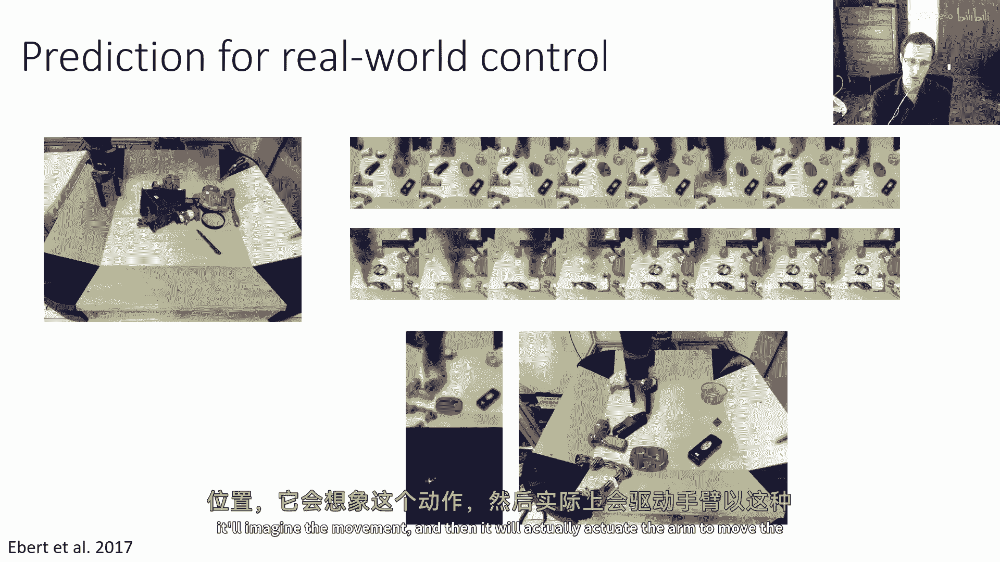

预测模型可以让你解决新任务，你可以用这个作为非常强大的工具来处理涌现行为，例如，你可以，例如，命令机器人移动一些对象，它可能会发现它需要拿起一个工具来移动这两个对象一起，这里是另一个工具使用示例。

这里它发现那个L形的，嗯，工具可以滑动蓝色的物体，在这里有一个涌现的工具使用场景，它发现移动这两个垃圾。

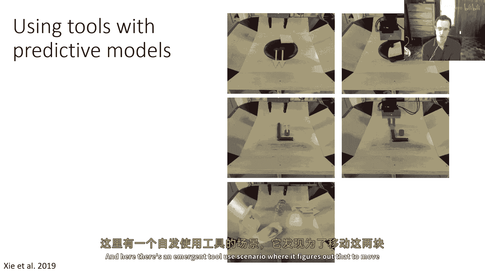

嗯，水瓶是一个很好的，嗯，即兴工具，预测模型已经取得了很大的进步，所以在近年来，它们随着现代生成模型技术的进步变得越来越好，这是一个基于扩散的视频预测模型，正在被用于合成驾驶视频的剪辑。

这里的前三帧是真实的，剩余的帧实际上是合成的，你可以看到模型实际上会产生现实的相机运动，它会在汽车转弯时引入新的对象，嗯，它会，嗯，甚至嗯，预测其他汽车的运动在这些例子中有一定的准确性，顺便说一句。

每对视频中的左边视频是真实的，右边的是合成的。

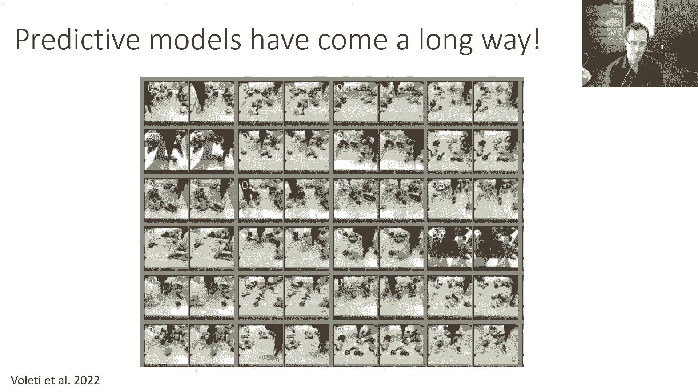

在这里，同样的，模型在被用于机器人视频，类似于我之前展示的，只是为了让你看到从2017年到2022年的差异，你可以看到，现在手臂清晰而锐利，物体以现实的方式移动等，此外，还有大量的，有趣的进步。

特别是在过去一年中，利用预训练模型的进步方面，所以当我们做强化学习时，我们通常不需要从头开始，我们可以做，我们可以使用在大量互联网数据上预训练的模型，然后使用它进行控制，这实际上是一个模仿学习例子。

这对我们不好，实际上它确实进行直接的模仿，但它在进行基于学习的控制，这是rt two模型，它使用第一个，一个在语言上预先训练的语言模型，然后一个视觉语言模型，它使用那个语言模型来处理互联网图像。

以处理如问题解答等事情，回答，例如，像说在图像中发生的事情，它是一只伟大的狗ggy在街头散步，所以现在模型理解图片，它理解文本，然后那个模型进一步微调以输出机器人动作。

所以当它被告诉机器人应该做什么来捡起芯片时，它会输出实际捡起芯片的动作数值，所以现在它可以将从互联网上学到的知识引入到这个任务中，以更有效地完成。

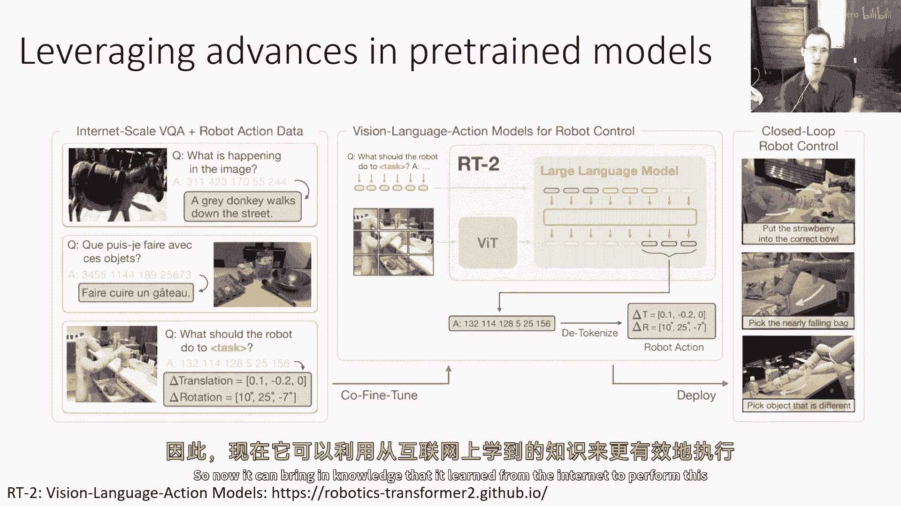

以下是这个模型可以通过的一些智能任务示例，所以它可以被告诉将香蕉移动到瓶子中，机器人数据中有移动香蕉的示例，但要理解将其移动到瓶子的含义，它利用互联网数据，"在这里"，"被要求解决一个数学问题"。

"将香蕉放在数学问题的答案上"，"在这里被告诉将草莓放入正确的碗中"，"要弄清楚正确的球意味着什么，需要识别每个碗中的果实。"，"并找出实际上草莓碗是正确的那个"，"这就是一些更多的例子"。

"拿起一个与其他所有物体都不同的对象"，"现在，它知道如何在机器人数据中抓取对象"，"但是它不知道'与所有其他人不同'的含义是什么"，"但那必须利用互联网数据"，"它计算出酒吧是不同的对象"。

"因为所有的其他物体都是瓶子"，"你可以理解其他语言的指令"，"尽管机器人数据仅被注释为一种语言，等等"，"好的嗯"，"所以，这些都是一些可能出现的问题类型"，"嗯。

以便我们在基于学习的决策制定中学习"，除了rl问题，"但是，让我们总结这次讲座"，我想要以一个稍微更宏大的观点结束，我想回到这个问题，即我们如何构建智能机器。

并真正论证深度强化学习的基本构建块可能非常优秀，解答这个问题的构建块，这当然是一个有争议的陈述，我不期望每个人都同意我的观点，这就是我为什么对这个主题充满热情的一部分，我希望能向你传达一些兴奋。

所以想象他们必须构建一个智能机器，一个智能程度与人类相当的东西，在旧时代，你从哪里开始会做得好，我们思考这个问题的方式可能是，也许我们需要理解大脑，而且大脑有很多部分，所以让我们理解这些部分是什么。

找出每个部分如何工作，然后编写计算机程序来模仿每个部分的行为，当然，我们对大脑的理解比19世纪先进得多，大脑的部分更紧密地反映了它们的实际功能，但这仍然是一个非常困难的问题，因为每个部分都非常复杂。

如果我们必须做大量的编程，来编写每个部分的行为，并做更多的编程来将它们连接起来，我们可能会花费很长时间，这可能只是实现智能机器的一种非常非常困难的方式，实际上。

可能需要我们投入比我们实际上拥有的更多的智能，如果我们假设学习可能是智能的基础，这可能实际上为我们提供了一种更容易解决这个问题的方法，这里是一个为什么学习可能成为智能的基础的论据。

有一些事情我们都可以做，比如走路，因此，可以说，也许这些事情已经深深地融入我们的大脑中，某种方式，但是，也有一些事情我们只能通过学习来掌握，比如驾驶汽车，显然，驾驶汽车并不在我们的大脑中构建。

因为汽车在我们大脑进化的时候还不存在，我们可以学习各种各样的事情，包括非常困难的事情，因此，我们的学习机制很可能足够强大，能够做我们所关联的所有智能活动，也许在实际操作中。

我们并没有真正使用我们的学习机制来做一些事情，比如走路，但是，我们可以假设也许他们足够强大以至于，如果我们没有那些东西内置，我们仍然可以找出来，这可能或可能不是真的，但是，我认为，嗯。

有很好的理由相信这可能是真的，即使这样，硬编码一些非常重要的部分仍然可能非常方便，但是，让我们不要被那个部分分散注意力，我们可以进一步假设，不仅学习是智能的基础，但实际上，也许存在一种基本的学习程序。

它 underlying 我们所关联的所有智能行为，那是一个更激进的陈述，它基本上说，我们学习如何看到，我们学习如何说话，以及我们学习如何听，在某种程度上是相同的，而不是为每个模块有一个算法。

也许我们有一个灵活的单一算法，放在正确的上下文中，实现所有必要的模块，大脑中的所有我们需要的东西，并且有一些间接证据表明这可能确实如此，例如，嗯，这是这些是从进入借来的幻灯片，你可以构建一个电极阵列。

并将其放置在你的舌头上，将该阵列连接到相机，并学习如何通过你的舌头感知视觉感知，你可以取一只动物貂鼠，你可以从视觉皮层断开视神经，并将其插入听觉皮层，一段时间后，松鼠将恢复一些视觉敏锐度。

这意味着其听觉皮层可以基本上学习处理视觉信号，所以，这些事情 kind of 表明可能，大脑有一种程度的普遍性或一致性，至少对于新皮层。

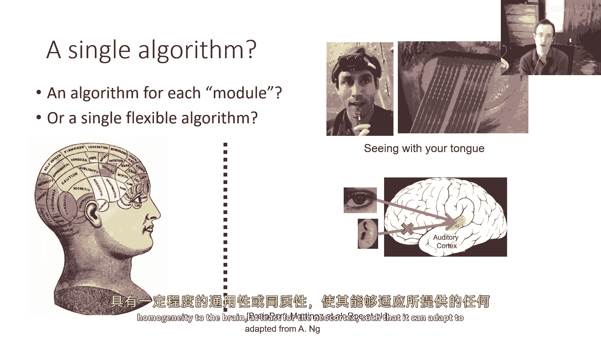

使得它能够适应任何提供的感官输入，这可能表明有一个算法，如果存在一个算法，这个算法需要能够做好什么，它需要解释丰富的感官输入，它需要选择复杂的动作，并且需要同时做这两件事，我们需要大型，高容量的模型。

因为那是我们唯一知道如何处理丰富感官输入的方法，我们需要强化学习，因为那是我们使用来采取行动的数学公式，所以为什么深度强化学习，虽然深度部分为我们提供了从大型复杂数据集中可扩展的学习，的能力。

并且强化学习给我们提供了优化，采取行动的能力，学习和搜索的组合，对于学习强化学习来说，最深入的方法是我们如何进行搜索，实际上，神经科学中有一些证据支持这两件事，有证据，嗯，那，嗯。

深度神经网络获得的代表形式，与在脑部观察到的表示有一些统计相似性，这不意味着大脑的工作方式与深度网络相同，它只意味着在某个层面上，当你处理大量的数据并提取合适的表示时，它们最终看起来相似，这可能与。

一个足够大的学习机器仅仅从数据中提取出这些模式有关，因为那就是数据的构成，我们将谈论深度学习，我认为这是一个更难回答的问题，但证据表明，对于视觉感知，存在一种某种程度的表示相似性，对于听觉特征。

对于触觉感知，嗯，为了确定这一点所做的实验实际上有点，嗯，创新，嗯，大脑信号，指示的是那种特征，在这种情况下，猴子用于触觉的特征是从猴子神经元的记录中获得的。

"由实际在手套上撒上灰尘后进行的深度学习实验"，嗯，"白色尘埃"，"你在让一个人触摸物体吗？"，"然后，使用深度神经网络来发现模式在"，嗯，"这个"，"手套上的尘土图案"，有趣的实验表明。

可能足够强大的学习机器提取的特征统计属性，类似于大脑的特征，而且，强化学习的证据非常多，至少是人类和动物的决策机制之一，实际上，嗯，强化学习最初是作为动物智能的研究出现的，但我们现在知道，从证据来看。

预期奖励的感知与相似的发射模式相关联，就像奖励本身，这正是我们期待从时间差异学习中看到的，在这个过程中，基底核似乎成为一种奖励系统。

"并且这种像适应性一样的无模型强化学习方法常常是动物适应性实验数据的良好拟合"，尽管并非总是，"但是，这张图片并不完整"，所以所有这些，嗯，"一些间接的证据"，"可能会建议。

深度学习和强化学习的工具可能是解决这个问题的好工具"，"智力问题"，"但是问题显然还没有解决"，"我们拥有伟大的方法，可以通过深度学习从大量数据中学习。"，我们拥有伟大的强化学习优化方法。

我们还没有那种既使用数据的惊人方法，近年来，强化学习已经变得更加可扩展，它可以处理像现实世界机器人问题这样的东西，但是，像巨大的语言模型和生成模型应用这样的东西仍然主要使用监督学习，因此。

还有一些算法性的建筑块是必要的，而且，人类学习得非常快，而深度强化学习方法通常需要大量的数据，人类重复过去的知识，而在强化学习中，迁移学习仍然是一个开放问题，并非总是清楚奖励函数应该怎么设定。

并非总是清楚预测的角色应该怎么设定，这些方法似乎可以非常强大，但它们如何与无模型方法融合，它们是不同的东西吗，或者能否以某种方式得到和解，所以所有这些疑问。

我认为给我们留下了足够的空间进行在这个领域的额外研究，或许如果深度学习和强化学习的工具是构建强大人工智能系统的正确工具，那么这些系统将无比强大，"那么，研究这些问题也许能让我们在那个问题上有所突破。"。

"最终，我认为我们可以摆脱这种思考模式，不再考虑"，"智能系统作为实施模块的集合"，"并且作为一个非常优雅和简单的框架"，"我们有一个通用的学习算法，可以解决它应该解决的问题"，实际上。

这个想法并不由任何方式新颖，这不是21世纪创造的东西，"甚至不是为深度学习创建的东西"，这是一句我认为非常完美地体现了这个观点的引言，为什么不尝试生产一个模拟成人思维的程序。

为什么不试试生产一个模拟儿童的程序，如果将这个程序接受到一个适当的教育课程，你将得到说这句话的成人脑。

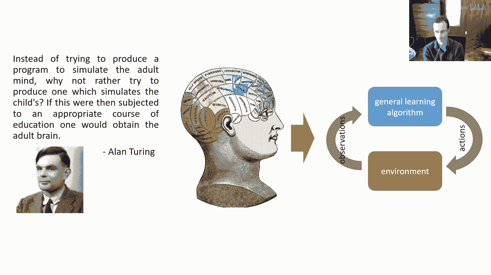