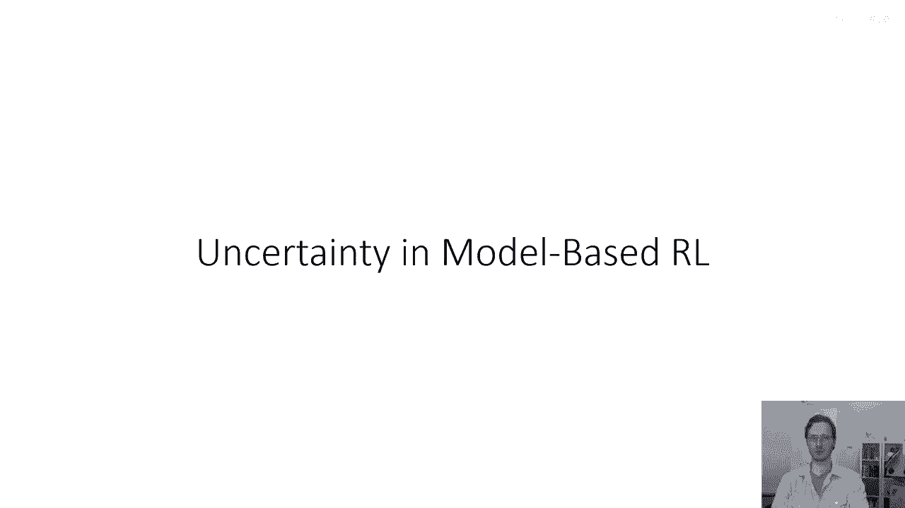
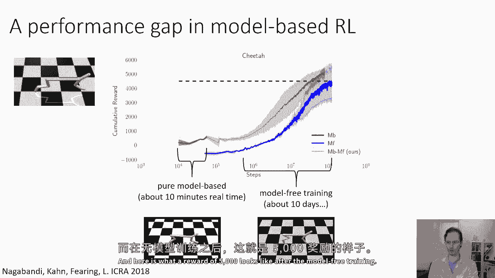
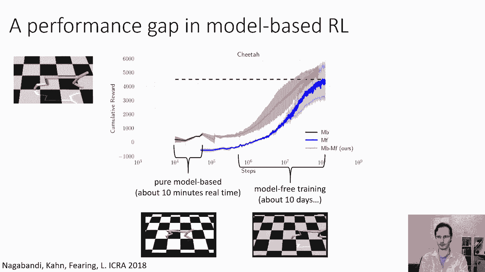
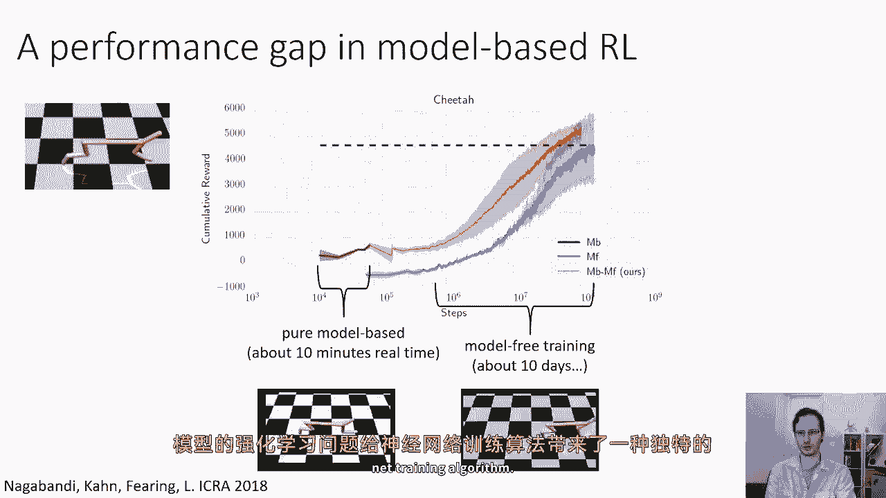
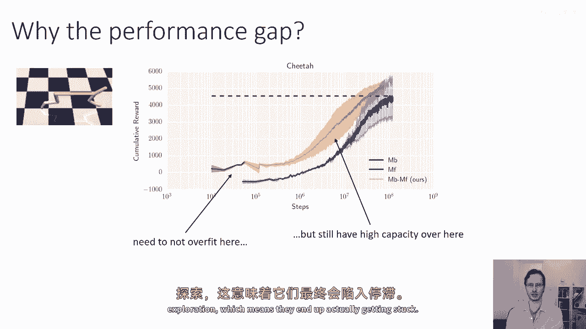
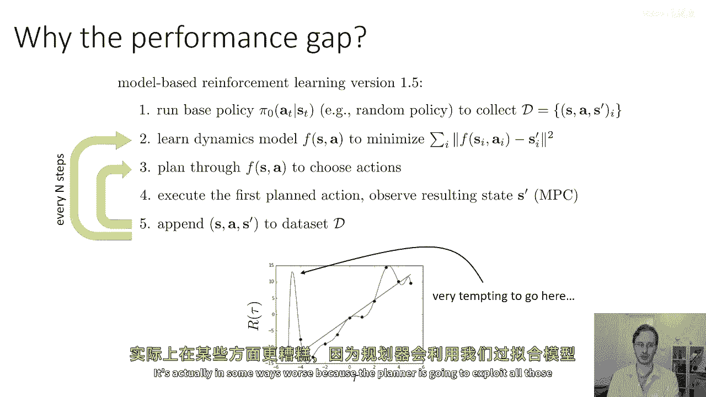
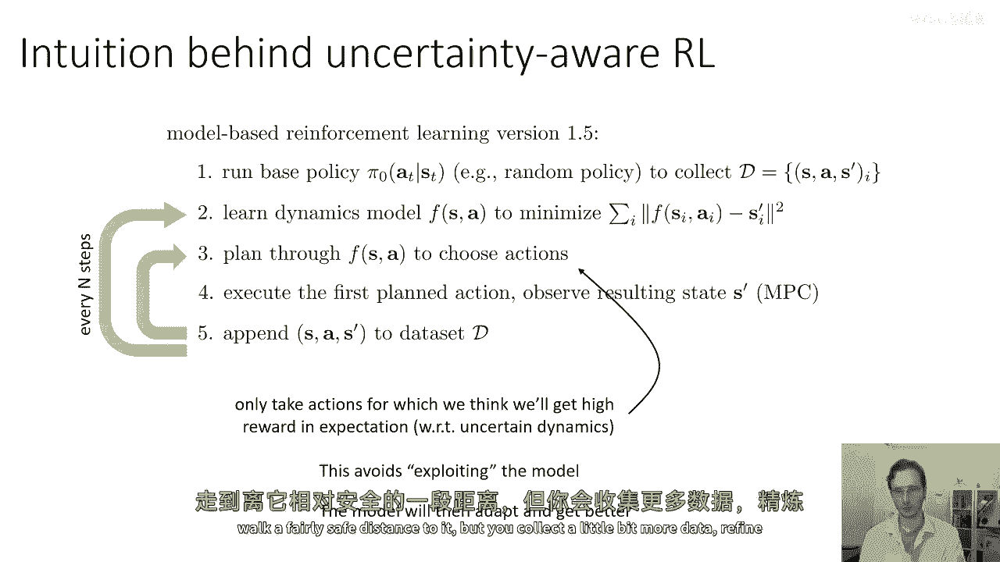
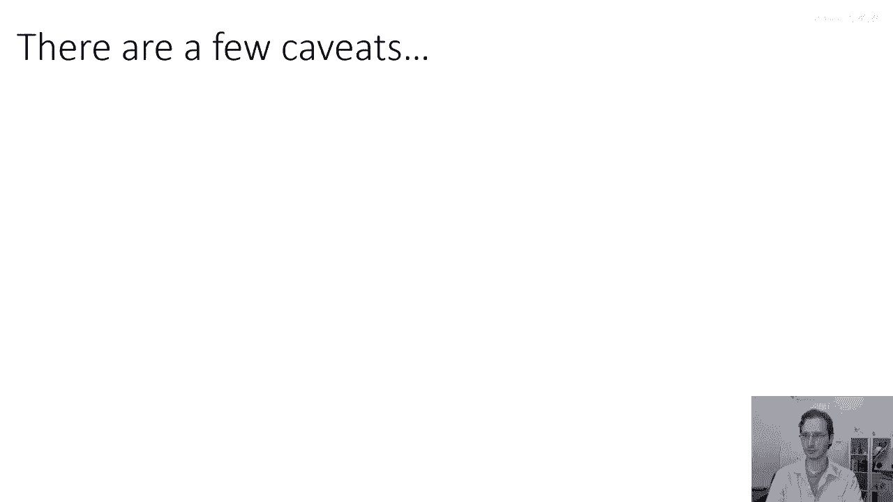
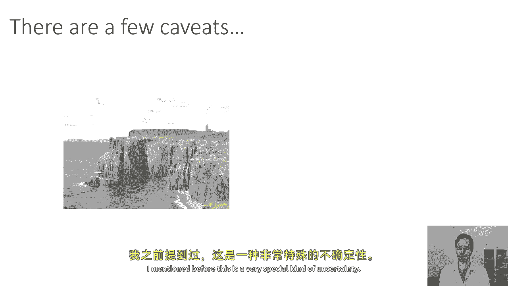
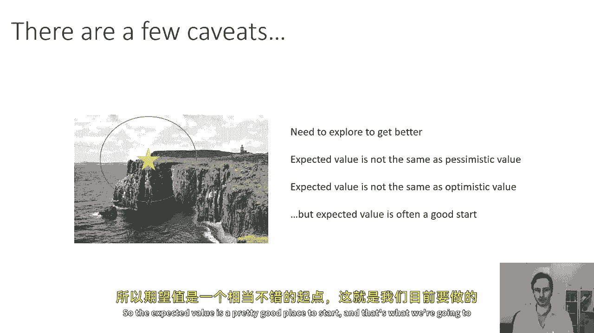

# 【深度强化学习 CS285 2023】伯克利—中英字幕 - P46：p46 CS 285： Lecture 11, Part 2 - 加加zero - BV1NjH4eYEyZ

好的，在接下来的讲座部分中，我们将讨论不确定性在基于模型的强化学习中的角色，不确定性在基于模型的rl中起着非常重要的作用，因为尽管基于模型的rl版本1。0，算法原则上可以解决基于模型的rl问题。

但在实践中，它面临着一些相当严重的问题。

所以让我们尝试用例子来理解这个问题，嗯，这里是我们在伯克利实际做的一个实验，几年前，在研究深度基于模型的强化学习方法时，基本上像基于模型的rl版本1。5这样的方法，我之前使用深度神经网络模型演示过。

所以这些实验在半人马座h模拟任务上进行了，这是你们在作业一中尝试的，这个橙色部分的小曲线显示了我们从运行，仅从零开始运行的基本基于模型的rl版本1。5算法中获取的结果，所以这是算法，每一步都重新规划。

并确实收集更多的数据，然后我们做的是使用这些数据来启动一个无模型的rl学习者，并显然运行得更久，红色曲线显示了无模型学习者，然后做了一些事情在这里跳出来首先，无模型学习者可以获得更好的最终性能第二。

也许更乐观地，基于模型的学习者可以到达一些，你知道，稍微比零性能更好的性能相对较快，这里的x轴是对数尺度，基于模型的学习者这里的奖励大约是500，无模型学习者的奖励大约是5000。

500奖励看起来像这样，所以它并不是完全糟糕的。

实际上它在缓慢地前进，5000奖励看起来像这样。

在无模型训练后，所以这里发生了什么，为什么基于模型的学习者比无模型学习者差这么多呢。

与常规监督学习问题相反，在这个迭代数据收集的基于模型的rl问题中，神经网络训练算法面临着一种独特的挑战。

你看，问题是我们需要避免过拟合，当我们在这里开始时只有少量的数据时，但我们仍然需要足够的容量来在大量的数据中做得好，这证明是非常困难的，看，事情是。

我们通过使用我们的模型来收集额外的数据来缓解分布漂移问题，但那意味着我们的模型即使在早期也需要相当好，当它没有太多的数据时，而且像神经网络这样的高容量模型在高数据集上表现很好。

但它们在低数据集上并不真正挣扎，因此，出于这个原因，它们在早期阶段表现会很差，当它们在早期阶段表现不佳时，它们实际上不会产生有效的探索，这意味着然后他们最终会陷入真正的困境。

所以为什么，嗯，我们为什么存在性能差距，嗯，实际上，这个问题主要归结于，嗯，类似于过拟合问题，由分布的变化进一步加剧，所以，这就是我们所想的经典图像，当我们考虑我们正在拟合的东西时。

我们有一个由直线和噪声形成的点集，我们拟合了一个非常强大的函数逼近器，然后我们得到了像蓝色线这样的东西，现在，实际上基于模型的强化学习东西并不像看起来那么清晰，而且分布变化也起着非常重要的作用。

但基本上问题在于，嗯，沿着这些路线，所以是在基于模型的强化学习中，我们实际上是通过模型来规划的，如果我们的模型犯了一些稍微偏向积极的错误，例如，"这里的y轴是不同轨迹的预测奖励"，"对于规划者来说。

选择那些轨迹将会非常诱惑人"，"这导致在积极方向上的最大错误"，所以，规划者将基本上利用模型中的误差，"如果模型过拟合"，"然后它就有很多这些小洞"，"这些许多微不足道的伪峰。

为规划者提供了丰富的利用空间。"，所以这并不是一个像常规过拟合问题那样简单的问题，实际上这是某人的更糟的情况，"因为规划者打算利用我们过度拟合模型中的所有漏洞"。

好的，那么在这个讲座的部分，我要讨论的是，如何适当的不确定性估计可以帮助我们解决这个问题，那么不确定性估计如何帮助我们做得好，那么有了不确定性估计，你可以想象我们将要做的是，对于每个状态动作对。

我们将预测，不仅仅是一个单一的下一个状态s prime，但实际上是一个可能的下一个状态的分布，你可以在你的模型不确定性下达到。

所以这可能是一个好主意的原因是，假设你想要走到悬崖的边缘，以便欣赏到海洋的美丽景色，所以，你的目标就在这里，悬崖的边缘，如果你对你的模型非常自信，你可能会说，如果我计划采取能够到达悬崖边缘的行动。

我就站在悬崖边缘，我会得到最高的奖励，但如果你对你的模式极度不确定，嗯，你也理解这种不确定性，那么，当您计算在极度不确定的模型下奖励的预期值时，你意识到直接走到悬崖边缘，有很高的概率使你跌过边缘。

这将导致一个非常大的负奖励，所以你会自动选择留在更远的地方，因为当你越靠近，由于模型不确定性，意外跌落的概率会增加，由于你可能不知道悬崖现在的确切位置，关键这种现象可以出现。

即使我们没有做任何特别的事情，即使我们没有特意制定一个计划，让我们假设在模型下是悲观的，或者避免最坏的情况，这并不是我们在这里要做的，即使我们只是考虑在不确定的模型下奖励的预期值。

已经会得到避免高度不确定区域的这种行为，如果他们可以负面影响奖励，所以这做什么，它迫使规划者基本上对冲其赌注，它迫使它采取一系列在预期中好的行动，这大致意味着在所有由你模型表示的可能未来中，不确定性。

那个行动序列相当不错，现在，这个陈述的一个重要含义是，你怎么建模你的不确定性，真的需要考虑你可能处于的可能世界，所以这并不是关于动态设置嘈杂的地方，这是关于你不知道动态设置的地方。

所以有许多可能的世界可以与你的数据一致，你想要采取的预期良好的行动，在你数据集给出的那些可能世界的分布下，这是一种相当特殊的不确定性，所以是的，对于高方差预测，我们对我预期的奖励应该非常低。

当我们接近悬崖边缘，如果我们的模型回答错误。

即使平均值相同，好的，所以，我们在第三步中唯一的实际变化是，我们将只采取行动，对于我们预期在特定动态下将获得高奖励的行动，这将避免那个利用-被利用的问题，这将导致我们的算法做更多的明智事情。

特别是在训练的早期阶段，当模型的不确定性非常高时，然后模型会适应并变得更好，并且，希望，它将在奖励高的地区变得更加自信，所以最终我们将接近悬崖的边缘，因为我们将逐渐精炼我们的模型。

所以直觉上你可以这么想，因为你不知道悬崖在哪里，你走一段相对安全的距离到达它，但你收集一些更多的数据，精炼你的理解。

然后下次你可以走得更靠近它。

我之前提到的有几个非常重要的警告，这是一种非常特殊的不确定性。

所以一个警告是你需要探索以提高，所以如果你非常谨慎，如果你画一个非常大的，嗯，一种间隔，嗯，围绕你的目标，如果你有一个特别糟糕的奖励结构，你可能永远不会接近高奖励区域，然后，你的探索可能会受到阻碍。

所以你必须确保这种不确定性意识探索不会对探索造成太大的损害，我们将更多地讨论探索，几周后的课程，你需要记住的是，预期值并不等同于悲观值，这不是一种试图，你知道，最大化最坏情况错误的算法，或坚韧。

或任何基于不确定性估计的 robust 算法，你可以从，例如，使用下限置信区间而不是预期值，但我们在这里不讨论这个，这是非常合理的事情，如果你特别关心安全，但我们在这里只是谈论预期值。

预期值也不等同于乐观值，所以你可以对你的不确定性持乐观态度，然后，你将期望更多的利用，但你也将期望看到一些更好的乐观探索策略，我们再几周后讨论这个问题，预期值是一个不错的起点。

