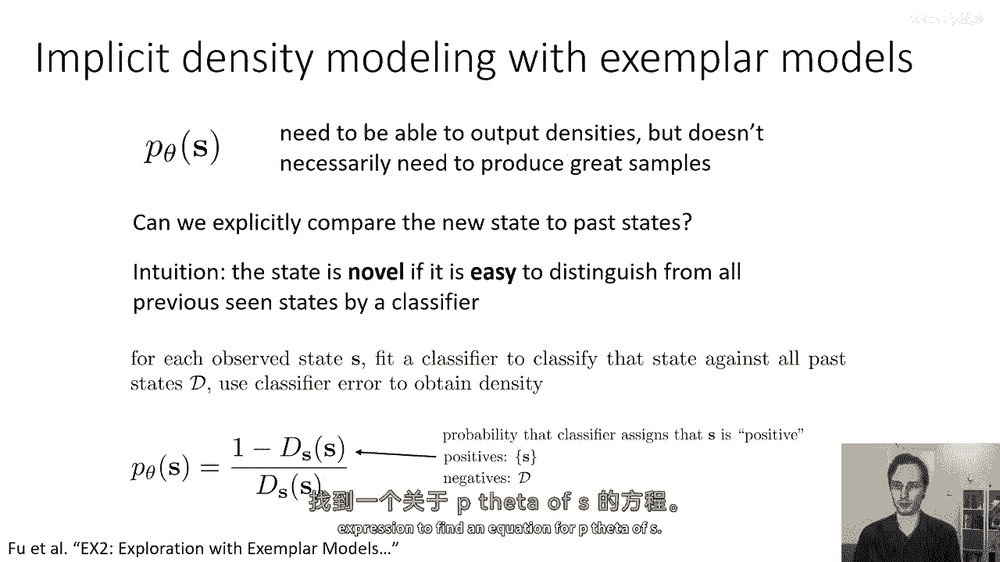
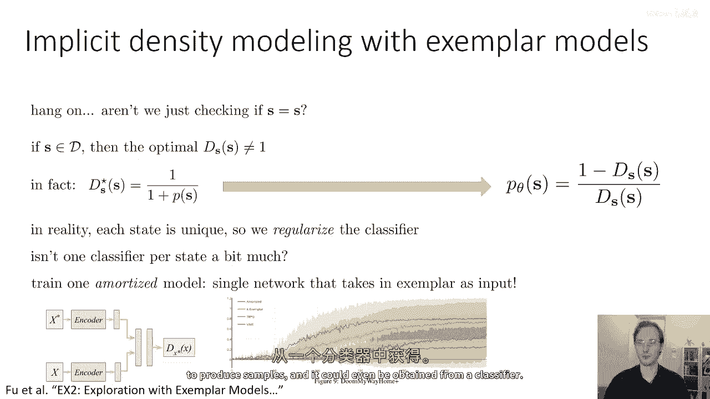
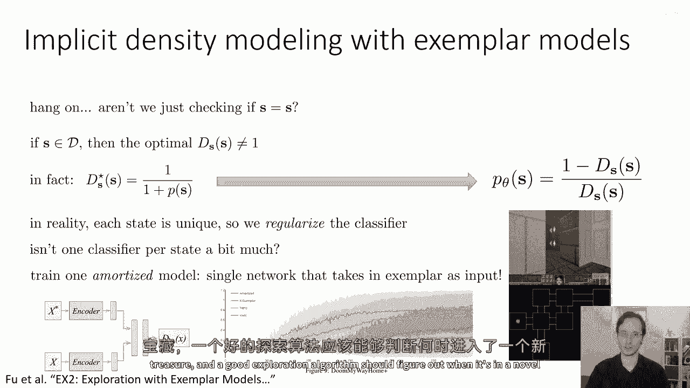
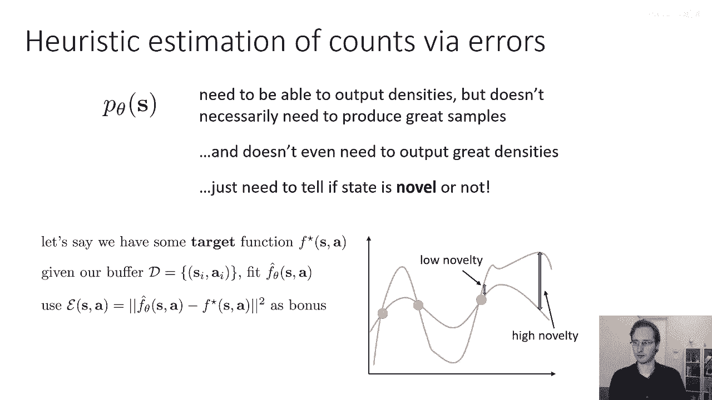
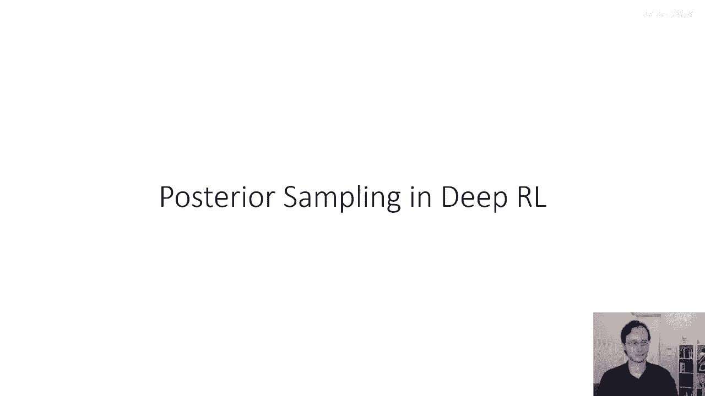

# 【深度强化学习 CS285 2023】伯克利—中英字幕 - P57：p57 CS 285： Lecture 13, Part 4 - 加加zero - BV1NjH4eYEyZ

在下一部分讲座中一切顺利，我将介绍几种其他的创新探索方法，对于这些，我不会像以前那样详细解释，但我只是想让你对其他在文献中被提出的技术有所了解，这些技术也利用乐观主义的概念来改进探索。

所以我要首先谈论的是第一种方法，嗯，你可以把它看作是一种基于计数的方法，使用更复杂的密度模型，这是唐等人在《哈希探索》中提出的，这里的想法是使用哈希进行计数，所以嗯，这里不是做伪计数的事情。

如果仍然进行常规计数，但是以不同的形式表示，所以也许你可以做这样一件事，你可以取你的状态，并计算一种压缩状态的哈希，所以它是一种有损哈希，嗯以这种方式，状态非常不同的就会得到非常不同的字符串。

但状态非常相似的可能会被，嗯，可能会映射到相同的哈希值，所以想法是我们将s压缩为一个k位代码，通过某种编码器，s的phi和如果选择的情况足够小，使得状态数大于2的k。

那么我们就必须将一些状态压缩为相同的代码，然后我们将进行计数，但我们将按照这些代码进行计数，实际上将计算我们见过相同代码的次数，而不是相同状态，并且你的代码越短，你得到的哈希碰撞就越多，这意味着，嗯。

对于确定两个状态是否相似，你的相似性概念就越宽，将会，因此，相似的状态将得到相同的哈希值，也许它取决于你选择的模型，所以，你可以通过以下方式提高机会，而不是使用通常旨在最小化哈希碰撞的标准哈希函数。

你可以使用训练以获取最大重构准确性的自编码器，如果你训练自编码器以最大化重构准确性，然后如果它被迫有哈希碰撞，它会，它会为那些碰撞结果导致小重构错误的设置产生哈希碰撞。

所以基本上如果将一个状态误认为是另一个，但他们仍然看起来非常相似，那么这种错误对自编码器来说比状态看起来非常不同时花费的代价要少得多，所以学习哈希基本上提供了一些更相似驱动的哈希碰撞。

然后这个算法将从自编码器的瓶颈中提取，本质上，将自编码器的编码器视为s的phi，并将其限制，嗯，设置为零或一，执行降采样步骤，这就是他们将使用的k位代码，然后他们只是在这些k位代码上进行常规计数。

而最终得到的算法实际上工作得相当不错，在各种不同的编码方案中都表现得相当好，所以这是一种你可以适应常规计数的 nice 方式。

如果你不想处理伪计数，另一种你可以做的事情是你可以避免密度建模完全，通过实际上利用分类器给你密度分数，所以记住p theta of s需要能够输出密度，但它不一定需要产生伟大的样本，我们可以利用这一点。

通过设计一类特别容易训练的模型，这些模型不能产生任何样本，但可以给出合理的密度，所以这是从一篇叫做ex two的论文，由谁写的都不清楚，所以，这就是想法，我们将尝试明确比较新状态与过去状态，直觉是。

如果分类器可以轻易区分，它正在观察的状态是新状态还是过去状态，那么新状态非常新颖，因此应该具有低密度，如果很难区分，这意味着新状态看起来与过去状态无法区分，因此具有高密度，虽然这个观念是公平的。

有些直观且非正式，实际上可以数学上精确地定义，所以如果状态是新奇的，状态是新奇的，如果它容易由分类器与所有以前见过的状态区分开来，所以对于每个观察到的状态s，我们将要做的是。

我们将为该状态拟合一个单独的分类器，以将其与缓冲区中的所有过去状态进行分类，然后，我们将使用分类器的似然度，或分类器的误差来获取密度，所以，我们发现 uh。

"如果你的分类器将状态分配的概率由d(s)给出"，"并且我有下标s"，"因为这个是试图将状态s与所有过去状态进行分类的机密文件"，"所以，s的下标为d"，"这个分类器分配给状态是新状态的概率是多少？"。

"该州的密度结果出来"，"可以写成p theta of s等于一减去d of s"，"由s的d分隔"，"你获得这个方程的方法是写下最优分类器的公式"，"这可以用密度比来表示"，然后做一些代数，所以。

这是分类器将s分配为积极意义的概率，s是新的状态，分类器是在只有s是积极的地方训练的，而负面的是所有其他的ds，到这个点，你可能在 wonder 在这里发生了什么，就像你有一个分类器。

只试图分类s是否等于自己，如，不应该总是输出true吗，嗯，记住我们正在计算什么，重要的是你做了什么，是他们的，他们在计数，你见过那个精确的状态多少次，所以如果你实际上在那个阶段。

有计数和s有大量的计数，那么s也会在d中出现，所以你在正样本中会有一个s的副本，但你可能在负样本中有多个s的副本，这意味着真正的答案，s的真值不是1，因为如果你看到状态s，它可能是积极的。

但它也可能是消极的，例如，嗯，如果状态s出现在负数的集合中，有一半的时间，如果实际上你的一半消极状态也是s，那么s的真值不是百分之百，实际上，它实际上是七十五 percent。

因为五十 percent 那是积极的，两五 percent 它 是，你知道，其他一半的负面的，所以计数越大，ds of s 的下限就越低，当然，在更大的连续空间中，计数总是一的地方。

这个模型仍然会产生非微不足道的结论，因为分类器不会过拟合，分类器实际上会稍微泛化一些，这意味着如果它看到负样本中非常相似的状态，它会为正样本分配较低的概率。

这就是为什么你可以使用分类器来估计像这样的密度，如果你想了解如何从分类器中导出概率，查看论文，实际上这是一段相当简单的代数，直觉是首先写下贝叶斯最优分类器的方程。

这是一个以p theta of s表示的表达式，然后解出这个表达式来找到一个以p theta of s表示的方程。

正如我之前提到的，我们是不是在检查，如果s等于s的话，如果在数据集中存在s的副本，那么s的最优d并不是我之前提到的一，实际上，最优分类器由一除以一给出，再加上s的p，再次，这是一些代数，你可以检查。

所以，如果你重新排列这个来解决p关于s的问题，你会得到右边的方程，现在，在现实中，当然，每个状态都是独特的，你的分类器可能会过拟合，所以你必须正则化分类器以确保它不会过拟合。

并且不会总是分配一个概率为一，所以，你会使用像权重衰减这样的东西来正则化你的分类器，现在，这个问题的另一个方面是，你是，你知道，正如我已经描述的这个过程，到目前为止。

我们对每个状态都训练了一个完全独立的分类器，我们看到，现在，这不是有点太多了吗，我们是否要因为所有这些分类器而变得疯狂，一种可能的解决方案是我们可以训练一个摊销模型，所以。

而不是为每个状态训练一个分类器，我们可以训练一个仅依赖于状态的单一分类器，那就是分类，所以这是一个按例模型，它以示例作为输入，那就是x星，并且它以正在分类的状态作为输入，那就是x。

现在我们只训练一个网络，并且我们使用我们看到的每个状态来更新它，所以这是一个按例模型，而且这个基本方案实际上工作得很好，它与其他方法相比非常优势，嗯，嗯，一些其他的探索方法。

包括我之前描述的基于哈希的探索方法，并且提供，可能对探索时我们使用的密度模型类型有一个有趣的视角，这种模型不一定需要能够产生样本，甚至可能来自分类器。

然后在论文中，有一些使用此进行一些视觉导航任务的实验在vizdoom中，在那里，你需要穿越许多不同的房间才能找到宝藏，并且一个好的探索算法应该能够确定它处于一个新的房间中。

然后寻找它尚未见过太多的新房间，现在好了，我们还可以使用一些启发式方法来估计数量，这些并不是真正的计数，但它们扮演着与计数类似的角色，在实际应用中，它可以工作得非常好，所以记住。

p theta of s 需要能够输出密度，但它不一定需要产生伟大的样本，实际上，甚至不一定需要产生伟大的密度，你可以把它看作是一个分数，你只是想那个分数对新颖的状态更大，对非模型状态更小，或者反过来。

所以基本上只需要一个数字，那是非常预测一个状态是否新颖的，甚至不需要是一个正式的密度，所以你只需要能告诉一个状态是否新颖，这就是你想要的全部，还有其他的方法可以得到这个，虽然稍微有些启发式。

但是可以很好地工作，所以，例如，假设我们有一个目标函数f*（s，a），现在不用担心这个函数的用途，让我们假设它是一个在状态和动作上的标量值函数，所以，可能是这个函数。

我们取我们已经看到的状态和动作缓冲区，并拟合f*的估计值，所以我们拟合一个函数f^θ，所以，f^θ试图在数据上匹配f*，所以可能我们的数据集包含这些点，F 的可能形状是这样的。

所以它将类似于靠近数据的那些点，但远离数据的地方将会犯错误，因为它在这些地区没有受过训练，所以现在我们可以使用f hat和f star之间的误差作为我们的奖励，因为我们预期这个误差会很大。

当我们远离状态时，以及我们离数据很近的动作时，两个函数在远离数据时应该匹配，f f 可能会使出非常大的错误，因此，当误差低时，我们将说新颖性低，当误差高时，我们将说新颖性高。

然后，我们可以问，我们应该使用哪种函数来定义f星，在文献中已经探索了许多不同的选择，所以，一种常见的选择是将f星设置为动态，所以，基本上f星(sa)等于s'，这非常方便。

因为它是一种明显与mdp动态有关的量，当然，你在数据中已经观察到了s'，所以，你可以实质上训练一个模型，然后，测量那个模型的误差作为新颖性的概念，这也与信息增益有关，我们在讲座的下一部分会讨论这个问题。

一个甚至更简单的方法是只是设置f星等于一个神经网络，具有参数phi，其中phi是随机选择的，所以，这个网络实际上并没有被训练，它实际上只是随机初始化，以获得任意但结构化的函数。

这里的要点是你实际上并不需要f星有多么有意义，你只需要它成为一个目标，它在状态和动作空间中的变化方式并不是那么容易建模的，所以，只使用随机网络实际上可以工作得很好，这实际上是作业五的一部分材料中的内容。

