# 【深度强化学习 CS285 2023】伯克利—中英字幕 - P78：p78 CS 285： Lecture 19, Control as Inference, Part 2 - 加加zero - BV1NjH4eYEyZ

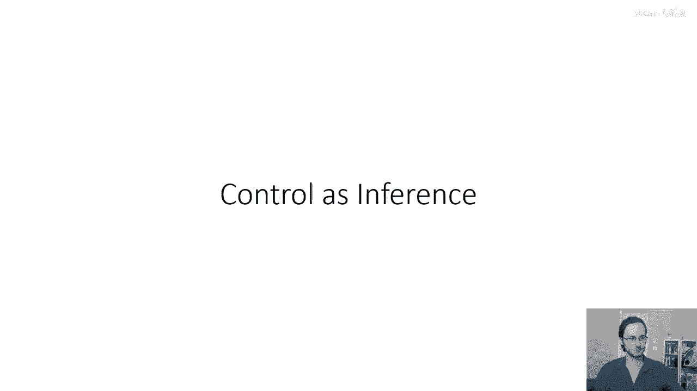

好的，让我们谈谈如何实际解决这个推理问题，正如我们在前一部分讨论的，在这个控制中，我们真正感兴趣的有三个推理问题，作为推理图模型，第一个是计算反向消息，它们是从小t到大t给定s_t和a_t的优化概率。

第二个是计算策略，给定状态，行动的概率，并且给定整个轨迹是最优的，"这就是我们想要解决前向强化学习问题的兴趣所在"，"我们将看看从反向消息中恢复这个信息到大约多直接或少直接程度如何。"，"然后。

第三个步骤是计算前向消息"，"在1到t-1期间达到最优性的概率为st"，"而且这对后来的逆向强化学习将非常重要"，"那么让我们从反向消息开始吧"。

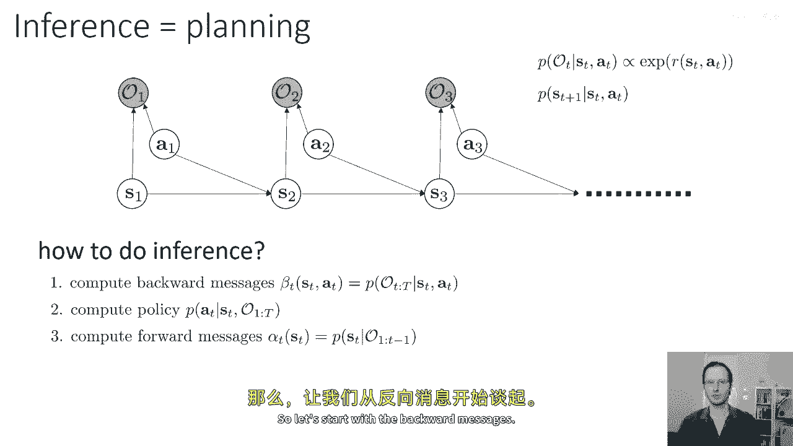

这些真正是最重要的，"因为如果你能计算这些"，"然后你可以恢复接近最优的政策"，"和"，我们获取反向消息的方法是通过递归，和概率理论，以及一些代数，所以首先我们可以取这个反向消息的方程。

然后我们可以插入下一个状态s t plus one并积分出来，所以反向消息等于对所有s t值的积分，加上p of o t，在大t下，逗号 s t plus one 给定 s d a t。

现在我们要做的是，我们将使用模型中已有的cpds来分解这个分布，我们做这个分解的目的是恢复一个递归的表达式，其中，我们可以表示βtstat为βt+1的一些函数，st+1和at+1，因此。

为了分解这个表达式，我们需要注意的是，未来的最优化变量，即ot+1到capitalt，在条件于sd+1的情况下，是与过去的一切独立的，我们可以从图形模型的检查中看到这一点。

这意味着我们可以将这个表达式分解为三部分，第一句是t加1到结束时所有最优性变量的概率，给定s t加1，我们知道我们不必将这个条件于s t和a t，因为给定s t加1。

所有的未来最优性变量都独立于s d a t，然后我们有s d a t给定st加1的概率，那就是我们已经知道的转移概率，然后我们有剩余的最优性变量o t给定s t a t的概率，那就是对应于指数奖励的。

因为那就是我们图形模型中的一个cbd，所以我们知道这个东西，我们知道这个东西，那就是我们的转移概率，尽管当我们在做rl时，我们可能会想要计算反向消息而不需要这个概率的功能知识，目前我们将假设我们知道它。

这就只剩下这个剩余的术语，所以从t加一到资本t给定s t加一的概率，本身可以写成从t加一到资本t的优化概率，给定s t加一和a t加一，给定s和t+1，t+1的概率，现在，这个部分只是时间t的逆向消息。

步骤t+1，所以，嗯，我们已经稍微提高了一些，我们，嗯，我们已经发现了一种主要是递归表达式的东西，除了这种奇怪的术语，我们还没有定义，然而，给定一个状态，行动的概率是多少，现在，关键地，这不是一个策略。

这是说哪些行动在先验上是可能的，意味着，如果你不知道你是否最优，你采取特定行动的可能性有多大，一般来说，嗯，如果你不知道你是否最优秀，你可能不知道哪些行动更可能或更不可能，所以我们可以定义这个术语。

我们可以定义在给定状态s之前的一个动作的p，但现在我们将假设它是均匀的，对于这个假设有几个合理的原因，首先，如果你不知道猴子试图做什么，那么你可能无法说哪个行动更可能或更不可能在第二次执行。

也许更数学地，如果你想施加一个行动喊叫者，结果表明，你可以等价地修改奖励函数并保持均匀的行动先验，并得到相同的解决方案，这个结果稍微有些微妙，而且我将把它留作一个练习给你们去在纸上解决，但总的来说。

目前，我们将假设行动先验，P在t+1给定s t+1是均匀的，这意味着它是常数的，这意味着我们可以忽视它，这并不意味着那项政策是统一的，因为记住我们的政策是在有给定s t的情况下，t的后验分布。

t是从大写t到1的，行动先验只是行动a先验发生之前的概率，你知道你是否最优，好的，所以现在我们已经，嗯，去掉了行动先验，并将一切都表达为转换概率，最优概率，并且按照未来向后的消息递归地。

我们可以编写一个递归算法来计算向后的消息，它是一个从轨迹的末尾开始的for循环，并一步一步向后移动直到开始，并且在从末尾到开始的每个时间步长，我们在时间t计算向后的消息，步t。

作为现在给定s t的优化概率，A t乘以在s t上的期望值，加上一个我将要称为beta t的量的一个，一加s_t加一加beta_t加一加s_t，一加是一个状态向后的消息，所以这就是这个方程的基本形式。

并且状态向后的消息就是状态动作向后消息的期望值，在按照均匀动作先验分布的动作期望下，所以这就是这个东西，如果我们交替进行这两个步骤，那么我们就可以递归地计算向后消息一直到底，从末尾到开始。

最后的向后消息beta^T就是最后一个奖励，因为给定s资本t的概率，o资本t的概率，逗号，实际上，一个资本t是已经在你模型中存在的cpd。

现在好了，让我们更详细地看一下这个反向传播，所以这里是递归的，嗯，我在前一张幻灯片上推导出的算法，并且我们将做一些定义，使用一些很有启发性的名字，这将帮助我们理解这个算法，第一。

我们将定义v_t作为β_t^st的对数，然后，我们将定义q_t^st^a_t作为β_t^st^a_t的对数，现在，我们可以将这些方程写成对数空间，所以，如果我们将状态向后消息方程写成对数空间，然后。

我们就得到v_t^st等于对数积分的指数q_t的，所以，如果我们写状态向后消息的方程在对数空间中，那么我们就得到v_t^st等于对数积分的指数q_t的，S_t的，S_c_a_t，所以这有点有趣。

这是什么有趣的方程式，嗯，一开始它似乎不是做什么特别直观的事情，但如果你想象qt的值非常大，如果你对一大群大值的指数求和，那么最大的那些值将主导这个和，这意味着当你然后取对数。

你将恢复一个接近最大值中值之一的数字，你求和的指数值，嗯，在极端情况下，你可以想象当qt越来越接近无穷大时，那么对数和指数求和的值越来越接近最大值，所以实际上。

我们可以称这个对数和指数求和的值为一种softmax，这不同于我们在深度学习中用作损失函数的softmax，它是max运算的软放松，所以对这个表达式vt的st来说，它趋近于对a中的qt的最大值。

当qt变得越来越大时，所以这很有趣，我们在强化学习中看到，最优价值函数是最优q函数的最大值，现在，我们从推断的角度看到，价值函数是q函数的软max，这有点道理，我们想要软化我们对最优性的概念。

所以稍微次优的事情仍然是可能的，让我们谈谈另一个表达式，所以如果我们将另一个表达式写为对数空间，那么我们得到以下等式qt的st等于sdat的r，加上对预期预期值vt的指数加一的log的期望。

在st加一处，所以这看起来像贝尔曼备份，因为它有一个奖励和一个期望项，除了现在您在期望周围有这个log之外，好的，所以让我们尝试更好地理解这个方程，有一个特定的特殊情况，它与贝尔曼方程完全相同。

花一点时间思考那个特殊情况会是什么，在哪个设置中，我右侧的方程与贝尔曼备份完全相同，它实际上在设置中发生，在哪里，右侧的方程与我在幻灯片上的方程完全相同，就是贝尔曼备份，嗯，它出现在设置中，在哪里。

下一个状态是当前状态的确定函数，因为如果下一个状态是当前状态的确定函数，那么预期的值在求和中只有一个非零元素，这意味着对数和指数展开会取消，所以在确定设置中，它正好是贝尔曼，嗯，贝尔曼方程。

我们之前看到了如何价值迭代算法交替计算q函数，使用贝尔曼方程并计算价值函数通过取最大，在确定性转移的情况下，q的这个表达式基本上与贝尔曼备份相同，在随机转移的情况下，你实际上得到一个种乐观的转移。

注意这也是一个对数和x的和，这意味着这些目标值将由下一个价值最大的状态主导，所以如果你有获得幸运的可能性，你会认为那个更可能是一个不好的主意，实际上并不是。

而且我们可以通过解决这个问题来改进我们的推断过程，但直觉上，这个问题发生的原因是因为当我们问这个问题时，你成为最优的可能性有多大，给定一个在行动中的特定状态，它不区分是否最优。

因为你运气好与因为你采取了正确的行动而成为最优，我们稍后会回来讨论这个问题，并详细讨论如何在随机情况下解决这个问题，但是暂时来说，我会注意到的是至少。

确定性的情况完美地匹配了我们之前看到的经典价值迭代的概念，除了我们使用软max而不是硬max之外。

好的，所以，总结一下后向传播，我们有这些后向消息，Beta t of s t a t，它们等于在状态 s t a t 下，从时间 t 到大 t 通过动作 o 的概率。

这就是它在时间 a little t 到大 t 步骤上可能是最优的概率，由于我们在状态st时采取了动作at，并且我们可以通过递归来计算这个，嗯，通过重复这两个步骤。

计算状态动作向后消息作为下一个状态消息的预期值，乘以在状态sd和动作at时o t的概率p，并计算状态向后消息作为状态动作向后消息的预期值，在动作分布下，哪个是均匀的。

所以beta t的日志是一种类似于q函数的对象，我们可以通过将v t设置为log of beta t s t来使这一点更加明显，将q t设置为log of beta t s t a t。

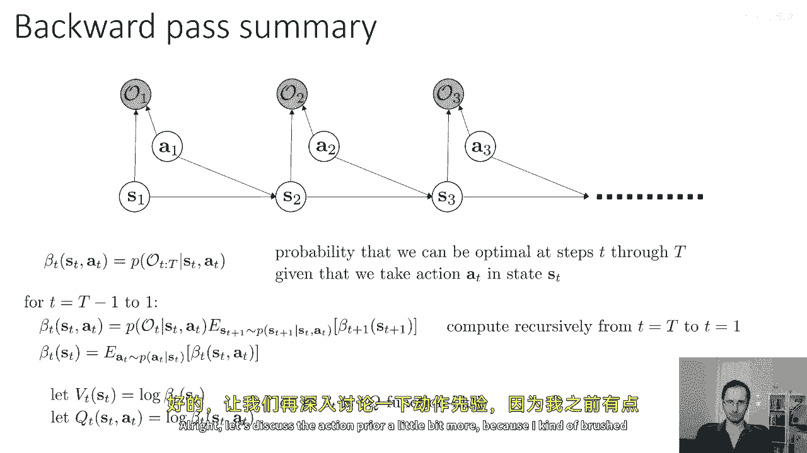

好的，让我们再稍微讨论一下行动前，因为我有点把这个问题掩盖了，这是一个我经常收到很多问题的地方，那么如果行动前不是，如果你相信猴子是，也许它是一只懒惰的猴子，即使它不是最优的。

比做大动作更有可能采取小动作，如果前面的动作不均匀，那么我们对v的t表达式会变得稍微复杂一些，不再是指数到q的对数积分，现在是指数到q的对数积分，加上给定状态的动作概率的对数，在给定的状态下。

我们的提示被定义为这样，所以如果我们重新定义q为一个不同的量，Q tilde，它是由r加上给定状态st时t的概率的对数定义的，再加上下一个值的对数期望，然后我们得到这个表达式，嗯。

对应的价值函数就是对指数化q tilde的积分的对数，所以这使它显而易见，如果我们简单地将给定状态s的t的log p添加到奖励中，然后按照以前的方式做所有事情，仿佛之前的动作是均匀的，将会需要。

将恢复精确的答案，正如如果我们正确地考虑到非均匀的动作先前，将会有，这就是我们为什么对之前的行动不担心的基本原因，因为我们总是可以构建一个不同的回报函数，该函数考虑之前的行动，然后从那以后。

我们将其视为均匀的，这就是我们基本不担心那个术语的原因，我们可以总是将之前的行动跟随到奖励中，因此，在没有一般性损失的情况下，可以假设均匀的之前的行动。

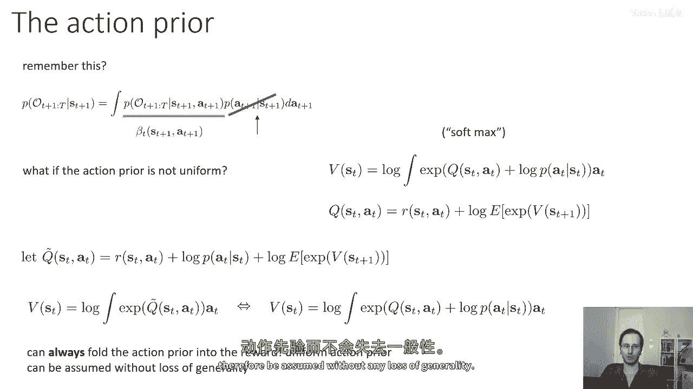

好的，下一个，让我们谈谈如何从反向消息中恢复策略，所以，策略是在给定st和整个轨迹最优的情况下，t的概率，所以，这就是我们的接近最优策略，现在，正如以前我们所注意到的，给定状态。

过去的最优化变量是条件独立的，这意味着我们可以等价地写这个查询为p(t|st)，给定st，o(t)通过大写的t，所以，基本上，所有的最优化变量1到t-1都不会影响t，因为它们由st分隔。

这使它可能更明显，为什么我们可以仅使用后向消息来恢复策略，因为出现在这个表达式中的所有变量现在都在后向消息中出现过，所以我们要做的是，我们将使用条件概率的定义来写这个条件概率，"截至我知识更新的时间点。

关于该主题的最新信息尚未提供。"，"由给定的o t通过大写字母t，s t被p分割"，"然后我们会做的就是我们将贝叶斯规则应用到顶部和底部"，所以这就有点奇怪。

"因为通常你考虑将贝叶斯规则应用到一个条件分布上"，"但是我们将同时应用贝叶斯规则"，"到分子和分母"，"所以贝叶斯规则将允许我们翻转顺序"，"因此。

我们的反向消息是通过大写字母t在给定t s t的情况下传输的"，"我们想要通过大写字母t给出的o t来计算p of a t s t"，所以贝叶斯规则允许我们翻转这些，这就是我们在下一行看到的。

我们将贝叶斯规则应用于分母和分子，这意味着我们翻转了事物的顺序，在条件条的左右边和右边，我们引入了p of a t，S t除以p of o t通过大写的t在分子中。

和p of s除以p of o t通过大写的t在分母中，现在，我们将消除并移动一些这些术语，所以，贝叶斯规则在分数的顶部和底部都出现，所以，这个消失了，这非常简洁，这留下了我们两个表达式，记住。

我们的后向消息是o t通过大写的t给定s d a t，我们的状态后向消息是o t通过大写的t给定s t，所以，这个表达式中的第一个分数只是状态动作后向消息的比率，和状态后向消息。

第二个比率只是p of a t给定s t，这是我们的动作先验，我们假设它是均匀的，所以，第二个分数消失了因为它是均匀的，它是一个常数，只剩下第一个分数。

这意味着最优策略pi of a t给定st可以简单地恢复，作为状态动作消息和状态消息的比率。

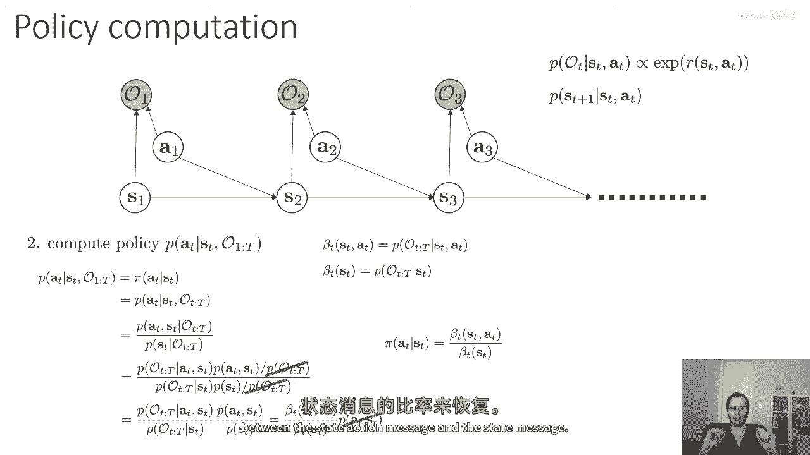

好的，嗯，现在，让我们嗯，带回这个表达事物的想法，使用对数空间，在对数空间中，我们看到状态动作后向消息的对数有点像q，和状态后向消息的对数有点像v，如果我们将这些插入到策略中。

如果我们将这些插入到策略中，然后，我们得到pi of a t给定s，T等于指数q除以指数v，这就是指数q减去v，q减去v是优势函数，这非常有吸引力，我们现在能够表达策略。

Pi of a t给定st作为优势s t a t的指数，这意味着你采取行动的概率，是博尔兹曼分布在这个软优势函数中，行动具有更高优势的可能性更大，具有最大优势的行动最可能，并且随着优势的减少。

行动的可能性变得指数级减少。

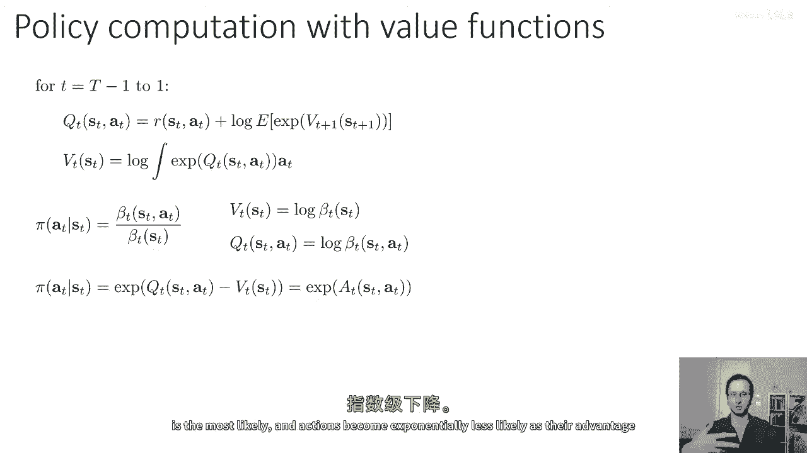

这似乎是一个相当直观的概念，好的，所以，总结一下策略计算，这是你在温度下可以添加的优势的指数，所以如果你在前面加上1/α，嗯，嗯，指数，那么你就可以平滑地插值在硬最优性和软最优性之间。

所以当α趋近于零时，然后策略在最优行动上的决策变得确定，因为，嗯，当α趋近于一时，然后您恢复经典推理框架，这样您就可以在标准硬最优性和我们学到的软最优性之间进行插值。

更好的行动更可能，您得到随机的平局打破，所以如果两个行动具有完全相同的优势，您会以相同的价值采取它们，这有点像玻尔兹曼探索。

当然，这随着温度的降低趋近于贪婪策略，所以如果您将alpha降低到零。

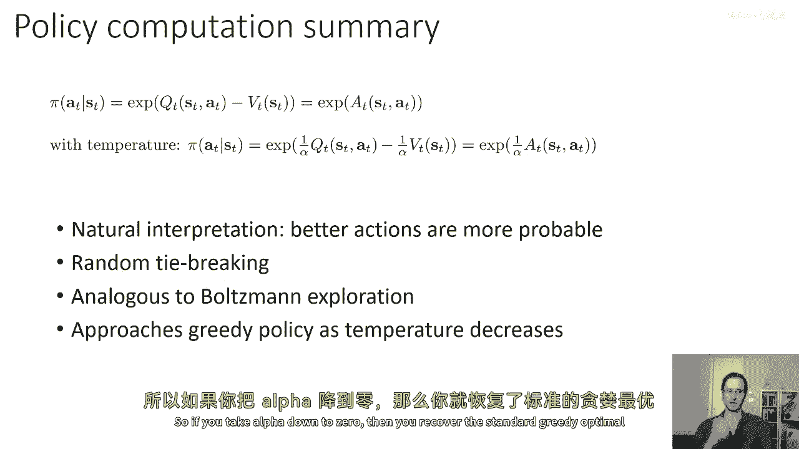

然后您将恢复标准贪婪最优策略，好的，所以最后，让我们谈谈前进消息，所以前进消息是状态给定从1到t-1的优化性的概率，我们计算前进消息的方式将与我们计算，向后消息的方式相似，我们将将其放入之前的时间。

步骤变量将它们整合出来并恢复一个递归过程，所以我将放入的两个变量是st-1，和t-1，所以我得到p(s_t，)，S t 减去一，逗号 a t 减去一，给定 o 一至 t 减去一。

再次我将这个表达式因式分解为术语，嗯 那些我可以理解的，所以我将它因式分解为 st 给定 st 减去一，逗号 a t 减去一，逗号 o 一至 t 减去一，所以这就是第一个术语。

然后第三个术语 p 的 a t 减去一 给定 s t 减去一，逗号或一至t-1，然后，给定o一至t-1的s t-1的第三项p，s t-1的p是多少，所以，一切都依赖于o一至t-1，其余的都是链规则。

现在，首先需要注意的是，给定s t-1的s t的概率是多少，a t-1，不依赖于o一至t-1，那就是我们的转移概率，我们已经知道那个量，所以，这个东西可以删除，所以我们像这样收集了它，我们有三个术语。

第一个，我们知道第二个和第三个稍微难一些，所以让我们写第二个和第三个术语的乘积，在这个积分中，第二个和第三个术语的乘积可以写成，嗯，通过将两个表达式应用于贝叶斯规则，我将以稍微有趣的方式应用贝叶斯规则。

所以对于第一个表达式，我会使用贝叶斯规则翻转，O t 减去一和a t 减去一，所以我会将ot t 减去一放在左边，并将a t 减去一放在右边，所以那是第一个分数，当我这样做时。

我会得到p(ot t 减去一|s t 减去一)，a t 减去一，我知道那是什么，那就是指数奖励，然后我得到一个t减一，给定s减一，那就是我的行动之前，然后我得到我的分母，Ot t减一，给定s t减一。

当我将贝叶斯规则应用于第二个量时，P of s t减一，给定o一至t减一，我要做的事情是，实际上，我只会翻转ot减一部分，并在条件栏的左侧翻转它，将s t减一放在右侧。

但是然后我会保留从t减二到一的一个，在条件化的条形图的右侧，当我这样做时，然后我会得到给定st减一，ot减一的p值，给定o从一到t减二，st减一的p值，然后有一个分母，它是给定o从一到t减二。

ot减一的p值，这就是我做这个技巧的原因，是因为现在第一个分数的分母与给定的ot减一，st减一项可以取消，在分母中的项，在第二个分数的 numerator 中的项，之前的动作也会消失，因为那是常数。

分母中的这个术语只是前一个时间步的逆向消息，而且第一个时间步的逆向消息通常已知，所以，嗯，现在，我只剩下我知道如何计算的表达式，直到归一化常数，这就是我们如何计算前向消息的，一旦我们计算出了前向消息。

接下来我们可以问的问题很好，如果我们想要恢复状态边缘，如果我们想要恢复给定最优性的状态概率，从一至大写字母t的每个地方，所以这种情况下，嗯，现在我们有了前后两个消息。

实际上我们可以很容易地推导出这个方程，所以给定o从一至大写字母t，s t的概率是，使用条件概率的定义是p(s t，o从一至大写字母t)等于p(s t)除以p(o从一至大写字母t，o一至大写字母t)的商。

嗯，现在我们可以因子化分子和分母，分子我们因子化的方式是，我们将其写为p(o小t至大写字母t)给定s t乘以，st和所有其他行的概率，我们之所以能够这样做是因为我们知道o小t至大写字母t。

对于给定s t的条件上是独立的过去的，现在，在这里，分子中的第一个项只是后向，状态后向消息t，所以我们可以将这个表达式写为，我们可以将其写为成比例的，如果我们忽略分母为βtst的p(s t)除以。

o一至t-1乘以p(o一至t-1)的商，第二个项只是前向消息，最后一个项不依赖于st，所以如果我们愿意接受它为一个未知的归一化常数，我们可以简单地忽略它，然后。

我们剩下给定o一至t的状态概率是成比例于后向消息乘以前向消息的，非常简单，非常优雅，这就是你如何恢复软最优策略的状态边缘的，这在我们讨论逆强化学习时将变得非常重要，所以这里有很多数学。

但所有的都是相当直接的代数，结合了概率理论，所以，如果这里有什么不清楚，我推荐你下载课程网站上的幻灯片，然后自己去研究数学，对我来说，当我面对方程时，有帮助的是写下它们并认真解决它们。

因为然后通常一切都会变得很清楚，好的，让我们稍微思考一下这个表达式的直觉，一种我们可以思考这种计算状态边缘的方法是，让我们回到我们的猴子案例。

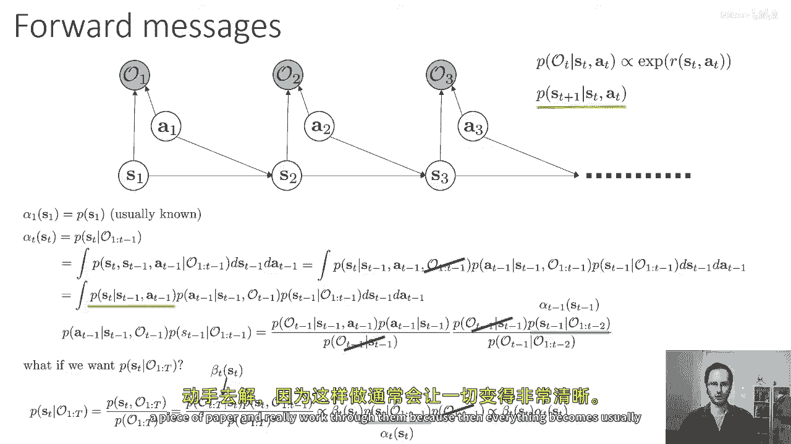

你只是想从开始到目标走一条直线，后向消息代表从目标向外发射的锥体，让我们回到最初的猴子案例，你只是想从开始到目标走一条直线。

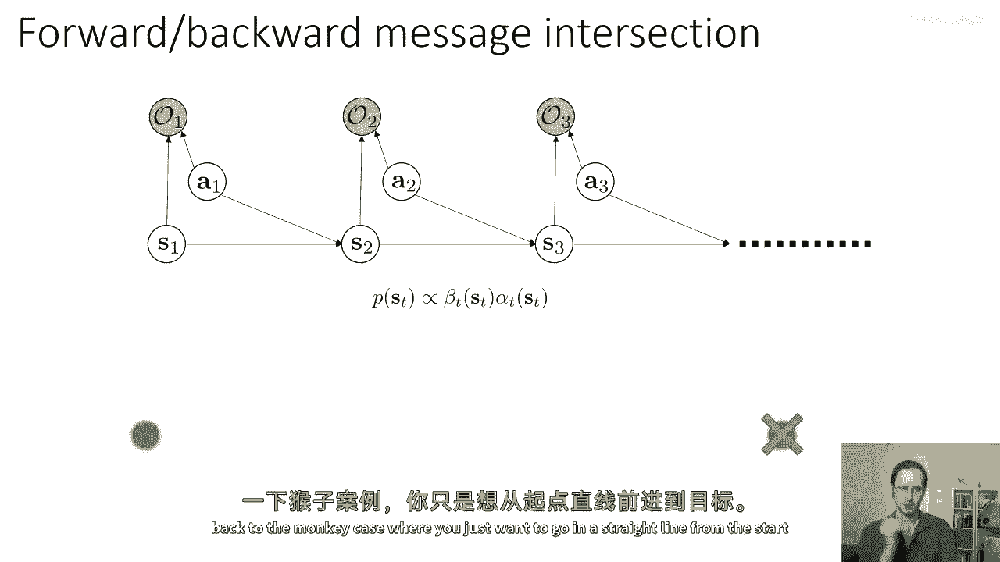

后向消息代表从目标向外发射的锥体，这就是计算状态边缘的一种方式，所以，这个锥体就像这样辐射出去，锥体代表从你可以达到目标的状态集，所以，越往后走，从可以到达目标的状态集就越多，嗯，所以。

这个黄色的东西代表的就是这一点。

向前的消息代表从初始状态向前辐射的锥体，这代表从初始状态以高概率和高奖励可以到达的状态。

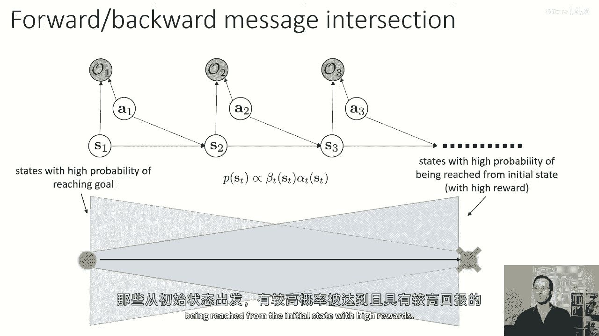

这些都是如果你从绿色圆圈开始，然后保持高奖励可以到达的状态，然后，你的状态边际基本上就是这些东西的交集，因为你要达到目标，你从开始，所以，蓝色锥体代表向前的消息。

这是从绿色圆圈开始可以以高奖励到达的状态，黄色锥体代表你可以从达到目标的状态，基本上最优行为将位于这两个东西的交集中。

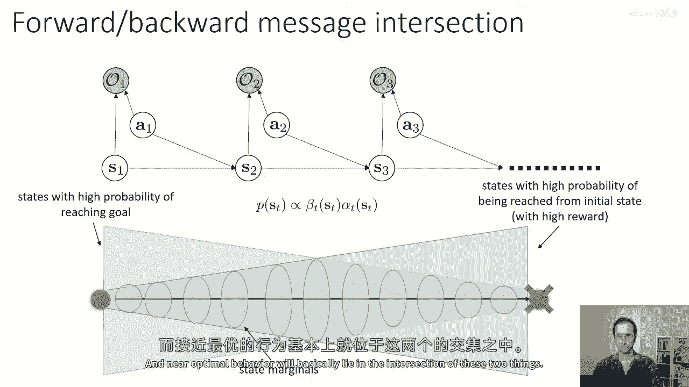

一个有趣的事实是嗯，在涉及嗯，人类运动控制科学家的实验中，实际上已经观察到真实人类的达到行为表现出这种分布，如果你问一个人握住一个小工具并移动这个工具，使得它触摸到一个特定的位置，在这种情况下。

人被要求触摸他们的肘部，你实际上绘制出工具尖在空间中旅行的位置分布的图，你会发现当然，在开始因为它从开始，在结束因为它到达目的地时非常精确，它有这种向外生长的，嗯，雪茄形状，嗯，你知道，分布。

其中你在中间有最宽的状态边际。

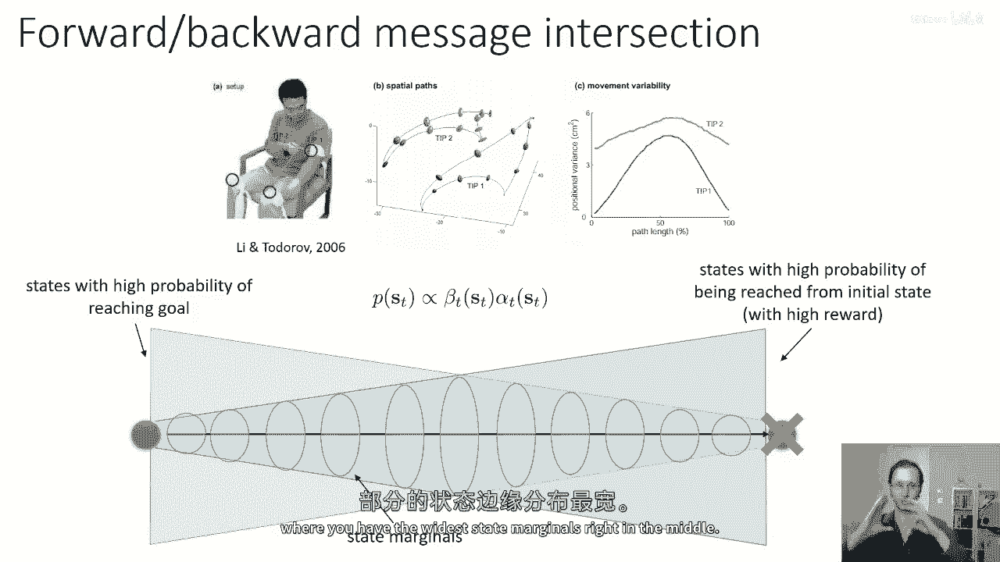

好，所以，总结来说，我们讨论了如何从最优控制中衍生出一个概率图模型，这是图模型，我们讨论了如何将控制框架化为推断，与隐藏马尔科夫模型，滤波器等非常相似，逗号。

以及如何得到的推断过程与动态规划或价值迭代非常相似，但在接下来的讲座部分，我将讨论如何使用变分推断来改进这个框架，我将讨论如何使用softmax而不是硬最大来替换接下来的部分。

