# 【深度强化学习 CS285 2023】伯克利—中英字幕 - P87：p87 CS 285： Andrea Zanette： Towards a Statistical Foundation for Re - 加加zero - BV1NjH4eYEyZ

凯文，是的，所以这将是一种讲座，与您之前见过的有所不同，特别是在于它将更加专注于理解，嗯，一些您在课堂上见过的强化学习算法和协议，如果我们退一步，试着，嗯，看看您在课堂上见过的所有算法。

并且思考一下这些理论如何应用到实际世界中，你会发现还有一些挑战，嗯，一个挑战是，例如，设计一个，稳定的强化学习算法，特别是在这一方面，可能需要一些设计，以确保强化学习算法的稳定性。

并且常常这一转化意味着，嗯，调整一些超参数以实现特定的性能，现在另一个关键问题，嗯，将强化学习应用于天堂到现实世界的问题是一般效率，强化学习算法极度数据渴求，而且他们需要比嗯，例如。

我们在监督学习中常用的算法，然后有关于泛化的问题，通常一个特定的算法会被调整，并在特定的任务上学习，"但是，设计一般类比设计特定类要困难得多。"，"通用的算法，可以在完全不同的任务中表现出色"。

"还有一个问题是计算效率"，"如果你尝试在课堂上完成一些作业"，"你会发现，现在训练可能需要花费相当长的时间"。

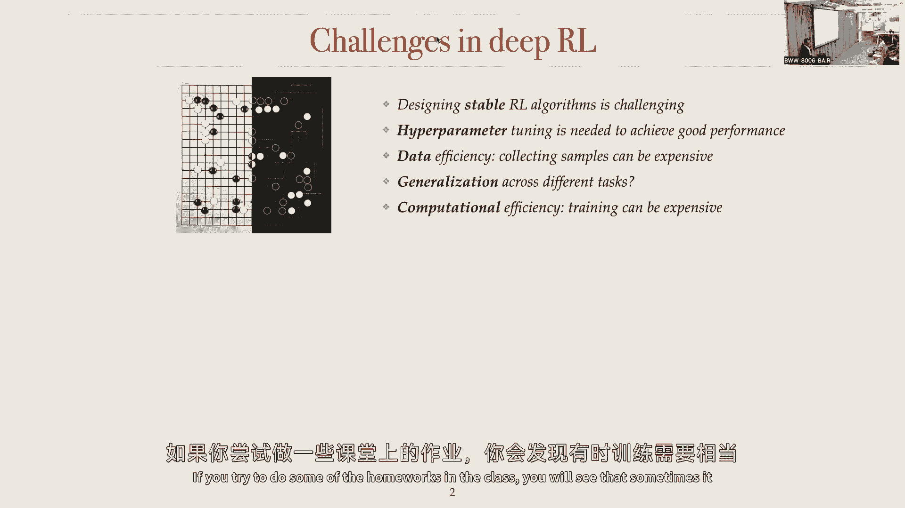

所有这些问题都 kind of 特定于强化学习，"但这些问题是阻碍强化学习更广泛应用的问题"，嗯，"在实际世界中，像稳定性这样的问题"，"收敛"，而且样本效率在特定情况下变得极其关键。

如果你在现实世界中交互，你希望算法的行为有一些可预测性，而且样本通常相当昂贵，因为它们相当于交互，嗯，与现实世界，所以在这次演讲中，我们将尝试后退一步，并试图理解强化学习算法的一些基础。

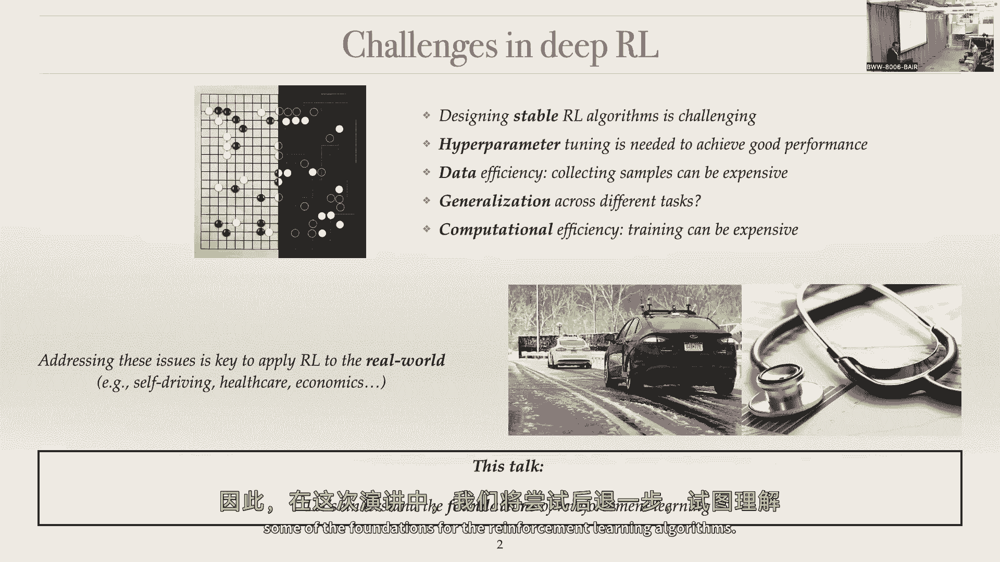

以及我们为什么想要开发一种强化学习的理论，或许最基础的动机是，真的，在强化学习中，人们使用的关键基本协议实际上真的是算法，这些算法是由理论驱动的，例如，价值迭代，策略迭代，上界置信度探索，强化策略梯度。

这些算法都是至少它们至少是，它们或多或少受到理论的启发，并且常常伴随着保证，至少在其最基本形式上，还有一些将理论开发的算法成功转化为更实用形式的成功案例，例如，随机最小二乘值估计。

你可能知道它作为Bootstrap DQN，此外，我们可以给你一些考虑，这不仅适用于你正在尝试解决的问题，即你试图解决的那个，但也可能更广泛地适用于一个广泛的，一个广泛的问题类别。

而且我想更广泛地谈论这个领域的，他们也帮助揭示基本的限制，例如，你不能做的事情，我们将看到一个例子，嗯，今天，现在我们想问什么问题，嗯，从理论上看，很好，理想情况下，嗯。

我们想要针对我们正在研究的算法有一些形式的保证，例如，如果你提出一个新的算法，你想要理解它是否收敛，这就是你可能关心的主要问题，嗯，当你继续前进时，你想要将它应用到你的问题上，你想要理解如何选择超参数。

你是否需要考虑任何公式或权衡方式，另一个问题是需要多少数据，嗯，算法需要多少数据才能实现一定的，性能水平，所以需要进行多少次交互，你可能还会关注计算复杂性，以及算法的运行时间，这就是你想要研究的。

但实际上，回答这些问题极其具有挑战性，极其困难，嗯，例如，对于大多数更深层次的算法，甚至无法证明收敛，因为到最后，基本的时间差框架，或者是处理经验，重放和目标网络，他们并不总是保证会收敛，因此。

我们现在立即面临着一种挑战，结果发现，回答这些问题通常极其困难，因此，你今天将看到的是，目前存在一种巨大的差距，你在课堂上看到的实际算法，和我们今天将要讨论的考虑因素，无论如何，我会主要专注于理解，嗯。

一个良好的统计方面，那么，你需要学习特定问题的样本数量是多少。

我会研究大约三个不同的大主题，一个是试图理解强化学习问题的易难程度，我们是否可以更快或更容易地学习问题。

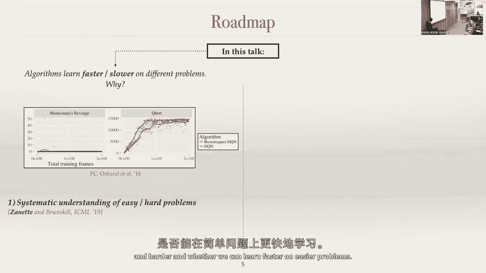

然后，我会专注于理解，真实算法和函数逼近之间的相互作用，所以，泛化问题，我会简要谈论统计限制，你不能用强化学习算法做的事情，也会简要谈论离线强化学习。

让我们开始理解哪些问题是容易的，哪些问题是困难的，我们考虑的设置是探索问题，我认为你们已经学过的大部分课程是关于探索算法的，想想标准线设置，Dqn所有这些，所以在这个设置中，你有一个强化学习代理。

它从一个空的数据集中开始，并且有八步的介绍直到结束，例如，一个游戏，并且这种交互是持续的，它将持续播放过一段时间的集数，您想要测量我们的执行学习代理学习多快，现在，直觉上。

执行学习代理开始时可能会有一个如果在玩阿塔里时可能是次优的策略，如果您从空的数据集中开始，第一个策略可能会很糟糕，但是，逐渐地，它将学习并玩出越来越好的策略，我们想要测量算法的性能，而且，标准做法是。

我们试图移动这个东西，是的，做这件事的标准方法是，定义一个被称为后悔的量，你可能在课堂上见过，它实际上是，代理执行的策略的子最优性差距之和，直觉上，如果问题容易至少，学习算法将根据性能接近。

最优策略的价值，但是，它将以它不知道太多的方式开始，因此，他玩的策略的初始值将很低，如果我们将所有子最优性差距作为episode的函数来求和，嗯，这将等于计算这个曲线的积分，所以，橙色阴影的部分，嗯。

这就是我们所说的算法的悔恨，所以，我们的目标是尝试设计一个算法，嗯，这样可以最小化后悔，现在在大多数情况下你可以这样做，例如，在更深的井中，它是，并不清楚你是否可以做到，嗯，你可以这样做，因此。

我们将专注于今天早上的第一部分问题，以小状态和动作空间为特征，因此，我们有一个表格表示的问题。

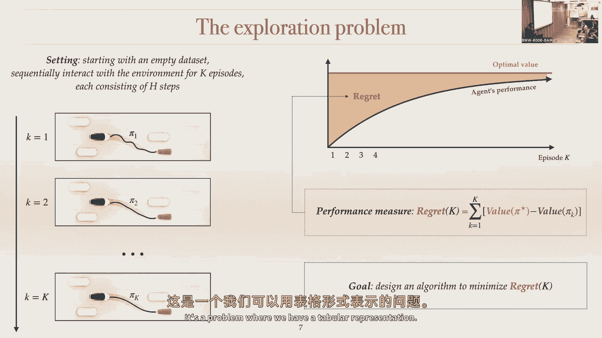

如果我们回到可能两千一十年，两千一十一，以及随后的几年，嗯，在那的基础之上，有一个巨大的推动力，试图设计出能够尽可能高效的算法，特别是在表格问题上，并提出了许多算法，而且他们对有一些形式的遗憾感到束缚。

那就是状态和动作空间的功能，特别是，它的基数，伊佐恩和翁，以及episode的数量，翁那些像遗憾束缚的是有用的因为它们适用于，翁广泛地应用于任何是马尔科夫决策过程的问题，你不需要担心问题的具体。

只要你有，你知道，状态空间中的有限状态，对这些算法你有保证，而且，这也是其限制，在意义上，它不清楚某一算法是否更好或更差，如果问题具有某种结构，这就是我们在实践中看到的，强化学习算法的性能差异极大。

即使是对于同一算法，面对问题差异很大的情况也是如此，因此，我们想要开始并尝试得出一些系统的理解，了解哪些问题是困难的，那么，哪些问题在强化学习中容易探索。

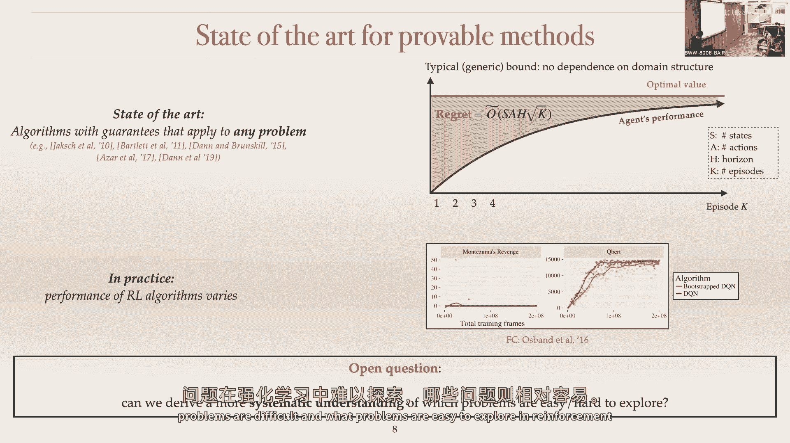

从历史角度看，人们正在投入大量的努力来改进这些边界，所以现在，嗯，在理论上，已经达到了一个算法的状态，嗯，这个算法在最坏情况下的性能，基本上无法证明，直到我们基本上得到了一个算法。

意味着在所有问题上的性能保证都达到了最佳可能，考虑到我们已知的下限，意味着性能无法改进，并且没有任何限制，存在一个基本的限制，你不能超越，同时，我们知道，我们知道存在一些问题类。

与悔恨构造的类型非常不同，这些问题类创建了下限，一个例子是没有动态或弱记忆的问题，一个内存弱的问题是一个在过去你采取行动的问题，而且他们对你的状态影响真的很小，想想，嗯，推荐系统。

这是一种上下文带状问题，嗯，这就是一个在这种弱记忆在某种程度上在其他结束系统中出现的情况，想想一个客户来亚马逊，嗯，如果你做出错误的决定，推荐会直觉地，你可能会让某个客户不满意。

但这不会影响你看到的下一个客户，这就是，嗯，弱者，电影和强盗问题，我们知道存在一些特定的强盗算法可以利用结构，它们能够比经典马尔科夫决策过程学习得更快，"同样，具有确定性的问题通常更容易解决。"，所以。

本质上这是一个搜索问题，同样，对于那些只能本地移动的问题，"在状态和动作空间中，一般存在更容易的问题"，"因为如果你犯错误"，"你还可以恢复"，"某种方式" 或 "无论如何"，一个例子是蒙太古卡洛。

我们现在要问的问题是，我们是否将这些问题视为表格问题，"在我们有明确表示状态和动作空间的地方"，并且，这些容易问题的动态性有什么共同之处，我们能否识别出一些共同特征，并尝试测量它们的难度。

如果我们的问题属于某个类别，如果我们面临的实际问题实例属于这些子类，那么，我们已经对这个问题给出了肯定的答案，我们首先提出了一种问题独立的复杂性，然后，基于这种复杂性的一种算法。

该算法具有某些特定的属性，首先，我们提出了一种问题依赖的复杂性度量，它描述了不同强化学习问题的复杂性，特别是在此，它由系统动态和最优策略的值的相互作用定义，它被定义为下一个状态最优值函数的一种变体。

而且这不是什么，算法可以计算如果你不知道实际的马尔科夫决策过程，因为最优值函数是未知的，而且动态也是未知的，但是尽管如此，你可以设计一个算法，它有一个与这个数量成比例的性能界限，这通常是未知的。

而且算法不需要知道那个，因此，算法能够为表格决策过程匹配最佳性能，这意味着它是最优的，它是可改进的，但与当前状态相比，它也可以达到最佳性能，嗯，如果问题属于某一类更容易的问题，例如。

如果是上下文带状问题，然后，算法自动匹配基本UCB在上下文中的实质性性能，此外，在某些问题子类上，它还具有分析上的优势，你可以通过数值方式评估这个量，并且不会出现，这里是人们在考虑过的问题上的情况。

并且它取一个比某种最坏情况值要小的值，这是由先前的界限建议的，所以，本质上它是一个量，嗯，它是，但在我们关心的问题上，它是分析上小的，但是也数值上很小，并且在之前被认为是问题的问题上。

现在我想要暂停一秒钟，问是否有关于这部分的技术问题，在我们继续前进之前，嗯，直觉，嗯，这实际上取决于问题的类型，所以，例如，如果一个问题有弱记忆，它是一个上下文敏感的带子问题，发生的事情是。

你在某个状态下可能犯的错误，实际上并没有长期的后果，因此，下一个状态价值函数，嗯，在不同的状态下不会相差太多，因此，这个量必须很小，你可能犯错误，但你只与当前客户失去联系，你不会破坏整个长期计划，对吧。

嗯，因此，这个量最终会变得更小，可以想象它是，嗯，估计转换效果的一些挑战，但是转换可以高度随机，例如，再次在带子里，它们大约是高的嗯，但是状态最终值的价值变化并不大，在这种情况下它会很小，先生，您可以。

您可以放松它作为轨迹的期望，在实际工作中它是最大大小，但你可以有所放松，好的，嗯，我想展示一张可能稍微更技术的幻灯片。

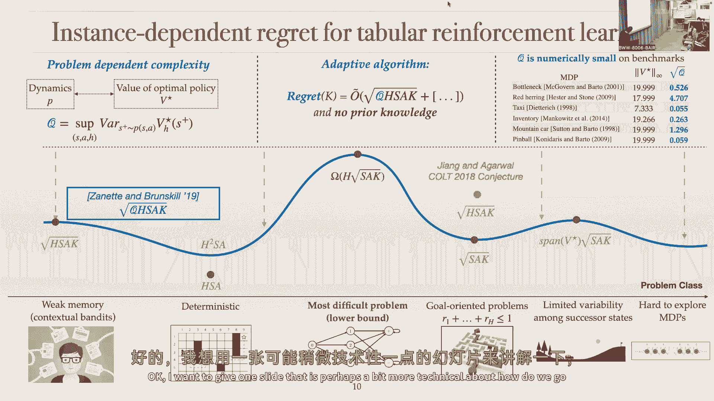

嗯，关于我们如何实现这样的东西，嗯，好，探索通常至少由高效的算法实现，通过向经验奖励添加探索奖励来实现，考虑DQN，那里的探索是通过ε-贪婪进行的，至少在最基本的形式，嗯，但如果你想要更复杂的方案。

并考虑UCB在嵌入式算法中，通常，已经完成的事情会得到额外的奖励，现在，奖励可以采取不同的形式，先前技术使用的最基本形式是比例的，嗯，与来自不平等样本数的倒数成正比。

但这种类型的探索奖励本质上是问题无关的，意味着它，它不是与MDP的任何特定特征绑定的，因此，算法会以相同的方式爆炸，无论问题是什么，但这不会产生依赖于问题的界限，现在，人们希望选择的理想方式是使用一种。

基于伯恩斯坦的某种集中不等式，它确实包含，嗯，与我们想要量的非常相似的东西，嗯，它将产生依赖于问题的界限，但是有一个问题，一般来说，最优行动价值函数，你并不知道它是什么，以及它的过渡动态。

你也不知道它是什么，所以，尽管这个奖金的选择是理想的，嗯，它实际上不会给出建议，就像不是你可以做的，嗯，在实际操作中，绕过它的方法是有点直觉的，是尝试使用经验动态，并且有一些关于最优价值函数的经验估计。

但如果你试图这样做，会引发几个挑战，主要挑战是一般来说，当他们开始时考虑的那些量，他们所知的非常少，你对动态的了解非常非常少，因此，你有基本上没有任何方法去猜测这些量是什么，如果你猜错了，猜错了，猜。

嗯，基本上算法可能不够乐观，它可能不会爆炸足够，嗯，而且它只会嗯找不到一个好的政策，所以您必须做的是引入一些校正项，幸运的是，那些试图纠正您错误估计的校正项，并且它们衰减得非常快。

所以它们衰减的速率更快，所以这就是，它就像是代理在应用，一种基于伯恩斯坦的集中不等式的正确形式，但是，有一个正在迅速衰减的传导项，这里的挑战在于，嗯，样本集的大小，特别是。

因为我们必须纠正与最优值函数不同的值函数，并估计这些误差，嗯，它需要估计如何传播，嗯，通过MDP，嗯，从可能我们甚至没有访问太多的状态，这个选择基本上导致，那些问题依赖的界限，现在。

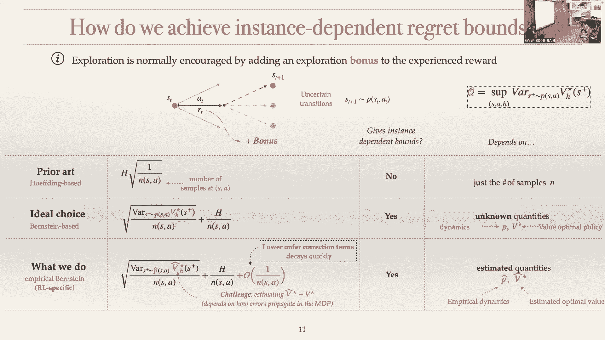

这很好，因为它确实给你一些初始，关于是否可能适应问题难度的强理解，并且是否可能同时，达到最小-最大最优，但也在多种我们感兴趣的问题类上实例最优，但是大的限制在这里是，当然。

这个东西只适用于小的状态和动作空间，嗯，在实际中，我们想要处理具有非常大，可能连续的状态和动作空间的问题，明确地说，你在课堂上看到的总是属于这个图标类别，一旦你开始使用任何形式的函数近似。

你就在这个类别中，因此，下一个我们将试图理解的问题是，函数近似的强化学习可以告诉我们什么，答案将比这里稍微更消极，在这里我们取得了某种积极的进步，但在这里，当我们开始谈论强化学习与函数近似时。

即使是看似容易的问题。

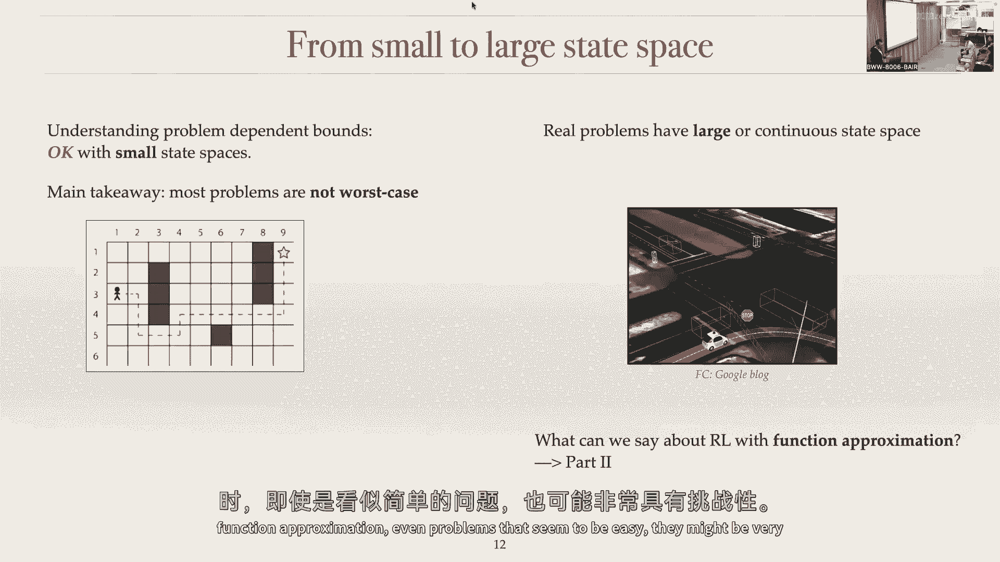

也可能非常具有挑战性，因此，让我们快速回顾一下实际问题，他们总是有一个状态空间非常大，大多数状态从未访问，我们想要引入某种形式的函数近似，嗯，能够从我们已经看到的状态中概括知识，到尚未观察到的状态。

我们希望我们不必在每个状态中都学习做什么，相反，我们只需要一些样本，大约与我们模型的参数数量相同，现在，观察到的是，完整的四叶草观察，如果你想要，嗯，"我们所拥有的是强化学习算法"。

"他们使用函数逼近"，与监督学习相比，他们仍然需要很多样本。"因此，我们希望提出一个非常基础的问题"，"例如，强化学习是否本质上更加困难？"，嗯，"然后，古典监督学习"。

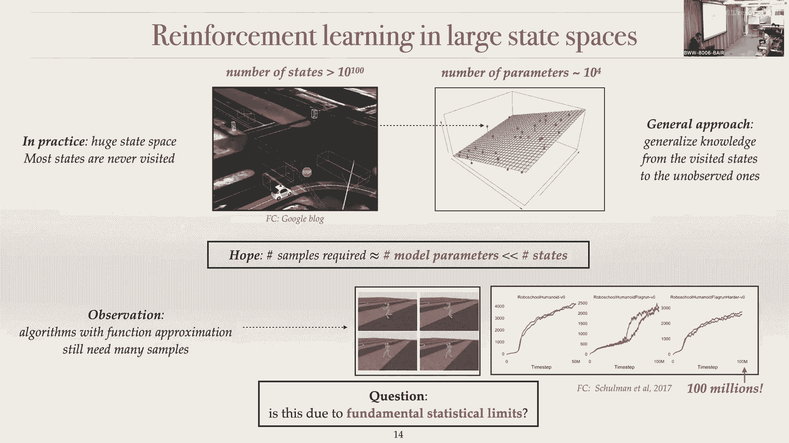

"并且为了研究这个问题"，我们考虑一个与强化学习离线设置非常相似的环境，你在课程第二部分看到的，在强化学习的离线设置中，你有，一些可用的数据集，它由状态动作组成，奖励和后继状态组成，我们试图问关于。

例如，可能与生成数据集的政策不同的政策，你可能，例如，想要尝试识别最佳策略，或者你可能尝试做离线策略评估，嗯，我们考虑的具体设置，是在一个允许我们在数据收集前有一个静态分布的环境中，嗯。

我们做这个的原因，是为了允许一些灵活性，因为如果数据集不好，直觉上，我们无法做太多，而且那不是算法的故障，它就是数据集，也许我只有数据关于单个州，所以，我们考虑这种情况。

即在有静态政策之前可以进行某种形式的数据收集，然后，我们试图理解我们是否可以成功地预测不同政策的值，例如，或者提取最优政策的值，现在，我们的期望是，如果动作值函数作为一个简单的表示形式。

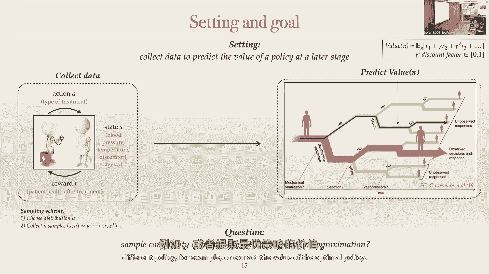

那么，我们的预期是，如果动作值函数作为一个简单的表示形式，例如，如果动作值函数作为一个线性函数，甚至可能我们知道特征提取器，那么这应该是一个容易的问题，为什么，它就是通过类比于线性回归。

如果你在解决回归问题，并且我给你一个特征图，并且我保证这个问题是可实现的，所以目标确实有一些线性扩展，也许有一些噪声，然后，你可以打开一本统计学教材，你会发现，嗯。

标准线性回归可以非常快速地学习这个问题，但是，在强化学习中，即使是线性的问题，它们似乎并不那么简单，特别是在古典td和拟合q的偏离方面有例子，甚至在线性可实现的问题上，实际上，如果你看一下可用的分析。

对于一些基本的算法和协议，你会发现它们全都做出了一些似乎比仅仅实现性更强大的假设，所以实际上，在二零二一年，我们并不知道，甚至最简单的线性设置是否是我们可以提供稳定算法的，我们能否提供一个算法，嗯。

然后，例如，收敛并收敛，是的，因为你可以使用lstd，但我们可以对此有任何保证吗，例如，学习所需的样本数量，即使在这个简单的设置中，这是解决表格问题后的第一步，真正理解正在发生的事情。

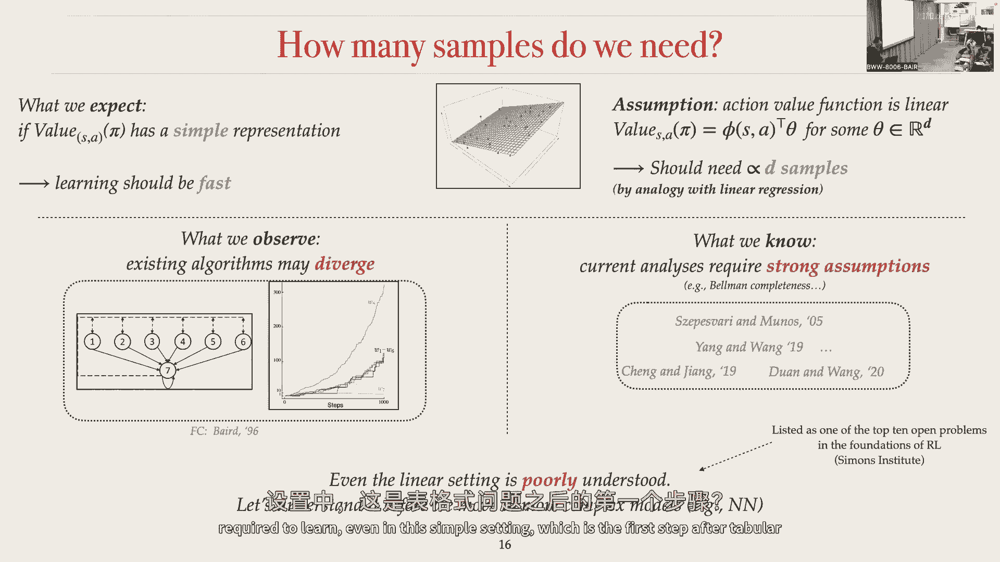

你需要将监督学习与强化学习的效果进行比较，而且关键的区别在于你是否试图为多个时间步进行一次预测，这是因为如果你试图为单个时间步进行预测，并且你开始时有一个你可能以智能的方式收集的数据集。

那么如果你只是想预测第一个奖励，并且你有承诺奖励函数是线性的，那么我们知道线性回归，嗯解决这个问题非常快，所以我们知道一个算法，并且我们也知道有保证，这就是最基本的，你可以认为的一种机器学习算法，但是。

我们的问题是如果我们想要预测多个时间步骤的政策价值会发生什么，与，有保证他们的价值实际上是可以实现的，意味着我们有一个特征提取器，嗯，它可以预测目标政策的价值给定一些数据参数。

结果发现这个问题在最坏的情况下极其困难，意味着与监督学习相反，你可以在拥有这个美丽的线性模型的地方找到问题，然而，任何算法都需要取一些样本来使向量预测，这是与特征提取器的维度成正比的指数增长。

当我说预测时，你可以广义地理解这个，意味着答案将保持不变，如果你试图，例如，识别最佳策略。

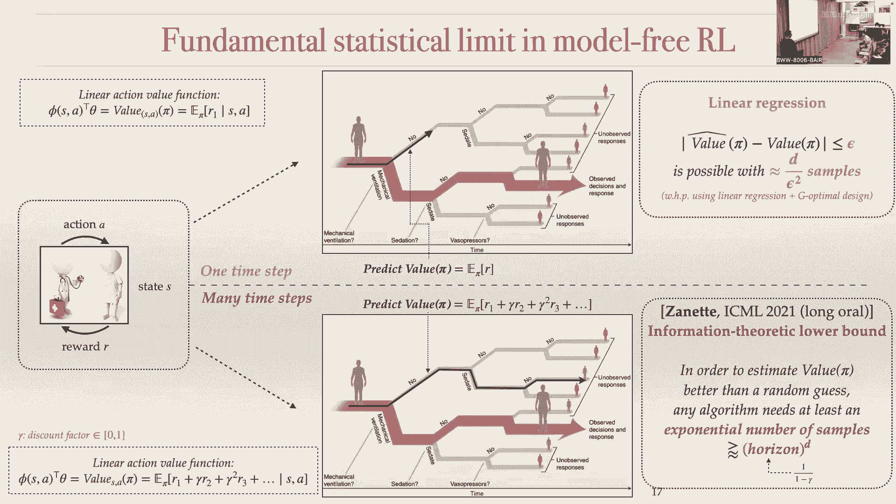

我想要一个比随机更好的策略，你仍然需要一定量的样本，在最坏的情况下，样本的数量可能会随着特征提取器的维度呈指数增长，因此，我们可以看到，监督学习和强化学习之间存在强烈的分离，在监督学习中可以实现什么。

它关注的是预测，因此，如果你想要做一步预测，和强化学习，它考虑序列过程作为时间线变长的视野，问题可能会变得指数困难，这并不意味着所有问题都会变得指数困难，但是，它确实告诉你，即使是看似简单的问题。

应该线性的问题，并且它们应该很容易学习，你无法找到在这些问题上保证效果的算法，所以对于你，为了让算法学习它们，必须有一些额外的特殊结构。

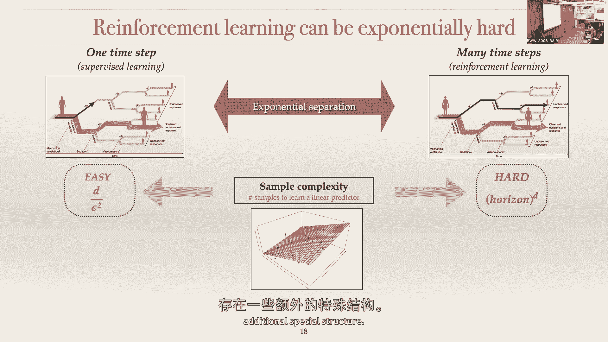

确实，这是我们看到的一种情况，嗯，样本复杂性差是机器学习中的一个主要问题，而且这个问题也与分歧有关，在这里的贡献主要是识别出这些问题与算法无关，它们具有信息论的意义，强化学习问题存在一些基本的困难。

这些困难普遍适用于所有，你可以想出来的算法，你无法找到一种能够解决所有问题的算法，即使它们像线性一样简单。

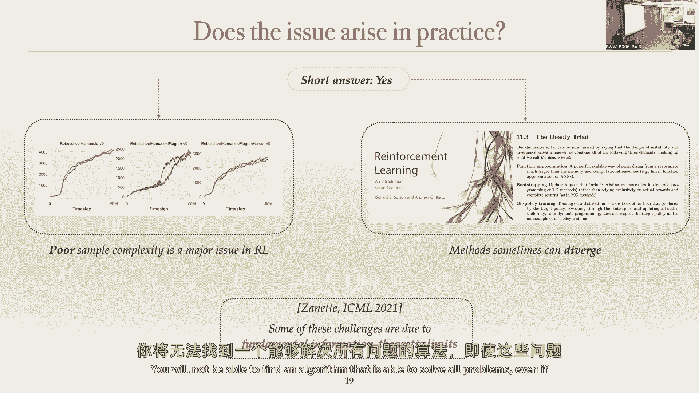

这个问题正在更广泛地研究，由一些重要的其他论文研究，一些有类似的结果，如果希望你对第二部分进行某种重新解释，你也可以看看那个，从在线强化学习的角度看，我可能有一个动作价值函数，想想DQN中有什么。

而不是有一个深度神经网络，你只有有一个简单的线性映射，我保证这个问题确实有一个线性的动作价值函数，尽管如此，你无法找到一种算法可以以多项式速度学习，"在一个线性问题中"，"所以。

这里的主要收获是线性回归容易开始"，"但在强化学习中，从模型的角度来看，等价于"，"三个观点已经无法触及"，因此，我们必须有些，嗯，"并不是过于乐观的"，嗯，我们可以解决的问题类型。

"确实已经付出了很大的努力来理解还需要满足哪些额外条件"，为了具有多项式样本复杂性，就像我们在统计中许多算法一样，现在，在我们继续前进之前，对于第二部分的这种排序，是否有任何问题，是的。

我认为真正困难的是，这实际上是一个关于嗯，观点的模型，对，所以我们正在考虑我们是否有足够的信息关于q值，一，但是，无论如何，你可能遇到极其复杂的问题，但是，动作价值函数最终变得简单，它。

最终变得类似于线性，所以，实际的内容示例基本上有一个非常复杂的奖励函数，它就像非零只在状态空间的一个非常小的区域中的神经网络值，你知道，隐藏的区域，这个区域比指数大得多，动态非常复杂。

而且动态在某种程度上是被工程设计得，使得线性化的，在奖励函数的意义上，一旦你做了很多步的贝尔曼备份，你最终会得到一个看起来线性的行动价值函数，因此问题看起来容易，因为那个东西真的很线性。

但你真正试图做的是识别奖励函数在哪里是非零的，在一个大约是指数更大的球体中，我不知道我能说多少，但是，这确实与高维性密切相关，就是说在高维中，你有很多空间，如果你在高维中随机选取向量。

这些向量几乎总是正交的，所以你可以在非常高维中隐藏信息，这不是在二维或三维中显而易见的，你真的需要进入高维，所以，是的，策略π是固定的，嗯，有可能，你知道，思考一下最优策略的预测值，有可能固定。

所以有可能你知道，最优的一个。

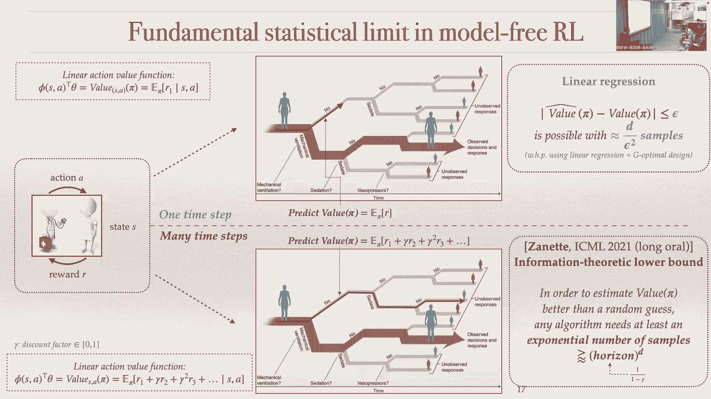

嗯，我想花一滑讲，嗯，确实，当函数逼近更一般时发生什么，嗯，在积极的结果方面，如果你打开一本关于统计的书籍，高维统计，至少对于变化，你会看到有性能保证，嗯，这些保证是函数类你正在使用的函数，的函数。

如果你在使用核方法，凸函数或其他东西，嗯，你将有一些性能限制，一些近似误差和统计复杂性的权衡，然后统计复杂性通常以某种方式表达，比如关于市场复杂性，Vc维数和其他东西，但在红色中，同样的东西是不够的。

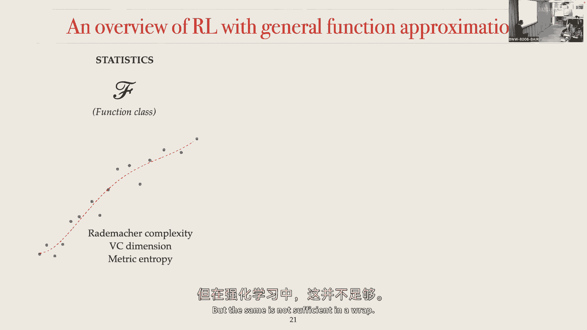

所以看起来蝙蝠操作符和函数之间的相互作用是至关重要的，你使用于建模td方法动作价值函数的同一类函数，但交互实际上，嗯，相当重要，因此，人们专注于理解一些基础，以深入理解，这不仅仅是关于函数类的复杂性。

这与我们之前看到的不同，我们需要一个线性映射，这就是已经相当好的，它必须是一些使问题变得可学习的东西，这就是蝙蝠操作符与实际价值函数之间的交互，那为什么这个方法对于行动价值函数来说至关重要。

是因为你在创建它，你正在创建蝙蝠侠的自动备份，并且你试图使它们相似，并且你想要它等于零，嗯，因此，交互变得关键，因此，许多许多概念已经被提出，试图理解和尝试，嗯，在什么情况下你可以这样做，嗯。

某种稳定的学习方式。

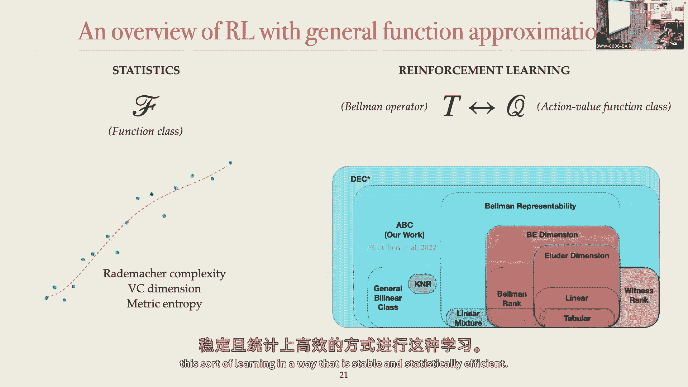

而且嗯，统计上有效，但我不会，我不会深入讨论那个，相反我要跳转到，嗯。

一些强化学习的线，嗯，离线强化学习，你在课堂上已经见过它了，但是，只是为了快速回顾，外面确实有大量的数据。

所以我们想利用这些数据，我们如何不收集数据就能做到这一点，而且，设置与您在课堂上看到的相同，我们有一个历史数据集，记录了州的行动，奖励成功的状态，任务是如何找到价值最高的政策。

找到价值最高的政策意味着什么，给定一个良好的数据集，"最高的价值"，当然，这是所执行的政策，"那就是最佳的政策"，"但是，你的数据集可能不含有关最佳政策的任何信息。"，"所以等等就像是我们"。

我们必须尽最大努力，"尽最大努力尝试识别一个好的政策并降低我们的期望"。

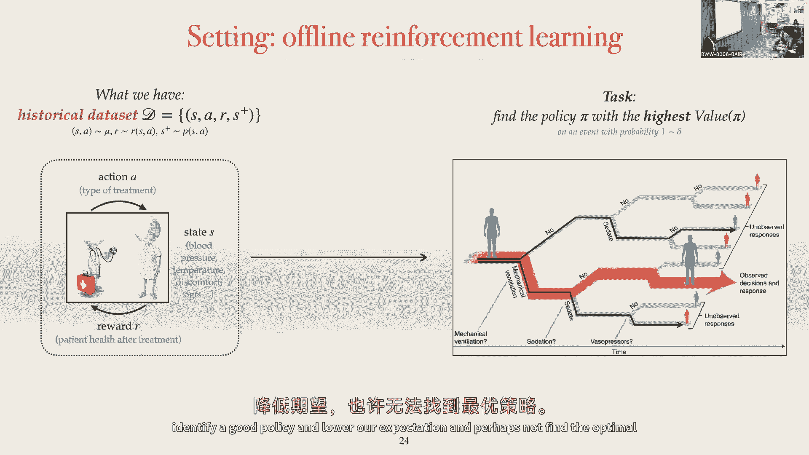

"或许无法找到最佳的政策"，我认为你在课堂上讨论的主要挑战之一是分布的变化，"意味着"，数据集良好，从未发生的最佳情况，是你数据集在整个状态和动作空间中都有均匀样本的情况，在这种情况下。

你可以尝试通过逐一评估策略来评估它，通过三来选择最佳的，但通常你所给的是，嗯，嗯，预测性是他们可能，例如，来自人类，因此他们通常狭窄地集中，这就是我们所说的部分碳酸问题，在这里的示例中。

数据集可能对π1有很多信息，对π2没有信息，对π3有一些信息，你 somehow 需要有办法选择和决定这三者中哪一个，并找出哪种政策最好，他们今天想要强调的是，我们甚至如何测量这个，一个覆盖率。

数据集包含多少信息以找到它。

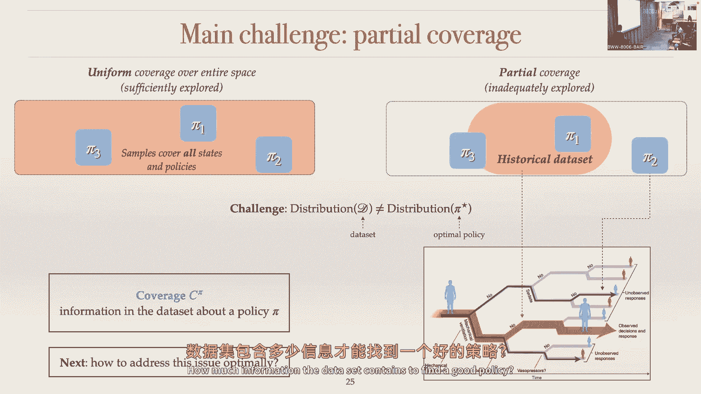

一个好的政策，并且直觉上，一个，解决这个问题的方法正是你在课堂上看到的那样，一个，或者实际上如果你想要，有两种方式，一种是尽量接近，嗯，生成数据集的政策，某种形式的，嗯，行为克隆。

另一种方法是尝试估计你对预测的不确定性，所以总的来说，你的数据集作为a是由政策生成的，某些政策，可以说是相当狭窄地集中，并且它们给你关于状态行动的数据，奖励和转移，然后你会尝试拟合一种形式的模型。

并尝试使用模型来预测其他政策的价值，现在模型实际上不需要是模型，你可以以模型自由的方式做这件事，但你仍然在使用由一些政策生成的数据，并预测其他政策，当然，你想要做的是选择价值最高的政策，但这是未知的。

嗯，相反，你想要的是在一个看起来有价值的政策上，但你也对其有合理的信心，"因此，我们可以从以下方式来看这条线"，"L是"，"作为一个试图找到政策返回值与某些最佳权衡的程序"。

"并且对于这项政策的不确定性"，"考虑一些偏差-方差权衡"，嗯，在统计学中，"您想要一个算法，它能够在某种程度上实现偏误和方差之间的最佳平衡。"，嗯，"偏见通常被忽视"，在离线学习中。

你可以尝试估计的方差是，有一种类似的，嗯概念，如果你想要，你想要平衡，嗯，你确定的政策的价值，这个政策对你来说是未知的，带有不确定性，因此，保证离线强化学习算法的稳定性，它们通常看起来像这样：

一个算法应该有一个非常高的终止概率，最佳的权衡在于um，他返回的政策的价值，以及这种不确定性，这实质上相当于找到具有最高下限的点，在某种程度上离线强化学习，你在课堂上也见过的那个，在某种程度上他们试图。

嗯，达到这个最优权衡，现在一个大问题是这种常数c取决于政策有多好，如果你在统计中见过集中不等式，你可能已经熟悉'n的平方根分之一'这个术语是从哪里来的，例如，不等式的一个例子是，但是。

这里有一个额外的a系数，它取决于政策，这个系数应该捕捉到分布的变化，现在，这个系数取决于实际的算法，并且它取决于，例如，取决于你使用的函数类，以及与'蝙蝠侠'操作符的交互，作为一个具体的实例。

你可以采取，例如，Softmax策略，考虑那些来自自然政策梯度的策略，再次为了简单起见，线性动作价值函数，并且那些是两个不同的参数，你可以设计算法，嗯，本质上试图解决这个离线强化学习问题。

它们将具有精确以这种形式给出的一些保证，"这些耦合系数以某种分析表达式出现"，"并且分析表达式确实强调了"，"数据集中包含的信息之间的相互作用"，"并且你试图估计的目标政策"，"特别是"。

数据集中的信息反映在协方差矩阵中，"这是一个在统计学中稍微熟悉的对象"，"线性回归"，"你计算了一些协方差矩阵"，"协方差包含了你对问题的知识量"，并且这个具有特定动词规范且预期特征的交互器超过，嗯。

你正在考虑用于优化的目标策略，嗯这个量，你知道，但是，这个一般不是可计算的，所以，这种告诉您两个如何相互作用的方式，嗯，用于创建离线策略评估的信心区间，您可以使用它来找到一个好的策略，有些令人惊讶。

也许并不那么惊讶，但是，关于这一点重要的是，这个覆盖率，这也是被称为能力的。它实际上并不算，"它在状态和动作空间中没有表达形式"，"如果你打开一些进行统计分析的论文"，"你常常会发现这种分布的比例"。

"折扣了目标政策的这一分布与政策行为的比较"，"并且，那是状态和动作空间的比例"，这个没有那种，"所有的都投影到一个更低的维度"，"一个特征空间，其中确实可以成为某种程度的非常大"。

思考一下有一个协方差矩阵，那就是单位矩阵，嗯，那样无疑会使覆盖系数非常小。

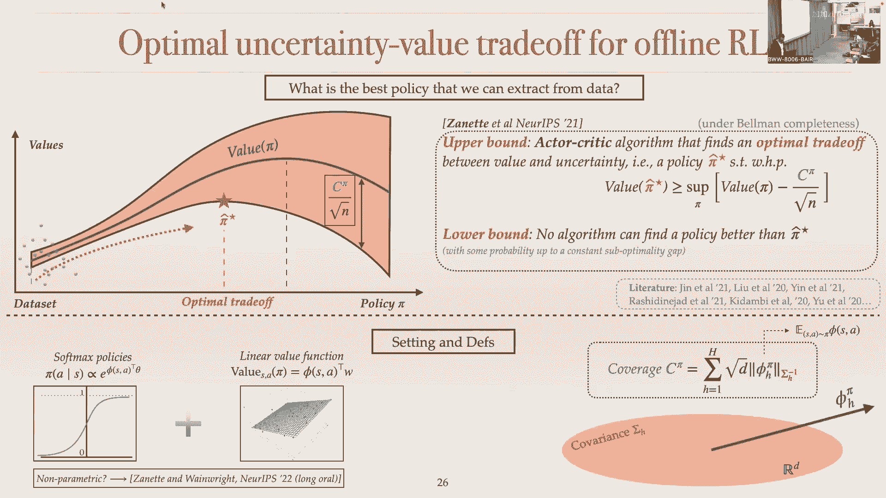

我不认为我想谈论我们如何实现这一点，以及技术细节，我认为重要的部分是如何，例如，一条线的保证，从实际陈述来看，这就是你在前一张幻灯片上看到的，嗯，但是如果你想要从非常高的层面来看，嗯。

我们正在努力避免惩罚，直接行动，并且我们想要达到一种非常低的统计复杂性，我们在参数空间中操作来计算这些置信区间，并且所有这些都被放入到大型演员批评算法中，它们使用这些。

嗯自然政策梯度和一些悲观的td版本与目标网络，"参数被移动到一个方式中，使得"，"嗯，计算了一个悲观的解决方案"。

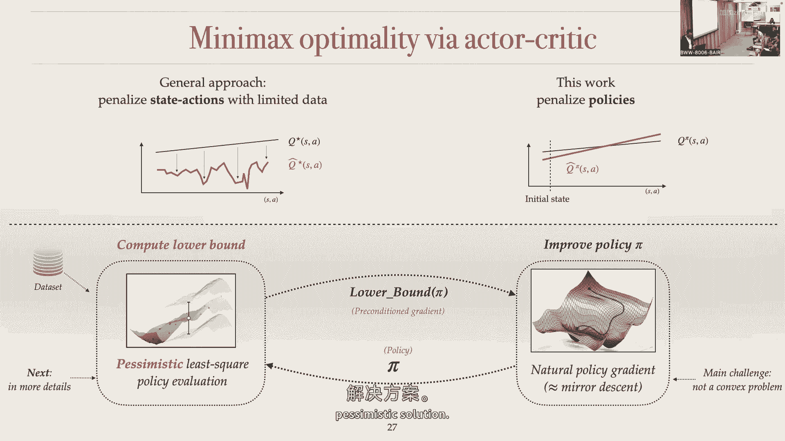

"嗯，我会保持这个算法的。"。

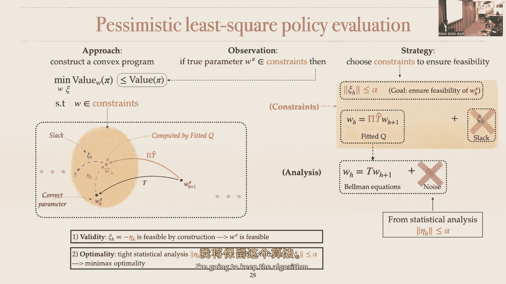

嗯，现在，"您看到的这项研究的一个限制是，它仅适用于线性设置。"，当然，问题是如果我使用更丰富的函数集会发生什么，例如，使用更一般函数逼近的强制学习线，"比如你在课堂上看到的那些"，"我们能不能"。

我们对此不保证，很遗憾，答案是，在理解上存在一个巨大的差距，你们在课堂上看到的算法类型非常难以证明，向他们提供保证，因为它们可能不收敛，存在一些变种，在某种程度上，你可以对大问题提供保证。

是不清楚你怎么实现它们，嗯，这就是一个遍及所有方面的问题，L，嗯，与嗯，泛函函数逼近，如果你不能保证，不清楚你将如何制定一个可以实际实现的算法，因此，通常分析的是某种概念版本，这与嗯。

在实践中实际实现的算法不同，在我们转向结论之前，对这个部分的任何问题，是的，当然。

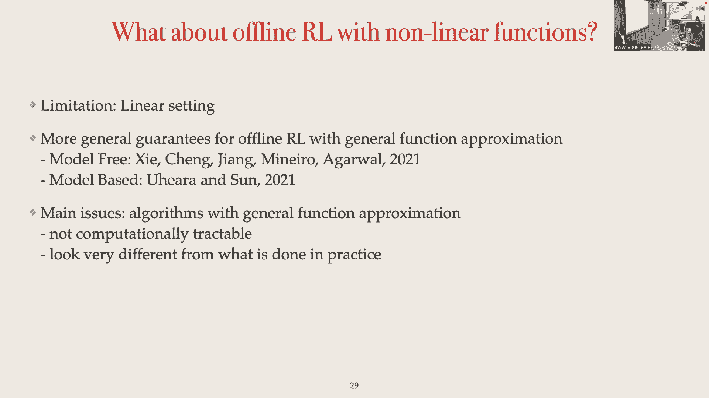

地平线，所以这种运动，嗯，协方差，如果是有限期问题，协方差可以真正随着时间步长变化，嗯，它是特征的协方差，所以某些特征的转置，特征特征提取，是的，与线性回归相同，相同的对象出现，嗯。

你什么意思由epsilon最优策略，这不会，这不会是最优的，因为离线rl，所以它真正取决于你的数据集，你找到的策略可能非常糟糕，如果你的数据集没有足够的信息，假设你的数据集只来自一个狭窄集中的策略。

并且行为策略很差，并且特征矩阵像秩一，它都集中在一个方向上，那就不 really 告诉你什么，所以你无法找到好的策略，但这种情况在某种程度上反映在那句话中，因为非常好的策略，尽管它们的覆盖系数非常大。

所以你不知道它们的价值，也没有算法会返回它们，嗯，不，我想，如果你想，这就是你正在谈论的epsilon，对吗，这就是我们现在要返回的策略，嗯，你可以总是考虑在最优策略的 supremum 中思考。

我想评估这个表达式在最优策略上，我可以做到，但是然后这个人会变成值，关于最佳政策的覆盖范围，所以这就是你的epsilon对吧，这相对于最佳政策的epsilon是次优的，但是epsilon可以非常大。

基本上我在告诉你epsilon的值，给定我们有的数据集，DC确实是一种测量数据集包含信息的方式，嗯，作为结果，你可以期待的性能，在，嗯，初始状态，我会说初始状态下政策的值，那就是你关心的那个。

你估计可能会更频繁地在那些，例如，你不访问的状态，甚至在你访问的状态，但它们可能会补偿，但你真正关心的是起始点的性能，好的，是的，对，对，我认为你在SQL中见过类似的东西，我认为，嗯，基本上。

在Alexa的图表中，让我们明确地设置不同的政策，你将会有无数个对吧，但是让我们，你知道，把它们放在图表上，在y轴上，我们将绘制政策的值，是的，是的，是的，是的，尤其是在现在这个世界，这可能是一些。

你想要知道的是你们实际政策的价值，对，绿色线，政策的价值，所以如果你知道实际的MDP，你会做价值迭代，并找到最优的政策，不幸的是，你现在有一组数据，如何使用数据集取决于你，直觉上。

如果你在做基于模型的价值，你可以尝试拟合一个模型，并且尝试使用那个来预测你模型可能好的结果，它可能不好，一般来说，预测生成数据集的政策价值可能是好的，预测不同政策的价值可能非常不好。

你可能不会使用基于模型的版本，你可能做不同的事情，例如，你可能采用像ql um这样的无模型方法，直觉地，如果你能，你会做以下事情，尝试为不同的政策制定一个估计值，并尝试测量也，不确定性。

不确定性实际上是这样的带子，这里的曲线可能会上下移动，取决于数据集，嗯，但你想尝试估计你对预测的不确定性，在意大利，对于政策影响的评估，不确定性会较小，对于生成数据集的特定政策，我们有大量的数据。

你只需要取平均值，但对于非常不同的政策，它将非常不好，访问完全不同州的不同区域和行动空间，你的数据非常集中，你对做某事的政策一无所知，在完全未知的州和行动空间的某个区域。

即使那个政策通过知道拟合q看起来好，你也必须考虑到你对这个值的极度不确定性，所以你希望某种方式惩罚它，所以你希望说，哦，这个政策像它，我对它太不确定了，像我是要去给它一个非常低的值，如果我这样做程序。

最佳权衡是最大化这个下限，这个政策性能的下限的下限，这给你带来了一种抽象的表达形式，一旦你考虑了特定的算法和类型的函数，它就会变得具体，例如，MDP和类，这将确定c pi，是的，是的，是的，是的，是的。

是的，是的，当然，谢谢，我认为在这里，重要的是，如果你有一个要点，真的就是，一个离线算法的保证将如何看起来，它将看起来像这样，这是一些值之间的权衡，当然，你想要最高的价值，但是有高值的政策。

你可能对它们非常不确定，因此，会有一些，一些权衡，嗯，只是为了让它，如果你想要更清楚，对于拥有数据集的政策来说，一般来说，你拥有大量的数据，因此，这个c pi将类似于一，你拥有大量的数据，所以n很大。

这个量很小，因此，这个表达式告诉你，是你应该比生成数据集的政策做得更好，如果你正确地设计算法，这基本上是最低的，是你期望要比克隆的沉重者做得更好的，是的，而且这个表达式告诉你正是这样。

如果我将π设置为生成数据集的行为政策，Cπ将更小，它将是1，这个表达式将更小，这告诉我我比克隆的行为做得更好。

这是我们期待的，好的，一个总结的时刻。

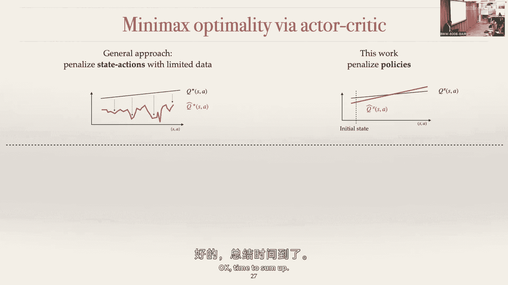

嗯，我们大致看到了三种事情，一是RL中的大部分问题，它们不是最坏情况，它们属于一个更容易的问题类别，嗯，我们观察到一旦我们转向函数逼近，RL比标准监督学习要困难得多。

然后我们看到了我们可以获得的哪种保证，对于离线强化学习算法。

并且要总结，我认为在演讲后，这更加清晰，理论与实践之间存在巨大的差距，嗯，我认为在交叉点上工作当然困难，对，因为你必须，请，两个社区，但在我的头脑中，使强化学习更加适用，意味着将有妥协需要作出。

你想要某种节奏，任何基准，或者你知道超越任何基准，但你可能能够想出一些算法，它们有一些某种分析，并且在简单的情况下至少有稳定性保证，而且这对于将强化学习应用于非常不同的问题来说将是至关重要的。

如果你有一个即使在受限设置中也适用的某种形式的保证，你将更有信心应用算法，并且一般理论，你不会告诉你如何调整超参数等，所以它们不一定不会告诉你关于任何特定应用的具体信息。

但它可以给你提供一些更广泛的见解和基础，这些见解和基础适用于更广泛的领域，到我们之前看到的一些基本下限的领域，嗯，是的，我认为以这个为结论，这就是我今天的所有内容，所以感谢你们的关注。

我将问是否有最后的问题，不，谢谢你来这里。

