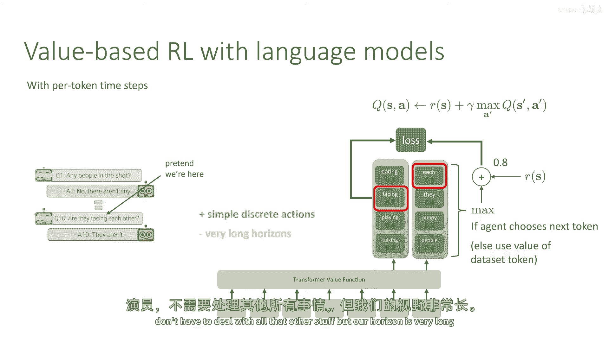
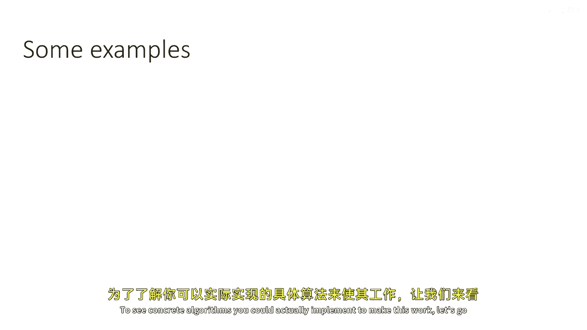
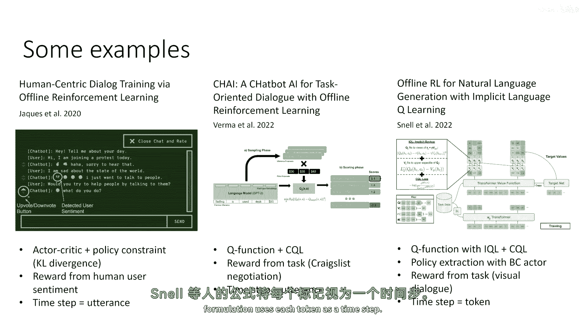

# 【深度强化学习 CS285 2023】伯克利—中英字幕 - P90：p90 CS 285： Lecture 21, RL with Sequence Models & Language Models, - 加加zero - BV1NjH4eYEyZ

在今天的讲座第三部分，我们将讨论语言模型与多步强化学习的结合，其中我们将结合手掌dp讨论的一些想法，以及之前的语言模型讨论，所以这里是一个多轮，嗯，语言模型强化学习问题的例子。

这是一个被称为视觉对话的任务示例，这是在二零一七年一篇论文中引入的基准，这里的想法是，有一个提问者，他是机器人，并且被认为是环境一部分的答案，嗯，答案有一个特定的画面在脑海中。

并且问题必须问问题来尝试猜测是哪个画面，所以这纯粹是提问者的语言任务，并且问题的任务是选择适当的问题来收集信息，所以到最后他们可以找出，嗯，什么图像，嗯，答案是思考，现在。

你可以想象将这个结构化为pom dp，其中观察是答案所说的事情，而动作是提问者选择的问题，现在是一个序列过程，有多个时间步骤，最后有奖励，所以动作是机器人所说的，它是像镜头中的任何人一样的一句话。

观察就是答案或模拟人类所说的，就像他们不是那样，而现在的状态将是一个历史状态，就像我们在第一部分讨论的那样，所以那将是过去观察和行动的序列，而奖励是对话的结果，答案是什么，问题者最终猜对了答案，因此。

这个任务的多步骤性质非常重要，我们现在回到了完整的rl设置，因为问题者不仅仅是问那些贪婪地让他们得到答案的问题，他们即将问的问题旨在收集信息，这样你就可以在最后猜出正确的答案。

显然他们不应该问同样的问题，他们应该多次思考他们已经收集到的信息，哪些信息仍然开放，他们就应据此进行，现在，这种多词问题在许多地方出现，他们，当然，在对话系统中出现。

你可能在与人类交互以实现某些最终延迟目标助手聊天机器人的地方，你可能有多个术语，到达解决方案工具使用设置的交互术语是在哪里，而不是与人交谈，你可能输出一些进入某些工具的文本，如数据库，Linux终端。

计算器，或使用该工具产生对给定查询答案的东西，玩文本游戏，嗯，也许你，你产生进入文本冒险游戏的动作，然后响应，嗯，编程观察，所以这些都是多回合rl问题的例子，现在这不是我们之前看到的，嗯，从之前。

来自人类反馈的rl，来自人类偏好，我们在前一节看到了，在这里学习人类偏好，我们学习整个多步骤交互的结果，奖励只在多个回合后出现，前一节中的episode是一个单一答案，所以它是一个一回合的坏。

与状态和动作这里不同，我们有多个回合，多个观察和动作，部分可观察性现在很重要，因为我们需要关注，不仅仅是人类的最新响应，但也许所有的先前响应和我们之前问的问题，所以现在我们被放入一个不同的阶段。

我们如何训练政策以处理这个问题，我们可以使用政策梯度，如，就像以前，政策梯度是训练多回合政策的有效方法，这就是我们引入它们的原因，我们在第一节也学习了，政策梯度实际上可以处理部分可观察性。

我们可以给政策一个观察历史的输入，所以我们也可以使用那些历史状态，这是非常可行的，我们遇到的一个问题是，然而，与政策梯度一起训练对话代理时，如果它与人类交互，那么我们需要每次滚动时从人类那里获取样本。

这与我们之前在处理人类偏好设置时的情况不同，因为我们有那个奖励模型，我们可以优化对抗奖励模型，通过多次迭代，包括采样和优化，并偶尔获得更多的偏好，但如果我们使用政策梯度进行对话任务。

每一集都需要与人类进行对话，现在我们需要与人类进行更多的交互，尽管有偏好，但我们仍然需要人类的输入，我们需要更多的它，如果我们想要优化一个基于政策梯度的对话代理，所以，如果它能工作，但是很贵，当然。

如果你不与人类交互，那就更容易，但是，而不是与像数据库这样的工具交互，基于价值的方法，然而，是一种非常吸引人的选项，因为使用基于价值的方法，你可以使用离线强化学习技术，如我们在课程中学到的。

实际上可以直接用数据的，例如，人类与其他人类交谈的数据，或过去的机器人部署，因此，基于价值的方法实际上是一种非常吸引人的选项对于对话，所以，在这部分的讲座中，我将实际上专注于讨论基于价值的方法。

尽管我会说，政策评估方法可以直接使用，关于那个，没有什么更多的可以说的，然而，因为它们将按照以前的方式工作，所以让我们谈谈基于价值的方法，对于基于价值的方法，我们必须做出选择，这就是构成时间步长的东西。

所以，在之前的部分中，我们在开始时就说过，我讨论了需要作出的设计选择，关于如何将语言问题转化为mdp，在这里，我们有一个特别微妙的选择可以作出，这个选择可能走向两个方向。

所以第一个选择是让每一句话语都是一个时间步，这意味着人类说的第一句话，就像两只斑马在动物园的围栏里散步，那就是观察一，提问者说的第一句话，就像镜头中的任何人，那就是行动一，所以行动和观察是完整的句子。

这可能最直接地类似于我们在上一节中设置的环境，这是一个自然的选择，因为行动，嗯是因为我们交替地进行行动，观察，行动观察，观察总是处于代理之外的控制之下，行动总是完全处于其控制之下，地平线通常相对较短。

所以，如果对话涉及十个来回的问题和答案，嗯，那么我们将有十个时间步骤，问题是，动作空间非常大，动作空间是所有可能的语句空间，也就是说，机器人可以选择的另一个选择是考虑每个标记作为一个时间步骤。

所以在这种情况下，对于机器人整个语句，例如，镜头中出现的人，这个语句中的所有标记都是一个单独的行动时间步骤，这有点奇怪，因为，当然，每个动作都受其控制的，所以行动一之后，它立即可以选择行动二。

没有额外的观察，嗯，我们仍然会将行动一与我们的状态历史拼接，并选择下一个行动，给定整个历史，然后响应中的所有标记都是一个单独的观察，现在，这有一个很大的优势。

现在是在每个时间步骤我们都有一个简单的离散动作空间，所以任何时间的动作空间只是一个可能的标记集，它是一个大型集，但是很容易枚举，而在语句级别的设置中，动作集是所有可能序列的集，这是指数级的大。

在地平线上指数增长，当我们使用标记时间步骤时，我们的地平线现在要长得多得多，所以，而之前我们的地平线可能只在10步左右，现在可能会是数千步，即使是对于相对短的对话，这两种选项都在文献中被探索过。

没有关于哪种更好有一个单一的建立标准，所以我将讨论两者，并可能告诉你一些它们的优点和缺点，让我们从基于价值的rl开始，在这里，使用语句级别的时间步骤，这是我们对话的一个示例切片。

让我们假设我们处于这个阶段，让我们假设我们处于机器人说的阶段，他们是否面对面，我们将做的事情是，我们将对话的历史直到这个阶段作为状态，这构成了整个对话历史状态st，我们将其传递给一个序列模型，嗯。

所以它是某种，它可以是预先训练的语言模型，这可能像bert一样，有很多选择，并且序列模型将输出某种类型的嵌入，然后，我们也将取我们的候选动作，他们是否面对着对方，我们也将通过这个序列模型。

这可能是另一个序列模型，或者可能是同一个，我们将得到这两个东西的嵌入，这些将被输入到一个学习到的功能中，该函数输出q值，这是嗯，实际上，最有效的方法可能是为状态和动作分别有两个解码器。

但它们也可以用同一个编码器编码，最后，我们必须为他们预测一个数字，这就是q值，所以这是批评家现在，通常在这种设计中，我们将使用，我们可以使用演员批评家架构，其中我们将有一个单独的演员网络。

它被训练以最大化这个批评家，那就是可以用于训练的，例如，嗯，之前的一章中的算法之一，将这个q视为奖励，将其替换为下一步的动作，嗯，目标，或者，我们可以直接从q函数中解码来找到具有最高q值的动作，而且。

如何做到这一点有些棘手，我们可以用这个，我们可以做那个，使用像束搜索这样的东西，我们还可以从监督训练的模型中采样，并取最高q值的样本，然后我们将，嗯，嗯，使用，嗯。

我们对下一个时间步的最大估计来训练这个q函数，以便下一次时间步的最大值来自进行束搜索，它也可能来自使用演员，它也可能来自从监督训练的模型中采样，然后，取最大的q值样本作为对max的近似。

所以所有这些都是有效的选项，文献中的不同方法探索了那个选择不同的策略，所以，我将在本节末尾总结几篇以前的论文，并告诉你具体论文实际上做了什么，所以没有一种做这件事的方法，有很多选择。

对于每个标记的时间步，事情可能稍微简单些，所以让我们假设我们已经到达了这个阶段，在解码过程中，我们正在生成对应于面向的标记，并记住，当然，实际上，单词不是标记，标记是，它们实际上对应多个字符。

但不是整个单词，但让我们假装标记是单词，并让我们假装我们已经到达了单词面向，所以我们需要对这个贝尔曼备份进行单个标记的备份，现在事情工作得更像监督式语言模型，所以我们有这些这些标记。

并且我们有对于这个时间步的所有可能标记的数字，除了那个对应于该标记成为下一个标记的概率的数字，数字实际上是它的q值，所以与面向标记相关的数字是你将得到的q值，如果你的历史是整个对话之前的所有历史。

然后你选择面向标记作为下一个动作，所以你的损失将包括下一个步骤中的面向标记，如果代理选择那个标记，则在下一个时间步的最大化过所有可能的标记，或者简单地取环境选择的数据集标记，将奖励添加到那。

然后使用那个作为损失的目标值，这实质上实现了标记级别的q学习，所以再次解释一下，对于这个标记，输出是每个可能在下一个时间步被选择的标记的q值，为了计算那个q值的目标。

我们实际上将输入那个标记在下一个时间步，看所有可能的下一个标记值，如果代理能够选择下一个一个，取它们的最大值，或者取数据集标记的值，如果由环境选择，添加奖励，然后将其视为我们的目标，在某种程度上。

它更简单，但记住，我们的视界变得非常长，我们有简单的离散动作，规则可能比poroance更简单，因为我们不需要处理演员，我们不需要处理所有其他东西。

但我们的视界非常长，所以，将所有东西放在一起，通常的价值细节适用，所以我们通常需要一个目标网络，无论是对于单个语句还是poro转换，我们通常使用回放缓冲器，我们通常做像使用双立方体技巧这样的事情，所以。

所有相同的考虑因素都适用于常规基于价值的方法，我们可以使用这两种方法，无论是在线还是离线rl，据我所知，这些方法主要已被研究用于离线rl，在这种情况下，你将使用像SQL或iql这样的東西來使它正常工作。

嗯，基本細節是需要以某种方式處理分佈變化的，所以你可以使用政策約束，如果你有演員，然後你將使用一個卡萊離散度在演員上，如果你只是使用基于值的方法，你可以使用SQL風格的罰款在q值上，對于轉換的部分來說。

這很方便，基本上等於將標準監督交叉熵損失放進去，如果那为什么不清楚，你可以，你可以解决这个问题，只写下sql目标，并且以离散动作，你会发现实际上它等于交叉熵损失，你也可以做iql风格的备份。

这也是一个不错的选择，但目前还没有最好的答案，至于这些选项中哪一个更好，所以这非常接近当前研究的前沿，截至2023年。

好的，所以这有点抽象，嗯，为了看到可以实际实现的具体算法，使其工作，你可以看看这个。

让我们通过一些例子来了解，所以有一个例子，这是娜塔莎·贾克斯的一篇稍旧的论文，叫做离线强化学习通过人本中心对话训练，使用了演员-批评家加策略约束架构，所以有一个演员网络，它有一个卡莱散度惩罚。

以保持接近数据分布，这种奖励来自人类用户情感分析，所以聊天机器人实际上正在尝试优化人类从人类那里引发的情感，奖励自动使用应用到人类响应的情感分析器来计算，让我们使用每句话的时间步长公式，另一个例子。

Chai一个任务导向对话的AI聊天机器人，由Sidoth Verma进行的离线强化学习，这个一个使用SQL像惩罚的Q函数，并且它使用任务奖励，在这种情况下，信用谈判任务，所以奖励只来自出售物品的总收入。

在这里，一个时间步是一句话语，所以，在下一个时间步上的最大化方式，实际上是通过从监督训练的语言模型中采样多个可能的响应来实现的，在这种情况下，一个gb two样式的模型，然后，对采样的话语的q值取最大。

所以这不是一个精确的最大，一个近似的最大，通过使用预训练语言模型的样本，另一个更近的例子是离线强化学习用于自然语言生成，在2022年，斯内尔通过隐式语言q学习在所有两个千中实现了。

这个一个使用与iql和sql的组合实际训练的q函数，所以使用iql备份与cql，嗯，惩罚，然后，政策实际上是通过再次，从监督训练的模型中提取的，从那个监督训练的模型中采样，然后。

取具有最大q值和奖励的样本，奖励再次来自任务，这一项评估的是之前的视觉对话任务，其中奖励对应于，代理是否得到正确答案，所以如果你想了解更多关于特定基于价值的算法。

我鼓励你去查看这些论文并查看它们选择的特定细节，所以我对方法的描述有点抽象和一般化，这些论文中覆盖的特定实例，和嗯，每次时间步都用Snell的小公式表示为。

嗯，每个标记作为一个时间步，好的，所以，总结一下多步骤语言交互，如对话，我们的pom，Dp，嗯，这意味着我们需要做 something like 使用对话，使用嗯，历史表明，作为我们的状态表示。

时间步长可以定义为每句或每个标记，它们各有优缺点，原则上，一旦我们转向使用历史状态，任何RL方法都可以使用，但在实践中，特别是如果我们有需要与人类交流的对话代理，我们可能真的更喜欢离线RL的表述。

因为否则我们每次生成更多样本时都需要与人类交互，当然，这不一定就是情况，因为如果我们在做像文本游戏或工具使用的事情，那么在线方法实际上相当可行，基于价值的方法要么将话语或标记视为动作。

并且它们以历史状态构建q函数，并且我们必须应用在线基于价值的方法的相同细节和技巧，所以这包括像目标网络这样的东西，它包括像双q学习这样的技巧，它包括各种离线正则化方法，如政策约束，SQL或iQL。

没有单一的建立标准是最好的方法这种。

