# 【深度强化学习 CS285 2023】伯克利—中英字幕 - P91：p91 CS 285： Lecture 22, Part 1： Transfer Learning & Meta-Learning - 加加zero - BV1NjH4eYEyZ

今天我们要讨论迁移学习和元学习，这涉及到如何利用一些源域的经验，来自一些源强化学习问题，以便能够在更效率或更有效地解决新的下游任务中处于有利地位。

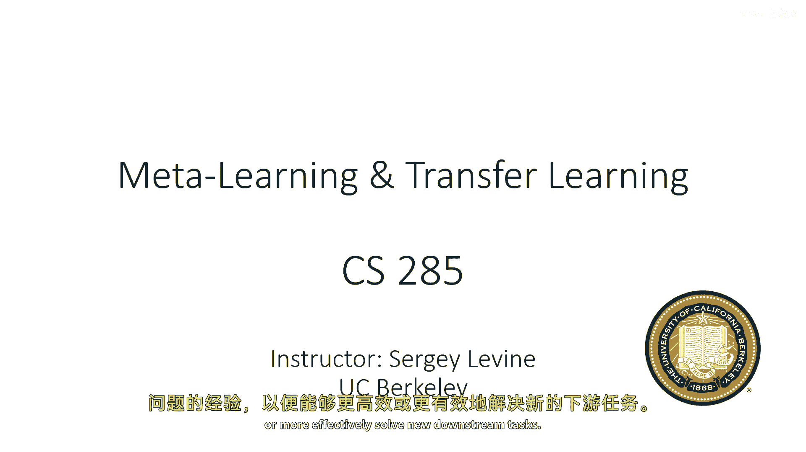

让我们从一些动机开始，让我们回顾在第一次探索讲座中讨论的例子，我们工作的一些mdps，我们的一些游戏，例如，是比较容易解决的，即使使用像您为家庭作业三实现的相对简单的方法，但是。

看起来与我们之前看到的不太不同的某些其他游戏，似乎要解决起来困难得多，所以，如果您试图使用家庭作业三的方法学习蒙特祖玛的复仇策略，Q学习算法，您会发现它真的很难通过，甚至第一级。

那么，那个井是什么，问题在于，这些游戏对我们来说看似如此直接，但是，对于电脑来说，是非常困难的，因为电脑没有我们拥有的先前知识，所以，在这个游戏中，奖励结构并没有提供很好的指导，告诉我们如何解决任务。

比如，当你捡起钥匙时，你会得到一点奖励，当你打开门时，你会得到一点奖励，嗯，被骷髅杀死是不好的，但是你实际上并没有因为它而获得任何负面奖励，所以，它是不好的唯一原因是，如果你被骷髅杀死足够多次。

然后你就输了游戏，然后你就可以继续捡起钥匙并打开门，所以，这种奖励结构并没有真正给你提供，关于如何在游戏中取得进步的许多指导，而且，捡起钥匙并打开门，并不一定是赢得游戏的正确方式，因为在后来的级别中。

嗯，你可以去不同的地方等等，然后嗯，也许你不需要完成所有奖励性步骤，来达到终点，但对于我们来说，所有这些事情都不构成巨大的挑战，实际上，当我们在玩游戏时，我们甚至可能不会注意分数。

我们可能只是使用我们的先前知识，这告诉我们如何在这样的游戏中取得进步，在这里有一个视觉隐喻，这是一种嗯，探索者正在探索一个古老的诅咒神庙，我们大致有这种信念，既从我们对视频游戏的知识。

也从我们的一般物理常识来看，你知道，骷髅代表坏事，钥匙对于打开门是好的，梯子或可以攀登的东西，我们也从基本的视频游戏知识中知道，通过不同级别的进步，进入新的房间等是取得进步的好方法。

我们对问题结构的先前理解可以帮助我们迅速解决复杂的任务，当这些任务的某些方面与我们的期望相符时，也就是说，它符合我们的先前知识，当我们学习玩蒙太古的复仇时，我们实际上是在做一种迁移学习，我们正在将。

我们所知道的世界知识转移到这个新的mdp中，所以虽然之前我们谈论了蒙太古的复仇，作为一个研究迁移或图像探索的领域的例子，现在我们将谈论这些事情作为迁移，学习问题作为问题，可能在这里。

正确的做法不是设计一个全新的探索算法，而是一个可以转移你从其他你已经解决的问题中知道的算法，来更有效地解决这个新测试。

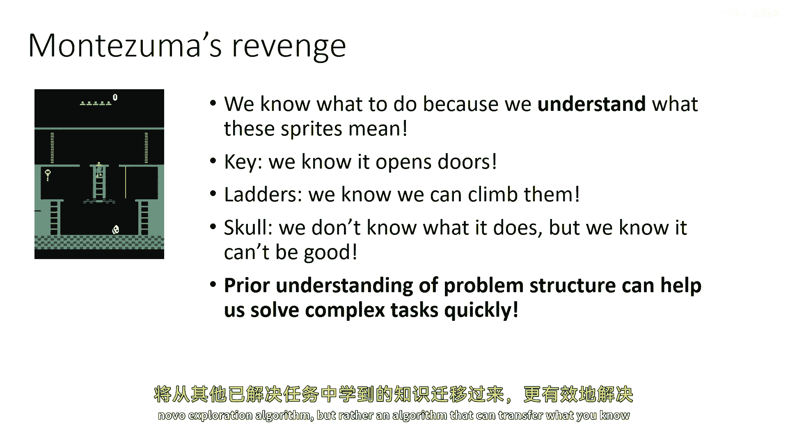

好的，所以强化学习是否能够像我们一样使用这些先前知识，或许可以，例如，我们可以构建一个算法，可以观看很多印第安纳琼斯的电影。

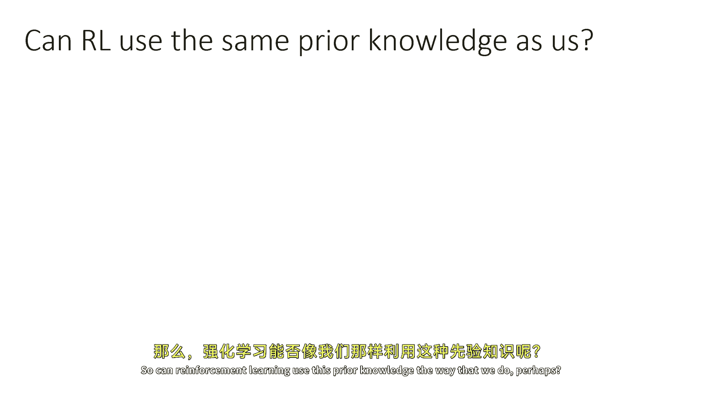

并使用那个来了解如何解决蒙太古的复仇，嗯，这可能是一个非常高远的目标，所以实际上我们还没有完全达到那里，但我们可以开始思考迁移学习问题，并且我们可以实际上设计一些非常聪明的算法来处理它。

所以想法是如果我们解决了先前的任务，先前的mdp，我们可能会获得有用的知识来解决新的任务，知识如何被封装，如何被很好地表示，实际上这里有很多选择，我们可以说，嗯，q函数是一个好的迁移工具。

因为q函数告诉我们哪些动作或状态是好的，所以如果你有一些印第安纳琼斯的q函数，你知道，关于偷取宝藏的，这可能是一个良好的cue函数来初始化我的蒙太古的复仇，但是，你知道，在视频游戏中。

你不通过移动腿和手臂来移动，但是，也许不是像你知道，在视频游戏中，你不通过移动腿和手臂来移动，你通过按下按钮移动，所以也许立方体的纹理转移得不太好，在这种情况下，政策告诉我们哪些行动可能是有用的。

那些可以转移得非常好，有些行动永远没有用处，所以只要你能排除这些，那么也许你可以取得更多的进步，或者你可能可以转移模型，也许物理学的法律，主宰世界的法律在两个领域都是相同的，尽管任务的其他因素有所不同。

并将模型迁移也可以成为一种非常有效的策略，也可能是一个更抽象的设置，迁移某种特征或隐藏状态可能会为您提供一个好的表示，因此，你可能没有玩蒙特祖玛复仇的好动作，甚至没有良好的模型，因为事情并不完全对齐。

但视觉特征可能有所帮助，也许从观看一些视频中，你发现头骨、梯子和钥匙在世界上是重要的东西，只要你以好的头骨开始游戏，梯子或钥匙检测器，这可能已经能让你走一段距离，对于最后一个，不要低估它，而且实际上。

一点点的视觉预训练可能实际上可以去很远的地方。

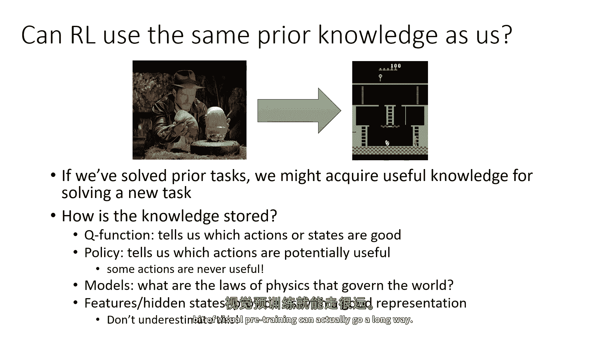

但是，在我们进入具体的技术之前，我不会覆盖做所有这些事情的技术，我将在这里简要介绍一些在这个领域的重要思想，在我们深入讨论之前，让我们先明确一些定义，所以正式地说。

迁移学习涉及到使用从一个任务集到另一个任务集的经验以加快学习速度，并在新任务上获得更好的性能，现在当我们谈论迁移学习在rl的背景下时，一个任务当然是一个mdp，所以你也可以这样理解。

从一个mdp中获取经验，或者从一个更快的学习的MDP集合中，在新的MDP上获得更好的性能。

所以嗯，你在上面训练的MDP，你获得初始经验的那个，被称为源域或源域，因为那是你知识的来源，然后，你想要解决新任务的MDP，那就是目标域，所以，那就是你想要获得良好结果的那个。

经典迁移学习关注的问题是你在目标领域的表现如何，尽管它与终身学习或持续学习等概念密切相关，目标是在源域和目标域上都做得好，当然，通常你会，你知道在目标域上做得好是非常不寻常的。

没有在源域上也做得相当好的情况下，但是，你知道，有一些术语，人们会提到像反向迁移这样的东西，作为在目标领域训练后，你是否仍然在源域上表现良好的问题，但现在我们不会关注这个问题。

我们会说我们的目标是在目标域上做得好，无论源域的情况如何，人们会使用一些术语来描述你在目标域上的学习速度，术语'射击'有时被用来指这个，如，你需要多少次尝试目标域，所以可以说。

也许我的算法在零射击中转移，零射击意味着在没有立即尝试目标域的情况下，在源域的训练后，你立即在目标域上获得良好的性能，所以零射击是指如果你与涉及，你知道，印第安纳琼斯，嗯。

立即偷取宝藏的任务的MDPs交互，你可以立即部署在蒙泰祖玛的复仇游戏中的政策，并立即玩得好，这就是被称为零射击转移的情况，一射击转移意味着你尝试一次任务，这意味着有一定的领域依赖性。

所以也许从蒙泰祖玛的复仇中，它意味着你玩一次episode，基本上直到你耗尽生命，或者嗯，如果是机器人与世界的交互，也许机器人会尝试一次，少数射击意味着你尝试几次任务，和多数射击意味着你尝试很多次任务。

这些并不是非常精确的术语，但它们可以，嗯，提供，嗯，你知道好，嗯，指示如果你阅读一篇论文，并看到一射击或零射击，你可以了解正在发生的事情。

好的，"那么，如何框架这些迁移学习问题呢？"，"很好"，我先说一下，这里的问题并没有一个明确的单一表述，"所以，我们在课程中讨论的大部分内容都是"，你知道，"大量的迁移学习有点随意"。

"因为它非常依赖于你从哪个领域转移的属性"，"并且你要转移的那个"，所以，如果你想在印第安纳琼斯的视频上预训练，并玩蒙泰祖马的复仇，你可能需要使用与如果，例如，你想要训练一个机器人来抓取许多物体。

然后部署来抓取新物体，但还有一些想法，一些常见的想法，人们会使用，这就是我今天要覆盖的主题，所以请记住，我只会覆盖这些想法的一部分，并非所有事情，而且我会尝试覆盖一些主要的，嗯。

可以在各种设置中使用的中心枢纽想法，所以我会讨论，嗯，前向迁移，所以前向迁移涉及到学习政策，有效地转移学习，你可能在一个源任务上进行训练，然后在一个目标任务上运行一些东西。

或者你可能在一个特定任务上进行微调，通常这依赖于任务之间的相似性较大，并且关于前向迁移的大量工作涉及到寻找使源域看起来像目标域或使得政策能从源域恢复的方法，要么让源域看起来像目标域。

要么使得政策能从源域恢复，嗯，更可能转移到，嗯，目标域，另一个大领域是多任务迁移，你在许多不同的任务上进行训练，然后转移到一个新的任务，而且这可能会工作得非常好，因为现在，你不再依赖于源域。

在一个源域接近目标域的情况下，你可以得到许多源域，所以，目标域在某种程度上在他们的凸壳内，直觉上，如果你想让机器人抓取一个新物体，而且你之前只训练它过另一个物体，这可能很难转移。

但如果你以许多不同的对象为框架，那么这个新物体可能会看起来有点像你见过的东西的范围，因此，多任务迁移通常更容易，有各种各样的方法可以做到，在任务之间共享表示和层。

或者可能只是训练一个条件于任务表示的政策，并且立即泛化到新的一个，但往往比确保，你的单源任务是类似于你的单目标任务的，然后嗯，今天讲座的大部分，我们将实际上谈论一个叫做元学习和元学习的东西。

你可以将其视为迁移学习的逻辑扩展。"在哪里"，"而不是试图仅仅在一些源域或域上训练并成功在目标域上"，"无论是在零-shot学习中，还是在元学习的朴素微调中"，"实际上。

我们在源域中要采用特殊的训练方式。"，以一种意识到事实的方式，"我们稍后将适应一个新的目标领域"，因此，元学习常常被框架为一个学习如何学习的问题。本质上，"你将尝试解决那些源域问题"。

不一定是以能够得到所有问题上都非常出色的解决方案的方式，但是以能够准备解决新领域的方式，所以这就是，考虑到我们在训练期间将适应新任务的事实，嗯所以嗯，我们将讨论所有这些事情。

而且我今天将大部分时间花在金属学习上，但我将简要地谈论前进，迁移学习，多任务迁移，这是我为什么在这些讲座中更喜欢花费更多时间在金属学习上的原因，那是否在某种程度上就是那里，那里还有一些原则和常见主题。

我们可以学习的东西，我们可以在许多不同的环境中使用，很多，嗯，非金属学习迁移工作，它非常深入，那里有很多有趣的工作，但它往往有些分散，所以，确定一套小的原则有些困难。

但我会尽力确定那些似乎广泛适用的原则，希望这可以给你一些关于去哪里的方向，然后，我还将有很多你可以阅读的参考，如果你想更深入地研究这个问题，但请记住，这些真的在研究的前沿。

并没有一种你可以简单地取用并使用的算法，对于你可能遇到的迁移学习问题。

好的，所以让我们稍微谈谈预训练和微调在rl中的概念，所以在，嗯，你知道，除了强化学习之外，如果你在考虑解决一般的迁移学习问题，让我们以计算机视觉为例，一种非常流行的方法是在大数据集上训练某种表示。

比如你可能在大数据集上训练一个卷积神经网络，或者你训练一个语言模型在大数据集上的文本，比如像鸟模型，然后你使用这些来提取表示，这些可以是图像的表示，文本的表示，像这样，然后。

你会在这些表示上训练几层额外的神经网络，也许只是几层全连接层，或者你可能会微调整个网络来解决你想要解决的特定任务，对于你有相对较少数据的任务，这是一种在监督学习领域中相当普遍的工作流程。

你可以想象在强化学习中也会采用这种方法，也，在某些情况下，这种方法可以直接工作，所以你可以通过强化学习学习表示，然后，取这些表示，并使用强化学习算法，来微调这些表示上的几层以解决你的任务。

你也可以通过监督学习学习表示，然后，使用强化学习来微调这些表示上的几层以解决你的强化学习任务，所以这些都是，你知道，相当直接的，我不会深入探讨它们。

因为这些是我们从监督学习中继承的 standard 技术，所以你可以在，你知道，你最喜欢的深度学习课程中学习这些，它并没有太大不同，但我会讨论一些在我看来。

在应用这种预训练和微调方案时特别有用的特性和工具，所以，在我们开始之前，让我们谈谈我们可能面临的问题时。

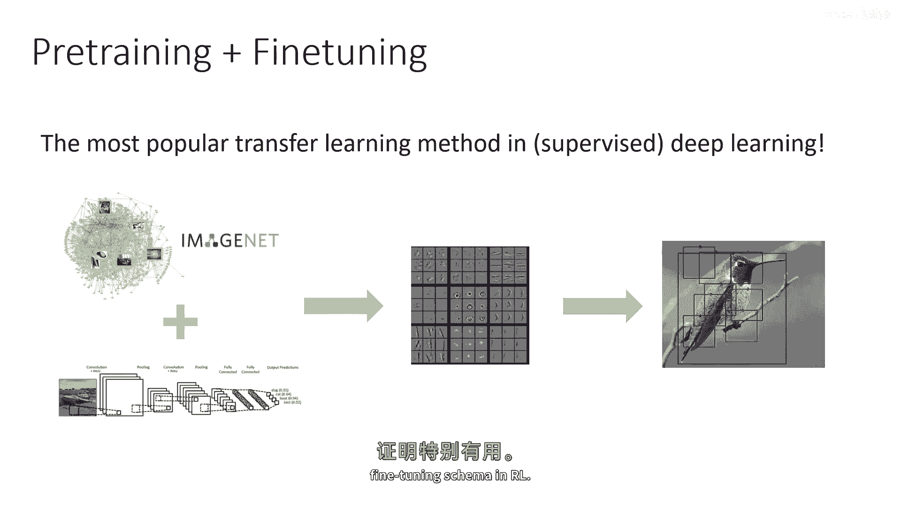

这些问题并不 necessarily 限于强化学习，但它们经常在强化学习中频繁出现，从我的经验来看，一个问题是领域漂移，这是一个相当明显的问题，基本上，源域中学习的表示可能在目标域中不工作得很好。

这发生在你想象，例如，如果你想象，例如，在某种模拟器中学习任务，该模拟器模拟视觉观察，或者像声音和其他类似的高维观察，然后将结果政策转移到可能真实的世界环境，在那里观察的结构相似但不完全相同。

所以如果你训练了一个驾驶政策来驾驶视频游戏中的汽车，然后你想要驾驶真实汽车，事情并不是那么不同，基本上对齐，物理相似，环境的机制相似，但事情并不完全相同，所以存在一定的差距，现在差距可能更大。

差距可能不仅仅是感知上的，可能源域有一些事情是可以做的，在目标语言域完全不可能，所以，嗯，这实际上是一个大的差异，所以第一类只处理视觉上不同但不一定机械上不同的事情，第二类处理实际上在物理上不同的事情。

但是结构上仍然足够相似，让你感觉来自源领域的某些东西你可以继承，嗯，这要困难得多，但是也有一些工具我们可以用来处理这个问题，嗯，然后，我们还会遇到与，仅仅将泛化调整的概念应用到rl时出现的一些问题。

例如，微调过程可能需要在新的目标领域中探索，但是记住，在任何完全可观察的MDP中，最优策略可以是确定性的，所以，你可能在运行后得到一个确定性的策略，假设，在你的源域中，政策梯度，你在目标域中部署。

并且它不再探索，因为它已经变得完全确定性，因为它是目标域中的最优解决方案，所以，有一些这种低层次的技术问题你可能需要处理。

让我们谈谈第一个问题，领域漂移问题，有许多工具已经被开发出来，主要集中在计算机视觉社区，用于处理这些问题，我应该说，我将讨论这些问题，因为它们与视觉感知有关，但这些并不是视觉感知独有的事情。

它们是关于高维观察的一般问题，当然，那些高维观察往往倾向于是视觉的，因为我们通常想在那里使用模拟，例如，所以我们会遇到最多的挑战，所以让我们想想，模拟驾驶的学习示例，所以我们想在模拟器中训练图像。

当策略被呈现给现实世界的图像时，我们希望做得好，所以我们将，当然会在模拟器中训练我们的网络，然后我们将在现实世界中使用那个网络，想象一下，我们有一些少量的现实世界图像，我们甚至可能没有现实世界的经验。

我们可能仅仅有一些图像，这种图像可以帮助我们锚定到现实世界，所以我们可能甚至不知道任何动作，只是现实世界照片的例子，我们可以监督，模拟的，经验与正确的答案，这可能是监督学习，或者可能是强化学习。

所以这可能是正确的答案，在这里，'正确答案'意味着一种目标q值，它并不重要，它只是您网络上的某种损失，嗯，但是，当我们在现实世界图像上评估那个模型时，我们可能会得到错误的答案。

因为在现实世界图像中看起来不同，一种允许我们处理这个问题的假设被称为不变性假设，不变性假设说，两个域之间的所有差异，都是无关的，让我们暂停一下，思考这是什么意思，两个域之间的所有差异都是无关的。

也许模拟器不模拟雨，但在现实世界图像中可能会有雨，不变性假设将意味着，是否下雨是无关的，你应该如何驾驶，另一方面，道路上汽车的位置在模拟器和现实世界中应该匹配，统计上或实际上，当然，嗯。

所以那不是无关的，那是相关的于你，这个假设是否合理，嗯，有点，所以实际上，雨可能会实际上影响你如何驾驶，但这是一个不错的假设，在许多情况下，如果你相信大多数差异并不在于物理，或动力学。

但实际上在于它们看起来的样子，所以，如果假设不变性成立，嗯，你可以正式地写出来，所以让我们假设图像以x的形式表示，这意味着p(x)是不同的，所以源域和目标域的图像分布是不同的，但是存在某种表示。

让我们称它为z等于f(x)，基本上存在一种方法可以使用特征化器f来特征化x，所以给定z，输出y的概率与给定x时输出y的概率相同，这意味着基本上如果你使用f(x)特征化x。

你保留了预测标签或预测q值所需的所有信息，或预测动作，所以这就意味着表示不丢失，但在源域和目标域，p(z)是相同的，再次解包这个陈述，p(x)，在两个域中，输入的分布是不同的。

但是存在特征化z等于f(x)，所以p(z)在两个域中都是相同的，并且给定z时，p(y)等于给定x时p(y)，这意味着z包含预测y所需的所有信息，如果你能找到这种表示并且不变性假设成立。

那么你就可以完美地转移，好的，嗯，我们可以暂停一会儿，更深入地思考这个的影响，例如，这个假设并不完全成立，但它大部分成立，你可以想象你会处于一种情况，找到p(a|z)。

其中p(z)在源域和目标域中都是相同的，但或许p(y|z)并不完全等于p(y|x)，或许有些东西被丢失了，这可能在雨的例子中发生，所以如果你忽视了雨，你可以大部分解决任务。

但可能你的结果不会像你得到的那样好，如果你一直持有它，但当然你不能一直持有它，因为在模拟器中没有雨，所以有若干种方法可以获得这些种不变性表示，其中一种最常用的技术，实际上它属于各种不同的名称。

领域混淆领域，对抗神经网络等，但基本思想是，我们将在中间层取一些，嗯，这些嗯，神经网络，人们常常在卷积层之后添加另一个层，然后我们会在那里添加一个额外的损失项，以迫使那个层在那里不变，这意味着。

如果那个层的激活用z表示，这意味着z在源域和目标域中的p是一样的，这就是我们需要一些目标域图像的地方，所以，我们将做，是，我们将训练一个二分类器，这个分类器可以查看那个层的激活，以查看z的d phi。

如果它位于目标领域，那么它将预测为真，如果它位于源领域，那么它将预测为假，然后，我们将计算该分类器的梯度相对于z，我们将反转梯度并将其反向传播到网络中，所以我们将基本上教网络产生这样的z。

使得分类器现在无法确定它是来自源领域还是目标领域，当然，关于如何正确地进行这一点，有各种各样的细节，嗯，你是否反转梯度，或者嗯，你是否训练分类器输出相反的标签，或者是训练分类器输出概率为0。5。

在实际应用中，这些细节确实很重要，但这是基本的想法，这就是为什么为了做到这一点，你需要一些来自目标领域的例子，但你不一定需要，嗯，你不必必须在目标领域运行rl，你只需要一些示例图像。

你确实需要小心对待这个想法，而且有一些你可能犯错误的方式，例如，如果你的目标领域数据中有坏数据，假设是非常糟糕的人类驾驶员，然后你在源领域运行强化学习，你可能会得到非常好的行为，非常好的驾驶。

那么你的代表性不仅不会因为你是否在模拟器，还是在真实世界中而有所不同，它还将尝试是否好坏无关，你真的不想那样对吧，因为那样真的会破坏你的Q学习算法，所以嗯，你可以，你必须对这个有些小心。

以及你在目标领域中得到的数据的性质，实际上，这个技巧的效果确实受到数据的影响，但在实践中，它可以是一个非常有效的技巧。

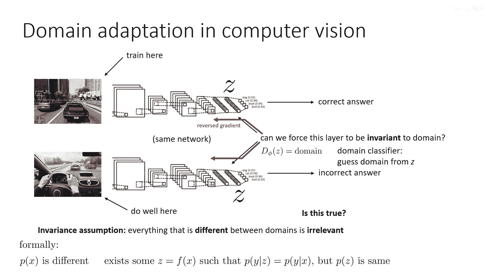

我提到了那个，有时候，你也可能会陷入一种情况，不仅仅是图像有所不同，实际上，动态本身也是不同的，在这种情况下，像这样强行保持不变性可能不是一个好主意，所以，如果动态发生变化。

我们是否可以做一些领域的适应，所以，如果动态不匹配，不变性是不够的。

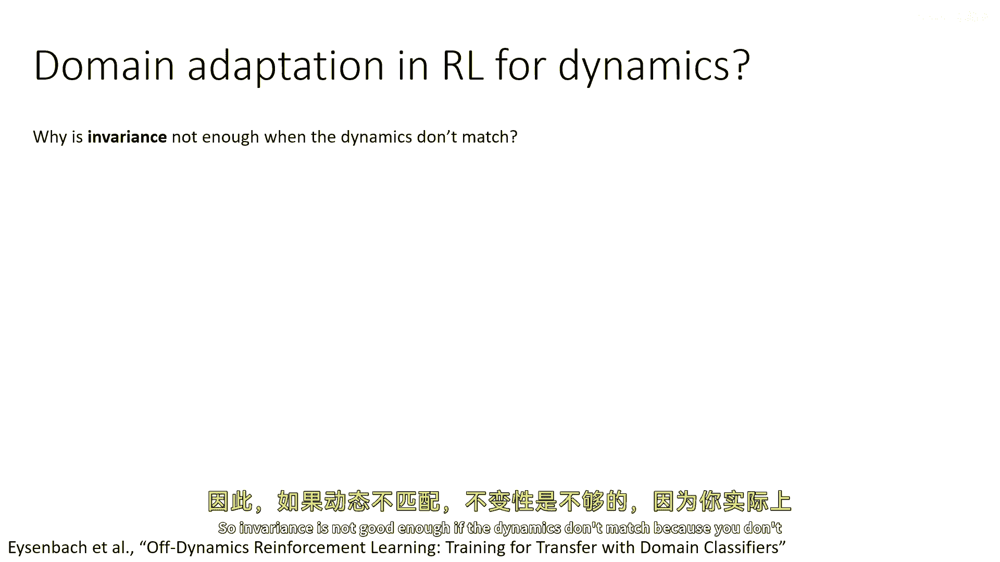

因为你实际上不想忽视功能相关的差异，但你可以做的是，你可以实际上改变你的奖励函数来惩罚代理在做源域的事情，这在目标域中是不可能的，所以这里是对这个的一个小例子，假设在现实世界的目标领域。

你想要从起点到终点，中间有一道墙，所以你必须绕过墙，在你的源领域在你的模拟器中，这道墙不存在，所以如果你在源领域训练，你会得到这种行为，它直接走向终点，这在目标领域当然不起作用，所以我们可以做的是。

如果我们从目标领域有一些经验，我们可以，改变我们的奖励函数，以提供一个非常大的，负奖励，做在源领域可能不能在目标领域做到的事情，这是非常相似的想法到领域适应，嗯，除了改变你对输入的表示，使它看起来不变。

你实际上是改变你的行为，使你的行为看起来不变，直觉上，这种技术将做什么，它将惩罚代理做那些违反幻觉的事情，这使得代理明显看到，它位于源域，而不是目标域，所以这是从一部，一部你们可能认识的电影剪辑的。

所以这个男人认为他正在船上航行，但当他到达绿色屏幕的边缘，他穿过绿色屏幕并意识到它实际上不是清澈的天空，它实际上是电影工作室的墙壁，所以你不想违反幻觉，并且这个额外的奖励项将做什么，这将防止你违反幻觉。

或者，例如，如果你想训练蚂蚁在无限大的平坦平面上跑步，并且它只有一个有限的场地来练习，那么当它到达场地的边缘时，它将违反幻觉并遭受一些负面奖励，结果发现，之前的不变性技术实际上可以用于计算这个奖励函数。

嗯，这个概念与那个非常相似，本质上，奖励函数，嗯，最优地引导到所需的行为，这里将介绍目标域和源域的日志概率之间的差异，目标域中过渡发生的日志概率，减去源域中的日志概率，这是非常直观的，它只是在说。

选择在目标域中可能发生的过渡，嗯，在目标域中同样可能发生的过渡，它们在源域中存在，有许多方法可以近似计算这个量而不需要训练动力学模型。

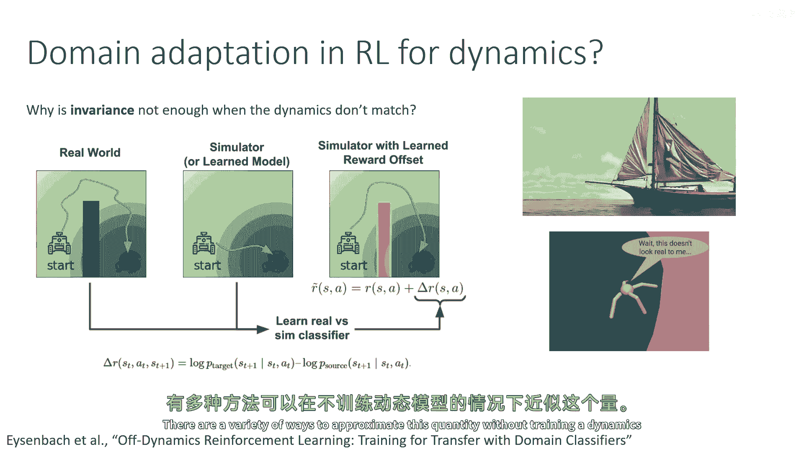

其中一种方法是训练，嗯，嗯，一个判别器来处理它。

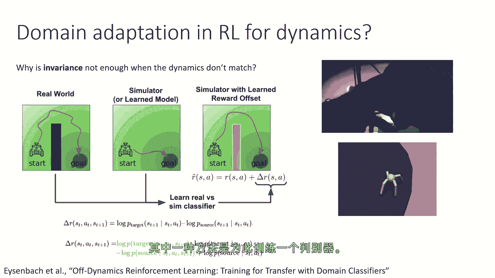

因为你正在估计条件概率，实际上你需要两个判别器，所以你有一个判别器对于联合，s和s'，还有一个判别器对于联合a和a'，你实际上取两个的差值，我不会详细解释，为什么这种方法工作，对于方法的详细信息。

我建议你阅读论文，但从这个幻灯片的高阶想法来看，我只是想让你记住，你可以使用不变性的想法来处理动态的变化，这导致代理试图在源域中行为，以这种方式，他们不会做在目标域中不可能的事情。

它可以通过在奖励函数中添加一个基于判别器的术语来实现，但比之前从图像设置中的常规情况更复杂，你需要实际上两个判别器，并取它们的差值，所以嗯，要了解更多关于技术方法的信息。

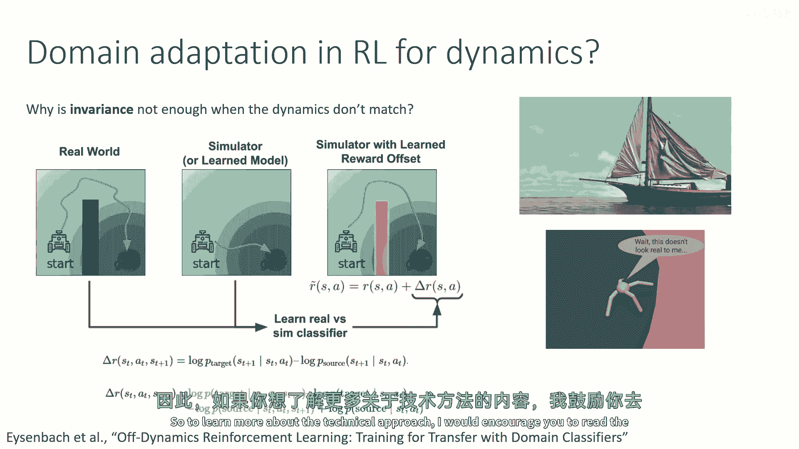

我建议你阅读论文，现在，你也可以考虑。

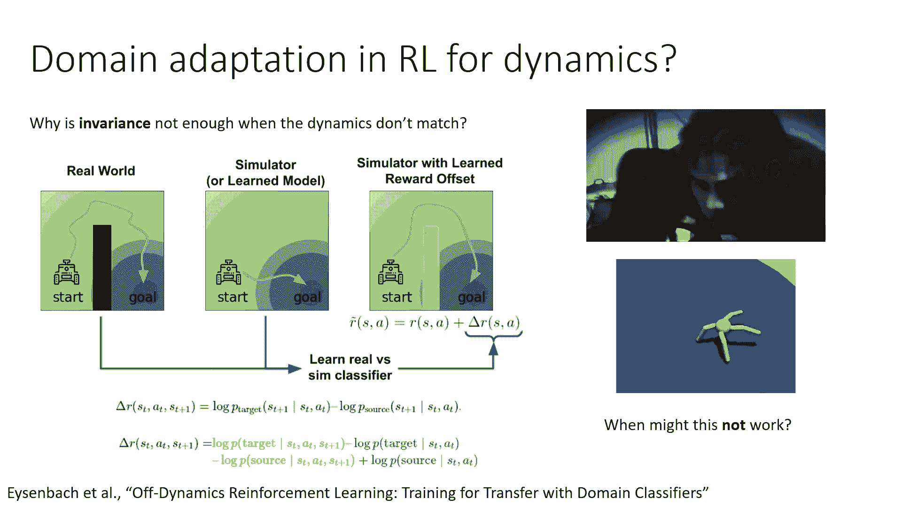

为什么这可能不工作，这样的技术将阻止你在源域中做在目标域中不可能的事情，但它也可能意味着，源域不允许你做在目标域中需要的某些事情，而这样做并不能解决这个问题，所以，在某种意义上。

你将像两个领域的交集一样学习，如果交集大，并且在那里你有良好的行为，那么你就处于良好的状态，嗯。

但如果交集不大，那么你的情况就不太好，嗯，但可能它不是，现在，如果你在目标领域进一步微调，仅仅通过运行更多的强化学习，这也可以使转移过程工作得更好，但是，有几个问题使在强化学习中的微调稍微困难。

比使用监督学习首先进行强化学习任务通常更多样化，所以，预训练和微调，例如，在计算机视觉或自然语言处理中，通常依赖于场景，在那里你的预训练是在极其广泛的设置中进行的。

也许你在一个拥有数百万ImageNet图像的设置中进行预训练，或者你在一个拥有数亿行文本的bert设置中预训练，然后，你在一个更狭窄的领域上进行微调，这在rl中通常不是这样工作。

你可能需要在预训练时处理更狭窄的任务，尽管，当然，如果你有幸拥有一个非常广泛的任务分布，那么事情会进展得更好，但如果你预训练在更狭窄的任务上，特征通常更一般，并且政策和价值函数可能变得过于专门。

最优政策和完全可观察的MDPs倾向于确定性，你训练的时间越长，你的政策就越确定，再加上问题一，这可能是一个重大问题，因为随着你的政策越来越确定，它探索的越来越少，所以你有探索的损失，收敛。

并且低进入策略对新环境的适应速度非常慢，因为它们探索不够，这，结合具有较少一般性和过于专门化的政策和价值函数的特性，"可以在强化学习中极大地减缓微调过程"，因此，因为这个原因。

单纯地盲目调整往往并不非常有效，"并且我们经常不得不做各种各样的事情来确保我们的预，"训练过程产生的解决方案比我们通常通过常规方式得到的更多样化。"，"常规的RL预训练"。

"现在并没有一种方法来做这件事"，但是嗯，我们实际上在探索两堂课中讨论了一些能够提供这种程度的技术，当我们讨论无监督技能发现时，在控制器推断的讲座中，当我们讨论最大熵强化学习方法时。

这两种技术类都可以作为预训练方法的有效手段，因为它们可以为你提供更多样的解决方案，所以在探索二中，我们讨论了如何运行，例如，多样性就是你需要的算法，或其他信息论方法，它们将发现各种不同，嗯。

行为是一种不同技能的集合，你可以直接使用这些技术，或者将它们与传统的奖励函数结合，以学习解决任务的方法，以各种方式，你还可以使用我们讨论的最大熵RL方法，在控制推断讲座中，以避免探索的损失和收敛。

这两种技术类都可以在转移学习中更有效，比简单地预训练和微调，我不会深入讨论这个问题，虽然，因为嗯，不幸的是，到目前为止，这里并没有真正很一般和广泛应用的原则，有很多研究，嗯，但我能告诉你的是，好吧。

也许可以借用一些探索和控制这个推断的想法。

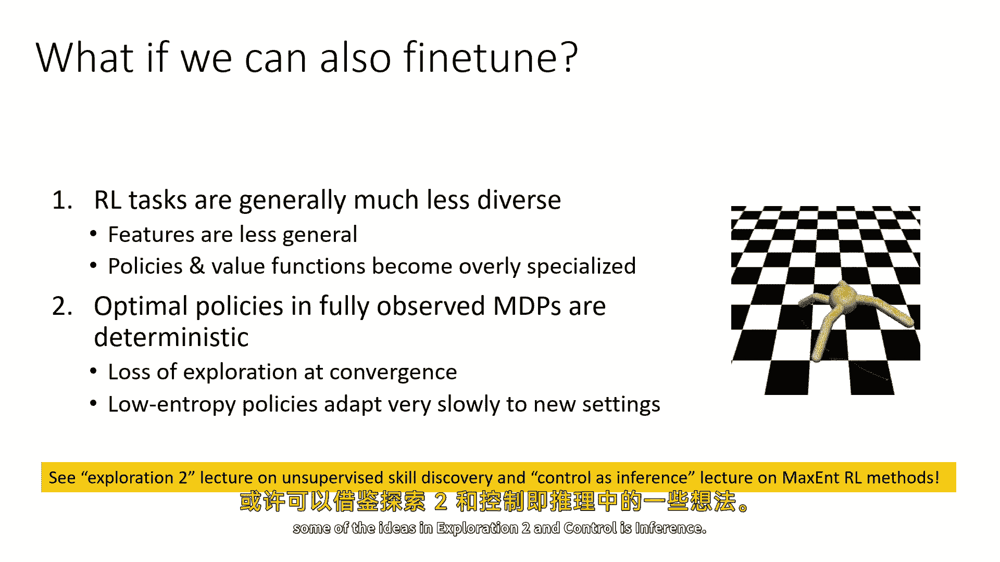

另一个在转移学习中经常非常有用的工具是操纵源域，现在，一点点，你不能总是这样做，如，也许源域只是一个你在其中训练的特定模拟器，你不能改变它，但如果你能对源域有一些控制，有一些事情你可以做。

这将最大化成功转移的概率，许多这些事物的基本直觉是，训练域的变异性越强，我们零射转移到稍微不同领域的可能性就越大，基本上，如果你在模拟游戏中驾驶汽车，并且总是阳光明媚，外面明亮。

并且在一个不太可能转移到现实世界的城市中，比如果你游戏模拟不同的时间和可能不同的城市环境，源域的变异性越大，转移的东西就越多，这在实践中经常表现为随机化，人们会故意在源域中添加更多的随机性。

可能比他们在现实世界中预期的要多，以增加策略对各种物理参数的鲁棒性，例如，如果你想训练跳板跳跃器，它有一些物理参数，也许它有你知道的摩擦和质量，所以这是两个参数，真实世界的系统在这里。

所以它有参数一和参数的值，如果你在狭窄的参数范围内训练，你可能不会泛化到目标域中可能会看到的参数，但如果你在更广泛的参数范围内训练，那么目标域可能大致在，你训练的参数集范围内，这就是基本想法。

这个想法已经在文献中以各种方式出现，两者对于uh。

随机化物理行为和视觉外观，最早将此应用于深度rl的一篇论文是由registrait写的这篇论文，都被称为opt，哪篇论文研究了物理参数的随机化，所以想法是也许你想要，uh，在一种类型的跳板上训练。

然后测试在另一种跳板上，也许一个具有不同质量参数（mass）的跳板，但是uh，如果你用单个设置来做，那可能不工作，所以你在多种不同参数设置上进行训练，也许然后转移会更有效，所以在这篇论文中。

有对如何工作或不工作的一些分析，这是一些非常基本的分析，所以这里，跳板的躯干质量在x轴上被变化，你可以看到测试时的质量，y轴性能，和三个不同的训练质量图相对应，所以左边的一个被训练的质量为3。

中间一个质量为6，右边一个质量为9，你可以看到质量为3的训练，当然，质量为3时性能最佳，然后随着质量的增大，性能迅速下降，质量为6的训练在质量为6时性能最佳，如果政策在质量范围内被训练，那么这就是性能。

你可以看到性能在所有质量上都非常高，作为参考，训练质量的分布大致像这样，所以它是一种以质量6为中心的正态分布，这不太意外，在多种物理参数上进行训练的结果是，政策更加 robust。

关于这篇论文的一个可能是有点惊讶的是，它工作得非常好，与总体性能相比，退化相对较小，所以你可能会认为存在一个权衡，即在 robustness 和 optimality 之间的贸易off。

意味着如果你想要更 robust，你将获得较低的奖励，但实际上，在许多情况下，这并不似乎如此，当然，这不是一个普遍的结论，但是，部分原因是你可能期待存在一点免费的午餐，是因为深度神经网络实际上非常强大。

所以不是不可能想象，你可以训练一个网络，它在各种质量上都与任何单个网络对特定质量的网络一样好，嗯，另一种有趣的观察，当谈论迁移学习时，这是非常重要的。

是随机化足够的参数实际上创建了对未被随机化的其他参数的 robustness，所以注册和 all 在这里进行的特定实验是，他们模拟器中的四个物理参数被随机化，他们做了这样一件事。

他们让四个不同的物理参数在模拟器中变化，他们排除了一个人进行随机化，所以质量总是相同的，但是摩擦，关节，阻尼和线圈被改变，并发现用这种解决方案，嗯，那就是这里蓝色的线，实际上它对质量相当 robust。

直觉上你可以看到为什么这种情况会发生，因为这些物理参数中有些效果是重叠的，所以如果你减少质量，这就像减少摩擦一样，因为你的地面反作用力不会那么大，因此你的摩擦力也不会那么大。

所以虽然改变摩擦并不完全等同于改变质量，如果你随机化摩擦，你会对质量更加 robust，实际上这是非常重要的，因为当我们在实际中进行迁移学习时，我们几乎总是有未建模的效果。

我们几乎总是无法实际改变区分源域和目标域的所有参数，所以，知道如果你足够改变参数，甚至那些你没有改变的参数，你可能仍然对，然后，当然，你可以做的事情是如果你在目标领域有一些经验，你可以适应一点。

你可以改变你参数的分布，嗯，以更接近目标领域的方式接近目标领域，然后事情将会更好。

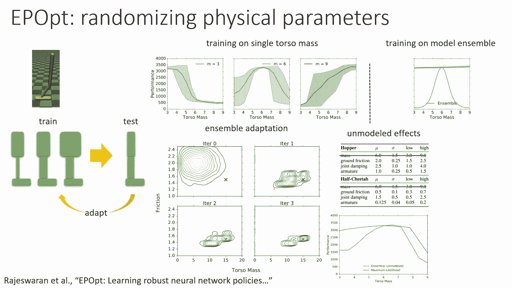

现在，随机化在uh中被广泛使用，强化学习的迁移学习，这是第一篇将其用于深度强化学习，具有视觉观察的无人机飞行的论文。

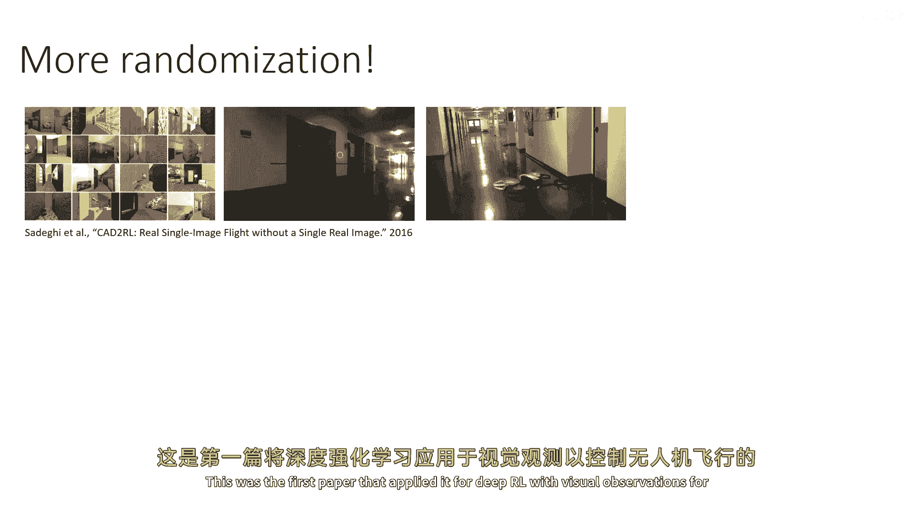

它与循环神经网络一起使用。

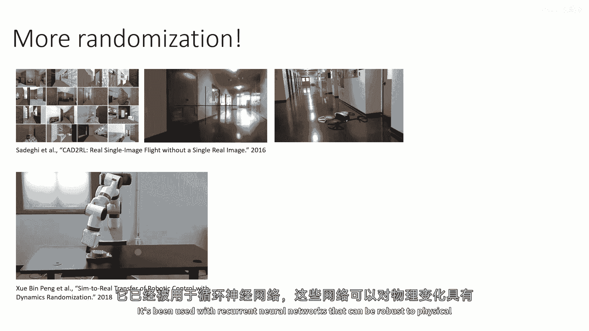

这可以抵抗物理变化，然后实际上也是适应的，嗯，最近，这种技术在学习运动策略方面非常流行，这是来自eh的一篇论文，苏黎世的论文展示了政策在极端 robustness 方面的相当程度。

在具有高随机化的物理模拟器中训练，因此，这个概念在所有领域都有很大的影响，特别是在机器人学中，现在，这个概念不再限于机器人学，你可以想象为所有类型的领域随机化模拟器。

但机器人学似乎特别适合这种想法的爆发，所以，如果你想了解更多关于我覆盖的技术，以下是一些关于领域适应的参考，微调和，嗯，随机化，在本节最后部分，我还要稍微谈谈多任务迁移，嗯，这次讨论将，相当短。

因为多任务迁移是一种非常强大的工具，但是，我们将更多地讨论这个问题，当我们稍后讨论元学习时，所以嗯，这将只是一个关于这个的快速概述，嗯，多任务想法，基本思想是，通过学习多个任务，你可以学习得更快。

也许转移得更好。

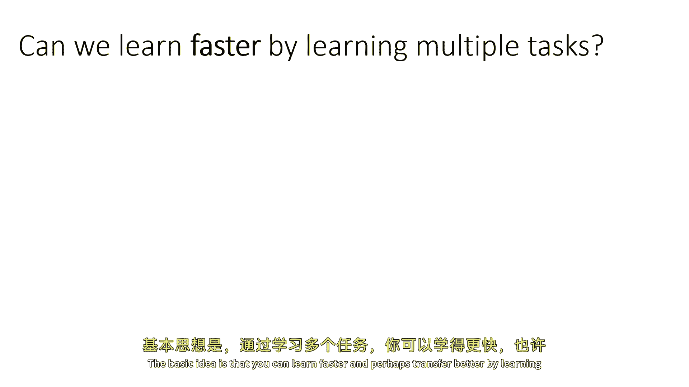

所以如果你有多种任务，也许你有这个机器人需要完成各种家务，你可以单独学习这些任务，但是，任务共享一些共同结构的可能性非常大，他们不会全部共享结构，但是，也许他们共享一些结构，在机器人移动手臂的方式上。

它们有一种类似的感觉，它们接触物体的方式可能也相似，所以，如果你不单独训练它们，但你相反地训练它们全部一起，你能够共享这些表示的事实会使所有任务学习得更快，所以，如果其中一个任务弄清楚如何拿起一个物体。

这种能力可以立即被其他任务使用，也许他们会探索得更好，或者他们会学习得更快，并且更进一步，如果你学习多种不同的任务，然后在测试时间你会被提供一项新的任务，嗯。

似乎你更有可能将一些东西转移到那个目标任务上，如果你有更多的源任务，这与随机化有些类似的直觉，如果你有更广泛的训练情况，那么测试情况对你来说就会更像一些熟悉的情况，并且它可以为下游任务提供更好的预训练。

现在关于这一点没有多少要说的了，这个基本版本的真正关键在于能够有一个足够有效的强化学习算法，可以做到这种多任务训练的算法，你知道那种规模的扩大，适当选择正确的超参数，等等，人们已经提出了各种技术。

专门设计以使多任务训练更好，但是实际上并没有一种通用的杀手技术可以在所有领域都起作用，所以我想说的是，如果你真的对这个感兴趣，你可以做一次文献搜索并阅读关于多任务学习在rl的多篇论文。

但是基本的起点只是取与你在单一任务rl中会使用的同样类型的算法，然后尝试将它们放大。

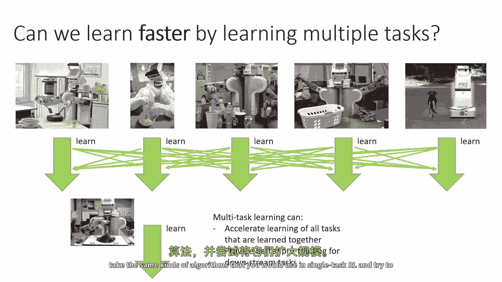

我想说几句关于这种形式的，这种东西如何可以被框架为一个mdp，所以，你知道的，相当直接，但是非常重要的一个想法是多任务rl确实对应于单一任务rl，在联合mdp中，所以，如果你，如果你曾经想过如何表示。

多任务强化学习作为一个rl问题，记住，它是同一个rl问题，在标准的rl设置中，你首先从p(s0)中采样初始状态，然后执行你的策略，如果你想将多任务问题嵌入到这个设置中，你所需要做的就是改变初始状态分布。

你可以这样想，如果你在学习玩多个不同的阿塔里游戏，在同一个常规阿塔里游戏中使用相同的策略，初始状态分布只是开始那个游戏，在这个多任务阿塔里mdp中，初始状态分布是游戏分布的集合。

在第一步中你采样一个游戏，然后从那以后你玩那个游戏，这仍然是一个单一mdp，从原则上讲，算法实际上不需要改变任何，为了做到这一点，你在第一个状态中随机选择mdp，这是mdp定义的一部分。

现在可能会有一点微妙之处，因为政策可能在同一环境中做多个事情，如果这个是阿塔里游戏，这不会是一个问题，因为你可以通过看屏幕来确定你在玩哪个阿塔里游戏，也许你有一个机器人在家，在相同的初始状态下。

可以去做洗衣服，或者去做洗碗，所以，在这种情况下，如果你想将多任务学习实例化为标准的rl问题，你可以做一点更多的事情来指示给代理，它应该做什么任务，我们这样做的方法是为每个任务分配一些上下文。

上下文可以是各种各样的东西，它可以那么简单只是一个one hot向量，指示我们是在做饭还是洗衣服，也可能是任务的某种描述符，也许它是一个金色的图像，甚至是一个文本描述，所有这些都是合理的选择。

所以我们称这些上下文政策为标准政策只是一个给定s的pi，一个上下文政策是pi给定s，逗号上下文，逗号omega，然后你的Q函数也将接受omega作为输入，所以这可能是一个one hot向量。

指示你是否在做家务还是洗衣服，这可能是一个文本描述，也可能是其他东西，这是非常，非常简单，你所需要做的就是简单地扩展状态空间，以添加上下文到状态，现在，使用这个多任务策略训练问题，以完成所有这些任务。

基本上相当于之前的多任务mdp，在初始时间步中，omega被随机选择，然后，在接下来的一集中，它不会改变，所以，人们已经为各种设置训练了上下文策略，也许你有一个堆叠乐高积木的机器人。

而欧米加是它被征税的地方，你有一个虚拟角色在行走，欧米加是希望的行走方向，也许你有一个冰球机器人，欧米加是它应该击中冰球的地方，所以嗯，这些都很容易做到，你不实际上需要为最基础的版本改变你的算法。

你只需要更改你的mdp定义，添加一个额外的变量到状态中。

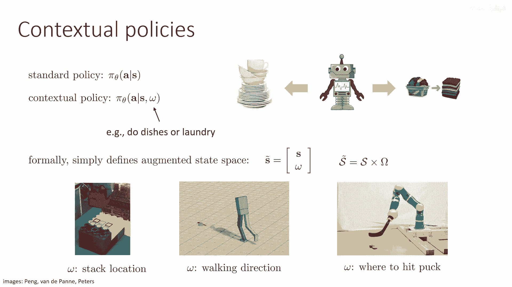

上下文中特别常见的策略被称为目标条件策略，所以，在目标条件策略中，上下文只是另一个状态，你的回报奖励你达到那个状态，如果你正确地达到那个状态，就只奖励一个，或者在那个状态周围有一个小球来说你好。

如果你接近所需的状态，那么，那被认为是一个积极的奖励，目标条件策略可以特别方便，因为你不需要手动为每个任务定义奖励，你可以只是采样一些随机的状态作为你的目标，如果你遇到的是新的目标。

那么你可以零次学习转移到新的任务上，所以如果你足够幸运，你的新任务被一个目标定义，那么零次学习转移是完全可能的，这有一些缺点，虽然，因为在实际操作中，训练这样的目标条件政策往往实际上是困难的。

它只代表了一个相当困难的强化学习问题，而且不是所有的任务都是目标达到的任务，所以这个例子，从探索中得出两堂课，展示了一个不能作为目标的任务实例，在那里，你需要到达绿色位置同时避免红色圆圈。

所以没有一种单一的目标可以解释这个，如果你想了解更多关于目标条件策略的信息，我鼓励你阅读这个领域的几篇相关论文，因为设置目标条件强化学习在最直接的方式上实际上是非常简单的，你只需要定义一个特定的mdp。

如果你想让这些方法真正工作得很好，有许多技巧可能会非常有用，这些技巧包括聪明地选择要训练的目标，聪明地表示价值函数或q函数，和聪明地制定奖励和强化，学习损失函数，特别是在你试图达到目标的时候特别有效。

所以这个基本的版本是直接的，然而，使它真正工作得很好在讲座的范围之外更复杂，但如果你对这个感兴趣。

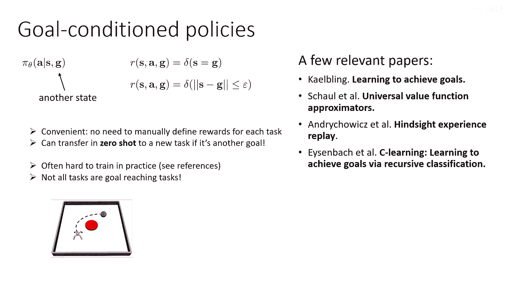