# P12：13b 神经辐射场 - AInsight - BV17W421P7QA

好， 好吧，谢谢， 好吧，只是回到刚才那里，嗯， 好吧，那么， 三D四D是什么，为什么我们需要三D表示法，为什么我们需要三D模型， 像，为什么我们不直接向Sora要所有东西的视频，嗯。

 我认为可能有几个原因， 也许我们想这样做，并且许多都与，我们存在于一个环绕的三D世界中这一事实紧密相关，嗯，你知道，思考关于自动驾驶车辆和机器人时，以及其他必须与世界互动的东西，有时你知道。

 就像你可以安全地只做像素动作，但在一些情况下， 你可能不想让政策工作，不一定， 你只是想要某种像，合同保证， 你传感器表明， 像，如果我以这个方向以这个速度前进， 接下来的，你知道，一百毫秒或什么的。

嗯，所以， 在这个情况下， 你真的想要那个三，D， 只是做一个最基本的几何测量关于世界，嗯，并且有其他情况， 不仅仅是关于驾驶你的机器人，对，就像你知道， 重新装修你的房子，或像那样的事情。

 就像你有这些种类的像AR应用，你可以做底层测量， 而不使用尺子或卷尺，并且所有这些都归结为，只是想要了解在许多情况下， 严格的准确的空间测量关于世界，嗯，我认为是下一个级别， 是这一想法。

 像模拟一个现实， 它并不物理存在，嗯，可以说是这个想法的下一个级别，我认为是这一想法， 像模拟一个现实， 它并不物理存在，但你想要观察它， 所以种类的， 一个经典渲染案例， 是，是建筑之前的。

就像你有一些好的， 像CAD，建筑图样， 在你的电脑，并且你想要说， 像，如果太阳在这里，像，如果它是这样的天气，或什么，我的房屋看起来会怎样，这是否会很好，是， 这是否会很好，它会不会很糟糕。

当我在厨房时，它会不会像瞎了我一样，嗯，像，那样，那光线如何通过房间流动，或者类似的，你知道，像宜家这样的其他著名案例，你知道，他们不再实际摆拍目录中的图片了。

他们主要是有一些他们喜欢的大型3D模型堆积，为每个他们有的不同布局设置，然后他们可以做这种定制，像我们的国家，像不同的文化事物真的很容易，而不必在现实中费尽心思去做这件事，当然。

你知道像CG用于游戏和电影，是一个巨大的行业，这就是你目前所知道的全部，像所有这些工具链和管道都是由底层的3D表示支持的，物理模拟如渲染器和类似的东西，嗯，所以这是一种方式，你知道。

如果你不想像克里斯托弗，诺兰或什么，你可以实际上为，不像数百亿美元，和巨大的物理破坏，你可以实际上运行这个东西多少次你想，就可以摆拍它，嗯，并且可以烧掉大量的CPU或GPU时间。

我认为还有一种像其他层次的东西在上面，因为像人们在一个物理3D世界中，他们基本上直觉地理解这作为与东西互动的界面，嗯，这在很多情况下都没有实现，实现了两种非常特定的方式，我认为一个是游戏，然后是VR。

对吧，所以像空气和VR，有原因人们发现像，你知道，手柄控制器，或像手势和东西真的很吸引人，它 kind of like 沉浸你进入那个媒体，因为它是一种更直接的控制方法，和像双摇杆。

你 kind of like 有这种不自然的，然后你必须学习并掌握并变得擅长，当你试图玩一个游戏时，但是，你知道，我认为人们发现仅仅沉浸在某种想法中的概念是足够吸引人的，就像宇宙中的一条平行线。

足够令人信服，以至于他们愿意牺牲大脑的可塑性来学习如何喜欢，使用第二个摇杆，嗯，所以我认为有那个，在那些领域，有某种程度，涉及到三维的，就像软件和硬件目前所做的那样。

我认为不是所有这些都 necessarily 需要涉及到三维，我认为对模拟效果的反感很多，嗯，还有其他种类的创意应用，它们不一定需要那种底层的，嗯，3D结构保证，嗯，但在这些情况下，它真的是，你知道。

这是必要的，比如通过苹果头显，比如那需要向你展示，这是一种与设备之间的隐含合同，就像你在向我展示的，就像，我不会走进椅子，那不是在那里，它需要 kind of，嗯 准确于世界。

所以这 kind of 涉及到问题，好的，当我们进行重建时是什么时候，我们在生成什么，我们在这条线和连续体上是什么时候像这样，这又有什么关系，我认为我会在非常高的水平上分类重建，这是可以接受的。

我们有许多观察或某些底层信号的测量，这可能通过一些前向模型进行抽象，就像经典案例一样，这里将是你从三维场景中取得一张二维照片，然后，你将尝试反转这些以恢复一些对底层信号的表示。

在这里的假设是你实际上是在试图得到那里曾经存在的东西，你正在尝试拍摄足够的照片，足够的观察，以便你可以得到一个合理的重建，而且你没有产生太多的幻觉，与，我认为生成通常意味着哦。

我们基本上对制造东西没什么问题，我们并没有观察到，我们可能有一个纯粹的无条件生成模型，我们可能更经常想要某种非常松散的控制器，你可能有一个文本字符串或单个图像，或者某种语义输入，这能过滤掉。

完整的分布以得到我们关心的，例如，我们实际上关心的样本，我想要进行单个图像重建，即生成像物体或房间这样的物体，或者你知道的，我想要提供一个文本查询并得到输入和输出视频。

嗯，并且我认为在视频模型中你会得到很多，与三个D相比，这个观念是像人们一直在推动视频模型越来越远，越来越远，越来越远一样。

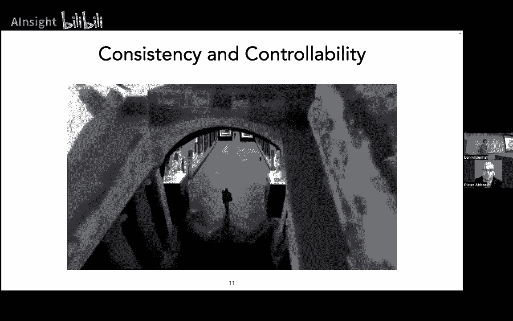

当然，就像疼痛一样，现在是明显地，这是这个旗舰例子的代表，而且，就像是在适应，以获取所有这些能力，人们以前不确定我们是否会涌现出来，仅仅通过像扩展数据和架构一样。

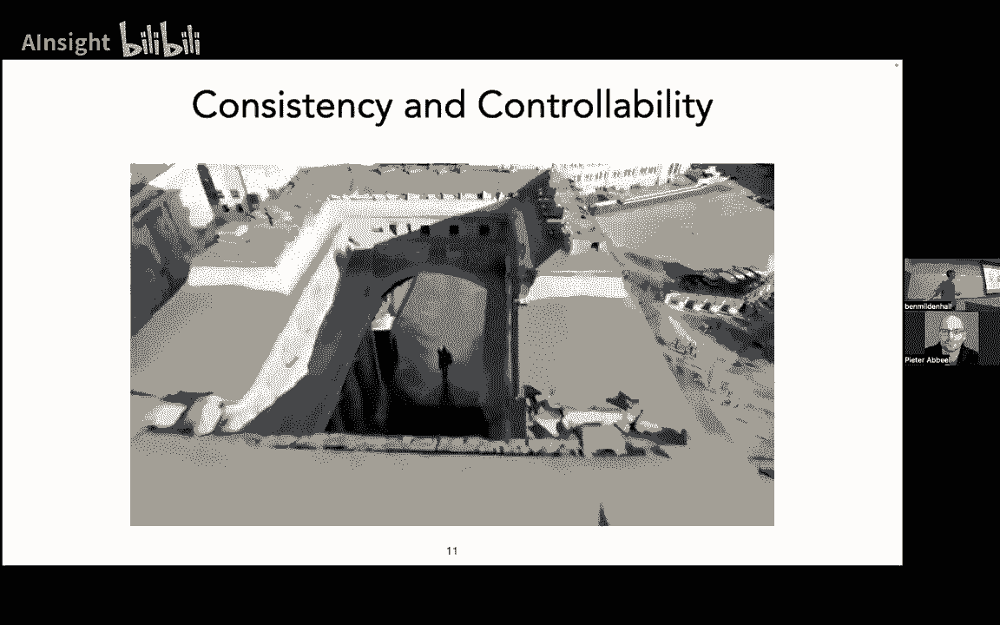

但它仍然有像这最后一个级别的，好的，如果你看视频看足够长，你的大脑就像等待，那样物理上是不可能的，如果我喜欢那样移动相机。

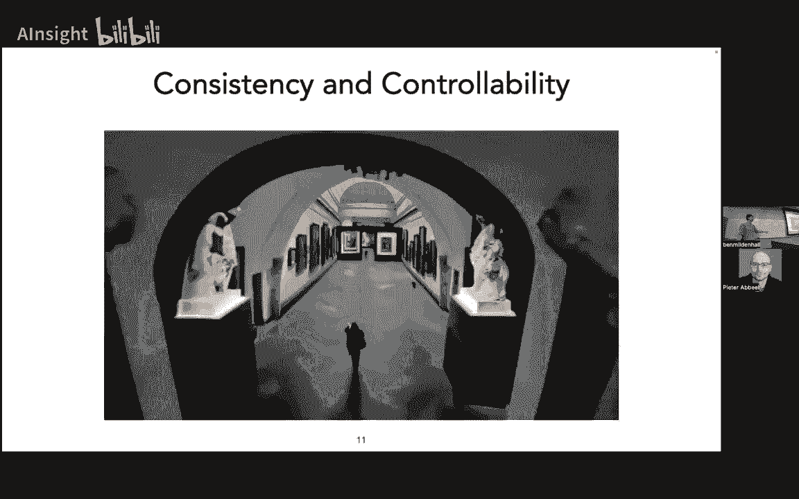

嗯所以如果你喜欢任何个体，一秒的片段看起来真的很好，然后如果你看它像五和二十三十秒，你开始得到一些光学空间错觉。

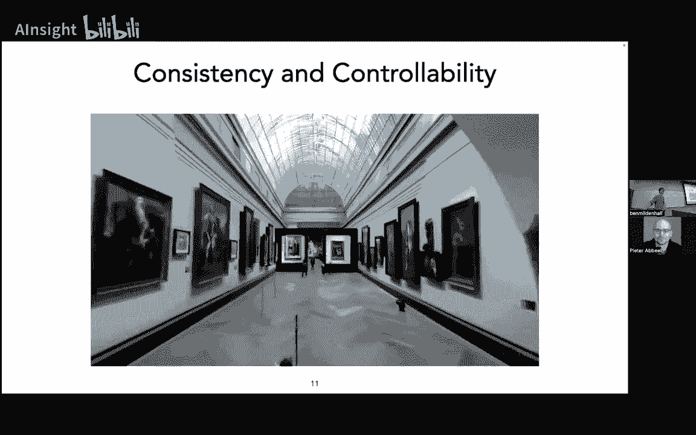

这些稍微欺骗你的大脑，我想我可能不会冒险。

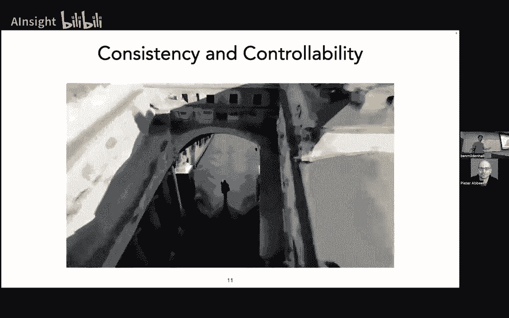

说这不能通过，就像更多的钱，更多的GPU，更多的数据，但是，我认为这 kind of 暗示了一个潜在的事情，在哪里，好吧，甚至超过了那个基础的一致性水平。

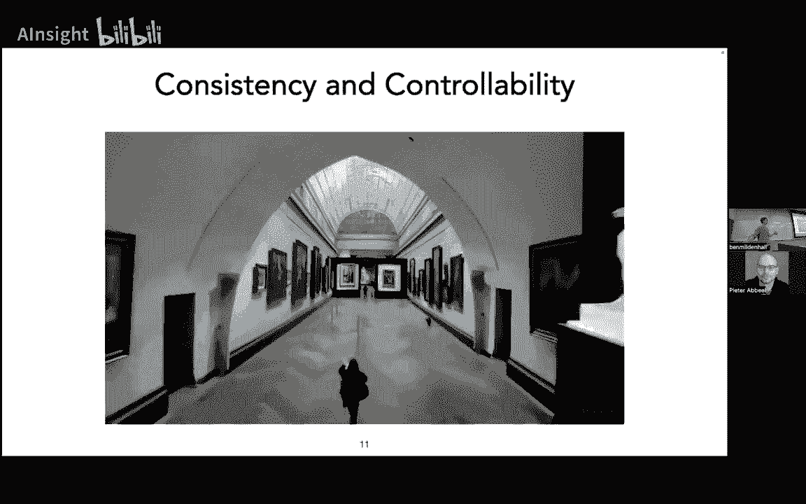

还有控制性的概念，就像如果我想要改变相机路径，如果我想要像，将这个物体放入这个场景，那就是尊重，遮挡，在物理世界中也会这样发生，我认为那些地方可能是你有优势的地方，降入更三维的界面。

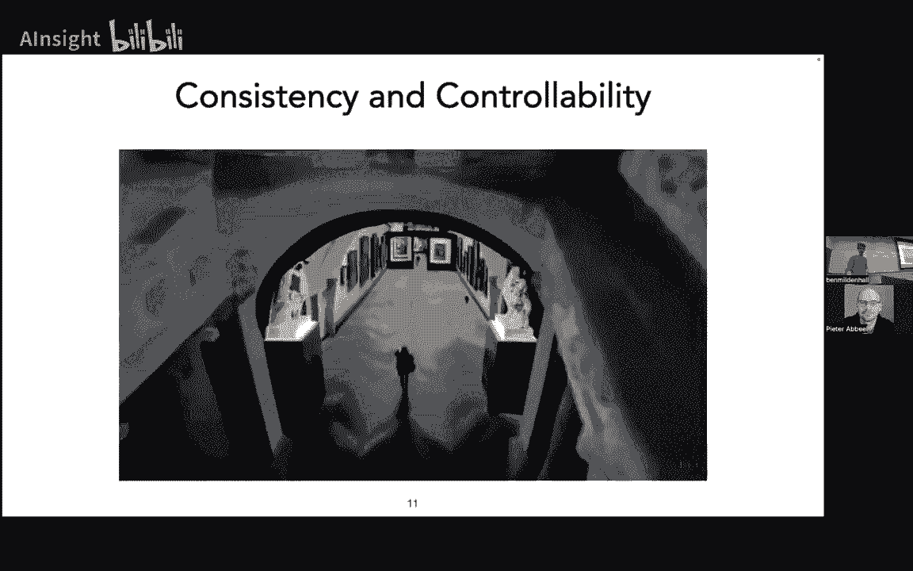

好的，所以这就是我对于，三维，为什么，我仍然对它感兴趣，我一直都对此非常感兴趣，嗯，关于nerf，我之前更多是从重建的角度来考虑的，但在过去的几年里，我开始对生成方面的事情更加感兴趣。

那么nerf是什么，nerf代表神经辐射场，这是一种专门用于计算机视觉的任务，用于新视角合成，嗯，所以，新视角合成的想法是不错的，有一种像常规渲染和三维图形渲染的概念。

我们基本上有一些详细的场景描述在计算机中，我们知道一切在哪里，我们知道物体的形状，我们知道它们的颜色或材质，我们知道灯光在哪里，我们将整个过程都考虑进去，模拟一个相机，观察场景并追踪，一堆射线或栅格化。

一堆多边形，然后生成一个单一的输出图像，希望它看起来，你知道像我们想要的那样，这有点像经典激励例子中的玉米箱，我想是从八十年代或什么的时候，这些在康奈尔的研究人员，像物理地建造了这个盒子。

并在其上放置一盏灯，然后使用ccd拍照，我猜是ccd，当时的数字相机，然后我们说，好的，我们可以去手动指定像，你知道，在计算机的三维欧几里得空间中，所有这些墙壁在哪里，它们的颜色是什么，光线在哪里。

然后运行一种渲染算法，这样我们就可以通过某种方式通过视觉图灵测试，使右侧的图像看起来真实，看起来像左边的图片，而且我认为在那个时候他们大概是这样的，好的，我们做到了，嗯，接下来的几对，你知道。

三十年的计算机图形研究基本上就像这样，但对于越来越复杂的事情来说，而且我认为在某种程度上就像，也许大约两千年左右啊，这基本上已经饱和了，人们基本上对照片真实的渲染状态感到满意。

它开始逐渐进入下一阶段的生产，在接下来的二十年里，直到现在，我想你们很多人可能已经注意到，嗯，光线追踪作为游戏和视频图形卡中的真正大范式出现，在过去的，像，我不知道，大概五年左右，在那五年前。

从那里衍生出了一种类似的角色，与电影和特效行业一起，实际上它花了，你知道，大约十年左右，在这些射线追踪算法被为他们引入后，才真正进入电影生产，因为就像很棒，你知道，研究，科技，债务，以及所有这些东西。

以及那些在理论上对像几张香烟纸一样的数字有效，但在实践中对于所有人希望在电影中模拟的东西并不足够坚固，但你知道，我们现在达到了一个状态，就像你可以为，像几乎任何你手动指定的cg场景那样做。

如果你有一个由三个3D艺术家组成的团队，嗯，"为了创建足够详细的资产，花费了许多许多时间工作。"。

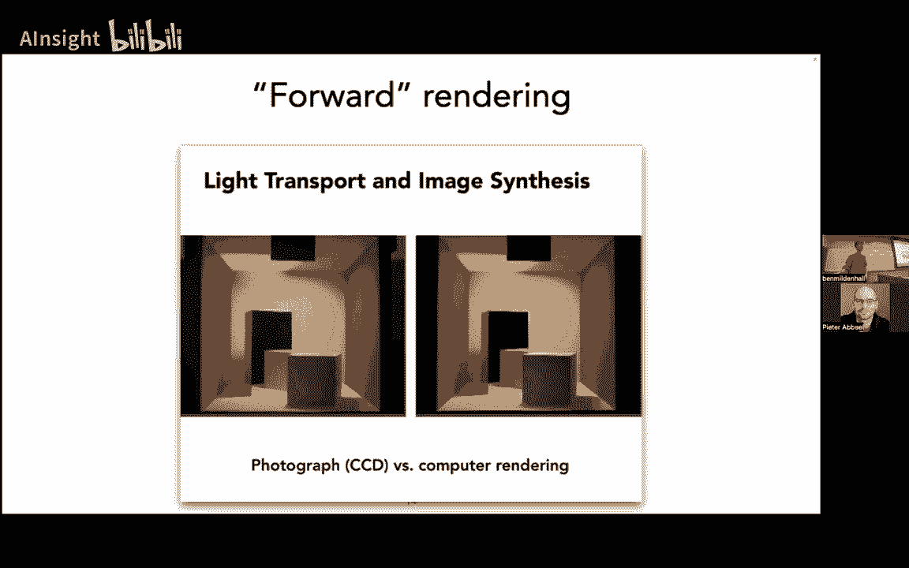

"Um uh"在中文中通常表示一种犹豫、不确定或者思考的语气。它并不是一个完整的句子，而是一个语气词，用来表达说话者在思考或者不确定如何表达时使用的。在中文里。

人们可能会用“嗯”或者“啊”来表达类似的意思。"因此，推动力背后的动机"，基本上我所有的研究，"Like through my phd" 这句话直译成中文可能是 "像我的博士学位一样"。

但这句话在英语中可能并不是一个常见的表达方式。它可能意味着说话者经历了与获得博士学位类似的艰难过程，或者他们正在描述某种深入的学术研究或专业领域的知识。然而，这句话的具体含义可能取决于上下文。

"And until now it's this idea of okay" 翻译成中文是："直到现在，这仍然是一个可以接受的想法。"。

"That's actually really really really hard and really expensive" 翻译成中文是："这实际上非常非常非常困难而且非常昂贵。"。

"如果你尝试学习Blender并喜欢看到的模型"，"这非常痛苦"，你应该看一些关于甜甜圈和其他这些东西的YouTube教程，嗯，所以想法是像好的，到最后你仍然有这种某种糖果山谷的东西对吧。

你仍然没有真正捕捉到真实世界场景的全部丰富性，尤其是你知道连一个这么简单的表面，对吧，这只是像有一条路，有一条一条一条东西，像是一堵背景墙有一些涂鸦，这里有一辆摩托车，但这是一个极其丰富和详细的场景。

实际上，摩托车本身将是一个非常昂贵的CG资产，如果你建模得当，即使只是获得一个不错的纹理和地面正确的材质，这一切都非常具有挑战性，所以想法是像，作为一个外行。

去 essentially 获取场景的三维捕捉，让我们能够渲染出新的视角，而不需要任何背后的手工工作，仅仅通过一些自动化的三维重构过程，特别是在视点合成方面，非常注重输出图像的高质量，你不一定关心像。

好的，这个重建的几何度量精度，超级精确，我们会得到精确的材料属性吗，你所关心的，像，PSR和像前哨站之类的东西，基本上你想要看到，像，这些图像看起来非常好。

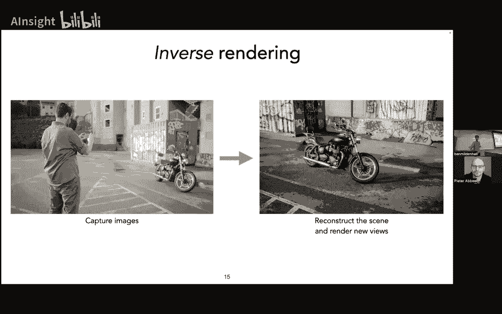

你知道我们花了，你知道接下来的五年左右在nerf之后，像四年时间将这个东西 scale 到大型和大型场景。

嗯，所以那实际上是一个视频，之前的一个不是nerf的视频，那是一个在nerf之前的论文，然后是来自zipp的nerf输出，nerf大约一年或一年半之前的，嗯，这是john捕捉他的房子。

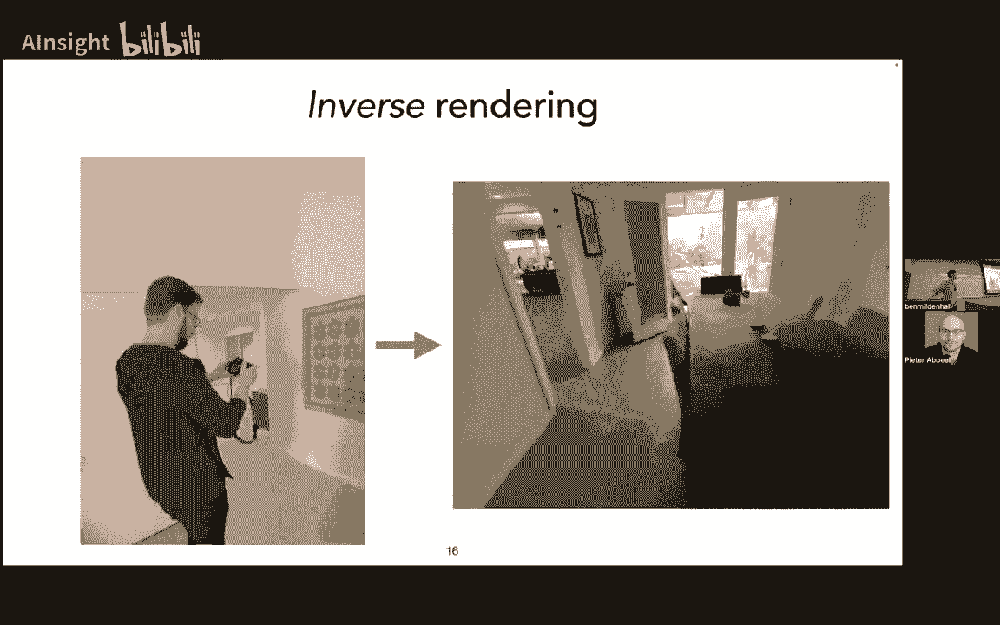

然后是我们之后使用zip算法制作的他房子的飞越，所以你知道，这基本上是他随机拍照，嗯，然后我们 spline 一个漂亮的相机路径，在最后得到这种像电影般的视频，是的，是的，像我说的所以。

如果我们想要 like 一个正式的计算机图形学，嗯，路径追踪，渲染场景，我们实际上需要一个完整的几何分解，材料，照明，嗯，但我们具体做了一些这方面的工作，只需将我们简化到一个更简单的问题，即，例如。

我们只想移动相机，其他东西可以保持不变，我们希望移动相机并查看，例如正确的遮挡效果，看到正确的，嗯，反射效果，所以你看到，例如背景中的积水反射，并且那应该被正确保留，好的，那就是，那就是推动。

那就是激励，嗯问题陈述背后的，嗯，Nerf和其他我们在这个领域之前做的工作，嗯，Nerf是一个，是的，它是一个eccv2020论文，它像，嗯，我们在covid之前做的最后一件事，本质上。

它是me patrol和matt共同工作，和ren的团队当时，我的意思是，Matt毕业后几乎就在那之后，我想matt，嗯，只是，嗯一年前完成，嗯大约，然后。

我和perl最终加入了john在谷歌的团队接下来的几年，直到我离开，然后，Ren实际上在human vision上做了很多工作，他的新团队真正专注于，像视网膜扫描那样的东西，和那样的事情，好的。

所以首先我会给出这个非常高级的管道概述，然后，我们将深入探讨一些关于具体细节的数学原理，嗯，所以是的，这是从原始论文中的管道图类似物，嗯，这描绘了从神经表示中渲染视图的过程，在训练和重建场景的过程中。

所以，这里的想法是，好的，正如我所说，你有场景的捕获输入图像，你想要将这些图像转化为，允许你渲染新视图的三维重建，实际上，你认为你不仅有输入图像，还有它们的相机姿态，内外部，嗯，这有很多限制。

我基本上认为这可以被视为已解决，像，这就是事情，许多论文都写了，假设这是给你的，嗯，这被像地毯一样掩盖了，事实是，如果场景不能被放置，我们将其丢弃并获取一个新的，所以，嗯，我认为。

如果你熟悉以允许场景被放置的方式捕获场景，你可以基本上获得95%的成功率，但这还没有达到盐的程度，像啊，有人可以上传YouTube上的所有视频，有意识的捕获用于重建与在野外的摆拍视频之间存在很大的差异。

但是，好吧，假设你可以运行'call now'进行SLAM之类的东西，你可以获取你校准的相机，所以，一旦你有，你现在基本上有一堆相机和一堆图像，并且像中间有一个空的场景，所以，想法是，我们将追踪。

我们将选择随机像素和观察的图像，并追踪这些光线从相机出发，仅使用，你知道，标准的三维计算机视觉几何，并在场景的边界体积中采样点，所以，我们将使用，你知道，标准的三维计算机视觉几何。

并在场景的边界体积中采样点，在每个托盘上，我们获取那些点，我们将它们通过某种三维表示传递，这将给我们一个输出颜色值，嗯，和一个输出透明度值，这基本上代表了场景的几何形状，对，在整个收敛过程中。

透明度的值基本上从像，嗯，像透明和模糊的，到像非常二进制化的，像零或一，所以你就像是沿着光线行进，光线上的每个点，你问，好的，这里有形状吗，如果有，它是什么颜色，在你得到所有价值后。

你使用体积渲染或阿尔法合成来计算最终的颜色数组，所以你说，好的，对于这条光线上的所有数据样本，从后向前的彩色和透明度复合是什么，嗯，得到一些输出值，嗯，然后你将其与观察图像中的真实值进行比较。

所以如果你取，你知道像像素二、三、四、五、六、七来自训练图像号七，你渲染这条光线，然后只是取，输出像合成神经渲染的颜色，嗯，并进行梯度下降，像几千次迭代，每次迭代都随机选择像素，实际上。

你可以重建非常详细的，嗯，合成物体，如原始论文中所述，嗯，以及这些种受限的前向视图场景，我们称之为，我们进行了，像相机窗口式捕获的方式，只面向一个方向，嗯，我们，我们最终解除了这个限制，包括我。

以及许多人后来都解除了这个限制，但在那时，"这是一种妥协，目的是为了将场景保持在相对有根据的篇幅中。"，"好的"，嗯，"所以现在我将进入主题"。

"这种支配着实际从输出密度和颜色中获取结果的底层渲染方程"，"并将它们转换为图像中每个像素的最终两个d值"，好的，"所以我认为，一个高水平的好东西" ，"神经的三字总结是神经体积渲染方法"，"嗯。

特别是我认为在这里渲染意味着像是有一个底层到你的表示" ，神经网络意味着我们像学习多层感知器场景表示一样使用它，体积化意味着我们特别不使用表面渲染模型，这基本上是其主要区别之一。

我将对这些事情 later 逐一解释，但像这些方面并没有在任何程度上被提出，基本上它们都存在了几十年，但我们只是将它们统一起来，展示了你可以通过这种方式实现非常出色的三维重建，通过将这些元素结合。

我们可以获得合成结果，特别是在体积化渲染方面，有一种背景故事，我认为，大约从2015年到2020年，有二十到二十人正在努力找出方法，你可以通过不同的方式渲染硬表面，就像人们会在二维空间中模糊它们。

他们会在三维空间中模糊它们，他们做所有这些事情来近似获取梯度，因为这是一个基本的问题，如果你正在渲染一个硬表面，你要么击中服务，你没有击中服务，这就是不连续的，并且实际上并没有像派生物那样的东西。

你需要依赖于像的事实，哦，我正在积分于，像像素足迹，并且那给我们像渲染的平滑版本，或者是所有这些东西相对于体积渲染非常自然就有一个微不足道的派生，如果你实现它，并且你知道，TensorFlow。

Pi torch，无论嗯和这里的区别是像，好的，嗯，在服务渲染中，好的，实际上这是表面渲染的实现细节，你最终会遍历表面中每一块离散的几何形状，嗯并且你检查是否那个射线击中了它，所以你说。

对于这只兔子上的每一个三角形，这会提示我们数组，或者我们将会错过它，相比之下，对于体积渲染，你会进行这种像射线的第一次循环，在这条射线上取样，对于每个样本，你只是直接查询，像，这里有创伤吗，嗯。

你可以立即看到有一个清晰的复杂性，明智的做法是沿着数组进行循环，而不是沿着数组进行循环，因为你显然会遍历大量的空空间，但事实证明，我认为这实际上是让基于梯度下降的优化在体积渲染中如此有效的关键因素，嗯。

梯度下降基于优化在体积渲染中如此有效，因为你事先不知道，表面在哪里，表面渲染算法初始化的问题在于，你必须把它放在某个地方，所以你放一个球体，一些代理几何形状，而且那必须像是从错误的地方工作到正确的地方。

而它是体积渲染，尤其是如果你有像mlp或网格基代表的东西，你可以在任何地方沿光线实例化密度，然后这个游戏的玩法有点像，好的，一旦东西开始收敛，让我们找一种方法跳过所有这些像垃圾一样的东西。

我们无需过度采样的空白空间，"嗯"，"随着时间的推移，逐渐形成了一种多阶段优化的方式。"，"Where you like" 翻译成中文可以是 "你喜欢哪里" 或 "你喜欢的地方"。

这句话通常用于询问对方喜欢或想去的地方。"Cut that stuff out" 翻译成中文是 "把那些东西给停了" 或者 "把那些玩意儿给戒了"。这句话通常用来告诉某人停止做某件事情。

尤其是那些不好的习惯或行为。"好的"，"那么这个整个概念来自哪里呢？"，"Um it actually" 翻译成中文是："嗯，实际上"。"它是借来的"，"像非常"，"你知道"，标准辐射传输物理学。

我认为像帕特·亨汉的故事，就像他的床头柜，当他在处理体积时，在九十年代渲染，嗯，但是，图形学早期的人们，像在七十年代，八十年代，九十已经有人在做这样的事情了，并且正在渲染这些部分透明的三维体积对象。

这很快变成了，像一种严格的物理理论，使我们能够渲染，像所有这些现象，像黑色烟雾的吸收，像火焰的排放，嗯，散射和反射，来自，像云中的水滴和小东西，人们不仅为了这个，像三维体积渲染的概念，人们借用了这个。

这个阿尔法合成的概念，像阿尔法合成，嗯，做数字合成的代数在视觉效果情绪生产中，所以这像，让人们现在说，好的，我不必一次渲染所有东西，我将场景分成层，我将它们渲染，我只会像把它们粘贴在顶部一样。

使用这些阿尔法层在当天结束时，这使生产过程稍微更干净和容易，然后与Nerf中使用的相似体积渲染模型，实际上被用于许多三维医疗数据可视化，嗯，从九十年代开始，如马克级组和其他人，嗯。

人们将意识到我们有来自CT和MRI的数据，没有像样的方法来可视化它，除了我们可以做切片，或者我们可以从外面看它投影，但实际上，将这些类型的扫描非常方便，它是指MRI测量的某种物质的数量。

并转换为用于渲染的体积密度场，嗯，人们也经历了一个阶段，大约在十年或十五年前，开始思考，也许我们应该将每个表面都转换为体积，人们说，哦，这将是很棒的东西，具有网格状结构，我们可以很容易地进行预过滤。

人们说，哦，这与基于网格的结构很好，我们可以在那里很容易地进行预过滤，人们说，这是很棒的东西，我们正在考虑将所有的表面都转换为体积，三角网格非常难以预处理，它们不是规则的数据结构，它们存在于这个上。

就像不规则的点集，但你可以进入，并且你说，我将过滤，例如每个三乘三的块，这个底层的，嗯，显式的网格，所以有一刻人们展示了，是的，你可以实际上基本上近似任何表面为一个离散化的体积，那就是，你知道的。

非常不透明，或者有表面法线，并在其上进行常规着色，好的，所以进入实际的函数这里对于神经，具体来说，我们排除了非常昂贵的，嗯，体积渲染的部分，散射，我们假设光线穿过体积，它只是沿着那个方向直线前进。

它不会像那样转弯，它不会平衡它，我将击中尾巴，这非常方便，因为我们不需要这种任意长的，像一千次反弹的路径，当你做全，像蓬松的白云渲染太阳照亮它，所以这在物理学上，我认为从物理上讲。

潜在地可以实例化一个神经，作为某种黑体云粒子，但它永远不会实际上在自然界中发生，嗯，所以你永远不会在野外看到这些东西，嗯，但是，这里发生的事情基本上粒子，阻挡一点背后的光线。

并且在行进过程中沿相机方向发出一点光，这导致了这个像，嗯概率的，嗯，微元解释发生的事情，所以我们假设，就像每一个小小的，就像空间中可微分体积被填充满了一些密度的微小彩色粒子一样，然后我们的工作是说像好。

如果一条光线穿过那云状的粒子，它可能在期待看到哪种颜色的情况下停下来在哪里，所以好，我们基本上想要了解分布，嗯在，沿着这条路径，这样我们就可以计算期望值，嗯，超过，云发出的颜色，然后将其返回给相机。

是的，与表面渲染不同，这是一种柔软的概率论概念，我们假设我们有一个描述场景几何形状的真实数据，是每个点的单位体积粒子密度，然后我们通过沿光线的微分长度来缩放这一点，实际上给了我们一个正确的，嗯。

概率就像，我们穿越那个微小的微分dt时恰好停止的机会，所以这里的问题是，好的，我们知道我们在那里停止的概率，但问题是我们实际上在途中到达那个点概率是多少，我们可能已经到达那个点。

我想知道接下来会发生什么，但是比如，剩余的体积可能在我们之前阻止了我们，所以这里的想法是，就像，我们希望能够将体积密度sigma转换为另一个函数，资本t为发射器，它告诉我们，好的。

我们在此之前没有击中任何东西的问题，我们到达了这个小体积，我们现在正在查看，我们将这两件事结合起来，我们得到一个实际的，"Uh" 在中文中通常表示一种含糊、不确定或思考的声音。

类似于中文中的“嗯”或“呃”。它在英语中常用于对话中表示思考、同意或确认等含义。"PDF本质上，我们正在结合概率，使得"，"在我们到达t之前，没有以我们恰好在t停止的概率撞击任何粒子"。

"And that gives us t sigma dt here" 这句话的翻译是："并且这给我们带来了 t sigma dt 这里"。不过。

这句话中的 "t sigma dt" 可能是一个数学表达式，其中 "t" 是时间变量，"sigma" 是一个常数或变量，"dt" 表示时间微分。所以，这句话可能是在描述一个积分或微分方程中的部分。

具体含义取决于上下文。"并且你可以实际上设置一个简单的微分方程来解出t，给定sigma"，"Because of this fact" 翻译成中文是："由于这个事实"。"所以你可以写下这个"。

"Uh" 在中文中通常表示一种犹豫、不确定或者轻微的不满的声音。它可以用来表达说话者的不确定、思考或者对某事的轻微反对。在中文里，"Uh" 并没有一个确切的翻译，因为它更多地是一种语气或者语调的表达。

而不是一个具体的词汇。"精确地一样"，"在这里将其转换为方程式"，所以，这里的关键事实是，如果我们实际上没有击中任何东西，在dt的微小差异体积中，这个与前面的资本t乘积地结合。

给我们d加上dt的小d小tum，因为如果我们没有击中任何东西，那么我们将继续穿越体积，然后我们想要知道，我们是否在t加上dt的地方停止，你知道t加上dt，嗯，所以我们可以这样写这里，然后。

如果我们使用像线性近似来扩展一减去sigma dt，哦不，抱歉，线性近似来扩展t的t的little t加上t dt，这不是为英语语言设计的，嗯，我们可以重新排列并解决，我们只是得到一个对于，嗯。

log x的熟悉方程，它告诉我们，哦，属性，我们到达点t的可能性在第一次，嗯，就是它像负指数化的，所有我们之前通过的密度的积分，在几年里，我们与这个界面交互后，有一些越来越有趣的事情。

这实际上是一个得分函数，人们现在更关心这个，嗯，因为嗯，我们看到这里，如果我们只是翻转回写sigma以用t表示，它实际上是瞬时对那个传输属性的对数梯度的瞬时梯度，嗯，这表明总是有一个问题，如这里。

如果我们有一个无界的sigma字段，我们对其进行指数函数，为什么给我们这个像样的pdf和cdf，嗯，这种类似于这些事实，并解释它，哦，所以我们可以将我们为资本t得到的方程与sigma结合。

我们得到沿射线的全部pdf，嗯，然后，我们只是想在nerf中返回，对颜色字段与pdf积分的期望值，但是，这里有一个问题，好吧，实际上，资本T还有一个隐藏的积分在内部，我们刚刚求解了，所以。

问题是我们不能简单地进行天真的四则运算，或者，我们可以将这个东西割裂开来，然后我们可以说我们可以评估每个点，嗯，大约是因为每个点我们都需要评估，我们仍然必须去评估资本T，所以我们这样做的方式是，好的。

我们实际上对内嵌的积分进行正确的四则运算，假设每个这些段有恒定的密度和颜色，然后，我们做，一个对内嵌积分的顶部的积分来找到，最终的表达式来近似这里的和，好的，这意味着我们将轨道分割成一些小的段，嗯。

然后我们假设我们从每个这些段有一个常数样本，在实践中，这意味着像，好的，你采样沿着射线的一些点，你发送它们通过，你底层场景表示是，并且你说，好的，我们将使用那个值，嗯。

在一个单一点作为一个对整个区间值的近似，这意味着我们可以将这个积分分解为一系列和，对于每个那些分段恒定的部分段，对于每个分段恒定的部分的体积，我们实际上对带有内嵌部分的正确积分进行评估，嗯，因为。

你需要本质上考虑到，如果你有一个长的区间，穿过一个非常密集的体积部分，透射率实际上会下降到零，也就是说那个区间本身只是包括整个东西，我的意思，你需要考虑到那个，否则你会得到一个在你的近似中无界的和。

好的，这就是像，好的，如果你有一个非常像黑暗的烟雾区间，你将不会看到任何东西，但是你到达它的末尾时，你会得到时间，嗯，并且这又回到了事实，再次我们可以分解，T作为两个东西的乘积。

因为通过这一部分击中目标的概率，以及通过这一部分不击中目标的概率实际上是独立的，嗯，概率事件，所以我们可以相乘它们，嗯，这就给了我们这个，嗯，但我们得到这个表达式来确定好。

被所有先前部分阻挡的光量是多少，由所有先前部分直到我们到达这一部分阻挡的光量，然后，当前部分中阻挡的光量是多少，嗯，因为我们有这个对sigma的近似，它视为局部常数，这个东西是解析可处理的。

就是它这里表达的形式，基于我们穿越区间的距离，好的，所以我们将那个代入这里，评估第二个层次的积分，这就是这里发生一些神秘事情的地方，在这些sigma在分子和分母中实际上取消的地方。

我知道很多人在这里会困惑，因为你有这个像顶部左上角的方程，其中包含大写的t和sigma，然后那个sigma在最终的四重积分估计中消失，这是因为这个事实，我们已经考虑到了每个区间内的部分遮挡，嗯。

因为你如果只是像直接估计那样做，它将是t乘以sigma乘以c沿排名的离散评估，因为sigma可以任意大，实际上这是一个非常糟糕的事情去做，因为如果你有一个足够长的区间，sigma可能会像一百一样大。

那么你将得到一个对于最终颜色的非常不准确的估计，所以，这个一减去指数负sigma乘以delta显然是有下限的，上限和下限都是零，因为我们知道sigma总是正数，所以这工作得更好。

这非常清晰地连接到alpha合成的概念，如果我们为这些一减去x曲线标记为alpha，那么你将得到在Photoshop或Illustrator中看到的标准东西，如果你正在叠加图层，上面有alpha值。

这真的很棒，然后，是的，所以，所有这些都在一个地方写出来了，嗯，这里的关键点是所有这些东西都是平滑的函数，对吧，像这些东西都没有在基于c和sigma的底层字段中不可导，嗯，所以如果我们只是实现这个东西。

那么它在任何必要的自动框架中都是轻易优化的，另一个与alpha合成连接的优点是，如果我们只是实现这个，那么它在任何必要的自动框架中都是轻易优化的，嗯，所以如果我们只是实现这个东西。

那么它在任何必要的自动框架中都是轻易优化的，另一个与alpha合成连接的优点是，这个连接使我们能够更有效地处理透明度问题，这是否是它关联的长数组，这样你可以实际上像预组合一样。

这个蓝色云朵的这部分和那个绿色云朵的这部分，将它们保持为独立的图像图层，然后在二维空间中alpha组合它们，事后，这让你能做一些事情，你知道，我只是想尝试这个像非常愚蠢的视频，一个球。

像穿过一个场景一样移动，为了展示，我们使用了真正的三维，我做到这一点，就像我通过阿尔法合成，将所有物体放在球的前面，将所有物体放在球的后面，然后我将球放在那里，里面是一个合成的物体，嗯，是的。

使用这些梦幻融合输出，你还可以获得，它们以三维的体积存在，因此，你可以轻松地，你知道，将它们组合成一个场景并渲染那个，与正确的遮挡观察一起，关于这个方程的另一件事是，将它解释为。

在这个基础pdf上的彩色期望非常有用，因为它使你想，对其他量取期望是否感兴趣，嗯，我们经常将这些东西称为像渲染权重一样，在论文中和代码中写它们为w，嗯，因为就像这些工具真是太有用了。

你可以插入一个特征向量，你可以插入一个距离，你不必非得使用颜色来积分，这里也有一个有趣的方面，这里像sigma是一个良好的标量场属性，但是这个t乘以sigma的pdf是不正确的。

这不是一个简单的三维函数，实际上它是一个id函数，基本上因为它关心你正在看的方向，你沿着的方向进行积分，射线意味着就像你真正看到不同种类物体的正确遮挡一样，尽管你只是有了定义给定数组的底层三维场，是的。

就像我说的，你可以用这个分布来做任何事情，我们从原始神经中获取深度图可视化的方式，是沿着射线计算预期距离，所以将t沿射线的距离替换为c，而不是后来的c，我们最终决定，像，哦，我们可能像中位数。

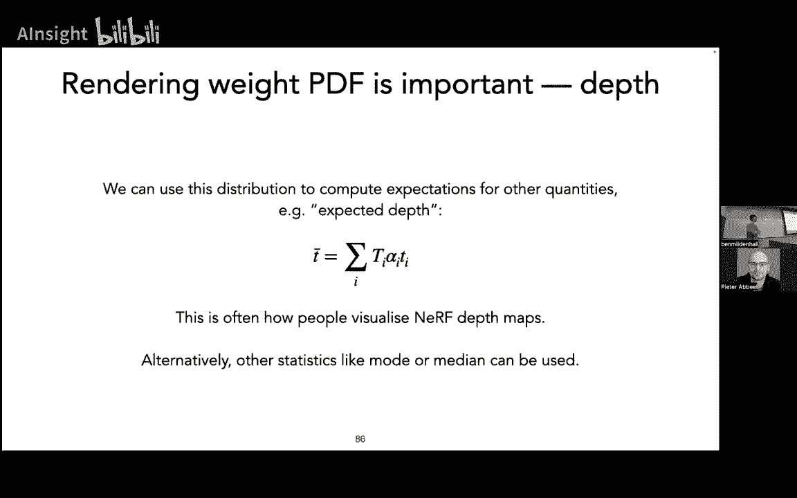

或者像顶部端模式，更好，因为你可以看到，像峰顶，在重量分布上更好，嗯。

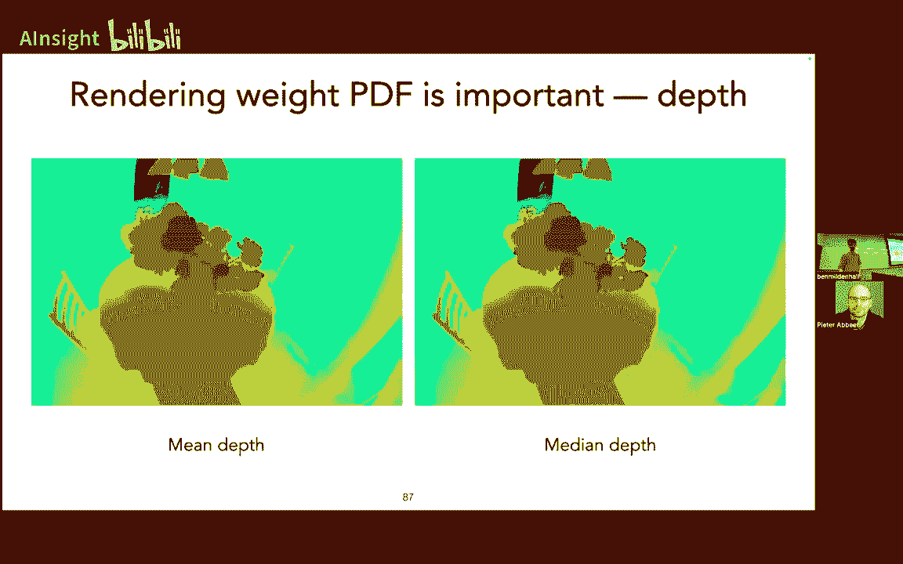

这是有趣的事情，在哪里，像在刈割角度，因为神经仍然体积化，你可以得到周围事物这种模糊光环效应，嗯，尤其是在重建东西如此精确时，它就像在现实世界中模拟这种效果发生，因为你知道与相机，像。

如果你有一个混合像素，那就是直接看和包含边界，它在某个足迹上进行积分，所以你确实会得到背景和前景颜色的混合，嗯，你大致也得到与神经类似的东西，它在事物的边缘产生部分透明光环，嗯以模型那个预过滤效果。

嗯嗯，所以是的，你不想在实际深度掩模中得到这个，因为你想要对应场景中真实点的深度。

这就是为什么我们要取，像中位数或模式，而不是仅仅平均值，是的，而且，我说，我们也可以用这个特征向量，人们已经使用这个效果来，嗯，将像clip或dino特征这样的抽象概念转化为三维场，在nerf几何之上。

以及只是颜色，然后你得到这个持久的三维场，你可以查询，嗯，你像有一个一个分割，它实际上存在于三维中，而不是像每个图像帧的东西，所以它在所有相机视图变化时都是完美的一致的，密度的另一个有趣的解释是。

你可以实际上取像，你知道密度场的方向，如最陡峭变化的方向，你可以将其视为一个定义表面的正常向量，人们经常这样做来从nerf中获取像正常向量一样的结果，因为梯度下降时几何体的演化方式。

实际上是它逐渐收敛到一种，非常尖锐的过渡状态，它通常与表面的法向方向非常吻合，非常精确，嗯，所以我认为这，这可能有一些额外的正则化来鼓励它做得更好，顶部的正常法向量，好的，这就是我所渲染的全部，嗯。

现在我想谈谈底层场景表示，所以体积渲染的东西就像，那主要是像数学，那是一个仍然存在的东西，场景表示是一个稍微有些主观的问题，就像这个一直在波动，类似于原始神经，然后MLP和后续类似的东西，导出。

各种不同的表现形式，你知道，当然现在像高斯这样的东西也有了，嗯，但我会稍微深入探讨一下，我们如何在原始Nerf中设置这个，并为什么它工作得如此，好的，所以这就是，这是调用的神经方面。

你知道的神经多尺度渲染，所以这里的想法是，这是一件真正流行起来的事情，在二零一九年左右，大约与深度sdf和其他类似工作一起，有几个例子的人这样做了，但这实际上是一种玩具，像。

我认为有一篇关于硬件的博客文章提到了它，而且，还有一些探索类似小论文的其他内容，关于在神经网络中表示图像和类似的想法，嗯，但是，这是一种思维方式，超越了像神经网络这样的想法。

它接受一个复杂的高维数据样本，并产生关于它的一些推断，这个想法是，进入这个网络的东西超级笨，它是一个2D或3D坐标，然后我们从中得到的是复杂的东西，但只有在总体上才是这样，所以我们必须基本采用暴力方法。

在许多的三维点上密集地评估这个东西来获取，它实际编码的形状，在单个点上的输入和输出几乎是没有意义的，对，它是像x y z到单个颜色和一个局部密度值，它什么都不告诉你，它只是通过整体，通过整个权重集。

以及所有输入和输出域你实际上会得到一些有趣的东西，在nerf的情况下，它是单个形状，所以像你从头开始，随机初始化权重，每次优化它都是为了一个新的场景，这也是另一个像是要人们转变思维的事情。

在展示给他们网络时，人们期望有大数据集，泛化等等，但这更像是一个三角形网格，本质上在这里服务的目的，嗯是的，所以这是一个如果你放入一个点，嗯，你会得到一些几何信息，如果你查询很多次。

然后你基本上会得到关于整个形状的信息，是的，嗯，好的，嗯是的，像刚才说的，这是一个它突然在所有地方出现的事情，我认为这基本上是同时发生在占有网络，Steve sdf，几篇其他论文，有许多nerf，同时。

许多人都有这个想法，让我们看看会发生什么，如果我们尝试将几何形状信息编码到神经网络中，就像，你知道，你可以将其解释为，哦，神经网络正在给你，像，决策的超级曲面，像，我是在室内还是室外？在三维空间中。

形状是什么？D um，这些作品中有一个共同点，那就是它们实际上都关注于泛化，而不是像这次单一的形状重建任务那样，他们经常展示一个玩具作为激励例子，比如，我们把斯坦福兔子融入了这个网络，但真正关心的是。

把每一个形状，比如那辆车，融入网络，嗯，这个想法已经存在于空气中，那就是你应该考虑一次处理一个场景，但它并没有被认真对待，比如，它能让你，并且你思考超越一个更合适的方法。

我认为其中一个原因是当时的lds，像真的像非常糟糕地代表它们试图优化的高频函数成分，嗯，在这里我们看到的是，好吧，忘记或忘记，三维什么如果我们只是回到二维图像，我们尝试解决一个网络。

从像素坐标到输出颜色，在这个案例中，对不起，在这个案例中，一个普通的mlp，你得到像这样的东西，这真的很烦人，因为这个网络有比图像中实际像素更多的参数，所以为什么想得这么糟糕，我们花了几周时间。

在神经网络的早期阶段，处理这个非常烦人的模糊效果，我们正在说，好吧，每个人都告诉我，mlp是十年的通用函数近似器，但像，那显然不是一个很好的函数近似器，像发生了什么，嗯，我们最初发现的事情，嗯。

基本上是，我们正在将这个二维非常低频网格通过这个，嗯，最初是，我们只是像，我们基本上是，好吧，我们正在将这个二维非常低频网格通过这个，嗯，Mlp 和期望获得一个非常高频率的信号。

这就像一张狼的图片或者什么的，这就像把这个像，你懂的，一个非常缓慢移动的坐标通过这个网络，并期望获得一个任意波形或者什么的在一，D um，所以她的想法就像，让我们只是给这个网络更多的频率像它。

它仍然可以是这个分析的东西那就是像已知的确定的映射，但是让我们只是帮助网络出来像增强，它的lipit，使它的梯度稍微疯狂一些通过给它一个更快变化的信号，如果你这样做，基本上只是放每一个，嗯。

每一个网格坐标通过许多正弦和余弦的增加频率，你实际上得到这个东西收敛，本质上像瞬间相比我之前做的，并且原来这里有很多像底层理论解释网络本身对输入的非常非常低频率成分有偏见。

并且如果你但是你可以实际上只是操纵那个，通过给他们这些更高的频率工作，嗯并且我，是的，好，这是一个数学大小，他有一个非常漂亮的高级，像，哲学解释为什么，这可能是这种情况，所以好。

如果我们考虑两个二维欧几里得点，我们放在一个网络这里，它们紧挨着，图像可以有一个任意高频率的变化，是的，你可以从黑到白，或者像穿过一个包含边缘这里，嗯，白到红当它碰到这个三角形。

但是输入基本上是不可区分的，像，你可以叫它们，你懂的，如果你用眼睛看它们你基本上看不到区别，所以好，这不惊讶网络也不能这样做，你可以做一个像，它不惊讶网络也不能这样做，你可以做一个像，好的。

允许有间断性的轨道就像是，它可以大致地适应这个事物，但结果是它只是像没有足够的轨道来，并且拼接起来以正确地适应高频率图像中的每个像素，嗯，所以这里的想法就像是如果我们提供这些额外的编码组件。

即使是一个小的偏移，如果你通过足够高的频率正弦波映射它，实际上你可以很容易地区分这两个点，低频成分看起来非常相似，但高频成分变化很大，这有点像将数的浮点表示喂给嗯，或者就像你知道的固定点表示。

这个数的one hot表示，你像是在给它这些成分，这些成分在空间中移动时波动得更快，比直接的浮点值本身，你得到这些非常漂亮的行为这里所以好，这只是在显示，如果你增加正弦波的最大频率，你将输入两个d坐标。

并完成这个图像记忆任务，这样你就可以得到非常非常干净的缩放行为，就像你提供的频率成分越多，训练损失就越好，所以这是ps r，所以越高越好，所以一旦你有psr，它就像四五，基本上完美。

"就像那个就像浮点数错误"，"像来自8位图像的量化误差"，"Um" 在中文中通常表示一种犹豫、思考或者不确定的声音，类似于中文中的“嗯”或者“嗯……”。它通常用于对话中。

表示说话者在组织思路或者表示同意、理解。这里的有趣之处在于，你也伤害了网络的一般化概括。这句话的中文翻译是："在这里，我们谈论的是一种有点奇怪的感觉。"，像"好的"。

如果我们看看在那些像离散实体之间的发生的事情，"对应于这些像素中心的网格坐标"，"我们看到的功能行为是怎样的"，"像像素之间的"，它变得越来越疯狂，当你给他们更多的频率时，因为本质上你喜欢。

如果你正在给予的频率远远高于，图像像素的实际喜欢音高，它可以过度拟合到这个信号上，并且基本上是噪音，并且它不会去做任何聪明的事情，如果你喜欢尝试通过，像2或4x等方式放大图像。

并查询在更密集的坐标网格上，这正在左边显示输出，它在两个x处查询图像，它被训练在监督的解析度上，嗯，所以你可以看到它开始失去理智，并且，像开始在像素之间产生大量疯狂的东西，随着你给予它越来越大的频率。

所以这里总是有一个像中间的甜蜜点，以及在我们仍然使用该位置编码的日子里，在MLPs中，很多东西都需要调整，你总是需要大致地调整这个东西，直到你不过度模糊，并且不，嗯，不过度。

像从给它太多工作量产生的闪烁别名艺术效果，是的，这是我们在关于削弱的后续论文中得到的结果，那篇论文更深入地探索了位置信码的概念，嗯，在削弱中，我们与试图找到的其它任务的原始论文在一起。

我们可以尝试将像样的句子塞进原始提交中，哦，这太一般了，这太酷了，你可以用低维网络来做这个，我们现在基本上把那个包装进了，我们后来发给专家的一篇论文中，有一篇傅里叶特征的论文，我们在那里有几个任务。

这有点像，这是一个编码，形状的sdf（距离场）所以并不完全与nerf相同，因为这是一个mlp，它从点到表面距离进行映射，给定一个通过3d形状的地面，记住它，你可以看到，顶部的东西基本上是质量水平。

你可以在dsdf或类似的东西之前得到，但要实际上获得正常的表面细节，你需要这种位置编码来在网络中增强频率内容，嗯，同样的事情，比如，我们做了一个玩具MRI任务，然后，比如一个玩具神经任务。

为了获取一些论文的指标，这像是，你知道的，这实际上是原始的场景，我们在一个NeRF上测试了这个方法，嗯，我一直以来都在为结果而挣扎，就像左边的那个，我当时在想像，哦，这个mlp东西挺酷的。

但是就像它不够高分辨率，永远不能像最先进的一样，就像这个东西在智力上是一个mlp很酷，但是它不像是一个实际的有用方法，然后你只是把这个位置信息编码东西放进去，然后你基本上神奇地解决了你所有问题。

几乎不需要额外的计算或内存要求，嗯，这有点像一种神经网络调制事情，这使得转换效果更好，嗯，这里我提到的像原始的nerf使用，从编码中提取的频率，这些频率是二的幂，嗯，在后续的工作中。

我们提出使用来自高斯分布的频率采样，或者什么的，你可能会想，这些只是参数，让我们也学习这些，我们为什么不直接那些，嗯，通过梯度下降以及mlp权重，这里的想法是像，结果表明，一旦你开始训练这个东西。

你基本上得到信号与底层参数化同步演化，你可以想象，如果你改变频率，它与输入空间坐标相关，以一种方式，它本质上放大或缩小物体的形状，你得到这个全局锁定，实际上，频率，也许初始化时可以稍微漂移一点。

但他们之间有全球性的依赖关系，在信号优化时，这意味着它们无法直接移动，这是马特的对这一点的解释，我一直在尝试理解他暗示的内容，但我没有完全理解，是的，嗯，是的，所以这里的想法是，好的。

我们可以做些什么让这个东西学习关于，也许我们已经不再有像全球正弦函数这样的全球特性了，也许我们实际上已经切碎了它，而且我们有更多的空间上局部的特征，我们可以学习，这里的明确解决方案是像，好的。

让我们回去，让我们获取离散化的面部特征，嗯，让我们像那样做，你知道的，也许一个特征的体素网格，我们通过它喂给mlp，作为学习的一种编码方式起作用，我们和许多其他人最初看到这mlp东西的原因。

正是这种三维的维度，对吧，网格对于图像来说是好的，你知道，人们现在开始感受到视频网格的痛苦，但是像它还算是不错的，你有一个时间信号让它变得合理，但是实际上没有很好的理由拥有一个稠密的。

三维网格采样形状在空间中，因为它们自然地非常稀疏，形状是像二维流形存在于三维空间中，拥有一个高解析度的稠密采样是完全浪费的，嗯，是的，嗯，方法，是的，是的，所以回到编码的事情。

人们使这些编码连续化以便它们相似于正弦波，就像，哦，你可以实际上只喂，嗯，一个三线性插值这些特征向量通过作为一个编码，并且这实际上工作得非常非常好，所以这是一个论文，嗯像，我不知道，像一年半。

一年半之后nerf，在那同一会议上有一个系列的像三个论文或四个论文，基本上像，去掉那个大mlp，只使用像一个一二八二五六q体素网格使用三线性插值，嗯，有一个小，嗯，mlp或一些激活函数。

并且这实际上仍然给你像高频率，足够的边缘让它可以工作得很好，并且回到这个想法，像三维网格的浪费性，人们已经采取了几个不同的方向，来减少这个事实并降低到像一个更可管理的规模，当你在三维中提高解析度时。

并且这些基本上是不同的稀疏表示方法，你可以申请数据，嗯，所以有像字面稀疏化，在其中你只是贪婪地优化，检查空白空间，然后我剪切它出来，所以你有像你的，你的精细网格分辨率，和那里有些更粗的分辨率。

你将会检查空间中的每个立方体，看看那里是否有密度，如果没有，你就说像这是无生命的，这里什么都没有，我再也不会来这里看了，我将创建一些加速结构，只标记所有像粗的。

空立方体当我沿着正确的样本路径遍历时跳过它们，并且只从实际几何形状的地方采样，人们将像迭代这样做一遍又一遍，在整个优化过程中，像每个，你知道，五万个步骤，只是看看，检查非空的空间，看看是否仍然真的很空。

然后记住那个，随着时间的推移，人们已经这样做过，这像是一个非常像，你知道，离散的纯粹东西，你必须自己实现并去暴力查询，哪里密度大，哪里密度小，有一些像中间阶段的东西，像这些低秩近似，人们会说，好吧。

我再也不会实例化一个三维体积，我将总是学习那个东西在一个低秩的因子化表示中，所以有像张量，Rf和一些相关的工作已经这样做过，他们会说，好吧，我可以像表示一个三维体积为一个低秩的外积产品，像，你知道。

三个一维向量，或像，也许一个二维平面和一个一维向量，像，我沿着z轴投影并抓住特征，"然后我将视线投射到x-y平面上，抓住另一个特征。"。

"And I like to add or multiply them together" 翻译成中文是："我喜欢将它们相加或相乘。"。

"And this works pretty nicely like the representation here" 翻译成中文是："而且这像这里展示的一样运行得非常好。"，尤其是这个。

"这个来自鸡蛋和三张纸的模型被称为三翼机"，这句话翻译成中文是："他真的真的坚持了很多生成性的工作。"，"因为它是对三维体积的一个非常干净、漂亮的表示"，"基于两个特征平面的一组"。

"Which you can just glue into a bunch of like existing image generation architectures" 这句话的意思是。

有一种方法或组件（通常指的是某种模型或模块）可以轻松地集成到多种现有的图像生成架构中。这里的“glue”是一个比喻，意味着将一个组件插入到另一个组件中，使其能够正常工作。

就像使用胶水将两个物体粘合在一起一样。这句话强调了这种组件的灵活性和通用性，它可以被插入到多种不同的图像生成系统中，而无需进行大量的修改或适应。"Uh" 在中文中通常表示一种含糊、不确定或思考中的发音。

类似于中文中的“嗯”或“呃”。它通常用于对话中表示思考、犹豫或同意等情感。另一种有趣的方法是这些被称为类似的东西，嗯，字典方法，好的，嗯，这不是，Ngp 可以说是最著名的类似或后续之一。

这使得合成场景的训练时间从原来的一天或两天减少到，像一两秒这样的时间，这是我们使用mlp时所需的时间，他们这样做的方式是，他们基本上将mlp的所有工作外包了出去，基于这个底层的空间哈希网格，嗯。

他们通过说类似这样的方式解决了分辨率问题，空间是稀疏的，所以我们可以使用一个非常激进的哈希函数，这个函数会让大量的点在空间中碰撞，而大多数点不会击中表面，所以碰撞会自然地解决，我们使用梯度下降。

它也会通过学习和优化自然地解决，非常不错，大致就像让事情自己解决，我们将给它一个哈希函数映射，并且它可以像使用这些特性来存储东西空间上，随着它的发展并解决碰撞，仅仅通过像最优化重渲染损失那样最好的方式。

是的，我明白，所有这些都有一个共同点，那就是它们最终实际上还是，通常在最后一天仍然是一个小型mlp，所以，特别是在人们想要表示出口的时候，比如，将视依赖的外观视为射线方向的函数。

他们会喜欢将这个信号通过mlp传递，同时，附带一个特征，或者，如果你想要有一些像外观编码向量或类似的东西，人们只会将这个视为空间记忆银行，用它来抓取一个特征，将那个与其他有趣的信息拼接起来，然后。

将那个通过小型nlp传递，嗯，是的，就像是在来回摇摆，我猜这有点像振荡，就像是与研究紧密相连，嗯，思考着像是这样，所以有一段时间我们觉得体素是不可行的，我们不能使用它们，这不会起作用。

但后来当我们尝试了体素后，它们仍然不是那么糟糕，只要我们对它们进行非常激进的稀疏化处理，或者使用这些学习稀疏化结构，所以它发展到了它们几乎像，你知道的，下载论文时像是说嗨，你甚至不知道到最后就像这样。

嗯，但这就像是，好的，当然像是这个基础的框架仍然基本上是相同的，像这个单一的视优化与体积渲染模型，并且像是的，这不令人惊讶，我们可以找到其他方式来表示这个信号，嗯，空间上，并且嗯是的。

这几乎像是每个人都还在这个种类的螺旋中，像是在尝试不同的代表形式以不同的组合用于不同的任务，显然在任务之间有很大的差异像，你只是在执行一个纯粹的优化循环来渲染一个单一的场景。

与那些像是我渴望从前馈网络输出三，D像是做出自己完全适合不同代表形式的任务，但他们仍然几乎像没有在任何一边达成共识，像是哪一个这些东西真的正在起作用，并且像这在过去的一年中被最清楚地展示，像是高斯灾难。

你知道的，所有事情都被重写为高斯版本，现在将会非常有趣看到，像是的，这个东西最终会走向哪里，像是有许多非常明显的优势，所以像是你有实际的离散粒子表示几何，我们看到，你可以使用光栅化和等等。

但几乎像有一个经典的，像欧几里得拉格朗日，权衡像，当你想要一个网格时，但当你想要像明确的粒子时，这已经在，像物理模拟世界中进行了数十年，我期待看到很多类似的来回交流和像，好的。

我们想在网格上得到一个结构化的输出是什么时候，我们想在这种松散的粒子集合上得到输出是什么时候，好的，是的，回到最初的神经结果，嗯，是的，是的，这又是最初的论文，使用像这个八层MLP体积，渲染依赖效果。

我们渲染了来自合成数据集的对象，我想像Blender Swap或Turbo Squid网格，因为当时没有这个数据集用于这些具有挑战性的对象，其中存在有非常复杂几何，并且有镜面反射。

我想到这个点性能已经大部分饱和，在这个数据集上，我们渲染了每个对象一百个视图，我们实际上最初渲染了四百个，认为有些并不足够印象深刻，减少到一百个，嗯，并且我想像，这些日子你知道。

PS RS像是三五或类似，人们应该停止使用这些本质上，嗯，但是当时是，这是一个巨大的进步，在之前的数据集的复杂性之上，是的，我们也有这些向前的任务，人们出乎意料地，有时我还使用，这主要是关于像。

我们如何处理无界空间，嗯，在原始Nerf中，我们实际上只有有像，将一个向前的体积压缩到一个立方体，使用像1/张量映射，所以这是我们关注的这种场景，嗯，我们有几个好像非常精心设计的，三六零渲染。

但这实际上依赖于事实相机指向对象，以一种方式你不看到地平线，如果你继续远离这个对象，实际上你最终看到地平线是一个彻底的混乱，并且，只有物体及其周围环境被构建得清晰明了，嗯，干净，好的，嗯，所以是的。

考虑到对原始nerf背后的东西的总结，嗯，我 kind of 做了一个 takeaway 滑块，谈论像，好的，这些之中哪些还是像，合理的结论，这些之中哪些像彻底过时了，我认为看这些四个属性很有趣。

其中一个是 mlp 对形状，就像我谈论过的，嗯，在 representation 部分，另一个我没有谈论太多像这个想法，我们将视依赖的外观封装到 mlp 函数映射中，这个优化的想法对一个场景一次。

而不是尝试泛化，嗯还有这个想法，当然我谈论了很多关于 volume rendering equation，嗯就像我说的，现在这是 nerf 提出的。

在 like united to to solid 中，嗯，在原始论文中，我们确实，我认为，是的，mlp 对形状，最终是愚蠢的，就像它是，它是，它是，mlp 能够做到这一点是相当有趣的。

但我认为非常不实际，本质上，实际上，mlp 是一个非常紧凑的形状表示，在原始 nerf 中只有五兆字节，与大多数离散化等价物相比，你可能有，有一种像更高层次的，像深度学习 takeaway 东西这里。

并且 nlps 实际上对低维空间信号是一个很好的正则化，所以人们已经开始利用这一点，就像我见过，你，你可能认为 mlp 对空间信号已经完成，就像没有人再会那样做了，但是人们已经接受了它。

对于这些基于变形和跟踪的工作来说，这是一个很大的进步，所以即使可能像底层场景表示仍然是一个职业，比如这种可变形的神经或什么，嗯，使用mlp进行跟踪的想法，好的，从时间t到时间t，再加一个，像。

这个点将移动到哪里，实际上它有一个非常低的频率空间特征，嗯，这个映射得非常好，我喜欢MLP对重构信号施加的那种平滑性，它编码，我们实际上已经通过深度图像之类的工作知道了这一点，人们已经观察到。

如果你取一个单位，你将随机噪声喂入它，然后你优化它以重构一个单张图像，就像我只是取左边的嘈杂图像，我将其用作一个单位的L2损失目标，就像没有任何其他图像一样，没有输入，除了噪声。

实际上你可以有效地得到它，就像图像的降噪版本，并且他们展示了你可以这样做，比如在绘画和超分辨率中，其他一种类似的任务，所以，对于这个像经验主义的现象，我们已经，MLP的empirical平滑正则化已经。

被调查得相当深入，我们更像是反复，惊讶自己，像，为什么这个东西不像，为什么场景中没有一堆垃圾漂浮，因为我们在尝试MLP东西之前已经尝试过直接voxel网格优化，你总是得到这种像模糊云的东西。

而这些只是令人不快的事情，就像漂浮一样。但是，MLP只有有精确的容量和平滑度来代表这些信号。以一种方便的方式。嗯，就像我之前说的，它实际上，它是相当紧凑的。嗯，信号表示，嗯，在记忆图像的情况下。

就像我之前展示的狐狸图像一样。实际上你无法使网络权重变得不足以适当地表示那个图像。并且让它与。就像JPEG或类似的东西，但是，我们注意到有一些有趣的事情，与我们使用NERF时类似，就像，嗯。

MLP的权重将小于MP4渲染的权重，我们从NERF中烘焙出像这样的东西，这实际上是场景的一个非常紧凑的表示，嗯，是的，并且再次与图像和视频有关，就像你用来压缩的代码书，它们就像非常精确地由人们工程设计。

它们工作得非常好，它们是为人类感知设计的，但它们不是原生的差异的，这就是问题，对吧，所以，如果你想恢复一个自然稀疏的信号，并且你从来不想实例化它的未压缩版本，所以，像你，你有这个密集的三维信号，你知道。

我无法负担得起制作，你知道一个像四千个立方体的体积，也许我是H1，不，但现在你可以，但并不是在八个GB或任何地方，所以你想要像，我需要这个东西有点不同，压缩的，在我优化它的时候。

MLPs非常适合做这件事，嗯，但是，是的，你知道一旦你得到了最终的输出，仍然有意义像，将其烘焙到一个适当的压缩格式中，你可以有一个像空隙跳过的结构，像密集地查询这个东西嗯，发送MLP就像对它的实际文件。

基本上从不有意义，哦，是的，嗯，是的，接下来我想提到的是，是的，这个使用MLP来防御外观的想法，我在这次演讲中并没有太多触及这一点，但是，这个问题还在争论中，基本上，你需要一个函数基础来代表，嗯。

球面上的颜色值，嗯，MLP与任何人尝试过的其他方法一样好，并且它比一些方法更紧凑，对吧，比如球谐函数，高频率的爆炸效果，球形高斯分布是可以的，但是嗯，原始的神经网络 MLP 在处理原始数据时表现良好。

我们将这些数据处理为密集查询，以场景中的单个三维点为例，查询所有出射方向并查看效果，当你这样做时，颜色的变化如何，如果你这样做于实际光滑的物体，你将得到像这样的一种效果，我明白了。

就像一种局部的白色亮点，在船的斜射角和水面上，这与你看到的那样相似，嗯，嗯，显式的参数化表示，如生活在球面上的高斯分布，好的，嗯，我认为这个逆向框架的想法，嗯，优化以进行单个相同的三维重建是非常好的。

我们已经看到它证明了可以扩展到极其庞大的场景，我从未做过原始的神经网络，我从未想过你可以用同样的框架处理，像更大的场景表示和更多的图像，并从中获得这样的结果，嗯，这像是谷歌纽约咖啡馆中的一家，我认为。

这是从一千五百张图像中提取的，它下面有一个大 NGP 网格，你知道，现在的高级演示已经膨胀到了两百兆字节，但最终，它仍然是相同的，只是随机采样的像素，嗯，将它们应用于 L2 损失，并优化二十五万次迭代。

你可以得到这样的重建，这真的很像与像前馈范式相反的一种方式，哦，我们想要输入每一张输入图像，并得到整个结果，这只是一种优化循环，是的，嗯，所以我看起来像一个一般的问题，像大图景的问题。

所以我认为神经网络在像压缩技术这样的基本方面非常令人印象深刻，它如何能够像捕获这种照片现实主义一样，它只是一个很小的 MLP，但我对像应用之外的神经网络如何处理感兴趣，例如，在机器人学中，例如。

当你有像动态场景这样的变化时，你需要每次场景变化时重新训练这个网络，就像我看到的那样，神经辐射，高跟鞋在机器人中非常流行，但我也对其流行度有些困惑，因为缺乏动态性，因为我的理解是，它基本上过度拟合场景。

就像它基本上学习到了一样，所以这就像是一种非常强大的压缩技术，嗯，所以你认为在实时中是否有可能使这种动态性，就像真实时间一样，以大约二十赫兹来说，三十赫兹，或者那是否可能训练神经网络更新那个低音，是的。

我的意思是，就第一个考虑的方面，比如制作动态的，实际上需要有大量的后续工作，那只会添加像形变场，或者像分离组件并单独移动的能力，所以那些东西是，尤其是与高斯相关的东西，就像一堆点，所以您可以自由移动。

东西，您可以解决，例如跟踪，例如感觉保持事物在三，D所以每个对象，您可以想象解纠缠，"如果你有足够的观测数据，比如二十或三十赫兹"，我认为这像是另一个问题。"像人们一直在推"，"像一段时间一样"。

"他们正在努力工作" 或 "他们正在忙于工作"。具体翻译取决于上下文，但通常可以理解为他们正在从事某项工作或任务。像NERF类型的撞击物品，现在。

Gaussian类型的SLAM（Simultaneous Localization and Mapping）算法，实际上可以运行得非常快。"那些主要是为了绘制静态场景"。

我认为像这样实时处理和跟踪可变形物体的工作是更难的。我已经看到了，实际上，一些人使用多视图相机设置取得了一些结果，他们正在流媒体视频，你可以像，你采取每个多视图步骤，嗯。

然后您对几个梯度下降步骤进行快速更新，就像重新定位东西移动了一样，或者可能像重建场景中出现的新东西一样，嗯，我认为它还像，我，我嗯，它不是，这是，就像是我喜欢的基础级别，就像得到这样像冷冻的重构。

它的几何形状压缩后实际上并不是那么有用，甚至没有告诉你像什么功能，以及场景中可以移动的东西，以及那些东西，所以是的，我认为基本上像你说的，你需要更多的数据在上面，那样像启发式地分离组件。

或者像跟踪它们随着移动，以及那些东西，所以在这种情况下，如果它主要是有用的，像静态的，像你说的，你认为这对下游应用有哪些有用的影响，像，是更像ar和vr，还是像，是的，我认为这不太有用。

我认为主要是在那，它激励了在，像，其他更好的管道中做像糟糕或解耦的事情，或者那些东西，我认为这基本上就是一个学术问题，它激发了很多在三维表示和重建方面的改进，在一种方式上。

它像自己的这些更有用版本一样传播开来，基本上就像我认为，如果有这个东西烘焙出来，它就像基本上对于制作这些有趣的视频是有用的，也许像卖房子，但如果对其他东西不太有用，嗯是的，看起来有趣，但是，它非常。

它非常学术，本质上，是的，我认为那是完全正确的，嗯好，嗯好，是的，是的，我就要去看四个更多的幻灯片这里，嗯是的，所以我想在我的小自我评估表这里，我认为，嗯，这个问题的体积渲染最终点。

我认为这已经证明了自己，对于做重建和优化来说是一个非常有用的范式，我们基本上已经看到了像样的大多数东西，现在声称他们在做硬表面优化的人很多，实际上优化一个由硬表面参数化的体积。

像我们看到的这种sdf类型，类似的东西，可以将sdf转换为体积以优化它，我们只是看到像样的属性，如果你想从零开始，没有任何关于场景中物体位置的信息，除了可能一个边界框之外。

这就是它收敛得如此干净、快速且可靠，嗯，我很难想象，嗯，通过初始化表面方法来使其工作，尤其是在像这样的场景中，你的位置在哪里，你在场景中的中间放一个球体在哪里，我希望它能膨胀到整个房间。

就像我想的任何种服务，通常结果都是由下游处理产生的，从像您开始与体积优化一样，然后可能您将其网格化，并细化它，嗯，所以是的，我认为这种体积化东西真的很强大，那就是这样，基本上在几年之前就已经开始发生了。

如果我们看到使用合成的许多不同的信息流，我们正在使用的体积重建方法，以及像单形状再生方法一样，在非常小的低分辨率体素网格上，我们正在使用类似的数学公式，所以那更像是一种一直在发生并持续到现在的潮汐，嗯。

我认为这是一个很好的停止点，嗯，结束。

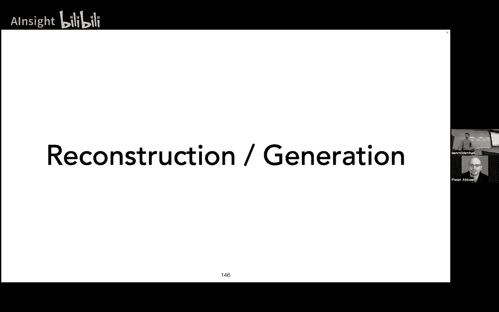

切断这个，我通过了nerf滑梯，嗯，没有未来的滑梯。