# P5：5 GANs - AInsight - BV17W421P7QA

如果你看了幻灯片，我们，今天有很多内容要讲，我们一节课有 285 张幻灯片，呃，有些幻灯片的节奏会比平时更快，但，我想我们，今天会成功的，我们’ 我们将研究，隐式模型 SL 生成，对抗。

网络 这是我们将要介绍的内容的概要，嗯，有些内容，比其他内容更详细，但是，对于，所有内容，您都会在幻灯片上找到参考，所以我们将从一些内容开始，动机和隐式模型的定义，所以这是几年前的一条推文。

Gans 的发明者 Ian Goodfellow 发布这条推文是为了展示，Gans 模型生成的样本质量的快速进步，从 2014 年开始，仅仅，四年四年 后来 L 到 2018 年。

沿着这条单线工作产生了，更高的分辨率、更高的质量。

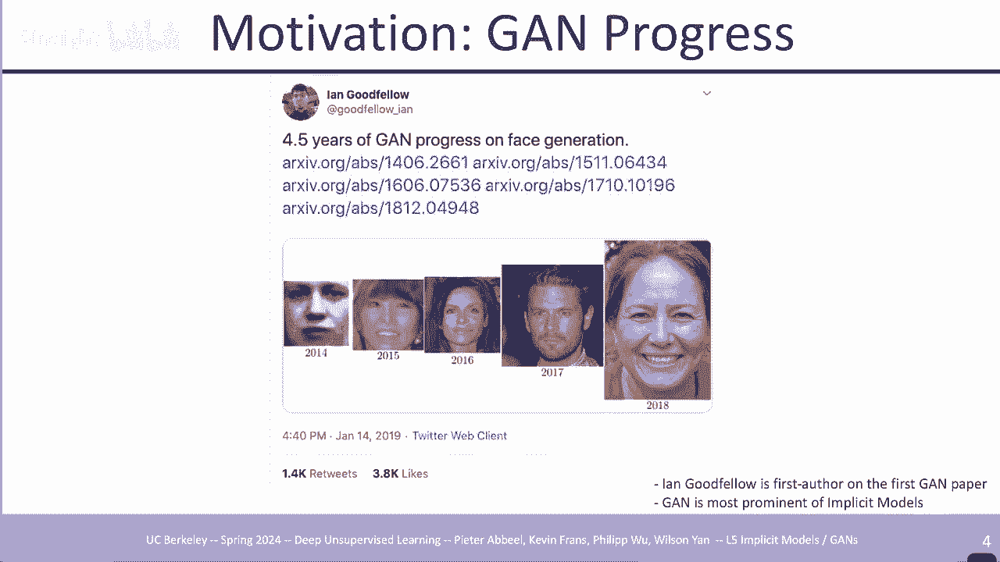

big Gan 2018 年是 Gans 的，成熟时刻之一，因为 DeepMind 训练了一个比以前，更大的 Gan 之前接受过训练，因此，几代人都比，以前好得多，并且。

在当时真正确立了 Gans 作为，呃流行的 IM 生成方法。事实上，我回到了 2020 年的讲座，在 2020 年的讲座中我们说了一些东西，今天的所有图像生成都是用，甘斯完成的，这是。

2020 年的正确说法，嗯，所有其他方法都，有点你知道的有前途和有趣，但现在没有用于图像生成，今天大多数图像生成都是，用扩散模型完成的 我们将在，下周介绍，但是甘斯也可以，生成非常好的图像，我们。

今天会看看，事实上，一旦，我们查看扩散模型，您就会发现，这些扩散模型的一部分，实际上在 hood 嗯，两周前推出的 Google 移动扩散也使用，gan 来显着加快，生成图像的能力。

因此 Gans 仍然，非常重要，即使它们不是您，知道的图像生成一站式商店，它们是当今一些最好的图像生成中非常重要的组成部分。

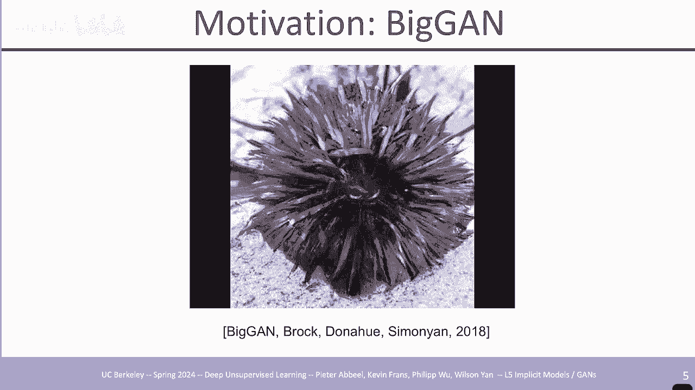

这是甘斯发生的有趣的事情之一，嗯，当然在底部有，甘斯背后的方程，我们，很快就会详细介绍它 还有，这个图像的签名，嗯，是，由某人生成的，然后在佳士得出售它，因为你知道第一个，出售的人工智能视觉艺术。

他们赚了，很多钱，他们没有发明，甘斯，他们没有编写代码来做，这个嗯，他们确实收集了，那种风格的数据，然后以那种风格进行训练，你可能知道这种风格适合在，传统艺术品拍卖行出售，他们的，成功非常。

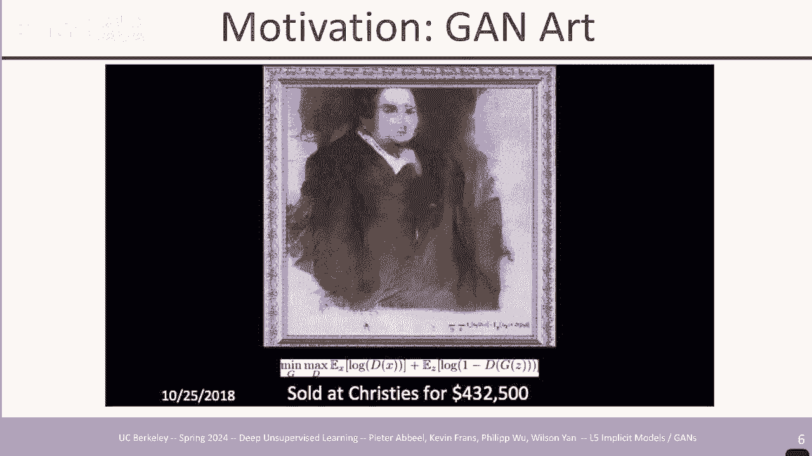

酷，到目前为止，在本课程中，我们已经，介绍了自动攻击模型流程，模型 潜在变量模型都有，自己的优点和缺点 嗯，这三个模型实际上都有一个共同的，方面，它们都是基于可能性的模型，你正在优化数据的对数属性，嗯。

今天我们将研究，一些稍微，不同的东西，所以 我们喜欢，生成模型的能力是能够采样，评估良好训练它们的可能性，并具有良好的，代表性，嗯，但是以甘斯为，起点，尽管，随着我们在讲座中的进展。

我们会得到其他一些模型，重点，是，如果我们关心的是，生成好的，样本，而我们下次再担心其他，事情，那么让我们专注于，生成好的，样本，这是高质量样本的最简单解决方案，您只需加载到。

数据集中即可从数据中随机选择图像，集，它是与，您的数据集质量相同的高质量样本，当然，这，有点无用，它并不能真正为，您提供一个允许您，创建任何新内容的生成模型，但如果您只，关心高质量 样本在。

某种意义上已经足够了，所以我们必须，小心，不要陷入这种，极端情况，因为我们试图创建一个，好的样本，这样你就不仅仅是想对，你已经拥有的确切数据点进行采样，你想要的 为了构建一个生成模型，该模型，可以理解。

数据点的基本分布并顺利地，解释整个训练样本，我放置与训练数据样本相似但不相同的样本，输出，样本代表，训练分布变化的根本因素，例如 也许，对于某些人来说，你会看到他们在前面，而另一个人你会从侧面看到。

也许一个有趣的样本，是你只有，正面图像的人，现在你可以，从侧面看到，因为这意味着，模型理解这一点，你从正面看到的东西原则上也可能，出现从，侧面看，或者可能是数字，嗯，你有，一堆手写数字，也许。

其中一个数字总是用，一支细笔或其他东西写的，但是，其他数字的厚度有变化，所以，也许你明白，哦，也许这个，其他数字的厚度也可能有变化，我可以开始生成，它，所以你希望，样本生成器以某种方式理解生成。

背后的因素，并且它们可以，生成不同的版本 嗯，你的训练，数据中有什么，所以在隐式模型中，我们将在这里介绍的模型，我们，从固定噪声源分布，均匀或高斯中采样 Z，这应该看起来，非常熟悉，然后我们将噪声。

通过深度神经网络传递到 获得，样本 X um 流模型 Vees 的，设置方式完全相同，这里不同的是，我们将在，没有，显式密度估计的情况下学习深度尼尔网络，因此我们不会，尝试找到 NE 网络 最大化。

训练数据的概率，我们要做的事情有点，不同，所以在一个隐式模型中，给定我们的数据，分布 um，实际上不是，给定数据，分布 X1 到 xn 中的样本的数据分布，我们尝试。

构建一个 采样器让我们称之为 qf ，它将，Z 转换为一个样本，其中 Z 来自，一些易于采样的先验，然后这个 qz 将引入一个，密度 um，它是我们模型，在，xace 中的密度 um 我们不会做出。

这样的假设 我们可以使用，流模型以任何方式评估 P 模型 我们能够，使用 VES 评估它 我们能够，积极地评估，它 我们能够在这里评估我们现在做出的，假设 它可以是任何 Neal 网络 将。

噪声本质上向量 Z 转换，为图像图像是，我们想要生成的图像，或者可能是语音，可能是文本等等，所以，对于这些 U 分布，我们没有明确的形式，但我们仍然希望，它们以某种方式接近 这就是我们的目标。

所以你可以想象，我们，必须找到一种方法，通过查看，生成的样本来调整 Q5，使，样本看起来像是，来自数据分布，因为这，意味着两个分布，变得很，接近，所以我们必须测量，P 数据和 P 模型之间的距离。

即使我们没有明确的 P 模型，所以我们不能直接查看它，因为它对我们来说不可用，所以 Ian 的原始 Gan 古德费洛，和合作者实际上是背景故事，尽管我们时间很短，我必须。

讲述背景故事伊恩在酒吧里发明了甘斯，他当时正在研究其他，不足为奇的学习技术，他们，只是生成所有这些像，模糊图像一样的东西，而他，甚至在等待 一个新的网络可以意识到该，图像是模糊的，并且看起来不像。

数据中的趋势数据，分布，所以为什么我不能使用，该 n 网络作为反馈机制，然后训练我的生成器生成，看起来更，真实的图像 嗯，这是一个高水平的想法，这是伊恩，嗯，他在蒙特利尔还是一名学生时做了这项工作，嗯。

从那里，他去了谷歌，然后睁开眼睛看了，一会儿，又回到了谷歌，嗯，这篇 G，论文有很多引用 几天前，我刚刚，从 Google Scholar 中截取了一张截图，如果你，写了那篇论文，仅凭那篇论文就。

可以让你获得超过 70，000 次，引用，而你，所有的论文加起来很难达到 70，000 次，我们写了，正确的论文，嗯，你可以得到 它是，用一篇论文完成的，你知道只要一篇，论文就，足够了，嗯。

现在的一部分是它，非常成功，你会，通过讲座看到，实际上，甘斯并不那么容易开始工作，所以有，很多 后续工作提出，了如何让它真正，成功越来越好的想法，嗯，因为刚开箱即用，它，并不是一直在那里，所以是的。

我想，关键的想法是你写一篇论文，这，是它的第一篇论文 类别有很大，的改进空间，有，很多人可以借鉴的正确想法，并且可以，添加一个分子，要么，你写那篇论文，要么你写关于该，主题的最终论文，这样每个人都。

可以决定这个问题已经解决了 这，是你写，第一篇或最后一篇关于某个主题的论文的两种方法，这是最好的策略，这并不，容易做到，我想这是最好的崇高目标，所以这是，对本次讲座很重要的方程式，我们将，看到 这是。

gan 模型的基础，我们将训练两个神经网络，一个网络 D 和一个网络 g g 代表，生成器，一个生成，图像的网络，让我们说让它具体化，这个类本质上将是 所有都是，图像，d代表判别器，判别器接收图像并。

判别它是否是，生成器生成的图像，而不是，来自训练数据的图像，所以让我们首先看看判别器，目标，判别器试图，最大化有两项 第一，项表示，当我从数据中采样时，期望期望值 Sally，我的训练。

数据在判别器下记录概率，所以我希望这是一个，高概率，所以我的判别器，将其视为某个 N Net，最终有效地输出一个 sigmoid，Z 和 1 之间的概率说，这个样本来自，训练数据的可能性有多大。

所以每当它来自训练数据时，我都会，尝试在输出上加上一个 1，这将最大化这个日志，因为如果，它是一个概率 从，鉴别器 0 到 1 是你，所拥有的范围，所以尝试一下你知道这将，努力对，来自我们的训练。

分布的数据进行 1，然后在另一端，鉴别器正在对生成的样本进行操作，并且，整个事情再次，被最大化 但这里有一个翻转的，符号，所以实际上这里它试图，将事情驱动到零，并试图，理解这是一个生成的，样本。

因此一个好的判别器会将，输出上的零概率分配，给生成的样本，并为，真实的概率分配一个概率 在训练，数据呃，样本上，所以这是一个鉴别器的工作，只是训练一个标准分类器，所以，没有其他事情发生，只是一个。

带有两个标签的标准图像分类器，它是真实的还是假的，嗯，零，本质上是假检测器，一个，是，真实的，好吧，那就是 一个鉴别器，正如，您在伪代码中看到的那样，这就是它的，全部作用，您只需训练一个分类器。

这就是它的全部内容，生成器怎么样，生成器只，参与，这里，它是做什么的，它试图，最小化这个 OB，我好吧，做什么，这意味着它本质上是在，对抗鉴别器，这是，最简单的思考方式，鉴别器试图将其，降低到零。

因为这将，尽可能满足其目标，但生成器具有，翻转的目标，所以它实际上是，尝试驱动生​​成器正在尝试将，其驱动到一个不是它自己的输出，而是它生成的图像，它希望，鉴别器认为它们是真实的，并且它做得越好。

越接近，将这个东西驱动为一个作为，鉴别器 将无法与，真实图像区分开来，这样它就会优化其目标，因此一种思考方式是，本质上你所拥有的就是你，所拥有的，当你训练生成器时，生成器生成的图像会被输入到。

一个恰好被，称为判别器的评分系统，然后你尝试，最大化你的分数，判别器，会试图对你不利，但是一旦，判别器被修复，你就已经，训练了一个判别器，假设，生成器只是想获得分数，可能使事情尽可能真实。

现在你可以想象这是一个，博弈论设置，所以一旦，鉴别器被固定并且生成器，在某个时刻开始生成东西，鉴别器可能会想要改变，他们的想法并说看起来，生成器生成类似的东西 这个，你需要以某种。

同步的方式对它们进行趋势分析，才能解决这个问题，所以，这里有一些复杂的情况，你知道在某些，时候，也许这个鉴别器做得更好，有时生成器做得更好，等等，现在处于平衡状态，因为这是，一种思考你要做什么的方法。

当你有一个 mmax 目标时，你试图在平衡处达到平衡，嗯，发生的情况是，生成器将生成，与真实数据无法区分的图像，而，鉴别器是最好的事情，当一切都是 50/50 时，它可以做的。

就是在其输出上输出 50/50，这样，该特定公式，判别器的平衡最终达到 50/50，生成器，准确地生成，与训练数据无法区分的内容，现在你可能会说，与你知道的训练数据没有区别，然后你生成精确的副本等等。

从某种意义上说，有些，选择是正确的，这个鉴别器，不会记住，你不希望它记住的训练数据，能够记住一个火车，你希望它，成为一个新的网络，你知道，权重，在某种意义上捕获了，训练数据的本质，但，并不真正记住训练。

数据，这就是你最终取得，成功的真正原因 从，判别器的角度来看，它无法，区分真假，另一种思考方式是，设计者判别器确定你，知道，如果你将，判别器设计为只是一个存储器，你最终会得到什么样的平衡 那么。

你最终只是重复，生成器的训练数据，但这，不是你想要的，但是如果你，在判别器中做一些更正则化的事情，最终会得到，更好的结果，关于这个方程的任何问题，好吧，让我们看看我们能做什么。

所以这个 就是它看起来的样子，嗯，从，某种意义上来说，当你在，这里训练时，你正在训练，你知道，你有生成器在这里，然后，鉴别器在这里和这里，嗯，因为你有两个管道，所以你，有假数据管道，这是，真的。

这是假管道，两者都，经过这个管道，都击中了，鉴别器，但假的只，相互作用，呃或或由，生成器伪代码生成，好吧，你采样，一些噪声，然后，用生成器，从该噪声中生成一些数据，然后你 更新，鉴别器以最大程度地擅长。

分类区分假，与真，然后对于您的生成器，您再次采样一些噪声，将其输入，到生成器目标中进行反向，传播并更新权重，以便从该噪声生成的内容，是根据 当前的，判别器被认为比以前更现实，所以从某种意义上来说。

它看起来很简单，但在实践中，博弈论平衡可能，很难实现，这就是很多，呃挑战出现的地方，嗯，我们应该这样做吗？这里的连接看起来很糟糕，让我们看看它在，做什么是的，我认为我们没有，足够好的连接。

来观看这个演示，所以，如果你愿意的话，你可以在家里做，但本质上，它以 2D 形式可视化了训练的方式，一个 gan 可以进行判别器和，生成器随时间演变的，判别器决策边界，并且，样本由生成器生成。

在简单的例子中，在收敛时随时间移动，您将看到，生成器将，粗略地丢弃该 2D 空间中的点 在。

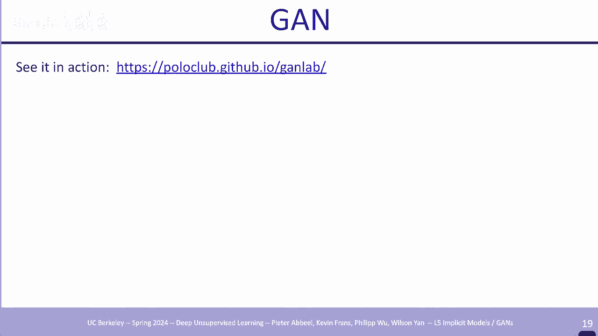

训练数据所在的区域，这些是 10 年前 2014 年的一些样本，嗯 amness，数字 嗯，面孔 嗯 我认为左下角是 C，远，这也可能是 C 或者可能是，某种严重下采样的其他，东西 图片网嗯，所以这在。

当时非常有希望，现在看起来，不是超级锐利，嗯，你，想好吧，与你今天的状态相比，这不是一个很好的结果，但，当时这看起来，比 之前的任何事情，你很快就会得到。

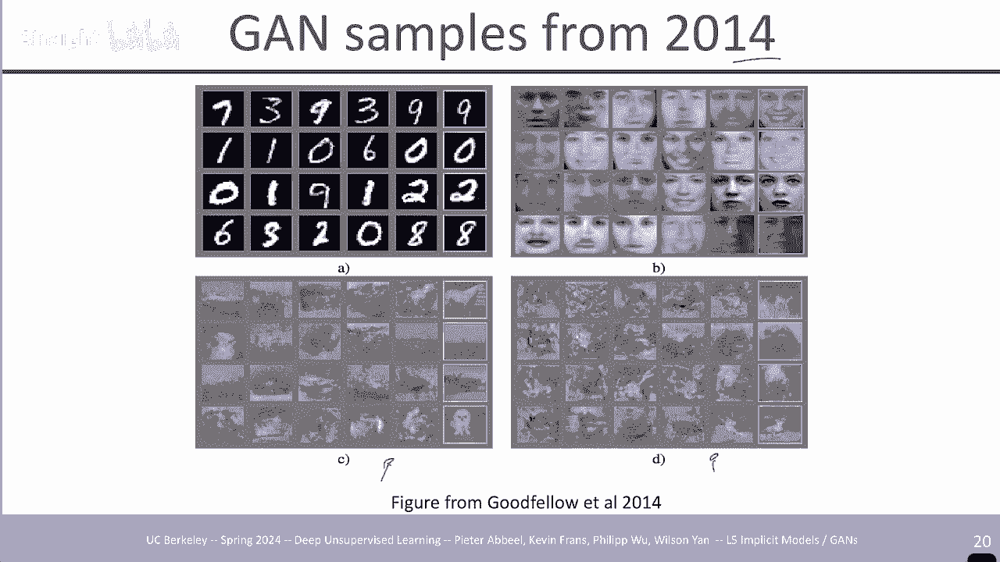

一些直觉，为什么现在如何评估，甘斯的评估实际上仍然是一个悬而未决的问题，部分原因是如果你只看，目标正确记住我如何，描述均衡时的目标，有一种奇怪的状态，判别器就像，50/50 并且你应该生成。

看起来像训练数据的东西，但这是什么意思，就像，没有一个像分数一样告诉你，你做得有多好只是 平衡，这样你就不会像，其他模型那样获得分数，这些模型具有很好的对数道具，分数，可以了解它们的，表现如何。

那么除了在事情还没有发生的早期观察结果之外，还有哪些替代方案可以，评估，在较低维空间中完成，嗯，因为计算量较少，人们经常将核密度，估计器视为嗯可能性的替代品，你在那里做什么，本质上核密度估计器，说。

如果我有一些样本，例如一维，样本，我这里有一个 SLE 这里和这里，你在它周围画了一个高斯分布，然后你，说我的分布是，这些，高斯分布的平均值，这就是这个东西的作用，所以如果你能做的就是生成样本。

你可以说我只是要生成，一堆样本 然后在，它们周围放置高斯，这就是我的密度，现在我可以评估，我的训练数据的对数概率，甚至可以评估，我的样本正在创建的密度下的验证数据，这样你在再次训练后就。

有了一个样本生成器 使用样本，生成器获取其周围的样本 Gan blob，然后您可以评估，原始数据的对数属性，嗯，您所采用的窗口宽度，可以很大程度上影响您最终得到的结果，较宽的窗口将使其在较窄的窗口中更。

平滑 窗口会让它变得，更加颠簸，嗯，在一天之内，很，容易目测正确的宽度是多少，才能在更高的维度中获得干净的结果，你可能会遇到更，困难的时间，嗯，但你可能，可以运行交叉验证。

你可以说我采用了一系列不同的宽度，呃标准差，我尝试了，所有这些，看看哪一个做得，最好，然后就按照，我应该拥有的，密度运行，当时对手的网队，实际上做得，很好 嗯，与，当时的其他一些最先进的模型相比，所以。

在低维度下，这实际上，给出了一些不错的，分数，因为人们在，一年后开始更深入地挖掘，嗯开始，意识到问题是，当，你不断采样时，它 似乎你，并没有真正填充这个空间，在这种，情况下，如果你，完美地训练某些东西。

他们知道地面真相应该是什么，并且他们看到，他们不断从他们的训练，游戏中采样，他们永远不会接近他们保留的东西，离它很远，所以在，你的训练数据周围放置这些高斯凹凸，现在并不能完成工作，我们。

从上一讲中已经知道这一点的一种方式，是，如果你在像素空间的，图像空间中的图像周围放置高斯凹凸，你将，许多完全，不切实际的事物上的概率质量，因此您永远无法获得，超高的对数概率，因为您将。

概率过于分散在不切实际的事物上，只是通过将，gussan 放在，您，生成的事物周围的定义，这样人们就来了，又一年后发生了一个叫做“初始分数”的东西，所以这个，想法是好的生成器生成，语义上，不同的样本。

因为这是，甘斯问题的一个重要部分，因为，判别器强制函数会，生成逼真的图像，但，有时 它们彼此非常相似，多样性太，有限，这意味着您没有，覆盖数据分布，您，只是，有效地覆盖了一些与您非常相似的数据点。

因此这是评估的好方法，你的 Gan 在，捕获数据多样性方面是否做得很好，本质上是看 um，当人们在 imag net 上训练时，看看分类，标签，这样你就可以训练你的 Gan，生成样本，然后运行。

image net 分类器，在本例中，有一个名为 Inception 的 IMET 分类器，它是一个特定的 IMET，分类器网络，使用 Inception，网络对生成的，样本进行分类，如果生成的。

样本得到正确分类，那就，太好了，但现在你必须进入，并 检查，所以这并不理想，所以作为替代品，人们所说的，自动实现这一点，让我们看看，分类器是否对，每个样本来自哪个类有信心，以及如果。

生成的每个样本都被自信地，分类为千个图像，网络之一 分类那么这意味着，Gan 生成的图像不是，您想要避免的不同类别之间的奇怪插值，而是实际上生成属于清晰类别的清晰呃，图像，而且如果缺少类别，它也会。

给您带来糟糕的初始分数 你，可能完全缺少某些类别，从而降低你的分数，所以，这可以确保你，覆盖所有类别，至少假设，Inception 分类器相当，准确，那么这意味着你，覆盖所有类别，嗯，当。

你在一个班级中时 你，对此很有信心，这意味着你有一个非常好的，代表你，生成的类，好吧，这里有一些小，推导，因为我们有 285 张幻灯片，要涵盖，我让你自己完成这个，推导，但你已经了解了主要，想法。

并且 那么人们会做的就是，他们也会说，让我们观察一下，看看，Inception 分数，看看 Inception，核心 Inception 分数的改进是否，与我们的观察一致。

对我们训练的一些呃某些 Gans 感到更高兴，所以 您，实际上还可以做的一件事是查看真实，数据，真实数据的异常分数为，11。24 um，我们的方法这又是，8。09 时的论文，所以不完全是。

真实数据的位置，这意味着，可能仍然存在大量，在那篇论文中训练的 Gan 仍有改进的空间，但它，比以前的一些，图像图像生成学习方法做得更好，这，在，当时是最先进的，现在，你可以做一件事，你可以说嘿。

如果 如果你真的，针对 Inception 分数进行优化，那么它，仍然存在一个错误，这意味着，原则上你只能生成，每个类别的单个图像，因此，有一千个不同的图像，并且，你只生成这千个图像。

而每个类别中没有其他图像，会很尖锐，他们将明显，属于一个班级，所以你有一个很好的，初始分数，但你没有任何，你也想要的班级内多样性，所以自由的初始距离将，其添加到评估中，这表明，你也要去看看 本质上是。

某一层中特征的平均值和中心，因此，您将处理的初始网络而不是仅仅查看，某个，有趣层的分类，您会说让我们看看，该层中 Fe 激活的特征并计算第一个 和，该层中的二阶统计数据，并将，真实数据和。

生成的数据进行比较，如果第一和，第二统计数据紧密匹配，那么，我们可能做得更好，并且，明智地与这个，分数进行比较，实际上这个分数似乎反映出，你做得更好 当你，在这里有更好的分数时，这实际上是一个距离。

度量，所以你想要，更低以，做得更好嗯来展示这个嗯这是一篇，2017 年的论文嗯这是，Inception 距离中的 Fret，所以这就是我们，刚刚讨论的那个 还查看了。

Inception 分类器网络内的这些统计数据，您可以看到，当我们从左到右放置更多，扰动时，FID 会上升，这意味着情况会变得，更糟，因此确实会出现更差的图像或一组，更差的图像。

比一组更好的图像更差的分数，这正是，我们所希望的，相比之下，原始的起始，距离保持平坦或上下颠簸，所以它并没有真正按照，我们想要的方式捕捉到这一点，认为 FID 本质上是一种，更高维度的方法，用于捕获。

您正在生成的数据的质量，以及您正在生成的数据的多样性，因此更精确，评估成本也更高，一些，好吧，那么再次快速的关键部分是什么，采样正确，网络可以是任何东西 没有，限制 不一定是流。

没有任何特殊属性 它只是一个，网络，通过正确的设置从噪声到，希望真实的图像，参数直接针对，您关心的感知质量进行优化，正确的样本中，这是直接，优化目标，它看起来在，感知上与我的训练数据相似吗？呃。

我们没有任何推断，即我们，无法评估这些概率是的，我谈到了这种你知道的，pars 和窗口高斯 blob 方法，仍然可以做到这一点 低维度，但是，一旦你进入高维度，我们通常关心的是，没有这样的东西，可用。

是否有一个问题，我们使用 Inception 的行为原因，或者，就像我们使用，Inception 网络的原因一样 是，当时最先进的网络，所以当时使用它是很自然的，人们一直使用它，因为，比较保持一致。

这样嗯，现在有更好的分类器，你，可能会说也许我们应该使用 新的，分类器，但是你如何将，你的数字与之前的数字进行比较，你必须，有效地，重新运行所有旧的东西，然后看看，你落在哪里，所以嗯。

我想这是一个足够好的，网络，人们还没有，说我们需要为这个特定目的使用更，了解的最新网络的动机，是的，你如何产生优势是的，我们如何确保，生成器为所有千个类别生成图像，嗯评估指标检查，这一点。

但是当然 我们不会直接针对，它们进行优化，我们，稍后会在课堂上讨论这一点，这，实际上是 Gans 面临的一大挑战，并且有很多技巧，试图确保这种情况发生，但，我们没有讨论过这些技巧 到目前为止，但这正是。

促使人们将，扩散模型视为，甘斯的替代方案的确切原因，然后从，那里开始，是的，如果你将估值分数放入目标中，这是一个很好的问题，Gan 它会改善吗？它，肯定会改善这个，目标，我不知道它是否会，提高生成质量。

这，不是，非常明显，是否会，嗯，我会说，如果人们已经，投入培训机制和 我们，稍后会看到它们，嗯，但从来不完全是这样，也许是，因为他们希望有机会，仍然有一个干净的评估，但，肯定相关的东西已经被，包括在内。

是的，什么确保了在，纬度空间中的东西是，一起的，是的，怎么做 我们确保，潜在空间是有意义的，附近的事物具有相似的渲染效果，到目前为止，这本质上，只是生成器网络，是一个神经网络的事实，因此您知道。

它处理附近事物的方式，更有可能发生 最终会出现，在附近而不是远处的事物，但，在当前的公式中并没有太大的压力，在以后的一些公式中会有更大的压力，很好的问题是的，最后一个就像在上一章中一样，就像。

自动编码器一样 例如，你可以通过，你正在学习的分布进行插值，但是，因为你不再有爆炸，分布，你不能再做，这样的事情了，所以你仍然可以，插值嗯，所以这一部分的两个部分，是如果你' 在生成样本时，您。

仍然可以在 Z 之间进行插值，然后在两者之间生成内容，现在它实际上非常有意义，如果您有真实的图像，那么，您没有疾病，因为没有编码器网络，至少不是迄今为止制定的那样，稍后会有一些具有，编码器网络的版本。

但，到目前为止，还没有编码器网络，因此，无法在真实图像之间进行插值，所以让我们看一些，可能有助于激发，我们刚刚做的事情的理论 从几个额外的角度涵盖了嗯，所以鉴别器应该在，两个分类，标签真实与。

生成之间做出决定，现在想象一下一维情况，我们有一个以绿色显示的模型生成器分布，然后是用，点和显示的数据分布，它们非常接近，嗯，因为也许，我们生成的数据开始，非常接近我们的训练，分布，现在判别器看起来像。

一个最佳判别器，一旦，分布重叠，它就，不会为零 有些地方在，另一个地方将会有一个逐渐的，过渡，当你查看对数概率，目标时，如果你试图最大化，你的鉴别器的对数概率分数，如果鉴别器，不确定它实际上会导致什么。

那么基本最优的事情要说，准确地输出它是专业人士的正确，概率，因此例如在，这里，它几乎可以，保证是一类，因此它将，接近于一，但是一旦两个，类都有概率，就会，逐渐从一转变为零，这是最佳的。

鉴别器要做的事情就是，设定目标的方式，它被，激励输出，每个类别的精确对数概率，因为，例如，如果你降落在这里，我们，上升，那么看起来绿色大约是绿色的，两倍 蓝色，所以你，想为，一个类输出 1/3。

为另一个，类输出 2/3，这是正确的输出，所以我们实际上可以重新审视，Gan 的博弈论公式，然后尝试，解决它，因为 我们知道，最佳判别器应该输出什么，我们，实际上可以以封闭形式有效地，尝试解决这个问题。

这当然，假设判别器不一定，是神经网络，因为这样我们，必须通过权重来做到这一点，这，更难，但只是 作为一个思考练习，如果，判别器不一定要使用，神经网络中的权重来做出，决定，但它只是开放式的。

可以做任何事情，一旦完全开放式的，可能性，它会在，最佳情况下做什么，嗯判别器作用于 gz 和，在 X 上，我们将，生成 um 样本的 gz 写为 x 呃，我们，在 X 的整个空间上积分，然后根据。

生成该样本的概率进行等待，我们没有可用的 PGX，但，我们 我们只是在这里做一个理论练习，所以现在我们得到了，这里显示的类型的目标，在，这个，特定的 X 次对数鉴别器 X 的数据下有一个概率，然后在。

该 x * log 1us DX 的生成器下有一个概率，如果你，这个 本质上是这种，类型的方程 a log y + B * log 1us y 你，对 y 进行了优化，因此 gr 或，导数等于 0。

你得到 y star，等于这个，所以我们可以，用原始符号在这里做同样的事情，我们发现最佳，判别器是这样的，所以如果我们知道 P，数据和新的 P 代 PG，我们可以用，这种方式写出判别器，这，就是它试图。

去的地方，我们将继续我们的思维，练习，并将其填写为 这是，我们的目标，为什么我们不将其填充，到我们的目标中，即最佳形式，这，就是为什么星星在这里表示，最佳判别器，我们没有，可用的判别器，但我们可以考虑。

如果我们碰巧达到了会发生什么，嗯，我们填写它，我们可以在，这里查看它，它真正说的是，生成器正在优化的目标，假设鉴别器总是，立即跳转假设你是，生成器鉴别器游戏，我们说，鉴别器总是立即，跳转到 相对于。

您的数据和当前生成器，状态的最佳事物那么生成器正在做什么，生成器正在优化这里的，目标，即 KL 两个 kls 一个，从数据到数据平均值并，生成另一个从生成，到平均值 现在，记住。

在我们到目前为止所涵盖的基于可能性的模型中，我们在这里使用的表示法中应该是 KL P 数据 PG，它不在那里，它是不同的，但它有一些相似之处，这，可以给你一些 安慰的是，也许。

我们正在努力追求的平衡是一个，非常好的平衡，因为我们，得到的东西是，k um 理想情况下这些分布，在平衡处重合的，这确实是如果我们完全，优化它的话，我们会让生成器达到的效果，确保这两个 K 都。

为零 好吧，现在让我们，看看这些 K 的真正含义，这样，我们就可以将 K 数据传输到 G 我们可以有一个，翻转版本 抱歉，我们，可以有一个来自 G 的翻转，版本，然后我们可以把这个放在，上面。

这是一个混合版本，它，在两个方向上进行，但它，不仅仅是两个方向的平均值，因为，在条形图的另一侧有一个，平均 ALS，就像在两个，地方取 K 进行平均 在两个方向上并对，双。

条后面的东西进行平均让我们通过，一个简单的例子来看看这意味着什么，如果你，正在做，常规的 K ，到目前为止我们倾向于，用我们的生成模型来，最大化 log prop 与，这里的这个比例相对应，假设。

基础分布是，有两个凸起的蓝色曲线，你，试图将它与绿色曲线（，一个高斯凸起）相匹配，将会，发生的情况是，嗯，你会尝试，放一些 概率无处不在，为什么，是因为如果任何地方有一个，来自 P 的数据点在。

Q 下的概率为零，那么您，在此目标中达到负无穷大，因此 Q 必须在，P 具有非零值的任何地方都具有非零概率，否则，如果您 翻转，它，然后会发生什么，因为 Q 是，我们，选择的。

而 P 是固定的 p 是数据，你实际上会得到相反的效果，你尝试将 Q 放置在，p 下的概率最高的地方，如果你让它退化' 实际上会，变成一个超级高的窄峰，就在，你的 p 最高的地方，这就是会发生的事情。

所以这被称为模式，寻求行为，这是模式，覆盖现在，我们在这里所拥有的，在某种意义上是，行动中的两件事的平均值，给你一些介于两者，之间的东西，因为我之前说过，你可能很快就会有一些直觉。

为什么 Gan 生成的例子，比当时的模型更清晰，当时的模型，就是这种类型，你，在这里看到的是 当你有一个你知道常规的k时你的Q，你的模式你的Q，试图在任何地方都需要避免，零，所以会发生的情况是在。

两个样本之间的任何地方你都会，输入概率，除非你有，一个惊人的惊人的神经网络，完全理解事物应该如何，嵌入等等，您将把，很大的概率放在，不清晰的事物上，因为样本之间的大多数事物本质上，就像。

这些样本的模糊平均版本，所以如果您做一些模式覆盖，除非 你有一个非常有表现力的，网络，经过训练，非常，非常移动，当你寻找模式时，你会在这里有效地得到模糊的样本，你做相反的事情，你试图，变得非常敏锐。

但问题是，你只是试图复制 一个训练，示例就完成了，所以我们不希望，我们想要介于两者之间的东西，从某种意义上说，这就是 Gans，给我们的，所以这就是为什么他们倾向于，产生比。

我们迄今为止看到的模型更清晰的样本 至少，肯定是在较小的神经，网络，体系中，所以压缩的权衡你，想要确保所有内容都被覆盖，所以你需要常规的羽衣甘蓝，它是，良好，样本的模式覆盖，这会导致模糊，我们。

刚刚谈到了这一点，所以你也，不想选择一种太，极端的模式，所以我们需要一些介于两者，之间的东西，甘斯，现在正在提供有效的东西，那么如果判别器说，那么，你如何确保它仍然不会，崩溃 CU 这个博弈论，这。

看起来像真的，那看起来，像假的，为什么生成器不生成，鉴别器认为真实的所有内容，而只，关注那里，如果你天真地训练，如果，这是你，天真地训练的目标分布，这实际上就是发生的情况 如果没有任何预防措施，你。

基本上会在这些，不同的模式之间跳转，你将生成，某种模式，然后在某个时刻，鉴别器意识到是的，我知道真实，数据也在这里，但它只占真实数据的 10%，所以我 只会有，10% 的概率认为它是真实的。

90% 的概率，认为它是假的，然后你的生成器，就像天哪，它发现了我，我必须跳到一个不同的模式，它现在认为它是真实的，然后生成器领先了，一点，鉴别器赶上了，它不断地来回移动，所以这是。

训练这些的最大挑战之一，至少在它们的原始，公式中，这是，挑战之一，还有另一个挑战，嗯，我们谈到了这个鉴别器 这个，基本最优判别器说你，知道这正是收敛时的情况，如果生成器是固定的，如果，我继续优化自己。

我会变成什么，我们应该这样做吗？我们应该说做一个，生成器步骤，然后做很多，鉴别器步骤，然后再做一个，生成器 步骤是一个好主意或，不是在伪代码中肯定，没有完成它是鉴别器步骤，遵循生成器步骤并在。

两个步骤之间来回跳跃所以我可能会给，你一个可能不想，这样做的原因，不是，嗯，一旦你在某种意义上训练了一个鉴别器，太多，以至于无法，工作，那么会发生什么，一旦到处都有 01 输出，当，你。

使用鉴别器作为信号来，告诉你如何改进你的生成器时，它会到处都有 a01 输出，它只是说，无论你，在这个区域做什么，它都是假的，所以这个，生成器不再收到关于，向哪个方向推动其权重。

以获得更真实的图像的信号，所有信号都消失了，嗯，所以嗯，这，本质上是图形显示的 如果你，有 sigmoid，sigmoid 会饱和，那么你关心的 sigmoid 的导数，将为零，这是，有问题的，对于。

um 反向 uh 分类的另一侧也是如此，所以有一件事你 可以做的，是进行仔细的交替优化，确保判别器不会，变得过于自信，这样你就可以有，很多超参数来担心，步长、步数等等批量，大小来完成这项工作。

所以你可以想象 这不是一件容易，做的事情，但你知道这是，你，所做的事情的一部分，我们必须改变人们做的另一件事，这，可能感觉像是黑客，嗯，埃森只是，改变目标，嗯，你不喜欢，sigmoid 饱和刚刚得到。

消除你不喜欢的饱和度，因此，生成生成器的原始 Gan 目标具有 log 1 减去，D um，当，鉴别器变得接近，有效时，这是有问题的，在这种情况下，它，始终为零，表示它是 总是，假的，你用 log。

D um 代替它，所以这，部分已经变成了这里，这是一个翻转的，标志，但 Max 和，Min 也会翻转，一旦你，这样做，你就会得到很好的非零，导数，即使当 鉴别器，非常有信心你是一个，假的。

所以这就是相当，标准使用的 St，而不是最初的，目标，现在你可能会说，这很，有趣，你有这个美丽的游戏，理论公式最小最大，现在，它曾经是一个非 它曾经是一个，零和游戏，现在它只是非零和，游戏，它们不直接。

相互对抗，但，直观上它们，仍然相互对抗，因为生成器仍在，试图欺骗鉴别器，所以从概念上讲，它仍然在做，同样的事情，但它不再是一个纯粹的零和，游戏，但这就是它的，完成方式，那么现在我想做的，是逐步完成。

在原始论文之后引入的一堆新奇事物，正如您添加的那样 这一进展，基本上最终导致了，我们在，2018 年左右开始实现的非常优秀的一代，这让，大多数人认为这一切都，完成了，从现在开始，一切都将是甘斯。

现在我们知道这并没有最终，成为 是的，但是几代人的，质量都非常高，并不是说，质量不存在，只是，训练仍然有点困难，而且确保 Ash 具有，良好的覆盖范围仍然比，融合模型更难，但谁知道呢？

可能会在某个时候全面卷土重来，所以 Gan 第一次开始，表现出这样的迹象，实际上是，有效的，是 Alec Ratford 和，合作者 Alec Ratford 的一篇论文，顺便说一句。

Alec Ratford 也是，最初几代开放 GPT 模型的发明者，其中，嗯，但在他，加入 open ey 之前，他，在一家小型初创公司中做了一些独立研究，嗯，作为其中的一部分，他呃，他，写了这篇论文。

然后我们当时宣读了，open eye，我们说好吧 我们，需要招募这个人，因为你，知道这就是我们当时招募的方式，我们只是看到，存档中出现任何很酷的东西，好吧，这，是存档中的一篇很酷的论文，这是。

一段时间内最酷的事情之一，让我们确保，我们招募 亚历克要打开，人工智能，嗯，所以，它做了什么，嗯，它，开始认真思考，如何设置神经网络，架构来实现这项工作，这样你，就有了代码输入，然后你就有了反。

卷积输出嗯 所以它是，从 100，维代码有效地上采样到，图像大小的东西，但这是一种学习的上，采样，使其看起来像，图像这是生成器，这只是生成器，这正在，优化它可以欺骗的程度，然后，有很多，技巧需要完成。

我认为，这里最大的收获是，有时，这些技巧很重要，我会逐步，完成它们，但当，你需要做这么多，技巧才能获得结果时，这也不是很好。 一些有用的东西，因为某个地方的，一个错误可能会使其，脱离当然，嗯，不。

最大或平均池，嗯，这，在当时很常见，嗯，使用幻灯片上的转置，卷积进行上采样，这是鉴别器的特定选择下采样，使用跨步，卷积 um 和平均池，um Rue 生成器泄漏，你的鉴别器值，这，件事是有意义的。

因为你，知道你希望鉴别器，信号返回到你的生成器，并且泄漏值将比常规值有更多的信号，传播 通过，网络生成的值 um 10age，因为你想要介于负，1 和正一标准化像素值。

sigmoid 之间的值作为鉴别器，所以这，仍然是相同的 um 批量范数以防止，模式崩溃，这样有助于，引入更多变化 um 但它，也很奇怪 因为你会看到，来自同一批次的样本，之间会有奇怪的相关性。

因为批次号使它们，相互作用，但未应用于，生成器的输出和鉴别器的输入，从而减轻了，一点，然后是一堆，优化细节 顺便说一下，当时的批量大小很大，所以，考虑这一点的方法是，在本文中观察到。

今天更大的批量大小可以帮助您——虽然，很小，但只是趋势越大，越好，嗯，在那里发出了信号 嗯，是的，我会跳到，关键结果，有一个卧室数据，集，还有埃尔森面临的数据集，结果开始看起来非常非常，好。

这些是卧室的图像，看起来像是，你可以识别的真实卧室 一张床、一扇窗户、一扇门、一个梳妆台等等，在，这些，图像中，对于脸部来说都是一样的，这两个，结果就像跳跃和跳跃，超出了当时任何人。

用任何生成模型所做的任何事情，嗯，你可以，你可以与，它们进行插值 正如我们所讨论的，这是针对，生成的图像，您可以访问，Z 值，您可以进行插值以获得，有意义的插值，因此有意义的，压力并不大，但。

由于神经网络的架构，它确实变得有意义，image net 样本，32x 32 当时人们，甚至没有想到你，可以创建 imag net 样本甚至将，样本降低到这个分辨率也被，认为是哇这真的很令人，惊讶这。

可能你可以做印度 空间，算术我们在某个，时候用流模型讨论过这个问题，在这种情况下，你从，一个微笑的女人开始，然后，减去一个中性的女人，添加一个中性的，男人，这样你就改变了性别，最后得到的。

是一个微笑的男人，所以，这就是 清楚地表明这些，东西在插值时开始起作用，并且这些，添加是在嵌入空间的 ukian 空间中完成的，从那时起，人们，已经转而将所有，归一化工作保留在，归一化空间的圆弧上。

这给出了，结果稍好一些，但，在当时这又是一个令人惊讶的结果，这是，另一个结果，嗯，戴眼镜的男性，不戴眼镜的男性，不戴眼镜的女性，你将其结合起来，给，女性戴眼镜，顺便说一下，如果你这样做的话。

这是一个比较，像素空间，所以这是，像素空间中的插值，这显然看起来，不太现实，所以我们，在这里看到的是，新网络正在学习，一些有关图像结构的知识，并且能够，在其世代中反映这一点，嗯，你可以嗯，是的，这。

更多 在这种情况下，我们，看到了一些例子，他们，在顶部进行了分类，所以你可以做的，是，你可以使用你的鉴别器，然后向其添加一个额外的层，并使其成为，你关心的任何类型的分类问题的分类器，训练来分类假与真。

但事实证明，通过注意，它经过了很好的预训练，还可以，学习分类为其他，类别，嗯，当时任何生成模型的样本都令人难以置信，此时人们知道可以制作甘斯，与正确的，架构和训练，细节很好地配合，不仅是好的样本，而且。

插值也很好，并且表示正在工作，您可以，从插值以及分类器中看到这一点。只是，糟糕的结果，没有任何效果，你，没有学习曲线来告诉你，你在做什么好或坏，因为，这是博弈论的事情，它看到，判别器赢了，生成器输了。

就是这样，但没有像学习，曲线，进展这样自然的东西 嗯，如果你，改变任何超参数，架构，事情可能会停止，工作，所以接下来发生的事情是非常脆弱的，嗯，改进了 Gans 的训练，事实上，还涉及 Alec 嗯。

当时由 Sim Tim，salomons 领导，在开放，AI 嗯，并，引入了五个新想法 让这，一切，更好地工作，我将通过所有五个进行 STI，第一个是小批量，判别，这是一个非常自然的，想法。

但当时还没有完成，这个想法是，如果你有一批，样本和你的判别器 正在，查看那批，样本，它们看起来都很相似，因为您开始使用模式，折叠生成器 trar 来生成，真实的东西，但它们看起来都非常，相似。

鉴别器应该只是说嘿，它们看起来都一样，这必须，生成，因为我的 数据分布，更加多样化，因此，判别器不再一次只作用于一个样本，而是，作用于一批，样本来做出，决定，嗯已经有了批量规范。

所以在某种意义上判别器已经，看到了某种旧样本，奇怪的 ined 方式，但这使它，更加明确，本质上，它为每个样本引入了一个额外的特征，向量，因为网络正在，处理它，以查看。

该样本与特征中的所有其他样本有何不同，我们当前，在判别器层中所处的空间，这，有助于稳定列车，因为现在您不会从一个模式跳到另一个，模式，因为判别器，了解您是否处于模式覆盖状态。

以及何时不处于模式覆盖状态 模式覆盖，你只是得到一个你应该，更擅长模式，覆盖然后嗯，生成器的，问题，这又回到了一个问题，如果你直接优化，这个烦人的，起始呃距离，就像，统计数据和特征空间嗯，它并没有。

完全做到这一点 不是查看，Inception Network 统计数据，而是，查看在这种情况下，um 鉴别器中某处的 um 特征，这说明在我的，鉴别器中的某处，我对，真实数据和假数据之间的特征的统计。

应该是相似的，因此不仅仅是，进行分类 从，某种意义上说，一维缩放器输出您，在，判别器中较早发生了更高维度的比较，因此这给出了，额外的损失，为如何修复，生成器提供了额外的信号，然后嗯，就像。

您介绍的几乎所有这些 Minimax 游戏一样，一些历史平均，所以，即使你有一个像这样的简单游戏，最小化 X 最大化 y x *，y 嗯，当你这样做时，你会发现，如果你天真地这样做，本质，上会绕圈嗯。

因为，X 的一种选择 导致 Y 的另一个选择，是正确的选择，并且它一直在，循环，所以人们会做的是，他们说我需要选择我的 y 来反对，我对 x 的历史选择，如果它对，X 的所有过去选择都是好的，那么它是。

一个更好的选择 Y 然后 X 无法突然，想出一个新的解决方案，这让我不知何故，所以，同样的事情发生在这里，你最终使用的 Theta 嗯最终是，你的，参数的所有过去设置的平均值 um 使得 训练。

更加稳定，更极端的版本，是保留许多，鉴别器，并，以某种衰减的方式优化您的生成器以对抗，许多鉴别器，嗯，这当然需要付出，更多的努力来保持许多网络，周围需要更多的存储空间，这，是在 某种意义上。

近似保留所有过去的 um 化身，这就是在，b 批次 uh 中使用常规批次范数 um 会发生的情况，这意味着非常相关的样本 um，相反，他们引入了虚拟批，范数，这是您根据之前的数据，计算的 平均值和标准。

差会出现在，您的特征的每一层中，现在，我们只是使用它，但这，并不理想，因为您没有，针对当前批次进行调整，所以它，实际上使用了平均值和变量的一半混合，来自，您当前的批次，并且与。

您预先计算的位置的平均值不同，这，可以稳定它，但仍然对，您当前的，批次保持一定的适应，另一件事是我，认为这削弱了，您设置的交叉熵损失的鉴别器 它作为目标 0。9，而不是 1，所以你只需对数。

最大化你试图达到 1 的对数道具，而是设置一个交叉熵，损失，使你的目标为，0。9，这样你就不会达到，sigmoid 的饱和部分 你的，鉴别器只是说你，无法到达那里，你应该留，在这个状态中，它仍然有。

更多的曲率，顺便说一句，这只是在数据上完成的，嗯，这有点微妙，但，原因是 只在数据上完成，本质上的想法是，如果，你的样本是完美的，你的，鉴别器就不再需要为你提供，单个信号，你就完成了，所以。

它不那么重要，嗯，但你也可能，在你的样本上这样做，如果你，然后想做的另一件事，是，嗯，如果你有监督数据，那么你的判别器，就意味着，无监督学习，但所有，这些数据集至少在，早期都是有监督数据集，这些数据集。

被重新用于无监督，学习 所以你就像我们知道，这是图像我们知道这是cfar我们，知道有与之相关的标签ass，如果我们，实际上强制一个判别器也对，某个东西所属的类别进行分类结果，如果你也这样做。

你会发生什么 判别器向，你的生成器提供更多信号以，更好地学习，嗯，现在这种情况可以追溯到，初始损失，你，要求一个好的分类，所以从，某种意义上说，这已经非常接近，直接优化，嗯，值得。

赞扬的是这篇论文 实际上介绍了，Inception 分数，所以，他们不像看到别人的分数，然后，嗯说让我们优化它并击败他们，这篇，论文介绍了，Inception 分数作为评估 Gans 的一种方式。

但从某种意义上来说，他们的目标，还对其进行了一些优化，这些是现在的样本，嗯，你，知道低分辨率相当不错，但，高分辨率仍然不太，好，我的意思是右边有一些像狗一样的，功能，嗯，但它们不是。

你知道的 看起来不像普通，狗，让我们这样说吧，实际上我要跳过这个，然后让我们继续前进，因为我们，有很多东西要讲，我们，现在要再次过渡到 W，这将是，一个轻微的 重新制定，目标，实际上是自从该目标。

问世以来最常用的目标，因此我们已经看到，通过，甘斯，我们正在有效地进行詹森香，农散度优化，找到一个，最小化 J，jsd 的分布，您可以使用这些其他措施，概率分布，彼此之间的距离有多远，所以关于。

K 散度的一件事是有趣的，对于反向和 ch D 来说，如果，我有一个，看起来，像，这样的分布，让我们直接制作它，让我们，看看实际上让我们 让它，连续，因为我们，现在做的很多事情都是连续的。

你已经有了一个分布，哦来吧，实际上让我把它分成，更容易解释的地方让我，假设这是我们的分布好吧，然后我们 有另一个，分布不同的颜色，假设，是，蓝色，这个蓝色分布，可能，看起来像，实际上我们只是把它画出来。

假设，它看起来像，这样，所以它非常，接近，但它不是超级接近，显然，它没有足够的概率质量，有 其他地方的一些概率质量也许，这里有更多的概率质量也可以集成到一个，好吧所以我可以计算蓝色和红色之间的K。

如果我们现在想要的话我们可以这样做，我将考虑看起来，相同的绿色分布 就像，这里的蓝色一样，但所有，其余的质量都像这里和，这里一样，这个绿色分布，实际上与蓝色分布具有与红色相同的 K 散度，因为 K。

只是查看任何给定点，你的概率是多少 不同，当红色与绿色和，蓝色重叠时，概率是相同的，但，直观上，当，pr 质量不，与红色重叠时，绿色分布更接近，至少接近，所以如果您必须在，绿色和蓝色之间进行选择。

您会更喜欢 对于，红色建模，你可能会选择绿色，这，是更自然的，选择，这就是 K 根本不考虑的东西 K，不关心它，可能是它自然关心，它，因为也许你使用高斯或，其他东西， 它会轻轻地腐烂。

因此除了羽衣甘蓝自然地与此对齐之外，没有其他办法解决它，但如果你的分布分布，在最后是谨慎的，那么你的 K，将没有这样的能力再次这样做，它可能又是你的新分布，网络引入了一些正则化，来帮助你，但。

羽衣甘蓝本身并不关心绿色或蓝色同样，好的红色模型，但我们都看到，绿色是一个更接近的模型，呃，发生了什么，有一种叫做，地球移动器距离的东西， 这个名字，本质上是完美的，因为把，概率质量想象成。

我们坐在那儿的沙子效应，想想，你必须有效地移动多少小沙粒才能让，红色分布变成绿色，分布以及移动多远，显然，你必须用沙子移动更短的距离，才能从红色变为绿色，然后将红色变为蓝色，因此，推土机距离测量表明我。

有两个分布，这种情况，实际上是 RNG 让我们说红色和绿色，嗯，我是，平均而言，我需要将，来自一个分布的样本移动，到来自另一个分布的样本的位置，并且我在从，两个分布之间的联合分布中采样时这样做。

这样我就可以，确保 如果两者都有概率质量，一个特定位置，我总是，同时，从两个分布中采样该位置，所以就像，在该最佳相关版本下两个分布的最佳，相关版本我需要将，样本移动多少，现在找出 最佳。

相关分布是一个高，维搜索空间，不一定，清楚如何找到它，结果，我们很幸运，有一个对偶，它很，容易优化，可以更容易优化，所以这就是我们，难以处理的估计，但是 有一个对，偶性，如果你尝试找到一个。

函数 f 来，最大程度地区分，来自 R 的 X uh 和，来自 G 的样本，那么你可以得到相同的数字，因此你有两个，分布，并且你的函数 f 尝试，最大程度地区分，样本显然分布是，相同的，没有办法，区分。

样本的这些呃特征版本的期望值，但如果分布不同，那么你本质上会找到一个，特征向量，它突出显示，两个分布之间的差异，这将 现在告诉你，两个分布之间的距离，F 有一个约束，本质上是说你。

在处理数据时不能扩大距离，所以如果假设这是，一个图像空间，你有像素值，它们在负 1 和 +，你不能突然达到 100 +，100 来尝试获得一个大的特征向量，这，会产生很大的差异，一切都需要保持在规模上。

但这，很有趣，因为，这实际上意味着如果你考虑神经，网络，土地 测量两个分布的差异程度，归结为仅从，两个分布中采样，然后，训练神经，网络输出一个特征向量，该特征向量，最大限度地将它们分开样本。

而网络在某种意义上提升了，它，所能达到的范数约束 这是一个简单的神经网络，练习，可以有效地解决这个，棘手的，问题，已经称之为 D，几乎不可能不看到，它，但是如果我，在这里称这个东西为数据。

那是同样的事情，我已经在那里，有一个 g 我称这个东西为 d 我，称这个东西为 D 我们几乎有，我们的 Gan 目标，只是表述得略有不同，或者至少以不同的方式来实现它。

所以 Washer Gan 论文介绍了，这一点，作为有效训练 Gan 模型的方法，当然，你必须确保，这件事是正确的 他们这样，做，所以这就是，算法，我们采样一些，让我们，回到红色。

至少对我来说更明显一些，采样一些真实，数据，我们得到一些，噪声，Z，我们从中生成一些样本，然后我们找到一个 这个 GW，代表，ne Network FW 的权重梯度，它试图，区分来自真实数据，和生成。

数据的样本，然后我们更新权重，所以，这里实际上是鉴别器，训练，然后当我们完成后，我们会这样做，在这里进行生成器训练，如果你以一种非常特殊的方式构建你的固件，成为某种，有效的 sigmoid 结构。

那么你，几乎会回到我们现在所拥有的，有趣的是，这不是，人们所做的，因为 sigmoid，倾向于 拉平你的梯度，这样人们，实际上不会让 F 以，sigmoid 结尾，他们只是让 F 更像是一个。

开放式的 um uh，输出，所以如果你训练一个在这两个分布之间以，红色显示的常规 Gan 判别器，会发生什么，这种尖锐的截止梯度消失了，我们，当然知道用其他，公式我们已经可以避免这种情况。

但是 W Gan 也很好地无效，它，直接通过梯度而来，是否没有零梯度嗯，所以信号，会，传播嗯，美妙之处在于你也，得到一个数字实际上，这个洗衣机，支架给你一个数字，它告诉你，一些关于。

你的发电机分布和你的，数据分布之间的距离的信息，这样你就可以真正，绘制出正确的图，你现在可以在你的，训练过程中看到一个，看起来像学习的进展 这条曲线，在很多方面都更令人满意，你，知道你正在取得进展。

Jensen Jensen Shannon 散度，估计似乎就像保持原样，因为我们知道它应该，像负 log 4 一样收敛，我猜嗯，它是 我的意思是，是的，它不会给你，任何关于进展的信号，而，这里的这个嗯。

那么卧室嗯，和，dcgan 卧室样本一样好，这非常酷，所以在某种意义上，一个更简单的公式，具有，我们得到的学习曲线，但，同样好 但它并，不止于此，好消息仍在，继续，嗯 DC 架构，但是，抱歉。

没有批量规范，所以，底部是 DC，Gan，顶部是 W，Gan，我们知道 DC Gan 可以做到这一点，但是，一旦我们删除了批量 从 DC Gan 中它，失败了。

我们从 wgan 中删除了 bat Norm，它表现得很好，um 然后，um，MLP um，dcan 如果你使用 MLP 就不起作用 W 再次，使用 MLP 它不如 confet 但，它仍然相当不错。

所以还多了一种，灵敏度 由于使用了W Gan而被删除，嗯，这个类比是，如果你看看，我们的原始方程和，底部的方程，你就知道非常直接了，本质上的区别是，你不明白，嗯，没有，引入日志，但是嗯，通常也没有。

引入 sigmoid，所以，这里没有 sigmoid，这些都有，sigmoid，通常这些，不会有，它们只是实，数输出，所以新的分歧度量解决了，以前方法的不稳定性，更强大的架构，选择，一些进展 在模式。

崩溃时避免模式崩溃，无力并诱导 L 的想法来，稳定可以哦我忘了提到，在训练中嗯在，训练中做唇屎，事情的方法就是这里他们说如果我，不能嗯 扩大规模，使这些，功能更大，我需要点击我的 GR。

这是一种非常天真的方式，让事情，变得糟糕，事实上，它不会让，事情保持 LIF 糟糕，但它，就像一个快速破解，它或已经，给我们带来了很好的结果，在接下来的几张幻灯片中，我们将看到更好的方法。

这些方法将具有，我们刚刚看到的所有优点，然后是的，还有，更多，所以 w g GP 你可以直接，惩罚梯度，使其更加，精确，所以，由 isan G rajani 领导 在蒙特利尔的时候，威辛，目标。

而不是说我的，批评者，他们出于某种原因将其称为批评者，歧视者，而，不仅仅是歧视者，但这是，同一件事，他们，说得很好，如果我们希望它成为电梯狗屎，那，是什么？ 意味着这意味着相，对于输入的导数。

范数应该小于一，所以我将迫使它尽可能接近，一，这就是，这个术语的意思，我的字面意思是我，我要强制执行，它吗？不，因为我应该在，所有地方强制执行它，不仅在，样本上，而且至少在我，强制执行的样本上。

这是有道理的，向下，集是您需要的额外反向传播，本质上是为了实现这个，目标，但它直接做，我们应该做的事情，有趣的是，它是在 X 帽子 X 帽子是，数据，样本和生成的，样本凸插值之间的随机插值。

所以在某种意义上，它正在尝试 为了，更好地跨越空间，而不是仅仅在样本本身之上执行它，它可能有助于平滑，优化一点伪代码，本质上是相同类型的伪代码，除了你现在还必须，生成样本和。

真实样本的混合 并将其添加到您的目标中，然后在这里单独优化，生成器，这里有一些评论，他们如何，不能使用批处理规范，因为，LIF 狗屎客观术语它不会，与那个嗯兼容，然后他们。

发现 bash Norm 是 无论如何，真的不再，需要了，所以从，本文开始，人们就停止，在 Gas 中使用 bash Norm，因为你不再需要它了，不妨简化它，嗯，我将在这里相对快速地讨论，架构细节。

结果是，甚至比 w g 结果更好，它是一个，更干净的设置，所以它是一个清晰的呃，进展，非常高质量的样本，um，成为一个非常受欢迎的 Gan 模型，目前已被引用 10，000 多次，并已。

用于我们将在下一个介绍的，渐进 Gans 风格 Gans 和 所以，嗯，可能的负面影响是挂钟时间很慢，你的梯度惩罚，基本上需要两倍的时间来，训练你的，判别器，好吧，那么，我们从哪里开始呢？

在这方面做得很好，嗯，甘斯的渐进式增长，而不是一次性训练它，你从，神经网络的一个子集开始，用于，判别器和生成器，你只需要，处理低分辨率部分，然后继续从那里扩展，训练更大和 更大的网络可以。

给你越来越大、越来越，高的分辨率，好吧，所以这，本质上只是，你的网络的渐进构建，他们拥有，当时见过的最好的面部图像，对于其他类型的图像来说也是如此，只是从，卧室出来的质量非常好 还可以获得更好的。

更高的分辨率，嗯，你知道这一点，你，知道，你甚至可能会想，你正在，某个地方买一张床，看着，这些，图片，嗯，高分辨率的面孔，这时人们开始说，好吧，你知道在面孔生成方面存在深度假货，你不知道这是一个。

真人还是假人了，很难看到，嗯，所以这是一个很大的下一步，然后，仍然有这个东西，这个梯度，惩罚有点烦人，snan 解决，这个问题，所以这是 pfn 之外的 作为一家，日本公司，日本领先的人工智能公司，嗯。

他们说，嗯，如果我关心的是提升狗屎，这意味着有些规范，因为，通过我的网络传播不能，爆炸，不得不说，嗯，我也许可以强制执行，它 在每一层中不要对，整个网络这样做，只是在每一层中。

也许我可以找到一种方法来约束，我的层的结构，以便它们，自动施加范，数约束，然后我不必，在中执行附加项，当我们查看一层的升力常数时，他们说得很好的目标，是，我可以传递到，该。

输入的梯度层的任何东西的至高无上，然后这，很好，这实际上是一个雅可比矩阵，这是最大奇异矩阵，雅可比矩阵的值，因此这就是，在特定输入 um 上计算的升力移位常数，他们说，如果这就是它的本质，那么实际上与。

有效地查看，um um 中的，最大有效值 um 到，传递一些层的情况是一样的 向量 H 乘以，该层 a 的大致线性化，然后除以 H 的范，数，无论 H 最大化，这，都会给我，该层的升力移位常数。

现在我们要，搜索所有这些，工作量太大了，所以你会，做什么，你只需查看一批，样本，通过其中一个样本，你就，知道它们在标准方面取得了什么成果，并且确保它不会，有效地超过一个样本，你会尽力保持它 高于，一嗯。

实际上，如果你愿意的话，你可以通过设计来做到这一点，就是按，字面上除以规范，所以如果你，经历了然后实际上你，除以你需要知道你本质，上看规范并将其除以它，如果你这样做了，你就完成了，所以按照，啊的规范。

你除以，你层末尾的那个，那么没有什么可以缩放到，超过，1 嗯，所以非常。

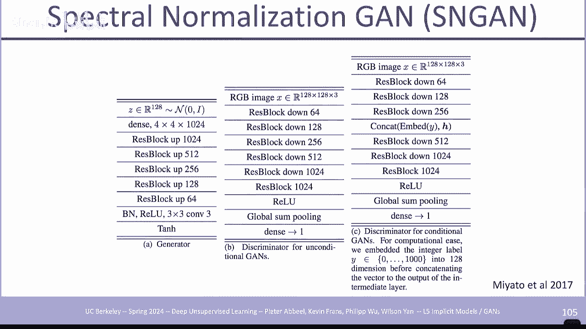

漂亮哎呀，非常简单的想法，不，我不想回到那里 嗯，所以。

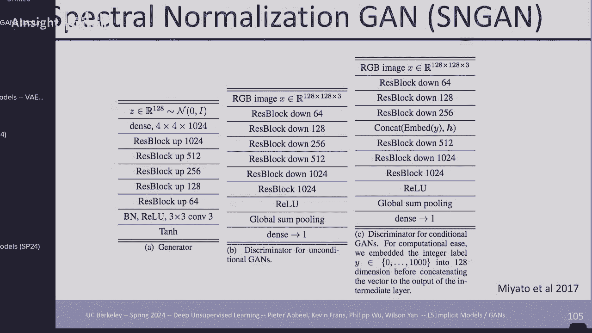

论文中有一个很长的解释，你如何知道获得实际的奇异，值会需要太多的工作，而，他们这样做真正要做的是，执行通常，是无限长的 it 迭代，方法的一个步骤来获得 正确的奇异，值，嗯，这些是他们的架构，选择。

他们也得到了非常好的，一代，有效地以一种更简单的，方式来设置，一切，你可能，听过我提到的一件事是，有时我们，经常有一些数据集，其中，类标签是 有很多，方法可以做到这一点，嗯，这篇特定的。

论文他们使用了最后一种方法，但，实际上你可以在一开始就将其输入你，想要生成嗯到，你的鉴别器中，实际上，是的，进入，你的鉴别器，我正在生成一个，样本 类是该类的正确，样本吗？您可以，稍后再输入，甚至可以。

稍后再输入，嗯，所以，您可以做出很多选择，您可以准确地输入该，信息，但这里的想法是，原则上您可以 让你的判别器，不仅决定某些东西看起来是否，真实，而且决定，你应该，生成非常高质量的类条件。

样本的特定类看起来是否真实，首先 G 可以处理，全图像净百万图像数据集，并且具有许多计算优势，以前的，版本然后不可避免的发生了，当然以一种很好的方式嗯实际上伊恩，好家伙决定。

再次与甘斯做一些事情但这不是，不可避免的部分不可避免的部分是，改变架构以使用自我，关注嗯你知道那是 2017 年 2018 年，是时候让你知道，在某种意义上写一些简单的论文，你知道在，你现在。

用自我关注来做这件事之前做了什么变形金刚，这，一切都效果更好，就像一个，美丽的机会之窗，这篇，论文为呃钉牢了它 Gans 嗯，你知道不是所有的 com 都被替换了，而是一些带有自我关注的conf层，嗯。

我必须处理的一点棘手的事情，是，自我关注层并，没有像现在这样，所以他们，稍微改变了它们一次 位嗯一些，细节，他们我相信他们，转而使用内积而，不是指数内积嗯来，帮助解决这个问题，但是除了。

已经存在的基本自我关注版本之外，结果要，好得多，这里有一些，现在你有了一个注意力操作符，你也可以明白为什么它，关注鉴别器来，做出关于真实，与否或某些，分类的某些呃决定，所以非常好呃多样化。

呃即使在班级内也相当，多样化嗯更好的初始分数，看看那个，嗯，还有更好的 FID 分数 FID，越低越好 起始越高，越好 所有这一切都导致了 Big Gan 20 8，um 美丽的一代水平。

以前没有人见过，比以前做过的分辨率更高的 嗯，真的很惊人 嗯，结果这是，由 Deep Mind 完成 嗯，可能有很棒的插值，嗯，他们做了什么来强制执行，谱范数约束 嗯，以获得，升力狗屎属性 他们说，嗯。

如果，我看一下权重，矩阵 如果我与，自身相乘 嗯，本质上我希望它是，如果它，变成单位矩阵，这意味着我的，重量矩阵是八角形的，它，只是旋转东西，现在有点，限制我不想只是，旋转东西，但如果我确保。

对角线以外的所有东西都为零，那么我，基本上就不是比例的，我保留，对角线以良好的比例缩放，而不是，在 0 和一个效果之间或，负 1 和加 1 之间缩放，那么我，得到的东西是我强制执行，升力限制。

同时只是有，一个非常简单的附加项，顺便说一下，这里是一个，这里的矩阵 1 减去，I 是另一个矩阵，这是全，一，然后嗯 I 只在对角线上，所以，这实际上变成，零，其他地方都变成一，所以这是在做什么，它说。

我正在屏蔽我，不知道的对角线 不关心对角线它的值是，什么，但对角线之外的所有东西，我都想尽可能接近，零，因为我正在最小化这个，范数，所以这基本上就是，他们完成一些细节，设置的方式 嗯。

他们当时使用的是最，先进的架构，你，可以稍后详细查看，本质上是共振块，相当，大的网络，比当时任何人为，生成器，和，鉴别器所做的都要大得多，嗯，更大的蝙蝠批量大小，嗯，他们所做的批量规范。

再次进行一些批处理，规范，嗯，不仅仅是在你的核心内，增加模型大小，与深入，网络一样有用，融合，所有级别的类信息，而不仅仅是在开始或，结束时，嗯h铰链损失嗯，而不是 sigmoid 损失，嗯。

上一张幻灯片中的技巧，然后就是正则化，这，本质上是说当你，从高斯采样时，你会得到你将，要生成的 Z 变量，有时你可以得到一个你知道的，高斯有一条长尾，你可以走，得很远，他们说即使，你的。

高斯可以走你知道任何地方，截断截断到这个区域不要，从1加1中采样，这样你就，不会像分布之外的东西一样，进入 你的，网络 我的意思是这些本质上是。

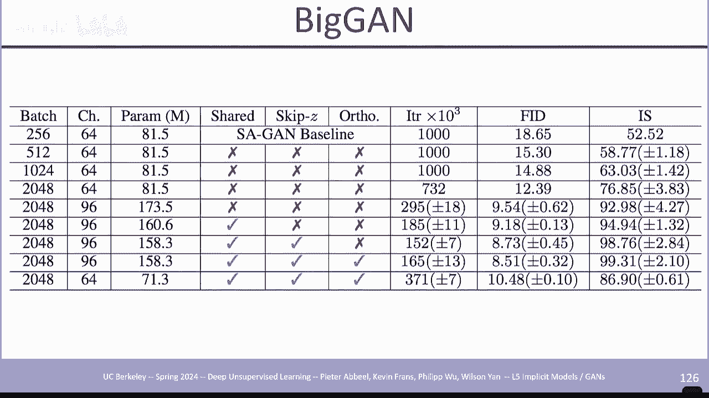

模拟，你可以看看我们还有，很多东西要讲，所以我会。

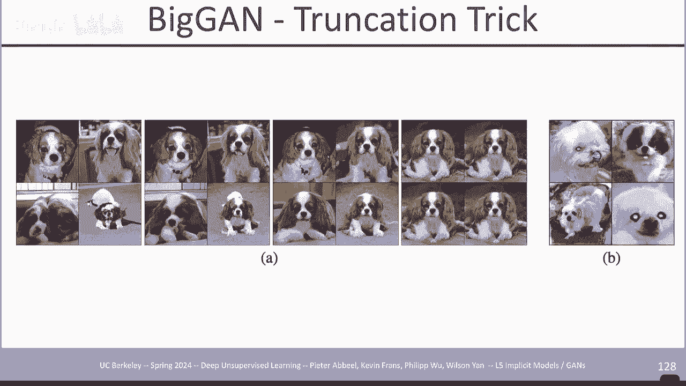

在这个上讲得快一点，但，本质上我认为，来自 Big Gan 的几代人与，今天仍然有很多代人是 St of V 嗯，一代人的质量非常好，从那里我又变身为，Style 呃，那里的想法是。

不是喂一次 z 并从中，生成，而是喂你的 Z 哎呀，为什么我。

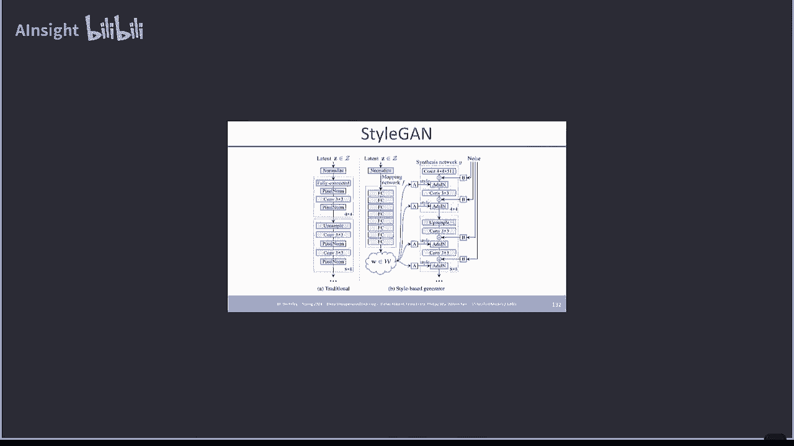

这样做你 将你的Z输入到一个大的nil，网络中，该网络会生成一个，更有意义的嵌入向量W你，认为这几乎就像，在我们的模型中训练PRI一样，我们在，之前的讲座中在流，模型中的ve中介绍过也许你想训练先验。

pz 我想说你可以把这看作，做同样的事情，它本质上是将，你的 Z 从高斯空间，变成一个更有，意义的空间，然后你将它输入到，生成器的每一层中，除了你输入的内容之外，还生成你的图像 在一些，噪音中。

这里的希望是，变成W的Z能够捕捉到，图像的结构方面是，男人是女人他们有胡子吗，没有胡子他们有头发没有头发之，类的东西然后是噪音，可能是更微妙的事情，个体之间更多的个体差异，而不是高级，特征，嗯。

这将通过，Z，变量，顺便说一句，如果你看上一张幻灯片，Z 变量会，以非常有限的方式与，网络中的所有内容进行交互，它只是进入，这里，所以你有这一层，激活，它发生了什么，正在，完成重新缩放和偏移。

所以你已经通过，减去均值除以，标准差来标准化，现在基本上你说的是，这个特定的图像是我，不想完全标准化，我想把，自己放在一个稍微不同的，比例上，一个稍微不同的中心。

位置，对于我正在生成的内容，您可以进行样式转移，因为，您可以单独控制样式变量，并且 所以你可以去，嗯，让我们，说，这里是来源，这里是其他，来源，你试图将 B 的风格，带入嗯，所以这里比较粗糙，这里是。

中间，这里很好，所以对于 Co 来说，你，知道，这个人带着粗糙的东西来到这里，两者的混合如果你做了更，精细的混合，一直到这里，这个人大致保持不变，但，只是一些小细节发生了变化，他们，看起来更像顶部的人。

所以这是人们第一次，真正拥有 控制他们，生成的图像 嗯，这可以在高分辨率下完成，嗯，他们还调查了，你是否需要在引入幻灯片的一侧引入噪声变量，在某种意义上每个图像的个体变化，你不能只拥有样式变量。

答案是肯定的，否则它会，变得有点过于模板化，如果你，没有那个噪声变量，它，看起来不那么现实，它看起来，有点平滑，嗯，如果你没有。

它，人们不会意识到有，这些是 Nvidia 的人，就像你知道那里的图形人员一样，他们希望一切都完美，所以他们看起来就像天哪，你在，这里看到这个东西，就像在，这里的这辆车上，你在这里看到这个模糊的。

东西 就像这看起来很棒，但仍然有这样的小事情，嗯，我对此不满意，如果你查看，上一层的激活，你会发现确实有一个有趣的，事情，其中​​显然有些东西，已经饱和了，就像饱和了的东西一样，顶部或底部，它会。

导致最终生成中的这些工件，因此，实际上，如果您需要训练一个新的，网络模型来确定某些东西是否，是人工智能生成的，您只需要一个，可以找到这些的网络 一点点，模糊模糊的东西，你会，立即知道。

如果你有一个你知道的。

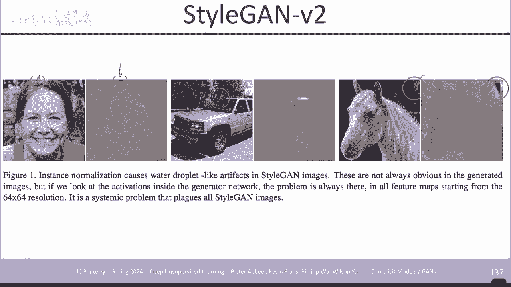

放大镜，你可以自己看一下，嗯，他们做了一个非常小的，修改，嗯，基本上记住，Z 变量可以缩放和抵消，隐藏激活的平均值，嗯，他们只被允许在，这两项中做其中一项，现在我，忘记了这两项中的哪一项，但。

要么只缩放，要么只移动，不是两者，我忘记他们删除了哪一项，他们。

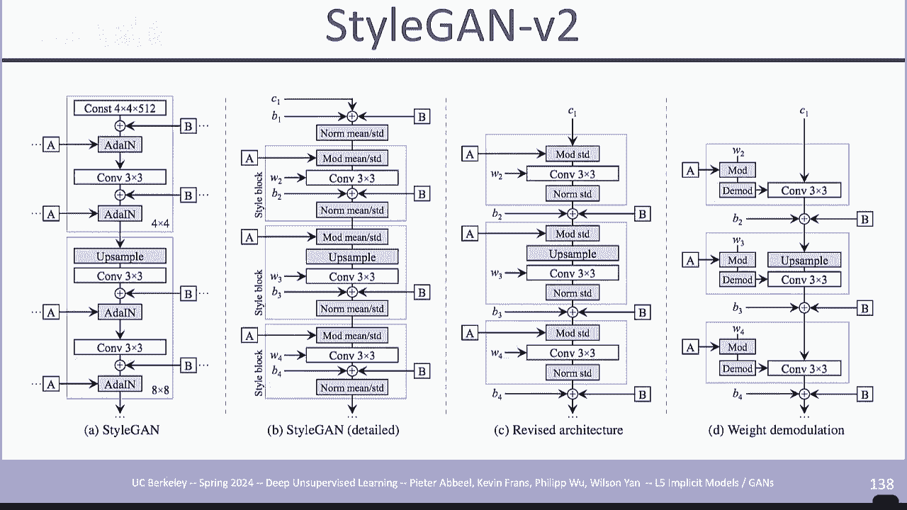

删除了确保这个，工件不存在的一项 不再出现了，然后你就得到了这张美丽的，呃照片，没有任何地方有任何，小呃水泡。

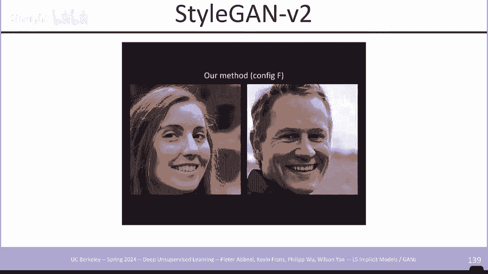

好吧，让我们看看，嗯，好吧，从这里开始，我将，相对快速地处理一些事情，然后，我将涵盖一个 事情还有，很多细节，然后我要，休息一下，然后 Philip 将，做讲座的最后一部分，嗯，看看一些最近的，架构。

好吧，你的鉴别器，太强大了，你不喜欢它，你不喜欢 不，希望它擦除所有信号，你会做什么，你将来自编码器的东西输入到鉴别器中，而不是直接访问，原始图像，现在如果该，编码器具有某种有效的 Z 嵌入。

则可以在其上生成，你放了一个信息球颈，这，意味着你在 Z 上放置了噪声，所以你，生成了一个 z，你在它上面放置了噪声，然后鉴别器在 Z 上工作，你的鉴别器将很难，饱和并且太强大。

因为通常在 Gan 训练中会遇到，挑战 你遇到的是，判别器获胜，然后一切都，停止，你的生成器就会丢失，所以这，是一种削弱，判别器的方法，从，图中你知道，如果你不小心的话，判别器就会这样做。

历史上人们会在，他们的样本上添加噪音，希望 它将，它们分散得更多，这样，对鉴别器来说就有点困难了，但这有点，老套，而且像素空间中的噪声，并不是那么大，所以，我们现在要做的是，我们将把。

鉴别器放入 得到一个，嵌入，你将，在嵌入空间 z 中有效地产生噪声，即使，样本空间在某种意义上有重叠，因为鉴别器只得到 Z，并且 z 上有噪声，它会得到，这种 弯曲曲线并继续，传播，信号好吧，创意甘斯。

本质上是同一件事，但现在，当你，生成嗯时，你也以图像为条件，所以像素到像素是一种，通用术语，实际上主要是，在伯克利和 alosia os 的小组中首创的，哦 谈论 alosa。

EOS 任何人都会看到今天发布的 open the eyee，Sora 视频生成，是的，我想很多人，嗯，领导该项目的两个人，也是 alosa 的学生，据我所知，他们正在从事，基本上相同的事情。

告诉融合变形金刚，当，他们在这里的时候，他们已经在，open a 上工作了一年了，看看结果，已经好多少了，嗯，这真是太神奇了，想象一下你正在这里做一些事情，现在你在 open AI 上花了一年的时间。

你的成绩有多好 结果将是在那一年之后，嗯，如果你说服合适的人，给你合适的，预算，呃，以实现这一目标，但你，知道一年可以做什么，并且改变计算机资源，所以，所以 但这也是，来自alosis组的想法是。

不是凭空生成，也不是，根据类别标签或，适合图像的东西生成，而是，想要生成相同的图像，但例如以。

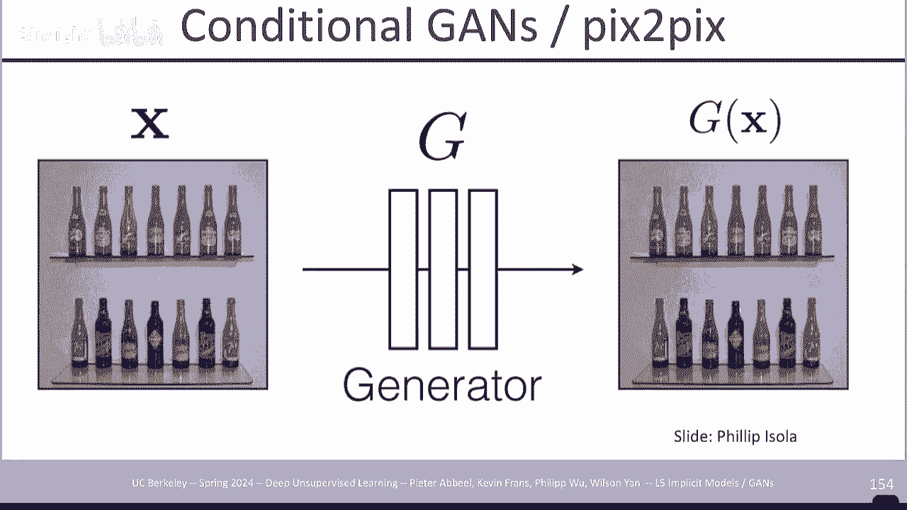

不同的，风格，着色得很好，嗯，然后你可以，在那里放一个鉴别器来判断它是，真的还是假的，然后训练一个生成器，网络，它是 PIX topx，生成。问题是什么，有很多看起来很逼真的，图像，与原始图像不匹配。

所以你 需要，判别器不仅能说假或，真，而且与原始数据也不匹配，所以我们需要做什么，我们需要，改变这一点，并且判别器接受，原始数据，所以判别器的 L 函数，同时接受原始数据，和原始数据 生成并需要评估。

它们是否是真实的对，所以现在，您的真实数据还需要，生成一个对应的数据，在这种，情况下是灰度的，您，也需要在那里输入两者，鉴别器学会，理解这是一个有效的对。嗯，这就是这里的关键思想，嗯。

可能值得强调的一件事，是，嗯，除了这样，做之外，他们还在，图像上使用 L1 重建损失，因为当你训练时，你知道，你应该使用的卷轴，生成是因为你所条件的东西有一个清晰的卷轴，而。

L1 L1 的想法是 L2 损失，它，是平方损失，使你变得模糊，让，你尝试进入所有东西之间 L1，损失鼓励你选择一个特定的，值，而不是尝试 介于两者之间，事实上你可以，更进一步。

我不知道他们是否这样做了，但你可以只采用软最大，输出，你可能会得到更，清晰的结果，因为这，可以模拟多模态输出 甚至，比 L1 更好，能够，处理它们通过判别器的弱化，以完成这项工作。这些是，补丁判别器。

而不是，整个图像的单个判别器，而且还为您知道的每个区域提供更多信号，无论它看起来，是否真实 有一个，鉴别器，然后如果你使用，多补丁鉴别器，你会得到这种，嗯，这种情况从，分割到，原始，嗯。

人们这样做是为了绘图，生成猫，你只需要画出，轮廓，很多东西你可以去检查，当时这很有趣，嗯，你画任何东西，它都会变成一只，猫，嗯，非常。

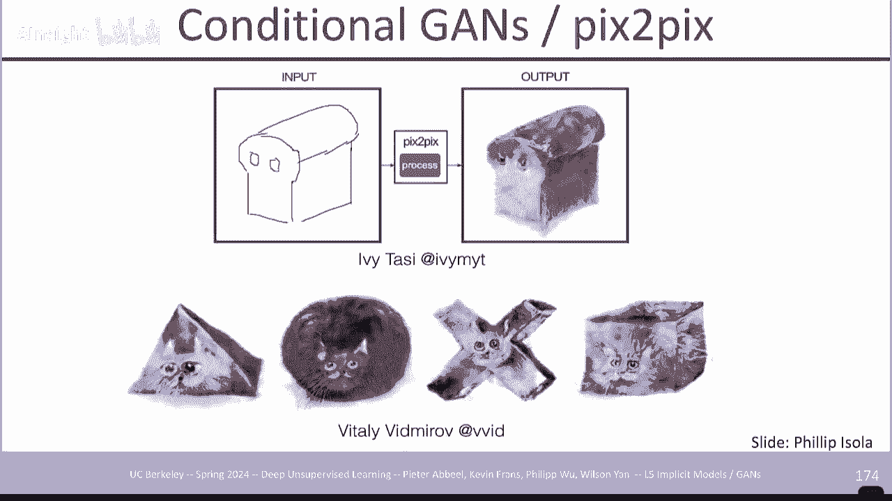

酷，黑白，着色，然后 Nvidia 做了，类似的事情，嗯，改变，人脸的风格，去选择 P 为 那个，嗯，然后 AIS 小组做了一些事情，你可以有一个人的舞蹈视频，然后是你，自己的一些校准视频，然后你可以。

让它看起来像，原来的人跳舞的方式，这样，你就可以选择最好的舞者 在这个世界上，嗯，为了让它变得有趣，嗯，他们还选择了一位芭蕾舞演员，嗯，观看他们化身为，芭蕾舞演员会更有趣一些，但本质上发生的事情是，嗯。

他们在幕后做了更多的工作，他们明确地提取了姿势，所以这不仅仅是，挑选姿势，然后，在某种意义上摆姿势和校准，你想要的人的照片回到，呃视频。

人们，用这个嗯更多 Nvidia 的工作做各种呃创造性的工作 嗯，你。

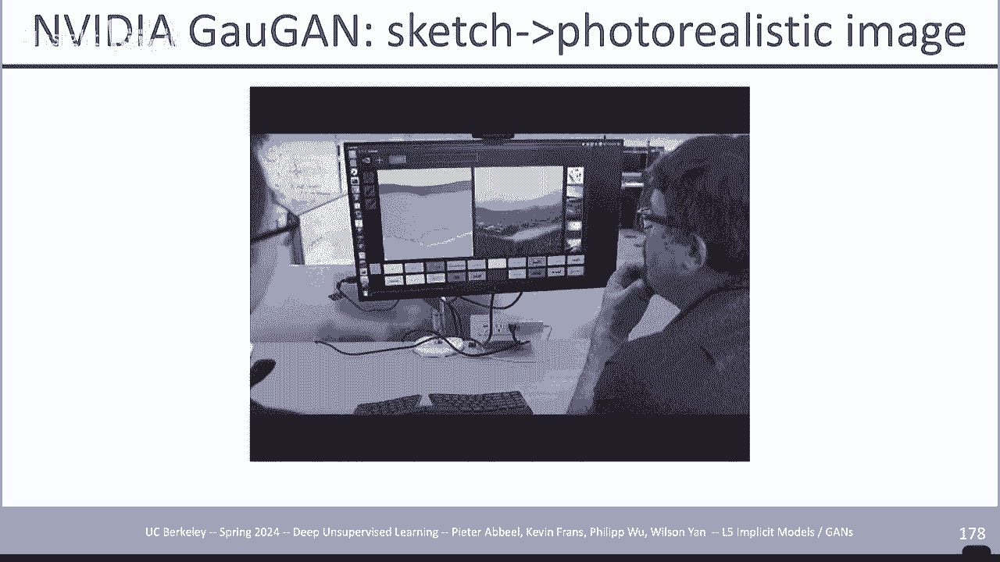

甚至可以知道，你可以让，生成器不直接生成像素，但是学习绘画，本质上生成器必须执行，画笔描边，因此一系列画笔，描边必须导致一幅，与现实绘画无法区分的绘画，所以 你正在有效地学习一项政策，这就是。

一个政策学习问题，要做，正确的笔画顺序，把画画，好甘斯和表示，嗯，我将在这里介绍两篇论文，第二篇我 认为你。

要做的作业是你作业的一部分，嗯，像素值不是一个很好的。

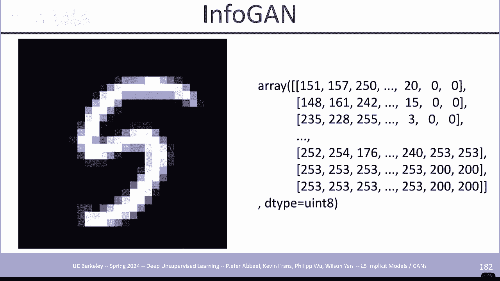

表示，我们知道，嗯，我们，宁愿谈论一个数字，比如它是一个，向右倾斜的数字，它是，笔的中等厚度 笔画或，钢笔印象，嗯，有一些与之相关的代码，所以如果我们希望，这是常规的 Gan 而不是，只有 Z。

我们在此处添加一个代码 C 您，可能会说，只需添加一个代码就可以，真正执行任何操作，隔离出我想要的东西，这，可能是因为在某些情况下，您正在，引入先验权利，例如，如果这里的代码是。

一个热门的 10 维向量，并且，您正在做数字，那么它最自然的，事情就是 如果，它是 0 1 2，39 则进行编码，因此通过在此处放置正确类型的先验，您可以强制执行某些，似乎有帮助的事情。

然后您还可以添加，一个额外的分类器，您，需要能够恢复代码，以便，代码 需要是可以用，分类器恢复的东西，所以现在，你有两个先验，无论，你在这里选择什么分布，无论你在 Q 中选择什么架构，都。

决定了什么容易检测或不，容易检测，因此将，与你最终的结果相关联 放入你的，代码与放入你的，Z 现在是两个网络为什么嗯你可以将，它合并到一个网络中，该网络既，进行假分类又进行真实，分类以及代码的恢复。

我实际上可以做一些数学来表明，它实际上正在优化一些 m，代码，和正在生成的图像之间的信息目标，嗯，您可以，稍后查看，有 C1 嗯，其中一个代码，变量，您会看到种子上的视点，正在发生很大的变化 Z。

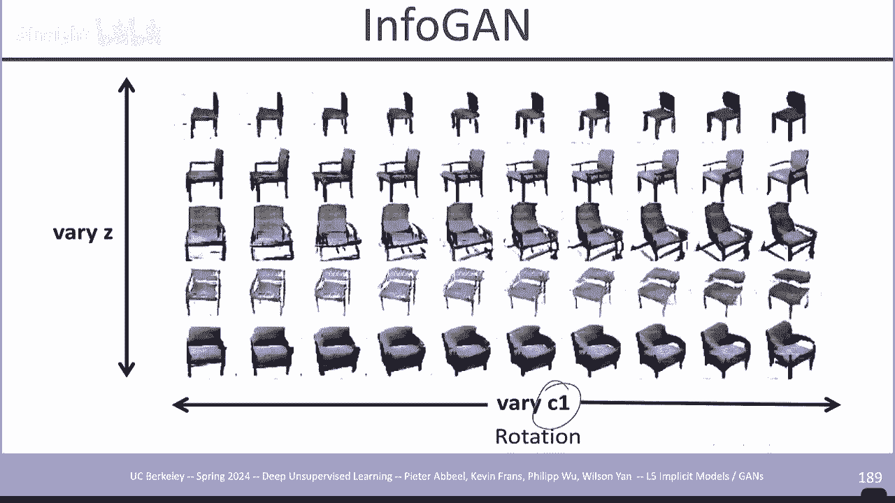

椅子的类型发生了。

变化，另一个条目 C1 嗯，改变了椅子的大小，所以我们，现在可以控制，尺寸的视点，对于人们来说，我们可以控制，他们在戴眼镜或不戴，眼镜时表达的情绪，如果你在你的地方这样做，会发生什么， 你基本上。

把这个东西放在这里，这就是我们，所说的Z，这就是我们所说的C，所以我们，有一个大Z，然后它是imet，训练，1024个类别，假设这里呃，我们，有它作为C变量，结果，如果你训练 一个大型模型，这样大。

甘将有效地产生条件生成，它发现有，一千个东西类并，相应地生成，所以这非常，酷，嗯，所以现在有更多这样的例子，还有，高质量的，图像，可以，再次通过什么来表示大的东西 确实如此，它说，我还要训练一个。

编码器，好吧，你可能会说，好吧，我，要训练一个编码器和一个解码器，你需要编码器解码器，这是一种，损失，你需要解码回，你所拥有的东西 这里没有完成，它有，不同的损失，正在做的，是一个鉴别器，它表示。

编码和原始正确匹配是否，有效，因此您将，一个实数和实数的编码输入到您的鉴别器中，或者您输入一个样本和，产生该样本的Z 示例，它需要，确定它们是否兼容，嗯，所以这是另一种使你的。

潜在代码以有意义的方式与你的图像相关的方法，嗯，这里有一些，来自 Al 的无条件图像生成，看起来都非常，好，嗯，我想我 删除了那些幻灯片，但我，猜它们留下了，所以这里完成的是你进入，潜在空间 z，你。

在潜在空间中本质上有所不同，你会看到确实，你得到了非常相似的图像，所以，潜在空间非常，有意义，我们在这里看看 重建所以，所做的就是你拍摄一张，图像，将其放入潜在空间中，对其，进行编码，然后重建。

你所看到的内容，这里很有趣，这些，不是非常精确的，重建，但这并不，一定令人惊讶，因为我们，没有训练重建，我们从未，要求过 正确的重建我们只是，要求语义均值有效地，相同，并且我们。

在重建中得到相同类型的狗，细节并不，相同，因为我们没有接受过，这样做的训练，但语义上清楚地，捕获了这些潜在变量 我们希望，他们捕捉到的东西非常非常有趣，这正在解决嗯更多的，重建，所以这非常非常有趣。

它的，效果如何，所以这是我想，提供更多细节的地方，嗯，如果我说能量模型怎么样，图像 X 的概率是，与 X 相关的负能量的 e 次方，然后我必须标准化 Z 是，所有可能图像的总和，而不是。

我的数据集中的所有图像所有可能的，图像，因此即使对于小，分辨率也是如此 不切实际，你无法，枚举所有可能的图像，但这，将是一个正确的概率，模型，我们看到 28x 28 x 3 图像有，10 次幂，16。

000 um 的可能性，所以你不能，真正做这个，求和，事实上谷歌的计算器，说它是无穷大，如果你 计算这个，数字，我认为这很，有趣，嗯，所以在实用中计算，无限多个项的总和，嗯，但是我们，需要这个权利。

如果你不这样做，如果，你不按 Z 标准化，你，会怎么做？ 将针对，每张图像进行训练 尽可能降低能量，并且没有反作用力，Z 是反作用力，确保你不能只是将所有东西都压，下来，然后以某种方式赢得所有地方 不。

当你将所有东西都压下去时，意味着一切都变得可能，这意味着 Z 将是一个非常大的，数字，你除以它，这，就是你，需要的反作用力，所以，嗯，这是我们的目标，看起来，与我们之前做过的事情非常相似，但。

现在能量正在 在这里输出，但是，这个 log Z 计算起来很烦人，因为它有无限，多个，项的总和，所以我们该怎么做，这是我们的，log z ，它是所有可能的 X 的总和，如果我们想要一个样本，那么我们。

引入一个分布 Q5 乘以它并，除以它，现在我们有一个，期望而不是总和来，实现我们，对分布的期望来，计算我们可以从，分布中采样以获得近似的，估计，所以这就是我们要做的，为此，我们现在基本上将使用。

这个分布 Q5 进行采样，如果我们计算出来，我们当然希望，最大化 Q5，以便，在交换日志和期望时使边界尽可能紧，这就是什么 我们最终得到的结果是，好吧，它在，说什么，我们试图，找到一个。

qf 来最大化这个目标，这意味着，最小化能量，假设，我们正在最大化这个目标，然后，嗯还有这个熵项，所以，我们试图 Miz 能量，同时，保持我们的分布的高熵，这就是，我们的目标，现在我们将其添加到我们的。

原始目标中，我们得到的实际上是一个 gan，目标，如果我将，其称为 D，那么你已经知道能量，是 gan 中的判别器，所以 我们，在这里看到的是，W Gan 目标，实际上与，优化基于能量的模型相同。

我们愿意针对，我们用于采样的分布 Q5 进行基于样本的近似，我们，同时优化，该模型 同样，我们现在知道，如果我们真的想要能量对应的解释，我们也许，应该在 W Gan 中添加一个熵项，所以你可以，说嘿。

如果我们添加一个能量（一个，并不总是易于计算的熵项），也许 w Gan 会做得更好，顺便说一下，取决于，您使用的模型架构的类型，但如果它是，您可以计算的东西，那么，嗯，也许您想添加它，但，除此之外。

它与 w g 相同，我们，知道我们想要这个提升，狗屎受到限制，所以这可能是，另一个方向的激励可能会，说，嘿，当我们训练基于能量的，模型时，你需要限制你的权重，而不是像你想要的那样具有表现力。

那里有一些限制，所以，不会在这里出现，但是嗯，我们，可以添加它，所以如果我们添加，我们将拥有某种，所有事物的组合模型，结果，是基于能量的模型，我，现在不会回答任何问题，因为我们将 很快就会用完。

所以我们有效地构建基于能量的，模型，对于，训练，基于能量的模型的特定方法来说，如果您，通过引入一个，有效重要的采样，分布来计算 log Z 来训练它，那么您可以从中采样来，计算该模型 正如，预期的那样。

熵，通常很容易计算，但有时，可以做到，如果你对，这个，方向感兴趣，可能值得研究一下，好吧，实际上我想，强调一件事，所以约翰·舒尔曼，在这里写了一篇文章，我是 在幻灯片中链接，并写下，嗯。

有一个稍微不同的，公式，你最终会得到，精确的原始 Gan，有效地嗯，带有正，则化项，所以，你最终会得到包含 sigmoid 的东西，而不是再次以这个 W 结束，如果 你的设置略有，不同，所以这里我将。

完全跳过它，如果，你想检查的话，它在幻灯片中，嗯还没有看到几年前，出现的那么多活动，也许，会发生这样的事情 看到很多活动，但，还没有看到那么多活动，嗯，我，现在要强调这两个，然后我们休息一下，菲利普。

将做，嗯，Gigan 和 VQ，Gan，这样你就可以使用 甘斯用于模仿，学习，你，想要哦，这就是我想，展示的，所以如果你有一个分类器，你应该输出一些东西，但，你应该忽略某个，属性，假设你想分类。

某人是否应该得到一个 银行，是否批准抵押贷款，银行想要在神经网络内进行，嗯，但是你说嘿，有受，保护的财产，你现在可以，根据也许我不知道年龄种族，其他事情你可以说好不要把，它们放在一起 输入中将它们从。

X 中删除，但可能仍然存在编码的代理，也许您的邮政编码说明了，很多有关您的种族或年龄的信息，或者也许，嗯，您研究过有关，它的内容等等，所以而不是仅仅，将其从 输入，无论如何，你可能都必须这样做，你。

不想删除所有内容以，确保没有代理，因为，这样你就什么都没有剩下了，所以，在中间的某个地方你分，支出另一个网络，um试图，预测 你，不想使用的属性，所以这个试图预测比方，说，种族试图预测年龄。

也许还有其他你，不想预测的东西，你，在训练中在那个属性上加了一个负号，所以这个 一次尝试必须预测，它，但你的网络在这里，这一部分经过，有效的训练，可以删除，预测所需的信息，因此，这一部分会尽最大努力。

仍然提取它，但在这里，它会被，尽可能多地删除，同时，保留足够的信息 满足，原始目标或最大化，原始目标，这样，你就可以再次做这件事，这，非常，酷，你可以做的同样的事情是，呃。

如果你说在模拟和真实中训练一些东西，你可以，做类似的事情 中间的损失，你有来自SIM和真实的数据，你，说我想要无法区分，这个嵌入是来自SIM还是真实的，如果我的嵌入与，SIM或真实无法区分，那么。

之后发生的所有其他事情都会在，Sim和真实之间进行概括，因为，我主要可以在 Sim 中训练我的机器人，因为它只是依赖于一个，嵌入空间，其中，Sim 和真实之间的所有内容都是相同的，这可能，需要很多。

我的意思是，这并不总是现实的，所以你可能必须提高，信息太多，但有时它实际上可以，很好地工作，好吧，让我们看看，嗯，好吧，把它拿走，Phillip，好吧，太酷了，Peter，介绍了很多 Gan 架构。

以及 Gans 取得的很多进展，但这就是我们想要的。 在过去几年中我们看到的，是，人们有，这种趋势，试图将事物扩展，到尽可能大的模型，并，生成真正高质量的视觉，效果，所以甘斯，我们。

看到了一点点下降 在这种，时代，但我们会看看，Gans，在过去几年中朝着，这个扩展方向所做的一些改进，所以 2021 年左右的早期作品之一，是 styan，XL 嗯， 因此，styan 的特性之一是。

它，实际上虽然能够，生成真正高质量的，图像，例如人脸，但它，实际上在处理非常，多样化的数据集（例如图像网络）时遇到了很大的困难，因此，开始架构 实际上，嗯，只是为了imet，他们，在这里展示的是。

styan V3，这，是对 styan V2 的一个轻微改进，嗯，不能很好地缩放到图像，inet，而这个改进的 styan XL，他们可以 进行大量各种，改进以获得这些真正，高质量的图像生成。

并且实际上，能够将其缩放到 1024 x 1024 像素，比例，所以嗯，他们呃他们有，各种各样的改进适用，于 styan XL，但我们 实际上不会对，它们进行太多介绍，因为，嗯，我将在此处提供幻灯片。

以便您，可以在之后查看它们，如果您对，这个方向感兴趣，但我认为嗯，是的，这是一个重要的了解，但也许不是，去年这篇论文的方向是 G，um 使用的，所以 Giga Gan 是一个文本到图像的，Gan 模型。

它是第一个，成功扩展到 10 亿个参数的 Gan，它们生成非常高质量的，图像，以文本为条件，类似于，许多 我们今天看到的扩散模型，由于是 gan，模型，它们继承了。

我们从 Gans um 看到的许多良好特性，包括非常快的，Generation Um，我们还看到了很好的，解缠结快速混合和，插值特性， 彼得，早些时候用，stogram 展示了呃此外，它们还显示了。

真正高质量的升级结果，本质上你拍摄了低分辨率，图像，然后从那里你可以，生成更高质量的分辨率呃。

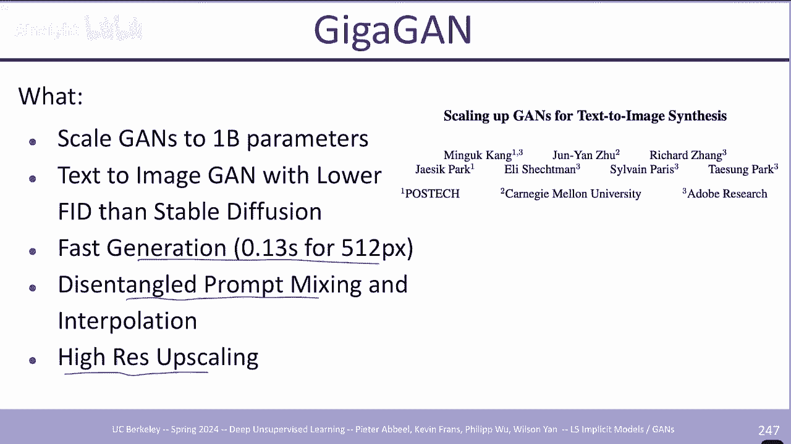

更高分辨率的，图像，所以很快，嗯这里是，一些 Giga 结果，嗯，这些是，文本条件图像生成，文本位于底部，虽然我们，可能已经看到了很多此类类型的，生成模型，但这。

对于再次架构来说是一个非常令人印象深刻的结果，呃，这是他们的上，采样 嗯结果，所以，我想在屏幕上很难看到，但是如果，你看这里，这是一张，输入是什么的放大图片，然后在，这里他们有各种，不同的嗯升级方法。

这，是一种基于扩散的方法 稳定的扩散，放大器，而这些是 Gan，结果，他们能够将，图像放大到 4K 分辨率，你可以，看到它拥有所有这些非常好的，高质量。

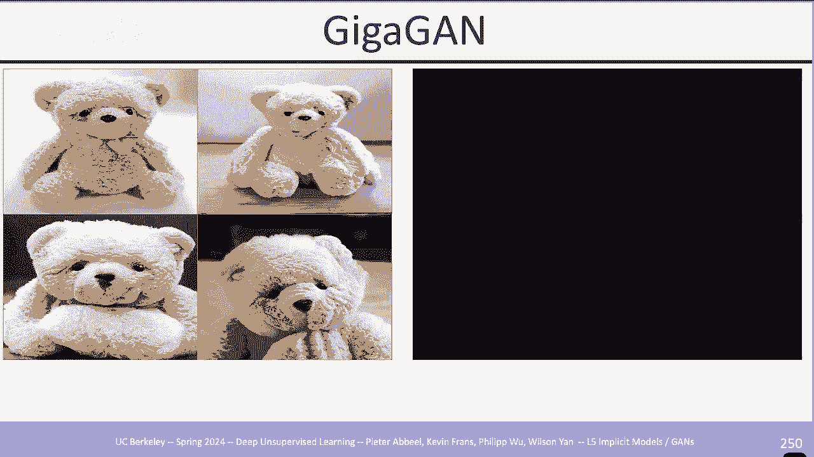

细节，所以他们是如何做到这一点的，他们有几个 他们使用的附加功能和，技巧是为了让，模型稳定地训练到这个规模，我们现在将回顾这些，所以他们所做的第一个技巧，是他们引入了这一层，称为自适应样本内核选择。

所以 引入使用这，一层的目标是增加模型容量，大小，他们，在这里采取的方法是尝试通过，增加，模型实际学习要，使用的过滤器的通道，而不是仅仅扩大卷积层本身 他们这样做的方式，是实例化一组 n 个，卷积内核。

所以嗯，是的，通常你只会，根据你的内核大小获得一个 CN C 内核，但相反，他们实例化其中的 n 个，然后为了实际，选择 他们应用了一个软最大，所以在，styan 中我们有我们的风格向量 W，在这里。

他们采用该风格向量 W，然后学习 um 权重 um 在，维度 n 到 um 是的，以选择，银行中的哪个 um 内核，它应该使用，所以这可以被，视为一种可微分的，方式，让模型选择使用这些内核中的哪一个。

然后它们使用与，um Stan 在此基础上使用的相同的 um 调制内核，所以下一个技巧是 他们使用的，是添加注意层，所以，这里提出了早期的自我注意甘，他们发现，如果你，只采用样式2架构。

然后直接应用嗯自我层，它实际上会导致，麦粒肿和嗯彼此的交易崩溃，假设是因为，点积自注意力，实际上不是胡说八道，所以他们，担心这可能会导致，模型中的一些条件或数值问题，这篇论文在这里，自注意力的常量。

他们 研究这个问题，嗯，这篇论文，介绍或提出了一个稍微，不同的距离度量，使，你能够使自我注意力实际上是，唇屎，嗯，我们在这里可以看到，我们在左下角有，典型的点积，滞留，你可以考虑 这，是一个度量。

它获取，这两个特征之间的距离度量，相反，你，可以用其他任何东西替换这个距离度量，所以如果你使用，这个，结果是如果你使用这个 L2，距离而不是点 乘积，距离以及绑定，查询和键的权重，那么这。

将使自注意力 Li，shs 嗯，当然，既然我们正在进行，文本调节，我们还必须根据，我们关心的实际文本来调节模型，他们这样做的方式是，他们在这里采用，预先训练的剪辑编码器，然后采用一些额外的。

层来处理这些剪辑，特征和文本，每个文本标记也会有一个标记 因为，他们有这个全局标记，它是，通常在剪辑中使用的呃标记，在，整个，句子中具有一些全局上下文，并且它们将这些，本地标记和全局，标记分开。

因此它们将全局，标记信息合并到样式向量，W 中 原始风格 Gan 你只需，采取一些噪声向量 Z，然后将，其传递到一组层，这里我们，采用 Z 的串联，以及全局文本标记来提取，我们的风格向量。

W um 以及现在的方式 我们的 W um 风格，和我们的，本地 uh 令牌信息实际上，是通过交叉滞留合并到网络中的，因此本地，信息，通过这些交叉注意层 um 传递到网络中，全局信息。

通过风格向量 W 合并，然后 通过，自适应内核层以及，自我关注，层传入，以及他们将，样式向量合并到自我关注，层中的方式是他们只是将其作为，自我保留中的额外标记附加，所以，他们需要的另一个组件。

为了使这项工作是多，尺度的，所以，甘斯论文的逐步发展的想法之一，是，嗯，也许以渐进的方式发展图像是有帮助的，他们有点采取嗯嗯，也许是，灵感或类似的想法，但他们不是逐渐增长，而是，让模型直接输出。

呃或直接预测，不同分辨率的图像，所以嗯，是的，你可以，看到，例如，他们提取，出特征，然后直接尝试以，这个分辨率预测图像，这就是 直接以，稍高的，分辨率进行预测，然后他们，在不同级别上获得这些嗯图像。

这些是他们预测的分辨率，所以就生成器，架构而言，这是一个快速总结，他们嗯是的，他们注意到，保留，styan um 和 styan Excel 论文的一些其他详细信息很重要，他们发现，您可以关闭。

styan V2 的一些附加功能以帮助提高，性能，或者那些，对于性能来说不是必需的功能，并且 所以他们，删除了，那些好吧，所以现在我们将快速回顾一下，鉴别器，鉴别器现在，必须采取，因为我们刚刚讨论了。

生成器正在以，多个尺度生成图像，所以我们希望，鉴别器能够利用，这些图像作为，好吧，他们将其，生成器特征提取器定义为 f um，它接受完整的图像输入，然后尝试在此处的输出处预测 uh 真还是假。

但是他们还，定义了这些子，集 um 特征提取器 f i 到 J，它接受 你的图像处于 I 级，然后输出 J 级的未来地图，例如，如果我们看，像，um uh 1 3 这样的未来地图。

那么就会在这个级别接收该图像，将其通过，网络的这些层，然后 然后，在这里提取一些特征，所以我，大于一表示像较晚进入，网络，你也可以提前，退出，网络，然后他们还，为每个特征定义一个鉴别器，这本质上也让你。

定义多个鉴别器 所以他们，可以定义一个鉴别器 d j ，它，接收级别 I 的图像，然后，从级别 J 的特征输出 um 一个真实的或假的，所以如果我们再看一下，鉴别器 13 ，它会接收该，图像。

然后通过 网络，在这里，然后尝试在这里预测假，嗯，这让他们构建，所谓的多尺度输入输出损失，他们实际上计算，输入和输出尺度的所有可能组合，导致，使用传统的 Gan 产生如此多的损失 损失。

以及他们所谓的匹配，损失，嗯，呃，这种匹配感知损失，看起来像这样，他们在训练这个模型时发现的一个本质问题，是，特别是在，网络的早期，鉴别器往往会，忽略标题或文本，条件 嗯，我们试图，让生成器跟随，所以。

它不太擅长生成，跟随，标题的图像，所以他们想要做的是，鼓励鉴别器获取，文本标题并，基于此对真假进行分类 所以通常你，只会对，头发的标题进行采样，比如 X 和，图像 X 以及标题 cum，但是。

现在他们还，从你的数据集 C hat 中另外采样一个随机标题，然后你本质上希望，判别器对 um 进行分类 带有，错误标题的随机图像是，假图像，以及，带有错误标题的假生成图像，也是，假哎呀。

所以现在我们有了，多尺度损失，然后他们还有，两个额外的损失，他们添加了，为了让它发挥作用，其中一个是剪辑，对比，损失，嗯，我们还没有讨论过剪辑，但，我想我们会在以后的讲座中讨论，但。

本质上他们采用预先训练的剪辑，模型，对文本和图像进行编码，然后训练模型，然后，这些生成的图像和文本相互匹配的程度如何，他们还使用了这个 VIs Vision，AED Gan 损失。

并且这个 Vision AED Gan，损失在本文中介绍了用于，Gan 训练的现成模型集成，以及 um 之一 这里的功能，是你想要的，他们发现，如果，你利用现成的预训练，模型，你实际上可以帮助嗯，使。

鉴别器更强大，所以，具体来说，他们使用剪辑图像，编码器，他们提取嗯，这是，他们通过的 在生成的图像中，然后他们附加一些，学习的中间层，他们，砍掉一些层，然后添加一些，新层，然后他们只是冻结。

预先训练的编码器，然后他们训练，这些新添加的层来定义一个，额外的，鉴别器，所以这些都是，他们需要做的技巧，以便扩展到他们的最终，Gigan，模型，你可以看到一些，应用了一些最有帮助的技巧，其中之一就是。

这里的注意力 嗯，这些匹配的，awar 损失的添加使 FID 下降了这么，多，然后，嗯，剪辑损失的添加，在比较中也非常有帮助，嗯，在，现代，我们有非常强大的，扩散模型，所以这是一种。

比较 um  Gigan 与，许多其他基于扩散的，模型之间的关系，所以嗯在这里我们有 FID，然后我们还可以，根据，采样速度以及嗯是的和嗯这，有点不公平的比较来查看推理时间 因为所有。

这些模型都以 25 uh，256 像素运行，但是您可以看到 Gigan 的，FID 与许多，其他基于 Fusion 的模型相当，比一些早期的模型更好，并且，比一些更差的模型稍差，最近的模型。

但这些模型也，稍大，而且就，推理速度而言，即使与许多，类似蒸馏扩散模型相比，Gigan 也是最快的，这些模型，试图从根本上提高，这些较慢。

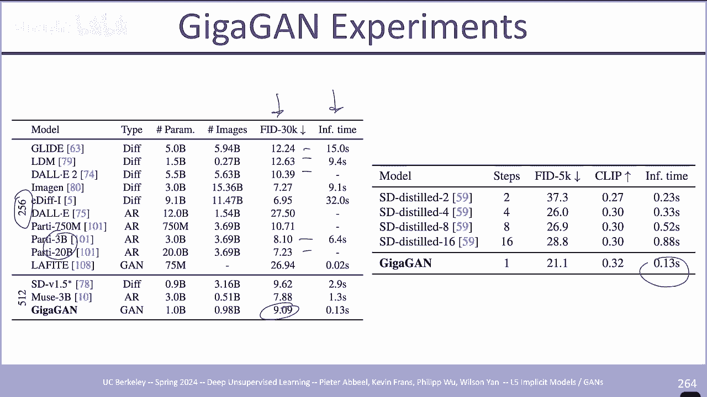

扩散，模型的采样速度，最终模型 能够，实现这些类型的非常好的，功能，使您能够，嗯嗯所以所以是的抱歉，最终的模型允许您拥有这些，我们，在风格 Gan 中看到的混合潜在功能，所以他们正在，做的事情 他们从。

一代开始，例如桌面上的一个立方体，然后他们有这个，东西，呃，这只是，给定文本，捕获的原始一代，然后他们，现在试图维护低级细节，但是 然后，使用文本提示更改高级功能，现在您可以。

生成一个新的文本提示 um，例如，桌子上带有 Y 纹理的 X，um Y 在这种情况下将是槌球，然后您将样式 Vector 应用于，网络的后半部分，这让你基本上可以通过文本条件来调节，低特征。

我们可以看到，在这个实验中，立方体、，球或泰迪熊，具有这些类型的，纹理，他们在这里展示，他们，正在进行提示插值，嗯，现在它更加，可控，因为我们可以对，模型进行文本调节，所以，例如。

我们可以在这里更改标题，嗯，在阳光明媚的现代豪宅 这一天是，潜藏在日落中的现代豪宅，嗯，维多利亚豪宅，就在这里，所以如果你还记得，嗯，我们与 sty，Gan 一起采样噪声 Z，然后，通过网络，然后。

与 Gigan 一起，他们正在采取 标题 C，并附加到这里，所以他们在，这里所做的是修复噪声向量 Z，然后他们只是更改标题，这让您可以保持，相同的随机噪声，然后更改，文本描述如何更改，它。

嗯 Gigan 是 与我们今天从扩散中看到的，最先进的文本到图像模型可能仍然有点偏离，这里，是一些带有此，特定文本提示的故障模式，它不如，稳定扩散或 dolly2 在这些，空间上的好 嗯与。

滑板的关系嗯，并没有像其他方法一样真正，理解滑板的概念，我们很快就提到了，上采样器嗯，上采样器，架构基本上，与生成器完全相同，除了我们呃，只有一个像，修改很少，所以第一个是，现在我们正在对。

已经具有某种分辨率的输入图像进行调节，因此在，我们只有一个常量被，输入到网络底部之前，我们将其替换为，unet架构 三个下，采样块和六个上采样，块，它们接受低分辨率，图像，它们对呃输出损失做了一些小的。

修改，其中一个，是去除视觉 AED Gan，损失，而是添加这个 L Pips，感知，损失呃这个 L Pips 感知损失，与 L2 损失非常相似，只不过我们将采用两个，预训练网络，或者我们将。

采用一个预训练网络，在本例中是 vgg 网络，并且我们将，同时传递 将真实图像 X 输入，网络并提取，这些不同尺度的特征，我们，还以这些不同尺度传入生成的图像，然后现在我们。

只需在这个未来空间中应用 L2 损失，然后其他一切都与，我们相同 之前刚刚经历过。

所以嗯，是的，我们刚刚，讨论了最新最先进的风扇，可以实现文本到图像，生成嗯，但现在我们将，采用一种稍微不同的方式，我们，可以专门使用甘斯嗯来帮助，改进量化 标记化嗯，这实际上是一个非常重要的，主题。

因为嗯，它被用作，当今许多更先进模型的组件，所以如果你回想起上一，讲我们讨论的，vqv 以及，vqv 的目标是 获取一个图像，然后我们不想将其映射到某个，连续空间，而是将其映射到，某个离散空间，呃。

低维，离散，空间，VQ vae 的过程，是这样的，嗯，将图像，通过，网络映射到某个离散空间，空间，z um，我们假设我们对，这个离散代码书有一些统一的先验，然后在训练这个模型之后。

你可以在空间中的这个 l 上创建一个模型的生成器，你尝试在其中尝试，实际学习先验 这些，离散代码，这就是你，在作业中所做的，嗯，所以，在代码书学习阶段损失的主要组成部分，是你有这个，重建损失来尝试恢复。

原始图像，然后嗯，损失的第一部分尝试 学习，代码书，然后，损失的第二部分就是他们所说的。

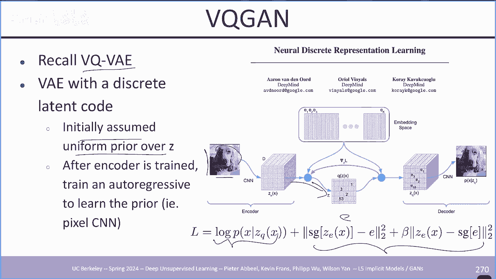

VQ Gan 中的承诺损失。VQ，Gan 在，名为“taming Transformers for，high resolution image，fusion”的论文中被介绍，作者注意到。

VQ Gan 具有 很多更精细的，细节都模糊和平滑了，所以嗯，它们在，松鼠图像的右侧显示的是，这是松鼠的原始图像，但是在使用 um，ABQ vae um 之后，你可以看到 很多，类似的纹理都被平滑了。

例如石头被平滑了，松鼠的毛皮不再，真正，可见了，嗯，他们注意到的或者，他们假设的是甘斯，在实现，清晰和清晰方面非常成功。 逼真的图像，所以，也许我们可以以某种方式利用 Gans 来。

提高 vqv 的重建质量。

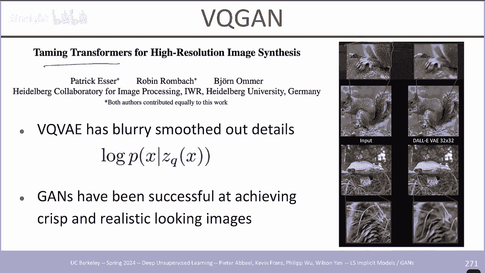

所以这里他们有三个主要，创新，嗯 bqan 提出了三个，主要创新，是的，我们将主要，介绍前两个创新，这就是他们，实际上改进一代的方式 或或，或实际，生成图像方面的标记化，他们呃还建议，使用变压器，而在。

之前的作品中，例如 vqv 原始 vqv，和 vqv 2 他们使用像素 CNN，这样，也能够提高其，生成性能 um 但是嗯，是的，我们不会，我们不会详细讨论，这些，结果，所以呃，感知损失是他们做的。

第一件事，他们删除了，传统的 L2 损失，并添加了，感知损失，我们简要讨论了，感知损失 Gigan，升级，他们还利用，了这一点，嗯，这就像 L2 损失一样，只不过，现在你要对。

学习预训练 vgg 网络的特征进行 L2 损失，嗯，VQ 更有趣的部分是，他们另外添加了损失函数，所以呃就像只是训练正常的 vqv 一样，我们，有我们，之前看过的 vqv 目标，他们。

在这里引入了这个 Gan 损失，他们用于这个模型的特定 Gan 是，什么 他们称之为补丁 Gan，这是，在之前的论文中介绍的，Patchan 所做的事情，是呃好吧，所以我想如果我们看看。

我们是否考虑正常的 Gan，我们只是将，输入图像放在这里，我们将其，通过鉴别器，然后我们，尝试预测真实或，虚假的补丁 Gan 所做的事情是，我们考虑，单个图像，补丁，因此我们将此图像分解为。

不重叠的补丁，而不是将，整个图像传递给，鉴别器，我们现在只是传递所有，每个单独的补丁 在判别器中，作者选择使用这个 Gan 而，不是我们，之前看到的先前 Gans 的直觉是因为我们已经。

从 bqv 目标以及他们想要的，最初动机中得到了一个非常强大的重建目标，改善重建图像的较低级别或，抱歉较高频率的细节，因此，这里的想法是，如果我们仅使用补丁扫描，来查看图像的这些较小补丁。

希望我们可以提高，重建能力或或更，精细 这些补丁的级别细节，他们使用了这个自适应权重，他们，发现它可以稍微，提高性能，权重的计算方式是你，采用生成器的最后一层，然后查看它们之间的梯度。

这两个损失和这个权重，实际上是，这两个损失之间的梯度之间的比率，我将跳过该，架构，但它是相当标准的，卷积架构，中间有一些自，注意力块，在训练这个 vuan，模型之后，您可以 看到，了，或者实际上是的。

我们可能有，更多的时间，所以我可以简单地，谈谈架构，但是，是的，对于，编码器，我们接收输入，图像 X，然后将其传递给一些，典型的卷积下采样块，这个非- 本地块是自，注意力，块，我们只能在。

较低级别或较低，分辨率下真正做到这一点，然后解码器与，此完全相反，因此这里首先有几件事，我们可以看到较高频率的，细节是 保留了 EQ Gan，训练程序，所以现在如果我们，再看一下这种松鼠。

爪子的放大版本，你会发现这里的 vuan，保留了这些更精细的细节，你甚至可以看到，就像，这里的纹理一样 仍然，保留着，如果我们向下看，这个蘑菇，你会发现，这里的抓握刀片，仍然非常，清晰，拥有更。

强大的压缩算法的另一个优点是，像，BQ Gan 现在你甚至可以实际压缩，图像 更多到更小的，维度空间纬度，所以在 vqv 中，他们拍摄 256x 256 图像，然后将，它们降低到 32x，32。

它们在呃 VQ 中显示的是，你，甚至可以进一步按到 16x，16，这就是它们的目的，在这里显示，即使你使用更高的，压缩比，你仍然可以保持，真正的高质量以及嗯，并，保留很多结构，你可以，看到爪子稍微不如。

嗯地面事实那么好，但是你' 我们，仍然能够保持高层，结构以及这些较低级别的，精细这些更精细的较低级别的，细节，在底部，我们对，VQ Gan，与之前的一些工作进行了比较，所以 vqv 2 是呃，是的。

只是 vqv 到和 那么 Dolly 呃 dolly，模型在最初的 Dolly 论文中，他们训练了自己的离散，vae 嗯，所以如果你查看，这些模型的 FID，例如 Dolly Dolly 的。

uh vae，FID 实际上相当高，你可以看到 FID 是，对于 VQ Gan 来说要好得多，即使我们，压缩得更多，所以它，已经低得多，如果我们使用，相同的分辨率代码 uh 32 by 32。

验证集上的 FID 会，低得多，这里是，如果你使用这些，预训练的延迟，然后再次训练一个，Transformer，那么他们能够获得的世代，这就是，你们在家庭作业中所做的，嗯，是的，他们能够拥有更好的。

世代或 是的，Generations 比 BQ，va2 好得多，呃，我想是的，只是为了节省，时间，我可能会跳过，问题，嗯，所以现在我只介绍呃，viit VQ Gan，由于，这个标记化过程的重要性。

很多人都被，对如何进一步改进它感兴趣，本文提出了一些，改进，这些改进使，vuan 的训练稍微容易一些，并且，获得更好的，性能，因此这些 um 进程，使用它们所做的第一个，而。

不是使用我们之前使用的卷积 在，他们用 Transformer 完全替换，vae 的编码器和解码器之前，他们还对损失进行了，一些修改，并改进了代码书的，使用方式，所以首先我们可以。

在这里考虑损失函数 um 他们将，损失 VQ 称为损失 VQ 分量，然后他们有这些额外的，分量，我们维持 L2 损失，我们总是有重建损失，然后他们在这里引入了这些，额外损失，嗯对抗性损失 是。

我们之前看到的 Gan 损失，但他们，在这里所做的是他们使用了 Gan 2，判别器样式而不是补丁 Gan，他们发现实际上要，好得多，我们稍后会查看这些，结果，但是 我认为这，非常有趣，因为。

BQ Gan 的原始直觉是使用，这个补丁 Gan 只关注，低级细节，而他们发现，实际上如果你，在整个图像上使用更强大的风格 Gan 鉴别器，呃你’  re 能够获得，更好的，结果 呃。

他们还在这里引入了这个，逻辑 Lao 损失，所以逻辑 Le 损失嗯看起来，有点有趣，但本质上，发生的事情是，如果你看看 L2 损失，甚至是 L1 损失，那就有一个，隐含的假设 你正在将，预测分布建模。

为 Gan um，其中 um 对，分布的支持可以是 um 从负，无穷大到正无穷大，但是如果你，考虑一下，这，对于图像来说并没有真正意义，因为我们的图像，是 固定 um 像素值在 Z 和。

255 之间或或零和 1 之间，如果我们，减去归一化它并且 um 这个，Lo 所以这个逻辑分布，实际上是在 igp 论文中提出的，并且，um 他们采取了，laian 的修改版本 分布嗯，通过在。

这里引入这个逻辑，然后你基本上得到一个超过零的PDF，一个看起来像，这样的PDF，所以这里有一些类似，分布的可视化，所以你，可以想象，在，他们在 igbt 中介绍这一点的原始论文的。

动机是这样我们可以获得，更好的嗯，我们可以更好地模拟，像素在，现实世界中的实际分布方式，他们也将其应用到这里，他们发现这非常有，帮助，所以一个，他们引入的额外技巧是分解，代码书，所以，他们在原始。

bqb 甚至 BQ Gan 中发现的最普通的问题之一是，许多，潜在代码实际上并未被，使用，或者正在被使用 很少，使用，所以他们发现，如果你，将，编码器的特征引入到较低，维度的线性投影到较低维度的，空间。

你实际上可以，大大提高码本，利用率，所以看起来像在，Transformer 他们，从每个补丁中获取特征，然后将它们线性投影，到较低维的特征，空间，在这里，他们将，它们线性投影，然后他们，在低维，特征。

空间中查找密码本 嗯，然后为了取回实际的，um，以获取他们，投影回 Transformer 的特征空间中的实际特征，因此他们发现，通过这个，um，典型的 vqv 使用的密码本，大小为，1024，并且呃。

他们能够 将，码本大小增加，八倍并仍然保持，非常高的代码，可视化呃他们，使用的另一个技巧是对，编码延迟和码本，延迟使用 L2 归一化所以，嗯，这非常简单，他们，所做的一切都是正常的 获取特征。

然后标准化它们，所以这，只是将所有内容映射到单元，层，是的，他们发现该，过程有助于提高训练，稳定性和重建，质量，所以是的，这是一些，结果，他们尝试训练，几个不同的，尺寸，他们有一个小模型尺寸的。

基本法则模型尺寸和一个大尺寸的um，然后这里的结果是他们，比较，这些损失指标的um重建质量以及FID和，um Inception，分数以及小编码器，解码器，他们能够，在处理图像方面获得极高的吞吐量。

并获得更低的 FID，或者，是的，比基于 CNN 的架构获得更低的 FID，所以他们，在这里所说的是 使用，Transformer 不仅有助于获得更好的，性能，而且实际上可以获得，更高的吞吐量。

为什么他们说，这可能很重要，因为假设您正在尝试，训练某种类型的模型，比如，分类，并且您想要 要，在代码功能中使用这些离散的 L ，您可能会做的一件事就是，将整个图像数据集，传递到网络，然后使用。

这些修复 L 代码，但很多，人在计算机视觉中所做的是您，想要 应用大量的数据增强，所以这通常意味着你需要保持，这个潜伏状态，或者你需要保留你的，标记化编码器，这样你就可以，对输入，图像应用增强。

然后在 在这里底部，我们，正在研究，不同的，vqv 方法的性能，以便我们再次拥有，原始的 Dolly 离散 vae 和，后来改进的 VQ，Gan 嗯，我们可以看到他们能够，推动这一点 重建。

FID 嗯或 FID，指标，所以我认为最有趣的，是，这是他们，在论文中所做的消融研究，我认为，这里最相关的一项，也，可能是最有趣的一项是，他们保留的架构的变化，一切都一样，但是他们。

使用了补丁 Gan 鉴别器，这是他们的原始，模型，在，这里，你可以看到，在 FID 方面实际上存在巨大差距，只使用样式 Gan 鉴别器，而，不是补丁 gan，鉴别器可以让你将 FID 降低，一半。

所以是的，总而言之，有一个，更好的图像量化器，嗯，这种方法可以让你获得，更好的图像，量化器，而且速度也相对较快，为什么我们可能关心有一个，更好的量化器是因为这个 意味着，我们。

从输入中减少的信息要少得多，如果我们想使用这些，下游标记来进行图像，理解，这一点很重要，嗯，这实际上非常，重要，因为，我们看到的很多这些生成方法 今天，实际上利用了预先训练的 VQ，令牌。

因此他们将经历，第一阶段第二阶段的方法，在该方法中，您，采用一个巨大的多样化数据集，在其上训练 VQ Gan 来学习，这些离散令牌，然后现在使用，这些 离散标记来学习，生成器，所以一个很好的例子。

就是聚会，例如，他们拍摄，图像，他们使用预先训练的 VQ，Gan 来标记图像，然后，他们基本上只是训练下一个，标记呃预测模型自动，预测模型 这个空间呃非常，类似于，你们在作业一中所做的多模态作业问题。

稳定，扩散也做了一些非常，相似的事情，他们获取这些呃输入图像，然后他们首先使用预先训练的vqv将其映射到较低维的，z空间呃，这是 vqv 的编码器和，解码器，然后他们应用一个，生成过程，一个扩散。

生成过程，该过程将涵盖，该领域的下一个讲座，并且支持，我们今天看到的奇特图像生成模型的许多功能，是的，我想是时候了，还有什么你想。

涵盖的吗？