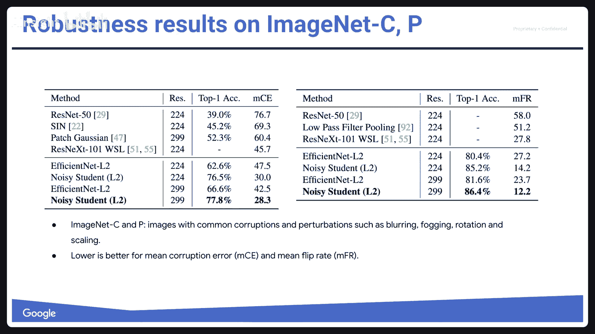
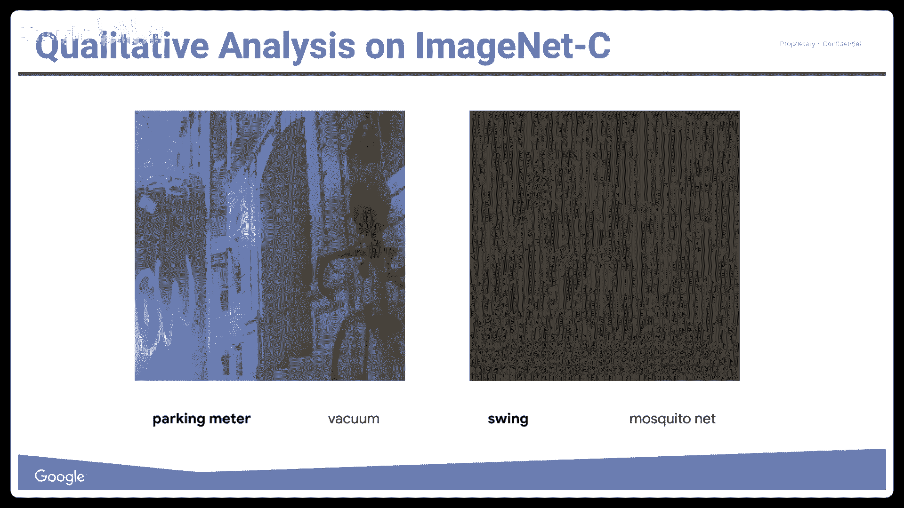
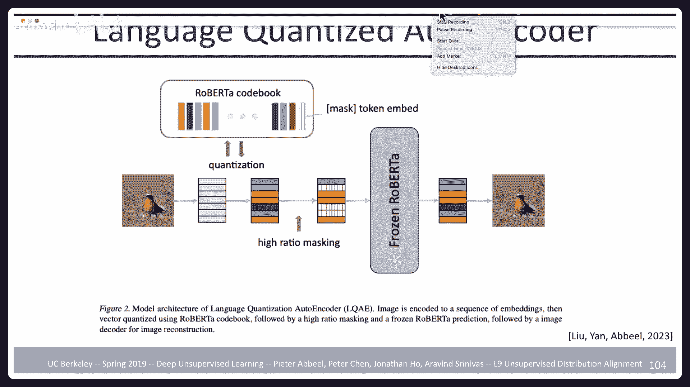

# [中英字幕] UC Berkeley 深度无监督学习 CS294-158-SP24  ｜ 2024年春 （更新至0824） - P10：10 半监督学习和无监督分布对齐 - AInsight - BV17W421P7QA

好啦，嗯，让我们开始嗯，欢迎上课，今天我们有两个主题，半监督学习与无监督分布比对，在我们这么做之前，关于我们这学期进展的快速综述，所以我们的家庭作业做了一半多一点，四个昨天到期。

虽然你们中的一些人可能在利用迟到，还在努力，那很好，但如果你一切都准时的话，你已经完成了这门课的最后一项家庭作业，那么今天我们就有，这是第十讲，我的最上面的幻灯片错了，已经是第十讲了。

半监督学习与无监督分布比对，嗯，下周是春假，周，在伯克利，所以没有讲座，一周后我们将讨论压缩，星期五也是，两个星期后的明天，您的项目里程碑到期，这意味着您希望在项目上取得一些进展。

把一份三页的报告写进谷歌文档里和我们分享，所以我们可以看看，给你一些反馈，提出建议，或者只是告诉你它看起来很好，你做得很好，或者告诉你，情况不妙，但那时加速，下周我们期中考试和讲座结合在一起。

所以在接下来的一周左右，我们将生成一份期中学习讲义，不要太担心，只是会像任何地方一样，你知道10到15页的方程式，这将是一个问题的答案，问题答案，期中考试时我们会问你三个问题，你提前知道问题。

只有十个可能的问题，也许十五个，你会得到三个，你把它们写在一张纸上，答案，如果你想记住，那太好了，但理想情况下你我是说，记忆，我们知道给人深刻理解，下一个令牌预测就是您所需要的一切，所以我不反对记忆。

上面有什么，我们提供的所有答案，但是你知道考试是不会有问题的，因为你提前知道的问题，你知道答案会是什么，无澄清问题，你只要拿到那张纸，你得到了，我不知道，二十分钟半小时写，你知道的，三页的答案。

在那之后，我们将有一个定期的讲座，在不同的房间，嗯，最后一周我们将有两个客座讲座，星期四，科学上的人工智能，另一个在井上，两个关于神经的讲座结合在一起，神经辐射场，然后我们星期五上最后一课。

所以那个星期我们星期五有一堂课，嗯，然后是正常时间表的最后一周，我们想要一个讲座，因为我们在一周前的星期五上了课，这就是未来，然后你们的最终项目报告和最终项目视频演示将于，有什么关于物流的问题吗，是啊。

是啊，他们会的，或者如果我们看到他们变得非常安静，因为可能是太忙了，因为作业，然后是期末考试的中期项目，原来没那么忙，也许我们会，我们会，我们会重新计划的，嗯，但现在他们会，它们会保持不变。

今天我想谈两个话题，半监督学习与无监督分布比对，这是一组有趣的话题，因为我认为从智力上讲，这些话题有很多丰富性，我觉得他们很刺激，同时，它们不是最近最活跃的研究课题，嗯。

我认为这个领域已经转移到了一个非常大的领域，海量数据集预训练，与专门研究这些想法相反，嗯，他们可能已经成为过去，他们再也不会卷土重来了，也可能是你知道，也许是他们东山再起的时候了。

或者至少对于某些类型的设置，卷土重来，我们将看到的，嗯，所以半监督学习，我认为这张照片很好地解释了，问题设置是什么，显然我们想在更高的维度上做，但是监督学习是左边的东西，你得到了一堆数据点。

你得到了分类标签，然后你应该找到一个决定的界限，顺便说一句，这被称为半到半个月的构型，一直走到右边，无监督学习，你没有标签，也许你仍然可以争辩说，你可能会恢复到有两个集群，如果你做得很好，无监督学习。

你只是不知道标签会是什么，中间的半监督学习介于，您的大部分数据没有标签，但有些数据有标签，如果你仔细看，你可以说，哎呦，也许我希望你知道，如果蓝色标签在哪里，我可以把这些标签传播到附近没有标签的。

从那里发现整个半月都是蓝色的，另一半应该是，嗯，这就是半监督学习的意义所在，从附近未标记示例上的标签展开，完善你的决定，因为顺便说一句，如果您所训练的只是中间图片中标记的示例，你在问题中失去了很多结构。

但是通过使用未标记的例子，以及你如何决定在哪里划定你的决定界限，你可以得到一个更好的解决方案，这就是半监督学习的思想，所以分类是典型的设置，嗯默认情况下，我们知道它是在完全监督下完成的。

您有由图像和标签组成的训练数据，新图像的预测标签，假设半死不活，如果我们有一些标记的样品和许多未标记的样品呢，为什么呢因为标签通常比收集数据更耗时，所以你可以想象得到更多的数据比。

它是为了获得更多的标记数据，为什么这个设置很有意义，嗯，所以在半监督学习中，目标是使用未标记的数据，使监督学习产生更好的效果，历史上，许多机器学习从业者的信念是半，监督学习在低数据状态下肯定有帮助。

但是一旦你有了很多数据，已经没什么用了，是你知道的，你收集了越来越多的数据，有足够的标记数据，所以不需要做半监督的把戏，因为还有一个额外的诡计，也许这会让你做得更糟，甚至嗯。

过去的梦想是把曲线完全放在上面，无论上述数据制度受到监督，随着时间的推移，这绝对是真的，所以右边的曲线是目前的情况，我们会看到的，嗯，在这节课的前半部分结束时，嗯，但以前不是这样的。

直到人们发现了越来越好的半监督学习的方法，如此正式，问题的设置方式是在监督学习中，你有X和Y，X是输入，y是输出，它们来自x和y上的联合分布，然后你试图最大化，让我们说，在最大似然学习设置中。

给定x的y的对数概率，也许有一些正规化，在半监督学习中，你有两个数据集，无监督数据集du和有监督数据集d s，在无监督数据集中，你只有轴，但它来自于x的分布p，也就是p x y的边缘。

所以px和pxy的分布是一样的，只是在一个情况下，你不能看到Y，所以只是一些数据没有标记，你既没有钱也没有资源，以其他方式给它贴上标签，但它是以与你标记的数据相同的方式收集的。

所以实际上这里有很多有趣的想法，演讲的方式是，最后一个对着它发出声音，是成绩最好的，但它实际上汇集了其他人的想法，所有这些想法都倾向于一起使用，所以让我们从最简单的最早的开始。

所以你可以做半监督学习的一种方法是通过熵最小化，这里的直觉是什么，我们说的是分类器的熵，因此分类器输出对数概率，假设给定x的y标签是给定x的y上的分布，分布有一个与之相关的熵，如果它很自信，熵低。

如果它非常模棱两可，也不知道标签应该是什么，熵高，校服处关门了，熵最小化之所以有意义，原因如下，我要训练我的分类器，我希望在我的数据点上，我没有决定的界限。

因为如果我认为我所有的数据点都应该属于一个类或另一个类，两个阶级之间应该有明确的界限，那么我的任何数据点都不应该在两者之间有分类器的怀疑，所以通过把这个最小化放在那里，本质上，你的意思是。

当我在两个类之间画出我的决定界限时，把它画在没有数据的地方，把它画在数据之间的空白处，因为它更有可能在那里，穿越到数据的密集部分，所以正式地，你的目标函数中有两项，您将分类损失降至最低，然后你最小化熵。

现在请注意，当谈到熵化时，这是在您的数据点上测量的，所以它在寻找每一个数据点，那是没有标签的，你的分类器在那个数据点上的熵是多少，所以如果你把每个数据点都调低，那么您的决策边界将远离您的任何数据点。

可能是也可能不是把它放在，但这是这里的假设，将有一个干净的分离，你会发现它通过它，是客观的，你可以做一个更渐进的版本，这可能更常见一点，在标签数据上训练分类器y给定x，然后你重复。

在未标记的数据上计算给定x的分类器y，然后为最常见的标签分配伪标签，让我们说十个最自信的标签，你说，好啦，我只是要相信分类器，这些现在可以被视为标签，用于我的下一轮分类器培训，我又训练了，我重复一遍。

直到所有未标记的数据也被标记，它实际上是熵最小化的一个渐进版本，因为你最终要给每个人分配一个专用的标签，一个你正在成长的数据点，或者从视觉上看你把它长出来了，从你熟悉的事情到你不熟悉的地区。

这种逐渐的增长可能会导致更好的决定，就离标签数据点更远的区域而言，因为你用数据的密度来指导事物的增长方式，所以把这看作是一个，也许是一种实现熵最小化的方法，这是一个可能导致更好结果的程序。

只是因为它的结构和直接的熵最小化，因为你不知道你会陷入当地的最低限度，当你直接做的时候，好啦，所以我们直接在目标中看到了熵最小化，作为伪标签的替代方案，渐渐地，然后做一些你能做的事情，这是许多最成功的。

最近的方法是考虑标签一致性和数据增强，所以每当你训练分类器，通常，您有有限的标记图像供应，什么有标签或没有标签，无论哪种方式都可以生成增强，你可以说我要把它翻过来裁剪一下，我要把它缩放一下。

你可以做各种各样的事情，不改变标签，要分配给此图像的，这增加了您的数据集，如果所有东西都贴上标签，你只是有一个更大的标记数据集，如果某些图像没有标记，你仍然可以争辩说，事实上，它们是数据集的一部分。

来自相同的分布，即使我不知道标签，这两个应该有相同的标签，不是不同的标签，因为它们来自同一个原作，所以这是一个不变量，我也可以强加给我的未标记数据，该增强不会改变分类器对未标记数据的输出。

所以这样做的方法是，确保分类器的逻辑相似，然后你可以做很多，许多增强，很明显你可以裁剪东西，把东西裁掉，你可以灰度，您基本上可以做一个行过滤器，所以贝尔滤波器，等等，所以说。

所有这些都是您可能已经在标签数据上使用的合理增强，只需将其应用于未标记的数据，所以这是关键的想法，现在它将以几种不同的方式化身，圆周率模型说我有一个例子，可以标记或不标记，所以彝族，虚线显示它可能是。

不可能有，取决于它属于我的标记或未标记的数据，我有这个例子，我随机选择增强，所以我会在原版的基础上做两个不同的增强，然后我把它输入我的神经网络，使用辍学，为什么这会导致这些东西的处理方式发生更多的变化。

我得到了一个叫做z的logits，我得到了两个不同的逻辑向量，两个增强体各一个，然后取一个不知所措的函数，说z i和z tilde，我应该在附近，因为它是对原来的东西的增强，现在如果我有一个标签。

我还介绍了交叉熵，损失，做这件事最简单的方法，值得注意的是与我们前面谈到的事情的联系，想想像这样的事情，逐步扩展标签集，这是，从某种意义上说，逐步扩展标签集，如果你有一个。

您希望对该标记示例进行不同的增强，以有效地生成相同的标签，因为同样的logits，如果您有一个未标记的示例，只是想确保在一个区域内，分类器不会很快改变，所以分类器应该保留这种东西。

而不是在本地的任何例子周围做出一致的决定，所以这是伪代码版本，每小批，您评估扩展输入的网络输出，然后用不同的落差和增加，您有标签的监督损失组件可用，如果无监督损失分量更新网络参数，有一件事。

你可能不太喜欢这个，每次你要计算或通过你的网络两次，你有两个增强器，你得把他们两个都处理掉，所以当你迭代你的数据时，多轮，数据的多个时代，你在某件事上一次又一次地做大量的工作。

也许你可以用稍微不同的结构，所以这里所做的基本上是针对每个数据点，你跟踪一个时间平均逻辑向量，所以下次你来的时候，你还记得上次是什么吗，你试图用你的新logits输出来接近这一点。

所以把它看作是一种获得不同增强的不同方式，这是一种不同的增强，因为上一轮总是随机的，你用了不同的增强，只是随机地得到了一个不同的，它也是通过另一个网络提供的，即网络从上一轮到上一轮的更新。

所以这也发生了，从某种意义上说，这让你有点落后于，但也许没关系，嗯，也许它引入了一些很好的平滑，嗯，那是暂时的版本，这个的时间合奏版本，嗯，你有什么不喜欢的，它假设有两件事。

有一种观点认为你会有一个足够小的数据集，你需要在其中运行多个时代，否则这根本说不通，它假设你愿意保持在历史上的平均logits附近，对于每个数据示例，所以除了存储示例，你把这个额外的，嗯，嗯信息。

我想有了它，嗯，这是伪代码，已经经历过了，嗯，那么，除了存储平均值之外，还有什么其他选择呢，你身边有两个模特，为您保留的每个数据点设置logits，你在周围有两个神经网络，一个是平均时间。

有时在另一个的移动平均版本上延迟，所以现在你希望他们两个都是一致的，你可以把平均时间看作是落后的，因此，您可能在某种意义上使用了以前增强的输出，因为它是基于这些增强而训练的，所以它更像那些。

和做新的增强有类似的效果，在那里你有显式的对，所以叫我老师，所以在这种情况下，嗯，我们有两个模特要照看，但不必在每个数据点上保留额外的东西，另一件事是在这里，你不需要等待多个时代，这招管用。

即使在所有数据中只有一个纪元，你可以随时拥有，你知道的，两种模型比较它们的输出是损失的一部分，对我来说，这些事情总是有点不尽如人意，即使它工作得很好，仅仅因为把损失和时间放在一起。

普通版的你有点像滑稽的修女，不那么静止的目标，直到你最终汇聚，我想当你都做完了，嗯是的，它很受欢迎，我想，呃，菲利普掩护你掩护比尔对，与无监督学习类似，你在那里呆了一段时间，您的模型的历史平均版本。

以比较输出并使其接近，这里有另一种方法，嗯，我只是举了一个对抗性的例子，你拿一个分类器，也许有些图像是一只狗，你想要分类器，即使它现在叫它猫是对的，然后你对像素进行梯度传播，而不是进入重量，更改像素。

以至于现在分类器决定是一只猫，嗯，那是为了这里的目的而分类的，建议是，如果您是标记数据点，你不想让它成为你身边的候选人，决策边界更改为不同的类标签，所以你可以说，好啦，然后我需要填满我附近的整个球体。

与我自己具有相同标签的附加数据点，或随机增强，尽量获得良好的覆盖，那是一种办法，这就是我们目前所看到的，以及运行优化的替代方案，假设我要在一个小区域内管理一个反对派，我的分类器在哪个方向上变化最大。

你往那个方向走，查找现在增强的数据点，你说它需要和我一样的logits，我的原始数据点，分类器能改变其输出多少，好啦，然后有一张纸，嗯是几年前做的，现在呢，深度半监督学习算法的现实评价。

关于这篇论文需要注意的几件事，我们将看看他们强调的一些结果，当时在半监督学习中发生的一件事，每个人都用不同的东西，本质上是你写一篇半监督学习论文，您甚至可以对以前使用的人使用不同的数据集。

如果使用相同的数据集，他们可能用了它，我不认识一个18岁的女孩，我用的是一，五，二，你说，哎呦，我的比你的好，但感觉还好，嗯，完全不同的神经网络架构是你更好的方法，还是你的神经网络结构更好。

我们不知道其中一部分是，只是神经网络的结构变化太快了，使用最新和最伟大的，但结果是你不知道这是最新最伟大的建筑，给你更好的结果，或者你的新想法能带来更好的结果，所以他们决定做一个仔细的比较。

他们使用广泛的共振来确保网络足够有表现力，网络本身的表现力没有什么是瓶颈，所以他们比较了cfr 10和svh 10，Cr ten就像一个十向分类任务，而SVN是，我觉得，呃，街景门牌号分类um。

有四千个标签的例子可供这个半，在数据集中运行监督学习，有更多标记的例子，但由于半学习希望使用少量的标签，并显示出良好的效果，只允许使用部分标签，即使整个数据集可作为未标记的示例，在这种情况下。

监督学习得到20%的错误率和12%的错误率，所以不可怕，但不是很好，随机增强的PI模型，把logits靠得很近，十七，所以最好是老师，是圆周率模型的近似值，在那里你保存了一个历史，每次显式重做两个增强。

嗯实际上比圆周率模型稍微好一点，关于你的关系网的历史平均值，似乎给了你一个更有趣的信号，嗯，对抗性训练，这叫虚拟，虚拟对抗训练，嗯做得更好，我得到了最好的单法结果，然后首先是带有额外熵的对抗性训练。

最小化损失，做得更好一点，和伪标签，你知道的，它和其他大多数都差不多，所以你在这里看到的是，也许有一个观察是，它们的性能都很相似，但如果你真的想把它们分开使用，大缸在这里给你最好的表现。

他们在一项研究中发现，在许多标记的数据点上，这种差异是如何变化的，因为也许有些方法用很少的标签就很好，和其他更好的与大量的标签，谁知道原来趋势是相当一致的，V A T在底部，哪个最好。

在cfr ten和svn的标记数据量上保持一致，所以把它看作是一种非常有效的方法来平滑分类器，你想要的分类器函数没有陡坡，基本上在数据点周围保持不变，V a t通过找到它仍然变化最大的方向来做到这一点。

并为此进行有效的惩罚，Quand在谷歌的合作者，在半监督学习方面做了很大的努力，在更大的范围内工作，将其从C远SVN移动到Imagenet，有一系列的文件来完成这件事，稍微改变一下，怎么做的。

但一些关键的想法实际上保持不变，这仍然是关于数据的增强和一致性，最普遍的原则是，这几天，数据增强后的一致性意义，logits应该相同或非常接近，因此，将数据增强的状态应用于未标记的数据。

半监督学习中的通贯一致性训练，所以当时钟表集团在推进数据增强方面取得了很大进展，是为了视觉输入，尤其是，但也有一些是为了语言，然后嗯，现在我想看看我们是否真的用了最新的，它对半监督学习有什么作用。

所以这张作者之一的幻灯片，在这里，你有标记的数据，在上面你有监督十字，熵损失，您有未标记的数据，您可能会在这些数据上，嗯，增值税是一种增发方式，找到使分类器更改最多的更改，当然你不希望分类器改变。

但通过发现这种变化，您可以将其添加为需要保持日志相同的示例，你在增强和原始之间有无监督的一致性损失，您还可以添加噪声来规则化模型预测，除了有一个大缸，然后他们一起被组合在一起，以获得最后的损失。

最上面的一排是他们展示的，跑步时会发生什么，这是两个卫星的数据集，随着时间的推移，它很好地将标签扩展到您希望它们去的区域，然后他们有一个基线，基本上不是真的，增值税只是，比方说你可能想做回译的语言。

也就是翻译成另一种语言，再翻译回来，这给了你对你已经有的句子的重新措辞，所以新句子的意思应该和原来的句子大致相同，所以现在，你的增强Auargue是一个谷歌开发的系统，你有，一些重新着色，使图像变暗。

更明亮，磨砺它们，裁剪它们，把东西裁掉，倾斜它们，各种图像的增强，也被训练来找到正确的混合，优化分类器性能的，所以这是奥增强，然后TF IDF单词替换意味着，本质上，你有文本，本质上。

把它看作是查找单词的嵌入，如果你能找到另一个嵌入非常相似的词，把它换了，这就是你的增强，所以这些我们通过回译的例子，考虑到低预算和生产限制，这部电影很好，因为它在预算和生产限制方面非常有限，电影很欢快。

所以这就是你可以希望的事情，嗯，当你做这个来回翻译时，作为您的数据增强，所以我们的增援部队基本上有一个训练有素的政策，通过某种有限形式的强化学习来决定多久取样一次旋转，亮度转换，以此类推或其组合。

他们与当时的语言实验进行了比较，分类的最新技术和语言，让我们说，情感分析分类或电影分类类型，等等，嗯，伯特提供了一种状态，在这种状态下，你可以训练一个伯特模型，这是一个省略词预测模型。

我们在几节课前讨论过，然后你可以在bert上面放一个分类器，对这个分类问题有一个解决方案，所以这是一个无人监督的预训练，接下来是微调，他们看的是什么，如果我们没有那么多标记的例子，我们还是要去预习。

因为预习似乎是个好主意，我们不应该把它扔掉，但我并没有，假设IMDB的两个5K标记示例，我们有二十个例子，就是这样，我相信在这种情况下，有一到五星，所以有五种可能的分类标签，你基本上每个人都有四个。

就这样，可用的数据少得多，可以初始化网络随机鸟基，是一种较小的鸟类模型，鸟大再鸟微调，你在这里看到的是微调，全面获得最佳性能，与以前相比，包括用更多标记数据训练的比bert大模型更好的，更多的标记数据。

这告诉我们，我们在这些数据集中拥有的所有标签数据，标签上没有那么多信息，信息更多在投入和产出中，因为半监督学习本质上是在说，我基本上可以忽略标签，我可以自己想办法，密度和决策边界在哪里，嗯，很有趣的是。

是这样的，他们也有一点防止过度训练的保护，当你在训练的时候，你不想失去，过分强调少数例子，并尽可能地适应它们，不断改善你的损失，所以一旦你超过了标签置信度的某个阈值，它从损失函数中取出。

对结果没有太大影响，所以这就像平等地对待你所有的数据点，我想就重要性而言，不要让任何人主宰，然后有不同的时间表，事实证明，不同的时间表更有益，语言与图像的不同时间表，不幸的是，他们没有相同的最佳时间表。

但这就是他们工作中的结果，嗯，以前的技术水平，投影仪不知什么原因不高兴，以前的红色艺术状态，这在IMDB上，这是电影的情感分级，半监督方式实际跑赢，完全监督的方法非常令人兴奋，他们当时做的视觉实验，嗯。

他们看了以前的艺术状态，嗯又是C远和SVN，一共七点六分，三点五三，它们可以潜到它的正下方，通过这种无监督的数据增强，如果他们使用更大的神经网络，针对这些问题进一步完善神经网络，他们可以做得更好。

如此明显，也知道建筑在当时仍然很重要，要继续完善，本质上，他们在这里看到的是你可以用4000个标记的例子来接近，与5万相比，一旦你使用这种半监督学习，嗯，其他四万六千个例子是在没有标签的情况下使用的。

只是想说清楚，你还有空位，只是不是标签，事实证明，这很有效，你非常接近，在这种情况下，当你有标签，与不同的增强技术进行了测试，并意识到真正擅长增强方案是很重要的，因为它最终驱动着你想要的相似。

你是说我想让这两个相似，那是我的，这就是我的增强器告诉我的，重要的是你有多好的计划，Imagenet他们也尝试了，并在那里得到了一些非常好的结果，未标记的数据，这也是Imagenet的数据。

所以你得到了10%的数据仍然标记，百分之九十变成无标签和，当然可以通过半监督学习来帮助，与只做监督相比，监督十给你五五，把百分之九十的人带进来，其他未标记的数据使您达到68%，最高精度。

他们没有试图增加它，即使有更多的数据，他们把谷歌的私人数据集，JJFT，嗯，那并没有真正的帮助，所以你在这里看到的是，不知何故，这个半监督的假设，了解未标记的数据来自相同的分布。

这就是为什么你可以把你的决定边界移到正确的地方，当它来自一个非常不同的发行版时，只有几个标签，呃，好像对你没什么用，嗯，他们看了学习率，呃不，他们不是学习，当分类器是，嗯超过一定的信心水平。

有关文本数据集，请参见此处，您最好对图像数据集使用指数计划，更好地使用线性时间表，因此，数据增强作为半监督学习的一种扰动是非常有效的，作为一种基本的方法来感觉密度在哪里。

然后把你的决定界限放在正确的地方，UDA在语言和视觉方面都有显著提高，与以往作品相比，与迁移学习结合良好，你可以在鸟上预先训练，但仍然会康复，使用预先训练的模型，也就是鸟，而且还能得到更多的好处。

从那里，谷歌集团，然后看了看什么，嗯，他们是亲戚，但后来就有点不同了，它工作得更好一点，他们说，而不是为了不同的增强而把logits放在一起，看看不同增强的不同逻辑输出，取他们的平均值，然后增加得很好。

把温度调低一点，把分布再锐化一点，以此为目标，所以你可以认为，哎呦，一点点，有点像伪标签，这就像，你知道的，我对标签有一些猜测，我要加深这些猜测，一点点，我会有多种猜测，把它们组合到我想磨的那个东西上。

我正在努力把所有的输出集中在一起，但不是靠在一起，这和让他们走得更近是一样的，嗯，但这只是一个轻微的调整，允许它也引入锐化操作，他们还做了一些我一直觉得很有趣的事情，但不知何故，它有点工作你。

尤其是他们的所作所为，在像素空间中直接向上取两个数据点，然后你也平均他们的标签，意思是嗯，如果是猫和狗，那现在你有百分之五十的猫，百分之五十的狗，把两张照片平均一下，这成为一个新的标记示例，这叫混淆。

嗯，我一直觉得期待，会有什么好处，我认为这里的直觉是你本质上强迫你的神经网络，找到最简单的答案，就像你希望的那样，你知道的，不做复杂的事，尽可能地靠近，到像素中已经存在的东西，才能找到答案。

是最接近原始信息的状态，平均分越高就越平滑，这就像一个平滑的，嗯，本质上，你想用你的神经网络结束的地方，这是完整版，那么他们做什么，他们说我们有X标记的数据，U表示未标记的数据，所以你有你的标签数据。

您执行增强或多个未标记数据，你也在上面做数据增强，现在对于这些数据点中的每一个，你有一个目标输出，你有那些最初标记为目标的数据，现在有了增强和目标输出，未标记数据，现在是增强，他们偏离了目标输出。

那你基本上，这就像一个，我想它的编码版本，但从概念上讲，你本质上是随机的，生成一个新的例子，字面上是原始的平均值，而且标签也是原版的平均值，所以这里的这个操作，此混合操作应用于此数据生成过程的最后。

这整件事甚至不能训练一个分类器，所做的一切，将未标记数据的标签转换为增强版本，具有锐化的平均logits，然后进行混合操作以获得新的数据，在你的原始数据的插值中，因此，有时通过与空间相关联的目标。

可以更好地覆盖空间，一旦你用完了，然后对标记的示例进行交叉熵损失训练，其中的逻辑，嗯，嗯，你在这里看到的是，嗯，混配，这个所谓的和黑色实际上比我们到目前为止看到的方法更好。

以前最好的是增值税虚拟对抗训练，与这里的黑色曲线相比，没有那么好和黄色，很复杂的手术，但它碰巧工作得很好，更有竞争力，现在不确定细节，本质上查看可用标签的数量。

看到混合匹配通常可以在标签百分比上给出最好的结果，然后我们就到了迄今为止最好的型号，我认为吵闹的学生和吵闹的学生一起自学，所以这是第一个真正实现这一点的模型，我们会在他们论文的最后曲线中看到。

真正能够始终如一地拥有半监督，表现优于全面监督，所以他们所做的，他们有数据，他们做了他们做了增强，网络媒体中的辍学随机深度，有时你基本上跳过了一层，因为这些网络有跳过连接，你甚至不这样做，去穿过跳板。

你忘记了在那一层发生的实际事情，所以随机深度，UM训练学生模型与组合，所以所有这些都发生在你的数据上，你训练一个模特，推断伪标签，意思是你最自信的地方，你分配一个标签后，你做了，你回去。

到目前为止有这些标签，我所说的只是数据增强和伪标签，现在真正重要的是当你回去训练你的动作时，你应该搬到这里来，其实呢，当你推理的时候，伪标签，你只要用一个直接的图像，你训练的一个你使用数据增强，辍学。

随机深度，所以可以这样想，如果你的形象保持干净，它什么也没发生，对于其中的一些你变得自信，你可以知道标签，现在你是说，如果我对图像进行大量转换，如果我在神经网络的处理中加入大量噪声。

我应该对这个标签还是有信心的，所以你有效地迫使神经网络，不仅仅是对特定的图像有信心，但是图像周围的整个区域，一旦你用完了，电视网知道的不仅仅是那个标签，它现在知道了这个例子周围的整个地区。

实际上你又去了，您可以查看其余未标记的示例，看看你现在对哪些有信心，然后重复，其中一些是思想的具体化身，我们已经讨论过了，它是伪标签与这种概念，嗯，然后以一种更嘈杂的方式训练，一旦你有了伪标签。

伪标签也不是硬分类，它们是您试图匹配的逻辑，嗯，这里有更多的细节，数据现在在imagenet上，所以他们真的想证明这可以在曲线上工作，Imagenet是真实的数据，你会有未标记的数据在旁边。

更大版本的JFT 3亿张无标签图片，希望能看到，不管我们有多少来自imagenet的标记示例，因为我们还有另一个未标记的数据集，我们会得到一些比只有监督更好的东西，在，嗯，达到88。4%。

以前最好的版本达到了86%，所以它确实在做，嗯，所以他们实际上成功地完成了他们开始做的事情，我觉得这条曲线在国内真的出了问题，它们表明，这个吵闹的学生版本胜过任何其他类型的成功。

Imagenet过去的成功，精度性能排名第一，水平轴，以下是网络的大小，所以当你发展一个更大的网络，你得到了更好的表现，但在这里你看到了，持续嘈杂的学生训练给你最好的表现，与以前的方法相比，好啦。

然后他们看着，所以有一些版本的提到更难，已经被释放的，所以他们一直表现出，同样，在这些更难的imagenet版本上，您可以获得最好的性能，用这种吵闹的学生方法。

是啊，是啊，所以总而言之，半监督学习是两种情况下的一个重要问题，大量的标记数据和更多的未标记数据，或者很少的数据标记数据和大量的未标记数据，从历史上看，最重要的是人们所研究的，但是没有噪音。

学生版本已经表明，即使是第一个版本现在也有可能获得成功，所以这很令人兴奋，这是两个不相干的话题，顺便说一句，它们都是较短的话题，这就是为什么他们一起上一堂课，嗯，所以这里的后半部分主题是无监督分布对齐。

问题设置是什么，我们可以从一些，也是变量b上分布的样本，但不能接触到A和B之间的联合样本，我们需要估计如何从一个，从一个，从b到a，从A到B，一个例子可以是翻译，你有一个英语语料库，鲸语语料库。

说得很具体，你怎么能从那些分开的尸体，想办法在两者之间翻译，现在这可能很难，因为这可能是鲸鱼谈论的一个很大的不同，我们谈论的，但是想象一下英语和法语，嗯，我们没必要那样做，因为我们在智力上有成对的句子。

你可以问这个问题，我们能不能从一个英语语料库和一个法语语料库，找到两者之间的翻译，这可能是第一次瓷砖转移，也许你有一个真实图像的图像语料库，其他属于某种风格的绘画的图像，你想在两者之间找到一个翻译，嗯。

还有其他方法可以做到这一点，本质上是通过语言条件作用等等，但在这种情况下，我们希望在不同的领域有效地拥有两个不同的数据集，从某种意义上说，你想让他们找到，找到他们之间的匹配，如何转移。

您还可以增强标记的示例，所以如果你有办法，例如，从规则图像和分段图像之间，这是两种不同的分布，你发现了两者之间的翻译，您可以开始用分段自动标记新图像，这就是我们要解决的问题，一个人是最耐人寻味的人之一。

比如智力问题，最简单的例子，当然是有人写文字，但他们有密码，在那里它们排列，从a到z的字母，它们有一个排列，当我我的话是一个它，我要把它写成C，让我们说，也可以写成d，然后问题就变成了。

你能找到我用来恢复我正在写的东西的排列吗，你可以想象，如果我用英语写作，然后将这个排列应用于它，你能把它找回来，当你看够我的作品，你可以说好，经常有这种三个字母的事情发生，最常见的是什么。

英语中的三个字母单词，也许这个单词是英语中出现频率最高的单词，也许这是一个，所以你可以开始看到像，也许你知道，找到拼图的一些碎片，从那里找到拼图的其他部分，这更像是一种人类的方法，尝试解决这些难题。

但这实际上是我们试图解决的难题，您有这个未对齐的数据，但你知道应该以某种方式，你试图找到它，就像我说的，这可能与机器翻译有关，尤其是在我们没有多少尸体的语言中，这只是一种语言，要么动物说的可能更难。

TED关于分配不匹配，但是语言是由较小的人口使用的，他们可能没有写那么多书等等，而且肯定没有在他们的语言和另一种语言之间写出配对的文本，嗯，一些论文中还有另一个例子，你有，也许白天就可以了。

只是花了一个晚上，这些显然不是，呃，完美匹配，但有我的意思是，你可以把它看作是一个很好的翻译，把这张白天的照片变成更黑暗的版本，嗯，所以你可能没有可用的，这是另一件你可能没有的东西。

白天图像然后同点图像，夜间，你只是有一堆白天的图像，一组单独的夜间图像，所以这不是一对一的问题，中的数据点之间的映射，另一个中的数据集和数据点，它是关于在这些分布之间找到某种对应关系，总体情况。

这是我的Ayosha小组，几年前，他们有一个数据集这张照片，另一个是莫奈的，然后他们可以要求它学会从一个翻译到另一个，包括翻译莫奈没有为之作画的图像，但你可以把它变成相应的，他们用斑马和马做的，在那里。

一旦你完成训练，你可以把斑马变成马，或马成斑马，即使，从来没有人给过你一对数据，你如何把这匹马变成斑马，尤其是，所以我们称之为问题设置，我们可以获得P和PB的样品，在没有任何接触的情况下。

但我们需要估计它们之间的条件，顺便说一句，条件句实际上可能是一个分布，真的可能是给一个B很多可能，因为它是一个分布在可能是，在其他环境中，可能你期望找到的是确定性的东西，你就像，给定这个特定的b。

这是对应的A，就是这样，这两起案件都很有趣，也很相关，人们应用了两个关键的想法，边际匹配是这两种方法中的一种，我们试图了解a和b之间的关系，所以我们试图找到给定b的近似值，用一些参数化神经网络。

给定b和相同，反过来，我们试图在给定，我们有什么可用的信息，我们知道如果我们从原始分布开始，假设在一个空间里，然后我们用变换去b空间，它应该与b空间中的边际分布相匹配，反过来。

如果我们从b上的马分布开始，我们做转化，我们应该得到一个正确的边际分布，嗯，就像我说的，有时是用极小映射来完成的，那是你对神经网络的选择，但总的来说，这可能是一个概率映射，嗯，尝试做到这一点，好啦。

所以让我在黑板上画一个例子，所以想象一下我有一个空间，还有我的，这些是专业的，这实际上是一个特定的概率，特定的概率，B和A可以承担，假设我不知道，β或γ和b的值，也许一个，假设概率分别是。

可能α的概率是零点一，β是零点三的概率，伽玛有零点六的概率，现在让我们在这里说，这个概率是零点六，二的概率为零点一，三的概率是零点三，在这种情况下，应该清楚的是，这个问题有一个自然的解决办法，对。

你应该希望阿尔法和两个匹配，贝塔升到3，伽马升到1，因为如果你那么做，如果你是这么想的，然后从一个分布开始，经过映射，你确实会得到一个正确的零点六年，一个正确的零点1在这里，在正确的零点3这里。

所以你在每个点都以正确的概率质量着陆，如果这是你用的映射，任何其他地图都不会很好地着陆，我知道这个神秘的制图师不会把正确的概率质量，还有其他随机映射也可以让你得到正确的概率质量，所以你可以决定伽马。

让我们说，以某种方式在其他一些之间分裂，beta和alpha也是如此，你仍然可以得到正确的质量，但最简单的解决办法可能是，可能最有意义的是想和，是特定的确定性映射，所以直觉上是非常可行的。

从某种意义上说，通过知道我们希望边缘在转换后匹配，在某些情况下，在这个特定的场景中，在某些情况下，它决定了一个自然的解决方案，如果我们保持神经网络简单，希望它能找到自然的解决办法，与更复杂的东西相比。

它更容易表示，是啊，是啊，问题，但我只是觉得我们对同样的事情做了一些假设，以及发行版是用户应该在的地方，所以问题是，我是说，我做了很多假设，是啊，是啊，我给你举个例子，一个非常具体的例子。

在那里我们可以自然地推断出一个解决方案，好了，现在，对于真实数据集，通常很难想象他们，以这种方式将它们形象化通常并不完全不切实际，但我想说的是如果我们考虑一个非常简单的例子，其中a和b都是空格。

变量只能有三个值，如果边缘是这样的，存在着一个与另一个匹配的排列，有一个非常自然的解决方案，所以边际匹配的概念，至少对于某些数据集，它强加了一定的解决方案或一组解决方案，如果你允许它是随机的。

但如果你想要一些简单的确定性的东西，你只剩下一个可能的解决办法了，从某种意义上说，这类似于，假设我们从英语转到法语，如果法国人和英国人，语法上，更多的是排队的语言，同样经常地谈论同样的事情。

那么这就是你所需要做的，你只需要找到正确映射单词的排列，即使你从没见过监督，因为他们说话很有效，同样的故事，我想看看边缘，你应该能把东西排列起来，但这绝对是一个非常非常具体的假设，但这是一个很好的起点。

至少在这些假设下，事情可以很好地工作，我经常想当你做一些新的事情，去看很简单的案子是很好的，即使在一个简单的案例中，这说不通，你是，你麻烦大了，因为那样也许我就永远说不通了，嗯，顺便说一下。

也可以模棱两可，这又回到了你的问题上，如果不是这样呢，零点三也是伽马，然后是一个三角洲，也有零点三，现在怎么办，我如何从A到B，哪一个去哪，即使是对确定性映射的限制，嗯，其中两个会在这里达到零点六质量。

他们中的一个会去那里，但我有很多选择，在回来的路上，也有很多选择如何回去，这个肯定是随机的，因为它必须被分开，但即使那样，如何回去也有很多选择，所以即使有一点点变化，这种，你知道的，从某种意义上说。

令牌置换交换的令牌可能并没有给我们想要的一切，所以这很棘手，它并不总是有效的，但是，还有其他事情，其实呢，如果我们讨论边际匹配，我可以，我可以，例如，将边线匹配为，我会让它更简单地把重点表达出来。

我会给它一个第四和三个在这里，这是核心，也是零点三，我可以从A到2，这似乎是一个自然的选择，我可以从β到1，我可以把伽马射线升到3它可以升到4，但当我回来的时候，我可以代替两个人去，嗯，两个回到阿尔法。

那是唯一的选择，但后来一个而不是回到测试版，我可以决定去三角洲3，而不是回到伽马，我可以去嗯贝塔，从四我可以去伽马，所以我在这里想强调的是，边际匹配将一些信息强加给你想要的结果，但即使是简单的。

像这样相对简单的案例，它甚至没有强加一个概念，如果我走这条路，我回来了，我应该降落在同一个地方，我只要求发行量保持不变，人们在这里普遍使用的第二个原则是周期一致性，如果你从A到B，特定于a到a。

具体的b应该在往返时回到相同的a，嗯，你不应该像在奇怪的矛盾，所以在确定性映射的情况下，将变换应用于A到土地和B空间，然后把另一个，相反的转变，你应该回来，A和B也一样，这大大减少了可能性的数量。

所以这两个原则在所有这些方法中都很普遍，边际匹配周期，一致性，所以我们所说的边际匹配对于这个奇怪的解来说，一旦我们和我们的一致性，一个必须回到测试版，然后三个必须回到伽马，四个得回三角洲。

一旦我们在这里做出这些选择，我们就别无选择，所以解空间缩小了，所以我们讨论了两个我们知道为真的不变性，边际匹配与周期一致，我们也知道它们不足以有独特的解决方案，但我们知道至少对他们来说是好的，总的来说。

你还不够，所以你需要引入更多的归纳偏见，您所知道的关于这两个发行版如何匹配的事情，嗯，也许在你的建筑中，可能在你的损失函数中，也许你如何从两边选择数据来使这个工作正常。

你可以想象如果你试着把法语和英语联系起来，也许你可以选择某些书，我们说对了，如果是一本用英语写的关于某个主题的书，也许在物理学上，而不是一本用法语写的关于物理的书，或许你更有可能找到。

如果你随便拿一条英语短信，法语随机文本学习与鲸鱼相同的对齐，我想你得好好想想鲸鱼的生活，然后也许有人写了，就像电影剧本一样，关于轮子，用现实的方式对话，然后也许突然间你真的可以，比鸡和蛋的舞会还要大。

因为谁来写剧本，却不知道他们在说什么，但你需要做一些工作来最大限度地提高你在这里成功的机会，你想想多模态对齐，哪个，是啊，是啊，多模态，所以这很有趣，所以嗯，绝对正确，是啊，是啊，你从演讲到，你知道的。

我们有一段鲸鱼在那段时间互动的视频，是啊，是啊，我是说，我觉得你能注入的越多，越好，还有我们在语言对齐和图像对齐中看到的，它从来没有在像素级别上完成过，它从来没有在单词层面上完成过。

它是通过取更大的上下文并试图将句子对齐来完成的，尝试对齐整个图像或图像补丁，同样的事情，如果你能有多模式，它应该会更好，如果你只考虑人类语言，你知道的，好好想想，你知道如果有人，我不知道一个。

喝杯咖啡什么的，也许他们更有可能和别人谈论同样的事情，喝杯咖啡，所以那里的对齐，你可能会偏向那些更有可能排队的人，当时在说什么，同样的事情，如果有人提高嗓门，当然不同的语言是不同的。

但也许提高你的声音是某种迹象，这在另一种语言中更有可能是一致的，有人提高了嗓门，所以我想你能带来的越多，效果就越好，是呀，所以太空中最著名的作品之一，实际上是由阿廖沙·弗兰在伯克利的团队完成的，叫青色。

归根结底就是使用甘斯，强加边际匹配和强加周期一致性，因为我说我们需要做边际匹配，我们在黑板上画的一个例子上做我们的一致性，那很容易，但是你有两个图像数据集，你怎么连边际匹配。

如何做到循环一致性成为一个问题，那么他们是怎么做到的呢，或者提议去做，嗯他们说，用于边际匹配，我们所做的是我们有一个鉴别器，当你把某物放入另一个域，结果呢，假设一个新生成的图像，我们会有鉴别器损失的。

应该与该领域的其他图像无法区分，所以这意味着你产生的东西来自正确的分布，所以如果你做得完全正确，你现在应该得到正确的东西，当然我们经常做近似值，你的鉴别器没有看到整个分布，它只是一次看一个例子。

就像我们在普通甘斯身上看到的，但是一旦你做了你的转变，鉴别器要评估，不管它看起来是否来自正确的分配，这是边际匹配，他们基本上是用，把地图翻两遍看看你是否回到了起点，只是失去了一个，我去另一个域，回来。

我需要回到我开始的地方，那是个很有趣的假设，是的因为想象一下你试图在，你知道的，我不知道一个数据集，嗯，你知道一种动物，马对斑马，我可能很匹配，因为我只需要改变纹理，你可以回来。

但如果是现在不匹配的东西，你需要找到奇怪的通信，比如马的某种姿势意味着什么，与人类的姿势相匹配，因为你从，让我们说马对人和背，就像那是什么意思，什么是，你怎么编码这个姿势，马在里面。

你如何摆出人类的姿势，并仍然让人类在人类图像的分布中，对所以你可以想象发生的事情是，如果您的数据集有点不对齐，你本质上这个东西开始把信息隐藏在奇怪的地方，和小的高频模式，你知道对于辨别者来说很难区分。

但随后对信息进行编码，您可以将这些信息带回另一个域，他们还发现，如果你不小心，就会发生这种情况，但本质上他们展示的是萨根，如果你看每像素的精度，所以这是一个域是图像，另一个是分段。

你可以说为什么不直接以监督的方式从图像训练到相应的分割，嗯，他们只是想测试他们的方法，说让我们取一个数据集，拥有和分割，让我们有效地把它们放在单独的数据集中，找到对应的地方，他们发现他们有最好的有效。

也不是完全无人监督，因为在数据的另一部分中确实有分段，但你没有被监督通信，它比以前的无监督分割方法做得更好，在那里你预先训练，然后有，假设A嵌入决定像素级分割，他们还观察了当你移除一些东西时会发生什么。

那又怎样，如果你只使用循环，来来回回，那不太好，我们单独做了甘恩意味着很好的边际，这是相当好的GamPlus向前循环实际上有点伤害它，这又很奇怪，再加上向后循环完全摧毁了它，挺有意思的。

这些事情可能会以某种方式发生，但这样整个事情就会变得最好，所以这里肯定发生了一些奇怪的事情，嗯，似乎甘是最重要的部分，这意味着边际匹配是成功的最重要的部分，光靠循环是做不到的，我是说。

循环没有完成应该是合乎逻辑的，因为只要一个循环，您基本上可以转到另一个域，你甚至不需要在分销，如果你不需要配送，你几乎可以复制你自己的图像，没人会抱怨的，没有没有，没有说你必须留在分销。

你只要把它复制回来，你什么也学不到，所以这是可以理解的，光是这个循环就很难找到两个域之间的匹配，我认为奇怪的是，诱导向后循环本质上杀死了它，如果你没有正向循环，但是是的，你可以做这样的事情。

输入是一个分割的图像，输出成为，你知道的，写实形象，嗯，你可以有边缘图像，进入逼真的图像，或者反过来把逼真的图像变成边缘图像，嗯，你从苹果变成橘子，橘子到苹果，所以夏天，冬季，所以这很有趣。

这些东西在某些设置上起作用了吗，这些都是非常特定的设置，很明显，苹果和橘子在他们喜欢的方式上是可以互换的，把它们堆在一起等等，嗯，为了正确的数据类型，好像这里有什么东西真的能起作用。

他们还展示了失败案例，呃，你知道的，从莫奈到照片在这种情况下完全失败了，从冬天到夏天，没有真正去过夏天，所以不是，他们很漂亮，呃，关于论文中的局限性，然后还有一个作品说，好啦，棘手的是，如果你来来回回。

把我的损失强加给，你本质上是在寻找一个确定性的映射，这是非常有限的，确定性映射，并非总是可行的，一个单一的分割可以有许多化身作为一个真实的街景，街景通常有一个分割，但经常在其中一个方向。

你想要一个分布而不是确定性的东西，所以他们说，哎呦，我们应该引入一个潜在变量z，所以我从一个领域到另一个领域，同时也采样一个潜在变量z，我的条件是，这有助于我有一个随机的输出，而不是确定性的，还有这个。

从本质上讲，我们在这门课上所做的一切都做了同样的把戏，你想要分配，你的条件是一个随机采样的z，现在你从你的系统中得到了更多可能的东西，而不仅仅是确定性的结果，嗯，循环会发生什么，一致性损失实际上是。

如果你不小心，本质上问题是，如果你不知道当你试图回去时使用的Z，你没有办法回去，你需要Z的信息才能返回，所以你还需要引入一个变分推理网络来帮助恢复Z，有效地估计Z以帮助你回到正确的位置，所以那是。

当您真正想要概率映射时，这是一个很小的变化，然后他们谈论这个东西，它可以作弊，意义，本质上，它会做一些奇怪的事情，这些事情在当时被强调了很多，我不确定今天是否还很危急，但你从边缘图像到各种。

但后来发现如果你从鞋子到边缘图像，穿鞋，你总是拿回同样的鞋，所以这表明当你把一些东西变成边缘图像时，你就像躲在边缘的某个地方，一点点信息告诉它，是什么鞋的，并允许它恢复它。

所以有些微妙的事情你需要意识到，我觉得，和甘斯一样，总有一些微妙的事情，嗯，结果很有希望，但与此同时，让他们做一些事情是非常棘手的，就像你希望他们做的那样，所以你可以问这个问题，我们能做得更好吗。

我们有边际匹配，我们有心理一致性，我们能做什么可能会更好，通常这些域，正如我所暗示的，是高维度的，您有图像或文本，那就是，你知道的，一段或至少一句话，所以也许我们不应该把它做得太低。

我们应该在更大的层面上做这件事，我们可以从那里得到更好的排列，所以让我们说，看NLP，A是所有的英语句子，B全是法语句子，两个语义上不相关的，因为和b可能有相同的频率，所以如果你们互相交换句子。

算出来了，但如果你更深入地观察这些话，可能不会成功，因为这些词也出现在其他句子中，然后突然之间事情就不顺利了，所以这个想法实际上是同时做，尽量在单词水平和句子水平上保持一致，突然间一个更好的匹配。

多层次，从某种意义上说，边际匹配是高层次理念，这是第一次被证明是成功的，这让人们非常惊讶，当时人们会训练这种叫做跳克模型的东西，这里的想法是你把短信，而不是只做下一个令牌预测，你在课文中指出了一点。

取一个单词并训练一个模型来预测前面的单词，下面的词显然是一个相当高的熵分布，但那是你训练的，你训练的那个模特，本质上是它对前面和前面的单词的预测，它必须通过生成你的单词的嵌入来做到这一点。

所以你必须把你的词嵌入到向量空间中，然后某个词就在你面前的概率，由嵌入的内积决定，随着另一个词的嵌入，所以这是一种本质上迫使嵌入变得有意义的方法，在预测谁在你之前，你先请，那是跳克模型，你这样做。

你会得到一些相当疯狂的东西出现，至少我还是觉得这很疯狂，如果你在这个案子上这么做，我觉得是，嗯，您可以有效地进行单词嵌入，以一种拒绝进入较低维度的方式建立的，你可以看到它们的形状是一样的。

单词在正确的位置是相对的，所以你所需要做的就是有效地将它们旋转到彼此身上，给你三种语言，它们最终都有自己的嵌入，我们只需要找到最后的旋转，笔译，轮调，把它们放在一起，我想在这个实验之前，谁也没想到。

那倒是真的，但实际上，呃，呃，其实是这样的，这就是他们发现的，只是回顾一下所做的本质上是，你试着找到嵌入这个词，这使得这个词嵌入对它之前和之后出现的词的预测，所以你们两个都在做这个词的嵌入。

嵌入必须预测你周围的一切，所以这两者都像是低水平的，这个词有嵌入，在句子层面上必须一致，它就这样出现了，这甚至没有做任何关于对齐的工作，这是完全无监督的分发，你们两个完全分开，在两种语言上运行。

在最初的训练中，没有什么比周期一致性更好的了，在最初的训练中，岗位上没有边际匹配，你只是在没有监督的情况下，然后在最后做一个快速的匹配，嗯是的，所以这实际上是现在有效的，这个名字可能看起来很眼熟。

Lomo是Mistral的联合创始人之一，它是一种领先的语言模型，他还在元脸书的时候就做了一些这方面的工作，回到2018年，是啊，是啊，问题，是啊，是啊，对齐实际上是如何，我不记得旋转是怎么做的细节了。

但如果我当场弥补，你有你的嵌入，你可能会选择一些最常见的词，一长串最常见的单词，你会发现一个旋转矩阵平移旋转把你从一个旋转到另一个，或者如果你能在所有的单词上做到这一点，但它可能维度太高了。

你对他们都这么做，所以在两个刚性点之间寻找平移旋转，嗯，所以他们不是用，就像我们说过的另一种治疗方法，让我们说像其中一个就像整个，我不认为他们做了一个心理一致性不，他们只是独立做的。

然后发现它搭配得很漂亮，是的，正在做精确的点匹配，或者他们只是发现，就像围绕着每一组嵌入的流形，他们正在匹配图片上的流形，对我来说有点误导，因为他们喜欢突出整个区域，流形上不一定都有点，这种存在形式。

它们是像流形匹配还是绝对点匹配，我不能说只是因为周围的高亮区域，我不太记得了，但如果我现在猜猜看，就像我说的，他们把一堆词排成一行，查找平移旋转，使它们尽可能地排列在一起，然后通过排列那些。

因为这些嵌入空间非常好，基本上，所有其他的词也自然地排列得很好，是呀，优点是，我实际上决定说它不在对齐中，我想你回忆起来的很多方式，他们会证明代数是真的，就像在文字的空间里，基本上喜欢的方式。

人、九、王，像很多次一样，这只是没有构成，是啊，是啊，这是一个很好的观点，那里，除了跨语言对齐之外，单词嵌入还有更多的功能，嗯嗯，性或鸟类也是如此吗，婚礼，或者这是个好问题，那些在那口井里是不存在的。

他们一定是在那个时候刚刚存在的，但也许没有足够的时间让他们也试穿，我的直觉告诉我，在那里应该很相似，因为基本上一个鸟类模型，他在做同样的工作，必须做更少的工作，建立良好的分销更难，也许你周围的一切。

而不是在大部分都知道的时候只填空，因为这是一个更确定的问题，通常更容易，但是是的，可能对其他型号也有用，也是，然后它表明，通过使用这种本质上不足为奇的对齐，他们可以提高机器翻译系统的性能。

因为你可以有效地带来更多的训练数据，从某种意义上说，嗯，现在我想切换到最后一个小部分，我认为甘斯的棘手之处在于，总有一些小陷阱，叫他去工作，我们去年提出了一个新的建议，其实威尔逊，怎么陆和我，嗯。

也就是说，如果我们需要做分布对齐，如果我们去另一个空间，我们希望它与其他空间的分布对齐，而不是在上面再放一个鉴别器，我们可以做点别的，我们能做的，是显示在，中间是我们从图像到文本，返回图像。

所以这是一个周期一致性，我们希望它是一条配电线，我们不想要一些随意的英语简介，决定不用大象这个词编码，因为你知道为什么不用大象这个词来形容这件事，我们想用正确的词来描述，说没有鸟坐在草地上什么的。

所以我们所做的是，此图像已编码，然后在它完成图像编码之后，网络把它变成英语，所以它有效地成为了图像的标题，但我们没有字幕监督，零字幕监管，它只需要把它变成一系列的代币，那是英语代币，一旦这样做。

以确保它的分布是一致的，屏蔽一堆代币，使用冻结的蒙版语言模型填充空白，然后解码，在理想情况下，它把它编码成正确的干净的英语，我们把事情掩盖起来，但是冻结的大众语言模型知道如何把东西填满。

所以这是一个完美的确定性通道，所有信息都通过，很不错，重建应容易的原始图像，如果，另一方面，这里的编码器决定以一种非常不寻常的方式使用英语，这与典型的英语语言在英语语言中的分布方式不匹配，但是。

语言模型将无法填充回，空白的正确替代品，因为它的发行英语被掩盖了，现在它不知道怎么把它填回去，所以它会填错一些东西，因为这个冻住了，你不能不能训练，这里会填错东西的。

现在你有一个非常嘈杂的通道从输入到输出，这意味着重建原始图像要困难得多，所以这是对边际匹配的替代，仍然是边际匹配和周期一致性的思想，但是边缘匹配是通过一个pre来完成的。

在其中一个空间中训练误差校正模型，然后当你去那个空间的时候，引入噪声，应用预先训练的纠错模型重新开始，如果你做对了，然后很容易解码，我觉得这其实很有希望，嗯，因为，例如，一个班的项目骑你。

你在努力做这件事，潜在的语言对语言，例如你可以想象特工们在互相交谈，你想让他们用英语说话，对彼此，不是用某种代理专用语言，如果你让语言在他们之间浮现，就像不同的人群出现了不同的语言。

这些代理人可能会有一种不同的语言出现在他们自己的语言中，因为他们在自己的世界里，嗯，但如果你强迫他们，这个去噪步骤，只有在去噪成功的情况下，如果你说英语，突然间，特工们会被鼓励说英语。

现在代理对代理的交流变成了英语交流，而不是一些以前不存在的新语言，是啊，是啊，这意味着你只需要通过缩写，我说这是个好问题是什么意思，你的问题是我们还没有做那个实验，但这是一个有趣的实验。

看看英语语料库和法语语料库就知道了，看看这种方法是否可以很好地构建一个翻译系统，我的意思是，原则上，它应该，嗯，是啊，是啊，这个这个设备就像，如果图像有噪声，你还能得到一个好的标题吗，是啊，是啊。

这是个好问题，如果向图像添加噪声，嗯，我的意思是，这在很大程度上取决于，也许嗯，有两种方法来考虑抗噪声，一是在重建中的损失，如果你把噪声放在输入端，你想重建d噪声，你基本上有一个扩散过程。

为了得到一个更干净的版本，可能是可以训练的，但是再用力一点，所以你有一个更困难的问题，嗯，然后你还需要，也许对你强加的损失要小心一点，因为如果你的损失很大，如果高频在你的损失中起了很大的作用。

可能需要很长时间，它还捕捉到了图像中更有趣的结构，如果你在训练后把噪声放在图像上，然后希望它仍然正确地标题，本质上是无监督字幕学习对吗，嗯，你最好在训练的时候也戴上，否则，它可能不会那么健壮。

当你用它作为无人监督的捕获器时，嗯，但除此之外，我不确定这会是个问题，我只是在想这意味着，也许这让他们自己和已经感觉到，我是说还有其他问题，顺便说一句，就像，你的语言想要多少代币。

我想我们用了大约一百个，你还记得吗，规则的确切数量是一百或两百个代币，在棒球场的某个地方，右二六二五六，是啊，是啊，两个五六个代币，嗯所以人们说，是千言万语，在这部作品中，是图像。

二百五十六个代币和代币不到一个字，所以嗯，你知道的，也许也许并不总是千言万语，我是说这有点主观，取决于您的数据集，但你也必须在那里做出选择，所以肯定还有一些选择要做，但我想没有那么多担心，也许是喜欢。

甘斯会有奇怪的怪癖，哪里嗯，不知何故，你有一个游戏，你不喜欢的理论空间，也很难找到你想要的，好啦，今天就到这里，我们有一个简短的讲座，两周后见。

