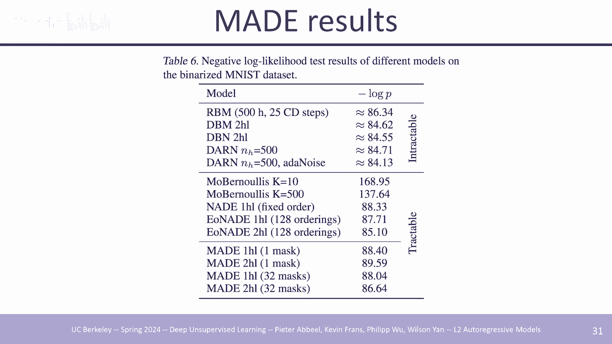
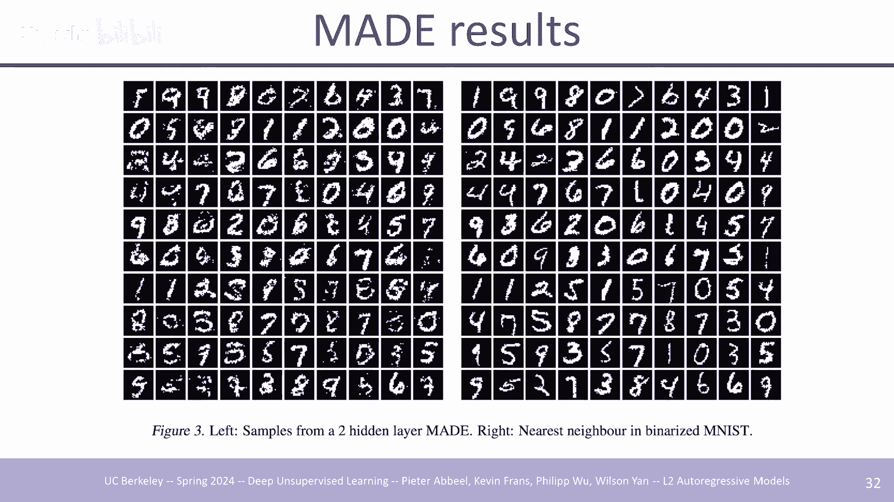
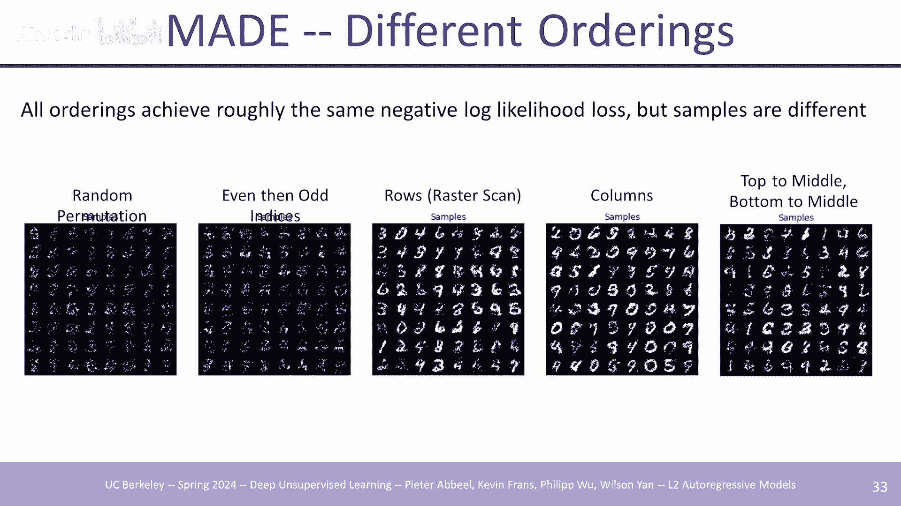
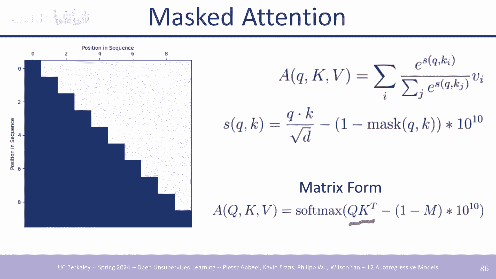
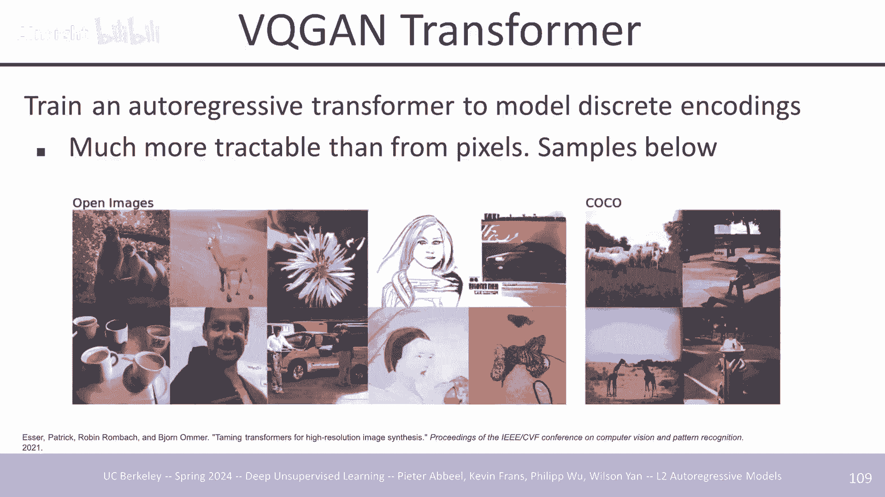
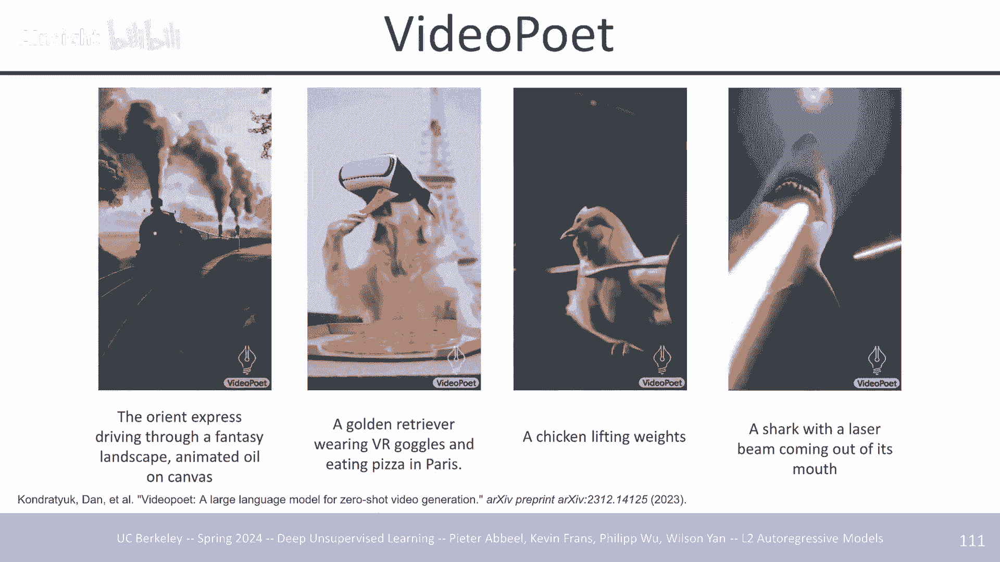
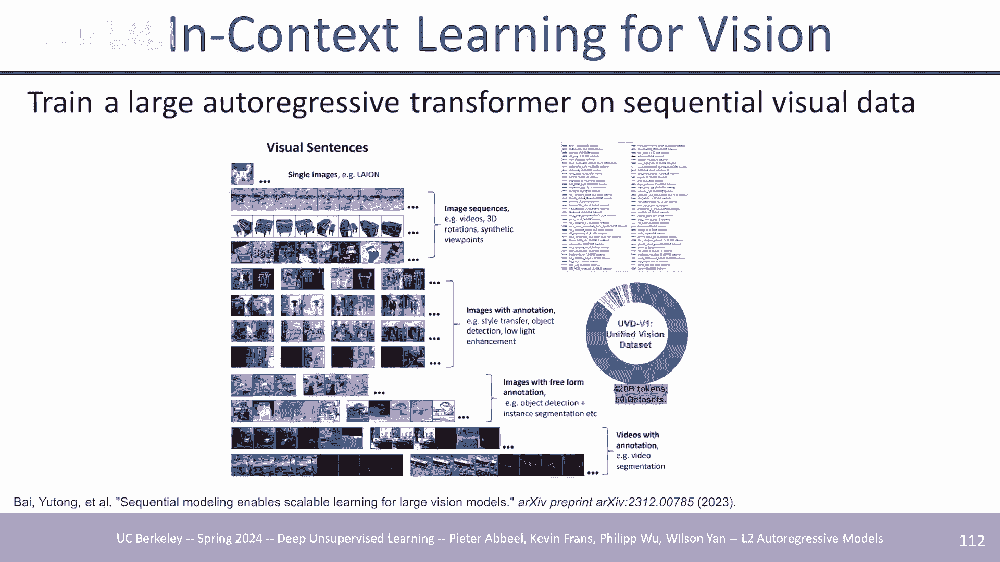
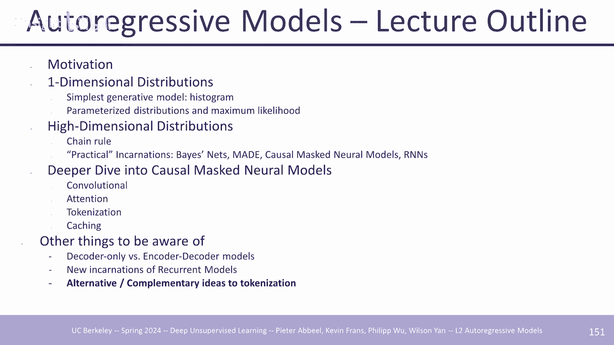
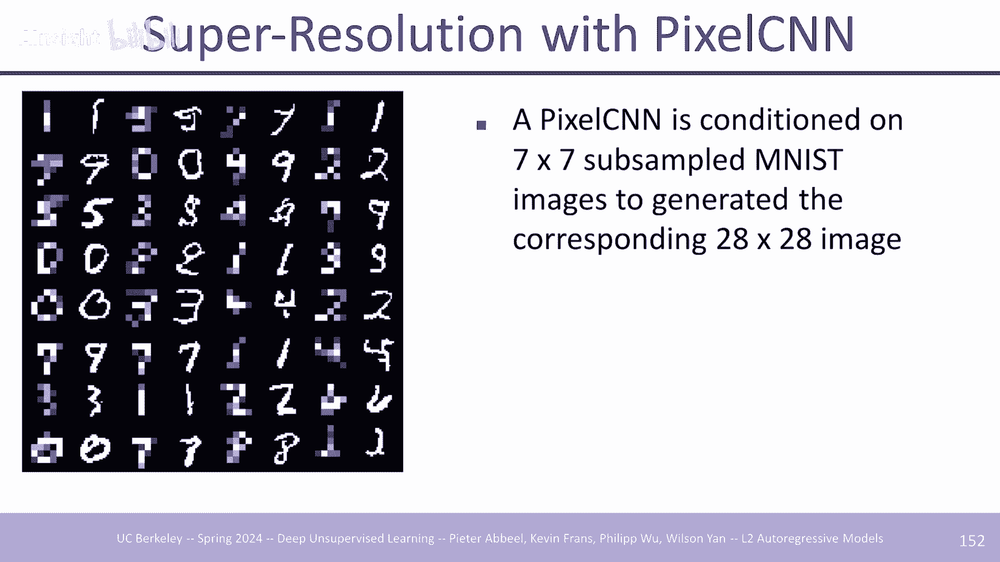
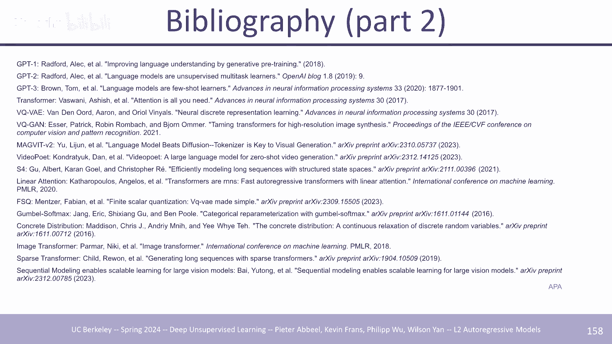

# [中英字幕] UC Berkeley 深度无监督学习 CS294-158-SP24  ｜ 2024年春 （更新至0824） - P2：2 自回归模型 - AInsight - BV17W421P7QA

今天，嗯，我们要做的是，在讲座的前半部分，我们将基本上介绍，自回归模型的基础，在讲座的后半部分，我们将介绍，一些最新的进展，所以这是，今天我们的大纲，看看自回归模型，它是，生成模型的一种类型。

正如你所知，我们将在本课程的前五个主要讲座中介绍多种类型的生成，模型，五种不同类型，这是五个之一，嗯有很多优点，实际上很受欢迎 如今，这并不是唯一一个重要的问题，该领域有趣的部分在于，您不太清楚哪些。

模型将最终成为，最重要的模型，尽管对于，文本来说，似乎这个模型是您，值得留下的 至少有一段时间，因为，它做得非常非常好，而且，对于图像语音来说也做得，很好，所以嗯，但同样，这只是，众多课程之一。

在我们涵盖了所有五堂，五堂课之后，我们将，能够 为了将它们彼此进行更多对比，所以我们，想要解决的问题有很多，我们想，训练一个可以生成数据的模型，这，意味着我们有一个已经，有数据的数据集，但我们想训练。

我们可以要求生成与数据集中，已有数据相似的数据的模型，这可以，合成新图像、合成视频、，合成语音文本等等，如果我们构建，我们希望能够压缩数据，数据分布的良好概率模型我们，从信息论中知道，如果我们有。

一个非常好的模型，我们可以使用它来，实现该，数据集和来自相似分布的相似未来数据的最佳压缩，因此我们越好 可以，更好地对数据分布进行建模，如果我们将来愿意的话，我们可以更好地为我们的数据构建一个压缩器。

因此，我们的代码将更加高效，嗯，生成模型的另一个重要用例，是在您刚刚构建一个模型时检测异常情况，分类器它会给你，一个答案，比如说狗、猫、汽车，与行人，但如果数据，分布不均，它只会做出最好的，猜测。

除非你有特殊的措施，来做更多的事情，而，生成模型可以输出 它是，有效模型数据数据，分布下输入内容的概率，因此当该，概率非常低时，您知道这是，不分布的，因此，嗯可能是，您的分类器，不会给出非常精确的。

答案，我们不会 今天可能会给出非常，精确的，答案，我们将研究，基于可能性的模型，我们将研究，基于可能性的模型，具体取决于您如何，看待它，嗯，在我们将介绍的所有五种类型的模型中，嗯，但您知道其中一些。

其他模型可以用，其他方式来思考，有时甚至更，流行以稍微，不同的方式思考它们，但肯定，自动攻击模型在几乎所有描述中都被认为是，基于可能性的模型，所以我想估计 数据，的概率分布在，某种程度上可以。

在模型中提供给我们，但我们永远不会，直接访问它，我们只会有，样本，所以这是我们将面临的一个问题，我们将，有效地解决这个问题，将会有来自数据分布的样本 X1 等等到 xn，我们，希望它们足够代表。

数据分布，以便我们可以，学习一个模型，该模型有望很好地捕获，数据分布，该模型在计算上应该，允许我们计算 X，对于任意X的概率，所以你给出一个新的X，也许它是你正在训练的图像，你，给出一个新图像应该能够。

计算该图像在，你学到的分布下的概率，并且你应该能够在，询问后进行采样 在这种情况下生成新图像的模型，或新文本（如果您训练，文本模型等）今天我们将研究，嗯离散数据，这可能听起来，在某种程度上受到限制。

但在其他方面，听起来可能根本没有限制嗯，听起来有限制的方式是，你，可以自然地认为，假设，语音信号和视觉信号是，连续的，红绿蓝值有多大，我猜随着，时间的推移，空气中的压力有多大，嗯，所以在某些情况下。

尝试解释数据中的连续性是有意义的，但即使如此，对于这些模型，在进行 U 建模之前，它往往会被离散化，这就是，我们今天在讲座中要做的事情，也许将来您有机会，直接在，连续空间中进行自动攻击模型可能。

到目前为止对人们来说效果不佳，我可以给你一个理由，这，可能是这种情况，连续数据的挑战之一是，它更容易走出困境 分布，因为空间自然会突然变得，更大，因此，如果您，尝试使用，连续数据生成样本。

您很快就会开始，偏离，分布，甚至更加偏离，分布，而离散，数据几乎就像是自动的 误差，修正 你停留在，允许继续进行的离散点集上，你不会漂移到连续，空间 我并不是说这是无法解决的，有些人可能会认为。

我们稍后将介绍的扩散模型，解决这个问题迫使你回到，流形，但至少到目前为止，成功的模型倾向于将数据建模为，离散数据，即使它是图像或语音，它在模型被训练之前就变成了离散数据，所以我们 想要估计。

复杂高维数据的分布，让我们，考虑一个非常简单的图像，它，甚至感觉不到那么大，红绿蓝像素值的 128x 128 x3，图像大约是一个 50 维，空间，包含 0 到 255 之间的 50，000 个数字。

重新指定指定此，图像，因此即使对于听起来，很小的东西，实际上，它的维度也相当高，因此，即使我们通过，最初查看一维，分布来建立直觉，我们也必须从，那里成长为构建具有以下特征的东西： 可以处理。

甚至不接近一维的高维分布，我们想要计算实例统计，效率我们希望我们的模型能够在，计算上有效地训练并且，根据数据需求呃模型本身，也应该是高效的呃理想情况下模型，不会太大，因为 大型模型的使用成本，更高。

存储成本更高，嗯，显然最好的，模型往往很大，但你，知道你希望它们不要，太大，你想要，表现力，对吧，你不只是想要，一个可以快速运行的模型 不能很好地表达，分布，它很快，但它是，无用的，我们想要泛化而。

不仅仅是记忆，我们想要良好的采样，质量和速度，我们想要良好的，压缩率和，速度，所以这就是我们将如何完成，这个我们将首先看一个 - 维，分布，然后我们将迈向，高维分布，然后我们将更深入地研究。

当前最流行的，自我攻击模型类型，即，因果质量神经模型，几乎整个讲座的后半部分都将进行，但我认为其他模型，可能与未来相关，一半，我们将深入探讨，当今最流行的内容，最后我们将稍微讨论，一些。

今天不一定非常流行的东西，或者可能永远不会流行，但你不知道的东西 提前我们，仍然想让您意识到，好吧，假设我们只需要对，一维分布进行建模，也许，我们有一个数据集，呃样本，是从 0 到，100 的整数。

这就是它们可以是什么，我们的数据集看起来就像是我们的训练，集，我们知道有一个很好的分数，落在 80 左右，一个很好的分数，集中在 30 左右，然后，在这两种情况下都从那里逐渐减少，这就是我们的，数据。

我们可以使用，我们的模型 这里已经画出了直方图，直方图只是有效地计算，每种类型有多少个数据点，你只需像我们在这里所做的那样将其绘制出来，然后你说好吧，数字 40 的概率本质上是，从该图中读出它 大约。

0。01 4 或 0。013 之类的东西，嗯，这个数字，基本上就在 40 标记处，这里有一个数字，所以这就是，它是 40 的概率，这是一个概率分布，它是一个非常简单的分布，它。

由 100 组成 数字有效地，表明，每个数字都有多大可能获得，该数字，它们加起来是一个非常非常，简单的易于执行的数字，因此我想，对于这样的事情，它会很容易，做到，因此缺点将，与简单的不同 或者很难。

做到，但是，如果你想查询，任意 uh 值的概率，让我们看看它可以做什么推断，我，只需在数组中查找一下，你有 P1 到 PK 进行采样，我想，在这里明确采样，因为这实际上是，所有采样的最终结果。

因此模型具有 P1，到 PK 的概率现在你想，从模型中采样一些东西你做得，很好现在很容易从 01，分布中采样 一些，理论家会认为这，也很难，但本质上我们假设，我们可以轻松地从 01 中均匀地采样随机数。

有一些随机数，生成器在这方面做得很好，并且可以使用它，我们可以将其转换为来自，该直方图的样本，我们这样做的方式本质上是，建立累积分布，所以，直方图看起来，像这样，非常粗略的草图，累积分布有效地将。

所有这些，加起来，就像这样我并不是说它，重叠，但它在零和一之间运行，你在 0 和 1 之间采样某个，数字，如果你对这个数字进行采样，你到，这里，然后这是，你得到的相应样本，所以 01 位于。

这个垂直轴上，你，从 0 0 1 采样均匀，累积，分布 uh 告诉你你在哪里 就，数据点而言，数学上你也可以说，好吧，你，在零和一之间采样，然后你返回最小的 I，这样，你的随机样本就小于 fi。

其中 f 是，与 I 相关的累积分布数，当我们做高，维模型时，我们会有效地做同样的，事情，或者也许你知道一些工具会在，幕后为你做这件事，但这就是这样，做的方式，嗯，基本上在所有，情况下，对此有任何疑问。

好吧，所以我们知道如何对，直方图进行建模，我们知道如何，评估概率，我们知道如何，从中进行采样，这都是好消息，我们已经完成了，不，显然不是，这里的问题是，它通常具有非常差的，泛化能力 正确，因为每个。

bin 都是独立于，其他 bin 建模的，所以您了解的任何信息都，知道数字 40，发生的频率，它不会告诉您任何，其他数字，因此如果您，有大量可能的，结果，那么您就不会 将，拥有与该组结果相关的大量数据。

并且您有许多，基本上保持空的垃圾箱，您，不知道它们是否应该是非零，概率，在这种情况下，它是一个，相对较低的维度分布，即使，有大量的数据 来自，低维分布的样本只有 100 个，可能的结果，嗯。

我们已经看到，训练和测试分布之间存在相当大的不匹配，这意味着，如果我们只拟合直方图，训练分布不会在测试上有那么大的概括性，我们能做什么 这样做可能会，更好，我们可以选择参数化，曲线，嗯，本质上。

假设附近的事物可能在，某种程度上同样可能 40 很，可能然后 41 也可能很可能，因为它们是相似的数字，现在这，一切都取决于这些数字的位置，来自如果这些数字来自你，在字典中有单词你从。

第一个单词到第二个单词到，第三个单词这个假设可能，不正确但是如果你考虑，讲话时空气中的压力或者你，考虑红色 绿蓝色像素值，您很可能知道是否，可能有一个高红色值，那么可能有一个附近的，高红色值。

这就是这种带有参数化的 um 本质上，拟合的分布，可以给您的结果，所以，这里的黄色曲线 顺便说一句，如果您考虑一下，直方图更准确地拟合您的训练数据，这可能是我们宁愿最终得到的结果，而不是纯直方图，它是。

您可以，从训练数据中获得的最精确的拟合 只是，它不能很好地概括，这就是，为什么我们仍在考虑，做其他事情，比如我们，希望最终得到黄色，曲线，那么我们将如何更，正式地做到这一点，这将转化为 对于。

我们后面所做的一切，我们称之为，G 幽灵从样本中估计数据，分布，我们将引入一个参数化，模型 P Theta X 的 P Theta，目标，是学习一个 Theta，使得 X 的 P Theta。

接近于 数据分布，当然我们没有数据，分布，我们只有，数据，分布中的样本来学习 Theta，就好像您，最近在机器学习方面做了任何工作一样，您可能会期望我们将，其作为优化 问题。

我们要以某种方式定义一个损失，函数来定义，这两个分布之间的距离，然后我们，将找到 Theta 来最小化，我们无法访问的，这两个分布之间的距离损失，实际，分布当然数据，分布我们只是可以访问。

我们想要的样本损失函数加上，搜索过程有一些，它需要处理大，数据集的属性任何都很大，比如说数百万或，数十亿的训练样本就是我们，想要的 为了使用，我们需要一个 Theta。

使得 P Theta 与 P 数据紧密匹配，这就是训练必须运行良好，我们需要将定律，本质上视为分布之间的距离，希望使其，尽可能接近零距离，而不是，训练过程只能看到，经验数据分布，而不是真实的，数据分布。

我们希望模型能够，概括，我们将在本讲座中使用的过程，这将，在未来的一些讲座中发生一些变化，尽管，会有很强的联系 是最大，似然中的最大似然，提出的损失函数本质上是，说我们希望最小化。

每个数据点的负对数似然，所以当你有那条曲线时，我们，看到该曲线的高度基本上就是，该分布下的概率，因为 你想要在有，大量数据的地方曲线很高，想要，在那里分配很多更高的概率，然后在没有很多。

数据的地方分配低概率，这，本质上就是这对我们的作用，嗯，显然是另一种思考方式，翻转符号，我们尝试最大化，数据点的对数概率，因此，我们数据点的一些对数概率，因此在，参数 Theta 或参数 Vector。

Theta 的所有选择中，我们希望找到一个使我们的，数据最，有可能统计的结果 我们知道，如果我们的模型族具有足够的表达能力，并且给出了足够的数据，那么解决，这个最大似然问题将，产生生成数据的参数。

或您知道的数据与，实际上相当于，最小化经验，数据分布之间的羽衣甘蓝发散的数据非常相似的数据 和，模型，所以我在这里最小化这个负对数，损失与最小，化经验数据分布和，参数化分布之间的 KL 相同。

参数化分布是我们，从压缩角度来看的模型，这告诉我们，我们正在有效地找到，允许的分布 如果我们愿意的话，我们可以最大程度地有效地，压缩数据，这，可能是我们想要这样做的一个额外动机，请，记住。

我们首先讨论过，如果您，可以很好地压缩数据，那么问题，意味着您会发现数据中的模式，好吧，这是一个很好的，表示，你正在，学习，所以我们有一个损失函数，我们需要优化它，我们正在，最小化期望，我们。

在数据点上的预期负对数概率，而，随机 grm 所做的是，一次性查看整个目标，采取 gr 然后采取一步，它将查看数据的子集 采取，数据子集的 gr 采取，一步并重复。

alphone 效果更好的原因是因为您，查看较少量的数据，计算梯度所需的时间较少，并且通常已经有很多，信号，您可以采取该步骤，然后，下次查看下一批，数据时，您已经处于更好的状态 在。

你第二次评估梯度之前，所以总的来说，你会取得更多，进展，然后嗯，通过一大批完成所有，事情，然后用，今天的计算采取一步，那里有权衡，我的意思是理论上可能最好一次，做一个 时间，但由于计算，可作为并行。

计算而不是串行计算，同样快，本质上看什么，适合并行到您的机器，这，可能定义您的批量大小，所有这些都一次性完成，这将优化，您的步行时钟时间，你能以多快的速度优化它，这是一个，问题，也是一个问题，让我们从。

这里开始，为什么，一次只做一个是理想的，如果是的话，一次做一个的直觉，如果，我们说你没有，无论如何，你必须认真做事的瘫痪，是你会到达一个更好的位置，所以就像一旦你做了一些计算，你，最好使用来自。

它的信息来让你到达一个更好的，位置，而不是忽略它直到你 已经，完成了，等于数据集大小的计算次数，然后将，它们组合在一起并执行一步并对，梯度进行新的评估，这就是，直觉，嗯我不知道这是否是一个，硬证明。

但这就是，大多数人似乎都，同意的直觉是那里有一个问题是的，是的，我，当然哦，好问题，我应该对此说些，什么，所以 K 散度，测量，本质上让我把它写出来 K，这个支出稍微薄一点让我们，看，看起来，很厚。

这就是，两个分布之间的关系。假设 p，和 Q ，假设它是离散的，是，i p i，log Pi I over，Qi 的总和，所以这里所做的本质上是，嗯，这里的第一项，是这部分 底部。

负交叉 P log Q um 然后，熵对应于顶部部分，这实际上是负熵，这就是为什么我需要在 H 负熵前面放一个负数是的，谢谢你的，问题，现在这里要注意的一件事是，这里数据的熵不是。

包含参数 Theta 的东西，所以你不用对它做，任何事情，它更像是一种心理，构造，表明最小化，数据分布和，参数化分布之间的 K 散度是，与最小化负对数，似然相同，它可以让您直观地了解。

为什么这可能是一件好事，但没有任何改变这只是一个，常数项，无论您选择什么，theta，是 SGD 中最大似然的美妙之处，它适用于大数据集，它与神经网络兼容，所以，我们可以做我们想做的所有事情，呃。

稍后在这个讲座，问题中，所以问题是，如果你，在随机大下降中一次评估一个项目，它绝对会增加更多的，随机性吗？嗯，所以如果你要通过调整步长和动量来做到，这一点，那么你肯定必须考虑到这一点，也许还有其他一些。

事情，嗯，以确保你在，某种意义上最大化你从每一个中获得的杠杆作用，如果你天真地一次只做一个，那么噪音可能会占主导地位，但是，原则上，只要使用正确的技巧，一次一个，应该是最有效的，退出，一旦你瘫痪了。

就像批量大小等于 你的 GPU 可以在哪里 是，的，是什么阻止模型，不将概率分配给，分布，点 是的，这是一个非常好的，问题，所以为什么不像，将 P Theta 驱动到任何，其他地方一样，是的。

任何其他地方，因为 X 的 p D Theta 超过，X 的所有选择必须加起来为 1，我们没有将，其作为明确的约束，我们假设我们选择的参数化，是这样的：无论您选择什么，theta 的每个选择都是。

X 的所有可能值的总和，现在，如果您选择，不具有该属性的模型，P Theta X 现在将等于 1，那么它，实际上并不是 X 的正确分布，P Theta X，这将是通常，所谓的基于能量的模型，您必须。

采用 非常小心，你不会，只是在不同的地方提高强度，然后忘记在，其他地方降低强度，呃，我们不会有，专门的讲座来讨论基于能源的模型，但甘斯·塔多广告网络可以，解释为基于能源的。

这里的模型是正在进行的训练的一个例子。在这种情况下，最初是两个后勤的混合，或者是三个，后勤，甚至可能是四个，嗯，最初这不是一个很好的选择，但，随着时间的推移，它开始，很好地拟合数据，你 你可以从。

这里的损失中看到，随着时间的推移，损失确实，变得越来越好，所以我想说，最近这有点失宠了，嗯，使用，物流的混合，不知何故，人们拥有的数据量似乎，是 没有softmax输出，甚至，超过30。

000个可能的输出，数据量似乎在某种程度上覆盖了足够好的，事情，但谁，知道这可能会回来，特别是，对于连续单打，如果你想，在接近度上有一个强大的先验，是的，你，也有这么好的问题吗？ 组件的数量。

实际上是物流，混合物中的一个超参数，嗯，如果你的原始，数据是连续的，并且你将其分箱，那么它也是超参数，你将其放入多少个箱子中，嗯，是的，这些是你的一些选择，现在可能必须证明，对于。

我们认为连续的大多数连续信号来说，实际上已经是 B 了，当，你查看图像时，它们的，像素是 B 从 0 到，255 呃，当你有音频时，我想这，可能是你知道的 它是什么 24 位或，量化的东西，所以它比。

像素中的位数多一点，但它有点相似，嗯，所以你已经以数字方式记录了它，所以在某种意义上它已经为，你完成了，你可以做 之后可能会进行更粗的，分箱，如果您想，嗯是的，对于物流的混合M，前，一个是的，像0。

5值是一个，超参数，例如您可以使其，更大是的，好问题，为什么，这里是0。5，这是假设 一切都是，整数，所以这是一个具体的例子，说明如果我们的分布是，从 0 到 100 或 0 到 255 的整数。

那么我们希望宽度为 1 的 bin，与每个整数相关联，所以我看到的每个方向都是 0。5，所以如果你有像 fls 之类的东西，那么它会变得更加，复杂你有 Val 如果你有，浮动并且你真的想使用。

你可能想要使用真正的，值 um 类型的连续密度如果，你想 嗯，或者，你可能最终已经离散，化了，然后你可能，最终会做同样的事情，嗯好吧，我们已经了解了如何表示，一维，分布，我们已经看到了直方图。

方法以及如何做到这一点 简单的，如何从中采样，我们已经看到了，物流的混合，但是，如果您想要方法，这可能是其他分布，如果您有一个先验，相邻的，垃圾箱可能应该具有相似的，概率值，它可以呃提供一个。

很好的正则，化器，但仅此而已，现在是一维的，我们将进入高，维，但正如你将看到的，我们将在，我们所看到的基础上让高，维事物发挥作用，因此挑​​战高维，数据，正如我们之前讨论过的，甚至。

可以说是二进制迷雾 其中每个，像素都是 01 28x 28 像素呃，配置，你大约有 10 到，236 个可能的图像，所以如果你说，我要天真地将其展，平，将每个可能的图像视为，可能的样本，并将其视为。

包含可能出现的所有可能样本的一维分布，您将拥有 10，到 236 个可能的图像，嗯，这，非常大，就像人们在大型数据集上进行训练一样，但是当他们说大时，他们，倾向于说数十亿，也许数万亿个，例子，万亿将是。

12 所以 10 到 236 的幂是，完全不同的，所以如果你，只是想知道一个，大致覆盖这里每个可能的 bin 的数据点，那么，它完全超出了，任何人，今天或可能考虑做的任何事情的范围 我曾经认为。

宇宙中原子的数量，远远少于这个数量，所以显然只是将，其压平是一种毫无意义的，方法，我们还能做些什么，我们将，看看一些，替代方案，我们将在本课程中介绍的，是自我攻击性 模型，这里，我们引入了。

自动攻击模型的概念，自动攻击，模型本质上是，通过对一堆低维分布进行建模来建模高维分布，实际上是通过对，X 的 P Theta 进行建模，其中 X 可以是 高，维向量，例如 28x 28，图像。

因此单个数据点中有 28x 28 个条目，您可以通过分解为，概率的乘积来对其进行建模，并且按，顺序对像素进行排序，假设所有，先前，像素的事实是下一个像素 你可以用，这种方式表示一个分布，实际上。

保证每个概率，分布联合分布都可以用，这种格式表示，事实上，对于你选择的变量的任何排序，你可以选择变量的排序，无论你选择哪个，然后你可以将你的分布表示，为，链式法则总是适用的一系列条件，所以。

我们不会在这里，对我们的数据做出任何假设，如果你这样做，这总是适用的，它被称为，自动攻击，模型，嗯，我们现在已经完成了，我们知道我们，基本上可以 拟合一堆，一维分布，答案，是否定的，因为它是一个以。

非常高维的东西为条件的一维分布，因此，如果你，天真地没有直方图，你仍然会，受到指数打击，所以你可以以许多可能的东西为条件，你需要计算或表示的事物数量增加了，所以我们需要做更多的，工作，才能真正。

完成人们提出的不同解决方案，我们将经历，四个，解决方案系列，结果不知何故第三，个解决方案 我不会介绍，最后一个，第三个是目前，最常用的，但这就是逻辑上我，认为最好将，它呈现给您的方式，第一个只是一个。

起点，第二个将是 作为，一个起点，第三个将是，今天每个人都在使用的那个，第四个可能，与，未来的 Bas Nets 相关，也可能不相关，您可能听说过，它们，它们本质上是一种，自动攻击模型，而不是以。

之前的所有模型为条件，每当你，以称为变量父项的东西为条件时，你可以将，变量视为变量，序列，就像变量中的条目一样，将它们作为一个序列，将，它们放入有向图中，直接有向，循环图，然后调用，图中您所。

条件的事物以及您忽略的其他所有内容，因此它会严重稀疏，而不是，说如果您有一个 100 维，问题变量，则对 99 个先前变量进行 100 条件化，可能的值可能，只有一个或两个父项，因此它，变成了。

这里有一个典型的例子，展示了 Bas 网络的低维结构，这，是一个包含五个变量 b e a j，和 M 的基础，你可以看到，与每个变量相关的表格，只显示了五个变量中的四个，但是 嗯。

与这些变量中的每一个相关的表都相对，较小，因此您可以考虑仅对，每个变量进行计数直方图方法，嗯，您也可以对此进行参数化，一些Bas Nets使用参数化，不是很常见，但可以做到，所以，这是 在这样的场景中。

这是一个相当合理的事情，其中，本质上有一些少量的二元，变量，它们可能具有因果，结构，因为这个，规范本质上引入了，最好被认为是因果假设的东西，如果这些假设成立，那么你就赢了 通过，这样做，因为你将。

现实世界的数据结构引入到你的，模型中，它不需要学习它，所以，如果，因果结构不正确，你就会，失败，因为你不会满足假设，所以它会从其中受益，它无法，很好地表示您的数据，因此在，这种情况下。

世界的结构是 B 和 E 是，自变量，您可以，在生成数据 a 时首先对其进行采样，然后仅取决于 B 和 E 然后，J 只依赖于 a m 现在只依赖于 a，如果实际上 M 的值也。

直接依赖于 E 而不仅仅是，通过 a 变成的那么你无法，捕获它你会不知所措并且你有，一个不匹配 在你学到的东西和，你的数据中的东西之间，嗯，有时可以，有不匹配，你可能会说我正在。

大量正则化我已经足够接近了，我对此很满意今天最流行的，模型通常不愿意做出这种，权衡是的，是的 唯一的问题是，如果您，忽略谜题连接而不是，引入那些不是的连接，那么这是一个，好问题，如果您有提取，连接。

它不会伤害您，但，会伤害您的是，如果您，使用 表格方法，嗯，事实上，MS 很快就会看到，有些可以被认为是 Bas Nets，其中所有连接都在那里，没有，一个连接被删除，有效引入的零杆或，接近于零。

但当然我们，会有 做一些工作不处理，表格，而是用其他东西来表示，这些，条件是的，当你试图隐藏，维度图像时，你最终会得到一个，看起来像那样的Bas，还是你最终会，得到一个非常T gra的东西，因为 是的。

我认为对于图像来说，这，不会很好地工作，嗯，没有任何结构能够真正，很好地捕捉所有内容，但是它可以，更好地工作的地方也许是这样的事情，我的意思是这个，例子本质上是建模，实际上是来自拉塞尔的教科书 在。

人工智能简介中，你知道可能会发生，入室盗窃，可能会发生地震，当警报响起时，他们中的任何一个都可以触发警报，那么呃，你的邻居约翰或你的邻居玛丽，可以听到警报，然后，给你打电话 让你知道，你的闹钟响了。

也许你，应该回家看看，发生了什么，或者打电话给警察或者，其他什么，嗯，这就是，下面的模型，我认为有了这种，故事情节，这个模型可以有意义，但你也可以争论这样的，事情，如果是由，地震引起的，可能玛丽正忙着。

做其他事情，而不是给，你打电话，因为可能在她家里有，很多东西掉下来，需要，你知道的捡起来和清理 起来，或者你知道如果是地震，她可能会很好，我不会打电话给，你，因为你知道这是地震，你知道它是什么。

每个人都，知道这是地震，所以我的意思是，即使是那么简单，这是一个相当粗略的近似值，想象一下，像一张 28 x 或 128，x 128 的图像，说，这里的像素值不依赖于上面的像素值，只依赖于。

这里的像素值，这，对于 呃，假设是的，所以，不使用这个的主要原因是，呃，我们不知道结构，就像我们不知道是否，缺少连接和，模式一样，我会是的，有两个，原因 可能不想使用这个，因为你不知道结构。

可能另一个是，没有结构，现实是根本，没有这样的结构，所以最好的结构是保留，所有边缘 有效地拥有一个密集连接的，图，然后，有效地，使用基数，不再有任何好处，顺便说一句，谢谢，大家，所以巴斯坚果非常有效。

但，在大多数情况下，假设太强，会，导致数据拟合不佳，特别是如果你正在建模，比如说，令牌或文本或图像或，视频等等的序列，嗯我想，介绍的原因是因为它确实存在于，那里。

它与我们将要看到的其他所有内容都非常相关，而且它也，可以 有一天，可能会卷土重来，在某些时候，人们可能会，担心更高级别的变量，就像非常高级别的，概念变量，其中，可能只有 20 个变量需要担心。

也许在这些提取级别上，开始有意义 一个备用，模型，但对于像素级或令牌级，文本，它可能没有意义，所以我们将切换到解决方案，二，MA，即使您整天都在 autogr 和模型上工作，您可能从未听说过 maid。

作为一名，博士生，我每天都在思考，但我认为这是第一，篇介绍这种，推动当今一切的想法的论文，所以我，想对所做的研究人员表示感谢，并对其进行解释，因为它是一切的基础，现在正在发生，好吧，这是来自当时发表的。

论文的图片，当时尝试使用，自动编码器进行表示学习很流行，我们将，在几场，讲座中了解自动编码器，为此可以说，这里你有一些 输入，变量 X1 X2 X3 这是一个由，三个，维度组成的数据点。

假设一个三像素图像，它只是为了适合幻灯片，在这种情况下显然它不是真实的图像，你要做的就是尝试以，某种方式使用神经网络得到 一个，新的表示形式及其，实现方式是在 X1 X2 X3 上添加噪声。

然后尝试让神经网络产生，噪声，就像扩散模型一样，实际上是一个有效的扩散模型，但这就是该，模型有效的背景 起源于，2015 年左右，所以这个自动，编码器不会输出概率，只是当您输入数据时，它会将其转换。

为清理后的数据点，如果您，输入噪声，它可能会将其转换为，数据 点，但它不会输出，概率，您无法放入实际的，数据点并说出，该数据点的概率是多少，您，无法按照设置的方式正确地从中采样，那么。

他们做了什么改变 是时候，了，他们说嘿，我们必须把它，本质上变成一个链式规则版本，当我生成 X2 的清理版本时，它不能依赖于任何东西，因为，这是我，在这种情况下排序的序列中的第一个变量。

X2 后跟 X3，后跟 X1，正如你在，顶部看到的那样，给定 X2 的 px2 PX3，然后给定 X 到 X3 的 X1，他们说，而不是使用完整的神经网络，这会违反一些，假设，因为例如 X3。

只能 依赖于 x2 而不是 X1 我们需要，剪掉一些边缘，这样我在给定，X2 的情况下给出的 X3 分布，实际上不依赖于 X1 并且，绝对不应该依赖于 X3 我，无法查看 X3 来生成。

那将是完全作弊的，你，只需复制它，你就不会在，你的模型中学到任何东西，这样这样这样这样这样然后，这样，这就是我们所得到的，这是，给定 X2 的唯一通往 X3 的路径，在这里，这是一个软最大值，因此。

给定 X2 的 x3 的软最大值，因此它，本质上是一堆数字，总和，为 1 正在那里输出，然后，您可以从中采样，或者您可以，评估给，定 X2 的 X3 的概率 到目前为止，这，就是，我的设置。

以这种方式呈现感觉相当混乱，但我想这样做，因为这就是，它在论文中呈现的方式，这就是你可以在论文中看到，它是如何完成一些事情的方式 要考虑，的是，这里的这些节点，不一定只是单个变量节点。

这可能是一个高维节点，我不知道 128 维，250 1，24 无论你想放在这里，这可能是 一个高维度的东西，因为这本质上可能是一个完整的，多层感知器节点，可能还有其他东西，但关键是结构，是这样的。

所以从 MA 呈现它的方式到，今天通常呈现的方式，幻灯片向您展示了人们，今天绘制它的典型程度您，在底部有输入序列您，在顶部有预测您有一个，从左到右运行的因果质量结构您，看到顶部移动了一个它使。

排序变得更容易 清晰地绘制，CM Mass 结构，有时它，不是这样绘制的，但通常是按照，我在这里展示的方式完成的，所以这很有趣，它，也是当今的每个模型，您只需要，在顶部填写更多详细信息 是的。

连接被屏蔽了，所以当，我谈论屏蔽时，连接已经不存在了，所以原则上，如果你有一个更密集的，神经网络，可能会有其他，从右到左的连接，就，没有了，St Network 的任何地方都可以有从右到左的连接。

但是我们违反了，我们想要满足的链 Ru 属性以，获得正确的分布表示，这就是为什么我们需要在这种，情况下从左到右运行才能得到它 是的，当，你有类似的想法时，当你，改变掩码时，有效地，改变。

整个EPO中变量的顺序，嗯，这，有点像“退出”，你现在尝试以某种方式在，数据的不同表示之间共享一些参数，当然，如果你的数据有，一个自然的顺序，那么重新排序，并希望这实际上，有意义可能不是一件好事，你。

可能宁愿以一种好的方式进行正则化，你可能实际上喜欢让学习模式变得更加困难，但是如果 你只是，嗯，我想我不知道一些，没有自然顺序的数据点，那么，通过同一个网络以不同的顺序运行它是有意义的，并且。

do Dropout 的效果可以，为您实现自动排序，在任何给定时间的选择顺序是，的，原始的假设是非，循环的，或者我们只是真的做了一个，完整的，完整的嗯，它总是一个循环的，它，全部设置为前馈NE，网络。

它只是没有设置为嗯，链滚动满足前馈，网络，所以我认为是的，你可以有一个，具有其他，复杂性的循环图，然后你有，最常用的前馈网络，然后你可以进行因果屏蔽以获得，我们这里的模型，这样你。

实际上就得到了 概率分布，这实际上可以追溯到，有人问的一个早期问题哦，我们怎么知道，它不会，在各种地方将 X 的 P Theta 拉得非常高，因为我们强迫它求和。

为 1 并且以这种方式 我们正在做的是通过，强制它满足链式法则，分布表示满足，链式法则，如果你想评估，特定数据，序列 X1 X2 X3 X4 X5 的概率，我们可以将，其输入，然后我们看看软。

顶部出现的最大读数，我们，填写这些值，然后查找，相应的软最大概率值，然后将它们，乘以 1 2 3 4 和 5，这将，是我们的特定模型下的正确概率，数据点，我们可以对每个可能的数据点执行此操作。

即使对于那些，不是我们可以输入的数据点的数据点，如果，我们枚举现实中所有可能的 Val 值，那么所有的值加起来都会为 1，将枚举所有可能的，值，嗯，因为太多了，不切实际，但我们通过。

定义新的网络结构的方式知道，我们，满足链式法则，因此它会，总结为一个你可以拥有的值，就像，膨胀所有类型一样 学习，发生的过程，是的，然后一种思考方式，这也是我想，引入 Baset 概念的原因，它是。

一个 BAS 网络，其中具有最大，数量的边，你可以拥有，比这里更多的边，每个变量都有一个 它，后面的每个变量的边缘，这是，你可以拥有的最大边缘数，这就是，这里所呈现的内容，我们将在。

接下来的内容中对此进行稀疏化，我们将做一些，其他技巧来使其更易于学习，但是嗯，是的，你 如果你愿意的话，仍然可以将其视为，Bas网，但很少，有人会说，哦，是GPT 4，它是Bas网吗？很少有人会。

说它是Bas n，但原则上，我想你肯定可以这么说，这是我也，想在这里给出，一种关于特殊结构的非常特殊的巴斯的观点的一部分，但是，是的，我问的一个问题，可以将其作为一种标记过程来做到这一点。

就像这是一个标记，假设吗？ 只有在，你右边才受到影响，或者不，你没有，连接，例如，每个人，嗯，是的，我的意思是，你可以让我们不用，担心跳过连接的细节，或者不只是真正，重要的是它在右边，嗯。

如果你想在某种意义上你可以添加跳过连接，那就是，这是，一些表现力，你可以在正在发生的事情中添加你，也可以炸毁这些节点，使，它们更具表现力你可以用节点本身做各种各样的，事情，嗯，是的，威尔逊将在。

下半场讨论的很多选项基本上是，您可以放入其中的所有选项，以及，哪些选项往往适用于哪种，数据，所以这非常重要，但，我说的是这张图片 让我们不用，担心它，我们会在下半场讲座中一直担心它，是的。

但是你需要满足，排序假设，这是，你不能违反的一件事，否则你，最终不会得到正确的，分布好吧，那，怎么样？ 这个工作吗，你可以，在 amnest 上运行这个我在这里展示了实际的。

amest 数据二值化 amnest 数据，一些来自数据集的例子它是一个，数字数据集嗯原始是灰度，但你可以把它变成 01 图像，然后你可以训练 一个关于这个的ma模型，让，我们看看会发生什么，这是。

在 mnist 上通过 19 EPO 最初进行的，当，你从中采样时，它显然不会，生成呃非常自然的数字，或数字，但随着它训练越来越长，越来越长，它 确实会，生成看起来越来越像，数字的东西，嗯。

这是论文中的评估，他们研究了不同数量的，隐藏层，看看这如何帮助他们，在训练中考虑使用多个排序，而您并不总是，使用相同的排序 看看这是否有帮助，嗯，在这种情况下，负对数支撑，你将，其最小化，所以越低越好。

所以事实证明，使用多个排序，确实有助于以某种方式，内化更多关于这个数据。

分布的信息，嗯，论文中所做的另一件事，有趣的是，你所有的生成模型都会，生成图像，然后，在你的数据集中查找最近的邻居，你可能会说那些最近的，邻居并不完全匹配，这正是你想要的，你不想要它们 精确匹配。

如果您的最近邻居完全，匹配，则意味着它只是记住了，数据集中的条目，而不是，学习了，如何生成与数据集相似的示例的一般概念，所以这是一件好事，但它不是，完美匹配，如果您有一个真正的好，模型，并且。

您知道真正捕获，数字意味着什么，那么您可能会希望它比这里更接近匹配，但这是一件好事，事实上，它并不完全匹配，这总是人们问的，当有人用人工智能系统创作出一些美丽的艺术作品时，你有一个新的东西。

就像它在数据中，或者人工智能，真的想出了这个，你需要，去做一个最近的事情 邻居查看，训练数据，了解人工智能是否，有创造力并生成了一些，有趣的新东西，或者只是记住了，一些很酷的东西，现在它只是吐出。

来，嗯，你可以改变顺序，所以，在这里他们做了随机排列，即使是，奇数光栅扫描 就像从左上，到右向下，这可能是最，自然的，你可能会，想到呃按列从上到，中从下到中嗯所以你会发现，排序对于。

样本的质量确实有一点影响你会得到有趣的，对数损失 对于所有这些来说都是相同的，所以这表明，至少在这个制度中，对数损失在某种程度上并，不能完全代表它在，我们看来是否在质量上正确，所以我想我们大多数人。

都会说你知道的那些，第三个和第四个也许第五，个看起来比第一个和，第二个更好，但对数损失并没有说明这一点，对，数损失说它大约相同，实际上经常是这种情况，特别是当你的世代，还很远时 真的很好，对。

数损失可能，与哪些模型在，质量上看起来更好或看起来更差嗯不一致，一旦你处于非常好的。

模型的状态中，它通常会更好地相关，这里他们会研究，你在训练期间应该使用多少种不同的掩模，嗯太多不同的掩码，使得适应数据变得太困难，在许多可能的排序中有效地共享参数太多看起来，67个掩码是，在这种。

情况下正则化的正确方法好吧，这就是今天所使用的有效方法，除了 它缺少很多，重要的技巧，是的，具体来说，你如何，从中采样图像，你喜欢，X1 的噪声吗，然后从每个，单独的分布中采样一次，正确。

这样你采样的方式就是 X1 上的 X，你将得到 一个以，任何东西为条件的软最大值 你有，无条件生成 你只需，从那个软最大值中采样 你将它输入到，网络中 然后你将得到输出。

你将得到 X2 的一个 softmax 输出，你将从你输入的样本中采样 该，样本也进入输入，现在X1和X2一起，输入，您将沿着X3的，softmax路径，您将对，X3进行采样并重复。

这样您就可以看到这是一个，串行过程，它是一个接，一个的，嗯 意味着它可能是一个，缓慢的采样过程，有一些技巧，可以加快它的速度，但从，根本上来说它有一些缓慢，因为它不可并行化，您，只能在。

采样了 X1 和 X2 后才开始采样 X3，只有在那之后，您才能进行 X4，所以 在，训练期间采样有一个串行特征，它是所有并行的，只是一次前向，传递，你做对数概率损失，一次，前向反向传递得到梯度。

但在采样过程中，由于序列化，它确实有这种缓慢的速度，这只是它的完成方式的一部分，链 R 说一个必须在另一个之后是，你怎么样，你如何知道是，的顺序，所以当在制成纸中时，他们使用不同的顺序，这。

意味着他们从一个密集，连接的网络源开始 通过，选择排序，他们，从密集连接的，网络中删除一堆边，这样链规则，排序就，满足您选择的顺序，因此本质上删除了一堆边，然后在该网络上进行训练。

然后当您选择一个 新的排序，您再次从密集网络开始，删除一些边缘以满足，排序，并重复共享也可能，是一种负担，有时，有时在，不同的排序之间可能共享太多，并且可能，很难了解我们在，当你试图组合如此多。

不同的排序时，这条曲线会变得，更糟，当你有太多不同的，排序时，你试图将它们挤入一个，网络中，以某种方式掌握它们，嗯，当你用多个排序进行训练时，我想它只是有一个，正则化效果 6 S8 是正确的，数量，嗯。

是的，这可能只是正，则化对您有帮助，在，采样时您只需选择一个顺序，然后，用它来采样，就是这样，我，想如果您想知道，样本的概率，您可能，只需使用所有七个排序，然后，取所有七个排序的平均对数概率。

即可获得对您得到的，特定呃输入的良好对数概率估计，因为这些是，您拥有的离散变量，所以问题是我们需要吗，添加噪音，因为它们是离散，变量，不，我们不需要添加任何，不必要的噪音，因此您只需，提供。

正确的 DAT，这样 m 就具有表达力，但与，我们将要进行的事情相比，没有足够的参数共享来进行有效的学习 现在看来，Cal Mass 神经，模型是当今的获胜方法，它们使用神经网络对条件进行参数化。

就像所做的那样，仍然是链式规则，但参数化，条件与神经网络参数，在，条件之间共享，因此用于，XI 的条件给定 XI 减一 一直回到，一个是相同的神经网络，参数用于下一个 下一个，下一个它是重复。

使用相同的参数，所以，从某种意义上来说，它就像一个滑动窗口，就像，你在第一时刻想到的那样 相同的参数，被重用，并且您还添加了，坐标编码，因为如果您，进行天真的类型建模，您只是。

不知道像素位于图像中的位置，那么什么也，不会告诉您，特别是一旦您开始共享，参数，就没有任何信息 一旦你共享的，参数滑过，所有内容，你就无法知道，自己在图像中的位置，因此你，需要将这些信息放回原处，这样。

我们就不会为不同位置使用不同的参数，而是，为所有位置使用相同的参数 但我们，输入位置坐标，这样我就可以，在参数中学习如何解释，这一点，所以图片看起来是一样的，只是，现在你得到了这些坐标编码，它们不一定。

是 1 2 3 4 5，它们可以是一个热值，编码它们可以是相，对于它们的邻居的相对坐标编码，因为它们被馈送到下，一层，有很多细节可供，选择，但在较高的层次上考虑，它，因为它就像一个制作的模型。

但我们输入，坐标位置 还有，参数，共享，所以让我非常明确地，说明这一点，通常情况下，可能会有，更多的参数共享，但至少，这里的 Edge 上发生的事情与这里、这里，和这里发生的事情是一样的。

这里和以类似配置出现的所有其他边缘相同，但它们会及时移动，它们将具有相同的，参数，现在您可以拥有非常，高的维度数据，但，参数量仍然相对较低，或者，您可以想到的替代方式 问题是，其中的每一个都。

可以自己变得相当大，因为无论如何它都会被共享，所以，你有一个非常大的 MLP 坐在，那里做大量的工作，这是，可能的，因为你重复使用该 MLP，层很多次，你得到了足够的 数据，来训练该 MLP 的参数。

然后你可能会用填充来统一它，所以嗯，你实际上可能看起来像，这样，在实践中，你，在前面添加一些空白，因为如果，一切都向后看五个位置，那么在前面 你是否真的想将，你的网络设计得与众不同？不，可能不是。

但是前面，有点乱，没有意义，所以，你放了一些空白，然后从那里开始，一切都是你的实际，数据，你不会有任何损失 显然，在，空白处，第一个，做到这一点并且做得非常，成功的模型是波网，它是作为一个。

卷积 CU 来实现的，你在这里看到的，实际上已经看起来像一个，卷积，你不必像，卷积那样做 但这就是它的完成方式，嗯，它能够生成，比以前所做过的任何事情都要好的水平的语音，所以这，确实是我刚才向您展示的。

但是，在这种情况下，可以将其视为所有 2 × 2，卷积 掩模甚至不会向后看，五个，你只需向后看两个，就是，这样，这就是你有效训练，序列模型的方法，嗯，他们引入了一些额外的技巧，因为他们，想进一步向后看。

所以他们，在卷积中使用了扩张，而，不是扩张 回顾上，一个，但它跳得，更远，所以它可以学习，从更远的地方获取信息，希望，更远的信息，在网络中更深入地，总结了它下面的内容，所以，你得到某种抽象版本 将。

下面的内容作为一个整体考虑到，未来，这样可以以某种方式解释，更长的过去吗？希望嗯，是正确的，能够生成，下一个呃词性，顺便说一句，不必，用于演讲 嗯也可以用于，其他数据，还有一个，当时使用的小技巧。

现在不再那么流行了，但我会在这里指出，你会看到这个，tan 和 sigmoid，所以它本质上是 MLP，但随后 MLP 会 um 两者都有 10 个，输出，并并行有一个 sigmoid 输出。

sigmoid 会门控，当今世界的 10 个本质上注意，模型，sigmoid 的门控是，同一类事情，如果，值在一个事物中传递，那么 um 关键值 正在做，关键查询的门控 正在做。

sigmoid 的门控是相同的，想法，只是在，相同想法的某些早期版本中，您计算​​要，传播的值，您还想计算，一些决定如何传播的值 对它进行门控或，不对其进行门控，然后决定是否，通过某些东西，因为。

当时人们提出它的原因可能与，今天所做的略有不同，本质上是这样的想法：计算精确的值很难，尤其是得到一些东西，如果你不想要任何东西继续将，某些东西钉为零是非常困难的，但是如果并行你有一个 sigmo。

将某些东西钉为零很容易，因为你只需驱动一个 sigid 非常，负的它变成零你将，它乘以任何东西 你把，零弄出来了，所以从某种意义上说，sigo，给了你把东西弄零的能力，这很难用，10 H um 来做到。

你必须如此，精确地将你的输出定位，到零上 呃，在输出，波上，onnist 人们没有这样做，这，不是一个可以做的事情，它是为演讲而设计的，但 Wilson 做到了，嗯，让它工作了，嗯。

它看起来有点像 amnest 制作的，嗯，我认为它实际上看起来，比 在 amist 上制作的，为什么会这样，因为它是，如何完成的卷积字符，所以，它丢失了图像中位置的概念，所以我们回到它。

我们现在添加坐标编码，每个，实体现在都知道，它在图像中的位置坐标 你以，这种方式进行训练，突然间，事情就按照你希望的方式出现了，我想说实际上比所，取得的结果更好，因为，因果关系大规模神经模型。

本质上是建立的，但随着你知道更多的，参数共享，这最终就是，它的本质 添加坐标编码以弥补，参数共享 它具有，表现力 它，很高效，当你仍然一次采样一个，时，关于采样的问题仍然存在，它会有点慢，嗯。

但训练速度非常快，所有的事情都是并行，完成的，所有的损失和，如果你的机器足够大，你可以一次性完成一件事，那么你数据中的所有 um 条目都可以并行完成，um 表达效率高，训练速度慢，采样 um 任何。

屁股 可能的问题是有限的，上下文，窗口，当多远时 你真的在，回顾过去吗 你忘记了一些事情 你是否在，尝试处理一个非常大的，图像 你知道该图像的开头吗，他们真的正确地生成了，图像的结尾。

现在有一些技巧可以让你拥有非常大的Windows，嗯，闪光注意力带来，注意力等等，可以让你，获得相当大的上下文，威尔逊将，讨论注意力如何适应这个，嗯检索可以提供帮助，所以在某种意义上。

对有限上下文的担忧，通过有限实际上是非常，大的来减轻，并且 你可以如此，有效地进行检索，你仍然得到一切，表明你仍然可以在，概念上担心有限的上下文不是，你想要的，如果你在概念上被，那个困扰，嗯也许。

被它困扰是件好事你可以想到，循环 n  Nets 作为一种替代，解决方案，因此原则上它们可以进行无限，回顾，就像 um，一样，这种情况用 um，字符作为输入来说明，但本质上你，有输入层、隐藏层和。

输出层，你在这里看到的是，隐藏层，你得到这个水平，传播，这实际上意味着我们，在以前的模型中没有水平线，它都是对角线向上的，水平线可以让你，记住过去的一切，如果，你的模型足够大，你可以。

有效地将其放入中间 对，过去的一切进行分层压缩，这对未来很重要，这就是想法的美妙之处，嗯，在，实践中，它真的记住了，过去相关的一切吗？回溯检验是否给了你足够的，信号，让你从一千个中分辨出你真正。

应该记住的东西 一，百万十亿步并不是真的，所以在实践中它并没有，像你希望的那样有效，而且在实践中，据我所知，它往往，比我们刚才讨论的模型更糟糕，但也许不知，何故有人会这样做 让它发挥作用。

也许你们中的一个人会以，一种确实运作良好的方式让它发挥作用，我会全面，回归，威尔逊将对，最近一些试图，让它发挥作用的作品提供一些提示 正在显示一些，生命迹象，嗯，我想威尔逊，我，想那也是你，嗯，谢谢你。

嗯，嗯，再次进行编码，它，在这里做得更好，嗯，原则上，也许记忆可以，通过计数来记住你在哪里，你知道 我迈出了，一步，也许迈出了两步，但如果你不强迫记忆，这样做，而你只是给它它实际上，效果更好，嗯。

所以不妨给，它，嗯，缺点当然是，富有表现力的 嗯，缺点让我，在这里强调一下，不太容易，瘫痪，嗯，与对角线向右的 Cal Mass Ms 一样，它是，通过网络的一次平行传递，没有人需要等待。

其他人通过一次平行传递，来进行训练，水平连接一切都必须，等待之前发生的事情，只有，当，你一路，慢得多来训练更多的内存，需求（通常是趋势）时，最后发生的事情才会发生向前传递，所以 正如，我提到的。

准备时间方面存在很多挑战，爆炸可能会导致梯度爆炸或，消失，消失意味着，你没有从远处的事物收到任何信号，爆炸意味着，它会以某种方式炸毁你的梯度，变得无穷大，它们变得，毫无用处。 很难真正让信号，正确传播。

好处会，比，广告中的要少，而且它的表现力你认为，它更具表现力，因为这是，水平连接，但实际上让我们看一下，下一张幻灯片，我，会说它实际上不如，我们之前见过的因果模型是标准的 CLE，Mass 神经模型。

今天的常见模型 Ed，你会说哦，如果我有这个，水平的东西，它，会更具表现力，但现实是，如果，你考虑一下，它 你有一定数量的计算，预算，所以你需要将，它们相互映射，我将向，你展示的是出价手，我们。

可能并不完全正确，但我认为它，可以有效地直观地了解，什么 RNN 所做的是将，自身限制为蓝色连接（，编码器连接）、红色，连接（，r&m 中的水平路径）以及绿色，连接（RNN 的解码器，连接）。

在 RNN 中看起来不同，它会被重新洗牌，为了看起来不同但有效，你，认为 RNN 是一个非常高的 CLE，Mass 模型，非常高的，数据长度，高 CLE Mass 模型，通常你不会做那么高，那。

会非常非常高，但让它那么，高，然后使用，有效地对角线，这应该告诉你，在某种意义上，与实际的 cosal Mas 模型，相比，当你做 RNN 时，你能做的事情非常有限，所以，这应该引起你的关注。

我认为如果，你用它来做一个 RNN 也意味着，你可能需要一个非常奇特的编码器来，很好地编码事物，这样因为你只有那条对角线，可用，那条对角线（，共享参数）必须完成所有，向前传播的工作，必须有。

一些 真正有意义的事情它可以，向前传播，否则它就，不会，成功，所以是的，不要把这张照片，拿给L，只是说清楚，我以前从未见过这张，照片，这张照片中可能有一些，直觉有点偏差，但我 确实认为 RNN。

只是一个非常非常高的标准，cosom Mass 模型，与您的数据，长度一样高，并且仅使用对角线，或多或少是正确的，并且可以告诉您，为什么这可能不是最好的方法，首先好吗？ 在讲座的一半中，我们介绍了。

如何，以不同的方式表示高维分布，但，特别是使用因果质量神经，模型是一种表示这些，分布的方法，能够从中采样，并评估，我们所拥有的新数据点的概率，我们没有关注的是，这些神经模型的细节，它们。

对于获得良好的性能确实很重要，所以这就是，我们现在要做的，我们看到了一维卷积，它是一个，细节，一个特定的模型，它导致了，当时最好的呃语音生成，现在几年前就有了，一些更好的结果，但这。

在当时仍然是一个里程碑式的结果，图像，嗯图像卷积经常，派上用场来捕捉这样一个事实：在，图像中，闭合在一起的事物，可能需要一起处理，它更有意义，然后从那里，建立对图像的更全局的理解。

所以我们可以做一个 c Mass 模型，希望其中的连接是，2D 而不是 1D 中的有效卷积连接，你可以这样做的方式，是例如所有 你的，卷积掩码是 3x3 或卷积，滤波器是，3x3 并且你屏蔽了中心。

因为，这会将你，自己的东西传递到最后，你，不能这样做，它必须是，你只留下，前面的条目 在这种情况下，您的，扫描顺序是从左上到右下，所以如果这些都是，卷积滤波器结构，其中，零是硬零，您可以更改，这些。

其他条目可以，学习，或者实际上这是您，应用的掩码 学习的条目，因此，底部五个中的所有内容都保持为零，没有任何东西可以以不允许的方式传播，您，正确地应用了链式法则，并且您学习了一个，因果质量模型。

该模型还可以在学习过程中捕获，卷积结构呃或先验，嗯你可以，然后从中取样，我认为时间非常，令人惊讶，当时没有人真正这样做，第一篇称为像素，CNN 的论文就像我们要生成，图像一次一个像素，就像哇。

这有什么意义，但不知何故它，有点 刚刚工作的嗯，当我，经历这个的时候，你可以看到它是一个软最大，每次你从这个软最大采样时，将，它输入到样本中，作为下一个像素，重复，这是一个漫长的过程，要逐步。

完成每个采样步骤，最后 你得到你的采样，图像，在这种情况下你确实会遇到一个盲点，因为如果你考虑它是如何，工作的，掩蔽，并且你重新应用卷积，过滤器，如果你有一个，常规的 3x3，那么你会在所有方向上。

均匀地扩展，并在最后重复应用 你有一个v um，类型的视野，本质上你的输出可以被，确定，取决于一切，但，在这种情况下，你只能依赖，之前的事情，但实际上，小于右上角的事情，实际上没有被吸走。

如果在顶部 R 中有一些对，你来说很重要的东西，在左下角生成，那么你将，无法访问它，因此它限制了，你可以表达的内容，这可能是一个问题 但好的一面是，你有一个强大的，先验卷积滤波器，可以，帮助你学得。

更快，我应该说有，一些解决方案，我们今年把它们放在，附录中，四年前，是主讲的一部分，最好的，模型是 今天使用这个最好的，模型是使用注意力，有些人会讨论哪个更容易在，没有，盲点的情况下进行掩蔽。

所以但是如果你对，做卷积并且，没有盲点感到好奇，请检查附录，讲座后的幻灯片，您，可以了解如何规避此问题，但实施起来非常困难，感觉，在拥有，正确的先验方面并不完全正确，所以这。

可能就是为什么将这两者结合起来的原因，为什么它不再，受欢迎，因为替代方案更，容易实施，所以，如果它运作良好，很自然地会选择它，威尔逊，好吧，看看我是否可以使用，这个，所以我会帮助你一会儿，所以你。

必须 在点上激活笔，打开笔，然后你必须，使用箭头前进和，后退 H 好的，然后我也，认识他的手势，我，明白了，好的，所以我将是下，一个 在，下半场讲座中，我们将只讨论，变形金刚呃和注意力以及。

有关它们的一切，然后呃我们将，在最后介绍一些其他内容，所以我想彼得已经谈论了很多关于，Mas卷积呃像，掩蔽一样的事情 在神经网络的权重中，现在我们将讨论，另一种形式的掩蔽，它，更容易实现，并且也可以。

理解嗯，当你，真正喜欢像，这样的神经网络一样实现时 掩蔽的，主要问题之一是，像，com Nets、for wave net、，Pixel C 的 1D com、2D com 等。

感受野基本上会随着层数的增加而线性增长，所以这并不，完全是 如果你想学习和，捕捉像跨时间的长段落和跨图像的依赖关系，那么这是很好的如果，你正在跨时间，学习跨时间的跨，长段落的语言视频，那么这里。

出现了自我关注，这是一个，非常好的设计选择，因为它在，技术上可以，只要你有无，限量的计算，就有一个，无限的感受野，你想在，更大的图像上进行训练，那么你可以，通过增加你的，冠核的大小来扩大你的受体场。

但是它也会，随着，序列长度或像素数量的数字参数比例而缩放，这不是那么，理想， 另一个非常好的事情是，像素，CNN 可以做但 rnn 不能做的计算瘫痪了，这，使得训练变得非常快速和，高效，好吧。

这就是规模化，产品的工作方式，所以本质上我，喜欢思考它的方式有点像，本质上就像一个软查找表，所以你的模型有三个组件，你有查询，键和向量，然后如果你，在这里考虑一个单一的查询，那么你可以将你的 KV。

视为一个查找 表，所以你就像是，一种像字典一样的，猜测，就像字典的连续形式，所以你有，一个向量的键，然后，是其他一些发明的值，然后你就拥有了类似的，本质 序列中的每个标记，因此，如果您正在进行语言建模。

并且，您有类似结束标记或 nend n 个单词，那么您可以，针对单个查询进行跟踪，以了解，我想要关注哪个单词以及方式 这，是通过有点像，Softmax 结构来制定的，所以在这里，哎呀哦软在这里，你。

基本上可以通过，Q 转置 K 的点积来计算相似性，然后，缩放因子根 D 不是我的，意思是它不是那样，理论上很重要，因为它使，一切都等价，因为它，会像在分母上抵消一样，但是对于，稳定的训练来说。

这相当重要，因为就像你的，维度一样，因为如果你想说，扩大你的模型，你可能想要，增加 Q 和 K 的维度，然后基本上，它的方差，也会随着，维度 D 的增加而增长，所以无论你如何缩放模型，你都希望保持。

它相对受控，但是你所做的就是计算，就像一个查询，你计算，每个键的相似度，然后你做，一个软最大来标准化，所以现在你，基本上就像一种软，分布，就像一个热分布的软版本，其中嗯是，你基本上得到概率的概率 呃。

对于每个索引，然后它被，重新加权，然后基本上你，通过，根据软网结果重新加权值向量来计算输出，然后在，那里你有它的矩阵形式，即你有矩阵 q k 和 V，都是L乘D，所以在这种情况下没有，批量维度。

所以你的张力矩阵，我们通常，称之为l l乘L乘L，然后你的V是L乘D，所以结果，将是这样的 L by D 基本上每个，查询都像，您可以看到的所有向量或，您可以看到的所有值的加权，和一样，这是。

我们描述的关于，自我注意的感受野的一个例子，所以，这里有一个索引，可以处理，过去的所有内容，或者基本上是，前一行的所有内容，然后，这不是 cly Masia，所以您可以将，其视为 a as。

因为我们还没有，像签名建模那样进行操作 但是一个，通用的 Transformer 可以在，整个序列上扩大其接受域，而对于卷积来说，它只能看到，两个像加或减两个标记，呃，就像，附近是的，我想这应该。

代表等待，是的，我猜是的，它可以代表 coms 的等待 是的 是的 是的 是的 是的，参数的值 是的 是的 自我，意图 是的 注意力，很好 所以在，自我注意力的背景下以及我们如何。

使用像来计算它 注意机制是，我猜问题是，qk 和 V 从哪里来，所以，数据传播的方式是你有，你的输入 X 哦，男孩不能写得太快好吧，好吧你有你的输入，X 哦我，好吧，我们不会适合这个。

所以你有你的输入 X，也就是说你的标记序列，或者是的，它有点像，语言模型中的一系列标记，就像你一样，通过，你的自注意力层通过网络传播它，然后你，将把，q k 和 V 的可学习权重矩阵应用到同一个 X。

这样你基本上就可以计算，然后，你将使用 qk，和 v 并计算你的注意力和，输出也是与 X 形状相同的东西，所以基本上你正在使用你的输入，所以基本上一切都是，由输入数据（如键）驱动的，查询是由输入。

值驱动的，而且值，本身也是 对于 V 来说，这，非常好，因为它基本上可以，适应任何数据作为输入，而假设你学习了，卷积，这有点像，你正在学习一个，基于权重固定的等待，如果我们现在想这样做，如果我们。

想使用这些注意力并，学习一些实际上类似于，自动攻击的东西，那么我们需要，对此强制执行某种因果机制，而注意力的真正好处，是它相当，简单 如果你只看，注意力掩模，那么如果你看一下，就像，这里的qk转置一样。

这基本上又是L乘。

L，好吧，它是一个L乘L矩阵。

，它基本上定义了，每对之间的所有成对相互作用，就像如何 呃第零个，第零个索引如何与第，零个索引相互作用第四个索引如何，与第二个呃第五和，第十或其他什么相互作用然后有点，类似于女仆但在这里你掩盖了。

注意力注意力权重是，你可以控制的 交互作用，本质上是将 loges 降低到，负无穷大，因此当您执行 S，Max 时，等待基本上将为零，我们这里使用的掩模，通常称为校准掩模，它。

就像一个下三角形或它就像一个，三角形掩码，其中冰索引，只能关注任何小于等于的索引，本质上这本质上是正在，强制执行的约束，然后如果你实现它，我，想一​​种常见的方法是，嗯，你将注意力掩码用于 qk，转置。

然后你就得到了一个，二进制掩码，它是零或一，其中，1 就像蓝色，然后零就是，白色，然后你只需将它，乘以一个非常大的负数，所以，基本上当你在 Matic 上执行此操作时，是非常非常接近于零的东西。

基本上在那个点上就被搞乱了，抱歉，重量在哪里，我们哦哦，抱歉，它不在那里，它应该在，那里，但是的，它应该在，太阳之外，最大，好吧，另一个 真正好的一点，是，因为它基本上是，基于质量的。

所以你构建的 2D 质量基本上，可以以，你想要的任何形式构建，你基本上可以，控制每个解析交互，然后，这也意味着你可以定义，基本上任何类似的自动，排序 然后作为掩模应用，然后你可以像这样进行训练。

所以如果，你有像这样的某种奇怪的模式，那么你可以为其构造一个，掩模，然后就可以了，这是你唯一拥有的东西 要做的事情，你真的不需要，担心，然后现在喜欢，Transformer 的核心架构，它使用了这种。

注意力，所以 Transformer 本质上，只是由称为 Transformer 块的重复块组成，然后它们具有，交替的类似操作 所以第，一个被称为多头自注意力，它对所有的模型进行建模，比如pawise。

交互，或者像，跨序列长度或跨，token的交互，然后是MLP，它，基本上是一个标准的MLP，就像单层，MLP一样，它像隐藏层一样扩展，维度，类似于四或八的因子，但我认为 MLP 重要的。

是要知道 MLP 没有像交叉，令牌交互那样的呃，所以它本质上，是如果你的输入就像如果，这里的 H 是，见 L by，D 那么 MLP 将只作用于，最后一个 HD 维度，D，但是本质上它。

就像两个二二权重二一样，本质上是权重矩阵的乘法，然后自，注意力模型跨，循环的交互，然后还有其他一些，建筑设计就像它们有，类似的resal连接，还有，一些后来的规范，有，多种形式，但这种形式是。

当今更流行的形式，好吧，是的，如果你现在只想像，自动渐进变压器一样训练，这些，那么你 只需采用，具有，注意力 MLP 层的 Transformer 架构，然后，在注意力层中应用因果掩码，基本上就是这样。

您，不必担心 MLP，因为，那里没有交叉令牌交互，因此您，只需关注注意力部分 当，你想确保事情，在不破坏，自动攻击属性方面没问题时，那么，你的采样方式与，像素 CNN 非常相似，你可以在模型中进行四次。

传递并一次采样一个，标记，接下来关于任何一个的问题是的，我想，嗯，这是真的，我想这只是对，分布进行建模的一种方法，一种，分解它的方法，我想，这些 autog 模型的真正好处是它们可以，建模非常复杂。

分布嗯，但是，是的，没有，任何超级内在的，因果关系，就像我猜在这种情况下，我们，只是考虑将图像作为，随机变量，然后我们只是，试图找到一种单向的方法来对其进行建模，是的，是的，例如，举例来说。

您可以在实际上一次只有一个的地方处理视频，您只需将每一帧视为一个，令牌，而不是将其分解为，CES 呃，有很多方法可以做到这一点，呃一种，方式 你可以就是你可以只是，把每一帧连接起来。

你确实喜欢对每个像素进行自动攻击，所以你在每个图像中进行自动攻击，然后进行下，一个时间步骤，然后逐个像素地对每个图像进行采样，然后，进行下一次 步骤，所以哦，是的，然后关于变形金刚的一个快速的事情，是。

由于，注意力有点像，位置和变体，我想它有点，像一组一样对待所有东西，所以，位置或呃注意力中没有固有的位置信息，嗯，在，原始 Transformer 的最开始处，您添加了，一个嵌入，它基本上告诉您。

它是什么位置，或者或者某种，信息告诉您，大约哦，这是零索引，这是第一第二个嗯，然后它，知道，因为，如果它想要关注，诸如您正在预测文本之类的事情，那么可能会有，更多有用的信息，在附近，就像在距离。

像当前单词一样，所以您可能，想要偏差 就像你的注意力集中，在，一个词相距两个词相距三个词的单词与，一千个相距的单词之间，我想关于，计算缩放的注释，非常重要，我们将回到，这一点 在，本次讲座的其余部分中。

我们会一遍又一遍地讨论它是如何扩展的，因此，如果您计算这些，变形金刚的失败次数，则多头 ATT 张力，uh 的粗略值约为 d^2 L，加 DL s 的 o，其中 D 是 H 维度和。

L 就像标记的数量或，序列长度 um，这是相当，昂贵的，所以它都是二次的，并且在，D 和 L 中，然后对于 MLP，部分 um，它是 oofd s l，在某些情况下它有稍微更多的失败，因为呃有。

只是 更大的权重，矩阵嗯，但就缩放比例而言，它，只是呃，只有二次方，但，真正让我们困扰的是二次方，和 L ，因为我们将得到，非常长的序列链接，所以我，想下一部分 现在你有了这个，Transformer。

这些 Transformer 的 autog 或者，只是一般的 Transformer 的一个非常好的事情是，它们非常通用，如果你像 CNN 那样思考的话，模型中并没有，真正内置强大的归纳偏差。

重新构建非常偏向，呃让我们说就像用于，图像建模图像如何使用CNN和，模型文本嗯这些可以建模非常，复杂的分布基本上，只要你能找到某种方法使你的，数据离散然后你可以嗯 应用。

Transformer 做一个软最大预测和，模型，如模型和样本相当，复杂的东西，那么我们到底如何，标记化，所以对于文本，你可以有很多方法，你可以做，字符，我认为 G 的 AR 是，一个例子，然后 你的。

词汇量大小会是 呃，比如 26，然后嗯，但问题是，如果你想做其他语言，你或者可能更多，嗯，但问题是，你可能会拥有非常，多的标记 嗯，因为也许，每个单词平均有四到，六个字符，如果你有一千，个单词。

那么它可能已经有，四到六千个标记，因为，如果你只使用单词，它可能会更紧凑，所以，可能是四个 到六倍小的，序列呃，然后你就会有一个，非常大的词汇量，因为现在你，必须考虑几乎每个，存在的单词呃，但是还有。

一个问题，如果我们，引入一个新单词，那么模型就会，忽略会发生什么 我的意思是，目前还不清楚，在这种情况下你实际上会做什么，嗯，所以人们发现，到目前为止最有效的方法，也是目前将。

文本转换为令牌的最流行的方法之一，就是使用 B PA 和编码，我' 我会在这里非常简短地谈论一下，嗯，这是一种，在单词和字符之间学习一些东西的东西，这有点像一个，迭代的过程，你从词汇表中的每个字符开始。

然后，取决于有多少个字符喜欢如何 许多，合并就像这里的超参数，您只需选择让我们说，如果，您想要像 30，000 40，000 这样的代码本大小作为目标，那么您选择，那么多，合并，您要做的就是。

像您的训练文本语料库一样进行操作，然后你考虑每对，相邻的标记及其频率，然后你合并最频繁的一对，并将，其添加为，密码本中的一个新条目，所以，如果你发现AB是一个非常受欢迎的，配对。

那么 你有 AV 作为你的，密码本，它是一个新的呃标记，你，认为在，迭代后的未来配对合并中，所以，最终你会得到一个密码本，里面有，一堆字符和子词呃，甚至可能是它们的一些完整单词，像狗或猫一样很受欢迎。

可能很，常见，但是像木琴这样的词，可能不太常见，所以它们可以被，分成像呃，就像两半，这样你就得到了，嗯，这，有点像你粗略得到的中间立场，每个单词一到两个标记，它也可以推广到，字符的新颖组合，嗯，只要。

原始字符就像你只，在英语上进行 TR 并尝试，像日语或中文一样进行标记，它可能，不会工作，因为那里没有，映射 但如果你想，用一个新的英语单词，那就没，问题了，所以我想，通过这一系列，实际使用这些。

标记器的模型，我将简要讨论，GPD 系列，嗯，从一到三，然后是如何做到的，有点显示了现在的实际能力，我们可以标记这个文本，我们可以用 Transformers 有效地训练它，呃，发生了什么，你知道。

我们只是对文本进行无监督学习，我们不断地扩展和扩展，我们从中得到什么好处，模型，所以 gp1 是一个 1 亿个，主要模型，对于今天的标准来说非常小，他们的重点，只是自然语言的预训练，然后我们想看看。

当我们微调这个预训练时它的表现如何，模型和最终结果，最初相当强大，嗯，它只是，表现出色，所以对这个，通常预先训练的模型进行了微调，因此这个任务，不可知模型的表现优于许多专门，为每个任务设计的模型。

例如翻译或 QA，总结嗯东西 就像，这样，对于，g52 我的意思是这个问题一直持续，下去，就像如果我们，有更多数据会发生什么如果我们有，更大的模型尺寸会发生什么，然后你开始看到的是。

这些模型可以启动所以这，就像 一个 15 亿个主要模型，所以一旦，你继续扩展，你就会发现，这些模型可以开始，以零样本的方式完成这些任务，所以你甚至，不需要监督微调，你。

基本上可以用这样的方式提示你的模型，哦，总结一下这段，文字，并要求，纯粹根据下一个令牌，预测来填写其余部分，它确实不错，但仍然，表现不佳，让我们说人类对，其中一些甚至一些相当，强的基线嗯，但它很漂亮。

有希望的结果，因为你基本上不需要，这些，任务和 gp3 的监督数据，所以这扩展，到 1750 亿个参数，我，猜这是介于两者之间的东西，所以嗯纯，零射击性能呃并没有提高，那么多，但是 上下文学习。

变得越来越好，所以现在你只，需要假设你知道两到五个，例子来提示你的模型，然后你可以要求它解决，手头的任务，它的表现与，你一样好 随着，镜头或，示例数量的增加，数量也会增加 是的，这是关于。

语言模型的简要介绍，我们将在本学期晚些时候进行完整的讲座，但是现在我们将继续讨论图像，以及如何 可以对图像进行标记，所以彼得之前提到的呃，本次讲座是标记化的最简单方法，你只需将原始像素，正确，嗯。

你将每个 HW 呃视为，rg&b 的三倍，并且它们中的每一个都已经，作为咬合存储在计算机上，所以，你 只是建模呃，你只需使用 h x，W by3 和词汇大小 255 对这些图像进行建模。

然后你就可以对其进行预测，但有一件事是，这，真的很昂贵，所以如果你，只是想要模型 64x 64 图像，那就是 12K，代币，如果你想达到 256，那就是 96k，这是非常非常大的，尤其是。

因为注意力呈二次方扩展，所以 fls 的数量，真的非常高，然后如果你，想在 256 上训练，那么，你可能需要，像 可能像几十个或像 100 个 GPU，但这是可能的，只是非常，困难。

但特别是如果你考虑到，像 2016 年 17 嗯那样，那，绝对是非常不可能的，所以这，促使一些设计，架构或变形金刚的工作，仍然可以引起注意并参与 对于大多数，上下文，但具有特定的掩码，结构，因此在左侧。

您，基本上拥有标准的 CLE 掩码，因此，您可以处理之前的所有内容，然后在其他两个方面，仍然有点像 CLE，它仍然，遵循 Autog 属性，因为，右上角没有像蓝色呃蓝色标记这样的标记。

但左下角的一些标记也被，屏蔽了，您可以在技术上，像完整的 Transformer 一样使用此，掩模应用程序来训练 Auto 非常高效，或非常低效，因为，你正在做很多类似愚蠢的，计算，因为你本质上。

就像理想情况下你只想进行，计算或点积，其中呃，掩码是一个，所以东西，没有被混合 本质上是呃，在东西被制造出来的情况下，你只是不希望从一，开始就进行计算，因为无论如何它都会，为零，所以没有太多要点。

所以这篇论文就 Transformer 而言重点，关注这一点是 有点像一个，工程硬件项目，他们，为稀疏摩尔设计 Cuda 内核，因此，他们设计了这些稀疏掩模，然后，你可以有效地执行这些操作，所以我认为。

它不是 n s 或 L sq，而是，类似 l l log n 或 l l root n 的东西，缩放呃，成本是你也，无法对所有的逐方交互进行建模，这可能非常有用，但它允许它们至少缩放，到长序列。

在这种情况下，长，就像呃 10 或，12K 并且 所以是的，当时最先进的，结果是困惑或类似，或损失呃，这些是样本，如你所见，它们不是，很好，嗯不能真正说出，它是什么，但是 是的，这就是，当时的情况。

是的，在上一张，幻灯片中，呃，蓝色、深蓝色、浅蓝色，和绿色以及其他什么，颜色我认为他们只是试图，区分某些类型的嗯，某些类型的掩蔽，所以让我们 说，呃，我猜深蓝色总是在那里，然后越浅，稍微。

浅一点的蓝色可能是某种我，认为像过去一样的局部掩蔽，比如，K 令牌，然后较浅的一个，就像嗯，就像跨步掩蔽，但在，实践中 实际的掩码任何，略带蓝色的东西都只是一个任何，不是蓝色的东西都只是。

零所以这些论文的主要贡献，只是改变你的，做法是的但现在也像基本上，设计代码一样，以便它，利用硬编码的掩码并且，不会 不像计算不必这样，做，是的，所以在修复 Transformer 中，它似乎可能无法。

呃，或者它仍然尝试捕获其中的，一些，因为它可以处理，过去的三个标记，但是然后 可以，关注过去，假设有 100 个令牌，但步长为 10 呃，然后，希望之前的令牌会被，1 抵消，这样你就可以在。

很长的地平线上收集东西，但这，绝对不如完全集中，注意力那么有效，好吧，这是另一种，也在 Pixel 上进行训练的替代方案，称为 igp，这个，方案更注重，表示学习，但，有趣的是。

他们对数据进行标记的方式，所以他们，所做的不是做 um RGB 像素，而是，他们 只是将图像数据集作为图像数据集，然后将所有，RGB 值视为三维，向量，然后用，K 平均值和 N9 位对它们进行聚类。

所以，512 可能意味着要对所有，这些颜色进行聚类以查找 基本上是，数据，集中最常见颜色的模式，这大约使序列长度减少了 3 倍，因为现在不再，将 RGB 作为三个单独的标记，而是，只有一个从值。

0 到 uh 的标记，例如 5 511，um，其中 很好，但，这篇论文的主要内容是，它是，第一篇在图像上使用这些自回归模型在结果上显示出，相当强的代表性的论文之一，因此它们在非常小的。

图像 32x 32 或 64x 64 上进行训练，然后它们，本质上，嗯显示了一些很酷的结果，当你缩放这些，模型时，然后你采取，表示，你确实喜欢，微调或或对它们进行线性探测。

以用于 imag net 或或这些数据集，呃你可以获得结果 与当时，一些流行的自监督，学习方法相比，嗯，主要的，警告可能是这些方法或者，像 GP l 在这种情况下相当大，我，认为这就像 1 点。

十亿个参数与 Sim 相比，我，相信应该有 是的，所以是的，所以很多过去的作品都，只是将每个像素视为一个，令牌，嗯，有没有一种方法我们可以，为图像获得更好的令牌，事实证明。

人们一直在使用一种非常好的方法 有，一段时间你只是，学习一个离散的自动编码器，所以如果，你不熟悉通用，自动编码器，它基本上，只是一个模型，假设对于，图像，它会获取你的输入图像。

然后它会下采样 它通过一些，过程，可能是一堆卷积，呃跨入某种，瓶颈Z，所以Z理想情况下是一个，比原始X小很多的维度，所以假设一个256 x 256的，图像，也许我们想将它压缩。

到像 16 x 16 或 8 by8 之类的，然后你，通过某种上采样，技术对其进行解码，然后你只需使用重建损失平均误差之类的方式对其进行训练，重要的部分是对于 Transformers。

我们想要的 至少对于 autog Transformers，我们理想地希望数据是离散的，所以我们希望这种编码 Z 也是，离散的，我们现在不会真正涵盖它们，但是，过去几年已经。

使用了很多方法 学习 dist 表示，所以 Gumble softb 和具体，分布是一样的，它，基本上就像一个离散 vae 嗯，这也是，他们也用作 Dolly 的自动编码器的东西。

我相信 um VQ 矢量，量化 VQ vae VQ Gan 这样的东西，相当流行呃，几年前，然后，嗯，然后我们最近，看到的是一种叫做有限，标量量化或 Lial 频率，量化的东西，也许在过去的，一年里。

它可能开始受到更多，关注，因为人们已经写了，关于它的论文 嗯，但本质上你，可以，如果你有兴趣，你可以，查看这些论文，嗯，但这里的核心思想，基本上都是，学习离散 z 的基本方法，它们对架构来说是不变的。

所以它可以是 CN  CNN，编码器解码器呃，但量化，部分是这些都涵盖了，量化是如何完成的，梯度是如何传递的，因为如果，你只是量化东西，那么，通常没有梯度，嗯，所以，解决这个问题的方法是解决这些问题。

和一件事 需要注意的是，这实际上是，不同的，比如对于，语言，您有用于标记化的 bpe，或者您可以通过字符或，单词来完成，所以这些本质上是，无损算法，所以您不会丢失，有关原始文本的任何信息，但因为这些是。

使用神经网络和，重建误差进行训练的自动编码器，它们可以将，图像编码成离散表示，或者将某些模态编码成，离散表示，但它们，本质上是有损的，所以你基本上可以，控制你，想要多少下采样，所以这是 呃，VQ。

Gan 论文呃，他们至少，为其中一个模型编码了 256 个，分辨率图像，低至 16 x 16，所以，这相当大，这是，原始像素字节数的 34 倍压缩，序列长度减少了 768 倍，变形金刚所以这使得。

训练更加可追踪，从 190k 序列腿，一直到像 256 之类的，所以这使它变得像，只有 Google 的人才能训练它而不是，我的人 可以像我的 GPU 一样训练它，所以重建非常好。

你可以将这些与其他 Vees 进行比较，比如像松鼠一样更精细的细节，但是你必须真正，研究它才能看到任何真正，具体的差异，嗯， 那么你可以，根据多少来控制它，所以如果，你只下采样到 32 X 32 那么。

你可以获得更好的重建，呃或者如果你更多的计算并且你，一次只能训练 64 个令牌那么，你可以尝试 8  by8 并遭受一些，质量和重建错误，但，然后你可以训练一个 Transformer um。

来实际采样合理的，图像，也许这基本上是一个超，参数，它是一个函数，比如，你有多少可用的计算量以及，你想要的图像有多好 训练或，样本，这些是来自 vuan 的样本的一些例子，我相信在它，变得超级流行之前。

这也像文本图像，所以在 Coco 开放图像上，类似的数据集，更大，开始实际上看起来像，这样的东西。

很好，这一切不仅限于离散的，enod 不限于图像人们，最近为视频做了一些东西，因为，研究已经从图像转向，视频嗯一篇名为 mag viv2 的论文在那里，他们呃你可以忽略最左边的，一个但对于中间的一个。

基本上是一个训练有素的自动编码器，就像我相信 3D 列之类的东西，就像，3D CNN 呃，他们将其与，流行的视频编码进行比较，他们还比较了某些，属性，例如，压缩率，然后如何 这有多好，本质上是说他们的。

模型的性能非常类似于，最好的视频编解码器，甚至，比流行的绿色和 BL 黄色还要好，是的，非常酷，我们开始，击败这些实际的压缩，当然还有 就像如果你真的想，喜欢的话，当然在，压缩方面还有，存储原始。

神经网络的开销方面，但理论上，如果你只是编码越来越，多的视频，呃永远是的，所以，呃所以完全相同 就像，在国际象棋中一样，他们所做的是，他们重建了他们编码和，解码的视频，然后他们将，它们与基线一样配对。

他们让人类攻略说，哪个更好，然后从中，计算，分数是的 然后你可以使用这个，自动编码器并训练一个自动攻击，模型这是最近的一篇论文就像，一个月前我忘了呃或者可能，几周前呃称为视频诗人。

然后你可以生成一些非常酷的，视频，鸡举起你的编织物，知道这样的事情总是与动物，做有趣的事情我想没有人对此有。

任何问题，嗯是的好吧然后所以在，视频生成或图像生成或，稍微独立的静脉上比，纯生成模型有点，有趣 就像我们在，语言的上下文学习中遇到的问题一样，所以我们可以，用某些例子来提示它，然后它可以从中学习。

这样我们就，可以用我们编写的任务来提示它，然后语言模型可以学习，它，然后 它可以，为未来的几代人执行该任务，就像，图像的类似事物一样，我们可以像视觉提示一样，让它学习视觉任务，然后。

它可以在这之后解决它，所以如果你，愿意的话，我们可以说 你根本没有，分割数据，你有，很多其他随机视觉数据，然后你你你，策划三个例子，你，用三个示例分割提示它，你用一个，新的随机图像提示它，嗯。

如果模型是非常酷的 也，可以解决这个问题，所以，这篇论文所做的本质上是，在，不同，类型的视觉数据上整理大量数据，所以视频是一个，非常简单的图像，比如，第二行的顺序图像数据，很难看到有关于，旋转的东西。

就像围绕物体进行 3D 旋转，呃，在不同的视点做事情，很多成对数据，所以任何，类型的图像到图像任务，所以如果你，可以进行姿势检测，分割，呃，你可以像对象，检测是一种图像到图像，如果，你有原始图像和。

左边有边界框的图像，嗯，深度，比如光流深度，所有，这些东西，分段掩模基本上整理了，一堆数据，还有，像这样的视频分段，嗯，所以大约有，50 个数据集，40 4200 亿，然后你只需将它们。

全部组合成一个数据集，将其混合，然后，你只需在其上训练一个大的呃自动，变压器，然后会。

发生什么，这样你就可以，在上下文学习中获得这些整洁的呃，所以蓝色，就是什么 是有条件的，所以呃，不是生成的，所以它是由用户给出的，所以这有点像，一个物体上类似关键点的任务，我猜嗯，当它，旋转时。

然后你用，一个新的像一个新颖的物体来提示它，然后要求它创建其余部分，所以我猜这是演示，任务组合性，因为我猜，有 3D 旋转数据，有，关键，有关键点数据，现在，就像你可以一起做这两个事情。

然后你可以做其他，事情 你可以尝试识别模式，所以，第一个就像一个人变得更加，悲伤，然后一个人变得更加快乐，或笑脸嗯，就像，数量增加一样，最后一个，我相信它就像配对一样，所以它就像是，它，你知道我不知道。

最后一个，是什么，嗯，等等，也许它变得，越来越黑，我明白了，是的，是的，是的，然后除此之外，你基本上可以，像三个自动，编码器一样扩展这种学习的标记化策略 几乎任何，形式，所以对于音频，你只需。

在下半部分训练一个 des uh a，你只需，训练一个离散自动编码器，然后，你做一个自动变压器，在这种，情况下也以文本为条件，但它，基本上都是，一样的，是的，就像 我的意思是，如果。

你现在可以对任何单独的，模态执行此操作，那么没有什么可以真正，阻止你将所有内容，组合到一个巨大的模型中，然后，对所有模型进行训练，嗯，所以这是针对，视频诗人的，他们只是。

在一堆上训练了 LM 不同的条件，所以，你可以看到他们对文本进行条件，他们对图像和视频进行条件，就像视频分词器一样，然后他们用，类似音频的分词器来条件音频，然后，真正好的事情是这个，变压器是 足够通用。

其中至少，视频 PO LLM 中的参数在每种，模态之间共享，还有，一些模态特定的参数，例如，T5 编码器就像纯粹用于，Tex 的参数，尽管呃磁铁可能会冻结，V2 也被冻结，纯粹是。

为了对视频和音频进行编码，但是一旦它们进入并，连接到 Transformer，这些，参数就会在每种，模态之间共享，并且它只是学会对，所有这些参数进行建模，在这种情况下，基本上是 预测呃视频和/，或。

音频，非常，酷，是的，然后，这些变形金刚要谈论的最后一件事与缓存，有关，所以进行采样的标准方法或最，幼稚的方法是，假设您从输入开始，所以 你已经，有两个令牌生成了 X1 和，X2。

然后你想生成 X3 所以，会发生什么，所以这，基本上就像你可以认为一个，关注层会有很多工作人员，但为了简单起见，我在这里只拥有一层，然后会有更多的，计算不包括在内，因此您，计算所有先前标记的键和值。

以及，您当前，关注的标记的 Q，然后您将其输入，可能更多的张力层和 最终，你输出一个，比你采样的最大分布，所以你得到，X3，然后你添加X3你做同样的，事情你计算所有的键和，值你应用你的注意力的查询。

你沿着样本X4中的网络，然后 你继续，前进，然后你就有了，X5，所以呃，烦人的事情是你必须，像这样计算 KV，即使我对第 10 个时间步进行采样，你也必须计算呃，所有先前时间步的所有 KV，这也。

意味着你必须在整个 Transformer 网络中运行 X1 X2 X3 X4，等等，所以它变得，非常昂贵，所以它使得每个，样本传递都是 Transformer 的完整前向，传递，所以它，基本上就像。

如果您喜欢 ls 操作，那么请注意这种情况，理论上我们不需要，嗯，因为如果您考虑像，Transformer 的四个路径一样，单个 for，路径计算每个条件，分布，总共是 L 次，失败或 或类似的东西。

嗯，所以，理论上每个 shling 步骤应该只是，L 的 o ，我们这样做的方式就是我们在按，顺序采样时缓存 ks 和 V，因此与 x1x2 的起点相同，您最初计算 KS 和 V，然后。

执行您的操作 Q 你采样然后，然后基本上这里的区别是，当你在这里计算 KV，之前你只是把它们扔掉所以，它们会被垃圾，收集器收集然后你必须，重新计算它们所以在这种情况下你，必须显式存储，所以你必须。

有一些代码可以显式地将，这个张量存储在你的内存中，并在你对下一个令牌进行采样时保持它的持久性，这样你就可以保留 K1 uh V1 K2 V2 然后，你 X3 计算 新的 K3 V3，显然还没有被计算。

因为它是一个新的令牌，并且您计算，Q3，您要注意，在这种情况下，您要做的就是将您的，K3 V3 连接，到您的缓存中，这样 现在你的缓存包含，K1到呃K3 V1到V3做你的标准，注意力然后你采样。

X4呃所以现在你有你的缓存从K1，到，K3你计算K4然后你会，连接它呃做一个，紧张然后是的然后你做，不管，你想要，采样多久，这里的主要成本是，你，在某种意义上可能会在GPU，内存和速度之间进行权衡。

因为你，必须缓存，就像你的变压器，有10个一样 注意力层，你，必须为每个注意力层缓存这些KV，这可能会很，昂贵，你有很长的序列，长度，或者嗯，如果你有一个很大的，模型，等等，但这非常值得。

因为它带来了你的样本，每一步 L sq uh 下降到 O of L，所以对于整个 uh，整个采样方案来说，天真的采样将是 O of L 的立方，而，缓存将是 ol，s 酷，任何关于这个的问题都很好。

好吧，是的，所以 这就是，关于变形金刚的主要核心内容，然后，我想最后一部分是，其他一些不是核心的内容，但我们，认为，了解或至少了解，最近的发展也是非常好的，所以，我没有完全介绍的一件事。

基本上是我首先介绍的，训练 Transformer 的主要方法，所以你可以认为像，聊天 GPT 打开我喜欢 bar 或 Gemini，都经过训练，称为仅解码器模型，所以它是一个单一的 原因 Mass。

Transformer 与原来的，注意力是你所需要的全部，论文，介绍 Transformer，使用不同的架构，称为，编码器解码器架构，它，非常相似，所以这里我有我，这里只有解码器，所以你只需要。

关注 fe4 交替，所有 cly 屏蔽等等，所以这是一个，标准的 Transformer，我们一直在覆盖，唯一的补充是，它们有一个单独的变压器，称为，编码器，在这种，情况下编码器不是质量所以它是 b。

方向性，因此它会对，您拥有的任何输入进行编码，然后右侧的解码器，将以编码，器的输出为条件，及其，调节方式或，此处共享信息的方式只是通过交叉，滞留，因此右半部分，会交叉关注，左半部分的输出，一般来说。

这是一个非常好的，架构，如果你，有一个非常清晰的，模型条件分布，所以在，某种意义上，一个非常清晰的输入输出，所以对于，机器 翻译你有源语言，和目标语言呃文本图像，生成是文本和图像图像。

字幕是输入是图像输出是，文本呃输入是视频输出是文本，摘要输入和输出V文本，但在某种程度上结构非常清晰，嗯嗯所以在 如果这些模型，工作得很好，它只是不能，很好地工作，比如说 Chad GPT，风格。

你甚至不知道喜欢或，聊天风格模型，你只是不，知道什么是输入什么是输出，类型 就像当你对模型进行采样时，输入等所有内容都会，被输出或输出最终会被输入，所以它，使得构建，像这样的架构变得非常困难，嗯。

但总的来说，这些模型仍然没有被使用，但，有点被使用了，嗯，T5 是一个非常好的模型。所使用的流行文本模型以及，嗯嗯派对的成功是文本图像生成，模型嗯，而聚就像图像到，文本生成模型嗯在。

缩放方面我认为它们的缩放比例相当，相似嗯但至少从我的情况来看 已经，看到和相关论文表明，编码器，解码器模型似乎仍然可以学习，更好的表示，或者至少是，更容易使用的表示，因此例如很多。

文本到图像或文本到视频模型，会使用 T5 作为编码器，因为，T5 编码器学习得非常好，因为编码器的工作是，总结输入文本，因此它是模型的一个很好的表示，形式，与，解码器相比，它就像，最后一层。

就像您可以采用，最后一层表示一样，但然后，仅用于 F 下一个标记，因此，它无法生成它可能无法，生成，整个文本的良好表示，然后，您可以使用中间层，但据，我所知，它有点，难以使用 是的。

如果编码器解码器更好，那么为什么 GP，不使用嗯，哦，我认为是它，主要是，在缩放方面，我认为它们，非常相似，但对于 GPT 来说，它有点，难以使用，因为就像如果，你想要的话 使用某些东西作为聊天，界面。

不清楚输入，输出描述是正确的，嗯是的，好吧，这是聚会嗯的例子，也，使用编码器解码器来缩放这些图像生成模型，更像，这样，你可以看到它变得更好，因为，尺寸增加有点像，预期的好吧呃是的所以。

其他部分好吧所以现在远离，变形金刚最后一点关于，不是变形金刚但仍然具有，自动攻击性的东西以及，最近可能更流行的东西是的，只有模型，那就是 一些空间如何使用，那个或如何调节假设，你想要进行文本生成。

假设我们有，mod是的你可以，所以是的所以你可以嵌入你的，文本所以编码器的输出，将输出类似的内容 l l byd，表示或像张量，然后，你有中间块，有一个交叉注意，所以查询将，来自解码器隐藏状态。

然后 KV 将来自编码器，输出，所以你会喜欢 q 的，会关注，编码器输出中的 KV，并且每次都会发生这种情况是的，我认为最终这，取决于您的用例，如果您想，构建类似聊天的模型，例如您可能不会 不想。

使用编码器解码器如果，你有非常具体的任务，比如图像字幕，那么，编码器解码可能有用，但，也许解码器也只能是好的，是的，我想我是，你的，模型，然后你，有数据像如何很好地代表，哦，我明白了，嗯。

我认为这两个模型可能会，表现相似，这只是取决于，是的，在这一点上，我认为这取决于，你的模型有多大，更喜欢你的，特定，架构，好吧，是的，所以远离，《变形金刚》，让我们谈谈。

去年或两年来当前网络中的一些复兴，嗯，所以我们绝对相信《变形金刚》，可以对非常复杂的分布进行建模，但可以，扩展到长序列，这现在是，每个人都喜欢的东西 想要，做的事情非常昂贵，因为它。

相对于 L 是二次的 um，并且我们，之前的 rnn 相，对于序列长度 um 是线性的，但它非常慢，因为当你训练它时，你必须，展开每个时间步，所以展开就像，200，000 个时间步 真的很，慢。

所以现在的问题是，我们是否仍然可以有一个循环模型，但是，我们可以并行计算事物以进行，更有效的，训练，它的一种化身，称为线性状态空间模型，所以如果，你考虑一个线性状态空间，模型非常呃相当简单所以嗯你。

基本上可以对待呃X是，你的rnm的隐藏状态而U这里是呃，输入所以你可以你可以把，输入想象成一个注意力层，嗯嗯为什么你的输出 所以它，基本上只是做一些类似的事情，比如乘以，几个矩阵，然后。

乘以另一个矩阵并，输出，它，嗯，这里有一些关于 b，和 c 的细节，它们有条形，因为，它们是离散的，因为底层的，状态空间 模型是连续的呃，有些事情是为了以与，我们一直在讨论的不同的方式批评这个。

呃或者是的，在稍微不同的意义上嗯，但我，想重要的是考虑 a b，和 c 有不同的矩阵，所以这一切，完全线性，所以，这里没有非线性，所以我想这是，与标准 rnm 的关键区别之一，在标准 rnm 中。

您可能有一个 th 或一些，呃，在这种情况下，一切都是完全，线性的，并且就，您实际插入此状态，空间的架构而言 呃模型是你可以把，它看作注意力的替代品，所以，注意力是用来对。

Ina 中的时间依赖性进行建模的，而 SSM 只是另一种建模方式，理想情况下更有效，而不需要，像很多人那样遭受痛苦 因此，并行化这种，模型的一种方法是，您可以考虑，展开序列，因此，如果您有，输入，您。

在每个时间步使用的输入，然后您的，隐藏状态如何演变，从 x0 到 X1 到 X2，对于 X3 等等，您只是，重复应用呃第一个方程，然后呃，当您展开并喜欢，因子周围的事物时，您最终会得到某些因子。

对于 y 来说，它，看起来非常相似，您只是，应用了 c 矩阵 嗯，然后，如果你写出它最，通用的形式，那么 y k 等于那个呃，你基本上可以把它写成，一个卷积，因为这本质上是，嗯有点像点乘积我想呃。

是一种方式 想想看，其中 C A，到 K B 和 C A 到 k minus1 b，等等是根据，您的参数计算出的一个向量，然后您的 u z U1 U，无论输入向量是什么，在这种，情况下。

它基本上相当于一个，卷积核 uh 所以你可以，重写这个状态空间展开为，一个卷积核，长度为 L 的核，它就像一个，长度为 L 的一维核，我猜权重，下降了，所以这是并行计算所有这些的一种方法，另一件我不会。

详细讨论的事情是，你，还可以做一些称为并行扫描的事情，如果你想考虑，如何喜欢我，如果我给你，一个数组的话，这在算法上是非常相似的 n n 个数字，如果您有类似的多重，处理可用。

那么计算其总和的有效方法是什么，那么您，可以做的就是可以将对分组并添加，它们，因此如果您有 12 个数字，您可以将它们分组为六对， 然后，你将它们全部并行添加，然后，你继续这样做。

就像在 Po 或两个块中一样，然后你可以计算输出，最终发生的是，这两种方法在计算上非常，相似 嗯，至少就序列，长度而言，它们的比例是 O，of l l log l 所以不完全是线性的。

因为如果你只是对原始的循环进行，扫描，或者如果你，展开原始的循环，它，会 是 L um 的 o ，但在这种并行，形式中，因为你利用了，um 之类的卷积，你正在做一些事情，比如 ffts 和其他东西。

所以这就是 L 输出，来自 um 的地方，但这并不理想，因为，你 就像浪费一点，计算量来做这个，并行化好吧我会放大，这个呃所以另一个是线性，张力，呃这基本上有点像，标准张力设置但是重写。

所以而不是使用呃像 软，MTH，您可以，根据相似性权重来写相似性，其中，注意，就像我们，与根D um上的do pro的相似性一样，本文本质上是在研究不同，类型的相似性函数，因此您可以近似它 通过 TR。

将这种视为一个内核，呃，就像一个通用的相似性函数，所以基本上将每个特征，向量转换为其相应的，校准高维特征，版本，然后现在它基本上，只是纯线性的，就像，这里没有非线性一样 它不再是，矩阵乘法中的点积了。

因此你可以，像右边那样重新排序一些项，这样，你就可以把 Q 拿出来，然后你可以计算那里的 KV 转置，这样就可以，删除一些，二次，项，但我想真正好的事情，是，如果你像，COO 模型一样看待它。

那么总和从，最初从 J 等于 1，到序列长度 n um，但如果它是，因果关系，你就不会' 不想关心，将来的任何事情，所以现在从，J 等于 1 到 I，所以现在这是，一种循环，因为如果你想做。

下一个时间步骤，它的 j 等于 1，到 I + 1，然后 I 另外，当您对此进行，采样进行训练时，您，仍然可以完全并行地进行，但是当您，在这里进行推理时，您的，递归状态本质上是 J 的总和。

等于您当前的时间步长，然后当您想要时 进行下一个，时间步骤，您只需计算，当前时间步骤的外积，然后添加它，嗯，所以这也，使这种情况下的推理非常快，最后一件事是我在谈论，这个还是好吧，我可以最后。

事情是嗯基本上是对某种形式的补充。

想法嗯主要，主题有点像学习，分层表示或学习，这些数据的不同因式分解，因此，例如对于超，分辨率，而不是，一次生成整个 nness 图像，您可以，生成 它是分层的，所以你。

可以或者在这种情况下你可以喜欢是的，你可以你可以将 20 x，20 图像子采样到 7 x 7 uh 像素网格中，你可以在其上链接一个像素 CN 以，生成 7x7，然后你可以链接，另一个像素 CNN 以。

7x7 为条件来预测 28x，28，在这种情况下，您可能知道，如果您只有一个可用的 GPU 并且，您无法拟合整个模型，也许您，可​​以将其分解为两个模型。

然后您可以 通过这种方式训练一个更好的模型，模型的分布也可能会稍微容易一些，是的，这些是我猜，其他数据集面孔的其他例子，或者，呃，就像卧室数据集，我猜，Elon 嗯，你可以通过。

学习不同的东西来更进一步，类似表示的层次结构级别，然后以这种方式慢慢向上采样，您最终可以达到相当高的，分辨率，这些仍然都是，自动攻击性的，但 autog 具有不同，级别的表示，您，可能会喜欢将更多。

参数集中在对最低值进行建模上 在，表示级别上，计算效率更高，然后在，超分辨率级别上，此时这是一个更容易的任务，因为大部分图像已经，形成，可能有点，模糊呃，这样填充细节要容易得多，呃，你可以做类似的事情。

先做灰度，然后做颜色，所以在，这种情况下，它是彩色的，在，例子中是雾状的，比如粉红色和灰色，但你可以先生成，黑色和白色的第一列，然后，你可以训练另一个 像素 CNN，将以灰度，版本为条件并生成彩色。

版本 更多关于 Sear 的例子 我，想是的 我想就是这样，了。

